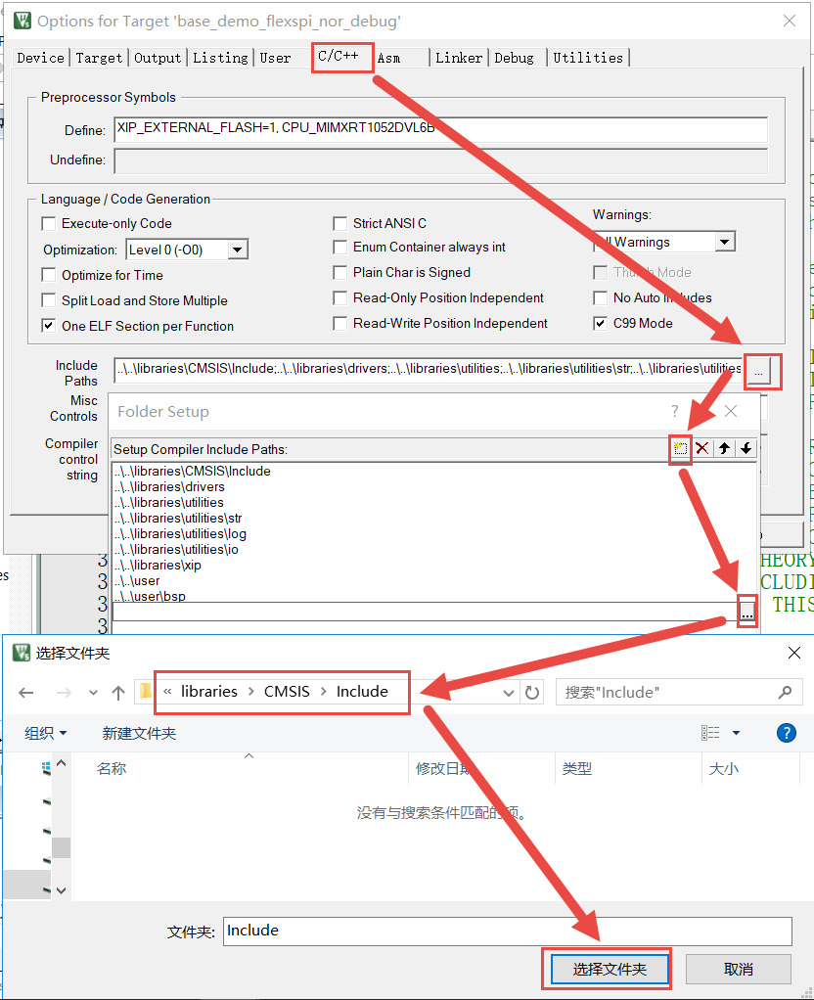

新建工程—库函数版
-----------------

了解RT1052的标准库文件之后，我们就可以使用它来建立工程了，因为用库新建工程的步骤较多，我们一般是使用库建立一个空的工程，作为工程模板。以后直接复制一份工程模板，在它之上进行开发。版本说明：MDK5.23
(MDK即KEIL软件)。版本号可从MDK软件的“Help-->About uVision”选项中查询到。

注意：在自己尝试建立工程模板前请先查看配套的例程“新建工程-固件库版本\1-入门版本”，在该例程的目录下有一个《工程目录文件示意图.txt》文件详细列出了整个例程的目录架构。

新建本地工程文件夹
~~~~~~~~~~~~~~~~~~

为了工程目录更加清晰，我们在本地电脑新建一个“新建工程-固件库版本”文件夹，在它之下再新建4个文件夹，具体见表格
10‑1。

表格 10‑1工程目录文件夹清单

+-----------+------------------------------------------+
| 名称      | 作用                                     |
+===========+==========================================+
| doc       | 用来存放程序说明的文件，由写程序的人添加 |
+-----------+------------------------------------------+
| libraries | 存放的是库文件                           |
+-----------+------------------------------------------+
| project   | 用来存放开发环境相关的工程文件           |
+-----------+------------------------------------------+
| user      | 用户编写的驱动文件                       |
+-----------+------------------------------------------+

图 10‑1 工程文件夹目录

在本地新建好文件夹后，把准备好的库文件添加到相应的文件夹下，即从SDK固件库里面把这些文件拷贝到我们新建的工程下的文件夹里面，具体见表格
10‑2。如果是初学，不会新建则可以参考本书配套的建好的工程模版。

表格 10‑2工程目录文件夹内容清单

+-----------+-----------------------------------------------------------------+
|   名称    |                              作用                               |
+===========+=================================================================+
| doc       | 必读说明.txt。这个文件我们自己手动新建，可要可不要，主要为了方  |
|           | 便以后对本工程编写说明。                                        |
+-----------+-----------------------------------------------------------------+
| libraries | CMSIS文件夹：里面放着跟ARM内核有关的CMSIS标准库文件，           |
|           | 直接从固件库里面拷贝。                                          |
+-----------+-----------------------------------------------------------------+
|           | devices\MIMXRT1052\\                                            |
|           | cmsis_drivers文件夹：                                           |
|           | RT1052兼容CMSIS标准的部分外设库文件，直接从固件库里拷贝         |
|           | 。                                                              |
+-----------+-----------------------------------------------------------------+
|           | devices\MIMXRT1052\\                                            |
|           | drivers文件夹：RT1052外设库文件，直接从固件库里面拷贝           |
|           | 。                                                              |
+-----------+-----------------------------------------------------------------+
|           | devices\MIMXRT1052\\                                            |
|           | utilities文件夹：RT1052的常用调试工具，直接从固件库             |
|           | 里面拷贝。                                                      |
+-----------+-----------------------------------------------------------------+
|           | devices\MIMXRT1052\\                                            |
|           | xip文件夹：使用XIP功能时需要的启动或加载驱动程序，直接从固件    |
|           | 库里面拷贝。                                                    |
+-----------+-----------------------------------------------------------------+
|           | fsl_device_registers.h、MIMXRT1052                              |
|           | .h、MIMXRT1052.xml、MIMXRT1052_feat                             |
|           | ures.h、system_MIMXRT1052.c和system                             |
|           | _MIMXRT1052.h文件：RT1052固件库的全局文件，直接                 |
|           | 从固件库里面拷贝。                                              |
+-----------+-----------------------------------------------------------------+
| project   | gcc文件夹：ARM                                                  |
|           | GCC编译器相关的启动文件及分散加载文件。                         |
+-----------+-----------------------------------------------------------------+
|           | iar文件夹：IAR开发环境相关的启动文件及分散加载文件。            |
+-----------+-----------------------------------------------------------------+
|           | mcuxpresso文件夹：MCUXpresso开发环境相关的启动                  |
|           | 文件及分散加载文件。                                            |
+-----------+-----------------------------------------------------------------+
|           | mdk文件夹：MDK（Keil）开发环境相关的启动文件及分散加载文        |
|           | 件。                                                            |
|           |                                                                 |
|           | (1) 从SDK的boards\evkbimxrt1050\dem                             |
|           | o_apps\hello_world\mdk目录复制如下文件加入到                    |
|           | mdk文件夹：                                                     |
|           |                                                                 |
|           | evkbimxrt1050_flexspi_nor.ini                                   |
|           | 、evkbimxrt1050_ram.ini、evkbimxrt1                             |
|           | 050_sdram_init.ini、evkbimxrt1050\_                             |
|           | sdram_txt_init.ini                                              |
|           |                                                                 |
|           | (1) 新建nor_txt_ram文件夹，在该文件夹下再分别新建空             |
|           | 的Listings及Objects文件夹。                                     |
+-----------+-----------------------------------------------------------------+
| user      | bsp文件夹：用来放置以后编写的驱动文件，手动新建空的文件夹待用。 |
+-----------+-----------------------------------------------------------------+
|           | xip文件夹：用来放置FLASH程序存储器、启动相关的文件。该目录      |
|           | 下的文件是我们根据官方的xip文件进行定制的，它包含以下文件：     |
|           |                                                                 |
|           |                                                                 |
|           | fire_imxrt1052_sdram_ini_dcd.c\h                                |
|           |                                                                 |
|           | fire_imxrt1052_spiflash_config.c\                               |
|           | h                                                               |
|           |                                                                 |
|           | fsl_flexspi_nor_boot.c\h                                        |
|           |                                                                 |
|           | 当你自己尝试新建工程时，请直接从我们的这个例程中直接复制所有xip |
|           | 目录中的内容，这部分与官方的是不一样的。                        |
+-----------+-----------------------------------------------------------------+
|           | board.c\h、clock_config.c\h、periph                             |
|           | erals.c\h及pin_mux.c\h文件：直接从SDK的bo                       |
|           | ards\evkbimxrt1050\project_templa                               |
|           | te目录中拷贝。                                                  |
+-----------+-----------------------------------------------------------------+
|           | main.c文件：main函数文件，这个文件我们自己手动新建，不用        |
|           | 固件库里面配套的。                                              |
+-----------+-----------------------------------------------------------------+

具体也可按照图 10‑2、图 10‑3、图 10‑4和图 10‑7指示的步骤复制工程文件。

图 10‑2复制CMSIS文件夹至工程的libraries目录

图 10‑3 复制固件库主体至工程的libraries目录

图 10‑4复制开发环境相关文件至工程的project目录

图 10‑5复制调试相关的文件至工程的mdk目录

图 10‑6 在mdk目录下创建包含Listings和Objects的nor_txt_ram文件夹

图 10‑7 复制官方demo的project_template文件至工程的user目录

xip目录下的文件比较特殊，是我们根据官方库图 10‑8中的目录文件进行定制的。

图 10‑8 官方库目录下xip中的文件

定制时我们根据开发板中的FLASH存储器芯片进行了修改，得到图
10‑9中的文件，当你自己尝试新建工程时，请直接从我们的这个例程中直接复制所有xip目录中的内容，这部分与官方的是不一样的。

图 10‑9 定制后的xip文件

开始新建工程
~~~~~~~~~~~~

打开KEIL5软件，新建一个工程，具体见图
10‑10。工程名根据喜好命名，我这里取YH-RT1052，YH是野火拼音的缩写，RT1052表示芯片的型号，然后把工程保存在Project\RVMDK（uv5）文件夹下。

.. image:: media/image10.jpeg
   :align: center
   :alt: image10
   :name: 图10_10

图 10‑10 在KEIL5中新建工程

图 10‑11 把MDK的工程文件保存至project\mdk目录下

选择CPU型号
^^^^^^^^^^^

这个根据你开发板使用的CPU具体的型号来选择，野火 i.MX RT1052
系列开发板选MIMXRT1052DVL5B，具体见图
10‑12。如果这里没有出现你想要的CPU型号，或者一个型号都没有，那么肯定是你的KEIL5没有添加RT1052芯片包，KEIL5不像KEIL4那样自带了很多MCU的型号，KEIL5需要自己添加，关于如何添加请参考《如何安装KEIL5》这一章的安装RT1052芯片包小节。

.. image:: media/image12.png
   :align: center
   :alt: image12
   :name: 图10_12

图 10‑12 选择具体的CPU型号

在线添加库文件
^^^^^^^^^^^^^^

在线添加是从ARM的官方网站下载，且其服务器在国外，下载会非常慢，这里我们点击Cancel关闭，具体见图
10‑13，等下我们手动添加库文件。

.. image:: media/image13.png
   :align: center
   :alt: image13
   :name: 图10_13

图 10‑13 库文件管理

添加组文件夹
^^^^^^^^^^^^

在新建的工程中添加7个组文件夹，用来存放各种不同的文件，如何在工程中添加组具体见图
10‑14。文件从本地建好的工程文件夹下获取，双击组文件夹就会出现添加文件的路径，然后选择文件即可，添加时主要是添加C源文件和S汇编文件，H头文件可以不添加，正常编译工程后相应的头文件会自动添加到包含它的C文件“+”号下。

表格 10‑3 工程内组文件夹内容清单

+-----------+------------------------------------------------------------+
| 名称      | 作用                                                       |
+===========+============================================================+
| CMSIS     | 存放system_MIMXRT1052.c文件                                |
+-----------+------------------------------------------------------------+
| startup   | 存放汇编的启动文件：startup_MIMXRT1052.s                   |
+-----------+------------------------------------------------------------+
| drivers   | 与RT1052外设相关的库文件                                   |
|           |                                                            |
|           | fsl_common.c                                               |
|           |                                                            |
|           | fsl_clock.c                                                |
|           |                                                            |
|           | fsl_gpio.c                                                 |
|           |                                                            |
|           | fsl_lpuart.c                                               |
|           |                                                            |
|           | fsl_iomuxc.h                                               |
|           |                                                            |
|           | 以及以后会追加的fsl_xxx.c文件（xxx代表外设名称）           |
+-----------+------------------------------------------------------------+
| utilities | 存放开发调试相关的工具文件                                 |
|           |                                                            |
|           | fsl_assert.c                                               |
|           |                                                            |
|           | fsl_debug_console.c                                        |
|           |                                                            |
|           | fsl_notifier.c                                             |
|           |                                                            |
|           | fsl_sbrk.c                                                 |
|           |                                                            |
|           | fsl_shell.c                                                |
|           |                                                            |
|           | fsl_str.c                                                  |
|           |                                                            |
|           | fsl_log.c                                                  |
|           |                                                            |
|           | fsl_io.c                                                   |
+-----------+------------------------------------------------------------+
| board     | 存放官方的板级配置文件                                     |
|           |                                                            |
|           | board.c                                                    |
|           |                                                            |
|           | clock_config.c                                             |
|           |                                                            |
|           | pin_mux.c                                                  |
+-----------+------------------------------------------------------------+
| user      | 用户编写的文件：                                           |
|           |                                                            |
|           | main.c：main函数文件，暂时为空                             |
+-----------+------------------------------------------------------------+
| xip       | 启动和程序存储器相关的文件：                               |
|           |                                                            |
|           | fire_imxrt1052_sdram_ini_dcd.c                             |
|           |                                                            |
|           | fire_imxrt1052_spiflash_config.c                           |
|           |                                                            |
|           | fsl_flexspi_nor_boot.c                                     |
+-----------+------------------------------------------------------------+
| doc       | 必读说明.txt：程序说明文件，用于说明程序的功能和注意事项等 |
+-----------+------------------------------------------------------------+

图 10‑14 如何在工程中添加文件夹

添加文件
''''''''

先把表格
10‑2提到的文件从SDK中复制到工程模版对应文件夹的目录下，然后在新建的工程中添加这些文件，双击组文件夹就会出现添加文件的路径，然后选择文件即可，具体见图
10‑15。

图 10‑15 如何在工程中添加文件

添加完成后的效果见图 10‑3。

图 10‑16 添加工程文件后的效果

配置魔术棒选项卡
^^^^^^^^^^^^^^^^

这一步的配置工作很重要，很多人串口用不了printf函数，编译有问题，下载有问题，都是这个步骤的配置出了错。

Target选项卡
''''''''''''

在Target选项卡中选中微库“ Use
MicroLIB”，为的是在日后编写串口驱动的时候可以使用printf函数。而且有些应用中如果用了RT1052的浮点运算单元FPU，一定要同时开微库，不然有时会出现各种奇怪的现象。FPU的开关选项在微库配置选项下方的“Use
Double Precision”中，默认是开的。具体设置见图 10‑17。

图 10‑17 添加微库

Output选项卡
''''''''''''

Output中把输出文件夹定位到我们工程目录下的“mdk\nor_txt_ram\Objects”文件夹，这样编译后生成的文件就会被存储到该文件夹中。如果想在编译的过程中生成hex文件，那么那Create
HEX File选项勾上。把“Browse
Information”选项取消勾选，否则编译时间非常长，取消勾选后会无法使用程序的“Go
To
Definition…”的跳转定义浏览功能，需要时可把它勾选上然后重新编译程序，具体设置见图
10‑18。

图 10‑18配置 Output 选项卡

Listing选项卡
'''''''''''''

在Listing选项卡中把输出文件夹定位到我们工程目录下的“mdk\\ nor_txt_ram
\\Listings”文件夹，编译后生成的链接信息文件就会被保存至该目录。具体设置见图
10‑19。

图 10‑19配置 Listing 选项卡

C/C++选项卡
'''''''''''

在C/C++选项卡中添加预定义宏及编译器编译的时候查找的头文件路径。

(1) 在“Define”框中添加预定义宏。固件库的代码中需要一些宏来指定芯片的版本或某些功能特性，此处我们加入如下的宏(在输入时不要加回车，此处添加回车只是方便阅读)：

    CPU_MIMXRT1052DVL5B,

    XIP_EXTERNAL_FLASH=1,

    XIP_BOOT_HEADER_ENABLE =1,

    XIP_BOOT_HEADER_DCD_ENABLE =1,

    PRINTF_FLOAT_ENABLE=1,

    SCANF_FLOAT_ENABLE=1,

    PRINTF_ADVANCED_ENABLE=1,

    SCANF_ADVANCED_ENABLE=1

注意两个宏之间使用英文逗号分隔开，具体见图 10‑20。

图 10‑20 添加预定义宏

    这些宏的作用简要说明如下：

-  宏“CPU_MIMXRT1052DVL5B”，用于指定本程序的CPU，在固件库“fsl_device_registers.h”文件中有根据该宏来决定对应芯片代码的预编译分支。

-  宏XIP_EXTERNAL_FLASH=1, XIP_BOOT_HEADER_ENABLE
   =1,XIP_BOOT_HEADER_DCD_ENABLE
   =1”，用于指示本程序的代码存储在外部的FLASH存储器中，且使用XIP组中的启动配置（XIP组下的各文件包含这些宏的判断分支），在工程中的clock_config.c文件会根据XIP_EXTERNAL_FLASH宏来决定是否开启flexspi外设的时钟。

-  宏“PRINTF_FLOAT_ENABLE=1, SCANF_FLOAT_ENABLE=1,
   PRINTF_ADVANCED_ENABLE=1,
   SCANF_ADVANCED_ENABLE=1”，它们用于配置库函数重新定义的“PRINTF”和“SCANF”函数是否支持浮点数的功能。

(1) 在“Include Paths”处添加头文件路径。在编译的时候，编译器遇到C文件中的“#include”关键字时，都会先在此处指定的路径中查找是否存在该关键字包含的头文件，若没有再在默认路径（Keil的安装路径）查找，找不到的话就提示编译错误，说找不到头文件，一般就是这里配置出了问题。固件库依赖非常多的头文件，所以我们要在此处指定如下路径：

    1 ..\..\libraries\CMSIS\Include

    2 ..\..\libraries\drivers

    3 ..\..\libraries\utilities

    4 ..\..\libraries\utilities\str

    5 ..\..\libraries\utilities\log

    6 ..\..\libraries\utilities\io

    7 ..\..\libraries\xip

    8 ..\..\user

    9 ..\..\user\bsp

**注意：设置时不要直接输入路径的字符，容易出错，应通过文件浏览器添加，具体设置见图 10‑21。**

图 10‑21添加头文件路径

(1) 在“Misc Controls”处添加编译器配置。为了正常编译或减少部分编译警告提示，我们需要在此处增加如下配置，具体见图 10‑22：

--library_interface=armcc --library_type=standardlib
--diag_suppress=66,1296,186

图 10‑22 增加编译器配置

Asm选项卡
'''''''''

类似地，在Asm选项卡中包含有Asm汇编器相应的配置。此处我们在“Define”一栏增加宏“__STARTUP_INITIALIZE_NONCACHEDATA”即可，目前并没有发现该宏的用处，只是参照NXP官方示例添加的，具体见图
10‑23。

图 10‑23Asm的宏配置

Linker配置
''''''''''

Linker选项卡包含对链接器的配置，链接器对C/C++及ASM汇编器生成的*.o目标文件链接得到最终的可执行程序文件。

(1) 在这个Linker选项卡中我们主要设置链接使用的存储器分配文件。KEIL会根据我们的芯片型号设置一个默认的存储器分配文件，但我们要使用的是前面复制到工程目录mdk下的MIMXRT1052xxxxx_flexspi_nor文件，所以需要重新配置，配置方法是在Linker选项框中取消勾选“Use Memory Layout from TargetDialog”选项，然后打开Scaltter File 栏右侧的按钮把MIMXRT1052xxxxx_flexspi_nor添加进去，具体见图 10‑24。

图 10‑24 使用指定的存储器分配文件

(1) 修改存储器分配文件。这个MIMXRT1052xxxxx_flexspi_nor存储器分配文件是适配官方评估版的，针对野火开发板的存储器，需要进行修改，点击选项框中的“Edit”按钮会弹出该文件的内容，然后直接编辑即可，具体见图 10‑25，修改如下：\ **把m_text_size的值修改为0x01FFDC00**\ ；

图 10‑25 修改存储器分配文件（库函数版）

(1) 添加忽略警告提示。在同样的选项框下“disable Warnings”添加对忽略6314类型警告的配置，否则在后面编译时经常会提示分配的部分存储器没有使用的警告，比较烦人，可以忽略，忽略设置具体见图 10‑26。

图 10‑26添加要忽略的6314类型Warning

(1) 添加Misc controls配置。在分散加载文件中部分存储器节区是属于xip组文件的，该组文件中的内容与主体程序无调用关系，所以为了防止被编译器优化而删除，我们需要在Misc controls配置中添加如下保持节区的指令：

--keep=*(.boot_hdr.conf)

--keep=*(.boot_hdr.ivt)

具体见图 10‑27。

图 10‑27添加保留节区的指令

下载器配置
^^^^^^^^^^

在仿真器连接好电脑和开发板且开发板供电正常的情况下，打开编译软件KEIL，在魔术棒选项卡里面选择仿真器的型号，此配置适用于野火配套的DAP下载器，具体过程见《第3章
如何用DAP仿真器下载程序》。

Debug选项配置
'''''''''''''

本教程以DAP下载器为例，所以下载器处选择CMSIS-DAP下载器。还要在“Initialization
File”选择调试初始化文件，此处选择为前面复制至mdk目录的“evkbimxrt1050_flexspi_nor.ini”文件。另外还可在该配置页面勾选“Run
to main”以让调试的时候直接运行到main函数，具体见图 10‑28。

图 10‑28 Debug选择CMSIS-DAP Debugger

Utilities选项配置
'''''''''''''''''

在Utilities选项卡需要选择下载器，我们直接把“Use Debug
Driver”勾选上即可，表示下载器与前面的仿真器一样，具体见图 10‑29。

.. image:: media/image29.png
   :align: center
   :alt: image29
   :name: 图10_29

图 10‑29 Utilities选择 Use Debug Driver

Debug Settings 选项配置
'''''''''''''''''''''''

回到Debug
选项卡，点击其中的“Settings”按钮后会弹出配置框，在弹出的“Debug”页面配置具体见图
10‑30。

.. image:: media/image30.png
   :align: center
   :alt: image30
   :name: 图10_30

图 10‑30 Debug Settings 选项配置

选择目标存储器下载算法
''''''''''''''''''''''

在“Debug Settings”弹出的“FLASH
Download”选项卡中还需要选择目标存储器下载算法，具体要根据板子上使用的FLASH型号来决定。首先要删除默认的存储器，这些是官方评估板的存储器，跟野火
i.MX RT1052
系列开发板使用的存储器类型不同，所以要先把这两个默认的都删除掉，具体见图
10‑31。

图 10‑31 删除原目标存储器

删除默认存储器后，添加野火 i.MX RT1052
系列开发板配套的32MB存储器下载算法“Embedfire_RT1052_QSPI_R1.FLM”，具体见图
10‑32，若在列表框找不到该项目，请参考前面《3.4
放置下载算法》章节补充操作。

.. image:: media/image32.png
   :align: center
   :alt: image32
   :name: 图10_32

图 10‑32 添加野火开发板配套的下载算法（库函数版本）

设置算法空间
''''''''''''

由于本下载算法相比默认的需要更大的空间，所以还需要在配置页面中增大算法空间，具体见图
10‑33。

.. image:: media/image33.png
   :align: center
   :alt: image33
   :name: 图10_33

图 10‑33 设置下载算法空间（库函数版）

添加完成后具体效果见图 10‑34，这里面有个小技巧就是把Reset and
Run也勾选上，这样程序下载完之后就会自动运行，否则需要手动复位。擦除的FLASH大小选择Sectors即可，不要选择Full
Chip，不然下载会比较慢。

图 10‑34 Flash Download页面的说明（库函数版本）

给main文件添加内容
^^^^^^^^^^^^^^^^^^

本工程中的main.c文件是空白的，可以从SDK中的如下目录中拷贝样例程序“hello_world”的hello_world.c文件内容至此进行测试，该文件的目录为：

SDK根目录\boards\evkbimxrt1050\demo_apps\hello_world\hello_world.c

为方便展示及后续使用，我们实际的main文件内容具体见代码清单 10‑1。

.. code-block:: c
   :name: 代码清单 10‑1 main.c文件的内容
   :caption: 代码清单 10‑1 main.c文件的内容
   :linenos:

   /**
   ******************************************************************
   * @file    main.c
   * @author  fire
   * @version V1.0
   * @date    2018-xx-xx
   * @brief   用V2.3.1版本库建的工程模板
   ******************************************************************
   * @attention
   *
   * 实验平台:野火  i.MXRT1052开发板
   * 论坛    :http://www.firebbs.cn
   * 淘宝    :http://firestm32.taobao.com
   *
   ******************************************************************
   */
   #include "fsl_debug_console.h"

   #include "board.h"
   #include "pin_mux.h"
   #include "clock_config.h"

   /**
   * @brief  主函数
   * @param  无
   * @retval 无
   */
   int main(void)
   {
      /* 初始化内存保护单元 */
      BOARD_ConfigMPU();
      /* 初始化开发板引脚 */
      BOARD_InitPins();
      /* 初始化开发板时钟 */
      BOARD_BootClockRUN();
      /* 初始化调试串口 */
      BOARD_InitDebugConsole();
      /* 打印系统时钟 */
      PRINTF("\r\n");
      PRINTF("*****欢迎使用 野火i.MX RT1052 开发板*****\r\n");
      PRINTF("CPU:             %d Hz\r\n", CLOCK_GetFreq(kCLOCK_CpuClk));
      PRINTF("AHB:             %d Hz\r\n", CLOCK_GetFreq(kCLOCK_AhbClk));
      PRINTF("SEMC:            %d Hz\r\n", CLOCK_GetFreq(kCLOCK_SemcClk));
      PRINTF("SYSPLL:          %d Hz\r\n", CLOCK_GetFreq(kCLOCK_SysPllClk));
      PRINTF("SYSPLLPFD0:      %d Hz\r\n", CLOCK_GetFreq(kCLOCK_SysPllPfd0Clk));
      PRINTF("SYSPLLPFD1:      %d Hz\r\n", CLOCK_GetFreq(kCLOCK_SysPllPfd1Clk));
      PRINTF("SYSPLLPFD2:      %d Hz\r\n", CLOCK_GetFreq(kCLOCK_SysPllPfd2Clk));
      PRINTF("SYSPLLPFD3:      %d Hz\r\n", CLOCK_GetFreq(kCLOCK_SysPllPfd3Clk));
      /* 在这里添加你的代码^_^. */
      while (1) {
      }
   } 

关于这些代码的具体作用，我们留到后面《第11章
GPIO输出—使用固件库点亮LED》中统一说明。

下载程序
~~~~~~~~

如果前面步骤都成功了，接下来就可以把编译好的程序下载到开发板上运行。下载程序不需要其他额外的软件，直接点击KEIL中的LOAD按钮即可，具体见图
10‑35。下载程序的时候需要用仿真器连接电脑和开发板且开发板要供电。

图 10‑35下载程序

程序下载后，Build Output选项卡如果打印出 Application
running…则表示程序下载成功。使用串口线连接开发板与电脑，使用串口调试助手可接收到开发板打印到串口的输出。如果没有出现实验现象，按复位键试试。

至此，一个基于固件库编程的新的工程模版建立完毕。

各种版本的工程模版
~~~~~~~~~~~~~~~~~~

根据前面的操作，我们已经建立了一个可用的工程模版，但我们可以更进一步，提供多种版本的配置。例如前面的工程是把程序下载到FLASH存储器并执行的，但如果程序比较大，此时把代码存储到FLASH中，擦写需要非常长的时间，我们就希望在调试阶段能把程序下载到写入速度非常快的SDRAM存储器中并执行调试，这样能节省大量的调试时间，但是SDRAM掉电后不能保存程序，所以开发完毕后我们还要切换回FLASH版本，把代码下载到FLASH，以便下次上电程序还能正常工作。

为适应不同的应用场景，我们建立了工程“新建工程-固件库版本\2-进阶版本”，相对来说它更加实用且功能丰富，因而在后续章节中我们一般都以它为模版。不过，该工程建立的过程和原理涉及众多的知识，所以我们不推荐大家亲自创建该工程，只要了解它提供的特性以便在不同场合下使用即可。

RT1052系统包含的存储器
^^^^^^^^^^^^^^^^^^^^^^

要了解该工程，首先要了解本系统中主要使用的存储器，在本开发板中主要板使用板载的SPI-NorFlash存储器保存代码，以板载的SDRAM作为大内存，而在RT1052芯片中包含有ITCM、DTCM以及OCRAM存储器，这些存储器的特性具体见表格
10‑4。

表格 10‑4 本系统主要使用的存储器特性

+-------------+-----------+--------------+-------------+------------------------+
|   存储器    |   容量    | 访问速度排名 |  访问方式   |          特性          |
+=============+===========+==============+=============+========================+
| SPI-NorFlas | 标配32MB  | 5            | FlexSPI外设 | FLASH，板载外部存      |
| h           |           |              |             | 储器                   |
+-------------+-----------+--------------+-------------+------------------------+
| SDRAM       | 标配32MB  | 4            | SEMC外设    | DRAM，板载外部存储     |
|             |           |              |             | 器                     |
+-------------+-----------+--------------+-------------+------------------------+
| ITCM        | 默认128KB | 1            | 64位总线    | SRAM，RT1052           |
|             |           |              |             | 芯片内部的“指令紧耦合  |
|             |           |              |             | 缓存”，只可用于缓存指  |
|             |           |              |             | 令（代码）             |
+-------------+-----------+--------------+-------------+------------------------+
| DTCM        | 默认128KB | 2            | 双32位总线  | SRAM，RT1052           |
|             |           |              |             | 芯片内部的“数据紧耦合  |
|             |           |              |             | 缓存”，只可用于缓存数  |
|             |           |              |             | 据                     |
+-------------+-----------+--------------+-------------+------------------------+
| OCRAM       | 默认256KB | 3            | 32位总线    | SRAM，RT1052           |
|             |           |              |             | 芯片内部的通用缓存，使 |
|             |           |              |             | 用                     |
|             |           |              |             | 32位总线访问，         |
+-------------+-----------+--------------+-------------+------------------------+

通过该表可以了解到这些存储器中只有SPI-NorFlash是ROM类型的，即只有它在掉电的情况下能正常保存内容，其它都是RAM类型的，其保存的内容在掉电时会丢失；又由于存储器类型或访问方式的区别，内核访问它们的速度有快有慢，而且它们的容量也不同。

代码存储的位置与执行的位置
^^^^^^^^^^^^^^^^^^^^^^^^^^

根据不同的应用场景，我们会根据存储器的特性调整代码的存储位置和执行位置。

代码存储在FLASH中并执行
'''''''''''''''''''''''

RT1052系统比较常见的运行方式具体见图
10‑36，在这种方式下代码保存在SPI-NorFlash中，内核通过FlexSPI外设从SPI-NorFlash中加载代码并执行，而DTCM、OCRAM、SDRAM存储器则用于存储C语言的堆栈、以及显存等内容，即内核从这些位置加载运行的数据。

图 10‑36 从FLASH中加载代码并执行

由于SPI-NorFlash掉电后能正常保存内容，所以在下一次上电后，系统仍然能正常执行NorFlash中保存的程序，所以在发布应用的时候通常采用把代码保存到NorFlash的这种方式。

代码存储在RAM中并执行
'''''''''''''''''''''

由于NorFlash的擦写速度非常慢，对于经常需要更新代码调试的开发阶段我们通常把代码保存到RAM类型的存储器中，即系统内的ITCM、OCRAM或SDRAM，具体运行方式见图
10‑37。

图 10‑37 从RAM中加载代码并执行

根据不同的需求，我们可能会把代码放在ITCM中以获得极高的运行速度，放在SDRAM中以存储更大容量的代码，而OCRAM优缺点并不明显，在实际应用中我们通常只用它缓存数据，上图用它存储并执行代码只是描述了一种可能性。对于OCRAM和SDRAM存储器，它们既支持存储代码也支持存储数据，而ITCM只支持存储代码，DTCM只支持存储数据。

无论代码是存储在ITCM、OCRAM或SDRAM，它们相对于NorFlash的写入速度都快得多，但由于掉电后代码会丢失，所以这种运行方式通常只用于开发阶段进行调试。

代码存储在FLASH，在RAM中执行
''''''''''''''''''''''''''''

为了综合FLASH和RAM存储器的优点，该系统对代码的存储和执行还有更复杂的处理方式，具体见图
10‑38。

图 10‑38 代码存储在FLASH，在RAM中执行

使用这种方式时，系统平时把代码存储在NorFlash，这能保证掉电后也能正常存储，在上电后把代码从NorFlash复制到ITCM、OCRAM或SDRAM中，在正式运行时，内核直接从这些RAM内加载代码并执行，由于内核对RAM的访问速度更快，所以这能提高代码的执行速度，尤其是与内核联系紧密、使用64位线宽的ITCM，它是专门设计需要高速执行代码的。

不同工程版本及其特性
^^^^^^^^^^^^^^^^^^^^

本教程提供的进阶版工程模版，它包含了把代码存储和执行位置放在不同区域的工程，工程的具体特性见表格
10‑5。

表格 10‑5 各个版本的不同特性

+----------------------+--------------+--------------+-----------+--------------+
| 工程名               | 代码存储位置 | 代码执行位置 | C堆栈位置 | 掉电保存代码 |
+======================+==============+==============+===========+==============+
| itcm_txt_ram_debug   | ITCM         | ITCM         | DTCM      | 不支持       |
+----------------------+--------------+--------------+-----------+--------------+
| itcm_txt_sdram_debug | ITCM         | ITCM         | SDRAM     | 不支持       |
+----------------------+--------------+--------------+-----------+--------------+
| sdram_txt_ram_debug  | SDRAM        | SDRAM        | DTCM      | 不支持       |
+----------------------+--------------+--------------+-----------+--------------+
| nor_txt_ram          | NorFlash     | NorFlash     | DTCM      | 支持         |
+----------------------+--------------+--------------+-----------+--------------+
| nor_txt_sdram        | NorFlash     | NorFlash     | SDRAM     | 支持         |
+----------------------+--------------+--------------+-----------+--------------+
| nor_itcm_txt_ram     | NorFlash     | ITCM         | DTCM      | 支持         |
+----------------------+--------------+--------------+-----------+--------------+
| nor_sdram_txt_sdram  | NorFlash     | SDRAM        | SDRAM     | 支持         |
+----------------------+--------------+--------------+-----------+--------------+

以上工程名使用“txt”来分隔，命名的格式如下：

[代码存储位置]_[代码执行位置]_txt_[C堆栈位置]_[debug]

其中“代码执行位置”若省略表示执行位置与代码存储位置相同，带“debug”字符的表示该工程仅用于调试模式，掉电后代码会丢失。

在本教程前面建立的工程模版，就属于
“nor_txt_ram”类型的工程，它的代码存储位置和执行位置都是核心板上的SPI-NorFlash，而C语言的堆栈位置则为DTCM。

工程版本较多，应用时根据存储器的特性来选择即可。如代码存储在ITCM、SDRAM的程序烧录速度快，适用于调试，而代码存储在NorFlash能掉电保存代码，适用于发布应用；代码执行位置在ITCM的运行速度极快，在SDRAM的也不错，而且空间相对ITCM来说大得多，而执行位置在NorFlash的则最慢；类似地，C语言的堆栈位置在DTCM的访问速度极快，而使用SDRAM则空间大。

当要追求极致速度时，会把代码放在ITCM执行，数据放在DTCM，由于ARM内核采用的是哈佛结构，即指令总线和数据总线是独立的，且访问ITCM的总线宽度为64位，访问DTCM的总线宽度为“双32位”，这样的配置方式能使系统运行达到最高的速度。

本工程模版中的代码都是大粒度的配置，整个代码都是全部统一存储在某个存储器或统一在某个存储器中执行代码，在实际的应用中会更精细地进行存储器分配，如同一个工程中，它的大部分代码或数据仍然使用NorFlash或SDRAM等大容量的存储器，而有高速需求的代码或数据另外存放至ITCM和DTCM，关于这些内容需要掌握如何配置“分散加载文件”，在本工程模版的基础上作进一步配置。

增加不同工程版本方法
^^^^^^^^^^^^^^^^^^^^

下面说明一下使用Keil创建以上不同工程版本的流程：

(1) 使用前面建立的工程模版为基础，即在
    “新建工程—固件库版本>入门版本”工程的基础上，点击“File
    Extensions”按钮，在弹出的项目管理界面下把原工程名“Target1”改为“nor_txt_ram”以便区分，具体见图
    10‑39。

图 10‑39 在项目管理界面修改工程名

(1) 点击“Project Targets”栏的“New”按钮，然后创建其它3版本的工程，具体见图 10‑40。

..

图 10‑40 创建其它版本的工程

    创建完成后的效果见图 10‑41。

图 10‑41 创建其它版本工程后的效果

各个版本工程的配置差异
^^^^^^^^^^^^^^^^^^^^^^

各个版本工程的关系
''''''''''''''''''

当项目中存在多个版本的工程时，可以通过Load按钮旁边的下拉框选择进行切换，具体见图
10‑42。不同版本的工程共用相同的文件，即共用源代码，只是配置不同，例如魔术棒处定制的各项配置在不同的版本间是独立的，修改当前的配置不会影响其它版本。

图 10‑42 切换不同版本的工程

根据版本定制不同的配置
''''''''''''''''''''''

按照前面步骤操作得到的各个版本工程相当于是对“nor_txt_ram”版本的复制版，即到目前为止各个版本都是完全一样的。下面对各个版本的差异进行讲解，除以下提到的差异外，工程的其它内容完全一致，在实际操作时请注意切换版本后进行配置。

-  Output及Listing输出路径的差异

不同版本的工程编译后有不同的输出，为进行区分，我们在“mdk”目录创建与工程名相同的文件夹用于存放Output及Listing的输出，在各个工程中选择输各文件夹中对应的Objects及Listings文件夹内即可，如图
10‑43所示。

图 10‑43 各个工程选择对应的输出文件夹

-  Linker选项配置的差异

在Linker选项配置中使用的存储器分配文件（分散加载文件）是不一样的，这些文件是我们根据NXP官方库文件的例子修改而来的，并且对这些文件重命名以示区别，我们已把这些文件保存在“mdk”目录下，不同的工程版本使用的分散加载文件具体见表格
10‑6和图 10‑44。关于这个文件的应用，以后的教程再详细讲解。

表格 10‑6 各工程版本Linker选项配置中使用分散加载文件

+----------------------+--------------------------------------+
| 工程版本             | 存储器分配文件                       |
+======================+======================================+
| itcm_txt_ram_debug   | MIMXRT1052xxxxx_itcm_txt_ram.scf     |
+----------------------+--------------------------------------+
| itcm_txt_sdram_debug | MIMXRT1052xxxxx_itcm_txt_sdram.scf   |
+----------------------+--------------------------------------+
| sdram_txt_ram_debug  | MIMXRT1052xxxxx_nor_itcm_txt_ram.scf |
+----------------------+--------------------------------------+
| nor_txt_ram          | MIMXRT1052xxxxx_nor_txt_ram.scf      |
+----------------------+--------------------------------------+
| nor_txt_sdram        | MIMXRT1052xxxxx_nor_txt_sdram.scf    |
+----------------------+--------------------------------------+
| nor_itcm_txt_ram     | MIMXRT1052xxxxx_nor_itcm_txt_ram.scf |
+----------------------+--------------------------------------+
| nor_sdram_txt_sdram  | MIMXRT1052xxxxx_sdram_txt_ram.scf    |
+----------------------+--------------------------------------+

图 10‑44 各工程中Linker选项配置的差异

-  C/C++选项配置的差异

..

    在C/C++选项配置中的部分宏和代码优化等级是不一样的，具体见表格
    10‑7和图
    10‑45。其中代码优化等级通常根据自身的需要调整，此处不表。由于所有版本中关于PRINTF和SCANF函数的宏配置是一样的，表格中不列出。

表格 10‑7 各工程版本C/C++选项配置的差异

+----------------------+--------------------------------+
| 工程版本             | 宏定义                         |
+======================+================================+
| itcm_txt_ram_debug   | CPU_MIMXRT1052DVL5B,           |
+----------------------+--------------------------------+
| itcm_txt_sdram_debug | CPU_MIMXRT1052DVL5B,           |
|                      |                                |
|                      | SKIP_SYSCLK_INIT,              |
+----------------------+--------------------------------+
| sdram_txt_ram_debug  | CPU_MIMXRT1052DVL5B,           |
|                      |                                |
|                      | SKIP_SYSCLK_INIT,              |
+----------------------+--------------------------------+
| nor_txt_ram          | CPU_MIMXRT1052DVL5B,           |
|                      |                                |
|                      | XIP_EXTERNAL_FLASH=1,          |
|                      |                                |
|                      | XIP_BOOT_HEADER_ENABLE =1,     |
|                      |                                |
|                      | XIP_BOOT_HEADER_DCD_ENABLE =1, |
+----------------------+--------------------------------+
| nor_txt_sdram        | CPU_MIMXRT1052DVL5B,           |
|                      |                                |
|                      | XIP_EXTERNAL_FLASH=1,          |
|                      |                                |
|                      | XIP_BOOT_HEADER_ENABLE =1,     |
|                      |                                |
|                      | XIP_BOOT_HEADER_DCD_ENABLE =1, |
+----------------------+--------------------------------+
| nor_itcm_txt_ram     | CPU_MIMXRT1052DVL5B,           |
|                      |                                |
|                      | XIP_EXTERNAL_FLASH=1,          |
|                      |                                |
|                      | XIP_BOOT_HEADER_ENABLE =1,     |
|                      |                                |
|                      | XIP_BOOT_HEADER_DCD_ENABLE =1, |
|                      |                                |
|                      |     USE_RAM_VECTOR_TABLE       |
+----------------------+--------------------------------+
| nor_sdram_txt_sdram  | CPU_MIMXRT1052DVL5B,           |
|                      |                                |
|                      | XIP_EXTERNAL_FLASH=1,          |
|                      |                                |
|                      | XIP_BOOT_HEADER_ENABLE =1,     |
|                      |                                |
|                      | XIP_BOOT_HEADER_DCD_ENABLE =1, |
|                      |                                |
|                      |     USE_RAM_VECTOR_TABLE       |
+----------------------+--------------------------------+

图 10‑45 各工程中C/C++选项配置的差异

-  Debug选项配置的差异

在Debug选项配置中使用的调试器初始化文件是不一样的，具体见表格 10‑8和图
10‑46。

表格 10‑8 各工程版本Debug选项配置的差异

+----------------------+----------------------------------+
| 工程版本             | 调节器初始化文件                 |
+======================+==================================+
| itcm_txt_ram_debug   | evkbimxrt1050_ram.ini            |
+----------------------+----------------------------------+
| itcm_txt_sdram_debug | evkbimxrt1050_sdram_init.ini     |
+----------------------+----------------------------------+
| sdram_txt_ram_debug  | evkbimxrt1050_sdram_txt_init.ini |
+----------------------+----------------------------------+
| nor_txt_ram          | evkbimxrt1050_flexspi_nor.ini    |
+----------------------+----------------------------------+
| nor_txt_sdram        | evkbimxrt1050_flexspi_nor.ini    |
+----------------------+----------------------------------+
| nor_itcm_txt_ram     | evkbimxrt1050_flexspi_nor.ini    |
+----------------------+----------------------------------+
| nor_sdram_txt_sdram  | evkbimxrt1050_flexspi_nor.ini    |
+----------------------+----------------------------------+

图 10‑46 各工程中Debug选项配置的差异

-  Utilities选项配置的差异

在Utilities选项配置中使用的Update Target before
Debugging配置是不同的，对于“debug”版本的工程，勾选后点击调试按钮会提示错误，而对于NorFlash的版本，若不勾选，在调试时会存在不更新代码的情况，导致错误。具体见表格
10‑9和图 10‑47。

表格 10‑9 各工程版本Utilities选项配置的差异

+----------------------+------------------------------------+
| 工程版本             | Update Target before Debugging配置 |
+======================+====================================+
| itcm_txt_ram_debug   | 不勾选                             |
+----------------------+------------------------------------+
| itcm_txt_sdram_debug | 不勾选                             |
+----------------------+------------------------------------+
| sdram_txt_ram_debug  | 不勾选                             |
+----------------------+------------------------------------+
| nor_txt_ram          | 勾选                               |
+----------------------+------------------------------------+
| nor_txt_sdram        | 勾选                               |
+----------------------+------------------------------------+
| nor_itcm_txt_ram     | 勾选                               |
+----------------------+------------------------------------+
| nor_sdram_txt_sdram  | 勾选                               |
+----------------------+------------------------------------+

图 10‑47各工程 Utilities选项 配置的差异

使用RAM及SDRAM版本的注意事项
^^^^^^^^^^^^^^^^^^^^^^^^^^^^

由于“debug”版本的工程仅用于调试且并没有定制下载的相关配置，所以要使用时不能像NorFlash版本的工程那样直接点击Load按钮下载程序到开发板运行，而只能点击Debug按钮进入调试模式进行仿真，具体见图
10‑48及图 10‑49。

图 10‑48 RAM及SDRAM版本不支持Load方式下载运行

.. image:: media/image49.png
   :align: center
   :alt: image49
   :name: 图10_49

图 10‑49 使用Deubg模式运行程序进行调试
