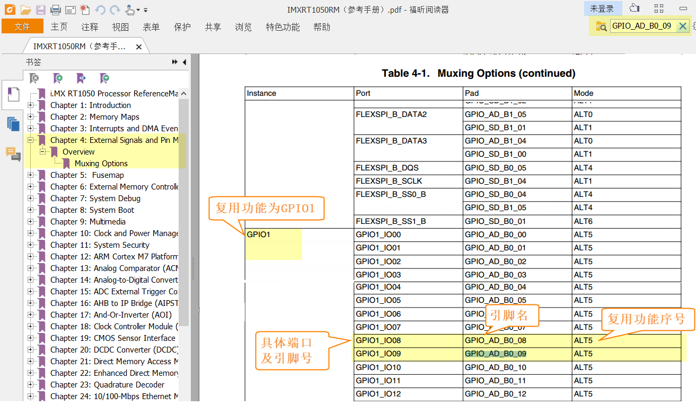

GPIO输出—使用固件库点亮LED
--------------------------

利用固件库建立好的工程模板，就可以方便地使用RT1052标准库编写应用程序了，可以说从这一章我们才开始迈入RT1052开发的大门。LED灯的控制使用到GPIO外设的基本输出功能，本章中不再赘述GPIO外设的概念和功能框图的讲解，而是重点讲解如果用固件库编程。

硬件设计
~~~~~~~~

在实际的开发中，我们必须要了解硬件连接才能正确地控制外部器件，由于RT1052引脚的功能众多，在原理图中标示的简单引脚标号常常不能直观地让我们获知有用的信息，下面以RGB灯信号连接的查询过程为例，在以后的开发中可以使用同样的方式查询。

RGB LED灯实物
^^^^^^^^^^^^^

在寄存器版本的工程我们已经尝试点亮核心板上的小LED灯，在本章节中我们进一步控制底板上的RGB
LED灯，具体见图
11‑1，RGB灯头内部包含R灯（红灯）、G灯（绿灯）和B灯（蓝灯），它们都可以单独控制，如果有两个或者三个灯同时亮的话就会混合成其它的颜色。

图 11‑1 LED灯实物说明

查看底板原理图
^^^^^^^^^^^^^^

了解RGB灯的实物后，可打开相应的原理图文档来查看硬件连接，即《野火i.MX
RT1052-Mini底板原理图》，具体见图 11‑2。

图 11‑2 RGB灯电路连接图，摘自《野火i.MX RT1052-Mini底板原理图》

这些LED灯的阴极都是连接到RT1052的GPIO引脚，只要我们控制GPIO引脚的电平输出状态，即可控制LED灯的亮灭。若你使用的实验板LED灯的连接方式或引脚不一样，只需根据我们的工程修改引脚即可，程序的控制原理相同。

从原理图可看到RGB灯的三个阴极R、G、B连接分别连接至标号GPIO_AD_B1_08、SAI1_MCLK、JTAG_TDO，这些标号实际上与配套核心板上RT1052芯片的引脚相连。其中的GPIO_AD_B1_08是RT1052芯片具体的引脚名，而SAI1_MCLK、JTAG_TDO则是某两个引脚的复用功能，由于引脚功能众多，绘制原理图时不可避免地无法完全表示引脚信息的所有信息。而无论是具体的引脚名还是复用功能，我们都无法直接得知这些具体是RT1052芯片的哪个GPIO端口哪个编号的引脚。如前面控制核心板LED灯时，我们知道这个引脚是GPIO1_IO09，这样我们才能编写程序进行控制。因此我们需要查阅相关文档。

由于还不清楚标号SAI1_MCLK、JTAG_TDO的具体引脚名，我们首先要在核心板原理图中查看它与RT1052芯片的关系。

查看核心板原理图
^^^^^^^^^^^^^^^^

打开《野火i.MX
RT1052-Mini核心板原理图》，在PDF阅读器的搜索框输入前面的SAI1_MCLK、JTAG_TDO标号，找到它们在RT1052芯片中的标号说明，具体见图
11‑3。

图 11‑3 核心板上RT1052的信号连接，摘自《野火i.MX
RT1052-Mini核心板原理图》

通过这样的方式，我们查找到了SAI1_MCLK信号的具体引脚名为GPIO_AD_B1_09，JTAG_TDO信号的具体引脚名为GPIO_AD_B0_10，再加上R灯的GPIO_AD_B1_08以及核心板LED灯的JTAG_TDI信号具体引脚名为GPIO_AD_B0_09的信号，得到这些具体的引脚名后，我们就可以进一步在《IMXRT1050RM》（参考手册）中查询引脚的功能信息了。

根据引脚名查询功能信息
^^^^^^^^^^^^^^^^^^^^^^

打开《IMXRT1050RM》（参考手册），在《Chapter 4 External Signals and Pin
Multiplexing》章节的范围内依次搜索以上具体的引脚名，可以查询得到它们用作GPIO功能时具体的端口和引脚号，具体见图
11‑4。在以后的开发中，查阅的可能就是引脚对应的“UART”串口号或“I2C”等外设编号了。

图 11‑4在参考手册根据引脚号查找其复用功能

经查阅，我们把以上连接LED灯的各个RT1052芯片引脚总结出表格
11‑1，它展示了各个LED灯的连接信息及相应引脚的GPIO端口和引脚号。

表格 11‑1 与LED灯连接的各个引脚信息及GPIO复用编号

+-------------+---------------+---------------+--------------------+
| LED灯       | 原理图的标号  | 具体引脚名    | GPIO端口及引脚编号 |
+=============+===============+===============+====================+
| R灯         | GPIO_AD_B1_08 | GPIO_AD_B1_08 | GPIO1_IO24         |
+-------------+---------------+---------------+--------------------+
| G灯         | SAI1_MCLK     | GPIO_AD_B1_09 | GPIO1_IO25         |
+-------------+---------------+---------------+--------------------+
| B灯         | JTAG_TDO      | GPIO_AD_B0_10 | GPIO1_IO10         |
+-------------+---------------+---------------+--------------------+
| 核心板LED灯 | JTAG_TDI      | GPIO_AD_B0_09 | GPIO1_IO09         |
+-------------+---------------+---------------+--------------------+

软件设计
~~~~~~~~

这里只讲解核心部分的代码，有些变量的设置，头文件的包含等可能不会涉及到，完整的代码请参考本章配套的工程。

为了使工程更加有条理，我们把LED灯控制相关的代码独立分开存储，方便以后移植。在“工程模板”之上新建“bsp_led.c”及“bsp_led.h”文件，其中的“bsp”即Board
Support
Packet的缩写(板级支持包)，这些文件也可根据您的喜好命名，这些文件不属于RT1052标准库的内容，是由我们自己根据应用需要编写的。

编程要点
^^^^^^^^

1. 根据引脚号定义GPIO控制相关的宏；

2. 使用IOMUXC外设配置MUX及PAD；

3. 使用GPIO外设配置引脚方向及中断模式；

4. 编写简单测试程序，控制GPIO引脚输出高、低电平。

代码分析
^^^^^^^^

LED灯引脚宏定义
'''''''''''''''

在编写应用程序的过程中，要考虑更改硬件环境的情况，例如LED灯的控制引脚与当前的不一样，我们希望程序只需要做最小的修改即可在新的环境正常运行。这个时候一般把硬件相关的部分使用宏来封装，若更改了硬件环境，只修改这些硬件相关的宏即可，这些定义一般存储在头文件，即本例子中的“bsp_led.h”文件中，具体见代码清单
11‑1。

.. code-block:: c
   :name: 代码清单 11‑1 LED控制引脚相关的宏（bsp_led.h文件）
   :caption: 代码清单 11‑1 LED控制引脚相关的宏（bsp_led.h文件）
   :linenos:

   #include "fsl_common.h"
   
   /*********************************************************
   * LED GPIO端口、引脚号及IOMUXC复用宏定义
   *********************************************************/
   #define CORE_BOARD_LED_GPIO             GPIO1
   #define CORE_BOARD_LED_GPIO_PIN         (9U)
   #define CORE_BOARD_LED_IOMUXC           IOMUXC_GPIO_AD_B0_09_GPIO1_IO09
   
   #define RGB_RED_LED_GPIO                GPIO1
   #define RGB_RED_LED_GPIO_PIN            (24U)
   #define RGB_RED_LED_IOMUXC              IOMUXC_GPIO_AD_B1_08_GPIO1_IO24
   
   #define RGB_GREEN_LED_GPIO              GPIO1
   #define RGB_GREEN_LED_GPIO_PIN          (25U)
   #define RGB_GREEN_LED_IOMUXC            IOMUXC_GPIO_AD_B1_09_GPIO1_IO25
   
   #define RGB_BLUE_LED_GPIO               GPIO1
   #define RGB_BLUE_LED_GPIO_PIN           (10U)
   #define RGB_BLUE_LED_IOMUXC             IOMUXC_GPIO_AD_B0_10_GPIO1_IO10

以上代码分别把控制四盏LED灯的GPIO端口、GPIO引脚号以及IOMUXC的复用功能根据硬件连接使用宏定义封装起来了。在实际控制的时候我们就直接用这些宏，以达到应用代码跟硬件无关的效果。

这部分的内容与《第8章
自己写库—构建库函数雏形》中的代码类似，不过，对于其中的“GPIO1”、“IOMUXC_GPIO_AD_B0_09_GPIO1_IO09”这样的宏，我们不再需要自己定义了，因为这些定义在库文件MIMXRT1052.h中都已经提供，本代码通过fsl_common.h包含MIMXRT1052.h文件。

控制LED灯亮灭状态的宏定义
'''''''''''''''''''''''''

为了方便控制LED灯，我们把LED灯常用的亮、灭及状态反转的控制也直接定义成宏，具体见代码清单
11‑2。

.. code-block:: c
   :name: 代码清单 11‑2 控制LED亮灭的宏(bsp_led.h文件)
   :caption: 代码清单 11‑2 控制LED亮灭的宏(bsp_led.h文件)
   :linenos:

   /************************第1部分****************************/
   /** 控制LED灯亮灭的宏，
   * LED低电平亮，设置ON=0，OFF=1
   * 若LED高电平亮，把宏设置成ON=1 ，OFF=0 即可
   */
   #define ON  1
   #define OFF 0

   /* 使用标准的固件库控制IO
      使用范例：CORE_BOARD_LED(ON); */
   #define   CORE_BOARD_LED(a) if (a)  \
         GPIO_PinWrite(CORE_BOARD_LED_GPIO, CORE_BOARD_LED_GPIO_PIN, 0U);\
            else    \
            GPIO_PinWrite(CORE_BOARD_LED_GPIO, CORE_BOARD_LED_GPIO_PIN, 1U);
   
   #define   RGB_RED_LED(a)  if (a)  \
            GPIO_PinWrite(RGB_RED_LED_GPIO, RGB_RED_LED_GPIO_PIN, 0U);\
            else    \
            GPIO_PinWrite(RGB_RED_LED_GPIO, RGB_RED_LED_GPIO_PIN, 1U);
   
   #define   RGB_GREEN_LED(a)  if (a)  \
      GPIO_PinWrite(RGB_RGB_GREEN_LED_GPIO, RGB_RGB_GREEN_LED_GPIO_PIN, 0U);\
            else    \
            GPIO_PinWrite(RGB_GREEN_LED_GPIO, RGB_GREEN_LED_GPIO_PIN, 1U);
   
   #define   RGB_BLUE_LED(a) if (a)  \
            GPIO_PinWrite(RGB_BLUE_LED_GPIO, RGB_BLUE_LED_GPIO_PIN, 0U);\
            else    \
            GPIO_PinWrite(RGB_BLUE_LED_GPIO, RGB_BLUE_LED_GPIO_PIN, 1U);
   
   /************************第2部分****************************/
   /* 直接操作寄存器的方法控制IO */
   #define digitalHi(p,i)      {p->DR |= (1U << i);}   //输出为高电平    
   #define digitalLo(p,i)      {p->DR &= ~(1U << i);}  //输出低电平
   #define digitalToggle(p,i)  {p->DR ^= (1U<<i);}     //输出反转状态
   
   /* 定义控制IO的宏 */
   #define CORE_BOARD_LED_TOGGLE   digitalToggle(CORE_BOARD_LED_GPIO,CORE_BOARD_LED_GPIO_PIN)
   #define CORE_BOARD_LED_OFF          digitalHi(CORE_BOARD_LED_GPIO,CORE_BOARD_LED_GPIO_PIN)
   #define CORE_BOARD_LED_ON           digitalLo(CORE_BOARD_LED_GPIO,CORE_BOARD_LED_GPIO_PIN)

   #define RGB_RED_LED_TOGGLE          digitalToggle(RGB_RED_LED_GPIO,RGB_RED_LED_GPIO_PIN)
   #define RGB_RED_LED_OFF             digitalHi(RGB_RED_LED_GPIO,RGB_RED_LED_GPIO_PIN)
   #define RGB_RED_LED_ON              digitalLo(RGB_RED_LED_GPIO,RGB_RED_LED_GPIO_PIN)

   #define RGB_GREEN_LED_TOGGLE    digitalToggle(RGB_GREEN_LED_GPIO,RGB_GREEN_LED_GPIO_PIN)
   #define RGB_GREEN_LED_OFF           digitalHi(RGB_GREEN_LED_GPIO,RGB_GREEN_LED_GPIO_PIN)
   #define RGB_GREEN_LED_ON            digitalLo(RGB_GREEN_LED_GPIO,RGB_GREEN_LED_GPIO_PIN)

   #define RGB_BLUE_LED_TOGGLE         digitalToggle(RGB_BLUE_LED_GPIO,RGB_BLUE_LED_GPIO_PIN)
   #define RGB_BLUE_LED_OFF            digitalHi(RGB_BLUE_LED_GPIO,RGB_BLUE_LED_GPIO_PIN)
   #define RGB_BLUE_LED_ON             digitalLo(RGB_BLUE_LED_GPIO,RGB_BLUE_LED_GPIO_PIN)
   
   /************************第3部分****************************/
   
   /* 基本混色，后面高级用法使用PWM可混出全彩颜色,且效果更好 */
   //黄(红+绿)
   #define RGB_LED_COLOR_YELLOW  \
            RGB_RED_LED_ON;\
            RGB_GREEN_LED_ON;\
            RGB_BLUE_LED_OFF
   
   //紫(红+蓝)
   #define RGB_LED_COLOR_PURPLE  \
            RGB_RED_LED_ON;\
            RGB_GREEN_LED_OFF;\
            RGB_BLUE_LED_ON
   
   //青(绿+蓝)
   #define RGB_LED_COLOR_CYAN \
            RGB_RED_LED_OFF;\
            RGB_GREEN_LED_ON;\
            RGB_BLUE_LED_ON
   
   //白(红+绿+蓝)
   #define RGB_LED_COLOR_WHITE \
            RGB_RED_LED_ON;\
            RGB_GREEN_LED_ON;\
            RGB_BLUE_LED_ON
   
   //黑(全部关闭)
   #define RGB_LED_COLOR_OFF \
            RGB_RED_LED_OFF;\
            RGB_GREEN_LED_OFF;\
            RGB_BLUE_LED_OFF

这段代码大量使用了续行符“\”，在此处再说明一次：代码中的“\”是C语言中的续行符语法，表示续行符的下一行与续行符所在的代码是同一行。代码中因为宏定义关键字“#define”只是对当前行有效，所以我们使用续行符来连接起来。应用续行符的时候要注意，在“\”后面不能有任何字符(包括注释、空格)，只能直接回车。

整段代码各个部分说明如下：

-  第1部分：利用库函数，定义控制LED灯亮灭的带参宏。这部分它包含了CORE_BOARD_LED(a)、RGB_RED_LED(a)、RGB_GREEN_LED(a)及RGB_BLUE_LED(a)四个宏，它们分别用于控制四个LED灯，宏的内容根据输入参数1或0分成控制引脚输出低电平和高电平的两个分支，每个分支都是调用库函数GPIO_PinWrite来控制引脚电平的。在实际应用时，直接以CORE_BOARD_LED(ON)、CORE_BOARD_LED(OFF)的形式调用宏即可，其中的宏ON、OFF可根据实际的需要定义成1或0，以对应硬件实际的LED灯亮灭状态低电平或高电平。

-  第2部分：直接操作寄存器，定义控制LED灯亮灭的宏，编写这部分代码是专门为了对比库函数的操作。它包含三个带参宏digitalHi(p,i)、digitalLo(p,i)及digitalToggle(p,i)，在带参宏内就是根据参数p和i修改数据寄存器的内容，其中p用于指定GPIO端口，i用于指定引脚号。这部分宏控制LED亮灭的操作是直接向数据寄存器DR写入控制指令来实现的，对数据寄存器对应的位写1输出高电平，写0输出低电平，对寄存器某位进行异或操作可反转位的状态。

在这些宏下面又针对四盏LED灯盏封装好了相应的调用参数，即对上述带参宏赋予LED灯对应的引脚参数。而后就可以直接利用封装好的宏控制某个LED灯的状态了。

前面的库函数GPIO_PinWrite实现原理其实跟这样的带参宏类似，不过相对来说，使用这样的宏会比直接调用库函数的效率要高，因为宏是在编译阶段进行替代的，而库函数在运行时的调用会耗费一些机器周期，对于非常频繁的操作确实是使用寄存器方式比较合理。在其它场合下，用哪个其实无关紧要，只要自己习惯就好。

-  第3部分：编写对RGB LED灯的混色控制。根据光的三原色混合原理，RGB灯可以通过混合来得到不同的颜色。如同时控制红色和绿色灯亮可以得到黄色，红色和蓝色灯亮可以得到紫色。为方便控制，我们也把控制RGB产生不同颜色的操作封装成宏，这部分宏就是根据颜色要求控制某颜色的灯点亮，某颜色的灯熄灭。

值得注意的是，本工程在bsp_led.h文件LED灯的引脚号以及控制操作都封装成了宏或者函数，很多人会觉得这种操作很多余，特别是刚开始接触时会觉得封装了一层又一层，不便于理解。但这样换来的好处是简化移植以及硬件改动时使用最小的代价修改代码，试想一下在工程中各种文件都加入了控制核心板LED灯的代码，假如使用的是GPIO_PinWrite(GPIO1,9,0)这种基本操作的话，此时硬件若改用GPIO2_IO5这样的引脚控制，那么调整代码时就要在整个工程范围内查找修改，而使用本示例的工程，只要修改bsp_led.h头文件中对CORE_BOARD_LED相关的宏定义内容即可，因为在其它文件中控制时，采用的都是CORE_BOARD_LED(ON)之类的语句，不需要修改。

LED GPIO初始化驱动
''''''''''''''''''

利用上面的宏，我们在bsp_led.c文件中编写LED灯的初始化驱动，具体见代码清单
11‑3。

.. code-block:: c
   :name: 代码清单 11‑3 LED GPIO初始化驱动(bsp_led.c文件)
   :caption: 代码清单 11‑3 LED GPIO初始化驱动(bsp_led.c文件)
   :linenos:

   /*************************第1部分**************************/
   #include "fsl_iomuxc.h"
   #include "fsl_gpio.h"
   
   #include "pad_config.h"
   #include "./led/bsp_led.h"
   
   /*************************第2部分**************************/
   /* 所有引脚均使用同样的PAD配置 */
   #define LED_PAD_CONFIG_DATA         (SRE_0_SLOW_SLEW_RATE| \
                                          DSE_6_R0_6| \
                                          SPEED_2_MEDIUM_100MHz| \
                                          ODE_0_OPEN_DRAIN_DISABLED| \
                                          PKE_0_PULL_KEEPER_DISABLED| \
                                          PUE_0_KEEPER_SELECTED| \
                                          PUS_0_100K_OHM_PULL_DOWN| \
                                          HYS_0_HYSTERESIS_DISABLED)
   /* 配置说明 : */
   /* 转换速率: 转换速率慢
      驱动强度: R0/6
      带宽配置 : medium(100MHz)
      开漏配置: 关闭
      拉/保持器配置: 关闭
      拉/保持器选择: 保持器（上面已关闭，配置无效）
      上拉/下拉选择: 100K欧姆下拉（上面已关闭，配置无效）
      滞回器配置: 关闭 */
   
   /*************************第3部分**************************/
   /**
   * @brief  初始化LED相关IOMUXC的MUX复用配置
   * @param  无
   * @retval 无
   */
   static void LED_IOMUXC_MUX_Config(void)
   {
      /* 核心板的LED灯 */
      /* 设置引脚的复用模式为GPIO，不使用SION功能 */
      IOMUXC_SetPinMux(CORE_BOARD_LED_IOMUXC, 0U);
   
      /* RGB LED灯，使用同样的IOMUXC MUX配置 */
      IOMUXC_SetPinMux(RGB_RED_LED_IOMUXC, 0U);
      IOMUXC_SetPinMux(RGB_BLUE_LED_IOMUXC, 0U);
      IOMUXC_SetPinMux(RGB_GREEN_LED_IOMUXC, 0U);
   }
   
   /*************************第4部分**************************/
   /**
   * @brief  初始化LED相关IOMUXC的MUX复用配置
   * @param  无
   * @retval 无
   */
   static void LED_IOMUXC_PAD_Config(void)
   {
      /* 核心板的LED灯 */
      IOMUXC_SetPinConfig(CORE_BOARD_LED_IOMUXC, LED_PAD_CONFIG_DATA);
   
      /* RGB LED灯，使用同样的IOMUXC PAD配置 */
      IOMUXC_SetPinConfig(RGB_RED_LED_IOMUXC, LED_PAD_CONFIG_DATA);
      IOMUXC_SetPinConfig(RGB_GREEN_LED_IOMUXC, LED_PAD_CONFIG_DATA);
      IOMUXC_SetPinConfig(RGB_BLUE_LED_IOMUXC, LED_PAD_CONFIG_DATA);
   }

   /*************************第5部分**************************/
   /**
   * @brief  初始化LED相关的GPIO模式
   * @param  无
   * @retval 无
   */
   static void LED_GPIO_Mode_Config(void)
   {
      /* 定义gpio初始化配置结构体 */
      gpio_pin_config_t led_config;

      /** 核心板的LED灯，GPIO配置 **/
      led_config.direction = kGPIO_DigitalOutput; //输出模式
      led_config.outputLogic =  1;                //默认高电平
      led_config.interruptMode = kGPIO_NoIntmode; //不使用中断

      /* 初始化 LED GPIO. */
      GPIO_PinInit(CORE_BOARD_LED_GPIO, CORE_BOARD_LED_GPIO_PIN, &led_config);

      /* 使用同样的LED config配置RGB LED灯 */
      GPIO_PinInit(RGB_RED_LED_GPIO, RGB_RED_LED_GPIO_PIN, &led_config);
      GPIO_PinInit(RGB_GREEN_LED_GPIO, RGB_GREEN_LED_GPIO_PIN, &led_config);
      GPIO_PinInit(RGB_BLUE_LED_GPIO, RGB_BLUE_LED_GPIO_PIN, &led_config);
   }

   /*************************第6部分**************************/
   /**
   * @brief  初始化控制LED的IO
   * @param  无
   * @retval 无
   */
   void LED_GPIO_Config(void)
   {
      /* 初始化GPIO复用、属性、模式 */
      LED_IOMUXC_MUX_Config();
      LED_IOMUXC_PAD_Config();
      LED_GPIO_Mode_Config();
   }

整个驱动文件依然与《第8章 自己写库—构建库函数雏形》章节中的代码清单
8‑22类似，主要是把初始化LED的内容分成了MUX配置函数、PAD属性函数以及GPIO模式配置函数几部分，最后再把它们封装进了一个函数方便调用，另外还增加了对底板RGB
LED灯的初始化，该代码的各个部分说明如下：

头文件
*****************

第1部分。它包含了头文件fsl_iomuxc.h、fsl_gpio.h、pad_config.h及bsp_led.h。

其中的fsl_iomuxc.h和fsl_gpio.h是NXP固件库文件，它们分别包含了控制IOMUXC和GPIO外设的类型定义和函数声明，我们在第3、4部分的代码将会使用这些库文件提供的函数。

而pad_config.h和bsp_led.h文件都是我们自己创建的，其中bsp_led.h文件中定义了各个LED控制引脚及操作宏，而pad_config.h文件主要包含使用IOMUXC外设配置PAD寄存器的引脚属性时使用的宏，具体见代码清单
11‑4，这部分内容跟前面代码清单 8‑21中的完全一样。

.. code-block:: c
   :name: 代码清单 11‑4 PAD寄存器的属性配置宏（pad_config.h文件）
   :caption: 代码清单 11‑4 PAD寄存器的属性配置宏（pad_config.h文件）
   :linenos:
   
   #include "fsl_common.h"
   
   /* SRE 压摆率选择 */
   #define SRE_0_SLOW_SLEW_RATE                IOMUXC_SW_PAD_CTL_PAD_SRE(0)
   #define SRE_1_FAST_SLEW_RATE                IOMUXC_SW_PAD_CTL_PAD_SRE(1)
   
   /* 驱动能力配置，配置阻值的大小 */
   #define DSE_0_OUTPUT_DRIVER_DISABLED        IOMUXC_SW_PAD_CTL_PAD_DSE(0)
   /* R0 260 Ohm @ 3.3V, 150Ohm@1.8V, 240 Ohm for DDR */
   #define DSE_1_R0_1                          IOMUXC_SW_PAD_CTL_PAD_DSE(1)
   /* R0/2 */
   #define DSE_2_R0_2                          IOMUXC_SW_PAD_CTL_PAD_DSE(2)
   /* R0/3 */
   #define DSE_3_R0_3                          IOMUXC_SW_PAD_CTL_PAD_DSE(3)
   /* R0/4 */
   #define DSE_4_R0_4                          IOMUXC_SW_PAD_CTL_PAD_DSE(4)
   /* R0/5 */
   #define DSE_5_R0_5                          IOMUXC_SW_PAD_CTL_PAD_DSE(5)
   /* R0/6 */
   #define DSE_6_R0_6                          IOMUXC_SW_PAD_CTL_PAD_DSE(6)
   /* R0/7 */
   #define DSE_7_R0_7                          IOMUXC_SW_PAD_CTL_PAD_DSE(7)
   
   /* SPEED 带宽配置 */
   #define SPEED_0_LOW_50MHz                   IOMUXC_SW_PAD_CTL_PAD_SPEED(0)
   #define SPEED_1_MEDIUM_100MHz               IOMUXC_SW_PAD_CTL_PAD_SPEED(1)
   #define SPEED_2_MEDIUM_100MHz               IOMUXC_SW_PAD_CTL_PAD_SPEED(2)
   #define SPEED_3_MAX_200MHz                  IOMUXC_SW_PAD_CTL_PAD_SPEED(3)
   
   /* ODE 是否使用开漏模式 */
   #define ODE_0_OPEN_DRAIN_DISABLED           IOMUXC_SW_PAD_CTL_PAD_ODE(0)
   #define ODE_1_OPEN_DRAIN_ENABLED            IOMUXC_SW_PAD_CTL_PAD_ODE(1)
   
   /* PKE 是否使能保持器或上下拉功能 */
   #define PKE_0_PULL_KEEPER_DISABLED          IOMUXC_SW_PAD_CTL_PAD_PKE(0)
   #define PKE_1_PULL_KEEPER_ENABLED           IOMUXC_SW_PAD_CTL_PAD_PKE(1)
   
   /* PUE 选择使用保持器还是上下拉 */
   #define PUE_0_KEEPER_SELECTED               IOMUXC_SW_PAD_CTL_PAD_PUE(0)
   #define PUE_1_PULL_SELECTED                 IOMUXC_SW_PAD_CTL_PAD_PUE(1)
   
   /* PUS 上下拉配置 */
   #define PUS_0_100K_OHM_PULL_DOWN            IOMUXC_SW_PAD_CTL_PAD_PUS(0)
   #define PUS_1_47K_OHM_PULL_UP               IOMUXC_SW_PAD_CTL_PAD_PUS(1)
   #define PUS_2_100K_OHM_PULL_UP              IOMUXC_SW_PAD_CTL_PAD_PUS(2)
   #define PUS_3_22K_OHM_PULL_UP               IOMUXC_SW_PAD_CTL_PAD_PUS(3)
   
   /* HYS 滞后功能 */
   #define HYS_0_HYSTERESIS_DISABLED           IOMUXC_SW_PAD_CTL_PAD_HYS(0)
   #define HYS_1_HYSTERESIS_ENABLED            IOMUXC_SW_PAD_CTL_PAD_HYS(1)

在《第8章自己写库—构建库函数雏形》章节中我们把padc_config.h文件的这部分内容写在了MIMXRT1052.h文件中，很遗憾，NXP固件库本身并没有提供这些内容，因此我们为了方便使用而把它独立编写在这个自建的pad_config.h文件了，在以后对GPIO引脚属性配置时，可以用同样的方式使用这个文件。

定义引脚的PAD属性配置
**********************************

第2部分。它利用pad_config.h文件，定义了一个宏LED_PAD_CONFIG_DATA，这将会在第4部分的代码中使用，功能是设定LED引脚的PAD属性配置。由于这4个LED灯的PAD属性配置是完全一样的，所以在此处定义成宏简化代码。另外，代码中展示的并不是控制LED灯的唯一配置，如转换速率、驱动强度等也可以使用其它模式，都能正常地控制LED灯，感兴趣可以自己修改代码并测试。

使用IOMUXC外设配置MUX复用模式
**********************************

第3部分。此处定义了函数LED_IOMUXC_MUX_Config专门用于配置LED灯引脚的MUX复用模式。在其内部，每行代码都是直接调用库函数IOMUXC_SetPinMux进行MUX配置。由于我们在bsp_led.h文件中用宏定义好了IOMUXC要配置的复用功能，都是作为GPIO功能使用，所以在调用这个库函数时，直接用宏CORE_BOARD_LED_IOMUXC、RGB_RED_LED_IOMUXC、RGB_GREEN_LED_IOMUXC以及RGB_BLUE_LED_IOMUXC作为第一个参数即可。驱动LED灯时，不需要读取回引脚的电平值，所以不需要开启SION功能，所以第二个参数被设置为0，当然，开启SION功能也是可以驱动LED灯的。

使用IOMUXC外设设定PAD属性配置
**********************************

第4部分。此处定义了函数LED_IOMUXC_PAD_Config专门用于设定LED灯引脚的PAD属性配置。在其内部，每行代码都是直接调用库函数IOMUXC_SetPinConfig进行PAD属性配置。类似地，在调用库函数时第一个参数用bsp_led.h文件中定义的宏来指定要设置的引脚号；第二个参数则直接都使用第2部分中定义的宏LED_PAD_CONFIG_DATA，每个控制LED灯的引脚都采用同样的PAD属性配置，可自行修改该宏的值来尝试不同的配置来进行试验。

定义GPIO初始化结构体
**********************************

第5部分，定义了函数LED_GPIO_Mode_Config专门用于设定LED灯引脚的GPIO模式。在函数的内部，先是使用库文件中的gpio_pin_config_t类型定义了一个变量led_config。该类型定义与前面的代码清单
8‑8一致，它包含了初始化GPIO外设时要指定的方向、默认电平以及中断模式。

接着，对变量led_config进行赋值，本配置参数为输出模式、默认高电平以及不使用中断。赋值完成后使用同一个led_config变量调用库函数GPIO_PinInit对不同的GPIO端口及引脚进行初始化，即所有控制LED灯的引脚都采用同样的GPIO配置。

特别地，在前面章节讲解GPIO_PinInit函数实现时，即前面的代码清单
8‑11，为了方便说明，并没有在GPIO_PinInit函数加入GPIO时钟的开启控制操作，而在NXP固件库中是包含了这样的代码的，具体见代码清单
11‑5。

.. code-block:: c
   :name: 代码清单 11‑5 NXP固件库中fls_gpio.c文件中的GPIO_PinInit函数
   :caption: 代码清单 11‑5 NXP固件库中fls_gpio.c文件中的GPIO_PinInit函数
   :linenos:

   void GPIO_PinInit(GPIO_Type *base, uint32_t pin,
                     const gpio_pin_config_t *Config)
   {
      /************************第1部分****************************/
   #if !(defined(FSL_SDK_DISABLE_DRIVER_CLOCK_CONTROL) &&
      FSL_SDK_DISABLE_DRIVER_CLOCK_CONTROL)
      /* 使能GPIO时钟 */
      CLOCK_EnableClock(s_gpioClock[GPIO_GetInstance(base)]);
   #endif /* FSL_SDK_DISABLE_DRIVER_CLOCK_CONTROL */
      /************************第2部分****************************/
      /* 对相应引脚IMR寄存器的控制位清零，先关闭中断 */
      base->IMR &= ~(1U << pin);
      /* 配置GPIO引脚的方向 */
      if (Config->direction == kGPIO_DigitalInput) {
      /* 输入模式 */
      base->GDIR &= ~(1U << pin);
      } else {
            /* 输出模式 */
            /* 先对DR寄存器赋值默认电平 */
            GPIO_PinWrite(base, pin, Config->outputLogic);
            /* 配置为输出模式 */
            base->GDIR |= (1U << pin);
      }
      /* 配置GPIO引脚的中断模式 */
      GPIO_SetPinInterruptConfig(base, pin, Config->interruptMode);
   }

这段代码中的第1部分增加了对库函数CLOCK_EnableClock的调用，调用时根据函数输入参数base进行配置，而使用时，我们常常把base参数赋值为GPIO1、GPIO2等值，即CLOCK_EnableClock函数会根据实际的需要初始化GPIO1、GPIO2等端口的时时钟。代码的第2部分与前面讲解的代码清单
8‑11一致，根据Config参数初始化GPIO的工作模式。

封装LED灯初始化函数
**********************************

第6部分。这部分代码定义了LED_GPIO_Config函数，它实际上是对第3、4、5部分函数的封装，目的是在应用程序中调用本函数就完成LED所有内容的初始化。

LDE GPIO初始化驱动总结
**********************************

下面总结一下我们编写的LED灯驱动：在bsp_led.h文件中定义好具体的硬件引脚及控制亮灭的宏；在bsp_led.c文件中定义好LED_IOMUXC_MUX_Config、LED_IOMUXC_PAD_Config及LED_GPIO_Mode_Config函数，这些函数完成IOMUXC外设的MUX复用功能和引脚PAD属性的配置，完成了GPIO外设及相应时钟的初始化。最后还把这几部分的初始化封装到LED_GPIO_Config函数中。

在后面的LED灯应用中，我们只需要调用LED_GPIO_Config函数即可完成所有LED灯引脚的初始化，然后直接使用宏控制LED灯即可。

main文件
''''''''

编写完LED灯的控制函数后，就可以在main函数中测试了，具体见代码清单 11‑6。

.. code-block:: c
   :name: 代码清单 11‑6 控制LED灯（main文件）
   :caption: 代码清单 11‑6 控制LED灯（main文件）
   :linenos:

   /************************第1部分****************************/
   #include "fsl_debug_console.h"

   #include "board.h"
   #include "pin_mux.h"
   #include "clock_config.h"

   #include "./led/bsp_led.h"

   /************************第2部分****************************/
   /**
   * @note 本函数在不同的优化模式下延时时间不同，
   *       如flexspi_nor_debug和flexspi_nor_release版本的程序中，
   *       flexspi_nor_release版本的延时要短得多
   */
   void delay(uint32_t count)
   {
      volatile uint32_t i = 0;
      for (i = 0; i < count; ++i) {
         __asm("NOP"); /* 调用nop空指令 */
      }
   }

   /**
   * @brief  主函数
   * @param  无
   * @retval 无
   */
   int main(void)
   {
      /************************第3部分****************************/
      /* 初始化内存保护单元 */
      BOARD_ConfigMPU();
      /* 初始化开发板引脚 */
      BOARD_InitPins();
      /* 初始化开发板时钟 */
      BOARD_BootClockRUN();
      /* 初始化调试串口 */
      BOARD_InitDebugConsole();
      /************************第4部分****************************/
      /* 打印系统时钟 */
      PRINTF("\r\n");
      PRINTF("*****欢迎使用 野火i.MX RT1052 开发板*****\r\n");
      PRINTF("CPU:             %d Hz\r\n", CLOCK_GetFreq(kCLOCK_CpuClk));
      PRINTF("AHB:             %d Hz\r\n", CLOCK_GetFreq(kCLOCK_AhbClk));
      PRINTF("SEMC:            %d Hz\r\n", CLOCK_GetFreq(kCLOCK_SemcClk));
      PRINTF("SYSPLL:          %d Hz\r\n", CLOCK_GetFreq(kCLOCK_SysPllClk));
      PRINTF("SYSPLLPFD0:      %d Hz\r\n", CLOCK_GetFreq(kCLOCK_SysPllPfd0Clk));
      PRINTF("SYSPLLPFD1:      %d Hz\r\n", CLOCK_GetFreq(kCLOCK_SysPllPfd1Clk));
      PRINTF("SYSPLLPFD2:      %d Hz\r\n", CLOCK_GetFreq(kCLOCK_SysPllPfd2Clk));
      PRINTF("SYSPLLPFD3:      %d Hz\r\n", CLOCK_GetFreq(kCLOCK_SysPllPfd3Clk));

      /************************第5部分****************************/
      PRINTF("GPIO输出-使用固件库点亮LED\r\n");

      /* 初始化LED引脚 */
      LED_GPIO_Config();

      while (1) {
         /************************第6部分****************************/
         /* LED亮 */
         CORE_BOARD_LED_ON;
         /* 延时 */
         delay(LED_DELAY_COUNT);

         /* LED灭 */
         CORE_BOARD_LED_OFF;
         /* 延时 */
         delay(LED_DELAY_COUNT);

         /* 独立操作红灯 */
         RGB_RED_LED_ON;
         delay(LED_DELAY_COUNT);

         RGB_RED_LED_OFF;
         delay(LED_DELAY_COUNT);

         /* 独立操作绿灯 */
         RGB_GREEN_LED_ON;
         delay(LED_DELAY_COUNT);

         RGB_GREEN_LED_OFF;
         delay(LED_DELAY_COUNT);

         /* 独立操作蓝灯 */
         RGB_BLUE_LED_ON;
         delay(LED_DELAY_COUNT);

         RGB_BLUE_LED_OFF;
         delay(LED_DELAY_COUNT);

         /************************第7部分****************************/
         /* 整体操作红色 */
         RGB_LED_COLOR_RED;
         delay(LED_DELAY_COUNT);

         /* 整体操作绿色 */
         RGB_LED_COLOR_GREEN;
         delay(LED_DELAY_COUNT);

         /* 整体操作蓝色 */
         RGB_LED_COLOR_BLUE;
         delay(LED_DELAY_COUNT);

         /* 整体操作黄色 */
         RGB_LED_COLOR_YELLOW;
         delay(LED_DELAY_COUNT);

         /* 整体操作紫色 */
         RGB_LED_COLOR_PURPLE;
         delay(LED_DELAY_COUNT);

         /* 整体操作青色 */
         RGB_LED_COLOR_CYAN;
         delay(LED_DELAY_COUNT);

         /* 整体操作白色 */
         RGB_LED_COLOR_WHITE;
         delay(LED_DELAY_COUNT);

         /* 整体操作黑色（全关闭） */
         RGB_LED_COLOR_OFF;
         delay(LED_DELAY_COUNT);
      }
   }

头文件
*****************

代码的第1部分中包含了几个头文件，各个文件的作用如下：

-  fsl_debug_console.h文件，这是固件库utilities部分提供的调试工具，在本代码第4部分中使用的PRINTF函数就是由它提供的，这是我们调试时最常用的工具，把一些信息通过串口打印到电脑上位机查看，其用法与C语言标准的printf函数一样。

-  board.h、pin_mux.h及clock_config.h文件，它包含固件库demo中提供的一些板级基础配置函数，我们的例程也是直接沿用demo的这些配置，如第3部分中的BOARD_ConfigMPU、BOARD_InitPins、BOARD_BootClockRUN及BOARD_InitDebugConsole函数。

    在board.h文件中还包含了NXP固件库最基础的fsl_common.h文件，所以有了这个文件我们就不用在main文件中再增加一个“#include
    “fsl_common.h””语句了。

-  bsp_led.h文件，包含了我们控制LED灯相关的函数及宏。

简单的延时函数
*****************

代码的第2部分定义了一个delay函数用于简单的延时，它的实现非常简单，就是在一个for循环内调用CPU的空操作指令，调用形式是“__asm(“NOP”)”。对于这样的函数我们很难直接根据它的输入参数算出具体的延时时间，此处我们只是简单地凭感觉使用，也不要求它有精确的延时，在后面需要精确延时的地方，会使用其它形式的延时操作代替。

另外，由于这个函数会被编译器不同程度地优化，所以在我们不同版本的工程中其延时时间也是不一样的。例如按照我们的工程模板配置flexspi_nor_release版本的程序优化等级为3级，其余的均为1级，所以在使用同样的输入参数时，flexspi_nor_release版本的这个delay函数延时时间明显要更短，导致后面使用了本函数延时的流水灯切换时间更短。

板级基础组件
*****************

代码的第3部分主要是从官方demo移植过来的基础初始化组件，感兴趣可以在工程中直接查看其源码，不过目前仅需要知道它们的大致功能即可，以后深入掌握了RT1052芯片再来分析会更加轻松，各个函数的功能简单说明如下：

-  BOARD_ConfigMPU函数，该函数在board.c文件中定义。它包含了内存保护单元的初始化，内存保护单元是内核的功能，使用该功能可以防止内存的非法访问导致系统崩溃。不过在本工程中并没有使用这个功能。

-  BOARD_InitPins函数，该函数在pin_mux.c文件中定义。在官方demo中，整个板子的所有引脚与IOMUXC相关的内容都放置在这个函数内，如LED、按键、串口等引脚的IOMUXC配置。按我们程序的编写风格，每个外设的初始化配置都放置在独立的文件中，如LED的放在bsp_led.c文件，或以后的按键配置放在bsp_key.c文件。

    此处仍调用BOARD_InitPins函数主要是保留了官方对调试串口引脚IOMUXC部分的初始化，要使用第4部分的PRINTF函数，必须调用此函数。

-  BOARD_BootClockRUN函数，该函数对整个芯片系统的时钟进行了初始化配置，具体的配置结果可以从后面的PRINTF函数打印到电脑串口调试助手的信息查看到。

-  BOARD_InitDebugConsole函数，这部分初始化了调试用的串口外设，它如同我们初始化LED灯时的GPIO外设部分。因此，要使用第4部分的PRINTF函数，也必须调用此函数。

打印系统时钟
*****************

第4部分的代码通过串口打印了芯片目前运行时各个时钟的状态。这部分并不是本工程必须的，只是我们延续前面工程模板的内容，此处保留也是方便我们调试查看各个时钟的状态。

初始化LED引脚
*****************

代码的第5部分直接调用了我们前面编写的LED_GPIO_Config函数，这个函数包含了相关引脚的IOMUXC及GPIO外设的初始化，调用后我们就可以控制LED灯了。

控制单个LED灯
*****************

代码的第6部分使用CORE_BOARD_LED_ON/OFF、RGB_RED_LED_ON/OFF等宏直接控制LED灯的亮灭，在这部分代码中对于RGB灯是单个LED灯控制的宏。

一次控制多个RGB LED灯
**********************************

代码的第7部分使用RGB_LED_COLOR_RED、RGB_LED_COLOR_YELLOW等宏来控制RGB灯，区别于第6部分代码中的操作，使用这些宏直接控制能一次控制某色的灯亮而其它颜色的的灯灭，这能达到直接控制RGB灯颜色的效果。

以上，就是一个使用RT1052标准软件库开发应用的流程。

下载验证
~~~~~~~~

把编译好的程序下载到开发板并复位，可看到RGB彩灯轮流显示不同的颜色。

注意：由于不同版本的程序代码优化等级不同，flexspi_nor_release版本的程序在运行时LED切换颜色的时间明显短于其它版本，这是正常现象。

固件库补充知识
~~~~~~~~~~~~~~

SystemInit函数去哪了？
^^^^^^^^^^^^^^^^^^^^^^^^

在前几章我们自己建工程的时候需要定义一个SystemInit空函数，但是在这个用RT1052标准库的工程却没有这样做，SystemInit函数去哪了呢？

这个函数在RT1052标准库的“system_MIMXRT1052.c”文件中定义了，而我们的工程已经包含该文件。在标准库中的SystemInit函数给芯片指定了中断向量表、关闭看门狗与SysTick定时器并且使能了代码加载缓冲功能。当RT1052芯片上电后，执行启动文件中的指令后会调用该函数，完成以上配置。

Doxygen注释规范
^^^^^^^^^^^^^^^^^^^^^^^^

在RT1052标准库以及我们自己编写的“bsp_led.c”文件中，可以看到一些比较特别的注释，类似代码清单
11‑7。

.. code-block:: c
   :name: 代码清单 11‑7 Doxygen注释规范
   :caption: 代码清单 11‑7 Doxygen注释规范
   :linenos:

   /**
   * @brief  初始化控制LED的IO
   * @param  无
   * @retval 无
   */

这是一种名为“Doxygen”的注释规范，如果在工程文件中按照这种规范去注释，可以使用Doxygen软件自动根据注释生成帮助文档。我们所说非常重要的库帮助文档，无论是pdf还是网页版的文件，都是由该软件根据库文件的注释生成的。关于Doxygen注释规范本教程不作讲解，感兴趣的读者可自行搜索网络上的资料学习。

防止头文件重复包含
^^^^^^^^^^^^^^^^^^^^^^^^

在RT1052标准库的所有头文件以及我们自己编写的“bsp_led.h”头文件中，可看到类似代码清单
11‑8的宏定义。它的功能是防止头文件被重复包含，避免引起编译错误。

.. code-block:: c
   :name: 代码清单 11‑8 防止头文件重复包含的宏
   :caption: 代码清单 11‑8 防止头文件重复包含的宏
   :linenos:

   #ifndef __BSP_LED_H
   #define __BSP_LED_H

   /*此处省略头文件的具体内容*/

   #endif /* end of __BSP_LED_H */

在头文件的开头，使用“#ifndef”关键字，判断标号“__BSP_LED_H”是否被定义，若没有被定义，则从“#ifndef”至“#endif”关键字之间的内容都有效，也就是说，这个头文件若被其它文件“#include”，它就会被包含到其该文件中了，且头文件中紧接着使用“#define”关键字定义上面判断的标号“__BSP_LED_H”。当这个头文件被同一个文件第二次“#include”包含的时候，由于有了第一次包含中的“#define
\__BSP_LED_H”定义，这时再判断“#ifndef
\__BSP_LED_H”，判断的结果就是假了，从“#ifndef”至“#endif”之间的内容都无效，从而防止了同一个头文件被包含多次，编译时就不会出现“redefine（重复定义）”的错误了。

一般来说，我们不会直接在C的源文件写两个“#include”来包含同一个头文件，但可能因为头文件内部的包含导致重复，这种代码主要是避免这样的问题。如“bsp_led.h”文件中使用了“#include
“fsl_common.h”
”语句，按习惯，可能我们写主程序的时候会在main文件写“#include “bsp_led.h”
及#include
“fsl_common.h””，这个时候“fsl_common.h”文件就被包含两次了，如果没有这种机制，就会出错。

至于为什么要用两个下划线来定义“__BSP_LED_H”标号，其实这只是防止它与其它普通宏定义重复了，如我们用“GPIO1”来代替这个判断标号，就会因为fsl_common.h已经定义了GPIO1，结果导致“bsp_led.h”文件无效了，“bsp_led.h”文件一次都没被包含。
