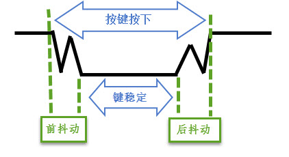
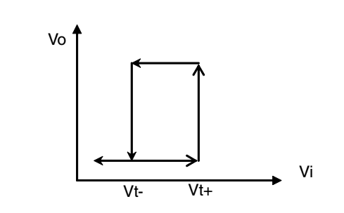

GPIO输入—按键查询检测
---------------------

按键检测使用到GPIO外设的基本输入功能，本章中不再赘述GPIO外设的概念，如您忘记了，可重读前面“7.2
GPIO框图剖析”小节，RT1052标准库中GPIO初始化结构体gpio_pin_config_t的定义与“8.3.5
定义引脚模式的枚举类型”小节中讲解的相同。

硬件设计
~~~~~~~~

按键机械触点断开、闭合时，由于触点的弹性作用，按键开关不会马上稳定接通或一下子断开，使用按键时会产生图
12‑1中的带波纹信号，需要用软件消抖处理滤波，不方便输入检测。不过RT1052的GPIO引脚带有施密特触发器功能，使用该功能可以对信号实现消抖处理，见图
12‑2和图 12‑3，从而简化了软件的工作，软件只需要直接检测引脚的电平即可。

图 12‑1 按键抖动说明图

图 12‑2施密特触发器的转换特性

图 12‑3 在CMOS模式和滞后模式（施密特触发器）下的接收器输出

在核心板中包含了3个按键，其原理图见图 12‑4。

(1) RST复位按键。该按键连接至RT1052的POR_B引脚，当该引脚为低电平时会引起RT1052芯片的复位（复位的基本现象是程序从头开始运行）。从按键的原理图可知，该按键在没有被按下的时候，引脚状态为高电平，当按键按下时，引脚状态为低电平(按键所在的电路导通，引脚接到地)。所以，平时POR_B引脚保持高电平，芯片正常运行，按下按键时产生复位。

(2) WAUP按键。该按键连接至RT1052的WAUP引脚，与RST复位按键类似，当按键按下时WAUP引脚为低电平；与RST引脚不同，这个WAUP引脚具有GPIO的功能，即我们可以把它设置成GPIO的输入模式，然后检测引脚的输入电平，即可判断按键是否被按下。WAUP引脚还具有把芯片从低功耗模式唤醒的功能，以后再学习。

(3) MODE按键。MODE按键最为特殊，它通过一系列电路连接至两个引脚BOOT_MODE[0]和BOOT_MODE[1]，当该按键按下时，BOOT_MODE[0]引脚状态为高电平，BOOT_MODE[1]则相反为低电平。与WAUP引脚类似，BOOT_MODE[0]和BOOT_MODE[1]都具有GPIO的功能，即我们可以选取这二者中任意一个设置成GPIO的输入模式并检测相应的输入电平，来判断按键是否被按下。MODE按键这样设计是为了方便切换芯片的启动方式，芯片复位启动后会检测这两个引脚的电平，根据BOOT_MODE[0]和BOOT_MODE[1]的电平状态来选择FLASH还是USB的启动方式。不过在本章实验中我们仅把它用于普通的按键。

对这3个按键的信息及相应GPIO端口引脚号的总结具体见表格 12‑1。

表格 12‑1各个按键的信息及GPIO端口引脚号

+-------------+---------------------+--------------+------------------+------------------+
|    按键     |      丝印编号       |   GPIO功能   | 按键按下时的电平 |     其它功能     |
+=============+=====================+==============+==================+==================+
| RST复位按键 | SW2（在核心板的左侧 | 不支持       | 低电平           | 复位芯片         |
|             | ）                  |              |                  |                  |
+-------------+---------------------+--------------+------------------+------------------+
| WAUP按键    | SW3（在核心板的右侧 | GPIO5_IO00   | 低电平           | 从低功耗唤醒     |
|             | ）                  |              |                  |                  |
+-------------+---------------------+--------------+------------------+------------------+
| MODE按键    | SW1（在核心板的中间 | BOOT_MODE[0  | BOOT_MODE[0      | 选择芯片启动方式 |
|             | ）                  | ]：          | ]：高电平        |                  |
|             |                     |              |                  |                  |
|             |                     | GPIO1_IO04   |                  |                  |
+-------------+---------------------+--------------+------------------+------------------+
|             |                     | BOOT_MODE[1  | BOOT_MODE[1      |                  |
|             |                     | ]：GPIO1_IO0 | ]：低电平        |                  |
|             |                     | 5            |                  |                  |
+-------------+---------------------+--------------+------------------+------------------+

由于MODE按键使用任意一个BOOT_MODE引脚均可正常使用，此处我们选择按下时与WAUP按键同样是低电平的BOOT_MODE[1]引脚来检测，以简化程序。

图 12‑4核心板上的按键原理图，摘自《野火i.MX RT1052核心板原理图》

若你使用的实验板按键的连接方式或引脚不一样，只需根据我们的工程修改引脚即可，程序的控制原理相同。

软件设计
~~~~~~~~

同LED的工程，为了使工程更加有条理，我们把按键相关的代码独立分开存储，方便以后移植。在“工程模板”之上新建“bsp_key.c”及“bsp_key.h”文件，这些文件也可根据您的喜好命名，这些文件不属于RT1052标准库的内容，是由我们自己根据应用需要编写的。

编程要点
^^^^^^^^

1. 定义按键的相关引脚；

2. 配置引脚的MUX复用模式及PAD属性配置；

3. 初始化GPIO目标引脚为输入模式；

4. 编写简单测试程序，检测按键的状态，实现按键控制LED灯。

代码分析
^^^^^^^^

按键引脚宏定义
''''''''''''''

同样，在编写按键驱动时，也要考虑更改硬件环境的情况。我们把按键检测引脚相关的宏定义到
“bsp_key.h”文件中，具体见代码清单 12‑1。

.. code-block:: c
   :name: 代码清单 12‑1 按键检测引脚相关的宏（bsp_key.h文件）
   :caption: 代码清单 12‑1 按键检测引脚相关的宏（bsp_key.h文件）
   :linenos:

   //WAUP按键
   #define CORE_BOARD_WAUP_KEY_GPIO        GPIO5
   #define CORE_BOARD_WAUP_KEY_GPIO_PIN    (0U)
   #define CORE_BOARD_WAUP_KEY_IOMUXC      IOMUXC_SNVS_WAKEUP_GPIO5_IO00
   #define CORE_BOARD_WAUP_KEY_NAME        "CORE_BORE_WAUP_KEY"
   
   //MODE按键
   #define CORE_BOARD_MODE_KEY_GPIO        GPIO1
   #define CORE_BOARD_MODE_KEY_GPIO_PIN    (5U)
   #define CORE_BOARD_MODE_KEY_IOMUXC      IOMUXC_GPIO_AD_B0_05_GPIO1_IO05
   #define CORE_BOARD_MODE_KEY_NAME        "CORE_BORE_MODE_KEY"
   
   #define KEY_ON      0   //低电平表示按下按键
   #define KEY_OFF     1

以上代码根据按键的硬件连接，把检测按键输入的GPIO端口、引脚号以及IOMUXC复用配置封装起来了。其中CORE_BOARD_xxx_NAME宏定义的是字符串，用来表示按键的名字，方便调试时通过串口输出；KEY_ON和KEY_OFF则分别代表按键按下和释放时引脚的电平。

按键 GPIO初始化驱动
'''''''''''''''''''

利用上面的宏，编写按键的初始化驱动，这部分内容我们编写到bsp_key.c文件中，具体见代码清单
12‑2。

.. code-block:: c
   :name: 代码清单 12‑2 按键GPIO初始化函数（bsp_key.c文件）
   :caption: 代码清单 12‑2 按键GPIO初始化函数（bsp_key.c文件）
   :linenos:

   /*************************第1部分**************************/
   #include "fsl_iomuxc.h"
   #include "fsl_gpio.h"
   
   #include "pad_config.h"
   #include "./key/bsp_key.h"
   
   /*************************第2部分**************************/
   /* 所有引脚均使用同样的PAD配置 */
   #define KEY_PAD_CONFIG_DATA            (SRE_0_SLOW_SLEW_RATE| \
                                          DSE_0_OUTPUT_DRIVER_DISABLED| \
                                          SPEED_2_MEDIUM_100MHz| \
                                          ODE_0_OPEN_DRAIN_DISABLED| \
                                          PKE_1_PULL_KEEPER_ENABLED| \
                                          PUE_1_PULL_SELECTED| \
                                          PUS_3_22K_OHM_PULL_UP| \
                                          HYS_1_HYSTERESIS_ENABLED)
   /* 配置说明 : */
   /* 转换速率: 转换速率慢
      驱动强度: 关闭
      速度配置 : medium(100MHz)
      开漏配置: 关闭
      拉/保持器配置: 使能
      拉/保持器选择: 上下拉
      上拉/下拉选择: 22K欧姆上拉
      滞回器配置: 开启 （仅输入时有效，施密特触发器，使能后可以过滤输入噪声）*/
   
   /*************************第3部分**************************/
   /**
   * @brief  初始化按键相关IOMUXC的MUX复用配置
   * @param  无
   * @retval 无
   */
   static void Key_IOMUXC_MUX_Config(void)
   {
      /* 设置按键引脚的复用模式为GPIO，不使用SION功能 */
      IOMUXC_SetPinMux(CORE_BOARD_WAUP_KEY_IOMUXC, 0U);
      IOMUXC_SetPinMux(CORE_BOARD_MODE_KEY_IOMUXC, 0U);
   }
   
   /*************************第4部分**************************/
   /**
   * @brief  初始化按键相关IOMUXC的MUX复用配置
   * @param  无
   * @retval 无
   */
   static void Key_IOMUXC_PAD_Config(void)
   {
      /* 设置按键引脚属性功能 */
      IOMUXC_SetPinConfig(CORE_BOARD_WAUP_KEY_IOMUXC, KEY_PAD_CONFIG_DATA);
      IOMUXC_SetPinConfig(CORE_BOARD_MODE_KEY_IOMUXC, KEY_PAD_CONFIG_DATA);
   }
   
   /*************************第5部分**************************/
   /**
   * @brief  初始化按键相关的GPIO模式
   * @param  无
   * @retval 无
   */
   static void Key_GPIO_Mode_Config(void)
   {
      /* 定义gpio初始化配置结构体 */
      gpio_pin_config_t key_config;
   
      /** 核心板的按键，GPIO配置 **/
      key_config.direction = kGPIO_DigitalInput; //输入模式
      key_config.outputLogic =  1;                //默认高电平（输入模式时无效）
      key_config.interruptMode = kGPIO_NoIntmode; //不使用中断

      /* 初始化按键 GPIO. */
   GPIO_PinInit(CORE_BOARD_WAUP_KEY_GPIO, CORE_BOARD_WAUP_KEY_GPIO_PIN, &key_config);
   GPIO_PinInit(CORE_BOARD_MODE_KEY_GPIO, CORE_BOARD_MODE_KEY_GPIO_PIN, &key_config);
   }

   /*************************第5部分**************************/
   /**
   * @brief  初始化控制KEY的IO
   * @param  无
   * @retval 无
   */
   void Key_GPIO_Config(void)
   {
      /* 初始化GPIO复用、属性、模式 */
      Key_IOMUXC_MUX_Config();
      Key_IOMUXC_PAD_Config();
      Key_GPIO_Mode_Config();
   }

同是用于GPIO功能的驱动，其初始化的流程与《11.2.2 3LED
GPIO初始化驱动》章节中的类似，主要区别是引脚的PAD属性及GPIO的方向。驱动的各个部分介绍如下：

(1) 第1部分。包含库文件fsl_iomuxc.h及fsl_gpio.h，以便对IOMUXC及GPIO外设进行控制；包含pad_config.h及bsp_key.h以便配置PAD属性及使用前面定义的按键硬件信息相关的宏。

(2) 第2部分。定义宏KEY_PAD_CONFIG_DATA，它包含了按键使用的PAD属性配置，它与LED灯例程中最大的区别如下：

-  因为引脚要用于输入模式，所以关闭了输出驱动强度的控制。

-  期望引脚在按键没按下的时候有更加稳定的输入，所以设置了22K欧姆的上拉。

-  按键的输入信号存在抖动，所以使能了施密特触发器进行滤波。

(3) 第3部分。使用库函数IOMUXC_SetPinMux配置两个按键引脚的MUX复用选择为GPIO，本例子中也没有开启SION功能。

    此处大家可能会有疑惑，在LED灯例程中引脚配置为输出模式不需要开启SION，本例子按键引脚配置为输入模式也不需要开启SION，那这功能究竟是什么时候才必需的呢？在后面的《第15章LPI2C—读写EEPROM第21章
    》会学习到I2C作为通讯总线它同时具有输入和输出的功能，这就是SION应用的领域。也就是说当引脚被配置成开漏模式的同时需要读取引脚的电平信号，那么必须开启SION。

(4) 第4部分。使用库函数IOMUXC_SetPinConfig配置两个按键引脚的PAD属性，PAD属性具体参考第2部分的内容。

(5) 第5部分。定义Key_GPIO_Mode_Config函数，其函数内部先是向GPIO初始化结构体赋值，把引脚初始化成输入模式以及不使用中断，其中的outputLogic成员赋值为1或0是不会影响引脚的默认电平的，这个成员的配置仅在引脚用于输出模式时有效。最后利用库函数GPIO_PinInit把该参数配置写入到两个按键对应的GPIO引脚中。

(6) 第6部分。把前面定义的Key_IOMUXC_MUX_Config、Key_IOMUXC_PAD_Config以及Key_GPIO_Mode_Config函数封装到Key_GPIO_Config中，以便其它应用直接调用它初始化按键。

检测按键的状态
''''''''''''''

初始化按键后，就可以通过检测对应引脚的电平来判断按键状态了，具体见代码清单
12‑3。

.. code-block:: c
   :name: 代码清单 12‑3 检测按键的状态(bsp_key.c文件)
   :caption: 代码清单 12‑3 检测按键的状态(bsp_key.c文件)
   :linenos:

   /**
      * @brief   检测是否有按键按下
      * @note   本函数在按键按下时会阻塞，直至释放
      * @param  base:具体的端口
      * @param  pin:具体的引脚号
      * @retval  按键的状态
      *   @arg KEY_ON:按键按下
      *   @arg KEY_OFF:按键没按下
      */
   uint8_t Key_Scan(GPIO_Type* base, uint32_t pin)
   {
      /*检测是否有按键按下 */
      if (KEY_ON == GPIO_PinRead(base, pin)) {
            /*等待按键释放 */
            while (KEY_ON == GPIO_PinRead(base, pin));
            return  KEY_ON;
      } else
            return KEY_OFF;
   }

在这里我们定义了一个Key_Scan函数用于扫描按键状态。GPIO引脚的输入电平可通过读取数据寄存器DR对应的位来感知，而RT1052标准库提供了库函数GPIO_PinRead来获取位状态，该函数以GPIO端口及引脚号作为输入参数，返回该引脚的电平状态，高电平返回1，低电平返回0。Key_Scan函数中以GPIO_PinRead的返回值与自定义的宏“KEY_ON”对比，若检测到按键按下，则使用while循环持续检测按键状态，直到按键释放，按键释放后Key_Scan函数返回一个“KEY_ON”值；若没有检测到按键按下，则函数直接返回“KEY_OFF”。若按键的GPIO不具有施密特触发器功能或硬件没有做消抖处理，需要在这个Key_Scan函数中做软件滤波，防止波纹抖动引起误触发。

主函数
''''''

接下来我们使用主函数编写按键检测流程，见代码清单 12‑4。

.. code-block:: c
   :name: 代码清单 12‑4 按键检测主函数（main.c文件）
   :caption: 代码清单 12‑4 按键检测主函数（main.c文件）
   :linenos:

   #include "fsl_debug_console.h"
   #include "fsl_gpio.h"
   #include "fsl_gpt.h"
   
   #include "board.h"
   #include "pin_mux.h"
   #include "clock_config.h"
   
   #include "./led/bsp_led.h"
   #include "./key/bsp_key.h"
   
   /**
      * @brief  主函数
      * @param  无
      * @retval 无
      */
   int main(void)
   {
      /* 初始化内存管理单元 */
      BOARD_ConfigMPU();
      /* 初始化开发板引脚 */
      BOARD_InitPins();
      /* 初始化开发板时钟 */
      BOARD_BootClockRUN();
      /* 初始化调试串口 */
      BOARD_InitDebugConsole();
      /* 打印系统时钟 */
      PRINTF("\r\n");
      PRINTF("*****欢迎使用 野火i.MX RT1052 开发板*****\r\n");
      PRINTF("CPU:             %d Hz\r\n", CLOCK_GetFreq(kCLOCK_CpuClk));
      PRINTF("AHB:             %d Hz\r\n", CLOCK_GetFreq(kCLOCK_AhbClk));
      PRINTF("SEMC:            %d Hz\r\n", CLOCK_GetFreq(kCLOCK_SemcClk));
      PRINTF("SYSPLL:          %d Hz\r\n", CLOCK_GetFreq(kCLOCK_SysPllClk));
      PRINTF("SYSPLLPFD0:      %d Hz\r\n", CLOCK_GetFreq(kCLOCK_SysPllPfd0Clk));
      PRINTF("SYSPLLPFD1:      %d Hz\r\n", CLOCK_GetFreq(kCLOCK_SysPllPfd1Clk));
      PRINTF("SYSPLLPFD2:      %d Hz\r\n", CLOCK_GetFreq(kCLOCK_SysPllPfd2Clk));
      PRINTF("SYSPLLPFD3:      %d Hz\r\n", CLOCK_GetFreq(kCLOCK_SysPllPfd3Clk));
   
      PRINTF("GPIO输入—按键查询检测\r\n");
   
      /************************第1部分****************************/
      /* 初始化LED引脚 */
      LED_GPIO_Config();
   
      /* 初始化KEY引脚 */
      Key_GPIO_Config();
      //阻塞检测
      PRINTF("阻塞检测示例，按下按键可控制LED灯反转\r\n");
      while (1) {
            /************************第2部分****************************/
            /* 检测WAUP按键 */
   if (Key_Scan(CORE_BOARD_WAUP_KEY_GPIO, CORE_BOARD_WAUP_KEY_GPIO_PIN) == KEY_ON ) {
               CORE_BOARD_LED_TOGGLE;
               PRINTF("检测到 %s 按键操作\r\n", CORE_BOARD_WAUP_KEY_NAME);
            }
   
            /* 检测MODE按键 */
   if (Key_Scan(CORE_BOARD_MODE_KEY_GPIO, CORE_BOARD_MODE_KEY_GPIO_PIN) == KEY_ON ) {
               CORE_BOARD_LED_TOGGLE;
               PRINTF("检测到 %s 按键操作\r\n", CORE_BOARD_MODE_KEY_NAME);
            }
      }
   }

代码中初始化LED灯及按键后，在while函数里不断调用Key_Scan函数，并判断其返回值，若返回值表示按键按下，则反转LED灯的状态。

在本章的配套源码中还包含了使用“状态机”方式检测按键的示例，该检测方式更为实用但不太容易理解，这种编程方式跟芯片无关，此处不作讲解。

下载验证
~~~~~~~~

把编译好的程序下载到开发板并复位，按下按键可以控制LED灯亮、灭状态。
