时钟控制模块（CCM）
------------------------

本章参考资料：《IMXRT1050RM》（参考手册）。

学习本章时，配合《IMXRT1050RM》第18章Clock Controller Module
(CCM)，效果会更佳，特别是涉及到寄存器说明的部分。

本章我们主要讲解时钟部分，芯片内部的各个设备都在时钟的驱动下运行，了解整个芯片的时钟树、时钟配置，那么对RT1052
的一切时钟的来龙去脉都会了如指掌。

时钟控制模块（CCM）的主要作用
~~~~~~~~~~~~~~~~~~~~~~~~~~~~~~~~~~~~~~~~~~

RT1052的时钟系统由时钟控制模块CCM进行控制，其主要功能如下：

-  使用PLL锁相环电路将参考时钟倍频，得到频率更高的时钟。为芯片内核和外设提供可选的时钟源。RT1052共有7个PLL锁相环电路，分别为
   ARM PLL(PLL 1)、System PLL(PLL 2)、USB1 PLL(PLL 3)、Audio PLL(PLL
   4)、Video PLL(PLL 5)、ENET PLL(PLL 6) 、USB2 PLL(PLL 7)。

-  提供PLL控制寄存器、时钟选择寄存器、时钟分频寄存器
   灵活控制输出到外设和内核的时钟频率。

-  控制低功耗机构。

时钟控制模块结构构图
~~~~~~~~~~~~~~~~~~~~~~~~~~~~~~~~~~~~~~~~~~
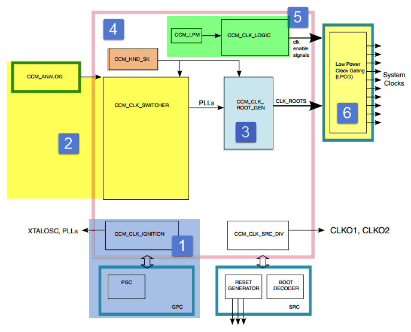

图 15‑1CCM功能框图①CCM启动模块

CCM_CLK_IGNITION管理从外部晶振时钟到稳定的根时钟输出的整个过程。CCM完成重置之后CCM_CLK_IGNITION模块立即启动。GPC是General
Power
Controller的缩写，即总电源管理模块，它不属于CCM，系统电压与时钟关系密切，简单来说，系统电压影响系统最高的时钟频率，CCM又可以控制总电源管理模块（GPC）进入待机或低功耗状态。相关内容将会在GPC章节详细介绍。

PLL时钟产生
^^^^^^^^^^^^^^^^^^^^^^^^^^^^
CCM_ANALOG为CCM的模拟部分，作用是将频率较低的参考时钟（例如24MHz的XTALOSC时钟）使用PLL锁相环电路倍频到更高的时钟。CCM_CLK_SWITCHER模块接收来自CCM_ANALOG模块的锁相环时钟输输出，以及锁相环的旁路时钟，并为CCM_CLK_ROOT_GEN子模块生成切换时钟输出(pll3_sw_clk)。RT1052共有7个PLL锁相环电路，可以独立配置。其中PLL2与PLL3结合PFD能够输出多个频率可调的时钟。

根时钟生成
^^^^^^^^^^^^^^^^^^^^^^^^^^^^
CCM_CLK_ROOT_GEN接收来自CCM_CLK_SWITCHER模块的PLL或PFD时钟，经过时钟的选择、分频等操作之后产生并输出根时钟。根时钟将会作内核或外设的时钟源。

时钟同步
^^^^^^^^^^^^^^^^^^^^^^^^^^^^
当更改某些时钟的时钟源时需要进行时钟的同步CCM_HND_SK模块用于管理时钟握手，即时钟的同步。

低功耗管理与时钟启用模块
^^^^^^^^^^^^^^^^^^^^^^^^^^^^
CCM_LPM用于管理低功耗模式，管理时钟的开启与关闭。CCM_CLK_LOGIC，根据来自CCM_LPM模块和CCM_IP的信号产生时钟启用或关闭信号。

低功耗时钟门控模块（LPCG）
^^^^^^^^^^^^^^^^^^^^^^^^^^^^
低功耗时钟门控模块(LPCG)根据CCM_CLK_LOGIC模块输出信号控制时钟输出。时钟越多、频率越高功耗也就越高。关闭没有使用的时钟或降低时钟频率能够有效的降低功耗。

时钟树简介
~~~~~~~~~~~~~~~~~~~~~~~~~~~~
RT1052芯片时钟的结构以时钟树的方式进行描述。当我们设置外设时钟时大多会参考时钟树进行设置，本小节将以AHB_CLK_ROOT(ARM
Core Clock)为例结合SDK库函数讲解时钟控制模块的使用。

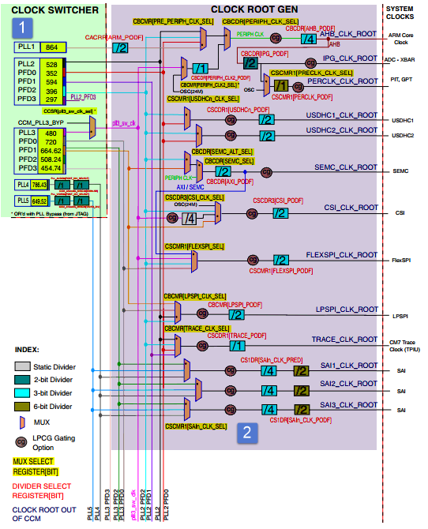

图 15‑2时钟树(part1)

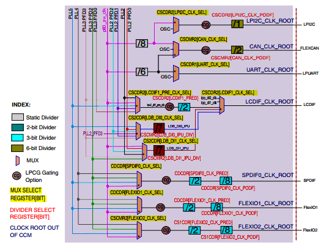

图 15‑3时钟树(part2)

①时钟转换器CLOCK SWITCHER
^^^^^^^^^^^^^^^^^^^^^^^^^^^^^^^^^^^^^^^^^^^^^^^^^^^^^^^^
RT1052外部连接了两个晶振，分别用于提供32.768KHz和24MHz时钟。其中32.768KHz晶振称为外部低速时钟（CKIL），当芯片上电后要保持该时钟一直处于运行状态，为需要的外设提供时钟。

32.768KHz时钟主要为芯片的实时时钟外设（RTC）提供时钟源，若不使用RTC，可以不提供该时钟。

24Mhz晶振产生的时钟称为外部高速时钟（CKIH），芯片利用内部振荡器产生基准时钟(OSC)，内部振荡器产生基准时钟(OSC)与外部高速时钟(CKIH)连接，产生24MHz的参考时钟。

24MHz参考时钟常用作PLL锁相环电路的输入时钟。下面以ARM PLL(PLL
1)为例讲解从24MHz参考时钟到ARM PLL(PLL 1)时钟的过程，如图 15‑4。

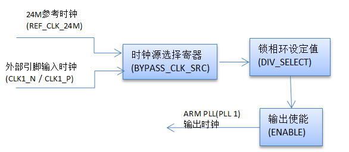

图 15‑4ARM_PLL时钟产生框图

ARM PLL(PLL 1)只有一个控制寄存器CCM_ANALOG_PLL_ARMn，
CCM_ANALOG_PLL_ARMn[BYPASS_CLK_SRC]用于选择输入钟源(Fin)，一般我们使用24MHz参考时钟，当然也可以选择外部引脚输入引脚（CLK1_N
/
CLK1_P）输入的外部时钟。CCM_ANALOG_PLL_ARMn[DIV_SELECT]位选择锁相环分频值(DIV_SELECT)。取值范围为54到108。输出频率计算公式为
ARM_PLL = Fin \* DIV_SELECT/
2.0。如果选择24MHz参考时钟作为时钟输入，DIV_SELECT选择88则ARM
PLL的输出频率为1056MHz。 CCM_ANALOG_PLL_ARMn[ENABLE]用于配置是否使能ARM
PLL输出，如果要使用ARM PLL就需要将该位设置为1 。

从图 15‑4中可以看出，PLL2与PLL3下方各有一组PFD。PFD是Phase Fractional
Dividers的缩写，我们这里翻译为分数分频。PFD的频率由PLL2或PLL3输出频率分频产生。我们以PLL2产生PFD0~PFD3讲解PFD的产生过程，如图
15‑5。

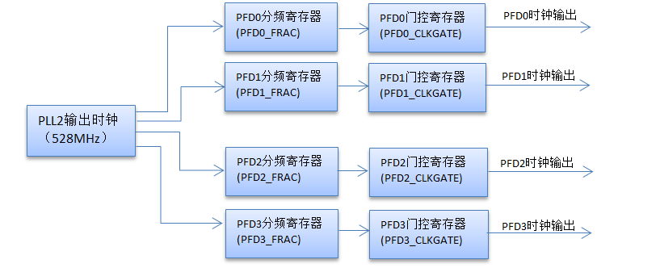

图 15‑5PFD时钟产生框图

寄存器CCM_ANALOG_PFD_528n用于控制PFD0~PFD3的输出频率。以PFD0为例，CCM_ANALOG_PFD_528n[PFD0_FRAC]用于设置分频值，取值范围为12到35，PFD0的输出频率计算公式为：

PFD0_out =528*18/ PFD0_FRAC

如果PFD0_FRAC = 27，PFD0的输出频率为352MHz。

CCM_ANALOG_PFD_528n[PFD0_CLKGATE]门控寄存器，用于设置是否使能PFD0的输出。

SDK库为每个PLL初始化提供了单独的初始化函数，在实际编程过程中我们无需设置具体的寄存器，只需要调用相应的函数即可。以ARM
PLL(PLL 1)初始化为例，如代码清单 15‑1。

.. code-block:: c
   :name: 代码清单 15‑1ARM PLL 初始化函数(fsl_clock.c)
   :caption: 代码清单 15‑1ARM PLL 初始化函数(fsl_clock.c)
   :linenos:

   typedef struct _clock_arm_pll_config
   {
      uint32_t loopDivider;   /* value: 54-108. Fout=Fin*loopDivider/2. */
   } clock_arm_pll_config_t;

   void CLOCK_InitArmPll(const clock_arm_pll_config_t *config)
   {
      CCM_ANALOG->PLL_ARM = CCM_ANALOG_PLL_ARM_ENABLE_MASK |
                     CCM_ANALOG_PLL_ARM_DIV_SELECT(config->loopDivider);

      while ((CCM_ANALOG->PLL_ARM & CCM_ANALOG_PLL_ARM_LOCK_MASK) == 0)
      {
      }
   }

clock_arm_pll_config_t是只用于ARM_PLL初始化的结构体，只有一个用于设置分频值的成员变量。函数CLOCK_InitArmPll用于初始化ARM_PLL，它直接操作CCM_ANALOG_PLL_ARMn寄存器的控制位，并且默认选择24MHz参考时钟(REF_CLK_24M)作为时钟源。初始化之后等待CCM_ANALOG_PLL_ARMn[LOCK]为1，等待设置生效。

设置时钟之前，我们要根据期望的输出频率计算分频寄存器的值。例如我们需要ARM_PLL输出1056MHz，则根据计算公式：

ARM_PLL = Fin \* DIV_SELECT/ 2.0

参考时钟选择24MHz，的情况下loopDivider(等于DIV_SELECT寄存的值)为88。

②根时钟生成模块CLOCK ROOT GEN
^^^^^^^^^^^^^^^^^^^^^^^^^^^^^^^^^^^^^^^^^^^^^^^^^^^^^^^^
根时钟生成模块主要完成两个工作，第一选择时钟，第二设置时钟分频。

从图 15‑2可以看出，时钟转换器（CLOCK
SWITCHER）输出了多个频率不同的PLL时钟。每个外设时钟通过MUX模块连接到多个PLL时钟输出，每个MUX实际是一个寄存器，用于选择时钟源。SDK库通过枚举类型定义了这些时钟选择寄存器，并提供了相应的函数设置这些寄存器。如代码清单
15‑2。

.. code-block:: c
   :name: 代码清单 15‑2选择PLL时钟(fsl_clock.h)
   :caption: 代码清单 15‑2选择PLL时钟(fsl_clock.h)
   :linenos:

   typedef enum _clock_mux
   {
      kCLOCK_Pll3SwMux        /*!< pll3_sw_clk mux  */
   
      kCLOCK_PeriphMux        /*!< periph mux  */
      kCLOCK_SemcAltMux       /*!< semc mux  */
      kCLOCK_SemcMux          /*!< semc mux  */    
      
      kCLOCK_PrePeriphMux     /*!< pre-periph mux  */
      kCLOCK_TraceMux         /*!< trace mux  */
      kCLOCK_PeriphClk2Mux    /*!< periph clock2 mux  */
      kCLOCK_LpspiMux         /*!< lpspi mux  */
   
      kCLOCK_FlexspiMux       /*!< flexspi mux  */
      kCLOCK_Usdhc2Mux        /*!< usdhc2 mux  */
      kCLOCK_Usdhc1Mux        /*!< usdhc1 mux  */
      kCLOCK_Sai3Mux          /*!< sai3 mux  */
      kCLOCK_Sai2Mux          /*!< sai2 mux  */
      kCLOCK_Sai1Mux          /*!< sai1 mux  */
      kCLOCK_PerclkMux        /*!< perclk mux  */
   
      kCLOCK_Flexio2Mux       /*!< flexio2 mux  */
      kCLOCK_CanMux           /*!< can mux  */
   
      kCLOCK_UartMux          /*!< uart mux  */
      
      kCLOCK_SpdifMux         /*!< spdif mux  */
      kCLOCK_Flexio1Mux       /*!< flexio1 mux  */
   
      kCLOCK_Lpi2cMux         /*!< lpi2c mux  */
      kCLOCK_LcdifPreMux      /*!< lcdif pre mux  */
   
      kCLOCK_CsiMux           /*!< csi mux  */
   } clock_mux_t;
   
   static inline void clock_mux_t (clock_mux_t mux, uint32_t value)

为了节省篇幅，代码清单15‑2中只列出了枚举类型成员名，省略了成员赋值部分，如果需要可以查看fsl_clock.h文件中的定义。

枚举类型clock_mux_t的成员与图 15‑2和图
15‑3的MUX模块一一对应。内敛函数clock_mux_t用于选择时钟，参数mux指定设定设置的MUX模块，参数value
用于设定选择的时钟编号。以AHB_CLK_ROOT时钟的选择为例讲解clock_mux_t函数的使用方法，如图
15‑6。

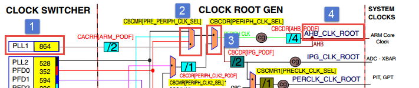

图 15‑6从PLL1到AHB_CLK_ROOT

不考虑时钟分频，PLL1的时钟要经过两个MUX模块(标号2和3)才能作为AHB_CLK_BOOT时钟，首先我们设置CBCMR[PRE_PERIPH_CLK_SEL](标号2)，该MUX模块在枚举类型clock_mux_t
的定义为kCLOCK_PrePeriphMux 。我们选择

标记为②的MUX模块应该设置为clock_mux_t (kCLOCK_PrePeriphMux, 3)。

同理，标号3处的MUX模块在枚举类型中的定义为kCLOCK_PeriphMux，选择第1个输出时钟，序号为0，所以标记为③的MUX模块应该设置为
clock_mux_t (kCLOCK_PeriphMux, 0)。

根时钟生成模块不但要选择时钟还要设置时钟分频。与时钟选择类似，
RT1052官方使用一个枚举类型定义所有的分频寄存器，提供了一个分频初始化函数设置这些寄存器，如代码清单
15‑3所示。

.. code-block:: c
   :name: 代码清单 15‑3设置分频(fsl_clock.h)
   :caption: 代码清单 15‑3设置分频(fsl_clock.h)
   :linenos:

   typedef enum _clock_div
   {
      kCLOCK_ArmDiv                  /*!< core div  */
   
      kCLOCK_PeriphClk2Div           /*!< periph clock2 div  */
      kCLOCK_SemcDiv                 /*!< semc div  */
      kCLOCK_AhbDiv                  /*!< ahb div  */
      kCLOCK_IpgDiv                  /*!< ipg div  */
   
      kCLOCK_LpspiDiv                /*!< lpspi div  */
      kCLOCK_LcdifDiv                /*!< lcdif div  */
   
      kCLOCK_FlexspiDiv              /*!< flexspi div  */
      kCLOCK_PerclkDiv               /*!< perclk div  */
   
      kCLOCK_CanDiv                  /*!< can div  */
   
      kCLOCK_TraceDiv                /*!< trace div  */
      kCLOCK_Usdhc2Div               /*!< usdhc2 div  */
      kCLOCK_Usdhc1Div               /*!< usdhc1 div  */
      kCLOCK_UartDiv                 /*!< uart div  */
   
      kCLOCK_Flexio2Div              /*!< flexio2 pre div  */
      kCLOCK_Sai3PreDiv              /*!< sai3 pre div  */
      kCLOCK_Sai3Div                 /*!< sai3 div  */
      kCLOCK_Flexio2PreDiv           /*!< sai3 pre div  */
      kCLOCK_Sai1PreDiv              /*!< sai1 pre div  */
      kCLOCK_Sai1Div                 /*!< sai1 div  */
   
      kCLOCK_Sai2PreDiv              /*!< sai2 pre div  */
      kCLOCK_Sai2Div                 /*!< sai2 div  */
   
      kCLOCK_Spdif0PreDiv            /*!< spdif pre div  */
      kCLOCK_Spdif0Div               /*!< spdif div  */
      kCLOCK_Flexio1PreDiv           /*!< flexio1 pre div  */
      kCLOCK_Flexio1Div              /*!< flexio1 div  */
   
      kCLOCK_Lpi2cDiv                /*!< lpi2c div  */
      kCLOCK_LcdifPreDiv             /*!< lcdif pre div  */
   
      kCLOCK_CsiDiv                  /*!< csi div  */
   } clock_div_t;
   
   static inline void CLOCK_SetDiv(clock_div_t divider, uint32_t value)
   static inline uint32_t CLOCK_GetDiv(clock_div_t divider)

枚举类型clock_div_t定义了时钟树中所有的时钟分频寄存器，如图
15‑7，ARM_PODF(标记②处)分频寄存器在枚举类型clock_div_t中的定义为kCLOCK_ArmDiv，AHB_PCDF(标记③处)分频寄存器在枚举类型clock_div_t中的定义为kCLOCK_AhbDiv。

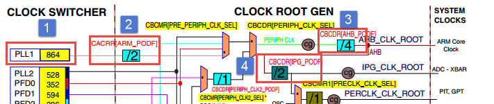

图 15‑7PLL1到AHB_CLK_ROOT时钟分频设置

CLOCK_SetDiv函数用于设置时钟分频，参数divider是clock_div_t枚举类型，用于指定设置那个分频寄存器。
参数value用于设置分频值。不同时钟分频寄存器能够设置的时钟分频取值范围不同，我们可以在《IMXRT1050RM》找到对应的寄存器进而确定分频值的取值范围。也可以根据时钟树中寄存器标注的颜色确定分频寄存器的位数。图
15‑7，根据ARM_PODF(标记②处)的颜色得知该寄存器共3位，取值范围0到7。同样根据IPG_PODF(标记④处)的颜色得知该频寄存共2位，取值范围0到3。设置为0表示1分频（不分频），设置为1表示2分频，设置为2表示3分频以此类推。

初始化开发板时钟函数讲解
~~~~~~~~~~~~~~~~~~~~~~~~~~~~~~~~~~~~~~~~~~
在main函数的开始有几个系统初始化函数称为板级基础组件，几乎存在于所有的工程中，在第
11.2.2
章节讲解头文件时有过简单的介绍，本小节将详细时钟配置函数BOARD_BootClockRUN。

.. code-block:: c
   :name: 代码清单 15‑4板级基础组件中的时钟配置函数(main.c)
   :caption: 代码清单 15‑4板级基础组件中的时钟配置函数(main.c)
   :linenos:

   int main(void)
   {
      /* 初始化内存管理单元 */
      BOARD_ConfigMPU();
      /* 初始化开发板引脚 */
      BOARD_InitPins();
      /* 初始化开发板时钟 */
      BOARD_BootClockRUN();
      /* 初始化调试串口 */
      BOARD_InitDebugConsole();
   }

BOARD_BootClockRUN函数主要通过调用CLOCK_SetDiv函数和CLOCK_SetMux函数实现的，如代码清单
15‑5所示。

.. code-block:: c
   :name: 代码清单 15‑5 BOARD_BootClockRUN函数内容(clock_config.c)
   :caption: 代码清单 15‑5 BOARD_BootClockRUN函数内容(clock_config.c)
   :linenos:

   void BOARD_BootClockRUN(void)
   {
      /********************第一部分**********************/
      /* 保存 RTC OSC 时钟频率. */
      CLOCK_SetRtcXtalFreq(32768U);
      /* 保存 XTAL 24MHz时钟频率. */
      CLOCK_SetXtalFreq(24000000U);
      
      /****************************第二部分***************************/
      /* 设置时钟选择模块PeriphClk2Mux 和 PeriphMux，选择时钟*/
      CLOCK_SetMux(kCLOCK_PeriphClk2Mux, 1); /*PERIPH_CLK2 MUX选择OSC */
      CLOCK_SetMux(kCLOCK_PeriphMux, 1); /* PERIPH_CLK MUX选择PERIPH_CLK2*/
      
      /******************************第三部分****************************/ 
      /* 设置VDD_SOC 为 1.5V*/
      DCDC->REG3 = (DCDC->REG3 & (~DCDC_REG3_TRG_MASK)) | DCDC_REG3_TRG(0x12);
      /*等待设置生效*/
      while (DCDC_REG0_STS_DC_OK_MASK !=(DCDC_REG0_STS_DC_OK_MASK & DCDC->REG0))
      {
      }
      
      /********************************第四部分************************/   
      /* 初始化 ARM PLL(PLL1). */
      CLOCK_InitArmPll(&armPllConfig_BOARD_BootClockRUN);
      /* 初始化System PLL. */
   #ifndef SKIP_SYSCLK_INIT
      CLOCK_InitSysPll(&sysPllConfig_BOARD_BootClockRUN);
   #endif
      /* Init Usb1 PLL. */
   #if !(defined(XIP_EXTERNAL_FLASH) && (XIP_EXTERNAL_FLASH == 1))
      CLOCK_InitUsb1Pll(&usb1PllConfig_BOARD_BootClockRUN);
   #endif
      /* Enbale Audio PLL output. */
      CCM_ANALOG->PLL_AUDIO |= CCM_ANALOG_PLL_AUDIO_ENABLE_MASK;
      /* Enbale Video PLL output. */
      CCM_ANALOG->PLL_VIDEO |= CCM_ANALOG_PLL_VIDEO_ENABLE_MASK;
      /* Enable ENET PLL output. */
      CCM_ANALOG->PLL_ENET |= CCM_ANALOG_PLL_ENET_ENABLE_MASK;
      CCM_ANALOG->PLL_ENET |= CCM_ANALOG_PLL_ENET_ENET_25M_REF_EN_MASK;
      
      /*******************************第五部分************************/
      /* Set periph clock2 clock source. */ 
      CLOCK_SetMux(kCLOCK_PeriphClk2Mux, 0); //CBCMR[PERIPH_CLK2_SEL] 
      /* Set PERIPH_CLK2_PODF. */
      CLOCK_SetDiv(kCLOCK_PeriphClk2Div, 0); //CBCDR[PERIPH_CLK2_PODF]
      
      /*******************************第六部分************************/
      /* Set periph clock source. */
      CLOCK_SetMux(kCLOCK_PeriphMux, 0); //CBCDR[PERIPH_CLK_SEL]
      /* Set AHB_PODF. */
      CLOCK_SetDiv(kCLOCK_AhbDiv, 0);    //CBCDR[AHB_PODF]
      /* Set IPG_PODF. */
      CLOCK_SetDiv(kCLOCK_IpgDiv, 3);    //CBCDR[IPG_PODF]
      /* Set ARM_PODF. */
      CLOCK_SetDiv(kCLOCK_ArmDiv, 1);    //CACRR[ARM_PODF]
      /* Set preperiph clock source. */
      CLOCK_SetMux(kCLOCK_PrePeriphMux, 3);//CBCMR[PRE_PERIPH_CLK_SEL]
      
      /*****************************第七部分****************************/
      /* Set PERCLK_PODF. */
      CLOCK_SetDiv(kCLOCK_PerclkDiv, 1);//CSCMR1[PERCLK_PODF]
      /* Set periph clock source. */
      CLOCK_SetMux(kCLOCK_PerclkMux, 0);//CSCMR1[PRECLK_CLK_SEL]
      
      /****************************第八部分****************************/
      /* Set Usdhc1 clock source. */
      CLOCK_SetMux(kCLOCK_Usdhc1Mux, 0);//CSCMR1[USDHCn_CLK_SEL]
      /* Set USDHC1_PODF. */
      CLOCK_SetDiv(kCLOCK_Usdhc1Div, 1);//CSCDR1[USDHCn_PODF]
      
      /******************************第九部****************************/
      /* Set Usdhc2 clock source. */
      CLOCK_SetMux(kCLOCK_Usdhc2Mux, 0);
      /* Set USDHC2_PODF. */
      CLOCK_SetDiv(kCLOCK_Usdhc2Div, 1);
      /***其余外设时钟设置与第七、八、九部分类似，详细请参考ckock_config.c********/
   }

BOARD_BootClockRUN时钟初始化函数比较长，结合时钟树仔细阅读会发现大量的类似内容。重点是掌握时钟设置的方法。掌握了方法配合时钟树就可以灵活控制RT1052外设的根时钟。对于常用的几个函数我们会详细介绍。

-  第一部分，保存RTC OSC(32768Hz)和XTAL(24MHz)的频率，我们打开CLOCK_SetRtcXtalFreq和CLOCK_SetXtalFreq函数定义，如代码清单15‑6。

.. code-block:: c
   :name: 代码清单15‑6CLOCK_SetRtcXtalFreq和CLOCK_SetXtalFreq函数定义(fsl_clock.h)
   :caption: 代码清单15‑6CLOCK_SetRtcXtalFreq和CLOCK_SetXtalFreq函数定义(fsl_clock.h)
   :linenos:

   static inline void CLOCK_SetRtcXtalFreq(uint32_t freq)
   {
      g_rtcXtalFreq = freq;
   }
   
   static inline void CLOCK_SetXtalFreq(uint32_t freq)
   {
      g_xtalFreq = freq;
   }

这两个函数实际就是将芯片连接的两个外部晶振频率赋值给两个全局变量。

-  第二部分，设置OSC(24MHz)时钟作为ARM CoreClock的根时钟(AHB_CLK_ROOT)。系统启动后PLL锁相环输出时钟还未设置，为了保证CPU稳定运行，首先使用OSC(24MHz)作为系统时钟，当PLL锁相环时钟设置完成并且时钟输出稳定后再进行时钟切换。在时钟树中的“路径”如图15‑8。

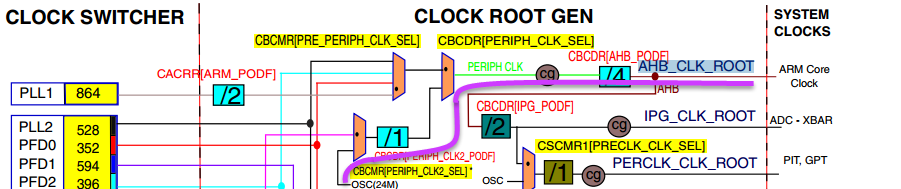

图 15‑8选择OSC作为系统时钟

-  第三部分，设置VDD_SOC为1.5V
   。VDD_SOC的值与RT1052的AHB总线能够使用的最高频率有关。这不是本章要讲解的内容，我们只要知道如果想要RT1052工作在正常时钟频率（600MHz左右）需要设置VDD_SOC为1.5。

-  第四部分，设置系统PLL。该部分代码通过配置PLL对应的控制寄存器设置PLL输出频率。以设置ARM_PLL(PLL1)为例简要讲解如何使用库函数设置PLL输出的时钟频率，如代码清单
   15‑7。

.. code-block:: c
   :name: 代码清单 15‑7使用库函数初始化ARM_PLL(clock_config.c)
   :caption: 代码清单 15‑7使用库函数初始化ARM_PLL(clock_config.c)
   :linenos:

   /******************************第一部分****************************/
   const clock_arm_pll_config_t armPllConfig_BOARD_BootClockRUN = {
      .loopDivider = 88, /* PLL loop divider, Fout = Fin * 44 */
   };
   /*****************************第二部分****************************/
   CLOCK_InitArmPll(&armPllConfig_BOARD_BootClockRUN);

ARM_PLL的初始化函数CLOCK_InitArmPll只要传入锁相环分频值即可，一般我们是根据期望输出频率计算分频值。根据频率计算公式：

ARM_PLL = Fin \* DIV_SELECT/ 2.0

如果使用系统默认的配置Fin为频率为24MHz的参考时钟，DIV_SELECT是设定的分频值。以代码清单
15‑7设定的值为例，DIV_SELECT =
88，不难算出ARM_PLL输出频率为1056MHz。

-  第五部分，修改CBCMR[PERIPH_CLK2_SEL]时钟选择，ARM Core
   Clock的根时钟(AHB_CLK_ROOT)不再使用OSC(24MHz)。

-  第六部分，将ARM Core Clock的根时钟(AHB_CLK_ROOT)切换到ARM_PLL(PLL1)时钟。在第二部分我们讲到，因为系统启动之后还没有配置PLL锁相环，所以暂时选择OSC(24MHz)作为系统时钟。第四部分代码设置了PLL，并且ARM_PLL(PLL1)的时钟输出已经稳定，此时应当将系统时钟切换到正常运行的时钟频率。在时钟树中从PLL1到AHB_CLK_ROOT的“路径”如图15‑9。

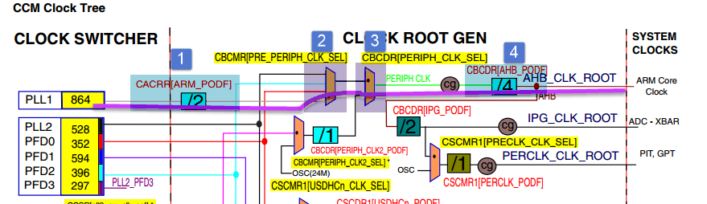

图 15‑9设置AHB_CLK_ROOT时钟

从图15‑9可以看出从PLL1到AHB_CLK_ROOT要经过两个时钟选择模块（CBCMR[PRE_PERIPH_CLK_SEL]与CBCDR[PERIPH_CLK_SEL]）如图
15‑9标号②、③处所示，两个时钟分频(CACRR[ARM_PODF]和CBCDR[AHB_PODF])如图图
15‑9标号①、④处所。第六部分的代码用于设置这两个时钟选择模块和时钟分频，下面简要讲解如何使用库函数选择和设置时钟分频。

1) 设置时钟选择模块，在库函数中使用CLOCK_SetMux函数选择时钟。函数原型如代码清单15‑8。

.. code-block:: c
   :name: 代码清单 15‑8CLOCK_SetMux函数原型(fsl_clock.h)
   :caption: 代码清单 15‑8CLOCK_SetMux函数原型(fsl_clock.h)
   :linenos:

   static inline void CLOCK_SetMux(clock_mux_t mux, uint32_t value)

参数mux用于指定设置那个时钟选择模块，时钟选择模块(MUX)本质上是一个寄存器，为了方便操作SDK库将这些寄存器定义在clock_mux_t枚举类型中，我们设置时钟选择模块(MUX)时只要找到与之对应的枚举值即可，表格15‑1表列出了常用的几个时钟选择模块对应的枚举值。根据时钟树中的寄存器名和枚举类clock_mux_t完整的定义，很容易找到枚举成员与寄存器对应关系。

表格 15‑1时钟选择模块与枚举值

+----------------------------------+----------------------+
| 时钟选择模块(根据时钟树标记命名) | 枚举值               |
+==================================+======================+
| CBCMR[PRE_PERIPH_CLK_SEL]        | kCLOCK_PrePeriphMux  |
+----------------------------------+----------------------+
| CBCDR[PERIPH_CLK_SEL]            | PERIPH_CLK_SEL       |
+----------------------------------+----------------------+
| CBCMR[PERIPH_CLK2_SEL]           | kCLOCK_PeriphClk2Mux |
+----------------------------------+----------------------+
| CSCMR1[PRECLK_CLK_SEL]           | kCLOCK_PerclkMux     |
+----------------------------------+----------------------+

参数value用指定选择第几个时钟。以CBCMR[PRE_PERIPH_CLK_SEL]时钟选择模块为例，如图15‑9
CBCMR[PRE_PERIPH_CLK_SEL]时钟选择模块共有4个时钟输入，从上到下编号0到3。如果我们要选择第一个时钟输入则应该设置value
= 0。其他时钟选择模块采用同样的方法进行设置。

1) 设置时钟分频，在库函数中使用CLOCK_SetDiv函数设置时钟分频。函数原型如代码清单
   15‑9。

.. code-block:: c
   :name: 代码清单 15‑9CLOCK_SetDiv函数原型(fsl_clock.h)
   :caption: 代码清单 15‑9CLOCK_SetDiv函数原型(fsl_clock.h)
   :linenos:

   static inline void CLOCK_SetDiv(clock_div_t divider, uint32_t value)

参数divider用于指定设置那个时钟分频寄存器。同样，为了编程方便SDK库将分频寄存器定义在clock_div_t枚举类型中，我们设置时钟分频时只要找到分频寄存器对应的枚举值即可。根据时钟树中标记的寄存器颜色可以知道分频寄存器的位数，从而确定分频的取值范围。表格15‑2列出了几个常用的时钟分频寄存器对应的枚举值。根据时钟树中的寄存器名和枚举类clock_div_t完整的定义，很容易找到与分频寄存器对应的枚举值。

表格 15‑2时钟分频寄存器与枚举值对照表

+---------------------+------------------+------------+
| 分频寄存器名        | 枚举值           | 寄存器位数 |
+=====================+==================+============+
| CACRR[ARM_PODF]     | kCLOCK_ArmDiv    | 3位        |
+---------------------+------------------+------------+
| CBCDR[AHB_PODF]     | kCLOCK_AhbDiv    | 3位        |
+---------------------+------------------+------------+
| CSCMR1[PERCLK_PODF] | kCLOCK_PerclkDiv | 6位        |
+---------------------+------------------+------------+
| CBCDR[IPG_PODF]     | kCLOCK_IpgDiv    | 2位        |
+---------------------+------------------+------------+
| CSCDR1[USDHCn_PODF] | kCLOCK_Usdhc1Div | 3位        |
+---------------------+------------------+------------+

参数value用于指定分频值，分频值的取值范围与寄存器的位数有关从0到2\ :sup:`n`\ (n为寄存器位数)，设为0表示不分频。

RT1052的根时钟设置通过以上两个函数即可完成。参照时钟树，根时钟的设置更加清晰。以AHB_CLK_ROOT的配置为例，结合时钟框图配置过程如图15‑10。

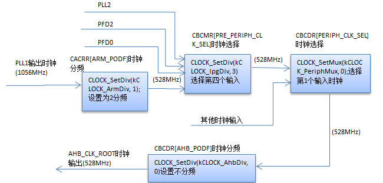

图 15‑10AHB_CLK_ROOT时钟配置

-  第七部分，设置PERCLK_CLK_ROOT根时钟，如 图 15‑11。

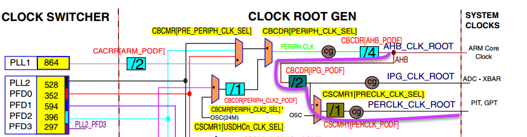

图 15‑11PERCLK_CLK_ROOT根时钟

从图15‑11可以看出PERCLK_CLK_ROOT的时钟可以来自分频后的AHB_CLK_BOOT或者24MHz的OSC时钟。其中在第六部分的代码中已经将CBCDR[IPG_PODF]分频寄存器设置为4分频。结合时钟树，PERCLK_CLK_ROOT的初始化过程如图15‑12。

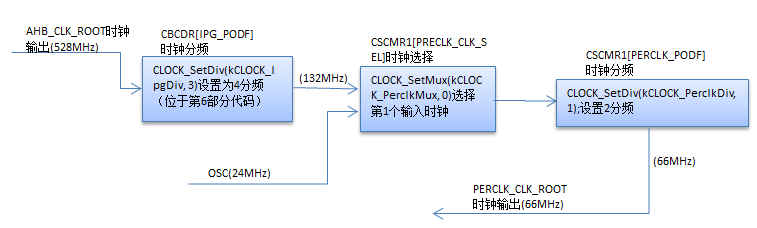

图 15‑12PERCLK_CLK_ROOT的初始化过程

-  第八部分与第九部分，分别用于设置USDHC1_CLK_ROOT根时钟和USDHC2_CLK_ROOT根时钟。具体如何实现请参考时钟树中相关内容。

配置系统时钟实验
~~~~~~~~~~~~~~~~~~~~~~~~~~~~
在实际工程中我们通常使用NXP官方提供的时钟配置函数BOARD_BootClockRUN();初始化时钟，在之前的章节我们以AHB_CLK_ROOT为例讲解了该函数。本实验将通过修改AHB_CLK_ROOT时钟配置参数调整时钟输出频率，通过串口打印实际的频率来验证我们的设置。

硬件设计
^^^^^^^^^^^^^^^^^^^^^^^^^^^^
本实验只需要通过串口打印频率值，所以正确连接开发板串口到电脑即可。

软件设计
^^^^^^^^^^^^^^^^^^^^^^^^^^^^
本实验只需要配置系统时钟并且打印系统时钟频率，所以任意一个工程都可用于本实验。

编程要点
''''''''''''''''''''''''''''''''''
-  修改时钟配置寄参数。

-  使用CLOCK_GetFreq函数读取相应时钟的频率

-  使用调试串口输出时钟频率值

通过修改ARM PLL(PLL 1)改变AHB_CLK_ROOT的时钟频率
''''''''''''''''''''''''''''''''''''''''''''''''''''''''''''''''''''
根据之前讲解我们知道ARM PLL控制寄存器CCM_ANALOG_PLL_ARMn
[DIV_SELECT]用于设置RM PLL(PLL1)输出频率，并且该频率经过二分频之后作为AHB_CLK_ROOT时钟。AHB_CLK_ROOT即为AHB总线时钟。在NXP提供的时钟初始化文件clock_config.c 定义了CCM_ANALOG_PLL_ARMn [DIV_SELECT]的值，如代码清单 15‑10。

.. code-block:: c
   :name: 代码清单 15‑10ARM PLL 输出频率设置寄存器定义(clock_config.c)
   :caption: 代码清单 15‑10ARM PLL 输出频率设置寄存器定义(clock_config.c)
   :linenos:

   const clock_arm_pll_config_t armPllConfig_BOARD_BootClockRUN = {
      .loopDivider = 88, /* PLL loop divider, Fout = Fin * 44 */

ARM PLL(PLL 1)输出频率 = 24MHz \* loopDivider / 2。根据之前讲解，不修改其他配置的情况下 AHB_CLK_ROOT即AHB 时钟频率 为 ARMPLL(PLL 1)输出频率的二分频。

当 loopDivider = 88， 通过计算得 AHB 时钟频率 = 528MHz，当loopDivider =100，通过计算得AHB 时钟频率 = 600MHz。

将程序下载到开发板，运行程序，通过串口输出信息可以判断是否与计算结果一致。注意AHB总线时钟作为ARM
Core 内核的时钟不要超过600MHz，频率太高系统无法正常运行。

通过修改时钟分频寄存改变AHB_CLK_ROOT的时钟频率
''''''''''''''''''''''''''''''''''''''''''''''''''''''''''''''''''''
保持其他配置不变的情况下，可以通过修改时钟分频寄存器改变AHB_CLK_ROOT的时钟频率，如图
15‑13。

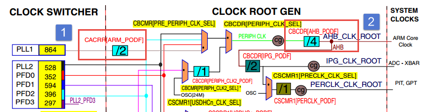

图 15‑13时钟树（AHB_CLK_ROOT）

标记①为CACRR[ARM_PODF]时钟分频寄存器，该寄存器共两位，可设置范围为0到3。设置位0表示不分频，设置位3表示对来自ARM
PLL(PLL1)的时钟四分频。标记②为CBCDR[AHB_PODF]时钟分频寄存器，该寄存共4位，可设置范围为0到15。这两个寄存器在BOARD_BootClockRUN(void)函数中设置，截取代码片段如代码清单15‑11。

.. code-block:: c
   :name: 代码清单 15‑11时钟分频设置
   :caption: 代码清单 15‑11时钟分频设置
   :linenos:

   /* Set AHB_PODF.
   *设置CBCDR[AHB_PODF] 时钟分频寄存器，取值范围 0到15
   */
   CLOCK_SetDiv(kCLOCK_AhbDiv, 0);
   /* Set IPG_PODF. */
   CLOCK_SetDiv(kCLOCK_IpgDiv, 3);
   /* Set ARM_PODF.
   *设置 CACRR[ARM_PODF] 时钟分频寄存器，取值范围 0到3
   */
   CLOCK_SetDiv(kCLOCK_ArmDiv, 1);

在程序中函数CLOCK_SetDiv(kCLOCK_AhbDiv,0)设置CBCDR[AHB_PODF]分频寄存器，分频值为0即不分频如图15‑13标号②处所示。

函数CLOCK_SetDiv(kCLOCK_ArmDiv,1)设置CACRR[ARM_PODF]分频寄存器，分频值为1，表示二分频。如图15‑13标号①处所示。

在保持其他配置不变的情况下，通过修改这两个时钟分频寄存器的分频值可以设置AHB_CLK_ROOT的时钟输出。计算公式为：

AHB_CLK_ROOT频率=ARM PLL/( AHB_PODF+1)/( ARM_PODF+1)

ARM PLL是ARM PLL(PLL 1)输出频率，根据之前讲解，我们已经将ARM PLL(PLL1)的输出频率设置为1056MHz。AHB_PODF是CBCDR[AHB_PODF]分频寄存器设定的分频值，取值范围0到7。ARM_PODF是CACRR[ARM_PODF]分频寄存器设定的分频值，取值范围0到7。

从代码清单15‑2可以看出，官方的初始化函数将AHB_PODF设置为0。将ARM_PODF设置为1，根据计算公式得：

AHB_CLK_ROOT频率=1056MHz / 2=528MHz

我们可以尝试修改这两个分频寄存器的分频值修改AHB_CLK_ROOT时钟输出。AHB_CLK_ROOT是ARM Core 的根时钟。ARM Core时钟频率就是我们常说的芯片的主频。正常工作模式下ARM Core的时钟不能超过600MHz，所以我们进行修改时不要让最终输出频率超过600MHz。

这里修改系统时钟频率只是用于加深对RT1052时钟的认识。在实际应用中我们保持默认即可。

打印系统时钟
''''''''''''''''''''''''''''''''''
在我们的工程中，一般会在main函数中添加一段打印时钟的代码如代码清单
15‑12。

.. code-block:: c
   :name: 代码清单 15‑12输出系统时钟(main.c)
   :caption: 代码清单 15‑12输出系统时钟(main.c)
   :linenos:

   /* 打印系统时钟 */
   PRINTF("\r\n");
   PRINTF("*****欢迎使用 野火i.MX RT1052 开发板*****\r\n");
   PRINTF("CPU:         %d Hz\r\n", CLOCK_GetFreq(kCLOCK_CpuClk));
   PRINTF("AHB:         %d Hz\r\n", CLOCK_GetFreq(kCLOCK_AhbClk));
   PRINTF("SEMC:        %d Hz\r\n", CLOCK_GetFreq(kCLOCK_SemcClk));
   PRINTF("SYSPLL:      %d Hz\r\n", CLOCK_GetFreq(kCLOCK_SysPllClk));
   PRINTF("SYSPLLPFD0:  %d Hz\r\n", CLOCK_GetFreq(kCLOCK_SysPllPfd0Clk));
   PRINTF("SYSPLLPFD1:  %d Hz\r\n", CLOCK_GetFreq(kCLOCK_SysPllPfd1Clk));
   PRINTF("SYSPLLPFD2:  %d Hz\r\n", CLOCK_GetFreq(kCLOCK_SysPllPfd2Clk));
   PRINTF("SYSPLLPFD3:  %d Hz\r\n", CLOCK_GetFreq(kCLOCK_SysPllPfd3Clk));

函数CLOCK_GetFreq用于读取时钟频率，参数是要读取的时钟。例如CLOCK_GetFreq(kCLOCK_AhbClk)用于读取AHB总线时钟。我们对比串口输出的AHB时钟和设定值，验证我们的修改是否正确。

下载验证
^^^^^^^^^^^^^^^^^^^^^^^^^^^^
将程序下载到开发板，运行程序，通过串口输出信息可以判断是否与计算结果一致。注意AHB总线时钟作为ARM
Core 内核的时钟不要超过600MHz，频率太高系统无法正常运行。
