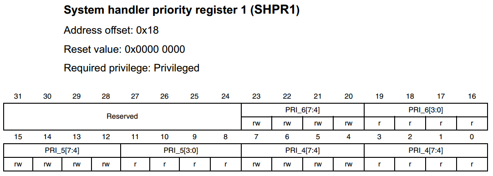
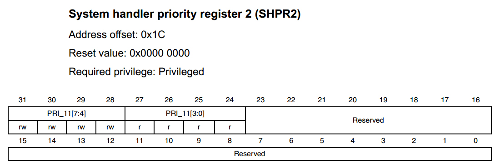
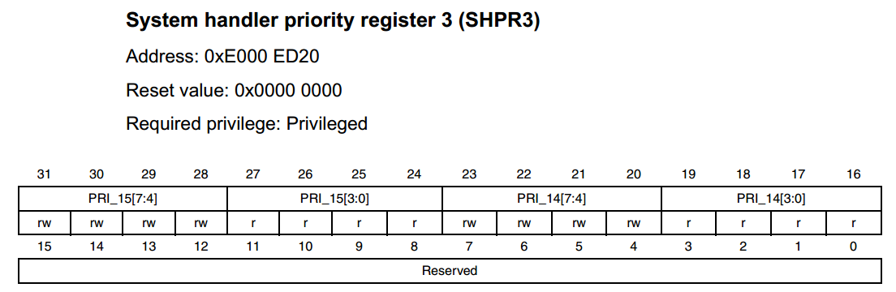

SysTick—系统定时器
------------------

本章参考资料《Cortex-M3内核编程手册》-4.5 章节SysTick
Timer(STK)，和4.48章节SHPRx，其中STK这个章节有SysTick的简介和寄存器的详细描述。因为SysTick是属于Cortex内核的外设，无论在Cortex-M3、M4和M7，他们都是完全一样的，所以参考资料可以互相共用。有关寄存器的定义和部分库函数都在core_cm7.h这个头文件中实现。所以学习SysTick的时候可以参考这两个资料，一个是文档，一个是源码。

SysTick简介
~~~~~~~~~~~

SysTick—系统定时器是属于Cortex-M内核中的一个外设，内嵌在NVIC中。系统定时器是一个24bit的向下递减的计数器，计数器每计数一次的时间为1/SYSCLK，一般我们设置系统时钟SYSCLK等于AHB时钟，在RT1052中，AHB时钟等于528MHZ。当重装载数值寄存器的值递减到0的时候，会置位相关的标志位或者产生中断（前提是中断已经使能），以此循环往复。

因为SysTick是属于Cortex-M内核的外设，所以所有基于Cortex-M内核的单片机都具有这个系统定时器，使得软件在Cortex-M单片机中可以很容易的移植。系统定时器一般用于操作系统，用于产生时基，维持操作系统的心跳。

SysTick寄存器介绍
~~~~~~~~~~~~~~~~~

SysTick—系统定时器有4个寄存器，简要介绍如下。在使用SysTick产生定时的时候，只需要配置前三个寄存器，最后一个校准寄存器不需要使用。

表格 16‑1 SysTick寄存器汇总

+------------+-------------------------+
| 寄存器名称 | 寄存器描述              |
+============+=========================+
| CTRL       | SysTick控制及状态寄存器 |
+------------+-------------------------+
| LOAD       | SysTick重装载数值寄存器 |
+------------+-------------------------+
| VAL        | SysTick当前数值寄存器   |
+------------+-------------------------+
| CALIB      | SysTick校准数值寄存器   |
+------------+-------------------------+

表格 16‑2 SysTick控制及状态寄存器

+------+-----------+------+--------+------------------------+
| 位段 |   名称    | 类型 | 复位值 |          描述          |
+======+===========+======+========+========================+
| 16   | COUNTFLAG | R/W  | 0      | 如果在上次读取本寄存器 |
|      |           |      |        | 后，                   |
|      |           |      |        | SysTick                |
|      |           |      |        | 已经计到               |
|      |           |      |        | 了                     |
|      |           |      |        | 0，则该位为            |
|      |           |      |        | 1。                    |
+------+-----------+------+--------+------------------------+
| 2    | CLKSOURCE | R/W  | 0      | 时钟源选择位，0=AH     |
|      |           |      |        | B/8，1=处理器时钟      |
|      |           |      |        | AHB                    |
+------+-----------+------+--------+------------------------+
| 1    | TICKINT   | R/W  | 0      | 1=SysTick倒数          |
|      |           |      |        | 计数到                 |
|      |           |      |        | 0时产生                |
|      |           |      |        | SysTick异常请          |
|      |           |      |        |                        |
|      |           |      |        | 求，0=数到             |
|      |           |      |        | 0                      |
|      |           |      |        | 时无动作。也可以通过读 |
|      |           |      |        | 取COUNTFLAG标          |
|      |           |      |        | 志位来确定计数器是否递 |
|      |           |      |        | 减到0                  |
+------+-----------+------+--------+------------------------+
| 0    | ENABLE    | R/W  | 0      | SysTick                |
|      |           |      |        | 定时器的使能位         |
+------+-----------+------+--------+------------------------+

表格 16‑3 SysTick 重装载数值寄存器

+------+--------+------+--------+----------------------------------+
| 位段 | 名称   | 类型 | 复位值 | 描述                             |
+======+========+======+========+==================================+
| 23:0 | RELOAD | R/W  | 0      | 当倒数计数至零时，将被重装载的值 |
+------+--------+------+--------+----------------------------------+

表格 16‑4 SysTick当前数值寄存器

+------+---------+------+--------+------------------------+
| 位段 |  名称   | 类型 | 复位值 |          描述          |
+======+=========+======+========+========================+
| 23:0 | CURRENT | R/W  | 0      | 读取时返回当前倒计数的 |
|      |         |      |        | 值，写它则使之清零，同 |
|      |         |      |        | 时还会清除在SysTi      |
|      |         |      |        | ck控制及状态寄存器中   |
|      |         |      |        | 的COUNTFLAG            |
|      |         |      |        | 标志                   |
+------+---------+------+--------+------------------------+

表格 16‑5 SysTick校准数值寄存器

+-------------+-------------+-------------+-------------+-------------+
| 位段        | 名称        | 类型        | 复位值      | 描述        |
+=============+=============+=============+=============+=============+
| 31          | NOREF       | R           | 0           | NOREF flag. |
|             |             |             |             | Reads as    |
|             |             |             |             | zero.       |
|             |             |             |             | Indicates   |
|             |             |             |             | that a      |
|             |             |             |             | separate    |
|             |             |             |             | reference   |
|             |             |             |             | clock is    |
|             |             |             |             | provided.   |
|             |             |             |             | The         |
|             |             |             |             | frequency   |
|             |             |             |             | of this     |
|             |             |             |             | clock is    |
|             |             |             |             | HCLK/8      |
+-------------+-------------+-------------+-------------+-------------+
| 30          | SKEW        | R           | 1           | Reads as    |
|             |             |             |             | one.        |
|             |             |             |             | Calibration |
|             |             |             |             | value for   |
|             |             |             |             | the 1 ms    |
|             |             |             |             | inexact     |
|             |             |             |             | timing is   |
|             |             |             |             | not known   |
|             |             |             |             | because     |
|             |             |             |             | TENMS is    |
|             |             |             |             | not known.  |
|             |             |             |             | This can    |
|             |             |             |             | affect the  |
|             |             |             |             | suitability |
|             |             |             |             | of SysTick  |
|             |             |             |             | as a        |
|             |             |             |             | software    |
|             |             |             |             | real time   |
|             |             |             |             | clock       |
+-------------+-------------+-------------+-------------+-------------+
| 23:0        | TENMS       | R           | 0           | Indicates   |
|             |             |             |             | the         |
|             |             |             |             | calibration |
|             |             |             |             | value when  |
|             |             |             |             | the SysTick |
|             |             |             |             | counter     |
|             |             |             |             | runs on     |
|             |             |             |             | HCLK max/8  |
|             |             |             |             | as external |
|             |             |             |             | clock. The  |
|             |             |             |             | value is    |
|             |             |             |             | product     |
|             |             |             |             | dependent,  |
|             |             |             |             | please      |
|             |             |             |             | refer to    |
|             |             |             |             | the Product |
|             |             |             |             | Reference   |
|             |             |             |             | Manual,     |
|             |             |             |             | SysTick     |
|             |             |             |             | Calibration |
|             |             |             |             | Value       |
|             |             |             |             | section.    |
|             |             |             |             | When HCLK   |
|             |             |             |             | is          |
|             |             |             |             | programmed  |
|             |             |             |             | at the      |
|             |             |             |             | maximum     |
|             |             |             |             | frequency,  |
|             |             |             |             | the SysTick |
|             |             |             |             | period is   |
|             |             |             |             | 1ms. If     |
|             |             |             |             | calibration |
|             |             |             |             | information |
|             |             |             |             | is not      |
|             |             |             |             | known,      |
|             |             |             |             | calculate   |
|             |             |             |             | the         |
|             |             |             |             | calibration |
|             |             |             |             | value       |
|             |             |             |             | required    |
|             |             |             |             | from the    |
|             |             |             |             | frequency   |
|             |             |             |             | of the      |
|             |             |             |             | processor   |
|             |             |             |             | clock or    |
|             |             |             |             | external    |
|             |             |             |             | clock.      |
+-------------+-------------+-------------+-------------+-------------+

系统定时器的校准数值寄存器在定时实验中不需要用到。有关各个位的描述这里引用手册里面的英文版本，比较晦涩难懂，暂时不知道这个寄存器用来干什么。有研究过的朋友可以交流，起个抛砖引玉的作用。

SysTick定时实验
~~~~~~~~~~~~~~~

利用SysTick产生500ms的时基，LED以ms的频率闪烁。

硬件设计
^^^^^^^^

SysTick属于单片机内部的外设，不需要额外的硬件电路，剩下的只需一个LED灯即可。

软件设计
^^^^^^^^

这里只讲解核心的部分代码，有些变量的设置，头文件的包含等并没有涉及到，完整的代码请参考本章配套的工程。我们创建了两个文件：bsp_SysTick.c和bsp\_
SysTick.h文件用来存放SysTick驱动程序及相关宏定义。

编程要点
''''''''

1、设置重装载寄存器的值

2、清除当前数值寄存器的值

3、配置控制与状态寄存器

代码分析
''''''''

SysTick
属于内核的外设，有关的寄存器定义和库函数都在内核相关的库文件core_cm7.h中。

SysTick配置库函数
*****************

.. code-block:: c
   :name: 代码清单 16‑1 SysTick配置库函数(core_cm7.h)
   :caption: 代码清单 16‑1 SysTick配置库函数(core_cm7.h)
   :linenos:

   __STATIC_INLINE uint32_t SysTick_Config(uint32_t ticks)
   {
      // 不可能的重装载值，超出范围
      if ((ticks - 1UL) > SysTick_LOAD_RELOAD_Msk) {
         return (1UL);
      }

      // 设置重装载寄存器
      SysTick->LOAD  = (uint32_t)(ticks - 1UL);

      // 设置中断优先级
      NVIC_SetPriority (SysTick_IRQn, (1UL << __NVIC_PRIO_BITS) - 1UL);

      // 设置当前数值寄存器
      SysTick->VAL   = 0UL;

      // 设置系统定时器的时钟源为AHBCLK
      // 使能系统定时器中断
      // 使能定时器
      SysTick->CTRL  = SysTick_CTRL_CLKSOURCE_Msk |
                        SysTick_CTRL_TICKINT_Msk   |
                        SysTick_CTRL_ENABLE_Msk;
      return (0UL);
   }

用固件库编程的时候我们只需要调用库函数SysTick_Config()即可，形参ticks用来设置重装载寄存器的值，最大不能超过重装载寄存器的值2\ :sup:`24`\ ，当重装载寄存器的值递减到0的时候置位SysTick控制及状态寄存器的位16或者产生中断（如果中断已经使能），然后重装载寄存器的值又重新装载往下递减计数，以此循环往复。紧随其后设置好中断优先级，最后配置系统定时器的时钟等于AHBCLK，使能定时器和定时器中断，这样系统定时器就配置好了，一个库函数搞定。

SysTick_Config()库函数主要配置了SysTick中的三个寄存器：LOAD、VAL和CTRL，有关具体的部分看代码注释即可。

配置SysTick中断优先级
**********************************

在SysTick_Config()库函数还调用了固件库函数NVIC_SetPriority()来配置系统定时器的中断优先级，该库函数也在core_m7.h中定义，原型具体见代码清单
16‑2。

.. code-block:: c
   :name: 代码清单 16‑2 NVIC_SetPriority函数定义(core_cm7.h)
   :caption: 代码清单 16‑2 NVIC_SetPriority函数定义(core_cm7.h)
   :linenos:

   __STATIC_INLINE void NVIC_SetPriority(IRQn_Type IRQn, uint32_t priority)
   {
      if ((int32_t)IRQn < 0) {
      SCB->SHP[(((uint32_t)(int32_t)IRQn) & 0xFUL)-4UL] =
      (uint8_t)((priority << (8 - __NVIC_PRIO_BITS)) & (uint32_t)0xFFUL);
      } else {
      NVIC->IP[((uint32_t)(int32_t)IRQn)] =
      (uint8_t)((priority << (8 - __NVIC_PRIO_BITS)) & (uint32_t)0xFFUL);
      }
   }

函数首先先判断形参IRQn的大小，如果是小于0，则表示这个是系统异常，系统异常的优先级由内核外设SCB的寄存器SHPRx控制，如果大于0则是外部中断，外部中断的优先级由内核外设NVIC中的IPx寄存器控制。

因为SysTick属于内核外设，跟普通外设的中断优先级有些区别，并没有抢占优先级和子优先级的说法。在RT1052中，内核外设的中断优先级由内核SCB这个外设的寄存器：SHPRx（x=1.2.3）来配置。有关SHPRx寄存器的详细描述可参考《Cortex-M3内核编程手册》4.4.8章节。下面我们简单介绍下这个寄存器。

SPRH1-SPRH3是一个32位的寄存器，但是只能通过字节访问，每8个字段控制着一个内核外设的中断优先级的配置。在RT1052中，只有位7:3这高四位有效，低四位没有用到，所以内核外设的中断优先级可编程为：0~15，只有16个可编程优先级，数值越小，优先级越高。如果软件优先级配置相同，那就根据他们在中断向量表里面的位置编号来决定优先级大小，编号越小，优先级越高。

表格 16‑6 系统异常优先级字段

+-------------------------+--------+------------+
| 异常                    | 字段   | 寄存器描述 |
+=========================+========+============+
| Memory management fault | PRI_4  | SHPR1      |
+-------------------------+--------+------------+
| Bus fault               | PRI_5  |            |
+-------------------------+--------+------------+
| Usage fault             | PRI_6  |            |
+-------------------------+--------+------------+
| SVCall                  | PRI_11 | SHPR2      |
+-------------------------+--------+------------+
| PendSV                  | PRI_14 | SHPR3      |
+-------------------------+--------+------------+
| SysTick                 | PRI_15 |            |
+-------------------------+--------+------------+

如果要修改内核外设的优先级，只需要修改下面三个寄存器对应的某个字段即可。

图 16‑1 SHPR1寄存器

图 16‑2 SHPR2寄存器

图 16‑3 SHPR3寄存器

在系统定时器中，配置优先级为(1UL << \__NVIC_PRIO_BITS) -
1UL)，其中宏__NVIC_PRIO_BITS为4，那计算结果就等于15，可以看出系统定时器此时设置的优先级在内核外设中是最低的，如果要修改优先级则修改这个值即可，范围为：0~15。

.. code-block::
   :linenos:

   // 设置系统定时器中断优先级
   NVIC_SetPriority (SysTick_IRQn, (1UL << \__NVIC_PRIO_BITS) - 1UL);

但是，问题来了，刚刚我们只是学习了内核的外设的优先级配置。如果我同时使用了systick和片上外设呢？而且片上外设也刚好需要使用中断，那systick的中断优先级跟外设的中断优先级怎么设置？会不会因为systick是内核里面的外设，所以它的中断优先级就一定比内核之外的外设的优先级高？

从《i.MX RT中断应用概览》这章我们知道，外设在设置中断优先级的时候，首先要分组，然后设置抢占优先级和子优先级。而systick这类内核的外设在配置的时候，只需要配置一个寄存器即可，取值范围为0~15。既然配置方法不同，那如何区分两者的优先级？下面举例说明。

比如配置一个外设的中断优先级分组为2，抢占优先级为1，子优先级也为1，systick的优先级为固件库默认配置的15。当我们比较内核外设和片上外设的中断优先级的时候，我们只需要抓住NVIC的中断优先级分组不仅对片上外设有效，同样对内核的外设也有效。我们把systick的优先级15转换成二进制值就是1111(0b)，又因为NVIC的优先级分组2，那么前两位的11(0b)就是3，后两位的11(0b)也是3。无论从抢占还是子优先级都比我们设定的外设的优先级低。如果当两个的软件优先级都配置成一样，那么就比较他们在中断向量表中的硬件编号，编号越小，优先级越高。

SysTick初始化函数
*****************

.. code-block:: c
   :name: 代码清单 16‑3 SysTick初始化函数(bsp_systick.c)
   :caption: 代码清单 16‑3 SysTick初始化函数(bsp_systick.c)
   :linenos:

   /**
   * @brief  启动系统滴答定时器 SysTick
   * @param  无
   * @retval 无
   */
   void SysTick_Init(void)
   {
      /* SystemFrequency / 1000    1ms中断一次
      * SystemFrequency / 100000  10us中断一次
      * SystemFrequency / 1000000 1us中断一次
      */
      if (SysTick_Config(SystemCoreClock / 1000)) {
         /* 错误处理 */
         while (1);
      }
   }

SysTick初始化函数由用户编写，里面调用了SysTick_Config()这个固件库函数，通过设置该固件库函数的形参，就决定了系统定时器经过多少时间就产生一次中断。

SysTick中断时间的计算
**********************************

SysTick定时器的计数器是向下递减计数的，计数一次的时间T\ :sub:`DEC`\ =1/CLK\ :sub:`AHB`\ ，当重装载寄存器中的值VALUE\ :sub:`LOAD`\ 减到0的时候，产生中断，可知中断一次的时间T\ :sub:`INT`\ =VALUE\ :sub:`LOAD
\*` T\ :sub:`DEC`\ =
VALUE\ :sub:`LOAD`/CLK:sub:`AHB`\ ，其中CLK\ :sub:`AHB` =
SystemCoreClock=528MHZ。如果设置VALUE\ :sub:`LOAD`\ 为528，那中断一次的时间T\ :sub:`INT`\ =528/528M=1us。不过1us的中断没啥意义，整个程序的重心都花在进出中断上了，根本没有时间处理其他的任务。

.. code-block:: c
   :linenos:

   SysTick_Config(SystemCoreClock / 1000))

SysTick_Config()的形参我们配置为SystemCoreClock /
1000=528M/1000=528K，从刚刚分析我们知道这个形参的值最终是写到重装载寄存器LOAD中的，从而可知我们现在把SysTick定时器中断一次的时间T\ :sub:`INT`\ =528K/528M=1ms。

SysTick定时时间的计算
**********************************

当设置好中断时间T\ :sub:`INT`\ 后，我们可以设置一个变量t，用来记录进入中断的次数，那么变量t乘以中断的时间T\ :sub:`INT`\ 就可以计算出需要定时的时间。

SysTick定时函数
*****************

现在我们定义一个毫秒级别的延时函数，形参为nTime，当用这个形参乘以中断时间T\ :sub:`INT`\ 就得出我们需要的延时时间，其中T\ :sub:`INT`\ 我们已经设置好为1ms。关于这个函数的具体使用看注释即可。

.. code-block:: c
   :name: 代码清单 16‑4 Delay_ms函数定义(bsp_systick.c)
   :caption: 代码清单 16‑4 Delay_ms函数定义(bsp_systick.c)
   :linenos:

   /**
   * @brief   ms延时函数
   * @param
   *   @arg nTime: 需要延时多少ms
   * @retval  无
   */
   void Delay_ms(__IO uint32_t nTime)
   {
      TimingDelay = nTime;

      while (TimingDelay != 0);
   }

函数Delay_ms()中我们等待TimingDelay为0，当TimingDelay为0的时候表示延时时间到。而变量TimingDelay是一个全局变量，它在中断函数中递减，即SysTick每进一次中断，TimingDelay递减一次。

SysTick中断服务函数
**********************************

.. code-block:: c
   :name: 代码清单 16‑5 SysTick中断服务函数(bsp_systick.c)
   :caption: 代码清单 16‑5 SysTick中断服务函数(bsp_systick.c)
   :linenos:

   /**
   * @brief  SysTick中断服务函数
   * @param  无
   * @retval 无
   * @attention
   */
   void SysTick_Handler(void)
   {
      if (TimingDelay != 0x00) {
         TimingDelay--;
      }
   }

这是SysTick的中断服务函数，每次时间到产生中断时，CPU都会跳转至本函数执行，对TimingDelay值减1。

主函数
*****************

.. code-block:: c
   :name: 代码清单 16‑6 主函数(main.c)
   :caption: 代码清单 16‑6 主函数(main.c)
   :linenos:

   #include "fsl_debug_console.h"
   #include "board.h"
   #include "pin_mux.h"
   #include "clock_config.h"
   
   #include "./led/bsp_led.h"
   #include "./adc/bsp_adc.h"
   
   volatile bool ADC_ConversionDoneFlag; //标志位
   volatile uint32_t ADC_ConvertedValue;

   /*******************************************************************
   * Prototypes
   *******************************************************************/
   /**
   * @brief 延时一段时间
   */
   void delay(uint32_t count);

   /*******************************************************************
   * Code
   *******************************************************************/
   /**
   * @note 本函数在不同的优化模式下延时时间不同，
   *       如flexspi_nor_debug和flexspi_nor_release版本的程序中，
   *       flexspi_nor_release版本的延时要短得多
   */
   oid delay(uint32_t count)

   volatile uint32_t i = 0;
   for (i = 0; i < count; ++i) {
      __asm("NOP"); /* 调用nop空指令 */
   }

   /**
   * @brief  主函数
   * @param  无
   * @retval 无
   */
   int main(void)
   {
      adc_channel_config_t adcChannelConfigStruct;//定义ADC 通道配置结构体
      float ADC_ConvertedValueLocal = 0;  //保存转换得到的电压值

      /* 初始化内存保护单元 */
      BOARD_ConfigMPU();
      /* 初始化开发板引脚 */
      BOARD_InitPins();
      /* 初始化开发板时钟 */
      BOARD_BootClockRUN();
      /* 初始化调试串口 */
      BOARD_InitDebugConsole();
      /* 打印系统时钟 */

      PRINTF("\r\n");
      PRINTF("\*\*\*\*\*欢迎使用 野火i.MX RT1052 开发板*****\r\n");
      PRINTF("CPU:         %d Hz\r\n", CLOCK_GetFreq(kCLOCK_CpuClk));
      PRINTF("AHB:         %d Hz\r\n", CLOCK_GetFreq(kCLOCK_AhbClk));
      PRINTF("SEMC:        %d Hz\r\n", CLOCK_GetFreq(kCLOCK_SemcClk));
      PRINTF("SYSPLL:      %d Hz\r\n", CLOCK_GetFreq(kCLOCK_SysPllClk));
      PRINTF("SYSPLLPFD0:  %d Hz\r\n", CLOCK_GetFreq(kCLOCK_SysPllPfd0Clk));
      PRINTF("SYSPLLPFD1:  %d Hz\r\n", CLOCK_GetFreq(kCLOCK_SysPllPfd1Clk));
      PRINTF("SYSPLLPFD2:  %d Hz\r\n", CLOCK_GetFreq(kCLOCK_SysPllPfd2Clk));
      PRINTF("SYSPLLPFD3:  %d Hz\r\n", CLOCK_GetFreq(kCLOCK_SysPllPfd3Clk));

      /* 初始化LED引脚 */
      LED_GPIO_Config();

      /*初始化 ADC */
      ADC_Config();

      adcChannelConfigStruct.channelNumber = DEMO_ADC_USER_CHANNEL;
      adcChannelConfigStruct.enableInterruptOnConversionCompleted = true;
      while (1) {
         ADC_ConversionDoneFlag = false;
         /*未开启连续转换时和硬件触发转换时，每调用一次该函数触发次转换*/
         ADC_SetChannelConfig(ADCx, DEMO_ADC_CHANNEL_GROUP, &adcChannelConfigStruct);
         while (ADC_ConversionDoneFlag == false) {
         }

         /*输出原始转换结果*/
         PRINTF("The Conversion Value: %d\r\n", ADC_ConvertedValue);

         /*将结果转换为电压值并通过串口输出*/
         ADC_ConvertedValueLocal =((float)ADC_ConvertedValue)/4095.0f*3.3f;
         PRINTF("The current AD value=%f V\r\n",ADC_ConvertedValueLocal);
         PRINTF("\r\n");

         /*防止转换速度过快导致串口软件接收异常*/
         delay(LED_DELAY_COUNT/3);
      }
   }

主函数中初始化了LED和SysTick，然后在一个while循环中以500s的频率让LED闪烁。

另外一种更简洁的定时编程
**********************************

上面的实验，我们是使用了中断，还使用了全局变量，理解起来挺费劲的，其实还有另外一种更简洁的写法。我们知道，systick的counter从reload值往下递减到0的时候，CTRL寄存器的位16:countflag会置1，且读取该位的值可清0，所有我们可以使用软件查询的方法来实现延时。具体代码见和代码清单16‑8，我敢肯定这样的写法，初学者肯定会更喜欢，因为它直接，套路浅。

.. code-block:: c
   :name: 代码清单 16‑7 systick 微秒级延时(bsp_systick.c)
   :caption: 代码清单 16‑7 systick 微秒级延时(bsp_systick.c)
   :linenos:

   void SysTick_Delay_Us( __IO uint32_t us)
   {
      uint32_t i;
      SysTick_Config(SystemCoreClock/1000000);

      for (i=0; i<us; i++) {
         /* 当计数器的值减小到0的时候，CRTL寄存器的位16会置1 */
         while ( !((SysTick->CTRL)&(1<<16)) );
      }
      /* 关闭SysTick定时器 */
      SysTick->CTRL &=~SysTick_CTRL_ENABLE_Msk;
   }

.. code-block:: c
   :name: 代码清单 16‑8 systick 毫秒级延时(bsp_systick.c)
   :caption: 代码清单 16‑8 systick 毫秒级延时(bsp_systick.c)
   :linenos:

   void SysTick_Delay_Ms( __IO uint32_t ms)
   {
      uint32_t i;
      SysTick_Config(SystemCoreClock/1000);
   
      for (i=0; i<ms; i++) {
            /* 当计数器的值减小到0的时候，CRTL寄存器的位16会置1
               当置1时，读取该位会清0 */
            while ( !((SysTick->CTRL)&(1<<16)) );
      }
      /* 关闭SysTick定时器 */
      SysTick->CTRL &=~ SysTick_CTRL_ENABLE_Msk;
   }

在这两个微秒和毫秒级别的延时函数中，我们还是调用了SysTick_Config这个固件库函数，有关这个函数的说明具体见代码清单
16‑9。配套代码看注释理解即可。其中SystemCoreClock是一个宏，大小为528000000，如果不想使用这个宏，也可以直接改成数字。

.. code-block:: c
   :name: 代码清单 16‑9 systick 配置函数(core_cm7.h)
   :caption: 代码清单 16‑9 systick 配置函数(core_cm7.h)
   :linenos:

   /* 这个固件库函数 在 core_cm7.h中 */
   static __INLINE uint32_t SysTick_Config(uint32_t ticks)
   {
      // reload 寄存器为24bit，最大值为2^24
      if (ticks > SysTick_LOAD_RELOAD_Msk)  return (1);

      // 配置 reload 寄存器的初始值
      SysTick->LOAD  = (ticks & SysTick_LOAD_RELOAD_Msk) - 1;

      // 配置中断优先级为 1<<4 -1 = 15，优先级为最低
      NVIC_SetPriority (SysTick_IRQn, (1<<__NVIC_PRIO_BITS) - 1);

      // 配置 counter 计数器的值
      SysTick->VAL   = 0;

      // 配置systick 的时钟为 72M
      // 使能中断
      // 使能systick
      SysTick->CTRL  = SysTick_CTRL_CLKSOURCE_Msk |
                        SysTick_CTRL_TICKINT_Msk   |
                        SysTick_CTRL_ENABLE_Msk;
      return (0);
   }

下载验证
^^^^^^^^

把编译好的程序下载到开发板并复位，可看到核心板上的LED灯会定时闪烁。
