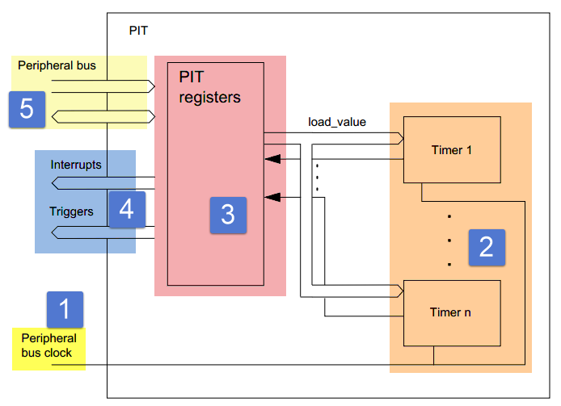
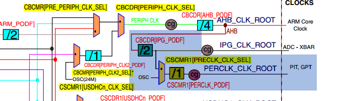

PIT—周期中断定时器
------------------

PIT定时器简介
~~~~~~~~~~~~~

PIT是Periodic Interrupt
Timer的英文缩写，直译就是周期中断定时器。PIT定时器是32位递减计数器，每一个时钟周期减1。每次计时器达到0时它将生成一个触发脉冲并设置中断标志，然后再次加载相应的启动值。PIT定时器常用于为其他外设提供周期信号，例如ADC利用PIT设置采样周期，DMA可以使用PIT设置周期性的DMA传输。

RT1052的PIT模块是一个由四个定时器组成的定时器组，这些定时器有以下主要特性：

-  支持生成中断并且可以独立设置启用或屏蔽。

-  共享一个中断号（IRQ）。

-  具有相同的计数时钟。

-  可以独立设置计数器的计数值、启动和停止。

-  32位递减计数，除定时器0（四个定时器是0到3），其他定时器可以设置为定时器连接模式，组成一个64位定时器。

-  无需重新启动计时器即可更改计数器周期

PIT定时器功能框图
~~~~~~~~~~~~~~~~~

功能框图描述了PIT定时器各个模块之间的关系，我们将结合功能框图详细介绍PIT。如图
17‑1。

图 17‑1PIT定时器功能框图

① PIT计数时钟
^^^^^^^^^^^^^^^^^^^^^^^^^^^^

PIT定时器没有时钟分频寄存器，外部提供的时钟源直接作为定时器的计数时钟。每一个时钟周期计数寄存器的计数值减一。这里只关心时钟。

学习PIT计数器的时钟最好打开《IMXRT1050RM》第18章Clock Controller Module
(CCM)，找到时钟树。这里贴出时钟树的部分截图如图 17‑2。

图 17‑2PIT定时器时钟图

从图
17‑2可以看出，PIT定时器的时钟来自根时钟PERCLK_CLK_ROOT，根时钟PERCLK_CLK_ROOT有两个时钟可选，一个由AHB_CLK_ROOT分频得到，另外一个OSC(24MHz)。第15章
我们详细介绍了时钟的选择与时钟分频设定方法，如果忘记了可以查看相应介绍。在讲解程序是也会提及。

②计数器
^^^^^^^^^^^^^^^^^^^^^^^^^^^^

该模块可以认为是PIT定时器的计数寄存，开启定时器后每个时钟周期计数寄存器的值自动减一。PIT定时器的计数寄存是32位的，可以通过配置相应的寄存器将两个PIT定时器连接为一个，组成一个64位的定时器具体操作在后面介绍。当计数寄存器减为零则设置计数完成标志位，如果开启了中断则触发定时器计时完成中断，并且从自动重装载寄存器加载计数值重新开始计数。

③PIT寄存器
^^^^^^^^^^^^^^^^^^^^^^^^^^^^

PIT寄存器相比其他外设要少很多，主要包括控制寄存器、状态寄存器、和数据寄存器。下一小节有对这些寄存器的详细介绍。

④中断和触发
^^^^^^^^^^^^^^^^^^^^^^^^^^^^

定时器计时结束(计数寄存器减为0)，可以产生中断和触发信号。中断的用途不必多说，触发信号主要用于触发其他外设，例如触发ADC转换、触发DMA传输等。这里我们只要知道PIT的触发信号有这些功能，用到时我们会详细介绍。

⑤外围总线(Peripheral bus)
^^^^^^^^^^^^^^^^^^^^^^^^^^^^

这部分内容只是告诉我们，读/写PIT定时器相关寄存器是通过Peripheral
bus总线完成的。我们设置PIT定时器时几乎不用关心是通过那个总线读写寄存器的。

PIT定时器寄存器介绍
~~~~~~~~~~~~~~~~~~~

表格 17‑1 PIT定时器寄存器汇总

+------------+------------------------------------------------------+
| 寄存器名称 | 寄存器描述                                           |
+============+======================================================+
| MCR        | PIT控制寄存器                                        |
+------------+------------------------------------------------------+
| LTMR64H    | PIT 定时器1、定时器0连接为64位计器时高32位数据寄存器 |
+------------+------------------------------------------------------+
| LTMR64L    | PIT 定时器1、定时器0连接为64位计器时低32位数据寄存器 |
+------------+------------------------------------------------------+
| LDVALx     | PIT定时器x（x 取0~3）自动重装在值寄存器。            |
+------------+------------------------------------------------------+
| CVALx      | PIT定时器x（x 取0~3）当前计数值寄存器                |
+------------+------------------------------------------------------+
| TCTRLx     | PIT定时器x（x 取0~3）控制寄存器                      |
+------------+------------------------------------------------------+
| TFLGx      | PIT定时器x（x 取0~3）状态标志寄存器                  |
+------------+------------------------------------------------------+

表格 17‑2 PIT控制寄存器

+------+------+------+--------+------------------------------------+
| 位段 | 名称 | 类型 | 复位值 | 描述                               |
+======+======+======+========+====================================+
| 2~31 | 保留 |      | 0      |                                    |
+------+------+------+--------+------------------------------------+
| 1    | MDIS | R/W  | 1      | 禁用PIT定时器，                    |
|      |      |      |        |                                    |
|      |      |      |        | 0：启用PIT定时器                   |
|      |      |      |        |                                    |
|      |      |      |        | 1 ：禁用PIT定时器。                |
+------+------+------+--------+------------------------------------+
| 0    | FRZ  | R/W  | 0      | 允许在设备进入调试模式时停止计时器 |
|      |      |      |        |                                    |
|      |      |      |        | 0:调试模式时定时器继续运行         |
|      |      |      |        |                                    |
|      |      |      |        | 1：调试模式时定时器停止运行        |
+------+------+------+--------+------------------------------------+

表格 17‑3 PIT 定时器1、定时器0连接为64位计器时高32位数据寄存器

+------+---------+------+--------+------------------------+
| 位段 |  名称   | 类型 | 复位值 |          描述          |
+======+=========+======+========+========================+
| 23:0 | LTMR64H | R    | 0      | 当连接定时器1和定时器  |
|      |         |      |        | 0组成64位定时器时，    |
|      |         |      |        | 该位寄存器用于保存定时 |
|      |         |      |        | 器1的当前值。          |
+------+---------+------+--------+------------------------+

表格 17‑4 PIT 定时器1、定时器0连接为64位计器时低32位数据寄存器

+------+---------+------+--------+------------------------+
| 位段 |  名称   | 类型 | 复位值 |          描述          |
+======+=========+======+========+========================+
| 23:0 | LTMR64L | R    | 0      | 当连接定时器1和定时器  |
|      |         |      |        | 0组成64位定时器时，    |
|      |         |      |        | 该位寄存器用于保存定时 |
|      |         |      |        | 器0的当前值。          |
+------+---------+------+--------+------------------------+

表格 17‑5 PIT定时器自动重装在值寄存器。

+------+------+------+--------+------------------------+
| 位段 | 名称 | 类型 | 复位值 |          描述          |
+======+======+======+========+========================+
| 23:0 | TSV  | R/W  | 0      | 设置定时器自动重装载值 |
|      |      |      |        | ，当定时器计数到0时，  |
|      |      |      |        | 设置计数溢出标志，如果 |
|      |      |      |        | 开启了中断则生成一个中 |
|      |      |      |        | 断，并再次加载这个寄存 |
|      |      |      |        | 器值。                 |
|      |      |      |        |                        |
|      |      |      |        | 向该寄存器写入新值不会 |
|      |      |      |        | 立即重新启动定时器，当 |
|      |      |      |        | 前计时结束后写入的新值 |
|      |      |      |        | 生效。若要使新值立即生 |
|      |      |      |        | 效，需要先停止定时器， |
|      |      |      |        | 写入新值后启动定时器。 |
+------+------+------+--------+------------------------+

表格 17‑6 PIT定时器x当前计数值寄存器

+------+------+------+--------+----------------------------------+
| 位段 | 名称 | 类型 | 复位值 | 描述                             |
+======+======+======+========+==================================+
| 31:0 | TVL  | R    | 0      | 如果开启了定时器表示当前定时器值 |
|      |      |      |        |                                  |
|      |      |      |        | 开启Debug模式时该值被冻结。      |
+------+------+------+--------+----------------------------------+

表格 17‑7PIT定时器x控制寄存器

+------+------+------+--------+------------------------+
| 位段 | 名称 | 类型 | 复位值 |          描述          |
+======+======+======+========+========================+
| 31:3 | 保留 |      |        |                        |
+------+------+------+--------+------------------------+
| 2    | CHN  | R/W  | 0      | 是否开启定时器连接模式 |
|      |      |      |        | ，只有定时器3、2、1    |
|      |      |      |        | 能够设计此位，定时器0  |
|      |      |      |        | 无法开启连接模式。开启 |
|      |      |      |        | 定时器1的连接模式时，  |
|      |      |      |        | 定时器1与定时器0连接   |
|      |      |      |        | 为一个64位倒计数计时   |
|      |      |      |        | 器。                   |
|      |      |      |        |                        |
|      |      |      |        | 0：不启用定时器连接    |
|      |      |      |        |                        |
|      |      |      |        |                        |
|      |      |      |        | 1：启用定时器连接      |
+------+------+------+--------+------------------------+
| 1    | TIE  | R/W  | 0      | 定时器中断使能位       |
|      |      |      |        |                        |
|      |      |      |        |                        |
|      |      |      |        | 注意：当TFLGx[T        |
|      |      |      |        | IF]                    |
|      |      |      |        | 为1，开启使能中断之后  |
|      |      |      |        | 会立即触发中断。为避免 |
|      |      |      |        | 这种情况，使能定时器中 |
|      |      |      |        | 断之前需要清除TFLG     |
|      |      |      |        | x[TIF]位.              |
|      |      |      |        |                        |
|      |      |      |        | 0:禁止定时器x计时结    |
|      |      |      |        | 束中断                 |
|      |      |      |        |                        |
|      |      |      |        | 1：使能定时器x计时结   |
|      |      |      |        | 束中断                 |
+------+------+------+--------+------------------------+
| 0    | TEN  | R/W  | 0      | 定时器使能位           |
|      |      |      |        |                        |
|      |      |      |        |                        |
|      |      |      |        | 0：不使能定时器x       |
|      |      |      |        |                        |
|      |      |      |        |                        |
|      |      |      |        | 1：使能定时器x         |
+------+------+------+--------+------------------------+

表格 17‑8 PIT定时器x状态标志寄存器

+------+------+------+--------+------------------------+
| 位段 | 名称 | 类型 | 复位值 |          描述          |
+======+======+======+========+========================+
| 23:1 | 保留 |      |        |                        |
+------+------+------+--------+------------------------+
| 0    | TIF  | W1C  | 0      | 当定时器计时完成自动设 |
|      |      |      |        | 置该位为1,如果开启了   |
|      |      |      |        | 中断，则触发中断。向该 |
|      |      |      |        | 位写1清除该位，写入0   |
|      |      |      |        | 无效。                 |
|      |      |      |        |                        |
|      |      |      |        | 注意：在开启中断之前要 |
|      |      |      |        | 清楚该位。如果该位为1  |
|      |      |      |        | ，则开启中断后会立即触 |
|      |      |      |        | 发中断。               |
+------+------+------+--------+------------------------+

PIT定时器常用配置介绍
~~~~~~~~~~~~~~~~~~~~~

RT1052的PIT定时器寄存器较少，配置过程也非常简单。如果不使用定时器连接模式，配置过程为：

-  配置模式控制寄存器（MCR）开启定时器时钟根据需要是否使用Debug模式

-  设置自动重装在值寄存器（VDVAL）设定计数值为time

-  设置控制寄存器（TCRL）开启定时器。

-  如果使用中断需要先清除状态标识寄存器（TFLG）的中断标志位，并且设置控制寄存器（TCRL）开启定时器计时结束中断。

    定时时间的计算：

    定时时间（单位：秒） = time/f\ :sub:`pit_clock`

    说明：time：动重装在值寄存器（VDVAL）设定的计数值为

    f\ :sub:`pit_clock`\ ：PIT定时器的时钟频率（单位：Hz）

使用定时器连接模式时配置过程如下（以定时器2，使用计时完成中断为例）

-  配置模式控制寄存器（MCR）开启定时器时钟根据需要是否使用Debug模式

-  配置自动重装载值寄存器（VDVAL2）设定定时器2计数值为time2

-  配置状态标识寄存器（VDVAL2）清除中断标志位，

-  设置控制寄存器（TCRL2）开启定时器计时结束中断

-  设置控制寄存器（TCRL2）开启定时器2

-  配置自动重装载值寄存器（VDVAL1）设定定时器1计数值为time1

-  设置控制寄存器（TCRL2）开启定时器2

..

    定时时间的计算：

    定时时间（单位：秒） = time2*tim1/f\ :sub:`pit_clock`

    说明：time1：定时器1自动重装载值寄存器（VDVAL1）设定的计数值

    Time2：定时器2自动重装载值寄存器（VDVAL2）设定的计数值

    f\ :sub:`pit_clock`\ ：PIT定时器的时钟频率（单位：Hz）

SDK库将具体的寄存器操作封装为函数，将一些常用的配置参数和配置选项使用宏定义和枚举类型重新定义。我们无需操作具体寄存器即可完成定时器的配置，这种方式大大提高了程序的可读性，减少出错概率。讲解寄存器只是让我们深入了解PIT定时器。后面的实验我们将采用SDK库来编写。

PIT定时实验
~~~~~~~~~~~

利用PIT产生1秒的时基，LED以1秒的频率闪烁。

硬件设计
^^^^^^^^

PIT属于单片机内部的外设，并且没有与之对应的输出引脚。不需要额外的硬件电路，我们在程序中控制RGB
led灯对应的引脚来控制RGB led 亮、灭时间。

软件设计
^^^^^^^^

这里只讲解核心的部分代码，有些变量的设置，头文件的包含等并没有涉及到，完整的代码请参考本章配套的工程。我们创建了两个文件：bsp_pit.c和bsp_pit.h文件用来存放PIT驱动程序及相关宏定义。

编程要点
''''''''

1、配置定时器工作模式。

2、设置自动重装载值。

3、清除中断标志位，开启定时器中断，编写中断服务函数。

代码分析
''''''''

PIT定时器配置过程比较简单，大部分函数只是对PIT定时器相应寄存器进行简单的读写操作。PIT定时器寄存器的详细介绍请参考17.3
章节PIT定时器寄存器介绍和《IMXRT1050RM》PIT章节配置库函数。

PIT相关宏定义
*****************

.. code-block:: c
   :name: 代码清单 17‑1 PIT宏定义（bsp_pit.h）
   :caption: 代码清单 17‑1 PIT宏定义（bsp_pit.h）
   :linenos:

   /*定时器时钟频率宏定义*/
   #define PIT_SOURCE_CLOCK CLOCK_GetFreq(kCLOCK_OscClk)

   /*中断宏定义*/
   #define PIT_IRQ_ID PIT_IRQn
   #define PIT_LED_HANDLER PIT_IRQHandler

   /*定时器通道宏定义*/
   #define PIT_CHANNEL_X kPIT_Chnl_0

   /*计时时间宏定义（单位：us)*/
   #define time 1000000U

如果需要修改使用的定时器或者修改定时器定时周期只需要修改这些宏定义即可。宏PIT_SOURCE_CLOCK用于保存当前定时器的计数时钟频率，它是通过调用CLOCK_GetFreq(kCLOCK_OscClk)实现的。CLOCK_GetFreq函数定义在fsl_clock.c文件，用于读取指定时钟的频率。

PIT_CHANNEL_X
用于指定使用的PIT通道，PIT共有4个通道。每个通道有各自的计数寄存器、重装载寄存器等但是使用相同的计数时钟。可以认为这四个通道是使用相同计数时钟的四个定时器。

PIT定时器初始化函数
**********************************

.. code-block:: c
   :name: 代码清单 17‑2 PIT定时器初始化函数（bsp_pit.c）
   :caption: 代码清单 17‑2 PIT定时器初始化函数（bsp_pit.c）
   :linenos:

   void PIT_TIMER_Init(void)
   {
   pit_config_t pitConfig; //定义PIT初始化结构体
   
   /***************************第一部分****************************/
   /* 设置PIT定时器时钟 OSC_CLK*/
   CLOCK_SetMux(kCLOCK_PerclkMux, 1U);
   /* 设置 PERCLK_CLK 时钟分频为 1 */
   CLOCK_SetDiv(kCLOCK_PerclkDiv, 0U);

   /**************************第二部分****************************/
   /*获得PIT定时器默认配置参数*/
   PIT_GetDefaultConfig(&pitConfig);
   /*修改默认配置参数*/
   pitConfig.enableRunInDebug = true;
   /*初始化PIT */
   PIT_Init(PIT, &pitConfig);
   
   /**************************第三部分************************/
   /* 设置PIT定时器通道0自动重装载值 */
   PIT_SetTimerPeriod(PIT, PIT_CHANNEL_X, \
                  USEC_TO_COUNT(TIME_0, PIT_SOURCE_CLOCK));
   
   /*************************第四部分**************************/
   /*清除通道0的中断标志位*/
   PIT_ClearStatusFlags(PIT, PIT_CHANNEL_X, kPIT_TimerFlag);
   /* 使能通道0的计时完成中断 */
   PIT_EnableInterrupts(PIT, PIT_CHANNEL_X, kPIT_TimerInterruptEnable);
   /*设置中断优先级,*/
   set_IRQn_Priority(PIT_IRQ_ID,Group4_PreemptPriority_6, \
                                    Group4_SubPriority_0);
   /* 使能PIT定时器中断 */
   EnableIRQ(PIT_IRQ_ID);
   }

-  第一部分，设置PIT定时器时钟，CLOCK_SetMux函数用于选择时钟源，这里选择OSC(24MHz)作为PIT定时器的计数频率。CLOCK_SetDiv函数用于设置时钟分频，这里设置不分频，这时PIT定时器的计数频率为24MHz。有关时钟选择和时钟分频请参考第15章
   CCM章节。

-  第二部分，初始化PIT。PIT的初始化使用到了PIT初始化结构体pit_config_t，如代码清单
   17‑3。

.. code-block:: c
   :name: 代码清单 17‑3PIT初始化结构体pit_config_t(fsl_pit.h)
   :caption: 代码清单 17‑3PIT初始化结构体pit_config_t(fsl_pit.h)
   :linenos:

   typedef struct _pit_config
   {
      bool enableRunInDebug; /*是否使能Debug模式*/
   } pit_config_t;

初始化结构体中只有一个用于设置是否使能Debug模式的成员。设置位true，则在Debug模式下PIT正常运行。为false，在Debug模式下PIT定时器停止运行。

-  第三部分，设置PIT定时器自动重装载值。函数PIT_SetTimerPeriod用于设置定时器自动重装载值，共有三个参数：

a) base，指定PIT定时器的基址，官方SDK库将PIT定时器的基址定义为PIT。

b) channel，指定使用的PIT通道，PIT共有4个通道，根据需要选择。在程序中我们使用了通道0，为了方便移植使用宏定义重命名为PIT_CHANNEL_X。

c) count，自动重装载值。在本程序中使用宏USEC_TO_COUNT指定自动重装载值，函数宏定义如代码清单
   17‑4。

.. code-block:: c
   :name: 代码清单 17‑4USEC_TO_COUNT宏定义(fsl_commont.h)
   :caption: 代码清单 17‑4USEC_TO_COUNT宏定义(fsl_commont.h)
   :linenos:

   #define USEC_TO_COUNT(us, clockFreqInHz) \
                  (uint64_t)((uint64_t)us * clockFreqInHz / 1000000U)

该宏定义的功能是将定义的微秒数转化为计数个数，有两个参数，参数us，用于指定微秒数，参数clockFreqInHz指定定时器的计数频率。在本实验中使用宏PIT_SOURCE_CLOCK获得PIT定时器的计数频率。

-  第四部分，因为本实验要使用中断，所以在开启定时器之前要清除中断标志位、使能中断、并设置中断优先级，最后使能中断。

中断服务函数
*****************

.. code-block:: c
   :name: 代码清单 17‑5 定时器中断服务函数
   :caption: 代码清单 17‑5 定时器中断服务函数
   :linenos:

   unsigned int k = 0;
   
   void PIT_LED_HANDLER(void)
   {
      k++;
      /* 清除中断标志位.*/
      PIT_ClearStatusFlags(PIT, PIT_CHANNEL_X, kPIT_TimerFlag);
      
      if(0 == (k/2))
      {
      RGB_RED_LED_ON; //RGB led 灯红灯亮
      }
      else
      {
      RGB_RED_LED_OFF;//RGB led 灯熄灭
      }
   }

进入中断服务函数之后首先清除中断标志位，然后根据中断发生次数切换RGB
LED灯的亮灭。

主函数
*****************

.. code-block:: c
   :name: 代码清单 17‑6 主函数
   :caption: 代码清单 17‑6 主函数
   :linenos:

   int main(void)
   {
      /************************************第一部分***************************/
      /* 初始化内存保护单元 */
      BOARD_ConfigMPU();
      /* 初始化开发板引脚 */
      BOARD_InitPins();
      /* 初始化开发板时钟 */
      BOARD_BootClockRUN();
      /* 初始化调试串口 */
      BOARD_InitDebugConsole();
      
      /*设置中断优先级分组*/
      Set_NVIC_PriorityGroup(Group_4); 
      
      /*****************************此处省略时钟打印相关代码****************/
   
      PRINTF("PIT定时器-使用PIT定时器控制RGB LED 灯的闪烁\r\n");
      
      /************************************第二部分************************/
      /* 初始化LED引脚 */
      LED_GPIO_Config();  
      
      /*初始化PIT定时器*/
      PIT_TIMER_Init();
      /*开启定时器*/
      PIT_StartTimer(PIT, PIT_CHANNEL_X);
      while(1)
      {    
   
      }     
   }

代码第一部分完成系统初始化。第二部分初始化LED和PIT定时器并开启。之后在while（1）死循环中不执行任何操作。每次计时完成在中断服务函数中翻转
RGB led 灯的状态。

下载验证
^^^^^^^^

把编译好的程序下载到开发板并复位，可看到核心板上的RGB
灯亮灭交替显示，时间间隔为1秒。
