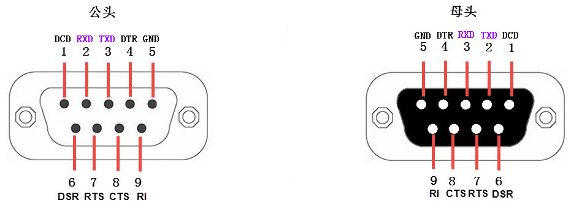

LPUART—串口通讯
---------------

本章参考资料：《IMXRT1050RM》（参考手册）。

学习本章时，配合《IMXRT1050RM》第39章LPUART章节一起阅读，效果会更佳，特别是涉及到寄存器说明的部分。

特别说明，本书内容是以RT1050系列控制器资源讲解。

串口通讯协议简介
~~~~~~~~~~~~~~~~

串口通讯(Serial
Communication)是一种设备间非常常用的串行通讯方式，因为它简单便捷，大部分电子设备都支持该通讯方式，电子工程师在调试设备时也经常使用该通讯方式输出调试信息。

在计算机科学里，大部分复杂的问题都可以通过分层来简化。如芯片被分为内核层和片上外设；SDK_2.3.1_MIMXRT1052xxxxx（官方SDK原件）库则是在寄存器与用户代码之间的软件层。对于通讯协议，我们也以分层的方式来理解，最基本的是把它分为物理层和协议层。物理层规定通讯系统中具有机械、电子功能部分的特性，确保原始数据在物理媒体的传输。协议层主要规定通讯逻辑，统一收发双方的数据打包、解包标准。简单来说物理层规定我们用嘴巴还是用肢体来交流，协议层则规定我们用中文还是英文来交流。

下面我们分别对串口通讯协议的物理层及协议层进行讲解。

物理层
^^^^^^

串口通讯的物理层有很多标准及变种，我们主要讲解RS-232标准
，RS-232标准主要规定了信号的用途、通讯接口以及信号的电平标准。

使用RS-232标准的串口设备间常见的通讯结构见图 18‑1

.. image:: media/image1.jpeg
   :align: center
   :alt: image1
   :name: 图18_1

图 18‑1串口通信结构图

在上面的通讯方式中，两个通讯设备的“DB9接口”之间通过串口信号线建立起连接，串口信号线中使用“RS-232标准”传输数据信号。由于RS-232电平标准的信号不能直接被控制器直接识别，所以这些信号会经过一个“电平转换芯片”转换成控制器能识别的“TTL校准”的电平信号，才能实现通讯。

电平标准 
'''''''''

根据通讯使用的电平标准不同，串口通讯可分为TTL标准及RS-232标准，见表格
18‑1。

表格 18‑1电平标准与RS232电平标准

+----------+------------------+
| 通讯标准 | 电平标准(发送端) |
+==========+==================+
| 5V TTL   | 逻辑1：2.4V-5V   |
|          |                  |
|          | 逻辑0：0~0.5V    |
+----------+------------------+
| RS-232   | 逻辑1：-15V~-3V  |
|          |                  |
|          | 逻辑0：+3V~+15V  |
+----------+------------------+

我们知道常见的电子电路中常使用TTL的电平标准，理想状态下，使用5V表示二进制逻辑1，使用0V表示逻辑0；而为了增加串口通讯的远距离传输及抗干扰能力，它使用-15V表示逻辑1，+15V表示逻辑0。使用RS232与TTL电平校准表示同一个信号时的对比见图
18‑2。

.. image:: media/image2.jpeg
   :align: center
   :alt: image2
   :name: 图18_2

图 18‑2 RS-232与TTL电平标准下表示同一个信号

因为控制器一般使用TTL电平标准，所以常常会使用MA3232芯片对TTL及RS-232电平的信号进行互相转换。

RS-232信号线
''''''''''''

在最初的应用中，RS-232串口标准常用于计算机、路由与调制调解器(MODEN，俗称“猫”)之间的通讯
，在这种通讯系统中，设备被分为数据终端设备DTE(计算机、路由)和数据通讯设备DCE(调制调解器)。我们以这种通讯模型讲解它们的信号线连接方式及各个信号线的作用。

在旧式的台式计算机中一般会有RS-232标准的COM口(也称DB9接口)，见图 18‑3。

图 18‑3 电脑主板上的COM口及串口线

其中接线口以针式引出信号线的称为公头，以孔式引出信号线的称为母头。在计算机中一般引出公头接口，而在调制调解器设备中引出的一般为母头，使用上图中的串口线即可把它与计算机连接起来。通讯时，串口线中传输的信号就是使用前面讲解的RS-232标准调制的。

在这种应用场合下，DB9接口中的公头及母头的各个引脚的标准信号线接法见图
18‑4及表格 18‑2。

图 18‑4 DB9标准的公头及母头接法

表格 18‑2
DB9信号线说明(公头，为方便理解，可把DTE理解为计算机，DCE理解为调制调解器)

+------+-------------------+------+----------+------------------------+
| 序号 |       名称        | 符号 | 数据方向 |          说明          |
+======+===================+======+==========+========================+
| 1    | 载波检测          | DCD  | DTEDCE   | Data                   |
|      |                   |      |          | Carrier                |
|      |                   |      |          | Detect，数据载波       |
|      |                   |      |          | 检测，用于DTE告知对    |
|      |                   |      |          | 方，本机是否收到对方的 |
|      |                   |      |          | 载波信号               |
+------+-------------------+------+----------+------------------------+
| 2    | 接收数据          | RXD  | DTEDCE   | Receive                |
|      |                   |      |          | Data，数据接收信号     |
|      |                   |      |          | ，即输入               |
|      |                   |      |          | 。                     |
+------+-------------------+------+----------+------------------------+
| 3    | 发送数据          | TXD  | DTEDCE   | Transmit               |
|      |                   |      |          | Data，数据发送信号     |
|      |                   |      |          | ，即输出。两个设备之间 |
|      |                   |      |          | 的TXD与RXD应交叉       |
|      |                   |      |          | 相连                   |
+------+-------------------+------+----------+------------------------+
| 4    | 数据终端          | DTR  | DTEDCE   | Data                   |
|      | (DTE) 就绪        |      |          | Terminal               |
|      |                   |      |          | Ready，数据终端就      |
|      |                   |      |          | 绪，用于DTE向对方告    |
|      |                   |      |          | 知本机是否已准备好     |
+------+-------------------+------+----------+------------------------+
| 5    | 信号地            | GND  | -        | 地线，两个通讯设备之间 |
|      |                   |      |          | 的地电位可能不一样，这 |
|      |                   |      |          | 会影响收发双方的电平信 |
|      |                   |      |          | 号，所以两个串口设备之 |
|      |                   |      |          | 间必须要使用地线连接， |
|      |                   |      |          | 即共地。               |
+------+-------------------+------+----------+------------------------+
| 6    | 数据设备(DCE)就绪 | DSR  | DTEDCE   | Data Set               |
|      |                   |      |          | Ready，数据发送就      |
|      |                   |      |          | 绪，用于DCE告知对方    |
|      |                   |      |          | 本机是否处于待命状态   |
+------+-------------------+------+----------+------------------------+
| 7    | 请求发送          | RTS  | DTEDCE   | Request To             |
|      |                   |      |          | Send，请求发送，       |
|      |                   |      |          |                        |
|      |                   |      |          | DTE 请求               |
|      |                   |      |          | DCE                    |
|      |                   |      |          | 本设备向DCE端发送数    |
|      |                   |      |          | 据                     |
+------+-------------------+------+----------+------------------------+
| 8    | 允许发送          | CTS  | DTEDCE   | Clear To               |
|      |                   |      |          | Send，允许发送，D      |
|      |                   |      |          | CE回应对方的RTS发      |
|      |                   |      |          | 送请求，告知对方是否可 |
|      |                   |      |          | 以发送数据             |
+------+-------------------+------+----------+------------------------+
| 9    | 响铃指示          | RI   | DTEDCE   | Ring                   |
|      |                   |      |          | Indicator，响          |
|      |                   |      |          | 铃指示，表示DCE端与    |
|      |                   |      |          | 线路已接通             |
+------+-------------------+------+----------+------------------------+

上表中的是计算机端的DB9公头标准接法，由于两个通讯设备之间的收发信号(RXD与TXD)应交叉相连，所以调制调解器端的DB9母头的收发信号接法一般与公头的相反，两个设备之间连接时，只要使用“直通型”的串口线连接起来即可，见图
18‑5。

.. image:: media/image5.jpeg
   :align: center
   :alt: image5
   :name: 图18_5

图 18‑5 计算机与调制调解器的信号线连接

串口线中的RTS、CTS、DSR、DTR及DCD信号，使用逻辑
1表示信号有效，逻辑0表示信号无效。例如，当计算机端控制DTR信号线表示为逻辑1时，它是为了告知远端的调制调解器，本机已准备好接收数据，0则表示还没准备就绪。

在目前的其它工业控制使用的串口通讯中，一般只使用RXD、TXD以及GND三条信号线，直接传输数据信号。而RTS、CTS、DSR、DTR及DCD信号都被裁剪掉了，如果您在前面被这些信号弄得晕头转向，那就直接忽略它们吧。

协议层
^^^^^^

串口通讯的数据包由发送设备通过自身的TXD接口传输到接收设备的RXD接口。在串口通讯的协议层中，规定了数据包的内容，它由启始位、主体数据、校验位以及停止位组成，通讯双方的数据包格式要约定一致才能正常收发数据，其组成见图
18‑6。

.. image:: media/image6.jpeg
   :align: center
   :alt: image6
   :name: 图18_6

图 18‑6 串口数据包的基本组成

波特率
''''''

本章中主要讲解的是串口异步通讯，异步通讯中由于没有时钟信号(如前面讲解的DB9接口中是没有时钟信号的)，所以两个通讯设备之间需要约定好波特率，即每个码元的长度，以便对信号进行解码，图
18‑6中用虚线分开的每一格就是代表一个码元。常见的波特率为4800、9600、115200等。

通讯的起始和停止信号
''''''''''''''''''''

串口通讯的一个数据包从起始信号开始，直到停止信号结束。数据包的起始信号由一个逻辑0的数据位表示，而数据包的停止信号可由0.5、1、1.5或2个逻辑1的数据位表示，只要双方约定一致即可。

有效数据
''''''''

在数据包的起始位之后紧接着的就是要传输的主体数据内容，也称为有效数据，有效数据的长度常被约定为5、6、7或8位长。

数据校验
''''''''

在有效数据之后，有一个可选的数据校验位。由于数据通信相对更容易受到外部干扰导致传输数据出现偏差，可以在传输过程加上校验位来解决这个问题。校验方法有奇校验(odd)、偶校验(even)、0校验(space)、1校验(mark)以及无校验(noparity)，它们介绍如下：

-  奇校验要求有效数据和校验位中“1”的个数为奇数，比如一个8位长的有效数据为：01101001，此时总共有4个“1”，为达到奇校验效果，校验位为“1”，最后传输的数据将是8位的有效数据加上1位的校验位总共9位。

-  偶校验与奇校验要求刚好相反，要求帧数据和校验位中“1”的个数为偶数，比如数据帧：11001010，此时数据帧“1”的个数为4个，所以偶校验位为“0”。

-  0校验是不管有效数据中的内容是什么，校验位总为“0”，1校验是校验位总为“1”。

-  在无校验的情况下，数据包中不包含校验位。

RT1052的LPUART简介
~~~~~~~~~~~~~~~~~~

RT1052芯片具有多达8个LPUART外设用于串口通讯，它是Low Power Universal
Asynchronous Receiver
Transmitter的缩写，即低功耗异步收发器，它可以灵活地与外部设备进行全双工数据交换。有别于USART(Universal
synchronous asynchronous receiver

transmitter)，
UART是在USART基础上裁剪掉了同步通信功能，只支持异步通信。简单区分同步和异步就是看通信时需不需要对外提供时钟输出，我们平时用的串口通信基本都是UART。

UART满足外部设备对工业标准NRZ异步串行数据格式的要求，并且使用了小数波特率发生器，可以提供多种波特率，使得它的应用更加广泛。UART支持异步单向通信和半双工单线通信；还支持局域互连网络LIN、智能卡(SmartCard)协议与lrDA(红外线数据协会)
SIR ENDEC规范。

UART支持使用DMA，可实现高速数据通信，有关DMA具体应用将在DMA章节作具体讲解。

UART在RT1052应用最多莫过于“打印”程序信息，一般在硬件设计时都会预留一个UART通信接口连接电脑，用于在调试程序是可以把一些调试信息“打印”在电脑端的串口调试助手工具上，从而了解程序运行是否正确、指出运行出错位置等等。

RT1052的串口输出的是TTL电平信号，若需要RS-232标准的信号可使用MAX3232芯片进行转换。

UART功能框图
~~~~~~~~~~~~

RT1052的UART功能框图包含了UART最核心内容，掌握了功能框图，对UART就有一个整体的把握，在编程时就思路就非常清晰，见图
18‑7和图 18‑8。

图 18‑7 LPUART 发送框图

图 18‑8 LPUART 接收框图

①和⑨，通信引脚
^^^^^^^^^^^^^^^^^^^^^^^^^^^^

UART模块通过RxD与TxD与外界通信，如果使用硬件流控还会用到CTS和RTS，以UART1为例，可用的外部输出引脚如表格
18‑3所示，其他UART对应的外部引脚请参考《IMXRT1050RM》（参考手册）External
Signals and Pin Multiplexing章节。

表格 18‑3UART1引脚

+---------------+---------------+
| LPUART1_TX    | GPIO_AD_B0_12 |
+===============+===============+
| LPUART1_RX    | GPIO_AD_B0_13 |
+---------------+---------------+
| LPUART1_CTS_B | GPIO_AD_B0_14 |
+---------------+---------------+
| LPUART1_RTS_B | GPIO_AD_B0_15 |
+---------------+---------------+

②和⑥，设置串口的波特率
^^^^^^^^^^^^^^^^^^^^^^^^^^^^

波特率指数据信号对载波的调制速率，它用单位时间内载波调制状态改变次数来表示，单位为波特。比特率指单位时间内传输的比特数，单位bit/s(bps)。对于UART波特率与比特率相等，以后不区分这两个概念。波特率越大，传输速率越快。

UART的发送器和接收器使用相同的波特率。计算公式如下：

公式 18‑1 波特率计算公式

其中，LPUART ASYNCH Module
Clock为UART时钟，SBR[12:0]位LPUART波特率寄存器（BAUD）的0~12位对应的值，OSR为LPUART波特率寄存器（BAUD）的24~28位对应的值。

③和⑦数据寄存器
^^^^^^^^^^^^^^^^^^^^^^^^^^^^

UART数据寄存器LPUART Data Register
(DATA)只有0~9位有效，并且是否使用十位字节数据取决于LPUART控制寄存器BAUD的M10位，当M10位为0时表示7到9位数据字长，当M位为1表示10位数据字长，我们一般使用8位数据字长。

数据寄存器LPUART Data Register
(DATA)实际是包含了两个寄存器，一个只用于发送，一个只用于接收。

数据寄存器LPUART Data Register
(DATA)介于系统总线和移位寄存器之间。串行通信是一个位一个位传输的，发送时把DATA内容转移到发送移位寄存器，然后把移位寄存
器数据每一位发送出去，接收时把接收到的每一位顺序保存在接收移位寄存器内然后才转移到DATA寄存器。

UART支持DMA传输，可以实现高速数据传输，具体DMA使用将在DMA章节讲解。

④控制器
^^^^^^^^^^^^^^^^^^^^^^^^^^^^

UART有专门控制发送的发送器、控制接收的接收器，还有唤醒单元、中断控制等等。使用UART之前需要向LPUART的控制寄存器
(CTRL)的RE位置1使能UART接收，TE位置1使能UART发送。发送或者接收数据字长可选7~9位或10位，LPUART波特率寄存器BAUD的M10位控制数据字长。

发送器
''''''''''''''''''''''''''''''''''

当LPUART Control Register
(CTRL)寄存器的的发送使能位TE置1时，启动数据发送，发送移位寄存器的数据会在TX引脚输出。

一个字符帧发送需要三个部分：起始位+数据帧+停止位。起始位是一个位周期的低电平，位周期就是每一位占用的时间；数据帧就是我们要发送的7~9位或10位数据，数据是从最低位开始传输的（RT1052的LPUART可以配置先发送低位还是高位）；停止位是一定时间周期的高电平。

停止位时间长短是可以通过LPUART Baud Rate Register
(BAUD)寄存器的SBNS位控制，可选1个、2个停止位。默认使用1个停止位。2个停止位适用于正常UART模式、单线模式和调制解调器模式。当选择8位字长，使用1个停止位时，具体发送字符时序图见图
18‑9。

.. image:: media/image10.png
   :align: center
   :alt: image10
   :name: 图18_10

图 18‑9 字符发送时序

当发送使能位TE置1之后，发送器开始会先发送一个空闲帧(一个数据帧长度的高电平)，接下来就可以往LPUART
Data Register
(DATA)寄存器写入要发送的数据。在写入最后一个数据后，需要等待LPUART
状态寄存器 (STAT)的TC位为1，表示数据传输完成，如果LPUART控制寄存器
(CTRL) 的TCIE位置1，将产生中断。

在发送数据时，编程的时候有几个比较重要的标志位我们来总结下。

表格 18‑4 串口重要标志位

+------+----------------------------------------+
| 名称 | 描述                                   |
+======+========================================+
| TE   | 发送使能                               |
+------+----------------------------------------+
| TXE  | 发送寄存器为空，发送单个字节的时候使用 |
+------+----------------------------------------+
| TC   | 发送完成，发送多个字节数据的时候使用   |
+------+----------------------------------------+
| TXIE | 发送完成中断使能                       |
+------+----------------------------------------+

接收器
''''''''''''''''''''''''''''''''''

LPUART 控制寄存器
(CTRL)的RE位置1使能UART接收，使得接收器在RX线开始搜索起始位。在确定到起始位后就根据RX线电平状态把数据存放在接收移位寄存器内。接收完成后就把接收移位寄存器数据移到LPUART
数据寄存器 (DATA)内，LPUART 状态寄存器
(STAT)的RDRF位置1，同时如果LPUART控制寄存器 (CTRL)
的RIE位置1的话可以产生中断。

在接收数据时，编程的时候有几个比较重要的标志位我们来总结下。

表格 18‑5 发送数据重要标志位

+------+------------------+
| 名称 | 描述             |
+======+==================+
| RE   | 接收使能         |
+------+------------------+
| RDRF | 读数据寄存器非空 |
+------+------------------+
| RIE  | 发送完成中断使能 |
+------+------------------+

为得到一个信号真实情况，需要用一个比这个信号频率高的采样信号去检测，称为过采样，这个采样信号的频率大小决定最后得到源信号准确度，一般频率越高得到的准确度越高，但为了得到越高频率采样信号越也困难，运算和功耗等等也会增加，所以一般选择合适就好。

接收器可配置为不同过采样技术，以实现从噪声中提取有效的数据。LPUART
波特率寄存器
(BAUD)的OSR位用来选择不同的采样采样方法，如果OSR位设置为00111b采用8倍过采样，即用8个采样信号采样一位数据；如果OVER8位设置为01111b采用16倍过采样，即用16个采样信号采样一位数据。

UART的起始位检测需要用到特定序列。如果在RX线识别到该特定序列就认为是检测到了起始位。起始位检测对使用16倍或8倍过采样的序列都是一样的。该特定序列为：1110X0X0X0000，其中X表示电平任意，1或0皆可。

8倍过采样速度更快，最高速度可达fPCLK/8，fPCLK为UART时钟，采样过程见图
18‑10。使用第4、5、6次脉冲的值决定该位的电平状态。

图 18‑10 8倍数过采样过程

16倍过采样速度虽然没有8倍过采样那么快，但得到的数据更加精准，其最大速度为fCK/16，采样过程见图
18‑11。使用第8、9、10次脉冲的值决定该位的电平状态。

.. image:: media/image12.png
   :align: center
   :alt: image12
   :name: 图18_12

图 18‑11 16倍过采样过程

④和⑧中断控制
^^^^^^^^^^^^^^^^^^^^^^^^^^^^

UART有多个中断请求事件，具体见表格 18‑6。

表格 18‑6 UART中断请求事件

+----------------+----------+------------+
| 中断事件       | 事件标志 | 使能控制位 |
+================+==========+============+
| 发送完成       | TC       | TCIE       |
+----------------+----------+------------+
| 接收到数据事件 | RDRF     | RIE        |
+----------------+----------+------------+
| 检测到空闲线路 | IDLE     | RIE        |
+----------------+----------+------------+
| 校验错误事件   | PF       | PEIE       |
+----------------+----------+------------+
| 帧错误         | FE       | FEIE       |
+----------------+----------+------------+
| 传输事件       | TDRE     | TIE        |
+----------------+----------+------------+
| 数据溢出事件   | OR       | ORIE       |
+----------------+----------+------------+

功能引脚
^^^^^^^^^^^^^^^^^^^^^^^^^^^^

UART主要使用如下引脚进行通讯：

-  TX：发送数据输出引脚。

-  RX：接收数据输入引脚。

-  nRTS：请求以发送(Request To
   Send)，n表示低电平有效。如果使能RTS流控制，当UART接收器准备好接收新数据时就会将nRTS变成低电平；当接收寄存器已满时，nRTS将被设置为高电平。该引脚只适用于硬件流控制。

-  nCTS：清除以发送(Clear To
   Send)，n表示低电平有效。如果使能CTS流控制，发送器在发送下一帧数据之前会检测nCTS引脚，如果为低电平，表示可以发送数据，如果为高电平则在发送完当前数据帧之后停止发送。该引脚只适用于硬件流控制。

UART引脚在RT1052芯片具体分布见《IMXRT1050RM》(参考手册)第四章表4-1。

UART初始化结构体详解
~~~~~~~~~~~~~~~~~~~~

RT1052官方固件库对每个外设都建立了一个初始化结构体，比如lpuart_config_t，结构体成员用于设置外设工作参数，并由外设初始化配置函

LPUART_Init
()调用，这些设定参数将会设置外设相应的寄存器，达到配置外设工作环境的目的。

理解了初始化结构体每个成员意义基本上就可以对该外设运用自如了。串口的初始化结构体定义在fsl_lpuart.h文件中，初始化库函数定义在fsl_lpuart.c文件中，编程时我们可以结合这两个文件内注释使用。

.. code-block:: c
   :name: 代码清单 18‑1 UART初始化结构体(fsl_lpuart.h)
   :caption: 代码清单 18‑1 UART初始化结构体(fsl_lpuart.h)
   :linenos:

   typedef struct _lpuart_config {
      uint32_t baudRate_Bps;  //波特率
      
      /*奇偶校验方式，无校验（默认值），奇校验，偶校验*/

      lpuart_parity_mode_t parityMode;
      /* 数据位位数, 8位 (默认值),7位 */
      lpuart_data_bits_t dataBitsCount;
      bool isMsb;   //数据位顺序, LSB (默认值) ,MSB
   
      /*如果两位长停止位是可用的并且*/
   #if defined(FSL_FEATURE_LPUART_HAS_STOP_BIT_CONFIG_SUPPORT) && 
               FSL_FEATURE_LPUART_HAS_STOP_BIT_CONFIG_SUPPORT
      /*停止位,1位 (默认值),2位 */
      lpuart_stop_bit_count_t stopBitCount;
   #endif
      
      /*
      发送接收FIFO的容量(条目数)FSL_FEATURE_LPUART_HAS_FIFO为真，
      则表示FIFO条目数不为零
      */
   #if defined(FSL_FEATURE_LPUART_HAS_FIFO) && 
               FSL_FEATURE_LPUART_HAS_FIFO
      uint8_t txFifoWatermark; //TX FIFO watermark 接收FIFO 数量
      uint8_t rxFifoWatermark; //RX FIFO watermark 发送FIFO 数量
   #endif
      /*如果支持硬件流控*/
   #if defined(FSL_FEATURE_LPUART_HAS_MODEM_SUPPORT) && 
               FSL_FEATURE_LPUART_HAS_MODEM_SUPPORT
      bool enableRxRTS;  // 使能接收硬件流控
      bool enableTxCTS;  // 使能发送硬件流控
      /* 
      发送硬件流控信号源，串口的CTS引脚或者其他外部I/O
      */
      lpuart_transmit_cts_source_t txCtsSource;
      /* LPUART获取CTS硬件流控状态配置 */
      lpuart_transmit_cts_config_t txCtsConfig;
   #endif
      /*空闲计数开始位置定义. */
      lpuart_idle_type_select_t rxIdleType;
      /*空载字符数量定义*/
      lpuart_idle_config_t rxIdleConfig;
      bool enableTx;  // 使能发送 TX
      bool enableRx;  // 使能接收 RX
   } lpuart_config_t;

结构体中的各个成员说明如下：

-  baudRate_Bps：波特率设置。一般设置为2400、9600、19200、115200。SDK库函数会根据设定值完成具体寄存器的设置。

-  parityMode：校验方式选择：可选
   奇校验、偶校验、无校验。默认选择无校验。

-  dataBitsCount：数据帧字长，可选8位或7位。一般使用8数据位；默认是8位数据位。

-  isMsb：数据位顺序，MSB
   表示先发送高位，LSB表示先发送低位。默认是LSB模式，isMsb 为0。

-  代码第13行：条件编译，判断是否支持长停止位，默认是支持的。所以#if
   与#endif之间的代码会被编译进工程。

-  stopBitCount：停止位设置，可选1个、2个停止位，一般设置一位停止位，默认值为1位。

-  代码第23行：
   条件编译，系统默认FSL_FEATURE_LPUART_HAS_FIFO（用于定义是否使用接收发送缓存）默认值为1。#if
   与#endif之间的代码会被编译进工程。FIOF是“First-In
   First-Out”的缩写，是一个先进先出的数据缓冲区。当收到的数据来不及处理则会存储到缓冲区，这样有效的避免数据的覆盖造成的数据丢失。提高串口的通信性能。

-  txFifoWatermark：发送FIFO数量，默认为0。

-  rxFifoWatermark：接收FIFO数量，默认为0。

-  代码第29行：条件编译，判断系统是否支持硬件控制流。默认是支持的。

-  enableRxRTS：使能接收硬件控制流，一般不使用硬件控制流。默认不使能。

-  enableTxCTS：使能发送硬件控制流，一般不使用硬件控制流。默认不使能。

-  txCtsSource：发送硬件流控信号源，选择使用外部I/O引脚还是串口默认的CTS引脚。

-  txCtsConfig： CTS硬件流控状态配置。

-  rxIdleType：空闲计数开始位置定义，空闲计数从一个有效的起始位开始计数，或者在结束位之后开始计数。

-  rxIdleConfig：空载字符数量定义，当串口收到一定数量的空载字符（由rxIdleConfig指定数量）设置串口的接口空闲标志。rxIdleType设置什么时后开始记录空载字符，rxIdleConfig设置记录多少个空载字符后设置接收空闲标志。

-  enableTx：使能发送。

-  enableRx：使能接收。

UART1收发实验
~~~~~~~~~~~~~

UART只需两根信号线即可完成双向通信，对硬件要求低，使得很多模块都预留UART接口来实现与其他模块或者控制器进行数据传输，比如GSM模块，WIFI模块、蓝牙模块等等。在硬件设计时，注意还需要一根“共地线”。

我们经常使用UART来实现控制器与电脑之间的数据传输。这使得我们调试程序非常方便，比如我们可以把一些变量的值、函数的返回值、寄存器标志位等等通过UART发送到串口调试助手，这样我们可以非常清楚程序的运行状态，当我们正式发布程序时再把这些调试信息去除即可。

我们不仅仅可以将数据发送到串口调试助手，我们还可以在串口调试助手发送数据给控制器，控制器程序根据接收到的数据进行下一步工作。

首先，我们来编写一个程序实现开发板与电脑通信，在开发板上电时通过UART发送一串字符串给电脑，然后开发板进入中断接收等待状态，如果电脑有发送数据过来，开发板就会产生中断，我们在中断服务函数接收数据，并马上把数据返回发送给电脑。

硬件设计
^^^^^^^^

为利用UART实现开发板与电脑通信，需要用到一个USB转UART的IC，我们选择CH340G芯片来实现这个功能，CH340G是一个USB总线的转接芯片，实现USB转UART、USB转IrDA红外或者USB转打印机接口，我们使用其USB转UART功能。具体电路设计见图
18‑12。

我们将CH340G的TXD引脚与USART1的RX引脚连接，CH340G的RXD引脚与UART1的TX引脚连接。CH340G芯片集成在开发板上，其地线(GND)已与控制器的GND连通。

图 18‑12 USB转串口硬件设计

软件设计
^^^^^^^^

这里只讲解核心的部分代码，有些变量的设置，头文件的包含等并没有涉及到，完整的代码请参考本章配套的工程。我们创建了两个文件：bsp_uart.c和bsp_uart.h文件用来存放UART驱动程序及相关宏定义。

编程要点
''''''''

(1) 使能串口的接收和发送功能；

(2) 初始化GPIO，并将GPIO复用到UART上；

(3) 配置UART参数；

(4) 配置中断控制器并使能USART接收中断；

(5) 在UART接收中断服务函数实现数据接收和发送。

代码分析
''''''''

GPIO和UART宏定义
*****************

.. code-block:: c
   :name: 代码清单 18‑2 GPIO和UART宏定义(bsp_uart.h)
   :caption: 代码清单 18‑2 GPIO和UART宏定义(bsp_uart.h)
   :linenos:

   /*********************************************************
   * UART1 GPIO端口、引脚号及IOMUXC复用宏定义
   *********************************************************/
   #define UART_RX_GPIO                GPIO1
   #define UART_RX_GPIO_PIN            (13U)
   #define UART_RX_IOMUXC              IOMUXC_GPIO_AD_B0_13_LPUART1_RX
      
   #define UART_TX_GPIO                GPIO1
   #define UART_TX_GPIO_PIN            (12U)
   #define UART_TX_IOMUXC              IOMUXC_GPIO_AD_B0_12_LPUART1_TX

   /*******************************************
   * UART1 串口号、中断服务函数、中断号重定义
   ********************************************/

   #define DEBUG_UARTx LPUART1
   #define DEBUG_UART_IRQ LPUART1_IRQn
   #define DEBUG_UART_IRQHandler LPUART1_IRQHandler

   /***********************************************
   * UART1 串口配置参数定义，默认参数如下:
   *****************************************/
   #define  DEBUG_UART_BAUDRATE           115200U
   #define  DEBUG_UART_STOP_BIT           kLPUART_OneStopBit
   #define  DEBUG_UART_ENABLE_SEND        true
   #define  DEBUG_UART_ENABLE_RESIVE      true

   /********************************
   * uart引脚配置
   **********************************/
   #define UART_RX_PAD_CONFIG_DATA            (SRE_0_SLOW_SLEW_RATE| \
                                          DSE_6_R0_6| \
                                          SPEED_1_MEDIUM_100MHz| \
                                          ODE_0_OPEN_DRAIN_DISABLED| \
                                          PKE_1_PULL_KEEPER_ENABLED| \
                                          PUE_1_PULL_SELECTED| \
                                          PUS_3_22K_OHM_PULL_UP| \
                                          HYS_0_HYSTERESIS_DISABLED)
   /* 配置说明 : */
   /* 转换速率: 转换速率慢
      驱动强度: R0/6
      带宽配置 : medium(100MHz)
      开漏配置: 关闭
      拉/保持器配置: 使能
      拉/保持器选择: 上下拉
      上拉/下拉选择: 22K欧姆上拉(选择了保持器此配置无
                                          效)
      滞回器配置: 禁止 */

   #define UART_TX_PAD_CONFIG_DATA            (SRE_0_SLOW_SLEW_RATE| \
                                          DSE_6_R0_6| \
                                          SPEED_1_MEDIUM_100MHz| \
                                          ODE_0_OPEN_DRAIN_DISABLED| \
                                          PKE_1_PULL_KEEPER_ENABLED| \
                                          PUE_0_KEEPER_SELECTED| \
                                          PUS_3_22K_OHM_PULL_UP| \
                                          HYS_0_HYSTERESIS_DISABLED)
   /* 配置说明 : */
   /* 转换速率: 转换速率慢
      驱动强度: R0/6
      带宽配置 : medium(100MHz)
      开漏配置: 关闭
      拉/保持器配置: 使能
      拉/保持器选择: 保持器
      上拉/下拉选择: 22K欧姆上拉(选择了保持器此配置无效)
      滞回器配置: 禁止 */

使用宏定义方便程序移植和升级，根据电路，我们选择使用UART1，设定波特率为115200，一般我们会默认使用“8-N-1”参数，即8个数据位、不用校验、一位停止位。查看《INXRT1052RM》第4章表4-1可得LPUART1_TX
对应引脚GPIO_AD_B0_12，LPUART1_RX对应引脚GPIO_AD_B0_13，我们不使用硬件控制流，所以不用关心LPUART1_CTS_B和LPUART1_RTS_B对应的引脚。

UART初始化配置
*****************

.. code-block:: c
   :name: 代码清单 18‑3 UART初始化配置(bsp_uart.c)
   :caption: 代码清单 18‑3 UART初始化配置(bsp_uart.c)
   :linenos:

   /**
   * @brief  初始化uart相关IOMUXC的PAD属性配置
   * @param  无
   * @retval 无
   */
   void UART_IOMUXC_PAD_Config(void)
   {
      IOMUXC_SetPinConfig(UART_RX_IOMUXC, UART_RX_PAD_CONFIG_DATA);
      IOMUXC_SetPinConfig(UART_TX_IOMUXC, UART_TX_PAD_CONFIG_DATA);
   }

   /**
   * @brief  初始化uart引脚功能
   * @param  无
   * @retval 无
   */
   void UART_IOMUXC_MUX_Config(void)
   {
      /* RX和TX引脚 */
      IOMUXC_SetPinMux(UART_RX_IOMUXC, 0U);
      IOMUXC_SetPinMux(UART_TX_IOMUXC, 0U);
   }

   /**
   * @brief  初始化uart配置参数
   * @param  无
   * @retval 无
   */
   void UART_ModeConfig(void)
   {
      /*定义串口配置参数结构体变量，
         用于保存串口的配置信息*/
      lpuart_config_t config;

      /*调用固件库函数得到默认的串口配置参数，
      在默认的配置参数基础上修改*/
      LPUART_GetDefaultConfig(&config);
      config.baudRate_Bps = DEBUG_UART_BAUDRATE;//波特率
      //是否允许接收数据
      config.enableRx = DEBUG_UART_ENABLE_RESIVE;
      //是否允许发送数据
      config.enableTx = DEBUG_UART_ENABLE_SEND;

      /*调用固件库函数，
      将修改好的配置信息写入到串口的配置寄存器中*/
      LPUART_Init(DEBUG_UARTx, &config, BOARD_DEBUG_UART_CLK_FREQ);

      /*允许接收中断*/
      LPUART_EnableInterrupts(DEBUG_UARTx, \
                              kLPUART_RxDataRegFullInterruptEnable);
      EnableIRQ(DEBUG_UART_IRQ);

   }

   /**
   * @brief  初始化uart,并开启了收发功能
   * @param  无
   * @retval 无
   */
   void UART_Config(void)
   {
      USART_IOMUXC_MUX_Config();
      USART_IOMUXC_PAD_Config();
      USART_ModeConfig();
   }

串口的初始化大致分为三个步骤，①设置引脚的复用模式
②初始化串口相关IOMUXC的MUX复用配置③配置串口参数。下面是详细说明。

-  设置引脚的复用模式，根据TX，RX 对应的PAD(LPUART1_TX对应GPIO_AD_B0_12，LPUART1_RX对应GPIO_AD_B0_13)可以在fsl_iomuxc.h文件中找到引脚功能ID。将引脚功能ID作为实参，调用函数void IOMUXC_SetPinMux(引脚功能ID，0)完成引脚复用模式的初始化。

-  初始化串口相关IOMUXC的MUX复用配置，此处使用到两个自定义的宏定义，如代码清单 18‑2 GPIO和USART宏定义 第10行和31~49行所示。这两个宏定义分别定义了uart引脚对应的功能ID 和 引脚配置参数。引脚配置参数包括了转换速率、驱动强度、带宽配置、开漏配置、拉/保持器配置、拉/保持器选择、上拉/下拉选择、滞回器配置。

-  配置串口参数，串口参数的配置使用到LPUART结构体，该结构体在上一小节(UART初始化结构体详解)有过详细介绍。这里不再赘述。具体方法如代码清单 18‑3 UART初始化配置第30~54行所示。

特别提醒：如果串口外部没有接上拉电阻，则配置引脚时要配置为上拉模式。建议外接上拉电阻。因为RT1052最小的上拉电阻为22K欧姆，串口的上拉电阻一般为4.7K欧姆。

字节发送函数
*****************

.. code-block:: c
   :name: 代码清单 18‑4 字节发送函数(bsp_uart.c)
   :caption: 代码清单 18‑4 字节发送函数(bsp_uart.c)
   :linenos:

   void Uart_SendByte(LPUART_Type *base, uint8_t data)
   {
      LPUART_WriteByte( base, data);
      while (!(base->STAT & LPUART_STAT_TDRE_MASK));
   }

Uart_SendByte函数用来发送一个字符，它实际是调用LPUART_WriteByte函数。最后使用循环检测发送完成的事件标志来实现保证数据发送完成后才退出函数。

字符串发送
*****************

.. code-block:: c
   :name: 代码清单 18‑5字符串发送函数(bsp_uart.c)
   :caption: 代码清单 18‑5字符串发送函数(bsp_uart.c)
   :linenos:

   void Uart_SendString( LPUART_Type *base,  const char *str)
   {
      LPUART_WriteBlocking( base, (const uint8_t *)str, strlen(str));
   }

Uart_SendString函数用来发送一个字符串，它实际是调用LPUART_WriteBlocking函数（这是一个阻塞的发送函数，无需重复判断串口是否发送完成）发送每个字符，直到遇到空字符才停止发送。strlen(str)函数用于计算字符串长度。

UART中断服务函数
*****************

.. code-block:: c
   :name: 代码清单 18‑6UART中断服务函数(bsp_uart.c)
   :caption: 代码清单 18‑6UART中断服务函数(bsp_uart.c)
   :linenos:

   void DEBUG_UART_IRQHandler(void)
   {
   
      uint8_t ucCh;
   
      /*串口接收到数据*/
      if ((kLPUART_RxDataRegFullFlag)&LPUART_GetStatusFlags(DEBUG_UARTx) )
      {
            /*读取数据*/
            ucCh  = LPUART_ReadByte( DEBUG_UARTx );
   
            /*将读取到的数据写入到缓冲区*/
            push_data_to_queue(&resive_fifo_struct,ucCh);
      }
   
   }

我们在代码清单18‑3使能了UART接收中断，当UART有接收到数据就会执行DEBUG_UART_IRQHandler函数。使用if语句来判断是否是真的产生UART数据接收这个中断事件，如果是真的就使用UART数据读取函数读取数据赋值给ucCh,读取过程会软件清除接收中断标志位。最后再调用UART写函数push_data_to_queue把数据又发送给源设备。

主函数
*****************

.. code-block:: c
   :name: 代码清单 18‑7 主函数(main.c)
   :caption: 代码清单 18‑7 主函数(main.c)
   :linenos:

   int main(void)
   {

      /* 初始化内存保护单元 */
      BOARD_ConfigMPU();
      /* 初始化开发板引脚 */
      BOARD_InitPins();
      /* 初始化开发板时钟 */
      BOARD_BootClockRUN();
      /* 初始化调试串口 */
      BOARD_InitDebugConsole();
      /* 打印系统时钟 */
      PRINTF("\r\n");
      PRINTF("*****欢迎使用 野火i.MX RT1052 开发板*****\r\n");
      PRINTF("CPU:             %d Hz\r\n", CLOCK_GetFreq(kCLOCK_CpuClk));
      PRINTF("AHB:             %d Hz\r\n", CLOCK_GetFreq(kCLOCK_AhbClk));
      PRINTF("SEMC:            %d Hz\r\n", CLOCK_GetFreq(kCLOCK_SemcClk));
      PRINTF("SYSPLL:          %d Hz\r\n", CLOCK_GetFreq(kCLOCK_SysPllClk));
      PRINTF("SYSPLLPFD0:      %d Hz\r\n", CLOCK_GetFreq(kCLOCK_SysPllPfd0Clk));
      PRINTF("SYSPLLPFD1:      %d Hz\r\n", CLOCK_GetFreq(kCLOCK_SysPllPfd1Clk));
      PRINTF("SYSPLLPFD2:      %d Hz\r\n", CLOCK_GetFreq(kCLOCK_SysPllPfd2Clk));
      PRINTF("SYSPLLPFD3:      %d Hz\r\n", CLOCK_GetFreq(kCLOCK_SysPllPfd3Clk));
      PRINTF("\r\n");
      /* 初始化LED引脚 */
      LED_GPIO_Config();

      /*初始化uart1*/
      UART_Config();

      /*输出提示信息*/
      Uart_SendString( DEBUG_UARTx,"     这是一个串口中断接收回显实验 \r\n");
      Uart_SendString( DEBUG_UARTx, "在接收中断服务函数中接收并发送收到的数据\r\n");
      Uart_SendString( DEBUG_UARTx, "RGB灯交替显示红色、绿色表示主循环正在运行\r\n");
      while (1) {
         /* 亮红灯 */
         RGB_RED_LED_ON;
         RGB_GREEN_LED_OFF
         delay(LED_DELAY_COUNT);

         /*亮绿灯*/
         RGB_RED_LED_OFF
         RGB_GREEN_LED_ON;
         delay(LED_DELAY_COUNT);
      }

   }

在主函数中使用UART_Config完成串口初始化。之后使用自定义函数Usart_SendString输出提示信息。最后进入死循环，RGB灯交替显示红色和绿色。

下载验证
^^^^^^^^

保证开发板相关硬件连接正确，用USB线连接开发板“USB转串口”接口跟电脑，在电脑端打开串口调试助手，把编译好的程序下载到开发板，此时串口调试助手即可收到开发板发过来的数据。我们在串口调试助手发送区域输入任意字符，点击发送按钮，马上在串口调试助手接收区即可看到相同的字符。

图 18‑13 实验现象

UART1指令控制RGB彩灯实验
~~~~~~~~~~~~~~~~~~~~~~~~

在学习C语言时我们经常使用C语言标准函数库输入输出函数，比如printf、scanf、getchar等等。为让开发板也支持这些函数需要把UART发送和接收函数添加到这些函数的内部函数内。

我们可以在串口调试助手输入指令，让开发板根据这些指令执行一些任务，现在我们编写让程序接收UART数据，根据数据内容控制RGB彩灯的颜色。

硬件设计
^^^^^^^^

硬件设计同第一个实验。

软件设计
^^^^^^^^

这里只讲解核心的部分代码，有些变量的设置，头文件的包含等并没有涉及到，完整的代码请参考本章配套的工程。我们创建了两个文件：bsp_uart.c和bsp_uart.h文件用来存放UART驱动程序及相关宏定义。

编程要点
''''''''

(1) 初始化配置RGB彩色灯GPIO。

(2) 配置UART时钟源。

(3) 初始化GPIO，并将GPIO复用到UART上。

(4) 配置UART参数。

(5) 使能UART。

(6) 获取指令输入，根据指令控制RGB彩色灯。

代码分析
''''''''

UART初始化配置
*****************

.. code-block:: c
   :name: 代码清单 18‑8初始化uart配置参数(bup_uart.c)
   :caption: 代码清单 18‑8初始化uart配置参数(bup_uart.c)
   :linenos:

   void UART_ModeConfig(void)
   {
      /*
      *定义串口配置参数结构体变量，用于保存串口的配
      置信息
      */
      lpuart_config_t config;
   
      /*
      *调用固件库函数得到默认的串口配置参数，
      *在默认的配置参数基础上修改
      */
      LPUART_GetDefaultConfig(&config);
      config.baudRate_Bps = DEBUG_UART_BAUDRATE;  //波特率
      config.enableRx = DEBUG_UART_ENABLE_RESIVE; 
                        //是否允许接收数据
      config.enableTx = DEBUG_UART_ENABLE_SEND;   
                        //是否允许发送数据
   
      /*
      调用固件库函数，将修改好的配置信
      息写入到串口的配置寄存器中
      */
      LPUART_Init(DEBUG_UARTx, &config, BOARD_DEBUG_UART_CLK_FREQ);
   
   //  /*允许接收中断*/
   //  LPUART_EnableInterrupts(DEBUG_UARTx, 
                              kLPUART_RxDataRegFullInterruptEnable);
   //  EnableIRQ(DEBUG_UART_IRQ);
   //  LPUART_EnableRx(DEBUG_UARTx, true);
   //  LPUART_EnableTx(DEBUG_UARTx, false);
   }

串口初始化配置与UART1接发通信实验的唯一区别是这里屏蔽了接收中断的使能。如代码清单
18‑8的26~29行所示。

主函数
*****************

.. code-block:: c
   :name: 代码清单 18‑9 主函数(main.c)
   :caption: 代码清单 18‑9 主函数(main.c)
   :linenos:

   int main(void)
   {
      char ch;
      /* 初始化内存保护单元 */
      BOARD_ConfigMPU();
      /* 初始化开发板引脚 */
      BOARD_InitPins();
      /* 初始化开发板时钟 */
      BOARD_BootClockRUN();
      /* 初始化调试串口 */
      BOARD_InitDebugConsole();
      /* 打印系统时钟 */
      PRINTF("\r\n");
      PRINTF("*****欢迎使用 野火i.MX RT1052 开发板*****\r\n");
      PRINTF("CPU:             %d Hz\r\n", CLOCK_GetFreq(kCLOCK_CpuClk));
      PRINTF("AHB:             %d Hz\r\n", CLOCK_GetFreq(kCLOCK_AhbClk));
      PRINTF("SEMC:            %d Hz\r\n", CLOCK_GetFreq(kCLOCK_SemcClk));
      PRINTF("SYSPLL:          %d Hz\r\n", CLOCK_GetFreq(kCLOCK_SysPllClk));
      PRINTF("SYSPLLPFD0:      %d Hz\r\n", CLOCK_GetFreq(kCLOCK_SysPllPfd0Clk));
      PRINTF("SYSPLLPFD1:      %d Hz\r\n", CLOCK_GetFreq(kCLOCK_SysPllPfd1Clk));
      PRINTF("SYSPLLPFD2:      %d Hz\r\n", CLOCK_GetFreq(kCLOCK_SysPllPfd2Clk));
      PRINTF("SYSPLLPFD3:      %d Hz\r\n", CLOCK_GetFreq(kCLOCK_SysPllPfd3Clk));
   
      /* 初始化LED引脚 */
      LED_GPIO_Config();
   
      /*初始化uart1*/
      UART_Config();
   
      while (1) {
            /* 获取字符指令 */
            ch = GETCHAR();
            PRINTF("接收到字符：%c\n",ch);
   
            /* 根据字符指令控制RGB彩灯颜色 */
            switch (ch) {
            case '1':
               RGB_LED_COLOR_RED;
               break;
            case '2':
               RGB_LED_COLOR_GREEN;
               break;
            case '3':
               RGB_LED_COLOR_BLUE;
               break;
            case '4':
               RGB_LED_COLOR_YELLOW;
               break;
            case '5':
               RGB_LED_COLOR_PURPLE;
               break;
            case '6':
               RGB_LED_COLOR_CYAN;
               break;
            case '7':
               RGB_LED_COLOR_WHITE;
               break;
            case '8':
               RGB_LED_COLOR_OFF;
               break;
            default:
               /* 如果不是指定指令字符，打印提示信息 */
               Show_Message();
               break;
            }
      }
   }

在主函数中使用UART_Config完成串口初始化。进入while(1)之后调用阻塞型函数
GETCHAR等待用户输入控制字符串。通过switch case
语句判断用户输入的控制字符，并根据控制字符改RGB灯的颜色。如果输入的不是指定的控制字符，调用show_Message函数打印提示信息。

输出提示信息
*****************

.. code-block:: c
   :name: 代码清单 18‑10 输出提示信息(main.c)
   :caption: 代码清单 18‑10 输出提示信息(main.c)
   :linenos:

   static void Show_Message(void)
   {
      PRINTF("\r\n   这是一个通过串口通信指令控制RGB彩灯实验 \n");
      PRINTF("使用  UART  参数为：%d 8-N-1 \n",DEBUG_UART_BAUDRATE);
      PRINTF("开发板接到指令后控制RGB彩灯颜色，指令对应如下：\n");
      PRINTF("   指令   ------ 彩灯颜色 \n");
      PRINTF("     1    ------    红 \n");
      PRINTF("     2    ------    绿 \n");
      PRINTF("     3    ------    蓝 \n");
      PRINTF("     4    ------    黄 \n");
      PRINTF("     5    ------    紫 \n");
      PRINTF("     6    ------    青 \n");
      PRINTF("     7    ------    白 \n");
      PRINTF("     8    ------    灭 \n");
   }

Show_Message函数全部是调用PRINTF函数，“打印”实验操作信息到串口调试助手。

下载验证
^^^^^^^^

保证开发板相关硬件连接正确，用USB线连接开发板“USB TO
UART”接口跟电脑，在电脑端打开串口调试助手，把编译好的程序下载到开发板，此时串口调试助手即可收到开发板发过来的数据。我们在串口调试助手发送区域输入一个特定字符，点击发送按钮，RGB彩色灯状态随之改变。
