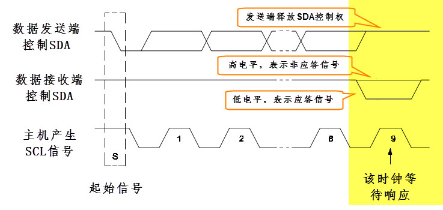

LPI2C—读写EEPROM
------------------------

本章参考资料：《IMXRT1050RM》（参考手册）、库帮助文档及《I2C总线协议》。

若对I2C通讯协议不了解，可先阅读《I2C总线协议》文档的内容学习。若想了解SMBUS，可阅读《smbus20》文档。

关于EEPROM存储器，请参考“常用存储器介绍”章节及其规格书《AT24C02》来了解。

I\ :sup:`2`\ C协议简介
~~~~~~~~~~~~~~~~~~~~~~~~~~~~

I\ :sup:`2`\ C 通讯协议(Inter－Integrated
Circuit)是由Philips公司开发的，由于它引脚少，硬件实现简单，可扩展性强，不需要USART、CAN等通讯协议的外部收发设备，现在被广泛地使用在系统内多个集成电路(IC)间的通讯。

下面我们分别对I\ :sup:`2`\ C协议的物理层及协议层进行讲解。

I\ :sup:`2`\ C物理层
^^^^^^^^^^^^^^^^^^^^^^^^^^^^

I\ :sup:`2`\ C通讯设备之间的常用连接方式见图 21‑1。

图 21‑1 常见的I\ :sup:`2`\ C通讯系统

它的物理层有如下特点：

(1) 它是一个支持多设备的总线。“总线”指多个设备共用的信号线。在一个I\ :sup:`2`\ C通讯总线中，可连接多个I\ :sup:`2`\ C通讯设备，支持多个通讯主机及多个通讯从机。

(2) 一个I\ :sup:`2`\ C总线只使用两条总线线路，一条双向串行数据线(SDA)
    ，一条串行时钟线
    (SCL)。数据线即用来表示数据，时钟线用于数据收发同步。

(3) 每个连接到总线的设备都有一个独立的地址，主机可以利用这个地址进行不同设备之间的访问。

(4) 总线通过上拉电阻接到电源。当I\ :sup:`2`\ C设备空闲时，会输出高阻态，而当所有设备都空闲，都输出高阻态时，由上拉电阻把总线拉成高电平。

(5) 多个主机同时使用总线时，为了防止数据冲突，会利用仲裁方式决定由哪个设备占用总线。

(6) 具有三种传输模式：标准模式传输速率为100kbit/s ，快速模式为400kbit/s
    ，高速模式下可达
    3.4Mbit/s，但目前大多I\ :sup:`2`\ C设备尚不支持高速模式。

(7) 连接到相同总线的 IC 数量受到总线的最大电容 400pF 限制 。

协议层
^^^^^^^^^^^^^^^^^^^^^^^^^^^^

I\ :sup:`2`\ C的协议定义了通讯的起始和停止信号、数据有效性、响应、仲裁、时钟同步和地址广播等环节。

I\ :sup:`2`\ C基本读写过程
''''''''''''''''''''''''''''''''''
    先看看I\ :sup:`2`\ C通讯过程的基本结构，它的通讯过程见图 21‑2、图
    21‑3及图 21‑4。

.. image:: media/image2.jpeg
   :align: center
   :alt: image2
   :name: 图21_2

图 21‑2 主机写数据到从机

.. image:: media/image3.jpeg
   :align: center
   :alt: image3
   :name: 图21_3

图 21‑3 主机由从机中读数据

.. image:: media/image4.jpeg
   :align: center
   :alt: image4
   :name: 图21_4

图 21‑4 I\ :sup:`2`\ C通讯复合格式

图例：

|image5| 数据由主机传输至从机     S ： 传输开始信号

SLAVE_ADDRESS: 从机地址

|image6| 数据由从机传输至主机    R/W(——)： 传输方向选择位，1为读，0为写

A/A(——) ： 应答(ACK)或非应答(NACK)信号

P ： 停止传输信号

这些图表示的是主机和从机通讯时，SDA线的数据包序列。

其中S表示由主机的I\ :sup:`2`\ C接口产生的传输起始信号(S)，这时连接到I\ :sup:`2`\ C总线上的所有从机都会接收到这个信号。

起始信号产生后，所有从机就开始等待主机紧接下来广播 的从机地址信号
(SLAVE_ADDRESS)。在I:sup:`2`\ C总线上，每个设备的地址都是唯一的，当主机广播的地址与某个设备地址相同时，这个设备就被选中了，没被选中的设备将会忽略之后的数据信号。根据I\ :sup:`2`\ C协议，这个从机地址可以是7位或10位。

在地址位之后，是传输方向的选择位，该位为0时，表示后面的数据传输方向是由主机传输至从机，即主机向从机写数据。该位为1时，则相反，即主机由从机读数据。

从机接收到匹配的地址后，主机或从机会返回一个应答(ACK)或非应答(NACK)信号，只有接收到应答信号后，主机才能继续发送或接收数据。

若配置的方向传输位为“写数据”方向，即第一幅图的情况，广播完地址，接收到应答信号后，主机开始正式向从机传输数据(DATA)，数据包的大小为8位，主机每发送完一个字节数据，都要等待从机的应答信号(ACK)，重复这个过程，可以向从机传输N个数据，这个N没有大小限制。当数据传输结束时，主机向从机发送一个停止传输信号(P)，表示不再传输数据。

若配置的方向传输位为“读数据”方向，即第二幅图的情况，广播完地址，接收到应答信号后，从机开始向主机返回数据(DATA)，数据包大小也为8位，从机每发送完一个数据，都会等待主机的应答信号(ACK)，重复这个过程，可以返回N个数据，这个N也没有大小限制。当主机希望停止接收数据时，就向从机返回一个非应答信号(NACK)，则从机自动停止数据传输。

除了基本的读写，I\ :sup:`2`\ C通讯更常用的是复合格式，即第三幅图的情况，该传输过程有两次起始信号(S)。一般在第一次传输中，主机通过
SLAVE_ADDRESS寻找到从设备后，发送一段“数据”，这段数据通常用于表示从设备内部的寄存器或存储器地址(注意区分它与SLAVE_ADDRESS的区别)；在第二次的传输中，对该地址的内容进行读或写。也就是说，第一次通讯是告诉从机读写地址，第二次则是读写的实际内容。例如本章节例子中的EEPROM是一种存储器，它在通讯总线中有一个I2C设备地址SLAVE_ADDRESS用于区分它和总线上的其它设备，在EEPROM内部又有自身的存储单元地址，如第0个单元、第1个单元等，用于区分内部的不同存储单元，这种地址我们通常称为I2C设备的子地址、寄存器地址或内部地址。

以上通讯流程中包含的各个信号分解如下：

通讯的起始和停止信号
''''''''''''''''''''''''''''''''''

前文中提到的起始(S)和停止(P)信号是两种特殊的状态，见图 21‑5。当 SCL
线是高电平时 SDA 线从高电平向低电平切换，这个情况表示通讯的起始。当 SCL
是高电平时 SDA
线由低电平向高电平切换，表示通讯的停止。起始和停止信号一般由主机产生。

.. image:: media/image7.jpeg
   :align: center
   :alt: image7
   :name: 图21_7

图 21‑5 起始和停止信号

数据有效性
''''''''''''''''''''''''''''''''''

I\ :sup:`2`\ C使用SDA信号线来传输数据，使用SCL信号线进行数据同步。见图
21‑6。SDA数据线在SCL的每个时钟周期传输一位数据。传输时，SCL为高电平的时候SDA表示的数据有效，即此时的SDA为高电平时表示数据“1”，为低电平时表示数据“0”。当SCL为低电平时，SDA的数据无效，一般在这个时候SDA进行电平切换，为下一次表示数据做好准备。

.. image:: media/image8.jpeg
   :align: center
   :alt: image8
   :name: 图21_8

图 21‑6 数据有效性

每次数据传输都以字节为单位，每次传输的字节数不受限制。

地址及数据方向
''''''''''''''''''''''''''''''''''

I\ :sup:`2`\ C总线上的每个设备都有自己的独立地址，主机发起通讯时，通过SDA信号线发送设备地址(SLAVE_ADDRESS)来查找从机。I\ :sup:`2`\ C协议规定设备地址可以是7位或10位，实际中7位的地址应用比较广泛。紧跟设备地址的一个数据位用来表示数据传输方向，它是数据方向位(R/)，第8位或第11位。数据方向位为“1”时表示主机由从机读数据，该位为“0”时表示主机向从机写数据。见图
21‑7。

.. image:: media/image9.jpeg
   :align: center
   :alt: image9
   :name: 图21_9

图 21‑7 设备地址(7位)及数据传输方向

读数据方向时，主机会释放对SDA信号线的控制，由从机控制SDA信号线，主机接收信号，写数据方向时，SDA由主机控制，从机接收信号。

响应
''''''''''''''''''''''''''''''''''

I\ :sup:`2`\ C的数据和地址传输都带响应。响应包括“应答(ACK)”和“非应答(NACK)”两种信号。作为数据接收端时，当设备(无论主从机)接收到I\ :sup:`2`\ C传输的一个字节数据或地址后，若希望对方继续发送数据，则需要向对方发送“应答(ACK)”信号，发送方会继续发送下一个数据；若接收端希望结束数据传输，则向对方发送“非应答(NACK)”信号，发送方接收到该信号后会产生一个停止信号，结束信号传输。见图
21‑8。

图 21‑8 响应与非响应信号

传输时主机产生时钟，在第9个时钟时，数据发送端会释放SDA的控制权，由数据接收端控制SDA，若SDA为高电平，表示非应答信号(NACK)，低电平表示应答信号(ACK)。

RT1052的LPI2C特性及架构
~~~~~~~~~~~~~~~~~~~~~~~~~~~~

如果我们直接控制RT1052的两个GPIO引脚，分别用作SCL及SDA，按照上述信号的时序要求，直接像控制LED灯那样控制引脚的输出(若是接收数据时则读取SDA电平)，就可以实现I\ :sup:`2`\ C通讯。同样，假如我们按照USART的要求去控制引脚，也能实现USART通讯。所以只要遵守协议，就是标准的通讯，不管您如何实现它，不管是NXP生产的控制器还是ATMEL生产的存储器，
都能按通讯标准交互。

由于直接控制GPIO引脚电平产生通讯时序时，需要由CPU控制每个时刻的引脚状态，所以称之为“软件模拟协议”方式。

相对地，还有“硬件协议”方式，RT1052的LPI2C（Low power
I2C，低功耗I2C）片上外设专门负责实现I\ :sup:`2`\ C通讯协议，只要配置好该外设，它就会自动根据协议要求产生通讯信号，收发数据并缓存起来，CPU只要检测该外设的状态和访问数据寄存器，就能完成数据收发。这种由硬件外设处理I\ :sup:`2`\ C协议的方式减轻了CPU的工作，且使软件设计更加简单。

RT1052的LPI2C外设简介
^^^^^^^^^^^^^^^^^^^^^^^^^^^^

RT1052的I\ :sup:`2`\ C外设可用作通讯的主机及从机，支持标准模式100Kbit/s、快速模式400Kbit/s、高速模式3.4Mbit/s以及超高速模式5Mbit/s的传输速率，支持7位、10位设备地址，支持DMA数据传输，并具有数据校验功能。它的I\ :sup:`2`\ C外设还支持SMBus2.0协议，SMBus协议与I\ :sup:`2`\ C类似，主要应用于笔记本电脑的电池管理中，本教程不展开，感兴趣的读者可参考《SMBus20》文档了解。

RT0152的LPI2C架构剖析
^^^^^^^^^^^^^^^^^^^^^^^^^^^^

图 21‑9 I\ :sup:`2`\ C架构图（摘自《IMXRT1050RM》）

通讯引脚
''''''''''''''''''''''''''''''''''

I\ :sup:`2`\ C的所有硬件架构都是根据图中右侧SCL线和SDA线展开的。RT1052芯片有多个I\ :sup:`2`\ C外设，它们的I\ :sup:`2`\ C通讯信号引出到不同的GPIO引脚上，使用时必须配置到这些指定的引脚，见表
21‑1。关于外设配对的GPIO引脚号，可查阅《IMXRT1050RM》（参考手册），以它为准。

表 21‑1 RT1052的I2C引脚(整理自《IMXRT1050RM》（参考手册）)

+------+---------------+---------------+---------------+---------------+
| 引脚 |    I2C编号    |               |               |               |
+======+===============+===============+===============+===============+
|      | LPI2C1        | LPI2C2        | LPI2C3        | LPI2C4        |
+------+---------------+---------------+---------------+---------------+
| SCL  | GPIO_AD_B1_00 | GPIO_B0_04    | GPIO_AD_B1_07 | GPIO_AD_B0_12 |
|      |               |               |               |               |
|      | GPIO_SD_B1_04 | GPIO_SD_B1_11 | GPIO_EMC_22   | GPIO_EMC_12   |
|      |               |               |               |               |
|      |               |               | GPIO_SD_B0_00 |               |
+------+---------------+---------------+---------------+---------------+
| SDA  | GPIO_SD_B1_05 | GPIO_B0_05    | GPIO_AD_B1_06 | GPIO_EMC_11   |
|      |               |               |               |               |
|      | GPIO_AD_B1_01 | GPIO_SD_B1_10 | GPIO_EMC_21   | GPIO_AD_B0_13 |
|      |               |               |               |               |
|      |               |               | GPIO_SD_B0_01 |               |
+------+---------------+---------------+---------------+---------------+

特别地，在标准I2C协议之外，LPI2C还增加了HREQ、SCLS及SDAS这三个引脚，它们的功能如下：

-  HREQ：它用于外部设备向LPI2C主机申请发起通讯的请求。LPI2C工作于主机模式时，可使能检测HREQ用于接收外部的电平信号，接收到有效的电平信号后且I2C总线空闲，那么LPI2C会发起I2C通讯。

-  SCLS和SDAS：这两个被称为第二时钟和第二数据线，具有两种功能：

(1) 当LPI2C被配置为主、从机独立引脚的模式时，
    SCL和SDA线用于主机模式，而SCLS和SDAS线则用于从机模式，互不干扰。

(2) LPI2C支持4线工作模式以减少噪声、增强系统的鲁棒性。这种模式下SDA和SCL线用于输入，而SDAS和SCLS线则用于信号输出，同时还要在外部增加一些电阻、二极管和三极管构成的电路，具体见图
    21‑10。

图 21‑10 四线工作模式

驱动时钟
''''''''''''''''''''''''''''''''''

整个I2C外设，分别由功能时钟（Functional Clock）、外部时钟（Extern
Clock）和总线时钟（Bus Clock）这三部分时钟驱动。

-  功能时钟：I2C主设备逻辑电路（Master
   Logic）由功能时钟驱动。它等价于LPI2C根时钟（LPI2C_CLK_ROOT），在时钟树中的描述具体见图
   21‑11。它可以使用选择的时钟来源如下：

1) PLL3的8分频，其中PLL3的常规配置为480MHz，它的8分频即为60MHz。

2) 外部晶振OSC它的常规配置为24MHz。

    选择的输入时钟源经过时钟控制模块CCM的CSCDR2寄存器的LPI2C_CLK_PODF位配置分频，得到LPI2C_CLK_ROOT。

    LPI2C_CLK_ROOT输入到LPI2C外设内部后，可使用LPI2C内部的分频器（Prescaler）进一步分频然后用于驱动生成SCL时钟信号，该分频因子通过MCFGR1寄存器的PRESCALE位设置即可。

图 21‑11 LPI2C_CLK_ROOT在时钟树中的位置

-  外部时钟：LPI2C模块工作于从设备模式时，它的从设备逻辑电路（Slave
   Logic）直接以外部的SCL和SDA总线作为时钟进行驱动。

-  总线时钟：这个总线时钟是指RT1052内部外设总线（Internal Soc Peripheral
   Bus）的时钟，它仅用于内核访问LPI2C外设的控制和配置寄存器（包括FIFO）。

毛刺过滤器
''''''''''''''''''''''''''''''''''

SCL和SDA信号线输入后都经过毛刺过滤器（Glitch
Filter），它可以用于消除输入信号的噪声。在LPI2C的主从模式下可分别对MCFGR2和SCFGR2寄存器的FILTSDA和
FILTSCL位进行配置，具体见图 21‑12，SCFGR2寄存器中的配置类似。

FILTSDA和FILSCL位配置的是时钟周期数，它以不经过LPI2C内部分频器Prescaler的功能时钟即LPI2C_CLK_ROOT为时钟源。当信号线接收到的信号周期小于对应的FILTSDA或FILSCL位配置的周期时，该信号会被认为是毛刺而被过滤掉，从而防止它影响后续的信号处理。

图 21‑12 MCFGR2寄存器中的FILTSDA和FILTSCL描述（摘自《IMXRT1050RM》）

配置寄存器和主从设备逻辑电路
''''''''''''''''''''''''''''''''''

主从设备逻辑电路（Master Logic和Slave
Logic）分别用于管理主设备模式和从设备模式下LPI2C外设的工作。我们通过配置寄存器这些寄存器可以达到控制其工作特性的目的，主从设备是有独立的配置寄存器的，具体见图
21‑13。

图 21‑13 LPI2C的寄存器（摘自《IMXRT1050RM》）

这些配置中包含FIFO大小、中断使能、DMA配置、时钟配置、接收数据匹配以及I2C通讯时序的各种参数。

例如，关于I2C通讯时序的参数，可通过MCCR0寄存器进行配置，具体见图
21‑14及图 21‑15。

.. image:: media/image16.png
   :align: center
   :alt: image16
   :name: 图21_16

图 21‑14 I2C时序参数说明（摘自《IMXRT1050RM》）

在I2C通讯中SCL时钟信号的频率即通讯的波特率，在RT1052的LPI2C外设中把SCL的单个周期分成低电平和高电平部分分别控制，即图
21‑14中的tLOW及tHIGH，通过图
21‑15中的CLKLO和CLKHI寄存器位可以设置它们各占多少个功能时钟的周期，从而达到控制tLOW及tHIGH的目的。

具体的计算步骤非常繁杂，例如要先根据LPI2C_CLK_ROOT算出功能时钟的周期，再根据目标波特率求解SCL整个周期占多少个功能时钟，然后分配给CLKLO和CLKHI，在计算时还需要考虑以上SCL_LATENCY的同步延迟。在实际应用中我们可以直接通过调用NXP提供的库函数设置波特率，该函数会根据要求对各个寄存器进行配置。

图 21‑15 主时钟配置寄存器MCCR0的说明（摘自《IMXRT1050RM》）

在控制通讯时，主设备逻辑电路会通过“主状态寄存器MSR”告知我们当前外设运行的情况，该寄存器的具体说明见图
21‑16。

图 21‑16 主状态寄存器MSR的说明（部分，摘自《IMXRT1050RM》）

例如，在进行通讯前可以检查bit25的BBF位，该位为1的时候表示总线忙碌，若同时bit24的MBF位为0，表明总线当前是由其它设备占用而导致忙碌的，此时应该等待至总线空闲再发起通讯。

又例如在不少应用中需要检测从设备的响应，通过检测bit10的NDF位即可知道从设备的响应状态。

收发数据
''''''''''''''''''''''''''''''''''

当LPI2C外设工作于I2C中的主机模式时，会有大小各为4个字（每个字32位）的“命令/发送FIFO”（Command/Tx
FIFO）和“接收FIFO”(RX FIFO)来辅助缓冲数据。

在I2C通讯中，起始、结束、应答、地址以及数据发送信号的产生，都由“命令/发送FIFO”控制，内核可以通过向“主发送数据寄存器MTDR”的写操作往“命令/发送FIFO”写入内容，然后主设备逻辑电路会根据配置适时把该FIFO中的内容通过I2C总线发送出去，MTDR寄存器的具体说明见图
21‑17。可以看到，该寄存器分为CMD和DATA两个域。其中CMD域用于控制LPI2C外设产生以上的各种I2C通讯信号，而DATA域则存储要发送的数据。每次按16或32位的方式往MTDR寄存器写入内容后“命令/发送FIFO”的计数指针会加1，进入待发送状态。

图 21‑17 主发送数据寄存器MTDR的说明（摘自《IMXRT1050RM》）

当I2C总线上接收到数据后，主设备逻辑电路会把数据存储到接收FIFO中，内核通过读取“主接收数据寄存器MRDR”的RXEMPTY域可以获知接收FIFO中是否有数据，读取它的DATA域可以得到该数据，具体见图
21‑18。

图 21‑18 主接收数据寄存器MRDR的说明（摘自《IMXRT1050RM》）

通过查看“主FIFO状态寄存器MFSR”的RXCOUNT及TXCOUNT域可以知道当前“接收FIFO”和“命令/发送FIFO”的使用状态，具体见图
21‑19。在往“主发送数据寄存器MTDR”写入数据前尤其要注意查看TXCOUNT域，若该值等于FIFO的数量时（即4个）表示“命令/发送FIFO”已满，此时不应再对“主发送数据寄存器MTDR”进行写入操作，而应等待至有空闲的FIFO再进行写入。

图 21‑19 主FIFO状态寄存器MFSR的说明（摘自《IMXRT1050RM》）

当LPI2C外设工作于I2C中的从机模式时，收发数据时没有FIFO进行缓冲，直接通过“从发送数据寄存器STDR”和“从接收数据寄存器SRDR”进行发送和接收数据即可。

通讯过程
^^^^^^^^^^^^^^^^^^^^^^^^^^^^

使用LPI2C外设通讯时，在通讯的不同阶段我们会对寄存器进行不同的操作，并查看状态寄存器来保证通讯时序正常。

主发送器
''''''''''''''''''''''''''''''''''

见图
21‑20，从上至下，该图表示了“主发送器”流程，即作为I2C通讯的主机端时，向外发送数据时的过程。

图 21‑20 主发送器通讯过程

主发送器发送流程及事件说明如下：

(1) 在发起通讯前，首先要检查I2C总线的占用情况，通过检查主状态寄存器的“总线忙标志位BBF（Bus
    Busy Flag）”及“主机忙标志位MBF（Master Busy
    Flag）来确认是否有其它设备正在占用总线，如果有则需要等待至总线空闲；

(2) 总线空闲后，可控制LPI2C外设产生各种I2C通讯信号，这些操作都是通过向“主发送数据寄存器MTDR”实现的，往它写入内容后，操作会被缓存到“命令/发送FIFO”中。所以每次往“主发送数据寄存器MTDR”写入前，都需要检测“主FIFO状态寄存器MFSR”中的TXCOUNT域，该域表示当前已经使用了多少个“命令/发送FIFO”，若该值等于FIFO的数量时（4个），说明FIFO已满，此时应等待至FIFO有空余时再进行写入；

(3) FIFO空余后，向“主发送数据寄存器MTDR”的CMD域写入“起始信号命令100b”以及向DATA域写入“要访问的从设备I2C地址（写方向）”，这些内容将会被缓存到“命令/发送FIFO”，LPI2C控制逻辑会根据它在适当的时候在I2C总线产生起始信号及发送从设备地址；

(4) 类似地，再次检测“主FIFO状态寄存器MFSR”中的TXCOUNT域确认FIFO有空余，然后继续往“主发送数据寄存器MTDR”写入要发送的内容，一般这时候会发送数据，即CMD域写入“发送数据命令000b”以及往DATA域写入要传输的数据。

(5) 重复步骤4可以持续控制LPI2C通过I2C总线往外发送后续数据。

(6) I2C通讯中必须包含停止信号，发送停止信号时，检测“主FIFO状态寄存器MFSR”中的TXCOUNT域确认FIFO有空余，然后往“主发送数据寄存器MTDR”的CMD域写入“停止信号命令010b”，DATA域保持为空即可。

以上就是LPI2C的主发送器通讯过程，在应用中还可以添加中断检测，例如非应答中断、停止信号中断以及发送数据中断等。

主接收器
''''''''''''''''''''''''''''''''''

再来分析主接收器过程，即作为I2C通讯的主机端时，从外部接收数据的过程，见图
21‑21。

图 21‑21 主接收器过程

主接收器接收流程及事件说明如下：

(1) 同主发送流程，起始信号是由主机端产生的，发送该信号前同样需要确认总线为空闲状态、确认“命令/发送FIFO”有空余，然后往“主发送数据寄存器MTDR”的CMD域写入“起始信号命令100b”以及向DATA域写入“要访问的从设备I2C设备地址（读方向）”；

(2) 再次通过读取“主FIFO状态寄存器MFSR”中的TXCOUNT域确认FIFO有空余，然后往“主发送数据寄存器MTDR”的CMD域写入“起始接收数据命令001b”以及DATA域写入期望要读取多少个数据（读取DATA[0:7]+1个数据）。

(3) 完成以上操作后需要等待I2C从设备返回数据，此时可持续读取“主接收数据寄存器MRDR”的内容，它的RXEMPTY域表示接收FIFO数据是否为空，当它表示非空时，该寄存器的DATA域有效，即存放了接收到的从设备数据，把该内容读取到内存即可，重复该过程可接收多个从设备发送的数据。

(4) 同样地，I2C通讯中停止信号也是由主机产生的，要发送停止信号时，检测“主FIFO状态寄存器MFSR”中的TXCOUNT域确认FIFO有空余，然后往“主发送数据寄存器MTDR”的CMD域写入“停止信号命令010b”，DATA域保持为空即可。

以上是基本的I2C读写操作流程，在实际应用中通常还会使用复合通讯流程。例如从设备中包含有寄存器，读取操作时先往从设备写入要读取的寄存器地址（注意区分I2C设备地址和寄存器地址），然后再进行读取操作，该流程具体操作见图
21‑22。

.. image:: media/image24.png
   :align: center
   :alt: image24
   :name: 图21_24

图 21‑22 主接收器的复合读取过程

这个复合读取过程就是在基本读取过程上增加了写入从设备内部寄存器地址的操作，然后在第二次起始信号后才进行读操作。

LPI2C初始化配置结构体详解
~~~~~~~~~~~~~~~~~~~~~~~~~~~~

跟其它外设一样，NXP标准库提供了LPI2C初始化配置结构体及初始化配置函数来配置LPI2C外设。初始化配置结构体及函数定义在库文件“fsl_lpi2c.h”及“fsl_lpi2c.c”中，编程时我们可以结合这两个文件内的注释使用或参考库帮助文档。了解初始化结构体后我们就能对LPI2C外设运用自如了，具体见代码清单
21‑1。

.. code-block:: c
   :name: 代码清单 21‑1 LPI2C初始化配置结构体lpi2c_master_config_t（fsl_lpi2c.h文件）
   :caption: 代码清单 21‑1 LPI2C初始化配置结构体lpi2c_master_config_t（fsl_lpi2c.h文件）
   :linenos:

   /*!
   * @brief LPI2C主机模式的初始化配置结构体
   * 可以通过调用LPI2C_MasterGetDefaultConfig()函数
   * 把本结构体变量赋值为一个适当的默认配置
   */
   typedef struct _lpi2c_master_config {
      bool enableMaster;                   /*!< 是否使能主机模式 */
      bool enableDoze;                     /*!< 是否使用主机的doze模式 */
      bool debugEnable;                   /*!< 在调试模式暂停时，是否持续传输 */
      bool ignoreAck;                      /*!< 是否忽略 ACK/NACK 响应 */
      lpi2c_master_pin_config_t pinConfig; /*!< 引脚配置模式结构体 */
      uint32_t baudRate_Hz;                /*!< 期望通讯的波特率 */
      /*!< 总线空闲检测确认时间（ns），设置为0时禁止该功能 */
      uint32_t busIdleTimeout_ns;
      /*!< 总线低电平检测超时时间（ns），设置为0时禁止该功能 */
      uint32_t pinLowTimeout_ns;
      /*!< SDA信号线的毛刺滤波器宽度配置（ns），设置为0时禁止该功能 */
      uint8_t sdaGlitchFilterWidth_ns;
      /*!< SCL信号线的毛刺滤波器宽度配置（ns），设置为0时禁止该功能 */
      uint8_t sclGlitchFilterWidth_ns;
      struct {
         /*!< 使能主机请求功能 */
         bool enable;
         /*!< 主机请求源 */
         lpi2c_host_request_source_t source;
         /*!< 主机请求的有效信号极性 */
         lpi2c_host_request_polarity_t polarity;
      } hostRequest;       /*!< 主机请求配置 */
   } lpi2c_master_config_t;

这些结构体成员说明如下：

-  enableMaster

本成员设置LPI2C是否工作于I2C通讯的主机模式，在I2C中主机。

-  enableDoze

    本成员设置是否使能doze模式，使能了doze模式后，即使RT1052芯片处于低功耗stop运行状态时LPI2C也能正常工作。

-  debugEnable

    处于硬件调试模式时，我们常常会暂停执行代码以检查运行状态，通过配置debugEnable可以决定在调试暂停时LPI2C是否依然进行数据传输。

-  ignoreAck

    使能本成员配置后，LPI2C的通讯会直接忽略其它设备的响应，也就是说其它设备即使是发送了NACK信号，也会被认为是ACK。这种模式并不常用。

-  pinConfig

    这个成员是一个lpi2c_master_pin_config_t类型的枚举变量，它的可用枚举值具体见代码清单
    21‑2。

.. code-block:: c
   :name: 代码清单 21‑2 LPI2C可用的引脚配置枚举定义（fsl_lpi2c.h文件）
   :caption: 代码清单 21‑2 LPI2C可用的引脚配置枚举定义（fsl_lpi2c.h文件）
   :linenos:

   /*! @brief LPI2C 引脚配置 */
   typedef enum _lpi2c_master_pin_config {
      /*!< LPI2C 配置为 2-pin 开漏模式 */
      kLPI2C_2PinOpenDrain = 0x0U,
      /*!< LPI2C 配置为 2-pin 只输出的模式 (超快速模式) */
      kLPI2C_2PinOutputOnly = 0x1U,
      /*!< LPI2C 配置为 2-pin 推挽模式 */
      kLPI2C_2PinPushPull = 0x2U,
      /*!< LPI2C 配置为 4-pin 推挽模式 */
      kLPI2C_4PinPushPull = 0x3U,
      /*!< LPI2C 配置为 2-pin 开漏并且主从机使用独立的总线 */
      kLPI2C_2PinOpenDrainWithSeparateSlave = 0x4U,
      /*!< LPI2C 配置为 2-pin 只输出的模式(超快速模式)并且主从机使用独立的总线 */
      kLPI2C_2PinOutputOnlyWithSeparateSlave = 0x5U,
      /*!< LPI2C 配置为 2-pin 推挽模式并且主从机使用独立的总线 */
      kLPI2C_2PinPushPullWithSeparateSlave = 0x6U,
      /*!< LPI2C 配置为 4-pin 反相输出推挽模式 */
      kLPI2C_4PinPushPullWithInvertedOutput = 0x7U
   } lpi2c_master_pin_config_t;

按标准的I2C协议，直接使用上面定义的2线开漏模式kLPI2C_2PinOpenDrain即可，其余的主从机独立总线模式、4线模式可根据自己的应用进行扩展。

-  baudRate_Hz

    本成员用于配置I2C通讯的波特率，我们直接给它赋予期望值即可，如400000表示400KHz的波特率，后面调用初始化函数时，函数会根据此输入值和LPI2C根时钟LPI2C_CLK_ROOT配置内部分频因子PRESCALE和高低电平周期CLKHI、CLKLO等参数，以使实际的通讯波特率尽量接近这个配置值。

-  busIdleTimeout_ns

    本成员用于设置总线空闲检测的确认时间，单位为纳秒。也就是说当SCL和SDA线处于高电平状态（空闲状态）超过这个时间后，LPI2C外设才会认为此时总线是空闲并设置标志位，才认为这时可以开始通讯。若设置为0时不使用这个功能。

-  pinLowTimeout_ns

    这用于设置SCL或SDA总线低电平的检测超时时间，单位为纳秒。即当SCL或SDA线低电平超过这个时间时，“引脚低电平超时PLTF”标志位会被置1，表示引脚低电平超时。若pinLowTimeout_ns被配置为0则不使用这个功能。

-  sdaGlitchFilterWidth_ns和sclGlitchFilterWidth_ns

    这两个成员分别用于配置SDA和SCL信号线的毛刺过滤器，当信号宽度小于或等于配置值时会被认为是毛刺过滤掉。单位同样为纳秒，设置为0时不使用本功能。

-  hostRequest

    hostRequest是一个包含三个成员的结构体变量，它用于配置主机请求相关的功能。

    其中enable用于设置是否使能主机请求功能；source用于设置主机请求的来源，它的可选值为HREQ引脚（kLPI2C_HostRequestExternalPin）或输入触发器触发（kLPI2C_HostRequestInputTrigger），具体见代码清单
    21‑3；最后的polarity则用于设置主机请求来源为HREQ引脚时有效的电平极性，可选值为低电平有效（kLPI2C_HostRequestPinActiveLow）或高电平有效（kLPI2C_HostRequestPinActiveHigh），具体见代码清单
    21‑4。

.. code-block:: c
   :name: 代码清单 21‑3 主机请求来源的枚举定义（fsl_lpi2c.h文件）
   :caption: 代码清单 21‑3 主机请求来源的枚举定义（fsl_lpi2c.h文件）
   :linenos:

   /*! @brief LPI2C 主机请求来源选择 */
   typedef enum _lpi2c_host_request_source {
      /*!< 以LPI2C_HREQ引脚作为请求来源 */
      kLPI2C_HostRequestExternalPin = 0x0U,
      /*!< 以输入触发器作为请求源 */
      kLPI2C_HostRequestInputTrigger = 0x1U,
   } lpi2c_host_request_source_t;

.. code-block:: c
   :name: 代码清单 21‑4 主机请求引脚极性配置枚举定义（fsl_lpi2c.h文件）
   :caption: 代码清单 21‑4 主机请求引脚极性配置枚举定义（fsl_lpi2c.h文件）
   :linenos:

   /*! @brief LPI2C主机请求引脚极性配置 */
   typedef enum _lpi2c_host_request_polarity {
      /*!< 配置 LPI2C_HREQ 引脚为低电平有效 */
      kLPI2C_HostRequestPinActiveLow = 0x0U,
      /*!< 配置 LPI2C_HREQ 引脚为高电平有效 */
      kLPI2C_HostRequestPinActiveHigh = 0x1U
   } lpi2c_host_request_polarity_t;

在应用初始化配置结构体时，通常先直接调用LPI2C_MasterGetDefaultConfig函数赋予常用默认配置，然后再针对性地把初始化配置结构体修改成自己需要的内容，具体见代码清单
21‑5。

.. code-block:: c
   :name: 代码清单 21‑5 LPI2C_MasterGetDefaultConfig函数（fsl_lpi2c.c文件）
   :caption: 代码清单 21‑5 LPI2C_MasterGetDefaultConfig函数（fsl_lpi2c.c文件）
   :linenos:

   /*!
   * @brief 给LPI2C提供默认的主机配置
   * 调用本函数后, 你可以覆盖任意配置以自定义成需要的配置,
   * @param[out] masterConfig 用于存储默认配置的结构体
   */
   void LPI2C_MasterGetDefaultConfig(lpi2c_master_config_t *masterConfig)
   {
      masterConfig->enableMaster = true;
      masterConfig->debugEnable = false;
      masterConfig->enableDoze = true;
      masterConfig->ignoreAck = false;
      masterConfig->pinConfig = kLPI2C_2PinOpenDrain;
      masterConfig->baudRate_Hz = 100000U;
      masterConfig->busIdleTimeout_ns = 0;
      masterConfig->pinLowTimeout_ns = 0;
      masterConfig->sdaGlitchFilterWidth_ns = 0;
      masterConfig->sclGlitchFilterWidth_ns = 0;
      masterConfig->hostRequest.enable = false;
      masterConfig->hostRequest.source = kLPI2C_HostRequestExternalPin;
      masterConfig->hostRequest.polarity = kLPI2C_HostRequestPinActiveHigh;
   }

该函数的内部实现就是直接对输入的结构体赋予常用的配置值，便于后续使用。

调用以上函数对初始化配置结构体赋予默认值并针对自己的需求修改后，我们还需要调用LPI2C_MasterInit函数根据结构体的配置值向寄存器写入配置，该函数实现比较复杂，我们直接查看其函数声明了解如何使用即可，具体见代码清单
21‑6。

.. code-block:: c
   :name: 代码清单 21‑6 LPI2C_MasterInit的函数声明（fsl_lpi2c.h文件）
   :caption: 代码清单 21‑6 LPI2C_MasterInit的函数声明（fsl_lpi2c.h文件）
   :linenos:

   /*!
   * @brief 初始化LPI2C主机外设
   *
   * 本函数使能LPI2C时钟并根据结构体初始化LPI2C主机外设
   * @param base LPI2C设备号
   * @param masterConfig 初始化结构体
   * @param sourceClock_Hz LPI2C的功能时钟，函数根据它计算波特率分频因子、
   *                      毛刺滤波器宽度及超时周期
   */
   void LPI2C_MasterInit(LPI2C_Type *base,
                        const lpi2c_master_config_t *masterConfig,
                        uint32_t sourceClock_Hz);

调用本函数时除了要输入初始化配置结构体外，还要通过base参数指定要初始化哪个LPI2C设备，如LPI2C1、LPI2C2等；而sorceClock_Hz参数则用于通知该函数LPI2C功能时钟（即LPI2C根时钟LPI2C_CLK_ROOT）的频率，以便函数根据时钟和结构体配置计算出波特率分频因子、毛刺滤波器宽度及超时周期等要写入到寄存器域的配置值。

LPI2C传输结构体详解
~~~~~~~~~~~~~~~~~~~~~~~~~~~~

除了初始化配置结构体外，NXP的软件库中还提供了传输结构体lpi2c_master_transfer_t和发送函数以简化LPI2C的数据通讯，具体见代码清单
21‑7。

.. code-block:: c
   :name: 代码清单 21‑7 传输结构体（fsl_lpi2c.h文件）
   :caption: 代码清单 21‑7 传输结构体（fsl_lpi2c.h文件）
   :linenos:

   /*!
   * @brief 传输结构体
   * 本结构体用于给LPI2C_MasterTransferNonBlocking()
   * 或 LPI2C_MasterTransferBlocking()提供传输参数
   *
   */
   struct _lpi2c_master_transfer {
      uint32_t
      flags; /*!< 传输的选项标志， 可选值为枚举类型#_lpi2c_master_transfer_flags
                     设置为0或 #kLPI2C_TransferDefaultFlag值时表示正常传输 */
      uint16_t slaveAddress;       /*!< 要访问的I2C设备地址（7bit、10bit） */
      lpi2c_direction_t direction; /*!<读#kLPI2C_Read 或写#kLPI2C_Write方向*/
      uint32_t subaddress;         /*!< 子地址（设备内部的寄存器地址），MSB先行*/
      size_t subaddressSize;       /*!< 字地址长度，最长为4字节 */
      void *data;                  /*!< 指向要传输的数据指针 */
      size_t dataSize;             /*!< 要传输数据的字节数 */
   };

   /* 传输结构体typedef定义 */
   typedef struct _lpi2c_master_transfer lpi2c_master_transfer_t;

以上各个结构体成员介绍如下：

-  flags

    这是用于控制传输选项的标志，它的取值可以为代码清单
    21‑8中的枚举变量，且可通过“|”或运算同时设置几个选项，这些选项主要是设置传输时是否要发送起始信号、停止信号、设备地址等内容，使用标准I2C通讯时直接赋值为kLPI2C_TransferDefaultFlag即可。

.. code-block:: c
   :name: 代码清单 21‑8 传输选项标志可用的枚举值（fsl_lpi2c.h）
   :caption: 代码清单 21‑8 传输选项标志可用的枚举值（fsl_lpi2c.h）
   :linenos:

   /*!
   * @brief 传输选项标志枚举变量
   * @note 这些枚举标志支持使用 或 操作
   * 来对#_lpi2c_master_transfer::flags域进行配置
   */
   enum _lpi2c_master_transfer_flags {
      /*!< 传输以起始信号开始，以停止信号结束 */
      kLPI2C_TransferDefaultFlag = 0x00U,
      /*!<不发送起始信号、I2C设备地址及子地址（寄存器地址）*/
      kLPI2C_TransferNoStartFlag = 0x01U,
      /*!< 发送一个重复起始信号 */
      kLPI2C_TransferRepeatedStartFlag = 0x02U,
      /*!< 不发送停止信号 */
      kLPI2C_TransferNoStopFlag = 0x04U,
   };

-  slaveAddress

    本成员设置这次通讯要访问的I2C设备地址，注意赋值时要给它7位或10位地址，即不包含读写标志位的设备地址。

-  direction

    设置本次通讯的传输方向，它可选的枚举变量值为kLPI2C_Read（读方向）或kLPI2C_Write（写方向）。

-  subaddress

    本成员设置要访问的子地址，即I2C复合传输过程中的寄存器地址（设备内部地址），
    请注意区分它和上面的I2C设备地址结构体成员slaveAddress。

-  subaddressSize

    本成员用于表示上面subaddress的大小，若它非0则子地址会在复合传输的第一过程中会以写方向传输至从设备。

-  data

    data结构体成员是一个指针，使用时它指向一个缓冲区，在程序上的表现通常为一个数组的地址。在写入传输方向时该数组中包含了要发送的数据，在读取传输方向时该数组用于保存接收到的数据。

-  datasize

    本成员用于指定传输时要发送或接收数据的字节数。

根据应用的需要设置好传输结构体后，可以调用库函数LPI2C_MasterTransferBlocking或LPI2C_MasterTransferNonBlocking开始数据传输。前者在通讯的整个过程中会阻塞代码，当整个传输过程完成时才退出函数；后者会开启中断传输，调用函数后它会根据结构体配置寄存器，然后就退出函数，即不管数据传输是否完成都会退出，这种方式的优点是不会阻塞后续的代码执行，但需要其它代码配合检测中断传输标志。不管如何，调用这两个函数能大大简化我们的控制操作，否则我们就需要按照《21.2.3
通讯过程 》中介绍的寄存器操作亲自实现了。

LPI2C—读写EEPROM实验
~~~~~~~~~~~~~~~~~~~~~~~~~~~~

EEPROM是一种掉电后数据不丢失的存储器，常用来存储一些配置信息，以便系统重新上电的时候加载之。EEPOM芯片最常用的通讯方式就是I\ :sup:`2`\ C协议，本小节以EEPROM的读写实验为大家讲解RT1052的LPI2C使用方法。实验中RT1052的LPI2C外设采用主模式，分别用作主发送器和主接收器，通过查询事件的方式来确保正常通讯，不使用中断。

硬件设计
^^^^^^^^^^^^^^^^^^^^^^^^^^^^

图 21‑23 EEPROM硬件连接图，摘自《野火i.MX RT1052核心板原理图》

图 21‑24 标号I2C1_SCL、SDA与RT1052芯片的连接 ，摘自《野火i.MX
RT1052核心板原理图》

根据以上原理图，总结出EEPROM存储器的信号连接方式见表格 21‑1。

表格 21‑1 EEPROM的信号连接表

+----------------+------------------------+------------------------+
| EEPROM芯片引脚 | 功能                   | 连接                   |
+================+========================+========================+
| SCL            | I2C通讯的SCL时钟信号   | GPIO_AD_B1_00/I2C1_SCL |
+----------------+------------------------+------------------------+
| SDA            | I2C通讯的SDA数据信号   | GPIO_AD_B1_01/I2C1_SDA |
+----------------+------------------------+------------------------+
| A0             | EEPROM设备地址的A0位   | GND                    |
+----------------+------------------------+------------------------+
| A1             | EEPORM设备地址的A1位   | GND                    |
+----------------+------------------------+------------------------+
| A2             | EEPROM设备地址的A2位   | GND                    |
+----------------+------------------------+------------------------+
| WP             | EEPROM的写保护使能信号 | GND                    |
+----------------+------------------------+------------------------+

    各个信号连接的说明如下：

-  本实验板中的EEPROM芯片(型号：AT24C02)的SCL及SDA引脚连接到了RT1052的LPI2C外设对应的引脚中，结合上拉电阻，构成了I2C通讯总线，它们通过I2C总线进行交互。

-  EEPROM芯片的设备地址一共有7位，其中高4位固定为：1010
   b，低3位则由A0/A1/A2信号线的电平决定，见图
   21‑25，图中的R/W是读写方向位，与地址无关。

.. image:: media/image27.jpeg
   :align: center
   :alt: image27
   :name: 图21_27

图 21‑25 EEPROM设备地址(摘自《AT24C02》规格书)

    按照我们此处的连接，A0/A1/A2均为0，所以EEPROM的7位设备地址是：101
    0000b
    ，即0x50。由于I2C通讯时常常是地址跟读写方向连在一起构成一个8位数，且当R/W位为0时，表示写方向，所以加上7位地址，其值为“0xA0”，常称该值为I2C设备的“写地址”；当R/W位为1时，表示读方向，加上7位地址，其值为“0xA1”，常称该值为“读地址”。

-  EEPROM芯片中还有一个WP引脚，具有写保护功能，当该引脚电平为高时，禁止写入数据，当引脚为低电平时，可写入数据，我们直接接地，不使用写保护功能。

关于EEPROM的更多信息，可参考其数据手册《AT24C02》来了解。若您使用的实验板EEPROM的型号、设备地址或控制引脚不一样，只需根据我们的工程修改即可，程序的控制原理相同。

软件设计
^^^^^^^^^^^^^^^^^^^^^^^^^^^^

为了使工程更加有条理，我们把读写EEPROM相关的代码独立分开存储，方便以后移植。在“工程模板”之上新建“bsp_i2c_eeprom.c”及“bsp_i2c_eeprom.h”文件，这些文件也可根据您的喜好命名，它们不属于RT1052软件库的内容，是由我们自己根据应用需要编写的。

编程要点
''''''''''''''''''''''''''''''''''

(1) 定义要使用的LPI2C号，控制相关的引脚号；

(2) 配置引脚的MUX复用模式及PAD属性配置；

(3) 配置LPI2C外设的时钟来源、分频得到LPI2C根时钟（LPI2C_CLK_ROOT）；

(4) 配置LPI2C外设的模式、速率等参数；

(5) 编写LPI2C按字节收发的函数；

(6) 编写读写EEPROM存储内容的函数；

(7) 编写测试程序，对读写数据进行校验。

代码分析
''''''''''''''''''''''''''''''''''

LPI2C硬件相关宏定义
**********************************

我们把LPI2C硬件相关的配置都以宏的形式定义到
“bsp_i2c_eeprom.h”文件中，见代码清单 21‑9。

.. code-block:: c
   :name: 代码清单 21‑9 LPI2C硬件配置相关的宏（bsp_i2c_eeprom.h文件）
   :caption: 代码清单 21‑9 LPI2C硬件配置相关的宏（bsp_i2c_eeprom.h文件）
   :linenos:

   /* lpi2c外设编号 */
   #define EEPROM_I2C_MASTER_BASE   (LPI2C1_BASE)
   #define EEPROM_I2C_MASTER        ((LPI2C_Type *)EEPROM_I2C_MASTER_BASE)
   /* lpi2c波特率 */
   #define EEPROM_I2C_BAUDRATE      400000U

   /*! @brief I2C引脚定义 */
   #define EEPROM_SCL_IOMUXC       IOMUXC_GPIO_AD_B1_00_LPI2C1_SCL
   #define EEPROM_SDA_IOMUXC        IOMUXC_GPIO_AD_B1_01_LPI2C1_SDA

以上代码根据硬件连接，把与EEPROM通讯使用的LPI2C号
、IOMUXC复用引脚号都以宏封装起来，并且定义了自身的I2C地址及通讯速率，以便配置模式的时候使用。

LPI2C 引脚的IOMUXC相关配置
**********************************

利用上面的宏，编写LPI2C使用到的引脚的IOMUXC配置，见代码清单 21‑2。

.. code-block:: c
   :name: 代码清单 21‑10 LPI2C引脚的IOMUXC相关配置（bsp_i2c_eeprom.c文件）
   :caption: 代码清单 21‑10 LPI2C引脚的IOMUXC相关配置（bsp_i2c_eeprom.c文件）
   :linenos:

   /*********************第2部分中使用的宏**********************/
   /* I2C的SCL和SDA引脚使用同样的PAD配置 */
   #define I2C_PAD_CONFIG_DATA         (SRE_0_SLOW_SLEW_RATE| \
                                          DSE_6_R0_6| \
                                          SPEED_1_MEDIUM_100MHz| \
                                          ODE_1_OPEN_DRAIN_ENABLED| \
                                          PKE_1_PULL_KEEPER_ENABLED| \
                                          PUE_0_KEEPER_SELECTED| \
                                          PUS_3_22K_OHM_PULL_UP| \
                                          HYS_0_HYSTERESIS_DISABLED)
   /* 配置说明 : */
   /* 转换速率: 转换速率慢
      驱动强度: R0/6
      带宽配置 : medium(100MHz)
      开漏配置: 使能
      拉/保持器配置: 使能
      拉/保持器选择: 保持器
      上拉/下拉选择: 22K欧姆上拉(选择了保持器此配置无效)
      滞回器配置: 禁止 */

   /************************第1部分****************************/
   /**
   * @brief  初始化EEPROM相关IOMUXC的MUX复用配置
   * @param  无
   * @retval 无
   */
   static void I2C_EEPROM_IOMUXC_MUX_Config(void)
   {
      /* SCL和SDA引脚，需要使能SION以接收数据 */
      IOMUXC_SetPinMux(EEPROM_SCL_IOMUXC, 1U);
      IOMUXC_SetPinMux(EEPROM_SDA_IOMUXC, 1U);
   }

   /************************第2部分****************************/
   /**
   * @brief  初始化EEPROM相关IOMUXC的PAD属性配置
   * @param  无
   * @retval 无
   */
   static void I2C_EEPROM_IOMUXC_PAD_Config(void)
   {
      /* SCL和SDA引脚 */
      IOMUXC_SetPinConfig(EEPROM_SCL_IOMUXC, I2C_PAD_CONFIG_DATA);
      IOMUXC_SetPinConfig(EEPROM_SDA_IOMUXC, I2C_PAD_CONFIG_DATA);
   } 

同为外设使用引脚的MUX复用模式及PAD属性配置，其流程与“串口初始化函数”章节中的类似，主要区别是引脚的模式，配置流程如下：

(1) 第1部分。定义一个I2C_EEPROM_IOMUXC_MUX_Config函数，它专门配置控制EEPROM的
    LPI2C外设相关引脚的MUX模式。该函数内部调用库函数IOMUXC_SetPinMux，它利用前面定义的宏作为第一个输入参数，把引脚设置成LPI2C的SCL和SDA复用模式；特别要注意的是调用IOMUXC_SetPinMux时的第二个参数必须设置为“1”以使能引脚的SION功能，因为这两个引脚会被配置为开漏输出模式，同时I2C的通讯又需要引脚必须能读取总线上的电平状态，所以此处两个引脚都必须使能SION以接收数据。

(2) 第2部分。定义一个I2C_EEPROM_IOMUXC_PAD_Config函数，它专门配置控制EEPROM的
    LPI2C外设相关引脚的PAD属性，该函数内部调用库函数IOMUXC_SetPinConfig，它的第二个输入参数宏定义在本段代码的开头，包含了PAD的各个配置选项，其中最重要的是使能了引脚的开漏模式，这是I2C通讯中的基本要求。

配置LPI2C的时钟和模式
**********************************

以上只是配置了LPI2C使用的引脚，还不包含对LPI2C模式的配置，见代码清单
21‑11。

.. code-block:: c
   :name: 代码清单 21‑11 配置LPI2C的时钟和模式（bsp_i2c_eeprom.c/h文件）
   :caption: 代码清单 21‑11 配置LPI2C的时钟和模式（bsp_i2c_eeprom.c/h文件）
   :linenos:

   /****第1部分使用的宏，本内容位于bsp_i2c_eeprom.h文件**********/
   /*
   选择LPI2C的时钟源
   0 derive clock from pll3_60m
   1 derive clock from osc_clk
   */
   /* 选择 USB1 PLL/8 (480/8 = 60MHz) 作为lpi2c主机时钟源, */
   #define LPI2C_CLOCK_SOURCE_SELECT     (0U)
   /* lpi2c主机 时钟源的时钟分频因子 */
   #define LPI2C_CLOCK_SOURCE_DIVIDER    (5U)
   /* 获取 lpi2c 时钟频率LPI2C_CLK_ROOT = 60/(5+1) = 10MHz */
   #define LPI2C_CLOCK_FREQUENCY ((CLOCK_GetFreq(kCLOCK_Usb1PllClk) / 8) /
                                    (LPI2C_CLOCK_SOURCE_DIVIDER + 1U))

   #define LPI2C_MASTER_CLOCK_FREQUENCY  LPI2C_CLOCK_FREQUENCY
   /**************以下内容位于bsp_i2c_eeprom.c文件*************/
   /**
   * @brief  初始化EEPROM使用的I2C外设
   * @param  无
   * @retval 无
   */
   static void EEPROM_I2C_ModeInit(void)
   {
      lpi2c_master_config_t masterConfig;

   /************************第1部分****************************/
      /* 配置时钟 LPI2C */
      CLOCK_SetMux(kCLOCK_Lpi2cMux, LPI2C_CLOCK_SOURCE_SELECT);
      CLOCK_SetDiv(kCLOCK_Lpi2cDiv, LPI2C_CLOCK_SOURCE_DIVIDER);

   /************************第2部分****************************/
      /*给masterConfig赋值为以下默认配置*/
      /*
      * masterConfig.debugEnable = false;
      * masterConfig.ignoreAck = false;
      * masterConfig.pinConfig = kLPI2C_2PinOpenDrain;
      * masterConfig.baudRate_Hz = 100000U;
         * masterConfig.busIdleTimeout_ns = 0;
         * masterConfig.pinLowTimeout_ns = 0;
         * masterConfig.sdaGlitchFilterWidth_ns = 0;
         * masterConfig.sclGlitchFilterWidth_ns = 0;
         */
      LPI2C_MasterGetDefaultConfig(&masterConfig);
   
      /************************第3部分****************************/
      /* 把默认波特率改为I2C_BAUDRATE */
      masterConfig.baudRate_Hz = EEPROM_I2C_BAUDRATE;
   
   /************************第4部分****************************/
      /*  使用以上配置初始化 LPI2C 外设 */
      LPI2C_MasterInit(EEPROM_I2C_MASTER,
                        &masterConfig,
                        LPI2C_MASTER_CLOCK_FREQUENCY);
   }
   
   /************************第5部分****************************/
   /**
   * @brief  I2C初始化
   * @param  无
   * @retval 无
   */
   void I2C_EEPROM_Init(void)
   {
      /* 初始化各引脚IOMUXC相关 */
      I2C_EEPROM_IOMUXC_MUX_Config();
      I2C_EEPROM_IOMUXC_PAD_Config();
   
      /* 初始化I2C外设工作模式 */
      EEPROM_I2C_ModeInit();
   }

这段代码完成了LPI2C的时钟配置、LPI2C模式配置，最后还把LPI2C关于IOMUXC操作一起封装进一个函数以便简化用户调用，整段代码的介绍如下：

(1) 第1部分。

-  调用库函数CLOCK_SetMux选择LPI2C根时钟LPI2C_CLK_ROOT的时钟来源，它的可选值为0（PLL3的8分频，即USB1
   PLL的8分频）或1（OSC，即外部晶振）。按照常规配置，PLL3的频率为480MHz，其8分频为60MHz；而OSC的频率为24MHz，选择哪个时钟源并无影响，关键时最后产生的LPI2C根时钟的频率。调用本函数中的第一个参数kCLOCK_Lpi2cMux是库定义的宏，它指当前要配置时钟树的LPI2C_MUX节点；输入的第二参数LPI2C_CLOCK_SOURCE_SELECT是在本段代码开头我们自定义的宏，该宏值为0，即选择PLL3的8分频作为时钟源。

-  调用库函数CLOCK_SetDiv设置时钟分频因子，即对前面选择的时钟源进行分频，分频后得到LPI2C根时钟LPI2C_CLK_ROOT。调用本函数中的第一个参数kCLOCK_Lpi2cDiv是库定义的宏，它指当前要配置的是时钟树中LPI2C_DIV分频器；第二个参数LPI2C_CLOCK_SOURCE_DIVIDER是在本段代码开头自定义的宏，其宏值为5，也就是说对时钟的分频为6（即5+1）。

    最终，LPI2C根时钟的频率的计算方式如下：

    f\ :sub:`LPI2C_CLK_ROOT` = f\ :sub:`PLL3`/8/(
    LPI2C_CLOCK_SOURCE_DIVIDER+1)

    = 480/8/(5+1)=10MHz

    为了方便把这时钟频率告知后面的LPI2C模式初始化函数，我们也把LPI2C根时钟频率的计算方式封装成了本段代码开头的宏LPI2C_CLOCK_FREQUENCY，后面直接使用该宏即可得到LPI2C根时钟的频率。

(1) 第2部分。调用LPI2C_MasterGetDefaultConfig函数给函数中定义的初始化结构体变量masterConfig赋予常用默认值，这些值可以直接从代码注释或该函数的源码获知，具体可以查看前面的代码清单
    21‑5了解。在这样的配置中，使能了LPI2C的主机模式、doze模式，使用LPI2C两线开漏配置，波特率为100KHz，其它功能均被关闭。

(2) 第3部分。第2部分设置好了LPI2C的常用模式，这已满足我们读写EEPROM的需要，只是我们希望波特率更快一点，所以我们在第2部分的基础上再对baudRate_Hz结构体成员重新赋值，赋予的值为代码清单
    21‑9定义的宏EEPROM_I2C_BAUDRATE，即400KHz。

(3) 第4部分。调用库函数LPI2C_MasterInit初始化LPI2C外设，第一个参数为代码清单
    21‑9定义的宏EEPROM_I2C_MASTER，它的宏值为本程序使用的LPI2C设备号；第二个参数就是初始化结构体的指针；第三个参数是LPI2C根时钟LPI2C_CLK_ROOT的频率，此处直接使用本段代码开头定义的宏LPI2C_MASTER_CLOCK_FREQUENCY作为参数输入。执行完本函数后，LPI2C外设就完成了初始化。

(4) 第5部分。这部分代码是对代码清单
    12‑2定义的IOMUXC相关引脚操作以及EEPROM_I2C_ModeInit函数的封装，这样我们只要在main函数中直接调用I2C_EEPROM_Init，整个LPI2C外设就可以真正工作起来了。

EEPROM的页写入
**********************************

初始化好LPI2C外设后，就可以进行I2C通讯了，我们看看如何向EEPROM写入一页的数据。

首先需要了解EEPROM根据标准I2C通讯协议写操作定义的一种页写入时序，见图
21‑26。

图 21‑26 EEPROM页写入时序(摘自《AT24C02》规格书)

这个页写入时序图画出的是I2C通讯中由主机发送给EEPROM的SDA信号，SCL信号省略，时序图中的各个环节说明如下：

-  发送起始信号START。

-  发送第1个字节：7位的I2C设备地址（Device
   Address）加1位的写方向标志。按照本实验中的EEPROM原理图接法，这个字节的内容就是0xA0，表示EEPOM的I2C设备写地址。

-  发送第2个字节：对于I2C通讯标准来说，这就是主机向从机发送的一个字节数据内容，没什么特别的。不过，根据EEPROM的页写入时序定义，在I2C设备地址后的这第一个“数据”，会被它识别为要写入的“内部存储单元的首地址（Word
   Address）”。后面真正要存储到EEPROM的n个数据内容会被依次写入到Word
   Address、Word Address +1、Word Address
   +2…这些地址的存储单元中。这种地址概念等同于I2C复合通讯中的寄存器地址、子地址。特别地，本例子使用的AT24C02型号EEPROM存储容量为256个字节，所以只需要用这一个字节表示Word
   Address，对于其它高容量型号的EEPROM，Word
   Address会用多个字节来表示，使用时要注意调整。

-  发送第3~10个字节：在Word
   Address之后，可连续发送n个数据，这些数据会被存储到EEPROM中。AT24C02型号的EEPROM每页的大小为8个字节(即n
   = 8
   )，即主机对它的一次页写入操作最多可以发送8个字节数据。某些型号的芯片每个页写入时序最多可传输16个数据。

-  发送停止信号STOP。

了解EEPROM的页写入时序后，来分析RT1052对EEPROM进行页写入的代码，具体见代码清单
21‑12。

.. code-block:: c
   :name: 代码清单 21‑12 EEPROM的页写入（bsp_i2c_eeprom.c/h文件）
   :caption: 代码清单 21‑12 EEPROM的页写入（bsp_i2c_eeprom.c/h文件）
   :linenos:

   /*********第1部分，本内容位于bsp_i2c_eeprom.h文件**********/
   /* EEPROM 的总空间大小*/
   #define EEPROM_SIZE                         256
   /* AT24C01/02每页有8个字节 */
   #define EEPROM_PAGE_SIZE                    8
   /* EEPROM设备地址 */
   #define EEPROM_ADDRESS_7_BIT                (0xA0>>1)
   #define EEPROM_WRITE_ADDRESS_8_BIT          (0xA0)
   #define EEPROM_READ_ADDRESS_8_BIT           (0xA1)
   /* EEPROM内部存储单元地址的大小，单位：字节*/
   #define EEPROM_INER_ADDRESS_SIZE            0x01

   /*************以下内容位于bsp_i2c_eeprom.c文件***************/
   /************************第2部分****************************/
   /**
   * @brief 向EEPROM写入最多一页数据
   * @note  调用本函数后必须调用I2C_EEPROM_WaitStandbyState进行等待
   * @param ClientAddr:EEPROM的I2C设备地址(8位地址)
   * @param WriteAddr:写入的存储单元首地址
   * @param pBuffer:缓冲区指针
   * @param NumByteToWrite:要写的字节数，不可超过EEPROM_PAGE_SIZE定义的值
   * @retval  1不正常，0正常
   */
   uint32_t I2C_EEPROM_Page_Write( uint8_t ClientAddr,
                                 uint8_t WriteAddr,
                                 uint8_t* pBuffer,
                                 uint8_t NumByteToWrite)
   {
   /************************第3部分****************************/
      lpi2c_master_transfer_t masterXfer = {0};
      status_t reVal = kStatus_Fail;

      /************************第4部分****************************/
      if (NumByteToWrite>EEPROM_PAGE_SIZE) {
         EEPROM_ERROR("NumByteToWrite>EEPROM_PageSize\r\n");
         return 1;
      }

   /************************第5部分****************************/
      /* subAddress = WriteAddr, data = pBuffer 发送至从机
         起始信号start + 设备地址slaveaddress(w 写方向) +
         发送缓冲数据tx data buffer + 停止信号stop */

      masterXfer.slaveAddress = (ClientAddr>>1);
      masterXfer.direction = kLPI2C_Write;
      masterXfer.subaddress = WriteAddr;
      masterXfer.subaddressSize = EEPROM_INER_ADDRESS_SIZE;
      masterXfer.data = pBuffer;
      masterXfer.dataSize = NumByteToWrite;
      masterXfer.flags = kLPI2C_TransferDefaultFlag;

   /************************第6部分****************************/
      reVal = LPI2C_MasterTransferBlocking(EEPROM_I2C_MASTER, &masterXfer);

      if (reVal != kStatus_Success) {
         return 1;
      }
      return 0;
   }

这段代码的说明如下：

-  第1部分。定义EEPROM相关的信息，如页大小EEPROM_PAGE_SIZE、EEPROM的7位、8位I2C设备地址以及内部存储单元地址的大小EEPROM_INER_ADDRESS_SIZE。

-  第2部分。定义函数I2C_EEPROM_Page_Write封装页写入操作，这个函数包含四个输入参数：

1) ClientAddr：目标设备的8位I2C设备写地址。本例子中可以使用第1部分定义的宏EEPROM_WRITE_ADDRESS_8_BIT作为输入参数。

2) WriteAddr：本次页写入的EEPROM内部存储单元首地址，即图 21‑26中的Word
   Address。

3) pBuffer：这是一个指针，它指向要传输的数据内容。例如要写入一页数据，可以定义一个8字节的数组，数组中包含要写入到EEPROM的内容，调用本函数时把该数组的地址作为pBuffer指针输入即可。

4) NumByteToWrite：要传输的数据字节数据，由于是页写入，该值不能大于宏EEPROM_PAGE_SIZE表示的页大小。

-  第3部分。使用前面代码清单
   21‑7介绍的LPI2C传输结构体类型定义一个masterXfer变量，后续对该结构体进行赋值定制LPI2C的传输操作。

-  第4部分。确认要传输的字节数NumByteToWrite小于等于页大小EEPROM_PAGE_SIZE，否则函数直接返回退出。在该条件分支中函数返回退出前调用了宏EEPROM_ERROR输出错误信息，EEPROM_ERROR是一个对PRINTF函数封装的宏，以便于区分不同的调试信息，理解时直接把它当作PRINTF函数即可，关于它的具体实现请直接查看程序源码。

-  第5部分。根据函数输入参数及EEPROM的特性对masterXfer变量赋值：

1) slaveAddress为7位地址，所以要对输入参数进行右移1位的操作(ClientAddr>>1)。

2) direction为kLPI2C_Write，表示写入方向。

3) subaddress对应EEPROM内部存储单元的首地址，所以其值为输入参数WriteAddr。

4) subaddressSize对应EEPROM内部存储单元的地址的大小，此处直接赋值为第1部分定义的宏EEPROM_INER_ADDRESS_SIZE，即1个字节大小。

5) data是要传输的数据指针，即输入参数中要传输的数据指针pBuffer。

6) dataSize是要传输的数据字节数，即输入参数中的NumByteToWrite。

7) flags表示本次传输的选项，EEPROM使用标准的I2C通讯，所以此处赋值kLPI2C_TransferDefaultFlag表示正常传输，即包含起始、结束条件和设备地址等内容。

-  第6部分。调用库函数LPI2C_MasterTransferBlocking，它会根据上述masterXfer变量的配置对LPI2C的寄存器进行操作，实现定制的I2C通讯。调用本函数会阻塞后续的代码执行，直至I2C通讯正常完成或失败返回。本代码在调用后通过其返回值确认是否正常完成。

写入操作后的状态等待
**********************************

页写入通讯结束后，EEPROM会根据这个通讯结果擦写该内部存储单元相应地址的内容，这需要一段较长的时间，我们称之为EEPROM的内部写时序。在这期间EEPROM不会响应主机的任何访问，所以在写入通讯结束后，要先等待EEPROM内部擦写完毕再进行后续访问。

为此我们定义了I2C_EEPROM_WaitStandbyState
函数用于检测并等待EEPROM内部写时序完成的操作，具体见代码清单 21‑13。

.. code-block:: c
   :name: 代码清单 21‑13 等待EEPROM处于准备状态（bsp_i2c_eeprom.c/h文件）
   :caption: 代码清单 21‑13 等待EEPROM处于准备状态（bsp_i2c_eeprom.c/h文件）
   :linenos:

   /*********第1部分，本内容位于bsp_i2c_eeprom.h文件**********/
   /* 等待超时时间 */
   #define I2CT_FLAG_TIMEOUT         ((uint32_t)0x100)
   #define I2CT_LONG_TIMEOUT         ((uint32_t)(10 * I2CT_FLAG_TIMEOUT))

   /************以下内容位于bsp_i2c_eeprom.c文件************/

   /************************第2部分****************************/
   /**
   * @brief  用于等待EEPROM的内部写入时序，
   *         在I2C_EEPROM_Page_Write函数后必须被调用
   * @param  ClientAddr:设备地址（8位地址）
   * @retval 等待正常为0，等待超时为1
   */
   uint8_t I2C_EEPROM_WaitStandbyState(uint8_t ClientAddr)
   {
      status_t lpi2c_status;
      /* 等待超过 40*I2CT_LONG_TIMEOUT us后认为超时 */
      uint32_t delay_count = I2CT_LONG_TIMEOUT;

      do {
         /************************第3部分****************************/
         /* 清除非应答标志，以便下一次检测 */
         LPI2C_MasterClearStatusFlags(EEPROM_I2C_MASTER, kLPI2C_MasterNackDetectFlag);

         /* 对EEPROM发出写方向的寻址信号，以检测是否响应 */
      lpi2c_status = LPI2C_MasterStart(EEPROM_I2C_MASTER, (ClientAddr>>1),kLPI2C_Write);

         /* 必须等待至少30us，才会产生非应答标志*/
         EEPROM_DELAY_US(40);

         /************************第4部分****************************/
         /* 检测LPI2C MSR寄存器的NDF标志，并且确认delay_count没减到0（减到0认为超时，退出） */
      } while (EEPROM_I2C_MASTER->MSR & kLPI2C_MasterNackDetectFlag 
   && delay_count-- );

      /************************第5部分****************************/
      /* 清除非应答标志，防止下一次通讯错误 */
      LPI2C_MasterClearStatusFlags(EEPROM_I2C_MASTER, kLPI2C_MasterNackDetectFlag);

      /* 产生停止信号，防止下次通讯出错 */
      lpi2c_status = LPI2C_MasterStop(EEPROM_I2C_MASTER);
      /* 必须等待至少10us，确保停止信号发送完成*/
      EEPROM_DELAY_US(10);
      /************************第6部分****************************/
      /* 产生失败或前面的等待超时 */
      if (delay_count == 0 || lpi2c_status != kStatus_Success) {
            I2C_Timeout_Callback(3);
            return 1;
      }
   
      return 0;
   }
   
   /************************第7部分****************************/
   /**
      * @brief  IIC等待超时调用本函数输出调试信息
      * @param  None.
      * @retval 返回0xff，表示IIC读取数据失败
      */
   static  uint32_t I2C_Timeout_Callback(uint8_t errorCode)
   {
      /* 在此处进行错误处理 */
      EEPROM_ERROR("I2C 等待超时!errorCode = %d",errorCode);
      return 0xFF;
   }

这段代码看起来复杂，但是它的实现思路非常简单：即向I2C总线发送EEPROM的设备地址并检测是否有响应，若检测到EEPROM返回应答信号，表示EEPROM的内部写时序完毕，否则重复以上过程等待至有应答或等待超时。

代码中调用的LPI2C_MasterClearStatusFlags、LPI2C_MasterStart以及LPI2C_MasterStop都是NXP软件库中提供的LPI2C基本操作函数，功能分别为清除标志位、发送起始信号（包含设备地址及传输方向标志位）以及发送停止信号。

函数中检测响应是通过读取RT1052的LPI2C->MSR寄存器的NDF位（即kLPI2C_MasterNackDetectFlag标志）实现的，当检测不到响应的时候NDF位为1，检测到响应的时候该位为0。

在每次调用完代码清单
21‑12中的I2C_EEPROM_Page_Write函数传输完数据后，都必须调用这个I2C_EEPROM_WaitStandbyState函数等待EEPROM内部写入完成，再进行其它访问操作。

无限制地写入多个字节
**********************************

利用EEPROM的页写入方式，每次最多只可写入8个字节，而且这种操作方式还有限制，当跨页写入时，在下一页的页首必须重新发送起始信号。即第0、8、16、24等这些按8字节对齐的地址是AT24C02型号EEPROM每页的页首，往这些地址写入时，必须重新发送起始信号及存储器内部地址。

例如，要往第4、5、6、7、8、9、10、11这8个地址写入内容，不能只进行一次8字节的页写入，即发送内部地址4后面直接跟着8个数据，这样写入的话地址4、5、6、7会被写入两次，最终内容会被覆盖为最后后4字节的数据，而地址8、9、10、11的内容丝毫不会被改变；正确的操作是用两次页写入过程实现，第一次发送内部地址4后跟着4个数据，这些数据会被写入到地址4、5、6、7，第二次发送内部地址8后再跟着4个数据，这些数据会被写入到地址8、9、10、11。只有当首地址是8字节对齐的时候，才能通过一次的页写入最多8个字节的数据。

这些限制会让我们的程序应用非常麻烦，所以我们在页写入函数I2C_EEPROM_Page_Write之上再进行一次封装，专门处理这些限制和特殊条件，得到I2C_EEPROM_Buffer_Write函数，应用这个函数时只要把地址和数据交给它即可，具体实现见代码清单
21‑14。

.. code-block:: c
   :name: 代码清单 21‑14 无限制地写入多字节函数（bsp_i2c_eeprom.c文件）
   :caption: 代码清单 21‑14 无限制地写入多字节函数（bsp_i2c_eeprom.c文件）
   :linenos:

   /************************第1部分****************************/
   /**
      * @brief 向EEPROM写入不限量的数据
      * @param ClientAddr:EEPROM的I2C设备地址(8位地址)
      * @param WriteAddr:写入的存储单元首地址
      * @param pBuffer:缓冲区指针
      * @param NumByteToWrite:要写的字节数
      * @retval  无
      */
   void I2C_EEPROM_Buffer_Write( uint8_t ClientAddr,
                                 uint8_t WriteAddr,
                                 uint8_t* pBuffer,
                                 uint16_t NumByteToWrite)
   {
      /************************第2部分****************************/
      uint8_t NumOfPage = 0, NumOfSingle = 0, Addr = 0, count = 0;
      /* 后续要处理的字节数，初始值为NumByteToWrite*/
      uint8_t NumByteToWriteRest = NumByteToWrite;
   
      /************************第3部分****************************/
      /* 根据以下情况进行处理：
         1.写入的首地址是否对齐
         2.最后一次写入是否刚好写满一页 */
      Addr = WriteAddr % EEPROM_PAGE_SIZE;
      count = EEPROM_PAGE_SIZE - Addr;
   
      /* 若NumByteToWrite > count：
         第一页写入count个字节，对其余字节再进行后续处理，
         所以用 (NumByteToWriteRest = NumByteToWrite - count)
            求出后续的NumOfPage和NumOfSingle进行处理。
         若NumByteToWrite < count：
         即不足一页数据，直接用NumByteToWriteRest = NumByteToWrite
            求出NumOfPage和NumOfSingle即可 */
      NumByteToWriteRest = (NumByteToWrite > count) ? (NumByteToWrite - count) : 
   NumByteToWrite;
   
      /* 要完整写入的页数（不包括前count字节）*/
      NumOfPage =  NumByteToWriteRest / EEPROM_PAGE_SIZE;
      /* 最后一页要写入的字节数（不包括前count字节）*/
      NumOfSingle = NumByteToWriteRest % EEPROM_PAGE_SIZE;
   
      /************************第4部分****************************/
      /* NumByteToWrite > count时，需要先往第一页写入count个字节
         NumByteToWrite < count时无需进行此操作 */
      if (count != 0 && NumByteToWrite > count) {
            I2C_EEPROM_Page_Write(ClientAddr, WriteAddr, pBuffer, count);
            I2C_EEPROM_WaitStandbyState(ClientAddr);
            WriteAddr += count;
            pBuffer += count;
      }
   
      /************************第5部分****************************/
      /* 处理后续数据 */
      if (NumOfPage== 0 ) {
            I2C_EEPROM_Page_Write(ClientAddr, WriteAddr, pBuffer, NumOfSingle);
            I2C_EEPROM_WaitStandbyState(ClientAddr);
      } else {
            /************************第6部分****************************/
            /* 后续数据大于一页 */
            while (NumOfPage--) {
            I2C_EEPROM_Page_Write(ClientAddr, WriteAddr, pBuffer, EEPROM_PAGE_SIZE);
               I2C_EEPROM_WaitStandbyState(ClientAddr);
               WriteAddr +=  EEPROM_PAGE_SIZE;
               pBuffer += EEPROM_PAGE_SIZE;
            }
            /************************第7部分****************************/
            /* 最后一页 */
            if (NumOfSingle != 0) {
               I2C_EEPROM_Page_Write(ClientAddr, WriteAddr, pBuffer, NumOfSingle);
               I2C_EEPROM_WaitStandbyState(ClientAddr);
            }
      }
   }

这个代码的说明如下：

-  第1部分。函数包含四个输入参数，这些参数与前面页写入函数的一样，分别是I2C设备地址，要写入的存储器内部首地址，指向要写入数据的指针以及要写入的字节数，区别是本函数对要写入的字节数没有限制。

-  第2部分。定义一些变量用于缓存不同写入情况下的信息，先了解大概功能，配合后续的运算和处理会更好理解：

1) NumOfPage存储要完整写入一页的页数。

2) NumOfSingle存储最后不满一页要写入的字节数。

3) Addr存储写入首地址WriteAddr在要写入的页中是第几个字节。

4) count存储第一次页写入要写入多少个字节。

5) NumByteToWriteRest存储除去count个字节后剩余的字节数。

-  第3部分。根据输入参数求解以上各个变量的值，总体上说就是为了求出第一次页写入要写多少个字节，接着要写入多少个完整的页，最后一次页写入还要写入多少个字节（不足1页的字节数）。

1) 举例说明在输入参数writeAddress\ **对齐**\ 到页首地址的情况如下：

    若输入参数writeAddress = 16，NumByteToWrite = 30；

    计算得Addr = WriteAddr % EEPROM_PAGE_SIZE = 16%8 = 0 ，

    count = EEPROM_PAGE_SIZE - Addr = 8-0 = 8；

    那么NumByteToWriteRest = NumByteToWrite - count = 30-8 = 22，

    计算得NumOfPage = NumByteToWriteRest / EEPROM_PAGE_SIZE = 22/8 = 2，

    NumOfSingle = NumByteToWriteRest % EEPROM_PAGE_SIZE = 22%8 = 6。

    这样的情况调用4次页写入函数即可：

    第1次页写入首地址为16，共写入count = 8个字节，

    经2次页写入首地址为24，共8个字节（完整页1），

    经3次页写入首地址为32，共8个字节（完整页2），

    第3次页写入首地址为40，共NumOfSingle = 6个字节。

    数据传输情况如\ **错误!未找到引用源。**

表 21‑2 首地址对齐到页时的情况

+----------------------+----+----+----+----+----+----+----+----+
| 不影响               | 0  | 1  | 2  | 3  | 4  | 5  | 6  | 7  |
+======================+====+====+====+====+====+====+====+====+
| 不影响               | 8  | 9  | 10 | 11 | 12 | 13 | 14 | 15 |
+----------------------+----+----+----+----+----+----+----+----+
| 第1页，count=8       | 16 | 17 | 18 | 19 | 20 | 21 | 22 | 23 |
+----------------------+----+----+----+----+----+----+----+----+
| 第2页，完整页1       | 24 | 25 | 26 | 27 | 28 | 29 | 30 | 31 |
+----------------------+----+----+----+----+----+----+----+----+
| 第3页，完整页2       | 32 | 33 | 34 | 35 | 36 | 37 | 38 | 39 |
+----------------------+----+----+----+----+----+----+----+----+
| 第4页，NumOfSingle=6 | 40 | 41 | 42 | 43 | 44 | 45 | 46 | 47 |
+----------------------+----+----+----+----+----+----+----+----+

1) 再来举例说明在输入参数writeAddress\ **不对齐**\ 到页首地址的情况如下：

    若输入参数writeAddress = 19，NumByteToWrite = 30；

    计算得Addr = WriteAddr % EEPROM_PAGE_SIZE = 19%8 = 3，

    count = EEPROM_PAGE_SIZE - Addr = 8-3 = 5；

    那么 NumByteToWriteRest = NumByteToWrite - count = 30-5 = 25，

    计算得NumOfPage = NumByteToWriteRest / EEPROM_PAGE_SIZE = 25/8 = 3，

    NumOfSingle = NumByteToWriteRest % EEPROM_PAGE_SIZE = 25%8 = 1。

    这样的情况调用5次页写入函数即可：

    第1次页写入首地址为19，共写入count = 5个字节，

    经2次页写入首地址为24，共8个字节（完整页1），

    经3次页写入首地址为32，共8个字节（完整页2），

    经4次页写入首地址为40，共8个字节（完整页3），

    第5次页写入首地址为41，共NumOfSingle = 1个字节。

    数据传输情况如\ **错误!未找到引用源。**

表 21‑3 首地址未对齐到页时的情况

+----------------------+----+----+----+----+----+----+----+----+
| 不影响               | 0  | 1  | 2  | 3  | 4  | 5  | 6  | 7  |
+======================+====+====+====+====+====+====+====+====+
| 不影响               | 8  | 9  | 10 | 11 | 12 | 13 | 14 | 15 |
+----------------------+----+----+----+----+----+----+----+----+
| 第1页，count=5       | 16 | 17 | 18 | 19 | 20 | 21 | 22 | 23 |
+----------------------+----+----+----+----+----+----+----+----+
| 第2页，完整页1       | 24 | 25 | 26 | 27 | 28 | 29 | 30 | 31 |
+----------------------+----+----+----+----+----+----+----+----+
| 第3页，完整页2       | 32 | 33 | 34 | 35 | 36 | 37 | 38 | 39 |
+----------------------+----+----+----+----+----+----+----+----+
| 第4页，完整页3       | 40 | 41 | 42 | 43 | 44 | 45 | 46 | 47 |
+----------------------+----+----+----+----+----+----+----+----+
| 第5页，NumOfSingle=1 | 48 | 49 | 50 | 51 | 52 | 53 | 54 | 55 |
+----------------------+----+----+----+----+----+----+----+----+

-  第4部分。按照前面的，先进行第一次页写入操作，写入count个字节，注意在页写入操作后调用了I2C_EEPROM_WaitStandbyState函数等待EEPROM内部时序完成，然后对写入地址WriteAddr及数据指针pBuffer进行相应的偏移。特别地，这一部分并不是在任何情况下都会执行，它是被包含在条件分支内的，当count不等于0且NumByteToWrite
   > count才会被执行，当NumByteToWrite <
   count时，说明要写的数据不足一页，那么直接写入NumByteToWrite个字节即可，不需要这个环节。

-  第5部分。当NumOfPage等于0的时候，等同于上面的NumByteToWrite <
   count条件，即要写入的数据不足一页，且这时NumOfSingle等于NumByteToWrite，所以直接进行一次页写入NumOfSingle个字节后就可以完成并退出整个函数。

-  第6部分。这部分位于NumOfPage不等于0的分支中，它直接循环NumOfPage次完整的页写入操作，写入后同样需要等待EEPROM的内部写入时序完成以及对WriteAddr和pBuffer进行偏移。

-  第7部分。这是要写入的最后一页，即写入剩余不足一页的NumOfSingle个数据，等待内部时序结束后退出函数。

可以看到这个函数处理了各种情况使得我们应用的时候可以减少很多限制，不过它没有检测存储器的边界，例如写入的数据大于256个或地址超出256时，还是会出错的，应用这个函数时需要注意。

最后，强调一下EEPROM支持的页写入只是一种加速的I2C的传输时序，实际上并不要求每次都以页为单位进行读写，EEPROM是支持随机访问的(直接读写任意一个地址)，也就是说使用页写入操作对任意一个地址写入一个字节数据是可以的。对于某些存储器，如NAND
FLASH，它必须按照Block写入，例如每个Block为512或4096字节，数据写入的最小单位是Block，写入前都需要擦除整个Block；NOR
FLASH则是写入前必须以Sector/Block为单位擦除，然后才可以按字节写入。而我们的EEPROM数据写入和擦除的最小单位是“字节”而不是“页”，数据写入前不需要擦除整页。

从EEPROM读取数据
**********************************

从EEPROM读取数据是一个复合的I2C时序，它实际上包含一个写过程和一个读过程，见图
21‑27。

.. image:: media/image29.jpeg
   :align: center
   :alt: image29
   :name: 图21_29

图 21‑27 EEPROM数据读取时序

读时序的第一个通讯过程中，使用I2C发送设备地址寻址而且为写方向，接着发送要读取的“存储器内部地址”；第二个通讯过程中，再次使用I2C发送设备地址寻址，但这个时候的数据方向是读方向；在这个过程之后，EEPROM会向主机返回从“存储器内部地址”开始的数据，一个字节一个字节地传输，只要主机的响应为“应答信号”，它就会一直传输下去，主机想结束传输时，就发送“非应答信号”，并以“停止信号”结束通讯，作为从机的EEPROM也会停止传输。实现代码具体见代码清单
21‑15。

.. code-block:: c
   :name: 代码清单 21‑15 从EEPROM读取数据
   :caption: 代码清单 21‑15 从EEPROM读取数据
   :linenos:

   /**
      * @brief 从EEPROM里面读取一块数据
      * @param ClientAddr:EEPROM的I2C设备地址(8位地址)
      * @param pBuffer[out]:存放从EEPROM读取的数据的缓冲区指针
      * @param ReadAddr:接收数据的EEPROM的地址
      * @param NumByteToWrite:要从EEPROM读取的字节数
      * @retval  无
      */
   uint32_t I2C_EEPROM_BufferRead( uint8_t ClientAddr,
                                    uint8_t ReadAddr,
                                    uint8_t* pBuffer,
                                    uint16_t NumByteToRead)
   {
      lpi2c_master_transfer_t masterXfer = {0};
      status_t reVal = kStatus_Fail;
   
      /* subAddress = ReadAddr, data = pBuffer 自从机处接收
         起始信号start + 设备地址slaveaddress(w 写方向) + 子地址subAddress +
         重复起始信号repeated start + 设备地址slaveaddress(r 读方向) +
         接收缓冲数据rx data buffer + 停止信号stop */
      masterXfer.slaveAddress = (ClientAddr>>1);
      masterXfer.direction = kLPI2C_Read;
      masterXfer.subaddress = (uint32_t)ReadAddr;
      masterXfer.subaddressSize = EEPROM_INER_ADDRESS_SIZE;
      masterXfer.data = pBuffer;
      masterXfer.dataSize = NumByteToRead;
      masterXfer.flags = kLPI2C_TransferDefaultFlag;
   
      reVal = LPI2C_MasterTransferBlocking(EEPROM_I2C_MASTER, &masterXfer);
   
      if (reVal != kStatus_Success) {
            return 1;
      }
      return 0;
   }

这段中的写过程跟前面的页写函数类似，区别是pBuffer指向的缓冲区这次用于存储数据，而且传输结构体masterXfer的direction成员值为kLPI2C_Read表示读方向。直接通过这个函数就可以实现整个EEPROM的读取操作，因为读取数据不需要等待EEPROM的内部写时序，也没有读取数据个数的限制。

编写测试
''''''''''''''''''''''''''''''''''

EEPROM读写测试函数
**********************************

完成基本的读写函数后，接下来我们编写一个读写测试函数来检验驱动程序，这部分代码写入到eeprom_test.c文件，具体见代码清单
21‑16。

.. code-block:: c
   :name: 代码清单 21‑16 EEPROM读写测试函数（eeprom_test.c文件）
   :caption: 代码清单 21‑16 EEPROM读写测试函数（eeprom_test.c文件）
   :linenos:

   /* 测试读写的数据个数 */
   #define EEPROM_TEST_NUM           256
   /* 测试的起始地址 */
   #define EEPORM_TEST_START_ADDR    0

   /* 读写缓冲区 */
   uint8_t EEPROM_Buffer_Write[256];
   uint8_t EEPROM_Buffer_Read[256];

   /**
   * @brief  I2C(AT24C02)读写测试
   * @param  无
   * @retval 正常返回0 ，不正常返回1
   */
   uint8_t EEPROM_Test(void)
   {
      uint16_t i;

      EEPROM_INFO("写入的数据");

      for ( i=0; i<EEPROM_TEST_NUM; i++ ) { //填充缓冲
         EEPROM_Buffer_Write[i] = i;

         PRINTF("0x%02X ", EEPROM_Buffer_Write[i]);
         if ((i+1)%10 == 0 || i == (EEPROM_TEST_NUM-1))
               PRINTF("\r\n");
      }

      //将I2c_Buf_Write中顺序递增的数据写入EERPOM中
      I2C_EEPROM_Buffer_Write(EEPROM_WRITE_ADDRESS_8_BIT,
                              EEPORM_TEST_START_ADDR,
                              EEPROM_Buffer_Write,
                              EEPROM_TEST_NUM);

      EEPROM_INFO("写成功");

      EEPROM_INFO("读出的数据");
      //将EEPROM读出数据顺序保持到I2c_Buf_Read中
      I2C_EEPROM_BufferRead(EEPROM_READ_ADDRESS_8_BIT,
                           EEPORM_TEST_START_ADDR,
                           EEPROM_Buffer_Read,
                           EEPROM_TEST_NUM);

      //将I2c_Buf_Read中的数据通过串口打印
      for (i=0; i<EEPROM_TEST_NUM; i++) {
         if (EEPROM_Buffer_Read[i] != EEPROM_Buffer_Write[i]) {
               PRINTF("0x%02X ", EEPROM_Buffer_Read[i]);
               RGB_LED_COLOR_RED;
               EEPROM_ERROR("错误:I2C EEPROM写入与读出的数据不一致");
               return 1;
         }
         PRINTF("0x%02X ", EEPROM_Buffer_Read[i]);
         if ((i+1)%10 == 0 || i == (EEPROM_TEST_NUM-1))
               PRINTF("\r\n");
      }

      RGB_LED_COLOR_GREEN;
      EEPROM_INFO("I2C(AT24C02)读写测试成功");
      return 0;
   }

代码中先填充一个数组，数组的内容为1,2,3至N，接着把这个数组的内容写入到EEPROM中，写入完毕后再从EEPROM的地址中读取数据，把读取得到的与写入的数据进行校验，若一致说明读写正常，否则读写过程有问题或者EEPROM芯片不正常。其中代码用到的EEPROM_INFO跟EEPROM_ERROR宏类似，都是对PRINTF函数的封装，使用和阅读代码时把它直接当成PRINTF函数就好。具体的宏定义在“bsp_i2c_eeprom.h文件中”，在以后的代码我们常常会用类似的宏来输出调试信息。

主函数
''''''''''''''''''''''''''''''''''

最后编写main函数，函数中调用I2C_EEPROM_Init初始化好LPI2C外设，然后调用上面的EEPROM_Test函数进行读写测试，见代码清单
21‑17。

.. code-block:: c
   :name: 代码清单 21‑17 main函数（main.c文件）
   :caption: 代码清单 21‑17 main函数（main.c文件）
   :linenos:

   /**
   * @brief  主函数
   * @param  无
   * @retval 无
   */
   int main(void)
   {
      /* 初始化内存保护单元 */
      BOARD_ConfigMPU();
      /* 初始化开发板引脚 */
      BOARD_InitPins();
      /* 初始化开发板时钟 */
      BOARD_BootClockRUN();
      /* 初始化调试串口 */
      BOARD_InitDebugConsole();
      /* 打印系统时钟 */
      PRINTF("\r\n");
      PRINTF("*****欢迎使用 野火i.MX RT1052 开发板*****\r\n");
      PRINTF("CPU:             %d Hz\r\n", CLOCK_GetFreq(kCLOCK_CpuClk));
      PRINTF("AHB:             %d Hz\r\n", CLOCK_GetFreq(kCLOCK_AhbClk));
      PRINTF("SEMC:            %d Hz\r\n", CLOCK_GetFreq(kCLOCK_SemcClk));
      PRINTF("SYSPLL:          %d Hz\r\n", CLOCK_GetFreq(kCLOCK_SysPllClk));
      PRINTF("SYSPLLPFD0:      %d Hz\r\n", CLOCK_GetFreq(kCLOCK_SysPllPfd0Clk));
      PRINTF("SYSPLLPFD1:      %d Hz\r\n", CLOCK_GetFreq(kCLOCK_SysPllPfd1Clk));
      PRINTF("SYSPLLPFD2:      %d Hz\r\n", CLOCK_GetFreq(kCLOCK_SysPllPfd2Clk));
      PRINTF("SYSPLLPFD3:      %d Hz\r\n", CLOCK_GetFreq(kCLOCK_SysPllPfd3Clk));

      PRINTF("读写EEPROM\r\n");

      /* 初始化LED引脚 */
      LED_GPIO_Config();

      /* 初始化EEPROM */
      I2C_EEPROM_Init();

      /* 进行写入测试 */
      EEPROM_Test();

      while (1) {
      }
   } 

下载验证
^^^^^^^^^^^^^^^^^^^^^^^^^^^^
用USB线连接开发板的“USB
转串口”和电脑，在电脑端打开串口调试助手，把编译好的程序下载到开发板，在串口调试助手可看到EEPROM测试的调试信息。

.. |image5| image:: ../chapter21/media/image5.png

.. |image6| image:: ../chapter21/media/image6.png
