FlexSPI—读写外部SPI NorFlash
----------------------------

本章参考资料：《IMXRT1050RM》（参考手册）、库帮助文档及《SPI总线协议介绍》。

若对SPI通讯协议不了解，可先阅读《SPI总线协议介绍》文档的内容学习。

关于FLASH存储器，请参考“常用存储器介绍”章节，实验中FLASH芯片的具体参数，请参考其规格书《W25Q256》来了解。

SPI协议简介
~~~~~~~~~~~

SPI协议是由摩托罗拉公司提出的通讯协议(Serial Peripheral
Interface)，即串行外围设备接口，是一种高速全双工的通信总线。它被广泛地使用在ADC、LCD等设备与MCU间，要求通讯速率较高的场合。

学习本章时，可与I2C章节对比阅读，体会两种通讯总线的差异以及EEPROM存储器与FLASH存储器的区别。下面我们分别对SPI协议的物理层及协议层进行讲解。

SPI物理层
^^^^^^^^^

SPI通讯设备之间的常用连接方式见图 22‑1。

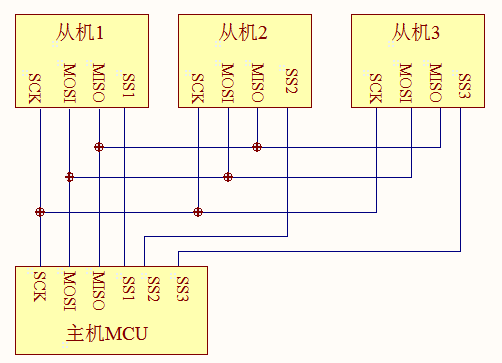

图 22‑1 常见的SPI通讯系统

SPI通讯使用3条总线及片选线，3条总线分别为SCK、MOSI、MISO，片选线为
，它们的作用介绍如下：

(1) SS( Slave Select)：从设备选择信号线，常称为片选信号线，也称为NSS、CS，以下用NSS表示。当有多个SPI从设备与SPI主机相连时，设备的其它信号线SCK、MOSI及MISO同时并联到相同的SPI总线上，即无论有多少个从设备，都共同只使用这3条总线；而每个从设备都有独立的这一条NSS信号线，本信号线独占主机的一个引脚，即有多少个从设备，就有多少条片选信号线。I2C协议中通过设备地址来寻址、选中总线上的某个设备并与其进行通讯；而SPI协议中没有设备地址，它使用NSS信号线来寻址，当主机要选择从设备时，把该从设备的NSS信号线设置为低电平，该从设备即被选中，即片选有效，接着主机开始与被选中的从设备进行SPI通讯。所以SPI通讯以NSS线置低电平为开始信号，以NSS线被拉高作为结束信号。

(2) SCK (Serial Clock)：时钟信号线，用于通讯数据同步。它由通讯主机产生，决定了通讯的速率，不同的设备支持的最高时钟频率不一样，如STM32的SPI时钟频率最大为f\ :sub:`pclk`/2，两个设备之间通讯时，通讯速率受限于低速设备。

(3) MOSI (Master Output， Slave Input)：主设备输出/从设备输入引脚。主机的数据从这条信号线输出，从机由这条信号线读入主机发送的数据，即这条线上数据的方向为主机到从机。

(4) MISO(Master Input,，Slave Output)：主设备输入/从设备输出引脚。主机从这条信号线读入数据，从机的数据由这条信号线输出到主机，即在这条线上数据的方向为从机到主机。

协议层
^^^^^^

与I2C的类似，SPI协议定义了通讯的起始和停止信号、数据有效性、时钟同步等环节。

SPI基本通讯过程
'''''''''''''''

先看看SPI通讯的通讯时序，见图 22‑2。

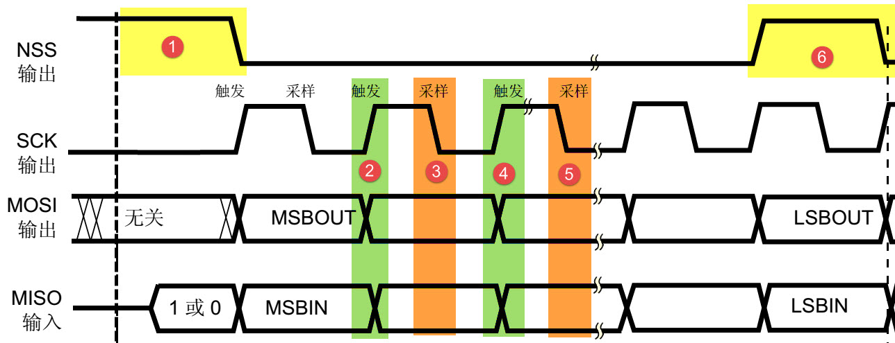

图 22‑2 SPI通讯时序

这是一个主机的通讯时序。NSS、SCK、MOSI信号都由主机控制产生，而MISO的信号由从机产生，主机通过该信号线读取从机的数据。MOSI与MISO的信号只在NSS为低电平的时候才有效，在SCK的每个时钟周期MOSI和MISO传输一位数据。

以上通讯流程中包含的各个信号分解如下：

通讯的起始和停止信号
''''''''''''''''''''

在图
22‑2中的标号处，NSS信号线由高变低，是SPI通讯的起始信号。NSS是每个从机各自独占的信号线，当从机检在自己的NSS线检测到起始信号后，就知道自己被主机选中了，开始准备与主机通讯。在图中的标号处，NSS信号由低变高，是SPI通讯的停止信号，表示本次通讯结束，从机的选中状态被取消。

数据有效性
''''''''''

SPI使用MOSI及MISO信号线来传输数据，使用SCK信号线进行数据同步。MOSI及MISO数据线在SCK的每个时钟周期传输一位数据，且数据输入输出是同时进行的。数据传输时，MSB先行或LSB先行并没有作硬性规定，但要保证两个SPI通讯设备之间使用同样的协定，一般都会采用图
22‑2中的MSB先行模式。

观察图中的标号处，MOSI及MISO的数据在SCK的上升沿期间变化输出，在SCK的下降沿时被采样。即在SCK的下降沿时刻，MOSI及MISO的数据有效，高电平时表示数据“1”，为低电平时表示数据“0”。在其它时刻，数据无效，MOSI及MISO为下一次表示数据做准备。

SPI每次数据传输可以8位或16位为单位，每次传输的单位数不受限制。

CPOL/CPHA及通讯模式
'''''''''''''''''''

上面讲述的图
22‑2中的时序只是SPI中的其中一种通讯模式，SPI一共有四种通讯模式，它们的主要区别是总线空闲时SCK的时钟状态以及数据采样时刻。为方便说明，在此引入“时钟极性CPOL”和“时钟相位CPHA”的概念。

时钟极性CPOL是指SPI通讯设备处于空闲状态时，SCK信号线的电平信号(即SPI通讯开始前、
NSS线为高电平时SCK的状态)。CPOL=0时，
SCK在空闲状态时为低电平，CPOL=1时，则相反。

时钟相位CPHA是指数据的采样的时刻，当CPHA=0时，MOSI或MISO数据线上的信号将会在SCK时钟线的“奇数边沿”被采样。当CPHA=1时，数据线在SCK的“偶数边沿”采样。见图
22‑3及图 22‑4。

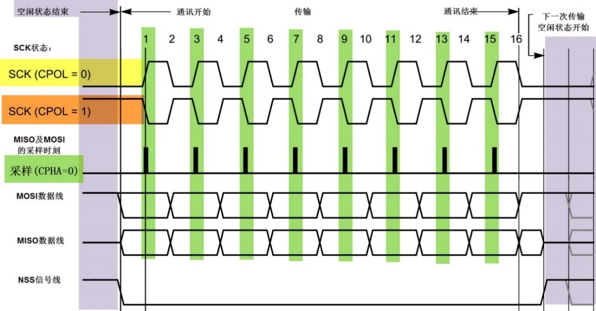

图 22‑3 CPHA=0时的SPI通讯模式

我们来分析这个CPHA=0的时序图。首先，根据SCK在空闲状态时的电平，分为两种情况。SCK信号线在空闲状态为低电平时，CPOL=0；空闲状态为高电平时，CPOL=1。

无论CPOL=0还是=1，因为我们配置的时钟相位CPHA=0，在图中可以看到，采样时刻都是在SCK的奇数边沿。注意当CPOL=0的时候，时钟的奇数边沿是上升沿，而CPOL=1的时候，时钟的奇数边沿是下降沿。所以SPI的采样时刻不是由上升/下降沿决定的。MOSI和MISO数据线的有效信号在SCK的奇数边沿保持不变，数据信号将在SCK奇数边沿时被采样，在非采样时刻，MOSI和MISO的有效信号才发生切换。

类似地，当CPHA=1时，不受CPOL的影响，数据信号在SCK的偶数边沿被采样，见图
22‑4。

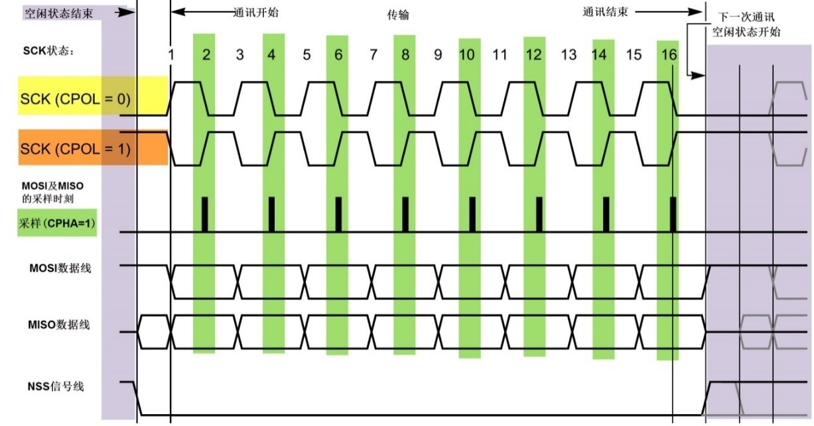

图 22‑4 CPHA=1时的SPI通讯模式

由CPOL及CPHA的不同状态，SPI分成了四种模式，见表
22‑1，主机与从机需要工作在相同的模式下才可以正常通讯，实际中采用较多的是“模式0”与“模式3”。

    表 22‑1 SPI的四种模式

+---------+------+------+---------------+----------+
| SPI模式 | CPOL | CPHA | 空闲时SCK时钟 | 采样时刻 |
+=========+======+======+===============+==========+
| 0       | 0    | 0    | 低电平        | 奇数边沿 |
+---------+------+------+---------------+----------+
| 1       | 0    | 1    | 低电平        | 偶数边沿 |
+---------+------+------+---------------+----------+
| 2       | 1    | 0    | 高电平        | 奇数边沿 |
+---------+------+------+---------------+----------+
| 3       | 1    | 1    | 高电平        | 偶数边沿 |
+---------+------+------+---------------+----------+

扩展SPI协议（Single/Dual/Quad/Octal SPI）
^^^^^^^^^^^^^^^^^^^^^^^^^^^^^^^^^^^^^^^^^

以上介绍的是经典SPI协议的内容，这种也被称为标准SPI协议（Standard
SPI）或单线SPI协议（Single
SPI），其中的单线是指该SPI协议中使用单根数据线MOSI进行发送数据，单根数据线MISO进行接收数据。

为了适应更高速率的通讯需求，半导体厂商扩展SPI协议，主要发展出了Dual/Quad/Octal
SPI协议，加上标准SPI协议（Single
SPI），这四种协议的主要区别是数据线的数量及通讯方式，具体见表格 22‑1。

表格 22‑1 四种SPI协议的区别

+-----------------------+-------------------+----------+
| 协议                  | 数据线数量及功能  | 通讯方式 |
+=======================+===================+==========+
| Single SPI（标准SPI） | 1根发送，1根接收  | 全双工   |
+-----------------------+-------------------+----------+
| Dual SPI（双线SPI）   | 收发共用2根数据线 | 半双工   |
+-----------------------+-------------------+----------+
| Quad SPI（四线SPI）   | 收发共用4根数据线 | 半双工   |
+-----------------------+-------------------+----------+
| Octal SPI（八线SPI）  | 收发共用8根数据线 | 半双工   |
+-----------------------+-------------------+----------+

扩展的三种SPI协议都是半双工的通讯方式，也就是说它们的数据线是分时进行收发数据的。例如，标准SPI（Single
SPI）与双线SPI（Dual SPI）都是两根数据线，但标准SPI（Single
SPI）的其中一根数据线只用来发送，另一根数据线只用来接收，即全双工；而双线SPI（Dual
SPI）的两根线都具有收发功能，但在同一时刻只能是发送或者是接收，即半双工，四线SPI（Quad
SPI）和 八线SPI（Octal SPI）与双线SPI（Dual
SPI）类似，只是数据线量的区别。

SDR和DDR模式
^^^^^^^^^^^^

扩展的SPI协议还增加了SDR模式（单倍速率Single Data
Rate）和DDR模式（双倍速率Double Data
Rate）。例如在标准SPI协议的SDR模式下，只在SCK的单边沿进行数据传输，即一个SCK时钟只传输一位数据；而在它的DDR模式下，会在SCK的上升沿和下降沿都进行数据传输，即一个SCK时钟能传输两位数据，传输速率提高一倍。

RT1052的FlexSPI特性及架构
~~~~~~~~~~~~~~~~~~~~~~~~~

与LPI2C外设一样，RT1052芯片也集成了专门用于SPI协议通讯的外设FlexSPI、LPSPI，其中LPSPI主要定位于通用的SPI通讯，而FlexSPI外设除了支持SPI通讯外还提供了很多与存储器相关的特性，所以FlexSPI外设通常用于与使用SPI协议的存储设备进行通讯。

RT1052的FlexSPI外设简介
^^^^^^^^^^^^^^^^^^^^^^^

FlexSPI，NXP以Flex形容它的SPI外设是因为它使用起来非常灵活，它支持如下特性：

-  Single/Dual/Quad/Octal模式的传输（即1/2/4/8根数据线的传输）。

-  支持SDR/DDR通讯模式，即单倍速率传输（Single Data
   Rate）和双倍速率传输（Dual Data
   Rate）都支持。在SDR模式下，它仅支持SPI中的模式0（CPOL=0，CPHA=0），即SCK空闲时为低电平，采样时刻为奇数边沿的模式。

-  支持控制SPI接口的串行NOR/NAND
   Flash设备、HyperBus协议设备以及FPGA设备。

-  支持读写单个串行FLASH以及读写多个并联的串行FLASH 的模式（Individual
   Mode及Parallel
   Mode）。在并联模式下，FlexSPI会对读写的数据进行合并读取和分离存储，这种方式可以把数据分别存储在不同的FLASH中。

-  支持把存储器地址映射至通过AHB总线读写，即后面说明的AHB命令模式。

-  支持使用DMA进行访问，从而减少CPU的介入。

-  支持以下多种模式以适配不同的功耗状态：模块关闭模式（Module Disable
   mode）、打盹儿模式（Doze mode）、停止模式（Stop
   mode）以及正常模式（Normal mode）。

-  最多支持4个存储设备，每个存储设备最大容量为4GB，不过要注意如果同时使用FlexSPI外接多个存储设备，那么这些存储设备容量的总和也不能超过4GB。

RT1052的FlexSPI架构剖析
^^^^^^^^^^^^^^^^^^^^^^^

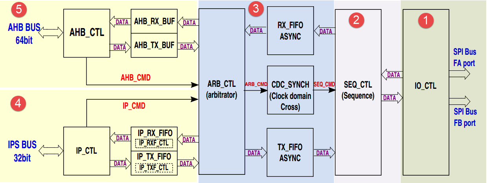

图 22‑5 FlexSPI架构图（摘自《IMXRT1050RM》）

通讯引脚
''''''''

FlexSPI外设包含有A/B两组SPI通讯接口，即图
22‑5中第①部分IO_CTL（IO控制逻辑）引出的“SPI Bus FA port”和“SPI Bus FB
port”。每组接口最多可外接2个设备，即A1、A2、B1和B2，具体引脚说明见表格
22‑2。关于这些引脚，可查阅《IMXRT1050RM》（参考手册），以它为准。

表格 22‑2 RT1052的FlexSPI A组引脚，整理自《IMXRT1050RM》（参考手册）

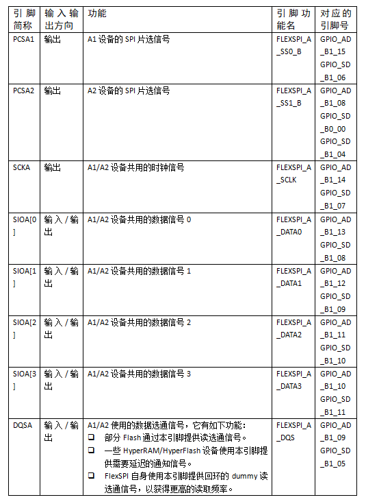

FlexSPI的B组具有同功能的一组独立引脚，此处不再列出。使用这些引脚与外部SPI Flash设备连接的方式具体见图 22‑6。

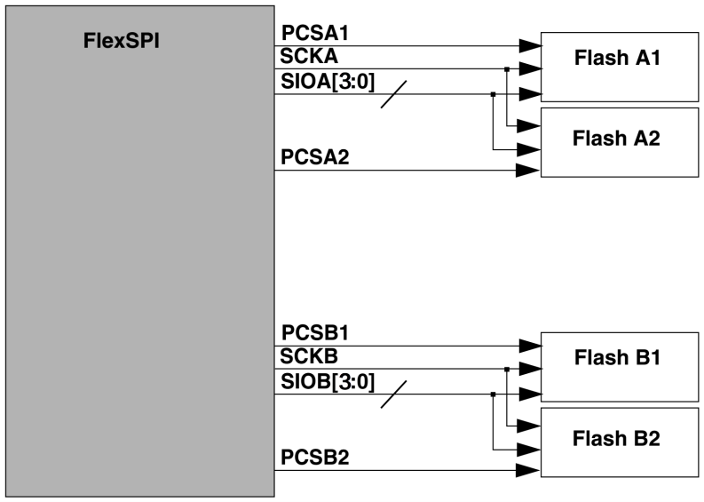

图 22‑6 FlexSPI外设与SPI Flash的连接

    特别地，当FlexSPI工作于Octal模式（八线SPI）时，它会以SIOB[3:0]数据信号线作为高4位的数据线，此时仅A组可以工作，B组不能使用。通过这种方式可以控制具有8根数据线的Flash设备，具体连接方式见图
    22‑7。

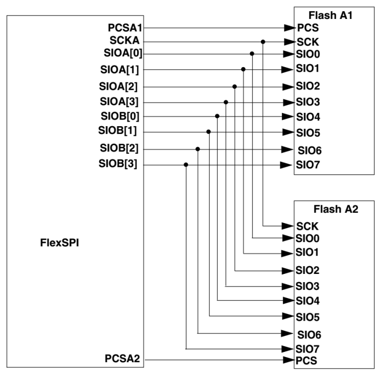

图 22‑7 FlexSPI外设使用组合模式与SPI Flash连接

指令查找表LUT
'''''''''''''

访问FLASH存储器通常包含一些读写功能的的控制指令，主控设备可通过这些指令访问FLASH存储器。

为了适应这种需求，FlexSPI外设中包含有一个指令查找表LUT（Look Up
Table），即图
22‑5中第②部分SEQ_CTL（序列控制逻辑）的主要内容，它用来预存储访问外部设备时可能使用到的指令，需要对FLASH进行访问时，FlexSPI会从查找表LUT中获取相应的指令然后通过SPI接口对FLASH发起通讯。

该表使用序列的形式缓存指令，最多支持16个指令序列，每个序列最多支持8个指令。例如，在某序列中缓存指令C1、C2、C3…，当控制执行该序列时，指令C1、C2、C3…会被按顺序执行。

查找表LUT的构成
               

查找表LUT的构成具体见图 22‑8。

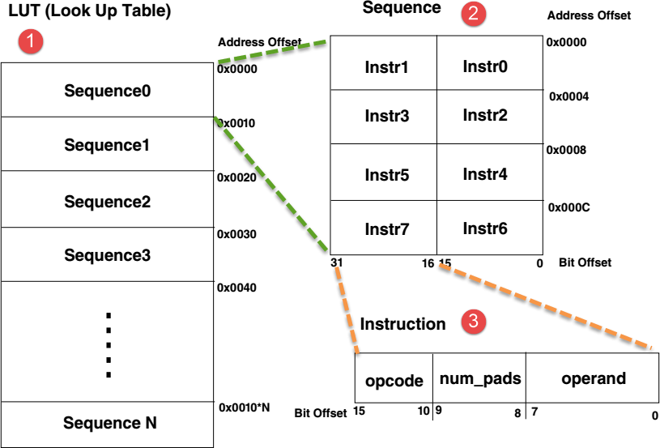

图 22‑8 查找表LUT 的构成

该图中的第①部分是查找表LUT视图，它表示查找表LUT有0~N个序列；第②部分是序列视图，它表示1个序列中包含有8个指令；第③部分是指令视图，表示指令由opcode（指令编码）、num_pads（数据线的数目）、operand(指令参数)三个寄存器域构成。这些指令的存储位置是FlexSPI外设中的寄存器LUT0~LUT63，每个LUT寄存器可以缓存2个指令，即1个指令序列（8个指令）由4个寄存器构成，这些寄存器构成了一个完整的LUT表。

LUT寄存器的构成
               

LUT寄存器的构成具体见图 22‑9。

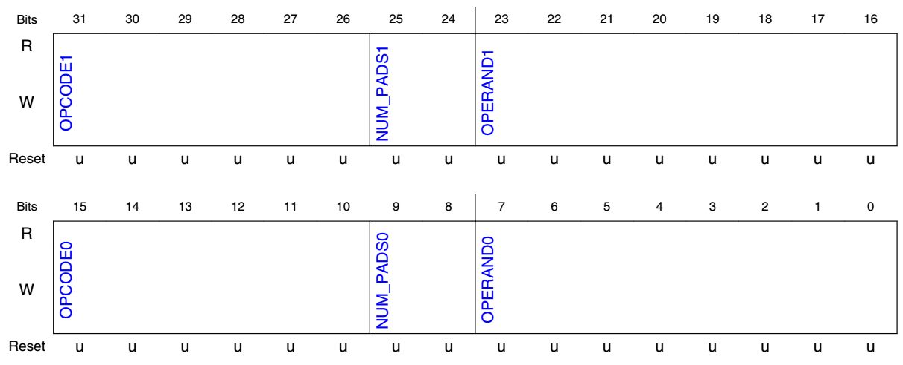

图 22‑9 LUT寄存器的组成

LUT寄存器的各个域说明如下：

-  OPCODE：指令编码，这是由FlexSPI定义的一些基本指令码，如向FLASH发送控制命令的CMD_SDR指令OPCODE为0x01；发送行地址到FLASH的指令OPCODE为0x02，诸如此类。

-  NUM_PADS：进行SPI通讯时使用的数据线的数目，它的可用参数为：

1) 0x0：Single模式

2) 0x1：Dual模式

3) 0x2：Quad模式

4) 0x3：Octal模式

-  OPERAND：指令参数，部分OPCODE指令包含参数，这些参数就由OPERAND设定，参数的具体作用由相应的OPCODE决定。

常用指令说明
            

表格
22‑3列出了一些查找表LUT常用的指令，该表给出了这些指令的功能、OPCODE、NUM_PADS以及OPERAND等配置。

表格 22‑3 查找表LUT的常用指令

+------------+-----------+------------------+------------------------+---------------------+
|  指令名称  |  OPCODE   |     NUM_PADS     |   SPI接口发送的内容    |     Bits/Bytes/     |
|            |           |                  |                        |     Cycle的数目     |
+============+===========+==================+========================+=====================+
| CMD_SDR/   | 0x01/0x21 | 0：Single模式    | 发送控制FLASH的命      | Bits数目：固定为8   |
|            |           |                  | 令代码到FLASH存储      |                     |
| CMD_DDR    |           |                  | 器，即OPERAND          |                     |
|            |           | 1：Dual模式      |                        |                     |
|            |           |                  | [7:0]的内容            |                     |
|            |           | 2：Quad模式      |                        |                     |
|            |           |                  |                        |                     |
|            |           | 3：Octal模式     |                        |                     |
+------------+-----------+------------------+------------------------+---------------------+
| RADDR_SDR  | 0x02/0x22 |                  | 发送行地址到FLASH      | Bits数目：OPER      |
|            |           |                  | ，                     | AND                 |
| /RADDR_DDR |           |                  |                        | [7:0]，即由它指定   |
|            |           |                  | AHB命令模式：          | 地址的位数          |
|            |           |                  |                        |                     |
|            |           |                  |                        |                     |
|            |           |                  | 由访问的AHB            |                     |
|            |           |                  | 地址决定；             |                     |
|            |           |                  |                        |                     |
|            |           |                  | IP命令模式：           |                     |
|            |           |                  |                        |                     |
|            |           |                  |                        |                     |
|            |           |                  | 由IPCR0寄存器决定      |                     |
+------------+-----------+------------------+------------------------+---------------------+
| WRITE_SDR/ | 0x08/0x28 |                  | 发送要写入的数据到FL   | Bytes数目，即要传   |
|            |           |                  | ASH，                  | 输的字节数：        |
| WRITE_DDR  |           |                  |                        |                     |
|            |           |                  | 即AHB_TX_BUF           |                     |
|            |           |                  | 或IP_TX_FIFO           | AHB命令模式：       |
|            |           |                  | 的数据                 |                     |
|            |           |                  |                        |                     |
|            |           |                  |                        | 由AHB突发大小和突发 |
|            |           |                  |                        | 类型决定            |
|            |           |                  |                        |                     |
|            |           |                  |                        | IP命令模式：        |
|            |           |                  |                        |                     |
|            |           |                  |                        |                     |
|            |           |                  |                        | 由IPCR1.DATS        |
|            |           |                  |                        | Z寄存器域决定       |
+------------+-----------+------------------+------------------------+---------------------+
| READ_SDR/  | 0x09/0x29 |                  | 从FLASH接收数据，      |                     |
|            |           |                  | 收到的数据会被存储到A  |                     |
| READ_DDR   |           |                  | HB_RX_BUF或I           |                     |
|            |           |                  | P_RX_FIFO              |                     |
+------------+-----------+------------------+------------------------+---------------------+
| DUMMY_SDR/ | 0x0C/0x2C |                  | FlexSPI释放对数        | Cycle数目，即DU     |
|            |           |                  | 据线的控制，时钟信号正 | MMY周期的个数（即S  |
| DUMMY_DDR  |           |                  | 常驱动。这种指令通常是 | CK的周期数）：      |
|            |           |                  | FLASH设备要求的空      |                     |
|            |           |                  | 操作等待               |                     |
|            |           |                  |                        | OPERAND             |
|            |           |                  |                        | [7:0]，由它指定发   |
|            |           |                  |                        | 送多少个DUMMY周期   |
+------------+-----------+------------------+------------------------+---------------------+
| STOP       | 0x00      | 固定为0，即Singl | 停止执行，释放CS片选   | SPI接口无数据传输   |
|            |           | e模式            | 信号，不发送内容       |                     |
+------------+-----------+------------------+------------------------+---------------------+

此处对该表中特别值得注意的内容说明如下：

-  查找表支持两套有同功能不同模式的指令。例如CMD_SDR和CMD_DDR的OPCODE为0x01和0x21，它们分别表示使用SDR模式和DDR模式的CMD指令，它们的功能一样，都是向FLASH发送命令代码。其它指令类似，大都有SDR和DDR模式。

-  数据线的数目由NUM_PADS指定。不同的指令可以通过它自身的NUM_PADS域来指定，因此不同指令可以使用不同的数据线数目。在应用中一些FLASH存储器的命令只使用一根数据线（Single模式），而快速读写的命令则可支持Dual、Quad模式，此时针对命令使用不同的NUM_PADS进行定制即可。

-  OPERAND参数在不同指令下作用不同：

1) 对于CMD_SDR指令，它的功能是向FLASH发送命令代码，此时要发送的FLASH命令代码就是CMD_SDR指令的参数，即由OPERAND域指定（请注意区分FLASH命令和OPCODE）。例如W25Q256型号的FLASH的读取ID命令代码为0xAB，当RT1052要读取FLASH的ID时，利用CMD_SDR指令同时把命令代码0xAB赋予到OPERAND域，这样FlexSPI控制的时候就会通过SPI接口把FLASH命令0xAB发送出去了。

2) 对于RADDR_SDR指令，它的功能是向FLASH发送要读写的存储单元地址，该地址由IPCR0寄存器指定，同时OPERAND域用于指定地址的长度。例如部分FLASH的空间比较小，只使用16位来表示地址，那么该命令的OPERAND域的值就应为16，对于W25Q256这种地址为24或32位的存储器，OPERAND域的值就应设置为24或32。

3) 对于DUMMY_SDR指令，它的功能是释放FlexSPI对数据线的控制，而时钟正常运行，该指令是针对FLASH存储器的部分时序要求，这时FLASH存储器会忽略数据线上的内容，实质它是要求主机进行等待，在这种情况下可通过OPERAND指定该过程要占多少个SCK的周期数。

-  数据传输指令的数据缓冲区位置分两种情况。WRITE_SDR和READ_SDR指令分别用于向FLASH写入和读取数据，这些指令传输的数据缓冲位置如下：

1) 在AHB命令模式下：数据缓存在AHB_TX_BUF（发送缓冲区）以及AHB_RX_BUF（接收缓冲区）中，此时要传输的字节数由AHB突发传输的大小和类型决定。

2) 在IP命令模式下：数据缓存在IP_TX_FIFO（发送缓冲区）以及IP_RX_FIFO（接收缓冲区）中，此时要传输的字节数可通过寄存器IPCR1的DATSZ域指定。

-  操作通常使用序列的形式并配合STOP指令（停止指令）使用：以上说明的各个指令通常不会单独执行，而是组成一个指令序列，对于指令数不满8个的序列，需要使用STOP指令表示结束。例如一个使用IP命令模式的读取操作中，通常会使用以下的指令序列：

1) 使用CMD_SDR指令向发送FLASH的读取命令，如W25Q256的Quad模式读取命令编码为0x6B，此时CMD_SDR指令的OPERAND域为0x6B；

2) 使用RADDR_SDR指令发送要读取的FLASH存储单元地址，OPERAND域的值为24表示使用24位的地址，而地址具体的值由寄存器IPCR0设定；

3) 按照FLASH的Quad模式读取命令的要求发送占8个SCK时钟的DUMMY操作，此时使用DUMMY_SDR指令且OPERAND域的值设置为8；

4) 使用READ_SDR指令，开始接收FLASH的数据到IP_RX_FIFO中，要读取的字节数由寄存器IPCR1的DATSZ域指定；

5) 由于使用的指令不足8个字节，在该序列的最后使用STOP指令表示停止，当FlexSPI执行到STOP指令时，会释放SPI的片选信号CS，结束通讯。

命令仲裁器
''''''''''

图
22‑5中第③部分是ARB_CTL（仲裁器逻辑），它主要用来决定执行哪一套命令。在其后有一个AHB_CTL（AHB命令控制逻辑）和IP_CTL（IP命令控制逻辑），它们分别代表了内核对FlexSPI的两种控制方式
，该仲裁器逻辑就是决定它们谁拥有对前面逻辑单元（SEQ_CTL和IO_CTL）的控制权。

IP命令控制逻辑
''''''''''''''

图
22‑5中第④部分IP_CTL是IP命令控制逻辑，它包含IP_RX_FIFO和IP_TX_FIFO用来缓冲收发的数据，它们均为16*64Bits大小。IP_CTL连接至32位的ARM
IP总线，通过它可以向ARB_CTL（仲裁器逻辑）发送控制命令，从而利用FlexSPI访问外部SPI设备。IP命令实际上就是内核通过访问外设寄存器的方式控制外设，FlexSPI外设的寄存器大都是为这种控制方式服务的，包括IP_RX_FIFO和IP_TX_FIFO都是以寄存器的形式提供给用户进行访问，这种方式其实与前面的GPIO、LPI2C、LPUART等外设的控制方式一样，这样命名主要是为了与后面的AHB命令方式进行区分。

IP命令的控制流程如下：

(1) 往IP_TX_FIFO填充要传输的数据；

(2) 通过IPCR0寄存器设置要写入的FLASH内部存储单元的首地址，要传输的数据大小以及要执行的LUT命令序列的编号；

(3) 对寄存器IPCMD的TRG位置1触发FlexSPI访问；

(4) 检查寄存器INTR的IPCMDDONE位以等待至FlexSPI外设执行完该指令；

(5) 若执行的命令序列有会接收数据，那么接收到的数据会被缓存至IP_RX_FIFO中。

AHB命令控制逻辑
'''''''''''''''

图
22‑5中第⑤部分AHB_CTL是AHB命令控制逻辑，它包含有128*64Bits大小的AHB_RX_BUF和8*64Bits大小的AHB_TX_BUF用来缓冲收发的数据，AHB_CTL连接至64位的AHBP总线，通过它可以向ARB_CTL（仲裁器逻辑）发送控制命令，从而FlexSPI访问外部SPI设备。

使用AHB命令的方式是直接访问RT1052内部的0x600 0000-0x1000
0000地址，对这些地址的读写访问会触发FlexSPI产生SPI控制时序，然后对连接的FLASH内部存储单元进行读写，这种功能称为地址映射。

例如可以把外部NOR
Flash存储器的内部地址0x0映射到RT1052的0x60000000地址，初始化好FlexSPI后，当我们直接使用指针读取RT1052的0x60000000地址的内容时，会自动触发FlexSPI外设访问外部的NOR
Flash存储器的0x0地址获得数据，访问时它会自动使用AHB_RX_BUF及AHB_TX_BUF缓冲数据。

AHB命令仅支持对FLASH存储单元的读写访问，对FLASH存储器的工作模式或状态寄存器的读取需要使用IP命令实现。

特别地，对IP命令的两个FIFO也可以通过地址映射来访问，其中
IP_RX_FIFO映射至0x7FC00000 -0x10000200地址，而IP_TX_FIFO映射至0x7F800000
-0x11000400地址。

驱动时钟
''''''''

在图
22‑5中并没有表现出FlexSPI外设的驱动时钟，它的SCK线的时钟信号是由ipg_clk_sfck提供的，即FlexSPI根时钟FLEXSPI_CLK_ROOT。

图 22‑10 FlexSPI根时钟FLEXSPI_CLK_ROOT在时钟树中的描述

FlexSPI根时钟有4个可选输入来源：

-  semc_clk_root_pre：这是未经过SEMC“时钟门”的SEMC根时钟SEMC_CLK_ROOT，即如果选择本输入源的话，不打开SEMC的时钟门它也是可以正常输入到FlexSPI的。

-  pll3_sw_clk：该时钟来源即为PLL3，常规配置为480MHz。

-  PLL2 PFD2：该时钟常规配置为396MHz。

-  PLL3 PFD0：该时钟常规配置为720MHz。

选择的时钟源经过FlexSPI的时钟门之后，还有一个3位的分频器，它可对时钟源进行1~8分频，分频后得到FlexSPI根时钟FLEXSPI_CLK_ROOT。

FlexSPI初始化配置结构体详解
~~~~~~~~~~~~~~~~~~~~~~~~~~~

跟其它外设一样，RT1052软件库提供了FlexSPI初始化结构体及初始化函数来配置FlexSPI外设，相对于花时间了解FlexSPI复杂的控制过程和寄存器，直接学习如何使用库文件中的相关结构体和库函数会更快地掌握如何控制FlexSPI。FlexSPI的初始化结构体及函数定义在库文件“fsl_flexspi.h”及“fsl_flexspi.c”中，编程时我们可以结合这两个文件内的注释使用或参考库帮助文档，具体见代码清单
22‑1。

.. code-block:: c
   :name: 代码清单 22‑1 FlexSPI初始化结构体（fsl_flexspi.h文件）
   :caption: 代码清单 22‑1 FlexSPI初始化结构体（fsl_flexspi.h文件）
   :linenos:

    /*! @brief FLEXSPI 初始化配置结构体 */
    typedef struct _flexspi_config {
        /*!< 选择读取FLASH使用的采样时钟源  */
        flexspi_read_sample_clock_t rxSampleClock;
        /*!< 是否使能SCK自由运行输出 */
        bool enableSckFreeRunning;
    /*!< 是否使能PORT A和PORT B的数据引脚组合(SIOA[3:0] 和 SIOB[3:0])以支持FLASH的8位模式 */
        bool enableCombination;

        /*!< 是否使能doze模式 */
        bool enableDoze;
        /*!< 是否使能 为半速率命令而对时钟2分频 的功能 */
        bool enableHalfSpeedAccess;
        /*!< 是否使能SCKB用作SCKA的差分时钟，当使能时，PORT B的FLASH无法访问 */
        bool enableSckBDiffOpt;
        /*!< 是否使能对所有连接的设备使用同样的配置，当使能时，
        FLSHA1CRx寄存器的配置会应用到所有设备 */
        bool enableSameConfigForAll;
        /*!< 命令序列执行的等待超时周期，ahbGrantTimeoutCyle*1024个串行根时钟周期后超时 */
        uint16_t seqTimeoutCycle;
        /*!< IP命令授予等待超时周期，ipGrantTimeoutCycle*1024个AHB时钟周期后超时 */
        uint8_t ipGrantTimeoutCycle;
        /*!< FLEXSPI IP 发送水印值 */
        uint8_t txWatermark;
        /*!< FLEXSPI接收水印值 */
        uint8_t rxWatermark;

        struct {
            /*!<使能AHB总线对IP TX FIFO的写访问 */
            bool enableAHBWriteIpTxFifo;
            /*!<使能AHB总线对IP RX FIFO的写访问 */
            bool enableAHBWriteIpRxFifo;
            /*!< AHB命令授予等待超时周期，在ahbGrantTimeoutCyle*1024 个AHB时钟周期后超时 */
            uint8_t ahbGrantTimeoutCycle;
            /*!< AHB读写访问超时周期，ahbBusTimeoutCycle*1024 个AHB时钟后超时 */
            uint16_t ahbBusTimeoutCycle;
            /*!< 在暂停命令序列恢复之前空闲状态的等待周期，ahbBusTimeoutCycle个AHB时钟后超时 */
            uint8_t resumeWaitCycle;
            /*!< AHB 缓冲区信息 */
            flexspi_ahbBuffer_config_t buffer[FSL_FEATURE_FLEXSPI_AHB_BUFFER_COUNT];
            /*!< 是否使能当FLEXSPI返回停止模式响应时自动清除AHB RX和TX缓冲 */
            bool enableClearAHBBufferOpt;
            /*!< 是否使能AHB预读取特性，当使能时，FLEXSPI会读取比当前AHB突发读取更多的数据 */
            bool enableAHBPrefetch;
            /*!< 是否使能AHB缓冲写访问的功能，当使能时，FLEXSPI会在等待命令执行完成前就返回 */
            bool enableAHBBufferable;
            /*!< 是否使能AHB总线缓冲读访问的功能 */
            bool enableAHBCachable;
        } ahbConfig;
    } flexspi_config_t;

这些结构体成员说明如下，其中“寄存器位AAA[BBB]”表示本成员值对应的是FlexSPI寄存器AAA的BBB配置位，对结构体成员有疑惑时可到参考手册中查阅相应的配置位来理解。

-  rxSampleClock

寄存器位MCR0[RXCLKSRC]，本成员用于配置读取FLASH使用的采样时钟源，它是一个枚举类型变量，其可选值具体见代码清单
22‑2。

.. code-block:: c
   :name: 代码清单 22‑2 flexspi_read_sample_clock_t枚举类型的定义（fsl_flexspi.h文件）
   :caption: 代码清单 22‑2 flexspi_read_sample_clock_t枚举类型的定义（fsl_flexspi.h文件）
   :linenos:

    /*! @brief 选择给读取FLASH使用的FlexSPI采样时钟源 */
    typedef enum _flexspi_read_sample_clock {
        /*!< 伪读选通脉冲由FlexSPI控制器产生并在内部回环 */
        kFLEXSPI_ReadSampleClkLoopbackInternally = 0x0U,
        /*!< 伪读选通脉冲由FlexSPI控制器产生并从DQS引脚回环 */
        kFLEXSPI_ReadSampleClkLoopbackFromDqsPad = 0x1U,
        /*!<使用 SCK输出时钟以并从SCK引脚回环  */
        kFLEXSPI_ReadSampleClkLoopbackFromSckPad = 0x2U,
        /*!< Flash提供读选通脉冲并从DQS引脚输入 */
        kFLEXSPI_ReadSampleClkExternalInputFromDqsPad = 0x3U,
    } flexspi_read_sample_clock_t;

-  enableSckFreeRunning

    寄存器位MCR0[SCKFREERUNEN]，本成员用于配置是否使能SCK的输出自由运行（free-running）的功能，该功能通常应用在与FPGA设备相关的应用中，它会以SCK作为参考时钟自己内部PLL的输入。

-  enableCombination

    寄存器位MCR0[COMBINATIONEN]，本成员用于配置是否使能图 22‑11 中的PORT
    A和PORT B组合模式，在组合模式中会同时使用PORTA[3:0]及PORT
    B[3:0]的数据线，通过这种方式，可以对有8根数据信号线的FLASH进行读写。

-  enableDoze

    寄存器位MCR0[DOZEEN]，本成员配置是否使能Doze模式，使能了doze模式后，即使RT1052芯片处于低功耗stop运行状态时FlexSPI也能正常工作。

-  enableHalfSpeedAccess

    寄存器位MCR0[HSEN]，本成员配置是否使能对SCK时钟进行2分频以降低访问速率。

-  enableSckBDiffOpt

    寄存器位MCR2[SCKBDIFFOPT]，本成员配置是否把SCKB用作SCKA的差分时钟，使用2线差分的形式可以提高抗干扰的能力，不过此时PORT
    B就不能再用于FLASH的时钟信号，也就是无法使用了。

-  enableSameConfigForAll

    寄存器位MCR2[SAMEDEVICEEN]，本成员配置是否使能所有连接的设备都用同样的配置，如果使能的话，FLASHA1CRx寄存器的配置会被应用到所有的设备。

-  seqTimeoutCycle

    寄存器位MCR1[SEQWAIT]，本成员设置命令序列执行的等待超时周期，设置结果为seqTimeoutCycle*1024个FlexSPI根时钟周期后超时，超时后可产生中断且会忽略AHB命令。若本成员设置为0则不使用本功能。

-  ipGrantTimeoutCycle

    寄存器位MCR0
    [IPGRANTWAIT]，本成员配置IP命令授予等待超时周期，即触发IP命令后，若命令仲裁器在ipGrantTimeoutCycle*1024个AHB时钟周期后还不允许执行该命令，则可触发中断。注意本功能仅支持调试模式，使用时直接设置为默认值即可，且不能设置为0！

-  txWatermark

    寄存器位IPTXFCR
    [TXWMRK]，本成员配置IP发送的水印值，单位为字节。当IP_TX_FIFO的空余的程度大于或等于该水印值时，可触发IPTXWE中断，同时也可触发DMA请求从而往IP_TX_FIFO填充要传输的数据。

-  rxWatermark

    寄存器位IPRXFCR
    [RXWMRK]，本成员配置接收的水印值，单位为字节。当IP_RX_FIFO接收的数据超过该水印值时，可触发IPRXWA中断，同时也可触发DMA请求把数据从IP_RX_FIFO转移出去。

接下来是包含在flexspi_config_t中的一个ahbConfig结构体类型的成员，它主要用于配置AHB总线的各项参数：

-  enableAHBWriteIpTxFifo

    寄存器位MCR0 [ATDFEN]，配置是否使能AHB总线通过映射地址（0x7F800000
    -0x11000400）对IP_TX_FIFO的写访问。使能后，可通过AHB总线映射的地址向IP_TX_FIFO写入内容，此时通过IP总线写入IP_TX_FIFO的操作（即直接向寄存器进行写入操作）会被忽略，但不会出现错误标志；若不使能，可通过IP总线写入IP_TX_FIFO，此时通过AHB总线的写入操作会被忽略，且会产生错误标志。

-  enableAHBWriteIpRxFifo

    寄存器位MCR0 [ARDFEN]，配置是否使能AHB总线通过映射地址（0x7FC00000
    -0x10000200）对IP_RX_FIFO的读访问。与enableAHBWriteIpTxFifo的类似，用于控制使用AHB还是IP进行读操作。

-  ahbGrantTimeoutCycle

    寄存器位MCR0 [AHBGRANTWAIT]，与ipGrantTimeoutCycle成员类似，
    ahbGrantTimeoutCycle用于配置AHB命令授予等待超时周期，即触发AHB命令后，若命令仲裁器在在
    ahbGrantTimeoutCyle*1024
    个AHB时钟周期后还不允许执行该命令，会触发中断。注意本功能同样仅支持调试模式，使用时直接设置为默认值即可，且不能设置为0！

-  ahbBusTimeoutCycle

    寄存器位MCR1
    [AHBBUSWAIT]，配置AHB读写访问超时周期，在超过ahbBusTimeoutCycle*1024
    个AHB时钟周期后，仍没接收到数据或没发送出数据则表示访问超时，触发时可产生AHBBUSTIMEOUT中断。

-  resumeWaitCycle

    寄存器位MCR2[RESUMEWAIT]，配置在暂停命令序列恢复之前，等待空闲状态的周期，等待超过resumeWaitCycle个AHB时钟后超时。

-  buffer

    寄存器位AHBRXBUFxCR0
    [PRIORITY、MSTRID、BUFSZ]（其中x可以为0~3），配置AHB
    缓冲区的一些信息，它是一个flexspi_ahbBuffer_config_t结构体，它包含的配置参数分别为缓冲区的优先级、主索引号以及缓冲区的大小这些信息，具体见代码清单
    22‑3。

.. code-block:: c
   :name: 代码清单 22‑3 flexspi_ahbBuffer_config_t结构体的内容（fsl_flexspi.h文件）
   :caption: 代码清单 22‑3 flexspi_ahbBuffer_config_t结构体的内容（fsl_flexspi.h文件）
   :linenos:

    typedef struct _flexspi_ahbBuffer_config {
        uint8_t priority;     /* 优先级 */
        uint8_t masterIndex;  /* 主索引号 */
        uint16_t bufferSize;  /* 缓冲区大小 */
    } flexspi_ahbBuffer_config_t;

回到代码清单 22‑1中的定义语句：

flexspi_ahbBuffer_config_t buffer[FSL_FEATURE_FLEXSPI_AHB_BUFFER_COUNT];

    该语句中的宏FSL_FEATURE_FLEXSPI_AHB_BUFFER_COUNT值为4（即RT1052芯片AHB
    Rx
    Buffer的数量），所以该语句实质是定义4个这样包含缓冲区信息的结构体。

-  enableClearAHBBufferOpt

    寄存器位MCR2[CLRAHBBUFOPT]，配置是否使能自动清除AHB
    RX和TX缓冲的功能，使能后，当FLEXSPI退出停止模式时自动清除。

-  enableAHBPrefetch

    寄存器位AHBCR[PREFETCHEN]，配置是否使能AHB预读取特性，当使能时，FLEXSPI会读取比当前AHB突发读取方式更多的数据，提高效率。

-  enableAHBBufferable

    寄存器位AHBCR
    [BUFFERABLEEN]，配置是否使能AHB缓冲写访问的功能，当使能时，FLEXSPI会在命令执行完成前就返回，否则会等待至AHB总线准备好并把数据传输至外部设备且命令执行完成后才返回。

-  enableAHBCachable

    寄存器位AHBCR [CACHABLEEN]，配置是否使能AHB总线缓冲读访问的功能。

与LPI2C的使用方式类似，在应用初始化配置结构体时，通常先直接调用库函数FLEXSPI_GetDefaultConfig赋予常用默认配置，然后再针对性地把初始化配置结构体修改成自己需要的内容，FLEXSPI_GetDefaultConfig函数的实现具体见代码清单
22‑4。

.. code-block:: c
   :name: 代码清单 22‑4 FLEXSPI_GetDefaultConfig函数赋予的常用默认值（fsl_flexspi.c文件）
   :caption: 代码清单 22‑4 FLEXSPI_GetDefaultConfig函数赋予的常用默认值（fsl_flexspi.c文件）
   :linenos:

    /*!
    * @brief 获取FLEXSPI的常用默认配置
    *
    * @param FLEXSPI配置结构体
    */
    void FLEXSPI_GetDefaultConfig(flexspi_config_t *config)
    {
        config->rxSampleClock = kFLEXSPI_ReadSampleClkLoopbackInternally;
        config->enableSckFreeRunning = false;
        config->enableCombination = false;
        config->enableDoze = true;
        config->enableHalfSpeedAccess = false;
        config->enableSckBDiffOpt = false;
        config->enableSameConfigForAll = false;
        config->seqTimeoutCycle = 0xFFFFU;
        config->ipGrantTimeoutCycle = 0xFFU;
        config->txWatermark = 8;
        config->rxWatermark = 8;
        config->ahbConfig.enableAHBWriteIpTxFifo = false;
        config->ahbConfig.enableAHBWriteIpRxFifo = false;
        config->ahbConfig.ahbGrantTimeoutCycle = 0xFFU;
        config->ahbConfig.ahbBusTimeoutCycle = 0xFFFFU;
        config->ahbConfig.resumeWaitCycle = 0x20U;
        memset(config->ahbConfig.buffer, 0, sizeof(config->ahbConfig.buffer));
        config->ahbConfig.enableClearAHBBufferOpt = false;
        config->ahbConfig.enableAHBPrefetch = false;
        config->ahbConfig.enableAHBBufferable = false;
        config->ahbConfig.enableAHBCachable = false;
    }

该内部就是直接对输入的结构体赋予常用的配置值，便于后续使用。

调用以上函数对初始化配置结构体赋予默认值并针对自己的需求修改后，可以通过调用FLEXSPI_Init函数根据结构体的配置值向寄存器写入配置，完成FlexSPI外设的初始化，该函数的声明具体见代码清单
21‑6。

.. code-block:: c
   :name: 代码清单 22‑5 FLEXSPI_Init函数的声明（fsl_flexspi.h文件）
   :caption: 代码清单 22‑5 FLEXSPI_Init函数的声明（fsl_flexspi.h文件）
   :linenos:

    /*!
    * @brief 初始化FLEXSPI外设和内部状态
    *
    * 本函数使能了FLEXSPI的时钟并根据输入的参数配置FLEXSPI外设
    * 在使用FLEXSPI操作前应调用本函数
    *
    * @param base FLEXSPI外设基地址
    * @param config FLEXSPI初始化配置结构体
    */
    void FLEXSPI_Init(FLEXSPI_Type *base, const flexspi_config_t *config);

调用本函数时直接通过base参数指定要初始化哪个FlexSPI，不过在RT1052中只有一个FLexSPI外设，函数保留本参数主要是为了兼容以后可能推出的、具有多个该外设的芯片了；函数的第2个参数即为flexspi_config_t初始化配置结构体，调用时把赋值好的结构体变量作为参数输入即可。

FlexSPI传输结构体详解
~~~~~~~~~~~~~~~~~~~~~

与LPUART、LPI2C外设类似，除了初始化配置结构体外，NXP的软件库中还提供了传输结构体flexspi_transfer_t和传输函数以简化FlexSPI的数据通讯，使用这样的函数即可控制FlexSPI执行查找表LUT里的指令，具体见代码清单
23‑1。

.. code-block:: c
   :name: 代码清单 22‑6 传输结构体（fsl_flexspi.h文件）
   :caption: 代码清单 22‑6 传输结构体（fsl_flexspi.h文件）
   :linenos:

    /*! @brief FLEXSPI传输结构体 */
    typedef struct _flexspi_transfer {
        uint32_t deviceAddress;         /*!< 要操作的设备地址 */
        flexspi_port_t port;            /*!< 要操作的端口 */
        flexspi_command_type_t cmdType; /*!< 要执行的命令类型 */
        uint8_t seqIndex;               /*!< 命令的序列ID */
        uint8_t SeqNumber;              /*!< 命令序列的数量 */
        uint32_t *data;                 /*!< 数据缓冲区 */
        size_t dataSize;                /*!< 传输数据的字节数 */
    } flexspi_transfer_t;

以上各个结构体成员介绍如下：

-  deviceAddress

    寄存器位IPCR0[SFAR]，这用于设置IP指令要访问的FLASH设备的内部地址。例如读命令中要读取地址0x1000的内容，那么控制时这个deviceAddress的值就应赋值为0x1000。

-  port

    指定要操作的FLASH端口，这是一个flexspi_port_t枚举类型，其可选的值分别为A1、A2、B1和B2端口，具体见代码清单
    22‑7。

.. code-block:: c
   :name: 代码清单 22‑7 flexspi_port_t枚举类型的值（fsl_flexspi.h文件）
   :caption: 代码清单 22‑7 flexspi_port_t枚举类型的值（fsl_flexspi.h文件）
   :linenos:

    /*! @brief 选择要操作的FLEXSPI端口*/
    typedef enum _flexspi_port {
        kFLEXSPI_PortA1 = 0x0U, /*!< 使用A1端口访问FLASH */
        kFLEXSPI_PortA2 = 0x1U, /*!< 使用A2端口访问FLASH */
        kFLEXSPI_PortB1 = 0x2U, /*!< 使用B1端口访问FLASH */
        kFLEXSPI_PortB2 = 0x3U, /*!< 使用B2端口访问FLASH */
    } flexspi_port_t;

-  cmdType

    本成员用于告知要执行的命令是什么类型，它是一个flexspi_command_type_t枚举类型，其可选值分别为命令操作、配置设备模式操作、读操作以及写操作，具体见代码清单
    22‑8。

.. code-block:: c
   :name: 代码清单 22‑8 flexspi_command_type_t枚举类型的值（fsl_flexspi.h文件）
   :caption: 代码清单 22‑8 flexspi_command_type_t枚举类型的值（fsl_flexspi.h文件）
   :linenos:

    typedef enum _flexspi_command_type {
        kFLEXSPI_Command, /*!< 命令操作, TX 和 Rx buffer 都被忽略 */
        kFLEXSPI_Config,  /*!< 配置设备模式, TX fifo 的大小由LUT设定 */
        kFLEXSPI_Read,    /*!< 读操作, 只有 RX Buffer 有效 */
        kFLEXSPI_Write,   /*!< 写操作, 只有 TX Buffer 有效 */
    } flexspi_command_type_t;

-  seqIndex

    寄存器位IPCR1[ISEQID]，本成员是指令的序列ID，即要执行的指令序列在LUT中的编号，FlexSPI外设通过该配置在LUT中找到对应的指令序列执行。

-  SeqNumber

    寄存器位IPCR1[ISEQNUM]，本成员指要执行LUT指令序列的数量。

-  data

    本成员是一个指针，它指向要发送的数据或缓存接收到数据的缓冲区，通常我们会定义一个数组用于缓冲。对于要发送的数据，指针中的数据最终会被写入到TFDR0-TFDR31寄存器（IP_TX_FIFO寄存器），而接收数据时，会从RFDR0-RFDR31寄存器（IP_RX_FIFO寄存器）中获取数据存储到指针。

-  dataSize

    寄存器位IPCR1[IDATSZ]，本成员用于指定要传输数据的字节数，该寄存器配置域是16位的，所以一次传输最多不能超过65535个字节。

根据应用的需要设置好传输结构体后，可以调用库函数FLEXSPI_TransferBlocking或FLEXSPI_TransferNonBlocking开始数据传输。与LPI2C类似，前者在通讯的整个过程中会阻塞代码，当整个传输过程完成时才退出函数；后者会开启中断传输，调用函数后它会根据结构体配置寄存器，然后就退出函数，即不管数据传输是否完成都会退出，这种方式的优点是不会阻塞后续的代码执行，但需要其它代码配合检测中断传输标志。不管如何，调用这两个函数能大大简化我们的控制操作。

无论使用哪个函数，这都是通过IP命令的形式来控制FlexSPI外设。使用AHB命令对FLASH存储单元进行读写时不需要使用这些函数，直接对映射的RT1052内部地址读写即可，不过AHB命令不支持对存储单元读写外的其它操作。

FlexSPI外部设备配置结构体详解
~~~~~~~~~~~~~~~~~~~~~~~~~~~~~

FlexSPI与外部设备通讯时常常需要与设备协调通讯的时序，如时钟频率、数据有效时间等内容，NXP软件库提供了结构体类型flexspi_device_config_t专门用于配置这些参数，具体见代码清单
22‑9。

.. code-block:: c
   :name: 代码清单 22‑9 外部设备配置结构体
   :caption: 代码清单 22‑9 外部设备配置结构体
   :linenos:

    /*! @brief 外部设备配置事项 */
    typedef struct _flexspi_device_config {
        uint32_t flexspiRootClk; /*!< FLEXSPI串行根时钟频率  */
        bool isSck2Enabled;      /*!< FLEXSPI是否使用SCK2 */
        uint32_t flashSize;      /*!< Flash 的大小，单位为KByte */
        /*!< CS间隔单位, 1 或 256 个周期 */
        flexspi_cs_interval_cycle_unit_t CSIntervalUnit;
        /*!< CS线断言间隔，通过多个CS间隔单位来获取CS线断言间隔周期 */
        uint16_t CSInterval;
        uint8_t CSHoldTime;     /*!< CS线保持时间 */
        uint8_t CSSetupTime;    /*!< CS线建立时间 */
        uint8_t dataValidTime;  /*!< 对外部设备的数据有效时间 */
        uint8_t columnspace;    /*!< 列空间大小 */
        bool enableWordAddress; /*!< 是否使能字（4字节）地址 */
        uint8_t AWRSeqIndex;    /*!< AHB写命令的AHB序列ID */
        uint8_t AWRSeqNumber;   /*!< AHB写命令的序列数目 */
        uint8_t ARDSeqIndex;    /*!< AHB读命令序列ID */
        uint8_t ARDSeqNumber;   /*!< AHB读命令的序列数目 */
        /*!< AHB 写等待单位 */
        flexspi_ahb_write_wait_unit_t AHBWriteWaitUnit;
        /*!< AHB 写等待间隔，通过多个AHB写间隔单位来完成AHB写等待周期 */
        uint16_t AHBWriteWaitInterval;
        /*!< 是否使能FLEXSPI写外部设备时驱动DQS位作为写掩码 */
        bool enableWriteMask;
    } flexspi_device_config_t;

以上结构体的各项成员介绍如下：

-  flexspiRootClk

    本成员用于告知库函数通讯中使用的FlexSPI的根时钟频率，注意此处并不是用于设定时钟频率为该值，而只是用于库函数根据该频率的大小调整其它与时钟相关的参数而已。

-  isSck2Enabled

    配置是否使能FlexSPI的SCK2时钟，在RT1052中没有SCK2引脚，所以本成员值直接设置成false即可。

-  flashSize

    寄存器位FLSHxxCR0[FLSHSZ]（其中xx可为A1、A2、B1、B2，下同），本成员用于配置外接FLASH存储器的容量大小，单位为Kbyte。单个FLASH存储器容量不超过4GB，而且若外接多片FLASH，最大支持的总容量也不能超过4GB。

-  CSIntervalUnit

    寄存器位FLSHxxCR1[CSINTERVALUNIT]，本成员用于配置CS信号线间隔的时间单位（即下面CSInterval成员的单位），这是个枚举变量，可取的值为1个SCK周期（kFLEXSPI_CsIntervalUnit1SckCycle）和256个SCK周期（kFLEXSPI_CsIntervalUnit256SckCycle）。

-  CSInterval

    寄存器位FLSHxxCR1[CSINTERVAL]，本成员用于配置CS信号线有效与无效切换的最小时间间隔，单位为上面CSIntervalUnit成员的配置。某些FLASH会对CS信号线有效与无效切换的最小时间作出要求，若无该要求的直接配置成0即可。

-  CSHoldTime

    寄存器位FLSHxxCR1[TCSH]，本成员用于设定CS信号线的保持时间，单位为FlexSPI根时钟周期。

-  CSSetupTime

    寄存器位FLSHxxCR1[TCSS]，本成员用于设定CS信号线的建立时间，单位为FlexSPI根时钟周期。

-  dataValidTime

    寄存器DLLACR和DLLBCR，本成员用于配置通讯中的数据有效时间，单位为纳秒。

-  columnspace

    寄存器位FLSHxxCR1[CAS]，本成员用于配置列地址的宽度（即列地址由多少位来组成），单位为bit。控制具有行地址和列地址的FLASH存储器时，要使用本成员设置列地址的宽度，若FLASH不含列地址则把它设置为0。

-  enableWordAddress

    寄存器位FLSHxxCR1[WA]，配置是否使能4字节可寻址功能，使能后会以16位的数据格式对FLASH进行访问。

-  AWRSeqIndex

    寄存器位FLSHxxCR2[AWRSEQID]，本成员配置AHB写命令在查找表LUT中的序列ID，也就是说，通过向映射的地址写操作触发AHB写命令时，它会执行查找表LUT中的哪个序列。

-  AWRSeqNumber

    寄存器位FLSHxxCR2[AWRSEQNUM]，本成员配置AHB写命令要执行的序列数目。

-  ARDSeqIndex

    寄存器位FLSHxxCR2[ARDSEQID]，本成员配置AHB读命令在查找表LUT中的序列ID，即AHB命令读触发时执行的序列。

-  ARDSeqNumber

    寄存器位FLSHxxCR2[ARDSEQNUM]，本成员配置AHB读命令的序列数目。

-  AHBWriteWaitUnit

    寄存器位FLSHxxCR2[AWRWAITUNIT]，本成员配置AHB
    写等待时间的单位，即后面结构体成员AHBWriteWaitInterval数值的单位。
    AHBWriteWaitUnit是一个枚举变量，它可设置的单位为2、8、32、128、512、2048、8192、32768个AHB时钟周期，具体枚举值见代码清单
    22‑10。

.. code-block:: c
   :name: 代码清单 22‑10 flexspi_ahb_write_wait_unit_t枚举变量定义（fsl_flexspi.h文件）
   :caption: 代码清单 22‑10 flexspi_ahb_write_wait_unit_t枚举变量定义（fsl_flexspi.h文件）
   :linenos:

    /*! @brief FLEXSPI 写等待的时间单位（寄存器位AWRWAIT的单位） */
    typedef enum _flexspi_ahb_write_wait_unit {
        /*!< 单位为2、8、32、128、512、2048、8192、32768个AHB时钟周期 */
        kFLEXSPI_AhbWriteWaitUnit2AhbCycle = 0x0U,
        kFLEXSPI_AhbWriteWaitUnit8AhbCycle = 0x1U,
        kFLEXSPI_AhbWriteWaitUnit32AhbCycle = 0x2U,
        kFLEXSPI_AhbWriteWaitUnit128AhbCycle = 0x3U,
        kFLEXSPI_AhbWriteWaitUnit512AhbCycle = 0x4U,
        kFLEXSPI_AhbWriteWaitUnit2048AhbCycle = 0x5U,
        kFLEXSPI_AhbWriteWaitUnit8192AhbCycle = 0x6U,
        kFLEXSPI_AhbWriteWaitUnit32768AhbCycle = 0x7U,
    } flexspi_ahb_write_wait_unit_t;

-  AHBWriteWaitInterval

    寄存器位FLSHxxCR2[AWRWAIT]，本成员配置AHB
    写等待时间值，执行AHB写指令给FLASH传输完要写入的数据后，通常都必须等待一定的时间让FLASH存储器把数据写入到它内部的存储单元，在此期间FLASH会忽略除读状态寄存器外的所有访问。使用IP命令时可通过读FLASH的状态寄存器确认写入完成，而AHB命令没有这样的功能，所以需要控制好写入操作后要等待的时间。本成员AHBWriteWaitInterval设置等待时间值，前面的AHBWriteWaitUnit设置该值的单位，所以总的等待时间会被设置为AHBWriteWaitInterval*AHBWriteWaitUnit个AHB时钟周期。具体的时间应根据FLASH存储器的数据参数来配置。

-  enableWriteMask

    寄存器FLSHCR4，本成员用于设置FlexSPI写外部设备时是否使能驱动DQS位作为掩码，这种功能在访问数据宽度为16位时用于地址对齐。

对结构体赋值完后，调用库函数FLEXSPI_SetFlashConfig，它会根据以上参数把配写入到特定的FlexSPI的端口的FLSH​xxCR​0、FLSH​xxCR​1、FLSH​xxCR​2和DLLA​CR等寄存器中，该函数的声明具体见代码清单
22‑11。

.. code-block:: c
   :name: 代码清单 22‑11 FLEXSPI_SetFlashConfig函数的声明（fsl_flexspi.h文件）
   :caption: 代码清单 22‑11 FLEXSPI_SetFlashConfig函数的声明（fsl_flexspi.h文件）
   :linenos:

    /*!
    * @brief 配置连接设备的参数
    *
    * 本函数配置连接设备相关的参数，例如大小，命令等，
    * @param base FLEXSPI外设基地址
    * @param config Flash外部设备配置结构体
    * @param port 要操作的FLEXSPI端口
    */
    void FLEXSPI_SetFlashConfig(FLEXSPI_Type *base,
                                flexspi_device_config_t *config,
                                flexspi_port_t port);

FlexSPI—读写串行FLASH实验
~~~~~~~~~~~~~~~~~~~~~~~~~

FLSAH存储器又称闪存，它与EEPROM都是掉电后数据不丢失的存储器，但FLASH存储器容量普遍大于EEPROM，现在基本取代了它的地位。我们生活中常用的U盘、SD卡、SSD固态硬盘以及我们用于存储RT1052程序的设备，都是FLASH类型的存储器。在存储控制上，最主要的区别是FLASH芯片只能一大片一大片地擦写，而在《第21章
LPI2C—读写EEPROM》中我们了解到EEPROM可以单个字节擦写。

本小节以一种使用QSPI（四线SPI）通讯的串行FLASH存储芯片的读写实验为大家讲解RT1052的FlexSPI使用方法。实验演示了RT1052使用IP命令和AHB命令访问FLASH的操作。

硬件设计
^^^^^^^^

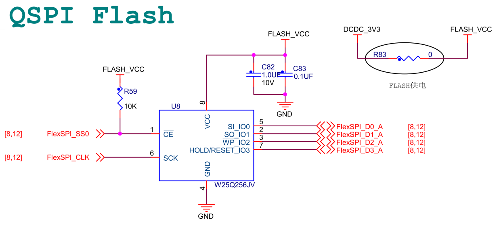

图 22‑12 SPI串行FLASH硬件连接图，摘自《野火i.MX RT1052核心板原理图》

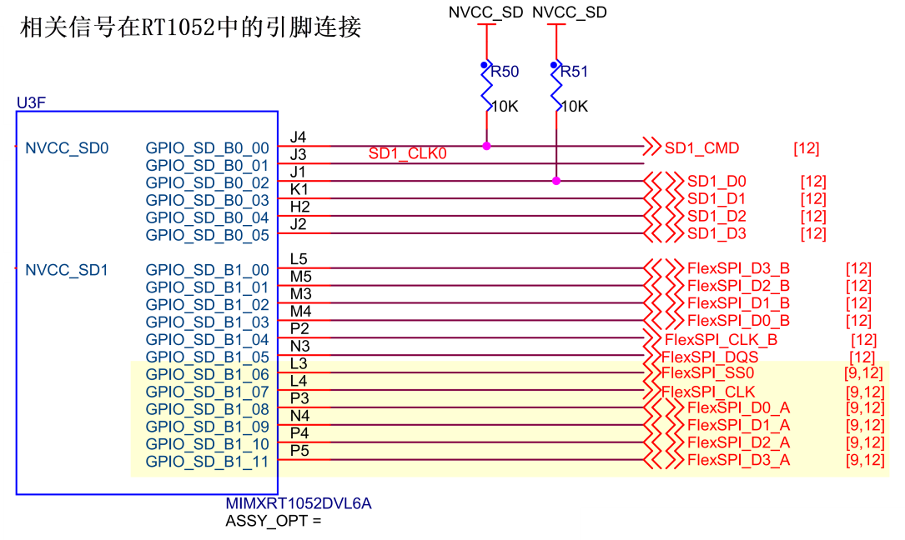

图 22‑13 FLASH存储器相关信号与RT1052的引脚连接

根据以上原理图，总结出FLASH存储器的信号连接方式见表格 22‑4。

表格 22‑4 FLASH的信号连接表

+----------------+----------------------+-----------------------------+
| FLASH芯片引脚  | 功能                 | 与RT1052的连接              |
+================+======================+=============================+
| CE             | SPI通讯的CS片选信号  | GPIO_SD_B1_06/FlexSPI_SS0   |
+----------------+----------------------+-----------------------------+
| SCK            | SPI通讯的SCK时钟信号 | GPIO_SD_B1_07/ FlexSPI_CLK  |
+----------------+----------------------+-----------------------------+
| SI_IO0         | QSPI的数据信号D0     | GPIO_SD_B1_08/ FlexSPI_D0_A |
+----------------+----------------------+-----------------------------+
| SO_IO1         | QSPI的数据信号D1     | GPIO_SD_B1_09/ FlexSPI_D1_A |
+----------------+----------------------+-----------------------------+
| WP_IO2         | QSPI的数据信号D2     | GPIO_SD_B1_10/ FlexSPI_D2_A |
+----------------+----------------------+-----------------------------+
| HOLD/RESET_IO3 | QSPI的数据信号D3     | GPIO_SD_B1_11/ FlexSPI_D3_A |
+----------------+----------------------+-----------------------------+

本实验板中的FLASH芯片(型号：W25Q256)是一种支持使用QSPI（四线SPI）通讯协议的NOR
FLASH存储器，它的信号线连接到了RT1052的FlexSPI A端口对应的引脚上。

FLASH芯片的IO0~IO3引脚在某些模式下会有第二功能，如在标准SPI模式下，SIO_IO0用于MOSI；SO_IO1用于MISO；WP_IO2可控制写保护功能，当该引脚为低电平时，禁止写入数据；HOLD/RESET_IO3可用于保持或恢复通讯。但我们控制时主要使用QSPI模式，这四个引脚都被用作数据输入输出信号。

关于FLASH芯片的更多信息，可参考其数据手册《W25Q256》来了解。若您使用的实验板FLASH的型号或控制引脚不一样，只需根据我们的工程修改即可，程序的控制原理相同。

控制FLASH的命令
^^^^^^^^^^^^^^^

FLASH命令表
'''''''''''

在使用RT1052程序控制时，我们需要了解如何通过FlexSPI外设对这个W25Q256型号的FLASH芯片进行读写。FLASH芯片自定义了很多命令，通过控制RT1052利用FlexSPI外设向FLASH芯片发送命令，FLASH芯片收到后就会执行相应的操作。

查看FLASH芯片的数据手册《W25Q256》，可了解各种它定义的各种命令的功能及命令格式，见图
22‑14。

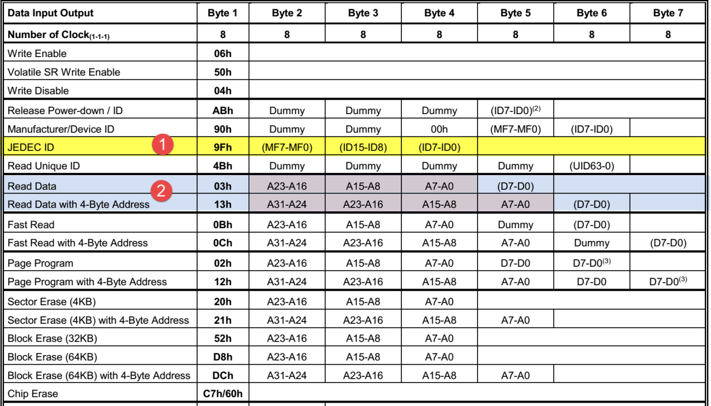

图 22‑14 FLASH命令表的部分内容（摘自《W25Q256》数据手册）

该表中的第一列为命令名，第二列为命令编码，第三至第N列的具体内容根据命令的不同而有不同的含义。其中带括号的字节参数，方向为FLASH向主机传输，即命令响应，不带括号的则为主机向FLASH传输。表中“A0~A23”指FLASH芯片内部存储器组织的地址；“M0~M7”为厂商号（MANUFACTURER
ID）；“ID0-ID15”为FLASH芯片的ID；“dummy”指该处可为任意数据；“D0~D7”为FLASH内部存储矩阵的内容。

在FLSAH芯片内部，存储有固定的厂商编号(M7-M0)和不同类型FLASH芯片独有的编号(ID15-ID0)，见表格
22‑5。

表格 22‑5 FLASH数据手册的设备ID说明

+-----------+---------------+---------------------+
| FLASH型号 | 厂商号(M7-M0) | FLASH型号(ID15-ID0) |
+===========+===============+=====================+
| W25Q64    | EF h          | 4017 h              |
+-----------+---------------+---------------------+
| W25Q128   | EF h          | 4018 h              |
+-----------+---------------+---------------------+
| W25Q256   | EF h          | 4019 h              |
+-----------+---------------+---------------------+

读ID命令“JEDEC ID”
''''''''''''''''''

通过图 22‑14中标号①处的读ID命令“JEDEC
ID”可以获取厂商号(M7-M0)和FLASH型号（ID15-ID0）。

图 22‑14表示该命令的组成如下：

-  第1字节：命令编码为“9F h”，其中“9F
   h”是指16进制数“0x9F”，命令编码由通讯中的主机传输至FLASH芯片；

-  第2字节： FLASH芯片输出的厂商号(M7-M0)；

-  第3、4字节：FLASH芯片输出的FLASH型号(ID15-ID8)和(ID7-ID0)。

也就是说该命令执行正常时，W25Q256会返回“0xEF4019”这样的内容
，该命令的常见应用是主机端通过读取设备ID来测试硬件是否连接正常，或用于识别设备。

下面我们再配合该命令的时序图进行讲解，见图 22‑15。

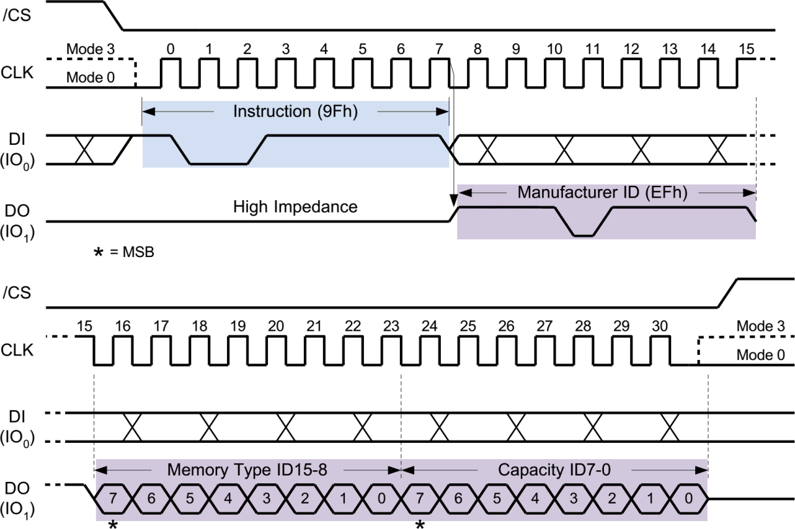

图 22‑15 FLASH读ID命令“JEDEC ID”的时序(摘自《W25Q256》数据手册)

主机首先通过MOSI线（图中的DI线）向FLASH芯片发送第一个字节数据为“9F
h”，当FLASH芯片收到该编码后，它会解读成主机向它发送了“JEDEC命令”，然后它就作出该命令的响应：通过MISO线（图中的DO线）把它的厂商ID(M7-M0)及芯片类型(ID15-0)发送给主机，主机接收到命令响应后可进行校验。

使用FlexSPI控制时，我们会把以上“JEDEC命令”的执行过程定义成查找表LUT中的序列，然后结合FlexSPI传输结构体和传输函数执行序列，过程如下：

(1) 定义查找表LUT0中的指令0：向LUT寄存器写入指令，它的OPCOD域为CMD_SDR，即0x01，这是FlexSPI在表格
    22‑3中定义的发送FLASH命令代码的指令，寄存器的NUM_PADS域使用Single模式，即赋值0x01，指令参数寄存器域OPERAND的内容为0x9F，即FLASH存储器“JEDEC命令”定义的编码；

(2) 定义查找表LUT0中的指令1：向LUT寄存器写入后续指令，它的OPCOD域为READ_SDR，即0x09，这是FlexSPI在表格
    22‑3中定义的从FLASH接收数据的指令；寄存器的NUM_PADS域使用Single模式，即赋值0x01；该指令参数寄存器域OPERAND的内容可为任意值，不受影响。

(3) 定义FlexSPI传输结构体：主要内容是对该结构体的成员seqIndex赋值，该值指向为上面“JEDEC命令”序列在LUT查找表中的位置，并对结构体成员dataSize赋值为3，表示可接收3个字节内容，这些内容包含了FLASH存储器返回的厂商ID(M7-M0)及芯片类型(ID15-ID0)；

(4) 执行FLEXSPI_TransferNonBlocking函数开始传输，传输完成后FLASH返回的内容会被存储在FlexSPI传输结构体的data成员指向的缓冲区中。

对于FLASH芯片的其它命令，都是类似的，只是有的命令包含多个字节，或者响应包含更多的数据。

3字节地址和4字节地址命令
''''''''''''''''''''''''

在前面图 22‑14中FLASH命令表标号②处可以看到两条相似的命令，分别为“Read
Data”和“Read Data with 4-Byte
Address”，这是W25Q256中典型的3字节（24位）和4字节（32位）地址宽度模式的命令，它们功能都是读取数据，区别主要是地址的宽度。

在进行数据读写或擦除时，需要给FLASH指定目标地址，如图
22‑16是以上两个“Read Data”命令的时序图，
命令编码分别为0x03和0x13，除命令编码不同外，可以看到在地址传输阶段中它们传输的地址宽度分别为3字节和4字节。

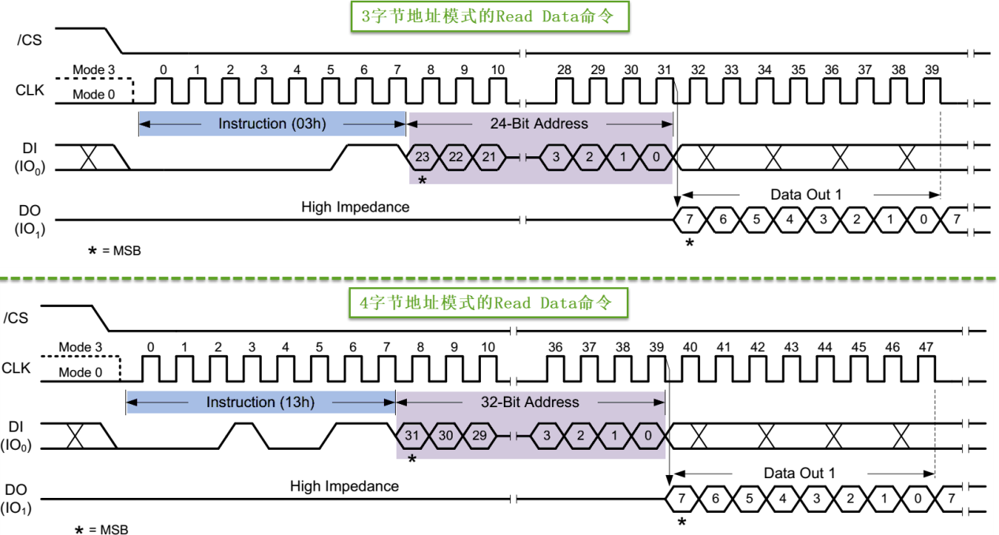

图 22‑16三字节和四字节地址宽度的Read Data命令(摘自《W25Q256》数据手册)

与EEPROM类似，FLASH中每个地址编号表示1个字节的存储单元，那么3字节的地址可以表示2\ :sup:`24`\ =2\ :sup:`4`\ \*2\ :sup:`10`\ \*2\ :sup:`10`\ =16*1024*1024=16M字节的存储空间。W25Q256型号的FLASH总存储空间为32MB，所以使用3字节长度的地址是无法访问W25Q256超过16M字节后的存储单元，而4字节长度的地址则没有这个问题，因为它支持访问最大32GB的存储空间，远远超过W25Q256的容量。

除了读取数据的“Read Data”命令外，写入数据“Page
Program”命令、擦除扇区“Sector Erase”命令都有3字节和4字节地址模式的版本。

W25Q256型号的FLASH支持3字节访问主要是为了兼容它的低型号芯片，如W25Q128、W25Q64型号的芯片容量分别为16M字节和8M字节，它们的访问命令都使用3字节；为了兼容，W25Q256还有强制4地址模式的功能，开启该功能后，无论3字节地址还是4字节地址命令都强制使用4字节地址进行传输。

Single/Dual/Quad模式命令
''''''''''''''''''''''''

W25Q256型号的FLASH芯片支持使用Single/Dual/Quad模式的SPI通讯模式，不同的模式对应有不同的访问命令，如图
22‑17中的是页写入操作“Page
Program”在FLASH命令表中的定义，4字节Single模式的“Page
Program”命令编码为0x12，相对应的Quad模式下该命令编码为0x34。

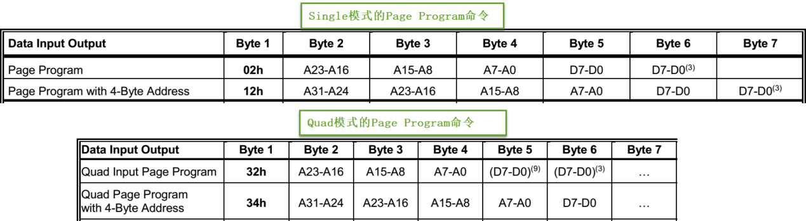

图 22‑17 Single模式和Quad模式命令（摘自《W25Q256》数据手册）

查看这些命令的时序图能更好地理解Single模式和Quad模式命令的区别，具体见图
22‑18和图 22‑19。

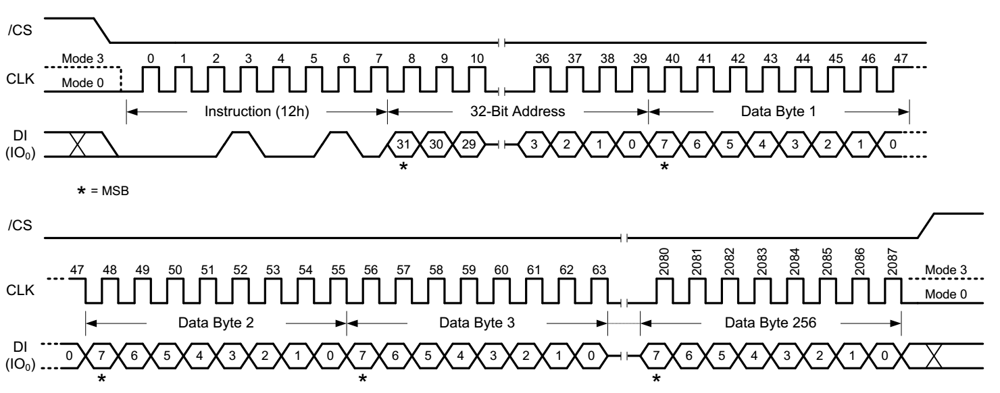

图 22‑18 Single模式的页写入操作命令

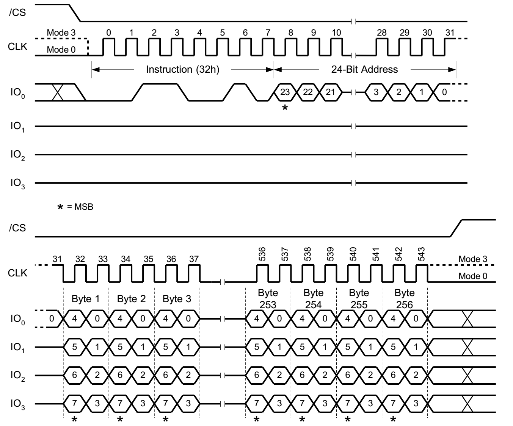

图 22‑19 Quad模式的页写入命令

从这两上时序图可以看到，两种模式下的命令编码和存储单元的地址都是使用1根数据信号线传输的，区别在传输数据时Quad模式下使用4根数据线，它在两个CLK时钟驱动下就传输完了一个字节的内容，大大提高了传输速度。

软件设计
^^^^^^^^

擦写FLASH过程对加载代码的影响
'''''''''''''''''''''''''''''

在本系统的设计中，
RT1052会使用这个FLASH来存储要运行的程序，运行时从FLASH中加载部分代码至指令缓存中执行，即会不定时加载FLASH中的代码，而本实验中运行的又是一个对FLASH擦写的程序，在FLASH擦写期间它会忽略外部的读取操作导致无法加载代码，系统崩溃。所以本实验不提供“nor_txt_ram”和“nor_txt_sdram”版本的工程。

为了避免这种情况，本实验开发时采用“itcm_txt_ram_debug”等“debug”版的工程，因为这两种工程版本的代码存放在内部ITCM和外部的SDRAM中，运行时不需要从FLASH中加载代码，所以代码执行时不会受到擦写FLASH过程的干扰。

待这两个版本的工程测试成功后，再切换至“nor_itcm_txt_ram”或“nor_sdram_txt_sdram”版本的工程，这两个版本工程的代码存放在FLASH中，确保掉电时也能正常保存，芯片上电后在初始化过程中把所有FLASH代码加载至ITCM和SDRAM，使得后续运行时直接从ITCM和SDRAM而不是FLASH中加载至指令执行，这样对FLASH的擦写过程就不会影响代码的执行了。

除了避免擦写过程的影响，还要避免擦写存储了代码的FLASH空间，若把这些代码擦除掉，下次上电时就无法从FLASH中加载代码执行了。

编程要点
''''''''

实际上，编写设备驱动都是有一定的规律可循的。首先我们要确定设备使用的是什么通讯协议。如上一章的EEPROM使用的是I\ :sup:`2`\ C，本章的FLASH使用的是SPI。那么我们就先根据它的通讯协议，选择好RT1052的硬件模块，并进行相应的I\ :sup:`2`\ C或SPI模块初始化。接着，我们要了解目标设备的相关命令，因为不同的设备，都会有相应的不同的命令。如EEPROM中会把第一个数据解释为内部存储矩阵的地址(实质就是命令)。而FLASH则定义了更多的命令，有写命令，读命令，读ID命令等等。最后，我们根据这些命令的格式要求，使用通讯协议向设备发送命令，达到控制设备的目标。

本实验的编程要点如下：

(1) 定义要使用的FlexSPI端口及引脚号；

(2) 配置引脚的MUX复用模式及PAD属性配置；

(3) 配置FlexSPI外设的时钟来源、分频得到FlexSPI根时钟（FlexSPI_CLK_ROOT）；

(4) 配置FlexSPI外设的工作模式、超时时间等参数，即配置FlexSPI初始化结构体flexspi_config_t；

(5) 根据FLASH存储器它的容量和各种访问参数，即配置外部设备配置结构体flexspi_device_config_t；

(6) 编写查找表LUT的内容；

(7) 编写执行查找表LUT相关指令的函数，对FLASH进行读写存储单元、配置模式、读状态寄存器等操作；

(8) 编写测试程序，对读写数据进行校验；

为了使工程更加有条理，我们把读写FLASH相关的代码独立分开存储，方便以后移植。在“工程模板”之上新建“bsp_norflash.c”及“bsp_norflash.h”文件，这些文件也可根据您的喜好命名，它们不属于RT1052软件库的内容，是由我们自己根据应用需要编写的。

代码分析
''''''''

FlexSPI硬件相关宏定义
                     

我们把FlexSPI硬件引脚相关的配置都以宏的形式定义到
“bsp_norflash.h”文件中，具体见代码清单 22‑12。

.. code-block:: c
   :name: 代码清单 22‑12 FlexSPI硬件配置相关的宏（bsp_norflash.h文件）
   :caption: 代码清单 22‑12 FlexSPI硬件配置相关的宏（bsp_norflash.h文件）
   :linenos:

    /*! @brief FlexSPI引脚定义 */
    #define NORFLASH_SS_IOMUXC        IOMUXC_GPIO_SD_B1_06_FLEXSPIA_SS0_B
    #define NORFLASH_SCLK_IOMUXC      IOMUXC_GPIO_SD_B1_07_FLEXSPIA_SCLK
    #define NORFLASH_DATA00_IOMUXC    IOMUXC_GPIO_SD_B1_08_FLEXSPIA_DATA00
    #define NORFLASH_DATA01_IOMUXC    IOMUXC_GPIO_SD_B1_09_FLEXSPIA_DATA01
    #define NORFLASH_DATA02_IOMUXC    IOMUXC_GPIO_SD_B1_10_FLEXSPIA_DATA02
    #define NORFLASH_DATA03_IOMUXC    IOMUXC_GPIO_SD_B1_11_FLEXSPIA_DATA03

以上代码根据硬件连接，把与FLASH通讯使用FlexSPI的IOMUXC复用引脚号以宏封装起来，方便配置时使用。

FLASH命令编码表
               

为了方便使用，我们把FLASH芯片的常用命令编码使用宏来封装起来，后面定义查找表LUT的需要命令编码的时候我们直接使用这些宏即可，这些宏对应的值可通过查询数据手册《W25Q256》获知，具体见代码清单
22‑13。

.. code-block:: c
   :name: 代码清单 22‑13 FLASH命令编码表（bsp_norflash.h文件）
   :caption: 代码清单 22‑13 FLASH命令编码表（bsp_norflash.h文件）
   :linenos:

    /* 使用的FLASH地址宽度，单位：bit */
    #define FLASH_ADDR_LENGTH    32
    
    /* FLASH常用命令 */
    #define W25Q_WriteEnable                0x06
    #define W25Q_WriteDisable               0x04
    #define W25Q_ReadStatusReg              0x05
    #define W25Q_WriteStatusReg             0x01
    #define W25Q_ReadData                   0x03
    #define W25Q_ReadData_4Addr             0x13
    #define W25Q_FastReadData               0x0B
    #define W25Q_FastReadData_4Addr         0x0C
    #define W25Q_FastReadDual               0x3B
    #define W25Q_FastReadDual_4Addr         0x3C
    #define W25Q_FastReadQuad               0x6B
    #define W25Q_FastReadQuad_4Addr         0x6C
    #define W25Q_PageProgram                0x02
    #define W25Q_PageProgram_4Addr          0x12
    #define W25Q_PageProgramQuad            0x32
    #define W25Q_PageProgramQuad_4Addr      0x34
    #define W25Q_BlockErase                 0xD8
    #define W25Q_BlockErase_4Addr           0xDC
    #define W25Q_SectorErase                0x20
    #define W25Q_SectorErase_4Addr          0x21
    #define W25Q_ChipErase                  0xC7
    #define W25Q_PowerDown                  0xB9
    #define W25Q_ReleasePowerDown           0xAB
    #define W25Q_DeviceID                   0xAB
    #define W25Q_ManufactDeviceID           0x90
    #define W25Q_JedecDeviceID              0x9F
    /*其它*/
    #define FLASH_ID                        0X18
    #define FLASH_JEDECDEVICE_ID            0XEF4019

为方便起见，本程序中访问数据时FLASH时全部直接采用4字节地址的Quad模式命令，即以上代码带“Quad”和“4Addr”后缀的宏。在代码的开头我们还定义的宏FLASH_ADDR_LENGTH用于表示地址的宽度，其值为32位，即4字节。

FlexSPI引脚的IOMUXC相关配置
                           

利用上面的宏，编写FlexSPI使用到的引脚的IOMUXC配置，见代码清单 22‑14。

.. code-block:: c
   :name: 代码清单 22‑14 FlexSPI引脚的IOMUXC相关配置（bsp_norflash.c文件）
   :caption: 代码清单 22‑14 FlexSPI引脚的IOMUXC相关配置（bsp_norflash.c文件）
   :linenos:

    /*********************第2部分中使用的宏**********************/
    /* FLEXSPI的引脚使用同样的PAD配置 */
    #define FLEXSPI_PAD_CONFIG_DATA         (SRE_1_FAST_SLEW_RATE| \
                                            DSE_6_R0_6| \
                                            SPEED_3_MAX_200MHz| \
                                            ODE_0_OPEN_DRAIN_DISABLED| \
                                            PKE_1_PULL_KEEPER_ENABLED| \
                                            PUE_0_KEEPER_SELECTED| \
                                            PUS_0_100K_OHM_PULL_DOWN| \
                                            HYS_0_HYSTERESIS_DISABLED)
    /* 配置说明 : */
    /* 转换速率: 转换速率快
        驱动强度: R0/6
        带宽配置 : max(200MHz)
        开漏配置: 关闭
        拉/保持器配置: 使能
        拉/保持器选择: 保持器
        上拉/下拉选择: 100K欧姆下拉(选择了保持器此配置无效)
        滞回器配置: 禁止 */

    /************************第1部分****************************/
    /**
    * @brief  初始化NORFLASH相关IOMUXC的MUX复用配置
    * @param  无
    * @retval 无
    */
    static void FlexSPI_NorFlash_IOMUXC_MUX_Config(void)
    {
        /* FlexSPI通讯引脚 */
        IOMUXC_SetPinMux(NORFLASH_SS_IOMUXC, 1U);
        IOMUXC_SetPinMux(NORFLASH_SCLK_IOMUXC, 1U);
        IOMUXC_SetPinMux(NORFLASH_DATA00_IOMUXC, 1U);
        IOMUXC_SetPinMux(NORFLASH_DATA01_IOMUXC, 1U);
        IOMUXC_SetPinMux(NORFLASH_DATA02_IOMUXC, 1U);
        IOMUXC_SetPinMux(NORFLASH_DATA03_IOMUXC, 1U);
    }

    /************************第2部分****************************/
    /**
    * @brief  初始化NORFLASH相关IOMUXC的PAD属性配置
    * @param  无
    * @retval 无
    */
    static void FlexSPI_NorFlash_IOMUXC_PAD_Config(void)
    {
        /* FlexSPI通讯引脚使用同样的属性配置 */
        IOMUXC_SetPinConfig(NORFLASH_SS_IOMUXC, FLEXSPI_PAD_CONFIG_DATA);
        IOMUXC_SetPinConfig(NORFLASH_SCLK_IOMUXC, FLEXSPI_PAD_CONFIG_DATA);
        IOMUXC_SetPinConfig(NORFLASH_DATA00_IOMUXC, FLEXSPI_PAD_CONFIG_DATA);
        IOMUXC_SetPinConfig(NORFLASH_DATA01_IOMUXC, FLEXSPI_PAD_CONFIG_DATA);
        IOMUXC_SetPinConfig(NORFLASH_DATA02_IOMUXC, FLEXSPI_PAD_CONFIG_DATA);
        IOMUXC_SetPinConfig(NORFLASH_DATA03_IOMUXC, FLEXSPI_PAD_CONFIG_DATA);
    }

同为外设使用引脚的MUX复用模式及PAD属性配置，其流程与“串口初始化函数”章节中的类似，主要区别是引脚的属性，配置流程如下：

(1) 第1部分。定义一个FlexSPI_NorFlash_IOMUXC_MUX_Config函数，它专门配置控制FLASH的FlexSPI外设相关引脚的MUX模式。该函数内部调用库函数IOMUXC_SetPinMux，它利用前面定义的宏作为第一个输入参数，把引脚设置成FlexSPI的片选SS、时钟SCLK以及DATA0~DATA3复用模式。在本代码中开启了引脚的SION功能，不同于LPI2C的要求，此处经测试不使能SION也是可以的，以实验为准。

(2) 第2部分。定义一个FlexSPI_NorFlash_IOMUXC_PAD_Config函数，它专门配置控制FLASH的FlexSPI外设相关引脚的PAD属性，该函数内部调用库函数IOMUXC_SetPinConfig，它的第二个输入参数宏定义在本段代码的开头，包含了PAD的各个配置选项，其中最重要的是使用了“快转换速率”以及“200MHz带宽”的配置。

模式初始化函数NorFlash_FlexSPI_ModeInit
                                       

以上只是配置了FlexSPI使用的引脚，对FlexSPI外设模式的时钟、模式、FLASH参数以及查找表LUT的配置的内容我们都编写进了NorFlash_FlexSPI_ModeInit函数，具体见代码清单
22‑15。

.. code-block:: c
   :name: 代码清单 22‑15 NorFlash_FlexSPI_ModeInit函数（bsp_norflash.c文件）
   :caption: 代码清单 22‑15 NorFlash_FlexSPI_ModeInit函数（bsp_norflash.c文件）
   :linenos:

    /**
    * @brief  初始化NorFlash使用的FlexSPI外设模式及时钟
    * @param  无
    * @retval 无
    */
    static void NorFlash_FlexSPI_ModeInit(void)
    {
        flexspi_config_t config;
        /************************第1部分****************************/
        const clock_usb_pll_config_t g_ccmConfigUsbPll = {.loopDivider = 0U};
        
        /* 初始化USB1PLL，即PLL3，loopDivider=0，
            所以USB1PLL=PLL3 = 24*20 = 480MHz */
        CLOCK_InitUsb1Pll(&g_ccmConfigUsbPll);
        /* 设置PLL3 PFD0频率为：PLL3*18/24 = 360MHZ. */
        CLOCK_InitUsb1Pfd(kCLOCK_Pfd0, 24);
        /* 选择PLL3 PFD0作为flexspi时钟源
            00b derive clock from semc_clk_root_pre
            01b derive clock from pll3_sw_clk
            10b derive clock from PLL2 PFD2
            11b derive clock from PLL3 PFD0 */
        CLOCK_SetMux(kCLOCK_FlexspiMux, 0x3);
        /* 设置flexspiDiv分频因子，
        得到FLEXSPI_CLK_ROOT = PLL3 PFD0/(flexspiDiv+1) = 120M. */
        CLOCK_SetDiv(kCLOCK_FlexspiDiv, 2);

        /************************第2部分****************************/
        /* 关闭DCache功能 */
        SCB_DisableDCache();

        /************************第3部分****************************/
        /*获取 FlexSPI 常用默认设置 */
        FLEXSPI_GetDefaultConfig(&config);
        /* 允许AHB预读取的功能 */
        config.ahbConfig.enableAHBPrefetch = true;
        /* 写入配置 */
        FLEXSPI_Init(FLEXSPI, &config);

        /************************第4部分****************************/
        /* 根据串行闪存功能配置闪存设置 */
        FLEXSPI_SetFlashConfig(FLEXSPI, &deviceconfig, kFLEXSPI_PortA1);

        /************************第5部分****************************/
        /* 更新查找表 */
        FLEXSPI_UpdateLUT(FLEXSPI, 0, customLUT, CUSTOM_LUT_LENGTH);
    }

这个函数的几部分代码分在下面的几个小节进行说明。

配置FlexSPI的时钟
                 

代码清单 22‑15中的第1部分主要是配置FlexSPI时钟相关的内容，说明如下：

-  调用库函数CLOCK_InitUsb1Pll配置USB1
   PLL即PLL3的频率，调用时的输入参数g_ccmConfigUsbPll.loopDivider =
   0，该设置把PLL3的频率定为480MHz；

-  调用库函数CLOCK_InitUsb1Pfd配置PFD0的频率，调用时的输入参数pfdFrac为24，根据配置公式，得到PFD0的频率为：f\ :sub:`PFD0`\ =f\ :sub:`PLL3`\ \*18/pfdFrac
   = 480*18/24 = 360MHz。

-  调用库函数CLOCK_SetMux选择PLL3
   PFD0作为FlexSPI的时钟源，然后调用CLOCK_SetDiv配置分频因子flexspiDiv为2，最终FlexSPI的根时钟f\ :sub:`FLEXSPI_CLK_ROOT`\ =f\ :sub:`PLL3
   PFD0`/( flexspiDiv + 1)=120MHz。

进行SPI通讯时，SCK信号直接由FlexSPI根时钟FLEXSPI_CLK_ROOT提供的，也就是说，在这样的配置下FlexSPI外设与外部的FLASH通讯时SCK的频率为120MHz。这是根据本系统采用W25Q256型号FLASH的性能决定的，通讯频率不应超过FLASH存储器支持的极限，该FLASH最高支持的通讯频率为133MHz。

关闭DCache功能
              

代码清单
22‑15中的第2部分调用了库函数SCB_DisableDCache关闭了DCache功能，在flexspi_nor_debug和flexspi_nor_release版本的程序中，开启该功能时程序会进行DCache操作导致竞争SPI总线而出错。

初始化FlexSPI外设
                 

代码清单
22‑15中的第3部分主要是调用了库函数FLEXSPI_Init向FlexSPI外设写入配置。它先调用了库函数FLEXSPI_GetDefaultConfig把代码清单
22‑4中的默认配置值赋予给config变量，然后针对AHB预读取功能使用了不同的配置，把config.ahbConfig.enableAHBPrefetch赋值为true开启该功能。

配置闪存功能参数
                

代码清单
22‑15中的第4部分主要是调用了库函数FLEXSPI_SetFlashConfig向FlexSPI外设写入闪存参数相关的配置。调用该函数时使用的写入的参数是deviceconfig变量，它的类型是外部设备配置结构体flexspi_device_config_t，该变量定义具体见代码清单
22‑16。

.. code-block:: c
   :name: 代码清单 22‑16 外部设备配置结构体deviceconfig（bsp_norflash.c文件）
   :caption: 代码清单 22‑16 外部设备配置结构体deviceconfig（bsp_norflash.c文件）
   :linenos:

    /* 设备特性相关的参数 */
    flexspi_device_config_t deviceconfig = {
        /************************第1部分****************************/
        .flexspiRootClk = 120000000,
        .flashSize = FLASH_SIZE,
        .CSIntervalUnit = kFLEXSPI_CsIntervalUnit1SckCycle,
        .CSInterval = 2,
        .CSHoldTime = 1,
        .CSSetupTime = 1,
        .dataValidTime = 2,
        .columnspace = 0,
        .enableWordAddress = false,
        /************************第2部分****************************/
        .AWRSeqIndex = NOR_CMD_LUT_SEQ_IDX_AHB_PAGEPROGRAM_QUAD_1,
        .AWRSeqNumber = 2,
        .ARDSeqIndex = NOR_CMD_LUT_SEQ_IDX_READ_FAST_QUAD,
        .ARDSeqNumber = 1,
        /* W25Q256 typical time=0.7ms,max time=3ms
        *  fAHB = 528MHz,T AHB = 1/528us
        *  unit = 32768/528 = 62.06us
        *  取延时时间为1ms，
        *  AHBWriteWaitInterval = 1*1000/62.06 = 17
        */
        .AHBWriteWaitUnit = kFLEXSPI_AhbWriteWaitUnit32768AhbCycle,
        .AHBWriteWaitInterval = 17,
    };

关于这段代码的第1部分说明如下：

-  flexspiRootClk：本成员被赋值为FlexSPI的根时钟频率120000000，注意FlexSPI的时钟是由代码清单
   22‑15中的代码决定的，此处赋值只是用于库函数FLEXSPI_SetFlashConfig把它作为时间基准进行运算的。

-  flashSize：本成员用于设置FLASH的大小，单位为KB，在本代码中被赋值为宏FLASH_SIZE（宏值为32*1024），表示驱动的FLASH容量为32*1024KB，即32MB。

-  CSIntervalUnit和CSInterval：它们用于配置CS信号线有效与无效切换的最小时间间隔，
   W25Q256存储器没有这个要求，所以本代码随意设置了一个比较小的时间值，即2个CLK时钟周期。

-  CSHoldTime、CSSetupTime和dataValidTime：这三个参数分别表示CS信号线的保持时间、建立时间以及数据有效时间。这部分内容根据W25Q256的时序参数表来配置，具体见图
   22‑20。

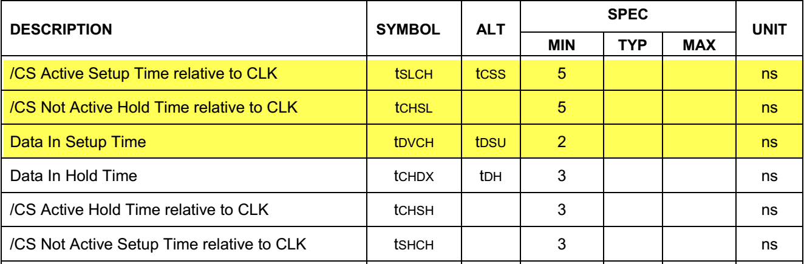

图 22‑20 FLASH的时序参数（摘自《W25Q256》数据手册）

    可以看到CS保持时间和建立时间最长的要求为5ns，由于CSHoldTime和CSSetupTime成员值的以FlexSPI根时钟周期为单位，而1个FlexSPI时钟周期T\ :sub:`FLEXSPI_CLK_ROOT`\ =1/120M
    = 8.4ns，所以这两个成员值都赋值为1即可满足要求。

    由于数据有效时间约等于数据建立时间（Data in Setup
    Time），表中要求为2ns，而结构体成员值dataValidTime的单位也是ns，所以代码中该成员被赋值为2。

-  columnspace：W25Q256存储器不包含列地址，所以本成员直接赋值为0。

-  enableWordAddress：本成员设置是否使用字的方式访问FLASH，此处禁用该功能。

这段代码的第2部分的内容需要有关FlexSPI查找表的知识，在后面再进行分析。

更新查找表
          

代码清单
22‑15中的第5部分主要是调用了库函数FLEXSPI_UpdateLUT向更新FlexSPI外设使用的查找表LUT。该函数的四个输入参数功能如下：

-  base：要初始化哪个FlexSPI外设，RT1052仅有一个，所以只能输入FLEXSPI；

-  index：从查找表的哪个LUT寄存器开始更新，此处输入为0表示从头开始；

-  cmd：要更新的查找表数组，此处调用输入为自定义的变量customLUT；

-  count：表示cmd数组的长度，此处输入为customLUT变量的长度，宏CUSTOM_LUT_LENGTH值为60。

    以上说明的变量customLUT具体定义见代码清单 22‑17。

.. code-block:: c
   :name: 代码清单 22‑17 定义查找表（bsp_norflash.c文件）
   :caption: 代码清单 22‑17 定义查找表（bsp_norflash.c文件）
   :linenos:

    /************************第1部分****************************/
    /* 定义指令在查找表中的编号 */
    #define NOR_CMD_LUT_SEQ_IDX_READ_NORMAL          0
    #define NOR_CMD_LUT_SEQ_IDX_READ_FAST           1
    #define NOR_CMD_LUT_SEQ_IDX_READ_FAST_QUAD      2
    #define NOR_CMD_LUT_SEQ_IDX_READSTATUS          3
    #define NOR_CMD_LUT_SEQ_IDX_WRITEENABLE         4
    #define NOR_CMD_LUT_SEQ_IDX_ERASESECTOR         5
    #define NOR_CMD_LUT_SEQ_IDX_PAGEPROGRAM_SINGLE  6
    #define NOR_CMD_LUT_SEQ_IDX_PAGEPROGRAM_QUAD    7
    #define NOR_CMD_LUT_SEQ_IDX_READID              8
    #define NOR_CMD_LUT_SEQ_IDX_READJEDECID         9
    #define NOR_CMD_LUT_SEQ_IDX_WRITESTATUSREG      10
    #define NOR_CMD_LUT_SEQ_IDX_READSTATUSREG       11
    #define NOR_CMD_LUT_SEQ_IDX_ERASECHIP           12 

    /************************第2部分****************************/
    /* 查找表的长度 */
    #define CUSTOM_LUT_LENGTH           60

    /* 定义查找表LUT
    * 下表以[4 * NOR_CMD_LUT_SEQ_IDX_xxxx]表示1个序列，
    * 
    1个序列最多包含8条指令，使用宏FLEXSPI_LUT_SEQ可以一次定义2个指令。
    * 
    一个FLEXSPI_LUT_SEQ占一个LUT寄存器，端口A和端口B各有64个LUT寄存器，
    * 所以CUSTOM_LUT_LENGTH最大值为64。
    *
    * 
    FLEXSPI_LUT_SEQ格式如下（LUT指令0，使用的数据线数目，指令的参数，
                                LUT指令1，使用的数据线数目，指令的参数）
    *
    * 不满8条指令的序列应以STOP指令结束，即kFLEXSPI_Command_STOP，
    * 不过因为STOP指令中的所有参数均为0，而数组的初始值也都为0，
    * 所以部分序列的末尾忽略了STOP指令也能正常运行。
    */
    const uint32_t customLUT[CUSTOM_LUT_LENGTH] = {
        /* 普通读指令，Normal read mode -SDR */
        [4 * NOR_CMD_LUT_SEQ_IDX_READ_NORMAL] =
        FLEXSPI_LUT_SEQ(kFLEXSPI_Command_SDR, kFLEXSPI_1PAD, W25Q_ReadData_4Addr,
                    kFLEXSPI_Command_RADDR_SDR, kFLEXSPI_1PAD, FLASH_ADDR_LENGTH),

        [4 * NOR_CMD_LUT_SEQ_IDX_READ_NORMAL + 1] =
        FLEXSPI_LUT_SEQ(kFLEXSPI_Command_READ_SDR, kFLEXSPI_1PAD, 0x04,
                        kFLEXSPI_Command_STOP, kFLEXSPI_1PAD, 0),

        /* 快速读指令，Fast read mode - SDR */
        [4 * NOR_CMD_LUT_SEQ_IDX_READ_FAST] =
        FLEXSPI_LUT_SEQ(kFLEXSPI_Command_SDR, kFLEXSPI_1PAD, W25Q_FastReadData_4Addr,
                    kFLEXSPI_Command_RADDR_SDR, kFLEXSPI_1PAD, FLASH_ADDR_LENGTH),

        [4 * NOR_CMD_LUT_SEQ_IDX_READ_FAST + 1] =
        FLEXSPI_LUT_SEQ(kFLEXSPI_Command_DUMMY_SDR, kFLEXSPI_1PAD, 0x08,
                        kFLEXSPI_Command_READ_SDR, kFLEXSPI_1PAD, 0x04),

        /* QUAD模式快速读指令，Fast read quad mode - SDR */
        [4 * NOR_CMD_LUT_SEQ_IDX_READ_FAST_QUAD] =
        FLEXSPI_LUT_SEQ(kFLEXSPI_Command_SDR, kFLEXSPI_1PAD, W25Q_FastReadQuad_4Addr,
                        kFLEXSPI_Command_RADDR_SDR, kFLEXSPI_1PAD, FLASH_ADDR_LENGTH),
        [4 * NOR_CMD_LUT_SEQ_IDX_READ_FAST_QUAD + 1] =
        FLEXSPI_LUT_SEQ(kFLEXSPI_Command_DUMMY_SDR, kFLEXSPI_4PAD, 0x08,
                        kFLEXSPI_Command_READ_SDR, kFLEXSPI_4PAD, 0x04),
    
        /*……以下省略其它命令，具体内容请查看程序源码…… */
    };

-  第1部分。这部分是在查找表中定义的序列编号宏，在定义查找表和执行序列指令时使用这些宏会方便操作。这些宏名和序列号都是可以自己安排的，如第0个宏“xxx\_
   READ_NORMAL”用来表示普通读指令序列，第1个宏“xxx\_
   READ_FAST”用来表示快速读指令序列。FlexSPI执行的时候是以序列为单位的，一个序列最多可支持8个LUT指令，在其后面定义的查找表中每个序列占4个数组元素。

-  第2部分。此处主要是定义了查找表customLUT，它是一个有CUSTOM_LUT_LENGTH（宏值为60）个32位元素的数组，每个元素对应一个LUT寄存器，即可存储两个指令。对这些元素进行赋值时可以使用库中定义的宏FLEXSPI_LUT_SEQ，该宏具体的定义见代码清单
   22‑18。

.. code-block:: c
   :name: 代码清单 22‑18 FLEXSPI_LUT_SEQ宏（fsl_flexspi.h文件）
   :caption: 代码清单 22‑18 FLEXSPI_LUT_SEQ宏（fsl_flexspi.h文件）
   :linenos:

    /*! @breif Formula to form FLEXSPI instructions in LUT table. */
    #define FLEXSPI_LUT_SEQ(cmd0, pad0, op0, cmd1, pad1, op1)    \
    (FLEXSPI_LUT_OPERAND0(op0) | FLEXSPI_LUT_NUM_PADS0(pad0) | FLEXSPI_LUT_OPCODE0(cmd0) | 
    FLEXSPI_LUT_OPERAND1(op1) | FLEXSPI_LUT_NUM_PADS1(pad1) | FLEXSPI_LUT_OPCODE1(cmd1))

使用宏FLEXSPI_LUT_SEQ可以一次定义两个指令，它包含有6个参数，说明如下：

-  cmd0：指令0的编码，对应前面介绍的图 22‑9
   中LUT寄存器的OPCODE，它支持编码为前面表格
   22‑6表示的指令，在程序中我们可以直接使用代码清单
   22‑19中库文件定义的枚举值；

.. code-block:: c
   :name: 代码清单 22‑19 查找表LUT可用的指令编码定义（fsl_flexspi.h文件）
   :caption: 代码清单 22‑19 查找表LUT可用的指令编码定义（fsl_flexspi.h文件）
   :linenos:

    /*! @brief FLEXSPI外设的指令编码定义, 用于填写LUT表*/
    enum _flexspi_command {
        /*!< STOP停止指令，释放CS信号线 */
        kFLEXSPI_Command_STOP = 0x00U,
        /*!< 发送命令代码到FLASH, 使用SDR模式 */
        kFLEXSPI_Command_SDR = 0x01U,
        /*!< 发送行地址到FLASH,  使用SDR模式 */
        kFLEXSPI_Command_RADDR_SDR = 0x02U,
        /*!< 发送列地址到FLASH,  使用SDR模式 */
        kFLEXSPI_Command_CADDR_SDR = 0x03U,
    
        /* …部分内容省略… */
        /*!< 发送命令代码到FLASH, 使用DDR模式 */
        kFLEXSPI_Command_DDR = 0x21U,
        /*!< 发送行地址到FLASH,  使用DDR模式 */
        kFLEXSPI_Command_RADDR_DDR = 0x22U,
        /*!< 发送列地址到FLASH,  使用DDR模式 */
        kFLEXSPI_Command_CADDR_DDR = 0x23U,
        /* …部分内容省略… */
    };

-  pad0：指令0的要使用的数据线数目，对应前面介绍的图 22‑9
   中LUT寄存器的NUM_PADS，在程序中我们可以直接使用代码清单
   22‑20中库文件定义的枚举值，可设定该指令使用SINGLE/DUAL/QUAD/OCTAL模式通讯；

.. code-block:: c
   :name: 代码清单 22‑20 支持的数据线数目定义（fsl_flexspi.h文件）
   :caption: 代码清单 22‑20 支持的数据线数目定义（fsl_flexspi.h文件）
   :linenos:

    /*! @brief FLEXSPI的数据线数目定义，用于填写LUT表 */
    enum _flexspi_pad {
    /*!< SINGLE模式，传输命令、地址以及数据只使用DATA0或DATA1信号线 */     
        kFLEXSPI_1PAD = 0x00U,
        /*!< DUAL模式，传输命令、地址以及数据只使用DATA[1:0]信号线 */
        kFLEXSPI_2PAD = 0x01U,
        /*!< QUAD模式，传输命令、地址以及数据只使用DATA[3:0]信号线 */
        kFLEXSPI_4PAD = 0x02U,
    /*!< OCTAL模式，传输命令、地址以及数据只使用DATA[7:0]信号线 */
        kFLEXSPI_8PAD = 0x03U,
    };

-  op0：指令0包含的参数，对应前面介绍的图 22‑9 中LUT寄存器的OPERAND；

-  cmd1、pad1、op0：这是第二条指令的编码、数据线数目以及参数。

回到代码清单
22‑17中，分析对查找表LUT赋值的代码，以该表中的第1个序列“普通读序列，Normal
read mode -SDR”为例进行讲解。我们希望该序列能完成对FLASH的“Read Data
with 4-Byte
Address”命令的功能，用于读取数据，它是一个4字节地址的Single模式命令，该命令时序见图
22‑27。

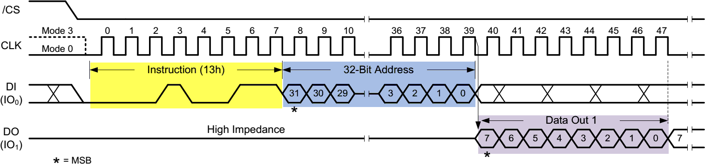

图 22‑21 FLASH的“W25Q_ReadData_4Addr(编码0x13)”时序(摘自《W25Q256》数据手册)

按照时序图，发送了命令编码（0x13）及要读的32位起始地址后，FLASH芯片就会按地址递增的方式返回存储单元的内容，读取的数据量没有限制，只要没有停止通讯，FLASH芯片就会一直返回数据。

为方便说明，此处再把查找表中第1个序列的代码帖出来，具体见代码清单
22‑21。

.. code-block:: c
   :name: 代码清单 22‑21 查找表中第1个序列的内容（bsp_norflash.c文件）
   :caption: 代码清单 22‑21 查找表中第1个序列的内容（bsp_norflash.c文件）
   :linenos:

    /* 定义查找表LUT
    * 下表以[4 * NOR_CMD_LUT_SEQ_IDX_xxxx]表示1个序列，
    * 
    1个序列最多包含8条指令，使用宏FLEXSPI_LUT_SEQ可以一次定义2个指令。
    *
    * 
    FLEXSPI_LUT_SEQ格式如下（LUT指令0，使用的数据线数目，指令的参数，
                                LUT指令1，使用的数据线数目，指令的参数）
    *
    * 不满8条指令的序列应以STOP指令结束，即kFLEXSPI_Command_STOP，
    * 不过因为STOP指令中的所有参数均为0，而数组的初始值也都为0，
    * 所以部分序列的末尾忽略了STOP指令也能正常运行。
    */
    const uint32_t customLUT[CUSTOM_LUT_LENGTH] = {
        /* 普通读指令，Normal read mode -SDR */
        [4 * NOR_CMD_LUT_SEQ_IDX_READ_NORMAL] =
        FLEXSPI_LUT_SEQ(kFLEXSPI_Command_SDR, kFLEXSPI_1PAD, W25Q_ReadData_4Addr,
                        kFLEXSPI_Command_RADDR_SDR, kFLEXSPI_1PAD, FLASH_ADDR_LENGTH),
    
        [4 * NOR_CMD_LUT_SEQ_IDX_READ_NORMAL + 1] =
        FLEXSPI_LUT_SEQ(kFLEXSPI_Command_READ_SDR, kFLEXSPI_1PAD, 0x04,
                        kFLEXSPI_Command_STOP, kFLEXSPI_1PAD, 0),
        /*……以下省略其它命令，具体内容请查看程序源码…… */
    };

该序列说明如下：

(1) 这个序列包含4条指令，存储在查找表的“ [4 \*
    NOR_CMD_LUT_SEQ_IDX_READ_NORMAL] ”和“ [4 \*
    NOR_CMD_LUT_SEQ_IDX_READ_NORMAL+1]
    ”的位置，其中宏NOR_CMD_LUT_SEQ_IDX_READ_NORMAL的值为0，所以后面需要控制FlexSPI执行本序列的时候，使用宏NOR_CMD_LUT_SEQ_IDX_READ_NORMAL来指定即可。

(2) 指令0：代码中使用宏FLEXSPI_LUT_SEQ来一次定义两条指令并赋值给查找表customLUT。该宏的第1个参数表示指令0，这里赋值为FlexSPI查找表的
    “kFLEXSPI_Command_SDR”指令，它是代码清单
    22‑19定义的枚举值，该指令表示通过FlexSPI向FLASH发送要执行的FLASH命令编码，模式为SDR；第2个参数“kFLEXSPI_1PAD”表示使用1根数据线发送该编码；第3个参数赋值为代码清单
    22‑13中定义的宏“W25Q_ReadData_4Addr”，这就是要被发送的FLASH命令编码“0x13”，正是
    FLASH的“Read Data with 4-Byte
    Address”命令。在这里一定要区分好FlexSPI执行的LUT发送编码指令“kFLEXSPI_Command_SDR”和FLASH的读数据命令“Read
    Data with 4-Byte
    Address”，它们分别是由FlexSPI外设和FLASH存储器定义的不同体系的两套命令，一个用于控制FlexSPI外设，一个用于外部设备控制FLASH。

(3) 指令1：前面的宏FLEXSPI_LUT_SEQ中的第4个参数为指令1，这里赋值为
    “kFLEXSPI_Command_RADDR_SDR”
    指令，表示通过FlexSPI向FLASH发送要读取的FLASH内部存储单元的地址；第5个参数表示“kFLEXSPI_1PAD”表示使用1根数据线发送；第6个参数表示FLASH使用多少位来表示存储单元的地址，此处赋值为宏FLASH_ADDR_LENGTH，即使用32位地址。

(4) 指令2：指令2和指令3存储在查找表的“ [4 \*
    NOR_CMD_LUT_SEQ_IDX_READ_NORMAL+1]
    ”位置中，与前面的类似，它们也是使用宏FLEXSPI_LUT_SEQ来定义具体的指令。该宏的第1个参数表示指令2，这里赋值为
    “kFLEXSPI_Command_READ_SDR”，表示要从FLASH中读取内容；第2个参数“kFLEXSPI_1PAD”表示使用SINGLE模式即1根数据线来接收数据；第3个参数此处赋值为“0x04”，实际上这个参数为任意值都不会有影响，不要把该参数理解为要读取的字节数，“kFLEXSPI_Command_READ_SDR”指令要读取的字节数是由后面调用时通过FlexSPI传输结构体指定的，与本指令的参数无关。

(5) 指令3：前面的宏FLEXSPI_LUT_SEQ中的第4个参数为指令3，这里赋值为
    “kFLEXSPI_Command_STOP”
    指令，表示这个执行完前面3个指令后，序列就结束了，在STOP指令中，它的数据线数和参数分别赋值为kFLEXSPI_1PAD和0即可。根据查找表的要求，若序列中的指令数不足8条，最后都应赋值为STOP指令结束，不过，在本示例的代码清单
    22‑17中，会发现大部分不足8条指令的序列都没有明确赋值为STOP指令，该代码能正常工作是因为STOP指令的编码、数据线数以及参数均全为0，而定义数组时元素的默认值也为0，所以不会发生错误。

关于这个查找表customLUT中的序列说明，会在后面讲解FLASH的各种操作函数时再次分析，理解该表的重点在于确认宏FLEXSPI_LUT_SEQ定义的是什么指令，以及该指令对应参数的意义，学习时要对照表格
22‑3来阅读。特别地，对于发送命令编码指令“kFLEXSPI_Command_SDR”，理解时应根据其参数，在数据手册《W25Q256》中查找相应的FLASH命令说明来分析。

封装FlexSPI初始化函数
                     

为方便调用，我们把以上定义的FlexSPI引脚配置函数，模式初始化函数都封装到函数FlexSPI_NorFlash_Init中，使用时只要调用该函数就可以完成FlexSPI外设的初始化，具体见代码清单
22‑22。

.. code-block:: c
   :name: 代码清单 22‑22 FlexSPI初始化函数（bsp_norflash.c文件）
   :caption: 代码清单 22‑22 FlexSPI初始化函数（bsp_norflash.c文件）
   :linenos:

    /**
    * @brief  FlexSPI初始化
    * @param  无
    * @retval 无
    */
    void FlexSPI_NorFlash_Init(void)
    {
        FlexSPI_NorFlash_IOMUXC_MUX_Config();
        FlexSPI_NorFlash_IOMUXC_PAD_Config();
        NorFlash_FlexSPI_ModeInit();
    }

读取FLASH芯片的Jedec Device ID
                              

    初始化好FlexSPI后，就可以与FLASH进行通讯了。为了验证前面程序的功能，这个时候我们通常会采用读取设备ID的方式来确认通讯是否正常。根据“JEDEC”命令的时序，我们把读取Jedec
    Device ID的操作编写成一个函数，具体见代码清单
    22‑23，学习时请配合前面的图 22‑15分析。

.. code-block:: c
   :name: 代码清单 22‑23 读取FLASH芯片ID（bsp_norflash.c文件）
   :caption: 代码清单 22‑23 读取FLASH芯片ID（bsp_norflash.c文件）
   :linenos:

    /************************第1部分****************************/
    /* 查找表（部分）*/
    const uint32_t customLUT[CUSTOM_LUT_LENGTH] = {
        /*……以下省略其它命令，具体内容请查看程序源码…… */
        /* 读JedecDeviceID,MF7-MF0+ID15-ID0 */
        [4 * NOR_CMD_LUT_SEQ_IDX_READJEDECID] =
        FLEXSPI_LUT_SEQ(kFLEXSPI_Command_SDR, kFLEXSPI_1PAD, W25Q_JedecDeviceID,
                    kFLEXSPI_Command_READ_SDR, kFLEXSPI_1PAD, 0x04),
        /*……以下省略其它命令，具体内容请查看程序源码…… */
    };

    /************************第2部分****************************/
    /**
    * @brief  读取FLASH芯片的JedecDevice ID
    * @param  base:使用的FlexSPI端口
    * @param  vendorID[out]:
    存储接收到的ID值的缓冲区，大小为1字节，正常时该值为0xEF4019
    * @retval FlexSPI传输返回的状态值，正常为0
    */
    status_t FlexSPI_NorFlash_Get_JedecDevice_ID (FLEXSPI_Type *base, 
    uint32_t *vendorID)
    {
        /************************第3部分****************************/
        uint32_t temp;
        flexspi_transfer_t flashXfer;
        /* 要读写的FLASH内部存储单元地址，本命令不带地址 */
        flashXfer.deviceAddress = 0;
        /* 要使用的端口 */
        flashXfer.port = kFLEXSPI_PortA1;
        /* 本命令的类型 */
        flashXfer.cmdType = kFLEXSPI_Read;
        /* 要执行的序列个数 */
        flashXfer.SeqNumber = 1;
        /* 要执行的序列号 */
        flashXfer.seqIndex = NOR_CMD_LUT_SEQ_IDX_READJEDECID;
        /* 接收到的数据先缓存到temp */
        flashXfer.data = &temp;
        /* 要接收的数据个数 */
        flashXfer.dataSize = 3;

        /************************第4部分****************************/
        /* 开始阻塞传输 */
        status_t status = FLEXSPI_TransferBlocking(base, &flashXfer);

        /************************第5部分****************************/
        /* 调整高低字节，结果赋值到vendorId */
        *vendorID = ((temp&0xFF)<<16) | (temp&0xFF00) | ((temp&0xFF0000)>>16);

        return status;
    }

这段代码把函数中用到的查找表LUT定义的部分也截取出来了，整体说明如下：

-  第1部分。读取Jedec Device
       ID过程在查找表LUT中的定义，该序列包含两个指令，首先是发送命令编码的指令“kFLEXSPI_Command_SDR”，该指令发送FLASH的“W25Q_JedecDeviceID”命令（0x03），该命令的功能就是读取Jedec
       Device
       ID；然后是读取内容的指令“kFLEXSPI_Command_READ_SDR”，用于接收FLASH返回的ID，再次强调，这个读取指令的参数是无意义的，即代码中的0x04参数改成任意值都能正常运行。

-  第2部分。此处定义了FlexSPI_NorFlash_Get_JedecDevice_ID函数，它接受两个输入参数：

1) base：用于设置使用哪个FlexSPI外设，由于RT1052只有一个，所以调用时只能使用宏“FLEXSPI”作为输入参数。

2) vendorID：这是一个指针，用于存储函数执行完毕后它接收到的ID值，是函数的输出。调用时定义一个32位的变量然后把该变量的地址作为函数的输入参数即可。

本函数的返回值status_t是直接返回内部库函数FLEXSPI_TransferBlocking的执行结果，执行正常时返回值为0。

-  第3部分。这部分的主要内容是定义了一个FlexSPI传输结构体flashXfer并针对本命令执行的需要对其成员进行赋值。赋值内容说明如下：

1) deviceAddress：本成员用于指定要读取的FLASH内部存储单元的地址，由于“JEDEC”命令不需要发送地址，所以本成员是无效的，它只有在查找表LUT的序列中加入发送地址指令“kFLEXSPI_Command_RADDR_SDR”才有效。

2) port：设置要使用的FlexSPI端口，根据硬件连接，此处使用kFLEXSPI_PortA1
   即A1端口。

3) cmdType：设定本序列的类型，由于读取ID也属于读命令的范畴，所以此处赋值为kFLEXSPI_Read。

4) SeqNumber：设定要执行的序列数目，本命令一个序列已经足够，所以赋值为1。

5) seqIndex：设定要执行的序列索引值，这是传输结构体中的核心内容，此处赋值为宏NOR_CMD_LUT_SEQ_IDX_READJEDECID，这正是我们定义的查找表LUT中“JEDEC”序列所在的索引，也是为什么给查找表LUT赋值时使用“[4
   \* NOR_CMD_LUT_SEQ_IDX_READJEDECID]”这样的方式指定序列存储的位置。

6) data：这是执行命令序列时数据的存储位置，是一个指针，此处赋值为缓冲的变量temp的地址，即接收到的内容先存储到该变量中。

7) dataSize：设定要接收的数据个数，本命令中FLASH会输出MF7-MF0以及ID15-ID0共3个字节，所以此处赋值为3。

-  第4部分。有了FlexSPI传输结构体，就可以执行传输函数了，本代码中使用阻塞传输，即FLEXSPI_TransferBlocking函数，它会根据传输结构体的配置运行，执行完毕后才退出函数，我们可以根据其返回值status判断执行是否正常。

-  第5部分。执行完FLEXSPI_TransferBlocking函数后，temp变量中会存储好接收到的数据，接收内容时按字节存储，先接收到的内容会被存储到temp变量的低位字节，所以正常情况下temp变量得到的内容是“0x1940ef”，为了方便处理，我们把它的高低字节经过左移、右移和拼接的操作把它调整为“0xef4019”，并把结果赋值到指针vendorID指向的缓冲区中。

执行本函数后，通过判断vendorID指针中的内容是否为“0xef4019”即可确认FlexSPI与FLASH芯片是否通讯正常。

FLASH写使能
           

确认FlexSPI与FLASH通讯正常后，可以继续编写对FLASH的控制操作函数。在向FLASH芯片存储矩阵写入数据前，还要先进行写使能操作，通过“Write
Enable(编码0x06)”命令即可写使能，具体见代码清单 22‑24。

.. code-block:: c
   :name: 代码清单 22‑24 写使能命令（bsp_norflash.c文件）
   :caption: 代码清单 22‑24 写使能命令（bsp_norflash.c文件）
   :linenos:

    /************************第1部分****************************/
    /* 查找表（部分）*/
    const uint32_t customLUT[CUSTOM_LUT_LENGTH] = {
        /*……以下省略其它命令，具体内容请查看程序源码…… */
        /* 写使能，Write Enable */
        [4 * NOR_CMD_LUT_SEQ_IDX_WRITEENABLE] =
        FLEXSPI_LUT_SEQ(kFLEXSPI_Command_SDR, kFLEXSPI_1PAD, W25Q_WriteEnable,
                        kFLEXSPI_Command_STOP, kFLEXSPI_1PAD, 0),
        /*……以下省略其它命令，具体内容请查看程序源码…… */
    };
    
    /************************第2部分****************************/
    /**
    * @brief  写使能
    * @param  base:使用的FlexSPI端口
    * @retval FlexSPI传输返回的状态值，正常为0
    */
    status_t FlexSPI_NorFlash_Write_Enable(FLEXSPI_Type *base)
    {
        flexspi_transfer_t flashXfer;
        status_t status;
    
        /* 写使能 */
        flashXfer.deviceAddress = 0;
        flashXfer.port = kFLEXSPI_PortA1;
        flashXfer.cmdType = kFLEXSPI_Command;
        flashXfer.SeqNumber = 1;
        flashXfer.seqIndex = NOR_CMD_LUT_SEQ_IDX_WRITEENABLE;
    
        status = FLEXSPI_TransferBlocking(base, &flashXfer);
    
        return status;
    }

与读取ID的函数类似，写使能的执行过程也被定义到了查找表LUT中，该执行序列非常简单，仅需要发送写使能命令的编码即可。在执行写使能序列操作的函数FlexSPI_NorFlash_Write_Enable中，定义了FlexSPI传输结构体并赋值设置它执行查找表LUT的写使能序列，较为特别的是由于本指令序列不包含数据传输，所以cmdType结构体成员被赋值值为kFLEXSPI_Command。最后调用库函数FLEXSPI_TransferBlocking执行，它会把“Write
Enable(编码0x06)”命令编码发送至FLASH，实现写使能。

读取FLASH当前状态
                 

与EEPROM一样，由于FLASH芯片向内部存储单元写入数据需要消耗一定的时间，并不是在总线通讯结束的一瞬间完成的，所以在擦除和写操作后需要确认FLASH芯片“空闲”时才能进行再次写入或读取数据。为了表示自己的工作状态，FLASH芯片定义了一个状态寄存器，见图
22‑22。

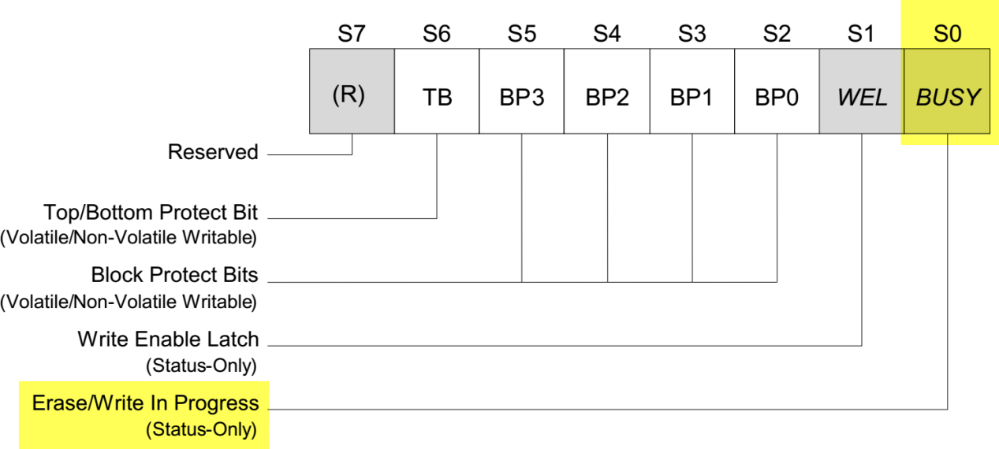

图 22‑22 FLASH芯片的状态寄存器-1(摘自《W25Q256》数据手册)

此处我们只关注这个状态寄存器的第0位“BUSY”，当这个位为“1”时，表明FLASH芯片处于忙碌状态，它可能正在对内部的存储单元进行“擦除”或“数据写入”的操作。

利用命令表中的“Read Status
Register（编码0x05）”命令可以获取FLASH芯片状态寄存器的内容，其时序见图
22‑23。

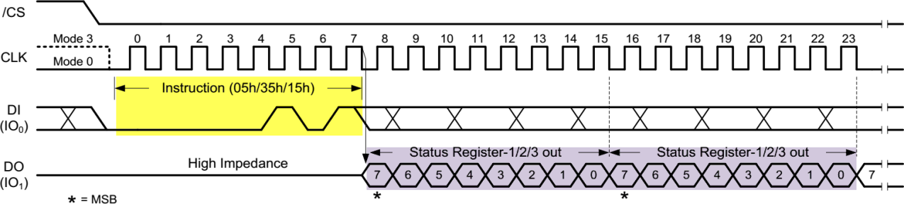

图 22‑23 读取状态寄存器的时序(摘自《W25Q256》数据手册)

只要向FLASH芯片发送了读状态寄存器的命令，FLASH芯片就会持续向主机返回最新的状态寄存器内容，直到收到SPI通讯的停止信号。据此我们编写了具有等待FLASH芯片写入结束功能的函数，具体见代码清单
22‑25。

.. code-block:: c
   :name: 代码清单 22‑25 通过读状态寄存器等待FLASH芯片空闲（bsp_norflash.c文件）
   :caption: 代码清单 22‑25 通过读状态寄存器等待FLASH芯片空闲（bsp_norflash.c文件）
   :linenos:

    #define FLASH_BUSY_STATUS_OFFSET    0
    /************************第1部分****************************/
    /* 查找表（部分）*/
    const uint32_t customLUT[CUSTOM_LUT_LENGTH] = {
        /*……以下省略其它命令，具体内容请查看程序源码…… */
        /* 读状态寄存器，Read status register */
        [4 * NOR_CMD_LUT_SEQ_IDX_READSTATUSREG] =
        FLEXSPI_LUT_SEQ(kFLEXSPI_Command_SDR, kFLEXSPI_1PAD, W25Q_ReadStatusReg,
                        kFLEXSPI_Command_READ_SDR, kFLEXSPI_1PAD, 0x04),
        /*……以下省略其它命令，具体内容请查看程序源码…… */
    };

    /************************第2部分****************************/
    /**
    * @brief  等待至FLASH空闲状态
    * @param  base:使用的FlexSPI端口
    * @retval FlexSPI传输返回的状态值，正常为0
    */
    status_t FlexSPI_NorFlash_Wait_Bus_Busy(FLEXSPI_Type *base)
    {
        /* 等待至空闲状态 */
        bool isBusy;
        uint32_t readValue;
        status_t status;
        flexspi_transfer_t flashXfer;

        /* 读状态寄存器 */
        flashXfer.deviceAddress = 0;
        flashXfer.port = kFLEXSPI_PortA1;
        flashXfer.cmdType = kFLEXSPI_Read;
        flashXfer.SeqNumber = 1;
        flashXfer.seqIndex = NOR_CMD_LUT_SEQ_IDX_READSTATUSREG;
        flashXfer.data = &readValue;
        flashXfer.dataSize = 1;
        /************************第3部分****************************/
        do {
            status = FLEXSPI_TransferBlocking(base, &flashXfer);

            if (status != kStatus_Success) {
                return status;
            }

            /* 判断状态寄存器的busy位 */
            if (readValue & (1U << FLASH_BUSY_STATUS_OFFSET)) {
                isBusy = true;
            } else {
                isBusy = false;
            }
        } while (isBusy);

        return status;
    }

这段代码的说明如下：

-  第1部分。定义查找表LUT的读状态寄存器序列，该序列包含一个发送命令编码的指令和读取内容的指令，其中发送的编码即FLASH的读状态寄存器命令编码W25Q_ReadStatusReg（宏值为0x05）。

-  第2部分。定义读状态寄存器操作的函数，函数内部设置FlexSPI传输结构体执行读状态寄存器序列NOR_CMD_LUT_SEQ_IDX_READSTATUSREG，并且把读取到的状态寄存器内容存储到变量readValue中，长度为1字节。

-  第3部分。在do…while循环中调用库函数FLEXSPI_TransferBlocking执行序列并判断其返回值status，若返回不正常则退出函数；若执行正常，判断readValue的FLASH_BUSY_STATUS_OFFSET（第0位，Busy位）位是否为1，为1表示忙碌，否则为空闲并记录该状态到标志isBusy中。do…while循环的结束条件是isBusy为假，也就是说这部分代码会一直循环直至FLASH处于空闲状态。

使用该代码时，直接调用即可，它会阻塞代码直至FLASH可响应后续的操作。

FLASH扇区擦除
             

由于FLASH存储器的特性决定了它的写入操作只能把原来为“1”的数据位改写成“0”，而原来为“0”的数据位不能直接改写为“1”。所以这里涉及到数据“擦除”的概念，在写入前，必须要对目标存储单元进行擦除操作。擦除操作会把存储单元中的数据位全擦除为“1”，在其后的写入数据操作中，如果要存储数据“1”，那就不修改存储单元
，在要存储数据“0”时，才更改该数据位。

在FLASH中对存储单元擦除的基本操作单位都是多个字节进行，如本例子中的FLASH芯片支持“扇区擦除”、“块擦除”以及“整片擦除”，见表
22‑2。

    表 22‑2 本实验FLASH芯片的擦除单位

+----------------------+------------------+
| 擦除单位             | 大小             |
+======================+==================+
| 扇区擦除Sector Erase | 4KB              |
+----------------------+------------------+
| 块擦除Block Erase    | 64KB             |
+----------------------+------------------+
| 整片擦除Chip Erase   | 整个芯片完全擦除 |
+----------------------+------------------+

FLASH芯片的最小擦除单位为扇区(Sector)，而一个块(Block)包含16个扇区，其内部存储矩阵分布见图
22‑24。

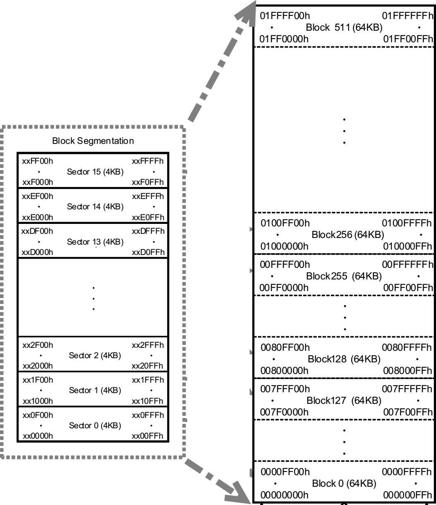

图 22‑24 FLASH芯片的存储矩阵(摘自《W25Q256》数据手册)

使用扇区擦除命令“\ `Sector
Erase <file:///G:\GIT_OSC\STM32_develop\STM32F407文档\develop\原始文档\零死角玩转STM32—F407.docx#_控制FLASH的指令>`__
with 4-Byte Address(编码0x21)”可控制FLASH芯片开始擦写，其命令时序见图
22‑27。

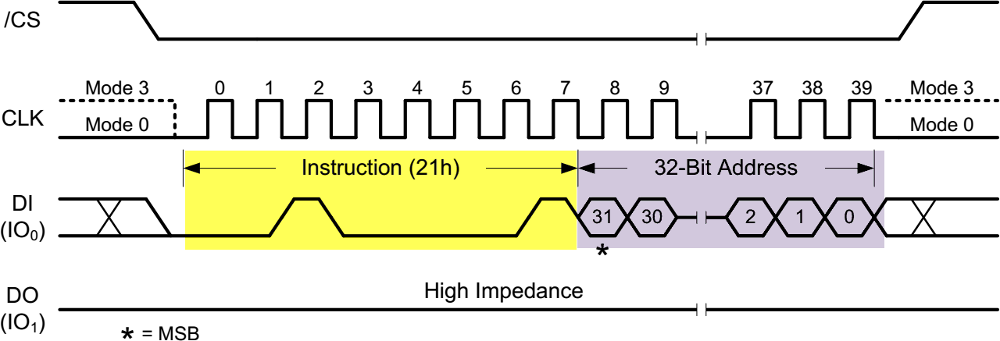

图 22‑25 扇区擦除时序(摘自《W25Q256》数据手册)

扇区擦除命令的第一个字节为命令编码，紧接着发送的3个字节用于表示要擦除的存储矩阵地址。要注意的是在扇区擦除命令前，还需要先发送前面的写使能命令“\ `Write <file:///G:\GIT_OSC\STM32_develop\STM32F407文档\develop\原始文档\零死角玩转STM32—F407.docx#_控制FLASH的指令>`__
Enable(编码0x06)”，而且在发送扇区擦除指令后，要通过读取寄存器状态等待扇区擦除操作完毕，具体见代码清单
22‑26。

.. code-block:: c
   :name: 代码清单 22‑26 擦除扇区（bsp_norflash.c文件）
   :caption: 代码清单 22‑26 擦除扇区（bsp_norflash.c文件）
   :linenos:

    /************************第1部分****************************/
    /* 查找表（部分）*/
    const uint32_t customLUT[CUSTOM_LUT_LENGTH] = {
        /*……以下省略其它命令，具体内容请查看程序源码…… */
        /* 擦除扇区，Erase Sector  */
        [4 * NOR_CMD_LUT_SEQ_IDX_ERASESECTOR] =
        FLEXSPI_LUT_SEQ(kFLEXSPI_Command_SDR, kFLEXSPI_1PAD, W25Q_SectorErase_4Addr,
                    kFLEXSPI_Command_RADDR_SDR, kFLEXSPI_1PAD, FLASH_ADDR_LENGTH),
        /*……以下省略其它命令，具体内容请查看程序源码…… */
    };
    
    /************************第2部分****************************/
    /**
    * @brief  擦除扇区
    * @param  base:使用的FlexSPI端口
    * @param  address:要擦除扇区的起始地址
    * @retval FlexSPI传输返回的状态值，正常为0
    */
    status_t FlexSPI_NorFlash_Erase_Sector(FLEXSPI_Type *base,
                                            uint32_t dstAddr)
    {
        status_t status;
        flexspi_transfer_t flashXfer;
        /************************第3部分****************************/
        /* 写使能 */
        status = FlexSPI_NorFlash_Write_Enable(base);
    
        if (status != kStatus_Success) {
            return status;
        }
        /************************第4部分****************************/
        /* 擦除扇区指令 */
        flashXfer.deviceAddress = dstAddr;
        flashXfer.port = kFLEXSPI_PortA1;
        flashXfer.cmdType = kFLEXSPI_Command;
        flashXfer.SeqNumber = 1;
        flashXfer.seqIndex = NOR_CMD_LUT_SEQ_IDX_ERASESECTOR;
    
        status = FLEXSPI_TransferBlocking(base, &flashXfer);
    
        if (status != kStatus_Success) {
            return status;
        }
        /************************第5部分****************************/
        /* 等待FLASH至空闲状态 */
        status = FlexSPI_NorFlash_Wait_Bus_Busy(base);
    
        return status;
    }

这段代码的说明如下：

-  第1部分。这是查找表LUT中定义的擦除扇区操作的序列，它包含一个发送命令编码的指令和发送地址的指令。其中发送的编码即FLASH的扇区擦除命令编码W25Q_SectorErase_4Addr（宏值为0x21）；发送地址的指令kFLEXSPI_Command_RADDR_SDR它附带的参数为宏FLASH_ADDR_LENGTH（值为32），表示我们要发送的地址是32位的。

-  第2部分。定义执行擦除操作的函数FlexSPI_NorFlash_Erase_Sector，它包含的两个参数分别用于指定要使用的FlexSPI外设（base）以及要擦除的扇区地址（dstAddr）。

-  第3部分。调用前面定义的写使能函数FlexSPI_NorFlash_Write_Enable使FLASH允许写入。

-  第4部分。给FlexSPI传输结构体赋值并执行库函数FLEXSPI_TransferBlocking，它与前面各种命令最大的区别是此处deviceAddress成员是有效的，它被赋值为函数的输入参数dstAddr。在执行序列发送地址的指令kFLEXSPI_Command_RADDR_SDR时候，dstAddr的内容会被发送出去，加上前面的擦除命令编码就能组成前面图
   22‑27中的擦除扇区命令的操作了。

-  第5部分。调用前面定义的FlexSPI_NorFlash_Wait_Bus_Busy函数等待FLASH完成擦除操作。

要特别注意，根据FLASH的要求，调用扇区擦除命令时注意输入的地址要对齐到4KB。

FLASH的Quad模式页写入
                     

目标扇区被擦除完毕后，就可以向它写入数据了。与EEPROM类似，FLASH芯片也有页写入命令，使用页写入命令最多可以一次向FLASH传输256个字节的数据，我们把这个单位称为页大小。FLASH的页写入有Single/Dual/Quad模式，不同的模式有对应的命令编码，本实验使用传输速率最快的Quad模式时序，Quad模式页写入指令“Quad
Input Page Program with 4-Byte Address”，具体见图 22‑26。

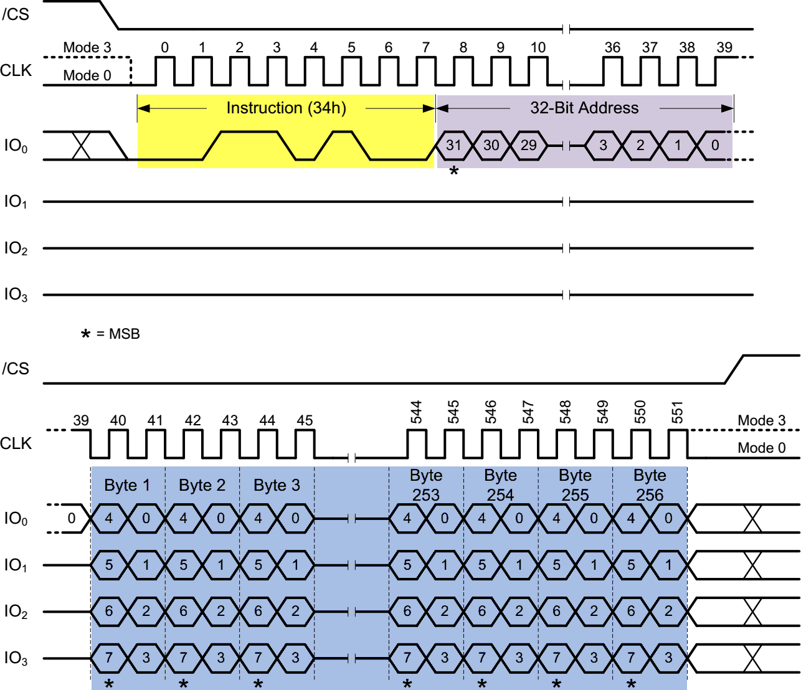

图 22‑26 FLASH的Quad模式页写入命令(摘自《W25Q256》数据手册)

从时序图可知，第1个字节为“Quad模式页写入指令”命令的编码0x34，紧接着是32位的“地址A”，它表示要写入的FLASH内部存储单元的起始地址。随后是要写入的内容，最多个可以发送256字节数据，这些数据将会从“地址A”开始，按顺序写入到FLASH的存储单元中。若发送的数据超出256个，则会覆盖前面发送的数据。

要注意的是，在这个Quad模式的写入命令中，地址依然是使用单根数据线传输的，在传输数据的时候才使用4根数据线，所以定义查找表序列的指令时要注意区分。

与擦除指令不一样，页写入指令的地址并不要求按256字节对齐，只要确认目标存储单元是擦除状态即可(即被擦除后没有被写入过)。所以，若对“地址x”执行页写入指令后，发送了200个字节数据后终止通讯，下一次再执行页写入指令，从“地址(x+200)”开始写入200个字节也是没有问题的(小于256均可)。
只是在实际应用中由于基本擦除单元是4KB，一般都以扇区为单位进行读写，想深入了解，可学习我们后面的“FLASH文件系统”章节相关的例子。

把页写入操作封装成函数的具体实现见代码清单 22‑27。

.. code-block:: c
   :name: 代码清单 22‑27 FLASH的页写入（bsp_norflash.c文件）
   :caption: 代码清单 22‑27 FLASH的页写入（bsp_norflash.c文件）
   :linenos:

    /************************第1部分****************************/
    /* 查找表（部分）*/
    const uint32_t customLUT[CUSTOM_LUT_LENGTH] = {
        /*……以下省略其它命令，具体内容请查看程序源码…… */
        /* QUAD模式页写入，Page Program - quad mode */
        [4 * NOR_CMD_LUT_SEQ_IDX_PAGEPROGRAM_QUAD] =
    FLEXSPI_LUT_SEQ(kFLEXSPI_Command_SDR, kFLEXSPI_1PAD, W25Q_PageProgramQuad_4Addr,
                    kFLEXSPI_Command_RADDR_SDR, kFLEXSPI_1PAD, FLASH_ADDR_LENGTH),
        [4 * NOR_CMD_LUT_SEQ_IDX_PAGEPROGRAM_QUAD + 1] =
        FLEXSPI_LUT_SEQ(kFLEXSPI_Command_WRITE_SDR, kFLEXSPI_4PAD, 0x04,
                        kFLEXSPI_Command_STOP, kFLEXSPI_1PAD, 0),
        /*……以下省略其它命令，具体内容请查看程序源码…… */
    };

    /************************第2部分****************************/
    /**
    * @brief  页写入
    * @param  base:使用的FlexSPI端口
    * @param  dstAddr:要写入的起始地址
    * @param  src:要写入的数据的指针
    * @param  dataSize:要写入的数据量，不能大于256
    * @retval FlexSPI传输返回的状态值，正常为0
    */
    status_t FlexSPI_NorFlash_Page_Program(FLEXSPI_Type *base,
                                        uint32_t dstAddr,
                                        uint8_t *src,
                                        uint16_t dataSize)
    {
        status_t status;
        flexspi_transfer_t flashXfer;
        /************************第3部分****************************/
        /* 写使能 */
        status = FlexSPI_NorFlash_Write_Enable(base);

        if (status != kStatus_Success) {
            return status;
        }
        /************************第4部分****************************/
        /* 设置传输结构体 */
        flashXfer.deviceAddress = dstAddr;
        flashXfer.port = kFLEXSPI_PortA1;
        flashXfer.cmdType = kFLEXSPI_Write;
        flashXfer.SeqNumber = 1;
        flashXfer.seqIndex = NOR_CMD_LUT_SEQ_IDX_PAGEPROGRAM_QUAD;
        flashXfer.data = (uint32_t *)src;
        flashXfer.dataSize = dataSize;

        status = FLEXSPI_TransferBlocking(base, &flashXfer);
        if (status != kStatus_Success) {
            return status;
        }
        /************************第5部分****************************/
        /* 等待写入完成 */
        status = FlexSPI_NorFlash_Wait_Bus_Busy(base);
    
        return status;
    }

这段代码的说明如下：

-  第1部分。在查找表LUT中定义页写入操作的序列，它包含以下指令：

1) 发送命令编码指令kFLEXSPI_Command_SDR，编码为宏W25Q_PageProgramQuad_4Addr，其值为0x34，即FLASH的Quad模式页写入命令，根据FLASH该命令的要求，此命令编码和下面的地址都是使用一根数据线传输的，所以数据线的数目赋值为枚举值kFLEXSPI_1PAD，表示使用Single单根数据线的方式；

2) 发送地址的指令kFLEXSPI_Command_RADDR_SDR，附带的参数为宏FLASH_ADDR_LENGTH（值为32），表示我们要发送的地址是32位的；

3) 写入数据指令kFLEXSPI_Command_WRITE_SDR，要注意该指令使用的数据线数目为kFLEXSPI_4PAD，即传输数据时使用Quad四根数据线的模式，这样才符合FLASH的Quad页写入命令的要求，类似地，本指令中的参数0x04是无意义的，请忽略，传输的数据量由执行时的FlexSPI传输结构体来指定；

4) 明确指定使用STOP指令停止传输，结束通讯。

-  第2部分。定义执行擦除操作的函数FlexSPI_NorFlash_Page_Program，它包含三个参数，分别用于指定要使用的FlexSPI外设（base）、要写入的FLASH内部存储单元的地址（dstAddr）、要写入数据的指针（src）以及要写入的数据量（dataSize），要注意页写入命令最多只能写入256个数据，所以dataSize的值不能大于256。

-  第3部分。调用前面定义的写使能函数FlexSPI_NorFlash_Write_Enable使FLASH允许写入。

-  第4部分。给FlexSPI传输结构体赋值并执行库函数FLEXSPI_TransferBlocking。在传输结构体的赋值中，deviceAddress被被赋值为函数的输入参数dstAddr。它会在执行序列指令kFLEXSPI_Command_WRITE_SDR时候被发送出去；由于是写入数据操作，所以cmdTyped被赋值为kFLEXSPI_Write；要写入的数据和数据量分别被赋值为函数的输入参数src及dataSize。

-  第5部分。与擦除操作类似，传输完成后需要调用前面定义的FlexSPI_NorFlash_Wait_Bus_Busy函数等待FLASH完成写入操作。

本函数中集成了写使能及传输后的等待操作，应用时直接调用即可，不过要注意写入的数据量不能超过页的大小（256字节）。

不定量数据写入
              

应用的时候我们常常要写入不定量的数据，直接调用“页写入”函数并不是特别方便，所以我们在它的基础上编写了“不定量数据写入”的函数，其实现见代码清单
22‑28。

.. code-block:: c
   :name: 代码清单 22‑28不定量数据写入（bsp_norflash.c文件）
   :caption: 代码清单 22‑28不定量数据写入（bsp_norflash.c文件）
   :linenos:

    /**
    * @brief 向FLASH写入不限量的数据
    * @note  写入前要确保该空间是被擦除的状态
    * @param  base:使用的FlexSPI端口
    * @param  dstAddr:要写入的起始地址
    * @param  src:要写入的数据的指针
    * @param  dataSize:
    要写入的数据量，没有限制，确认空间是已被擦除过的即可
    * @retval 写入的返回值，为0是表示正常
    */
    status_t FlexSPI_NorFlash_Buffer_Program(FLEXSPI_Type *base,
                                            uint32_t dstAddr,
                                            uint8_t *src,
                                            uint16_t dataSize)
    {
        status_t status = kStatus_Success;
        uint16_t NumOfPage = 0, NumOfSingle = 0, Addr = 0, count = 0;
        /* 后续要处理的字节数，初始值为NumByteToWrite*/
        uint16_t NumByteToWriteRest = dataSize;
        /* 根据以下情况进行处理：
        1.写入的首地址是否对齐
        2.最后一次写入是否刚好写满一页 */
        Addr = dstAddr % FLASH_PAGE_SIZE;
        count = FLASH_PAGE_SIZE - Addr;

        /* 若NumByteToWrite > count：
        第一页写入count个字节，对其余字节再进行后续处理，
        所以用 (NumByteToWriteRest = dataSize - count)
        求出后续的NumOfPage和NumOfSingle进行处理。

        若NumByteToWrite < count：
        即不足一页数据，直接用NumByteToWriteRest = NumByteToWrite
        求出NumOfPage和NumOfSingle即可 */
        NumByteToWriteRest = (dataSize > count) ? (dataSize - count) : dataSize;

        /* 要完整写入的页数（不包括前count字节）*/
        NumOfPage =  NumByteToWriteRest / FLASH_PAGE_SIZE;
        /* 最后一页要写入的字节数（不包括前count字节）*/
        NumOfSingle = NumByteToWriteRest % FLASH_PAGE_SIZE;

        /* dataSize > count时，需要先往第一页写入count个字节
        dataSize < count时无需进行此操作 */
        if (count != 0 && dataSize > count) {
            status = FlexSPI_NorFlash_Page_Program(base, dstAddr, src, count);
            if (status != kStatus_Success) return status;

            dstAddr += count;
            src += count;
        }

        /* 处理后续数据 */
        if (NumOfPage== 0 ) {
            status = FlexSPI_NorFlash_Page_Program(base, dstAddr, src, NumOfSingle);
            if (status != kStatus_Success) return status;
        } else {
            /* 后续数据大于一页 */
            while (NumOfPage--) {
        status = FlexSPI_NorFlash_Page_Program(base, dstAddr, src, FLASH_PAGE_SIZE);
                if (status != kStatus_Success) return status;

                dstAddr +=  FLASH_PAGE_SIZE;
                src += FLASH_PAGE_SIZE;
            }
            /* 最后一页 */
            if (NumOfSingle != 0) {
            status = FlexSPI_NorFlash_Page_Program(base, dstAddr, src, NumOfSingle);
                if (status != kStatus_Success) return status;

            }
        }

        return status;
    }

这段代码与前面LPI2C章节《代码清单 21‑14
无限制地写入多字节函数（bsp_i2c_eeprom.c文件）》的函数原理是一样的，运算过程在此不再赘述。区别是页的大小，以及在实际数据写入的时候使用的FLASH页写入函数，且在实际调用这个“FlexSPI_NorFlash_Buffer_Program”函数时，还要注意确保目标扇区处于擦除状态。

FLASH的Quad模式读取数据
                       

相对于写入，FLASH芯片的数据读取要简单得多，不需要类似写使能以及传输后的等待操作，直接使用Quad模式读取命令“Fast
Read Quad Output with 4-Byte Address（编码0x6C）”即可，其命令时序见图
22‑27。

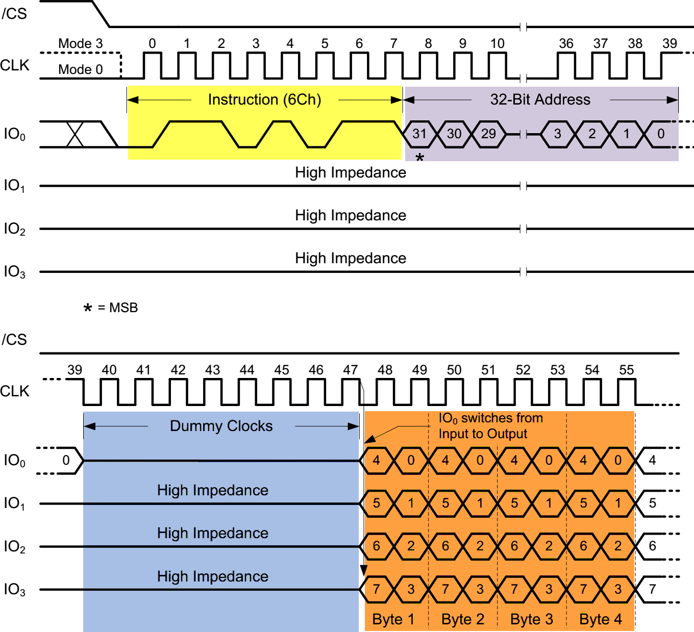

图 22‑27 FLASH的Quad模式读取命令(摘自《W25Q256》数据手册)

这个命令最为特殊的时发送了命令编码（0x6C）及要读的起始地址后，还需要等待8个CLK时钟，其后FLASH芯片才会按地址递增的方式返回存储单元的内容，在这等待期间数据信号线输入输出的数据都是无效的。等待结束后对FLASH读取的数据量没有限制，只要没有停止通讯，FLASH芯片就会一直返回数据。具体的代码实现见代码清单
22‑29。

.. code-block:: c
   :name: 代码清单 22‑29 从FLASH读取数据（bsp_norflash.c文件）
   :caption: 代码清单 22‑29 从FLASH读取数据（bsp_norflash.c文件）
   :linenos:

    /************************第1部分****************************/
    /* 查找表（部分）*/
    const uint32_t customLUT[CUSTOM_LUT_LENGTH] = {
        /*……以下省略其它命令，具体内容请查看程序源码…… */
        /* QUAD模式快速读指令，Fast read quad mode - SDR */
        [4 * NOR_CMD_LUT_SEQ_IDX_READ_FAST_QUAD] =
        FLEXSPI_LUT_SEQ(kFLEXSPI_Command_SDR, kFLEXSPI_1PAD, W25Q_FastReadQuad_4Addr,
                        kFLEXSPI_Command_RADDR_SDR, kFLEXSPI_1PAD, FLASH_ADDR_LENGTH),
        [4 * NOR_CMD_LUT_SEQ_IDX_READ_FAST_QUAD + 1] =
        FLEXSPI_LUT_SEQ(kFLEXSPI_Command_DUMMY_SDR, kFLEXSPI_4PAD, 0x08,
                        kFLEXSPI_Command_READ_SDR, kFLEXSPI_4PAD, 0x04),
        /*……以下省略其它命令，具体内容请查看程序源码…… */
    };
    
    /************************第2部分****************************/
    /**
    * @brief  读取数据
    * @param  base:使用的FlexSPI端口
    * @param  address:要读取的起始地址
    * @param  dst[out]:存储接收到的数据的指针
    * @param  dataSize:要读取的数据量，不能大于65535
    * @retval FlexSPI传输返回的状态值，正常为0
    */
    status_t FlexSPI_NorFlash_Buffer_Read(FLEXSPI_Type *base,
                                        uint32_t address,
                                        uint8_t *dst,
                                        uint16_t dataSize)
    {
        status_t status;
        flexspi_transfer_t flashXfer;
    
        /* 设置传输结构体 */
        flashXfer.deviceAddress = address;
        flashXfer.port = kFLEXSPI_PortA1;
        flashXfer.cmdType = kFLEXSPI_Read;
        flashXfer.SeqNumber = 1;
        flashXfer.seqIndex = NOR_CMD_LUT_SEQ_IDX_READ_FAST_QUAD;
        flashXfer.data = (uint32_t *)dst;
        flashXfer.dataSize = dataSize;
    
        status = FLEXSPI_TransferBlocking(base, &flashXfer);
    
        return status;
    }

这段代码与其它操作指令并无二致，也是定义查找表指令，对传输结构体赋值然后执行的流程，最特别的是查找表中使用了发送DUMMY操作的指令“kFLEXSPI_Command_DUMMY_SDR”，且该指令的参数为0x08，这正是对应图
22‑27中发送地址后的8个等待时钟操作，执行完该指令后再进行数据读取。

虽然FLASH存储器没有限制读取的数据量，但传输结构体的flashXfer.dataSize变量以及它对应的寄存器配置域IPCR1[IDATSZ]是16位的，所以接收的数据量不应超过65535。

编写IP命令访问方式测试
                      

有了以上擦除、写入和读取操作的函数，我们就可以尝试对FLASH进行读写数据测试了，我们把测试相关的代码编写到“norflash_test.c”文件中。

首先是使用IP命令访问的方式进行测试，具体代码见代码清单 22‑30。

.. code-block:: c
   :name: 代码清单 22‑30 使用IP命令访问方式测试（norflash_test.c文件）
   :caption: 代码清单 22‑30 使用IP命令访问方式测试（norflash_test.c文件）
   :linenos:

    /************************第1部分****************************/
    #define EXAMPLE_SECTOR      1000      /* 要进行读写测试的扇区号 */
    #define EXAMPLE_SIZE        (4*1024)  /* 读写测试的数据量，单位为字节*/
    /************************第2部分****************************/
    /* 读写测试使用的缓冲区 */
    static uint8_t s_nor_program_buffer[EXAMPLE_SIZE];
    static uint8_t s_nor_read_buffer[EXAMPLE_SIZE];

    /**
    * @brief  使用IP命令的方式进行读写测试
    * @param  无
    * @retval 测试结果，正常为0
    */
    int NorFlash_IPCommand_Test(void)
    {
        uint32_t i = 0;
        status_t status;
        uint32_t JedecDeviceID = 0;

        PRINTF("\r\nNorFlash IP命令访问测试\r\n");
        /************************第3部分****************************/
        /***************************读ID测试************************/
        /* 获取JedecDevice ID. */
        FlexSPI_NorFlash_Get_JedecDevice_ID(FLEXSPI, &JedecDeviceID);

        if (JedecDeviceID != FLASH_JEDECDEVICE_ID) {
            PRINTF("FLASH检测错误，读取到的JedecDeviceID值为: 0x%x\r\n", 
                JedecDeviceID);
            return -1;
        }

        PRINTF("检测到FLASH芯片，JedecDeviceID值为: 0x%x\r\n", JedecDeviceID);
        /************************第4部分****************************/
        /***************************擦除测试************************/
        PRINTF("擦除扇区测试\r\n");

        /* 擦除指定扇区 */
        status = FlexSPI_NorFlash_Erase_Sector(FLEXSPI, EXAMPLE_SECTOR * SECTOR_SIZE);
        if (status != kStatus_Success) {
            PRINTF("擦除flash扇区失败 !\r\n");
            return -1;
        }

        /* 读取内容 */
        status = FlexSPI_NorFlash_Buffer_Read(FLEXSPI,
                                            EXAMPLE_SECTOR * SECTOR_SIZE,
                                            s_nor_read_buffer,
                                            EXAMPLE_SIZE);

        if (status != kStatus_Success) {
            PRINTF("读取数据失败 !\r\n");
            return -1;
        }

        /* 擦除后FLASH中的内容应为0xFF，
        设置比较用的s_nor_program_buffer值全为0xFF */
        memset(s_nor_program_buffer, 0xFF, sizeof(s_nor_program_buffer));
        /* 把读出的数据与0xFF比较 */
        if (memcmp(s_nor_program_buffer, s_nor_read_buffer,EXAMPLE_SIZE)){
            PRINTF("擦除数据，读出数据不正确 !\r\n ");
            return -1;
        } else {
            PRINTF("擦除数据成功. \r\n");
        }
        /************************第5部分****************************/
        /***************************写入数据测试********************/
        PRINTF("写入数据测试 \r\n");

        for (i = 0; i < EXAMPLE_SIZE; i++) {
            s_nor_program_buffer[i] = (uint8_t) i;
        }

        /* 写入数据 */
        status = FlexSPI_NorFlash_Buffer_Program(FLEXSPI,
                                                EXAMPLE_SECTOR * SECTOR_SIZE,
                                                (void *)s_nor_program_buffer,
                                                EXAMPLE_SIZE);
        if (status != kStatus_Success) {
            PRINTF("写入失败 !\r\n");
            return -1;
        }

        /* 读取数据 */
        status = FlexSPI_NorFlash_Buffer_Read(FLEXSPI,
                                            EXAMPLE_SECTOR * SECTOR_SIZE,
                                            s_nor_read_buffer,
                                            EXAMPLE_SIZE);

        if (status != kStatus_Success) {
            PRINTF("读取数据失败 !\r\n");
            return -1;
        }

        /* 把读出的数据与写入的比较 */
        if (memcmp(s_nor_program_buffer, s_nor_read_buffer, EXAMPLE_SIZE)) {
            PRINTF("写入数据，读出数据不正确 !\r\n ");
            return -1;
        } else {
            PRINTF("写入数据成功. \r\n");
        }
    
        return 0;
    }

这段代码的说明如下：

-  第1部分。定义两个宏用于指定本测试要读写、擦除的扇区号EXAMPLE_SECTOR以及读写测试使用的数据量EXAMPLE_SIZE。

-  第2部分。定义两个数组用来缓冲要写入的数据和接收读取的数据，数据量均为上面定义的EXAMPLE_SIZE大小。

-  第3部分。调用FlexSPI_NorFlash_Get_JedecDevice_ID函数尝试读取Jedec
   Device
   ID，并把结果与宏FLASH_JEDECDEVICE_ID（值为0xEF4019）对比，若相等说明读取正常，可以进行后续操作。

-  第4部分。调用FlexSPI_NorFlash_Erase_Sector函数擦除宏EXAMPLE_SECTOR指定的扇区，代码中通过“EXAMPLE_SECTOR
   \*
   SECTOR_SIZE”操作来计算出该扇区的地址，如编号为1000的扇区，其地址为1000*4096，计算得到的地址作为参数输入到函数中。擦除操作完成后调用FlexSPI_NorFlash_Buffer_Read函数读取该地址的内容，并存储到读取缓冲区s_nor_read_buffer中。根据FLASH的特性，擦除后FLASH中的内容应全为0xFF，为便于进行比较，代码中先调用C库函数memset把写缓冲区s_nor_program_buffer的内容全设置为0xFF，然后再调用memcmp函数把s_nor_program_buffer与读取缓冲区s_nor_read_buffer的内容进行比较，即通过判断读取到的内容是否全为0xFF来确认擦除操作是否正常。

-  第5部分。代码中先对写缓冲区s_nor_program_buffer重新赋值，内容为0~0xFF，然后调用函数FlexSPI_NorFlash_Buffer_Program把这些内容写入到前面已擦除的空间中。写入完毕后调用FlexSPI_NorFlash_Buffer_Read函数读取出来并使用memcmp函数进行校验。

可以看到本测试使用我们前面定义的各种操作函数对FLASH进行访问，这些函数内部是访问FlexSPI寄存器实现的，这就是所谓的IP命令访问方式。

AHB命令访问的查找表配置
                       

与IP命令访问对比，本外设还支持使用AHB命令的方式来访问FLASH，使用该方式时外部设备配置结构体需要进行特殊配置，具体见。

.. code-block:: c
   :name: 代码清单 22‑31外部设备配置结构体与AHB命令相关的配置（bsp_norflash.c文件）
   :caption: 代码清单 22‑31外部设备配置结构体与AHB命令相关的配置（bsp_norflash.c文件）
   :linenos:

    /************************第1部分****************************/
    /* 查找表（部分）*/
    const uint32_t customLUT[CUSTOM_LUT_LENGTH] = {
        /*……以下省略其它命令，具体内容请查看程序源码…… */
        /* 给AHB命令访问的 QUAD模式页写入 
        序列，包含写使能和页写入两条序列 */
        /* 写使能，Write Enable */
        [4 * NOR_CMD_LUT_SEQ_IDX_AHB_PAGEPROGRAM_QUAD_1] =
        FLEXSPI_LUT_SEQ(kFLEXSPI_Command_SDR, kFLEXSPI_1PAD, W25Q_WriteEnable,
                        kFLEXSPI_Command_STOP, kFLEXSPI_1PAD, 0),
    
        /* QUAD模式页写入，Page Program - quad mode */
        [4 * NOR_CMD_LUT_SEQ_IDX_AHB_PAGEPROGRAM_QUAD_2] =
        FLEXSPI_LUT_SEQ(kFLEXSPI_Command_SDR, kFLEXSPI_1PAD, W25Q_PageProgramQuad_4Addr,
                    kFLEXSPI_Command_RADDR_SDR, kFLEXSPI_1PAD, FLASH_ADDR_LENGTH),
        [4 * NOR_CMD_LUT_SEQ_IDX_AHB_PAGEPROGRAM_QUAD_2 + 1] =
        FLEXSPI_LUT_SEQ(kFLEXSPI_Command_WRITE_SDR, kFLEXSPI_4PAD, 0x04,
                        kFLEXSPI_Command_STOP, kFLEXSPI_1PAD, 0),
    /************************第2部分****************************/
        /* QUAD模式快速读指令，Fast read quad mode - SDR */
        [4 * NOR_CMD_LUT_SEQ_IDX_READ_FAST_QUAD] =
        FLEXSPI_LUT_SEQ(kFLEXSPI_Command_SDR, kFLEXSPI_1PAD, W25Q_FastReadQuad_4Addr,
                    kFLEXSPI_Command_RADDR_SDR, kFLEXSPI_1PAD, FLASH_ADDR_LENGTH),
        [4 * NOR_CMD_LUT_SEQ_IDX_READ_FAST_QUAD + 1] =
        FLEXSPI_LUT_SEQ(kFLEXSPI_Command_DUMMY_SDR, kFLEXSPI_4PAD, 0x08,
                    kFLEXSPI_Command_READ_SDR, kFLEXSPI_4PAD, 0x04),
        /*……以下省略其它命令，具体内容请查看程序源码…… */
    };
    
    /************************第3部分****************************/
    /* 设备特性相关的参数 */
    flexspi_device_config_t deviceconfig = {
        /*...部分内容省略...*/
        .AWRSeqIndex = NOR_CMD_LUT_SEQ_IDX_AHB_PAGEPROGRAM_QUAD_1,
        .AWRSeqNumber = 2,
        .ARDSeqIndex = NOR_CMD_LUT_SEQ_IDX_READ_FAST_QUAD,
        .ARDSeqNumber = 1,
        /* W25Q256 typical time=0.7ms,max time=3ms
        *  fAHB = 528MHz,T AHB = 1/528us
        *  unit = 32768/528 = 62.06us
        *  取延时时间为1ms，
        *  AHBWriteWaitInterval = 1*1000/62.06 = 17
        */
        .AHBWriteWaitUnit = kFLEXSPI_AhbWriteWaitUnit32768AhbCycle,
        .AHBWriteWaitInterval = 17,
    };

代码的说明如下：

-  第1部分。这部分代码包含了查找表中的两个序列，序列的功能分别是写使能和QUAD模式的页写入，它与前面IP命令中使用的序列的功能其实并没有差别，只是它们被特意定义到查找表中的连续位置了，写使能序列的编号NOR_CMD_LUT_SEQ_IDX_AHB_PAGEPROGRAM_QUAD_1（宏值为13），QUAD模式页写入序列的编号NOR_CMD_LUT_SEQ_IDX_AHB_PAGEPROGRAM_QUAD_2（宏值为14）。因为AHB命令访问无法像IP命令访问那样通过独立的函数分别进行写使能和页写入，所以此处必须把它们定义到连续的位置，当AHB命令访问时，一次执行这两个连续的序列。

-  第2部分。这部分是QUAD模式的快速读指令，它与IP命令访问使用的是同一个查找表序列，此处不再分析。

-  第3部分。这段内容是前面《配置闪存功能参数》小节中的代码，是外部设备配置结构体的赋值代码，这部分专门用于设置AHB命令相关的查找表内容：

1) AWRSeqIndex和AWRSeqNumber：它们用于指定触发AHB写访问时FlexSPI外设要执行的序列和序列数目，我们要执行的正是第1部分代码定义的包含写使能和QUAD模式页写入的两个序列，所以分别赋值为NOR_CMD_LUT_SEQ_IDX_AHB_PAGEPROGRAM_QUAD_1和2。

2) ARDSeqIndex和ARDSeqNumber：类似地，它们用于指定触发AHB读访问时FlexSPI外设要执行的序列和数目，代码中正是指向查找表中QUAD模式的页写入序列。

3) AHBWriteWaitUnit和AHBWriteWaitInterval：它们用于指定写入操作后要等待的时间。在IP命令访问方式中，可以看到我们可通过读取FLASH的BUSY状态寄存器位来确认写入操作是否完成，而AHB命令访问方式只支持读数据和写数据，在写入操作后只能通过固定的延时来等待FLASH内部写入操作完成。代码中通过AHBWriteWaitUnit来指定AHBWriteWaitInterval的单位，总的等待时间为17*32768个AHB时钟周期，其中AHB时钟频率为528MHz，在这样的配置下大约延时1ms。该时间是根据FLASH特性配置的，具体见图
   22‑28。

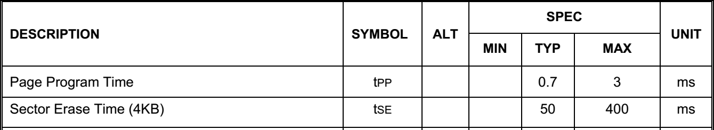

图 22‑28 FLASH的页写入延时（摘自《W25Q256》数据手册）

    该表中表示的页写入需要的时间典型值为0.7ms，最大值为3ms，由于使用AHB命令写入时通常每次只写入不超过80个
    数据，不足页写入的256个，因而本代码中的配置选择了延时1ms，具体还可根据自己的需求进行调整。

编写AHB命令访问方式测试
                       

使用AHB命令访问方式相对应的测试代码具体见代码清单 22‑32。

.. code-block:: c
   :name: 代码清单 22‑32 使用AHB命令访问方式测试（norflash_test.c文件）
   :caption: 代码清单 22‑32 使用AHB命令访问方式测试（norflash_test.c文件）
   :linenos:

    /************************第1部分****************************/
    /* FlexSPI_AMBA_BASE是 AHB命令使用的映射地址，值为0x6000 0000 */
    /* 把对FLASH访问的地址封装成指针 */
    #define NORFLASH_AHB_POINTER(addr)     (void*)( FlexSPI_AMBA_BASE + addr)
    /************************第2部分****************************/
    /**
    * @brief  使用IP命令的方式进行读写测试
    * @param  无
    * @retval 测试结果，正常为0
    */
    int NorFlash_AHBCommand_Test(void)
    {
        uint32_t i = 0;
        status_t status;
        uint32_t JedecDeviceID = 0;

        PRINTF("\r\nNorFlash AHB命令访问测试\r\n");

        /***************************读ID测试****************************/
        /* 获取JedecDevice ID. */
        FlexSPI_NorFlash_Get_JedecDevice_ID(FLEXSPI, &JedecDeviceID);

        if (JedecDeviceID != FLASH_JEDECDEVICE_ID) {
            PRINTF("FLASH检测错误，读取到的JedecDeviceID值为: 0x%x\r\n", 
                JedecDeviceID);
            return -1;
        }

        PRINTF("检测到FLASH芯片，JedecDeviceID值为: 0x%x\r\n", JedecDeviceID);

        /***************************擦除测试****************************/
        PRINTF("擦除扇区测试\r\n");

        /* 擦除指定扇区 */
        status = FlexSPI_NorFlash_Erase_Sector(FLEXSPI, EXAMPLE_SECTOR * SECTOR_SIZE);
        if (status != kStatus_Success) {
            PRINTF("擦除flash扇区失败 !\r\n");
            return -1;
        }
        /************************第3部分****************************/
        /* 读取数据 */
        memcpy(s_nor_read_buffer,
            NORFLASH_AHB_POINTER(EXAMPLE_SECTOR * SECTOR_SIZE),
            EXAMPLE_SIZE);

        /* 擦除后FLASH中的内容应为0xFF，
        设置比较用的s_nor_program_buffer值全为0xFF */
        memset(s_nor_program_buffer, 0xFF, EXAMPLE_SIZE);
        /* 把读出的数据与0xFF比较 */
        if (memcmp(s_nor_program_buffer, s_nor_read_buffer, EXAMPLE_SIZE)) {
            PRINTF("擦除数据，读出数据不正确 !\r\n ");
            return -1;
        } else {
            PRINTF("擦除数据成功. \r\n");
        }
        /************************第4部分****************************/
        /*****************一次写入少量数据测试************/
        PRINTF("8、16、32位写入数据测试：0x12、0x3456、0x789abcde \r\n");
        /*使用AHB命令方式写入数据*/
    *(uint8_t *)NORFLASH_AHB_POINTER(EXAMPLE_SECTOR * SECTOR_SIZE) = 0x12;
    *(uint16_t *)NORFLASH_AHB_POINTER(EXAMPLE_SECTOR * SECTOR_SIZE + 4) = 0x3456;
    *(uint32_t *)NORFLASH_AHB_POINTER(EXAMPLE_SECTOR * SECTOR_SIZE + 8) = 0x789abcde;
        /*使用AHB命令方式读取数据*/
        PRINTF("8位读写结果 = 0x%x\r\n",
        *(uint8_t *)NORFLASH_AHB_POINTER(EXAMPLE_SECTOR * SECTOR_SIZE));
        PRINTF("16位读写结果 = 0x%x\r\n",
        *(uint16_t *)NORFLASH_AHB_POINTER(EXAMPLE_SECTOR * SECTOR_SIZE+4));
        PRINTF("32位读写结果 = 0x%x\r\n",
        *(uint32_t *)NORFLASH_AHB_POINTER(EXAMPLE_SECTOR * SECTOR_SIZE+8));

        /**************一次写入一个扇区数据测试********************/
        
        PRINTF("\r\n大量数据写入和读取测试 \r\n");

        for (i = 0; i < EXAMPLE_SIZE; i++) {
            s_nor_program_buffer[i] = (uint8_t)i;
        }

        /* 擦除指定扇区 */
        status = FlexSPI_NorFlash_Erase_Sector(FLEXSPI, EXAMPLE_SECTOR * SECTOR_SIZE);
        if (status != kStatus_Success) {
            PRINTF("擦除flash扇区失败 !\r\n");
            return -1;
        }
        /************************第5部分****************************/
        /* 写入一个扇区的数据 */
        status = FlexSPI_NorFlash_Buffer_Program(FLEXSPI,
                EXAMPLE_SECTOR * SECTOR_SIZE,
                (void *)s_nor_program_buffer,
                EXAMPLE_SIZE);
        if (status != kStatus_Success) {
            PRINTF("写入失败 !\r\n");
            return -1;
        }

        /* 使用软件复位来重置 AHB 缓冲区. */
        FLEXSPI_SoftwareReset(FLEXSPI);
    
        /* 读取数据 */
        memcpy(s_nor_read_buffer,
                NORFLASH_AHB_POINTER(EXAMPLE_SECTOR * SECTOR_SIZE),
                EXAMPLE_SIZE);
        /* 把读出的数据与写入的比较 */
        if (memcmp(s_nor_program_buffer, s_nor_read_buffer,EXAMPLE_SIZE)) {
            PRINTF("写入数据，读出数据不正确 !\r\n ");
            return -1;
        } else {
            PRINTF("大量数据写入和读取测试成功. \r\n");
        }
    
        PRINTF("NorFlash AHB命令访问测试完成。\r\n");
    
        return 0;
    }

本代码说明如下：

-  第1部分。定义使用AHB命令访问的地址和指针。所谓AHB命令访问就是对RT1052内部映射的地址读写时，会触发FlexSPI外设对外发出SPI时序对相应的地FLASH地址进行读写。这个映射的内部首地址就是0x6000
   0000，在库文件中它被定义成了宏FlexSPI_AMBA_BASE（值为0x6000
   0000）。也就是说当我们对RT1052的0x6000
   0000地址写入时，内容会被写入到地外部FLASH的0地址的存储空间，相应的，0x6000
   0000+addr地址对应FLASH的adrr地址。在本代码中把这样的操作封装成了宏NORFLASH_AHB_POINTER(addr)，使用该宏时输入地址addr，它会被转化成0x6000
   0000+addr表示的地址，代码中的“(void
   \*)”是把数值转换成指针（即地址）的操作。

-  第2部分。这部分是类似前面IP命令访问的测试函数，其中的读取Jedec Device
   ID和擦除操作使用的仍然都是IP命令的访问方式，因为这样的操作并不支持使用AHB命令方式访问。

-  第3部分。这部分中的C库函数memcpy操作应用了AHB命令的读访问操作，它以指针NORFLASH_AHB_POINTER(EXAMPLE_SECTOR
   \* SECTOR_SIZE)作为第2个输入参数，函数运行时会对“0x6000 0000 +
   EXAMPLE_SECTOR \*
   SECTOR_SIZE”的地址进行读取，读取得的内容复制至第1个参数读取缓冲区s_nor_read_buffer中。当它读取该地址时会触发AHB命令对外部FLASH的EXAMPLE_SECTOR
   \*
   SECTOR_SIZE地址进行读取，从而能从FLASH中得到相应的数据。读取到数据后与0xFF进行比较，确认擦除正常。

-  第4部分。这部分内容使用了AHB命令对FLASH使用了8、16以及32位的方式进行读写，读写时直接通过“\*(uint8_t\*)”、“\*(uint16_t \*)”和“\*(uint32_t \*)”配合对指针宏NORFLASH_AHB_POINTER进行赋值。而赋值操作会触发AHB命令对FLASH的写操作，从而把数据存储到地FLASH中。

-  第5部分。这部分内容在擦除扇区后依然使用IP命令的写入操作函数FlexSPI_NorFlash_Buffer_Program来写入一个扇区内容，
   然后通过与第3部分相同的AHB命令方式把内容读取回来然后进行数据校验。

在这段代码中对整个扇区写入时没有使用AHB命令，因为经过我们测试和调整各种参数的努力后，使用AHB命令写入大量数据时仍然不正常，在靠后的数据总是无法写入，考虑到写入操作还要对扇区进行擦除操作（AHB命令是不支持擦除操作的），所以我们不建议使用AHB命令对FLASH进行写入。不过使用AHB命令对FLASH进行读取还是比较推荐的，这种方式操作非常方便。

main函数
''''''''

最后来看main函数了解整个示例代码的流程，具体见代码清单 22‑33。

.. code-block:: c
   :name: 代码清单 22‑33 main函数
   :caption: 代码清单 22‑33 main函数
   :linenos:

    /**
    * @brief  主函数
    * @param  无
    * @retval 无
    */
    int main(void)
    {
        /* 初始化内存保护单元 */
        BOARD_ConfigMPU();
        /* 初始化开发板引脚 */
        BOARD_InitPins();
        /* 初始化开发板时钟 */
        BOARD_BootClockRUN();
        /* 初始化调试串口 */
        BOARD_InitDebugConsole();
    
        /* 初始化FlexSPI外设 */
        FlexSPI_NorFlash_Init();
    
        /* 使用IP命令访问FLASH的测试 */
        NorFlash_IPCommand_Test();
    
        /* 使用AHB命令访问FLASH的测试 */
        NorFlash_AHBCommand_Test();
        while (1) {
        }
    }

main函数的执行流程非常简单，调用FlexSPI_NorFlash_Init初始化了FlexSPI后，通过NorFlash_IPCommand_Test和NorFlash_AHBCommand_Test函数对FLASH完成了IP命令和AHB命令的测试。

下载验证
^^^^^^^^

用USB线连接开发板“USB
转串口”接口跟电脑，在电脑端打开串口调试助手，把编译好的程序下载到开发板。在串口调试助手可看到FLASH测试的调试信息。
