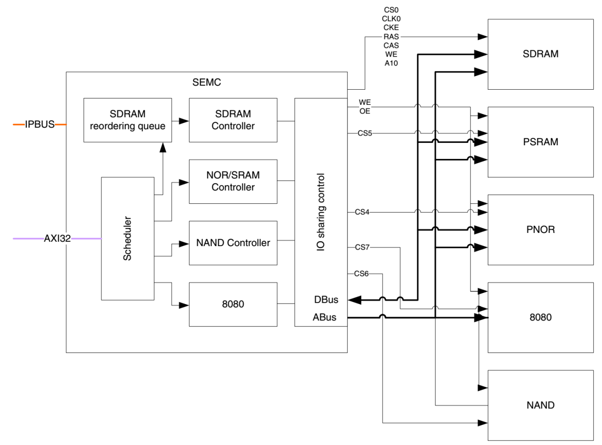

SEMC—扩展外部SDRAM
------------------

本章参考资料：《IMXRT1050RM》（参考手册）以及库帮助文档。

关于SDRAM存储器，请参考前面的“\ `常用存储器介绍 <file:///F:\文档\RT1052\%5b野火®%5d《i.MX%20RT库开发实战指南》.docm#_常用存储器介绍>`__\ ”章节，实验中SDRAM芯片的具体参数，请参考其规格书《W9825G6KH》来了解。

SDRAM控制原理
~~~~~~~~~~~~~

RT1052控制器芯片内部有一定大小的SRAM作为内存空间，当该内存不能满足需求时，可以在RT1052芯片的外部扩展相应的存储器存储器。

RT1052系列芯片扩展内存时可以选择SRAM和SDRAM，由于SDRAM的“容量/价格”比较高，即使用SDRAM要比SRAM要划算得多。我们以SDRAM为例讲解如何为RT1052扩展内存。

给RT1052芯片扩展内存与给PC扩展内存的原理是一样的，只是PC上一般以内存条的形式扩展，内存条实质是由多个内存颗粒(即SDRAM芯片)组成的通用标准模块，而RT1052直接与SDRAM芯片连接。见图
23‑1，这是一种型号为W9825G6KH的SDRAM芯片外部模型，本章节以它为例进行学习。

图 23‑1 SDRAM芯片外观

SDRAM的内部结构
^^^^^^^^^^^^^^^

SDRAM的内部结构具体见图 23‑2。

图 23‑2 一种SDRAM芯片的内部结构框图(摘自《W9825G6KH》数据手册)

①SDRAM的信号线
''''''''''''''

图 23‑2标号①处表示的是SDRAM芯片的控制引脚，其说明见表格 23‑1。

表格 23‑1 SDRAM控制引脚说明

+----------+------+-------------------------------------------------------+
| 信号线   | 类型 | 说明                                                  |
+==========+======+=======================================================+
| CLK      | I    | 同步时钟信号，所有输入信号都在CLK为上升沿的时候被采集 |
+----------+------+-------------------------------------------------------+
| CKE      | I    | 时钟使能信号，禁止时钟信号时SDRAM会启动自刷新操作     |
+----------+------+-------------------------------------------------------+
| CS#      | I    | 片选信号，低电平有效                                  |
+----------+------+-------------------------------------------------------+
| CAS#     | I    | 列地址选通，为低电平时地址线表示的是列地址            |
+----------+------+-------------------------------------------------------+
| RAS#     | I    | 行地址选通，为低电平时地址线表示的是行地址            |
+----------+------+-------------------------------------------------------+
| WE#      | I    | 写入使能，低电平有效                                  |
+----------+------+-------------------------------------------------------+
| LDQM     | I    | 数据输入/输出掩码信号，表示DQ信号线的有效部分         |
|          |      |                                                       |
| UDQM     |      |                                                       |
+----------+------+-------------------------------------------------------+
| BS[0:1]  | I    | Bank地址输入，选择要控制的Bank                        |
+----------+------+-------------------------------------------------------+
| A[0:12]  | I    | 地址输入                                              |
+----------+------+-------------------------------------------------------+
| DQ[0:15] | I/O  | 数据输入输出信号                                      |
+----------+------+-------------------------------------------------------+

除了时钟、地址和数据线，控制SDRAM还需要很多信号配合，它们具体作用在描述时序图时进行讲解。

②控制逻辑
'''''''''

图
23‑2标号②处的SDRAM内部的“控制逻辑”，它指挥着整个系统的运行，外部可通过CS、WE、CAS、RAS以及地址线来向控制逻辑输入命令，命令经过“命令器译码器”（Command
Decoder）译码，并将控制参数保存到“模式寄存器中”（Mode
Register），控制逻辑依此运行。

③地址控制
'''''''''

图
23‑2标号③处的结构与SDRAM的“A”以及“BS”两类地址线相连，A类地址线是行(Row)与列(Column)共用的地址总线，BS地址线是独立的用于指定SDRAM内部存储阵列号(Bank)。在命令模式下，A类地址线还用于某些命令输入参数。

④SDRAM的存储阵列
''''''''''''''''

图
23‑2标号④处的结构是SDRAM的存储单元阵列。本SDRAM包含4个阵列，外部设备使用“A”和“BS”（也称为BA线）地址线对这些阵列进行访问，每个存储阵列的内部结构具体见图
23‑3。

.. image:: media/image3.jpeg
   :align: center
   :alt: image3
   :name: 图23_3

图 23‑3 SDRAM存储阵列模型

SDRAM内部包含的存储阵列，可以把它理解成一张表格，数据就填在这张表格上。和表格查找一样，指定一个行地址和列地址，就可以精确地找到目标单元格，这是SDRAM芯片寻址的基本原理。这样的每个单元格被称为存储单元，而这样的表就是存储阵列(Bank)，目前设计的SDRAM芯片基本上内部都包含有4个这样的Bank，寻址时指定Bank号以及行地址，然后再指定列地址即可寻找到目标存储单元。SDRAM内部具有多个Bank时的结构见图
23‑4。

.. image:: media/image4.jpeg
   :align: center
   :alt: image4
   :name: 图23_4

图 23‑4 SDRAM内有多个Bank时的结构图

SDRAM芯片向外部提供有独立的BS（BA线）类地址线用于Bank寻址，而行与列则共用A类地址线。

与SDRAM通讯时，首先把RAS线设置低电平，此时SDRAM内部的“行地址选通器”被选通，地址线A[12:0]表示的地址会被输入到“行地址译码及锁存器”中，作为存储阵列中选定的行地址，同时地址线BS[1:0]表示的Bank也被锁存，选中了要操作的Bank号；接着控制CAS线为低电平，此时内部的“列地址选通器”被选通，地址线A[12:0]表示的地址会被锁存到“列地址译码器”中作为列地址，完成寻址过程。

⑤数据输入输出
'''''''''''''

若是写SDRAM内容，寻址完成后，DQ[15:0]线表示的数据经过图
23‑2标号中表示的数据缓冲区内，然后再传输到存储器阵列中，数据被保存；数据输出过程相反。

本型号的SDRAM存储阵列的“数据宽度”是16位(即数据线的数量)，在与SDRAM进行数据通讯时，16位的数据是同步传输的，但实际应用中我们可能会以8位、16位的宽度存取数据，也就是说16位的数据线并不是所有时候都同时使用的，而且在传输低宽度数据的时候，我们不希望其它数据线表示的高位数据被录入。如传输8位数据的时候，我们只需要DQ[7:0]表示的数据，而DQ[15:8]数据线表示的数据必须忽略，否则会修改非目标存储空间的内容。所以数据输入输出时，还会使用数据掩码信号线LDQM和UDQM来配合，它们分别对应低8位和高8位数据，引脚为高电平时对应的数据会被屏蔽。例如，当“LDQM”为低电平而“UDQM”为高电平时，数据线DQ[7:0]表示的数据有效，而DQ[15:8]表示的数据无效，其它应用情况见表格
23‑2。

表格 23‑2 LDQM和UDQM的数据屏蔽作用

+--------+--------+---------------------------+
| LDQM   | UDQM   | 数据信号                  |
+========+========+===========================+
| 低电平 | 高电平 | DQ[7:0]有效，DQ[15:8]无效 |
+--------+--------+---------------------------+
| 高电平 | 低电平 | DQ[7:0]无效，DQ[15:8]有效 |
+--------+--------+---------------------------+
| 低电平 | 低电平 | DQ[15:0] 都有效           |
+--------+--------+---------------------------+

SDRAM的命令
^^^^^^^^^^^

控制SDRAM需要用到一系列的命令，它使用各种信号线状态组合产生不同的控制命令，具体见表格
23‑3。

表格 23‑3 SDRAM命令表

+------------------------------+-----+------+------+-----+-----+----------+--------+
| 命令名                       | CS# | RAS# | CAS# | WE# | DQM | ADDR     | DQ     |
+==============================+=====+======+======+=====+=====+==========+========+
| COMMAND INHIBIT              | H   | X    | X    | X   | X   | X        | X      |
+------------------------------+-----+------+------+-----+-----+----------+--------+
| NO OPERATION                 | L   | H    | H    | H   | X   | X        | X      |
+------------------------------+-----+------+------+-----+-----+----------+--------+
| ACTIVE                       | L   | L    | H    | H   | X   | Bank/row | X      |
+------------------------------+-----+------+------+-----+-----+----------+--------+
| READ                         | L   | H    | L    | H   | L/H | Bank/col | X      |
+------------------------------+-----+------+------+-----+-----+----------+--------+
| WRITE                        | L   | H    | L    | L   | L/H | Bank/col | Valid  |
+------------------------------+-----+------+------+-----+-----+----------+--------+
| PRECHARGE                    | L   | L    | H    | L   | X   | Code     | X      |
+------------------------------+-----+------+------+-----+-----+----------+--------+
| AUTO REFRESH or SELF REFRESH | L   | L    | L    | H   | X   | X        | X      |
+------------------------------+-----+------+------+-----+-----+----------+--------+
| LOAD MODE REGISTER           | L   | L    | L    | L   | X   | Op-code  | X      |
+------------------------------+-----+------+------+-----+-----+----------+--------+
| BURST TERMINATE              | L   | H    | H    | L   | X   | X        | active |
+------------------------------+-----+------+------+-----+-----+----------+--------+

    表中的H表示高电平，L表示低电平，X表示任意电平，High-Z表示高阻态。

命令禁止
''''''''

只要CS引脚为高电平，即表示“命令禁止”(COMMAND
INHBIT)，它用于禁止SDRAM执行新的命令，但它不能停止当前正在执行的命令。

空操作
''''''

“空操作”(NO
OPERATION)，“命令禁止”的反操作，用于选中SDRAM，以便接下来发送命令。

行有效
''''''

进行存储单元寻址时，需要先选中要访问的Bank和行，使它处于激活状态。该操作通过“行有效”(ACTIVE)命令实现，见图
23‑5，发送行有效命令时，RAS线为低电平，同时通过BS线（图中使用BA线表示）以及A线发送Bank地址和行地址。

图 23‑5 行有效命令时序图

列读写
''''''

行地址通过“行有效”命令确定后，就要对列地址进行寻址了。“读命令”(READ)和“写命令”(WRITE)的时序很相似，见图
23‑6，通过共用的地址线A发送列地址，同时使用WE引脚表示读/写方向，WE为低电平时表示写，高电平时表示读。数据读写时，使用DQM线表示有效的DQ数据线。

图 23‑6 读取命令时序

本型号的SDRAM芯片表示列地址时仅使用A[8:0]线，而A10线用于控制是否“自动预充电”，该线为高电平时使能，低电平时关闭。

预充电
''''''

 SDRAM 的寻址具有独占性，所以在进行完读写操作后，如果要对同一个Bank 的另一行进行寻址，就要将原来有效（ACTIVE）的行关闭，重新发送行/列地址。Bank 关闭当前工作行，准备打开新行的操作就是预充电（Precharge）。

预充电可以通过独立的命令控制，也可以在每次发送读写命令的同时使用“A10”线控制自动进行预充电。实际上，预充电是一种对工作行中所有存储阵列进行数据重写，并对行地址进行复位，以准备新行的工作。

独立的预充电命令时序见图
23‑7。该命令配合使用A10线控制，若A10为高电平时，所有Bank都预充电；A10为低电平时，使用BS线（图中使用BA线表示）选择要预充电的Bank。

.. image:: media/image7.jpeg
   :align: center
   :alt: image7
   :name: 图23_7

图 23‑7 PRECHARGE命令时序

刷新
''''

SDRAM要不断进行刷新(Refresh)才能保留住数据，因此它是 DRAM
最重要的操作。刷新操作与预充电中重写的操作本质是一样的。

但因为预充电是对一个或所有Bank
中的工作行操作，并且不定期，而刷新则是有固定的周期，依次对所有行进行操作，以保证那些久久没被访问的存储单元数据正确。

刷新操作分为两种：“自动刷新”（Auto Refresh）与“自我刷新”(Self
Refresh)，发送命令后CKE时钟为有效时(低电平)，使用自动刷新操作，否则使用自我刷新操作。不论是何种刷新方式，都不需要外部提供行地址信息，因为这是一个内部的自动操作。

对于“自动刷新”， SDRAM
内部有一个行地址生成器（也称刷新计数器）用来自动地依次生成行地址，每收到一次命令刷新一行。在刷新过程中，所有Bank都停止工作，而每次刷新所占用的时间为N个时钟周期(视SDRAM型号而定，通常为N=9)，刷新结束之后才可进入正常的工作状态，也就是说在这N个时钟期间内，所有工作指令只能等待而无法执行。一次次地按行刷新，刷新完所有行后，将再次对第一行重新进行刷新操作，这个对同一行刷新操作的时间间隔，称为SDRAM的刷新周期，通常为64ms。显然刷新会对SDRAM的性能造成影响，但这是它的DRAM的特性决定的，也是DRAM相对于SRAM取得成本优势的同时所付出的代价。

“自我刷新”则主要用于休眠模式低功耗状态下的数据保存，也就是说即使外部控制器不工作了，SDRAM都能自己确保数据正常。在发出“自我刷新”命令后，将
CKE
置于无效状态(低电平)，就进入自我刷新模式，此时不再依靠外部时钟工作，而是根据SDRAM内部的时钟进行刷新操作。在自我刷新期间除了
CKE 之外的所有外部信号都是无效的，只有重新使 CKE
有效才能退出自我刷新模式并进入正常操作状态。

加载模式寄存器
''''''''''''''

前面提到SDRAM的控制逻辑是根据它的模式寄存器来管理整个系统的，而这个寄存器的参数就是通过“加载模式寄存器”命令(LOAD
MODE
REGISTER)来配置的。发送该命令时，使用地址线表示要存入模式寄存器的参数“OP-Code”，各个地址线表示的参数见图
23‑8。

图 23‑8 模式寄存器解析图

模式寄存器的各个参数介绍如下：

Burst Length
*****************

Burst
Length译为突发长度，下面简称BL。突发是指在同一行中相邻的存储单元连续进行数据传输的方式，连续传输所涉及到存储单元（列）的数量就是突发长度。

上文讲到的读/写操作，都是一次对一个存储单元进行寻址，如果要连续读/写就还要对当前存储单元的下一个单元进行寻址，也就是要不断的发送列地址与读/写命令（行地址不变，所以不用再对行寻址）。虽然由于读/写延迟相同可以让数据的传输在
I/O
端是连续的，但它占用了大量的内存控制资源，在数据进行连续传输时无法输入新的命令，效率很低。

为此，人们开发了突发传输技术，只要指定起始列地址与突发长度，内存就会依次地自动对后面相应数量的存储单元进行读/写操作而不再需要控制器连续地提供列地址。这样，除了第一笔数据的传输需要若干个周期外，其后每个数据只需一个周期的即可获得。其实我们在EERPOM及FLASH读写章节讲解的按页写入就是突发写入，并且它们的读取过程都是突发性质的。

非突发连续读取模式：不采用突发传输而是依次单独寻址，此时可等效于
BL=1。虽然也可以让数据连续地传输，但每次都要发送列地址与命令信息，控制资源占用极大。突发连续读取模式：只要指定起始列地址与突发长度，寻址与数据的读取自动进行，而只要控制好两段突发读取命令的间隔周期(与
BL 相同)即可做到连续的突发传输。 而BL
的数值是不能随便设或在数据进行传输前临时决定的，它在初始化SDRAM调用LOAD
MODE REGISTER命令时就被固定。BL可用的选项是 1、2、4、8，常见的设定是 4
和8。若传输时实际需要数据长度小于设定的BL值，则调用“突发停止”(BURST
TERMINATE)命令结束传输。

Addressing Mode
*****************

模式寄存器中的Addressing
Mode位用于设置突发模式，突发模式分为顺序(Sequential)与间隔(Interleaved)两种。在顺序方式中，操作按地址的顺序连续执行，如果是间隔模式，则操作地址是跳跃的。跳跃访问的方式比较乱，不太符合思维习惯，我们一般用顺序模式。顺序访问模式时按照
“0-1-2-3-4-5-6-7”的地址序列访问。

CAS Latency
*****************

模式寄存器中的CASLatency是指列地址选通延迟，简称CL。在发出读命令(命令同时包含列地址)后，需要等待几个时钟周期数据线DQ才会输出有效数据，这之间的时钟周期就是指CL，CL一般可以设置为2或3个时钟周期，见图
23‑9。

.. image:: media/image9.jpeg
   :align: center
   :alt: image9
   :name: 图23_9

图 23‑9 CL=2和CL=3的说明图

CL只是针对读命令时的数据延时，在写命令是不需要这个延时的，发出写命令时可同时发送要写入的数据。

Test Mode
*****************

Test
Mode用于配置SDRAM的工作模式。当它被配置为“00”的时候表示工作在正常模式，其它值是测试模式或被保留的设定。实际使用时必须配置成正常模式。

Write Mode
*****************

Write Mode用于配置写操作的突发特性，可选择使用BL设置的突发长度（Burst
write）或非突发模式（single write）。

Reserved
*****************

模式寄存器的最后几位的被保留，没有设置参数。

SDRAM的初始化流程
^^^^^^^^^^^^^^^^^

最后我们来了解SDRAM的初始化流程。SDRAM并不是上电后立即就可以开始读写数据的，它需要按步骤进行初始化，对存储矩阵进行预充电、刷新并设置模式寄存器，见图
23‑10。

图 23‑10 SDRAM初始化流程

该流程说明如下：

(1) 给SDRAM上电，并提供稳定的时钟，至少100us；

(2) 发送“空操作”(NOP)命令；

(3) 发送“预充电”(PRECHARGE)命令，控制所有Bank进行预充电，并等待t\ :sub:`RP`\ 时间，t\ :sub:`RP`\ 表示预充电与其它命令之间的延迟；

(4) 发送至少2个“自动刷新”(AUTO REFRESH)命令，每个命令后需等待t\ :sub:`RFC`\ 时间，t\ :sub:`RFC`\ 表示自动刷新时间；

(5) 发送“加载模式寄存器”(LOAD MODE REGISTER)命令，配置SDRAM的工作参数，并等待t\ :sub:`MRD`\ 时间，t\ :sub:`MRD`\ 表示加载模式寄存器命令与行有行或刷新命令之间的延迟；

(6) 初始化流程完毕，可以开始读写数据。

其中t\ :sub:`RP`\ 、t\ :sub:`RFC`\ 、t\ :sub:`MRD`\ 等时间参数跟具体的SDRAM有关，可查阅其数据手册获知，RT1052的SEMC访问时配置需要这些参数。

SDRAM的读写流程
^^^^^^^^^^^^^^^

初始化步骤完成，开始读写数据，其时序流程见图 23‑11及图 23‑12。

.. image:: media/image11.jpeg
   :align: center
   :alt: image1
   :name: 图23_11

图 23‑11 CL=2时，带AUTO PRECHARGE的读时序

图 23‑12 带AUTO PRECHARGE 命令的写时序

读时序和写时序的命令过程很类似，下面我们统一解说：

(1) 发送“行有效”(ACTIVE)命令，发送命令的同时包含行地址和Bank地址，然后等待t\ :sub:`RCD`\ 时间，t\ :sub:`RCD`\ 表示行有效命令与读/写命令之间的延迟；

(2) 发送“读/写”(READ/WRITE)命令，在发送命令的同时发送列地址，完成寻址的地址输入。对于读命令，根据模式寄存器的CL定义，延迟CL个时钟周期后，SDRAM的数据线DQ才输出有效数据，而写命令是没有CL延迟的，主机在发送写命令的同时就可以把要写入的数据用DQ输入到SDRAM中，这是读命令与写命令的时序最主要的区别。图中的读/写命令都通过地址线A10控制自动预充电，而SDRAM接收到带预充电要求的读/写命令后，并不会立即预充电，而是等待t\ :sub:`WR`\ 时间才开始，t\ :sub:`WR`\ 表示写命令与预充电之间的延迟；

(3) 执行“预充电”(auto
    precharge)命令后，需要等待t\ :sub:`RP`\ 时间，t\ :sub:`RP`\ 表示预充电与其它命令之间的延迟；

(4) 图中的标号处的t\ :sub:`RAS`\ ，表示自刷新周期，即在前一个“行有效”与
    “预充电”命令之间的时间；

(5) 发送第二次“行有效”(ACTIVE)命令准备读写下一个数据，在图中的标号处的t\ :sub:`RC`\ ，表示两个行有效命令或两个刷新命令之间的延迟。

其中t\ :sub:`RCD`\ 、t\ :sub:`WR`\ 、t\ :sub:`RP`\ 、t\ :sub:`RAS`\ 以及t\ :sub:`RC`\ 等时间参数跟具体的SDRAM有关，可查阅其数据手册获知，RT1052
的SEMC访问时配置需要这些参数。

SEMC简介
~~~~~~~~

RT10529使用SEMC外设来管理扩展的存储器，SEMC是Smart External Memory
Controller的缩写，译为智能的外部存储控制器。它可以用于驱动包括SRAM、SDRAM、NorFlash、NAND
Flash等类型的存储器以及使用8080接口协议（DBI接口）的显示器和设备。本章节中我们只讲述SEMC控制SDRAM的功能。

SEMC支持使用8、16位的方式访问SDRAM，最多支持控制4个SDRAM存储器，每个SDRAM存储器最大容量为512Mb（64MByte），支持使用ARM内核的AXI接口控制SDRAM。

SEMC框图剖析
~~~~~~~~~~~~

RT1052的SEMC外设内部结构见图 23‑13。

图 23‑13 SEMC控制器框图（摘自《IMXRT1050RM》）

通讯引脚
^^^^^^^^^^^^^^^^^^^^^^^^^^^^

图
23‑14的右侧显示的是SEMC与外部多种类型存储设备的连接，由于控制不同类型存储器的时候会有一些不同的引脚，看起来有非常多，其中地址线SEMC_ADDR和数据线SEMC_DA是所有控制器都共用的。这些SEMC引脚具体对应的GPIO端口及引脚号可在《IMXRT1050RM》（参考手册）中搜索查找到，不在此列出。针对SDRAM控制器，我们整理出以下的SEMC与SDRAM引脚对照表格
23‑4。

表格 23‑4 SEMC中的SDRAM控制信号线

+-----------------+-----------------+----------------+
| SEMC引脚名称    | 对应SDRAM引脚名 | 说明           |
+=================+=================+================+
| SEMC_DM[1:0]    | LDQM，UDQM      | 数据掩码信号   |
+-----------------+-----------------+----------------+
| SEMC_ADDR[12:0] | A[12:0]         | 行/列地址线    |
+-----------------+-----------------+----------------+
| SEMC_BA[1:0]    | BS[1:0]         | Bank地址线     |
+-----------------+-----------------+----------------+
| SEMC_DA[15:0]   | DQ[15:0]        | 数据线         |
+-----------------+-----------------+----------------+
| SEMC_CLK        | CLK             | 同步时钟信号   |
+-----------------+-----------------+----------------+
| SEMC_WE         | WE#             | 写入使能       |
+-----------------+-----------------+----------------+
| SEMC_CKE        | CKE             | 时钟使能信号   |
+-----------------+-----------------+----------------+
| SEMC_CS0        | CS#             | 芯片的片选信号 |
|                 |                 |                |
| SEMC_CSX[3:0]   |                 |                |
+-----------------+-----------------+----------------+
| SEMC_RAS        | RAS#            | 行地址选通信号 |
+-----------------+-----------------+----------------+
| SEMC_CAS        | CAS#            | 列地址选通信号 |
+-----------------+-----------------+----------------+
| SEMC_DQS        | -               | 数据选通信号   |
+-----------------+-----------------+----------------+

RT1052的引脚名与SDRAM芯片的类似，非常好理解，最为特殊的是SEMC的片选信号SEMC_CS/CSX和数据选通信号SEMC_DQS。

SEMC的片选信号
''''''''''''''''''''''''''''''''''

首先，我们需要知道SEMC外设把SDRAM的控制分成了Region#0/1/2/3四个区域，控制时每个区域有一个对应的片选信号CS0/1/2/3，也就是说每个区域可以连接到一个外部SDRAM存储器进行控制，当触发访问到某区域时，与之对应的片选信号会使能与其连接的SDRAM，达到控制目的。

为了便于设计硬件连接，RT1052提供了可软件定制信号的引脚SEMC_CSX0/1/2/3，它们中的任意一个引脚都可以“变形”成CS1/2/3中的任意一个信号（实际上还可以设置成NAND
Flash等存储设备的片选信号）；而CS0片选信号只能使用SEMC_CS0引脚，具体见表格
23‑5。

表格 23‑5 SDRAM存储区域对应的片选信号和具体引脚

+---------------------+----------+--------------------------+
| 对应的SDRAM存储区域 | 片选信号 | 具体可以使用的RT1052引脚 |
+=====================+==========+==========================+
| Region#0            | CS0      | SEMC_CS0                 |
+---------------------+----------+--------------------------+
| Region#1            | CS1      | SEMC_CSX[3:0]任一引脚    |
+---------------------+----------+--------------------------+
| Region#2            | CS2      | SEMC_CSX[3:0]任一引脚    |
+---------------------+----------+--------------------------+
| Region#3            | CS3      | SEMC_CSX[3:0]任一引脚    |
+---------------------+----------+--------------------------+

只要把片选“信号”和具体的RT1052“引脚”概念区分开来，就很容易理解。例如想通过Region#0区域控制SDRAM时，我们必须把SDRAM芯片的片选信号CS连接至RT1052的SEMC_CS0引脚，以它作为SEMC控制SDRAM的CS0信号；而如果我们想通过Region#1区域控制SDRAM时，我们可以把SDRAM芯片的片选信号CS连接至RT1052的SEMC_CSX0/1/2/3中任意一个引脚，然后在软件上设定好该引脚用于SEMC外设控制SDRMA的CS1信号即可。

数据选通信号DQS
''''''''''''''''''''''''''''''''''

在RT1052中包含一个数据选通信号SEMC_DQS，它是DDR类型的SDRAM中才有的信号，功能主要用来在一个时钟周期内准确地区分出每个传输周期，并便于接收方准确接收数据。它是双向的，在写入时它用来传送由主控芯片发来的DQS信号，读取时，则由SDRAM芯片生成DQS向主控发送，完全可以说，它就是数据的同步信号。

本实验使用的SDRAM不是DDR类型，而且RT1052也不支持驱动DDR类型的SDRAM，然而它却保留了SEMC_DQS信号（它是i.MX
6系列芯片的特性），而且这会影响到我们正常控制SDRAM的信号。为了能够正常地使用高频率控制SDRAM，在设计硬件时，必须使RT1052的这个SEMC_DQS引脚悬空，然后在软件配置方面必须开启该引脚的SION功能，而且要把SEMC的模块控制寄存器MCR[DQSMD]位置1，即配置为使用DQS引脚的读选通信号（开发时我们会使用结构体进行配置）。

存储器控制器
^^^^^^^^^^^^^^^^^^^^^^^^^^^^

图
23‑15的展示的SEMC外设内部包含有SDRAM/NOR/SRAM/NAND/8080设备使用的不同控制器，不同的控制器有专用的寄存器用于配置其工作模式。

例如配置SEMC通用控制的寄存器主要有MCR、IOCR、BMCR0/1、IPCR0/1/2、IPCMD以及IPTXDAT/IPRXDAT；SDRAM专用的控制寄存器的为BR0/1/2/3以及SDRAMCR0/1/2/3；而NAND的专用控制寄存器为BR4/8以及NANDCR0/1/2/3。

IP命令和AXI命令
^^^^^^^^^^^^^^^^^^^^^^^^^^^^

使用FlexSPI外设时，有IP命令和AHB命令两种方式，SEMC外设也类似，它支持使用IP命令和AXI命令控制外部存储器。其中AXI是Advanced
eXtensible
Interface的缩写，这是ARM公司提出的AMBA协议的一部分，是一种高性能、高带宽、低延迟的片内总线。如图
23‑13中的最左侧表示内核通过IPBUS和AXI32总线与SEMC外设进行交互。

IP命令
''''''''''''''''''''''''''''''''''

使用IP命令访问实际上就是通过向相应的寄存器写入配置，从而使SEMC产生访问时序的方式。相关的寄存器有IP命令控制寄存器IPCR0/1/2、IP命令寄存器IPCMD以及收发数据寄存器IPRXDAT/IPTXDAT。控制的流程如下：

(1) 通过IPCR0/1/2以及IPTXDAT寄存器设置好要访问的设备地址、传输的数据大小、写屏蔽（即类似UDQM、LDQM的配置）以及要传输的数据；

(2) 通过IPCMD寄存器设置好要发送的访问指令，例如控制SDRAM时的预充电（PRECHARGE）、行有效（ACTIVE）、读写等指令（READ/WRITE）等；

(3) 等待IP命令执行完成；

(4) 若是读访问，可通过IPRXDAT寄存器得到存储器返回的数据。

使用IP命令控制SEMC时，可以通过NXP提供的库函数SEMC_SendIPCommand来实现，使用起来非常方便。例如控制SDRAM存储器，需要使用复杂的指令完成SDRAM的初始化流程，即前面的图
23‑10，整个过程包括使用IP命令方式向SDRAM发送预充电指令、自动刷新指令并加载配置到模式寄存器，这里的整个过程都被封装到库函数SEMC_ConfigureSDRAM里了，我们甚至不需要调用IP命令函数SEMC_SendIPCommand来手动发送指令。

AXI命令
''''''''''''''''''''''''''''''''''

在RT1052中，地址0x8000 0000~0xDFFF
FFFF的1.5GB空间是分配给SEMC的外部存储器的映射区域，使用SEMC控制的SDRAM、NOR、
PSRAM、NAND 以及
8080接口的设备共用该空间，在初始化存储设备参数的时候可在该区域指定具体映射的基地址。例如指定SDRAM使用0x8000
0000作为基地址，NAND
Flash使用0000作为基地址。当访问这些映射的地址时，会触发AXI命令，从而使SEMC外设产生控制时序从对应的外部存储器中访问数据。

与AHB命令一样，使用AXI命令时仅支持向SEMC映射到RT1052的内部地址进行读写，即只能触发对外部存储器的读写访问，其它控制指令只能通过IP命令的方式发送。所以在初始化SDRAM的流程只能使用上述IP命令来完成。然后在SDRAM的正常运行期间，当SEMC的刷新定时器时间到时会自动向SDRAM发送刷新指令，不再需要使用IP命令干预，所以只要初始化完成后，完全使用AXI命令来访问SDRAM即可。

驱动时钟
^^^^^^^^^^^^^^^^^^^^^^^^^^^^

在图
23‑13中并没有表现出SEMC外设的驱动时钟，控制SDRAM时，它的SEMC_CLK线的时钟信号是由SEMC根时钟SEMC_CLK_ROOT提供的，具体见图
22‑10。

图 23‑16 SEMC根时钟SEMC_CLK_ROOT在时钟树中的描述

SEMC根时钟有3个可选输入来源：

-  PLL2
   PFD2：该时钟常规配置为396MHz，为了SDRAM运行更稳定，本开发板把该时钟配置为316.8MHz。

-  PLL3 PFD1：该时钟常规配置为454.74MHz。

-  PERIPH CLK：这是AHB_CLK_ROOT的时钟源，PERIPH
   CLK分频后得到AHB_CLK_ROOT，SEMC也可以使用这个时钟源。

选择得到的时钟源经过一个3位的分频器，它可对时钟进行1~8分频，分频后得到SEMC根时钟SEMC_CLK_ROOT。

SEMC初始化配置结构体
~~~~~~~~~~~~~~~~~~~~

SEMC的框图分析只是大致概括了SEMC的架构，它的控制细节我们还是通过NXP库定义的相关结构体来了解，这些结构体最终都会落实到相应的配置寄存器中。

首先是SEMC外设的初始化配置结构体，具体见代码清单 23‑1。

.. code-block:: c
   :name: 代码清单 23‑1 SEMC配置结构体semc_config_t（fsl_semc.h文件）
   :caption: 代码清单 23‑1 SEMC配置结构体semc_config_t（fsl_semc.h文件）
   :linenos:

    /*!
    * @brief SEMC 配置结构体
    * busTimeoutCycles: 当 busTimeoutCycles设置为0时, 总线的超时周期为
    * 255*1024. 使用其它值时，总线周期为 busTimeoutCycles*1024
    * cmdTimeoutCycles: 用于设置命令执行超时周期，与busTimeoutCycles类似
    */
    typedef struct _semc_config_t {
        semc_dqs_mode_t dqsMode;            /*!< Dummy读选通模式*/
        uint8_t cmdTimeoutCycles;           /*!< 命令执行超时周期 */
        uint8_t busTimeoutCycles;           /*!< 总线超时周期 */
        semc_axi_queueweight_t queueWeight; /*!< AXI queue weight. */
    } semc_config_t;

该结构体的说明如下：

(1) dqsMode

    寄存器位MCR[DQSMD]，它用于选择DQS的读选通模式，可选值分别为使用内部回环的读选通信号（kSEMC_Loopbackinternal）和从DQS引脚得到的读选通信号（kSEMC_Loopbackdqspad）。DQS信号用于接收方更准确地接收数据，应用时需要把它设置成kSEMC_Loopbackdqspad才能以高频率的时钟访问SDRAM，这方面的内容请参考前面《23.3
    1数据选通信号DQS》的介绍。

(1) cmdTimeoutCycles

    寄存器位MCR[CTO]，它用于设定命令执行超时周期，当SEMC命令的执行时间超过该配置值时，可触发IPCMDERR和AXICMDERR中断。当此成员被赋值为0时，超时周期被配置为256*1024个时钟周期，赋为其它值时被配置为cmdTimeoutCycles*1024。

(1) busTimeoutCycles

    寄存器位MCR[BTO]，它用于设定AXI总线超时周期，当此成员被赋值为0时，超时周期被配置为255*1024个时钟周期，赋为其它值时被配置为busTimeoutCycles*1024。

(1) queueWeight

    寄存器位BMCR0/1，在AXI接口控制器中包含有Queue A和Queue
    B两个队列用来缓冲AXI访问触发的请求，这个queueWeight就是用于定制Queue
    A和Queue
    B相关的权重配置，本成员本身也是一个结构体类型，关于这部分的主要内容见代码清单
    23‑2。

.. code-block:: c
   :name: 代码清单 23‑2 queueWeight配置相关结构体（fsl_semc.h文件）
   :caption: 代码清单 23‑2 queueWeight配置相关结构体（fsl_semc.h文件）
   :linenos:

    /*! @brief SEMC AXI queue 权重配置 */
    typedef struct _semc_axi_queueweight {
        semc_queuea_weight_t *queueaWeight; /*!< queue a的权重配置 */
        semc_queueb_weight_t *queuebWeight; /*!< queue b的权重配置 */
    } semc_axi_queueweight_t;
    
    /*! @brief SEMC AXI queue a 权重配置 */
    typedef struct _semc_queuea_weight {
        /*!< queue 0的qos权重配置 */
        uint32_t qos : 4;
        /*!< queue 0的aging权重配置 */
        uint32_t aging : 4;
        /*!< queue 0的读/写切换（switch）权重配置 */
        uint32_t slaveHitSwith : 8;
        /*!< queue 0的读/写无切换（no switch）权重配置*/
        uint32_t slaveHitNoswitch : 8;
    } semc_queuea_weight_t;
    
    /*! @brief SEMC AXI queue b 权重配置 */
    typedef struct _semc_queueb_weight {
        /*!< queue 1的qos权重配置 */
        uint32_t qos : 4;
        /*!< queue 1的aging权重配置 */
        uint32_t aging : 4;
        /*!< queue 1的读/写切换（switch）权重配置 */
        uint32_t slaveHitSwith : 8;
        /*!< queue 1的页碰撞（page hit）权重配置 */
        uint32_t weightPagehit : 8;
        /*!< queue 1的bank翻转(bank rotation)权重 */
        uint32_t bankRotation : 8;
    } semc_queueb_weight_t;

关于这个Queue A和Queue
B配置参数方面，目前没有看到官方的详细说明，使用时我们按照默认配置来使用就好

与其它外设类似，在应用初始化配置结构体时，通常先直接调用库函数SEMC_GetDefaultConfig赋予常用默认配置，然后再针对性地把初始化配置结构体修改成自己需要的内容，SEMC_GetDefaultConfig函数的实现具体见代码清单
23‑3。

.. code-block:: c
   :name: 代码清单 23‑3 库函数SEMC_GetDefaultConfig
   :caption: 代码清单 23‑3 库函数SEMC_GetDefaultConfig
   :linenos:

    /*!
    * @brief 获取SEMC的常用默认配置
    */
    void SEMC_GetDefaultConfig(semc_config_t *config)
    {
        assert(config);
    
        semc_axi_queueweight_t queueWeight; /*!< AXI queue weight. */
        semc_queuea_weight_t queueaWeight;
        semc_queueb_weight_t queuebWeight;
    
        /* Get default settings. */
        config->dqsMode = kSEMC_Loopbackinternal;
        config->cmdTimeoutCycles = 0;
        config->busTimeoutCycles = 0x1F;
    
        /* Set a typical weight settings. */
        memset((void *)&queueWeight, 0, sizeof(semc_axi_queueweight_t));
    
        queueaWeight.qos = SEMC_BMCR0_TYPICAL_WQOS;
        queueaWeight.aging = SEMC_BMCR0_TYPICAL_WAGE;
        queueaWeight.slaveHitSwith = SEMC_BMCR0_TYPICAL_WSH;
        queueaWeight.slaveHitNoswitch = SEMC_BMCR0_TYPICAL_WRWS;
        queuebWeight.qos = SEMC_BMCR1_TYPICAL_WQOS;
        queuebWeight.aging = SEMC_BMCR1_TYPICAL_WAGE;
        queuebWeight.slaveHitSwith = SEMC_BMCR1_TYPICAL_WRWS;
        queuebWeight.weightPagehit = SEMC_BMCR1_TYPICAL_WPH;
        queuebWeight.bankRotation = SEMC_BMCR1_TYPICAL_WBR;
    
        config->queueWeight.queueaWeight = &queueaWeight;
        config->queueWeight.queuebWeight = &queuebWeight;
    }

修改得到自己需要的配置后，以这个semc_config_t类型的结构体作为参数调用库函数SEMC_Init即可配置SEMC外设，如果使用SEMC控制多种类型的存储设备，如SDRAM和NAND
Flash，它们是共用此处同一个SEMC配置的。

SDRAM配置结构体
~~~~~~~~~~~~~~~

初始化完SEMC后还需要配置控制SDRAM相关的参数，使用SEMC控制SDRAM存储器时主要是配置基本寄存器（BR）以及控制寄存器（SDRAMCR），利用NXP软件库的SDRAM配置结构体以及配置函数可以很方便地写入参数。SDRAM配置结构体的成员见代码清单
23‑4。

.. code-block:: c
   :name: 代码清单 23‑4 SDRAM配置结构体semc_sdram_config_t （fsl_semc.h文件）
   :caption: 代码清单 23‑4 SDRAM配置结构体semc_sdram_config_t （fsl_semc.h文件）
   :linenos:

    /*! @brief SEMC SDRAM 配置结构体
    *
    * 1. 存储器大小配置的单位为KB.所以memsize_kbytes应被配置为
    * 2^2, 2^3, 2^4 等以 2KB为基础的指数值
    * 具体参考BR0~BR3 寄存器的说明
    * 2. prescalePeriod_N16Cycle单位为16个时钟周期，当prescaleTimer_n16cycle = 0时,
    * 表示分频器定时周期为256 * 16 个时钟，其余值为 prescalePeriod_N16Cycle * 16 个时钟周期
    * idleTimeout_NprescalePeriod,  refreshUrgThreshold_NprescalePeriod,
    *  refreshPeriod_NprescalePeriod 与 prescalePeriod_N16Cycle的配置类似
    *
    */
    typedef struct _semc_sdram_config {
        /*!< CS 引脚选择， kSEMC_MUXA8 不支持在SDRAM中使用*/
        semc_iomux_pin csxPinMux;
        /*!< 基地址 */
        uint32_t address;
        /*!< 存储器大小，单位为 kbytes. */
        uint32_t memsize_kbytes;
        /*!< Port 的大小. */
        smec_port_size_t portSize;
        /*!< 突发长度 */
        sem_sdram_burst_len_t burstLen;
        /*!< 列地址位宽 */
        semc_sdram_column_bit_num_t columnAddrBitNum;
        /*!< CAS 延迟 */
        semc_caslatency_t casLatency;
        /*!< 预充电（Precharge）至有效（active）的等待时间，单位为纳秒 */
        uint8_t tPrecharge2Act_Ns;
        /*!< Act 至读/写操作的等待时间，单位为纳秒 */
        uint8_t tAct2ReadWrite_Ns;
        /*!< 刷新恢复（Refresh recovery）时间，单位为纳秒 */
        uint8_t tRefreshRecovery_Ns;
        /*!< 写恢复（write recovery）时间，单位为纳秒 */
        uint8_t tWriteRecovery_Ns;
        /*!< CKE off 的最小时间 ，单位为纳秒 */
        uint8_t tCkeOff_Ns;
        /*!< 有效（Active）至预充电（precharge）时间 ，单位为纳秒 */
        uint8_t tAct2Prechage_Ns;
        /*!< 自刷新恢复时间（Self refresh recovery），单位为纳秒 */
        uint8_t tSelfRefRecovery_Ns;
        /*!< 刷新至刷新的等待时间（Refresh to refresh），单位为纳秒*/
        uint8_t tRefresh2Refresh_Ns;
        /*!< 有效至有效的等待时间（Active to active） ，单位为纳秒 */
        uint8_t tAct2Act_Ns;
        /*!< 分频器定时器周期，延时时间不能大于 256 * 16 个时钟周期 */
        uint32_t tPrescalePeriod_Ns;
        /*!< 空闲超时，单位为分频定时器周期 */
        uint32_t tIdleTimeout_Ns;
        /*!< 刷新定时器周期，即每隔多久刷新一行*/
        uint32_t refreshPeriod_nsPerRow;
        /*!< 紧急刷新阈值 */
        uint32_t refreshUrgThreshold;
        /*!< 刷新突发长度 */
        uint8_t refreshBurstLen;
    } semc_sdram_config_t;

该结构体的各个成员介绍如下：

-  csxPinMux

    本成员用于选择使用哪个CSX引脚作为片选信号，关于CSX引脚请参考前面《23.3
    1通讯引脚》小节的说明。这个结构体成员的可选值为kSEMC_MUXA8、kSEMC_MUXRDY以及kSEMC_MUXCSX0/1/2/3，其中控制SDRAM时只能赋值为kSEMC_MUXCSX0/1/2/3引脚。特别地，当使用CS0作为片选信号时，控制的是SDRAM的Region#0区域，本配置无效。注意这个结构体成员只是指定CSX引脚，具体使用SDRAM的哪个Region区域是在调用SDRAM配置库函数SEMC_ConfigureSDRAM时才指定的。

-  address

    寄存器位BRx[BA]（其中x为0~3），它用于配置本存储器映射到的RT1052内部地址，要注意该成员值仅高20位有效，低12位无论是什么值都会被配置为0。

-  memsize_kbytes

    寄存器位BRx[MS]，用于配置存储器的大小，单位为kBytes，该值必须配置为2\ :sup:`2`\ （4KB）、2\ :sup:`3`\ (8KB)、2:sup:`4`\ (16KB)等以2为底的指数值。

-  portSize

    寄存器位SDRAMCR0[Port
    Size]，用于配置控制SDRAM使用的数据线数，支持的枚举变量值分别为8线（kSEMC_PortSize8Bit）以及16线（kSEMC_PortSize16Bit）。

-  burstLen

    寄存器位SDRAMCR0[BL]，用于配置突发传输的最大长度，它的可选值为1/2/4/8（kSEMC_Sdram_BurstLen1/2/4/8）。

-  columnAddrBitNum

    寄存器位SDRAMCR0[COL]，用于列地址宽度，它的可选值为9/10/11/12（kSEMC_SdramColunm_9/10/11/12bit）。

-  casLatency

    寄存器位SDRAMCR0[CL]，用于配置列地址的选通延迟（CAS
    Latency），它的可选值为1/2/3（kSEMC_LatencyOne/Two/Three）。

-  tPrecharge2Act_Ns

    寄存器位SDRAMCR1[PRE2ACT]，用于配置预充电命令（PRECHARGE/PRECHARGE_ALL）到行有效（ACTIVE）或刷新（REFRESH）命令间的延迟，即图
    23‑10中的t\ :sub:`RP`\ ，SEMC会根据该配置保证等待时间。本配置的单位为纳秒，初始化函数会把这个时间转化成时钟周期的个数写入到寄存器位中，应用时我们只需根据SDRAM数据手册中的时间要求直接设置即可，非常方便。

-  tAct2ReadWrite_Ns

    寄存器位SDRAMCR1[ACT2RW]，用于配置行有效命令（ACTIVE）到读写命令（READ/WRITE）间的延迟，即图
    23‑11和图 23‑12中的t\ :sub:`RCD`\ ，单位为纳秒。

-  tRefreshRecovery_Ns

    寄存器位SDRAMCR1[RFRC]，用于配置刷新命令（REFRESH）到行有效命令（ACTIVE）间的延迟，即t\ :sub:`RFC`
    和 t\ :sub:`XSR`\ ，单位为纳秒。

-  tCkeOff_Ns

    寄存器位SDRAMCR1[CKEOFF]，用于配置CKE信号转为无效的最，单位为纳秒。

-  tAct2Prechage_Ns

    寄存器位SDRAMCR1[ACT2PRE]，用于配置行有效命令（ACTIVE）到预充电命令（PRECHARGE/PRECHARGE_ALL）间的延迟，即
    t\ :sub:`RAS`\ ，单位为纳秒。

-  tSelfRefRecovery_Ns

    寄存器位SDRAMCR2[SRRC]，用于配置自刷新命令（Self-REFRESH）到其它任意命令间的延迟，单位为纳秒。

-  tRefresh2Refresh_Ns

    寄存器位SDRAMCR2[REF2REF]，用于配置两个刷新命令（Self-REFRESH）之间的延迟，单位为纳秒。

-  tAct2Act_Ns

    寄存器位SDRAMCR2[ACT2ACT]，用于配置两个行有效命令（ACTIVE）之间的延迟，单位为纳秒。

-  tPrescalePeriod_Ns

    寄存器位SDRAMCR3[PRESCALE]，用于设置分频定时器周期的时间长度，单位为纳秒，要注意它的配置值不能大于256*16个SEMC时钟周期的长度。

-  tIdleTimeout_Ns

    寄存器位SDRAMCR2[ITO]，用于配置空闲超时时间。当AXI总线没有传输且没有待发送的命令时，会被认为是空闲状态，若空闲时间超过本成员值的配置时，SEMC会关闭它打开的所有页面，单位为纳秒。

-  refreshPeriod_nsPerRow

    寄存器位SDRAMCR3[RT]，用于配置刷新定时器的周期，即每隔多久刷新一行，单位为纳秒。

-  refreshUrgThreshold

    寄存器位SDRAMCR3[UT]，用于配置紧急请求阈值，单位为纳秒。在每个刷新周期来临时SEMC都会产生内部刷新请求，若内部刷新请求计数器的计数值小于紧急请求阈值时，它会被认为是普通刷新请求，普通刷新请求的优先级会低于正在等待执行的AXI或IP命令；而当内部刷新请求计数器的值大于这个紧急请求阈值时，它会被认为是紧急刷新请求，优先级会比AXI或IP命令高，该刷新请求会被更快地执行。

-  refreshBurstLen

    寄存器位SDRAMCR3[REBL]，用于配置自刷新命令（Auto-Refresh）的突发长度，SEMC支持一次发送多个连续的自刷新命令，配置后次发送命令都是这个长度。

SDRAM配置库函数
~~~~~~~~~~~~~~~

配置好以上sdramconfig类型结构体后，调用库函数SEMC_ConfigureSDRAM把它作为参数即可向SDRAM相关的寄存器写入配置，该函数的声明具体见代码清单
23‑5。

.. code-block:: c
   :name: 代码清单 23‑5 库函数SEMC_ConfigureSDRAM的声明（fsl_semc.c文件）
   :caption: 代码清单 23‑5 库函数SEMC_ConfigureSDRAM的声明（fsl_semc.c文件）
   :linenos:

    /***********************第1部分**************************/
    /*!
    * @brief 配置SEMC的SDRAM控制器
    *
    * @param base： SEMC外设号
    * @param cs： 使用的片选引脚CS信号
    * @param config： SDRAM配置结构体
    * @param clkSrc_Hz：SEMC使用的时钟频率
    */
    status_t SEMC_ConfigureSDRAM(SEMC_Type *base,
                                semc_sdram_cs_t cs,
                                semc_sdram_config_t *config,
                                uint32_t clkSrc_Hz);
    {
        /***********************第2部分**************************/
        /*...这部分是库函数根据config参数向寄存器写入配置的过程...*/
        /*...限于篇幅，此处不列出，具体请查看工程源码...*/
        /*...省略大部分内容...*/
        base->BR[cs] = (config->address & SEMC_BR_BA_MASK) |
                        SEMC_BR_MS(memsize) |
                        SEMC_BR_VLD_MASK;
        base->SDRAMCR0 =    SEMC_SDRAMCR0_PS(config->portSize) |
                            SEMC_SDRAMCR0_BL(config->burstLen) |
                            SEMC_SDRAMCR0_COL(config->columnAddrBitNum) |
                            SEMC_SDRAMCR0_CL(config->casLatency);
        /*...省略大部分内容...*/
    
        /***********************第3部分**************************/
        /*使用IP命令控制完成SDRAM的初始化流程
        预充电（Prechargeall）、自刷新（AutoRefresh）以及
        加载寄存器配置（Modeset）
        */
        /*预充电*/
        result = SEMC_SendIPCommand(base,
                                    kSEMC_MemType_SDRAM,
                                    config->address,
                                    kSEMC_SDRAMCM_Prechargeall,
                                    0,
                                    NULL);
        if (result != kStatus_Success) {
            return result;
        }
        /*自刷新*/
        result = SEMC_SendIPCommand(base,
                                    kSEMC_MemType_SDRAM,
                                    config->address,
                                    kSEMC_SDRAMCM_AutoRefresh,
                                    0,
                                    NULL);
        if (result != kStatus_Success) {
            return result;
        }
        /*第二个自刷新*/
        result = SEMC_SendIPCommand(base,
                                    kSEMC_MemType_SDRAM,
                                    config->address,
                                    kSEMC_SDRAMCM_AutoRefresh,
                                    0,
                                    NULL);
        if (result != kStatus_Success) {
            return result;
        }
        /* 配置SDRAM的模式寄存器 */
        mode = (uint16_t)config->burstLen |
                (uint16_t)(config->casLatency << SEMC_SDRAM_MODESETCAL_OFFSET);
        result = SEMC_SendIPCommand(base,
                                    kSEMC_MemType_SDRAM,
                                    config->address,
                                    kSEMC_SDRAMCM_Modeset,
                                    mode,
                                    NULL);
        if (result != kStatus_Success) {
            return result;
        }
        /* Enables refresh */
        base->SDRAMCR3 |= SEMC_SDRAMCR3_REN_MASK;
    
        return kStatus_Success;
    }

此处列出这个库函数的源码，并不是要求大家掌握如何把结构体配置转化成寄存器参数的细节，而是希望让大家了解它进行了什么操作，从而在使用的时候做到心中有数。关于该代码的说明如下：

-  第1部分。函数接收如下四个输入参数：

1) base：用于指定要使用的SEMC外设号，只有一个选择，调用时使用库函数定义的宏“SEMC”即可。

2) cs：用于指定本存储器使用的CS信号，也就是把本SDRAM存储器设定到哪个Region区域，它的可选值为kSEMC_SDRAM_CS0/1/2/3。请注意区分它与SDRAM配置结构体中用于选定CSX引脚的csxPinMux成员参数。

3) config：这就是前面说明的用于指定SDRAM参数的semc_sdram_config_t类型配置结构体。

4) clkSrc_Hz：用于告诉本函数当前使用的SEMC根时钟频率，注意此处是提供给函数作为计时的参考，并不是设定SEMC时钟为该频率，频率是由CLOCK_SetDiv之类的函数设定的。

-  第2部分。这部分内容主要是处理输入的config结构体的内容，根据它的配置向对应的寄存器写入参数，包括刷新定时器的周期等配置，由于篇幅问题以上代码中省略了大部分内容，感兴趣可查看工程中的源码。

-  第3部分。调用库函数SEMC_SendIPCommand使用IP命令访问的方式向SDRAM发送预充电（Prechargeall）、自刷新（AutoRefresh）以及加载模式寄存器（Modeset）的命令，完成了SDRAM的初始化流程。在执行这些IP命令的时候，SEMC会根据前面的config结构体配置的时序要求访问SDRAM，并把其中的突发长度（Burst
   Length）、CAS延迟（CAS
   Latency）在执行加载模式寄存器命令的时候发送至SDRAM进行配置。

由于本函数SEMC_ConfigureSDRAM执行过程中已经配置好SDRAM的刷新周期，并完成了SDRAM的初始化，不再需要其它配置，所以在其后的操作中我们可只使用AXI命令对SDRAM进行读写，使用起来非常方便。

SEMC—扩展外部SDRAM实验
~~~~~~~~~~~~~~~~~~~~~~

本小节以型号为“W9825G6KH”的SDRAM芯片为RT1052扩展内存。它的行地址宽度为13位，列地址宽度为9位，内部含有4个Bank，数据线宽度为16位，容量大小为32MB。

学习本小节内容时，请打开配套的“SEMC—读写SDRAM”工程配合阅读。本实验仅讲解基本的SDRAM驱动，不涉及内存管理的内容，在本书的《MDK编译过程及文件类型全解》章节将会讲解使用更简单的方法从SDRAM中分配变量，以及使用C语言标准库的malloc函数来分配SDRAM的空间。

硬件设计
^^^^^^^^

图 23‑17 SDRAM硬件连接图，摘自《野火i.MX RT1052核心板原理图》

SDRAM与RT1052相连的引脚非常多，主要是地址线和数据线，这些具有特定SEMC功能的GPIO引脚可查询《IMXRT1050RM》（参考手册）中的说明来了解。

关于该SDRAM芯片的更多信息，请参考其规格书《W9825G6KH》了解。若你使用的实验板SDRAM的型号或控制引脚不一样，可在我们工程的基础上修改，程序的控制原理相同。

特别要注意的是，根据前面的介绍，RT1052中的SEMC_DQS信号（即GPIO_EMC_39），必须悬空才能使用较高的时钟频率驱动SDRAM，在本开发板中就是这样设计的，具体见图
23‑18。

图 23‑18 DQS信号必须悬空，摘自《野火i.MX RT1052核心板原理图》

软件设计
^^^^^^^^

由于本工程会对SDRAM进行直接读写的操作，为简单起见，不提供SDRAM存储代码以及SDRAM用于堆栈的工程版本，学习本小节时请使用配套资料里的如下工程代码：

.. code-block::

    SEMC—扩展外部SDRAM\源码初始化（适合学习SEMC驱动原理及SDRAM硬件测试）

编程要点
''''''''

为了使工程更加有条理，我们把SDRAM初始化相关的代码独立分开存储，方便以后移植。在“工程模板”之上新建“bsp_sdram.c/h”以及“sdram_test.c”文件，这些文件也可根据您的喜好命名，它们不属于RT1052标准库的内容，是由我们自己根据应用需要编写的。

(1) 配置SEMC要使用的引脚的MUX复用模式及PAD属性；

(2) 配置SEMC外设的时钟来源、分频得到SEMC根时钟（SEMC_CLK_ROOT）；

(3) 配置SEMC工作模式；

(4) 根据SDRAM的时序要求配置semc_sdram_config_t结构体；

(5) 建立机制访问外部SDRAM存储器；

(6) 编写测试程序，对读写数据进行校验。

代码分析
''''''''

bsp_sdram.h文件
*****************

由于
SEMC控制相关的引脚都是固定的，因此“bsp_sdram.h”文件并没有像其它例程那样重新使用宏封装控制引脚，该文件的主要内容只是定义了一个获取SEMC_CLK_ROOT频率的宏以及bsp_sdram.c内的函数声明，具体见代码清单
23‑6。

.. code-block:: c
   :name: 代码清单 23‑6 获取SEMC_CLK_ROOT时钟的宏（bsp_sdram.h文件）
   :caption: 代码清单 23‑6 获取SEMC_CLK_ROOT时钟的宏（bsp_sdram.h文件）
   :linenos:

    /* SEMC_CLK_ROOT频率 */
    #define EXAMPLE_SEMC_CLK_FREQ         CLOCK_GetFreq(kCLOCK_SemcClk)

SEMC引脚的IOMUX相关配置 
**********************************

与其它外设一样，SEMC也需要初始化其使用到引脚的IOMUXC，具体见代码清单
23‑7。

.. code-block:: c
   :name: 代码清单 23‑7 SEMC引脚的IOMUXC相关配置(bsp_semc.c文件)
   :caption: 代码清单 23‑7 SEMC引脚的IOMUXC相关配置(bsp_semc.c文件)
   :linenos:

    /* 所有引脚均使用同样的PAD配置 */
    #define SDRAM_PAD_CONFIG_DATA            (SRE_1_FAST_SLEW_RATE| \
                                                DSE_7_R0_7| \
                                                SPEED_3_MAX_200MHz| \
                                                ODE_0_OPEN_DRAIN_DISABLED| \
                                                PKE_1_PULL_KEEPER_ENABLED| \
                                                PUE_0_KEEPER_SELECTED| \
                                                PUS_0_100K_OHM_PULL_DOWN| \
                                                HYS_1_HYSTERESIS_ENABLED)
    /* 配置说明 : */
    /* 转换速率: 转换速率快
        驱动强度: R0/7
        带宽配置 : max(200MHz)
        开漏配置: 关闭
        拉/保持器配置: 使能
        拉/保持器选择: 保持器
        上拉/下拉选择: 100K欧姆下拉(选择了保持器此配置无效)
        滞回器配置: 使能 */
    
    /**
    * @brief  初始化SDRAM相关IOMUXC的MUX复用配置
    * @param  无
    * @retval 无
    */
    static void SDRAM_IOMUXC_MUX_Config(void)
    {
        /* 所有引脚均不开启SION功能 */
        /* DATA信号线DATA00~DATA15 */
        IOMUXC_SetPinMux(IOMUXC_GPIO_EMC_00_SEMC_DATA00, 0U);
        /* ...省略其余数据信号，具体请查看源码...*/
        /* DQS信号线，必须使能SION功能 */
        IOMUXC_SetPinMux(IOMUXC_GPIO_EMC_39_SEMC_DQS, 1U);
        /* ADDR信号线ADDR00~ADDR12 */
        IOMUXC_SetPinMux(IOMUXC_GPIO_EMC_09_SEMC_ADDR00, 0U);
        /* ...省略其余地址信号，具体请查看源码...*/
        /* BA0、BA1信号 */
        IOMUXC_SetPinMux(IOMUXC_GPIO_EMC_21_SEMC_BA0, 0U);
        IOMUXC_SetPinMux(IOMUXC_GPIO_EMC_22_SEMC_BA1, 0U);
        /* RAS、CAS信号 */
        IOMUXC_SetPinMux(IOMUXC_GPIO_EMC_25_SEMC_RAS, 0U);
        IOMUXC_SetPinMux(IOMUXC_GPIO_EMC_24_SEMC_CAS, 0U);
        /* WE、CS0信号 */
        IOMUXC_SetPinMux(IOMUXC_GPIO_EMC_28_SEMC_WE, 0U);
        IOMUXC_SetPinMux(IOMUXC_GPIO_EMC_29_SEMC_CS0, 0U);
        /* DM0、DM1信号 */
        IOMUXC_SetPinMux(IOMUXC_GPIO_EMC_08_SEMC_DM00, 0U);
        IOMUXC_SetPinMux(IOMUXC_GPIO_EMC_38_SEMC_DM01, 0U);
        /* CLK、CKE信号 */
        IOMUXC_SetPinMux(IOMUXC_GPIO_EMC_26_SEMC_CLK, 0U);
        IOMUXC_SetPinMux(IOMUXC_GPIO_EMC_27_SEMC_CKE, 0U);
    }
    
    /**
    * @brief  初始化SDRAM相关IOMUXC的PAD属性配置
    * @param  无
    * @retval 无
    */
    static void SDRAM_IOMUXC_PAD_Config(void)
    {
        /* 所有引脚均使用同样的PAD配置 */
        /* DATA信号线DATA00~DATA15 */
        IOMUXC_SetPinConfig(IOMUXC_GPIO_EMC_00_SEMC_DATA00, SDRAM_PAD_CONFIG_DATA);
        /* ...省略其余数据信号，具体请查看源码...*/
        /* DQS信号线 */
        IOMUXC_SetPinConfig(IOMUXC_GPIO_EMC_39_SEMC_DQS, SDRAM_PAD_CONFIG_DATA);
        /* ADDR信号线ADDR00~ADDR12 */
        IOMUXC_SetPinConfig(IOMUXC_GPIO_EMC_09_SEMC_ADDR00, SDRAM_PAD_CONFIG_DATA);
        /* ...省略其余地址信号，具体请查看源码...*/
        /* BA0、BA1信号 */
        IOMUXC_SetPinConfig(IOMUXC_GPIO_EMC_21_SEMC_BA0, SDRAM_PAD_CONFIG_DATA);
        IOMUXC_SetPinConfig(IOMUXC_GPIO_EMC_22_SEMC_BA1, SDRAM_PAD_CONFIG_DATA);
        /* RAS、CAS信号 */
        IOMUXC_SetPinConfig(IOMUXC_GPIO_EMC_25_SEMC_RAS, SDRAM_PAD_CONFIG_DATA);
        IOMUXC_SetPinConfig(IOMUXC_GPIO_EMC_24_SEMC_CAS, SDRAM_PAD_CONFIG_DATA);
        /* WE、CS0信号 */
        IOMUXC_SetPinConfig(IOMUXC_GPIO_EMC_28_SEMC_WE, SDRAM_PAD_CONFIG_DATA);
        IOMUXC_SetPinConfig(IOMUXC_GPIO_EMC_29_SEMC_CS0, SDRAM_PAD_CONFIG_DATA);
        /* DM0、DM1信号 */
        IOMUXC_SetPinConfig(IOMUXC_GPIO_EMC_08_SEMC_DM00, SDRAM_PAD_CONFIG_DATA);
        IOMUXC_SetPinConfig(IOMUXC_GPIO_EMC_38_SEMC_DM01, SDRAM_PAD_CONFIG_DATA);
        /* CLK、CKE信号 */
        IOMUXC_SetPinConfig(IOMUXC_GPIO_EMC_26_SEMC_CLK, SDRAM_PAD_CONFIG_DATA);
        IOMUXC_SetPinConfig(IOMUXC_GPIO_EMC_27_SEMC_CKE, SDRAM_PAD_CONFIG_DATA);
    } 

与所有使用到GPIO的外设一样，都要先把使用到的GPIO引脚模式初始化，以上代码把SEMC
SDRAM的相关信号线全都初始化为SEMC复用功能，除了SEMC_DQS信号线必须开启SION功能外，其余引脚的配置都完全是一样的。

配置SEMC的模式
*****************

接下来需要配置SEMC SDRAM的工作模式，具体见代码清单 23‑8。

.. code-block:: c
   :name: 代码清单 23‑8 初始化SEMC SDRAM的模式（bsp_sdram.c文件）
   :caption: 代码清单 23‑8 初始化SEMC SDRAM的模式（bsp_sdram.c文件）
   :linenos:

    /**
    * @brief  初始化SDRAM相关的SEMC配置
    * @param  无
    * @retval 无
    */
    static status_t SDRAM_SEMC_Config(void)
    {
        /***********************第1部分**************************/
        semc_config_t config;
        semc_sdram_config_t sdramconfig;
        uint32_t clockFrq = EXAMPLE_SEMC_CLK_FREQ;
    
        /* 结构体的内容全部清零 */
        memset(&config, 0, sizeof(semc_config_t));
        memset(&sdramconfig, 0, sizeof(semc_sdram_config_t));
    
        /***********************第2部分**************************/
        /* 使用默认配置初始化 SEMC. */
        SEMC_GetDefaultConfig(&config);
    
        /* ！注意！此处必须使用这个模式，
            否则SDRAM驱动时钟不能跑到高频率 */
        config.dqsMode = kSEMC_Loopbackdqspad;
        SEMC_Init(SEMC, &config);
    
        /***********************第3部分**************************/
        /* 配置SDRAM */
        /* 选择片选引脚，本应用使用CS0，此配置无效 */
        sdramconfig.csxPinMux = kSEMC_MUXCSX0;
        /* 本SDRAM映射的基地址 */
        sdramconfig.address = 0x80000000;
        /* SDRAM的容量大小，单位为KBytes, 32MB = 32*1024*1KBytes*/
        sdramconfig.memsize_kbytes = 32 * 1024;
        /* SDRAM的数据线宽度 */
        sdramconfig.portSize = kSEMC_PortSize16Bit;
        /* 突发读写的最大长度 */
        sdramconfig.burstLen = kSEMC_Sdram_BurstLen8;
        /* 列地址宽度 */
        sdramconfig.columnAddrBitNum = kSEMC_SdramColunm_9bit;
        /* CAS Latency */
        sdramconfig.casLatency = kSEMC_LatencyTwo;
        /* 预充电至行有效的时间 Trp */
        sdramconfig.tPrecharge2Act_Ns = 15;
        /* 行有效至读写的时间 Trcd */
        sdramconfig.tAct2ReadWrite_Ns = 15;
        /* 两个刷新命令之间的时间，使用Trfc、Txsr中较大的一个值 */
        sdramconfig.tRefreshRecovery_Ns = 72;
        /* 写恢复时间，2 个Tclk时钟 */
        sdramconfig.tWriteRecovery_Ns = 2 * (1000000000 / clockFrq);
        /* CKE off 的最小时间，1 个Tclk时钟 */
        sdramconfig.tCkeOff_Ns = 1 * (1000000000 / clockFrq);
        /* 行有效至预充电时间，Tras */
        sdramconfig.tAct2Prechage_Ns = 42;
        /* 自刷新的恢复时间，取tRefreshRecovery_Ns同样的值 */
        sdramconfig.tSelfRefRecovery_Ns = 72
        /* 两个刷新命令之间的时间 */
        sdramconfig.tRefresh2Refresh_Ns = 60;
        /* 两个行有效命令之间的时间 */
        sdramconfig.tAct2Act_Ns = 60;
        /* 分频器定时周期，160个Tclk时钟 */
        sdramconfig.tPrescalePeriod_Ns = 160 * (1000000000 / clockFrq);
        /* 刷新命令的周期，即多久刷新一行，64ms/8192  */
        sdramconfig.refreshPeriod_nsPerRow = 64 * 1000000 / 8192;
        /* 紧急刷新阈值 */
        sdramconfig.refreshUrgThreshold = sdramconfig.refreshPeriod_nsPerRow;
        /* 刷新命令的突发长度 */
        sdramconfig.refreshBurstLen = 1;
    
        /***********************第4部分**************************/
        /* 使用以上配置初始化，并使用CS0，即用在Region 0区域 */
        return SEMC_ConfigureSDRAM(SEMC, kSEMC_SDRAM_CS0, &sdramconfig, clockFrq);
    }

这个函数完成了SEMC外设的通用配置、SDRAM的专用配置并完成了SDRAM的上电初始化流程，函数的各个部分介绍如下：

(1) 第1部分。定义semc_config_t类型的SEMC配置结构体config、semc_sdram_config_t类型的SDRAM配置结构体，并调用C库函数memset把它们的初始值置为0；定义了clockFrq变量，它的值为被赋为头文件中的宏EXAMPLE_SEMC_CLK_FREQ
    ，即它保存了SEMC根时钟SEMC_CLK_ROOT的频率。

(2) 第2部分。定制SEMC的通用配置，其中config.dqsMode结构体成员必须设置为kSEMC_Loopbackdqspad以适应高频率驱动SDRAM，其余的配置均可直接使用库函数SEMC_GetDefaultConfig的默认配置。
    定制好config结构体后，调用库函数SEMC_Init把参数写入到寄存器中。

(3) 第3部分。设置SDRAM配置结构体sdramconfig的值，各个参数说明如下：

-  csxPinMux：此处赋值为kSEMC_MUXCSX0但它的配置是无效的，因为在第4部分代码调用库函数SEMC_ConfigureSDRAM时，设定本SDRAM使用的是Region#0区域，该区域固定使用SEMC_CS0引脚，所以关于SEMC_CSX的选择配置是无效的。

-  address和memsize_kbytes：这两个值分别被设定为“0x8000
   0000”和“32*1024”，表示在RT1052中0x8000 0000~0x8200
   0000这32MB地址空间被映射到这个SDRAM中，对这个区域的地址进行访问时会触发AXI命令访问SDRAM。SEMC外设共用0x8000
   0000~0xDFFF
   FFFF的地址空间，本程序只驱动SDRAM，所以只要保证设置的基地址使得整块SDRAM都处于这个空间即可。

-  portSize：赋值为宏kSEMC_PortSize16Bit表示本SDRAM使用16位宽的数据线宽度。

-  burstLen：赋值为宏kSEMC_Sdram_BurstLen8表示本SDRAM支持的最大突发读写的长度为8。

-  columnAddrBitNum：本SDRAM使用的列地址宽度为9，所以此处赋值为宏kSEMC_SdramColunm_9bit。

-  casLatency：列地址选通延迟CL被设置为宏kSEMC_LatencyTwo，即2个时钟周期，本SDRAM支持的列地址选通延迟长度可为2或3，使用不同的值时后面的相关时间参数会有不同的要求，具体见图
   23‑19，本开发板采用的SDRAM具体型号是W9825G6KH-6，所以时序参数要使用图
   23‑19中“-6”一栏的参数。

图 23‑19 SDRAM的时序参数（摘自《W9825G6KH》数据手册）

-  tPrecharge2Act_Ns：预充电至行有效的时间T\ :sub:`RP`\ ，根据图
   23‑19的要求配置为15纳秒。

-  tAct2ReadWrite_Ns：行有效至读写的时间 T\ :sub:`RCD`\ ，根据图
   23‑19的要求配置为15纳秒。

-  tRefreshRecovery_Ns：两个刷新命令之间的时间，它要求使用T\ :sub:`RFC`\ 、T\ :sub:`XSR`\ 中较大的一个值，由于图
   23‑19没有给出T\ :sub:`RFC`\ ，且T\ :sub:`XSR`\ 一般比T\ :sub:`RFC`\ 大，此处直接赋值为T\ :sub:`XSR`\ ，即72纳秒。

-  tWriteRecovery_Ns：写恢复时间T\ :sub:`WR`\ ，注意在图
   23‑19该参数的值为2，单位为t\ :sub:`CK`\ ，即2个SEMC根时钟周期，而这个结构体成员的值单位为纳秒，所以我们需要转换单位：已知f
   = clockFrq，可知T = 1/clockFrq，T的单位为秒，化成纳秒即T = 1000 000
   000/clockFrq，所以2个时钟周期的时间长度就是代码中的“2 \*
   (1000000000/clockFrq)”。

-  tAct2Prechage_Ns：行有效至预充电时间T\ :sub:`RAS`\ ，根据图
   23‑19的要求配置为42纳秒。

-  tSelfRefRecovery_Ns：自刷新恢复时间，图
   23‑19没有给出，所以取与tRefreshRecovery_Ns（刷新恢复时间）相同的配置，67纳秒。

-  tRefresh2Refresh_Ns：两个刷新命令之间的时间T\ :sub:`RC`\ ，根据图
   23‑19的要求配置为60纳秒。

-  tAct2Act_Ns：两个行有效命令之间的时间，根据图
   23‑19的说明，它与tRefresh2Refresh_Ns一样都是T\ :sub:`RC`\ ，根据要求配置为60纳秒。

-  tPrescalePeriod_Ns：配置分频器的定时时间，它的单位为纳秒。它的配置有两个基本要求：

1) 定时时间不能超过256*16个SEMC时钟周期。由于写入到寄存器中的配置它是转换成SEMC时钟周期的个数，且受寄存器位长度的限制它不能超过256*16个时钟周期。

2) 后面的结构体成员refreshPeriod_nsPerRow和refreshUrgThreshold写入到寄存器的配置是这个tPrescalePeriod_Ns的倍数，该数字又受寄存器配置长度8位的限制，即最大值为tPrescalePeriod_Ns的256倍，也就是说tPrescalePeriod_Ns不能太小而使得refreshPeriod_nsPerRow和refreshUrgThreshold的时间不够长。

..

    这两个要求其实非常容易达到，在配置这个tPrescalePeriod_Ns时我们采用与tWriteRecovery_Ns结构体成员类似的赋值方式，赋值为160
    \* (1000000000 / clockFrq
    )，表示配置为160个时钟周期。只要符合上述要求的参数值都是可以的。

-  refreshPeriod_nsPerRow：配置刷新周期，它的单位为纳秒，调用库函数后会把它转化为上面tPrescalePeriod_Ns的倍数写入到相应的寄存器位中。简而言之，配置后，每隔refreshPeriod_nsPerRow纳秒SEMC就会向SDRAM发送一次刷新命令，SDRAM收到该命令后就会刷新一行存储单元，例如这次刷新第0行，下次刷新第1行，依次进行。而查询我们的SDRAM芯片规格书（同图
   23‑19中的Refresh Time），可知该SDRAM刷新周期为T\ :sub:`REF`\ =
   64ms，它表示SDRAM中的同一个存储单元每隔64ms应刷新一次，又查询到SDRAM的行数为8K即8*1024
   =
   8192行。而每次刷新命令仅刷新一行，也就是说在64ms内我们需要刷新8192次，根据可算出它的SDRAM刷新要求：T\ :sub:`Refresh_per_row`\ =
   T\ :sub:`REF`/8192。转化一下单位为纳秒，即得到代码中的值“64 \*
   1000000 / 8192”。

-  refreshUrgThreshold：这个紧急刷新阈值在代码中被赋值为sdramconfig.refreshPeriod_nsPerRow，即我们认为refreshPeriod_nsPerRow成员表示的就是紧急阈值，该时间到了SEMC必须把刷新命令的优先级提高，进行刷新。

-  refreshBurstLen：刷新命令的突发长度，本SDRAM的刷新命令每次发送一个即可，所以代码中配置为1。

(1) 代码清单
    23‑8的第4部分。调用库函数SEMC_ConfigureSDRAM向SEMC写入这个config结构体的配置，根据代码清单
    23‑5的说明，该函数还完成了SDRAM的上电初始化流程，也就是说执行完这个代码后SDRAM就可以使用AXI命令进行读写访问了。调用这个函数时使用了输入参数kSEMC_SDRAM_CS0指定了本SDRAM使用Region#0区域，该区域固定使用SEMC_CS0引脚，这与开发板的硬件连接是一致的。最后再次强调，本函数中的输入时钟频率clockFrq仅用于库函数计算相关的时间参数，时钟频率具体是使用CLOCK_SetDiv进行配置的。

配置SEMC根时钟
*****************

为了方便应用，我们把前面编写的SEMC引脚以及SDRAM配置的内容封装到了SDRAM_Init函数中，并增加了时钟配置，所以使用SDRAM时只要调用该函数就能完成SDRAM的所有初始化步骤，具体见代码清单
23‑9。

.. code-block:: c
   :name: 代码清单 23‑9 配置SEMC根时钟（bsp_sdram.c文件）
   :caption: 代码清单 23‑9 配置SEMC根时钟（bsp_sdram.c文件）
   :linenos:

    /**
    * @brief  初始化SDRAM
    * @param  无
    * @retval 无
    */
    status_t SDRAM_Init(void)
    {
        /* 配置SDRAM时钟 */
        /* 0：Periph_clk
            1：SEMC alternative clock
            使用 SEMC alternative clock */
        CLOCK_SetMux(kCLOCK_SemcMux, 1);
        /* 0：PLL2 PFD2
            1：PLL3 PFD1
            alternative clock 使用PLL2 PFD2 */
        CLOCK_SetMux(kCLOCK_SemcAltMux, 0);
        /* 分频后得到SEMC_CLK_ROOT，
            SEMC_CLK_ROOT = PLL2 PFD2/(1+1) */
        CLOCK_SetDiv(kCLOCK_SemcDiv, 1);
    
        SDRAM_IOMUXC_MUX_Config();
        SDRAM_IOMUXC_PAD_Config();
        return SDRAM_SEMC_Config();
    }

本函数调用库函数CLOCK_SetMux把SEMC的时钟来源配置为了PLL2
PFD2，并调用CLOCK_SetDiv配置成了2分频，最后可以得到：f\ :sub:`SEMC_CLK_ROOT`
= f\ :sub:`PLL2 PFD2`/(1+1) ，即SEMC_CLK_ROOT时钟频率为PLL2
PFD2的1/2。而PLL2
PFD2的时钟频率是在clock_config.c文件配置的，具体见代码清单 23‑10。

.. code-block:: c
   :name: 代码清单 23‑10 配置PLL2 PFD2的频率（clock_config.c文件）
   :caption: 代码清单 23‑10 配置PLL2 PFD2的频率（clock_config.c文件）
   :linenos:

    /* 初始化主要的系统时钟 */
    void BOARD_BootClockRUN(void)
    {
        /* ...省略大部分内容... */
    #ifndef SKIP_SYSCLK_INIT
        CLOCK_InitSysPll(&sysPllConfig_BOARD_BootClockRUN);
        /* PFD2 = PLL2*18/30  */
        CLOCK_InitSysPfd(kCLOCK_Pfd2,30);
    #endif
        /* ...省略大部分内容... */
    }

这段代码中的CLOCK_InitSysPfd函数把PLL2
PFD2时钟的分频因子配置成了30，根据计算公式，可得到f\ :sub:`PLL2 PFD2` =
f\ :sub:`PLL2` \*18/30 = 528*18/30 =
316.8MHz，又因为SEMC_CLK_ROOT时钟是PLL2
PFD2的2分频，所以本代码的SEMC根时钟频率为158.4MHz，小于本型号SDRAM支持的最高频率166MHz，这能保证系统稳定运行。

使用指针的方式访问SDRAM存储器
**********************************

完成初始化SDRAM后，我们就可以利用它存储数据了，由于SDRAM的存储空间是被映射到内核的寻址区域的，我们可以通过映射的地址直接访问SDRAM，访问这些地址时，SEMC外设自动触发AXI命令读写SDRAM，程序上无需额外操作。

通过地址访问内存，最直接的方式就是使用C语言的指针方式了，具体见代码清单
23‑11。

.. code-block:: c
   :name: 代码清单 23‑11 使用指针的方式访问SDRAM（仅原理展示，工程中不包含此代码）
   :caption: 代码清单 23‑11 使用指针的方式访问SDRAM（仅原理展示，工程中不包含此代码）
   :linenos:

    /*SDRAM起始地址 */
    #define SDRAM_START_ADDRESS     (0x80000000U)
    /*SDRAM大小，32M字节*/
    #define SDRAM_MEM_LENGTH        (32*1024*1024)
    
    uint32_t temp;
    
    /*向SDRAM写入8位数据*/
    *( uint8_t*) (SDRAM_START_ADDRESS ) = (uint8_t)0xAA;
    /*从SDRAM读取数据*/
    temp =  *( uint8_t*) (SDRAM_START_ADDRESS );
    
    /*写/读 16位数据*/
    *( uint16_t*) (SDRAM_START_ADDRESS+10 ) = (uint16_t)0xBBBB;
    temp =  *( uint16_t*) (SDRAM_START_ADDRESS+10 );
    
    /*写/读 32位数据*/
    *( uint32_t*) (SDRAM_START_ADDRESS+20 ) = (uint32_t)0xCCCCCCCC;
    temp =  *( uint32_t*) (SDRAM_START_ADDRESS+20 );

为方便使用，代码中首先定义了宏SDRAM_START_ADDRESS表示SDRAM的起始地址；宏SDRAM_MEM_LENGTH表示SDRAM的大小，所以从地址(SDRAM_START_ADDRESS)到(SDRAM_START_ADDRESS
+
SDRAM_MEM_LENGTH)都表示在SDRAM的存储空间，访问这些地址，直接就能访问SDRAM。

配合这些宏，使用指针的强制转换以及取指针操作即可读写SDRAM的数据，使用上跟普通的变量无异。

直接指定变量存储到SDRAM空间
**********************************

使用以上代码的方式，每次存取数据都使用指针来访问SDRAM太麻烦了，为了简化操作，可以直接指定变量存储到SDRAM空间，具体见代码清单
23‑12。

.. code-block:: c
   :name: 代码清单 23‑12 直接指定变量地址的方式访问SDRAM（仅原理展示，工程中不包含此代码）
   :caption: 代码清单 23‑12 直接指定变量地址的方式访问SDRAM（仅原理展示，工程中不包含此代码）
   :linenos:

    /*SDRAM起始地址*/
    #define SDRAM_START_ADDRESS     (0x80000000U)
    /*绝对定位方式访问SDRAM,这种方式必须定义成全局变量*/
    uint8_t testValue __attribute__((at(SDRAM_START_ADDRESS)));
    testValue = 0xDD;

这种方式使用关键字“__attribute__((at()))”来指定变量的地址，代码中指定testValue存储到SDRAM的起始地址，从而实现把变量存储到SDRAM上。要注意使用这种方法定义变量时，必须在函数外把它定义成全局变量，才可以存储到指定地址上。

更常见的是利用这种方法定义一个很大的数组，整个数组都指定到SDRAM地址上，然后就像使用malloc函数一样，用户自定义一些内存管理函数，动态地使用SDRAM的内存，我们在使用emWin写GUI应用的时候就是这样做的。

在本书的《MDK编译过程及文件类型全解》章节将会讲解使用更简单的方法从SDRAM中分配变量、堆、栈，从而可让函数内的局部变量分配到SDRAM，以及使用C语言标准库的malloc函数来分配SDRAM的空间，更有效地进行内存管理。

编写测试
************

了解指针的访问方式后，我们可以利用这种方法对SDRAM进行读写测试，关于这些测试代码我们都定义到sdram_test.c文件中了，具体见代码清单
23‑13。

.. code-block:: c
   :name: 代码清单 23‑13 对SDRAM进行读写测试（sdram_test.c文件）
   :caption: 代码清单 23‑13 对SDRAM进行读写测试（sdram_test.c文件）
   :linenos:

    #define SDRAM_START_ADDRESS       (0x80000000U)
    #define SDRAM_MEM_LENGTH         (32*1024*1024)

    #define SEMC_EXAMPLE_DATALEN      (0x1000U)
    #define SEMC_EXAMPLE_WRITETIMES   (1000U)

    uint32_t sdram_writeBuffer[SEMC_EXAMPLE_DATALEN];
    uint32_t sdram_readBuffer[SEMC_EXAMPLE_DATALEN];

    /**
    * @brief  使用32位指针进行访问SDRAM测试
    * @param  无
    * @retval 测试结果，true为正常，false为失败
    */
    bool SEMC_SDRAMReadWrite32Bit(void)
    {
        uint32_t index;
        uint32_t datalen = SEMC_EXAMPLE_DATALEN;
        /* 指向 SDRAM 测试的起始地址
        对该指针指向的地址赋值会触发向SDRAM的写入
        对该指针指向的地址读取会触发从SDRAM的读取 */
        uint32_t *sdram = (uint32_t *)SDRAM_START_ADDRESS;
        bool result = true;

        PRINTF("\r\n 使用32位的方式向SDRAM写入, 起始地址：0x%x, 写入长度：%d \r\n",
            sdram, datalen);

        /* 向SDRAM写入数据 */
        for (index = 0; index < datalen; index++) {
            sdram_writeBuffer[index] = index;
            sdram[index] = sdram_writeBuffer[index];
        }

        PRINTF("\r\n 使用32位的方式向读取SDRAM, 起始地址：0x%x, 写入长度：%d \r\n",
            sdram, datalen);

        /* 从SDRAM中读取数据 */
        for (index = 0; index < datalen; index++) {
            sdram_readBuffer[index] = sdram[index];
        }

        PRINTF("\r\n 开始比较读写的内容...\r\n");
        /* 比较两个缓冲区的内容 */
        while (datalen--) {
            if (sdram_writeBuffer[datalen] != sdram_readBuffer[datalen]) {
                result = false;
                break;
            }
        }

        if (!result) {
            PRINTF("\r\n 错误！使用32位读写SDRAM的比较结果不一致!\r\n");
        } else {
            PRINTF("\r\n 成功！使用32位读写SDRAM的比较结果一致\r\n");
        }

        return result;
    }

这个SEMC_SDRAMReadWrite32Bit函数的主要思路是：定义32位的指针“sdram”并使其初始值指向SDRAM的起始位置，然后通过数组的形式“sdram[index]”给它进行赋值和读取，即往SDRAM写入和读取数据，最后把读写的结果进行对比，确认是否正常。在sdram_test.c文件中还有16位和8位形式的SEMC_SDRAMReadWrite16/8Bit函数，它们的功能是一样的，只是“sdram”指针分别指向16位和8位的类型，以便使用更全面的方式测试SDRAM。

main函数
**********

最后我们来编写main函数，进行SDRAM芯片读写校验，具体见代码清单 23‑14。

.. code-block:: c
   :name: 代码清单 23‑14 main函数（main.c文件）
   :caption: 代码清单 23‑14 main函数（main.c文件）
   :linenos:

    /**
    * @brief  主函数
    * @param  无
    * @retval 无
    */
    int main(void)
    {
        /* 初始化内存保护单元 */
        BOARD_ConfigMPU();
        /* 初始化开发板引脚 */
        BOARD_InitPins();
        /* 初始化开发板时钟 */
        BOARD_BootClockRUN();
        /* 初始化调试串口 */
        BOARD_InitDebugConsole();
        /* 打印系统时钟 */
        PRINTF("\r\n");
        PRINTF("*****欢迎使用 野火i.MX RT1052 开发板*****\r\n");
        PRINTF("SEMC:            %d Hz\r\n", CLOCK_GetFreq(kCLOCK_SemcClk));
    
        LED_GPIO_Config();
        /* 初始化SDRAM */
        if (SDRAM_Init() != kStatus_Success) {
            RGB_LED_COLOR_RED;
            PRINTF("\r\n SEMC SDRAM Init Failed\r\n");
        }
    
        PRINTF("*****本工程使用在main函数中使用SDRAM_Init初始化SDRAM*****\r\n");
        PRINTF("*****这种初始化方式 不适合 于系统启动后就需要SDRAM的应用*****\r\n");
        PRINTF("*****本工程主要是为了演示如何使用源码初始化SDRAM*****\r\n");
    
        PRINTF("下面对SDRAM进行读写测试\r\n");
    
        if (SEMC_SDRAMReadWriteTest()) {
            RGB_LED_COLOR_GREEN;
            CORE_BOARD_LED_ON;
            PRINTF("SDRAM测试成功！\r\n");
        } else {
            RGB_LED_COLOR_RED;
            CORE_BOARD_LED_OFF;
            PRINTF("SDRAM测试失败！\r\n");
        }
    
        PRINTF("SDRAM读写测试结束\r\n");
    
        while (1) {
        }
    }

函数中调用前面定义好的SDRAM_Init函数初始化SEMC及SDRAM，然后调用自定义的测试函数SEMC_SDRAMReadWriteTest尝试使用SDRAM存取32、16及8位数据，并进行读写校验，它就是使用指针的方式存取数据并校验而已，此处不展开。

注意对SDRAM存储空间的数据操作都要在SDRAM_Init初始化SEMC之后，否则数据是无法正常存储的。

下载验证
^^^^^^^^^

用USB线连接开发板“USB转串口”接口跟电脑，在电脑端打开串口调试助手，把编译好的程序下载到开发板。在串口调试助手可看到SDRAM测试的调试信息。

SDRAM的提前初始化
~~~~~~~~~~~~~~~~~

本实验主要是为了讲解SEMC驱动SDRAM的原理，所以使用了库函数源代码的方式初始化SEMC外设和SDRAM，而且该过程是在main函数中完成的。在一些应用中常常希望能够把SDRAM用作C程序的堆、栈又或者是具有初始值的全局变量，甚至是希望在调试阶段直接把代码下载到SDRAM中运行，在这些情况下我们必须把SDRAM的初始化过程提前，确保初始化C语言运行环境时或下载代码到SDRAM时存储器已经能正常访问。

实际上在我们《10.4
各种版本的工程模版》章节中提供的“工程模版>进阶版本”工程中，大部分工程版本我们都提前把SDRAM初始化了，主要分为使用调试脚本初始化和使用DCD配置源文件初始化两种方式，具体见表格
23‑6。

表格 23‑6 不同工程版本初始化SDRAM的文件及时机

+----------------------+-----------------------+----------------------------------+
|        工程名        |   初始化SDRAM的代码   |        初始化SDRAM的时机         |
+======================+=======================+==================================+
| itcm_txt_ram_debug   | 没有初始化SDRAM       | -                                |
+----------------------+-----------------------+----------------------------------+
| itcm_txt_sdram_debug | Keil调试脚本文件      | 点击“Debug”按钮后执行脚本初始化  |
|                      |                       |                                  |
|                      | evkbimxrt1050_sdram\_ |                                  |
|                      | init.ini              |                                  |
+----------------------+-----------------------+----------------------------------+
| sdram_txt_ram_debug  | 同上                  | 同上                             |
+----------------------+-----------------------+----------------------------------+
| nor_txt_ram          | DCD配置源文件         | 芯片上电后执行FLASH中的DCD配置初 |
|                      |                       | 始化                             |
|                      | fire_imxrt1052_sdram  |                                  |
|                      | _ini_dcd.c            |                                  |
+----------------------+-----------------------+----------------------------------+
| nor_txt_sdram        | 同上                  | 同上                             |
+----------------------+-----------------------+----------------------------------+
| nor_itcm_txt_ram     | 同上                  | 同上                             |
+----------------------+-----------------------+----------------------------------+
| nor_sdram_txt_sdram  | 同上                  | 同上                             |
+----------------------+-----------------------+----------------------------------+

表中主要表明了“debug”版本的程序都是用Keil调试脚本文件“evkbimxrt1050_sdram_init.ini”初始化SDRAM，而代码存储在NorFlash中的工程都是使用DCD配置源文件“fire_imxrt1052_sdram_ini_dcd.c”初始化，这两个文件都实现了提前初始化SDRAM的目的，它们的说明如下：

使用调试脚本初始化SDRAM
^^^^^^^^^^^^^^^^^^^^^^^

把工程模版切换至“itcm_txt_sdram_debug”或“sdram_txt_ram_debug”，点击“工程配置>Debug”页面，可以看到图
23‑20中的配置为使用脚本文件“evkbimxrt1050_sdram_init.ini”。

图 23‑20 itcm_txt_sdram_debug版本工程的调试脚本配置

调试脚本evkbimxrt1050_sdram_init.ini中关于SDRAM初始化的部分内容见代码清单
23‑15，代码的主体内容就是针对SDRAM初始化需要配置的寄存器进行赋值。

.. code-block:: c
   :name: 代码清单 23‑15 初始化SDRAM（调试文件evkbimxrt1050_sdram_init.ini）
   :caption: 代码清单 23‑15 初始化SDRAM（调试文件evkbimxrt1050_sdram_init.ini）
   :linenos:

    FUNC void _sdr_Init(void)
    {
        // Config IOMUX
        _WDWORD(0x401F8014, 0x00000000);
        _WDWORD(0x401F8018, 0x00000000);
        _WDWORD(0x401F801C, 0x00000000);
        _WDWORD(0x401F8020, 0x00000000);
        _WDWORD(0x401F8024, 0x00000000);
        _WDWORD(0x401F8028, 0x00000000);
        _WDWORD(0x401F802C, 0x00000000);
        _WDWORD(0x401F8030, 0x00000000);
        //…省略大部分内容…
    }

使用DCD初始化SDRAM
^^^^^^^^^^^^^^^^^^

RT1052芯片提供了DCD配置功能（Device Configuration
Data），它是在代码存储器中可自行配置的一段内容，在芯片上电后，DCD区域的内容会被首先执行，其后才开始执行第一个汇编语句。若我们在这个时候对SDRAM相关的寄存器赋予配置值，也能达到提前初始化的目的。

在我们提供的“nor_txt_ram”等版本的工程中具有源文件“fire_imxrt1052_sdram_ini_dcd.c”，具体见图
23‑21。

图 23‑21 工程中的fire_imxrt1052_sdram_ini_dcd.c文件

该文件中包含了SDRAM初始化时的寄存器赋值操作内容，根据我们的代码配置，只有使用了NorFlash存储代码的工程才包含这段内容，该内容被存储在SPI-NorFlash中，RT1052芯片上电后会根据其执行流程找到这段代码，进行赋值操作，完成SDRAM的初始化。
关于DCD配置可以查看《IMXRT1050RM》（参考手册）的《Chapter 8:System
Boot》章节了解。后续本教程也会有专门的章节对如何配置DCD进行说明。
