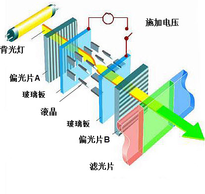
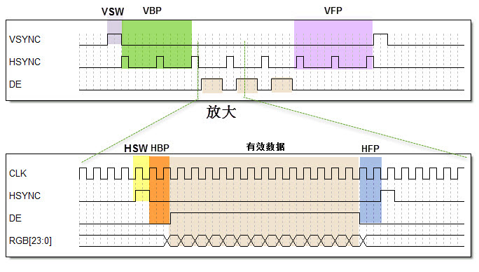
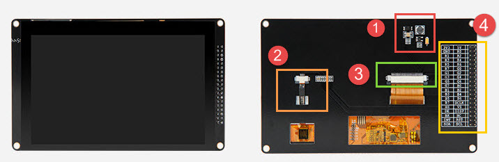
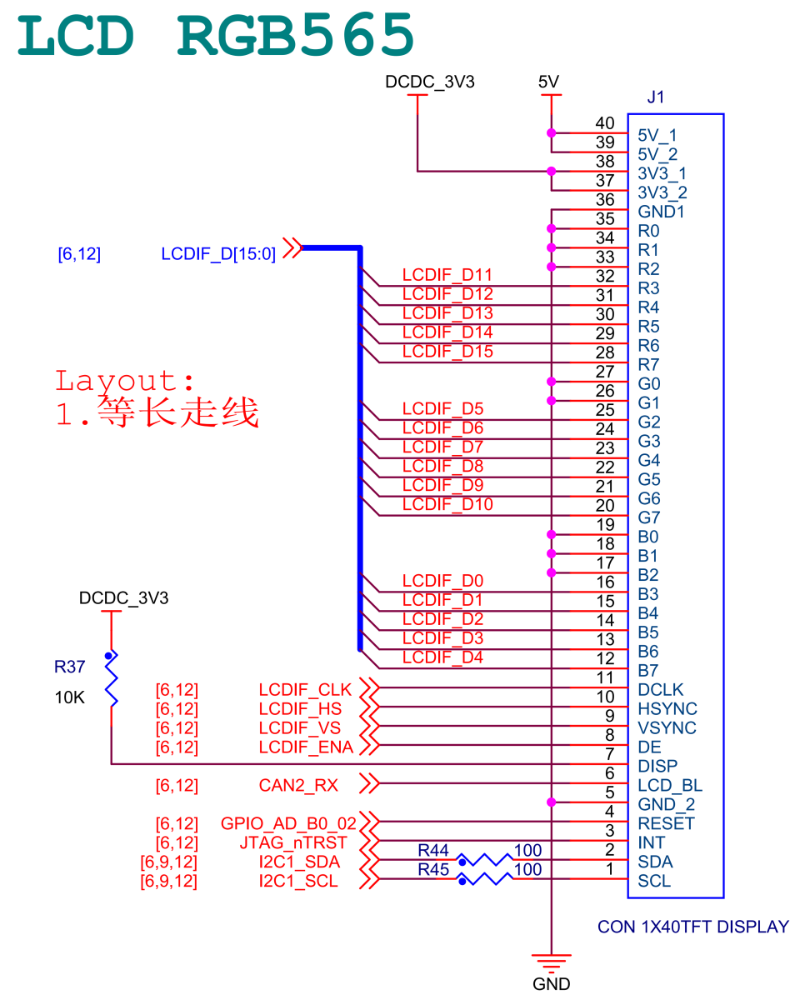

eLCDIF—液晶显示
---------------

本章参考资料：《IMXRT1050RM》（参考手册）以及库帮助文档。

关于开发板配套的液晶屏参数可查阅《5.0寸液晶屏数据手册》配套资料获知。

显示器简介
~~~~~~~~~~

显示器属于计算机的I/O设备，即输入输出设备。它是一种将特定电子信息输出到屏幕上再反射到人眼的显示工具。常见的有CRT显示器、液晶显示器、LED点阵显示器及OLED显示器。

液晶显示器
^^^^^^^^^^

液晶显示器，简称LCD(Liquid Crystal
Display)，相对于上一代CRT显示器(阴极射线管显示器)，LCD显示器具有功耗低、体积小、承载的信息量大及不伤眼的优点，因而它成为了现在的主流电子显示设备，其中包括电视、电脑显示器、手机屏幕及各种嵌入式设备的显示器。图
24‑1是液晶电视与CRT电视的外观对比，很明显液晶电视更薄，“时尚”是液晶电视给人的第一印象，而CRT
电视则感觉很“笨重”。

.. image:: media/image1.jpeg
   :align: center
   :alt: image1
   :name: 图24_1

图 24‑1 液晶电视及CRT电视

液晶是一种介于固体和液体之间的特殊物质，它是一种有机化合物，常态下呈液态，但是它的分子排列却和固体晶体一样非常规则，因此取名液晶。如果给液晶施加电场，会改变它的分子排列，从而改变光线的传播方向，配合偏振光片，它就具有控制光线透过率的作用，再配合彩色滤光片，改变加给液晶电压大小，就能改变某一颜色透光量的多少，图
24‑2中的就是绿色显示结构。利用这种原理，做出可控红、绿、蓝光输出强度的显示结构，把三种显示结构组成一个显示单位，通过控制红绿蓝的强度，可以使该单位混合输出不同的色彩，这样的一个显示单位被称为像素。

图 24‑2 液晶屏的绿色显示结构

注意液晶本身是不发光的，所以需要有一个背光灯提供光源，光线经过一系列处理过程才到输出，所以输出的光线强度是要比光源的强度低很多的，比较浪费能源(当然，比CRT显示器还是节能多了)。而且这些处理过程会导致显示方向比较窄，也就是它的视角较小，从侧面看屏幕会看不清它的显示内容。另外，输出的色彩变换时，液晶分子转动也需要消耗一定的时间，导致屏幕的响应速度低。

LED和OLED显示器
^^^^^^^^^^^^^^^

LED点阵显示器不存在以上液晶显示器的问题，LED点阵彩色显示器的单个像素点内包含红绿蓝三色LED灯，显示原理类似我们实验板上的LED彩灯，通过控制红绿蓝颜色的强度进行混色，实现全彩颜色输出，多个像素点构成一个屏幕。由于每个像素点都是LED灯自发光的，所以在户外白天也显示得非常清晰，但由于LED灯体积较大，导致屏幕的像素密度低，所以它一般只适合用于广场上的巨型显示器。相对来说，单色的LED点阵显示器应用得更广泛，如公交车上的信息展示牌、店招等，见图
24‑3。

.. image:: media/image3.jpeg
   :align: center
   :alt: image3
   :name: 图24_3

图 24‑3 LED点阵彩屏有LED单色显示屏

新一代的OLED显示器与LED点阵彩色显示器的原理类似，但由于它采用的像素单元是“有机发光二极管”(Organic
Light Emitting Diode)，所以像素密度比普通LED点阵显示器高得多，见图
24‑5。

.. image:: media/image4.jpeg
   :align: center
   :alt: image4
   :name: 图24_4

图 24‑4 OLED像素结构

OLED显示器不需要背光源、对比度高、轻薄、视角广及响应速度快等优点。待到生产工艺更加成熟时，必将取代现在液晶显示器的地位，见图
24‑5。

.. image:: media/image5.jpeg
   :align: center
   :alt: image5
   :name: 图24_5

图 24‑5 采用OLED屏幕的电视及智能手表

显示器的基本参数
^^^^^^^^^^^^^^^^

不管是哪一种显示器，都有同样的基本参数用于描述它们的特性，各个参数介绍如下：

-  像素

    像素是组成图像的最基本单元要素，显示器的像素是指它成像最小的点，即前面讲解液晶原理中提到的一个显示单元。

-  分辨率

    一些嵌入式设备的显示器常常以“行像素值x列像素值”表示屏幕的分辨率。如分辨率800x480表示该显示器的每一行有800个像素点，每一列有480个像素点，也可理解为有800列，480行。

-  色彩深度

    色彩深度指显示器的每个像素点能表示多少种颜色，一般用“位”(bit)来表示。如单色屏的每个像素点能表示亮或灭两种状态(即实际上能显示2种颜色)，用1个数据位就可以表示像素点的所有状态，所以它的色彩深度为1bit，其它常见的显示屏色深为16bit、24bit。

-  显示器尺寸

    显示器的大小一般以英寸表示，如5英寸、21英寸、24英寸等，这个长度是指屏幕对角线的长度，
    通过显示器的对角线长度及长宽比可确定显示器的实际长宽尺寸。

-  点距

    点距指两个相邻像素点之间的距离，它会影响画质的细腻度及观看距离，相同尺寸的屏幕，若分辨率越高，则点距越小，画质越细腻。如现在有些手机的屏幕分辨率比电脑显示器的还大，这是手机屏幕点距小的原因；LED点阵显示屏的点距一般都比较大，所以适合远距离观看。

液晶控制原理
~~~~~~~~~~~~

    图
    24‑6是两种适合于MCU使用的显示屏，如STM32和RT1052都可以控制这样的显示屏，我们以它为例讲解控制液晶屏的原理。

.. image:: media/image6.jpeg
   :align: center
   :alt: image6
   :name: 图24_6

图 24‑6适合MCU控制的显示屏实物图

这个完整的显示屏由液晶显示面板、电容触摸面板以及PCB底板构成。图中的触摸面板带有触摸控制芯片，该芯片处理触摸信号并通过引出的信号线与外部器件通讯面板中间是透明的，它贴在液晶面板上面，一起构成屏幕的主体，触摸面板与液晶面板引出的排线连接到PCB底板上，根据实际需要，PCB底板上可能会带有“液晶控制器芯片”。

因为控制液晶面板需要比较多的资源，所以大部分低级微控制器都不能直接控制液晶面板，需要额外配套一个专用液晶控制器来处理显示过程，外部微控制器只要把它希望显示的数据直接交给液晶控制器即可。例如STM32F103\407系列的微控制器不带液晶控制器功能，所以必须要有额外液晶控制器芯片进行处理。

而不带液晶控制器的PCB底板
，只有小部分的电源管理电路，液晶面板的信号线与外部微控制器相连，直接控制。RT1052、STM32F429系列的芯片不需要额外的液晶控制器，也就是说它把专用液晶控制器的功能集成到RT1052、STM32F429芯片内部了，节约了额外的控制器成本。

液晶面板的控制信号
^^^^^^^^^^^^^^^^^^

本章我们主要讲解不带控制器的液晶面板，液晶面板的控制信号线见表格 24‑1。

表格 24‑1液晶面板的信号线

+----------+------------------+
| 信号名称 | 说明             |
+==========+==================+
| R[7:0]   | 红色数据         |
+----------+------------------+
| G[7:0]   | 绿色数据         |
+----------+------------------+
| B[7:0]   | 蓝色数据         |
+----------+------------------+
| CLK      | 像素同步时钟信号 |
+----------+------------------+
| HSYNC    | 水平同步信号     |
+----------+------------------+
| VSYNC    | 垂直同步信号     |
+----------+------------------+
| DE       | 数据使能信号     |
+----------+------------------+

(1) RGB信号线

..

    RGB信号线各有8根，分别用于表示液晶屏一个像素点的红、绿、蓝颜色分量。使用红绿蓝颜色分量来表示颜色是一种通用的做法，打开Windows系统自带的画板调色工具，可看到颜色的红绿蓝分量值，见图
    24‑7。常见的颜色表示会在“RGB”后面附带各个颜色分量值的数据位数，如RGB565表示红绿蓝的数据线数分别为5、6、5根，一共为16个数据位，可表示2\ :sup:`16`\ 种颜色；而这个液晶屏的种颜色分量的数据线都有8根，所以它支持RGB888格式，一共24位数据线，可表示的颜色为2\ :sup:`24`\ 种。

.. image:: media/image7.png
   :align: center
   :alt: image7
   :name: 图24_7

图 24‑7 颜色表示法

(1) 同步时钟信号CLK

..

    液晶屏与外部使用同步通讯方式，以CLK信号作为同步时钟，在同步时钟的驱动下，每个时钟传输一个像素点数据。

(1) 水平同步信号HSYNC

..

    水平同步信号HSYNC(Horizontal
    Sync)用于表示液晶屏一行像素数据的传输结束，每传输完成液晶屏的一行像素数据时，HSYNC会发生电平跳变，如分辨率为800x480的显示屏(800列，480行)，传输一帧的图像HSYNC的电平会跳变480次。

(1) 垂直同步信号VSYNC

..

    垂直同步信号VSYNC(Vertical
    Sync)用于表示液晶屏一帧像素数据的传输结束，每传输完成一帧像素数据时，VSYNC会发生电平跳变。其中“帧”是图像的单位，一幅图像称为一帧，在液晶屏中，一帧指一个完整屏液晶像素点。人们常常用“帧/秒”来表示液晶屏的刷新特性，即液晶屏每秒可以显示多少帧图像，如液晶屏以60帧/秒的速率运行时，VSYNC每秒钟电平会跳变60次。

(1) 数据使能信号DE

..

    数据使能信号DE(Data
    Enable)用于表示数据的有效性，当DE信号线为高电平时，RGB信号线表示的数据有效。

液晶数据传输时序
^^^^^^^^^^^^^^^^

通过上述信号线向液晶屏传输像素数据时，各信号线的时序见图
24‑8。图中表示的是向液晶屏传输一帧图像数据的时序，中间省略了多行及多个像素点。

图 24‑8 液晶时序图

液晶屏显示的图像可看作一个矩形，结合图
24‑9来理解。液晶屏有一个显示指针，它指向将要显示的像素。显示指针的扫描方向方向从左到右、从上到下，一个像素点一个像素点地描绘图形。这些像素点的数据通过RGB数据线传输至液晶屏，它们在同步时钟CLK的驱动下一个一个地传输到液晶屏中，交给显示指针，传输完成一行时，水平同步信号HSYNC电平跳变一次，而传输完一帧时VSYNC电平跳变一次。

.. image:: media/image9.jpeg
   :align: center
   :alt: image9
   :name: 图24_9

图 24‑9 液晶数据传输图解

但是，液晶显示指针在行与行之间，帧与帧之间切换时需要延时，而且HSYNC及VSYNC信号本身也有宽度，这些时间参数说明见表格
24‑2。

表格 24‑2 液晶通讯中的时间参数

+------------------------------+---------------------------------------------------------------+
|           时间参数           |                           参数说明                            |
+==============================+===============================================================+
| VBP (vertical back porch)    | 表示在一帧图像开始时，垂直同步信号以后的无效的行数            |
+------------------------------+---------------------------------------------------------------+
| VFP (vertical front porch)   | 表示在一帧图像结束后，垂直同步信号以前的无效的行数            |
+------------------------------+---------------------------------------------------------------+
| HBP (horizontal back porch)  | 表示从水平同步信号开始到一行的有效数据开始之间的CLK的个数     |
+------------------------------+---------------------------------------------------------------+
| HFP (horizontal front porth) | 表示一行的有效数据结束到下一个水平同步信号开始之间的CLK的个数 |
+------------------------------+---------------------------------------------------------------+
| VSW (vertical sync width)    | 表示垂直同步信号的宽度，单位为行                              |
+------------------------------+---------------------------------------------------------------+
| HSW (horizontal sync width)  | 表示水平同步信号的宽度，单位为同步时钟CLK的个数               |
+------------------------------+---------------------------------------------------------------+

在这些时间参数控制的区域，数据使能信号线“DE”都为低电平，RGB数据线的信号无效，当“DE”为高电平时，RGB数据线表示的数据有效，这时传输的数据会直接影响液晶屏的显示区域。

显存
^^^^

液晶屏中的每个像素点都是数据，在实际应用中需要把每个像素点的数据缓存起来，再传输给液晶屏，这种存储显示数据的存储器被称为显存。显存一般至少要能存储液晶屏的一帧显示数据，如分辨率为800x480的液晶屏，使用RGB888格式显示，它的一帧显示数据大小为：3x800x480=1152000字节；若使用RGB565格式显示，一帧显示数据大小为：2x800x480=768000字节。

eLCDIF液晶控制器简介
~~~~~~~~~~~~~~~~~~~~

RT1052系列芯片内部自带一个增强型液晶接口外设eLCDIF（Enhanced LCD
Interface），配合使用内部SRAM或外部的SDRAM作为显存，可直接控制液晶面板，无需额外增加液晶控制器芯片。RT1052的eLCDIF液晶控制器最高支持1366x768分辨率的屏幕；可支持多种颜色格式，包括RGB888、RGB565、ARGB8888等(其中的“A”是指透明像素)。还可配合像素渲染流水线PXP（Pixel
Pipeline）进行复杂的图像处理，如格式转换、缩放、翻转以及图层混合等操作，使RT1052有非常出色的图形显示性能。

eLCDIF结构框图剖析
~~~~~~~~~~~~~~~~~~

图
24‑10是eLCDIF控制器的结构框图，它主要包含信号线、配置寄存器、缓冲区、查找表以及与系统总线、控制总线的关系。

图 24‑10 eLCDIF控制器框图（摘自《IMXRT1050RM》）

通讯引脚
^^^^^^^^^^

图
24‑10的标号处表示eLCDIF的通讯引脚，eLCDIF的通讯引脚与液晶显示面板控制信号一一对应，包含有HSYNC、VSYNC、DE、CLK以及RGB数据线各8根。设计硬件时把液晶面板与RT1052对应的这些引脚连接起来即可，查阅IMXRT1050RM》（参考手册）可获知eLCDIF信号线对应的引脚，具体见表格
24‑3。

表格 24‑3 eLCDIF引脚表

+----------------+------------+----------------+------------+
| eLCDIF外设信号 | 引脚号     | eLCDIF外设信号 | 引脚号     |
+================+============+================+============+
| LCD_CLK        | GPIO_B0_00 | LCD_DATA10     | GPIO_B0_14 |
+----------------+------------+----------------+------------+
| LCD_ENABLE     | GPIO_B0_01 | LCD_DATA11     | GPIO_B0_15 |
+----------------+------------+----------------+------------+
| LCD_HSYNC      | GPIO_B0_02 | LCD_DATA12     | GPIO_B1_00 |
+----------------+------------+----------------+------------+
| LCD_VSYNC      | GPIO_B0_03 | LCD_DATA13     | GPIO_B1_01 |
+----------------+------------+----------------+------------+
| LCD_DATA00     | GPIO_B0_04 | LCD_DATA14     | GPIO_B1_02 |
+----------------+------------+----------------+------------+
| LCD_DATA01     | GPIO_B0_05 | LCD_DATA15     | GPIO_B1_03 |
+----------------+------------+----------------+------------+
| LCD_DATA02     | GPIO_B0_06 | LCD_DATA16     | GPIO_B1_04 |
+----------------+------------+----------------+------------+
| LCD_DATA03     | GPIO_B0_07 | LCD_DATA17     | GPIO_B1_05 |
+----------------+------------+----------------+------------+
| LCD_DATA04     | GPIO_B0_08 | LCD_DATA18     | GPIO_B1_06 |
+----------------+------------+----------------+------------+
| LCD_DATA05     | GPIO_B0_09 | LCD_DATA19     | GPIO_B1_07 |
+----------------+------------+----------------+------------+
| LCD_DATA06     | GPIO_B0_10 | LCD_DATA20     | GPIO_B1_08 |
+----------------+------------+----------------+------------+
| LCD_DATA07     | GPIO_B0_11 | LCD_DATA21     | GPIO_B1_09 |
+----------------+------------+----------------+------------+
| LCD_DATA08     | GPIO_B0_12 | LCD_DATA22     | GPIO_B1_10 |
+----------------+------------+----------------+------------+
| LCD_DATA09     | GPIO_B0_13 | LCD_DATA23     | GPIO_B1_11 |
+----------------+------------+----------------+------------+

面板接口生成器（Panel Interface Generator）
^^^^^^^^^^^^^^^^^^^^^^^^^^^^^^^^^^^^^^^^^^^^^^^

图 24‑10的标号处表示eLCDIF的面板接口生成器（Panel Interface
Generator），eLCDIF外设提供了一个面板接口生成器的功能，也称为Pigeon
Mode模式。使用该模式时，可以通过每个eLCDIF信号线独有的计数器进行控制，计数器的起始条件和递增条件可以自由定制，从而可以使各个信号线实现延迟、翻转等功能，使得液晶控制接口有非常高的自由度，能适应非主流的接口协议。不过可能也正因为应用场景比较少，在NXP目前提供的软件库中甚至没有提供与该功能相关的函数接口，要使用的话需要自己细致地研究寄存器配置。

颜色查找表LUT
^^^^^^^^^^^^^^^^^^^

图 24‑10的标号处表示eLCDIF的表示颜色查找表LUT(Lookup
Table)，颜色查找表是一种间接的颜色表示方式，在eLCDIF外设中LUT表是个256x24位的空间，共有2个LUT表，在每个表的空间中可以缓存256种24位的颜色，颜色的格式是RGB888。具体见图
24‑11，利用颜色查找表显示，实际的图像只能使用这256种颜色，而图像的每个像素点使用8位的数据来表示，该数据并不是直接的RGB颜色数据，而是指向颜色查找表的地址偏移，即表示这个像素点应该显示颜色查找表中的哪一种颜色。

颜色查找表显示技术也称为调色板技术，在图像大小不变的情况下，利用颜色查找表可以扩展颜色显示的能力，如只需要8位的数据宽度，对应的却是24位宽的色彩深度，不过其颜色种类被限制在256种。在一些对色彩种类要求不高的场合，它巧妙地解决了数据宽度与颜色深度之间的矛盾。

图 24‑11 使用颜色查找表显示图像的过程

液晶接口（LCD Interface）
^^^^^^^^^^^^^^^^^^^^^^^^^^^^^^^^

图 24‑10的标号处表示eLCDIF的液晶接口（LCD
Interface），它是eLCDIF外设的主要功能部件，受控制总线（Control
Bus）的寄存器控制，从系统总线（System
Bus）获得输入像素数据，经过一系列转换后通过eLCDIF的通讯引脚发送至外接的液晶面板。

其中控制总线的寄存器可以配置显存地址、输入像素数据的格式、输出的数据信号线宽度、各个控制信号的有效极性以及控制时序中的VSW、VBP等参数，还能配置使用DMA传输。

使用寄存器初始化好eLCDIF的后，它会从“LFIFO”和“TXFIFO”中获取数据进行转换处理（格式转换、移位等操作）并传输出去。当FIFO中的数据量低于一定程度时，它会向系统总线（System
Bus）发起请求，系统总线会把显存地址的数据搬运至FIFO中。FIFO还可以配置阈值，低于该阈值时系统总线会提高获取数据的优先级。

eLCDIF正常运行后，数据从显存到液晶屏全程不需要内核的干预，程序控制时我们只要把像素数据写入到显存即可。

驱动时钟
^^^^^^^^^^^^^^^^^^^^^^^^^^^^^^^^

图 24‑10中包含两个时钟信号，分别是BUS CLOCK（apb_clk）和DISPLAY
CLOCK（pix_clk）。

BUS CLOCK（apb_clk）
''''''''''''''''''''''''''''''''''

这个BUS
CLOCK（apb_clk）就是指eLCDIF外设的根时钟LCDIF_CLK_ROOT，它给eLCDIF提供驱动的时钟源，在时钟树中的结构具体见图
24‑12。

图 24‑12 LCDIF_CLK_ROOT时钟来源（摘自《IMXRT1050RM》）

LCDIF_CLK_ROOT根时钟可以选择多种输入时钟源，首先是时钟源预选择器（Pre-multiplexer）支持使用如下时钟：

-  PLL2：System PLL，该时钟频率通常为528MHz。

-  PLL2 PFD0：该时钟常规配置为352MHz。

-  PLL2 PFD1：该时钟常规配置为594MHz。

-  PLL3 PFD3：该时钟常规配置为454.74MHz。

-  PLL3 PFD1：该时钟常规配置为664.62MHz。

-  PLL5：Video PLL，该时钟常规配置为649.52MHz。

预选择器得到的时钟，可根据需要进行分频配置，分频后输入到时钟源选择器（multiplexer）作为LCDIF_CLK_ROOT默认的时钟源，除此之外，图中的时钟的选择器还包含其它可选的输入时钟：ipp_di0_clk、ipp_di1_clk、ldb_di0_clk、ldb_di1_clk，不过关于这些时钟在参考手册中并没有介绍，而且在寄存器中并没有这些时钟源的分频、选择的配置，也许该选择器是兼容其它设备而保留的内容，所以使用时我们直接选择预选择器得到的时钟作为LCDIF_CLK_ROOT的输入时钟源即可。

DISPLAY CLOCK（pix_clk）
''''''''''''''''''''''''''''''''''

这个DISPLAY
CLOCK（pix_clk）是指eLCDIF与液晶面板接口的像素时钟LCDIF_pix_clk，它的时钟频率与根时钟LCDIF_CLK_ROOT一致，不过它们的时钟开关是分开的，其中LCDIF_CLK_ROOT使用寄存器位CCM_CCGR2[CG14]控制，而LCDIF_pix_clk使用寄存器位CCM_CCGR3[CG5]控制。

eLCDIF初始化结构体
~~~~~~~~~~~~~~~~~~

控制eLCDIF涉及到非常多的寄存器，利用eLCDIF初始化结构体可以减轻开发和维护的工作量，eLCDIF初始化结构体见代码清单
22‑1。

.. code-block:: c
   :name: 代码清单 24‑1 eLCDIF初始化结构体elcdif_rgb_mode_config_t（fsl_elcdif.h文件）
   :caption: 代码清单 24‑1 eLCDIF初始化结构体elcdif_rgb_mode_config_t（fsl_elcdif.h文件）
   :linenos:

    /*!
    * @brief eLCDIF RGB模式的配置结构体（DOTCLK mode）
    */
    typedef struct _elcdif_rgb_mode_config {
        /*!< 液晶面板宽度,即一行有多少个像素点 */
        uint16_t panelWidth;
        /*!< 液晶面板高度,即一共有多少行 */
        uint16_t panelHeight;
        /*!< HSYNC 宽度 */
        uint8_t hsw;
        /*!< HSYNC前的无效像素 */
        uint8_t hfp;
        /*!< HSYNC后的无效像素 */
        uint8_t hbp;
        /*!< VSYNC宽度 */
        uint8_t vsw;
        /*!< VSYNC前的无效行数 */
        uint8_t vfp;
        /*!< VSYNC后的无效行数 */
        uint8_t vbp;
        /*!< 使用或操作赋值为枚举变量类型 @ref _elcdif_polarity_flags的组合,
        用于配置信号的有效极性 */
        uint32_t polarityFlags;
        /*!< 显存基地址 */
        uint32_t bufferAddr;
        /*!< 像素格式配置 */
        elcdif_pixel_format_t pixelFormat;
        /*!< LCD 数据总线配置 */
        elcdif_lcd_data_bus_t dataBus;
    } elcdif_rgb_mode_config_t;

这个结构体大部分成员都是用于定义eLCDIF的时序参数的，包括信号有效电平及各种时间参数的宽度，配合《24.2.2
液晶数据传输时序》小节中的说明更易理解，其结构体成员介绍如下：

-  panelWidth和panelHeight

    寄存器LCDIF_TRANSFER_COUNT，它们用于配置要控制的液晶面板的分辨率，分别指定宽和高，即每行有多少个像素点、一共有多少行。

-  hsw、hfp和hbp

    寄存器LCDIF_VDCTRL2、LCDIF_VDCTRL3，它们分别用于配置HSYNC信号的宽度、HSYNC前的无效像素以及HSYNC后的无效像素，单位都是像素时钟。

-  vsw、vfp和vbp

    寄存器LCDIF_VDCTRL2、LCDIF_VDCTRL3，它们分别用于配置VSYNC信号的宽度、VSYNC前的无效行数以及VSYNC后的无效行数，它们的单位均为行数。

-  polarityFlags

    寄存器LCDIF_VDCTRL0，本成员用于设置各个信号的极性，对这个结构体成员赋值时可使用枚举类型_elcdif_polarity_flags，该类型的定义具体见代码清单
    24‑2。

.. code-block:: c
   :name: 代码清单 24‑2 eLCDIF信号极性标志枚举类型（MIMXRT1052.h及fsl_elcdif.h文件）
   :caption: 代码清单 24‑2 eLCDIF信号极性标志枚举类型（MIMXRT1052.h及fsl_elcdif.h文件）
   :linenos:

    /* MIMXRT1052.h文件中的定义 */
    #define LCDIF_VDCTRL0_VSYNC_POL_MASK             (0x8000000U)
    #define LCDIF_VDCTRL0_HSYNC_POL_MASK             (0x4000000U)
    #define LCDIF_VDCTRL0_ENABLE_POL_MASK            (0x1000000U)
    #define LCDIF_VDCTRL0_DOTCLK_POL_MASK            (0x2000000U)

    /* fsl_elcdif.h文件中的定义 */
    /*!
    * @brief eLCDIF 信号极性标志
    */
    enum _elcdif_polarity_flags {
        /*!< VSYNC低电平有效 */
        kELCDIF_VsyncActiveLow = 0U,
        /*!< VSYNC高电平有效 */
        kELCDIF_VsyncActiveHigh = LCDIF_VDCTRL0_VSYNC_POL_MASK,
        /*!< HSYNC低电平有效 */
        kELCDIF_HsyncActiveLow = 0U,
        /*!< HSYNC高电平有效 */
        kELCDIF_HsyncActiveHigh = LCDIF_VDCTRL0_HSYNC_POL_MASK,
        /*!< 数据使能信号低电平有效  */
        kELCDIF_DataEnableActiveLow = 0U,
        /*!< 数据使能信号高电平有效 */
        kELCDIF_DataEnableActiveHigh = LCDIF_VDCTRL0_ENABLE_POL_MASK,
        /*!<在时钟的下降沿产生数据, 在时钟的上升沿采集 */
        kELCDIF_DriveDataOnFallingClkEdge = 0U,
        /*!<在时钟的上升沿产生数据, 在时钟的下降沿采集 */
        kELCDIF_DriveDataOnRisingClkEdge = LCDIF_VDCTRL0_DOTCLK_POL_MASK,
    };

可以看到，该枚举变量包含了VSYNC、HSYNC、ENABLE有效极性以及数据信号采样时刻的定义，枚举值中的宏“LCDIF_VDCTRL0_xxxx_POL_MASK”是相应信号配置在LCDIF_VDCTRL0寄存器中对应的掩码位。

对这个结构体成员polarityFlags赋值时要使用“|”操作把不同信号的配置组合起来，例如：

.. code-block::

    kELCDIF_DataEnableActiveHigh | kELCDIF_VsyncActiveLow |
    kELCDIF_HsyncActiveLow | kELCDIF_DriveDataOnRisingClkEdge

以上配置把ENABLE配置为高电平有效，VSYNC和HSYNC配置为低电平有效，而数据信号的采样时刻为下降沿。初始化库函数ELCDIF_RgbModeInit会根据polarityFlags中的枚举值给LCDIF_VDCTRL0寄存器对应的位进行配置。

-  bufferAddr

    寄存器LCDIF_CUR_BUF和LCDIF_NEXT_BUF，本成员值用于配置显存的基地址，eLCDIF外设会从该地址中搬运数据到液晶面板，显存的位置可根据需要定义到内部SRAM或扩展的SDRAM空间中，该地址要求8字节对齐（double-word
    aligned）。eLCDIF中的寄存器LCDIF_CUR_BUF指向当前要显示的显存位置，而LCDIF_NEXT_BUF指向下一帧要显示的存位置，经过初始化库函数ELCDIF_RgbModeInit配置后，两个寄存器都指向这个bufferAddr成员。

-  elcdif_pixel_format_t

    寄存器位LCDIF_CTRL[WORD_LENGTH]、LCDIF_CTRL[DATA_FORMAT_16/18/24_BIT]、LCDIF_CTRL1[BYTE_PACKING_FORMAT]，本成员用于配置eLCDIF的输入源像素数据格式，它是一个_elcdif_pixel_format枚举类型变量，它在库文件中是与数组s_pixelFormatReg配合使用的，数组s_pixelFormatReg包含了不同枚举值在以上对应寄存器的配置，具体见代码清单
    24‑3。

.. code-block:: c
   :name: 代码清单 24‑3 枚举类型_elcdif_pixel_format（fsl_elcdif.h文件）
   :caption: 代码清单 24‑3 枚举类型_elcdif_pixel_format（fsl_elcdif.h文件）
   :linenos:

    /*!
    * @brief 像素格式
    * 这个枚举变量是与数组s_pixelFormatReg一起使用的
    * 要支持其它像素格式，需要同时增加到这个枚举变量与s_pixelFormatReg
    */
    typedef enum _elcdif_pixel_format {
        /*!< 纯8位格式, 4个数据占32位 */
        kELCDIF_PixelFormatRAW8 = 0,
        /*!< RGB565, 2个像素点占32位 */
        kELCDIF_PixelFormatRGB565 = 1,
        /*!< RGB666 非压缩格式, 一个像素点占32位, 最高字节没有使用
            低3字节中，每个字节的最高2位没有使用，
            本格式中使用1个字节表示1种颜色，但每种格式只有6位是有效的 */
        kELCDIF_PixelFormatRGB666 = 2,
        /*!< XRGB8888 非压缩格式, 1个像素点占32位, 最高字节没有使用 */
        kELCDIF_PixelFormatXRGB8888 = 3,
        /*!< RGB888 压缩格式, 1个像素点占24位 */
        kELCDIF_PixelFormatRGB888 = 4,
    } elcdif_pixel_format_t;

该枚举类型支持多个格式，这些格式主要区别是像素点的有效位数以及是否压缩，正是这两方面影响了相应的寄存器配置。存在这样的差异主要是因为32位机计量单位中的1个字是32位，存储不同像素格式时方式不同。以上各个枚举类型表示的格式说明如下：

1) kELCDIF_PixelFormatRAW8，8位的像素格式，1个字中可包含4个像素点；

2) kELCDIF_PixelFormatRGB565，最常用的16位像素格式，1个字中可包含2个像素点；

3) kELCDIF_PixelFormatRGB666，非压缩的18位像素格式，在数据定义中没有24位的类型，所以它也只能用1个字存储1个像素点，而且这种格式中前3个字节里每个字节表示RGB中的一种颜色，每个字节有2个数据位是无效的，而第4个字节整个字节无效。

4) kELCDIF_PixelFormatXRGB8888，非压缩的24位像素格式，该格式的最高字节是用来存储透明度的，但由于透明度是合成前的数据，是不会传输到液晶面板的，不同层合成后最终得到纯粹的RGB数据，再由eLCDIF传输，所以此处的XRGB8888是仅包含RGB888的24位纯数据，由于不压缩，所以它也需要使用1个字来存储。

5) kELCDIF_PixelFormatRGB888，压缩的24位像素格式，如果像前面的不压缩数据，那么它也是要使用1个字存储1个像素点的，这种情况下3个字存储3个像素点（96位空间，16位无效），但压缩后，像素点数据跨字存储，可以使用3个字存储4个像素点（96位空间，全有效），使用这种方式可以节省存储空间。

    实际上还可支持其它格式，可以在这个定义的基础上增加，增加的时候要注意配合数组数组s_pixelFormatReg进行寄存器配置。

-  dataBus

    寄存器LCDIF_CTRL[LCD_DATABUS_WIDTH]，本成员用于配置eLCDIF要使用的数据信号线宽度，它是一个elcdif_lcd_data_bus_t枚举类型，具体定义见代码清单
    24‑4。

.. code-block:: c
   :name: 代码清单 24‑4 elcdif_lcd_data_bus_t枚举类型（fsl_elcdif.h文件）
   :caption: 代码清单 24‑4 elcdif_lcd_data_bus_t枚举类型（fsl_elcdif.h文件）
   :linenos:

    /*! @brief LCD数据总线类型  */
    typedef enum _elcdif_lcd_data_bus {
        /*!< 8-bit 数据总线 */
        kELCDIF_DataBus8Bit = LCDIF_CTRL_LCD_DATABUS_WIDTH(1),
        /*!< 16-bit 数据总线，支持 RGB565. */
        kELCDIF_DataBus16Bit = LCDIF_CTRL_LCD_DATABUS_WIDTH(0),
        /*!< 18-bit 数据总线，支持 RGB666. */
        kELCDIF_DataBus18Bit = LCDIF_CTRL_LCD_DATABUS_WIDTH(2),
        /*!< 24-bit 据总线，支持  RGB888. */
        kELCDIF_DataBus24Bit = LCDIF_CTRL_LCD_DATABUS_WIDTH(3),
    } elcdif_lcd_data_bus_t;

在这个定义中每个枚举值都被赋值为寄存器位相应的配置值，eLCDIF外设支持使用8/16/18/24位的液晶数据信号线。

对整个elcdif_rgb_mode_config_t结构体赋值后，调用库函数ELCDIF_RgbModeInit即可把eLCDIF初始化为RGB模式。该库函数内部包含了使能eLCDIF根时钟（LCDIF_CLK_ROOT）以及输出像素时钟（LCDIF_pix_clk）的配置。

eLCDIF—液晶显示实验
~~~~~~~~~~~~~~~~~~~

本小节讲解如何使用eLCDIF外设控制型号为“STD800480”的5寸液晶屏，见图
24‑13，该液晶屏的分辨率为800x480，支持RGB888格式，不过由于RT1052部分液晶信号数据线与以太网的共用，所以在硬件上本开发板采用了RGB565的连接方式控制液晶屏。

学习本小节内容时，请打开配套的“eLCDIF—液晶显示英文”工程配合阅读。

本教程同样适用于配套的7寸屏，它的分辨率和时序参数与5寸屏相同，驱动程序完全一样。

硬件设计
^^^^^^^^

图 24‑13 液晶屏实物图

图 24‑13液晶屏背面的PCB电路对应图 24‑14、图 24‑15、图 24‑16、图
24‑18中的原理图，分别是升压电路、触摸屏接口、液晶屏接口及排针接口。升压电路把输入的5V电源升压为20V，输出到液晶屏的背光灯中；触摸屏及液晶屏接口通过FPC插座把两个屏的排线连接到PCB电路板上，这些FPC插座与信号引出到屏幕右侧的排针处，方便整个屏幕与外部器件相连。

图 24‑14升压电路原理图，摘自《LCD5.0-黑白原理图》

升压电路中的BK引脚可外接PWM信号，控制液晶屏的背光强度，BK为高电平时输出电压。

.. image:: media/image15.jpeg
   :align: center
   :alt: image15
   :name: 图24_15

图 24‑15 电容屏接口，摘自《LCD5.0-黑白原理图》

电容触摸屏使用I2C通讯，它的排线接口包含了I2C的通讯引脚SCL、SDA，还包含控制触摸屏芯片复位的RSTN信号以及触摸中断信号INT。

.. image:: media/image16.jpeg
   :align: center
   :alt: image16
   :name: 图24_16

图 24‑16 液晶屏接口，摘自《LCD5.0-黑白原理图》

关于这部分液晶屏的排线接口说明见图 24‑17。

.. image:: media/image17.jpeg
   :align: center
   :alt: image17
   :name: 图24_17

图 24‑17 液晶排线接口，摘自《LCD5.0-黑白原理图》

.. image:: media/image18.jpeg
   :align: center
   :alt: image18
   :name: 图24_18

图 24‑18排针接口，摘自《LCD5.0-黑白原理图》

以上是我们RT1052开发板使用的5寸屏原理图，它通过屏幕上的排针或FPC接口连接到开发板的液晶排母或FPC接口，与RT1052芯片的引脚相连，连接关系见图
24‑19。

图 24‑19核心板上的FPC接口，摘自《野火i.MX RT1052核心板原理图》

以上原理图可查阅《LCD5.0-黑白原理图》及《野火i.MX
RT1052核心板原理图》文档获知，若你使用的液晶屏或实验板不一样，请根据实际连接的引脚修改程序。

软件设计
^^^^^^^^

为了使工程更加有条理，我们把LCD控制相关的代码独立分开存储，方便以后移植。在“SEMC—扩展外部SDRAM”工程的基础上新建“bsp_lcd.c”及“bsp_lcd.h”文件，这些文件也可根据您的喜好命名，它们不属于RT1052标准库的内容，是由我们自己根据应用需要编写的。

编程要点
''''''''

(1) 配置eLCDIF外设要使用的引脚的MUX复用模式及PAD属性；

(2) 配置eLCDIF外设的时钟来源、分频得到eLCDIF根时钟（LCDIF_CLK_ROOT）；

(3) 定义显存空间；

(4) 根据液晶屏的参数配置eLCDIF外设的通讯时序及工作模式；

(5) 编写测试程序，控制液晶输出。

代码分析
''''''''

本教程中配套的工程代码兼容16/24位数据信号线及RGB565/XRGB8888/RGB888的像素格式，不过由于以太网接口共用数据线的原因，本开发板设计仅支持使用16位数据线驱动液晶屏，因此即使像素点使用XRGB8888/RGB888格式也无法提高显示效果，eLCDIF外设在输出时会直接把24位的像素数据转换成16位的数据输出。本教程仅针对工程中16位数据信号线以及RGB565像素格式相关的代码进行讲解，代码中与格式兼容相关的宏直接忽略。

液晶控制相关的宏定义
**********************************

本程序把液晶控制相关的宏定义放在了bsp_lcd.h头文件，具体见代码清单
22‑12。

.. code-block:: c
   :name: 代码清单 24‑5 液晶控制相关的宏定义（bsp_lcd.h文件）
   :caption: 代码清单 24‑5 液晶控制相关的宏定义（bsp_lcd.h文件）
   :linenos:

    /* LCD背光引脚，高电平点亮 */
    #define LCD_BL_GPIO               GPIO1
    #define LCD_BL_GPIO_PIN           (15U)
    #define LCD_BL_IOMUXC             IOMUXC_GPIO_AD_B0_15_GPIO1_IO15
    
    /* LCD 分辨率 */
    #define LCD_PIXEL_WIDTH     800
    #define LCD_PIXEL_HEIGHT    480
    
    /* LCD时序 */
    #define LCD_HSW   1
    #define LCD_HFP   22
    #define LCD_HBP   46
    #define LCD_VSW   1
    #define LCD_VFP   22
    #define LCD_VBP   22
    #define LCD_POLARITY_FLAGS  (kELCDIF_DataEnableActiveHigh | \
                                kELCDIF_VsyncActiveLow |      \
                                kELCDIF_HsyncActiveLow |      \
                                kELCDIF_DriveDataOnRisingClkEdge)

    /* LCD数据线宽度 */
    #define LCD_DATA_BUS_WIDTH    kELCDIF_DataBus16Bit

    /* 缓冲区对齐配置, 为了提高性能, LCDIF缓冲区要64B对齐 */
    #define FRAME_BUFFER_ALIGN    64

    /* 像素点的字节数 */
    /* 使用 16-bit RGB565 格式. */
    #define LCD_BPP   2U

    /* 配置是否使用中断的标志 */
    #define LCD_INTERRUPT_DISABLE   0
    #define LCD_INTERRUPT_ENABLE    (!LCD_INTERRUPT_DISABLE)

    /* 绘制横线和垂线的标志 */
    #define LINE_DIR_HORIZONTAL       0x0
    #define LINE_DIR_VERTICAL         0x1

    /**
    * @brief  LCD color
    */
    #define LCD_COLOR_WHITE          0xFFFFFF
    #define LCD_COLOR_BLACK          0x000000
    #define LCD_COLOR_GREY           0xC0C0C0
    #define LCD_COLOR_BLUE           0x0000FF
    #define LCD_COLOR_BLUE2          0x0000A0
    #define LCD_COLOR_RED            0xFF0000
    #define LCD_COLOR_MAGENTA        0xFF00FF
    #define LCD_COLOR_GREEN          0x00FF00
    #define LCD_COLOR_CYAN           0x00FFFF
    #define LCD_COLOR_YELLOW         0xFFFF00   

由于eLCDIF时序控制相关的引脚都是固定的，因此“bsp_lcd.h”文件并没有像其它例程那样重新使用宏封装液晶时序相关的引脚，此处仅把控制液晶屏背光引脚使用宏进行定义，以便修改。

该文件中还包含了一部分液晶屏参数的定义，如分辨率、HSW、HFP等时序参数、信号有效极性、使用的数据线宽度以及一些常用颜色值，关于这些宏我们在用到的时候再进行说明。

eLCDIF引脚的IOMUX相关配置 
*************************

利用上面的宏，编写eLCDIF外设的GPIO引脚初始化函数，见代码清单 22‑14。

.. code-block:: c
   :name: 代码清单 24‑6 eLCDIF的GPIO初始化函数(bsp_lcd.c文件)
   :caption: 代码清单 24‑6 eLCDIF的GPIO初始化函数(bsp_lcd.c文件)
   :linenos:

    /* 所有引脚均使用同样的PAD配置 */
    #define LCD_PAD_CONFIG_DATA            (SRE_1_FAST_SLEW_RATE| \
                                            DSE_6_R0_6| \
                                            SPEED_3_MAX_200MHz| \
                                            ODE_0_OPEN_DRAIN_DISABLED| \
                                            PKE_1_PULL_KEEPER_ENABLED| \
                                            PUE_0_KEEPER_SELECTED| \
                                            PUS_0_100K_OHM_PULL_DOWN| \
                                            HYS_0_HYSTERESIS_DISABLED)
    /* 配置说明 : */
    /* 转换速率: 转换速率快
        驱动强度: R0/6
        带宽配置 : max(200MHz)
        开漏配置: 关闭
        拉/保持器配置: 使能
        拉/保持器选择: 保持器
        上拉/下拉选择: 100K欧姆下拉(选择了保持器此配置无效)
        滞回器配置: 禁止 */

    /**
    * @brief  初始化LCD相关IOMUXC的MUX复用配置
    * @param  无
    * @retval 无
    */
    static void LCD_IOMUXC_MUX_Config(void)
    {
        /* 所有引脚均不开启SION功能 */
        /* 时序控制信号线 */
        IOMUXC_SetPinMux(IOMUXC_GPIO_B0_00_LCD_CLK, 0U);
        IOMUXC_SetPinMux(IOMUXC_GPIO_B0_01_LCD_ENABLE, 0U);
        IOMUXC_SetPinMux(IOMUXC_GPIO_B0_02_LCD_HSYNC, 0U);
        IOMUXC_SetPinMux(IOMUXC_GPIO_B0_03_LCD_VSYNC, 0U);

        /* RGB565数据信号线 */
        IOMUXC_SetPinMux(IOMUXC_GPIO_B0_04_LCD_DATA00, 0U);
        /* ...省略其它数据信号线... */

        /* LCD_BL背光控制信号线 */
        IOMUXC_SetPinMux(LCD_BL_IOMUXC, 0U);
    }

    /**
    * @brief  初始化LCD相关IOMUXC的PAD属性配置
    * @param  无
    * @retval 无
    */
    static void LCD_IOMUXC_PAD_Config(void)
    {
        /* 所有引脚均使用同样的PAD配置 */
        /* 时序控制信号线 */
        IOMUXC_SetPinConfig(IOMUXC_GPIO_B0_00_LCD_CLK,LCD_PAD_CONFIG_DATA);
    IOMUXC_SetPinConfig(IOMUXC_GPIO_B0_01_LCD_ENABLE, LCD_PAD_CONFIG_DATA);
        IOMUXC_SetPinConfig(IOMUXC_GPIO_B0_02_LCD_HSYNC, LCD_PAD_CONFIG_DATA);
        IOMUXC_SetPinConfig(IOMUXC_GPIO_B0_03_LCD_VSYNC, LCD_PAD_CONFIG_DATA);

        /* RGB565数据信号线 */
    IOMUXC_SetPinConfig(IOMUXC_GPIO_B0_04_LCD_DATA00, LCD_PAD_CONFIG_DATA);
        /* ...省略其它数据信号线... */

        /* LCD_BL背光控制信号线 */
        IOMUXC_SetPinConfig(LCD_BL_IOMUXC, LCD_PAD_CONFIG_DATA);
    }

与所有使用到GPIO的外设一样，都要先把使用到的GPIO引脚模式初始化，以上代码把eLCDIF的信号线全都初始化为LCD复用功能，而背光引脚BL则被初始化成普通的GPIO。

背光使能
**********

本程序中把背光使能的函数也封装到独立的函数中，具体见代码清单24‑7，函数内直接通过gpio_pin_config_t结构体和库函数GPIO_PinInit直接把引脚初始化为高电平以点亮液晶屏。

.. code-block:: c
   :name: 代码清单 24‑7 背光使能函数（bsp_lcd.c文件）
   :caption: 代码清单 24‑7 背光使能函数（bsp_lcd.c文件）
   :linenos:

    /**
    * @brief  初始化背光引脚并点亮
    * @param  无
    * @retval 无
    */
    void LCD_BackLight_ON(void)
    {
        /* 背光，高电平点亮 */
        gpio_pin_config_t config = {
            kGPIO_DigitalOutput,
            1,
            kGPIO_NoIntmode
        };
    
        GPIO_PinInit(LCD_BL_GPIO, LCD_BL_GPIO_PIN, &config);
    }

定义显存空间
***************

使用eLCDIF驱动液晶时我们需要给它提供显存空间，用于存储像素数据，具体见代码清单
24‑8。

.. code-block:: c
   :name: 代码清单 24‑8 定义显存空间（bsp_lcd.c文件）
   :caption: 代码清单 24‑8 定义显存空间（bsp_lcd.c文件）
   :linenos:

    /***********************第1部分**************************/
    /* bsp_lcd.h文件中的内容 */
    /* LCD 分辨率 */
    #define LCD_PIXEL_WIDTH     800
    #define LCD_PIXEL_HEIGHT    480
    
    /* 缓冲区对齐配置, 为了提高性能, LCDIF缓冲区要64B对齐 */
    #define FRAME_BUFFER_ALIGN    64
    
    /* 像素点使用16位类型 */
    typedef uint16_t  pixel_t;
    
    /***********************第2部分**************************/
    /* bsp_lcd.c文件中的内容 */
    /* 显存 */
    AT_NONCACHEABLE_SECTION_ALIGN( pixel_t 
    s_psBufferLcd[2][LCD_PIXEL_HEIGHT][LCD_PIXEL_WIDTH], FRAME_BUFFER_ALIGN);

这段代码的说明如下：

-  第1部分。这些都是第2部分要使用的液晶参数以及像素类型的定义，分别表示液晶显示区域的像素宽度LCD_PIXEL_WIDTH、高度LCD_PIXEL_HEIGHT以及显存空间要对齐的字节数FRAME_BUFFER_ALIGN。

-  第2部分。该语句定义了一个三维数组作为显存空间，由于包含了不少宏看起来比较复杂，我们把第1部分中定义的宏数值代进去得到如下简化的代码，相对来说比较直观：

.. code-block::

    AT_NONCACHEABLE_SECTION_ALIGN( uint16_t s_psBufferLcd[2][480][800], 64);

这行代码中的AT_NONCACHEABLE_SECTION_ALIGN是一个在NXP库文件fsl_common.h文件中定义的宏，该宏接受两个输入参数：

1) 变量定义的语句。在本例子中用语句“uint32_t s_psBufferLcd[2][480][800]
   ”
   定义了一个三维数组，它的每个元素类型为uint16_t，即16位，在我们的应用中每个元素存储一个像素点数据，所以存储1帧的显示内容空间需要480*800个元素，又因为eLCDIF外设支持使用不同显存空间进行交替显示，所以我们定义了2帧这样的空间，因此数组每个维度的值为“[2][480][800]
   ”。

2) 设置地址对齐，单位为字节。本例中的值为64，也就是说要求把s_psBufferLcd数组定义到64字节对齐的地址空间，根据eLCDIF外设的显存地址寄存器LCDIF_CUR_BUF的要求，只要双字对齐即可（double-word），即要求8字节对齐，此处定义为64字节对齐是根据NXP官方提供的demo配置的，其注释说这样可以提高总线访问的性能。

下面我们再来说明一下宏AT_NONCACHEABLE_SECTION_ALIGN，它是在fsl_common.h文件中定义的，具体见代码清单
24‑9。

.. code-block:: c
   :name: 代码清单 24‑9 宏AT_NONCACHEABLE_SECTION_ALIGN（fsl_common.h文件）
   :caption: 代码清单 24‑9 宏AT_NONCACHEABLE_SECTION_ALIGN（fsl_common.h文件）
   :linenos:

    /* 定义变量到指定的节区且按要求对齐地址 */
    /* ICCARM编译器（IAR）*/
    #if (defined(__ICCARM__))
    #define AT_NONCACHEABLE_SECTION_ALIGN(var, alignbytes) \
        SDK_PRAGMA(data_alignment = alignbytes) var @"NonCacheable"
    
    /* ARMCC编译器（KEIL） */
    #elif(defined(__ARMCC_VERSION))
    #define AT_NONCACHEABLE_SECTION_ALIGN(var, alignbytes) \
        __attribute__((section("NonCacheable"), zero_init)) __align(alignbytes) var
    
    /* GCC编译器 */
    #elif(defined(__GNUC__))
    #define AT_NONCACHEABLE_SECTION_ALIGN_INIT(var, alignbytes) \
        __attribute__((section("NonCacheable.init"))) \
        var __attribute__((aligned(alignbytes)))
    
    #else
    #error Toolchain not supported.
    #define AT_NONCACHEABLE_SECTION_ALIGN(var, alignbytes) var
    #endif

由于不同编译器要实现地址对齐和空间分配的语法不同，所以这个宏针对不同的编译器使用了不同的定义。此处我们以ARMCC编译器，即KEIL开发环境的定义进行讲解。该宏的内容如下：

.. code-block::

    __attribute__((section("NonCacheable"), zero_init))
    __align(alignbytes) var

宏的前半部分与《23.7.2
直接指定变量存储到SDRAM空间》小节介绍的关键字“__attribute__((at()))”用法类似，各个部分介绍如下：

-  \__attribute__：关键字，在KEIL中用于分配变量的语法，可用于指定变量存储在某个具体的地址或某个区域。

-  section("NonCacheable")：其中的section()是关键字，用于变量要分配到哪个节区，节区是在分散加载文件(scf、sct后缀的文件)中定义的一段存储区域；如NonCacheable是在本程序配套分散加载文件中定义的一个节区名字，具体见代码清单24‑10。

.. code-block::
   :name: 代码清单 24‑10 分散加载文件中与NonCacheable节区相关的内容
   :caption: 代码清单 24‑10 分散加载文件中与NonCacheable节区相关的内容（MIMXRT1052xxxxx_nor_sdram_txt_sdram.scf等文件）
   :linenos:

    ;RW_m_ncache的起始地址与大小
    #define m_ncache_start                 0x81C00000
    #define m_ncache_size                  0x00400000
    
    ; load region size_region
    LR_m_rom_config m_flash_config_start m_flash_config_size {  
    
        ;…省略大部分内容…
    RW_m_ncache m_ncache_start m_ncache_size { ; ncache RW data
        * (NonCacheable.init)
        * (NonCacheable)
    }  
    }

关于分散加载文件的语法在以后的章节再进行说明，此处主要概括其功能：它定义了NonCacheable节区，并且把该节区分配到m_ncache_start（0x81C00000）地址开始、大小为m_ncache_size（0x00400000，4MB）的内存空间，而这段内存空间正是本开发板扩展外部SDRAM的一部分。所以前面宏中的语句“section("NonCacheable")”是为了控制定义的变量分配到SDRAM的这段地址空间中，这4MB的空间用于存储2帧像素数据是完全足够的。本工程各个版本的分散加载文件都包含这个节区的定义。

-  zero_init：关键字，用于控制该存储区域的内容全初始化为0值。

-  \__align(alignbytes)
   var：其中的__align()是关键字，用于指定变量按括号内的数字进行地址对齐，其后alignbytes和var是宏AT_NONCACHEABLE_SECTION_ALIGN的两个参数，按我们在本工程中使用的例子，alignbytes的值为64，var是变量的定义“uint16_t
   s_psBufferLcd[2][800][480]”，所以这部分的功能就是把变量s_psBufferLcd按64字节地址对齐。

最后，我们对本工程中定义的显存空间总结如下，因为空间需求较大，显存空间被定义到外部SDRAM区域，它是一个地址按64字节对齐的数组，名为
s_psBufferLcd，总的空间大小为2*800*480*2字节，一共可以存储2帧分辨率为800*480的RGB565格式的图像数据。

注意：由于显存空间定义在外部SDRAM，所以使用液晶屏时必须保证SDRAM已经被初始化，本工程各个版本的分散加载文件、调试脚本都在“
工程模版-进阶版本”例程的基础上进行了调整，移植工程时请注意对比，建议在需要液晶屏的应用中直接以本工程作为工程模版。

配置eLCDIF的模式
*****************

接下来需要配置eLCDIF的工作模式，这个函数的主体是根据液晶屏的硬件特性，设置eLCDIF与液晶屏通讯的时序参数及信号有效极性，具体见代码清单
24‑11。

.. code-block:: c
   :name: 代码清单 24‑11 配置eLCDIF的工作模式（bsp_lcd.c\h文件）
   :caption: 代码清单 24‑11 配置eLCDIF的工作模式（bsp_lcd.c\h文件）
   :linenos:

    /***********************第1部分**************************/
    /* bsp_lcd.h文件中的内容 */
    /* LCD 分辨率 */
    #define LCD_PIXEL_WIDTH     800
    #define LCD_PIXEL_HEIGHT    480
    
    /* LCD时序 */
    /* 根据液晶数据手册配置 */
    #define LCD_HSW   1
    #define LCD_HFP   22
    #define LCD_HBP   46
    #define LCD_VSW   1
    #define LCD_VFP   22
    #define LCD_VBP   23
    #define LCD_POLARITY_FLAGS  (kELCDIF_DataEnableActiveHigh | \
                                kELCDIF_VsyncActiveLow |      \
                                kELCDIF_HsyncActiveLow |      \
                                kELCDIF_DriveDataOnRisingClkEdge)
    
    /***********************第2部分**************************/
    /**
    * @brief  初始化ELCDIF外设
    * @param  无
    * @retval 无
    */
    static void LCD_ELCDIF_Config(void)
    {
        const elcdif_rgb_mode_config_t config = {
            .panelWidth = LCD_PIXEL_WIDTH,
            .panelHeight = LCD_PIXEL_HEIGHT,
            .hsw = LCD_HSW,
            .hfp = LCD_HFP,
            .hbp = LCD_HBP,
            .vsw = LCD_VSW,
            .vfp = LCD_VFP,
            .vbp = LCD_VBP,
            .polarityFlags =  LCD_POLARITY_FLAGS,
            .bufferAddr = (uint32_t)s_psBufferLcd[0],
            .pixelFormat = kELCDIF_PixelFormatRGB565,
            .dataBus = kELCDIF_DataBus16Bit,
        };

        ELCDIF_RgbModeInit(LCDIF, &config);
        ELCDIF_RgbModeStart(LCDIF);
    }

这段代码的说明如下：

-  第1部分。这些都是第2部分要使用的液晶配置参数，这些参数都是根据图
   24‑20和图 24‑21的说明定义的。

图 24‑20 液晶屏数据手册标注的时间参数（摘自《5.0寸液晶屏数据手册》）

.. image:: media/image21.jpeg
   :align: center
   :alt: image21
   :name: 图24_21

图 24‑21 液晶屏时序中的有效电平（摘自《5.0寸液晶屏数据手册》）

各个宏与以上两个图的关系如下：

1) LCD_HFP ：HSYNC前的无效像素，即图 24‑20中的 “HSD front
   proch”参数，它支持的值从16至354，此处把它设置为22，经测试可正常使用。

2) LCD_HSW：HSYNC信号的宽度，即图 24‑20中的 “HSD pulse
   width”参数，此处选取液晶屏支持的最小值1。

3) LCD_VSW：VSYNC信号的宽度，即图 24‑20中的 “VSD pulse
   width”参数，此处选取液晶屏支持的最小值1。

4) LCD_HBP：HSYNC后的无效像素，即图 24‑20中的 “HSD back
   proch”参数，此处设定为液晶屏支持的值46。

5) LCD_VBP：及VSYNC后的无效行数，即图 24‑20中的 “VSD back
   proch”参数，此处设定为液晶屏支持的值23。

6) LCD_VFP：及VSYNC后的无效行数，即图 24‑20中的 “VSD back
   proch”参数，此处设定为液晶屏支持的值23。

7) LCD_POLARITY_FLAGS：这个宏用于配置数据使能、VSYNC、HSYNC的有效极性以及数据采样的时刻，根据图
   24‑21时序图中的DE、VSD、HSD以及CLKIN信号与数据信号线的关系可知数据使能的有效极性为高电平、VSYNC和HSYNC为低电平，采样时刻为上升沿，代码清单
   22‑15中据此使用库文件中定义的枚举值进行了定义。

-  回到代码清单
   24‑11，分析第2部分。它的主体是我们定义的函数LCD_ELCDIF_Config，函数内部对eLCDIF的初始化结构体变量进行赋值，主要为如下内容：

1) 液晶屏的分辨率、时序控制、信号极性等内容都是在第1部分中定义的参数。

2) bufferAddr结构体成员，它指定的显存地址是代码清单
   24‑8中定义的数组s_psBufferLcd。

3) pixelFormat结构体成员，它用于告知设定要eLCDIF要使用的像素格式，本代码中配置为枚举值kELCDIF_PixelFormatRGB565，即使用RGB565格式。

4) dataBus结构体成员，用于设置eLCDIF使用多少根数据信号线，由于使用24根数据信号线会与以太网外设共用引脚，所以本开发板硬件上仅使用16根数据信号线与液晶屏连接，此处也相应地配置为kELCDIF_DataBus16Bit。如果pixelFormat配置为kELCDIF_PixelFormatXRGB8888等宽度大于16位的像素格式，那么eLCDIF会在输出时进行转换，所以在硬件限制的情况下，提高像素格式的宽度并不会带来更好的显示效果，只会增加系统的负担。

代码清单24‑11的最后，调用库函数ELCDIF_RgbModeInit根据结构体的配置向寄存器写入参数，并且调用ELCDIF_RgbModeStart启动LCD传输，它会把显存中的内容发送至液晶屏进行显示。

配置eLCDIF的时钟来源和频率
**********************************

代码清单24‑11调用的库函数ELCDIF_RgbModeInit虽然包含eLCDIF根时钟（LCDIF_CLK_ROOT）以及输出像素时钟（LCDIF_pix_clk）的使能，但它并没有配置时钟来源与频率，所以我们还定义了LCD_InitClock函数进行配置，具体见代码清单24‑12。

.. code-block:: c
   :name: 代码清单 24‑12 配置eLCDIF的时钟来源和频率（bsp_lcd.c文件）
   :caption: 代码清单 24‑12 配置eLCDIF的时钟来源和频率（bsp_lcd.c文件）
   :linenos:

    /**
    * @brief  初始化ELCDIF使用的时钟
    * @param  无
    * @retval 无
    */
    void LCD_InitClock(void)
    {
        /*
        * 要把帧率设置成60Hz，所以像素时钟频率为:
        * 水平像素时钟个数：(LCD_IMG_WIDTH + LCD_HSW + LCD_HFP + LCD_HBP )
        * 垂直行数：(LCD_IMG_HEIGHT + LCD_VSW + LCD_VFP + LCD_VBP)
        *
        * 像素时钟频率：(800 + 1 + 22 + 46) * (480 + 1 + 22 + 23) * 60 = 27.4M.
        * 本例子设置 LCDIF 像素时钟频率为 27M.
        *   LCD的帧率以实测的为准。
        */
    
        /*
        * 初始化 Vedio PLL，即PLL5
        * Video PLL 输出频率为
        * OSC24M * (loopDivider + (denominator / numerator)) / postDivider = 108MHz.
        */
        clock_video_pll_config_t config = {
        .loopDivider = 36, .postDivider = 8, .numerator = 0, .denominator = 0,
        };
    
        CLOCK_InitVideoPll(&config);
    
        /*
        * 000 derive clock from PLL2
        * 001 derive clock from PLL3 PFD3
        * 010 derive clock from PLL5
        * 011 derive clock from PLL2 PFD0
        * 100 derive clock from PLL2 PFD1
        * 101 derive clock from PLL3 PFD1
        */
        /* 选择为vedio PLL，即PLL5 */
        CLOCK_SetMux(kCLOCK_LcdifPreMux, 2);
    
        /* 设置预分频 */
        CLOCK_SetDiv(kCLOCK_LcdifPreDiv, 1);
    
        /* 设置分频 */
        CLOCK_SetDiv(kCLOCK_LcdifDiv, 1);
    }

该代码的目标是把液晶的刷新频率配置为常见的60Hz，即1秒钟内液晶屏会从显存中加载数据显示60次，这样会有较好的动态显示效果。

eLCDIF的根时钟与像素时钟频率相同，而液晶屏在像素时钟的驱动下每个周期传输一个像素数据，所以根据液晶分辨率、时序参数可以算出在每秒60帧的情况下需要多少个像素时钟，也即是像素时钟的频率。

计算过程如下：

因为HSW、HFP、HBP期间也是需要时钟驱动的，所以显示每行像素点需要的时钟个数pixel_x为，：

pixel_x = LCD_IMG_WIDTH + LCD_HSW + LCD_HFP + LCD_HBP

类似地，VSW、VFP、VBP期间也需要时钟驱动，且它们的单位为行，所以总行数pixel_y为：

pixel_y = LCD_IMG_HEIGHT + LCD_VSW + LCD_VFP + LCD_VBP

所以显示一帧图像需要的像素时钟个数pixel_frame为：

pixel_frame = pixel_x \* pixel_y

代入本程序中的液晶参数，计算如下：

pixel_frame = (800 + 1 + 22 + 46) \* (480 + 1 + 22 + 23) \* 60 = 2742564
≈27.4M

计算结果为每秒需要像素时钟27.4M个，即要求eLCDIF根时钟和像素时钟频率为27.4MHz，为方便处理，本程序将它配置为27MHz。

eLCDIF支持多个时钟来源，本程序使用PLL5（Vedio
PLL）作为时钟源，并把它的频率配置为108MHz，设置频率时使用结构体类型clock_video_pll和库函数CLOCK_InitVideoPll，其计算方式为：

f\ :sub:`VedioPLL` = f\ :sub:`OSC` \* (loopDivider + (denominator /
numerator)) / postDivider

其中f\ :sub:`OSC`\ 是外部晶振的频率，本开发板使用24MHz的晶振，其余参数为clock_video_pll中赋值的结构体成员，代入计算如下：

f\ :sub:`VedioPLL` = 24*(36+0)/8 = 108 MHz

设置完频率后，使用库函数CLOCK_SetMux把eLCDIF外设根时钟选择为PLL5（Veido
PLL），并使用CLOCK_SetDiv设置预分频和分频因子，代码中两个分频因子均为1，代入运算：

f :sub:`LCDIF_CLK_ROOT` = f\ :sub:`VedioPLL`/(1+1)/(1+1) = 108/2/2 = 27
MHz

使用27MHz的像素时钟频率比图 24‑20中“CLKIN
frequency”典型值33.3MHz要小，但根据我们实际测量，在27MHz时钟的驱动下液晶频率已经达到67Hz，已经超出预期值了，时钟频率配置得太高会增加RT1052内部总线的带宽负担，所以只要达到显示性能需求即可，莫要盲目追求高显示帧率。

eLCDIF中断、切换显存及帧率统计
*********************************

eLCDIF支持帧传输完成中断，常见应用是在帧传输完成时切换显存区域，即显示时使用A显存空间，而后台在B显存空间进行处理，处理完后在帧传输中断时切换至B显存空间显示，提高显示效果。中断的配置和服务函数具体见代码清单
24‑13。

.. code-block:: c
   :name: 代码清单 24‑13 eLCDIF的中断及服务函数（bsp_lcd.c文件）
   :caption: 代码清单 24‑13 eLCDIF的中断及服务函数（bsp_lcd.c文件）
   :linenos:

    /***********************第1部分**************************/
    /* 帧中断标志 */
    volatile bool s_frameDone = false;
    
    /* 帧数计数器，使能帧中断才有效 */
    volatile uint32_t s_frame_count = 0;
    /***********************第2部分**************************/
    /**
    * @brief  配置ELCDIF中断
    * @param  无
    * @retval 无
    */
    void LCD_InterruptConfig(void)
    {
        /* 使能中断 */
        EnableIRQ(LCDIF_IRQn);
    
        /* 配置ELCDIF为CurFrameDoneInterrupt中断 */
        ELCDIF_EnableInterrupts(LCDIF, kELCDIF_CurFrameDoneInterruptEnable);
    }
    /***********************第3部分**************************/
    /**
    * @brief  ELCDIF中断服务函数
    * @param  无
    * @retval 无
    */
    void LCDIF_IRQHandler(void)
    {
        uint32_t intStatus;
    
        intStatus = ELCDIF_GetInterruptStatus(LCDIF);
    
        ELCDIF_ClearInterruptStatus(LCDIF, intStatus);
    
        if (intStatus & kELCDIF_CurFrameDone) {
            /* 当前帧处理完成标志 */
            s_frameDone = true;
            /* 帧计数器 */
            s_frame_count++;
    
        }
    }

这段代码介绍如下：

-  第1部分。定义了s_frameDone和s_frame_count变量，一个用于作为当前帧处理完成的标志，一个是帧数计数器，即用来记录传输了多少帧的数据。

-  第2部分。这是自定义的函数LCD_InterruptConfig，它通过库函数EnableIRQ和ELCDIF_EnableInterrupts使能了帧完成中断（kELCDIF_CurFrameDoneInterruptEnable），除了帧完成中断，还可以配置为VSYNC边沿中断（与帧完成中断类似）、总线错误中断、Tx FIFO过高或过低的中断等，这些中断具体的枚举值可在库文件中找到定义。

-  第3部分。eLCDIF的中断服务函数，在这个函数中主要是读取并清空了状态寄存器然后把s_frameDone标志置为真，s_frame_count计数器自加。在切换显存空间的应用中，会根据s_frameDone标志切换显存空间，示例代码见代码清单24‑14。该示例代码使用自定义的函数LCD_FillFrameBuffer处理后台的显存内容，处理完成后调用库函数ELCDIF_SetNextBufferAddr切换至前台进行显示，并更新s_frameDone标志。

.. code-block:: c
   :name: 代码清单 24‑14 切换显存空间的示例代码（lcd_test.c文件）
   :caption: 代码清单 24‑14 切换显存空间的示例代码（lcd_test.c文件）
   :linenos:

    /**
    * @brief  往液晶缓冲区填充测试图像
    * @note 应用时在while循环调用本函数即可
    * @param  无
    * @retval 无
    */
    void LCD_ChangeAndSetNextBuffer(void)
    {
        static uint8_t frameBufferIndex = 0;
    
        /* 切换缓冲区号 */
        frameBufferIndex ^= 1U;
    
        /* 填充下一个缓冲区 */
        LCD_FillFrameBuffer(s_psBufferLcd[frameBufferIndex]);
    
        /* 设置ELCDIF的下一个缓冲区地址 */
        ELCDIF_SetNextBufferAddr(LCDIF, (uint32_t)s_psBufferLcd[frameBufferIndex]);
    
        /* 更新中断标志 */
        s_frameDone = false;
        /* 等待直至中断完成 */
        while (!s_frameDone) {
        }
    }

而对于s_frame_count帧数计数器则是配合systick定时器用于计算帧率，具体见代码清单
24‑15。

.. code-block:: c
   :name: 代码清单 24‑15 systick的中断服务函数（bsp_systick.c文件）
   :caption: 代码清单 24‑15 systick的中断服务函数（bsp_systick.c文件）
   :linenos:

    /* 帧数 */
    extern __IO uint32_t s_frame_count ;
    /* 帧率，直接使用上一秒的总帧数 */
    __IO uint32_t s_frame_rate = 0;
    /* 进行帧率更新的时间，1000毫秒一次 */
    __IO uint32_t s_frame_task_count = 1000;
    
    /**
    * @brief  SysTick中断服务函数
    * @param  无
    * @retval 无
    * @attention
    */
    void SysTick_Handler(void)
    {
        if (s_frame_task_count != 0) {
            s_frame_task_count--;
        } else {
            s_frame_task_count = 1000;
            s_frame_rate = s_frame_count  ;
            s_frame_count = 0;
        }
    }

本程序中把systick配置为1ms中断一次，使用s_frame_task_count进行倒计时，每秒把s_frame_count的计数值赋予到变量s_frame_rate并对s_frame_count清零，所以变量s_frame_rate中的值就是eLCDIF每秒传输的帧数，即显示帧率，按照本程序的时钟配置，实测得帧率为67Hz。

eLCDIF初始化合集
*****************

为方便使用，我们把以上针对eLCDIF外设的初始化配置全封装到函数LCD_Init中，也算是对eLCDIF初始化过程的总结，具体见代码清单
24‑16。

.. code-block:: c
   :name: 代码清单 24‑16 LCD_Init函数（bsp_lcd.c文件）
   :caption: 代码清单 24‑16 LCD_Init函数（bsp_lcd.c文件）
   :linenos:

    /**
    * @brief  初始化液晶屏
    * @param  enableInterrupt ：是否使能中断
    *   @arg LCD_INTERRUPT_DISABLE 不使能
    *   @arg LCD_INTERRUPT_ENABLE  使能
    * @retval 无
    */
    void LCD_Init(bool enableInterrupt)
    {
        /* 初始化eLCDIF引脚、时钟 、模式、背光以及中断*/
        LCD_IOMUXC_MUX_Config();
        LCD_IOMUXC_PAD_Config();
        LCD_InitClock();
        LCD_ELCDIF_Config();
        LCD_BackLight_ON();
    
        if (enableInterrupt) {
            LCD_InterruptConfig();
        }
    }

本函数内部包含了eLCDIF的引脚、时钟、模式、背光以及中断的配置，其中的中断可以通过输入参数enableInterrupt根据需要指定是否使能。

调用LCD_Init后就可以直接进行显示了，往显存写入像素数据即可。下面开始介绍液晶屏的显示应用。

颜色转换宏
*****************

首先介绍一下本工程为方便处理颜色而定义的颜色转换宏，具体见代码清单
24‑17。

.. code-block:: c
   :name: 代码清单 24‑17 颜色转换宏（bsp_lcd.h文件）
   :caption: 代码清单 24‑17 颜色转换宏（bsp_lcd.h文件）
   :linenos:

    /***********************第1部分**************************/
    /* RGB888颜色转换 */
    /* 将8位R,G,B转化为 24位RGB888格式 */
    //本工程不使用RGB888格式
    //#define RGB(R,G,B)  ( (R<< 16) | (G << 8) | (B))
    
    /*RGB565 颜色转换*/
    /* 将8位R,G,B转化为 16位RGB565格式 */
    #define RGB(R,G,B)  (((R >> 3) << 11) | ((G >> 2) << 5) | (B >> 3))
    
    /***********************第2部分**************************/
    /* 常用颜色 */
    enum {
        CL_WHITE    = RGB(255,255,255), /* 白色 */
        CL_BLACK    = RGB(  0,  0,  0), /* 黑色 */
        CL_RED      = RGB(255,  0,  0), /* 红色 */
        CL_GREEN    = RGB(  0,255,  0), /* 绿色 */
        CL_BLUE     = RGB(  0,  0,255), /* 蓝色 */
        CL_YELLOW   = RGB(255,255,  0), /* 黄色 */
    
        /*...省略其余大部分颜色...*/
    };

代码说明如下：

-  第1部分。定义了宏“RGB”，它包含R、G、B三个参数，分别用于指示各通道颜色的分量，每个通道范围是0~255，即类似图
   24‑22中Windows调色板上红绿蓝颜色的分量值。宏回根据这三个输入参数运算得到RGB888或RGB565的颜色值，本工程中使用RGB565格式的转换宏，24位的颜色值转换成RGB565会丢弃一部分的数据位。

图 24‑22 Windows的调试板

-  第2部分。这部分使用了“RGB”宏定义了一些常用颜色为枚举量，在后面我们会使用这样的枚举量进行颜色赋值，通过这样的方式代码会比较直观，而且使用宏封装了差异，在切换RGB888和RGB565像素格式时不需要修改应用的颜色值。

辅助显示的全局变量及函数
**********************************

为方便显示操作，我们定义了一些全局变量及函数来辅助修改显存内容，这些函数都是我们自己定义的，不是RT1052标准库提供的内容。见代码清单
24‑18。

.. code-block:: c
   :name: 代码清单 24‑18 辅助显示的全局变量及函数（fonts.h文件和bsp_lcd.c文件）
   :caption: 代码清单 24‑18 辅助显示的全局变量及函数（fonts.h文件和bsp_lcd.c文件）
   :linenos:

    /***********************第1部分**************************/
    /* fonts.h文件中的内容 */
    /* 字体参数结构体  */
    typedef struct _tFont {
        const uint8_t *table; /*指向字模数据的指针*/
        uint16_t Width;       /*字模的像素宽度*/
        uint16_t Height;      /*字模的像素高度*/
    
    } sFONT;
    
    /*这些可选的字体格式定义在fonts.c文件*/
    extern sFONT Font24x48;
    extern sFONT Font16x32;
    extern sFONT Font8x16
    /***********************第2部分**************************/
    /* bsp_lcd.c文件的内容 */
    /*用于存储当前选择的字体格式*/
    static sFONT *LCD_Currentfonts = &Font24x48;
    /* 用于存储当前字体颜色和字体背景颜色的变量*/
    static pixel_t CurrentTextColor   = CL_WHITE;
    static pixel_t CurrentBackColor   = CL_BLACK;
    
    /* 显存 */
    AT_NONCACHEABLE_SECTION_ALIGN( pixel_t 
    s_psBufferLcd[2][LCD_PIXEL_WIDTH][LCD_PIXEL_HEIGHT], FRAME_BUFFER_ALIGN);

    /* 指向当前的显存，由于是地址，所以用32位变量 */
    static uint32_t CurrentFrameBuffer = (uint32_t)s_psBufferLcd[0];

    /***********************第3部分**************************/
    /**
    * @brief  设置字体的颜色及字体的背景颜色
    * @param  TextColor: 字体颜色
    * @param  BackColor: 字体的背景颜色
    * @retval None
    */
    void LCD_SetColors(pixel_t TextColor, pixel_t BackColor)
    {
        CurrentTextColor = TextColor;
        CurrentBackColor = BackColor;
    }

    /**
    * @brief  设置字体颜色
    * @param  Color: 字体颜色
    * @retval None
    */
    void LCD_SetTextColor(pixel_t Color)
    {
        CurrentTextColor = Color;
    }

    /**
    * @brief  设置字体的背景颜色
    * @param  Color: 字体的背景颜色
    * @retval None
    */
    void LCD_SetBackColor(pixel_t Color)
    {
        CurrentBackColor = Color;
    }

    /**
    * @brief  设置字体格式(英文)
    * @param  fonts: 选择要设置的字体格式
    * @retval None
    */
    void LCD_SetFont(sFONT *fonts)
    {
        LCD_Currentfonts = fonts;
    }

这段代码说明如下：

(1) 切换字体大小格式

    液晶显示中，文字内容占据了很大部分，显示文字需要有“字模数据”配合。关于字模的知识我们在下一章节讲解，在这里只简单介绍一下基本概念。字模是一个个像素点阵方块
    ，如代码中的sFont结构体，包含了指向字模数据的指针以及每个字模的像素宽度、高度，即字体的大小。本实验的工程中提供了像素格式为24x48、16x32、8x16的英文字模。为了方便选择字模，定义了全局指针变量LCD_Currentfonts用来存储当前选择的字模格式，实际显示时根据该指针指向的字模格式来显示文字，可以使用下面的LCD_SetFont函数切换指针指向的字模格式，该函数的可输入参数为: Font24x48/ Font16x32/ Font8x16。

(1) 切换字体颜色和字体背景颜色

    很多时候我们还希望文字能以不同的色彩显示，为此定义了全局变量CurrentTextColor和CurrentBackColor用于设定要显示字体的颜色和字体背景颜色，如：

    字体为白色和字体背景为黑色

    使用函数LCD_SetColors、LCD_SetTextColor以及LCD_SetBackColor可以方便修改这两个全局变量的值。

(1) 指向显存地址的全局变量

    代码中还定义了全局变量CurrentFrameBuffer用于保存当前使用的显存首地址，初始化时它被赋值为显存数组s_psBufferLcd的地址，即默认指向显存空间A。

绘制像素点
*************

有了以上知识准备，可以开始向液晶屏绘制像素点，具体见代码清单 24‑19。

.. code-block:: c
   :name: 代码清单 24‑19 绘制像素点（bsp_lcd.c文件）
   :caption: 代码清单 24‑19 绘制像素点（bsp_lcd.c文件）
   :linenos:

    /* 像素点的字节数 */
    /* 使用 16-bit RGB565 格式. */
    #define LCD_BPP   2
    
    /**
    * @brief 使用当前颜色在指定的位置绘制一个像素点
    * @param  Xpos: x坐标
    * @param  Ypos: y坐标
    * @note 可使用LCD_SetBackColor、LCD_SetTextColor、LCD_SetColors函数设置颜色
    * @retval None
    */
    void PutPixel(uint16_t Xpos, uint16_t Ypos)
    {
        if ( ( Xpos < LCD_PIXEL_WIDTH ) && ( Ypos < LCD_PIXEL_HEIGHT ) ) {
            *(pixel_t *)(CurrentFrameBuffer + LCD_BPP*(Xpos + (LCD_PIXEL_WIDTH*Ypos))) = CurrentTextColor;
        }
    }

这个绘制像素点的函数包含输入Xpos、Ypos两个参数，用于指示要绘制像素点的坐标。得到输入参数后它首先进行参数检查，若坐标超出液晶显示范围则直接退出函数，不进行操作。检查通过后根据坐标计算该像素所在的显存地址，液晶屏中的每个像素点都有对应的显存空间，像素点的坐标与显存地址有固定的映射关系，见表格
24‑4。

表格 24‑4 显存存储像素数据的方式 (RGB565格式)

+---------+---------+---------+---------+---------+---------+-----+----------+-----+-----+-----+-----+-----+------+------+
| 行/字节 |    0    |    1    |    2    |    3    |    4    |  5  |    6     |  7  |  8  |  9  |  …  |  …  | 1598 | 1599 |
+=========+=========+=========+=========+=========+=========+=====+==========+=====+=====+=====+=====+=====+======+======+
| 0       | 像素0   | 像素1   | 像素2   | 像素3   | 像素4   | …   | 像素799  |     |     |     |     |     |      |      |
+---------+---------+---------+---------+---------+---------+-----+----------+-----+-----+-----+-----+-----+------+------+
| 1       | 像素800 | 像素801 | 像素802 | 像素803 | 像素804 | …   | 像素1599 |     |     |     |     |     |      |      |
+---------+---------+---------+---------+---------+---------+-----+----------+-----+-----+-----+-----+-----+------+------+
| 2       | …       | …       | …       | …       | …       | …   | …        |     |     |     |     |     |      |      |
+---------+---------+---------+---------+---------+---------+-----+----------+-----+-----+-----+-----+-----+------+------+
| 3       | …       | …       | …       | …       | …       | …   | …        |     |     |     |     |     |      |      |
+---------+---------+---------+---------+---------+---------+-----+----------+-----+-----+-----+-----+-----+------+------+
| 4       | …       | …       | …       | …       | …       | …   | …        |     |     |     |     |     |      |      |
+---------+---------+---------+---------+---------+---------+-----+----------+-----+-----+-----+-----+-----+------+------+
| 5       | …       | …       | …       | …       | …       | …   | …        |     |     |     |     |     |      |      |
+---------+---------+---------+---------+---------+---------+-----+----------+-----+-----+-----+-----+-----+------+------+
| 6       | …       | …       | …       | …       | …       | …   | …        |     |     |     |     |     |      |      |
+---------+---------+---------+---------+---------+---------+-----+----------+-----+-----+-----+-----+-----+------+------+
| 7       | …       | …       | …       | …       | …       | …   | …        |     |     |     |     |     |      |      |
+---------+---------+---------+---------+---------+---------+-----+----------+-----+-----+-----+-----+-----+------+------+
| 8       | …       | …       | …       | …       | …       | …   | …        |     |     |     |     |     |      |      |
+---------+---------+---------+---------+---------+---------+-----+----------+-----+-----+-----+-----+-----+------+------+
| …       | …       | …       | …       | …       | …       | …   | …        |     |     |     |     |     |      |      |
+---------+---------+---------+---------+---------+---------+-----+----------+-----+-----+-----+-----+-----+------+------+
| 479     | …       | …       | …       | …       | …       | …   | …        |     |     |     |     |     |      |      |
+---------+---------+---------+---------+---------+---------+-----+----------+-----+-----+-----+-----+-----+------+------+

当像素格式为RGB565时，每个像素占据2个字节。据此可以得出像素点显存地址与像素点坐标存在以下映射关系：

像素点的显存基地址 = 显存首地址 + 每个像素点的字节数*(每行像素个数*坐标y
+ 坐标x)

利用这些映射关系，在代码清单 24‑19中代入了如下参数：

-  全局变量CurrentFrameBuffer：
   当前要操作的显存的首地址，默认是显存s_psBufferLcd的地址；

-  宏LCD_BPP：每个像素点的字节数，2字节；

-  宏LCD_PIXEL_WIDTH：每行的像素个数，800个；

-  函数参数Xpos和Ypos：要显示的像素点x、y坐标，是本函数的输入参数。

代入以上参数后运行得到的就是当前要(x，y)坐标像素点的显存基地址，代码中再把该地址强制转换成“pixel_t”类型的指针再进行赋值（本程序中pixel_t就是uint16_t类型），赋值操作直接把当前字体颜色CurrentTextColor中该像素点的显存地址中。由于eLCDIF工作后会一直刷新显存的数据到液晶屏，所以在下一次eLCDIF刷新的时候，被修改的显存数据就会显示到液晶屏上了。

掌握了绘制任意像素点颜色的操作后，就能随心所欲地控制液晶屏了，其它复杂的显示操作如绘制直线、矩形、圆形、文字、图片以及视频都是一样的，本质上都是操纵一个个像素点而已。如直线由点构成，矩形由直线构成，它们的区别只是点与点之间几何关系的差异，对液晶屏来说并没有什么特别。

绘制直线
*****************

类似地，在本工程中提供的绘制直线函数LCD_DrawLine，具体见代码清单 24‑20。

.. code-block:: c
   :name: 代码清单 24‑20 LCD_DrawLine绘制直线函数（bsp_lcd.c文件）
   :caption: 代码清单 24‑20 LCD_DrawLine绘制直线函数（bsp_lcd.c文件）
   :linenos:

    /**
    * @brief 显示一条直线
    * @param Xpos: 直线起点的x坐标
    * @param Ypos: 直线起点的y坐标
    * @param Length: 直线的长度
    * @param Direction: 直线的方向，可输入
        @arg LINE_DIR_HORIZONTAL(水平方向)
        @arg LINE_DIR_VERTICAL(垂直方向).
    * @note 可使用LCD_SetBackColor、LCD_SetTextColor、LCD_SetColors函数设置颜色
    * @retval None
    */
    void LCD_DrawLine(uint16_t Xpos,
                    uint16_t Ypos,
                    uint16_t Length,
                    bool Direction)
    {
        uint16_t index;
    
        uint16_t realLength;
    
        /* 指向直线第一个像素点的显存位置 */
        pixel_t *pLineImage = (pixel_t*)(CurrentFrameBuffer + LCD_BPP*(Xpos + 
    (LCD_PIXEL_WIDTH*Ypos)));
    
        if (Direction == LINE_DIR_HORIZONTAL) {
            realLength = LCD_PIXEL_WIDTH-Xpos-Length > 0 ? Length : LCD_PIXEL_WIDTH 
    - Xpos;
    
            /* 遍历每一列 */
            for ( index = 0; index < realLength; index++ ) {
                *pLineImage = CurrentTextColor;
    
                /* 指向下一个像素点的显存位置 */
                pLineImage++;
            }
        } else {
            realLength = LCD_PIXEL_HEIGHT-Ypos-Length > 0 ? Length : 
    LCD_PIXEL_HEIGHT - Ypos;
    
            /* 遍历每一行 */
            for ( index = 0; index < realLength; index++ ) {
                *pLineImage = CurrentTextColor;
    
                /* 指向下一个像素点的显存位置 */
                pLineImage += LCD_PIXEL_WIDTH;
            }
        }
    }

这个绘制直线的函数输入参数为直线起始像素点的坐标，直线长度，以及直线的方向(它只能描绘水平直线或垂直直线)，代码执行过程介绍如下：

(1) 计算起始像素点的显存位置

    与绘制单个像素点一样，首先需要知道像素点对应的显存地址。利用直线起始像素点的坐标计算出直线在显存的基本位置pLineImage。

(2) 分支与截短处理

    代码中根据输入参数Direction把处理过程分成了水平方向（LINE_DIR_HORIZONTAL）和垂直方向（LINE_DIR_VERTICAL）两个分支。两个分支都首先对直线进行截短处理，即假如要求绘制的直线超出屏幕显示范围，就只绘制到屏幕的边沿，这个处理是非常重要的，否则在后续的赋值操作很容易向错误的内存地址写入数据而导致出错。截短后的直线长度存储在变量realLength中。

(3) 对显存地址进行赋值

    接下来就是对直线对应的显存地址赋值，代码中使用for循环realLength次，每次把一个像素点赋值为当前的颜色CurrentTextColor，由于pLineImage是一个pixel_t类型的指针，所以在水平直线（LINE_DIR_HORIZONTAL）处理时，绘制完一个像素点它只要自加就可以指向下一个水平点的位置，对于垂线（LINE_DIR_VERTICAL）的处理，每次增加液晶屏一行的像素宽度LCD_PIXEL_WIDTH即可指向下一个垂直点的像素位置。同样地，eLCDIF在下次刷新的时候，会更新显存数据到液晶屏显示。

绘制矩形
**************

绘制空心的矩形实质就是绘制两组平行线，具体见代码清单 24‑21。

.. code-block:: c
   :name: 代码清单 24‑21 LCD_DrawRect绘制矩形函数（bsp_lcd.c文件）
   :caption: 代码清单 24‑21 LCD_DrawRect绘制矩形函数（bsp_lcd.c文件）
   :linenos:

    /**
    * @brief  绘制空心矩形
    * @param  Xpos ：矩形左上角端点X坐标
    * @param  Ypos ：矩形左上角端点Y坐标
    * @param  Width ：矩形宽
    * @param  Height ：矩形高
    * @note 可使用LCD_SetBackColor、LCD_SetTextColor、LCD_SetColors函数设置颜色
    * @retval 无
    */
    void LCD_DrawRect(uint16_t Xpos,
                    uint16_t Ypos,
                    uint16_t Width,
                    uint16_t Height)
    {
        uint16_t realHeight,realWidth;
    
        realHeight = LCD_PIXEL_HEIGHT-Ypos-Height > 0 ? Height : LCD_PIXEL_HEIGHT - Ypos;
        realWidth = LCD_PIXEL_WIDTH-Xpos-Width > 0 ? Width : LCD_PIXEL_WIDTH - Xpos;
    
        LCD_DrawLine(Xpos, Ypos, realWidth, LINE_DIR_HORIZONTAL);
        LCD_DrawLine(Xpos, Ypos, realHeight, LINE_DIR_VERTICAL);
        LCD_DrawLine(Xpos + realWidth - 1, Ypos, realHeight, LINE_DIR_VERTICAL);
        LCD_DrawLine(Xpos, Ypos + realHeight - 1, realWidth, LINE_DIR_HORIZONTAL);
    }

该代码先根据输入截短矩形的宽和高得到realHeight和realWidth，然后直接调用代码清单
24‑20中的LCD_DrawLine函数绘制了四条直线，得到矩形。

在本工程中还提供了不少绘制图形的
函数，如绘制圆形、斜线、实心矩形等，这些函数实现的核心主要是在点与点的数学关系上，此处不再赘述，感兴趣可直接查看工程源码进行学习。

main函数
''''''''

最后我们来编写main函数，使用液晶屏显示图像，见代码清单 24‑22。

.. code-block:: c
   :name: 代码清单 24‑22 main函数（main.c文件）
   :caption: 代码清单 24‑22 main函数（main.c文件）
   :linenos:

    /**
    * @brief  主函数
    * @param  无
    * @retval 无
    */
    int main(void)
    {
        /* 初始化内存保护单元 */
        BOARD_ConfigMPU();
        /* 初始化开发板引脚 */
        BOARD_InitPins();
        /* 初始化开发板时钟 */
        BOARD_BootClockRUN();
        /* 初始化调试串口 */
        BOARD_InitDebugConsole();
    
        PRINTF("*****液晶显示英文*****\r\n");
    
        /* 初始化LED */
        LED_GPIO_Config();
        /* 初始化systick计算帧率 */
        SysTick_Init();
    
        /* 初始化LCD */
        LCD_Init(LCD_INTERRUPT_ENABLE);
    
        RGB_LED_COLOR_BLUE;
    
        while (1) {
            LCD_Test();
        }
    }

在main函数中调用了SysTick_Init
初始化Systick定时器以便计算帧率，然后调用LCD_Initt函数初始化eLCDIF外设完成初始化。

初始化完成后，我们调用LCD_Test函数显示各种图形进行测试(如直线、矩形、圆形)，具体内容请直接在工程中阅读源码，这里不展开讲解。LCD_Test中还调用了文字显示函数，其原理在下一章节详细说明。

最后再次强调一下：本工程各个版本的分散加载文件、调试脚本已都在“
工程模版-进阶版本”例程的基础上进行了调整，确保芯片在程序执行前就已建立好显存需要的SDRAM运行环境，移植工程时请注意对比，建议在需要液晶屏的应用中直接以本工程作为工程模版。

下载验证
^^^^^^^^

用USB线连接开发板，编译程序下载到实验板，并上电复位，液晶屏会显示各种内容。
