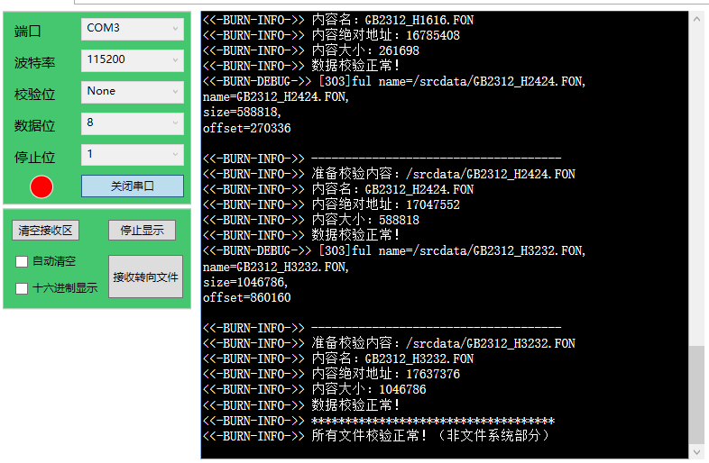

eLCDIF—液晶显示中英文
---------------------

本章参考资料：《IMXRT1050RM》。关于开发板配套的液晶屏参数可查阅《5.0寸液晶屏数据手册》（或7.0寸数据手册）配套资料获知。本教程讲解时主要使用5寸屏来说明，对于我
们配套的7寸屏，使用原理及配置参数完全一致（该7寸屏与5寸屏都是800x480的分辨率，仅尺寸不一样）。

在前面我们学习了如何使用ELCDIF外设控制液晶屏并用它显示各种图形，本章讲解如何控制液晶屏显示文字。使用液晶屏显示文字时，涉及到字符编码与字模的知识。

字符编码
~~~~~~~~

由于计算机只能识别0和1，文字也只能以0和1的形式在计算机里存储，所以我们需要对文字进行编码才能让计算机处理，编码的过程就是规定特定的01数字串来表示特定的文字，最简单的字符编码例子是ASCII码。

ASCII编码
^^^^^^^^^

学习C语言时，我们知道在程序设计中使用ASCII编码表约定了一些控制字符、英文及数字。它们在存储器中，本质也是二进制数，只是我们约定这些二进制数可以表示某些特殊意义，如以ASCII编码解释数字“0x41”时，它表示英文字符“A”。ASCII码表分为两部分，第一部分是控制字符或通讯专用字符，它们的数字编码从0~31，见表
25‑1，它们并没有特定的图形显示，但会根据不同的应用程序，而对文本显示有不同的影响。ASCII码的第二部分包括空格、阿拉伯数字、标点符号、大小写英文字母以及“DEL（删除控制）”，这部分符号的数字编码从32~127，除最后一个DEL符号外，都能以图形的方式来表示，它们属于传统文字书写系统的一部分。

    表 25‑1 ASCII码中的控制字符或通讯专用字符

+--------+----------+-----------------------------+--------------+
| 十进制 | 十六进制 | 缩写/字符                   | 解释         |
+========+==========+=============================+==============+
| 0      | 0        | NUL(null)                   | 空字符       |
+--------+----------+-----------------------------+--------------+
| 1      | 1        | SOH(start of headline)      | 标题开始     |
+--------+----------+-----------------------------+--------------+
| 2      | 2        | STX (start of text)         | 正文开始     |
+--------+----------+-----------------------------+--------------+
| 3      | 3        | ETX (end of text)           | 正文结束     |
+--------+----------+-----------------------------+--------------+
| 4      | 4        | EOT (end of transmission)   | 传输结束     |
+--------+----------+-----------------------------+--------------+
| 5      | 5        | ENQ (enquiry)               | 请求         |
+--------+----------+-----------------------------+--------------+
| 6      | 6        | ACK (acknowledge)           | 收到通知     |
+--------+----------+-----------------------------+--------------+
| 7      | 7        | BEL (bell)                  | 响铃         |
+--------+----------+-----------------------------+--------------+
| 8      | 8        | BS (backspace)              | 退格         |
+--------+----------+-----------------------------+--------------+
| 9      | 9        | HT (horizontal tab)         | 水平制表符   |
+--------+----------+-----------------------------+--------------+
| 10     | 0A       | LF (NL line feed, new line) | 换行键       |
+--------+----------+-----------------------------+--------------+
| 11     | 0B       | VT (vertical tab)           | 垂直制表符   |
+--------+----------+-----------------------------+--------------+
| 12     | 0C       | FF (NP form feed, new page) | 换页键       |
+--------+----------+-----------------------------+--------------+
| 13     | 0D       | CR (carriage return)        | 回车键       |
+--------+----------+-----------------------------+--------------+
| 14     | 0E       | SO (shift out)              | 不用切换     |
+--------+----------+-----------------------------+--------------+
| 15     | 0F       | SI (shift in)               | 启用切换     |
+--------+----------+-----------------------------+--------------+
| 16     | 10       | DLE (data link escape)      | 数据链路转义 |
+--------+----------+-----------------------------+--------------+
| 17     | 11       | DC1 (device control 1)      | 设备控制1    |
+--------+----------+-----------------------------+--------------+
| 18     | 12       | DC2 (device control 2)      | 设备控制2    |
+--------+----------+-----------------------------+--------------+
| 19     | 13       | DC3 (device control 3)      | 设备控制3    |
+--------+----------+-----------------------------+--------------+
| 20     | 14       | DC4 (device control 4)      | 设备控制4    |
+--------+----------+-----------------------------+--------------+
| 21     | 15       | NAK (negative acknowledge)  | 拒绝接收     |
+--------+----------+-----------------------------+--------------+
| 22     | 16       | SYN (synchronous idle)      | 同步空闲     |
+--------+----------+-----------------------------+--------------+
| 23     | 17       | ETB (end of trans. block)   | 传输块结束   |
+--------+----------+-----------------------------+--------------+
| 24     | 18       | CAN (cancel)                | 取消         |
+--------+----------+-----------------------------+--------------+
| 25     | 19       | EM (end of medium)          | 介质中断     |
+--------+----------+-----------------------------+--------------+
| 26     | 1A       | SUB (substitute)            | 替补         |
+--------+----------+-----------------------------+--------------+
| 27     | 1B       | ESC (escape)                | 换码(溢出)   |
+--------+----------+-----------------------------+--------------+
| 28     | 1C       | FS (file separator)         | 文件分割符   |
+--------+----------+-----------------------------+--------------+
| 29     | 1D       | GS (group separator)        | 分组符       |
+--------+----------+-----------------------------+--------------+
| 30     | 1E       | RS (record separator)       | 记录分离符   |
+--------+----------+-----------------------------+--------------+
| 31     | 1F       | US (unit separator)         | 单元分隔符   |
+--------+----------+-----------------------------+--------------+

    表 25‑2 ASCII码中的字符及数字

+--------+----------+-------------+--+--------+----------+-------------------+
| 十进制 | 十六进制 | 缩写/字符   |  | 十进制 | 十六进制 | 缩写/字符         |
+========+==========+=============+==+========+==========+===================+
| 32     | 20       | (space)空格 |  | 80     | 50       | P                 |
+--------+----------+-------------+--+--------+----------+-------------------+
| 33     | 21       | !           |  | 81     | 51       | Q                 |
+--------+----------+-------------+--+--------+----------+-------------------+
| 34     | 22       | "           |  | 82     | 52       | R                 |
+--------+----------+-------------+--+--------+----------+-------------------+
| 35     | 23       | #           |  | 83     | 53       | S                 |
+--------+----------+-------------+--+--------+----------+-------------------+
| 36     | 24       | $           |  | 84     | 45       | T                 |
+--------+----------+-------------+--+--------+----------+-------------------+
| 37     | 25       | %           |  | 85     | 55       | U                 |
+--------+----------+-------------+--+--------+----------+-------------------+
| 38     | 26       | &           |  | 86     | 56       | V                 |
+--------+----------+-------------+--+--------+----------+-------------------+
| 39     | 27       | '           |  | 87     | 57       | W                 |
+--------+----------+-------------+--+--------+----------+-------------------+
| 40     | 28       | (           |  | 88     | 58       | X                 |
+--------+----------+-------------+--+--------+----------+-------------------+
| 41     | 29       | )           |  | 89     | 59       | Y                 |
+--------+----------+-------------+--+--------+----------+-------------------+
| 42     | 2A       | \*          |  | 90     | 5A       | Z                 |
+--------+----------+-------------+--+--------+----------+-------------------+
| 43     | 2B       | +           |  | 91     | 5B       | [                 |
+--------+----------+-------------+--+--------+----------+-------------------+
| 44     | 2C       | ,           |  | 92     | 5C       | \\                |
+--------+----------+-------------+--+--------+----------+-------------------+
| 45     | 2D       | -           |  | 93     | 5D       | ]                 |
+--------+----------+-------------+--+--------+----------+-------------------+
| 46     | 2E       | .           |  | 94     | 5E       | ^                 |
+--------+----------+-------------+--+--------+----------+-------------------+
| 47     | 2F       | /           |  | 95     | 5F       | \_                |
+--------+----------+-------------+--+--------+----------+-------------------+
| 48     | 30       | 0           |  | 96     | 60       | \`                |
+--------+----------+-------------+--+--------+----------+-------------------+
| 49     | 31       | 1           |  | 97     | 61       | a                 |
+--------+----------+-------------+--+--------+----------+-------------------+
| 50     | 32       | 2           |  | 98     | 62       | b                 |
+--------+----------+-------------+--+--------+----------+-------------------+
| 51     | 33       | 3           |  | 99     | 63       | c                 |
+--------+----------+-------------+--+--------+----------+-------------------+
| 52     | 34       | 4           |  | 100    | 64       | d                 |
+--------+----------+-------------+--+--------+----------+-------------------+
| 53     | 35       | 5           |  | 101    | 65       | e                 |
+--------+----------+-------------+--+--------+----------+-------------------+
| 45     | 36       | 6           |  | 102    | 66       | f                 |
+--------+----------+-------------+--+--------+----------+-------------------+
| 55     | 37       | 7           |  | 103    | 67       | g                 |
+--------+----------+-------------+--+--------+----------+-------------------+
| 56     | 38       | 8           |  | 104    | 68       | h                 |
+--------+----------+-------------+--+--------+----------+-------------------+
| 57     | 39       | 9           |  | 105    | 69       | i                 |
+--------+----------+-------------+--+--------+----------+-------------------+
| 58     | 3A       | :           |  | 106    | 6A       | j                 |
+--------+----------+-------------+--+--------+----------+-------------------+
| 59     | 3B       | ;           |  | 107    | 6B       | k                 |
+--------+----------+-------------+--+--------+----------+-------------------+
| 60     | 3C       | <           |  | 90     | 6C       | l                 |
+--------+----------+-------------+--+--------+----------+-------------------+
| 61     | 3D       | =           |  | 109    | 6D       | m                 |
+--------+----------+-------------+--+--------+----------+-------------------+
| 62     | 3E       | >           |  | 110    | 6E       | n                 |
+--------+----------+-------------+--+--------+----------+-------------------+
| 63     | 3F       | ?           |  | 111    | 6F       | o                 |
+--------+----------+-------------+--+--------+----------+-------------------+
| 64     | 40       | @           |  | 112    | 70       | p                 |
+--------+----------+-------------+--+--------+----------+-------------------+
| 65     | 41       | A           |  | 113    | 71       | q                 |
+--------+----------+-------------+--+--------+----------+-------------------+
| 66     | 42       | B           |  | 114    | 72       | r                 |
+--------+----------+-------------+--+--------+----------+-------------------+
| 67     | 43       | C           |  | 115    | 73       | s                 |
+--------+----------+-------------+--+--------+----------+-------------------+
| 68     | 44       | D           |  | 116    | 74       | t                 |
+--------+----------+-------------+--+--------+----------+-------------------+
| 69     | 45       | E           |  | 117    | 75       | u                 |
+--------+----------+-------------+--+--------+----------+-------------------+
| 70     | 46       | F           |  | 118    | 76       | v                 |
+--------+----------+-------------+--+--------+----------+-------------------+
| 71     | 47       | G           |  | 119    | 77       | w                 |
+--------+----------+-------------+--+--------+----------+-------------------+
| 72     | 48       | H           |  | 120    | 78       | x                 |
+--------+----------+-------------+--+--------+----------+-------------------+
| 73     | 49       | I           |  | 121    | 79       | y                 |
+--------+----------+-------------+--+--------+----------+-------------------+
| 74     | 4A       | J           |  | 122    | 7A       | z                 |
+--------+----------+-------------+--+--------+----------+-------------------+
| 75     | 4B       | K           |  | 123    | 7B       | {                 |
+--------+----------+-------------+--+--------+----------+-------------------+
| 76     | 4C       | L           |  | 124    | 7C       | \|                |
+--------+----------+-------------+--+--------+----------+-------------------+
| 77     | 4D       | M           |  | 125    | 7D       | }                 |
+--------+----------+-------------+--+--------+----------+-------------------+
| 78     | 4E       | N           |  | 126    | 7E       | ~                 |
+--------+----------+-------------+--+--------+----------+-------------------+
| 79     | 4F       | O           |  | 127    | 7F       | DEL (delete) 删除 |
+--------+----------+-------------+--+--------+----------+-------------------+

后来，计算机引进到其它国家的时候，由于他们使用的不是英语，他们使用的字母在ASCII码表中没有定义，所以他们采用127号之后的位来表示这些新的字母，还加入了各种形状，一直编号到255。从128到255这些字符被称为ASCII扩展字符集。至此基本存储单位Byte(char)能表示的编号都被用完了。

中文编码
^^^^^^^^

由于英文书写系统都是由26个基本字母组成，利用26个字母组可合出不同的单词，所以用ASCII码表就能表达整个英文书写系统。而中文书写系统中的汉字是独立的方块，若参考单词拆解成字母的表示方式，汉字可以拆解成部首、笔画来表示，但这样会非常复杂(可参考五笔输入法编码)，所以中文编码直接对方块字进行编码，一个汉字使用一个号码。

由于汉字非常多，常用字就有6000多个，如果像ASCII编码表那样只使用1个字节最多只能表示256个汉字，所以我们使用2个字节来编码。

GB2312标准
''''''''''

我们首先定义的是GB2312标准。它把ASCII码表127号之后的扩展字符集直接取消掉，并规定小于127的编码按原来ASCII标准解释字符。当2个大于127的字符连在一起时，就表示1个汉字，第1个字节使用
(0xA1-0xFE)
编码，第2个字节使用(0xA1-0xFE)编码，这样的编码组合起来可以表示了7000多个符号，其中包含6763个汉字。在这些编码里，我们还把数学符号、罗马字母、日文假名等都编进表中，就连原来在ASCII里原本就有的数字、标点以及字母也重新编了2个字节长的编码，这就是平时在输入法里可切换的“全角”字符，而标准的ASCII码表中127号以下的就被称为“半角”字符。

表
25‑3说明了GB2312是如何兼容ASCII码的，当我们设定系统使用GB2312标准的时候，它遇到一个字符串时，会按字节检测字符值的大小，若遇到连续两个字节的数值都大于127时就把这两个连续的字节合在一起，用GB2312解码，若遇到的数值小于127，就直接用ASCII把它解码。

    表 25‑3 GB2312兼容ASCII码的原理

+---------+---------+------------+---------------------------------------------+
| 第1字节 | 第2字节 | 表示的字符 | 说明                                        |
+=========+=========+============+=============================================+
| 0x68    | 0x69    | (hi)       | 两个字节的值都小于127(0x7F)，使用ASCII解码  |
+---------+---------+------------+---------------------------------------------+
| 0xB0    | 0xA1    | (啊)       | 两个字节的值都大于127(0x7F)，使用GB2312解码 |
+---------+---------+------------+---------------------------------------------+

区位码
      

在GB2312编码的实际使用中，有时会用到区位码的概念，见\ **错误!未找到引用源。**\ 。GB2312编码对所收录字符进行了“分区”处理，共94个区，每区含有94个位，共8836个码位。而区位码实际是GB2312编码的内部形式，它规定对收录的每个字符采用两个字节表示，第一个字节为“高字节”，对应94个区；第二个字节为“低字节”，对应94个位。所以它的区位码范围是：0101-9494。为兼容ASCII码，区号和位号分别加上0xA0偏移就得到GB2312编码。在区位码上加上0xA0偏移，可求得GB2312编码范围：0xA1A1－0xFEFE，其中汉字的编码范围为0xB0A1-0xF7FE，第一字节0xB0-0xF7（对应区号：16－87），第二个字节0xA1-0xFE（对应位号：01－94）。

例如，“啊”字是GB2312编码中的第一个汉字，它位于16区的01位，所以它的区位码就是1601，加上0xA0偏移，其GB2312编码为0xB0A1。其中区位码为0101的码位表示的是“空格”符。

图 25‑1 GB2312 的部分区位码

GBK编码
'''''''

据统计，GB2312编码中表示的6763个汉字已经覆盖中国大陆99.75%的使用率，单看这个数字已经很令人满意了，但是我们不能因为那些文字不常用就不让它进入信息时代，而且生僻字在人名、文言文中的出现频率是非常高的。为此我们在GB2312标准的基础上又增加了14240个新汉字(包括所有后面介绍的Big5中的所有汉字)和符号，这个方案被称为GBK标准。增加这么多字符，按照GB2312原来的格式来编码，2个字节已经没有足够的编码，我们聪明的程序员修改了一下格式，不再要求第2个字节的编码值必须大于127，只要第1个字节大于127就表示这是一个汉字的开始，这样就做到了兼容ASCII和GB2312标准。

表
25‑4说明了GBK是如何兼容ASCII和GB2312标准的，当我们设定系统使用GBK标准的时候，它按顺序遍历字符串，按字节检测字符值的大小，若遇到一个字符的值大于127时，就再读取它后面的一个字符，把这两个字符值合在一起，用GBK解码，解码完后，再读取第3个字符，重新开始以上过程，若该字符值小于127，则直接用ASCII解码。

    表 25‑4 GBK兼容ASCII和GB2312的原理

+-----------+-----------+-----------+------------+---------------------+
|  第1字节  |  第2字节  |  第3字节  | 表示的字符 |        说明         |
+===========+===========+===========+============+=====================+
| 0x68(<7F) | 0xB0(>7F) | 0xA1(>7F) | (h啊)      | 第1个字节小于127，  |
|           |           |           |            | 使用ASCII解码，每   |
|           |           |           |            | 2个字节大于127，直  |
|           |           |           |            | 接使用GBK解码，兼容 |
|           |           |           |            | GB2312              |
+-----------+-----------+-----------+------------+---------------------+
| 0xB0(>7F) | 0xA1(>7F) | 0x68(<7F) | (啊h)      | 第1个字节大于127，  |
|           |           |           |            | 直接使用GBK码解释， |
|           |           |           |            | 第3个字节小于127，  |
|           |           |           |            | 使用ASCII解码       |
+-----------+-----------+-----------+------------+---------------------+
| 0xB0(>7F) | 0x56(<7F) | 0x68(<7F) | (癡h)      | 第1个字节大于127，  |
|           |           |           |            | 第2个字节虽然小于12 |
|           |           |           |            | 7，直接使用GBK解码  |
|           |           |           |            | ，第3个字节小于127  |
|           |           |           |            | ，使用ASCII解码     |
+-----------+-----------+-----------+------------+---------------------+

GB18030
'''''''

随着计算机技术的普及，我们后来又在GBK的标准上不断扩展字符，这些标准被称为GB18030，如GB18030-2000、GB18030-2005等(“-”号后面的数字是制定标准时的年号)，GB18030的编码使用4个字节，它利用前面标准中的第2个字节未使用的“0x30-0x39”编码表示扩充四字节的后缀，兼容GBK、GB2312及ASCII标准。

GB18030-2000主要在GBK基础上增加了“CJK(中日韩)统一汉字扩充A”的汉字。加上前面GBK的内容，GB18030-2000一共规定了27533个汉字（包括部首、部件等）的编码，还有一些常用非汉字符号。

GB18030-2005的主要特点是在GB18030-2000基础上增加了“CJK(中日韩)统一汉字扩充B”的汉字。增加了42711个汉字和多种我国少数民族文字的编码（如藏、蒙古、傣、彝、朝鲜、维吾尔文等）。加上前面GB18030-2000的内容，一共收录了70244个汉字。

GB2312、GBK及GB18030是汉字的国家标准编码，新版向下兼容旧版，各个标准简要说明见表
25‑5，目前比较流行的是GBK编码，因为每个汉字只占用2个字节，而且它编码的字符已经能满足大部分的需求，但国家要求一些产品必须支持GB18030标准。

    表 25‑5 汉字国家标准

+-------------+-----------------+-----------------+------------+------------------------+
|    类别     |    编码范围     |  汉字编码范围   | 扩充汉字数 |          说明          |
+=============+=================+=================+============+========================+
| GB2312      | 第一字节0xA1-0x | 第一字节0xB0-0x | 6763       | 除汉字外，还包括拉丁字 |
|             | FE              | F7              |            | 母、希腊字母、日文平假 |
|             |                 |                 |            | 名及片假名字母、俄语西 |
|             | 第二字节0xA1-0x | 第二字节0xA1-0x |            | 里尔字母在内的682个    |
|             | FE              | FE              |            | 全角字符               |
+-------------+-----------------+-----------------+------------+------------------------+
|             |                 |                 |            |                        |
+-------------+-----------------+-----------------+------------+------------------------+
| GBK         | 第一字节0x81-0x | 第一字节0x81-0x | 6080       | 包括部首和构件,中日韩  |
|             | FE              | A0              |            | 汉字,包含了BIG5编      |
|             |                 |                 |            | 码中的所有汉字,加上G   |
|             | 第二字节0x40-0x | 第二字节0x40-0x |            | B2312的原内容，一      |
|             | FE              | FE              |            | 共有21003个汉字        |
+-------------+-----------------+-----------------+------------+------------------------+
|             |                 |                 |            |                        |
+-------------+-----------------+-----------------+------------+------------------------+
|             |                 | 第一字节0xAA-0x | 8160       |                        |
|             |                 | FE              |            |                        |
|             |                 |                 |            |                        |
|             |                 | 第二字节0x40-0x |            |                        |
|             |                 | A0              |            |                        |
+-------------+-----------------+-----------------+------------+------------------------+
|             |                 |                 |            |                        |
+-------------+-----------------+-----------------+------------+------------------------+
| GB18030-200 | 第一字节0x81-0x | 第一字节0x81-0x | 6530       | 在GBK基础上增加了中    |
| 0           | FE              | 82              |            | 日韩统一汉字扩充A的汉  |
|             |                 |                 |            | 字，加上GB2312、       |
|             | 第二字节0x30-0x | 第二字节0x30-0x |            | GBK的内容，一共有2     |
|             | 39              | 39              |            | 7533个汉字             |
|             |                 |                 |            |                        |
|             | 第三字节0x81-0x | 第三字节0x81-0x |            |                        |
|             | FE              | FE              |            |                        |
|             |                 |                 |            |                        |
|             | 第四字节0x30-0x | 第四字节0x30-0x |            |                        |
|             | 39              | 39              |            |                        |
+-------------+-----------------+-----------------+------------+------------------------+
|             |                 |                 |            |                        |
+-------------+-----------------+-----------------+------------+------------------------+
|             |                 |                 |            |                        |
+-------------+-----------------+-----------------+------------+------------------------+
|             |                 |                 |            |                        |
+-------------+-----------------+-----------------+------------+------------------------+
| GB18030-200 | 第一字节0x81-0x | 第一字节0x95-0x | 42711      | 在GB18030-20           |
| 5           | FE              | 98              |            | 00的基础上增加了42     |
|             |                 |                 |            | 711中日韩统一汉字扩    |
|             | 第二字节0x30-0x | 第二字节0x30-0x |            | 充B中的汉字和多种我国  |
|             | 39              | 39              |            | 少数民族文字的编码（如 |
|             |                 |                 |            | 藏、蒙古、傣、彝、朝鲜 |
|             | 第三字节0x81-0x | 第三字节0x81-0x |            | 、维吾尔文等），加上前 |
|             | FE              | FE              |            | 面GB2312、GBK          |
|             |                 |                 |            | 、GB18030-20           |
|             | 第四字节0x30-0x | 第四字节0x30-0x |            | 00的内容，一共702      |
|             | 39              | 39              |            | 44个汉字               |
+-------------+-----------------+-----------------+------------+------------------------+
|             |                 |                 |            |                        |
+-------------+-----------------+-----------------+------------+------------------------+
|             |                 |                 |            |                        |
+-------------+-----------------+-----------------+------------+------------------------+
|             |                 |                 |            |                        |
+-------------+-----------------+-----------------+------------+------------------------+

Big5编码
''''''''

在台湾、香港等地区，使用较多的是Big5编码，它的主要特点是收录了繁体字。而从GBK编码开始，已经把Big5中的所有汉字收录进编码了。即对于汉字部分，GBK是Big5的超集，Big5能表示的汉字，在GBK都能找到那些字相应的编码，但他们的编码是不一样的，两个标准不兼容，如GBK中的“啊”字编码是“0xB0A1”，而Big5标准中的编码为“0xB0DA”。

Unicode字符集和编码
^^^^^^^^^^^^^^^^^^^

由于各个国家或地区都根据使用自己的文字系统制定标准，同一个编码在不同的标准里表示不一样的字符，各个标准互不兼容，而又没有一个标准能够囊括所有的字符，即无法用一个标准表达所有字符。国际标准化组织(ISO)为解决这一问题，它舍弃了地区性的方案，重新给全球上所有文化使用的字母和符号进行编号，对每个字符指定一个唯一的编号(ASCII中原有的字符编号不变)，这些字符的号码从0x000000到0x10FFFF，该编号集被称为Universal
Multiple-Octet Coded Character
Set，简称UCS，也被称为Unicode。最新版的Unicode标准还包含了表情符号(聊天软件中的部分emoji表情)，可访问Unicode官网了解：\ `http://www.unicode.org <http://www.unicode.org>`__\ 。

Unicode字符集只是对字符进行编号，但具体怎么对每个字符进行编码，Unicode并没指定，因此也衍生出了如下几种unicode编码方案(Unicode
Transformation Format)。

UTF-32
^^^^^^

对Unicode字符集编码，最自然的就是UTF-32方式了。编码时，它直接对Unicode字符集里的每个字符都用4字节来表示，转换方式很简单，直接将字符对应的编号数字转换为4字节的二进制数。如表
25‑6，由于UTF-32把每个字符都用要4字节来存储，因此UTF-32不兼容ASCII编码，也就是说ASCII编码的文件用UTF-32标准来打开会成为乱码。

    表 25‑6 UTF-32编码示例

+------+---------+-------------+---------------------+
| 字符 | GBK编码 | Unicode编号 | UTF-32编码          |
+======+=========+=============+=====================+
| A    | 0x41    | 0x0000 0041 | 大端格式0x0000 0041 |
+------+---------+-------------+---------------------+
| 啊   | 0xB0A1  | 0x0000 545A | 大端格式0x0000 545A |
+------+---------+-------------+---------------------+

对UTF-32数据进行解码的时候，以4个字节为单位进行解析即可，根据编码可直接找到Unicode字符集中对应编号的字符。

UTF-32的优点是编码简单，解码也很方便，读取编码的时候每次都直接读4个字节，不需要加其它的判断。它的缺点是浪费存储空间，大量常用字符的编号只需要2个字节就能表示。其次，在存储的时候需要指定字节顺序，是高位字节存储在前(大端格式)，还是低位字节存储在前(小端格式)。

UTF-16
^^^^^^

针对UTF-32的缺点，人们改进出了UTF-16的编码方式，它采用2字节或4字节的变长编码方式(UTF-32定长为4字节)。对Unicode字符编号在0到65535的统一用2个字节来表示，将每个字符的编号转换为2字节的二进制数，即从0x0000到0xFFFF。而由于Unicode字符集在0xD800-0xDBFF这个区间是没有表示任何字符的，所以UTF-16就利用这段空间，对Unicode中编号超出0xFFFF的字符，利用它们的编号做某种运算与该空间建立映射关系，从而利用该空间表示4字节扩展，感兴趣的读者可查阅相关资料了解具体的映射过程。

    表 25‑7 UTF-16编码示例

+------+-------------+-------------+---------------------+
| 字符 | GB18030编码 | Unicode编号 | UTF-16编码          |
+======+=============+=============+=====================+
| A    | 0x41        | 0x0000 0041 | 大端格式0x0041      |
+------+-------------+-------------+---------------------+
| 啊   | 0xB0A1      | 0x0000 545A | 大端格式0x545A      |
+------+-------------+-------------+---------------------+
| 𧗌   | 0x9735 F832 | 0x0002 75CC | 大端格式0xD85D DDCC |
+------+-------------+-------------+---------------------+

注：𧗌
五笔：TLHH(不支持GB18030码的输入法无法找到该字，感兴趣可搜索它的Unicode编号找到)

UTF-16解码时，按两个字节去读取，如果这两个字节不在0xD800到0xDFFF范围内，那就是双字节编码的字符，以双字节进行解析，找到对应编号的字符。如果这两个字节在0xD800到
0xDFFF之间，那它就是四字节编码的字符，以四字节进行解析，找到对应编号的字符。

UTF-16编码的优点是相对UTF-32节约了存储空间，缺点是仍不兼容ASCII码，仍有大小端格式问题。

UTF-8
^^^^^

UTF-8是目前Unicode字符集中使用得最广的编码方式，目前大部分网页文件已使用UTF-8编码，如使用浏览器查看百度首页源文件，可以在前几行HTML代码中找到如下代码：

1 <meta http-equiv=Content-Type content="text/html;charset=utf-8">

其中“charset”等号后面的“utf-8”即表示该网页字符的编码方式UTF-8。

UTF-8也是一种变长的编码方式，它的编码有1、2、3、4字节长度的方式，每个Unicode字符根据自己的编号范围去进行对应的编码，见表
25‑8。它的编码符合以下规律：

-  对于UTF-8单字节的编码，该字节的第1位设为0(从左边数起第1位，即最高位)，剩余的位用来写入字符的Unicode编号。即对于Unicode编号从0x0000
   0000-0x0000
   007F的字符，UTF-8编码只需要1个字节，因为这个范围Unicode编号的字符与ASCII码完全相同，所以UTF-8兼容了ASCII码表。

-  对于UTF-8使用N个字节的编码(N>1)，第一个字节的前N位设为1，第N+1位设为0，后面字节的前两位都设为10，这N个字节的其余空位填充该字符的Unicode编号，高位用0补足。

    表 25‑8 UTF-8编码原理(x的位置用于填充Unicode编号)

+-------------------+----------------+----------+----------+----------+----------+
|  Unicode(16进制)  | UTF-8（2进制） |          |          |          |          |
+===================+================+==========+==========+==========+==========+
| 编号范围          | 第一字节       | 第二字节 | 第三字节 | 第四字节 | 第五字节 |
+-------------------+----------------+----------+----------+----------+----------+
| 00000000-0000007F | 0xxxxxxx       |          |          |          |          |
+-------------------+----------------+----------+----------+----------+----------+
| 00000080-000007FF | 110xxxxx       | 10xxxxxx |          |          |          |
+-------------------+----------------+----------+----------+----------+----------+
| 00000800-0000FFFF | 1110xxxx       | 10xxxxxx | 10xxxxxx |          |          |
+-------------------+----------------+----------+----------+----------+----------+
| 00010000-0010FFFF | 11110xxx       | 10xxxxxx | 10xxxxxx | 10xxxxxx |          |
+-------------------+----------------+----------+----------+----------+----------+
| …                 | 111110xx       | 10xxxxxx | 10xxxxxx | 10xxxxxx | 10xxxxxx |
+-------------------+----------------+----------+----------+----------+----------+

注：实际上utf-8编码长度最大为四个字节，所以最多只能表示Unicode编码值的二进制数为21位的Unicode字符。但是已经能表示所有的Unicode字符，因为Unicode的最大码位0x10FFFF也只有21位。

UTF-8解码的时候以字节为单位去看，如果第一个字节的bit位以0开头，那就是ASCII字符，以单字节进行解析。如果第一个字节的数据位以“110”开头，就按双字节进行解析，3、4字节的解析方法类似。

UTF-8的优点是兼容了ASCII码，节约空间，且没有字节顺序的问题，它直接根据第1个字节前面数据位中连续的1个数决定后面有多少个字节。不过使用UTF-8编码汉字平均需要3个字节，比GBK编码要多一个字节。

BOM
^^^

由于UTF系列有多种编码方式，而且对于UTF-16和UTF-32还有大小端的区分，那么计算机软件在打开文档的时候到底应该用什么编码方式去解码呢？有的人就想到在文档最前面加标记，一种标记对应一种编码方式，这些标记就叫做BOM(Byte
Order Mark)，它们位于文本文件的开头，见表
25‑9。注意BOM是对Unicode的几种编码而言的，ANSI编码没有BOM。

    表 25‑9 BOM标记

+---------------------+-----------------+
| BOM标记             | 表示的编码      |
+=====================+=================+
| 0xEF 0xBB 0xBF      | UTF-8           |
+---------------------+-----------------+
| 0xFF 0xFE           | UTF-16 小端格式 |
+---------------------+-----------------+
| 0xFE 0xFF           | UTF-16 大端格式 |
+---------------------+-----------------+
| 0xFF 0xFE 0x00 0x00 | UTF-32 小端格式 |
+---------------------+-----------------+
| 0x00 0x00 0xFE 0xFF | UTF-32 大端格式 |
+---------------------+-----------------+

但由于带BOM的设计很多规范不兼容，不能跨平台，所以这种带BOM的设计没有流行起来。Linux系统下默认不带BOM。

什么是字模？
~~~~~~~~~~~~

有了编码，我们就能在计算机中处理、存储字符了，但是如果计算机处理完字符后直接以编码的形式输出，人类将难以识别。来，在2秒内告诉我ASCII编码的“0x25”表示什么字符？不容易吧？要是觉得容易，再来告诉我GBK编码的“0xBCC6”表示什么字符。因此计算机与人交互时，一般会把字符转化成人类习惯的表现形式进行输出，如显示、打印的时候。

但是如果仅有字符编码，计算机还不知道该如何表达该字符，因为字符实际上是一个个独特的图形，计算机必须把字符编码转化成对应的字符图形人类才能正常识别，因此我们要给计算机提供字符的图形数据，这些数据就是字模，多个字模数据组成的文件也被称为字库。计算机显示字符时，根据字符编码与字模数据的映射关系找到它相应的字模数据，液晶屏根据字模数据显示该字符。

字模的构成
^^^^^^^^^^

    已知字模是图形数据，而图形在计算机中是由一个个像素点组成的，所以字模实质是一个个像素点数据。为方便处理，我们把字模定义成方块形的像素点阵，且每个像素点只有0和1这两种状态(可以理解为单色图像数据)。见图
    25‑2，这是两个宽、高为16x16的像素点阵组成的两个汉字图形，其中的黑色像素点即为文字的笔迹。计算机要表示这样的图形，只需使用16x16个二进制数据位，每个数据位记录一个像素点的状态，把黑色像素点以“1”表示，无色像素点以“0”表示即可。这样的一个汉字图形，使用16x16/8=32个字节来就可以记录下来。

图 25‑2 字模

16x16的“字”的字模数据以C语言数组的方式表示。在这样的字模中，以两个字节表示一行像素点，16行构成一个字模。

.. code-block:: c
   :name: 代码清单25‑1：“字”的字模数据
   :caption: 代码清单25‑1：“字”的字模数据
   :linenos:

    /* 字 */  
    unsigned char code Bmp003[]=   
    {   
    /*------------------------------------------------------------  
    ;  源文件 / 文字 : 字  
    ;  宽×高（像素）: 16×16  
    ;  字模格式/大小 : 单色点阵液晶字模，横向取模，字节正序/32字节  
    ----------------------------------------------------------*/  
    
    0x02,0x00,0x01,0x00,0x3F,0xFC,0x20,0x04,0x40,0x08,0x1F,0xE0,0x00,0x40,
    0x00,0x80,   
    0xFF,0xFF,0x7F,0xFE,0x01,0x00,0x01,0x00,0x01,0x00,0x01,0x00,0x05,0x00,
    0x02,0x00,   
    };  

字模显示原理
^^^^^^^^^^^^

如果使用LCD的画点函数，按位来扫描这些字模数据，把为1的位以黑色来显示(也可以使用其它颜色)，为0的数据位以白色来显示，即可把整个点阵还原出来，显示在液晶屏上。

为便于理解，我们编写了一个使用串口printf利用字模打印字符到串口上位机，代码清单
25‑2中演示的字模显示原理。代码清单25‑1

.. code-block:: c
   :name: 代码清单 25‑2 使用串口利用字模打印字到上位机
   :caption: 代码清单 25‑2 使用串口利用字模打印字到上位机
   :linenos:

    /*"当"字符的字模*/
    unsigned char charater_matrix[] =
        {
        0x00,0x80,0x10,0x90,0x08,0x98,0x0C,0x90,
        0x08,0xA0,0x00,0x80,0x3F,0xFC,0x00,0x04,
        0x00,0x04,0x1F,0xFC,0x00,0x04,0x00,0x04,
        0x00,0x04,0x3F,0xFC,0x00,0x04,0x00,0x00
        };

    /**
    * @brief  使用串口在上位机打印字模
    *   演示字模显示原理
    * @retval 无
    */
    void Printf_Charater(void)
        {
        int i,j;
        unsigned char kk;

        /*i用作行计数*/
        for ( i=0; i<16; i++)
            {
            /*j用作一字节内数据的移位计数*/
            /*一行像素的第一个字节*/
            for (j=0; j<8; j++)
                {
                /*一个数据位一个数据位地处理*/
                kk = charater_matrix[2*i] << j ;  //左移J位
                if ( kk & 0x80)
                    {
                    printf("*"); //如果最高位为1，输出"*"号,表示笔迹
                    }
                else
                    {
                    printf(" "); //如果最高位为0，输出"空格"，表示空白
                    }
                }
            /*一行像素的第二个字节*/
            for (j=0; j<8; j++)
                {
                kk = charater_matrix[2*i+1] << j ;  //左移J位
    
                if ( kk & 0x80)
                    {
                    printf("*"); //如果最高位为1，输出"*"号，表示笔迹
                    }
                else
                    {
                    printf(" "); //如果最高位为0，输出"空格"，表示空白
                    }
                }
            printf("\n");    //输出完一行像素，换行
            }
        printf("\n\n");     //一个字输出完毕
        }

在main函数中运行这段代码，连接好开发板到上位机，可以看到图
25‑3中的现象。该函数中利用printf函数对字模数据中为1的数据位打印“*”号，为0的数据位打印出“空格”，从而在串口接收区域中使用“*”号表达出了一个“当”字。

图 25‑3 使用串口打印字模

如何制作字模
^^^^^^^^^^^^

    以上只是某几个字符的字模，为方便使用，我们需要制作所有常用字符的字模，如程序只需要英文显示，那就需要制作包含ASCII码表
    25‑2中所有字符的字模，如程序只需要使用一些常用汉字，我们可以选择制作GB2312编码里所有字符的字模，而且希望字模数据与字符编码有固定的映射关系，以便在程序中使用字符编码作为索引，查找字模。在网上搜索可找到一些制作字模的软件工具，可满足这些需求。在我们提供的《eLCDIF—液晶显示汉字》的工程目录下提供了一个取模软件“PCtoLCD”，这里以它为例讲解如何制作字模，其它字模软件也是类似的。

(1) 配置字模格式

..

    打开取模软件，点击“选项”菜单，会弹出一个对话框，见图 25‑4。

-  选项“点阵格式”中的阴、阳码是指字模点阵中有笔迹像素位的状态是“1”还是“0”，像我们前文介绍的那种就是阴码，反过来就是阳码。本工程中使用阴码。

-  选项“取模方式”是指字模图形的扫描方向，修改这部分的设置后，选项框的右侧会有相应的说明及动画显示，这里我们依然按前文介绍的字模类型，把它配置成“逐行式”

-  选项“每行显示的数据”里我们把点阵和索引都配置成24，设置这个点阵的像素大小为24x24。

..

    字模选项的格式保持不变，设置完我们点击确定即可，字模选项的这些配置会影响到显示代码的编写方式，即类似前文代码清单
    25‑2中的程序。

图 25‑4 配置字模格式

(1) 生成GB2312字模

配置完字模选项后，点击软件中的导入文本图标，会弹出一个“生成字库”的对话框，点击右下角的生成国标汉字库按钮即可生成包含了GB2312编码里所有字符的字模文件。在《eLCDIF—液晶显示汉字》的工程目录下的《GB2312_H2424.FON》是我用这个取模软件生成的字模原文件，若不想自己制作字模，可直接使用该文件。

.. image:: media/image5.png
   :align: center
   :alt: image5
   :name: 图25_5

图 25‑5 生成国标汉字库

字模寻址公式
^^^^^^^^^^^^

使用字模软件制作的字模数据一般会按照编码格式排列。如我们利用以上软件生成的字模文件《GB2312_H2424.FON》中的数据，是根据GB2312的区位码表的顺序存储的，它存储了区位码为0101-9494的字符，每个字模的大小为24x24/8=72字节。其中第一个字符“空格”的区位码为0101，它是首个字符，所以文件的前72字节存储的是它的字模数据；同理，72-144字节存储的则是0102字符“、”的字模数据。所以我们可以导出任意字符的寻址公式:

Addr = (((Code:sub:`H`-0xA0-1)*94) +(Code\ :sub:`L`-0xA0-1))*24*24/8

其中Code\ :sub:`H`\ 和Code\ :sub:`L`\ 分别是GB2312编码的第一字节和第二字节；94是指一个区中有94个位(即94个字符)。公式的实质是根据字符的GB2312编码，求出区位码，然后区位码乘以每个字符占据的字节数，求出地址偏移。

存储字模文件
^^^^^^^^^^^^

上面生成的《GB2312_H2424.FON》文件的大小为576KB，比很多STM32芯片内部的所有FLASH空间都大，如果我们还是在程序中直接以C语言数组的方式存储字模数据，STM32芯片的程序空间会非常紧张，一般的做法是把字模数据存储到外部存储器，如SD卡或SPI-FLASH芯片，当需要显示某个字符时，控制器根据字符的编码算好字模的存储地址，再从存储器中读取，而FLASH芯片在生产前就固化好字模内容，然后直接把FLASH芯片贴到电路板上，作为整个系统的一部分。

eLCDIF—各种模式的液晶显示字符实验
~~~~~~~~~~~~~~~~~~~~~~~~~~~~~~~~~

本小节讲解如何利用字模使用在液晶屏上显示字符。

根据编码或字模存储位置、使用方式的不同，讲解中涉及到多个工程，见表
25‑10中的说明，在讲解特定实验的时候，请读者打开相应的工程来阅读

    表 25‑10 各种模式的液晶显示字符实验

+------------------------------------------------+----------------------------------------------------+
|                    工程名称                    |                        说明                        |
+================================================+====================================================+
| 1-液晶显示中英文（字库在SD卡）                 | 包含ASCII码字符及GB2312码字符的显示功能，ASCII码字 |
|                                                | 符存储在RT1052内部FLASH，GB2312码字符存储在SD卡    |
|                                                | 中。                                               |
+------------------------------------------------+----------------------------------------------------+
| 0-刷外部FLASH程序（从SD卡烧写字库到外部Flash） | 将SD卡中的字库文件烧写到外部Flash，                |
+------------------------------------------------+----------------------------------------------------+
| 2-液晶显示中英文（字库在外部FLASH）            | 包含ASCII码字符及GB2312码字符的显示功能，ASCII码字 |
|                                                | 符和GB2312码字符存储在RT1052内部FLASH。其中GB2     |
|                                                | 312码字符存在Flash的后16M位置。                    |
+------------------------------------------------+----------------------------------------------------+

这些实验是在“eLCDIF—液晶显示”工程的基础上修改的，主要添加了字符显示相关的内容，本小节只讲解主要的函数。关于液晶驱动的原理在此不再赘述，不理解这部分的可阅读前面的章节。

硬件设计
^^^^^^^^

针对不同模式的液晶显示字符工程，需要有不同的硬件支持。字库存储RT1052芯片外部部FLASH的工程，只需要液晶屏和SDRAM的支持即可，跟普通液晶显示的硬件需求无异。需要外部字库的工程，要有SD支持，使用SD卡时，需要给板子接入存储有《GB2312_H2424.FON》字库文件的MicroSD卡，SD卡的文件系统格式需要是FAT格式，且字库文件所在的目录需要跟程序里使用的文件目录一致。

关于SPI-FLASH和SD卡的原理图及驱动说明可参考其他的章节。

显示中英文——字库在SD卡
^^^^^^^^^^^^^^^^^^^^^^

我们先来看如何使用SD卡中的字库显示中、英文，请打开“1-液晶显示中英文（字库在SD卡）”的工程文件。本工程中我们把字库数据相关的函数代码写在“fonts.c”及“fonts.h”文件中，字符显示的函数仍存储在LCD驱动文件“bsp_lcd.c”及“bsp_lcd.h”中。

编程要点
''''''''

(1) 获取字模数据；

(2) 根据字模格式，编写液晶显示函数；

(3) 编写测试程序。

代码分析
''''''''

ASCII字模数据
*****************

要显示字符首先要有字库数据，在工程的“fonts.c”文件中我们定义了一系列大小为8x16、16x32、及24x48的ASCII码表的字模数据，其形式见代码清单25‑3。

.. code-block:: c
   :name: 代码清单 25‑3部分英文字库8x16大小(fonts.c)
   :caption: 代码清单 25‑3部分英文字库8x16大小(fonts.c)
   :linenos:

    /*
    * 常用ASCII表，偏移量32，大小:16（高度）* 8 （宽度）
    */
    //@conslons字体，阴码点阵格式，逐行顺向取摸
    const uint8_t ASCII8x16_Table [ ] = {       
    0x00,0x00,0x00,0x00,0x00,0x00,0x00,0x00,0x00,0x00,0x00,0x00,
    0x00,0x00,0x00,0x18,0x18,0x18,0x18,0x18,0x18,0x08,0x00,0x08,
    0x00,0x00,0x00,0x34,0x24,0x24,0x24,0x00,0x00,0x00,0x00,0x00,
    0x00,0x00,0x00,0x00,0x16,0x24,0x7f,0x24,0x24,0x24,0x7e,0x24,
    0x00,0x00,0x00,0x08,0x3e,0x68,0x48,0x68,0x1c,0x16,0x12,0x12,
    0x00,0x00,0x00,0x61,0xd2,0x96,0x74,0x08,0x10,0x16,0x29,0x49,
    0x00,0x00,0x00,0x00,0x3c,0x64,0x64,0x38,0x72,0x4a,0xce,0x46,
    0x00,0x00,0x00,0x18,0x18,0x18,0x18,0x00,0x00,0x00,0x00,0x00,
    0x00,0x00,0x00,0x04,0x08,0x18,0x10,0x30,0x30,0x30,0x30,0x10,
    0x00,0x00,0x00,0x20,0x10,0x08,0x08,0x0c,0x04,0x04,0x04,0x0c,
    0x00,0x00,0x00,0x08,0x0a,0x34,0x1c,0x6a,0x08,0x00,0x00,0x00,
    /******************一下部分省略*******************/

由于ASCII中的字符并不多，所以本工程中直接以C语言数组的方式存储这些字模数据，C语言的const数组是作为常量直接存储到RT1052芯片的外部FLASH中的，所以如果您不需要显示中文，可以不用在制作字库，可省去烧录字库的麻烦。

管理英文字模的结构体
**********************************

为了方便使用各种不同的字体，工程中定义了一个“_tFont”结构体类型，并利用它定义存储了不同字体信息的结构体变量，见代码清单
25‑4。

.. code-block:: c
   :name: 代码清单 25‑4 管理英文字模的结构体(font.h文件)
   :caption: 代码清单 25‑4 管理英文字模的结构体(font.h文件)
   :linenos:

    /*字体格式*/
    typedef struct _tFont
    {
        const uint16_t *table;    /*指向字模数据的指针*/
        uint16_t Width;           /*字模的像素宽度*/
        uint16_t Height;          /*字模的像素高度*/
    } sFONT;

这个结构体类型定义了三个变量，第一个是指向字模数据的指针，即前面提到的C语言数组，每二、三个变量存储了该字模单个字符的像素宽度和高度。利用这个类型定义了Font24、Font12之类的变量，方便显示时寻址。

ASCII字符显示函数
*****************

利用字模数据以及上述结构体变量，我们可以编写一个能显示各种字体的通用函数，见代码清单
25‑5。

.. code-block:: c
   :name: 代码清单 25‑5 ASCII字符显示函数
   :caption: 代码清单 25‑5 ASCII字符显示函数
   :linenos:

    /**************************第一部分****************************/
    void LCD_DisplayChar(uint16_t Xpos, uint16_t Ypos, char Ascii)
    {
    
    /**************************第二部分****************************/  
    uint16_t fontLength;  //用于保存每个字符占用的字节数
    uint16_t page, column;//遍历行、列使用的循环变量
    
    uint16_t relativePositon;//第一个字符相对ASCII表的偏移
    uint8_t *pfont;           //保存字符相对于ASCII表的偏移
    
    uint32_t yBufferPos = 0;
    uint32_t xPixelPos = 0;
    
    
    /***********************第三部分****************************/
    /*yBufferPos表示当前行的显存偏移位置*/
    yBufferPos = Ypos*LCD_PIXEL_WIDTH*LCD_BPP;
    
    /*xpixelPos表示部分像素点位置
    LCD_BPP*xPixelPos + yBufferPos 就是当前像素点的显存位置
    */
    xPixelPos += Xpos;
    
    //对ascii码表偏移（字模表不包含ASCII表的前32个非图形符号）
    relativePositon = Ascii - ' ';
    
    //每个字模的字节数
    fontLength = (LCD_Currentfonts->Width*LCD_Currentfonts->Height)/8;
    
    //字模首地址
    /*ascii码表偏移值乘以每个字模的字节数，求出字模的偏移位置*/
    pfont = (uint8_t *)&LCD_Currentfonts->\
                            table[relativePositon * fontLength];
    
    /**********************第四部分*****************************/
    //每个字模有LCD_Currentfonts->Height行，遍历每一行
    for ( page = 0; page < LCD_Currentfonts->Height; page++ )
    {    
        //每个字模有LCD_Currentfonts->Width/8 个字节，遍历每个字节
        for ( column = 0; column < LCD_Currentfonts->Width/8; column++ ) 
        { 
        uint8_t bitCount = 0;
        /********************第五部分************************/
        //每个字节有8个数据位，遍历每个数据位
        for(bitCount=0; bitCount<8; bitCount++)
        {
            
            if(*pfont & (0x80>>bitCount))
            {
            //字体色
            *(__IO pixel_t*)(CurrentFrameBuffer + (LCD_BPP*xPixelPos)\
                                + yBufferPos) = CurrentTextColor;        
            }
            else
            {
            //背景色
            *(__IO pixel_t*)(CurrentFrameBuffer + (LCD_BPP*xPixelPos)\
                                    + yBufferPos) = CurrentBackColor; 
            }
            
            /*指向当前行的下一个点*/
            xPixelPos++;    
        }
        /* 指向字模数据的一下个字节 */
        pfont++;
        }      
        /*显示完一行*/
        /*指向字符显示矩阵下一行的第一个像素点*/
        xPixelPos += (LCD_PIXEL_WIDTH - LCD_Currentfonts->Width);   
    }

我们常用的字体Font24宽度和高度分别是17、24用矩阵来表示的话是横向24bit即三字节，纵向24行实际为一个24*24的像素矩阵。为方便理解，请配合理解，该表代表液晶显示数字“1”的像素矩阵，每个单元格表示一个液晶像素点，其中蓝色部分代表液晶屏的背景颜色，白色部分表示字符“1”，
实际上字库的字符矩阵跟液晶显示的像素矩阵式一一对应关系。

表 25‑11 液晶显示字符内存存储方式

该函数的说明如下：

-  第一部分，函数输入参数。这个字符显示函数有Xpos、Ypos及Ascii参数。其中Xpos和Ypos分别表示字符显示位置的像素行号及像素列号，输入参数c是将要显示的字符，在本函数中我们可以看出内存放置的字符跟液晶要显示的像素点是一一对应的，我们只需要将它的数据搬到显存中按照字符矩阵的排列填充表中的白色单元格，即字符显示矩阵。最后就得到我们想要的字符。

-  第二部分，定义中间变量。这些变量用于暂存字符偏移值、字符大小等信息，显示字符时会用到。

-  第三部分，这部分与第二天部分对应，通过计算得到显存偏移以及要显示的字符在ASCII码表中的偏移，详细介绍如下：

(1) yBufferPos =
    Ypos*LCD_PIXEL_WIDTH*LCD_BPP：显存是一块连续的存储空间，将字符数据写入到显存之前首先确定显存的起始地址。显存的起始地址由显存基址和要显示字符在屏幕上的X、Y坐标以及色彩选择决定。其中显存基址是一个股固定的值，不必计算。Ypos表示行数，LCD_PIXEL_WIDTH表示该屏幕每一行有多少个像素点，LCD_BPP表示每个像素点占用多少个字节（本程序选择RGB565格式，占两个字节）。该公式计算的到整行的地址偏移。

(2) xPixelPos += Xpos;：计算非整行的地址偏移，yBufferPos+ xPixelPos \*
    LCD_BPP即可得到写入位置相对于显存基址的偏移。

(3) relativePositon = Ascii - ' ';
    正如注释所说，因为ASCII表前面包含非图形符号，所以计算之间先减去这部分。

(4) fontLength =
    (LCD_Currentfonts->Width*LCD_Currentfonts->Height)/8;根据字体格式计算每个字符占用字节数。

(5) pfont =
    ：最后根据fontLength和relativePositon计算得到要读取字符的起始位置。

-  第四部分，三部分我们已经计算得到写入显存起始地址以及读取字符起始地址，这部分就是执行行循环和列循环取字符数据到显存。

    根据字模数据的宽度判断字体的存储所占的位宽，函数使用了两个for循环，对字符显示矩阵里每个像素位进行遍历，一个点一点点地描上颜色。其中内层for循环用于遍历行内像素位，外层for循环用于遍历像素行。for循环中的判断条件利用了当前选择字体LCD_Currentfonts的宽度及高度变量，以使函数适应不同的字模格式。

-  第五部分，判断像素位的状态。在for循环里遍历每个像素位时，有一个if条件判断，它根据字模数据中的数据位决定特定像素要显示字体颜色还是背景颜色。代码中的判断条件加入了字体的宽度变量进行运算，对不同字模数据进行不同的处理。

显示中文字符函数
*****************

中文显示字符函数使用的是GB2312编码格式的字库，使用之前请确保SD卡中包含相应的字库。

显示中文字符
*****************

由于我们的GB2312字库文件与ASCII字库文件不是使用同一种方式生成的，所以为了显示汉字，需要另外编写一个字符显示函数，它利用前文生成的《GB2312_H3232.FON》字库显示GB2312编码里的字符，见代码清单25‑6。

.. code-block:: c
   :name: 代码清单 25‑6 显示GB2312编码字符的函数(bsp_ldc.c文件)
   :caption: 代码清单 25‑6 显示GB2312编码字符的函数(bsp_ldc.c文件)
   :linenos:

    /***********************第一部分***********************************/
    static void LCD_DispChar_CH (uint16_t Xpos, uint16_t Ypos, uint16_t Text)
    {
    uint32_t i = 0, j = 0;
    uint16_t height, width;
    uint8_t  offset;
    uint8_t  *pchar;
    uint8_t  Buffer[HEIGHT_CH_CHAR*4];
    uint32_t line;
    /**********************第二部分*********************************/
    GetGBKCode (Buffer, Text );
        
    height = HEIGHT_CH_CHAR;//获取正在使用字体高度
    width  =  WIDTH_CH_CHAR; //获取正在使用字体宽度
    
    /*计算字符的每一行像素的偏移值，实际存储大小-字体宽度*/
    offset =  8 *((width + 7)/8) -  width ;
    
    /**********************第三部分*******************************/
    for(i = 0; i < height; i++)//遍历字体高度绘点
    {
        /*计算字符的每一行像素的偏移地址*/
        pchar = ((uint8_t *)Buffer + (width + 7)/8 * i);
        
        switch(((width + 7)/8))//根据字体宽度来提取不同字体的实际像素值
        {
        
        case 1:
        line =  pchar[0];    //提取字体宽度小于8的字符的像素值
        break;
        
        case 2:
        //提取字体宽度大于8小于16的字符的像素值   
        line =  (pchar[0]<< 8) | pchar[1];   
        break;
        
        case 3:
        //提取字体宽度大于16小于24的字符的像素值
        line =  (pchar[0]<< 16) | (pchar[1]<< 8) | pchar[2];      
        break;
        
        case 4:
        default:
            //提取字体宽度大于16小于24的字符的像素值 
        line =  (pchar[0]<< 24) | (pchar[1]<< 16) |(pchar[2]<<8)|pchar[3];      
        } 
        
        for (j = 0; j < width; j++)//遍历字体宽度绘点
        {
        //根据每一行的像素值及偏移位置按照当前字体颜色进行绘点
        if(line & (1 << (width- j + offset- 1))) 
        {
            LCD_SetTextColor(CurrentTextColor);
            PutPixel((Xpos + j), (Ypos));
        }
        else//设置汉字的背景颜色，如果不设置则使用默认的屏幕背景颜色
        {
            /*设置文字的背景颜色*/
        } 
        }
        Ypos++;   
    }
    }

这个GB2312码的显示函数与ASCII码的显示函数是很类似的，这里简单讲解如下：

-  第一部分，输入参数有Xpos，Ypos及text。其中Xpos和Ypos用于设定字符的显示位置，text是字符的编码，这是一个16位的变量，因为GB2312编码中每个字符是2个字节的。

-  第二部分，使用GetGBKCode函数获取字模数据，向该函数输入text参数(字符的编码)，它会从外部SPI-FLASH芯片或SD卡中读取该字符的字模数据，读取得的数据被存储到数组Buffer中。关于GetGBKCode函数我们在后面详细讲解。

-  第三部分，遍历像素点。这个代码在遍历时还使用了line变量用来缓存一行的字模数据(本字模一行有3个字节)，然后一位一位地判断这些数据，数据位为1的时候，像素点就显示字体颜色，否则显示背景颜色。原理是跟ASCII字符显示一样的。

获取SD卡中的字模数据
**********************************

从SD卡中获取字模数据时，使用GetGBKCode_from_sd函数，见代码清单 25‑7。

.. code-block:: c
   :name: 代码清单 25‑7从SD卡中获取字模数据(bap_lcd.c)
   :caption: 代码清单 25‑7从SD卡中获取字模数据(bap_lcd.c)
   :linenos:

    /**********************第一部分(定义在fonts.h文件)***********************/
    /*要支持中文需要实现本函数*/
    #define GetGBKCode( ucBuffer,usChar ) GetGBKCode_from_sd(ucBuffer,usChar)
    //从SD卡获取中文字符
    int GetGBKCode_from_sd ( uint8_t * pBuffer, uint16_t c);
    
    /***************************第二部分****************************/
    /*SD Fatfs文件系统相关操作*/
    static FIL fnew;       //定义文件描述结构体，打开文件会使用。
    static FRESULT res_sd; //定义文件操作错误类型结构体。
    static UINT br;        //执行文件读写操作时保存实际读取或写入的字节数。
    
    /*SD卡字模路径（定义在fonts.h文件）*/
    #define GBKCODE_FILE_NAME     "/Font/GB2312_H3232.FON"
    
    
    int GetGBKCode_from_sd ( uint8_t * pBuffer, uint16_t c)
    { 
    
    /**************************第三部分*************************/
    unsigned char High8bit,Low8bit;
    unsigned int pos;
    High8bit= c >> 8;     /* 取高8位数据 */
    Low8bit= c & 0x00FF;  /* 取低8位数据 */
    
    pos = ((High8bit-0xa1)*94+Low8bit-0xa1)*WIDTH_CH_CHAR*HEIGHT_CH_CHAR/8;
    
    /*************************第四部分**************************/
    res_sd = f_open(&fnew , GBKCODE_FILE_NAME, FA_OPEN_EXISTING | FA_READ);
    
    if ( res_sd == FR_OK) 
    {
        f_lseek (&fnew, pos);   //指针偏移
        /*以24*24大小的汉字为例 其字模 占用24*24/8个字节*/
        res_sd = f_read( &fnew,pBuffer,WIDTH_CH_CHAR*HEIGHT_CH_CHAR/8,&br);
        f_close(&fnew);
        
        return 0;  
    }    
    else
        return -1;    
    }

为便于理解，代码中包含位于其他文件的相关内容。结合代码各部分讲解如下:

-  第一部分，使用宏重定义GetGBKCode_from_sd函数，这样做的目的是方便切换字库存储器，例如，使用外部Flash存储字库时将宏修改为从外部Flash读取即可.

-  第二部分，
   定义SD卡Fatfs文件相关操作的变量，操作SD卡文件和目录时会用到。宏GBKCODE_FILE_NAME定义了字库在SD卡中的路径，这里要和SD卡中字库的实际路径相同。

-  第三部分，根据参数“c”指定的字符编码解算出字符数据在字库中的偏移地址，计算详细的计算请参考GB2312编码格式。

-  第四部分，第三部分得到了字符在相对于字库的偏移，该部分代码执行实际的读取操作。首先使用f_open函数打开字库文件，打开成功后设置读写指针到相应的偏移地址处，之后调用
   f_read函数完成文件的读取，最后关闭文件。

main函数
*****************

中、英文显示函数以及字库读取函数完成之后在主函数中只需调用这些函数即可实现中英文的显示。main函数如代码清单
25‑8所示。

.. code-block:: c
   :name: 代码清单 25‑8main函数(main.c)
   :caption: 代码清单 25‑8main函数(main.c)
   :linenos:

    /************************第一部分*****************************/
    /*文件系统描述结构体*/
    FATFS g_fileSystem; /* File system object */
    
    /* 用于存储当前字体颜色和字体背景颜色的变量*/
    extern volatile  pixel_t CurrentTextColor;//默认为白色
    extern volatile  pixel_t CurrentBackColor;//默认为黑色
    
    /**
    * @brief  主函数
    * @param  无
    * @retval 无
    */
    int main(void)
    {
    volatile DIR dir_object;    //目录对象结构体
    volatile FILINFO file_info; //文件信息描述结构体
    
    
    /**********************第二部分************************/
    /*此处省略系统初始化和时钟打印相关代码*/ 
    
    /*挂载文件系统*/
    f_mount_test(&g_fileSystem);
    /*获取路径下的文件和文件夹*/
    PRINTF("/Font 目录下的字库文件");
    f_readdir_test("/Font",&dir_object,&file_info);
    
    /***********************第三部分***********************/
    /* 初始化LCD */
    LCD_Init(LCD_INTERRUPT_ENABLE);
    
    
    CurrentTextColor = CL_RED;  
    /*显示中英文测试*/
    LCD_DisplayStringLine_EN_CH(1,(uint8_t* )"AABBCCDD触摸屏:5点电容触摸屏");
    LCD_DisplayStringLine_EN_CH(2,(uint8_t* )"\
                                使用RT1052-eLCDIF直接驱动,无需外部液晶驱动器");
    while(1)
    {
        
    }
    }

各部分代码简单介绍如下：

-  第一部分，定义文件系统描述结构体，和设置 颜色的变量。

-  第二部分，挂载文件系统，并使用f_readdir_test函数列出SD卡字库文件夹下可用的字库文件。

-  第三部分，初始化LCD并使用LCD_DisplayStringLine_EN_CH函数显示中英文字符串。

实验现象
''''''''

首先将字库文件拷贝到SD卡“/Font”文件夹下，正确接入SD卡并连接串口调试助手。正常情况下串口调试助手会提示挂载文件系统成功并输出“/Font”文件夹下的字库文件，并且LCD显示屏正常显示中、英文。

显示中英文——字库在外部Flash卡
^^^^^^^^^^^^^^^^^^^^^^^^^^^^^

字库在外部Flash程序是在“显示中英文——字库在SD卡”程序基础上修改得到，这部分主要讲解如何将SD卡的字库烧写到外部Flash以及从外部Flash读取字库的函数实现。

字库烧写软件的使用
''''''''''''''''''

字库烧写软件的作用是将SD卡指定目录中的字库文件拷贝到外部Flash，存储地址从Flash的16M位置开始。字库烧写软件是一个独立的软件，位于“eLCDIF—液晶显示中英文\1-程序”目录下。本小节只讲解烧写软件的使用，具体实现过程请参考代码。

烧写程序执行流程
*****************

在主函数中调用字库烧写函数完成外部Flash烧写人物，main函数如代码清单
25‑9所示。

.. code-block:: c
   :name: 代码清单 25‑9main函数(main.c)
   :caption: 代码清单 25‑9main函数(main.c)
   :linenos:

    int main(void)
    {
    FRESULT error = FR_NOT_READY;
    /*****************此处省略系统初始化以及时钟打印相关代码***********/
    /************************第一部分********************************/  
    
    LED_GPIO_Config();
    /* 初始化KEY引脚 */
    Key_GPIO_Config();
    /* 初始化FlexSPI外设 */  
    FlexSPI_NorFlash_Init();
    
    error = f_mount_test(&sd_fs);
    
    //如果文件系统挂载失败就退出
    if(error != FR_OK)
    {
        PRINTF("f_mount ERROR!请给开发板插入SD卡然后重新复位开发板!\n\r");
        RGB_RED_LED_ON;
        while(1);
    }    
    
    PRINTF("\r\n 按一次WAUP键开始烧写字库并复制文件到FLASH。 \r\n");
    PRINTF("\r\n 注意该操作会把FLASH的原内容会被删除！！ \r\n");     
    while(Key_Scan(CORE_BOARD_WAUP_KEY_GPIO, CORE_BOARD_WAUP_KEY_GPIO_PIN));   
    
    PRINTF("\r\n 正在进行整片擦除，时间很长，请耐心等候...\r\n");
    
    
    /***********************第二部分*****************************/
    SPI_FLASH_BulkErase();
    
    Make_Catalog(src_dir,0);
    /* 烧录 目录信息至FLASH*/
    Burn_Catalog();   
    /* 根据 目录 烧录内容至FLASH*/
    Burn_Content();
    /* 校验烧录的内容 */
    Check_Resource();    
    while(1)
    {
    }     
    }

结合代码清单 25‑9字库烧写程序执行流程介绍如下：

-  第一部分，完成外设的初始化，包括初始化RGB灯、初始化按键、初始化Flash、以及挂载SD卡Fatfs文件系统。

-  第二部分，这部分是烧写字库实现函数，下面简单讲解这些函数实现的功能，具体怎么实现，如果有兴趣请参考代码这里不再讲解。

(1) 函数SPI_FLASH_BulkErase，擦除Flash的16M地址空间之后的10M地址，用于存储字库目录信息以及字库数据。

(2) 函数Make_Catalog，读取SD卡"/srcdata"目录下的字库文件，并生成“/srcdata/burn_info.txt”目录信息文件。

(3) 函数Burn_Catalog，烧写目录信息文件“/srcdata/burn_info.txt”到外部Flash的16M地址处。

(4) 函数Burn_Content，烧写字库数据到外部Flash。

(5) 函数Check_Resource，校验烧写内容是否一致。

烧写程序使用注意事项
**********************************

字库烧写软件涉及字库路径问题和程序版本问题使用的注意事项如下：

(1) SD卡的字库路径为“/srcdata/”需要烧写的字库文件保存在srcdata文件夹下。

(2) 字库文件确保是GB2312格式的字库。

(3) 程序中有多个版本，只有KEIL----nor_txt_ram、KEIL----sdram_txt_ram_debut以及KEIL----nor_sdram_txt_sdram版本能够正常使用。

烧写现象
*****************

本程序通过按键启动烧写，通过串口打印烧写信息。所以实验开始之前要正确连接串口调试助手。正常情况下串口会打印烧了那些字库以及校验结果。如所图
25‑6示。

图 25‑6字库烧写串口输出

编程要点
''''''''

(1) 以“1-液晶显示中英文（字库在SD卡）”工程为模板。

(2) 编写从Flash获取字库数据函数。

代码分析
''''''''

获取外部Flash中的字库数据
**********************************

相比“1-液晶显示中英文（字库在SD卡）”实验，只需要修改字库读写函数即可，外部Flash读字库函数如代码清单25‑10所示。

.. code-block:: c
   :name: 代码清单 25‑10从Flash读取字库函数(bsp_lcd.c)
   :caption: 代码清单 25‑10从Flash读取字库函数(bsp_lcd.c)
   :linenos:

    /******************第一部分（定义在fonts.h文件）***************/
    /*要支持中文需要实现本函数*/
    #define GetGBKCode( ucBuffer, usChar )  \
                GetGBKCode_from_EXFlash( ucBuffer, usChar )
    
    
    /*从外部FLASH获取中文字*/
    int GetGBKCode_from_EXFlash( uint8_t * pBuffer, uint16_t c);
    
    
    int GetGBKCode_from_EXFlash( uint8_t * pBuffer, uint16_t c)
    { 
    /*************************第二部分***************************/
    unsigned char High8bit,Low8bit;//用于保存中文字符的高、低数据
    unsigned int pos;             //用于保存字符相对字库的偏移值
    int offset;                    //用于保存字库相对于Flash 16M位置的偏移
    int GBKCODE_START_ADDRESS;     //用于保存字库相对FLASH的偏移值
    
    
    High8bit= c >> 8;     /* 取高8位数据 */
    Low8bit= c & 0x00FF;  /* 取低8位数据 */    
    
    /*************************第三部分********************************/
    /*获取字库相对于FLASH的偏移值*/
    offset = GetResOffset(GBKCODE_name);
    if(offset == -1)
    {
        PRINTF("无法在FLASH中找到字库文件\r\n");
        return -1;
    }
    else
    {
        /*得到字库相对于FLASH的偏移值*/
        GBKCODE_START_ADDRESS = offset + RESOURCE_BASE_ADDR;
    }
        
    /***************************第四部分******************************/
    /*GB2312 公式，计算得到字符相对于字库的偏移值*/
    pos = ((High8bit-0xa1)*94+Low8bit-0xa1)*WIDTH_CH_CHAR*HEIGHT_CH_CHAR/8;
    
    /*字符数据到pBuffer*/
    FlexSPI_Read_By_Memcpy(GBKCODE_START_ADDRESS+pos,pBuffer,\
                                    WIDTH_CH_CHAR*HEIGHT_CH_CHAR/8);
    
    return 0;  
    }

这部分代码与“获取SD卡中的字模数据”函数比较相似，结合代码讲解如下：

-  第一部分，定义在fonts.h文件中的宏定义，用于选择字库数据读取函数，根据字库存储位置不同选择不同的读取函数，例如本程序字库数据存储在外部Flash，应当选择从外部Flash读取字库数据的函数。

-  第二部分，定义读数据需要用到的一些变量。各个变量的作用简单说明如下：

(1) High8bit,Low8bit，在GB2312编码里中文字符是16位的。当计算字符相对于字库偏移时需要用到高8位和低8位，定义该变量用于暂存中文编码的高、低8位数据。

(2) pos，用于保存GB2312解码的结果，即字符相对于字库起始地址的偏移。

(3) offset，用于保存字库相对于外部Flash 16M位置的偏移。我们将字库信息文件以及多个字库文件存储到了外部Flash 16M位置处，读取字库数据之前我们需要找到字库文件相对于16M位置的偏移。GetResOffset函数读取字库信息文件可以得到字库文件相对于16M地址处的偏移。

(4) GBKCODE_START_ADDRESS，用于保存字库相对于Flash的偏移值。offset变量加上16M即可得该偏移值。

-  第三部分，使用GetResOffset函数读取字库信息文件获相应字库在Flash中的存储信息。GetResOffset函数稍后将详细介绍。

-  第四部分，使用GB2312解码公式计算字符相对于字库的偏移值。之后使用Flash读取函数FlexSPI_Read_By_Memcpy读取得到字符数据。

字库偏移获取函数
*****************

与SD卡Fatfs文件系统不同，在Flash中读取字库数据之前首先要知道字库在Flash中的地址。函数GetResOffset用于获取字库在Flash中的存储位置。函数原型如代码清单
25‑11所示。

.. code-block:: c
   :name: 代码清单 25‑11GetResOffset函数(bsp_lcd.s)
   :caption: 代码清单 25‑11GetResOffset函数(bsp_lcd.s)
   :linenos:

    /**************第一部分（定义在fonts.h文件）**********************/
    typedef struct 
    {
    char        name[40];  /* 资源的名字 */
    uint32_t      size;      /* 资源的大小 */ 
    uint32_t      offset;    /* 资源相对于16M基地址的偏移 */
    }CatalogTypeDef;
    
    /* 资源烧录到的FLASH基地址（目录地址） */
    #define RESOURCE_BASE_ADDR  (16*1024*1024)
    /* 存储在FLASH中的资源目录大小 */
    #define CATALOG_SIZE     (8*1024)
    
    /********************第二部分************************/
    int GetResOffset(const char *res_name)
    {
    int i;    //循环变量
    int len;  //保存字库名长度，用于字符比较
    CatalogTypeDef dir; //字库目录信息结构体，用于保存读取到的目录信息。
    
    len =strlen(res_name);
    
    /*****************第三部分**************************/
    for(i=0;i<CATALOG_SIZE;i+=sizeof(CatalogTypeDef))
    {
        FlexSPI_Read_By_Memcpy(RESOURCE_BASE_ADDR+i,\
            (uint8_t*)&dir,sizeof(CatalogTypeDef));
        if(strncasecmp(dir.name,res_name,len)==0)
        {
        return dir.offset;
        }
    }
    return -1;
    }

各部分代码讲解如下：

-  第一部分，本函数使用到的变量类型以及宏定义（定义在fonts.h文件），便于程序的阅读。CatalogTypeDef结构体是用于存储字库文件信息。在字库信息文件中以这种格式存储字库信息，读取字库信息文件时借助该结构体获取字库信息。宏RESOURCE_BASE_ADDR定义了字库信息文件存储的起始。宏CATALOG_SIZE定义了字库信息文件最大占用空间。

-  第二部分，函数GetResOffset只有一个参数res_name用于指定字库的名字。strlen函数用于获取字库名字长度，在下一步的查找字库时会用到。

-  第三部分，循环读取字库信息文件（共8K大小，由宏CATALOG_SIZE指定），每次读取一个CatalogTypeDef类型结构体的数据量，从CatalogTypeDef结构体中可以得到字库的名字，最后通过字符串比较函数strncasecmp判断是不是我们要找的字库，如果是则返回字库相对于16M地址的偏移。

实验现象
''''''''

实验之前首先确保字库烧写正确。正常情况下系统启动后LCD显示屏会显示中、英文字符。

