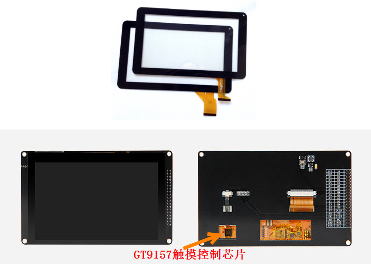

电容触摸屏—触摸画板
-------------------

本章参考资料：《IMXRT1050RM(参考手册)》。

关于开发板配套的触摸屏参数可查阅《5.0寸触摸屏面板说明》，触摸面板配套的触摸控制芯片可查阅《电容触控芯片GT9157
Datasheet》及《gt91x编程指南》配套资料获知。对于7寸电容屏，请查阅《电容触摸芯片GT911》相关的数据手册，7寸电容屏的驱动原理与5寸电容屏的类似，仅写入触摸芯片的配置参数有细节差异。

在前面我们学习了如何使用eLCDIF外设控制液晶屏并用它显示各种图形及文字，利用液晶屏，RT1052的系统具有了高级信息输出功能，然而我们还希望有用户友好的输入设备，触摸屏是不二之选，目前大部分电子设备都使用触摸屏配合液晶显示器组成人机交互系统。

触摸屏简介
~~~~~~~~~~

触摸屏又称触控面板，它是一种把触摸位置转化成坐标数据的输入设备，根据触摸屏的检测原理，主要分为电阻式触摸屏和电容式触摸屏。相对来说，电阻屏造价便宜，能适应较恶劣的环境，但它只支持单点触控(一次只能检测面板上的一个触摸位置)，触摸时需要一定的压力，使用久了容易造成表面磨损，影响寿命；而电容屏具有支持多点触控、检测精度高的特点，电容屏通过与导电物体产生的电容效应来检测触摸动作，只能感应导电物体的触摸，湿度较大或屏幕表面有水珠时会影响电容屏的检测效果。

图 26‑1单电阻屏、电阻液晶屏（带触摸控制芯片）

图 26‑2单电容屏、电容液晶屏(带触摸控制芯片)

图 26‑1和图
26‑2分别是带电阻触摸屏及电容触摸屏的两种屏幕，从外观上并没有明显的区别，区分电阻屏与电容屏最直接的方法就是使用绝缘物体点击屏幕，因为电阻屏通过压力能正常检测触摸动作，而该绝缘物体无法影响电容屏所检测的信号，因而无法检测到触摸动作。目前电容式触摸屏被大部分应用在智能手机、平板电脑等电子设备中，而在汽车导航、工控机等设备中电阻式触摸屏仍占主流。

电阻式触摸屏检测原理
^^^^^^^^^^^^^^^^^^^^

电阻式的触摸屏结构见图
26‑3。它主要由表面硬涂层、两个ITO层、间隔点以及玻璃底层构成，这些结构层都是透明的，整个触摸屏覆盖在液晶面板上，透过触摸屏可看到液晶面板。表面涂层起到保护作用，玻璃底层起承载的作用，而两个ITO层是触摸屏的关键结构，它们是涂有铟锡金属氧化物的导电层。两个ITO层之间使用间隔点使两层分开，当触摸屏表面受到压力时，表面弯曲使得上层ITO与下层ITO接触，在触点处连通电路。

图 26‑3 电阻式触摸屏结构

两个ITO涂层的两端分别引出X-、X+、Y-、Y+四个电极，见图
26‑4，这是电阻屏最常见的四线结构，通过这些电极，外部电路向这两个涂层可以施加匀强电场或检测电压。

图 26‑4 XY的ITO层结构

当触摸屏被按下时，两个ITO层相互接触，从触点处把ITO层分为两个电阻，且由于ITO层均匀导电，两个电阻的大小与触点离两电极的距离成比例关系，利用这个特性，可通过以下过程来检测坐标，这也正是电阻触摸屏名称的由来，见图
26‑5。

-  计算X坐标时，在X+电极施加驱动电压V\ :sub:`ref`\ ，X-极接地，所以X+与X-处形成了匀强电场，而触点处的电压通过Y+电极采集得到，由于ITO层均匀导电，触点电压与V\ :sub:`ref`\ 之比等于触点X坐标与屏宽度之比，从而：

.. math:: x = \frac{V_{Y +}}{V_{\text{ref}}} \times Width

-  计算Y坐标时，在Y+电极施加驱动电压V\ :sub:`ref`\ ，Y-极接地，所以Y+与Y-处形成了匀强电场，而触点处的电压通过X+电极采集得到，由于ITO层均匀导电，触点电压与V\ :sub:`ref`\ 之比等于触点Y坐标与屏高度之比，从而：

.. math:: y = \frac{V_{Y +}}{V_{\text{ref}}} \times Height

图 26‑5 触摸检测等效电路

为了方便检测触摸的坐标，一些芯片厂商制作了电阻屏专用的控制芯片，控制上述采集过程、采集电压，外部微控制器直接与触摸控制芯片通讯直接获得触点的电压或坐标。如图
26‑1中我们生产的这款3.2寸电阻触摸屏就是采用XPT2046芯片作为触摸控制芯片，XPT2046芯片控制4线电阻触摸屏，STM32与XPT2046采用SPI通讯获取采集得的电压，然后转换成坐标。

电容式触摸屏检测原理
^^^^^^^^^^^^^^^^^^^^

与电阻式触摸屏不同，电容式触摸屏不需要通过压力使触点变形，再通过触点处电压值来检测坐标，它的基本原理和前面定时器章节中介绍的电容按键类似，都是利用充电时间检测电容大小，从而通过检测出电容值的变化来获知触摸信号。见图
26‑6，电容屏的最上层是玻璃(不会像电阻屏那样形变)，核心层部分也是由ITO材料构成的，这些导电材料在屏幕里构成了人眼看不见的静电网，静电网由多行X轴电极和多列Y轴电极构成，两个电极之间会形成电容。触摸屏工作时，X轴电极发出AC交流信号，而交流信号能穿过电容，即通过Y轴能感应出该信号，当交流电穿越时电容会有充放电过程，检测该充电时间可获知电容量。若手指触摸屏幕，会影响触摸点附近两个电极之间的耦合，从而改变两个电极之间的电容量，若检测到某电容的电容量发生了改变，即可获知该电容处有触摸动作（这就是为什么它被称为电容式触摸屏以及绝缘体触摸没有反应的原因）。

图 26‑6 电容触摸屏基本原理

电容屏ITO层的结构见图
26‑7，这是比较常见的形式，电极由多个菱形导体组成，生产时使用蚀刻工艺在ITO层生成这样的结构。

.. image:: media/image7.jpeg
   :align: center
   :alt: image7
   :name: 图26_7

图 26‑7 电容触摸屏的ITO层结构

X轴电极与Y轴电极在交叉处形成电容，即这两组电极构成了电容的两极，这样的结构覆盖了整个电容屏，每个电容单元在触摸屏中都有其特定的物理位置，即电容的位置就是它在触摸屏的XY坐标。检测触摸的坐标时，第1条X轴的电极发出激励信号，而所有Y轴的电极同时接收信号，通过检测充电时间可检测出各个Y轴与第1条X轴相交的各个互电容的大小，各个X轴依次发出激励信号，重复上述步骤，即可得到整个触摸屏二维平面的所有电容大小。当手指接近时，会导致局部电容改变，根据得到的触摸屏电容量变化的二维数据表，可以得知每个触摸点的坐标，因此电容触摸屏支持多点触控。

其实电容触摸屏可看作是多个电容按键组合而成，就像机械按键中独立按键和矩阵按键的关系一样，甚至电容触摸屏的坐标扫描方式与矩阵按键都是很相似的。

电容触摸屏控制芯片
~~~~~~~~~~~~~~~~~~

相对来说，电容屏的坐标检测比电阻屏的要复杂，因而它也有专用芯片用于检测过程，下面我们以本章重点讲述的电容屏使用的触控芯片GT9157为例进行讲解，关于它的详细说明可从《gt91x编程指南》和《电容触控芯片GT9157》文档了解。（7寸屏使用GT911触控芯片，原理类似）

GT9157芯片的引脚
^^^^^^^^^^^^^^^^

GT9157芯片的外观可以图 26‑2中找到，其内部结构框图见图 26‑8。

图 26‑8 GT9157结构框图

该芯片对外引出的信号线介绍如下：

表 26‑1 GT9157信号线说明

+-----------------------------------+-------------------------------------------------------------+
|              信号线               |                            说明                             |
+===================================+=============================================================+
| AVDD、AVDD18、DVDD12、VDDDIO、GND | 电源和地                                                    |
+-----------------------------------+-------------------------------------------------------------+
| Driving channels                  | 激励信号输出的引脚，一共有0-25个引脚，它连接到电容屏ITO层引 |
|                                   | 出的各个激励信号轴                                          |
+-----------------------------------+-------------------------------------------------------------+
| Sensing channels                  | 信号检测引脚，一共有0-13个引脚，它连接到电容屏ITO层引出的各 |
|                                   | 个电容量检测信号轴                                          |
+-----------------------------------+-------------------------------------------------------------+
| I2C                               | I2C通信信号线，包含SCL与SDA，外部控制器通过它与GT915        |
|                                   | 7芯片通讯，配置GT9157的工作方式或获取坐标信号               |
+-----------------------------------+-------------------------------------------------------------+
| INT                               | 中断信号，GB9157芯片通过它告诉外部控制器有新的触摸事件      |
+-----------------------------------+-------------------------------------------------------------+
| /RSTB                             | 复位引脚，用于复位GT9157芯片；在上电时还与INT引脚配合设置   |
|                                   | IIC通讯的设备地址                                           |
+-----------------------------------+-------------------------------------------------------------+

若您把电容触摸屏与液晶面板分离开来，在触摸面板的背面，可看到它的边框有一些电路走线，它们就是触摸屏ITO层引出的XY轴信号线，这些信号线分别引出到GT9157芯片的Driving
channels及Sensing
channels引脚中。也正是因为触摸屏有这些信号线的存在，所以手机厂商追求的屏幕无边框是比较难做到的。

上电时序与I2C设备地址
^^^^^^^^^^^^^^^^^^^^^

GT9157触控芯片有两个备选的I2C通讯地址，这是由芯片的上电时序设定的，见图
26‑9。上电时序有Reset引脚和INT引脚生成，若Reset引脚从低电电平转变到高电平期间，INT引脚为高电平的时候，触控芯片使用的I2C设备地址为0x28/0x29(8位写、读地址)，7位地址为0x14；若Reset引脚从低电电平转变到高电平期间，INT引脚一直为低电平，则触控芯片使用的I2C设备地址为0xBA/0xBB(8位写、读地址)，7位地址为0x5D。

图 26‑9 GT9157的上电时序及I2C设备地址

寄存器配置
^^^^^^^^^^

上电复位后，GT9157芯片需要通过外部主控芯片加载寄存器配置，设定它的工作模式，这些配置通过I2C信号线传输到GT9157，它的配置寄存器地址都由两个字节来表示，这些寄存器的地址从0x8047-0x8100，一般来说，我们实际配置的时候会按照GT9157生产厂商给的默认配置来控制芯片，仅修改部分关键寄存器，其中部分寄存器说明见图
26‑10。

图 26‑10 部分寄存器配置说明

这些寄存器介绍如下：

(1) 配置版本寄存器

    0x8047配置版本寄存器，它包含有配置文件的版本号，若新写入的版本号比原版本大，或者版本号相等，但配置不一样时，才会更新配置文件到寄存器中。其中配置文件是指记录了寄存器0x8048-0x80FE控制参数的一系列数据。

    为了保证每次都更新配置，我们一般把配置版本寄存器设置为“0x00”，这样版本号会默认初始化为‘A’，这样每次我们修改其它寄存器配置的时候，都会写入到GT9157中。

(1) X、Y分辨率

    0x8048-0x804B寄存器用于配置触控芯片输出的XY坐标的最大值，为了方便使用，我们把它配置得跟液晶面板的分辨率一致，这样就能使触控芯片输出的坐标一一对应到液晶面板的每一个像素点了。

(1) 触点个数

    0x804C触点个数寄存器用于配置它最多可输出多少个同时按下的触点坐标，这个极限值跟触摸屏面板有关，如我们本章实验使用的触摸面板最多支持5点触控。

(1) 模式切换

    0x804D模式切换寄存器中的X2Y位可以用于交换XY坐标轴；而INT触发方式位可以配置不同的触发方式，当有触摸信号时，INT引脚会根据这里的配置给出触发信号。

(1) 配置校验

    0x80FF配置校验寄存器用于写入前面0x8047-0x80FE寄存器控制参数字节之和的补码，GT9157收到前面的寄存器配置时，会利用这个数据进行校验，若不匹配，就不会更新寄存器配置。

(1) 配置更新

    0x8100配置更新寄存器用于控制GT9157进行更新，传输了前面的寄存器配置并校验通过后，对这个寄存器写1，GT9157会更新配置。

读取坐标信息
^^^^^^^^^^^^

坐标寄存器
''''''''''''''''''''''''''''''''''

上述寄存器主要是由外部主控芯片给GT9157写入配置的，而它则使用图
26‑11中的寄存器向主控器反馈信息。

图 26‑11 坐标信息寄存器

(1) 产品ID及版本

..

    0x8140-0x8143
    寄存器存储的是产品ID，上电后我们可以利用I2C读取这些寄存器的值来判断I2C是否正常通讯，这些寄存器中包含有“9157”字样;
    而0x8144-0x8145则保存有固件版本号，不同版本可能不同。

(1) X/Y分辨率

    0x8146-0x8149寄存器存储了控制触摸屏的分辨率，它们的值与我们前面在配置寄存器写入的XY控制参数一致。所以我们可以通过读取这两个寄存器的值来确认配置参数是否正确写入。

(1) 状态寄存器

    0x814E地址的是状态寄存器，它的Buffer
    status位存储了坐标状态，当它为1时，表示新的坐标数据已准备好，可以读取，0表示未就绪，数据无效，外部控制器读取完坐标后，须对这个寄存器位写0
    。number of touch
    points位表示当前有多少个触点。其余数据位我们不关心。

(1) 坐标数据

    从地址0x814F-0x8156的是触摸点1的坐标数据，从0x8157-0x815E的是触摸点2的坐标数据，依次还有存储3-10触摸点坐标数据的寄存器。读取这些坐标信息时，我们通过它们的track
    id来区分笔迹，多次读取坐标数据时，同一个track
    id号里的数据属于同一个连续的笔划轨迹。

读坐标流程
''''''''''''''''''''''''''''''''''

上电、配置完寄存器后，GT9157就会开监测触摸屏，若我们前面的配置使INT采用中断上升沿报告触摸信号的方式，整个读取坐标信息的过程如下：

(1) 待机时INT引脚输出低电平；

(2) 有坐标更新时，INT引脚输出上升沿；

(3) INT输出上升沿后，INT 脚会保持高直到下一个周期（该周期可由配置
    Refresh_Rate
    决定）。外部主控器在检测到INT的信号后，先读取状态寄存器(0x814E)中的number
    of touch
    points位获当前有多少个触摸点，然后读取各个点的坐标数据，读取完后将
    buffer status位写为
    0。外部主控器的这些读取过程要在一周期内完成，该周期由0x8056地址的Refresh_Rate寄存器配置；

(4) 上一步骤中INT输出上升沿后，若主控未在一个周期内读走坐标，下次 GT9157
    即使检测到坐标更新会再输出一个 INT 脉冲但不更新坐标；

(5) 若外部主控一直未读走坐标，则 GT9 会一直输出 INT 脉冲。

电容触摸屏—触摸画板实验
~~~~~~~~~~~~~~~~~~~~~~~

本小节讲解如何驱动电容触摸屏，并利用触摸屏制作一个简易的触摸画板应用。

学习本小节内容时，请打开配套的“电容触摸屏—触摸画板”工程配合阅读。

硬件设计
^^^^^^^^

图 26‑12 液晶屏实物图

本实验使用的液晶电容屏实物见图 24‑13，屏幕背面的PCB电路对应图 24‑15、图
24‑19中的原理图，分别是触摸屏接口及排针接口。

我们这个触摸屏出厂时就与GT9157芯片通过柔性电路板连接在一起了，柔性电路板从GT9157芯片引出VCC、GND、SCL、SDA、RSTN及INT引脚，再通过FPC座子引出到屏幕的PCB电路板中，PCB电路板加了部分电路，如I2C的上拉电阻，然后把这些引脚引出到屏幕右侧的排针处，方便整个屏幕与外部器件相连。

.. image:: media/image13.jpeg
   :align: center
   :alt: image13
   :name: 图26_13

图 26‑13 电容屏接口

以上是我们RT1052实验板使用的5寸屏原理图，它通过屏幕上的排针接入到实验板的液晶排母接口，与RT1052芯片的引脚相连，连接见图
24‑19。

图 26‑14 屏幕与实验板的引脚连接

图 24‑19中35-38号引脚即电容触摸屏相关的控制引脚。

以上原理图可查阅《LCD5.0-黑白原理图》及《秉火F429开发板黑白原理图》文档获知，若您使用的液晶屏或实验板不一样，请根据实际连接的引脚修改程序。

软件设计
^^^^^^^^

本工程中的GT9157芯片驱动主要是从官方提供的Linux驱动修改过来的，我们把这部分文件存储到“gt9xx.c”及“gt9xx.h”文件中，而这些驱动的底层I2C通讯接口我们存储到了“bsp_i2c_touch.c”及“bsp_i2c_touch.h”文件中，这些文件也可根据您的喜好命名，它们不属于STM32标准库的内容，是由我们自己根据应用需要编写的。在我们提供的资料《gt9xx_1.8_drivers.zip》压缩包里有官方的原Linux驱动，感兴趣的读者可以对比这些文件，了解如何移植驱动。

编程要点
''''''''

(1) 分析官方的gt9xx驱动，了解需要提供哪些底层接口；

(2) 编写底层驱动接口；

(3) 利用gt9xx驱动，获取触摸坐标；

(4) 编写测试程序检验驱动。

代码分析
''''''''

触摸屏硬件相关宏定义
**********************************

根据触摸屏与STM32芯片的硬件连接，我们把触摸屏硬件相关的配置都以宏的形式定义到
“bsp_i2c_touch.h”文件中，见代码清单 22‑12。

.. code-block:: c
   :name: 代码清单 26‑1 触摸屏硬件配置相关的宏(bsp_i2c_touch.h文件)
   :caption: 代码清单 26‑1 触摸屏硬件配置相关的宏(bsp_i2c_touch.h文件)
   :linenos:

    /*************************第一部分*******************************/
    /* 选择 USB1 PLL (PLL3 480 MHz) 作为 lpi2c 时钟源 */
    #define LPI2C_CLOCK_SOURCE_SELECT (0U)
    /* 设置USB1 PLL时钟到LPI2C根时钟的时钟分频  */
    #define LPI2C_CLOCK_SOURCE_DIVIDER (5U)
    /* 读取 lpi2c 时钟频率 */
    #define LPI2C_CLOCK_FREQUENCY ((CLOCK_GetFreq(kCLOCK_Usb1PllClk) \
                        / 8) / (LPI2C_CLOCK_SOURCE_DIVIDER + 1U))
    #define LPI2C_MASTER_CLOCK_FREQUENCY  LPI2C_CLOCK_FREQUENCY
    
    /***********************第二部分*******************************/
    /*LPI2C相关宏定义*/
    #define GTP_I2C_MASTER_BASE   (LPI2C1_BASE)    //定义使用的I2C
    //定义I2C控制寄存器
    #define GTP_I2C_MASTER        ((LPI2C_Type *)GTP_I2C_MASTER_BASE)
    #define GTP_I2C_BAUDRATE      400000U     //定义I2C波特率
    
    /* 等待超时时间 */
    #define I2CT_FLAG_TIMEOUT    ((uint32_t)0x1000)  //等待超时时间设定
    //长等待时间设定
    #define I2CT_LONG_TIMEOUT     ((uint32_t)(10 * I2CT_FLAG_TIMEOUT))
    
    /***********************第三部分******************************/
    /*! @brief 触摸芯片引脚定义 */
    /*LPI2C时钟引脚*/ 
    #define TOUCH_PAD_SCL_IOMUXC  IOMUXC_GPIO_AD_B1_00_LPI2C1_SCL
    /*LPI2C数据引脚*/ 
    #define TOUCH_PAD_SDA_IOMUXC  IOMUXC_GPIO_AD_B1_01_LPI2C1_SDA
    
    /*定义触摸芯片的复位引脚*/
    #define TOUCH_PAD_RST_GPIO       GPIO1
    #define TOUCH_PAD_RST_GPIO_PIN      (2U)
    #define TOUCH_PAD_RST_IOMUXC      OMUXC_GPIO_AD_B0_02_GPIO1_IO02
    
    /*定义芯片的中断输出引脚*/
    #define TOUCH_PAD_INT_GPIO      GPIO1
    #define TOUCH_PAD_INT_GPIO_PIN      (11U)
    #define TOUCH_PAD_INT_IOMUXC      IOMUXC_GPIO_AD_B0_11_GPIO1_IO11
    
    /****************************第四部分****************************/
    /*触摸中断定义*/
    #define TOUCH_PAD_INT_IRQ       GPIO1_Combined_0_15_IRQn
    #define TOUCH_PAD_IRQHANDLER        GPIO1_Combined_0_15_IRQHandler

以上代码根据硬件的连接，把与触摸屏通讯使用的引脚号、引脚源以及复用功能映射都以宏封装起来。各部分宏定义的作用简单说明如下：

-  第一部分，定义时钟相关宏定义。包括时钟源选择、时钟分频设定以及时钟频率的获取。

-  第二部分，定义LPI2C相关宏定义。主要包括LPI2C基址定义、波特率定义以及等待超时时间定义。

-  第三部分，定义触摸芯片引脚。触摸芯片共占用RT1052
   4个引脚，其中LPI2C占用的两个引脚我们只定义其复用功能即可，引脚电平状态由LPI2C硬件电路决定。

-  第四部分，定义本次使用的中断和中断服务函数。

初始化触摸屏控制引脚 
**********************************

利用上面的宏，编写eLCDIF的触摸屏控制引脚的初始化函数，见代码清单 26‑2。

.. code-block:: c
   :name: 代码清单 26‑2触摸屏控制引脚的GPIO初始化函数(bsp_i2c_touch.c)
   :caption: 代码清单 26‑2触摸屏控制引脚的GPIO初始化函数(bsp_i2c_touch.c)
   :linenos:

    /**********************第一部分**************************/
    /**
    * @brief  初始化触摸相关IOMUXC的MUX复用配置
    */
    static void I2C_GTP_IOMUXC_MUX_Config(void)
    {
    /* SCL和SDA引脚，需要使能SION以接收数据 */
    IOMUXC_SetPinMux(TOUCH_PAD_SCL_IOMUXC, 1U);                                   
    IOMUXC_SetPinMux(TOUCH_PAD_SDA_IOMUXC, 1U);  
    
    /* RST和INT引脚 */
    IOMUXC_SetPinMux(TOUCH_PAD_RST_IOMUXC, 0U);                                   
    IOMUXC_SetPinMux(TOUCH_PAD_INT_IOMUXC, 0U);
    }

    /**********************第二部分**************************/
    /**
    * @brief  初始化触摸相关IOMUXC的PAD属性配置
    */
    static void I2C_GTP_IOMUXC_PAD_Config(void)
    {
    /* SCL和SDA引脚 */
    IOMUXC_SetPinConfig(TOUCH_PAD_SCL_IOMUXC, I2C_PAD_CONFIG_DATA);               
    IOMUXC_SetPinConfig(TOUCH_PAD_SDA_IOMUXC, I2C_PAD_CONFIG_DATA); 
    
    /* RST和INT引脚 */
    IOMUXC_SetPinConfig(TOUCH_PAD_RST_IOMUXC, GTP_RST_INT_PAD_CONFIG_DATA); 
    IOMUXC_SetPinConfig(TOUCH_PAD_INT_IOMUXC, GTP_RST_INT_PAD_CONFIG_DATA);     
    }

以上代码初始化触摸芯片相关引脚复用功能以及PAD属性。引脚输入中断的设置以I2C设备地址的设置放在了

配置I2C的模式
*****************

.. code-block:: c
   :name: 代码清单 26‑3配置I2C工作模式(bsp_i2c_touch.c)
   :caption: 代码清单 26‑3配置I2C工作模式(bsp_i2c_touch.c)
   :linenos:

    void GTP_I2C_ModeInit(void)
    {
    lpi2c_master_config_t masterConfig; 
    
    /* 配置时钟 LPI2C */
    CLOCK_SetMux(kCLOCK_Lpi2cMux, LPI2C_CLOCK_SOURCE_SELECT);
    CLOCK_SetDiv(kCLOCK_Lpi2cDiv, LPI2C_CLOCK_SOURCE_DIVIDER);
    
    /*给masterConfig赋值为以下默认配置*/
    /*
    * masterConfig.debugEnable = false;
    * masterConfig.ignoreAck = false;
    * masterConfig.pinConfig = kLPI2C_2PinOpenDrain;
    * masterConfig.baudRate_Hz = 100000U;
    * masterConfig.busIdleTimeout_ns = 0;
    * masterConfig.pinLowTimeout_ns = 0;
    * masterConfig.sdaGlitchFilterWidth_ns = 0;
    * masterConfig.sclGlitchFilterWidth_ns = 0;
    */
    LPI2C_MasterGetDefaultConfig(&masterConfig);
    
    /* 把默认波特率改为I2C_BAUDRATE */
    masterConfig.baudRate_Hz = GTP_I2C_BAUDRATE;
    
    /*  使用以上配置初始化 LPI2C 外设 */
    LPI2C_MasterInit(GTP_I2C_MASTER, &masterConfig,\
                        LPI2C_MASTER_CLOCK_FREQUENCY);
    
    /* 创建 LPI2C 非阻塞传输的句柄 */
    LPI2C_MasterTransferCreateHandle(GTP_I2C_MASTER,\
                    &g_m_handle, I2C_Master_Callback, NULL);
    
    }

接下来需要配置I2C的工作模式，GT9157芯片使用的是标准7位地址模式的I2C通讯，所以I2C这部分的配置跟我们在EEPROM实验中的是一样的，不了解这部分内容的请阅读EEPROM章节。

使用上电时序设置触摸屏的I2C地址
**********************************

完成触摸芯片相关的引脚初始化后，就可以开始控制这些引脚对触摸屏进行控制了，为了使用I2C通讯，首先要根据GT9157芯片的上电时序给它设置I2C设备地址，见代码清单
26‑4。

.. code-block:: c
   :name: 代码清单 26‑4使用上电时序设置触摸屏的I2C地址(bsp_i2c_touch.c)
   :caption: 代码清单 26‑4使用上电时序设置触摸屏的I2C地址(bsp_i2c_touch.c)
   :linenos:

    void GTP_ResetChip(void)
    {
    /*************************第一部分************************/
    /* 先把RST INT配置为输出模式 */
    gpio_pin_config_t rst_int_config ={kGPIO_DigitalOutput,0,kGPIO_NoIntmode};
    /* 初始化 RST INT 引脚 */
    GPIO_PinInit(TOUCH_PAD_RST_GPIO,TOUCH_PAD_RST_GPIO_PIN,&rst_int_config);
    GPIO_PinInit(TOUCH_PAD_INT_GPIO, TOUCH_PAD_INT_GPIO_PIN,&rst_int_config);
    
    /************************第二部分************************/
    /*把gt9157的设备地址被配置为0xBA：
    1.RST、INT低电平
    2.至少延时100us
    3.RST切换为高电平
    4.至少延时5ms
    5.INT切换为浮空输入 */
    
    /*复位为低电平，为初始化做准备*/
    GPIO_PinWrite(TOUCH_PAD_INT_GPIO, TOUCH_PAD_INT_GPIO_PIN, 0U);
    GPIO_PinWrite(TOUCH_PAD_RST_GPIO, TOUCH_PAD_RST_GPIO_PIN, 0U);
    
    CPU_TS_Tmr_Delay_US(200);
    
    /*拉高一段时间，进行初始化*/
    GPIO_PinWrite(TOUCH_PAD_RST_GPIO, TOUCH_PAD_RST_GPIO_PIN, 1U);
    
    CPU_TS_Tmr_Delay_MS(20);
    
    /***********************第三部分*************************/
    //INT配置成中断输入
    rst_int_config.direction = kGPIO_DigitalInput;
    rst_int_config.outputLogic = 0;
    rst_int_config.interruptMode = kGPIO_IntRisingEdge;
    
    GPIO_PinInit(TOUCH_PAD_INT_GPIO, TOUCH_PAD_INT_GPIO_PIN, &rst_int_config);
    
    /* 使能引脚中断 */  
    GPIO_PortEnableInterrupts(TOUCH_PAD_INT_GPIO,1U<<TOUCH_PAD_INT_GPIO_PIN);
    }

下面简单讲解各部分代码：

-  第一部分，配置复位引脚（RST）与中断引脚（INT）的输出模式。rst_int_config变量定义了引脚输出状态为输出模式、初始状态为低电平、不使用中断。将RST引脚与INT引脚都设置输出模式并且为低电平，为触摸芯片I2C物理地址设置时序做准备。

-  第二部分，设置触摸芯片I2C物理地址。在26.2.2
   上电时序与I2C设备地址章节详细介绍了触摸芯片I2C物理地址设置方法，本实验将GT9157设备地址设置为0xBA，具体过程如下：

1) RST、INT低电平。

2) 延时200us。

3) RST切换为高电平。

4) 延时20ms.

5) INT切换为浮空输入。

设置完成后I2C写地址为0xBA，读地址为0xBB,即(0xBA|0x01)。输出完上电时序后，把STM32的INT引脚模式改成浮空输入模式，使它可以接收触控芯片输出的触摸中断信号。接下设中断。

-  第三部分，配置中断。当触摸芯片检测到触摸时通过中断引脚通知单片机读取按下位置坐标。这部分代码就是用于配置外部引脚输入中断。这个INT引脚我们配置为上升沿触发，要和后面写入到触控芯片的配置参数一致。

初始化封装
*****************

利用以上函数，我们把信号引脚及I2C设备地址初始化的过程都封装到函数I2C_Touch_Init中，见代码清单26‑5。

.. code-block:: c
   :name: 代码清单 26‑5 封装引脚初始化及上电时序(bsp_i2c_touch.c文件)
   :caption: 代码清单 26‑5 封装引脚初始化及上电时序(bsp_i2c_touch.c文件)
   :linenos:

    /**
    * @brief  触摸引脚及芯片初始化
    */
    void I2C_Touch_Init(void)
    {
    /* 初始化各引脚IOMUXC相关 */
    I2C_GTP_IOMUXC_MUX_Config();
    I2C_GTP_IOMUXC_PAD_Config();
    
    /* 初始化I2C外设工作模式 */
    GTP_I2C_ModeInit(); 
    
    /* 复位触摸芯片，配置地址 */
    GTP_ResetChip();
    GTP_IRQDisable();
    }

I2C基本读写函数
*****************

为了与上层“gt9xx.c”驱动文件中的函数对接，本实验中的I2C读写函数与EEPROM实验中的有稍微不同，见代码清单
24‑18。

.. code-block:: c
   :name: 代码清单 26‑6 I2C基本读写函数(bsp_i2c_touch.c文件)
   :caption: 代码清单 26‑6 I2C基本读写函数(bsp_i2c_touch.c文件)
   :linenos:

    /**
    * @brief   使用IIC读取数据
    * @param   
    *   @arg ClientAddr:从设备地址
    *   @arg pBuffer:存放由从机读取的数据的缓冲区指针
    *   @arg NumByteToRead:读取的数据长度
    * @note NumByteToRead <= 256
    * @retval  无
    */
    uint32_t I2C_ReadBytes(uint8_t ClientAddr,uint8_t* pBuffer,\
                                    uint16_t NumByteToRead)
    {
    lpi2c_master_transfer_t masterXfer = {0};
    status_t reVal = kStatus_Fail;
    /* 400Kbps,传输一个字节(9bits)至少23us，这里按每字节1024us来算*/
    uint32_t i2c_timeout = NumByteToRead<<10;
    
    /* subAddress = 0x00, data = pBuffer 自从机处接收
    起始信号start + 设备地址slaveaddress(w 写方向) + 子地址subAddress + 
    重复起始信号repeated start + 设备地址slaveaddress(r 读方向) + 
    接收缓冲数据rx data buffer + 停止信号stop */
    masterXfer.slaveAddress = (ClientAddr>>1);
    masterXfer.direction = kLPI2C_Read;
    masterXfer.subaddress = (uint32_t)0;
    masterXfer.subaddressSize = 0;
    masterXfer.data = pBuffer;
    masterXfer.dataSize = NumByteToRead;
    masterXfer.flags = kLPI2C_TransferDefaultFlag;
    
    reVal = LPI2C_MasterTransferNonBlocking(GTP_I2C_MASTER,\
                                    &g_m_handle, &masterXfer);
    if (reVal != kStatus_Success)
    {
        return 1;
    }
    /* 复位传输完成标志 */
    g_MasterCompletionFlag = false;
    
    /* 等待传输完成 */
    while (!g_MasterCompletionFlag)
    {
        CPU_TS_Tmr_Delay_US(1);
        if((i2c_timeout--) == 0) return I2C_Timeout_Callback(0);
    }
    g_MasterCompletionFlag = false;
    
    return 0;
    }
    
    /**
    * @brief   使用IIC写入数据
    * @param   
    *   @arg ClientAddr:从设备地址
    *   @arg pBuffer:缓冲区指针
    *     @arg NumByteToWrite:写的字节数
    * @retval  无
    */
    uint32_t I2C_WriteBytes(uint8_t ClientAddr,uint8_t* pBuffer,\
                                        uint8_t NumByteToWrite)
    {
    lpi2c_master_transfer_t masterXfer = {0};
    status_t reVal = kStatus_Fail;
    /* 400Kbps,传输一个字节(9bits)至少23us，这里按每字节1024us来算*/
    uint32_t i2c_timeout = NumByteToWrite<<10;
    
    
    /* subAddress = 0x00, data = pBuffer 发送至从机
    起始信号start + 设备地址slaveaddress(w 写方向) + 
    发送缓冲数据tx data buffer + 停止信号stop */
    
    masterXfer.slaveAddress = (ClientAddr>>1);
    masterXfer.direction = kLPI2C_Write;
    masterXfer.subaddress = (uint32_t)0;
    masterXfer.subaddressSize = 0;
    masterXfer.data = pBuffer;
    masterXfer.dataSize = NumByteToWrite;
    masterXfer.flags = kLPI2C_TransferDefaultFlag;
    
    reVal = LPI2C_MasterTransferNonBlocking(GTP_I2C_MASTER,\
        &g_m_handle, &masterXfer);
    if (reVal != kStatus_Success)
    {
        return 1;
    }
    /* 复位传输完成标志 */
    g_MasterCompletionFlag = false;
    
    /* 等待传输完成 */
    while (!g_MasterCompletionFlag)
    {
        CPU_TS_Tmr_Delay_US(1);
        if((i2c_timeout--) == 0) return I2C_Timeout_Callback(1);
    }
    g_MasterCompletionFlag = false;
    
    return 0;
    
    }
    
    /**
    * @brief  IIC等待超时调用本函数输出调试信息
    * @param  None.
    * @retval 返回0xff，表示IIC读取数据失败
    */
    static  uint32_t I2C_Timeout_Callback(uint8_t errorCode)
    {
    /* Block communication and all processes */
    GTP_ERROR("I2C 等待超时!errorCode = %d",errorCode);
    
    return 0xFF;
    }

这里的读写函数都是很纯粹的I2C通讯过程，即读函数只有读过程，不包含发送寄存器地址的过程，而写函数也是只有写过程，没有包含寄存器的地址，大家可以对比一下它们与前面EEPROM实验中的差别。这两个函数都只包含从I2C的设备地址、缓冲区指针以及数据量。

Linux的I2C驱动接口
********************

使用前面的基本读写函数，主要是为了对接原“gt9xx.c”驱动里使用的Linux
I2C接口函数I2C_Transfer，实现了这个函数后，移植时就可以减少“gt9xx.c”文件的修改量。I2C_Transfer函数见代码清单26‑7。

.. code-block:: c
   :name: 代码清单 26‑7 Linux的I2C驱动接口(bsp_touch_gtxx.c)
   :caption: 代码清单 26‑7 Linux的I2C驱动接口(bsp_touch_gtxx.c)
   :linenos:

    /* 表示读数据 */ 
    #define I2C_M_RD    0x0001  
    /*
    * 存储I2C通讯的信息
    * @addr：  从设备的I2C设备地址  
    * @flags: 控制标志
    * @len：  读写数据的长度
    * @buf：  存储读写数据的指针
    **/
    struct i2c_msg {
    uint8_t addr;   /*从设备的I2C设备地址 */
    uint16_t flags;         /*控制标志*/
    uint16_t len;   /*读写数据的长度*/
    uint8_t *buf;   /*存储读写数据的指针*/
    };

    static int I2C_Transfer( struct i2c_msg *msgs,int num)
    {
    int im = 0;
    int ret = 0;

    GTP_DEBUG_FUNC();

    for (im = 0; ret == 0 && im != num; im++)
    {
    if ((msgs[im].flags&I2C_M_RD))  //根据flag判断是读数据还是写数据
    {
    /*IIC读取数据*/
    ret = I2C_ReadBytes(msgs[im].addr, msgs[im].buf, msgs[im].len);   
    } 
    else
    {
    /*IIC写入数据*/
    ret = I2C_WriteBytes(msgs[im].addr,  msgs[im].buf, msgs[im].len); 
    }
    }

    if(ret)
    return ret;

    return im;//正常完成的传输结构个数
    }

I2C_Transfer的主要输入参数是i2c_msg结构体的指针以及要传输多少个这样的结构体。i2c_msg结构体包含以下几个成员：

(1) addr

    这是从机的I2C设备地址，通讯时无论是读方向还是写方向，给这个成员赋值为写地址即可(本实验中为0xBA)。

(1) flags

    这个成员存储了控制标志，它用于指示本i2c_msg结构体要求以什么方式来传输。在原Linux驱动中有很多种控制方式，在我们这个工程中，只支持读或写控制标志，flags被赋值为I2C_M_RD宏的时候表示读方向，其余值表示写方向。

(1) len

    本成员存储了要读写的数据长度。

(1) buf

    本成员存储了指向读写数据缓冲区的指针。

利用这个结构体，我们再来看I2C_Transfer函数做了什么工作。

(1) 输入参数中可能包含有多个要传输的i2c_msg结构体，利用for循环把这些结构体一个个地传输出去；

(2) 传输的时候根据i2c_msg结构体中的flags标志，确定应该调用I2C读函数还是写函数，这些函数即前面定义的I2C基本读写函数。调用这些函数的时候，以i2c_msg结构体的成员作为参数。

I2C复合读写函数
*****************

理解了I2C_Transfer函数的代码，我们发现它还是什么都没做，只是对I2C基本读写函数封装了比较特别的调用形式而已，而我们知道GT9157触控芯片都有很多不同的寄存器，如果我们仅用上面的函数，如何向特定寄存器写入参数或读取特定寄存器的内容呢？这就需要再利用I2C_Transfer函数编写具有I2C通讯复合时序的读写函数了。Linux驱动进行这样的封装是为了让它的核心层与具体设备独立开来，对于这个巨型系统，这样写代码是很有必要的，上述的I2C_Transfer函数属于Linux内部的驱动层，它对外提供接口，而像GT9157、EEPROM等使用I2C的设备，都利用这个接口编写自己具体的驱动文件，GT9157的这些I2C复合读写函数见代码清单
26‑8。

.. code-block:: c
   :name: 代码清单 26‑8 I2C复合读写函数（bsp_touch_gtxx.c）
   :caption: 代码清单 26‑8 I2C复合读写函数（bsp_touch_gtxx.c）
   :linenos:

    //寄存器地址的长度
    #define GTP_ADDR_LENGTH       2
    
    /**
    * @brief   从IIC设备中读取数据
    * @param
    *     @arg client_addr:设备地址
    *     @arg  buf[0~1]: 读取数据寄存器的起始地址
    *     @arg buf[2~len-1]: 存储读出来数据的缓冲buffer
    *     @arg len:    GTP_ADDR_LENGTH + read bytes count（
                            寄存器地址长度+读取的数据字节数）
    * @retval  i2c_msgs传输结构体的个数，2为成功，其它为失败
    */
    static int32_t GTP_I2C_Read(uint8_t client_addr, uint8_t *buf,
                                    int32_t len)
    {
        struct i2c_msg msgs[2];
        int32_t ret=-1;
        int32_t retries = 0;

        //输出调试信息，可忽略
        GTP_DEBUG_FUNC();
        /*一个读数据的过程可以分为两个传输过程:
        * 1. IIC  写入 要读取的寄存器地址
        * 2. IIC  读取  数据
        * */

        msgs[0].flags = !I2C_M_RD;         //写入
        msgs[0].addr  = client_addr;        //IIC设备地址
        msgs[0].len   = GTP_ADDR_LENGTH;    //寄存器地址为2字节(即写入两字节的数据)
        msgs[0].buf   = &buf[0];             //buf[0~1]存储的是要读取的寄存器地址

        msgs[1].flags = I2C_M_RD;               //读取
        msgs[1].addr  = client_addr;              //IIC设备地址
        msgs[1].len   = len - GTP_ADDR_LENGTH;  //要读取的数据长度
        msgs[1].buf   = &buf[GTP_ADDR_LENGTH];  //buf[GTP_ADDR_LENGTH]之后的缓冲区存储读出的数据

        while (retries < 5) //
        {
            ret = I2C_Transfer( msgs, 2);          //调用IIC数据传输过程函数，有2个传输过程
            if (ret == 2)break;
            retries++;
        }
        if ((retries >= 5))
        {
            //发送失败，输出调试信息
            GTP_ERROR("I2C Read Error");
        }
        return ret;
    }

    /**
    * @brief   向IIC设备写入数据
    * @param
    *     @arg client_addr:设备地址
    *     @arg  buf[0~1]: 要写入的数据寄存器的起始地址
    *     @arg buf[2~len-1]: 要写入的数据
    *     @arg len:    GTP_ADDR_LENGTH + write bytes count（
                        寄存器地址长度+写入的数据字节数）
    * @retval  i2c_msgs传输结构体的个数，1为成功，其它为失败
    */
    static int32_t GTP_I2C_Write(uint8_t client_addr,uint8_t *buf,
                                int32_t len)
    {
        struct i2c_msg msg;
        int32_t ret = -1;
        int32_t retries = 0;

        //输出调试信息，可忽略
        GTP_DEBUG_FUNC();
        /*一个写数据的过程只需要一个传输过程:
        * 1. IIC连续 写入 数据寄存器地址及数据
        * */
        msg.flags = !I2C_M_RD;          //写入
        msg.addr  = client_addr;        //从设备地址
        msg.len   = len;       //长度直接等于(寄存器地址长度+写入的数据字节数)
        msg.buf   = buf;      //直接连续写入缓冲区中的数据(包括了寄存器地址)

        while (retries < 5)
        {
            ret = I2C_Transfer(&msg, 1); //调用IIC数据传输过程函数，1个传输过程
            if (ret == 1)break;
            retries++;
        }
        if ((retries >= 5))
        {
            //发送失败，输出调试信息
            GTP_ERROR("I2C Write Error");
        }
        return ret;
    }

可以看到，复合读写函数都包含有client_addr、buf及len输入参数，其中client_addr表示I2C的设备地址，buf存储了要读写的寄存器地址及数据，len表示buf的长度。在函数的内部处理中，复合读写过程被分解成两个基本的读写过程，输入参数被转化存储到i2c_msg结构体中，每个基本读写过程使用一个i2c_msg结构体来表示，见表
26‑2和表 26‑3。

    表 26‑2 复合读过程的步骤分解

+----------------------+---------------------------------------------------------------+
| 复合读过程的步骤分解 |                             说明                              |
+======================+===============================================================+
| 传输寄存器地址       | 这相当于一个I2C的基本写过程，写入一个2字节长度的寄存器地址，b |
|                      | uf指针的前两个字节内容被解释为寄存器地址。                    |
+----------------------+---------------------------------------------------------------+
| 从寄存器读取内容     | 这是一个I2C的基本读过程，读取到的数据存储到buf指针的第3个地   |
|                      | 址开始的空间中。                                              |
+----------------------+---------------------------------------------------------------+

    表 26‑3 复合写过程的步骤分解

+----------------------+---------------------------------------------------------------+
| 复合写过程的步骤分解 |                             说明                              |
+======================+===============================================================+
| 传输寄存器地址       | 这相当于一个I2C的基本写过程，写入一个2字节长度的寄存器地址，b |
|                      | uf指针的前两个字节内容被解释为寄存器地址。                    |
+----------------------+---------------------------------------------------------------+
| 向寄存器写入内容     | 这也是一个I2C的基本写过程，写入的数据为buf指针的第3个地址开   |
|                      | 始的内容。                                                    |
+----------------------+---------------------------------------------------------------+

复合过程的分解主要是针对寄存器地址传输和实际数据传输来划分的，调用这两个复合读写过程的时候，我们需要注意buf的前两个字节为寄存器地址，且len的长度为buf的整体长度。

读取触控芯片的产品ID及版本号
**********************************

利用上述复合读写函数，我们就可以使用I2C控制触控芯片了，首先是最简单的读取版本函数，见代码清单
26‑9。

.. code-block:: c
   :name: 代码清单 26‑9读取触控芯片的产品ID及版本号（bsp_touch_gtxx.c）
   :caption: 代码清单 26‑9读取触控芯片的产品ID及版本号（bsp_touch_gtxx.c）
   :linenos:

    /*设定使用的电容屏IIC设备地址*/
    #define GTP_ADDRESS            0xBA
    //芯片版本号地址
    #define GTP_REG_VERSION       0x8140

    /*******************************************************
    Function:
        Read chip version.
    Input:
        client:  i2c device
        version: buffer to keep ic firmware version
    Output:
        read operation return.
            2: succeed, otherwise: failed
    *******************************************************/
    int32_t GTP_Read_Version(void)
    {
        int32_t ret = -1;
        //寄存器地址
        uint8_t buf[8] = {GTP_REG_VERSION >> 8, GTP_REG_VERSION & 0xff};
        //输出调试信息，可忽略
        GTP_DEBUG_FUNC();

        ret = GTP_I2C_Read(GTP_ADDRESS, buf, sizeof(buf));
        if (ret < 0)
        {
            GTP_ERROR("GTP read version failed");
            return ret;
        }

        if (buf[5] == 0x00)
        {
            GTP_INFO("IC Version: %c%c%c_%02x%02x",
                    buf[2], buf[3], buf[4], buf[7], buf[6]);
        }
        else
        {
            GTP_INFO("IC Version: %c%c%c%c_%02x%02x",
                    buf[2], buf[3], buf[4], buf[5], buf[7], buf[6]);
        }
        return ret;
    }

这个函数定义了一个8字节的buf数组，并且向它的第0和第1个元素写入产品ID寄存器的地址，然后调用复合读取函数，即可从芯片中读取这些寄存器的信息，结果使用宏GTP_INFO输出。

向触控芯片写入配置参数
**********************************

万事俱备，现在我们可以使用I2C向触摸芯片写入寄存器配置了，见代码清单
26‑10。

.. code-block:: c
   :name: 代码清单 26‑10 初始化并向触控芯片写入配置参数（bsp_touch_gtxx.c）
   :caption: 代码清单 26‑10 初始化并向触控芯片写入配置参数（bsp_touch_gtxx.c）
   :linenos:

    // 5寸屏GT9157驱动配置
    uint8_t CTP_CFG_GT9157[] ={ 
    0x00,0x20,0x03,0xE0,0x01,0x05,0x3C,0x00,0x01,0x08,
    0x28,0x0C,0x50,0x32,0x03,0x05,0x00,0x00,0x00,0x00,
    /*...部分内容省略...*/
    0x00,0xFF,0xFF,0xFF,0xFF,0xFF,0xFF,0xFF,0xFF,0xFF,
    0xFF,0xFF,0xFF,0xFF,0x48,0x01
    };

    // 7寸屏GT911驱动配置
    uint8_t CTP_CFG_GT911[] =  {
    0x00,0x20,0x03,0xE0,0x01,0x05,0x3D,0x00,0x01,0x48,
    0x28,0x0D,0x50,0x32,0x03,0x05,0x00,0x00,0x00,0x00,
    /*...部分内容省略...*/
    0x00,0x00,0x00,0x00,0x00,0x00,0x00,0x00,0x00,0x00,
    0x00,0x00,0x00,0x00,0x11,0x01 
    };

    uint8_t config[GTP_CONFIG_MAX_LENGTH + GTP_ADDR_LENGTH]
                = {GTP_REG_CONFIG_DATA >> 8, GTP_REG_CONFIG_DATA & 0xff};

    TOUCH_IC touchIC;               

    /*******************************************************
    Function:
        Initialize gtp.
    Input:
        ts: goodix private data
    Output:
        Executive outcomes.
            0: succeed, otherwise: failed
    *******************************************************/
    int32_t GTP_Init_Panel(void)
    {
        int32_t ret = -1;

        int32_t i = 0;
        uint8_t check_sum = 0;
        int32_t retry = 0;

        uint8_t* cfg_info;
        uint8_t cfg_info_len  ;

        uint8_t cfg_num =0x80FE-0x8047+1 ;    //需要配置的寄存器个数

        GTP_DEBUG_FUNC();

        I2C_Touch_Init();

        ret = GTP_I2C_Test();
        if (ret < 0)
        {
            GTP_ERROR("I2C communication ERROR!");
            return ret;
        } 
        
        //获取触摸IC的型号
        GTP_Read_Version(); 
        
        //根据IC的型号指向不同的配置
        if(touchIC == GT9157)
        {
        cfg_info =  CTP_CFG_GT9157; //指向寄存器配置
        cfg_info_len = CFG_GROUP_LEN(CTP_CFG_GT9157);//计算配置表的大小
        } 
        else
        {
        cfg_info =  CTP_CFG_GT911;//指向寄存器配置
        cfg_info_len = CFG_GROUP_LEN(CTP_CFG_GT911) ;//计算配置表的大小
        }      

        memset(&config[GTP_ADDR_LENGTH], 0, GTP_CONFIG_MAX_LENGTH);
        memcpy(&config[GTP_ADDR_LENGTH], cfg_info, cfg_info_len);
        
        //计算要写入checksum寄存器的值
        check_sum = 0;
        for (i = GTP_ADDR_LENGTH; i < cfg_num+GTP_ADDR_LENGTH; i++)
        {
            check_sum += config[i];
        }
        config[ cfg_num+GTP_ADDR_LENGTH] = (~check_sum) + 1;  //checksum
        config[ cfg_num+GTP_ADDR_LENGTH+1] =  1;      //refresh 配置更新标志

        //写入配置信息
        for (retry = 0; retry < 5; retry++)
        {
            ret = GTP_I2C_Write(GTP_ADDRESS, config , cfg_num + GTP_ADDR_LENGTH+2);
            if (ret > 0)
            {
                break;
        }
    }
    Delay(0xfffff);       //延迟等待芯片更新
    
    /*使能中断，这样才能检测触摸数据*/
    I2C_GTP_IRQEnable();
    
        GTP_Get_Info();

        return 0;
    }

这段代码调用I2C_Touch_Init初始化了RT1052的I2C外设，设定触控芯片的I2C设备地址，然后调用了GTP_Read_Version尝试获取触控芯片的版本号。接下来是函数的主体，它使用GTP_I2C_Write函数通过I2C把配置参数表CTP_CFG_GT9157（5寸屏）或CTP_CFG_GT911（7寸屏）写入到触控芯片的的配置寄存器中，注意传输中包含有checksum寄存器的值。写入完参数后调用I2C_GTP_IRQEnable以使能INT引脚检测中断。

INT中断服务函数
*****************

经过上面的函数初始化后，触摸屏就可以开始工作了，当触摸时，INT引脚会产生触摸中断，会进入中断服务函数GTP_IRQHandler，见代码清单
26‑11。

.. code-block:: c
   :name: 代码清单 26‑11 触摸屏的中断服务函数(bsp_i2c_touch.c)
   :caption: 代码清单 26‑11 触摸屏的中断服务函数(bsp_i2c_touch.c)
   :linenos:

    void TOUCH_PAD_IRQHANDLER(void)
    { 
        /* 确认是触摸芯片的中断 */
        if(GPIO_GetPinsInterruptFlags(TOUCH_PAD_INT_GPIO)\
                                & 1U << TOUCH_PAD_INT_GPIO_PIN)
        {
            /* 清除中断标志 */
        GPIO_PortClearInterruptFlags(TOUCH_PAD_INT_GPIO, \
                                1U << TOUCH_PAD_INT_GPIO_PIN);
        /* 切换触摸输入状态标志 */
        g_TouchPadInputSignal = true;
    
        }
    
    }

中断服务函数只是确认是否为触摸芯片的中断、清除中断标志位最后设置g_TouchPadInputSignal触摸状态标志。

读取坐标数据
*****************

GTP_TouchProcess函数的内容见代码清单 26‑12。

.. code-block:: c
   :name: 代码清单 26‑12 GTP_TouchProcess坐标读取函数(bsp_touch_gtxx. c)
   :caption: 代码清单 26‑12 GTP_TouchProcess坐标读取函数(bsp_touch_gtxx. c)
   :linenos:

    /*状态寄存器地址*/
    #define GTP_READ_COOR_ADDR    0x814E

    /**
    * @brief   触屏处理函数，轮询或者在触摸中断调用
    * @param 无
    * @retval 无
    */
    static void Goodix_TS_Work_Func(void)
    {
        uint8_t  end_cmd[3] = {GTP_READ_COOR_ADDR >> 8, GTP_READ_COOR_ADDR & 0xFF, 0};
        uint8_t  point_data[2 + 1 + 8 * GTP_MAX_TOUCH + 1]= {GTP_READ_COOR_ADDR >> 8,
                                                GTP_READ_COOR_ADDR & 0xFF  };
                                                        
    uint8_t  touch_num = 0;
    uint8_t  finger = 0;
    static uint16_t pre_touch = 0;
    static uint8_t pre_id[GTP_MAX_TOUCH] = {0};

    uint8_t client_addr=GTP_ADDRESS;
    uint8_t* coor_data = NULL;
    int32_t input_x = 0;
    int32_t input_y = 0;
    int32_t input_w = 0;
    uint8_t id = 0;

    int32_t i  = 0;
    int32_t ret = -1;

    GTP_DEBUG_FUNC();

    ret = GTP_I2C_Read(client_addr, point_data, 12);//10字节寄存器加2字节地址
    if (ret < 0)
    {
        GTP_ERROR("I2C transfer error. errno:%d\n ", ret);
        return;
    }

    finger = point_data[GTP_ADDR_LENGTH];//状态寄存器数据

    if (finger == 0x00)     //没有数据，退出
    {
        return;
    }

    if ((finger & 0x80) == 0) //判断buffer status位
    {
        goto exit_work_func;//坐标未就绪，数据无效
    }

    touch_num = finger & 0x0f;//坐标点数
    if (touch_num > GTP_MAX_TOUCH)
    {
        goto exit_work_func;//大于最大支持点数，错误退出
    }

    if (touch_num > 1)//不止一个点
    {
        uint8_t buf[8 * GTP_MAX_TOUCH] = {(GTP_READ_COOR_ADDR + 10) >> 8,
                                        (GTP_READ_COOR_ADDR + 10) & 0xff};
                                        

        ret = GTP_I2C_Read(client_addr, buf, 2 + 8 * (touch_num - 1));
        //复制其余点数的数据到point_data 
        memcpy(&point_data[12], &buf[2], 8 * (touch_num - 1));  
    }

    if (pre_touch>touch_num)         //pre_touch>touch_num,表示有的点释放了
    {
        for (i = 0; i < pre_touch; i++)         //一个点一个点处理
        {
            uint8_t j;
            for (j=0; j<touch_num; j++)
            {
                coor_data = &point_data[j * 8 + 3];
                id = coor_data[0] & 0x0F;       //track id
                if (pre_id[i] == id)
                    break;

                    if (j >= touch_num-1)//遍历当前所有id都找不到pre_id[i]，表示已释放
                    {
                        GTP_Touch_Up( pre_id[i]);
                    }
                }
            }
        }

        if (touch_num)
        {
            for (i = 0; i < touch_num; i++)          //一个点一个点处理
            {
                coor_data = &point_data[i * 8 + 3];

                id = coor_data[0] & 0x0F;                       //track id
                pre_id[i] = id;

                input_x  = coor_data[1] | (coor_data[2] << 8);  //x坐标
                input_y  = coor_data[3] | (coor_data[4] << 8);  //y坐标
                input_w  = coor_data[5] | (coor_data[6] << 8);  //size
    
                {
                    GTP_Touch_Down( id, input_x, input_y, input_w);//数据处理
                }
            }
        }
        else if (pre_touch)     //touch_ num=0 且pre_touch！=0
        {
            for (i=0; i<pre_touch; i++)
            {
                GTP_Touch_Up(pre_id[i]);
            }
        }
    
        pre_touch = touch_num;
    
    exit_work_func:
        {
            ret = GTP_I2C_Write(client_addr, end_cmd, 3);
            if (ret < 0)
            {
                GTP_INFO("I2C write end_cmd error!");
            }
        }
    }

这个函数的内容比较长，它首先是读取了状态寄存器，获当前有多少个触点，然后根据触点数去读取各个点的数据，其中还有包含有pre_touch点的处理，pre_touch保存了上一次的触点数据，利用这些数据和触点的track
id号，可以确认同一条笔迹。这个读取过程完毕后，还对状态寄存器的buffer
status位写0，结束读取。在实际应用中，我们并不需要掌握这个Goodix_TS_Work_Func函数的所有细节，因为在这个函数中提供了两个坐标获取接口，我们只要在这两个接口中修改即可简单地得到坐标信息。

触点释放和触点按下的坐标接口
**********************************

Goodix_TS_Work_Func函数中获取到新的坐标数据时会调用触点释放和触点按下这两个函数，我们只要在这两个函数中添加自己的坐标处理过程即可，见代码清单
26‑13。

.. code-block:: c
   :name: 代码清单 26‑13触点释放和触点按下的坐标接口（bsp_touch_gtxx.c）
   :caption: 代码清单 26‑13触点释放和触点按下的坐标接口（bsp_touch_gtxx.c）
   :linenos:

    /**
    * @brief   用于处理或报告触屏检测到按下
    * @param
    *    @arg     id: 触摸顺序trackID
    *    @arg     x:  触摸的 x 坐标
    *    @arg     y:  触摸的 y 坐标
    *    @arg     w:  触摸的 大小
    * @retval 无
    */
    /*用于记录连续触摸时(长按)的上一次触摸位置，负数值表示上一次无触摸按下*/
    static int16_t pre_x[GTP_MAX_TOUCH] = {-1,-1,-1,-1,-1};
    static int16_t pre_y[GTP_MAX_TOUCH] = {-1,-1,-1,-1,-1};

    static void GTP_Touch_Down(int32_t id,int32_t x,int32_t y,int32_t w)
    {

        GTP_DEBUG_FUNC();

        /*取x、y初始值大于屏幕像素值*/
        GTP_DEBUG("ID:%d, X:%d, Y:%d, W:%d", id, x, y, w);

        /* 处理触摸按钮，用于触摸画板 */
        Touch_Button_Down(x,y);
        /*处理描绘轨迹，用于触摸画板 */
        Draw_Trail(pre_x[id],pre_y[id],x,y,&brush);

        /************************************/
        /*在此处添加自己的触摸点按下时处理过程即可*/
        /* (x,y) 即为最新的触摸点 *************/
        /************************************/

        /*prex,prey数组存储上一次触摸的位置，id为轨迹编号(多点触控时有多轨迹)*/
        pre_x[id] = x;
        pre_y[id] =y;

    }

    /**
    * @brief   用于处理或报告触屏释放
    * @param 释放点的id号
    * @retval 无
    */
    static void  GTP_Touch_Up ( int32_t id)
    {
        /*处理触摸释放,用于触摸画板*/
        Touch_Button_Up(pre_x[id],pre_y[id]);

        /*****************************************/
        /*在此处添加自己的触摸点释放时的处理过程即可*/
        /* pre_x[id],pre_y[id] 即为最新的释放点 ****/
        /*******************************************/
        /***id为轨迹编号(多点触控时有多轨迹)********/

        /*触笔释放，把pre xy 重置为负*/
        pre_x[id] = -1;
        pre_y[id] = -1;

        GTP_DEBUG("Touch id[%2d] release!", id);
    }

以上是我们工程中对这两个接口的应用，我们把触摸画板的坐标处理过程直接放到接口里了，大家可参考我们的演示，在函数的注释部分，根据自己的应用编写坐标处理过程。

注意这两个坐标接口都还是在中断服务函数里调用的(中断服务函数调用Goodix_TS_Work_Func函数，该函数再调用这两个坐标接口)，实际应用中可以先把这些坐标信息存储起来，等待到系统空闲的时候再处理，就可以减轻中断服务程序的负担了。

main函数
''''''''

完成了触摸屏的驱动，就可以应用了，以下我们来看工程的主体main函数，见代码清单
26‑14。

.. code-block:: c
   :name: 代码清单 26‑14 main函数(main.c)
   :caption: 代码清单 26‑14 main函数(main.c)
   :linenos:

    int main(void)
    {
    /**********************第一部分*******************************/
    #if (!CPU_TS_INIT_IN_DELAY_FUNCTION)      
    //使用时间戳延时函数前必须先使能计数器
    CPU_TS_TmrInit();
    #endif
    
    /***********此处省略系统初始化以及系统时钟打印相关代码********/
    PRINTF("*****液晶显示英文*****\r\n");
    
    /**********************第二部分*******************************/
    /* 初始化LED */
    LED_GPIO_Config();
    /* 初始化systick计算帧率 */
    SysTick_Init();
    
    /* 触摸初始化 */
    GTP_Init_Panel();
    
    /* 初始化LCD */
    LCD_Init(LCD_INTERRUPT_ENABLE);    
    RGB_LED_COLOR_BLUE;    
    CORE_BOARD_LED_ON;
    
    /************************第三部分****************************/
    /*调用画板函数，绘制初始界面*/
    Palette_Init();
    
    /************************第四部分****************************/
    while(1)
    {
        /* 出现触摸信号时进行处理 */
        if(g_TouchPadInputSignal)
        {
        GTP_TouchProcess();    
        g_TouchPadInputSignal = false;
        
        }
    }
    }

在main函数中完成基本的初始化之后，在while(1)中循环检测触摸状态，出现触摸状态后调用GTP_TouchProcess函数读取触摸坐标并绘制触摸轨迹。各部分代码讲解如下：

-  第一部分，条件编译。如果使用了时间戳延时函数则应当初始化时间戳。

-  第二部分，完成基本的初始化。除了电容触摸面板，本测试程序还使用到了LED、systic定时器、LCD显示，使用之前要初始化。

-  第三部分，调用Palette_Init函数初始化画板程序的初始界面。函数原型如代码清单
   26‑15所示。

.. code-block:: c
   :name: 代码清单 26‑15画板初始化程序(palette.c)
   :caption: 代码清单 26‑15画板初始化程序(palette.c)
   :linenos:

    void Palette_Init(void)
    {
    uint8_t i;
    /****************************第一部分************************/
    /* 整屏清为白色 */
    LCD_Clear(CL_WHITE);  /* 清屏，显示全白 */
    
    /* 初始化按钮 */
    Touch_Button_Init();
    
    /****************************第二部分************************/ 
    /* 描绘按钮 */
    for(i=0;i<BUTTON_NUM;i++)
    {
        button[i].draw_btn(&button[i]);
    }
    
    /*****************************第三部分***********************/    
    /* 初始化画笔 */
    brush.color = CL_BLACK;
    brush.shape = LINE_SINGLE_PIXCEL;
    LCD_SetTextColor(brush.color);
    }

该部分代码是LCD章节内容，这里不做过多介绍，各部分代码简述如下。第一部分，调用函数LCD_Clear清屏为白色。调用Touch_Button_Init函数初始化按钮参数。第二部分，绘制按钮。第三部分，按钮完成后初始化默认的画笔。

-  第四部分，循环检测触摸屏状态。初始化完成后，在while(1)中新欢检测触摸状态，出现触摸后调用GTP_TouchProcess函数读取触摸做坐标并绘制触摸轨迹。

下载验证
^^^^^^^^

编译程序下载到实验板，并上电复位，液晶屏会显示出触摸画板的界面，点击屏幕可以在该界面画出简单的图形。
