uSDHC—SD卡读写测试
------------------

本章参考资料：《IMXRT1050RM》（参考手册）以及SD简易规格文件《SDIO_Simplified_Specification_Ver3.00》和《Physical_Layer_Simplified_Specification_Ver6.00》。阅读本章内容之前，建议先阅读SD简易规格文件。

SDIO简介
~~~~~~~~

SD卡(Secure Digital Memory
Card)在我们生活中已经非常普遍了，控制器对SD卡进行读写通信操作一般有两种通信接口可选，一种是SPI接口，另外一种就是SDIO接口。SDIO全称是安全数字输入/输出接口，多媒体卡(MMC)、SD卡、SD
I/O卡都有SDIO接口。RT1052系列控制器有一个SDIO主机接口，它可以与MMC卡、SD卡、SD
I/O卡以及CE-ATA设备进行数据传输。MMC卡可以说是SD卡的前身，现阶段已经用得很少。SD
I/O卡本身不是用于存储的卡，它是指利用SDIO传输协议的一种外设。比如WiFi
Card，它主要是提供WiFi功能，有些WiFi模块是使用串口或者SPI接口进行通信的，但WiFi
SDIO Card是使用SDIO接口进行通信的。并且一般设计SD
I/O卡是可以插入到SD的插槽。CE-ATA是专为轻薄笔记本硬盘设计的硬盘高速通讯接口。

多媒体卡协会网站\ `www.mmca.org <http://www.mmca.org>`__\ 中提供了有MMCA技术委员会发布的多媒体卡系统规范。

SD卡协会网站\ `www.sdcard.org <http://www.sdcard.org>`__\中提供了SD存储卡和SDIO卡系统规范。

CE-ATA工作组网站\ `www.ce-ata.org <http://www.ce-ata.org>`__\ 中提供了CE_ATA系统规范。

随之科技发展，SD卡容量需求越来越大，SD卡发展到现在也是有几个版本的，关于SDIO接口的设备整体概括见图
27‑1。

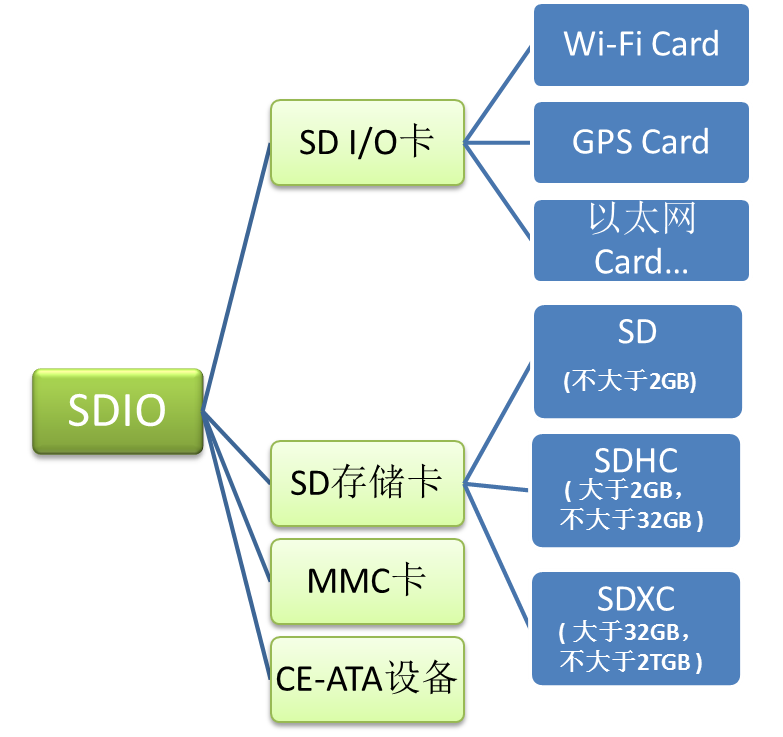

图 27‑1 SDIO接口的设备

关于SD卡和SD
I/O部分内容可以在SD协会网站获取到详细的介绍，比如各种SD卡尺寸规则、读写速度标示方法、应用扩展等等信息。

SD卡的种类及性能
~~~~~~~~~~~~~~~~

图 27‑2是市面上的SD卡、micro
SD卡实物图，卡上印刷了各种关于性能的标识，主要包括容量和读写性能。

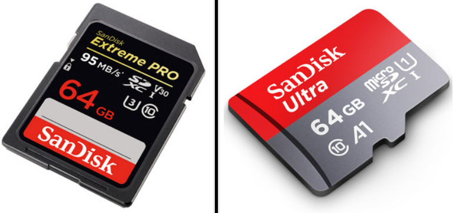

图 27‑2 SD卡实物图

SD卡的容量种类
^^^^^^^^^^^^^^

参考图 27‑3，目前SD卡以容量主要可区分为三类：

-  SDSC卡：Standard Capacity SD Memory Card，容量小于2GB。

-  SDHC卡：High Capacity SD Memory Card，容量大于2GB小于32GB。

-  SDXC卡：Extended Capacity SD Memory Card，容量大于32GB小于2TB。

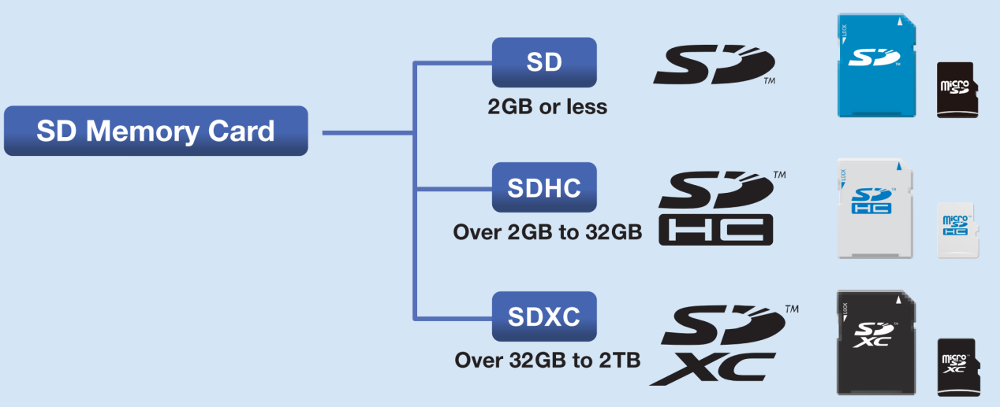

图 27‑3 SD卡容量及相应的标识

可以看到图中包含了SD卡和micro
SD卡的样例（俗称大卡和小卡），它们主要区别只是尺寸的差异，具体的容量、性能以印在卡上的性能规格标识为准。

SD卡的总线速率
^^^^^^^^^^^^^^

参考图 27‑4，SD卡以SDIO总线的速率可以分成如下类别：

-  High Speed：高速总线，传输速率上限为25MB/秒。

-  UHS-I：Ultra High Speed Type-I，传输速率上限为104MB/秒。

-  UHS-II：Ultra High Speed Type-II，传输速率上限为312MB/秒。

-  UHS-III：Ultra High Speed
   Type-III，传输速率上限为624MB/秒，这是目前最新的标准。

其中UHS-II和UHS-III标准的SD卡新增了一行使用差分信号的接口，正是由于差分信号抗干扰能力强才能达到这么高的通讯速率。RT1052的SDIO主机最高支持至UHS-I标准。

进行SD卡的读取操作可接近总线的传输速率，但由于SD卡传输时需要使用命令进行协议控制，以及SD卡准备数据时需要一点时间，所以会稍微低一些。

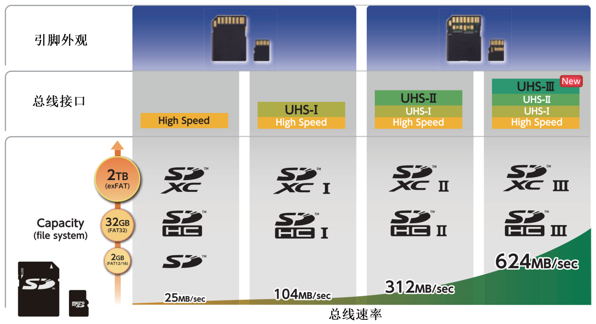

图 27‑4 SD卡的总线速率

SD卡的写入速率
^^^^^^^^^^^^^^

SD卡一般使用Nand
Flash作为存储介质，所以进行擦写操作耗时比较长，即该操作受限于写入过程而不是SDIO总线的传输速率。不同的SD卡有着不同的写入性能，SD协会把顺序写入（Sequential
Write）的速率定义成不同等级的SD卡规格，具体见图 27‑5。

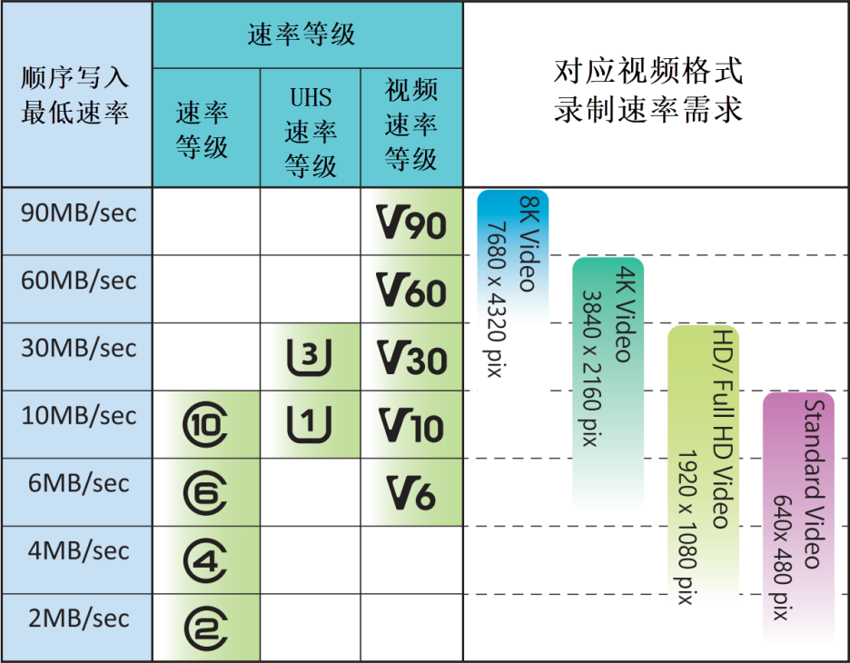

图 27‑5 写入速度等级

图中的三种速率规格分别记作C、U、V，附带的数字与其写入速率对应。SD卡的写入速率等级会被标注到SD卡的标签上。

SD卡的应用性能等级
^^^^^^^^^^^^^^^^^^

随着SD卡越来越多地应用在存储应用数据的场合，如手机应用数据存储等。因此需要使用一种描述随机访问和顺序访问性能的规格等级，SD5.1协议为此定义了应用性能等级，记作A，具体见图
27‑6。 

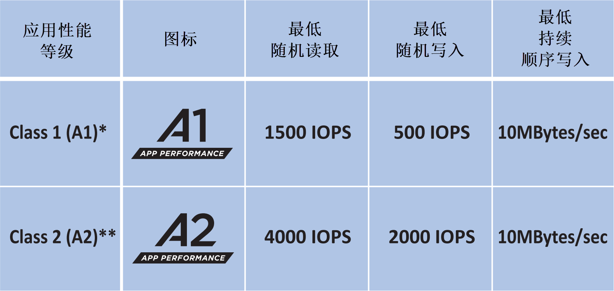

图 27‑6 SD卡的应用性能等级

图中的单位IOPS是Input/Output Per
Second的缩写，即每秒进行IO操作的次数，指存储器每秒可
接受多少次主机的访问，它衡量了随机访问的性能。

SD卡物理结构
~~~~~~~~~~~~

一张SD卡包括有存储单元、存储单元接口、电源检测、卡及接口控制器和接口驱动器5个部分，见图
27‑7。存储单元是存储数据部件，存储单元通过存储单元接口与卡控制单元进行数据传输；电源检测单元保证SD卡工作在合适的电压下，如出现掉电或上状态时，它会使控制单元和存储单元接口复位；卡及接口控制单元控制SD卡的运行状态，它包括有8个寄存器；接口驱动器控制SD卡引脚的输入输出。

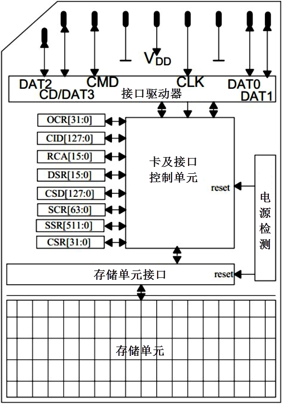

图 27‑7 SD卡物理结构

SD卡总共有8个寄存器，用于设定或表示SD卡信息，参考表格
27‑1。这些寄存器只能通过对应的命令访问。所有对SD卡的控制操作都是通过命令来实现的，SDIO定义了64个命令，每个命令都有特殊意义，可以实现某一特定功能，SD卡接收到命令后，根据命令要求对SD卡内部寄存器进行修改，程序控制中只需要发送组合命令就可以实现SD卡的控制以及读写操作。

表格 27‑1 SD卡寄存器

+------+---------+----------------------------------+
| 名称 | bit宽度 |               描述               |
+======+=========+==================================+
| CID  | 128     | 卡识别号(Card                    |
|      |         | identification                   |
|      |         | number):用来识别的卡的个体号码(  |
|      |         | 唯一的)                          |
+------+---------+----------------------------------+
| RCA  | 16      | 相对地址(Relative                |
|      |         | card                             |
|      |         | address):卡的本地系统地址，初始  |
|      |         | 化时，动态地由卡建议，主机核准。 |
+------+---------+----------------------------------+
| DSR  | 16      | 驱动级寄存器(Driver              |
|      |         | Stage                            |
|      |         | Register):配置卡的输出驱动       |
+------+---------+----------------------------------+
| CSD  | 128     | 卡的特定数据(Card                |
|      |         | Specific                         |
|      |         | Data):卡的操作条件信息           |
+------+---------+----------------------------------+
| SCR  | 64      | SD配置寄存器(SD                  |
|      |         | Configuration                    |
|      |         | Register):SD                     |
|      |         | 卡特殊特性信息                   |
+------+---------+----------------------------------+
| OCR  | 32      | 操作条件寄存器(Operation         |
|      |         |                                  |
|      |         | conditions register)             |
+------+---------+----------------------------------+
| SSR  | 512     | SD状态(SD                        |
|      |         | Status):SD卡专有特征的信息       |
+------+---------+----------------------------------+
| CSR  | 32      | 卡状态(Card                      |
|      |         | Status):卡状态信息               |
+------+---------+----------------------------------+

每个寄存器位的含义可以参考SD简易规格文件《Physical_Layer_Simplified_Specification_Ver6.00》中的第5章内容了解。

SDIO总线
~~~~~~~~

总线拓扑
^^^^^^^^

SD卡一般都支持SDIO和SPI这两种接口，本章内容只介绍SDIO接口操作方式，如果需要使用SPI操作方式可以参考SPI相关章节。另外，RT1052系列控制器的SD主机外设是不支持SPI通信模式的，如果需要用到SPI通信只能使用SPI外设。

SDIO的总线拓扑参考图
27‑8，图中使用单个SDIO主机控制两张SD卡，两张SD卡共用CLK，但D0-3和CMD信号线却是独立的，这样两张SD卡需要分时访问，所以在实际应用中硬件厂商一般直接采用单个主机控制单个SDIO设备。如在RT1052控制器中有uSDHC1/2两个独立的SDIO主机，设计硬件时可以使用uSDHC1控制SD卡，uSDHC2控制SDIO接口的WiFi模块，互不干扰。

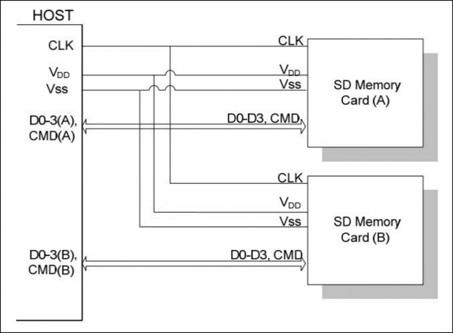

图 27‑8 SD卡总线拓扑

SD卡使用9-pin接口通信，其中3根电源线、1根时钟线、1根命令线和4根数据线，具体说明如下：

-  **CLK：**\ 时钟线，由SDIO主机产生，即由RT1052控制器输出；

-  **CMD：**\ 命令控制线，SDIO主机通过该线发送命令控制SD卡，如果命令要求SD卡提供应答(响应)，SD卡也是通过该线传输应答信息；

-  **D0-3：**\ 数据线，传输读写数据；SD卡可将D0拉低表示忙状态，D3可以用于SD卡的接入检测；

-  **V\ :sub:`DD`\ 、V\ :sub:`SS1`\ 、V\ :sub:`SS2`\ ：**\ 电源和地信号。

通讯时序
^^^^^^^^

SDIO总线支持多种通讯时序，主要是速率和信号电压的差异，具体见表 27‑1。

表 27‑1 SDIO总线支持的通讯时序（不含UHS-II的通讯时序）

+--------------------+------------+--------------+--------------+
| 名称               | 信号电压   | 最高时钟频率 | 最高传输速率 |
+====================+============+==============+==============+
| 默认速率模式       | 3.3V       | 25 MHz       | 12.5 MB/秒   |
|                    |            |              |              |
| Default Speed mode |            |              |              |
+--------------------+------------+--------------+--------------+
| 高速模式           | 3.3V       | 50MHz        | 25MB/秒      |
|                    |            |              |              |
| High Speed mode    |            |              |              |
+--------------------+------------+--------------+--------------+
| SDR12              | UHS-I 1.8V | 25 MHz       | 12.5 MB/秒   |
+--------------------+------------+--------------+--------------+
| SDR25              | UHS-I 1.8V | 50MHz        | 25MB/秒      |
+--------------------+------------+--------------+--------------+
| SDR50              | UHS-I 1.8V | 100MHz       | 50MB/秒      |
+--------------------+------------+--------------+--------------+
| SDR104             | UHS-I 1.8V | 208MHz       | 104MB/秒     |
+--------------------+------------+--------------+--------------+
| DDR50              | UHS-I 1.8V | 50MHz        | 50MB/秒      |
+--------------------+------------+--------------+--------------+

表 27‑1中除了最后一种DDR50是双倍速率模式外（Double Data
Rate），其余都是单倍速率模式（Single Data
Rate）。在单倍速率模式下数据信号都是在CLK时钟线的上升沿有效。

特别地，对SD卡的访问包含一个“卡识别模式”，在该模式下主机通过访问SD卡的各种寄存器了解该卡的容量、性能、操作电压等特性，在这个阶段中时钟频率最高不能超过400KHz。

通过了识别阶段后，主机可以切换至默认的25MHz时钟进行数据传输，或切换至SD卡支持的更高的通讯速率。控制支持UHS-I协议的SD卡时，主机切换成高通讯速率时还需要把通讯使用的电平标准由3.3V切换至1.8V。

总线协议
^^^^^^^^

SD总线通信是基于命令和数据传输的。通讯由一个起始位(“0”)，由一个停止位(“1”)终止。SD通信一般是主机发送一个命令(Command)，从设备在接收到命令后作出响应(Response)，如有需要会有数据(Data)传输参与。

SD总线的基本通讯是命令与响应的交互，具体见图 27‑9。

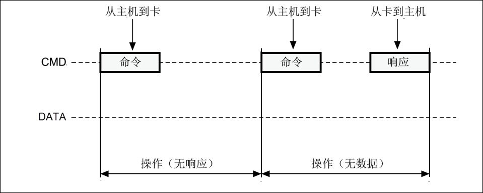

图 27‑9 命令与响应交互

SD数据是以块(Block)形式传输的，除SDSC卡外，SD的卡数据块长度固定为512字节，数据可以从主机到卡，也可以是从卡到主机。数据块需要CRC位来保证数据传输成功，CRC位由SD卡系统硬件生成。数据传输时支持使用1线或4线传输，本开发板设计使用4线传输。图
27‑10为主机向SD卡写入数据块操作示意图。

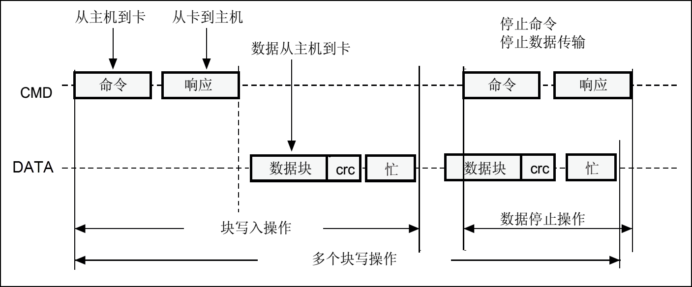

图 27‑10 多块写入操作

SD数据传输支持单块和多块读写，它们分别对应不同的操作命令，多块写入还需要使用命令来停止整个写入操作。数据写入前需要检测SD卡忙状态，因为SD卡在接收到数据后编程到存储区过程需要一定操作时间。SD卡忙状态通过把D0线拉低表示。

数据块读操作与之类似，只是无需忙状态检测。

使用4数据线传输时，每次传输4bit数据，每根数据线都必须有起始位、终止位以及CRC位，CRC位每根数据线都要分别检查，并把检查结果汇总然后在数据传输完后通过D0线反馈给主机。

SD卡数据包有两种格式，一种是常规数据(8bit宽)，它先发低字节再发高字节，而每个字节则是先发高位再发低位，4线传输示意如图
27‑11。

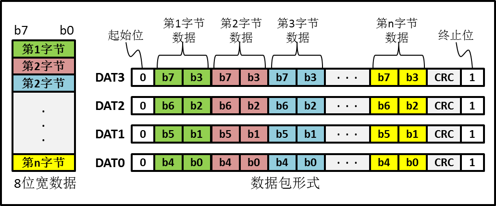

图 27‑11 8位宽数据包传输

4线同步发送，每根线发送一个字节的其中两个位，数据位在四线顺序排列发送，DAT3数据线发较高位，DAT0数据线发较低位。

另外一种数据包发送格式是“宽位数据包格式”，对SD卡而言宽位数据包发送方式是针对SD卡SSR(SD状态)寄存器内容发送的，SSR寄存器总共有512bit，在主机发出ACMD13命令后SD卡将SSR寄存器内容通过DAT线发送给主机。宽位数据包格式示意见图
27‑12。

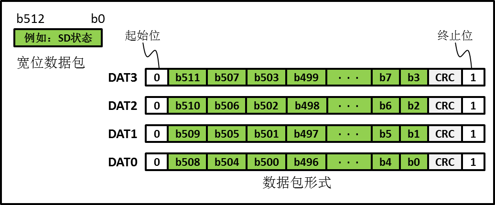

图 27‑12 宽位数据包传输

命令
^^^^

SD命令由主机发出，以广播命令和寻址命令为例，广播命令是针对与SD主机总线连接的所有从设备发送的，寻址命令是指定某个地址设备进行命令传输。

命令格式
''''''''

SD命令格式固定为48bit，都是通过CMD线连续传输的（数据线不参与），见图
27‑13。

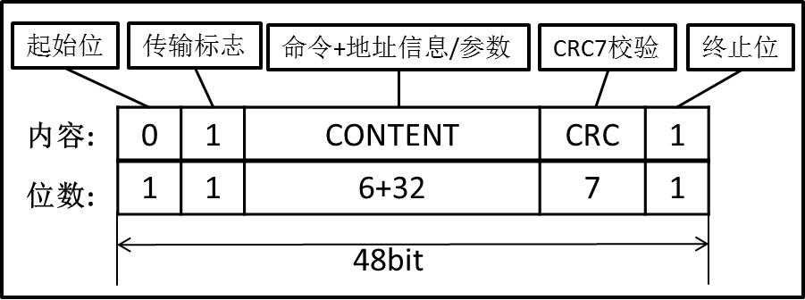

图 27‑13 SD命令格式

SD命令的组成如下：

-  起始位和终止位：命令的主体包含在起始位与终止位之间，它们都只包含一个数据位，起始位为0，终止位为1。

-  传输标志：用于区分传输方向，该位为1时表示命令，方向为主机传输到SD卡，该位为0时表示响应，方向为SD卡传输到主机。

    命令主体内容包括命令、地址信息/参数和CRC校验三个部分。

-  命令号：它固定占用6bit，所以总共有64个命令(代号：CMD0~CMD63)，每个命令都有特定的用途，部分命令不适用于SD卡操作，只是专门用于MMC卡或者SD
   I/O卡。

-  地址/参数：每个命令有32bit地址信息/参数用于命令附加内容，例如，广播命令没有地址信息，这32bit用于指定参数，而寻址命令这32bit用于指定目标SD卡的地址。

-  CRC7校验：长度为7bit的校验位用于验证命令传输内容正确性，如果发生外部干扰导致传输数据个别位状态改变将导致校准失败，也意味着命令传输失败，SD卡不执行命令。

命令类型
''''''''

SD命令有4种类型：

-  无响应广播命令(bc)，发送到所有卡，不返回任务响应；

-  带响应广播命令(bcr)，发送到所有卡，同时接收来自所有卡响应；

-  寻址命令(ac)，发送到选定卡，DAT线无数据传输；

-  寻址数据传输命令(adtc)，发送到选定卡，DAT线有数据传输。

另外，SD卡主机模块系统旨在为各种应用程序类型提供一个标准接口。在此环境中，需要有特定的客户/应用程序功能。为实现这些功能，在标准中定义了两种类型的通用命令：特定应用命令(ACMD)和常规命令(GEN_CMD)。要使用SD卡制造商特定的ACMD命令如ACMD6，需要在发送该命令之前先发送CMD55命令，告知SD卡接下来的命令为特定应用命令。CMD55命令只对紧接的第一个命令有效，SD卡如果检测到CMD55之后的第一条命令为ACMD则执行其特定应用功能，如果检测发现不是ACMD命令，则执行标准命令。

命令描述
''''''''

SD卡系统的命令被分为多个类，每个类支持一种“卡的功能设置”。表
27‑2举了SD卡部分命令信息，更多详细信息可以参考SD简易规格文件说明，表中填充位和保留位都必须被设置为0。

虽然没有必须完全记住每个命令详细信息，但熟悉命令对后面程序的理解非常有帮助。

表 27‑2SD部分命令描述

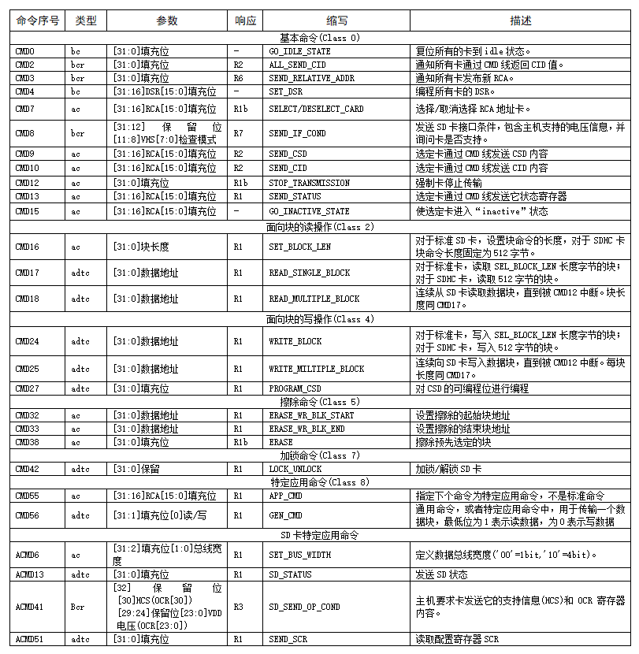

响应
^^^^

响应由SD卡向主机发出，部分命令要求SD卡作出响应，这些响应多用于反馈SD卡的状态。SDIO总共有7个响应类型(代号：R1~R7)，其中SD卡没有R4、R5类型响应。特定的命令对应有特定的响应类型，比如当主机发送CMD3命令时，可以得到响应R6。与命令一样，SD卡的响应也是通过CMD线连续传输的。根据响应内容大小可以分为短响应和长响应。短响应是48bit长度，只有R2类型是长响应，其长度为136bit。各个类型响应具体情况如表
27‑3。

除了R3类型之外，其他响应都使用CRC7校验来校验，对于R2类型是使用CID和CSD寄存器内部CRC7。

表 27‑3SD卡响应类型

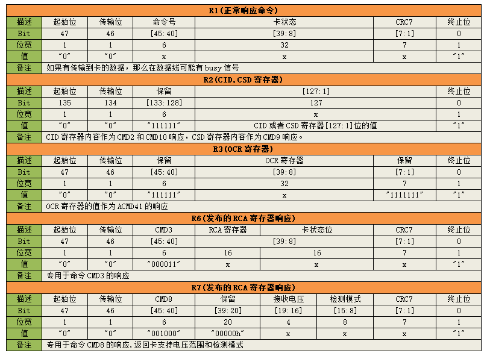

SD卡的操作模式及切换
~~~~~~~~~~~~~~~~~~~~

SD卡的操作模式
^^^^^^^^^^^^^^

由于SD卡有多个版本，所以对SD卡进行数据读写之前需要识别卡的种类、容量、支持的最高通讯速率以及操作电压。

SD协议定义了卡识别和数据传输两种操作模式。在系统复位后，主机处于卡识别模式寻找总线上可用的SDIO设备；同时，SD卡也处于卡识别模式，直到被主机识别到，即当SD卡接收到SEND_RCA(CMD3)命令后，SD卡就会进入数据传输模式，而主机在总线上所有卡被识别后也进入数据传输模式。在每个操作模式下，SD卡都有几种状态，参考表
27‑4，通过命令控制实现卡状态的切换。

    表 27‑4 SD卡状态与操作模式

+--------------------------------------+----------------------------------+
| 操作模式                             | SD卡状态                         |
+======================================+==================================+
| 无效模式(Inactive)                   | 无效状态(Inactive State)         |
+--------------------------------------+----------------------------------+
| 卡识别模式(Card identification mode) | 空闲状态(Idle State)             |
+--------------------------------------+----------------------------------+
|                                      | 准备状态(Ready State)            |
+--------------------------------------+----------------------------------+
|                                      | 识别状态(Identification State)   |
+--------------------------------------+----------------------------------+
| 数据传输模式(Data transfer mode)     | 待机状态(Stand-by State)         |
+--------------------------------------+----------------------------------+
|                                      | 传输状态(Transfer State)         |
+--------------------------------------+----------------------------------+
|                                      | 发送数据状态(Sending-data State) |
+--------------------------------------+----------------------------------+
|                                      | 接收数据状态(Receive-data State) |
+--------------------------------------+----------------------------------+
|                                      | 编程状态(Programming State)      |
+--------------------------------------+----------------------------------+
|                                      | 断开连接状态(Disconnect State)   |
+--------------------------------------+----------------------------------+

卡识别模式
^^^^^^^^^^

在卡识别模式下，主机会复位所有处于“卡识别模式”的SD卡，确认其工作电压范围，识别SD卡类型，并且获取SD卡的相对地址(卡相对地址较短，便于寻址)。在卡识别过程中，要求SD卡工作在识别时钟频率下（小于等于400KHz）。卡识别模式下SD卡状态转换如图
27‑14。

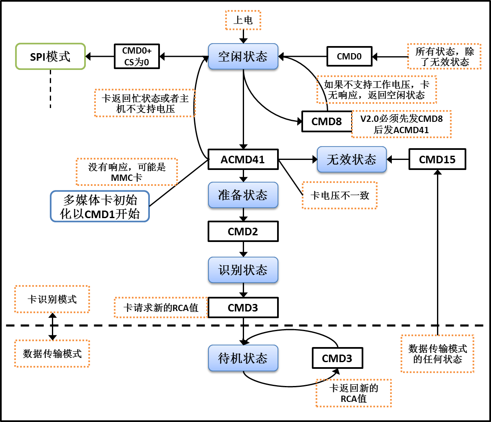

图 27‑14 卡识别模式状态转换图

主机上电后，所有卡处于空闲状态，包括当前处于无效状态的卡。主机也可以发送GO_IDLE_STATE(CMD0)让所有卡软复位从而进入空闲状态，但当前处于无效状态的卡并不会复位。

主机在开始与卡通信前，需要先确定双方在互相支持的电压范围内。SD卡有一个电压支持范围，主机当前电压必须在该范围可能才能与卡正常通信。SEND_IF_COND(CMD8)命令就是用于验证卡接口操作条件的(主要是电压支持)。卡会根据命令的参数来检测操作条件匹配性，如果卡支持主机电压就产生响应，否则不响应。而主机则根据响应内容确定卡的电压匹配性。CMD8是SD卡标准V2.0版本才有的新命令，所以如果主机有接收到响应，可以判断卡为V2.0或更高版本SD卡。

SD_SEND_OP_COND(ACMD41)命令可以识别或拒绝不匹配它的电压范围的卡。ACMD41命令的VDD电压参数用于设置主机支持电压范围，卡响应会返回卡支持的电压范围。对于对CMD8有响应的卡，把ACMD41命令的HCS位设置为1，可以测试卡的容量类型，如果卡响应的CCS位为1说明为高容量SD卡（SDHC/SDXC），否则为标准卡(SDSC)。卡在响应ACMD41之后进入准备状态，不响应ACMD41的卡为不可用卡，进入无效状态。ACMD41是应用特定命令，发送该命令之前必须先发CMD55。

ALL_SEND_CID(CMD2)用来控制所有卡返回它们的卡识别号(CID)，处于准备状态的卡在发送CID之后就进入识别状态。之后主机就发送SEND_RELATIVE_ADDR(CMD3)命令，让卡自己推荐一个相对地址(RCA)并响应命令。这个RCA是16bit地址，而CID是128bit地址，使用RCA简化通信。卡在接收到CMD3并发出响应后就进入数据传输模式，并处于待机状态，主机在获取所有卡RCA之后也进入数据传输模式。

数据传输模式
^^^^^^^^^^^^

只有SD卡系统处于数据传输模式下才可以进行数据读写操作。数据传输模式下可以将SD_CLK时钟频率设置为25MHz或SD卡支持的更高频率，频率切换可以通过CMD4命令来实现。数据传输模式下，SD卡状态转换过程见图
27‑15。

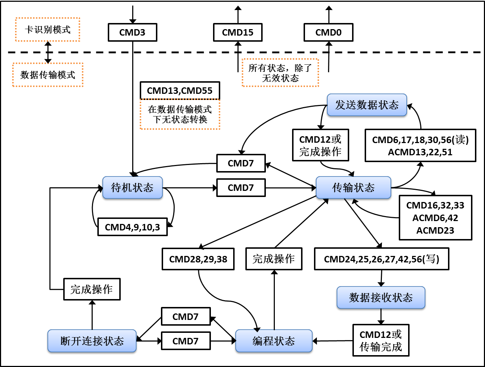

图 27‑15 数据传输模式卡状态转换

CMD7用来选定和取消指定的卡，卡在待机状态下还不能进行数据通信，因为总线上可能有多个卡都是出于待机状态，必须选择一个RCA地址目标卡使其进入传输状态才可以进行数据通信。同时通过CMD7命令也可以让已经被选择的目标卡返回到待机状态。

数据传输模式下的数据通信都是主机和目标卡之间通过寻址命令点对点进行的。卡处于传输状态下可以使用\ **错误!未找到引用源。**\ 中面向块的读写以及擦除命令对卡进行数据读写、擦除。CMD12可以中断正在进行的数据通信，让卡返回到传输状态。CMD0和CMD15会中止任何数据编程操作，返回卡识别模式，这可能导致卡数据被损坏。

uSDHC简介
~~~~~~~~~

RT1052使用uSDHC外设来进行SDIO通讯，uSDHC是Ultra Secured Digital Host
Controller的缩写，即非凡的SD主机控制器，使用它可驱动SD/SDIO/MMC卡。

RT1052的uSDHC 外设的特性如下：

-  SD主机控制器规范2.0/3.0（SD Host Controller Standard
   Specification）。

-  MMC系统规范4.2/4.3/4.4/4.41/4.5（MMC System Specification）。

-  SD存储器标准3.0（SD Memory Card
   Specification），且支持SDXC卡。SDIO卡规范2.0/3.0（SDIO Card
   Specification）。

-  总线时钟频率最高可支持到208MHz，支持SD的UHS-I协议及相应的通讯时序，在这样的总线驱动时钟下SD传输速率高达104MB/秒（4-bit），而MMC卡则支持至208MB/秒（8-bit）。

-  包含一个128x32-bit的FIFO用于缓冲读写的数据。

-  支持使用DMA、ADMA（Advanced DMA）来进行数据传输。

-  包含uSDHC1/2两个外设，它们的差异是uSDHC1只支持1/4-bit的数据信号，而uSDHC2支持1/4/8-bit的数据信号。

uSDHC外设框图剖析
~~~~~~~~~~~~~~~~~

uSDHC外设的框图具体见图 27‑16。

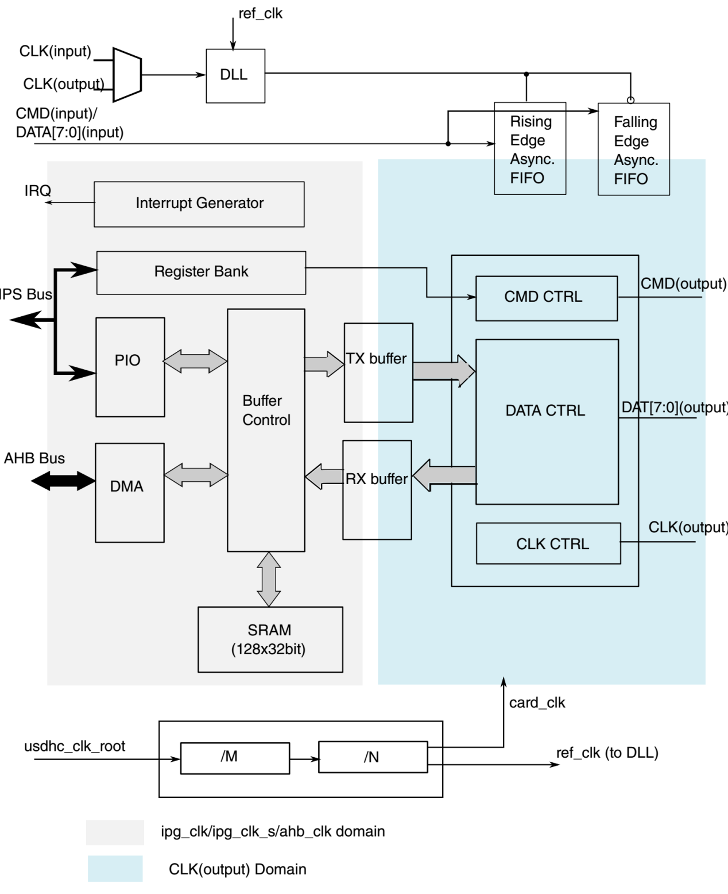

图 27‑16 uSDHC外设框图

通讯引脚
^^^^^^^^^^^^^^^^^^^^^^^^^^^^

图
27‑16的右侧显示的是uSDHC与外部设备的连接，这些uSDHC引脚具体对应的GPIO端口及引脚号可在《IMXRT1050RM》（参考手册）中搜索查找到，此处整理至表
27‑5。

表 27‑5uSDHC外设的控制信号线

+-----------+------+------------------------------------------+
| 引脚名称  | 方向 |                   说明                   |
+===========+======+==========================================+
| CLK       | O    | 输出到MMC/SD/SDIO卡的时钟信号            |
+-----------+------+------------------------------------------+
| CMD       | I/O  | CMD命令信号线                            |
+-----------+------+------------------------------------------+
| DATA[0:7] | I/O  | 数据信号线，其中SD卡不支持DATA[4         |
|           |      | :7]，                                    |
|           |      |                                          |
|           |      | DATA3可同时用于卡接入检测信号；          |
|           |      |                                          |
|           |      |                                          |
|           |      | DATA2在1-bit模式下可用于读等待           |
|           |      | 信号；                                   |
|           |      |                                          |
|           |      | DATA1在1/4-bit模式下可用于中             |
|           |      | 断信号；                                 |
|           |      |                                          |
|           |      | DATA0同时用于输出忙碌信号                |
+-----------+------+------------------------------------------+
| CD_B      | I    | 卡检测信号，低电平表示卡接入             |
+-----------+------+------------------------------------------+
| WP        | I    | 卡的写保护检测信号，低电平表示没有写保护 |
+-----------+------+------------------------------------------+
| LCTL      | O    | LED控制信号，当SD总线在传输时它会输      |
|           |      | 出高电平，可用于控制指示灯               |
+-----------+------+------------------------------------------+
| RESET_B   | O    | 在控制MMC卡时的硬件复位信号，低电平有    |
|           |      | 效                                       |
+-----------+------+------------------------------------------+
| VSELECT   | O    | 用于切换外部供电电压，该信号可通过寄存器 |
|           |      | 位VEND_SPEC[VSELECT]控                   |
|           |      | 制输出高电平还是低电平，设计硬件时应制作 |
|           |      | 相应的电路，使这个引脚能控制给RT105      |
|           |      | 2的NVCC_SD引脚供电为3.0V还是             |
|           |      | 1.8V。                                   |
|           |      |                                          |
|           |      | uSDHC外设通过RT1052的NVCC                |
|           |      | _SD电源引脚供电，当使用UHS-I协议         |
|           |      | 通讯时，需要把SD总线信号电压降为1.8      |
|           |      | V。                                      |
|           |      |                                          |
|           |      | 默认情况下该引脚为低电平，即NVCC_S       |
|           |      | D默认使用3.0V供电。                      |
+-----------+------+------------------------------------------+

表格中的CD、WP、LCTL、RST以及VSELECT信号都是可以不使用的。

SD协议单元
^^^^^^^^^^^^^^^^^^^^^^^^^^^^

图 27‑16中的“Register
Bank”，这是控制uSDHC外设的寄存器集，它主要包含一个SD协议处理单元，是连接内部系统总线和SD总线的桥梁。例如发送控制SD卡的命令并接收响应；监控SDIO总线传来的中断；产生读等待信号；当数据缓冲区处于紧急状态时控制关闭SD总线时钟等。

例如需要发送SD命令时，通过命令传输类型寄存器CMD_XFR_TYP写入要发送的命令索引、类型以及匹配的响应类型等内容，然后通过命令参数寄存器CMD_ARG设置命令附带的参数。发送命令后，可通过命令响应寄存器CMD_RSP0/1/2/3读取到SD总线返回的命令响应。

数据缓冲区
^^^^^^^^^^^^^^^^^^^^^^^^^^^^

uSDHC包含一个可以配置的数据缓冲区，它用来最大化系统总线与SD卡之间的数据吞吐量。

该缓冲区支持配置读写水印值（1~128个字）以及突发读写的长度（1~31个字）。以接收数据为例，当uSDHC外设接收到的数据大于水印值时，缓冲区读就绪寄存器位INT_STATUS[BRR]会被置位，内核检测到该标志后，可以通过访问数据缓冲区访问接口寄存器DATA_BUFF_ACC_PORT获取数据，可获取的数据量为水印值大小。若使用DMA或ADMA（advanced
DMA），则会在接收到的数据大于水印值时自动触发传输。

ADMA（advanced DMA）
^^^^^^^^^^^^^^^^^^^^^^^^^^^^

uSDHC外设支持ADMA（advanced
2DMA）传输，它是普通DMA的升级版。使用普通DMA时，一旦传输完成就会产生中断，然后主机驱动需要给下一次传输安排新的传输地址。而ADMA使用描述符表控制传输，当主机传输完成时它可计算传输地址并在进行ADMA传输前写入描述符表。相对来说这可以减少中断的频率并提供传输速度，因为在该过程中内核不需要参与。

uSDHC外设中包含有ADMA1和ADMA2，其中ADMA1的地址传输只支持4KB字节对齐的数据，而ADMA2比较灵活，没有这个要求。

以ADMA2描述符为例，它的每个描述符长度为64位，内部包含传输的目的地址、要传输的数据长度以及其它属性配置，具体见表
27‑6、表 27‑7和表
27‑8，当传输需要多个操作时，可以使用多个描述符组合传输。

表 27‑6ADMA2的描述符

+------------+------------+------------+--------+------+-----+-----+-----+-------+-----+-----+-----+
|   地址域   |    长度    |   保留域   | 属性域 |      |     |     |     |       |     |     |     |
+============+============+============+========+======+=====+=====+=====+=======+=====+=====+=====+
| 63         | 32         | 31         | 16     | 15   | 6   | 5   | 4   | 3     | 2   | 1   | 0   |
+------------+------------+------------+--------+------+-----+-----+-----+-------+-----+-----+-----+
| 32-bit地址 | 16-bit长度 | 0000000000 | Act2   | Act1 | 0   | Int | End | Valid |     |     |     |
+------------+------------+------------+--------+------+-----+-----+-----+-------+-----+-----+-----+

表 27‑7 Act2和Act1的配置说明

+------+------+------+------------+--------------------------------------+
| Act2 | Act1 | 标记 | 描述       | 操作                                 |
+======+======+======+============+======================================+
| 0    | 0    | Nop  | 无操作     | 无                                   |
+------+------+------+------------+--------------------------------------+
| 0    | 1    | Rsv  | 保留       | 与Nop类似，转向执行下一个描述符      |
+------+------+------+------------+--------------------------------------+
| 1    | 0    | Tran | 传输数据   | 使用描述符里的地址和长度进行数据传输 |
+------+------+------+------------+--------------------------------------+
| 1    | 1    | Link | 链接描述符 | 连接到另外一个描述符                 |
+------+------+------+------------+--------------------------------------+

表 27‑8Valid、End和Int的配置说明

+-------+----------------------------------------------------------------+
| Valid | Valid=1表示本描述符有效，若Valid=0会产生ADMA错误中断并停止ADMA |
+=======+================================================================+
| End   | End=1表示当前是结束描述符                                      |
+-------+----------------------------------------------------------------+
| Int   | Int=1时当本描述符被执行会产生DMA中断                           |
+-------+----------------------------------------------------------------+

驱动时钟
^^^^^^^^^^^^^^^^^^^^^^^^^^^^

uSDHC外设的时钟信号是由uSDHC根时钟USDHC_CLK_ROOT提供的，具体见图 27‑17。

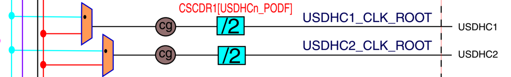

图 27‑17 uSDHC根时钟USDHC_CLK_ROOT时钟树中的描述

uSDHC根时钟有2个可选输入来源：

-  PLL2 PFD0：该时钟常规配置为352MHz。

-  PLL2 PFD2：该时钟常规配置为392MHz。

选择得到的时钟源经过一个3位的分频器，它可对时钟进行1~8分频，分频后得到uSDHC根时钟USDHC_CLK_ROOT。uSDHC1/2两个外设对应的根时钟是互相独立的。

sdmmc中间件
~~~~~~~~~~~

在NXP提供的软件库中提供了操作uSDHC外设的基础文件fsl_usdhc.c/h，但控制SD/MMC卡还需要在uSDHC基础操作之上增加相关的协议处理，这部分内容庞大而复杂，NXP贴心地在sdk中提供了sdmmc中间件。

sdmmc中间件在SDK中的MIMXRT1052xxxxx\middleware\sdmmc目录，具体见图
27‑18。

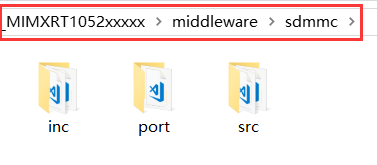

图 27‑18 SDK中的sdmmc中间件内容

三个文件夹内所包含文件如表 27‑9所示。

表 27‑9SDMMC中间件文件简述

+--------+--------------------+------------------------------------------+
| 文件夹 |       文件名       |                 文件作用                 |
+========+====================+==========================================+
| inc    | fsl_mmc.h          | MMC卡相关头文件                          |
|        |                    |                                          |
|        |                    |                                          |
|        |                    |                                          |
|        |                    |                                          |
|        |                    |                                          |
|        |                    |                                          |
|        |                    |                                          |
|        |                    |                                          |
|        |                    |                                          |
|        |                    |                                          |
+--------+--------------------+------------------------------------------+
|        | fsl_sd.h           | SD卡相关头文件                           |
+--------+--------------------+------------------------------------------+
|        | fsl_sdio.h         | SDIO设备相关头文件                       |
+--------+--------------------+------------------------------------------+
|        | fsl_sdmmc_common.h | SDMMC接口通用头文件                      |
+--------+--------------------+------------------------------------------+
|        | fsl_sdmmc_host.h   | SDMMC初始化相关头文件                    |
+--------+--------------------+------------------------------------------+
|        | fsl_sdmmc_spec.h   | 定义程序中使用的一些结构体、枚举类型以及 |
|        |                    | 宏定义等。                               |
+--------+--------------------+------------------------------------------+
| src    | fsl_mmc.c          | MMC卡相关源文件                          |
|        |                    |                                          |
|        |                    |                                          |
|        |                    |                                          |
|        |                    |                                          |
|        |                    |                                          |
|        |                    |                                          |
+--------+--------------------+------------------------------------------+
|        | fsl_sd.c           | SD卡相关源文件                           |
+--------+--------------------+------------------------------------------+
|        | fsl_sdio.c         | SDIO设备相关源文件                       |
+--------+--------------------+------------------------------------------+
|        | fsl_sdmmc_common.c | MMC设备、SD卡、SDIO设备共用的一          |
|        |                    | 些源文件                                 |
+--------+--------------------+------------------------------------------+
| port   | fsl_sdmmc_event.h  | SDMMC事件相关头文件                      |
|        |                    |                                          |
|        |                    |                                          |
|        |                    |                                          |
|        |                    |                                          |
+--------+--------------------+------------------------------------------+
|        | fsl_sdmmc_event.c  | SDMMC事件相关源文件                      |
+--------+--------------------+------------------------------------------+
|        | fsl_sdmmc_host.c   | uSDHC主机初始化相关源文件                |
+--------+--------------------+------------------------------------------+

从表
27‑9可以看出SDMMC中间件支持了SD卡、MMC卡以及SDIO设备，我们根据实际使用的设备选择相应的文件，本实验要选择那些文件讲解代码时会详细介绍。SDMMC中间件暂时讲解到这里。

uSDHC主机配置结构体
~~~~~~~~~~~~~~~~~~~

使用uSDHC外设读写SD卡，可通过uSDHC主机配置结构体及库函数SD_HostInit对uSDHC进行初始化，
uSDHC主机配置结构体的内容具体见代码清单 27‑1。

.. code-block:: c
   :name: 代码清单 27‑1 uSDHC主机配置结构体（fsl_usdhc.h文件）
   :caption: 代码清单 27‑1 uSDHC主机配置结构体（fsl_usdhc.h文件）
   :linenos:

   /*! @brief USDHC 主机配置 */
   typedef struct _usdhc_host {
      /*!< USDHC 外设基地址 */
      USDHC_Type *base;
      /*!< USDHC 时钟源的频率，单位为Hz */
      uint32_t sourceClock_Hz;
      /*!< USDHC 配置 */
      usdhc_config_t config;
      /*!< USDHC 性能信息 */
      usdhc_capability_t capability;
      /*!< USDHC传输函数 */
      usdhc_transfer_function_t transfer;
   } usdhc_host_t;

该结构体的各个成员说明如下：

-  base：用于指定uSDHC外设号（外设基地址），在RT1052中有uSDHC1和uSDHC2两个设备，其中uSDHC1支持1/4-bit数据线模式，uSDHC2支持1/4/8-bit数据线模式，在设计硬件时根据需要进行选择，程序上要与硬件匹配。

-  sourceClock_Hz：用于告知库函数uSDHC外设使用的uSDHC根时钟的频率，注意此处并不是用于设定时钟频率为该值，而只是用于库函数根据该频率的大小调整其它与时钟相关的参数而已。

-  config：这是一个usdhc_config_t类型的结构体，用于配置uSDHC数据传输的相关参数，具体类型定义见代码清单27‑2。

.. code-block:: c
   :name: 代码清单 27‑2 usdhc_config_t结构体类型定义（fsl_usdhc.h文件）
   :caption: 代码清单 27‑2 usdhc_config_t结构体类型定义（fsl_usdhc.h文件）
   :linenos:

   /*! @brief 用于初始化USDHC数据传输的结构体 */
   typedef struct _usdhc_config {
      uint32_t dataTimeout;           /*!< 数据超时值 */
      usdhc_endian_mode_t endianMode; /*!< 大小端模式 */
      uint8_t readWatermarkLevel;     /*!< DMA读操作水印值，范围1~128 */
      uint8_t writeWatermarkLevel;    /*!< DMA写操作水印值，范围1~128 */
      uint8_t readBurstLen;           /*!< 读突发长度 */
      uint8_t writeBurstLen;          /*!< 写突发长度 */
   } usdhc_config_t;

这部分内容的配置都会被写入到uSDHC对应的寄存器中，在sdmmc中间件fsl_sdmmc_host.h文件里，这些配置都已被定义好，具体说明如下：

1) dataTimeout：寄存器位SYS_CTRL[DTOCV]，此值用于指定检测DAT线超时的间隔，超过该时间后可产生数据超时错误（Data
   Timeout Error）中断，它支持的配置值为2\ :sup:`14`\ 、2\ :sup:`15`\ 、
   2\ :sup:`27`\ 、2\ :sup:`28`\ 、
   2\ :sup:`29`\ 个SDCLK时钟周期。本成员在fsl_sdmmc_host.h文件里的设置为最大值，即2\ :sup:`29`\ 个SDCLK时钟周期。

2) endianMode：寄存器位PROT_CTRL[EMODE]，用于设置uSDHC的大小端格式，它是一个枚举类型，支持大端（kUSDHC_EndianModeBig）、半字大端格式（kUSDHC_EndianModeHalfWordBig）以及小端格式（kUSDHC_EndianModeLittle）。本成员在fsl_sdmmc_host.h文件里的设置为小端格式。

3) readWatermarkLevel和writeWatermarkLevel，寄存器WTMK_LVL，用于设置读写的水印值（FIFO的阈值），它们支持的配置范围为1~128。本成员在fsl_sdmmc_host.h文件里的设置为最大值128。

4) readBurstLen和writeBurstLen，寄存器WTMK_LVL，用于设置突发读写的长度，支持的配置值为1~31个字。本成员在fsl_sdmmc_host.h文件里的设置为8。

-  capability：这是一个usdhc_capability_t类型的结构体，它用于存储uSDHC性能相关的参数，具体类型定义见代码清单 27‑3。

.. code-block:: c
   :name: 代码清单 27‑3 usdhc_capability_t结构体定义（fsl_usdhc.h文件）
   :caption: 代码清单 27‑3 usdhc_capability_t结构体定义（fsl_usdhc.h文件）
   :linenos:

   /*!
   * @brief USDHC 性能信息
   * 用于存储USDHC性能信息的结构体
   */
   typedef struct _usdhc_capability {
      uint32_t sdVersion;      /*!< 支持的sd卡、sdio版本 */
      uint32_t mmcVersion;     /*!< 支持的emmc卡版本 */
      uint32_t maxBlockLength; /*!< block的最大长度，单位为byte */
      uint32_t maxBlockCount;  /*!< 一次传输中支持的最大block个数 */
      uint32_t flags; /*!< 用于指示容量支持信息的标志(_usdhc_capability_flag) */
   } usdhc_capability_t;

各个结构体成员介绍如下：

1) sdVersion和mmcVersion：这两项用于记录uSDHC支持的SD和MMC卡版本，不过在软件库和中间件中并没有看到对这两个结构体成员的赋值和应用。

2) maxBlockLength：寄存器位HOST_CTRL_CAP[MBL]，表示支持数据块（block）的最大值，它支持的配置值为512/1024/2048/4096字节长度的数据块（block），默认值为4096。

3) maxBlockCount：表示单次传输中支持的最大数据块数目，它是寄存器位BLK_ATT[BLKCNT]的最大值，即单次传输最多支持65535个数据块。

4) flags：寄存器HOST_CTRL_CAP，包含了是否支持某工作电压、DMA、ADMA、高速传输等参数，具体请查看寄存器HOST_CTRL_CAP的内容，该寄存器默认表示都支持各个配置域的功能。

以上结构体成员都是由库函数USDHC_GetCapability初始化的，该函数执行后会把寄存器HOST_CTRL_CAP的默认值赋予到各个参数中。

-  transfer：这是uSDHC传输函数的指针，它的类型定义具体见代码清单 27‑4。

.. code-block:: c
   :name: 代码清单 27‑4 uSDHC传输函数指针（fsl_usdhc.h文件）
   :caption: 代码清单 27‑4 uSDHC传输函数指针（fsl_usdhc.h文件）
   :linenos:

   /*! @brief USDHC 传输函数 */
   typedef status_t (*usdhc_transfer_function_t)(USDHC_Type *base,
                                                usdhc_transfer_t *content);

在库函数SD_HostInit的初始化代码中，该指针会指向sdmmc中间件的函数SDMMCHOST_TransferFunction，sdmmc中间件提供了三个版本的同名函数，分别定义在polling/fsl_sdmmc_host.c、interrupt/fsl_sdmmc_host.c以及freertos/fsl_sdmmc_host.c文件中，它们分别使用查询标志位、中断检测以及配合freertos系统进行数据传输，传输的过程都是使用ADMA。

最后总结usdhc_host_t类型，该类型的变量作为库函数SD_HostInit。的输入参数，对uSDHC外设进行初始化，其中成员base、sourceClock_Hz需要我们直接指定；而成员config会在调用库函数SD_HostInit时，采用sdmmc中间件fsl_sdmmc_host.h文件中定义的配置；成员capability会在后续调用库函数SD_CardInit时，通过库函数USDHC_GetCapability赋予uSDHC外设寄存器的默认值，得知uSDHC外设的性能；成员transfer则在库函数SD_HostInit中指向sdmmc中间件的函数SDMMCHOST_TransferFunction，该函数由我们选择的fsl_sdmmc_host.c文件决定是使用查询、中断还是配合freertos系统的方式进行传输。

SD卡结构体
~~~~~~~~~~

在sdmmc中间件里，主要使用sd_card_t
结构体类型来记录SD卡的各种信息，具体见代码清单 27‑5。

.. code-block:: c
   :name: 代码清单 27‑5 SD卡状态结构体（fsl_sd.h文件）
   :caption: 代码清单 27‑5 SD卡状态结构体（fsl_sd.h文件）
   :linenos:

   /*!
   * @brief SD 卡状态结构体
   * 定义包含必要字段用于区分和描述SD卡的结构体
   */
   typedef struct _sd_card {
      /*!< SD卡主机配置结构体 */
      SDMMCHOST_CONFIG host;
      /*!< 用户自定义的参数 */
      sdcard_usr_param_t usrParam;
      /*!< 用于标志主机是否需要重新初始化 */
      bool isHostReady;
      /*!< 本标志可用于禁止sdmmc对齐，
      禁止后，sdmmc不会确保数据缓冲区地址是字对齐的，
      若不禁止，所有对底层驱动的传输都是字对齐的 */
      bool noInteralAlign;
      /*!< SD总线时钟频率，单位为Hz*/
      uint32_t busClock_Hz;
      /*!< 卡的相对地址 */
      uint32_t relativeAddress;
      /*!< 卡的版本 */
      uint32_t version;
      /*!< _sd_card_flag中的标志 */
      uint32_t flags;
      /*!< 原始 CID 寄存器内容 */
      uint32_t rawCid[4U];
      /*!< 原始 CSD 寄存器内容 */
      uint32_t rawCsd[4U];
      /*!< 原始 SCR寄存器内容 */
      uint32_t rawScr[2U];
      /*!< 原始 OCR 寄存器内容 */
      uint32_t ocr;
      /*!< 处理后的CID信息 */
      sd_cid_t cid;
      /*!< 处理后的CSD信息 */
      sd_csd_t csd;
      /*!< 处理后的SCR信息 */
      sd_scr_t scr;
      /*!< 卡的block总数目 */
      uint32_t blockCount;
      /*!< 卡的block大小 */
      uint32_t blockSize;
      /*!< 当前的时序模式 */
      sd_timing_mode_t currentTiming;
      /*!< 驱动强度 */
      sd_driver_strength_t driverStrength;
      /*!< 卡的电流限制 */
      sd_max_current_t maxCurrent;
      /*!< 卡的操作电压 */
      sdmmc_operation_voltage_t operationVoltage;
   } sd_card_t;

这个结构体的各个部分介绍如下：

-  host：代码中的SDMMCHOST_CONFIG类型是使用typedef定义的usdhc_host_t别名，也就是定义的结构体类型，用于存储uSDHC外设主机配置的相关信息。

-  usrParam：这是一个sdcard_usr_param_t类型的成员，可使用它定义卡的检测方式和电源控制配置，具体见代码清单27‑6。

.. code-block:: c
   :name: 代码清单 27‑6 用户参数定义（fsl_sd.h文件）
   :caption: 代码清单 27‑6 用户参数定义（fsl_sd.h文件）
   :linenos:

   /*! @brief card 用户参数,用户可根据硬件、卡的性能进行定义 */
   typedef struct _sdcard_usr_param {
      /*!< 卡的检测方式 */
      const sdmmchost_detect_card_t *cd;
      /*!< 电源控制配置 */
      const sdmmchost_pwr_card_t *pwr;
   } sdcard_usr_param_t;

首先说明卡的接入检测方式，即cd结构体成员，它是一个sdmmchost_detect_card_t类型，具体见下。

.. code-block:: c
   :name: 代码清单 27‑7 SD卡检测结构体（fsl_sdmmc_host.h文件）
   :caption: 代码清单 27‑7 SD卡检测结构体（fsl_sdmmc_host.h文件）
   :linenos:

   /*! @brief sd 卡检测 */
   typedef struct _sdmmchost_detect_card {
      /*!< 卡检测类型 */
      sdmmchost_detect_card_type_t cdType;
      /*!< 卡检测超时，0~0xFFFFFFF
      为0时立即返回，为0xFFFFFFFF时会等待至卡接入 */
      uint32_t cdTimeOut_ms;
      /*!< SD卡接入的回调函数，使用中断时有效 */
      sdmmchost_cd_callback_t cardInserted;
      /*!< SD卡拔掉的回调函数，使用中断时有效*/
      sdmmchost_cd_callback_t cardRemoved;
      void *userData; /*!< 用户数据 */
   } sdmmchost_detect_card_t;

1) cdType：用于指定卡的接入检测方式，它分别支持使用普通GPIO检测SD卡卡槽的CD引脚、使用uSDHC外设检测SD卡槽的CD引脚以及使用uSDHC外设检测DAT3引脚这三种方式，具体见代码清单27‑8，在sdmmc中间件里这三种方式均有对应的检测代码模版，可配合中断函数进行使用。

.. code-block:: c
   :name: 代码清单 27‑8 SD卡的三种接入检测方式
   :caption: 代码清单 27‑8 SD卡的三种接入检测方式
   :linenos:

   /*! @brief SD卡的检测方式 */
   typedef enum _sdmmchost_detect_card_type {
      /*!< 使用普通GPIO检测SD卡槽的CD引脚 */
      kSDMMCHOST_DetectCardByGpioCD,
      /*!< 使用uSDHC外设检测SD卡槽的CD引脚 */
      kSDMMCHOST_DetectCardByHostCD,
      /*!< 使用uSDHC外设检测DAT3引脚 */
      kSDMMCHOST_DetectCardByHostDATA3,
   } sdmmchost_detect_card_type_t;

1) 代码清单
   27‑7的cdTimeOut_ms成员，它用于设定sdmmc中间件函数SD_WaitCardDetectStatus等待SD卡接入的时间，调用该函数后会使用以上方式对SD卡进行检测，等待接入，最长等待cdTimeOut_ms毫秒。特别地，若该值设置为0时，检测一次后立即返回，若设置为0xFFFFFFFF时，则该函数会一直等待至卡接入。

2) cardInserted、cardRemoved、userData：它们分别是卡接入、拔出的回调函数指针以及供回调函数使用的用户数据，函数指针的类型定义见代码清单 27‑9。

.. code-block:: c
   :name: 代码清单 27‑9 卡的回调函数指针定义（fsl_sdmmc_host.h文件）
   :caption: 代码清单 27‑9 卡的回调函数指针定义（fsl_sdmmc_host.h文件）
   :linenos:

   /*! @brief 卡检测的回调函数指针定义 */
   typedef void (*sdmmchost_cd_callback_t)(bool isInserted, void *userData);

可以在初始化的时候给这些函数指针赋值，当检测到SD卡接入和拔出的时候，sdmmc中间件会通过这些指针调用相应的函数，若不对函数指针赋值则不执行任何操作。

再来说明代码清单27‑6中的电源控制配置，即pwr结构体成员，它是一个sdmmchost_pwr_card_t类型，具体见代码清单27‑10。

.. code-block:: c
   :name: 代码清单 27‑10 卡的电源控制结构体类型（fsl_sdmmc_host.h文件）
   :caption: 代码清单 27‑10 卡的电源控制结构体类型（fsl_sdmmc_host.h文件）
   :linenos:

   /*! @brief 卡的电源控制函数指针类型定义 */
   typedef void (*sdmmchost_pwr_t)(void);
   
   /*! @brief 卡的电源控制 */
   typedef struct _sdmmchost_pwr_card {
      sdmmchost_pwr_t powerOn;  /*!< 使卡上电的函数指针 */
      uint32_t powerOnDelay_ms; /*!< 上电后的等待时间 */
   
      sdmmchost_pwr_t powerOff;  /*!< 使卡掉电的函数指针 */
      uint32_t powerOffDelay_ms; /*!< 掉电后的等待时间 */
   } sdmmchost_pwr_card_t;

这个结构体中包含了给卡供电/停电的函数指针powerOn和powerOff，以及执行完函数要进行的延时时间powerOnDelay_ms和powerOffDelay_ms。一般来说硬件设计会使用一个GPIO引脚控制SD卡槽的供电，所以这两个函数指针指向的函数通常就是控制该引脚的电平以使能或禁止供电。在sdmmc中间件的SD_Init函数中会通过SD_PowerOnCard和SD_PowerOffCard调用这两个函数指针。如果初始化时没有对这两个指针进行赋值，那么它会使用默认定义的宏来进行控制。

-  回到代码清单 27‑5，分析其结构体成员isHostReady，这是sdmmc中间件使用的用于指示uSDHC外设是否已经初始化的标志，它的默认值为false。

-  代码清单
   27‑5的noInteralAlign，它用于设置是否禁止sdmmc缓冲区地址字对齐，使用DMA传输时要求数据缓冲区的地址必须是字对齐，所以这个配置我们通常保持默认值使能地址对齐。

-  代码清单
   27‑5的busClock_Hz，它用于表示当前SD总线的时钟频率（SD_CLK时钟信号的频率）。在不同的通讯阶段，sdmmc中间件会调用函数SDMMCHOST_SET_CARD_CLOCK设置SD总线时钟频率，如SD卡识别阶段频率为400KHz，数据传输阶段为25MHz甚至更高。每次设置完后该函数都会通过返回值把当前的总线时钟频率赋值给busClock_Hz这个
   结构体成员，用于指示当前使用的时钟频率。

-  代码清单
   27‑5的relativeAddress，它用于记录SD卡的相对地址RCA，sdmmc中间件在执行卡识别流程时，通过函数SD_SendRca来要求SD卡返回相对地址并记录至本结构体成员中，在SD卡通讯的大部分命令中都是使用相对地址来对SD卡进行访问的。

-  代码清单
   27‑5的version，它用于记录SD卡的协议版本，分别有kSD_SpecificationVersion1_0/1_1/2_0/3_0版本。sdmmc中间件在执行卡识别流程时，调用函数SD_DecodeScr从SD卡的SCR寄存器获得该值。

-  代码清单
   27‑5的flags，这个标志用于记录SD卡的各种属性，例如是否支持高容量、4位数据线、是SDSC/SDHC/SDXC类型的卡等，这些标志都是枚举变量_sd_card_flag
   中的值，具体见代码清单
   27‑11。sdmmc中间件在执行卡识别流程时，会根据SD卡的寄存器解码得到flags中的相应值。

.. code-block:: c
   :name: 代码清单 27‑11 SD卡的各种标志（fsl_sd.h文件）
   :caption: 代码清单 27‑11 SD卡的各种标志（fsl_sd.h文件）
   :linenos:

   /*! @brief SD卡标志 */
   enum _sd_card_flag {
      /*!< 支持高容量 */
      kSD_SupportHighCapacityFlag = (1U << 1U),
      /*!< 支持4位数据线 */
      kSD_Support4BitWidthFlag = (1U << 2U),
      /*!< SDHC卡 */
      kSD_SupportSdhcFlag = (1U << 3U),
      /*!< SDXC卡 */
      kSD_SupportSdxcFlag = (1U << 4U),
      /*!< 支持1.8v电压*/
      kSD_SupportVoltage180v = (1U << 5U),
      /*!< 支持cmd23命令*/
      kSD_SupportSetBlockCountCmd = (1U << 6U),
      /*!< 支持速度等级控制 */
      kSD_SupportSpeedClassControlCmd = (1U << 7U),
   };

-  代码清单
   27‑5的rawCid、rawCsd、rawScr和ocr，这些结构体成员分别用来保存SD卡寄存器CID、CSD、SCR以及OCR的原始内容，这些内容在sdmmc中间件的卡识别过程时通过函数SD_CardInit获得。这些SD卡的寄存器在参考资料中的《Part1_Physical_Layer_Simplified_Specification_Ver6.00》文档均有描述，可与下面的cid、csd、scr结构体类型定义配合理解。

-  代码清单
   27‑5的cid，它是一个sd_cid_t结构体类型，记录了SD卡CID寄存器解码后的相关信息，具体见代码清单
   27‑12，解码后可通过该结构体成员方便访问相关信息，包含厂商ID、OEM
   ID、产品名、序列号等内容。它的内容由sdmmc中间件函数SD_DecodeCid解码得到，函数解码时以前面rawCid记录的CID原始内容作为数据源。

.. code-block:: c
   :name: 代码清单 27‑12 SD卡CID寄存器相关信息（fsl_sdmmc_spec.h文件）
   :caption: 代码清单 27‑12 SD卡CID寄存器相关信息（fsl_sdmmc_spec.h文件）
   :linenos:

   /*! @brief SD卡CID寄存器相关信息 */
   typedef struct _sd_cid {
      /*!< 厂商ID（Manufacturer ID） [127:120] */
      uint8_t manufacturerID;
      /*!< OEM/Application ID [119:104] */
      uint16_t applicationID;
      /*!< 产品名字 [103:64] */
      uint8_t productName[SD_PRODUCT_NAME_BYTES];
      /*!< 产品版本 [63:56] */
      uint8_t productVersion;
      /*!< 产品序列号 [55:24] */
      uint32_t productSerialNumber;
      /*!< 生产日期 [19:8] */
      uint16_t manufacturerData;
   } sd_cid_t;

-  代码清单 27‑5的csd，与cid成员类似，csd是一个sd_csd\_t结构体类型，记录了SD卡CSD寄存器解码后的相关信息，具体见代码清单 27‑13。它的内容由sdmmc中间件函数SD_DecodeCsd解码得到。

.. code-block:: c
   :name: 代码清单 27‑13 SD卡CSD寄存器相关信息（fsl_sdmmc_spec.h文件）
   :caption: 代码清单 27‑13 SD卡CSD寄存器相关信息（fsl_sdmmc_spec.h文件）
   :linenos:

   /*! @brief SD卡CSD寄存器 */
   typedef struct _sd_csd {
      /*!< CSD结构 [127:126]，（csdStructure） */
      uint8_t csdStructure;
      /*!< 数据访问时间-1 [119:112] */
      uint8_t dataReadAccessTime1;
      /*!< 数据访问时间-2，单位为时钟周期 (NSAC*100) [111:104] */
      uint8_t dataReadAccessTime2;
      /*!< 最大数据传输速率 [103:96] */
      uint8_t transferSpeed;
      /*!< 卡命令类别 [95:84] */
      uint16_t cardCommandClass;
      /*!< 最大读取数据块的长度 [83:80] */
      uint8_t readBlockLength;
      /*!< _sd_csd_flag枚举类型的标志 */
      uint16_t flags;
      /*!< 设备大小 [73:62] */
      uint32_t deviceSize;
      /* 以下数据域包含从 'readCurrentVddMin' 到 'deviceSizeMultiplier' 的内容，
      在CSD版本1中具体的内容*/
      /*!< VDD min电压下读取时的最大电流 [61:59] */
      uint8_t readCurrentVddMin;
      /*!< VDD max电压下读取时的最大电流 [58:56] */
      uint8_t readCurrentVddMax;
      /*!< VDD min电压下写入时的最大电流 [55:53] */
      uint8_t writeCurrentVddMin;
      /*!< VDD max电压下写入时的最大电流 [52:50] */
      uint8_t writeCurrentVddMax;
      /*!< 设备大小乘法因子 [49:47] */
      uint8_t deviceSizeMultiplier;
      /*!< 擦除扇区大小 [45:39] */
      uint8_t eraseSectorSize;
      /*!< 写保护组大小 [38:32] */
      uint8_t writeProtectGroupSize;
      /*!< 写入速度因子 [28:26] */
      uint8_t writeSpeedFactor;
      /*!< 最大的写入数据块长度 [25:22] */
      uint8_t writeBlockLength;
      /*!< 文件格式 [11:10] */
      uint8_t fileFormat;
   } sd_csd_t; 

-  代码清单 27‑5的scr，与cid、csd成员类似，scr是一个sd_scr\_t结构体类型，记录了SD卡SCR寄存器解码后的相关信息，具体见代码清单 27‑14。它的内容由sdmmc中间件函数SD_DecodeScr解码得到。

.. code-block:: c
   :name: 代码清单 27‑14 SD卡SCR寄存器相关信息（fsl_sdmmc_spec.h文件）
   :caption: 代码清单 27‑14 SD卡SCR寄存器相关信息（fsl_sdmmc_spec.h文件）
   :linenos:

   /*! @brief SD卡的SCR寄存器 */
   typedef struct _sd_scr {
      uint8_t scrStructure;             /*!< SCR结构 [63:60] */
      uint8_t sdSpecification;          /*!< SD存储卡版本 [59:56] */
      uint16_t flags;                   /*!< _sd_scr_flag枚举类型标志 */
      uint8_t sdSecurity;               /*!< 支持的加密版本 [54:52] */
      uint8_t sdBusWidths;              /*!< 支持的数据线宽度 [51:48] */
      uint8_t extendedSecurity;         /*!< 支持扩展加密 [46:43] */
      uint8_t commandSupport; /*!< 命令支持位 [33:32] 33-支持CMD23, 32-支持CMD20*/
      uint32_t reservedForManufacturer; /*!< 保留给厂商使用的位 [31:0] */
   } sd_scr_t; 

-  代码清单
   27‑5的blockCount和blockSize，这两个成员分别用于记录SD卡数据块的数目和数据块的大小，SD卡的总容量可由blockCount*blockSize计算得到。它们的值是在卡识别过程，由sdmmc中间件函数SD_DecodeCsd解码CSD寄存器内容时获知的。

-  代码清单
   27‑5的currentTiming，用于指示当前与SD卡通讯使用的时序，支持的时序模式见代码清单
   27‑15。在sdmmc初始化期间会通过函数SD_CardInit
   调用SD_SelectBusTiming，根据SD卡的性能自动切换至它支持的最快的模式工作。

.. code-block:: c
   :name: 代码清单 27‑15 SD卡时序模式（fsl_sdmmc_spec.h文件）
   :caption: 代码清单 27‑15 SD卡时序模式（fsl_sdmmc_spec.h文件）
   :linenos:

   /*! @brief SD卡时序模式 */
   typedef enum _sd_timing_mode {
      kSD_TimingSDR12DefaultMode = 0U,   /*!< 识别模式 & SDR12 */
      kSD_TimingSDR25HighSpeedMode = 1U, /*!< 高速模式 & SDR25 */
      kSD_TimingSDR50Mode = 2U,          /*!< SDR50 模式*/
      kSD_TimingSDR104Mode = 3U,         /*!< SDR104 模式 */
      kSD_TimingDDR50Mode = 4U,          /*!< DDR50 模式 */
   } sd_timing_mode_t;

-  代码清单
   27‑5的driverStrength，本成员用于指定SD卡的驱动强度，它支持的配置值为SD
   3.0协议的Type
   A/B/C/D（kSD_DriverStrengthTypeA/B/C/D）四种模式。若不对该内容进行赋值，sdmmc默认会把它配置成Type
   B模式。SD卡的驱动强度只在1.8V信号的模式下才有效，否则配置成任何值都是无意义的。

-  代码清单
   27‑5的maxCurrent，本成员用于指定驱动SD卡的电流最大值，它支持的配置值为kSD_CurrentLimit200/400/600/800MA四种模式。若不对该内容进行赋值，sdmmc默认会把它配置成200MA模式。类似地，这个配置只在1.8V信号的模式下才有效，否则配置成任何值都是无意义的。

-  代码清单
   27‑5的operationVoltage，它用于指示当前对SD卡的操作电压，sdmmc在卡识别流程中的函数SD_CardInit会设置该值，它根据SD卡的支持性能设置为3.3/3.0/1.8V（kSDMMCHOST_SupportV330/300/180）。

SD卡读写测试实验
~~~~~~~~~~~~~~~~

SD卡广泛用于便携式设备上，比如数码相机、手机、多媒体播放器等。对于嵌入式设备来说是一种重要的存储数据部件。类似与SPI
Flash芯片数据操作，可以直接进行读写，也可以写入文件系统，然后使用文件系统读写函数，使用文件系统操作。本实验是进行SD卡最底层的数据读写操作，直接使用SDIO对SD卡进行读写，会损坏SD卡原本内容，导致数据丢失，实验前请注意备份SD卡的原内容。由于SD卡容量很大，我们平时使用的SD卡都是已经包含有文件系统的，一般不会使用本章的操作方式编写SD卡的应用，但它是SD卡操作的基础，对于原理学习是非常有必要的，在它的基础上移植文件系统到SD卡的应用将在下一章讲解。

硬件设计
^^^^^^^^

RT1052控制器拥有两个USDHC接口，我们的开发板均使用USDHC1作为SD卡接口。其中数据引脚DATA3硬件没有添加下拉电阻，如果需要使用DATA3引脚作为卡检测，需要将其对应的GPIO配置为下拉模式。

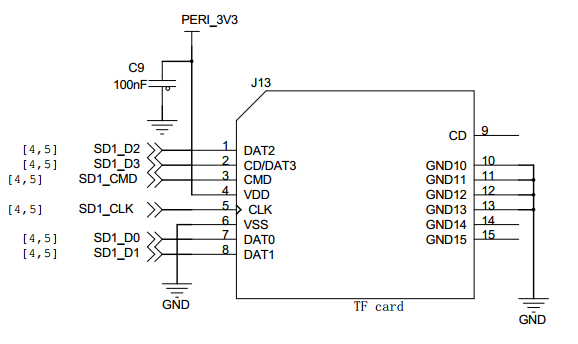

图 27‑19mini底板SD卡硬件设计

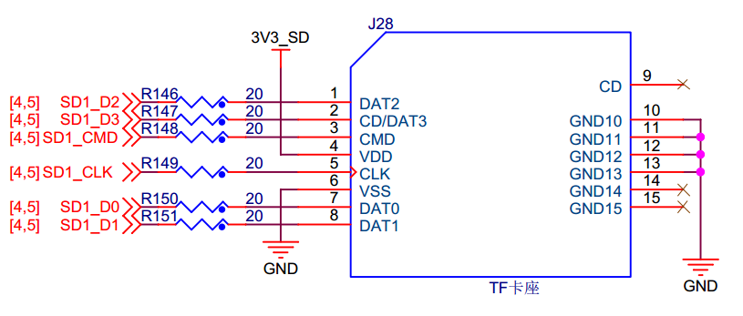

图 27‑20Pro底板SD卡硬件设计

软件设计
^^^^^^^^

这里只讲解核心的部分代码，有些变量的设置，头文件的包含等没有全部罗列出来，完整的代码请参考本章配套的工程。有了之前相关SDIO知识基础，我们就可以着手开始编写SD卡驱动程序了。

SD卡这部分内容庞大而复杂，NXP在sdk中提供了sdmmc中间件。这些代码稳定、高效，我们的程序基于sdmmc中间件编写。

初始化大概流程：

-  初始化相关GPIO；

-  初始化uSDHC；

-  初始化SD卡

-  SD卡读写测试

虽然看起来只有四步，但它们有非常多的细节需要处理。实际上，SD卡是非常常用外设部件，RT1052公司在其测试板上也有板子SD卡卡槽，并提供了完整的驱动程序，我们直接参考移植使用即可。类似SDIO、USB这些复杂的外设，它们的通信协议相当庞大，要自行编写完整、严谨的驱动不是一件轻松的事情，这时我们就可以利用NXP官方例程的驱动文件，根据自己硬件移植到自己开发平台即可。

NXP官方提供的中间件位于SDK中的MIMXRT1052xxxxx\middleware目录。middleware文件夹包含了一些基于RT1052的中间件程序，比如SUB、SDMMC、SD卡、LWIP等等，虽然，我们的开发平台跟NXP官方实验平台硬件设计略有差别，但这些程序与底层硬件联系不大，移植程序方法是完全可行的。学会移植程序可以减少很多工作量，加快项目进程，更何况NXP官方的代码是经过严格验证的。

添加sdmmc中间件到工程
**********************

首先，我们简单了解sdmmc文件主要包含哪些内容，如 图 27‑21所示。

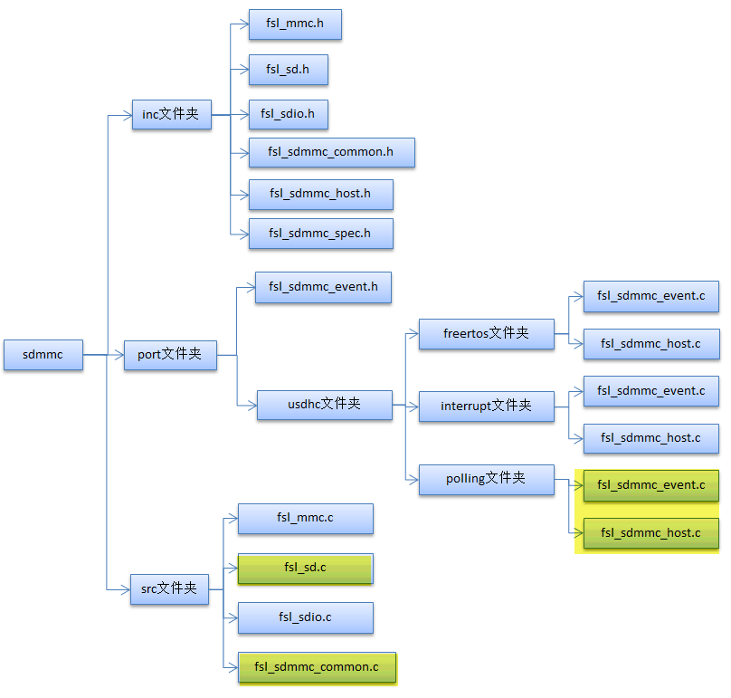

图 27‑21sdmmc文件结构

简单介绍如下：

-  inc文件夹包含sdmmc中间件的头文件，我们需要将其添加到工程中。位于port文件夹下的fsl_sdmmc_event.h头文件也要添加到工程。

-  port文件夹包含三个版本的源文件，polling文件夹与interrupt的区别是卡检测方式不同。polling文件夹的程序在初始化SD卡时采用轮询方式等待SD卡插入。interrupt文件夹的程序在初始化SD卡时采用中断方式检测SD卡插入。freertos文件夹的程序符合FreeRTOS实时操作系统要求。

..

    本实验采用polling文件夹的程序编写SD卡测试历程。所以需要将阴影部分（黄色填充处）的源文件添加到工程，如图
    27‑21所示。

-  src文件夹，sdmmc中间件支持SD卡、mmc卡、sdio设备。本实验使用的是SD卡，所选择fsl_sd.c源文件。fsl_sdmmc_common.c源文件，从名字不难看出，这是一个通用的文件，无论使SD卡、mmc卡或者sdio设备都需要改源文件。

首先我们将sdmmc文件夹复制到工程libaries文件夹下如图
27‑22所示。如何向工程中添加源文件以及如何添加头文件这里不再介绍。

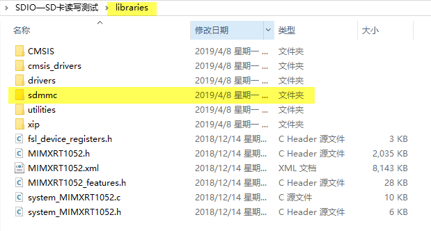

图 27‑22sdmmc存放位置

GPIO初始化
''''''''''

SDIO用到CLK线、CMD线、4根DAT线和电源控制线，使用之前必须初始化相关GPIO，并设置为复用模式。

.. code-block:: c
   :name: 代码清单 27‑16GPIO相关配置宏定义(bsp_sd.h)
   :caption: 代码清单 27‑16GPIO相关配置宏定义(bsp_sd.h)
   :linenos:

   /*****************************第一部分*****************************/
   /*SD1_CMD*/
   #define USDHC1_CMD_GPIO             GPIO3
   #define USDHC1_CMD_GPIO_PIN         (12U)
   #define USDHC1_CMD_IOMUXC           IOMUXC_GPIO_SD_B0_00_USDHC1_CMD
   
   /*SD1_CLK*/
   #define USDHC1_CLK_GPIO             GPIO2
   #define USDHC1_CLK_GPIO_PIN         (30U)
   #define USDHC1_CLK_IOMUXC           IOMUXC_GPIO_SD_B0_01_USDHC1_CLK
   
   /*SD1_D0*/
   #define USDHC1_DATA0_GPIO             GPIO3
   #define USDHC1_DATA0_GPIO_PIN         (14U)
   #define USDHC1_DATA0_IOMUXC           IOMUXC_GPIO_SD_B0_02_USDHC1_DATA0

   /*SD1_D1*/
   #define USDHC1_DATA1_GPIO             GPIO3
   #define USDHC1_DATA1_GPIO_PIN         (15U)
   #define USDHC1_DATA1_IOMUXC           IOMUXC_GPIO_SD_B0_03_USDHC1_DATA1

   /*SD1_D2*/
   #define USDHC1_DATA2_GPIO             GPIO3
   #define USDHC1_DATA2_GPIO_PIN         (16U)
   #define USDHC1_DATA2_IOMUXC           IOMUXC_GPIO_SD_B0_04_USDHC1_DATA2

   /*SD1_D3*/
   #define USDHC1_DATA3_GPIO             GPIO3
   #define USDHC1_DATA3_GPIO_PIN         (17U)
   #define USDHC1_DATA3_IOMUXC           IOMUXC_GPIO_SD_B0_05_USDHC1_DATA3

   /*电源控制*/
   #define SD_POWER_GPIO             GPIO2
   #define SD_POWER_GPIO_PIN         (30U)
   #define SD_POWER_IOMUXC           IOMUXC_GPIO_B1_14_USDHC1_VSELECT

   /****************************第二部分*****************************/
   /* USDHC1 DATA引脚 CMD引脚 PAD属性配置 IO28,*/
   #define USDHC1_DATA_PAD_CONFIG_DATA     (SRE_1_FAST_SLEW_RATE| \
                                          DSE_1_R0_1| \
                                          SPEED_2_MEDIUM_100MHz| \
                                          ODE_0_OPEN_DRAIN_DISABLED| \
                                          PKE_1_PULL_KEEPER_ENABLED| \
                                          PUE_1_PULL_SELECTED| \
                                          PUS_1_47K_OHM_PULL_UP| \
                                          HYS_1_HYSTERESIS_ENABLED)

      /* 配置说明 : */
      /* 转换速率: 转换速率快
         驱动强度: R0 
         带宽配置 : medium(100MHz)
         开漏配置: 关闭 
         拉/保持器配置: 使能
         拉/保持器选择: 上下拉
         上拉/下拉选择: 4.7K欧姆上拉(选择了保持器此配置无效)
         滞回器配置: 禁止 */ 

   /*************此处省略SD卡时钟引脚、电源控制引脚PAD属性设置*************/

外设引脚初始化并没有什么难度，关键是要仔细，如果选错了引脚或者配置参数错误编译器不会报错。和大多数外设引脚初始化类似，第一部分使用宏定义指定使用的GPIO引脚以及复用功能，第二部分使用宏定义设置GPIO的PAD属性。DATA引脚、CMD引脚的PAD属性设置相同，如宏USDHC1_DATA_PAD_CONFIG_DATA所示。为节省篇幅，省略了时钟引脚、电源控制引脚PAD属性的设置，详细相关代码。

时钟初始化
''''''''''

RT1052的SUDHC外设根由PFD0或PFD2分频的到，如图 27‑23所示

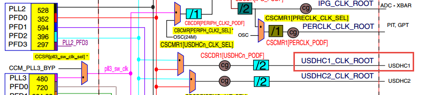

图 27‑23时钟树-USDHC1部分

在第15章
时钟控制模块（CCM）我们详细介绍了系统时钟的初始化和时钟配置的方法，如有疑问请参考第15章
系统时钟初始化部分。

系统时钟初始化函数已经将PLL2的时钟频率初始化为528MHz，我们只需要设置选择的PFD时钟、选择时钟源、设置时钟分频即可。具体代码如代码清单
27‑17所示。

.. code-block:: c
   :name: 代码清单 27‑17SUDHC时钟初始化(bsp_sd.c)
   :caption: 代码清单 27‑17SUDHC时钟初始化(bsp_sd.c)
   :linenos:

   static void BOARD_USDHCClockConfiguration(void)
   {
      /***********************第一部分******************************/
      /*设置系统PLL PFD0 系数为 12*/
      CLOCK_InitSysPfd(kCLOCK_Pfd0, 0x12U);
      
      /***********************第二部分*******************************/
      /* 配置USDHC时钟源和分频系数 */
      CLOCK_SetDiv(kCLOCK_Usdhc1Div, 0U);
      
      /***********************第三部分*******************************/
      CLOCK_SetMux(kCLOCK_Usdhc1Mux, 1U);
   }

-  第一部分，设置PFD0时钟频率，本程序选择FPD0作为时钟源，所以首先设置FPD时钟频率。PFD0的输出频率计算公式为：

PFD0_out =528*18/ PFD0_FRAC

    PFD0_out是PFD0输出频率，PFD0_FRAC是分频值，本次实验设置为0x12(注意这是16进制数)，计算得到FPD0输出频率为528MHz。

-  第二部分，选择时钟分频，分频值设置为0，表示不分频。

-  第三部分，选择时钟源，本程序中选择PFD0作为时钟源，并且在之前已经设置了FPD0的时钟频率。

..

    关于CLOCK_SetMux(kCLOCK_Usdhc1Mux, 1U)函数参数的设置在第15章
    CCM章节已经详细介绍，这里简单介绍如下：

1. 第一个参数，是clock_mux_t类型的枚举类型，该枚举类型定义了所有可选的时钟选择寄存，我们根据时钟名字找到对应的枚举值即可，如代码清单 27‑18所示。

.. code-block:: c
   :name: 代码清单 27‑18时钟选择枚举类型(fsl_clock.h)
   :caption: 代码清单 27‑18时钟选择枚举类型(fsl_clock.h)
   :linenos:

   typedef enum _clock_mux
   {                     
      kCLOCK_Usdhc2Mux =/*此处省略枚举值的设置*/,  /*!< usdhc2 mux name */
      kCLOCK_Usdhc1Mux =/*此处省略枚举值的设置*/, /*!< usdhc1 mux name */            
   } clock_mux_t;

例如我们需要设置USDHC2的时钟选择，则将该参数设置为kCLOCK_Usdhc2Mux即可。

1. 第二个参数，指定选择的时钟。在程序中我们可以看到该参数被设置位0、1等。这些数字代表什么需要查看《IMXRT1050RM》（参考手册）得到，(写到这里时还没有找到有关这些时钟的宏定义或者时钟枚举值，官方SDK中也是直接用数字指代时钟源)。以本实验为例，我们要选择PFD0作为时钟源，首先在《IMXRT1050RM》（参考手册）找到对应的时钟选择寄存器CCM_CSCMR1[USDHC1_CLK_SEL]，根据寄存器内容介绍设置该参数的值，如图 27‑24所示。

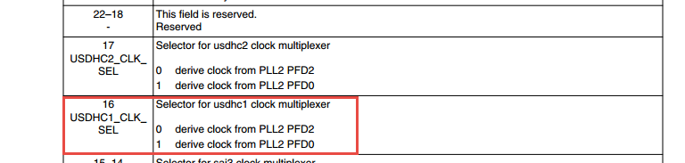

图 27‑24CCM_CSCMR1[USDHC1_CLK_SEL]寄存器

初始化USDHC
'''''''''''

初始化SD卡之前首先要配置USDHC接口，因为使用了NXP的sdmmc中间件程序，所以初始化过程比较简单，只需要配置初始化结构体然后调用初始化函数即可。如代码清单
27‑19所示。

.. code-block:: c
   :name: 代码清单 27‑19USDHC初始化函数
   :caption: 代码清单 27‑19USDHC初始化函数
   :linenos:

   int USDHC_Host_Init(sd_card_t* sd_struct)
   {
      
      /****************************第一部分***********************/
      sd_card_t *card = sd_struct;
      
      /* 初始化SD外设时钟 */
      BOARD_USDHCClockConfiguration();
   
      card->host.base = SD_HOST_BASEADDR;
      card->host.sourceClock_Hz = SD_HOST_CLK_FREQ;
      
      /**************************第二部分*************************/
      /* SD主机初始化函数 */
      if (SD_HostInit(card) != kStatus_Success)
      {
      PRINTF("\r\nSD主机初始化失败\r\n");
      return -1;
      } 
      return 0;   
   }

-  第一部分，配置主机初始化结构体。
   无论使USDHC初始化参数、SD卡初始化参数、SD卡信息都保存在sd_card_t类型结构体中，

-  第二部分，这部分代码的核心是函数SD_HostInit，该函数会进行一系列函数调用，我们用一个图表示这种调用关系，后面的代码讲解基于图27‑25。

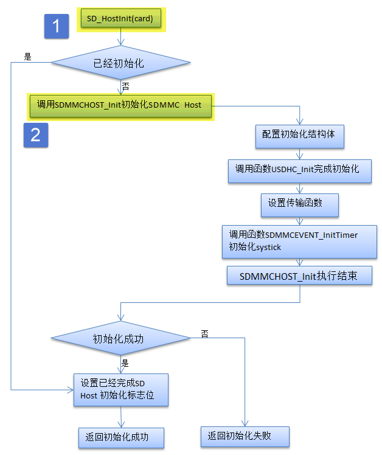

图 27‑25SD Host初始化流程图

1. 函数SD_HostInit通过调用SDMMCHOST_Init函数完成SD  Host的初始化，SD_HostInit函数的实现过程比较简单，如代码清单 27‑20所示。

.. code-block:: c
   :name: 代码清单 27‑20SD_HostInit函数(fsl_sd.c)
   :caption: 代码清单 27‑20SD_HostInit函数(fsl_sd.c)
   :linenos:

   status_t SD_HostInit(sd_card_t *card)
   {
      assert(card);
      /***********************第一部分************************/
      if ((!card->isHostReady) && SDMMCHOST_Init(&(card->host),\
         (void *)(card->usrParam.cd)) != kStatus_Success)
      {
            return kStatus_Fail;
      }
      
      /*********************第二部分***********************/
      /* set the host status flag, after the 
         card re-plug in, don't need init host again */
      card->isHostReady = true;
   
      return kStatus_Success;
   }

第一部分，判断是否已经初始化，如果还没有完成初始化则调用SDMMCHOST_Init()函数。第二部分，如果初始化成功则设置初始化完成标志位。

1. 函数SDMMCHOST_Init，该函数是真正实现SD Host初始化的函数，如代码清单 27‑21所示。

.. code-block:: c
   :name: 代码清单 27‑21SDMMCHOST_Init函数(fsl_sd.c)
   :caption: 代码清单 27‑21SDMMCHOST_Init函数(fsl_sd.c)
   :linenos:

   status_t SDMMCHOST_Init(SDMMCHOST_CONFIG *host, void *userData)
   {
      usdhc_host_t *usdhcHost = (usdhc_host_t *)host;
   
      /*****************************第一部分***********************/
      /* init card power control */
   //    SDMMCHOST_INIT_SD_POWER();
   //    SDMMCHOST_INIT_MMC_POWER();
   
      /**************************第二部分**************************/
      /* Initializes SDHC. */
      usdhcHost->config.dataTimeout = USDHC_DATA_TIMEOUT;
      usdhcHost->config.endianMode = USDHC_ENDIAN_MODE;
      usdhcHost->config.readWatermarkLevel = USDHC_READ_WATERMARK_LEVEL;
      usdhcHost->config.writeWatermarkLevel = USDHC_WRITE_WATERMARK_LEVEL;
      usdhcHost->config.readBurstLen = USDHC_READ_BURST_LEN;
      usdhcHost->config.writeBurstLen = USDHC_WRITE_BURST_LEN;
   
      USDHC_Init(usdhcHost->base, &(usdhcHost->config));
   
      /*************************第三部分*****************************/
      /* Define transfer function. */
      usdhcHost->transfer = SDMMCHOST_TransferFunction;
      
      /*************************第四部分*****************************/
      /* event init timer */
      SDMMCEVENT_InitTimer();   
      
      /************************第五部分******************************/
      /*
      *说明:本实验不使用SD卡插入检测，所以取消SD卡检测初始化
      */
      /* card detect init */
   //    SDMMCHOST_CardDetectInit(usdhcHost->base,\
   //     (sdmmchost_detect_card_t *)userData);
      return kStatus_Success;
   }

-  第一部分，初始化电源控制引脚。在27.7 uSDHC外设框图剖析章节已经介绍过uSDHC电源控制引脚。电源控制引脚用于控制给RT1052的NVCC_SD引脚供电为3.0V还是1.8V。这部分代码在SD卡引脚初始化部分已经实现，所以在这里屏蔽电源控制引脚的初始化。

-  第二部分，配置SUDCH初始化结构体并调用USDHC_Init函数完成初始化，有关这些配置项的作用请参考27.9 uSDHC主机配置结构体章节，这里不再赘述。

-  第三部分，设置传输函数。在USDHC配置结构体usdhc_host_t中拥有一个usdhc_transfer_function_t类型的函数指针，该部分代码用于设置该函数指针的值。当要传输数据或命令时将会调用该函数指针指定的函数完成数据传输

-  第四部分，设置systick时钟产生1ms中断。在SD卡初始化过程中会经常用到等待卡响应，等待时间的设置是通过systick定时器实现的。

-  第五部分，初始化卡检测。所谓卡检测就是当卡插入和拔出时单片机产生中断或者发出一个事件通知CPU。RT1052的uSDHC卡检测大致分为两种，第一种，使用GPIO检测，这种检测方式需要特殊的卡槽，当卡插入和拔出时触动卡槽的某些机械结构导致卡槽的某些引脚电平改变，通过单片机GPIO的引脚检测相应的输出电平即可得知卡是否插入。第二种，使用SD卡的DATA3引脚检测卡状态。

本实验不使用卡检测，所以屏蔽掉这部分代码，使用DATA3卡检测与该实验差别较大（使用的sdmmc中间件不同），详细请参考本章配套代码。

SD卡初始化
''''''''''

SD卡初始化过程主要是卡识别和相关SD卡状态获取。整个初始化函数可以实现图
27‑26中的功能。

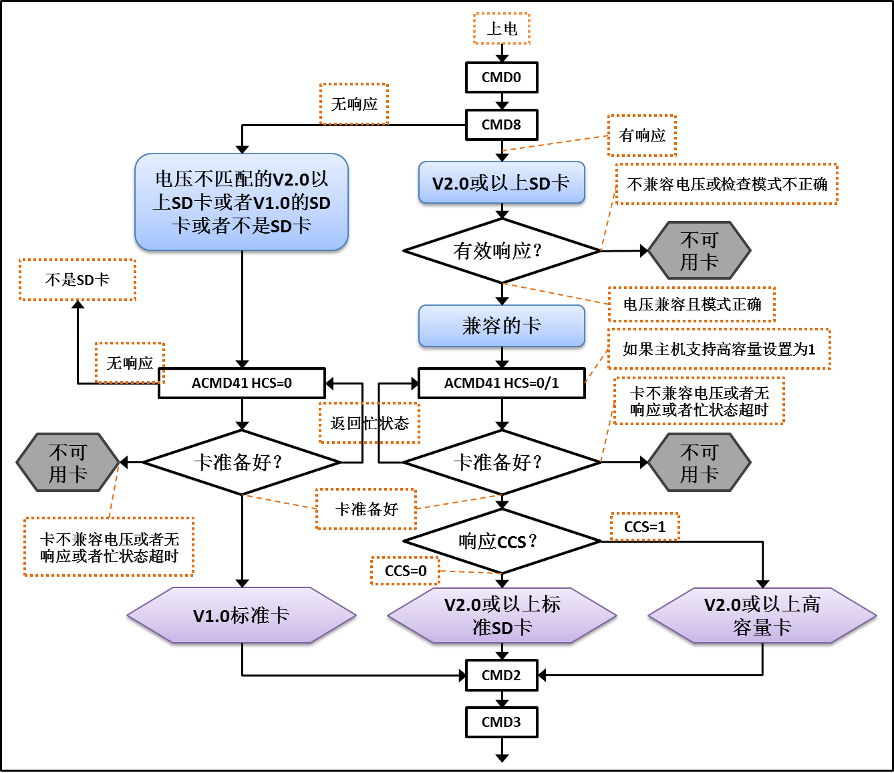

SD卡初始化函数
*****************

.. code-block:: c
   :name: 代码清单 27‑22SD_CardInit函数(fsl_sd.c)
   :caption: 代码清单 27‑22SD_CardInit函数(fsl_sd.c)
   :linenos:

   status_t SD_CardInit(sd_card_t *card)
   {
      assert(card);
      /**********************第一部分***********************/
      uint32_t applicationCommand41Argument = 0U;
   
      if (!card->isHostReady)
      {
            return kStatus_SDMMC_HostNotReady;
      }
      /**************************第二部分******************************/
      /* reset variables */
      card->flags = 0U;
      /* set DATA bus width */
      SDMMCHOST_SET_CARD_BUS_WIDTH(card->host.base, \
                                    kSDMMCHOST_DATABUSWIDTH1BIT);
      /*set card freq to 400KHZ*/
      card->busClock_Hz = SDMMCHOST_SET_CARD_CLOCK(card->host.base,\
                        card->host.sourceClock_Hz, SDMMC_CLOCK_400KHZ);
      /* send card active */
      SDMMCHOST_SEND_CARD_ACTIVE(card->host.base, 100U);
      /* Get host capability. */
      GET_SDMMCHOST_CAPABILITY(card->host.base, &(card->host.capability));
      
      /************************第三部分*****************************/
      /* card go idle */
      if (kStatus_Success != SD_GoIdle(card))
      {
            return kStatus_SDMMC_GoIdleFailed;
      }
   
      if (kSDMMCHOST_SupportV330 != SDMMCHOST_NOT_SUPPORT)
      {
            applicationCommand41Argument |= (kSD_OcrVdd32_33Flag | \
                                          kSD_OcrVdd33_34Flag);
            card->operationVoltage = kCARD_OperationVoltage330V;
      }
      else if (kSDMMCHOST_SupportV300 != SDMMCHOST_NOT_SUPPORT)
      {
            applicationCommand41Argument |= kSD_OcrVdd29_30Flag;
            card->operationVoltage = kCARD_OperationVoltage330V;
      }
   
      /* allow user select the work voltage, if not select, 
                           sdmmc will handle it automatically */
      if (kSDMMCHOST_SupportV180 != SDMMCHOST_NOT_SUPPORT)
      {
            applicationCommand41Argument |= kSD_OcrSwitch18RequestFlag;
      }
   
      /***********************第四部分*****************************/
      /* Check card's supported interface condition. */
      if (kStatus_Success == SD_SendInterfaceCondition(card))
      {
            /* SDHC or SDXC card */
            applicationCommand41Argument |= kSD_OcrHostCapacitySupportFlag;
            card->flags |= kSD_SupportSdhcFlag;
      }
      else
      {
            /* SDSC card */
            if (kStatus_Success != SD_GoIdle(card))
            {
               return kStatus_SDMMC_GoIdleFailed;
            }
      }
      
      /***************************第五部分**********************/
      /* Set card interface condition according to 
            SDHC capability and card's supported interface condition. */
      if (kStatus_Success != SD_ApplicationSendOperationCondition(card,\
                                             applicationCommand41Argument))
      {
            return kStatus_SDMMC_HandShakeOperationConditionFailed;
      }
   
      /**************************第六部分******************/
      /* check if card support 1.8V */
      if ((card->flags & kSD_SupportVoltage180v))
      {
            if (kStatus_Success != SD_SwitchVoltage(card))
            {
               return kStatus_SDMMC_InvalidVoltage;
            }
            card->operationVoltage = kCARD_OperationVoltage180V;
      }
   
      /***********************第七部分*******************/
      /* Initialize card if the card is SD card. */
      if (kStatus_Success != SD_AllSendCid(card))
      {
            return kStatus_SDMMC_AllSendCidFailed;
      }
      if (kStatus_Success != SD_SendRca(card))
      {
            return kStatus_SDMMC_SendRelativeAddressFailed;
      }
      if (kStatus_Success != SD_SendCsd(card))
      {
            return kStatus_SDMMC_SendCsdFailed;
      }
      if (kStatus_Success != SD_SelectCard(card, true))
      {
            return kStatus_SDMMC_SelectCardFailed;
      }
   
      if (kStatus_Success != SD_SendScr(card))
      {
            return kStatus_SDMMC_SendScrFailed;
      }
      
      /***************************第八部分**************************/
      /* Set to max frequency in non-high speed mode. */
      card->busClock_Hz = SDMMCHOST_SET_CARD_CLOCK(card->host.base,\
                           card->host.sourceClock_Hz, SD_CLOCK_25MHZ);
   
      /* Set to 4-bit data bus mode. */
      if (((card->host.capability.flags)& kSDMMCHOST_Support4BitBusWidth)\
                           && (card->flags & kSD_Support4BitWidthFlag))
      {
            if (kStatus_Success != SD_SetDataBusWidth(card,\
                                       kSD_DataBusWidth4Bit))
            {
               return kStatus_SDMMC_SetDataBusWidthFailed;
            }
            SDMMCHOST_SET_CARD_BUS_WIDTH(card->host.base,\
                                          kSDMMCHOST_DATABUSWIDTH4BIT);
      }
   
      /* set sd card driver strength */
      SD_SetDriverStrength(card, card->driverStrength);
      /* set sd card current limit */
      SD_SetMaxCurrent(card, card->maxCurrent);
   
      /* set block size */
      if (SD_SetBlockSize(card, FSL_SDMMC_DEFAULT_BLOCK_SIZE))
      {
            return kStatus_SDMMC_SetCardBlockSizeFailed;
      }
   
      /* select bus timing */
      if (kStatus_Success != SD_SelectBusTiming(card))
      {
            return kStatus_SDMMC_SwitchBusTimingFailed;
      }
      
      return kStatus_Success;
   }

初始化函数超长，我们分为八部分。各分部讲解如下：

-  第一部分，再次确认SDMMC_Host是否已经初始化完成，如果没有直接退出初始化。

-  第二部分，实现卡识别模式初始化，主要包括设置传输数据线数量为1，设置卡频率为400KHZ，将卡设置位活动状态。

-  第三部分，检测SD 卡支持的电压。

-  第四部分，调用函数SD_SendInterfaceCondition获取SD卡类型。

-  第五部分，根据获取的到的卡类型信息设置uSDHC。

-  第六部分，检查是否支持1.8V

-  第七部分，如果是SD卡，初始化SD卡。主要操作是发送命令，获取SD卡信息，各个初始化函数的作用如表 27‑10所示。

表 27‑10SD卡初始化函数功能对照表

+---------------------------+-----------------------------------------------+
|     初始化函数            | 功能                                          |
+===========================+===============================================+
| SD_AllSendCid(card)       | 发送GET_CID命令，从SD卡获取CID                |
+---------------------------+-----------------------------------------------+
| SD_SendRca(card)          | 发送GET_RCA命令，从SD卡获取卡相对地址         |
+---------------------------+-----------------------------------------------+
| SD_SendCsd(card)          | 发送SEND_CSD命令，从SD卡CSD寄存器的内容       |
+---------------------------+-----------------------------------------------+
| SD_SelectCard(card, true) | 发送SELECT_CARD命令，从卡识别模式变为传输模式 |
+---------------------------+-----------------------------------------------+
| SD_SendScr(card)          |                                               |
+---------------------------+-----------------------------------------------+

-  第八部分，初始化SD卡传输模式。主要包括设置在非高速模式下SD卡频率、设置为4线传输模式、设置SD卡驱动强度、设置SD卡电流上限、设置SD卡块大小和选择总线时序。

至此，SD卡已经初始化完成。如果程序可以正确执行，接下来就可以进行SD卡读写以及擦除等操作。虽然SD_CardInit函数看起来非常长，但是由于使用了sdmmc中间件，我们只需要调用相应的函数即可实现发送命令和读取SD
信息的操作。

SD读写测试
''''''''''

SD卡数据操作一般包括数据读取、数据写入以及存储区擦除。数据读取和写入都可以分为单块操作和多块操作。SD卡读写测试的代码如代码清单
27‑23所示。

.. code-block:: c
   :name: 代码清单 27‑23SD卡读写测试函数(bsp_sd.c)
   :caption: 代码清单 27‑23SD卡读写测试函数(bsp_sd.c)
   :linenos:

   void SD_Card_Test(sd_card_t* sd_struct)
   {
      sd_card_t *card = sd_struct;
      
      /********************第一部分*******************/
      /* 打印卡片工作信息 */
      CardInformationLog(card);
      
      /*******************第二部分********************/
      /* 读写测试 */
      if(AccessCard(card)==kStatus_Success)
      PRINTF("\r\nSDCARD 测试完成.\r\n");
      else
      PRINTF("\r\nSDCARD 测试失败.\r\n");
   }

-  第一部分，调用函数CardInformationLog输出SD卡信息。CardInformationLog函数原型如代码清单 27‑24所示。

.. code-block:: c
   :name: 代码清单 27‑24函数CardInformationLog(bsp_sd.c)
   :caption: 代码清单 27‑24函数CardInformationLog(bsp_sd.c)
   :linenos:

   static void CardInformationLog(sd_card_t *card)
   {
      assert(card);
      
      /************************第一部分*******************************/
      PRINTF("\r\n卡大小 %d*%d bytes\r\n",card->blockCount,card->blockSize);
      PRINTF("\r\n工作条件:\r\n");
      /************************第二部分*******************************/
      if (card->operationVoltage == kCARD_OperationVoltage330V)
      {
      PRINTF("\r\n  SD卡操作电压 : 3.3V\r\n");
      }
      else if (card->operationVoltage == kCARD_OperationVoltage180V)
      {
      PRINTF("\r\n  SD卡操作电压 : 1.8V\r\n");
      }
      
      /**********************第三部分*******************************/
      if (card->currentTiming == kSD_TimingSDR12DefaultMode)
      {
      if (card->operationVoltage == kCARD_OperationVoltage330V)
      {
         PRINTF("\r\n  时序模式: 常规模式\r\n");
      }
      else if (card->operationVoltage == kCARD_OperationVoltage180V)
      {
         PRINTF("\r\n  时序模式: SDR12 模式\r\n");
      }
      }
      else if (card->currentTiming == kSD_TimingSDR25HighSpeedMode)
      {
      if (card->operationVoltage == kCARD_OperationVoltage180V)
      {
         PRINTF("\r\n  时序模式: SDR25\r\n");
      }
      else
      {
         PRINTF("\r\n  时序模式: High Speed\r\n");
      }
      }
      else if (card->currentTiming == kSD_TimingSDR50Mode)
      {
      PRINTF("\r\n  时序模式: SDR50\r\n");
      }
      else if (card->currentTiming == kSD_TimingSDR104Mode)
      {
      PRINTF("\r\n  时序模式: SDR104\r\n");
      }
      else if (card->currentTiming == kSD_TimingDDR50Mode)
      {
      PRINTF("\r\n  时序模式: DDR50\r\n");
      }
      
      /************************第四部分************************/
      PRINTF("\r\n  Freq : %d HZ\r\n", card->busClock_Hz);
   }

SD卡的信息都保存在sd_card_t类型的结构体中，函数CardInformationLog的作用就是将SD卡的一些信息通过串口输出，这里不再过多介绍。

-  第二部分，进行SD卡的读写测试，包括单个数据块的读写和多个数据块的读写。如代码清单27‑25所示。

.. code-block:: c
   :name: 代码清单 27‑25SD卡读写测试函数AccessCard(bsp_sd.c)
   :caption: 代码清单 27‑25SD卡读写测试函数AccessCard(bsp_sd.c)
   :linenos:

   /***************************第一部分*****************************/
   SDK_ALIGN(uint8_t g_dataWrite[SDK_SIZEALIGN(DATA_BUFFER_SIZE,\
                                 SDMMC_DATA_BUFFER_ALIGN_CACHE)],\
      MAX(SDMMC_DATA_BUFFER_ALIGN_CACHE, SDMMCHOST_DMA_BUFFER_ADDR_ALIGN));
   /* 读取数据缓存 */
   SDK_ALIGN(uint8_t g_dataRead[SDK_SIZEALIGN(DATA_BUFFER_SIZE, \
                                 SDMMC_DATA_BUFFER_ALIGN_CACHE)],\
      MAX(SDMMC_DATA_BUFFER_ALIGN_CACHE, SDMMCHOST_DMA_BUFFER_ADDR_ALIGN)); 
   
   
   static status_t AccessCard(sd_card_t *card)
   {
   
      /********************第二部分****************************/
      memset(g_dataWrite, 0x5aU, sizeof(g_dataWrite));
      
      PRINTF("\r\n写入/读取一个数据块......\r\n");
      if (kStatus_Success != SD_WriteBlocks(card, g_dataWrite,\
                                       DATA_BLOCK_START, 1U))
      {
      PRINTF("写入一个数据块失败.\r\n");
      return kStatus_Fail;
      }
      
      memset(g_dataRead, 0U, sizeof(g_dataRead));
      if (kStatus_Success != SD_ReadBlocks(card, g_dataRead,\
                                          DATA_BLOCK_START, 1U))
   {
      PRINTF("读取一个数据块.\r\n");
      return kStatus_Fail;
   }

   PRINTF("比较读取/写入内容......\r\n");
   if (memcmp(g_dataRead, g_dataWrite, FSL_SDMMC_DEFAULT_BLOCK_SIZE))
   {
      PRINTF("读取/写入内容不一致.\r\n");
      return kStatus_Fail;
   }
   PRINTF("读取/写入内容一致\r\n");
   
   /******************第三部分*****************************/
   PRINTF("写入/读取多个数据块......\r\n");
   if (kStatus_Success != SD_WriteBlocks(card, g_dataWrite,\
                              DATA_BLOCK_START, DATA_BLOCK_COUNT))
   {
      PRINTF("写入多个数据块失败.\r\n");
      return kStatus_Fail;
   }

   memset(g_dataRead, 0U, sizeof(g_dataRead));
   if (kStatus_Success != SD_ReadBlocks(card, g_dataRead,\
                           DATA_BLOCK_START, DATA_BLOCK_COUNT))
   {
      PRINTF("读取多个数据块失败.\r\n");
      return kStatus_Fail;
   }
   
   PRINTF("比较读取/写入内容......\r\n");
   if (memcmp(g_dataRead, g_dataWrite, FSL_SDMMC_DEFAULT_BLOCK_SIZE))
   {
      PRINTF("读取/写入内容不一致.\r\n");
      return kStatus_Fail;
   }
   PRINTF("读取/写入内容一致.\r\n");
   
   PRINTF("擦除多个数据块......\r\n");
   if (kStatus_Success != SD_EraseBlocks(card,\
                     DATA_BLOCK_START, DATA_BLOCK_COUNT))
   {
      PRINTF("擦除多个数据块失败.\r\n");
      return kStatus_Fail;
   }
   return kStatus_Success;
   }

卡读写测试函数函数较长，但主要内容只有几个读写函数的使用，我们将详细介绍这几个读写函数的使用方法。

-  第一部分，定义具有字节对齐的读写数据存储区。以g_dataWrite为例，该语句由多个个宏定义组成，各个宏定义的值以及含义如表 27‑11所示。

表 27‑11字节对齐相关宏定义

+---------------------------------+-------+------------------------------+
| 宏定义                          | 值    | 宏定义的含义                 |
+=================================+=======+==============================+
| DATA_BLOCK_COUNT                | 5     | 数据块数量                   |
+---------------------------------+-------+------------------------------+
| FSL_SDMMC_DEFAULT_BLOCK_SIZE    | 512   | SD卡数据块大小（单位：字节） |
+---------------------------------+-------+------------------------------+
| DATA_BUFFER_SIZE                | 512*5 | 数据缓冲区大小（单位：字节） |
+---------------------------------+-------+------------------------------+
| SDMMC_DATA_BUFFER_ALIGN_CACHE   | 32    | DCACHES地址对齐              |
+---------------------------------+-------+------------------------------+
| SDMMCHOST_DMA_BUFFER_ADDR_ALIGN | 4     | ADMA2地址对齐                |
+---------------------------------+-------+------------------------------+

结合表 27‑11讲解第一部分。

1. 宏MAX，该宏如代码清单 27‑26所示，这时一个三目运算符，用于比较两个值得大小并选择较大的值。在本程序中a和b分别对应宏定义SDMMC_DATA_BUFFER_ALIGN_CACHE和宏定义，SDMMCHOST_DMA_BUFFER_ADDR_ALIGN。结果就是选择较大对齐数作为最终的数据对齐。

.. code-block:: c
   :name: 代码清单 27‑26MAX宏定义(fsl_common.h)
   :caption: 代码清单 27‑26MAX宏定义(fsl_common.h)
   :linenos:

   #define MAX(a, b) ((a) > (b) ? (a) : (b)) 

1. 宏SDK_SIZEALIGN，该宏定义如代码清单27‑27所示。作用是按照对齐要求“补齐”数据，结合简要分析如下：

.. code-block:: c
   :name: 代码清单 27‑27SDK_SIZEALIGN宏定义(fsl_common.h)
   :caption: 代码清单 27‑27SDK_SIZEALIGN宏定义(fsl_common.h)
   :linenos:

   #define SDK_SIZEALIGN(var, alignbytes) \
      ((unsigned int)((var) + ((alignbytes)-1)) &\
         (unsigned int)(~(unsigned int)((alignbytes)-1))

该宏定义的作用是增加var的值直到能被alignbytes整除。例如var=6，alignbytes=4，则经过该宏定义处理后var=8。

1. 宏SDK_ALIGN，定义指定字节对齐的变量。宏定义如代码清单 27‑28所示。

.. code-block:: c
   :name: 代码清单 27‑28SDK_ALIGN宏定义(fsl_common.h)
   :caption: 代码清单 27‑28SDK_ALIGN宏定义(fsl_common.h)
   :linenos:

   #define SDK_ALIGN(var, alignbytes) \
            SDK_PRAGMA(data_alignment = alignbytes) var

经过宏MAX和宏SDK_SIZEALIGN处理之后，我们已经得到了变量的数据长度和字节对齐要求，用实际数据替换掉这些宏得到的结果如代码清单 27‑29所示

.. code-block:: c
   :name: 代码清单 27‑29宏定义处理结果
   :caption: 代码清单 27‑29宏定义处理结果
   :linenos:

   /*要写入数据存储位置*/
   SDK_ALIGN(uint8_t g_dataWrite[512*5],32);
   /* 读取的数据存储位置*/
   SDK_ALIGN(uint8_t g_dataRead[512*5],32)

使用宏SDK_ALIGN定义的变量g_dataWrite和变量g_dataRead在存储内存中的起始地址是32字节对齐的。

-  第二部分，进行单个数据块的读写测试。测试流程如图 27‑27所示。

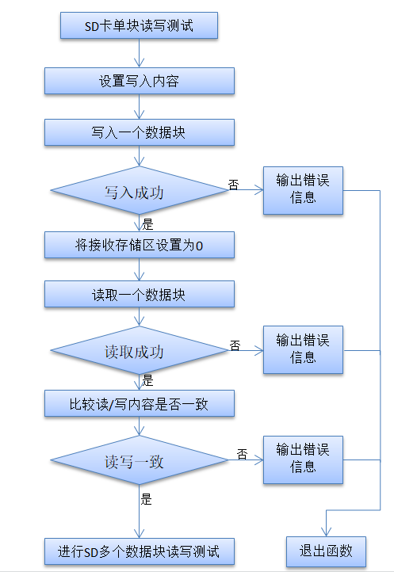

图 27‑27SD卡单块读写测试流程图

SD卡的单块读写测试流程比较简单，首先设置写入值，然后调用SD卡块写入函数将写入数据存储区中的内容写入SD卡。读取之前首先将读取数据存储区清零，然后调用SD卡块读取函数将SD卡的内容写入读取数据存储区。写入、读取完成之后调用memcmp函数比较两个数据存储区的内容是否一致。

下面简要讲解SD卡块写入与读取函数的使用方法。有关函数具体的实现过程，如果感兴趣请参考教程配套源码，这里不再讲解。

1. 块写入函数SD_WriteBlocks。函数声明如代码清单 27‑30所示。

.. code-block:: c
   :name: 代码清单 27‑30SD_WriteBlocks函数(fsl_sd.h)
   :caption: 代码清单 27‑30SD_WriteBlocks函数(fsl_sd.h)
   :linenos:

   status_t SD_WriteBlocks(sd_card_t *card,  \
                     const uint8_t *buffer,\
                        uint32_t startBlock,  \
                        uint32_t blockCount)

该函数支持SD卡单个数据块写入和多个数据块写入，并且通过返回值可以判断写入是否成功以及错误类型。函数参数简要讲解如下：

-  参数card，指定Card描述结构体。它是一个 sd_card_t类型的结构体指针，有关sd_card_t类型的结构是本章的重点，在27.10 SD卡结构体章节已经详细介绍，这里不再赘述。

-  参数buffer，指定发送缓冲区，即将要写入数据的起始地址。在本程序中将要写入的数据保存在数组g_dataWrite[]中。

-  参数startBlock，指定写入起始数据块编号。如果没有使用文件系统，在读写SD卡时需要我们指定读写的数据块编号，SD卡的每个数据块大小为512字节。

-  参数blockCount，指定写入多少个数据块。

1. 块读取函数，SD_ReadBlocks。函数声明如代码清单 27‑31所示。

.. code-block:: c
   :name: 代码清单 27‑31SD_ReadBlocks函数
   :caption: 代码清单 27‑31SD_ReadBlocks函数
   :linenos:

   status_t SD_ReadBlocks(sd_card_t *card,  \
                     const uint8_t *buffer,\
                        uint32_t startBlock,  \
                        uint32_t blockCount)

SD卡块读取函数SD_WriteBlocks和SD卡块写入函数SD_WriteBlocks类似，不同的是SD_ReadBlocks函数的参数buffer用于指定从SD卡读取得到的数据保存起始地址。

-  第三部分，进行多个数据块的读写测试，宏DATA_BLOCK_COUNT指定了读写数据块的个数。该过程与单个数据块的读写测试过程非常相似这里不再赘述。详细请参考第二部分代码讲解。

主函数
*****************

.. code-block:: c
   :name: 代码清单 27‑32 main函数(main.c)
   :caption: 代码清单 27‑32 main函数(main.c)
   :linenos:

   /************************第一部分*************************/
   /*Card结构描述符*/
   sd_card_t g_sd;
   
   int main(void)
   {
      /* 初始化内存保护单元 */      
      BOARD_ConfigMPU();
      /* 初始化开发板引脚 */
      BOARD_InitPins();
      /* 初始化开发板时钟 */
      BOARD_BootClockRUN();
      /* 初始化调试串口 */
      BOARD_InitDebugConsole();
      /* 打印系统时钟 */
      /*******************此处省略系统时钟打印代码************/
      
      /*********************第二部分*************************/
      /*初始化SD卡接口的GPIO引脚*/
      USDHC1_gpio_init();
      USDHC_Host_Init(&g_sd);
      
      /*********************第三部分*************************/
      while(1)
      {
         /*SD卡读、写测试函数，内部包含了SD卡的初始化*/
         SD_Card_Init(&g_sd);
         SD_Card_Test(&g_sd);
         delay(0x3ffffff);
      }     
   }

-  第一部分，在mian.c文件中定义sd_card_t类型的全局变量g_sd，用于保存SD相关信息，uSDHC初始化、SD卡初始化以及SD卡的读写都是基于该全局变量完成的。和其他工程类似，进入main函数之后首先进行系统初始化。

-  第二部分，初始化SD卡使用的外部引脚并初始化uSDHC接口。uSHCH接口初始化完成之后如果已经接入了SD卡，正常情况下这时已经可以与SD卡建立通信，下一步就要初始化SD卡。

-  第三部分，在while(1)死循环中 不断初始化SD卡并进行SD卡读写测试。

下载验证
^^^^^^^^

把Micro SD卡插入到开发板右侧的卡槽内，使用USB线连接开发板上的“USB TO
UART”接口到电脑，电脑端配置好串口调试助手参数。编译实验程序并下载到开发板上，程序运行后在串口调试助手可接收到开发板发过来信息，由于我们在while(1)死循环中不断进行SD卡初始化和SD卡读写测试，所以正常情况下每隔一段时间打印此次SD卡初始化结果以及读写测试结果。通过打印信息可以得知SD卡信息以及读写测试结果。
