基于SD卡的FatFs文件系统
-----------------------

上一章我们已经全面介绍了SD卡的识别和简单的数据读写，也进行了简单的读写测试，不过像这样直接操作SD卡存储单元，在实际应用中是不现实的。SD卡一般用来存放文件，所以都需要加载文件系统到里面。

文件系统
~~~~~~~~

即使读者可能不了解文件系统，读者也一定对“文件”这个概念十分熟悉。数据在PC上是以文件的形式储存在磁盘中的，这些数据的形式一般为ASCII码或二进制形式。在上一章我们已经写好了SD卡的驱动函数，我们可以非常方便的在SD上读写数据。如需要一串字符写入SD卡，调用SD_WriteBlocks函数即可。

但是，这样直接存储数据会带来极大的不便，如难以记录有效数据的位置，难以确定存储介质的剩余空间，以及应以何种格式来解读数据。就如同一个巨大的图书馆无人管理，杂乱无章地存放着各种书籍，难以查找所需的文档。想象一下图书馆的采购人员购书后，把书籍往馆内一扔，拍拍屁股走人，当有人来借阅某本书的时候，就不得不一本本地查找。这样直接存储数据的方式对于小容量的存储介质如EEPROM还可以接受，但对于SPI
Flash芯片或者SD卡之类的大容量设备，我们需要一种高效的方式来管理它的存储内容。

这些管理方式即为文件系统，它是为了存储和管理数据，而在存储介质建立的一种组织结构，这些结构包括操作系统引导区、目录和文件。常见的windows下的文件系统格式包括FAT32、NTFS、exFAT。在使用文件系统前，要先对存储介质进行格式化。格式化先擦除原来内容，在存储介质上新建一个文件分配表和目录。这样，文件系统就可以记录数据存放的物理地址，剩余空间。

使用文件系统时，
数据都以文件的形式存储。写入新文件时，先在目录中创建一个文件索引，它指示了文件存放的物理地址，再把数据存储到该地址中。当需要读取数据时，可以从目录中找到该文件的索引，进而在相应的地址中读取出数据。具体还涉及到逻辑地址、簇大小、不连续存储等一系列辅助结构或处理过程。

文件系统的存在使我们在存取数据时，不再是简单地向某物理地址直接读写，而是要遵循它的读写格式。如经过逻辑转换，一个完整的文件可能被分开成多段存储到不连续的物理地址，使用目录或链表的方式来获知下一段的位置。

上一章的SD卡驱动只完成了向物理地址存储块中写入数据的工作，而根据文件系统格式的逻辑转换部分则需要额外的代码来完成。实质上，这个逻辑转换部分可以理解为当我们需要写入一段数据时，由它来求解向什么物理地址写入数据、以什么格式写入及写入一些原始数据以外的信息(如目录)。这个逻辑转换部分代码我们也习惯称之为文件系统。

FatFs文件系统简介
~~~~~~~~~~~~~~~~~

上面提到的逻辑转换部分代码(文件系统)即为本章的要点，文件系统庞大而复杂，它需要根据应用的文件系统格式而编写，而且一般与驱动层分离开来，很方便移植，所以工程应用中一般是移植现成的文件系统源码。

FatFs是面向小型嵌入式系统的一种通用的FAT文件系统。它完全是由AISI
C语言编写并且完全独立于底层的I/O介质。因此它可以很容易地不加修改地移植到其他的处理器当中，如8051、PIC、AVR、SH、Z80、H8、ARM等。FatFs支持FAT12、FAT16、FAT32等格式，所以我们利用前面写好的SD卡驱动，把FatFs文件系统代码移植到工程之中，就可以利用文件系统的各种函数，对SD卡以“文件”格式进行读写操作了。

FatFs文件系统源码获取
^^^^^^^^^^^^^^^^^^^^^

FatFs文件系统的源码可以从fatfs官网下载:

http://elm-chan.org/fsw/ff/00index_e.html

第一步：打开链接如图 28‑1所示。

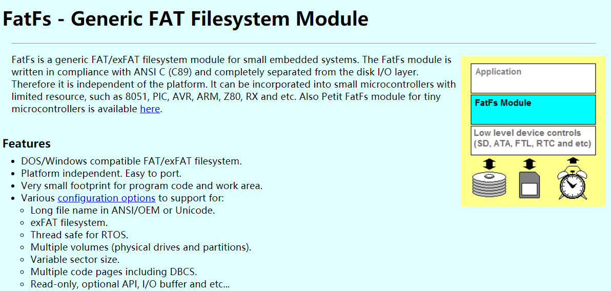

图 28‑1FatFs源码获取（1）

第二步：选择下载的版本如图
28‑2所示。在版本列表中选择需要的版本即可，本章以使用R0.13b。

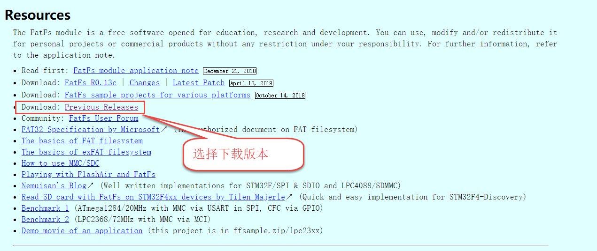

图 28‑2FatFs源码获取（2）

FatFs的目录结构
^^^^^^^^^^^^^^^

在移植FatFs文件系统到开发板之前，我们先要到FatFs的官网获取源码，最新版本为R0.13c，官网有对FatFs做详细的介绍，有兴趣可以了解。解压之后可看到里面有
doc 和 src 这两个文件夹，见图 28‑3。doc 文件夹里面是一些使用帮助文档；
src 才是FatFs文件系统的源码。

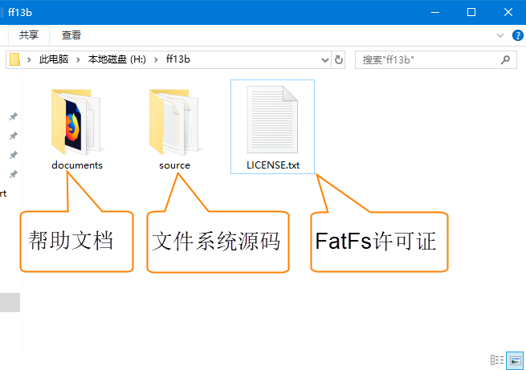

图 28‑3 FatFs文件目录

FatFs帮助文档
^^^^^^^^^^^^^

打开 doc 文件夹，可看到如图 28‑4的文件目录：

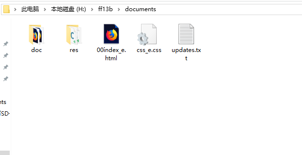

图 28‑4 doc文件夹的文件目录

doc文件夹下各个文件简要介绍如下：

-  其中
   doc文件夹里面是编译好的html文档，讲的是FATFS里面各个函数的使用方法，这些函数都是封装得非常好的函数，利用这些函数我们就可以操作SD卡。有关具体的函数我们在用到的时候再讲解。

-  res文件夹中保存有一些图片和部分源码，我们不必关系该文件夹。

-  00index_e.html是FatFs官网的html文档。

-  updates.txt记录Fatfs版本更新信息。简单了解即可

-  css_e.css，html文件使用到的一种层叠格式，与我们使用FatFs
   无关，不必关心。

FATFS源码
^^^^^^^^^

打开 source 文件夹，可看到如图 28‑5所示的文件目录：

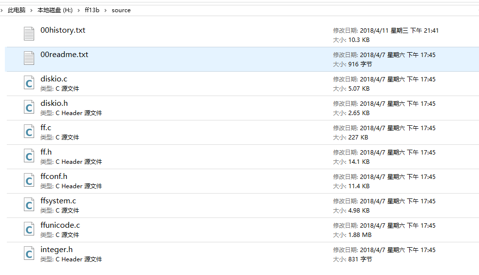

图 28‑5source文件夹的文件目录

option
文件夹下是一些可选的外部c文件，包含了多语言支持需要用到的文件和转换函数。

diskio.c文件是FatFs移植最关键的文件，它为文件系统提供了最底层的访问SD卡的方法，FatFs有且仅有它需要用到与SD卡读写相关的函数。diskio.h定义了FatFs用到的宏，以及diskio.c文件内与底层硬件接口相关的函数声明。

00history.txt介绍了FatFs的版本更新情况。

00readme.txt说明了当前目录下 diskio.c、diskio.h、ff.c、ff.h、integer.h的功能。

src文件夹下的源码文件功能简介如下：

-  integer.h：文件中包含了一些数值类型定义。

-  diskio.c：包含底层存储介质的操作函数，这些函数需要用户自己实现，主要添加底层驱动函数。

-  ff.c：FatFs核心文件，文件管理的实现方法。该文件独立于底层介质操作文件的函数，利用这些函数实现文件的读写。

-  ffunicode.c：包含了多语言支持的编码格式，例如简体中文936编码、英文437编码等。

-  ffconf.h:这个头文件包含了对FatFs功能配置的宏定义，通过修改这些宏定义就可以裁剪FatFs的功能。如需要支持简体中文，需要把ffconf.h中的_CODE_PAGE的宏改成936并把上面的ffunicode.c文件加入到工程之中。

建议阅读这些源码的顺序为：integer.h --> diskio.c --> ff.c 。

阅读文件系统源码ff.c文件需要一定的功底，建议读者先阅读FAT32的文件格式，再去分析ff.c文件。若仅为使用文件系统，则只需要理解integer.h及diskio.c文件并会调用ff.c文件中的函数就可以了。本章主要讲解如何把FATFS文件系统移植到开发板上，并编写一个简单读写操作范例。

FatFs文件系统移植
~~~~~~~~~~~~~~~~~

FatFs程序结构图
^^^^^^^^^^^^^^^

移植FatFs之前我们先通过FatFs的程序结构图了解FatFs在程序中的关系网络，见图
28‑6。

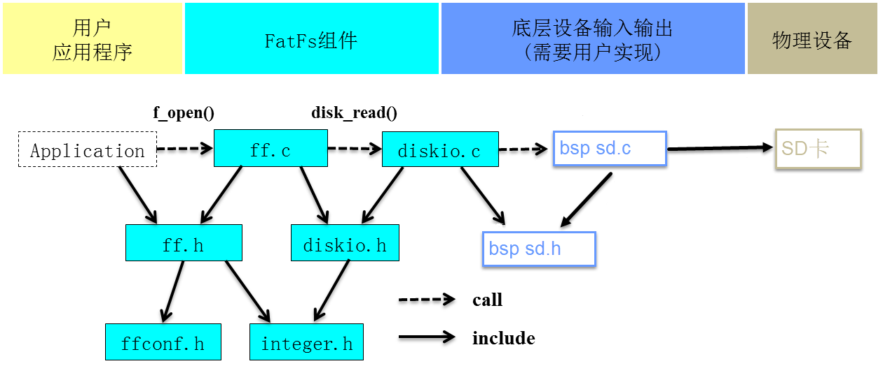

图 28‑6 FatFs程序结构图

用户应用程序需要由用户编写，想实现什么功能就编写什么的程序，一般我们只用到f_mount()、f_open()、f_write()、f_read()就可以实现文件的读写操作。

FatFs组件是FatFs的主体，文件都在源码src文件夹中，其中ff.c、ff.h、integer.h以及diskio.h四个文件我们不需要改动，只需要修改ffconf.h和diskio.c两个文件。

底层设备输入输出要求实现存储设备的读写操作函数、存储设备信息获取函数等等。我们使用SD卡作为物理设备，在上一章节已经编写好了SD卡的驱动程序，这里我们就直接使用。

硬件设计
^^^^^^^^

FatFs属于软件组件，不需要附带其他硬件电路。我们使用SD卡作为物理存储设备，其硬件电路在上一章已经做了分析，这里就直接使用。

添加FatFs步骤
^^^^^^^^^^^^^

上一章我们已经实现了SD卡芯片驱动程序，并实现了读写测试，为移植FatFs方便，我们直接拷贝一份工程，我们在工程基础上添加FatFs组件，并修改main函数的用户程序即可。

NXP官方已经将R0.13b版本的FatFs文件系统移植到了RT1052，保存在“SDK_2.5.0_MIMXRT1052xxxxB\middleware\fatfs”目录下。本小节讲解如何将NXP官方移植的FatFs文件系统添加到我们的工程中。

1) 先拷贝一份SDIO—SD卡读写测试的工程文件(整个文件夹)，并修改文件夹名为“SD卡—FatFs文件”。在libraries文件夹下新建fatfs文件夹，用于保存FatFs文件系统相关内容。如图
   28‑7所示。

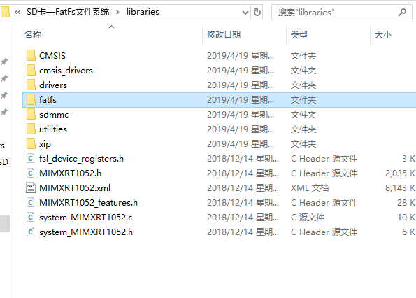

图 28‑7添加fatfs文件夹

1) 打开“SDK_2.5.0_MIMXRT1052xxxxB\middleware\fatfs”，拷贝将
   fsl_sd_disk文件夹以及FatFs源码，如图 28‑8所示。

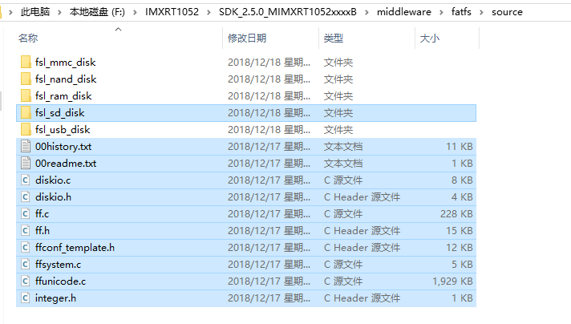

图 28‑8复制NXP官方文件

1) 将第二步复制的内容粘贴到工程文件“SD卡—FatFs文件系统\libraries\fatfs”目录下即可，最终结果如图
   28‑9所示。

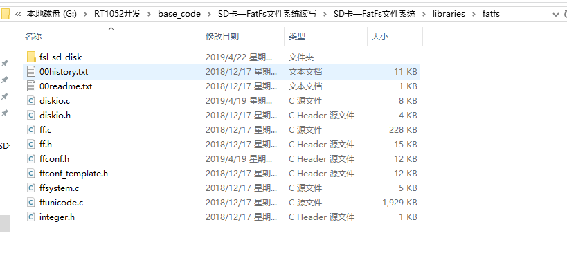

图 28‑9复制FatFs到工程

    至此，我们需要的文件已经全部添加到了fatfs文件夹下。下一步就是将这些文件添加到工程。

1) 使用KEIL软件打开工程文件(..SD卡—FatFs文件系统读写\SD卡—FatFs文件系统\project\mdk\\
   YH-RT1052.uvprojx)，并将FatFs组件文件添加到工程中，需要添加有ff.c、diskio.c、ffsystem.c、ffuniconde.c以及fsl_sd_disk文件夹下的fsl_sd_disk.c五个文件，见图
   28‑10。

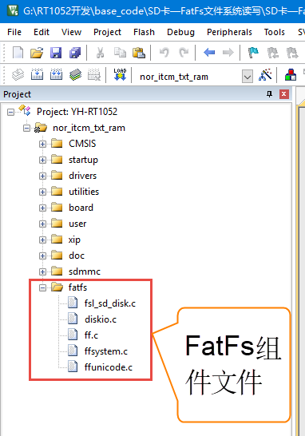

图 28‑10 添加FatFS文件到工程

1) 添加FATFS文件夹到工程的include选项中。打开工程选项对话框，选择“C/C++”选项下的“Include
   Paths”项目，在弹出路径设置对话框中选择添加“FATFS”文件夹，见图 28‑11。

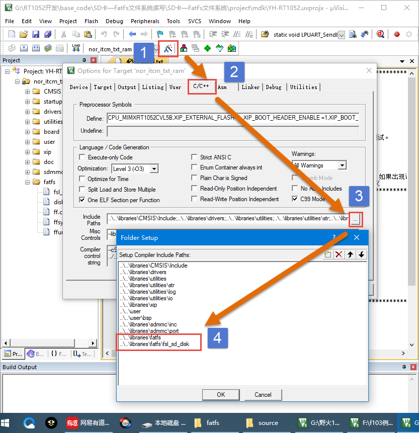

图 28‑11 添加FATFS路径到工程选项

1) 如果现在编译工程，正常情况下会提示找不到头文件，如图 28‑12所示。

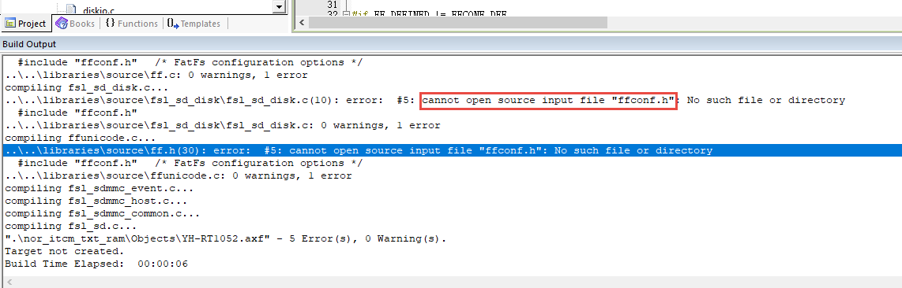

图 28‑12首次编译错误输出

    打开“SD卡—FatFs文件系统读写\SD卡—FatFs文件系统\libraries\fatfs”在fatfs文件夹内并没有ffconf.h文件，但是有一个ffconf_template.h文件。从文件名不难得出这是FatFs配置文件样板，本实验不用这个配置文件，我们直接复制NXP官方配置好文件。在“SDK_2.5.0_MIMXRT1052xxxxB\boards\evkbimxrt1050\fatfs_examples\fatfs_sdcard”目录下是基于NXP官方评估板的例程，由于我们开发板SD卡接口不同，我们不使用NXP官方评估板例程，但是FatFs文件系统配置文件ffconf.h文件是通用的，我们直接复制ffconf.h文件到我们的工程即可，最终结果如图
    28‑13所示。

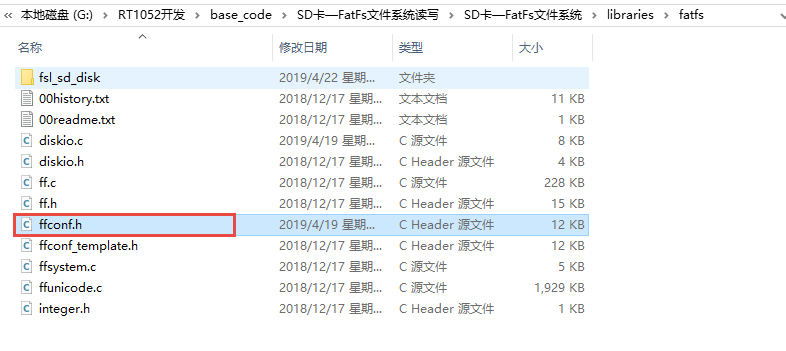

图 28‑13添加ffconf.h文件

1) 再次编译工程，还会提示错误，如图 28‑14所示。

..

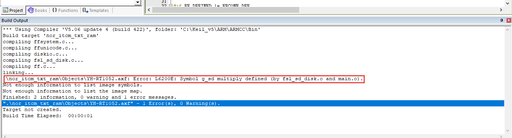

图 28‑14第二次编译错误提示

    错误的原因是在main.c文件和fsl_sd_disk.c文件定义了同名变量g_sd。我们修改任意一个文件中的变量名或者在在其中一个文件变量定义改为extern引用。

    至此，再次编译正常情况下没有错误。下一步需要为FatFs文件系统添加底层驱动函数以及修改ffconfig.h配置文件。

FatFs底层设备驱动函数
^^^^^^^^^^^^^^^^^^^^^

FatFs文件系统与底层介质的驱动分离开来，对底层介质的操作都要交给用户去实现，它仅仅是提供了一个函数接口而已。表
28‑1为FatFs移植时用户必须支持的函数。通过表
28‑1我们可以清晰知道很多函数是在一定条件下才需要添加的，只有前三个函数是必须添加的。我们完全可以根据实际需求选择实现用到的函数。

前三个函数是实现读文件最基本需求。接下来三个函数是实现创建文件、修改文件需要的。为实现格式化功能，需要在disk_ioctl添加两个获取物理设备信息选项。我们一般只有实现前面六个函数就可以了，已经足够满足大部分功能。

为支持简体中文长文件名称需要添加ff_convert和ff_wtoupper函数，实际这两个已经在cc936.c文件中实现了，我们只要直接把cc936.c文件添加到工程中就可以了。

后面六个函数一般都不用。如真有需要可以参考syscall.c文件(src\option文件夹内)。

表 28‑1 FatFs移植需要用户支持函数

+--------------------+----------------------+-----------------------------------------+
|      **函数**      |  **条件(ffconf.h)**  |                **备注**                 |
+====================+======================+=========================================+
| disk_status        | 总是需要             | 底层设备驱动函数                        |
| disk_initialize    |                      |                                         |
| disk_read          |                      |                                         |
+--------------------+----------------------+-----------------------------------------+
| disk_write         | FF_FS_READONLY == 0  |                                         |
| get_fattime        |                      |                                         |
| disk_ioctl         |                      |                                         |
| (CTRL_SYNC)        |                      |                                         |
+--------------------+----------------------+-----------------------------------------+
| disk_ioctl         | FF_USE_MKFS == 1     |                                         |
| (GET_SECTOR_COUNT) |                      |                                         |
| disk_ioctl         |                      |                                         |
| (GET_BLOCK_SIZE)   |                      |                                         |
+--------------------+----------------------+-----------------------------------------+
| disk_ioctl         | FF_MAX_SS !=         |                                         |
| (GET_SECTOR_SIZE)  | FF_MIN_SS            |                                         |
+--------------------+----------------------+-----------------------------------------+
| disk_ioctl         | FF_USE_TRIM == 1     |                                         |
| (CTRL_TRIM)        |                      |                                         |
+--------------------+----------------------+-----------------------------------------+
| ff_convert         | FF_USE_LFN != 0      | Unicode支持，为支持简体中文，添加       |
| ff_wtoupper        |                      | cc936.c到工程即可                       |
+--------------------+----------------------+-----------------------------------------+
| ff_cre_syncobj     | FF_FS_REENTRANT == 1 | FatFs可重入配置，需要多任务系统支持     |
| ff_del_syncobj     |                      | (一般不需要)                            |
| ff_req_grant       |                      |                                         |
| ff_rel_grant       |                      |                                         |
+--------------------+----------------------+-----------------------------------------+
| ff_mem_alloc       | FF_USE_LFN == 3      | 长文件名支持，缓冲区设置在堆空间(一般设 |
| ff_mem_free        |                      | 置_USE_LFN                              |
|                    |                      | = 2 )                                   |
+--------------------+----------------------+-----------------------------------------+

底层设备驱动函数是存放在diskio.c文件，我们的目的就是把diskio.c中的函数接口与SD卡驱动连接起来。总共有五个函数，分别为设备状态获取(disk_status)、设备初始化(disk_initialize)、扇区读取(disk_read)、扇区写入(disk_write)、其他控制(disk_ioctl)。

接下来，我们对每个函数结合SD卡驱动做详细讲解。

宏定义
      
.. code-block:: c
   :name: 代码清单 28‑1 物理编号宏定义(diskio.h)
   :caption: 代码清单 28‑1 物理编号宏定义(diskio.h)
   :linenos:

   /* 为每个设备定义一个物理编号*/
   #define RAMDISK         0       /* 预留给外扩RAM使用 */
   #define USBDISK         1       /* 预留给USB使用  */
   #define SDDISK          2       /* SD卡设备物理编号  */
   #define MMCDISK         3       /* 预留给MMC卡使用mmc  */
   #define SDSPIDISK       4       /* 预留给SPI接口SD卡使用 */
   #define NANDDISK       5        /*  预留给nand flash使用 */

这两个宏定义在FatFs中非常重要，FatFs是支持多物理设备的，必须为每个物理设备定义一个不同的编号。

本实验只用到了SD卡物理接口编号SDDISK，其他设备编号可以屏蔽掉，使用时再加上。

设备状态获取
            
.. code-block:: c
   :name: 代码清单 28‑2设备状态获取(diskio. c)
   :caption: 代码清单 28‑2设备状态获取(diskio. c)
   :linenos:

   /*----------------------华丽的分割线-----------------------------*/
   DSTATUS disk_status (
      BYTE pdrv /* 物理设备编号 */
   )
   {
      /*********************第一部分***************************/
      DSTATUS stat;
      switch (pdrv)
      {
   #ifdef RAM_DISK_ENABLE
            case RAMDISK:
               stat = ram_disk_status(pdrv);
               return stat;
   #endif
   #ifdef USB_DISK_ENABLE
            case USBDISK:
               stat = USB_HostMsdGetDiskStatus(pdrv);
               return stat;
   #endif
   
   /***************************第二部分*************************/
   #ifdef SD_DISK_ENABLE   
            case SDDISK:
               stat = sd_disk_status(pdrv);
               return stat;
   #endif
   /******************此处省略其他条件编译语句********************/
            default:
               break;
      }
      return STA_NOINIT;
   }

disk_status函数只有一个参数pdrv，表示物理编号。一般我们都是使用switch函数配合条件编译语句实现对pdrv的分支判断。对于没有定义的物理设备，对应的程序不会被编译。本实验使用的是SD卡,所以首先要定义宏SD_DISK_ENABLE。如果读取的是SD卡状态如第二部分代码所示，我们直接调用在sd_disk_status获取设备状态。mmc_disk_status是定义在fsl_sd_disk.c文件中，函数原型如代码清单28‑3所示。

.. code-block:: c
   :name: 代码清单 28‑3sd_disk_status c函数(fsl_sd_disk.)
   :caption: 代码清单 28‑3sd_disk_status c函数(fsl_sd_disk.)
   :linenos:

   DSTATUS sd_disk_status(uint8_t physicalDrive)
   {
      if (physicalDrive != SDDISK)
      {
            return STA_NOINIT;
      }
   
      return 0;
   }

很明显，该函数是一个空函数。进入函数后使用if语句判断操作的是否为SD卡，如果不是，返回错误标志，如果是，返回0。我们暂时用不到这个函数，所以不必修改。

设备初始化
          

我我们在第27章
uSDHC—SD卡读写测试已经完成了SD卡初始化相关代码，这里只需要调用相应的初始化代码即可。

.. code-block:: c
   :name: 代码清单 28‑4 设备初始化(diskio.c)
   :caption: 代码清单 28‑4 设备初始化(diskio.c)
   :linenos:

   DSTATUS disk_initialize (
      BYTE pdrv/*  物理设备编号 */
   )
   {
      /**********************第一部分*************************/
      DSTATUS stat;
      switch (pdrv)
      {
   #ifdef RAM_DISK_ENABLE
            case RAMDISK:
               stat = ram_disk_initialize(pdrv);
               return stat;
   #endif
   #ifdef USB_DISK_ENABLE
            case USBDISK:
               stat = USB_HostMsdInitializeDisk(pdrv);
               return stat;
   #endif
               
   /***********************第二部分*************************/
   #ifdef SD_DISK_ENABLE
            case SDDISK:
               stat = sd_disk_initialize(pdrv);
               return stat;
   #endif
   /******************此处省略其他条件编译语句********************/
            default:
               break;
      }
      return STA_NOINIT;
   }

disk_initialize函数也是有一个参数pdrv，用来指定设备物理编号。对于SD卡我们调用sd_disk_initialize函数实现对SD卡使用的GPIO初始化、USDHC初始化、SD卡初始化。sd_disk_initialize函数如代码清单28‑5所示。

.. code-block:: c
   :name: 代码清单 28‑5SD卡初始化函数sd_disk_initialize (fsl_sd_disk.c)
   :caption: 代码清单 28‑5SD卡初始化函数sd_disk_initialize (fsl_sd_disk.c)
   :linenos:

   DSTATUS sd_disk_initialize(uint8_t physicalDrive)
   {
   /***********************第一部分*************************/
      if (physicalDrive != SDDISK)
      {
         return STA_NOINIT;
      }
      
      /********************第二部分************************/
      /*初始化SD卡使用的GPIO*/
      USDHC1_gpio_init();
      /*初始化USDHC*/
      USDHC_Host_Init(&g_sd);
      /*初始化SD卡*/
      SD_Card_Init(&g_sd);
      
      return 0;
   }

代码第一部分，判断操作的是否为SD卡，如果不是，返回错误信息。如果是，则调用第27章
uSDHC—SD卡读写测试编写的SD卡初始化相关函数初始化SD卡即可。

读取扇区
        

.. code-block:: c
   :name: 代码清单 28‑6 扇区读取(diskkio.c)
   :caption: 代码清单 28‑6 扇区读取(diskkio.c)
   :linenos:

   DRESULT disk_read (
      BYTE pdrv,    /* 设备物理编号 */
      BYTE *buff,   /* 数据缓存区 */
      DWORD sector, /*起始数据块编号 */
      UINT count    /*读取数据块数量*/
   )
   {
      DRESULT res;
      switch (pdrv)
      {
   
   /******************此处省略其他条件编译语句********************/ 
   #ifdef SD_DISK_ENABLE
            case SDDISK:
               res = sd_disk_read(pdrv, buff, sector, count);
               return res;
   #endif
   /******************此处省略其他条件编译语句********************/            
               
            default:
               break;
      }
   
      return RES_PARERR;
   }

disk_read函数有四个形参。pdrv为设备物理编号。buff是一个BYTE类型指针变量，buff指向用来存放读取到数据的存储区首地址。sector是一个DWORD类型变量，指定要读取数据的起始数据块编号。count是一个UINT类型变量，指定读取数据块的数量。

sd_disk_read函数原型如代码清单 28‑7所示。

.. code-block:: c
   :name: 代码清单 28‑7sd_disk_read函数(fsl_sd_disk.h)
   :caption: 代码清单 28‑7sd_disk_read函数(fsl_sd_disk.h)
   :linenos:

   DRESULT sd_disk_read(uint8_t physicalDrive,
                        uint8_t *buffer, 
                        uint32_t sector,
                        uint8_t count)
   {
      /**************************第一部分**************************/
      if (physicalDrive != SDDISK)
      {
            return RES_PARERR;
      }
      /***************************第二部分*************************/
      if (kStatus_Success != SD_ReadBlocks(&g_sd, buffer, sector, count))
      {
            return RES_ERROR;
      }
   
      return RES_OK;
   } 

同其它sd_disk_XXX函数类似，首先判断操作的是SD卡。第二部分，直接调用fsl_sd.c文件中的SD_ReadBlocks函数，该函数执行最终的SD卡读操作。

扇区写入
        
.. code-block:: c
   :name: 代码清单 45‑0-7 DMA传输完成中断与帧中断(stm32h7xx_it.c和bsp_ov2640.c文件)
   :caption: 代码清单 45‑0-7 DMA传输完成中断与帧中断(stm32h7xx_it.c和bsp_ov2640.c文件)
   :linenos:

   DRESULT disk_write (
      BYTE pdrv,    /* 设备物理编号 */
      const BYTE *buff, /* 数据缓存区 */
      DWORD sector,   /* 起始数据块编号 */
      UINT count          /* 读取数据块数量*/
   )
   {
      DRESULT res;
      switch (pdrv)
      {
   /******************此处省略其他条件编译语句********************/   
   #ifdef SD_DISK_ENABLE
            case SDDISK:
               res = sd_disk_write(pdrv, buff, sector, count);
               return res;
   #endif
   /******************此处省略其他条件编译语句********************/   
            default:
               break;
      }
      return RES_PARERR;
   }

disk_write函数有四个形参。pdrv为设备物理编号。buff是一个BYTE类型指针变量，buff指向用来存放读要写入数据的首地址。sector是一个DWORD类型变量，指定要写入数据的起始块编号。count是一个UINT类型变量，指定写入数据块的数量。如果操作的是SD卡，调用sd_disk_write函数完成SD卡写入操作，函数原型如代码清单
28‑9所示。

.. code-block:: c
   :name: 代码清单 28‑9sd_disk_write函数(fsl_sd_disk.c)
   :caption: 代码清单 28‑9sd_disk_write函数(fsl_sd_disk.c)
   :linenos:

   DRESULT sd_disk_write(uint8_t physicalDrive, 
                        const uint8_t *buffer, 
                        uint32_t sector, 
                        uint8_t count)
   {
      /**************************第一部分**************************/
      if (physicalDrive != SDDISK)
      {
            return RES_PARERR;
      }
      /***************************第二部分*************************/
      if (kStatus_Success != SD_WriteBlocks(&g_sd, buffer, sector, count))
      {
            return RES_ERROR;
      }
   
      return RES_OK;
   }

同其它sd_disk_XXX函数类似，首先判断操作的是SD卡。第二部分，直接调用fsl_sd.c文件中的SD_WriteBlocks函数，该函数执行最终的SD卡写操作。

其他控制
        
.. code-block:: c
   :name: 代码清单 28‑10 其他控制(diskio.c)
   :caption: 代码清单 28‑10 其他控制(diskio.c)
   :linenos:

   DRESULT disk_ioctl (
      BYTE pdrv,    /* 物理编号 */
      BYTE cmd,   /* 控制指令 */
      void *buff    /* 写入或者读取数据地址指针 */
   )
   {
      DRESULT res;
      switch (pdrv)
      {
   
   /******************此处省略其他条件编译语句********************/             
   #ifdef SD_DISK_ENABLE
            case SDDISK:
               res = sd_disk_ioctl(pdrv, cmd, buff);
               return res;
   #endif
   /******************此处省略其他条件编译语句********************/ 
            default:
               break;
      }
      return RES_PARERR;
   }

disk_ioctl函数有三个形参，pdrv为设备物理编号，cmd为控制指令，包括获取SD卡块数量命令(GET_SECTOR_COUNT)、获取SD卡块大小命令(GET_SECTOR_SIZE)、获取可擦除扇区块大小命(GET_BLOCK_SIZE)以及结束写入命令(CTRL_SYNC)。buff为指令对应的数据指针。

如果设置的是SD卡，则会调用sd_disk_ioctl函数，函数原型如代码清单
28‑11所示。

.. code-block:: c
   :name: 代码清单 28‑11sd_disk_ioctl函数(fsl_sd_disk.c)
   :caption: 代码清单 28‑11sd_disk_ioctl函数(fsl_sd_disk.c)
   :linenos:

   /****************************第一部分*************************/
   sd_card_t g_sd;
   DRESULT sd_disk_ioctl(uint8_t physicalDrive,uint8_t command,void *buffer)
   {
      DRESULT result = RES_OK;
   
      if (physicalDrive != SDDISK)
      {
            return RES_PARERR;
      }
   
      /****************************第二部分***********************/
      switch (command)
      {
            case GET_SECTOR_COUNT:
               if (buffer)
               {
                  *(uint32_t *)buffer = g_sd.blockCount;
               }
               else
               {
                  result = RES_PARERR;
               }
               break;
            /***********************第三部分************************/
            case GET_SECTOR_SIZE:
               if (buffer)
               {
                  *(uint32_t *)buffer = g_sd.blockSize;
               }
               else
               {
                  result = RES_PARERR;
               }
               break;
            /***********************第四部分************************/
            case GET_BLOCK_SIZE:
               if (buffer)
               {
                  *(uint32_t *)buffer = g_sd.csd.eraseSectorSize;
               }
               else
               {
                  result = RES_PARERR;
               }
               break;
            /***********************第五部分************************/
            case CTRL_SYNC:
               result = RES_OK;
               break;
            default:
               result = RES_PARERR;
               break;
      }
   
      return result;
   }

下面简要讲解各部分代码。

-  第一部分，定义SD卡描述结构体。在27.10 SD卡结构体章节已经详细介绍，这里不再赘述。我们需要知道的是初始化后SD卡描述结构体保存有SD卡的几乎所有信息，包括卡容量、数据块大小等信息。

-  第二部分，使用switch case 语句判断命令类型，不同命令执行不同的操作。如果是获取SD卡块数量命令GET_SECTOR_COUNT，则将SD卡描述结构体g_sd中的SD卡数据块数量保存到buffer变量中。

-  第三部分和第四部分，与第二部分类似，根据命令类型获取卡信息，这里不再赘述。

-  第五部分，如果收到的是完成写入命令则设置函数返回值为RES_OK，即表示命令执行成功，如果没有找到对应的命令则返回RES_PARERR，即参数错误。

FatFs功能配置
^^^^^^^^^^^^^

ffconf.h文件是FatFs功能配置文件，我们可以对文件内容进行修改，使得FatFs更符合我们的要求。ffconf.h对每个配置选项都做了详细的使用情况说明。下面只列出相对于源码修改的配置，其他配置采用默认即可。

.. code-block:: c
   :name: 代码清单 28‑12 FatFs功能配置选项(ffconf.h)
   :caption: 代码清单 28‑12 FatFs功能配置选项(ffconf.h)
   :linenos:

   #define _USE_MKFS   1
   #define _CODE_PAGE  936
   #define _USE_LFN    2
   #define _VOLUMES    2
   #define _MIN_SS     512
   #define _MAX_SS     4096

1) FF_USE_STRFUNC：如果要使用f_gets()、f_putc()、f_puts()和f_printf()函数，要讲该宏定义设置为1。

2) FF_USE_MKFS：格式化功能选择，为使用FatFs格式化功能，需要把它设置为1。

3) FF_FS_RPATH：选择相对路径的支持。

-  设置为0，禁用相对路径，并删除相关函数。

-  设置为1，可以使用相对路径，函数f_chdir()和函数f_chdrive()可用。

-  设置为2，可以使用相对路径，在设置为1的基础上增加了f_getcwd()函数。

1) FF_VOLUMES：指定物理设备数量，这里设置为1，因为本工程只使用了SD卡。

2) FF_FS_NORTC：切换时间戳函数，如果系统没有或者不需要RTC实时时钟功能或者不需要有效的时间戳，将FF_FS_NORTC
   = 1设置为禁用时间戳函数。

3) FF_CODE_PAGE：语言功能选择，并要求把相关语言文件(ffunicode.c)添加到工程。为支持简体中文文件名需要使用“936”。

FatFs功能测试及使用实验
~~~~~~~~~~~~~~~~~~~~~~~

本实验我们将实现FatFs的格式化、读文件和写文件功能、设备存储空间信息获取、读写文件指针定位、创建目录、文件移动和重命名、文件或目录信息获取等等功能，以后有用到相关内容，参考使用非常方便。

硬件设计
^^^^^^^^

本实验主要使用FatFs软件功能，不需要其他硬件模块，使用与SD卡读写测试实验相同硬件配置即可。

软件设计
^^^^^^^^

在28.3 FatFs文件系统移植章节我们介绍了FatFs文件系统移植步骤，完成了diskio.c文件内SD卡底层驱动程序的编写以及ffconf.h文件的修改。本小节将会调用FatFs文件系统提供的API操作SD卡。

挂载FATFS文件系统测试
                     

使用文件系统之前，要挂载文件系统。在挂载过程中会调用diskio.c文件中的底层驱动文件完成SD卡的初始化等操作，挂载成功之后就可以调用FatFs文件系统中的API函数了。挂载测试函数如代码清单
28‑13所示。

.. code-block:: c
   :name: 代码清单 28‑13FatFs挂载文件系统测试(bsp_sd_fatfs_test.c)
   :caption: 代码清单 28‑13FatFs挂载文件系统测试(bsp_sd_fatfs_test.c)
   :linenos:

   FRESULT f_mount_test(FATFS* fileSystem)
   {
      /***************************第一部分*************************/
      FRESULT error = FR_OK;
      char ch = '0';
      BYTE work[FF_MAX_SS];
      const TCHAR driverNumberBuffer[3U] = {SDDISK + '0', ':', '/'};
      FATFS* g_fileSystem = fileSystem;
      /************************第二部分**************************/
      error = f_mount(g_fileSystem, driverNumberBuffer, 1U);
      
      /*************************第三部分*************************/
      if (error)
      {
      /*错误类型判断*/
      if(error == FR_NO_FILESYSTEM)//还没有文件系统
      {
         PRINTF("SD卡还没有文件系统，创建文件系统将会格式化您的SD卡。   \
                  \r\n 确定是否继续？\r\n");
         PRINTF("输入‘y’确定格式化，输入‘n’取消\r\n");
               
         /********************第四部分***************************/
         while(true)
         {
            ch = GETCHAR();
            PUTCHAR(ch);
            if(ch =='y'|| ch == 'Y')
            {
            /*为SD卡创建文件系统*/
   #if FF_USE_MKFS
            PRINTF("\r\n制作文件系统...... SD卡容量越大，                \
                                 该过程持续时间越长。\r\n");
                                 
         /********************第五部分*****************************/
            if (f_mkfs(driverNumberBuffer, FM_ANY, 0U, work, sizeof work))
            {
               PRINTF("z制作文件系统失败.\r\n");
               while(1);
            }
            else
            {
               PRINTF("制作文件系统成功.\r\n");
               error = f_mount(g_fileSystem, driverNumberBuffer, 0U);
               if(error)
               {
                  PRINTF("挂载文件系统失败\r\n");
                  while(1);
               }
               else
               {
               break;
               }
               
            }
   #endif /* FF_USE_MKFS */
         }
         else if(ch =='n'|| ch == 'N')
         {
            /*程序停止*/
            while(1);
         }
         
         PRINTF("输入‘y’确定格式化，输入‘n’取消\r\n");
         }  
      }
      else//其他错误，暂时不处理，直接退出函数
      {
         PRINTF("挂载文件系统失败\r\n");
         while(1);
      }
   }
   else 
   {
      PRINTF("挂载文件系统成功\r\n");
   }
   /**************************第六部分**************************/
   /*判断是否允许使用相对路径*/
   #if (FF_FS_RPATH >= 2U)
   error = f_chdrive((char const *)&driverNumberBuffer[0U]);
   if (error)
   {
      PRINTF("Change drive failed.\r\n");
      while(1);
   }
   else
   {
      PRINTF("Change drive success.\r\n");
   }
   #endif
   return error; 
   }

函数f_mount用于挂载文件系统，挂载之后一般需要根据返回值判断挂载是否成功，。下面简要讲解各部分代码。

-  第一部分，定义初始化要使用的一些变量。各个变量讲解如下：

1) work，这是一个长度为512的数组，如果SD卡还没有文件系统，创建文件系统时会使用到该变量。

2) FRESULT，FatFs相关函数返回值错误类型。这是一个枚举类型，如代码清单
   28‑14所示。

.. code-block:: c
   :name: 代码清单 28‑14函数返回值类型(ff.h)
   :caption: 代码清单 28‑14函数返回值类型(ff.h)
   :linenos:

   typedef enum {
      FR_OK = 0,      /* (0) 成功*/
      FR_DISK_ERR,    /* (1) 硬件错误，错误发生功能在底层驱动代码*/
      FR_INT_ERR,     /* (2) 断言失败 */
      FR_NOT_READY,   /* (3) 物理设备不工作 */
      FR_NO_FILE,     /* (4) 找不到文件 */
      FR_NO_PATH,     /* (5) 找不到文件 */
      FR_INVALID_NAME,/* (6) 路径名格式无效 */
      FR_DENIED,      /* (7) 由于禁止访问或目录已满导致访问失败 */
      FR_EXIST,       /* (8) 由于禁止访问导致访问失败 */
      FR_INVALID_OBJECT,  /* (9) 文件/目录对象无效 */
      FR_WRITE_PROTECTED, /* (10) 物理驱动器受写保护 */
      FR_INVALID_DRIVE,   /* (11) 逻辑驱动器号无效 */
      FR_NOT_ENABLED,     /* (12) 该卷没有工作区 */
      FR_NO_FILESYSTEM,   /* (13) 没有找到FatFs文件系统*/
      FR_MKFS_ABORTED,    /* (14) 执行 f_mkfs()函数过程中由于某些原因异常终止 */
      FR_TIMEOUT,         /* (15) 等待超时错误 */
      FR_LOCKED,          /* (16) 访问了受保护的文件或目录 */
      FR_NOT_ENOUGH_CORE, /* (17) 无法分配LFN工作缓冲区 */
      FR_TOO_MANY_OPEN_FILES,/* (18) 打开文件数量大于 > FF_FS_LOCK宏定义的值 */
      FR_INVALID_PARAMETER  /* (19) 给定参数无效 */
   } FRESULT;

不同的函数能够输出的错误类型不同，我们通过判断函数的返回值得知程序运行的结果。具体每个返回值的含义请参考程序注释或官方FatFs官方帮助文档，这里不再赘述。

1) driverNumberBuffer，这是一个长度为3字符数组，用于保存要操作的逻辑驱动号。

2) g_fileSystem，文件系统对象结构体，在程序中一般会定义一个全局的文件系统对象结构体用于保存文件系统相关信息。这里定义一个文件系统对象结构体指针用于保存函数参数传来的文件系统对象结构体的地址。

-  第二部分，调用f_mount函数挂载文件系统，函数声明如代码清单 28‑15所示。

.. code-block:: c
   :name: 代码清单 28‑15f_mount函数(ff.h)
   :caption: 代码清单 28‑15f_mount函数(ff.h)
   :linenos:

   FRESULT f_mount (
      FATFS* fs,  /* 指向文件系统对象结构体指针 (NULL:unmount)*/
      const TCHAR* path,/* 要挂载/卸载的逻辑驱动器号 */
      BYTE opt  /* 选择操作 0:取消挂载 (delayed mount),1:立即挂载 */
   )

函数参数介绍如下：

1) fs，指向文件系统对象的结构体指针，一个逻辑驱动器对应一个文件系统对象结构体，用于保存文件系统相关信息，如果设置位NULL,则表示要取消挂载挂载一个逻辑驱动器。

2) path，字符类型指针。用于指定逻辑驱动器号，在第一部分我么用长度为3的数组driverNumberBuffer[]保存了本次要挂载的逻辑驱动器号。

3) opt，选择挂载时机。设置为0，此时不执行挂载，当第一次读、写访问时挂载文件系统。设置为1，立即挂载文件系统。

如果挂载成功，通过串口输出“挂载文件系统失败”提示信息，然后执行到第六部分代码。

-  第三部分，判断错误类型。在第一部分定义了FRESULT类型的error变量，用于保存函数返回值，通过error的值判断函数执行情况。本程序只处理没有文件系统导致的错误。其他错误暂时不做处理。

-  第四部分，如果f_mount函数执行不成功，并且错误原因是SD卡还没有文件系统，这时首先要为设备创建一个文件系统。

为设备创建文件系统会格式化物理设备，所以创建之前要保证确认SD卡可以被格式化。程序在while(true)循环中使用GETCHAR函数获取串口上位机输入的选择，如果选择确定格式化则执行第五部分代码。

-  第五部分，使用函数f_mkfs为物理设备创建文件系统，f_mkfs函数定义如代码清单
   28‑16所示。

.. code-block:: c
   :name: 代码清单 28‑16f_mkfs函数(ff.h)
   :caption: 代码清单 28‑16f_mkfs函数(ff.h)
   :linenos:

   FRESULT f_mkfs (
      const TCHAR* path,  /* 逻辑驱动编号*/
      BYTE opt,/*格式化选项 */
      DWORD au,/* 分配单元的带下，单位（字节）*/
            /* 指向用于格式化进程的工作缓冲区的指针。当给定一个空指针时，
               函数为工作缓冲区分配一块堆空间，此时设置len没有作用 */
      void* work,
      UINT len/* 工作缓冲区的大小(以字节为单位)*/
   )

函数各个参数介绍如下:

1) path，指定逻辑驱动器编号。在第一部分定义长度为3的数组driverNumberBuffer，该数组保存有SD卡的驱动编号。

2) opt，格式化选项，该参数指定在存储器上创建的FAT类型。对于SD卡来说，我们一般选择FM_ANY。

3) au，指定分配单元大小，分配单元大小（单位：字节）。有效值是扇区（SD卡块大小）的au倍。设置为0表示分配单元大小取决于卷大小。

4) work，指向用于格式化进程的工作缓冲区的指针。当给定一个空指针时函数为工作缓冲区分配一块堆空间，此时设置len没有作用。在第一部分定义了work字符数组，在这里用作工作缓冲区。

5) len，工作缓冲区空间大小（单位：字节）。如果参数work设置位NULL则设置该参数无效。

f_mkfs函数执行完成之后根据返回值判断文件系统创建是否成功，如果创建成功则再次调用f_mount函数挂载文件系统。否则输出错误提示，进入死循环程序。

-  第六部分，设置当前驱动器编号。FF_FS_RPATH大于等于2则可以使用f_chdrive函数设置当前驱动器编号。使用该函数可以将驱动器名，驱动器编号保存在静态变量中，因此如果修改了驱动器编号会影响到使用文件函数的其他任务。

创建和打开文件测试
                  

文件的创建和打开使用相同的函数，只是函数配置参数不同。我们以文件创建测试为例讲解，文件打开测试函数类似。

.. code-block:: c
   :name: 代码清单 28‑17文件创建测试f_touch_test函数(bsp_sd_fatfs_test.c)
   :caption: 代码清单 28‑17文件创建测试f_touch_test函数(bsp_sd_fatfs_test.c)
   :linenos:

   FRESULT f_touch_test(char* dir)
   {
      /*********************第一部分***************************/
      FRESULT error = FR_OK;
      FIL g_fileObject ;   /* File object */
      PRINTF("\r\n创建“%s”文件......\r\n",dir);
      
      /*********************第二部分**************************/
      error = f_open(&g_fileObject, _T(dir), FA_CREATE_NEW);
      
      /**********************第三部分**************************/
      if (error)
      {
      if (error == FR_EXIST)
      {
         PRINTF("文件已经存在.\r\n");
      }
      else
      {
         PRINTF("创建文件失败\r\n");
         return error;
      }
      
      }
      else
      {
      PRINTF("创建文件成功 \r\n");
      }
      return error; 
   }

代码主要内容是调用f_open函数创建文件。函数执行结束后需要根据返回值判断文件创建结果。下面简要讲解个各部分代码。

-  第一部分，定义了两个变量，变量error用于保存程序执行结果。g_fileObject是文件描述结构体，使用f_open函数创建文件是需要传入一个FIL类型的文件描述结构体，用于保存创建的文件信息。

-  第二部分，调用f_open函数创建文件。函数定义如代码清单 28‑18所示。

.. code-block::
   :name: 代码清单 28‑18f_open函数声明(ff,h)
   :caption: 代码清单 28‑18f_open函数声明(ff,h)
   :linenos:

   FRESULT f_open (
      FIL* fp,           /* [OUT] 指向文件描述结构体 */
      const TCHAR* path, /* [IN] 文件名(路径) */
      BYTE mode          /* [IN] 打开模式 */
   );

函数各个参数讲解如下：

1) fp，文件描述结构体指针，打开的文件信息。每一个打开的文件都会有一个文件描述结构体，对文件的读、写、关闭操作都是通过文件描述结构体完成的。

2) path，文件路径。

3) mode，打开模式。文件打开防止有多重选择，不同选择之间又可以相互组合，选择方式多样，各种模式以及常用组合如表格28‑1所示。

表格 28‑1文件打开方式

+------------------+--------------------------------------------------------------------+
|     **模式**     |                              **含义**                              |
+==================+====================================================================+
| FA_READ          | 以只读方式打开。数据可以从文件中读取。                             |
+------------------+--------------------------------------------------------------------+
| FA_WRITE         | 指定对对象的写访问。数据可以写入文件。                             |
+------------------+--------------------------------------------------------------------+
| FA_OPEN_EXISTING | 打开该文件。如果文件不存在，该函数将失败。(默认)                   |
+------------------+--------------------------------------------------------------------+
| FA_CREATE_NEW    | 创建一个新文件。如果文件存在，则该函数将返回FR_EXIST，表示         |
|                  | 文件已存在                                                         |
+------------------+--------------------------------------------------------------------+
| FA_CREATE_ALWAYS | 创建一个新文件。如果文件存在，它将被截断并覆盖。                   |
+------------------+--------------------------------------------------------------------+
| FA_OPEN_ALWAYS   | 打开文件，如果文件存在，则打开该文件。如果没有，将创建一个新文件。 |
+------------------+--------------------------------------------------------------------+
| FA_OPEN_APPEND   | 与FA_OPEN_ALWAYS相同，文件打开后只是读/写指针默认在                |
|                  | 文件的末尾                                                         |
+------------------+--------------------------------------------------------------------+

不同打开模式可以通过“或”的方式组合，常用的几种组合如表格 28‑2所示

表格 28‑2文件打开方式常用组合

+-------------------+--------------------+--------------------------------------------------------------------+--------------------------------------------------------------------+
|       模式        |        含义        |                                                                    |                                                                    |
+===================+====================+====================================================================+====================================================================+
| FA_READ           | 以只读方式打开     |                                                                    |                                                                    |
+-------------------+--------------------+--------------------------------------------------------------------+--------------------------------------------------------------------+
| FA_READ \         | FA_WRITE           | 以读写方式打开                                                     |                                                                    |
+-------------------+--------------------+--------------------------------------------------------------------+--------------------------------------------------------------------+
| FA_CREATE_ALWAYS\ | FA_WRITE           | 新建文件并以只写方式打开，如果文件存在则将原文件截断并覆盖         |                                                                    |
+-------------------+--------------------+--------------------------------------------------------------------+--------------------------------------------------------------------+
| FA_CREATE_ALWAYS\ | FA_WRITE \         |                                                                    | 新建文件并以读、写方式打开，如果文件存在则将原文件截断并覆盖       |
| FA_READ           |                    |                                                                    |                                                                    |
+-------------------+--------------------+--------------------------------------------------------------------+--------------------------------------------------------------------+
| FA_OPEN_APPEND\   | FA_WRITE           | 以只写方式打开文件，如果文件不存在，创建文件。如果文件存在，在文件 |                                                                    |
|                   | 末尾添加内容。     |                                                                    |                                                                    |
+-------------------+--------------------+--------------------------------------------------------------------+--------------------------------------------------------------------+
| FA_OPEN_APPEND\   | FA_WRITE \         |                                                                    | 以读、写方式打开文件，如果文件不存在，创建文件。如果文件存在，在文 |
| FA_READ           | 件末尾添加内容。   |                                                                    |                                                                    |
+-------------------+--------------------+--------------------------------------------------------------------+--------------------------------------------------------------------+
| FA_CREATE_NEW\    | FA_WRITE           | 以只读方式创建一个文件，如果文件存在，则该函数将返回FR_EXIS        |                                                                    |
|                   | T，表示文件已存在  |                                                                    |                                                                    |
+-------------------+--------------------+--------------------------------------------------------------------+--------------------------------------------------------------------+
| FA_CREATE_NEW \   | FA_WRITE \         |                                                                    | 以读、写方式创建一个文件，如果文件存在，则该函数将返回FR_EXI       |
| FA_READ           | ST，表示文件已存在 |                                                                    |                                                                    |
+-------------------+--------------------+--------------------------------------------------------------------+--------------------------------------------------------------------+

一般情况下，我们选择以上组合方式即可满足对文件的读写需求。

-  第三部分，本测试函数文件打开方式选择的是FA_CREATE_NEW，只是创建一个文件，如果文件存在则返回FR_EXIST，通过判断返回值可以得到创建文件错误、创建文件成功、文件已存在三种情况。

创建目录测试
            
.. code-block:: c
   :name: 代码清单 28‑19创建目录测试(bsp_sd_fatfs_test.c)
   :caption: 代码清单 28‑19创建目录测试(bsp_sd_fatfs_test.c)
   :linenos:

   FRESULT f_mkdir_test(char* dir)
   {
      /***********************第一部分****************/
      FRESULT error;
      PRINTF("\r\n创建目录 “%s”......\r\n",dir);
      
      /**********************第二部分*****************/
      error = f_mkdir(_T(dir));
      
      /**********************第三部分******************/
      if (error)
      {
      if (error == FR_EXIST)
      {
         PRINTF("目录已经存在\r\n");
      }
      else
      {
         PRINTF("创建目录失败.\r\n");
         return error;
      }
      }
      else
      {
      PRINTF("创建目录成功\r\n");
      }
      return error;
   }

与创建文件类似。首先调用FatFs提供的函数f_mkdir创建目录，然后根据返回值判断创建结果。这部分代码比较简单，这里不再赘述。

读取目录测试
            

获取一个文件夹下的文件和目录需要两步。第一，使用f_opendir函数打开路径。第二步，调用f_readdir函数读取目录下的文件或文件夹。如代码清单
28‑20所示。

.. code-block:: c
   :name: 代码清单 28‑20读取目录函数(bsp_sd_fatfs_test.c)
   :caption: 代码清单 28‑20读取目录函数(bsp_sd_fatfs_test.c)
   :linenos:

   FRESULT f_readdir_test(char* dir,DIR* directory,FILINFO* fileInformation)
   {
      
      /*************************第一部分***********************************/
      FRESULT error = FR_OK;
      DIR* g_directory = directory; /* Directory object */
      FILINFO* g_fileInformation = fileInformation;
      
      
      PRINTF("\r\n列出“/dir_1”目录下的内容......\r\n");
      
      /*************************第二部分**********************************/
      error = f_opendir(g_directory, dir);
      if (error)
      {
      PRINTF("打开路径失败\r\n");
      return error;
      }
      
      /*************************第三部分*********************************/
      for (;;)
      {
      error = f_readdir(g_directory, g_fileInformation);
      
      /* 以读取到目录结尾 */
      if ((error != FR_OK) || (g_fileInformation->fname[0U] == 0U))
      {
         break;
      }
      /*读取到的是没有名字的文件*/
      if (g_fileInformation->fname[0] == '.')
      {
         continue;
      }
      /*读取到的是一个文件夹*/
      if (g_fileInformation->fattrib & AM_DIR)
      {
         PRINTF("文件夹 : %s\r\n", g_fileInformation->fname);
      }
      /*读取到的是一个文件*/
      else
      {
         PRINTF("文件 : %s\r\n", g_fileInformation->fname);
      }
      }
      return error;
   }

各部分代码讲解如下：

-  第一部分，变量定义。我们知道，获取一个函数的执行结果通常有三种方法。第一，使用全局变量获取函数的执行结果。第二，使用函数函数返回值得到程序执行结果。第三种，通过指针类型的函数参数获取程序的执行结果。对于文件打开、打开目录目录读取等操作一般使用第三种方式，第三种方式效率跟高，函数返回值只用作判断函数的执行情况。使用指针之前首先要定义这些变量，各个变量讲解如下：

1) error，函数返回错误类型值。这时一个枚举类型，用于记录程序的而执行结果。

2) DIR，目录描述结构体。每一个目录对应一个目录描述结构体，因此创建目录函数需要一个目录描述结构体指针保存创建的目录信息。

3) g_fileInformation，文件信息结构体。使用目录读取函数f_readdir得到的目录信息将会保存在该变量中。

-  第二部分，调用f_opendir函数打开路径，f_opendir函数原型如代码清单 28‑21所示。

.. code-block:: c
   :name: 代码清单 28‑21f_opendir打开目录函数(ff.h)
   :caption: 代码清单 28‑21f_opendir打开目录函数(ff.h)
   :linenos:

   FRESULT f_opendir (
      DIR* dp,      /* 指向要创建的目录对象的指针 */
      const TCHAR* path /* 指向目录路径的指针 */
   )

f_opendir函数共有两个参数，dp用于保存所创建目录对象的信息，打开成功后就可以使用该指针作为参数读取目录内容了。path，指定要打开的目录。

-  第三部分，循环读取目录里的内容，直到读取结束。函数f_readdir用于读取打开的路径，函数如代码清单 28‑22所示。

.. code-block:: c
   :name: 代码清单 28‑22f_readdir函数(ff.h)
   :caption: 代码清单 28‑22f_readdir函数(ff.h)
   :linenos:

   FRESULT f_readdir (
      DIR* dp,       /* 指向打开的路径 */
      FILINFO* fno  /* 指向保存文件信息的结构体指针*/
   )

第二部分代码我们使用f_opendir函数打开了一个路径，f_readdir函数用于依次读取路径里的内容，每次读取都会将读到的信息保存一个FILINFO类型的文件信息结构体中，FILINFO结构体如代码清单 28‑23所示。

.. code-block:: c
   :name: 代码清单 28‑23FILINFO文件信息结构体
   :caption: 代码清单 28‑23FILINFO文件信息结构体
   :linenos:

   typedef struct {
      FSIZE_t fsize;      /* 文件大小 */
      WORD  fdate;      /* 最后一次修改日期 */
      WORD  ftime;      /* 最后一次修改时间 */
      BYTE  fattrib;    /* 文件属性 */
   /*根据宏FF_USE_LFN判断是否配置为支持长文件名*/FF_LFN_BUF
   #if FF_USE_LFN
      TCHAR altname[FF_SFN_BUF + 1];/*替代文件名 */
      TCHAR fname[FF_LFN_BUF + 1];  /* 主文件名 */
   #else
      TCHAR fname[12 + 1];  /* 文件名 */
   #endif
   } FILINFO;

文件信息结构体保存有文件的文件名、文件属性、最后一次修改时间等。下面简要讲解各个参数的含义。

1) fsize，记录文件或文件夹的大小。

2) fdate，最后一次修改的日期。

3) ftime，最后一次修改的时间。

4) fattrib，文件属性。该变量是一个BYTE类型，不同的位代表不同的属性，各个属性如代码清单
   28‑24所示。

.. code-block:: c
   :name: 代码清单 28‑24文件属性列表(ff.h)
   :caption: 代码清单 28‑24文件属性列表(ff.h)
   :linenos:

   #define AM_RDO  0x01  /* 只读 */
   #define AM_HID  0x02  /* 隐藏 */
   #define AM_SYS  0x04  /* 系统文件 */
   #define AM_DIR  0x10  /* 目录 */
   #define AM_ARC  0x20  /* 文件 */

一个文件或目录的属性由这些选项组合得到。

1) FF_USE_LEF，宏定义用于设置是否支持长文件名，默认情况下FatFs文件系统不支持长文件名，如果需要用配置该宏大于等于1。

2) altname，替代文件名。

3) fname，主文件名。

4) fname，如果不使用长文件名，则文件名不能超过12个字节。

调用f_readdir函数读取之后，我们可以根据返回值得到读取是否成功。根据传回的文件信息结构体指针FILINFO得到文件属性信息。我们在程序中判断读到的是文件还是文件夹，然后分别通过串口输出。

文件读写测试
            

.. code-block:: c
   :name: 代码清单 28‑25f_write_read_test文件读写测试(bsp_sd_fatfs_test.c)
   :caption: 代码清单 28‑25f_write_read_test文件读写测试(bsp_sd_fatfs_test.c)
   :linenos:

   FRESULT f_write_read_test(char* dir, void* data_write, void* data_read)
   {
   
   /**********************第一部分************************/
   FIL g_fileObject ;
   void* g_data_write = data_write;
   void* g_data_read = data_read;
   UINT g_bytesWritten;
   UINT g_bytesRead;
   FRESULT error = FR_OK;
   
   /***********************第二部分***********************/
   /*打开文件*/
   f_open_test(dir,&g_fileObject);
   
   
   /************************第三部分**********************/
   /* 向文件内写入内容 */
   PRINTF("\r\n写入内容到“%s”文件\r\n",dir);
   error = f_write(&g_fileObject, g_data_write, \
                           sizeof(g_data_write), &g_bytesWritten);
   if ((error) || (g_bytesWritten != sizeof(g_data_write)))
   {
      PRINTF("写入文件失败. \r\n");
   }
   else
   {
      PRINTF("写入文件成功 \r\n");
   }
   
   /************************第四部分***********************/
   /* 移动文件读写指针到文件开始处 */
   if (f_lseek(&g_fileObject, 0U))
   {
      PRINTF("设置文件读写指针失败 \r\n");
   }
   else
   {
      PRINTF("设置文件读写指针成功 \r\n");
   }
   
   /************************第五部分************************/
   /*读取"/dir_1/f_1.dat"文件的内容到 g_data_read 缓冲区*/
   PRINTF("读取“%s”文件\r\n",dir);
   memset(g_data_read, 0U, sizeof(g_data_read));
   error = f_read(&g_fileObject, g_data_read, \
                              sizeof(g_data_read), &g_bytesRead);
      if ((error) || (g_bytesRead != sizeof(g_data_read)))
      {
      PRINTF("读取文件失败 \r\n");
      }
      else
      {
      PRINTF("读取文件成功. \r\n");
      }
   
      /***********************第六部分*************************/
      /*比较读写内容是否一致*/
      PRINTF("比较读写内容......\r\n");
      if (memcmp(g_data_write, g_data_read, sizeof(g_data_write)))
      {
      PRINTF("文件读写内容不一致\r\n");
      }
      else
      {
      PRINTF("文件读写内容一致\r\n");
      }
      
      /***********************第七部分**************************/
      /*关闭文件*/
      f_close_test(&g_fileObject);
      return error;
   }

文件读写测试代码较长，不过大多数是对函数返回结果的判断以及状态输出语句，下面简单讲解各部分代码：

-  第一部分，定义本次测试要使用到的一些变量，各个变量的作用如下所示：

1) g_fileObject，文件描述符。创建文件或打开文件时要用到，用于保存文件信息。

2) data_write，写入数据缓冲区的起始地址。该地址指定的数据将会写入SD卡。

3) data_read，读取数据缓冲区的起始地址。从SD卡读回的内容将会写入到该地址指定的存储区域。

4) g_bytesWritten，写入SD卡时用于保存实际写入的字节数。

5) g_bytesRead，读取SD卡时用于保存实际读回的字节数。

6) FR_OK，FRESULT类型变量，用于保存函数的返回值。

-  第二部分，调用f_open_test函数打开文件，参数dir是要打开的文件路径，g_fileObject是文件描述。

-  第三部分，执行写入SD卡测试。函数f_write用于执行SD卡的写入。函数声明如代码清单
   28‑26所示。

.. code-block:: c
   :name: 代码清单 28‑26f_write函数(ff.h)
   :caption: 代码清单 28‑26f_write函数(ff.h)
   :linenos:

   FRESULT f_write (
      FIL* fp,    /* 指向文件描述符 */
      const void* buff,/* 指向要发送的数据 */
      UINT btw,   /* 发送数据量 */
      UINT* bw    /* 实际发送数据量 */
   )

结合本程序，各个参数的作用简单讲解如下：

1) fp，文件描述符。之前我们讲到，每一个打开的文件都会拥有一个文件描述符记录打开文件的状态。在第二部分打开文件时我们得到了文件描述结构体g_fileObject。

2) buff，指向要发送的数据起始地址。本实验要发送的数据保存在g_data_write[]数组内。说以这里填入数组名即可。

3) btw，要写入的数据量。使用sizeof宏定义计算要写入的数量。

4) bw，实际写入数据量。在写入过程中可能因为磁盘空间不足、写入数据量设置错误等原因导致实际写入的数据量不等于与预期写入的数据量。该变量用于返回实际写入的数据量。

写入结束判断函数返回值类型，如果发送错误或者预期写入数据量与实际写入数据量不一致则输出错误提示。

-  第四部分，移动文件读写指针。第三部分完成了SD卡的写操作，下一步要进行读操作，读之前首先要讲文件读写指针移动到文件的起始位置。函数f_lseek用于移动文件的读写指针，函数声明如代码清单28‑27所示。

.. code-block:: c
   :name: 代码清单 28‑27f_lseek函数(ff.h)
   :caption: 代码清单 28‑27f_lseek函数(ff.h)
   :linenos:

   FRESULT f_lseek (
      FIL* fp,  /* 文件描述符 */
      FSIZE_t ofs /*相对于文件开始处的偏移 */
   )

f_lseek函数共有两个参数，一个用于指定文件描述符，另外指定文件读写指针相对于文件起始位置的偏移，本次要从文件开始读取，所以偏移设为0即可。

同其他函数，根据函数的返回值判断函数执行是否成功，并输出提示信息。

-  第五部分，读取SD卡测试。读取之前首先使用menset函数将接收缓冲区初始化为0。之后调用f_read函数，f_read函数声明如代码清单 28‑28所示。

.. code-block:: c
   :name: 代码清单 28‑28f_reed函数(ff.h)
   :caption: 代码清单 28‑28f_reed函数(ff.h)
   :linenos:

   FRESULT f_read (
      FIL* fp,  /*  指向文件描述符 */
      void* buff, /* 接收数据缓冲区 */
      UINT btr, /* 接收数据量*/
      UINT* br  /* 实际接收数据量 */
   )

f_read函数与f_write函数的参数非常类似，只是将读改为写，详细请参考f_write函数或者官方f_read函数说明文档。

-  第六部分，比较内容是否一致。第三部分将g_data_write指定的内容写到了SD卡，第五部分将第三部分写入的内容从SD卡读回g_data_read指定的地址。读写完成后需要比较读写内容是否一致，函数memcmp用于比较读写内容是否一致。

-  第七部分，一个文件只能打开一次。当操作完成后需要关闭文件。

主函数
      

.. code-block:: c
   :name: 代码清单 28‑29 主函数(main.c)
   :caption: 代码清单 28‑29 主函数(main.c)
   :linenos:

   int main(void)
   {
      
      /***************************第一部分*****************************/
      volatile FIL file_object;   //定义文件描述符，
      volatile DIR dir_object;    //目录对象结构体
      volatile FILINFO file_info; //文件信息描述结构体
   
      /*********此处省略系统初始化以及系统时钟打印相关代码*************/
      
      /**************************第二部分******************************/
      /*挂载SD卡及文件系统*/
      f_mount_test(&g_fileSystem);
   
      /*在SD卡根目录创建一个目录*/
      f_mkdir_test("/dir_1");
      
      /*创建“/dir_1/f_1.txt”*/
      f_touch_test("/dir_1/he.txt"); 
      
      /*打开文件*/
      f_open_test("/dir_1/he.txt",&file_object);
      
      /*关闭文件*/
      f_close_test(&file_object);
      
      /*创建目录*/
      f_mkdir_test("/dir_1/dir_2");
      
      /*获取路径下的文件也文件夹*/
      f_readdir_test("/dir_1",&dir_object,&file_info);
      
      /***************************第三部分***************************/
   
   /*初始化数据缓冲区，为文件的读写做准备*/
      memset(g_bufferWrite, 'a', sizeof(g_bufferWrite));
      g_bufferWrite[BUFFER_SIZE - 2U] = '\r';
      g_bufferWrite[BUFFER_SIZE - 1U] = '\n';
      
      PRINTF("\r\n开始文件读写测试......  \r\n");
      
      f_write_read_test("/dir15/he.txt", g_bufferWrite, g_bufferRead);  
      
      while (true)
      {
      
      }
   }

在main函数中通过调用之前写好的FatFs文件系统读写测试函数完成读写测试，比较简单，各部分代码介绍如下。

-  第一部分，定义初始化过程中使用的一些变量，这些变量的地址将作为参数传递到测试函数中。例如FATFS类型的变量g_fileSystem，取址后将作为f_mount_test函数的参数，挂载完成变量g_fileSystem保存有文件系统相关信息。其他变量的作用类似。

-  第二部分，调用测试函数测试SD卡FatFs文件系统。这些测试函数已经详细介绍这里不再赘述。

-  第三部分，初始化数据缓冲区并调用f_write_read_test函数指定读、写操作。在执行读写之前，使用memset函数将写缓冲区的内容初始化为’a’
   并在数组的结尾添加了换行符。之后调用f_write_read_test函数执行读写测试。

下载验证
^^^^^^^^

保证开发板相关硬件连接正确，用USB线连接开发板“USB TO
UART”接口跟电脑，在电脑端打开串口调试助手，把编译好的程序下载到开发板。程序开始运行，在串口调试助手可看到每个阶段测试相关信息情况。
