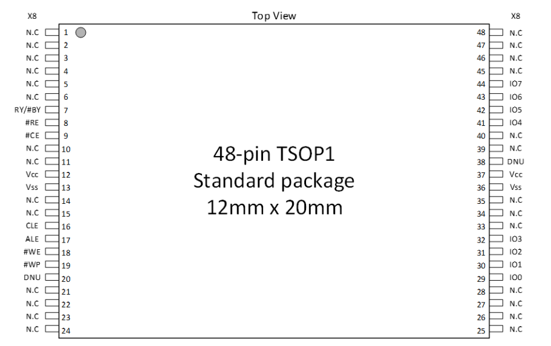
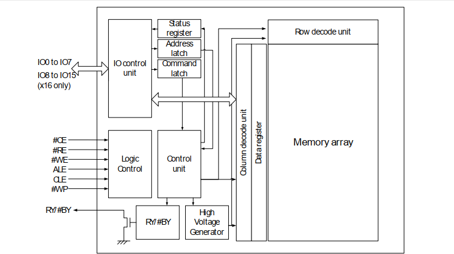
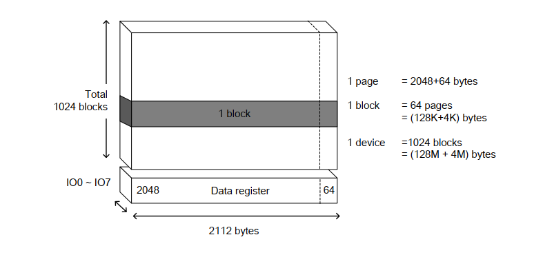
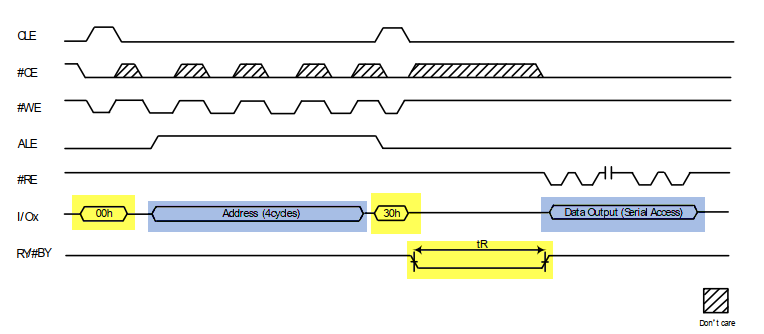
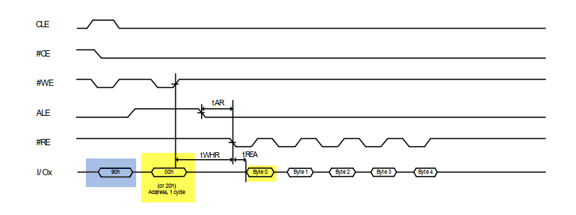
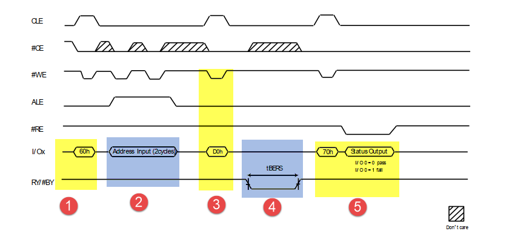
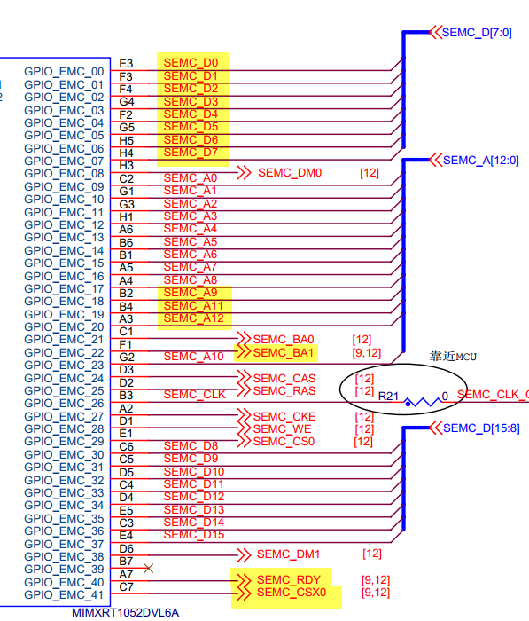
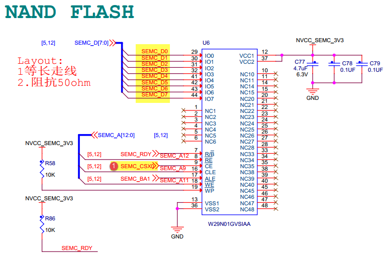
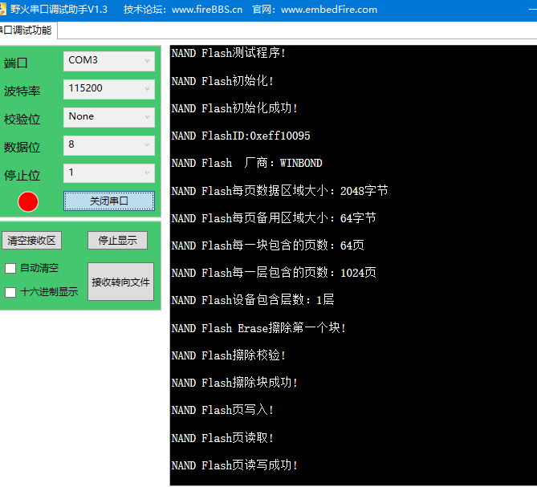

SEMC—扩展外部NAND flash
-----------------------

本章参考资料：《IMXRT1050RM》（参考手册）以及库帮助文档。

关于NAND
flash存储器，请参考前面的“常用存储器介绍-《i.MX1052RT库开发实战指南》”章节，实验中NAND
flash芯片的具体参数，请参考其规格书《W29N01HVXINA》来了解。

注意：野火i.MXRT1052系列开发板仅B2B接口的核心板带NAND
flash，其它型号的核心板不带NAND flash。

NAND flash控制原理
~~~~~~~~~~~~~~~~~~

NAND flash作用类似于电脑的固态硬盘，主要用于存储数据。相同容量NAND
flash要比Nor flash便宜很多，NAND flash只能按页读、写，所以在NAND
flash中不能执行代码。NAND
flash一般容量较大，用于存储大量的数据。本教程配套开发板板载了一块型号为W29N01HVXINA的NAND
flash 如所示，容量为1Gbit即128M字节。本章节以它为例进行学习。

图 29‑1NAND flash芯片外观

NAND flash内部结构
^^^^^^^^^^^^^^^^^^

图 29‑2NAND flash芯片的内部结构框图(摘自《W29N01HVXINA》数据手册)

①NAND flash的信号线
'''''''''''''''''''

图 29‑2标号①处表示的是SDRAM芯片的控制引脚，其说明见表 29‑1。

表 29‑1NAND flash引脚说明

+----------+--------+----------------------+
| 信号线   | 类型   | 说明                 |
+==========+========+======================+
| #WP      | I      | 写保护               |
+----------+--------+----------------------+
| ALE      | I      | 地址锁存使能         |
+----------+--------+----------------------+
| #CE      | I      | 片选信号，低电平有效 |
+----------+--------+----------------------+
| #WE      | I      | 写入使能，低电平有效 |
+----------+--------+----------------------+
| RY/#BY   | O      | 读忙，               |
+----------+--------+----------------------+
| #RE      | I      | 读使能，低电平有效   |
+----------+--------+----------------------+
| CLE      | I      | 时钟使能信号         |
+----------+--------+----------------------+
| I/O[0-7] | I/O    | 数据输入/输出        |
+----------+--------+----------------------+
| Vcc      | Supply | 电源引脚             |
+----------+--------+----------------------+
| Vss      | Supply | GND 引脚             |
+----------+--------+----------------------+
| DNU      | -      | 未连接的引脚         |
+----------+--------+----------------------+
| N.C      | -      | 没有连接             |
+----------+--------+----------------------+

根据表 29‑1很容易理解NAND
flash各个功能引脚的作用，需要说明的是“#WP”引脚，它用于设置NAND
flash的地址寄存器。ALE引脚保持高电平，在WE的上升沿引脚I/O[0-7]的数据将会保存到地址寄存器。

②IO控制单元
'''''''''''

W29N01HVXINA芯片共有8跟I/O数据线，这8根数据线用于读、写数据，配合地址锁存和命令锁存也用于传输地址和命令。状态寄存器用于保存W29N01HVXINA芯片当前状态信息。

③逻辑控制单元
'''''''''''''

逻辑控制单元与与控制引脚相连，用于控制NAND flash工作状态，参考表
29‑1很容易理解。这里不再介绍。

④控制单元
'''''''''

控制单元是NAND
flash的核心，它根据IO控制单元和逻辑控制单元完成读写并通过RY/#BY引脚显示当前状态。

⑤存储阵列
'''''''''

与SDRAM不同，NAND
flash存储空间分为多个“块”，每个数块又分为多个“页”，如图 29‑3所示。

图 29‑3NAND flash存储结构

从图
29‑3可知，W29N01HVXINA芯片存储空间被分成了1024个数据块，每个数据块由64个页组成，每个页大小为2048+64bytes。

“块”是NAND flash擦除操作的最小单位。NAND
flash写入之前必须执行擦除，这是因为写入NAND
flash时只能将存储单元从“1”变为“0”而不能从“0”变为“1”，写入之前擦除操作就是将所有的存储单元都置1。

“页”，是NAND flash写入操作的最小单位，由于NAND
flash只能按页读、写。最初NAND
flash数据读、写容易出错，所以为了保证数据的正确行，必须要有对应的检测和纠错机制，从图
29‑3可知每一个页大小为“2048 +
64byte”，多出的64byge就是用来放置数据的校验值。

NAND flash的模式选择
^^^^^^^^^^^^^^^^^^^^

NAND flash通过各种信号线状态组合切换不同的工作模式，如表 29‑2所示。

表 29‑241.1.2 Nand-flah模式选择

+--------------------+----------+-----+-----+--------+--------+--------+-----+
|        模式        |   CLE    | ALE | #CE |  #WE   |  #RE   |  #WP   |     |
+====================+==========+=====+=====+========+========+========+=====+
| 读模式             | 命令写入 | H   | L   | L      | 上升沿 | H      | X   |
+--------------------+----------+-----+-----+--------+--------+--------+-----+
|                    | 地址写入 | L   | H   | L      | 上升沿 | H      | X   |
+--------------------+----------+-----+-----+--------+--------+--------+-----+
| 程序擦除模式       | 命令写入 | H   | L   | L      | 上升沿 | H      | H   |
+--------------------+----------+-----+-----+--------+--------+--------+-----+
|                    | 地址写入 | L   | H   | L      | 上升沿 | H      | H   |
+--------------------+----------+-----+-----+--------+--------+--------+-----+
| 数据输入           | L        | L   | L   | 上升沿 | H      | H      |     |
+--------------------+----------+-----+-----+--------+--------+--------+-----+
| 顺序读取           | L        | L   | L   | H      | 下降沿 | X      |     |
+--------------------+----------+-----+-----+--------+--------+--------+-----+
| 正在读（读忙）     | X        | X   | X   | X      | H      | X      |     |
+--------------------+----------+-----+-----+--------+--------+--------+-----+
| 芯片忙碌（忙）     | X        | X   | X   | X      | X      | H      |     |
+--------------------+----------+-----+-----+--------+--------+--------+-----+
| 正在擦除（擦除忙） | X        | X   | X   | X      | X      | H      |     |
+--------------------+----------+-----+-----+--------+--------+--------+-----+
| 写保护             | X        | X   | X   | X      | X      | L      |     |
+--------------------+----------+-----+-----+--------+--------+--------+-----+
| 备用               | X        | X   | H   | X      | X      | 0V/Vcc |     |
+--------------------+----------+-----+-----+--------+--------+--------+-----+

表中的H表示高电平，L表示低电平，X表示任意电平。

NAND flash命令表
^^^^^^^^^^^^^^^^

控制NAND flash需要用到一系列的命令，NAND flash控制引脚决定了NAND
flash的模式，控制命令决定NAND flash执行的操作。NAND flash命令表如所示

表 29‑34NAND flash命令表

+-----------------------+-------+-------+-------+-------+------------------------+
| COMMAND               | CYCLE | CYCLE | CYCLE | CYCLE | Acceptable during busy |
+=======================+=======+=======+=======+=======+========================+
| PAGE READ             | 00h   | 30h   |       |       |                        |
+-----------------------+-------+-------+-------+-------+------------------------+
| READ for COPY BACK    | 00h   | 35h   |       |       |                        |
+-----------------------+-------+-------+-------+-------+------------------------+
| READ ID               | 90h   |       |       |       |                        |
+-----------------------+-------+-------+-------+-------+------------------------+
| READ STATUS           | 70h   | Yes   |       |       |                        |
+-----------------------+-------+-------+-------+-------+------------------------+
| RESET                 | FFh   | Yes   |       |       |                        |
+-----------------------+-------+-------+-------+-------+------------------------+
| PAGE PROGRAM          | 80h   | 10h   |       |       |                        |
+-----------------------+-------+-------+-------+-------+------------------------+
| PROGRAM for COPY BACK | 85h   | 10h   |       |       |                        |
+-----------------------+-------+-------+-------+-------+------------------------+
| BLOCK ERASE           | 60h   | D0h   |       |       |                        |
+-----------------------+-------+-------+-------+-------+------------------------+
| RANDOM DATA INPUT*1   | 85h   |       |       |       |                        |
+-----------------------+-------+-------+-------+-------+------------------------+
| RANDOM DATA OUTPUT*1  | 05h   | E0h   |       |       |                        |
+-----------------------+-------+-------+-------+-------+------------------------+
| READ PARAMETER        | ECh   |       |       |       |                        |
|                       |       |       |       |       |                        |
| PAGE                  |       |       |       |       |                        |
+-----------------------+-------+-------+-------+-------+------------------------+

下面简要介绍几个常用的命令如下：

页读命令
'''''''''''

当设备开机时，“00h”命令被锁定到命令寄存器。因此，程序中只需发送地址然后发送“30h”命令进行设备的初始读取。当然也可以按照完整的“页”读流程，首先发送“00h”命令，之后发送地址，最后发送“30h”命令。发送“30h”命令之后，在tR时间内数据从NAND
flash存储区复制到了NAND
flash数据缓冲区，之后就可以向单片机输出数据了。详细过程如图 29‑4所示。

图 29‑4页读操作

ID读取命令
''''''''''

要进入ID模式首先要向nannd-flash发送“90h”命令。进入ID模式之后根据输地址不同后面的读ID命令将会有所不同，如图
29‑5所示。

图 29‑5读ID

从图
29‑5可以看出，进入ID模式后输入地址“00h”，等待tWHR时间后就可以输出生产商ID，设备ID以及产品特性等等。如表
29‑4所示。

表 29‑4器件ID

+----------+----------+--------+--------+----------+------------+
| Byte     | Byte1    | Byte2  | Byte3  | Byte4    | Byte5      |
+==========+==========+========+========+==========+============+
| W29N01HV | EFh      | F1h    | 00h    | 95h      | 00h        |
+----------+----------+--------+--------+----------+------------+
| 描述     | 生产商ID | 设备ID | 不支持 | 存储信息 | 退出ID模式 |
+----------+----------+--------+--------+----------+------------+

块擦除命令
'''''''''''''

nand_flash 只能整块擦除，W29N01HVXINA芯片的块大小为（128 +
4）Kbytes。块擦除过程如图 29‑6所示。

图 29‑6块擦除

向nand_flash写入擦除命令“60h”如图
29‑6标号①所示，然后写入要擦除的地址，如②所示。写入要擦除的地址后nand_flash并不会立即执行擦除工作，在#WE的上升沿写入“D0h”命令之后擦除操作才能开始。在擦除过程中RY/#BY为低电平，并且开启擦除之后可以通过发送“70h”命令查看当前擦除状态，如果状态寄存器Bit6为1表示擦除完成。

nand_flash基本读写测试实验
~~~~~~~~~~~~~~~~~~~~~~~~~~

在第23章
SEMC—扩展外部SDRAM我们已经详细介绍了RT1052的SEMC接口，在这里将基于本教程配套开发板讲解SEMC外扩nand_flash。

硬件设计
^^^^^^^^

本书配套开发板外扩SDRAM和外扩nand_flash共用semc接口，两者不能同时使用，为简化程序设计，本章节将不使用外部SDRAM。

nand_flash硬件连接如图 29‑7、图 29‑8所示。

图 29‑7NAND flash硬件连接（1）

图 29‑8NAND flash硬件连接（2）

W29N01HVXINA芯片的片选信号连接到了SEMC接口的SEMC_CSX0引脚，所以使用NAND
flash之前要将SEMC_CSX0引脚设置为低电平，如图
29‑8所示标号①所示。W29N01HVXINA芯片数据宽度为8位，只使用到了SEMC接口的SEMC_D[0,7]。

软件设计
^^^^^^^^

编程要点
''''''''

(1) 配置SEMC要使用的引脚的MUX复用模式及PAD属性；

(2) 配置SEMC外设的时钟来源、分频得到SEMC根时钟（SEMC_CLK_ROOT）；

(3) 配置SEMC工作模式；

(4) 根据要求初始化nand_flash。

(5) 编写nand_flash测试函数，并校验数据的读写。

代码分析
''''''''

NAND flash配置结构体
**********************************

配置结构体在不同版本的官方SDK中有所不同，我们重点是讲解配置结构体的各个配置项的作用，如代码清单
29‑1所示。

.. code-block:: c
   :name: 代码清单 29‑1NAND flash配置结构体（fsl_nand_flash.h）
   :caption: 代码清单 29‑1NAND flash配置结构体（fsl_nand_flash.h）
   :linenos:

   /*NAND Flash 配置结构体 */
   typedef struct _nand_config
   {
      void *memControlConfig; /*内存控制器配置应分配特定的控制器配置结构指针*/
      void *driverBaseAddr;   /*驱动基地址. */
   } nand_config_t;

该结构体只有两个void\*类型的指针，根据注释memControlConfig指针用于指向控制器配置结构体，指针driverBaseAddr用于指向驱动的基地址。在本程序中“控制器配置结构体”指的是SEMC
nand_flash配置结构体， “驱动的基地址”指的是SEMC基地址。

SEMC nand_flash存储器配置结构体
                               

.. code-block:: c
   :name: 代码清单 29‑2Semc nand_flash配置结构体（fsl_semc_nand_flash.h）
   :caption: 代码清单 29‑2Semc nand_flash配置结构体（fsl_semc_nand_flash.h）
   :linenos:

   /* SEMC NAND Flash 配置结构体 */
   typedef struct _semc_mem_nand_config
   {
      semc_nand_config_t *semcNandConfig; /*控制器配置结构体. */
      uint32_t clkSrc_Hz;                 /*同步时钟频率*/
      delay_us delayUS;                   /*外部提供的延时函数 */
      nand_onfi_version_t onfiVersion;    /*仅支持onfi nand flash  */
      uint8_t readyCheckOption;           /*仅支持onfi nand flash  */
      nand_ecc_check_type_t eccCheckType; /*选择校验类型*/
   } semc_mem_nand_config_t;

结构体讲解如下：

-  semc_nand_config_t，这是另外一配置结构体，它会详细配置SEMC NAND接口，稍后会详细介绍。

-  clkSrc_Hz，同步时钟频率，nand_flash不使用同步时钟，忽略该选项即可。

-  delayUS，nand_flash需要用到延时函数，该选项为nand_flash提供一个延时函数。

-  onfiVersion，选择nand_flash类型，当前仅支持onfi nand flash。

-  readyCheckOption，选择nand_flash就绪标志位，我可以通过状态寄存器或者R/B#信号引脚检测nand_flash是否就绪，可选内容在枚举类型"nand_ready_check_option_t"中列出，我们根据需要选择即可。

-  eccCheckType，设置校验类型，在nand_flash的每一页都有一块多出的空间，它用于存储校验码，而该选项就是用于选择采用何种校验方式。如果对校验不熟悉，参照官方选择即可。

SEMC nand_flash配置结构体
**********************************

首先我们梳理一下这几个配置结构体，包含关系为①nand_config_t ->
②semc_mem_nand_config_t->③semc_nand_config_t。下面将会简单讲解semc_nand_config_t结构体，如代码清单
29‑3所示。

.. code-block:: c
   :name: 代码清单 29‑3SEMC nand_flash配置结构体(fsl_semc_nand_flash.h)
   :caption: 代码清单 29‑3SEMC nand_flash配置结构体(fsl_semc_nand_flash.h)
   :linenos:

   typedef struct _semc_nand_config
   {
      semc_iomux_pin cePinMux;                     /*选择片选引脚*/
      uint32_t axiAddress;                         /*设置XAI内存映射基地址*/ 
      uint32_t axiMemsize_kbytes;                  /*AXI接口flash大小 */
      uint32_t ipgAddress;                         /*IPG nand基地址 . */
      uint32_t ipgMemsize_kbytes;            /*IPG nand空间大小，单位K字节 */
      semc_rdy_polarity_t rdyactivePolarity;       /*就绪信号极性*/
      bool edoModeEnabled;                         /*使能EDO模式*/
      semc_nand_column_bit_num_t columnAddrBitNum; /*列地址位数*/
      semc_nand_address_option_t arrayAddrOption;  /*地址选择*/
      sem_nand_burst_len_t burstLen;               /*突发长度*/
      smec_port_size_t portSize;                   /*接口位宽*/
      semc_nand_timing_config_t *timingConfig;      /*SEMC nand时序配置*/
   } semc_nand_config_t;

semc_nand_config_t结构体用于设置SEMC
nand_flash接口，我们掌握常用的配置，其他参照官方SDK配置即可。semc_nand_config_t结构体讲解如下：

-  cePinMux，设置片选引脚，根据原理图可知，nand_flash的片选引脚连接到MUXCS0，配置时选择相应的引脚即可。

-  axiAddress，XAI内存映射基地址，如果使用XAI映射nand_flash到内部地址空间，则该配置项用于设置映射的基地址，本实验不使用XAI内存映射。

-  axiMemsize_kbytes，如果使用XAI，该配置项用于设置映射的空间大小（单位：K字节），这个大小应不小于nnad_flash实际大小。

-  ipgAddress，设置IPG nand_flash基地址，默认设置为0即可。

-  ipgMemsize_kbytes，该配置项用于IPG nand的空间大小（单位：K字节），这个大小应不小于nand_flash实际大小。

-  rdyactivePolarity，就绪信号极性

-  edoModeEnabled，是否开启EDO模式，使用nand_flash时默认不开启。

-  columnAddrBitNum，列地址位数。

-  arrayAddrOption，列地址选择。

-  burstLen，突发数据长度。

-  portSize，选择nand_flash数据宽度，常用的有8位或16位。

-  timingConfig，SEMC nand时序配置.

nand_flash初始化函数
**********************************

nand_flash初始化函数主要内容包括初始化nand_flash使用的外部引脚并初始化SEMC接口如所示。

.. code-block:: c
   :name: 代码清单 29‑4Nand_flash初始化函数（bsp_nand.c）
   :caption: 代码清单 29‑4Nand_flash初始化函数（bsp_nand.c）
   :linenos:

   void BOARD_InitNand(void)
   {	
      semc_config_t config;
      
      /**************第一部分***************/
      /*初始化nand_flash相关引脚*/
      NAND_IOMUXC_MUX_Config();
      NAND_IOMUXC_PAD_Config();
      
      /**************第二部分**************/
      /* 参数置零 */
      memset(&config, 0, sizeof(semc_config_t));
      /* 初始化SEMC. */
      SEMC_GetDefaultConfig(&config);
      SEMC_Init(SEMC, &config);
      
      /**************第三部分***************/
      /* 为NAND闪存控制器使用设置SEMC时钟源 */
      semcMemConfig.clkSrc_Hz = EXAMPLE_SEMC_CLK_FREQ;
   }

nand_flash初始化函数比较简单，结合代码讲解如下：

-  第一部分，初始化nand_flash使用的外部引脚，

-  第二部分，使用默认的SECM配置参数初始化SEMC接口。

-  第三部分，使用函数EXAMPLE_SEMC_CLK_FREQ获取SEMC接口的始终频率，并保存到semcMemConfig结构体中，为下一步的初始化做准备。

初始化配置结构体
                

Nand_flash相关初始化结构体共有3个，和其他外设初始化类似，我们首先配置初始化结构体然后调用外设初始化函数。配置完成的初始化结构体如代码清单
29‑5所示。

.. code-block:: c
   :name: 代码清单 29‑5nand_flash配置结构体（bsp_nand.c）
   :caption: 代码清单 29‑5nand_flash配置结构体（bsp_nand.c）
   :linenos:

   /****************第一部分************************/
   semc_nand_config_t semcNandConfig = {
      .cePinMux = kSEMC_MUXCSX0,     /*!< 设置片选 */
      .axiAddress = EXAMPLE_SEMC_NAND_AXI_START_ADDRESS, /*基地址 */
      /*!< AXI接口flash大小 8*1024*2*1024*1024 = 16Gb. */
      .axiMemsize_kbytes = 2 * 1024 * 1024,     
      /*The base address. */
      .ipgAddress = EXAMPLE_SEMC_NAND_IPG_START_ADDRESS,
      /*!< IPG接口flash大小 8*1024*2*1024*1024 = 16Gb. */    
      .ipgMemsize_kbytes = 2 * 1024 * 1024,     
      .rdyactivePolarity = kSEMC_RdyActiveLow, /*RDY极性 */
      .arrayAddrOption = kSEMC_NandAddrOption_5byte_CA2RA3,
      .edoModeEnabled = false,          /* 地址模式 */
      .columnAddrBitNum = kSEMC_NandColum_12bit,
      .burstLen = kSEMC_Nand_BurstLen1,/*突发长度 */
      .portSize = kSEMC_PortSize8Bit, /*接口位宽 */
      .timingConfig = NULL,
   };
   
   /****************第二部分************************/
   semc_mem_nand_config_t semcMemConfig = {
      .semcNandConfig = &semcNandConfig,/*控制器配置结构体. */
      .delayUS = delayUs,                  /*外部提供的延时函数 */
      .onfiVersion = kNandOnfiVersion_1p0,/*仅支持onfi nand flash  */
      .readyCheckOption = kNandReadyCheckOption_SR,/*仅支onfinand flash  */
      .eccCheckType = kNandEccCheckType_DeviceECC,/*选择校验类型*/
   };
   
   /****************第三部分************************/
   nand_config_t nandConfig = {
      /*内存控制器配置应分配特定的控制器配置结构指针*/
      .memControlConfig = (void *)&semcMemConfig,
      .driverBaseAddr = (void *)EXAMPLE_SEMC, /*驱动基地址. */
   };

代码中三部分分别配置了三个初始化结构体，需要配置的nand_flash配置项包含在这三个结构体中，之后调用nand_flash初始化函数即可完成初始化。

nand_flash 读写测试函数
**********************************

测试函数中首先使用nand_flash配置结构体初始化nand_flash，初始化完成后执行nand_flash块擦除、页读写等操作。如代码清单
29‑6所示。

.. code-block:: c
   :name: 代码清单 29‑6Nand_flash读写测试（nand_flash_test.c）
   :caption: 代码清单 29‑6Nand_flash读写测试（nand_flash_test.c）
   :linenos:

   void nand_flash_test(void)
   {
      status_t status;
      char Manufacturer[12];
   
      PRINTF("\r\nNAND Flash测试程序!\r\n");
      
   /************************第一部分******************************/
      PRINTF("\r\nNAND Flash初始化!\r\n");
      status = Nand_Flash_Init(&nandConfig, &nandHandle);
      if (status != kStatus_Success)
      {
            PRINTF("\r\nNAND Flash初始化失败!\r\n");
            PRINTF("\r\n error code: %d \r\n", status);
            ErrorHandler();
      }
      PRINTF("\r\nNAND Flash初始化成功!\r\n");
   
   /************************第二部分******************************/
      //读取ID
      PRINTF("\r\nNAND FlashID:0x%x\r\n", NAND_ReadID());
      memset(Manufacturer, 0, 12);
      strncpy(Manufacturer, (const char *)s_nandDeviceManufacturerList\
            [nandHandle.vendorType], 8);
      PRINTF("\r\nNAND Flash  厂商：%s\r\n", Manufacturer);
      PRINTF("\r\nNAND Flash每页数据区域大小：%d字节\r\n", \
                              nandHandle.bytesInPageDataArea);
      PRINTF("\r\nNAND Flash每页备用区域大小：%d字节\r\n", \
                              nandHandle.bytesInPageSpareArea);
      PRINTF("\r\nNAND Flash每一块包含的页数：%d页\r\n", \
                              nandHandle.pagesInBlock);
      PRINTF("\r\nNAND Flash每一层包含的页数：%d页\r\n", \
                              nandHandle.blocksInPlane);
      PRINTF("\r\nNAND Flash设备包含层数：%d层\r\n", \
                              nandHandle.planesInDevice);
   
      //PRINTF("\r\n***NAND Flash ID：%d\r\n",nandHandle.JEDECid);
      //    SEMC->IPCR1 = 1;
   
   /************************第三部分******************************/
      /* Erase Block */
      PRINTF("\r\nNAND Flash Erase擦除第一个块!\r\n");
      status = Nand_Flash_Erase_Block(&nandHandle, 0);
      if (status != kStatus_Success)
      {
            PRINTF("\r\nNAND Flash擦除块失败!\r\n");
            ErrorHandler();
      }
   
      /* Read and check if it is blank. */
      PRINTF("\r\nNAND Flash擦除校验!\r\n");
      for (uint32_t pageIndex = 0; pageIndex < nandHandle.pagesInBlock;\
                                                               pageIndex++)
      {
   /************************第四部分******************************/
            status = Nand_Flash_Read_Page(&nandHandle, pageIndex, \
         mem_readBuffer, nandHandle.bytesInPageDataArea);
            if (status != kStatus_Success)
            {
               PRINTF("\r\nNAND Flash读取页失败!\r\n");
               ErrorHandler();
            }
   
            for (uint32_t bytesIndex = 0; bytesIndex < \
         nandHandle.bytesInPageDataArea; bytesIndex++)
            {
               if (mem_readBuffer[bytesIndex] != 0xFF)
               {
                  PRINTF("\r\nNAND Flash擦除块失败!\r\n");
                  ErrorHandler();
               }
            }
      }
   
      PRINTF("\r\nNAND Flash擦除块成功!\r\n");
         
   /***********************第五部分*****************************/
      /* Program the page data. */
      PRINTF("\r\nNAND Flash页写入!\r\n");
      /* Initialize the write buffers. */
      memset(mem_writeBuffer, 0xaa, sizeof(mem_writeBuffer));
      status = Nand_Flash_Page_Program(&nandHandle, 0, mem_writeBuffer,\
                                       nandHandle.bytesInPageDataArea);
      if (status != kStatus_Success)
      {
         PRINTF("\r\nNAND Flash页写入失败!\r\n");
         ErrorHandler();
      }

   /*Read page data and check if the data read is equal to the data programed*/ 
      PRINTF("\r\nNAND Flash页读取!\r\n");
      status = Nand_Flash_Read_Page(&nandHandle, 0, mem_readBuffer,\
                                    nandHandle.bytesInPageDataArea);
      if (status != kStatus_Success)
      {
         PRINTF("\r\nNAND Flash页读取失败!\r\n");
         ErrorHandler();
      }

      if (memcmp(mem_writeBuffer, mem_readBuffer,\
               nandHandle.bytesInPageDataArea) != 0)
      {
            PRINTF("\r\nNAND Flash页读取失败!\r\n");
            ErrorHandler();
      }
   
      PRINTF("\r\nNAND Flash页读写成功!\r\n");
   }

测试函数函数代码较长，不过各部分功能清晰，很容易理解，结合代码各部分讲解如下：

-  第一部分，初始化nand_flash，nand_flash初始化函数Nand_Flash_Init共有两个参数，一个是我们设置好的nand_flash配置结构体，它用于提供nand_flash的配置参数。另外一个是nand_flash句柄，用于获取nand_flash信息，nand_flash句柄如代码清单 29‑7所示。

.. code-block:: c
   :name: 代码清单 29‑7Nand_flash句柄结构体（fsl_nand_flash.h）
   :caption: 代码清单 29‑7Nand_flash句柄结构体（fsl_nand_flash.h）
   :linenos:

   typedef struct _nand_handle
   {
      /*------------用于通用nand_flash控制器操作的常用参数 ----------*/    
      void *driverBaseAddr;       /*驱动基地址*/
      uint8_t vendorType;            /*!< vendor type */
      uint32_t bytesInPageDataArea;  /*页大小*/
      uint32_t bytesInPageSpareArea; /*页备用区域大小*/
      uint32_t pagesInBlock;         /*一块包含多少个页 */
      uint32_t blocksInPlane;        /*一层包含多少块 */
      uint32_t planesInDevice;       /*一片Flash 包含多少层*/
      /*------------用于特定nand_flash ----------*/  
      void *deviceSpecific;/*!< 特定控制参数 */
   } nand_handle_t;

-  第二部分，输出nand_flash句柄得到的nand_flash信息。

-  第三部分，使用Nand_Flash_Erase_Block函数擦除一个数据块，函数共有两个参数，第一个是初始化nand_flsh时得到的nand_flash句柄，第二个是nand_flash块编号。擦除成功后，在第四部分进行校验，检查擦除是否正确。

-  第四部分，校验nand_flash块擦除是否成功。

-  第五部分，进行页写入和页读取并校验读、写数据是否一致。页写入函数如代码清单 29‑8所示。

.. code-block:: c
   :name: 代码清单 29‑8nand_flash页写入函数（fsl_semmc_nand_flash.c）
   :caption: 代码清单 29‑8nand_flash页写入函数（fsl_semmc_nand_flash.c）
   :linenos:

   status_t Nand_Flash_Page_Program(nand_handle_t *handle,//nand_flash句柄
                                          uint32_t pageIndex, //页编号
                                          uint8_t *src,     //要写入的数据缓冲区
                                          uint32_t length)    //要写入的数据长度

页读取函数与页写入函数的参数一致，不同的是第三个参数用于指定读取得到的数据保存位置。

Main函数
*****************

初始化函数和测试函数编写完成之后main函数的编写就非常简单了，直接调用初始化函数和测试函数即可，如代码清单29‑9所示。

.. code-block:: c
   :name: 代码清单 29‑9main函数（main.c）
   :caption: 代码清单 29‑9main函数（main.c）
   :linenos:

   int main(void)
   {
   /*------------以下省略系统初始化相关代码 ----------*/ 
      /* 初始化LED */
      LED_GPIO_Config();
      /* 初始化nand相关接口 */
      BOARD_InitNand();
      /* 打印系统时钟 */
   /*-----------一下省略系统时钟输出相关代码-------------*/	
      /* nandflash读写测试 */
      nand_flash_test();
      while(1)
      {
            
      }			
   }

在main函数中调用BOARD_InitNand函数初始化端口然后调用函数nand_flash_test初始化nand_flash并测试nand_flash基本读、写、擦除功能。

下载验证
''''''''

因nand_flash与外部SDRAM共用semc接口所以两者不能同时使用，为简化程序设计，配套nand_flash例程中不使用nand_flash，用到SDRAM的工程版本均不能使用。

保证开发板相关硬件连接正确，用USB线连接开发板“USB TO
UART”接口跟电脑，在电脑端打开串口调试助手，把编译好的程序下载到开发板。程序运行后正常情况下串口会输出nand_flash测试结果，如图
29‑9所示。

图 29‑9程序输出结果
