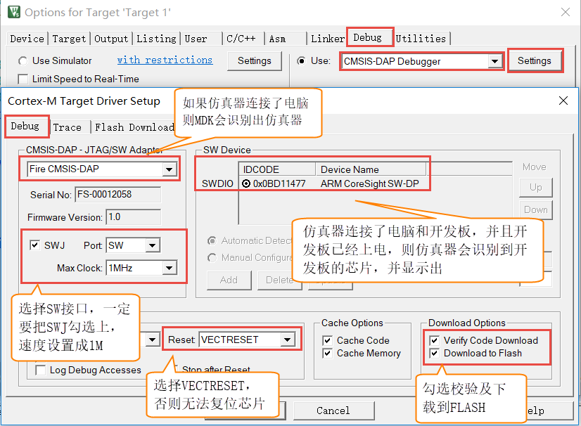

如何用DAP仿真器下载程序
-----------------------

仿真器简介
~~~~~~~~~~

开发ARM内核芯片相关的程序时，一般会使用仿真器进行程序调试及芯片下载程序。本书配套的仿真器为Fire-Debugger，遵循ARM公司的CMSIS-DAP标准，支持所有基于Cortex内核的单片机，常见的M3、M4和M7都可以完美支持，其外观见图
3‑1。

Fire-Debugger支持下载和在线仿真程序，支持XP/WIN7/WIN8/WIN10这四个操作系统，免驱，不需要安装驱动即可使用，支持KEIL和IAR直接下载，非常方便。

图 3‑1 DAP下载器外观

硬件连接
~~~~~~~~~

把仿真器用USB线连接电脑，如果仿真器的灯亮则表示正常，可以使用。然后把仿真器的另外一端连接到开发板，给开发板上电，然后就可以通过软件KEIL或者IAR给开发板下载程序。

图 3‑2 仿真器与电脑和开发板连接方式

与野火普通版DAP下载器的连接
'''''''''''''''''''''''''''

核心板与野火普通版DAP下载器可直接用配套的排线组连接，连接方式见图
3‑3，注意接头中两竖的一面朝向开发板内。

图 3‑3 核心板与野火DAP下载器的连接

与野火高速版DAP下载器的连接
'''''''''''''''''''''''''''

核心板也可以与野火高速版DAP下载器下载调试，使用前有如下注意事项：

-  撬开DAP下载器的上盖，找到预留配置的两孔，见图 3‑3。

图 3‑4 预留配置两孔在下载器中的位置

在这两个孔处焊上排针，然后使用跳线帽把两个排针连接起来，见图 3‑5。

图 3‑5 使用短路帽连接配置孔

-  高速DAP使用JTAG接口，而JTAG接口是兼容核心板采用的SWD下载接口的，使用杜邦线从高速DAP的JTAG接口引出SWD信号线与核心板连接即可，见图
   3‑6。

图 3‑6 JTAG接口顺序

上图中的15-RESET（复位信号）、9-TCK/SWCLK(时钟信号)、7-TMS/SWDIO（数据信号）以及4~20的GND(地线)即是可用于SWD接口的信号线。

-  了解JTAG接口的信号线后，把核心板翻到背面，在背面可查看核心板引出的SWD下载器接口丝印，见图
   3‑7，各个引脚分别为RST（复位）、SMC（时钟信号）、GND（地）、SWD（数据信号）、NC（空引脚）。

图 3‑7 核心板背面的丝印说明

-  最后，使用杜邦线把下载器与核心板相同的信号线连接起来即可，见表格
   3‑1。

表格 3‑1 高速DAP下载器与核心板的连接

+----------------+--------+----------------+
| DAP下载器      | 核心板 | 说明           |
+================+========+================+
| RESET          | RST    | 复位           |
+----------------+--------+----------------+
| TCK/SWCLK      | SMC    | 时钟信号       |
+----------------+--------+----------------+
| TMS/SWDIO      | SWD    | 数据信号       |
+----------------+--------+----------------+
| GND            | GND    | 地线           |
+----------------+--------+----------------+
| 空引脚不用连接 | NC     | 空引脚不用连接 |
+----------------+--------+----------------+

连接后的效果图如下：

图 3‑8高速DAP与核心板的连接效果图

仿真器配置
~~~~~~~~~~

在仿真器连接好电脑和开发板且开发板供电正常的情况下，打开编译软件KEIL，在魔术棒选项卡里面选择仿真器的型号，具体过程看图示：

Debug选项配置
'''''''''''''

.. image:: media/image10.png
   :align: center
   :alt: image10
   :name: 图3_9

图 3‑9 Debug选择CMSIS-DAP Debugger

Utilities选项配置
'''''''''''''''''

.. image:: media/image11.png
   :align: center
   :alt: image11
   :name: 图3_10

图 3‑10 Utilities选择 Use Debug Driver

Debug Settings 选项配置
'''''''''''''''''''''''

图 3‑11 Debug Settings 选项配置

放置下载算法
~~~~~~~~~~~~

KEIL及IAR在下载程序的时候要针对目标芯片使用相应的下载算法。

类似STM32、Kinetis等系列控制器芯片内部都具有FLASH存储器用于存储程序，安装芯片包后即自带相应的FLASH下载算法，在工程里直接选择即可。

而i.MX
RT系列芯片内部不具备FLASH存储器，即其程序代码需要存储在外部的存储器中，使用时需要自己提供对应FLASH的下载算法给KEIL软件，野火i.MX
RT1052系列开发板使用32MB的SPI-NorFlash芯片存储程序，相应的下载算法我们提供在资料的如下目录：

开发板资料\开发环境\下载算法\\ iMXRT1052_W25Q256JV_CFG_By_Fire.FLM

开发板资料\开发环境\下载算法\Embedfire_RT1052_QSPI_R1.FLM

把这两个文件都复制到KEIL的如下安装目录即可，如：

C:\Keil_v5\ARM\Flash

放置后效果见图 3‑12。

图 3‑12 放置相应的下载算法

这两个下载算法分别是配套我们的寄存器和库函数版本的例程。在后面的教程中我们提供了寄存器版本的例程以供入门过渡学习，为简便起见，寄存器版本的例程使用的下载算法直接集成FLASH存储器的驱动信息，使用上面CFG版本的文件：iMXRT1052_W25Q256JV\_\ **CFG**\ \_By_Fire.FLM(寄存器版本工程使用)。

而对于后期的绝大部分例程，都是使用库函数开发的，为了便于修改和移植至不同的FLASH存储器，关于存储器的信息使用工程中的C语言源码来记录，所以在下载算法中不包含这部分驱动信息，也就是说库版本的例程使用上面的QSPI_R1版本文件：Embedfire_RT1052_QSPI_R1.FLM（库函数版本工程使用）。

选择下载算法
~~~~~~~~~~~~

下载时需要针对目标存储器，选择对应的下载算法，此处野火i.MX
RT1052-Mini开发板根据工程的版本选择前面放置的2个W25Q256
存储器的下载算法，在寄存器版本和库函数版本的工程中具体选择的算法是不同的。

选择寄存器版本工程的下载算法
''''''''''''''''''''''''''''''''''

对于寄存器版本的工程，选择下载算法的方式见图
3‑13，在“Debug->Settings->Flash
Download->add”页面中选择寄存器版本的下载算法：iMXRT1052_W25Q256JV\_\ **CFG**\ \_By_Fire.FLM。

.. image:: media/image14.png
   :align: center
   :alt: image14
   :name: 图3_13

图 3‑13 选择下载算法（寄存器版）

按图点击Add按钮后即可添加寄存器版本的下载算法。

选择库函数版本工程的下载算法
''''''''''''''''''''''''''''''''''

对于库函数版本的工程，选择的方法类似，只是最终添加的下载算法不同而已，具体见图
3‑14，此处选择的下载算法是Embedfire_RT1052_QSPI_R1.FLM。

图 3‑14选择下载算法（库函数版）

设置算法空间
~~~~~~~~~~~~

由于本下载算法相比默认的需要更大的空间，所以还需要在配置页面中增大算法空间，见图
3‑15和图 3‑16。

图 3‑15 设置下载算法空间(寄存器版下载算法配置)

图 3‑16设置下载算法空间(库函数版下载算法配置)

关于KEIL的这个Flash Download配置有个小技巧，就是把Reset and
Run也勾选上，这样程序下载完之后就会自动运行，否则需要手动复位。擦除的FLASH大小选择Sectors即可，不要选择Full
Chip，不然下载会比较慢，说明见图 3‑17和图 3‑18，设置完成后点OK按钮即可。

图 3‑17 Flash Download页面的说明（寄存器版本）

.. image:: media/image19.png
   :align: center
   :alt: image19
   :name: 图3_18

图 3‑18 Flash Download页面的说明（库函数版本）

选择工程版本
~~~~~~~~~~~~

我们提供的大部分示例程序包含不同的版本，部分版本只支持调试，不支持下载，此处我们选择可下载的工程版本进行编译，见图
3‑19，若工程中相应的版本下拉框可选择，那么选择“nor_txt_ram”版本，若无其它选择则保持默认即可。关于这些工程版本在后续的章节会进行讲解。

图 3‑19 选择工程版本

编译程序
~~~~~~~~

选择好工程版本后，点击软件的编译按钮进行编译，见图 3‑20。

图 3‑20 编译程序

若编译正常，可以看到软件的输出，生成了一个“xxx.axf”文件，见图 3‑21。

图 3‑21 编译提示

若使用我们配套的例程编译失败，请确认Keil软件已注册正常，并且重新使用我们提供的代码进行编译。

下载程序
~~~~~~~~

如果前面步骤都成功了，接下来就可以把编译好的程序下载到开发板上运行。下载程序不需要其他额外的软件，直接点击KEIL中的LOAD按钮即可。

.. image:: media/image23.png
   :align: center
   :alt: image23
   :name: 图3_22

图 3‑22 下载程序

程序下载后，Build Output选项卡如果打印出 Application
running…则表示程序下载成功。如果没有出现实验现象，按复位键试试。

.. image:: media/image24.png
   :align: center
   :alt: image24
   :name: 图3_23

图 3‑23 程序运行成功
