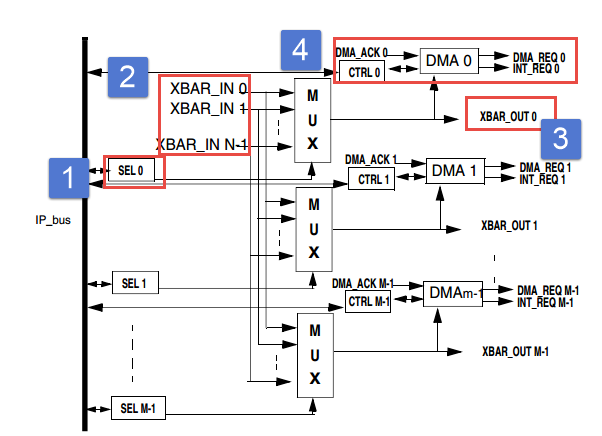

ADC—电压采集
------------

本章参考资料：《IMXRT1050RM》（参考手册）。

学习本章时，配合《IMXRT1050RM》ADC章节一起阅读，效果会更佳，特别是涉及到寄存器说明的部分。

ADC简介
~~~~~~~

RT1052有2个ADC，每个ADC有12位、10位、8位可选，每个ADC有16个外部通道。ADC具有最高1MS/s采样率，支持单次或连续转换模式，可配置的采样时间和转换速度，支持硬件求平均，支持自动比较转换结果为小于、大于或等于某一设定的值，或者在设定的范围内、范围外。ADC编程非常灵活，可根据不同需求选择不同的转换速度、转换精度。ADC功能非常强大，具体的我们在功能框图中分析每个部分的功能。

ADC功能框图剖析
~~~~~~~~~~~~~~~

图 30‑1单个ADC功能框图

掌握了ADC的功能框图，就可以对ADC有一个整体的把握，在编程的时候可以做到了然如胸，不会一知半解。框图讲解采用从左到右的方式，跟ADC采集数据，转换数据，传输数据的方向大概一致。

①外部输入通道
^^^^^^^^^^^^^^^^^^^^^^^^^^^^

外部模拟的电压信号通过ADCx_INn(n取0到15)进入ADC模块，我们把它称为外部输入通道，RT1052的每个ADC多达16外部输入个通道，这16个外部输入通道对应着不同的引脚以ADC1为例如
表格 30‑1所示，其他ADC请参考《IMXRT1050RM》（参考手册）External Signals
and Pin Multiplexing章节。

表格 30‑1ADC1外部输入引脚定义

+-----------+---------------+
| ADC1_IN0  | GPIO_AD_B1_11 |
+===========+===============+
| ADC1_IN1  | GPIO_AD_B0_12 |
+-----------+---------------+
| ADC1_IN2  | GPIO_AD_B0_13 |
+-----------+---------------+
| ADC1_IN3  | GPIO_AD_B0_14 |
+-----------+---------------+
| ADC1_IN4  | GPIO_AD_B0_15 |
+-----------+---------------+
| ADC1_IN5  | GPIO_AD_B1_00 |
+-----------+---------------+
| ADC1_IN6  | GPIO_AD_B1_01 |
+-----------+---------------+
| ADC1_IN7  | GPIO_AD_B1_02 |
+-----------+---------------+
| ADC1_IN8  | GPIO_AD_B1_03 |
+-----------+---------------+
| ADC1_IN9  | GPIO_AD_B1_04 |
+-----------+---------------+
| ADC1_IN10 | GPIO_AD_B1_05 |
+-----------+---------------+
| ADC1_IN11 | GPIO_AD_B1_06 |
+-----------+---------------+
| ADC1_IN12 | GPIO_AD_B1_07 |
+-----------+---------------+
| ADC1_IN13 | GPIO_AD_B1_08 |
+-----------+---------------+
| ADC1_IN14 | GPIO_AD_B1_09 |
+-----------+---------------+
| ADC1_IN15 | GPIO_AD_B1_10 |
+-----------+---------------+
| ADC1_IN16 | GPIO_AD_B1_11 |
+-----------+---------------+

②电压输入范围
^^^^^^^^^^^^^^^^^^^^^^^^^^^^

ADC输入范围为：V\ :sub:`ADC_VREFL` ≤ V\ :sub:`IN` ≤
V\ :sub:`ADC_VREFH`\ 。我们在设计原理图的时候一般把V\ :sub:`ADC_VREFL`\ 接地，把V\ :sub:`ADC_VREFH`
接3V3，得到ADC的输入电压范围为：0~3.3V。

如果我们想让输入的电压范围变宽，可以测试负电压或者更高的正电压，我们可以在外部加一个电压调理电路，把需要转换的电压抬升或者降压到0~3.3V，这样ADC就可以测量了。

③触发源
'''''''

RT1052支持软件触发和硬件触发，当ADCx_CFG寄存器的ADTRG位（转换触发选择位）为1时，ADC为软件触发方式。此时向ADCx_HC0寄存器ADCH位（外部输入通道选择位）
写入需要转换的外部输入通道则开启一次转换。这个是最简单也是最好理解的开启ADC转换的控制方式。

ADC还支持外部事件触发转换，通过XBAR（外设间交叉开关）几乎可选择任何其他外设的相关事件作为ADC的外部触发事件。XBAR和ADC-ETC将在后面详细介。

④时钟选择
'''''''''

如框图所示，时钟有四个，分别为ADACK、IPG Clock、IPG
Clock除2、ALTCKL。其中ADC数字部分的时钟选择有三个，分别为IPG clock、IPG
clock 二分频、ADACK。寄存器ADICLK[1:0]位决定ADC数字部分的时钟源。

-  IPG clock .默认时钟源。

-  IPG clock 二分频,如果IPG的时钟过高，使用ADIV寄存器最大可得到16分频的IPG时钟。

-  ADACK,该时钟是ADC模块中的时钟源生成的，所以当单片机处于停止模式时该时钟仍然在运行。使用该时钟在停止模式下ADC可以进行转换。

⑤硬件触发ADC数据寄存器
^^^^^^^^^^^^^^^^^^^^^^^^^^^^

ADCx_Rx寄存器用于保存ADCx_HCx寄存器配置的外部输入通道的转换结果。例如ADCx_HC2
寄存器ADCH位选择外部输入通道12，则当转换完成后外部输入通道12的转换结果保存到ADCx_R2寄存器中。

说明：RT1052数据手册中将ADCx_Rx寄存器定义为硬件触发数据结果寄存器，从字面意思理解为保存硬件触发转换结果的寄存器。只有ADCx_HC0寄存器支持软件触发，软件触发转换结果保存在ADCx_R0寄存器中。

从RT1052官方SDK程序中分析的到ADCx_Rx寄存器和只有8个(即x取0到7)。ADCx_HCx寄存器与ADCx_Rx寄存器一一对应，也只有8个。

⑥通用控制寄存器和(ADCx_GC)比较值寄存器(ADCx_CV)
^^^^^^^^^^^^^^^^^^^^^^^^^^^^^^^^^^^^^^^^^^^^^^^^^^^^^^^^

ADCx_GC寄存器控制项包括异步时钟输出功能、DMA功能、转换结果比较功能、连续转换功能、硬件求平均功能和校准功能。具体配置方法请参考《IMXRT1050RM》的《
Memory map and register
definition》章节。这里简单讲解硬件求平均和转换结果比较两个常用功能的配置方法。讲解的目的是加深对ADC工作过程的理解，编程时思路更加清晰。

-  硬件求平均功能：在对ADC转换速率要求不高的情况下使用硬件求平均功能可以有效的提高结果的准确性。ADCx_GC寄存器的AVGE位置1开启硬件硬件平均功能。同时ADCx_CFG寄存器的AVGS位用于确定平均多少个ADC转换作为最终的结果。在该模式下ADC完成一次转换并不能设置转换完成标志位，只有当ADCx_CFG寄存器的AVGS位指定的转换次数全部完成时才设置转换完成标志，如果开启了中断则设置转换完成中断标志位。

-  转换结果比较功能： 控制寄存器ADCx_GC[ACFG]=1使能比较功能，比较功能可以配置为六种工作方式如表格 30‑2。

表格 30‑2比较模式

+-------+-------+-----------+--------------------+
| ACFGT | ACREN | CV1和CV2  | 比较模式描述-ADC转 |
|       |       |           |  换结果设为value   |
+=======+=======+===========+====================+
| 0     | 0     | -         | value <            |
|       |       |           | CV1，结果为true    |
+-------+-------+-----------+--------------------+
| 1     | 0     | -         | value              |
|       |       |           | >=CV1，结果为tr    |
|       |       |           | ue                 |
+-------+-------+-----------+--------------------+
| 0     | 1     | CV1<= CV2 | value <            |
|       |       |           | CV1，或value       |
|       |       |           |                    |
|       |       |           | >                  |
|       |       |           | CV2，结果为true    |
+-------+-------+-----------+--------------------+
| 0     | 1     | CV1 > CV2 | value <            |
|       |       |           | CV1，且value       |
|       |       |           |                    |
|       |       |           | >                  |
|       |       |           | CV2，结果为true    |
+-------+-------+-----------+--------------------+
| 1     | 1     | CV1<= CV2 | CV1 <=             |
|       |       |           | value <=           |
|       |       |           | CV2，结果为true    |
+-------+-------+-----------+--------------------+
| 1     | 1     | CV1 > CV2 | value              |
|       |       |           | >=CV1，或valu      |
|       |       |           | e                  |
|       |       |           | <=                 |
|       |       |           | CV2，结果为true    |
+-------+-------+-----------+--------------------+

..

    需要说明的是ADCx_GC[ACREN]寄存器用于选择是否使用CV2，当设置为0时不使用CV2，对CV2寄存器的设置无效

⑦偏移矫正功能
^^^^^^^^^^^^^^^^^^^^^^^^^^^^

ADCx_OFS用于在转换结果基础上增加或者减少固定的值。ADCx_OFS寄存器SIGN位用于设置增加或者减少，OFS位用于设置增加或者减少的值。

⑧校准模块
'''''''''

在系统复位后启动ADC转换之前要进行校准。ADCx_CAL寄存器CAL_CODE保存有硬件校准值，每次校准之后该值自动更新。

ADC初始化结构体
~~~~~~~~~~~~~~~

官方SDK为ADC建立了一个初始化结构体adc_config_t,
结构体成员用于设置外设工作参数。外设的工作参数有很多，实际使用中我们要修改的参数却只有几个。SDK提供了设置ADC默认参数的函数ADC_GetDefaultConfig(),我们按照需要在默认参数基础上修改即可。adc_config_t结构体如代码清单30‑1

.. code-block:: c
   :name: 代码清单 30‑1 ADC初始化结构体
   :caption: 代码清单 30‑1 ADC初始化结构体
   :linenos:

	typedef struct _adc_config {
	bool enableOverWrite;           /*!< 使能覆盖. */
	bool enableContinuousConversion;/*!< 启用连续转换模式. */
	bool enableHighSpeed;           /*!< 使能高速模式. */
	bool enableLowPower;            /*!< 使能低功耗模式 */
	bool enableLongSample;          /*!< 使能长采样 */
	/*!< 使能异步时钟输出. */
	bool enableAsynchronousClockOutput;
	/*!< 选择参考电压源 */
	adc_reference_voltage_source_t referenceVoltageSource;
	/*!< 长采样模式或短采样模式下的采样周期 */
	adc_sample_period_mode_t samplePeriodMode;
	adc_clock_source_t clockSource; /*!< 时钟源选择. */
	adc_clock_driver_t clockDriver; /*!< 选择时钟分频比 */
	adc_resolution_t resolution;    /*!< 选择ADC 分辨率*/
	} adc_config_t;

下面简要讲解各个配置参数的含义：

-  enableOverWrite ，是使能写入覆盖。

-  enableContinuousConversion，开启连续转换模式。

-  enableHighSpeed，使能高速。

-  enableLowPower，使能低功耗。

-  enableLongSample使能长采样。

-  enableAsynchronousClockOutput，使能异步时钟输出

以上配置选项如果需要就配置为true，不需要配置为false即可。

-  referenceVoltageSource，指定参考电压来源。在RT1052官方SDK库中只有一个选择，即参考电压来源于ADC_VREL和ADC_VREH引脚。

-  samplePeriodMode，设置长采样模式或短采样模式下的采样周期。

-  clockSource，选择时钟源。adc_clock_source_t是枚举类型，我们一般选择IPG时钟或IPG时钟的二分频作为ADC的时钟源。

-  clockDriver，设置时钟分频。枚举类型adc_clock_driver_t定义了可选的时钟分频，可选1、2、4、8分频。

-  adc_resolution_t，ADC转换分辨率，枚举类型adc_resolution_t定义了可选的时钟精度，可选8、10、12位。

ADC配置结构体中没有涉及转换比较和硬件求平均功能，添加、配置这些功能需要调用相应的函数。配置完成ADC之后必须进行硬件校准，如果需要在中断服务函数中读取转换结果还要开启ADC中断。

单通道中断采集实验
~~~~~~~~~~~~~~~~~~

RT1052的ADC不使用ADC_ETC(外部触发控制器)时非常简单，完成ADC配置之后将转换通道写入相应的寄存器即可自动转换，如果开启了中断，转换完成后触发中断。本实验介绍不使用ADC_ETC时的使用方式，后面章节介绍使用ADC_ETC的情况。

硬件设计
^^^^^^^^

i.MX RT1052-Pro底板板载一个滑动变阻器，使用i.MX RT1052-Mini底板
ADC采集引脚对应CN4排针的第26脚。电路设计见图 30‑2

图 30‑2 i.MX RT1052-Pro底板板载电位器原理图

滑动变阻器的动触点通过连接至RT1052芯片的ADC通道引脚。当我们使用旋转滑动变阻器调节旋钮时，其动触点电压也会随之改变，电压变化范围为0~3.3V，亦是开发板默认的ADC电压采集范围。

软件设计
^^^^^^^^

这里只讲解核心的部分代码，有些变量的设置，头文件的包含等并没有涉及到，完整的代码请参考本章配套的工程。

我们编写两个ADC驱动文件，bsp_adc.h 和
bsp_adc.c，用来存放ADC所用IO引脚的初始化函数以及ADC配置相关函数。

编程要点
''''''''

1) 初始化配置ADC相关IOMUXC的MUX复用配置为IO模式；

2) 初始化配置ADC目标引脚的pad属性；

3) 初始化配置ADC目标引脚为输入模式；

4) 配置ADC配置结构体adc_config_t

5) 进行硬件校准；

6) 配置转换通道，并开启转换完成中断。

ADC转换结果数据使用中断方式读取，这里没有使用DMA进行数据传输。

代码分析
''''''''

ADC宏定义
*****************

.. code-block:: c
   :name: 代码清单 30‑2 ADC宏定义(bsp_adc.h)
   :caption: 代码清单 30‑2 ADC宏定义(bsp_adc.h)
   :linenos:

	/************************************第一部分**********************/
	#define CORE_BOARD_ADC_GPIO             GPIO1
	#define CORE_BOARD_ADC_GPIO_PIN         (27U)
	#define CORE_BOARD_ADC_IOMUXC           IOMUXC_GPIO_AD_B1_11_GPIO1_IO27

	/***********************************第二部分***********************/
	/*定义使用的ADC*/ 
	#define    ADCx              ADC1
	#define DEMO_ADC_CHANNEL_GROUP 0U //ADC 通道组，最多只能使用8个通道组（0到7）
	#define DEMO_ADC_USER_CHANNEL 0U  //ADC 通道宏定义

	/**********************************第三部分***********************/
	/*中断相关宏定义*/ 
	#define    ADC_IRQ                       ADC1_IRQn
	#define    ADC_IRQHandler                ADC1_IRQHandler

	/**********************************第四部分***********************/
	/*********************************************************
	* ADC引脚PAD配置
	****************************************************************/
	#define ADC_PAD_CONFIG_DATA            (SRE_0_SLOW_SLEW_RATE| \
										DSE_6_R0_6| \
										SPEED_2_MEDIUM_100MHz| \
										ODE_0_OPEN_DRAIN_DISABLED| \
										PKE_0_PULL_KEEPER_DISABLED| \
										PUE_0_KEEPER_SELECTED| \
										PUS_0_100K_OHM_PULL_DOWN| \
										HYS_0_HYSTERESIS_DISABLED)   
	/* 配置说明 : */
	/* 转换速率: 转换速率慢
			驱动强度: R0/6 
			带宽配置 : medium(100MHz)
			开漏配置: 关闭 
			拉/保持器配置: 关闭
			拉/保持器选择: 保持器（上面已关闭，配置无效）
			上拉/下拉选择: 100K欧姆下拉（上面已关闭，配置无效）
			滞回器配置: 关闭 */

-  第一部分，定义本次使用的GPIO，包括GPIO组、引脚号、和复用功能。。

-  第二部分，定义使用的ADC，本次实验使用ADC1的通道0。宏DEMO_ADC_CHANNEL_GROUP指定本次实验使用的通道组，这里详细介绍通道与通道组：

1) 通道，这里所说的通道指的是ADC外部输入通道，每个ADC拥有16个外部输入通道，每个通道对应一个外部输入引脚。

2) 通道组，这个名字是根据RT1052官方SDK的函数参数名得到的。通道组可取0到7，。依次对应到寄存器ADC_HC0到ADC_HC7。ADC运行过程中会转换ADC_HCx寄存器指定的通道。

..

    特别提醒:只有通道组0可用于软件触发，本实验使用软件触发所以只能选择通道组0.

-  第三部分，使用宏重定义ADC中断与中断服务函数。

-  第四部分，定义ADC输入引脚的PAD属性。

配置ADC输入引脚
*****************

ADC输入引脚配置与其他外设引脚配置类似，详细代码如代码清单 30‑3。

.. code-block:: c
   :name: 代码清单 30‑3ADC输入引脚配置(bsp_adc.c)
   :caption: 代码清单 30‑3ADC输入引脚配置(bsp_adc.c)
   :linenos:

	/*************************第一部分*****************************/
	/**
	* @brief  初始化ADC相关IOMUXC的MUX复用配置
	*/
	static void ADC_IOMUXC_MUX_Config(void)
	{
	IOMUXC_SetPinMux(CORE_BOARD_ADC_IOMUXC, 0U);  
	}
	
	/************************第二部分******************************/
	/**
	* @brief  初始化ADC外部输入引脚的PAD属性
	*/
	static void ADC_IOMUXC_PAD_Config(void)
	{
	IOMUXC_SetPinConfig(CORE_BOARD_ADC_IOMUXC, ADC_PAD_CONFIG_DATA);   
	}
	
	/**********************第三部分******************************/
	/**
	* @brief  初始化ADC相关的GPIO模式
	*/
	static void ADC_IO_Mode_Config(void)
	{
		/* 定义gpio初始化配置结构体 */
	gpio_pin_config_t adc_config; 
		/*ADC，GPIO配置*/   
	adc_config.direction = kGPIO_DigitalInput; //输入模式
	//adc_config.outputLogic =  1;      //默认高电平，在输入模式下配置该选项无效
	adc_config.interruptMode = kGPIO_NoIntmode; //不使用中断
	
	GPIO_PinInit(CORE_BOARD_ADC_GPIO, CORE_BOARD_ADC_GPIO_PIN, &adc_config);
	}

-  第一部分，初始化ADC外部输入引脚的复用功能。

-  第二部分，初始化ADC外部输入引脚的PAD属性。

-  第三部分，初始化ADC外部输入引脚为输入模式，不使用中断。

配置ADC工作模式
*****************

ADC工作模式的配置在30.3 ADC配置过程
章节有过详细介绍，依次配置ADC引脚复用功能、引脚的pad属性、GPIO模式、配置ADC参数即可完成ADC的初始化具体代码如代码清单30‑4。

.. code-block:: c
   :name: 代码清单 30‑4 ADC工作模式配置(bsp_adc.c)
   :caption: 代码清单 30‑4 ADC工作模式配置(bsp_adc.c)
   :linenos:

	static void ADC_Mode_Config(void)
	{
	/**********************第一部分*************************/
	adc_config_t adcConfigStrcut; //定义ADC 模式配置结构体
	adc_channel_config_t adcChannelConfigStruct;    //ADC 通道配置结构体
	
	/**********************第二部分*************************/
	/*初始化ADC工作模式*/
	ADC_GetDefaultConfig(&adcConfigStrcut); //获取ADC 默认工作模式
	adcConfigStrcut.resolution = kADC_Resolution12Bit;
	ADC_Init(ADCx, &adcConfigStrcut); //配置ADC工作模式
	
	/**********************第三部分*************************/
	/*设置ADC的硬件求平均值*/
	ADC_SetHardwareAverageConfig(ADCx, kADC_HardwareAverageCount32);
	
	/**********************第四部分**************************/
	/*ADC转换通道设置*/
	
	/*设置ADC转换通道对应的外部输入通道*/
	adcChannelConfigStruct.channelNumber = DEMO_ADC_USER_CHANNEL;
	/*使能转换完成中断*/
	adcChannelConfigStruct.enableInterruptOnConversionCompleted = true; 
	ADC_SetChannelConfig(ADCx, DEMO_ADC_CHANNEL_GROUP,\
								&adcChannelConfigStruct);
	
	/*********************第五部分***************************/
	/*进行硬件校准*/
	if (kStatus_Success == ADC_DoAutoCalibration(ADCx))
	{
		PRINTF("校准完成 Done.\r\n");
	}
	else
	{
		PRINTF("校准失败\r\n");
	}
	
	/*********************第六部分***************************/
	/*设置中断优先级,*/
	set_IRQn_Priority(ADC_IRQ,Group4_PreemptPriority_6,\
										Group4_SubPriority_0);
	/*开启中断*/
	EnableIRQ(ADC_IRQ); // 开启ADC 中断。
	}

-  第一部分，定义ADC初始化结构体adcConfigStrcut和ADC通道配置结构体adc_channel_config_t。

-  第二部分，使用ADC初始化结构体adcConfigStrcut初始化ADC工作模式。函数ADC_GetDefaultConfig用于获得默认配置，如代码清单 30‑5。

.. code-block:: c
   :name: 代码清单 30‑5默认ADC配置参数(fsl_adc.c)
   :caption: 代码清单 30‑5默认ADC配置参数(fsl_adc.c)
   :linenos:

	void ADC_GetDefaultConfig(adc_config_t *config)
	{
		assert(NULL != config);

		config->enableAsynchronousClockOutput = true;//使能异步时钟输出
		config->enableOverWrite = false;    //禁止覆盖
		config->enableContinuousConversion = false;//不使用连续转换模式
		config->enableHighSpeed = false;//禁止高速模式
		config->enableLowPower = false;//禁止低功耗模式
		config->enableLongSample = false;//不使用长采样周期
		/*参考电压来源于ADC_VREL和ADC_VREH引脚*/
		config->referenceVoltageSource = kADC_ReferenceVoltageSourceAlt0;
		/*配置短采样和长采样的采样周期*/
		config->samplePeriodMode = kADC_SamplePeriod2or12Clocks;
		config->clockSource = kADC_ClockSourceAD;//ADC 的时钟源为ADCK
		config->clockDriver = kADC_ClockDriver1;//时钟分频为1,
		config->resolution = kADC_Resolution12Bit;//分辨率为12位
	}

有关ADC配置结构体的详细介绍请参考《30.3 ADC初始化结构体》，默认配置满足本次实验的要求，所以保持默认即可。在实际应用中应当根据需要修改这些配置选项。

-  第三部分，开启硬件求平均功能。函数ADC_SetHardwareAverageConfig用于开启硬件求平均功能，该函数有两个参数如下所示：

1) base，指定要设置的ADC基址。例如本次实验使用的ADC1(使用宏重定义为ADCx)。

2) mode，设置取样次数。它是一个adc_hardware_average_mode_t类型的枚举类型。本实验选择kADC_HardwareAverageCount32表示采样32次执行一次硬件求平均。

-  第四部分，初始化ADC转换通道。结构体adc_channel_config_t用于配置ADC转换通道。结构体如

.. code-block:: c
   :name: 代码清单 30‑6ADC通道配置结构体(fsl_adc.h)
   :caption: 代码清单 30‑6ADC通道配置结构体(fsl_adc.h)
   :linenos:

	typedef struct _adc_channel_config
	{
		uint32_t channelNumber;     /*设置转换通道*/
		bool enableInterruptOnConversionCompleted; /*转换完成后是否产生中断*/
	} adc_channel_config_t;

adc_channel_config_t结构体只有两个参数，channelNumber用于指定ADC外部输入通道号，取不同范围的值含义不同，如表格30‑3。

表格 30‑3channelNumber取值

+-----------------------+--------------------------------------+
|     取值(二进制)      |     作用                             |
+=======================+======================================+
|     00000(B)-01111(B) |     选择对应的ADC外部输入通道(0到15) |
+-----------------------+--------------------------------------+
|     10000(B)          |     外部输入通道有ADC_ETC指定        |
+-----------------------+--------------------------------------+
|     11001(B)          |     选择颞部通道，用于ADC的自检      |
+-----------------------+--------------------------------------+
|     11111(B)          |     禁止转换，ADC忽略硬件触发信号。  |
+-----------------------+--------------------------------------+
|     其他              |     保留(未定义)                     |
+-----------------------+--------------------------------------+

..

    参数enableInterruptOnConversionCompleted用于设置该通道ADC转换完成后是否产生中断请求。

    函数ADC_SetChannelConfig实际作用是为ADC转换通道组指定转换通道，该函数共有三个参数如下：

1) base，指定设置的那个ADC

2) channelGroup，指定设置的通道组编号。每个ADC拥有8个通道组(0到8)，只有通道组0支持软件触发，所以本实验只能选择通道组0。

3) config，第三个参数是adc_channel_config_t类型的结构体指针。在本实验中将我们配置好的ADC通道配置结构体adcChannelConfigStruct填入即可。

-  第五部分，进行硬件校准。为了保证ADC转换精度每次复位之后都要进行校准。

-  第六部分，设置ADC转换完成中断优先级并开启中断。

ADC中断服务函数
*****************

.. code-block:: c
   :name: 代码清单 30‑7 ADC中断服务函数(bsp_adc.c)
   :caption: 代码清单 30‑7 ADC中断服务函数(bsp_adc.c)
   :linenos:

	extern volatile bool ADC_ConversionDoneFlag;
	extern volatile uint32_t ADC_ConvertedValue;
	
	/*ADC中断服务函数*/
	void ADC_IRQHandler(void)
	{
	/*设置ADC转换完成标志*/
	ADC_ConversionDoneFlag = true;
	/*读取转换结果，读取之后硬件自动清除转换完成中断标志位*/
	ADC_ConvertedValue = ADC_GetChannelConversionValue(ADCx,\
									DEMO_ADC_CHANNEL_GROUP)

变量ADC_ConversionDoneFlag和ADC_ConvertedValue是定义在main.c文件的全局变量，用于传递、保存当前ADC转换的状态和转换结果。

在中断服务函数中，我们设置转换状态变量为true，并读取ADC转换结果。读取操作会自动清除转换完成中断标志位。

主函数
*****************

.. code-block:: c
   :name: 代码清单 30‑8 主函数(main.c)
   :caption: 代码清单 30‑8 主函数(main.c)
   :linenos:

	int main(void)
	{
	/************************第一部分****************************/;
	adc_channel_config_t adcChannelConfigStruct;//定义ADC 通道配置结构体
	float ADC_ConvertedValueLocal = 0;  //保存转换得到的电压值
	
	/***************此处省略系统初始以及打印系统时钟相关代码*************/
	
	/*************************第二部分****************************/
	/* 初始化LED引脚 */
	LED_GPIO_Config(); 
	/*初始化 ADC */
	ADC_Config();
	
	adcChannelConfigStruct.channelNumber = DEMO_ADC_USER_CHANNEL;
	adcChannelConfigStruct.enableInterruptOnConversionCompleted = true;
	while(1)
	{
		ADC_ConversionDoneFlag = false;
		
		/*********************第三部分****************************/
		/*未开启连续转换时和硬件触发转换时，每调用一次该函数触发一次转换*/
		ADC_SetChannelConfig(ADCx, DEMO_ADC_CHANNEL_GROUP,\
										&adcChannelConfigStruct);
		while (ADC_ConversionDoneFlag == false)
		{
		
		}
		
		/**********************第四部分***************************/
		/*输出原始转换结果*/
		PRINTF("The Conversion Value: %d\r\n", ADC_ConvertedValue);
		/*将结果转换为电压值并通过串口输出*/
		ADC_ConvertedValueLocal =((float)ADC_ConvertedValue)/4095.0f*3.3f; 
		PRINTF("The current AD value = %f V \r\n",ADC_ConvertedValueLocal);
		PRINTF("\r\n");
		
		/*防止转换速度过快导致串口软件接收异常*/
		delay(LED_DELAY_COUNT/3); 
	}
	}

-  第一部分，定义通道配置结构体类型变量adcChannelConfigStruct，用于启动通道转换。变量ADC_ConvertedValueLocal用于保存ADC采集转换得到的电压值。

-  第二部分，调用ADC_Config初始化ADC。之后初始化ADC通道配置结构体adcChannelConfigStruct，到这里可能会有疑问，为什么还要在这里初始化通道配置结构体？因为我们程序中设置的是单次转换。每调用一次ADC_SetChannelConfig函数就执行一次ADC转换，而通道配置结构体adcChannelConfigStruct为该函数传递要转换的外部输入通道号和是否开启转换完成中断。

-  第三部分，调用ADC_SetChannelConfig函数，开启一次ADC转换。之后等待转换完成。

-  第四部分，打印转换的原始数据和经过转换后的电压值。ADC参考电压为0~3.3V，本实验配置ADC转换分辨率为12位，所以由原始数据转化为电压值得公式为：

..

    电压值V = 3.3*(ADC_Row_Data / 4095 )

    其中，电压值V是最终计算得到的采样点的电压，ADC_Row_Data是ADC转换得到的原始数据，4095是12位二进制的范围，本实验选择转换分辨率为12位。如果选择10位或者8位则分别应取1023和255。

下载验证
^^^^^^^^

用USB线连接开发板“USB
转串口”接口跟电脑，在电脑端打开串口调试助手，把编译好的程序下载到开发板。在串口调试助手可看到不断有数据从开发板传输过来，此时我们旋转电位器改变其电阻值，那么对应的数据也会有变化。

ADC外部触发简介
~~~~~~~~~~~~~~~

以上是连续转换的方式，RT1052的ADC还支持触发采集方式，它进行AD转换的方式分为软件触发和硬件触发（或者称为外部触发）。软件触发就是通过编写程序控制ADC相应的寄存器触发ADC转换，在《30.4
单通道中断采集实验》采集实验中就是采用的这种触发方式。硬件触发（或者称为外部触发）是将其他外设的事件标志作为触发ADC转换的信号，例如定时器溢出事件、串口接收缓冲区非空事件、DMA传输完成事件等。

RT1052的ADC模块不能直接使用硬件触发（或者称为外部触发，需要借助ADC_ETC（ADC外部触发控制器）实现外部触发方式。RT1052具有一个ADC_ETC(ADC外部触发控制器)模块，通过ADC外部触发控制器用户可以以分时多路复用方式共享ADC模块，可以使用外部事件作为ADC触发信号，使用起来非常灵活。ADC_ETC有两个通道，每个通道可以支持一个TSC触发和四个来自XBAR的外部触发。

TSC是Touch Screen Controller的英文缩写，即触摸屏控制器，本书不作介绍。XBAR英文解释是Inter-Peripheral Crossbar Switch直译为外设间交叉开关。XBAR的功能简单理解为将一个外设的输出信号（输出端）与另外一个或者多个外设的输入信号（输入端）连接起来，输出端发出信号，输入端就会接收到这个信号并触发相应的动作。比如将PIT（周期定时器）计时溢出事件通过ABAR（外设间交叉开关）连接到ADC_ETC（ADC外部触发控制器）的触发通道。每当PIT产生一个溢出事件就会产生一次ADC_ETC外部触发。有关XBAR的详细介绍在使用到时会详细介绍，这里简单了解即可。

ADC_ETC包含一下主要特性：

-  在双ADC模式下，每个ADC模块最多支持8个外部硬件触发

-  支持同步和者异步模式下触发双ADC，在同步模式下ADC1和ADC2具有相同的触发源。在异步模式下ADC1和ADC2具有各自的触发源

-  每个ADC支持4个外部触发输入，可编程的初始延时和触发间隔。每个触发源可被配置为硬件触发或者软件触发。

-  外部触发自动保持和仲裁，每个外部触发可以配置为固定的优先级，高优先级的外部触发可以优先得到处理。当ADC忙碌或者高优先级的外部触发占用ADC时自动保存触发事件，等待ADC空闲或者高优先级玩不中断释放ADC。

-  支持ADC触发级联

-  支持中断和DMA模式

ADC_ETC功能框图剖析
^^^^^^^^^^^^^^^^^^^

图 30‑3 ADC_ETC功能框图

ADC_ETC功能框图清晰的展示了ETC各个模块之间的关系。掌握ADC_ETC功能框图之后，只需知道每个功能模会对应的寄存器或者库函数，即可灵活使用ADC_ETC。

①和②触发输入通道
''''''''''''''''

在普通模式下（非双ADC模式）触发通道0~3对应ADC1，触发通道4~7对应ADC2。此时ADC1和ADC2是相互独立的。

③触发输入管理
'''''''''''''

ADC_ETC通过寄存器CTRL[TRIG_ENABLE]独立控制每一个XBAR外部触发请求通道。要使用某一个XBAR外部触发请求通道之前要设置该寄存器使能相应的通道。CTRL[TRIG_ENABLE]寄存器共8位（0~7），从低到高依次控制通道0~7，置1
时表示使能相应的通道触发。

④转换通道链（外部触发转换通道组） 
''''''''''''''''''''''''''''''''''

RT1052的ADC_ETC引入转换通道链（外部触发转换通道组）的概念，每个触发输入对应一个转换通道链（外部触发转换通道组），一个转换通道链（外部触发转换通道组）可以最多连接8个任意的转换通道。简单理解为一个XBAR外部触发请求通道收到触发信号后会触发一组ADC转换这组ADC有多少个是通通过TRIGx_CTRL[TRIG_CHAIN]

寄存器设定（x取0~7）

⑤外部触发请求优先级仲裁
'''''''''''''''''''''''

ADC_ETC的外部触发请求（来自XBAR和TSC）拥有8个可用的优先级等级（0~7），7是最高优先级，0是最低优先级。在初始化通道时可为任何一个外部触发输入通道设定固定的优先级（初始化之后优先级不能修改）。当高优先级的外部触发请求可以打断低优先级的ADC转换。如果多个具有相同优先级的外部触发请求同时发生时，将会采用轮转调度算法。

⑥转换结果缓存
'''''''''''''

ADC_ETC的每一个转换通道都有各自的数据寄存器用于保存转换结果。以ADC1为例，在非双ADC模式下，ADC1具有4个来自XBAR的外部触发输入，每一个外部触发输入最多触发8个ADC转换通道。而每个外部触发输入具有4个32位转换结果寄存机用于保存8个ADC转换通道的转换结果。

⑦转换完成中断
'''''''''''''

ADC_ETC的每个XBAR外部触发请求通道具有一个XBAR外部触发转换通道组，最多可以转换8个转换通道。每个转换通道转换完成后都可以触发ADC转换完成中断。但是ADC_ETC只有三个中断输出，分别为Done0，
Done1， Done2
和错误中断。错误中断产生的原因是由于之前的ADC转换没有完成而造成新产生的外部触发请求被AEC_ETC忽略。

ADC_ETC配置过程及寄存器讲解。
^^^^^^^^^^^^^^^^^^^^^^^^^^^^^

配置ADC_TEC之前要完成ADC对外部触发的配置，完整的配置过程如下:

配置ADC的配置寄存器ADCx_CFG
'''''''''''''''''''''''''''

在默认情况下ADC
是软件触发模式，若想使用ADC_ETC功能首先配置ADCx_CFG[ADTRG]位选择硬件触发模式。在《IMXRT1052RM》中将该位称为触发模式选择位，分为软件触发和硬件触发，其实改为软件触发和外部触发更为贴切。因为ADCx_CFG[ADTRG]位的功能时选择是否使用外部触发控制器，并且使用外部触发控制器的触发方式又分为软件触发和硬件触发。

在ADK库中是使用函数ADC_EnableHardwareTrigger(ADC_Type \*base, bool enable)设置ADC使用硬件触发（外部触发）。

注意：该配置过程是在ADC初始化过程中完成的，而不是ADC_ETC的配置中完成的。

配置ADC转换通道
'''''''''''''''

再次强调，这里和第一步一样是配置的ADC而不是ADC_ETC

每个ADC拥有16（0~15）个外部输入通道。每个ADC拥有8个转换通道，硬件触发控制寄存器ADCx_HCn[ADCH](n取0~7)用于设置ADC转换通道对应的外部输入通道，ADCx_HCn[ADCH]寄存器共5位（0~4），当最高位为0时，表示转换的外部输入通道由该寄存器决定，ADC_ETC相应的外部输入通道选择寄存器无效。并且ADCx_HCn[ADCH]寄存器的值即为外部输入通道号（0~15）。当ADCx_HCn[ADCH]寄存器的最高位为1其他位为0时表示外部输入通道的选择由ADC_ETC相应的外部输入通道选择寄存器决定。本教程对应例程将ADCx_HCn[ADCH]寄存器的最高位设为1。

在SDK库中使用函数ADC_SetChannelConfig配置通道，

配置全局控制寄存器CTRL
''''''''''''''''''''''

正如寄存器名字所说，该寄存器用于控制ADC_ETC的全局属性，主要包括触发输入请求的使能，触发输入请求的优先级，初始转换延时和转换延迟。详细说明请参考《IMXRT1050RM》15.4.1.2
ADC_ETC Global Control
Register，这里只对几个常用的寄存器讲解，CTRL[TRIG_ENABLE]寄存器用于控制来自XBAR的转换请求该寄存器共8位（0~7），依次控制XBAR的8个转换请求。CTRL[TSC_BYPASS]如果使用ADC2需要清除该位。

在SDK固件库中CTRL对应adc_etc_config_t配置结构体，在使用SDK库编程时我们首先配置好adc_etc_config_t结构体，之后调用ADC_ETC_Init函数完成ADC_ETC全局控制初始化。

配置转换通道链控制寄存器TRIGx_CTRL
''''''''''''''''''''''''''''''''''

在非同步模式下每个ADC有四个来自XBAR的外部触发输入请求，该寄存器就是用来配置具体的XBAR外部输入请求。ADC共有8个来自XBAR外部触发输入请求，所以TRIGx_CTRL寄存器也有8个x取0~7。详细说明请参考《IMXRT1050RM》15.4.1.6
ETC_TRIG0 Control Register，这里只对几个常用的寄存器讲解。

-  TRIGx_CTRL[TRIG_CHAIN]配置转换通道链的长度，可取（0~7）,3代表转换长度为4。也就是说一次触发请求被相应后会转换4个ADC通道。这四个ADC通道在后续的配置寄存器中设定。

-  TRIGx_CTRL[TRIG_MODE]设置ADC_ETC外部触发请求触发方式，为1表示硬件触发，0表示软件触发。注意，区别于ADCx_CFG[ADTRG]寄存器。这里所说的软件/硬件触发是指的是ADC_ETC触发请求通道的触发方式。而ADCx_CFG[ADTRG]寄存器主要选择是否使用ADC_ETC模块。

-  TRIGx_CTRL[SW_TRIG]当TRIGx_CTRL[TRIG_MODE]=0，设置该位为1将触发转换，转换完成后该位硬件清除。

-  TRIGx_CTRL[TRIG_PRIORIT]设置该触发输入通道的优先级，分为8个等级，7最高0最低。

同样在SDK库中TRIGx_CTRL对应adc_etc_trigger_config_t结构体，同样的步骤在我们首先配置好adc_etc_trigger_config_t结构体，之后调用ADC_ETC_SetTriggerConfig函数完成ADC_ETC触发输入通道的配置。

配置ADC_ETC具体的触发通道
'''''''''''''''''''''''''

在上一步骤我们配置了TRIGx_CTRL，其中一项就是配置ADC转换通道数，具体转换那些硬件转换通道（每个ADC具有8个），以及那些外部输入通道（每个ADC具有16个外部输入通道）由寄存器设定TRIGx1_CHAIN_x2_x3。TRIGx1_CHAIN_x2_x3寄存器是一个寄存器组。根据
CTRL寄存器配置的通道
确定x1（0~7）的值。TRIGx1_CHAIN_x2_x3寄存器是32位寄存器，低16位控制一个硬件转换通道，高16位控制另外一个硬件转换通道。以TRIG0_CHAIN_1_0为例，表示配置转换通道链的第1和第2个转换。详细说明请参考《IMXRT1050RM》15.4.1.8
ETC_TRIG Chain 0/1 Register，这里只对几个常用的寄存器讲解。

-  TRIG0_CHAIN_1_0[CSEL0]配置第一个转换的外部输入通道（0~15）

-  TRIG0_CHAIN_1_0[HWTS0]配置第一个转换的硬件转换通道（0~7），该寄存器共8位，从低到高依次控制0~7硬件转换通道，相应位置1，表示开启相应的硬件转换通道。

-  TRIG0_CHAIN_1_0[IE0]转换完成中断使能位。用于配置该通道转换完成后是否产生中断，为0表示不产生中断，为1表示产生转换完成完成中断0，为2表示产生转换完成完成中断1，为3表示产生转换完成完成中断2。

同样在SDK库中TRIGx1_CHAIN_x2_x3对应adc_etc_trigger_config_t结构体，同样的步骤在我们首先配置好adc_etc_trigger_config_t结构体，之后调用ADC_ETC_SetTriggerChainConfig函数完成ADC_ETC具体硬件转换通道的配置。

XBAR简介及使用方法举例
~~~~~~~~~~~~~~~~~~~~~~

在30.5
小节我们有过XBAR的简单介绍，在这一小节将向大家介绍RT1052中的XBAR模块的功能。以及如何利用
XBAR将PIT定时器溢出事件映射到ADC_ETC相应的外部触发输入通道，从而实现可调的ADC采样周期。

在RT1052共有三个XBAR模块，分别为XBAR1、XBAR2、XBAR3。XBAR1拥有88个输入和132个输出。XBAR2和XBAR3共拥有64个输入和16个输出。具体的输入输出信号请参考《IMXRT1052RM》第3.4
XBAR Resource Assignments。

XBAR功能框图剖析
^^^^^^^^^^^^^^^^

图 30‑4 XBAR功能框图

RT1052拥有一百多个输入和输出信号，但是不同的通道使用方法却非常相似，而且使用也非常简单。如果不使用中断或者DMA时，使用更加简单。

①输入通道
'''''''''

在XBAR中每个输入信号有一个固定的输入信号编号（我们后面称为输入信号ID）。我们只要将输入信号ID填入输出信号相应的寄存器即可建立输入与输出信号之间的连接。

②输入信号选择
'''''''''''''

在XBAR中每个输出信号只能拥有一个输入信号，而一个输入信号可以对应多个输出信号。

每一个输入信号在系统中都有一个固定的编号，而每个输出信号有一个7位的寄存器与之对应。以XBAR1输出通道0为例，XBARA_SEL0[SEL0]寄存器用于配置XBAR1对应的输入通道，将输入信号的编号写入XBARA_SEL0[SEL0]寄存器则该输入信号与XBAR1输出通道0建立了连接。

③输入信号
'''''''''

建立输入与输出之间的连接之后输入信号动作就会触发输出信号的动作。

④中断和DMA请求
''''''''''''''

XBAR只有XBAR_OUT0到XBAR_OUT3拥有中断和DMA
功能。并且同一个输出通道DAM和中断不能同时使用。

XBARA_CTRL0寄存器控制XBAR_OUT0和XBAR_OUT1。XBARA_CTRL1寄存器控制XBAR_OUT0和XBAR_OUT1。该寄存器的详细介绍请参考《IMXRT1052RM》《Crossbar
A Control Register 0 (XBARA_CTRL0)》章节。

XBAR使用方法举例
^^^^^^^^^^^^^^^^

这一小节我们将配置PIT定时器与ADC_ETC触发输入请求之间的关联。实现定时器控制ADC采样周期。具体配置步骤如下：

配置PIT定时器
'''''''''''''

PIT定时器在第17章
有过详细的介绍，在这里不再赘述。本次配置不需要使用到PIT定时器中断，所以不必开启PIT定时器中断功能。

使能XBAR1时钟
'''''''''''''

ADC_ETC外部触发信号对应于XBAR1的第103到
110个输入。使用ADC_ETC外部触发之前要开启XBAR1的时钟。

使用SDK提供的XBARA_Init函数开启XBAR1的时钟。

设置输入信号与输出信号之间的关联
''''''''''''''''''''''''''''''''

输入信号为PIT定时器计时完成事件如代码清单 30‑9

.. code-block:: c
   :name: 代码清单 30‑9 PIT定时器输入信号（MINIRT1052.h）
   :caption: 代码清单 30‑9 PIT定时器输入信号（MINIRT1052.h）
   :linenos:

	kXBARA1_InputPitTrigger0 = 56|0x100U,   /**< PIT_TRIGGER0 output assigned to XBARA1_IN56 input. */
	kXBARA1_InputPitTrigger1 = 57|0x100U,   /**< PIT_TRIGGER1 output assigned to XBARA1_IN57 input. */
	kXBARA1_InputPitTrigger2  = 58|0x100U,   /**< PIT_TRIGGER2 output assigned to XBARA1_IN58 input. */
	kXBARA1_InputPitTrigger3  = 59|0x100U,   /**< PIT_TRIGGER3 output assigned to XBARA1_IN59 input. */

输出信号为ADC_ETC外部触发请求信号如代码清单 30‑10

.. code-block:: c
   :name: 代码清单 30‑10 ADC_ETC外部触发请求信号（MINIRT1052.h）
   :caption: 代码清单 30‑10 ADC_ETC外部触发请求信号（MINIRT1052.h）
   :linenos:

	kXBARA1_OutputAdcEtcXbar0Trig0  = 103|0x100U,  /**< XBARA1_OUT103 output assigned to ADC_ETC_XBAR0_TRIG0 */
	kXBARA1_OutputAdcEtcXbar0Trig1  = 104|0x100U,  /**< XBARA1_OUT104 output assigned to ADC_ETC_XBAR0_TRIG1 */
	kXBARA1_OutputAdcEtcXbar0Trig2  = 105|0x100U,  /**< XBARA1_OUT105 output assigned to ADC_ETC_XBAR0_TRIG2 */
	kXBARA1_OutputAdcEtcXbar0Trig3  = 106|0x100U,  /**< XBARA1_OUT106 output assigned to ADC_ETC_XBAR0_TRIG3 */
	kXBARA1_OutputAdcEtcXbar1Trig0  = 107|0x100U,  /**< XBARA1_OUT107 output assigned to ADC_ETC_XBAR1_TRIG0 */
	kXBARA1_OutputAdcEtcXbar1Trig1  = 108|0x100U,  /**< XBARA1_OUT108 output assigned to ADC_ETC_XBAR1_TRIG1 */
	kXBARA1_OutputAdcEtcXbar1Trig2  = 109|0x100U,  /**< XBARA1_OUT109 output assigned to ADC_ETC_XBAR1_TRIG2 */
	kXBARA1_OutputAdcEtcXbar1Trig3  = 110|0x100U,  /**< XBARA1_OUT110 output assigned to ADC_ETC_XBAR1_TRIG3 */

将输入信号的ID填入输出信号对应的寄存器即可实现输入与输出的关联。

SDK提供了函数XBARA_SetSignalsConnection（）用于连接输入和输出信号。

ADC_ETC外部触发模式多通道采集实验
~~~~~~~~~~~~~~~~~~~~~~~~~~~~~~~~~

本次实验通过PIT定时器产生周期性触发信号，通过XBAR连接到ADC_ETC触发请求输入。从而实现定时器控制采样频率的效果。

硬件设计
^^^^^^^^

开发板已通过排针接口把部分ADC通道引脚引出，我们可以根据需要选择使用。实际使用时候必须注意保存ADC引脚是单独使用的，不可能与其他模块电路共用同一引脚。

软件设计
^^^^^^^^

这里只讲解核心的部分代码，有些变量的设置，头文件的包含等并没有涉及到，完整的代码请参考本章配套的工程。

跟单通道例程一样，我们编写两个ADC驱动文件，bsp_adc.h 和
bsp_adc.c，用来存放ADC所用IO引脚的初始化函数、ADC配置相关函数和ADC_ETC配置函数。bsp_pit.c和bsp_pit.h用来存放PIT定时器的初始化与配置相关的函数。bsp_xbara.c和bsp_xbar.h用来存放XBAR相关的初始化与配置函数。

编程要点
''''''''

1)  初始化配置ADC相关IOMUXC的MUX复用配置为IO模式；

2)  初始化配置ADC目标引脚的pad属性；

3)  初始化配置ADC目标引脚为输入模式；

4)  配置ADC配置结构体adc_config_t，完成ADC工作模式初始化

5)  设置ADC支持硬件触发（外部触发）模式。

6)  配置转换通道对应的外部输入通道为16 ，表示有ADC_ETC指定外部输入通道；

7)  进行硬件校准；

8)  配置ADC_ETC全局控制寄存器，设置选择外部触发通道

9)  配置触发通道的属性，包括该触发通道的优先级、初始延时、该通道采样多少个转换通道等。

10) 配置ADC_ETC转换通道，主要设置转化通道对应的外部输入通道；

11) 开启ADC_ETC转换完成中断，并编写中断服务函数。

12) 配置PIT定时器

13) 配置XBAR，并且输出信号的选择要与步骤8选择的外部触发通道相对应。

使用外部触发最重要的工作就是配置ADC_ETC。RT1052的ADC和ADC_ETC有多种通道，分别为外部输入通道、ADC转换通道、XBAR外部触发请求通道、XBAR外部触发转换通道组。在讲解代码之前有必要再次说明各个通道的含义。

-  外部输入通道，每个ADC模块拥有16个外部输入通道，对应到16个不同的芯片引脚

-  ADC转换通道，每个ADC模块拥有8个ADC转换通道。每一个ADC转换通道对应一组寄存器，用于配置转换通道通道对应的外部输入通道，存储ADC转换结果等。

-  XBAR外部触发请求通道，每个ADC支持4个外部XBAR外部触发请求.

-  XBAR外部触发转换通道组，XBAR外部触发请求得到响应后会触发一组ADC转换通道，个数可通过软件设置。

ADC_ETC相关初始化结构体
'''''''''''''''''''''''

ADC_ETC初始化使用到ADC_ETC配置结构体adc_etc_config_t，ADC_ETC外部触发配置结构体adc_etc_trigger_config_t，ADC_ETC触发通道配置结构体adc_etc_trigger_chain_config_t。下面简要讲解这三个初始化结构体。

ADC_ETC配置结构体adc_etc_config_t
                                 

.. code-block:: c
   :name: 代码清单 30‑11ADC_ETC配置结构体adc_etc_config_t(fsl_adc_etc.h)
   :caption: 代码清单 30‑11ADC_ETC配置结构体adc_etc_config_t(fsl_adc_etc.h)
   :linenos:

	typedef struct _adc_etc_config {
	/*如果为true,TSC将会直接出发ADC，为false,TSC通过ADC_ETC出发ADC*/
	bool enableTSCBypass;
	bool enableTSC0Trigger; /* 使能外部TSC0触发.enableTSCBypass=false.才有效*/
	bool enableTSC1Trigger;/*使能外部TSC1触发.enableTSCBypass= false.才有效*/
	#if defined(FSL_FEATURE_ADC_ETC_HAS_CTRL_DMA_MODE_SEL) && \
						FSL_FEATURE_ADC_ETC_HAS_CTRL_DMA_MODE_SEL
	adc_etc_dma_mode_selection_t dmaMode; /*选择 ADC_ETC DMA 模式. */
	#endif
	uint32_t TSC0triggerPriority;/* 设置外部触TSC0触发优先级，7 最高,0 最低. */
	uint32_t TSC1triggerPriority; /* 设置外部触发TSC0 触发优先级，7 最高,0最低 */
	uint32_t clockPreDivider;
	uint32_t XBARtriggerMask;/*使能相应的外部触发请求通道.有效范围是从0x01到0x80*/
	} adc_etc_config_t;

adc_etc_config_t实质就是配置ADC_ETC全局控制寄存器(CTRL),下面详细讲解每个结构体成员的含义：

-  enableTSCBypass，决定是否旁路来自TSC(触摸屏控制器)的触发请求，如果为true 来自TSC的外部触发信号不经过ADC_ETC直接触发ADC转换，false自TSC的外部触发信借助ADC_ETC触发ADC转换。如果要使用ADC2,该位必须设置位false

-  enableTSC0Trigger和enableTSC1Trigger，使能TSC0和TSC1的触发，当enableTSCBypass= false才有效

-  dmaMode设置DMA触发信号形式

-  TSC0triggerPriority和TSC1triggerPriority，TSC0和TSC1的触发优先级

-  clockPreDivider

-  XBARtriggerMask，XBAR外部触发使能控制位，使用某个外部触发之前要设置该位使能通道。有效范围从0x01到0x80，

ADC_ETC外部触发配置结构体adc_etc_trigger_config_t
                                                 
.. code-block:: c
   :name: 代码清单 30‑12外部触发配置结构体adc_etc_trigger_config_t(fsl_adc_etc.h)
   :caption: 代码清单 30‑12外部触发配置结构体adc_etc_trigger_config_t(fsl_adc_etc.h)
   :linenos:

	typedef struct _adc_etc_trigger_config {
		bool enableSyncMode; /* 使能同步模式  */
		bool enableSWTriggerMode;     /* 使能软件触发模式 */
		/* 配置外部触发通道组的转换通道数最多8个。为0表示1个通道 */
		uint32_t triggerChainLength;
		uint32_t triggerPriority;     /* 外部触发优先级 7 最高 0最低 */
		uint32_t sampleIntervalDelay; /*设置取样间隔延时 */
		uint32_t initialDelay;        /* 设置触发初始延时 */
	} adc_etc_trigger_config_t;

-  enableSyncMode，同步模式，在同步模式下ADC1和ADC2拥有相同的触发源，在异步模式下ADC1与ADC2拥有各自的触发源。只有ADC2拥有同步模式。

-  enableSWTriggerMode，ADC_TEC的触发信号可以来自于XBAR的外部触发信号，也可以通过软件设置TRIGx_CTRL[TRIG_MODE]寄存器触发转换，这种方式成为软件触发方式。

-  triggerChainLength，外部触发转换通道组的长度，简单来说就是当外部触发发生时转换多少个通道组。

-  triggerPriority，设置外部触发优先级 7 最高 0最低。

-  sampleIntervalDelay，设置采样间隔延时。

-  initialDelay，设置触发初始延时。

ADC_ETC触发通道配置结构体adc_etc_trigger_chain_config_t
                                                       
.. code-block:: c
   :name: 代码清单30‑13触发通道配置结构体adc_etc_trigger_chain_config_t(fsl_adc_etc.h)
   :caption: 代码清单30‑13触发通道配置结构体adc_etc_trigger_chain_config_t(fsl_adc_etc.h)
   :linenos:

	typedef struct _adc_etc_trigger_chain_config {
		bool enableB2BMode;  /* 使能B2B模式, */
		uint32_t ADCHCRegisterSelect; /* 选择ADC转换通道 */
		uint32_t ADCChannelSelect;    /*选择ADC外部输入通道 */
		adc_etc_interrupt_enable_t InterruptEnable; /*是否使能中断. */
	} adc_etc_trigger_chain_config_t;

配ADC_ETC每一个转换通道都有一个配置寄存器与之对应，在ADK库中则使用adc_etc_trigger_chain_config_t结构体配置转换通道下面详细讲解每个结构体成员的含义：

-  enableB2BMode ，使能B2B模式。

-  ADCHCRegisterSelect， 选择转换通道，ADCHCRegisterSelect = 1<< n, n代表使用的转换通道取值范围0~7。

-  ADCChannelSelect，外部输入通道选择，ADCChannelSelect可取0到15，代表16个外部输入通道。

-  InterruptEnable，中断使能，配置是否开启转换完成中断。

代码分析
''''''''

PIT定时器初始化
*****************

.. code-block:: c
   :name: 代码清单 30‑14 PIT定时器宏定义（bsp_pit.h）
   :caption: 代码清单 30‑14 PIT定时器宏定义（bsp_pit.h）
   :linenos:

	/* PIT配置参数宏定义 */
	#define PIT_SOURCE_CLOCK CLOCK_GetFreq(kCLOCK_OscClk) //得到PIT的时钟频率
	#define PIT_BASE_ADDR  PIT                            //PIT 基址
	#define PIT_CHANNEL_NUMBER kPIT_Chnl_0                //PIT定时器的通道定义
	#define PIT_TIMER_us 500000                       //设定PIT定时器的计时周期

定义了使用PIT的通道1产生触发事件，宏PIT_TIMER_us
定义计时周期，在该实验中用于设置采样频率。

PIT定时器初始化函数
**********************
      
.. code-block:: c
   :name: 代码清单 30‑15 PIT初始化函数 (bsp_pit.c)
   :caption: 代码清单 30‑15 PIT初始化函数 (bsp_pit.c)
   :linenos:

	void PIT_Configuration(void)
	{
	
		/* 定义PIT初始化结构体 */
		pit_config_t pitConfig;
	
		/* 设置PIT定时器时钟 OSC_CLK*/
		CLOCK_SetMux(kCLOCK_PerclkMux, 1U);
		/* 设置 PERCLK_CLK 时钟分频为 1 */
		CLOCK_SetDiv(kCLOCK_PerclkDiv, 0U);
	
		/* 初始化PIT工作模式 */
		PIT_GetDefaultConfig(&pitConfig);
		PIT_Init(PIT, &pitConfig);
	
		/* 设置计数周期*/
		PIT_SetTimerPeriod(PIT, kPIT_Chnl_0, \
							USEC_TO_COUNT(PIT_TIMER_us, PIT_SOURCE_CLOCK));
	
	}
	
	/**
	* @brief 开启PIT指定通道的计数。
	* @param  无
	* @retval 无
	*/
	void PIT_start_timer(void)
	{
		PIT_StartTimer(PIT_BASE_ADDR, PIT_CHANNEL_NUMBER);
	}

在PIT_Configuration（）函数中首先设置了PIT定时器的时钟频率和分频系数，之后初始化PIT定时器并使用函数PIT_SetTimerPeriod（）设置计时周期。

XBARA宏定义
**********************

.. code-block:: c
   :name: 代码清单 30‑16 XBARA1宏定义（bsp_xbara.h）
   :caption: 代码清单 30‑16 XBARA1宏定义（bsp_xbara.h）
   :linenos:

	/*定义 XBARA1 */
	#define DEMO_XBARA_BASE XBARA1
	
	/*定义输入信号与输出信号*/
	#define DEMO_XBARA_INPUT_PITCH0   kXBARA1_InputPitTrigger0    //定时器触发0
	/*ADC_ETC通道1触发输入3，即外部触发请求通道3*/
	#define DEMO_XBARA_OUTPUT_ADC_ETC kXBARA1_OutputAdcEtcXbar0Trig3

宏DEMO_XBARA_INPUT_PITCH0和DEMO_XBARA_OUTPUT_ADC_ETC，定义了XBARA的输入和输出信号，如果修改了XBAR外部触发请求通道则宏DEMO_XBARA_OUTPUT_ADC_ETC对应的值也要修改。

XBARA初始化函数
**********************

.. code-block:: c
   :name: 代码清单 30‑17 XBARA初始化函数(bxp_xbara.c)
   :caption: 代码清单 30‑17 XBARA初始化函数(bxp_xbara.c)
   :linenos:

	void XBARA_Configuration(void)
	{
		/* 初始化XBARA1模块*/
		XBARA_Init(DEMO_XBARA_BASE);
	
		/*建立输入与输出信号之间的联系*/
		XBARA_SetSignalsConnection(DEMO_XBARA_BASE, \
						DEMO_XBARA_INPUT_PITCH0, DEMO_XBARA_OUTPUT_ADC_ETC);
	}

XBARA的初始化过程比较简单，XBARA_Init函数数用于使能XBARA1的时钟。函数XBARA_SetSignalsConnection用于建立输入与输出之间的联系，

ADC和ADC_ETC宏定义
**********************

.. code-block:: c
   :name: 代码清单 30‑18ADC和ADC_ETC宏定义(bsp_adc.h)
   :caption: 代码清单 30‑18ADC和ADC_ETC宏定义(bsp_adc.h)
   :linenos:

	/*************************第一部分**************************/
	#define CORE_BOARD_ADC_GPIO_CH0             GPIO1
	#define CORE_BOARD_ADC_GPIO_PIN_CH0         (27U)
	#define CORE_BOARD_ADC_IOMUXC_CH0   IOMUXC_GPIO_AD_B1_11_GPIO1_IO27
	
	//GPIO_AD_B1_10
	#define CORE_BOARD_ADC_GPIO_CH15             GPIO1
	#define CORE_BOARD_ADC_GPIO_PIN_CH15         (26U)
	#define CORE_BOARD_ADC_IOMUXC_CH15  IOMUXC_GPIO_AD_B1_10_GPIO1_IO26
	
	/***********************第二部分**************************/
	/*定义使用的ADC模块*/ 
	#define    ADCx                          ADC1
	
	/**
	* XBAR外部触发请求通道
	*/
	#define ADC_ETC_XBARA_TRIGGER_CHANNELx 3
	
	/*********************第三部分****************************/
	/**
	*定义ADC转换通道
	*/
	#define DEMO_ADC_CHANNEL_GROUP0 4U
	#define DEMO_ADC_CHANNEL_GROUP1 5U
	
	/************************第四部分**************************/
	/**
	*定义定义外部输入通道
	*/
	#define DEMO_ADC_ETC_CHANNLE_NUMBER_x 16
	#define DEMO_ADC_ETC_CHANNLE_NUMBER_0 0
	#define DEMO_ADC_ETC_CHANNLE_NUMBER_15 15
	
	/*************************第五部分************************/
	/**
	*定义ADC_ETC基址，和XBAR外部触发转换通道组的长度
	*/
	#define DEMO_ADC_ETC_BASE ADC_ETC
	#define DEMO_ADC_ETC_CHAIN_LENGTH 1U 
	
	/***********************第六部分**************************/
	/*定义中断服务函数*/
	#define EXAMPLE_ADC_ETC_DONE0_Handler ADC_ETC_IRQ0_IRQHandler
	#define EXAMPLE_ADC_ETC_DONE1_Handler ADC_ETC_IRQ1_IRQHandler
	
	/************************第七部分********************/
	/**********************************************************
	* ADC引脚PAD配置
	*********************************************************/
	#define ADC_PAD_CONFIG_DATA    (SRE_0_SLOW_SLEW_RATE| \
									DSE_6_R0_6| \
									SPEED_2_MEDIUM_100MHz| \
									ODE_0_OPEN_DRAIN_DISABLED| \
									PKE_0_PULL_KEEPER_DISABLED| \
									PUE_0_KEEPER_SELECTED| \
									PUS_0_100K_OHM_PULL_DOWN| \
									HYS_0_HYSTERESIS_DISABLED)

-  第一部分，定义ADC触发通道对应的外部引脚，与单通道中断实验配置相同。

-  第二部分，定时本次实验使用的ADC和XBAR外部触发通道。每个ADC模块拥有4个XBAR外部触发通道，其中ADC1对应到0到3，ADC2对应到4到7。

-  第三部分，定义ADC转换通道组，有关ADC转换通道组的概念在《30.4
   单通道中断采集实验》有过详细介绍。每个ADC又有0到7共8个ADC转换通道组，每个通道组对应一个ADC外部输入通道。本实验选择通道组4和5。

-  第四部分，定义外部输入通道。启用ADC转换时要为ADC转换通道组指定外部输入通道。

-  第五部分，定义ADC_ETC基址和XBAR外部触将会转换多少个转换通道组。

-  第六部分，定义本次实验使用的中断服务函数。

-  第七部分，定义ADC外部输入引脚的PAD属性。

ADC初始化函数
**********************

.. code-block:: c
   :name: 代码清单 30‑19 ADC 工作模式初始化函数(bsp_adc.c)
   :caption: 代码清单 30‑19 ADC 工作模式初始化函数(bsp_adc.c)
   :linenos:

	static void ADC_Mode_Config(void)
	{
	/**********************第一部分*************************/
	adc_config_t adcConfigStrcut;                   //定义ADC 模式配置结构体
	adc_channel_config_t adcChannelConfigStruct;    //ADC 通道配置结构体
	
	/*********************第二部分**************************/
	/*配置工作模式*/
	ADC_GetDefaultConfig(&adcConfigStrcut);         //获取ADC 默认工作模式
	adcConfigStrcut.resolution = kADC_Resolution12Bit;
	ADC_Init(ADCx, &adcConfigStrcut);               //配置ADC工作模式
	
	/********************第三部分***************************/
	ADC_EnableHardwareTrigger(ADCx, true);          //使能硬件触发模式
	
	
	/*******************第四部分****************************/
	/*配置转换通道组*/
	//设置ADC转换通道对应的外部输入通道由ADC_ETC相关的寄存器指定
	adcChannelConfigStruct.channelNumber = DEMO_ADC_ETC_CHANNLE_NUMBER_x; 
	//禁止转换完成中断
	adcChannelConfigStruct.enableInterruptOnConversionCompleted = false;   
	ADC_SetChannelConfig(ADCx, DEMO_ADC_CHANNEL_GROUP0,\
									&adcChannelConfigStruct);
	
	adcChannelConfigStruct.channelNumber = DEMO_ADC_ETC_CHANNLE_NUMBER_x;
	ADC_SetChannelConfig(ADCx, DEMO_ADC_CHANNEL_GROUP1,\
									&adcChannelConfigStruct);
	
	/*********************第五部分*************************/
	/*进行硬件校准*/
	while(kStatus_Success != ADC_DoAutoCalibration(ADCx))
	{
		PRINTF("校准失败 \r\n");
	}
	PRINTF("校准完成\r\n");                                                                           
	}

ADC的初始化与《30.4 单通道中断采集实验》基本相同，只有第三部分与第四部分稍有不同，下面简要讲解。

-  第三部分，使用ADC_EnableHardwareTrigger函数是使能ADC硬件触发，本实验要使用ADC_ETC，所以要开启ADC硬件触发。

-  第四部分，初始化转换通道，在本次实验中设置通道组对应的外部输入通道为16，表示外部输入通道有ADC_ETC指定。

ADC_ETC初始化
**********************

.. code-block:: c
   :name: 代码清单 30‑20ADC_ETC初始化(bsp_adc.c)
   :caption: 代码清单 30‑20ADC_ETC初始化(bsp_adc.c)
   :linenos:

	void ADC_ETC_Config(void)
	{
	/***************************第一部分***************************/
	adc_etc_config_t adcEtcConfig;//配置外部触发全局控制器。
	/*配置外部触发转换通道组。主要包括优先级、触发方式、触发通道数量*/
	adc_etc_trigger_config_t adcEtcTriggerConfig; 
	/*配置外部触发转换通道组具体的ADC转换通道*/
	adc_etc_trigger_chain_config_t adcEtcTriggerChainConfig;  
	
	/***************************第二部分***************************/
	/*配置外部触发控制器*/
	ADC_ETC_GetDefaultConfig(&adcEtcConfig);
	adcEtcConfig.enableTSCBypass = false;//设置为该位允许使用ADC2
	/* 并且选择了触发通道为触发通道0*/
	adcEtcConfig.XBARtriggerMask = 1<<ADC_ETC_XBARA_TRIGGER_CHANNELx; 
	ADC_ETC_Init(DEMO_ADC_ETC_BASE, &adcEtcConfig);
	
	/***************************第三部分************************/
	/*  配置外部触发转换通道组。*/
	adcEtcTriggerConfig.enableSyncMode = false;      //异步模式
	adcEtcTriggerConfig.enableSWTriggerMode = false; //禁止软件触发
	/* 设置转换通道数量，实际转换通道数量为DEMO_ADC_ETC_CHAIN_LENGTH+1 */
	adcEtcTriggerConfig.triggerChainLength = DEMO_ADC_ETC_CHAIN_LENGTH; 
	adcEtcTriggerConfig.triggerPriority = 0U;        //外部触发优先级
	adcEtcTriggerConfig.sampleIntervalDelay = 0U;                                  
	adcEtcTriggerConfig.initialDelay = 0U;                            
	
	/*设置外部XBAR触发器配置*/
	ADC_ETC_SetTriggerConfig(DEMO_ADC_ETC_BASE, \
					ADC_ETC_XBARA_TRIGGER_CHANNELx, &adcEtcTriggerConfig);
	
	/***************************第四部分**************************/
	/*配置外部触发转换通道组具体的ADC转换通道*/
	adcEtcTriggerChainConfig.enableB2BMode = true;  //使用B2B模式
	/*选择要参与转换的ADC转换通道*/
	adcEtcTriggerChainConfig.ADCHCRegisterSelect=1U<<DEMO_ADC_CHANNEL_GROUP0;
	/*选择外部输入通道*/
	adcEtcTriggerChainConfig.ADCChannelSelect=DEMO_ADC_ETC_CHANNLE_NUMBER_0;
	/*使能该通道的转换完成中断0*/
	adcEtcTriggerChainConfig.InterruptEnable=kADC_ETC_Done0InterruptEnable;    
	ADC_ETC_SetTriggerChainConfig(DEMO_ADC_ETC_BASE,\
				ADC_ETC_XBARA_TRIGGER_CHANNELx, 0U, &adcEtcTriggerChainConfig);
	
	/****************************第五部分**************************/
	/*选择要参与转换的ADC转换通道*/
	adcEtcTriggerChainConfig.ADCHCRegisterSelect=1U<<DEMO_ADC_CHANNEL_GROUP1;
	/*选择外部输入通道*/
	adcEtcTriggerChainConfig.ADCChannelSelect=DEMO_ADC_ETC_CHANNLE_NUMBER_15;   
	/*使能当前通道转换完成中断1.*/
	adcEtcTriggerChainConfig.InterruptEnable=kADC_ETC_Done1InterruptEnable;           
	ADC_ETC_SetTriggerChainConfig(DEMO_ADC_ETC_BASE, \
			ADC_ETC_XBARA_TRIGGER_CHANNELx, 1U,&adcEtcTriggerChainConfig);  
	
	/*****************************第六部分***********************/
	/*设置中断优先级,*/
	set_IRQn_Priority(ADC_ETC_IRQ1_IRQn,Group4_PreemptPriority_6,\
												Group4_SubPriority_0);
	set_IRQn_Priority(ADC_ETC_IRQ0_IRQn,Group4_PreemptPriority_6, \
												Group4_SubPriority_1);
	
	/*使能中断 NVIC. */
	EnableIRQ(ADC_ETC_IRQ1_IRQn);
	EnableIRQ(ADC_ETC_IRQ0_IRQn);
	}

ADC_ETC的配置看似很麻烦，按照步骤配置没有太大问题。

-  第一部分，定义三个ADC_ETC初始化相关结构体变量。分别为ADC_ETC配置结构体adc_etc_config_t，ADC_ETC外部触发配置结构体adc_etc_trigger_config_t ADC_ETC触发通道配置结构体adc_etc_trigger_chain_config_t。有关这些配置结构体的介绍请参考《30.7.2 ADC_ETC相关初始化结构体》

-  第二部分，初始化ADC_ETC。ADC_ETC的初始化和其他外设初始化类似，第一步，使用ADC_ETC_GetDefaultConfig函数获得默认配置，第二步配置初始化结构体，第三步调用初始化函数ADC_ETC_Init初始化ADC_ETC。

..

    宏ADC_ETC_XBARA_TRIGGER_CHANNELx定义了本实验使用的XBAR外部触发请求通道，该值得设置要与XBAR的设置相对应，修改XBAR外部触发请求通道之后XBAR的设置也要相应修改。并且ADC1只能去0到3。

-  第三部分，ADC_ETC外部触发配置。第二部分我们选择并设置了使用的ADC_ETC外部触发通道，该部分代码指定ADC_ETC外部触发通道的优先级、延时时间、是否为异步等。需要讲解的是变量triggerChainLength的设置，该变量用于指定外部触发发生时转换多少个通道组。

-  第四部分，第五部分，第三部分我们设置一次外部触发转换两个通道组，该部分代码用于设置这两个通道组。主要包括通道组编号、通道组对应的外部输入通道号以及转换完成后是否开启中断等。

-  第六部分，设置转换完成中断优先级，并开启中断。

中断服务函数
**********************

.. code-block:: c
   :name: 代码清单 30‑21 转换完成中断服务函数(bsp_adc.c)
   :caption: 代码清单 30‑21 转换完成中断服务函数(bsp_adc.c)
   :linenos:

	/************************第一部分************************/
	extern volatile uint32_t g_AdcConversionValue0;
	extern volatile uint32_t g_AdcConversionValue1;
	extern volatile  bool b_Value0_Conversion_complete_flag;
	extern volatile  bool b_Value1_Conversion_complete_flag; 
	/************************第二部分***********************/
	/*中断服务函数*/
	void EXAMPLE_ADC_ETC_DONE0_Handler(void)
	{
	/*清除转换完成中断标志位*/
	ADC_ETC_ClearInterruptStatusFlags(DEMO_ADC_ETC_BASE, \
		(adc_etc_external_trigger_source_t)ADC_ETC_XBARA_TRIGGER_CHANNELx,\
			kADC_ETC_Done0StatusFlagMask);
	/*读取转换结果*/
	g_AdcConversionValue0=ADC_ETC_GetADCConversionValue(DEMO_ADC_ETC_BASE,\
			ADC_ETC_XBARA_TRIGGER_CHANNELx, 0U); 
	b_Value0_Conversion_complete_flag = true;
	}
	
	/**********************第三部分************************/
	void EXAMPLE_ADC_ETC_DONE1_Handler(void)
	{
	/*清除转换完成中断标志位*/
	ADC_ETC_ClearInterruptStatusFlags(DEMO_ADC_ETC_BASE,\
	(adc_etc_external_trigger_source_t)ADC_ETC_XBARA_TRIGGER_CHANNELx,\
			kADC_ETC_Done1StatusFlagMask);
	/*读取转换结果*/
	g_AdcConversionValue1=ADC_ETC_GetADCConversionValue(DEMO_ADC_ETC_BASE,\
			ADC_ETC_XBARA_TRIGGER_CHANNELx, 1U);  
	b_Value1_Conversion_complete_flag = true;
	}

-  第一部分，引用在main函数中定义的四个变量，用于保存ADC转换状态和转换结果。

-  第二部分与第三部分，转换完成中断服务函数，进入中断服务函数后首先清除中断标志位，之后读取转化结果，设置转换完成标志。

main函数
**********************

.. code-block:: c
   :name: 代码清单 30‑22main函数(main.c)
   :caption: 代码清单 30‑22main函数(main.c)
   :linenos:

	/**************************第一部分******************************/
	volatile uint32_t g_AdcConversionValue0;
	volatile uint32_t g_AdcConversionValue1;
	volatile  bool b_Value0_Conversion_complete_flag;
	volatile  bool b_Value1_Conversion_complete_flag;
	
	int main(void)
	{
	/***************此处省略系统初始化和打印系统时钟相关代码************/
	
	/************************第二部分******************************/
	/* 初始化LED引脚 */
	LED_GPIO_Config(); 
	/*初始化 ADC */
	ADC_Config();
	/*初始化xborta*/
	XBARA_Configuration();
	
	/*初始化并开启PIT定时器*/
	PIT_Configuration();
	PIT_start_timer();
	
	/***********************第三部分*****************************/
	/*初始化转换完成标志*/
	b_Value0_Conversion_complete_flag = false;
	b_Value1_Conversion_complete_flag = false;
	
	/***********************第四部分******************************/
	while(1)
	{
		/*检测是否转换完成*/
		while(!(b_Value0_Conversion_complete_flag&&\
							b_Value1_Conversion_complete_flag))
		{
	
		}
		/*打印转换结果*/
		PRINTF("CH0:%d  CH15:%d\r\n", g_AdcConversionValue0,\
										g_AdcConversionValue1);
		b_Value0_Conversion_complete_flag = false;
		b_Value1_Conversion_complete_flag = false;
	}
	}

-  第一部分，定义变量用于保存ADC转换状态和转换结果。

-  第二部分，初始化ADC、XBARA、和PIT定时器。因为本程序要使用PIT定时器产生触发信号，并通过XBARA模块复用到ADC_ETC触发输出，从而触发ADC转换。

-  第三部分，初始化转换完成状态为false，表示没有转换完成。之后进入while(1)中等待转换完成，转换完成后输出转换结果，最后清除转换完成标志等待下一次转换完成。

下载验证
^^^^^^^^

用USB线连接开发板“USB
转串口”接口跟电脑，在电脑端打开串口调试助手，把编译好的程序下载到开发板。在串口调试助手可看到不断有数据从开发板传输过来，并且每500ms更新一次。我们修改示例中所示的宏，采样频率也会相应的改变
