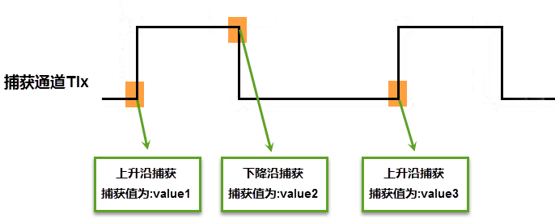

GPT—通用定时器
--------------

本章参考资料：《IMXRT1050RM》（参考手册）。

学习本章时，配合《IMXRT1050RM》第33章General Purpose
Timer一起阅读，效果会更佳，特别是涉及到寄存器说明的部分。

特别说明，本书内容是以RT1050系列控制器资源讲解。

通用定时器（GPT）简介
~~~~~~~~~~~~~~~~~~~~~

GPT是General Purpose Timer的缩写，直译为通用定时器，相比PIT周期中断定时器，GPT定时器除了能够产生周期中断外，还能够实现输入捕获、输出比较功能。RT1052共有两个GPT定时器模块。每个GPT定时器
拥有1个计数寄存器3个比较寄存器和2个捕获寄存器，即每个GPT定时器能够同时提供3个输出比较和2个输入捕获。下面简要讲解GPT定时器的各个功能：

-  定时功能，定时器最基本的功能就是定时了，每个GPT定时器拥有3个比较寄存器，可用于实现定时功能。并且GPT拥有一个多达12位的时钟分频寄存器，通过设置不同的分频可以灵活的控制定时范围。

-  输出比较功能，GPT定时器的输出比较可以配置为不同的工作模式，严格说定时功能是输出比较其中一种工作模式。输出比较可以将比较事件通过外部输出引脚传输到芯片外部。

-  输入捕获，GPT定时器拥有两个输入捕获寄存器，当检测到有效边沿时自动将定时器的计数值加载到捕获寄存器。输入捕获常用于检测脉冲长度或者统计脉冲个数。

如果对输出比较和输入捕获不了解，可以接着往下看，在讲解GPT定时器具体功能时会详细讲解。

通用定时器功能框图
~~~~~~~~~~~~~~~~~~

GPT时器的功能框图包含了GPT定时器最核心内容，掌握了功能框图，GPT定时器就有一个整体的把握，在编程时思路就非常清晰，见图
31‑1。

首先我们大致了解一下功能框图里面有什么，然后具体讲解各个功能模块。图片左右两边的灰色小方块代表外部引脚，其中以GPT_CAP开头的代表外部输入引脚，以GPT_COM开头的代表外输出引脚。图片的中间是一列32位数据寄存器，从方框内的注释不难看出从上到下依次为计数寄存器（GPTx_CNT）、两个输入捕获寄存器（GPTx_ICRn）n取1到2、三个输出比较寄存器（GPTx_OCRn）n取1到3。

黄色高亮部分代表一些状态标志位或者模式设置位。以IE结尾的代表中断使能位，不难看出每个GPT定时器拥有6个中断使能位，分别为一个溢出中断、2个捕获事件中断，3个比较事件中断,去掉结尾IE字母则是与之对应的标志位。OM开头的代表输出模式设置位(GPTx_CR[OM])，IM开头代表输入捕获模式控制位(GPTx_CR[IM])。FRR代表定时器工作模式控制位。

图 31‑1 通用定时器功能框图

①和，GPT外部输入与输出引脚
^^^^^^^^^^^^^^^^^^^^^^^^^^^^^^^^^^

GPT定时器可用作输入捕获和输出比较，每个GPT又有两个输入捕获引脚和三个输出比较引脚。每个GPT拥有一个时钟输入引脚(GPT_CLK)用于连接外部时钟源，讲解GPT时钟源时将会详细介绍。

以GPT1为例外部输出引脚如表格
31‑1所示，其他GPT请参考《IMXRT1050RM》（参考手册）《External Signals and
Pin Multiplexing》章节。

表格 31‑1GPT1引脚定义

+---------------+--------------+
| GPT信号       | 对应的引脚号 |
+===============+==============+
| GPT1_CLK      | GPT1_CLK     |
+---------------+--------------+
| GPT1_CAPTURE1 | GPIO_EMC_24  |
+---------------+--------------+
| GPT1_CAPTURE2 | GPIO_EMC_23  |
+---------------+--------------+
| GPT1_COMPARE1 | GPIO_EMC_35  |
+---------------+--------------+
| GPT1_COMPARE2 | GPIO_EMC_36  |
+---------------+--------------+
| GPT1_COMPARE3 | GPIO_EMC_37  |
+---------------+--------------+

②时钟源
^^^^^^^^^^^^^^^^^

GPT定时器有多个可选的时钟源如图
31‑2所示，通过配置时钟选择寄存器GPTx_CR[CLKSRC]选择需要的时钟源。

图 31‑2GPT计数时钟图

下面详细讲解各个时钟源的使用场合以及注意事项：

-  ipg_clk_highfreq，在正常工作模式下选择该时钟作为GPT定时器的计数时钟，该时钟能够提供较高的时钟频率，在输入捕获模式下能够提高输入捕获的精度。

-  ipg_clk_32k，在低功耗模式下选择该时钟作为为GPT定时器的计数时钟。

-  ipg_clk，ipg_clk与外部输入时钟（GPT_CLK）联系紧密，在正常工作模式下，如果开启了GPT_CLK时钟ipg_clk也将会开启，并且在GPT模块内部实现两个时钟的同步如图
   31‑3标识②所示。ipg_clk时钟也可以单独开启。

-  GPT_CLK，外部输入时钟来源于外部输入引脚，外部输入时钟与ipg_clk是异步的，通过Sync模块实现与ipg_clk时钟同步。为了能够实现时钟的同步，外部输入时钟必须小于ipg_clk/4。

-  ipg_clk_24M，该时钟用于矫正ipg_clk，保证系统时钟的精度。ipg_clk_24M时钟经过分频如31‑4标识①所示，确保ipg_clk_24M时钟频率小于系统总线时钟（ahb_ckl）的一半。通过同步模块（如图
   31‑5标识②所示），实现与系统总线时钟（ahb_ckl）同步。其分频系数通过GPTx_PR[PRESCALER24M]寄存器设定。

③时钟分频
^^^^^^^^^^^^^^^^^

选择好时钟源之后，还可以通过GPT定时器的时钟分频寄存器GPTx_PR[PRESCALER]对时钟进一步分频。以获得更低的时钟频率和更高的时钟精度，该寄存器是12位寄存器，最高能实现4096分频。

④GPT计数寄存器
^^^^^^^^^^^^^^^^^

GPT计数寄存器GPT_CNT是32位上计数寄存器，该寄存器是只读的，而且在计数过程中对该寄存器的读操作不会影响计数。当计数溢出时产生溢出事件，并且计数值自动清零，如果使能了中断则会产生中断。

⑤GPT输入捕获寄存器
^^^^^^^^^^^^^^^^^^^^^^^^^^^^^^^^^^

每个GPT定时器拥有两个输入捕获通道，每个输入捕获通道拥有各自的输入捕获寄存器GPT_ICRn(n取1到2)和外部输入引脚，当发生捕获事件后，GPT计数寄存器GPT_CNT的值会被立即加载到对应的捕获寄存器（GPT_ICRn）中。如果下次捕获事件发生前该寄存器的值没有被读取则会发生数据的覆盖。

⑥输入捕获通道
^^^^^^^^^^^^^^^^^

每个外部输入通道对应一个外部输入引脚，当使用输入捕获时引脚要被设置为输入模式。根据捕获事件，选择上拉还是下拉模式。IM2用于设置输入捕获通道的输入模式，对应于GPTx_CR[IM2]寄存，我们可选的输入模式有上升沿触发捕获、下降沿触发捕获、上升或下降沿触发捕获、禁止触发。如果使能了外部触发输入模式，则当检测到相应的边缘后会设置相应的事件标志位IF2，如果使能了中断则会产生捕获中断。

⑦GPT中断控制
^^^^^^^^^^^^^^^^^

每个GPT定时器拥有6个中断源，其中2个输入捕获中断，3个输出比较中断，还有一个溢出中断。这些中断共享一个中断线，即使用同一个中断服务函数，我们通过中断标志寄存器(GPTx_SR)确定是哪一个中断。

⑧输出比较寄存器
^^^^^^^^^^^^^^^^^

每个GPT定时器拥有3个输出比较通道，每个输出比较通道拥有各自的输出比较寄存器(GPTx_OCRn)n取1到3，和外部输出引脚。但是三个输出比较通道共用一个计数寄存器(GPTx_CR)。

当计数寄存器(GPTx_CR)的计数值与输出比较寄存器(GPTx_OCRn)的值相同时，就设置比较事件标志，如果使能了中断则会产生中断。

⑨输出比较通道
^^^^^^^^^^^^^^^^^

当使用输出比较时对应的外部输出引脚要设置成输出模式。每个GPT定时器拥有3个输出比较通道，每个通道可以单独配置工作模式。GPTx_CR寄存器的OM1~OM3位分别用于设置输出比较通道1到3。以通道3的设置为例，如：

+------------------+--------------------------------------------------------+
| 寄存器值         | 发生比较事件时外部引脚执行的动作                       |
+==================+========================================================+
| GPTx_CR[OM3] = 0 | -                                                      |
+------------------+--------------------------------------------------------+
| GPTx_CR[OM3] = 1 | 翻转外部输出引脚的电平状态                             |
+------------------+--------------------------------------------------------+
| GPTx_CR[OM3] = 2 | 外部输出引脚输出低电平                                 |
+------------------+--------------------------------------------------------+
| GPTx_CR[OM3] = 3 | 外部输出引脚输出高电平                                 |
+------------------+--------------------------------------------------------+
| GPTx_CR[OM3] >=4 | 外部输出引脚输出一个低脉冲，脉冲宽度为一个输出时钟宽度 |
+------------------+--------------------------------------------------------+

特别说明:
设置为0，表示不使用外部输出引脚，该模式一般用于实现基本的定时功能。

每个输出比较通道都可以产生中断请求，比较事件标志和比较中断使能控制是相互独立的，以通道3为例GPTx_SR
[FO3]是溢出中断标志位，溢出事件发生时自动设置该位，由软件清除该位。GPTx_IR[OF3IE]用于设置是否开启溢出中断。

工作模式寄存器
^^^^^^^^^^^^^^^^^

GPT定时器在输出比较模式时可以通过GPTx_CR[FRR]寄存器设置为复位模式或者自由运行模式，在复位模式下，发生比较事件后计数寄存器（GPT_CNT）的值自动清零，重新开始计数。在使用GPT定时器实现定时功能时，定时器工作在该模式。在自由运行模式下，发生比较事件后计数寄存器（GPT_CNT）不清零，而是接着执行，直到计时溢出才自动清零。

通用定时器功能及配置过程讲解
~~~~~~~~~~~~~~~~~~~~~~~~~~~~

GPT定时器主要提供三种功能，分别为计时功能、输出比较功能、输入捕获功能。下面具体讲解这三个功能的用途和具体的配置过程.。

定时功能
^^^^^^^^^^^^^^^^^

定时器(Timer)最基本的功能就是定时了，比如定时发送USART数据、定时采集AD数据等等。定时器工作在定时模式时每一个时钟周期计数寄存器（GPT_CNT）的值自动加一，当计数寄存器（GPT_CN）的值达到我们的设定值后就会产生一个相应的事件，通知系统计时结束。

GPT定时器是通过输出比较功能实现的。具体配置过程如下:

-  使能GPT定时器使用到的时钟源

-  配置GPTx_CR[CLKSRC]寄存器，选择GPT定时器的时钟源

-  配置GPTx_CR[FRR]寄存器，设置GPT工作在复位模式

-  配置GPTx_CR[OMn]（n取1到3）寄存器，设置输出比较不使用外部输出引脚。

-  配置GPTx_PR[PRESCALER]寄存器设置时钟分频。

-  将GPT定时器的计数值写入对应的输出比较寄存器GPTx_OCRn（n取1到3）

-  配置GPTx_IR[OFnIE](n取1到3)寄存器，开启输出比较中断

-  使能相应中断

-  开启定时器

关于具体寄存器的配置我们了解即可，在这里讲解具体寄存器的配置主要目的是加深对GPT定时器工作过程的了解，能够更加灵活的使用GPT定时器。在实际项目中我们使用SDK库提供的函数和配置结构体能够很容易的完成GT定时器的配置工作。而且代码可读性强，不易出错。关于SDK库的配置我们将在具体的实验中讲解。

输出比较功能
^^^^^^^^^^^^^^^^^

在讲解GPT定时器的定时功能时我们说过，定时功能是借助输出比较功能实现的，可以理解为定时功能是输出比较的一种特殊形式，特殊在没有使用外部输出引脚。相比定时功能的配置，输出比较功能增加了外部输出引脚的配置和输出模式的配置。具体配置过程如下：

-  设置外部引脚的复用功能

-  设置引脚为输出模式，初始电平为高电平（电平状态根据实际需要决定，这里只是举例），并且设置不使用中断

-  使能GPT定时器使用到的时钟源

-  配置GPTx_CR[CLKSRC]寄存器，选择GPT定时器的时钟源

-  配置GPTx_CR[FRR]寄存器，设置GPT工作在复位模式

-  配置GPTx_CR[OMn]（n取1到3）寄存器，设置当发生输出比较事件时外部输出引脚的电平状态。

-  配置GPTx_PR[PRESCALER]寄存器设置时钟分频。

-  将GPT定时器的计数值写入对应的输出比较寄存器GPTx_OCRn（n取1到3）

-  配置GPTx_IR[OFnIE](n取1到3)寄存器，开启输出比较中断（是否开启中断根据实际需要而定）

-  使能相应中断

-  开启定时器

输入捕获模式
^^^^^^^^^^^^^^^^^

输入捕获涉及到捕获边缘和捕获值两个概念，捕获边缘即触发捕获事件的边缘分为上升沿和下降沿。捕获值即发生捕获事件是得到的定时器当前的计数值。

输入捕获一般应用在两个方面，一个方面测量脉宽，另一方面是测量频率，如图
31‑6.

图 31‑6脉宽/频率测量示意图

测量频率
''''''''''''''''''''''''''''''''''

当捕获通道上出现上升沿时，发生第一次捕获，计数器寄存器(GPTx_CNT)的值会被锁存到捕获寄存器(GPTx_ICRx)中，而且还会进入捕获中断，在中断服务程序中记录一次捕获（可以用一个标志变量来记录），并把捕获寄存器中的值读取到value1中。当出现第二次上升沿时，发生第二次捕获，计数器(GPTx_CNT)的值会再次被锁存到捕获寄存器(GPTx_ICRx)
中，并再次进入捕获中断，在捕获中断中，把捕获寄存器的值读取到value3中，并清除捕获记录标志。利用value3和value1的差值我们就可以算出信号的周期（频率）。

脉宽测量
''''''''''''''''''''''''''''''''''

当捕获通道TIx上出现上升沿时，发生第一次捕获，计数器(GPTx_ICRx)的值会被锁存到捕获寄存器(GPTx_ICRx)
中，而且还会进入捕获中断，在中断服务程序中记录一次捕获（可以用一个标志变量来记录），并把捕获寄存器中的值读取到value1中。然后把捕获边沿改变为下降沿捕获，目的是捕获后面的下降沿。当下降沿到来的时候，发生第二次捕获，计数器CNT的值会再次被锁存到捕获寄存器CCR中，并再次进入捕获中断，在捕获中断中，把捕获寄存器的值读取到value3中，并清除捕获记录标志。然后把捕获边沿设置为上升沿捕获。

在测量脉宽过程中需要来回的切换捕获边沿的极性，如果测量的脉宽时间比较长，定时器就会发生溢出，溢出的时候会产生更新中断，我们可以在中断里面对溢出进行记录处理。

输出比较的配置过程如下：

-  设置外部引脚的复用功能

-  设置引脚为输入模式，

-  使能GPT定时器使用到的时钟源

-  配置GPTx_CR[CLKSRC]寄存器，选择GPT定时器的时钟源

-  配置GPTx_CR[FRR]寄存器，设置GPT工作在自由运行模式

-  配置GPTx_CR[IM2]（n取1到2）寄存器，设置输入捕获的捕获边缘，上升沿、下降沿或者上升沿和下降沿。

-  配置GPTx_PR[PRESCALER]寄存器设置时钟分频。

-  将GPT定时器的计数值写入对应的输出比较寄存器GPTx_OCRn（n取1到3）

-  配置GPTx_IR[IFnIE](n取1到2)寄存器，输入捕获中断（是否开启中断根据实际需要而定）

-  使能相应中断

-  开启定时器

定时器初始化结构体详解
~~~~~~~~~~~~~~~~~~~~~~

SDK库对GPT定时器外设建立了一个初始化结构体gpt_config_t，该结构体成员用于设置定时器基本工作参数，并由GPT初始化配置函数GPT_Init调用，初始化结构体中设定的参数将会设置定时器相应的寄存器，达到配置定时器工作环境的目的。初始化结构体gpt_config_t实际配置的就是GPT控制寄存器GPTx_CR。

初始化结构体和初始化库函数配合使用是SDK库精髓所在，理解了初始化结构体每个成员意义基本上就可以对该外设运用自如了。

.. code-block:: c
   :name: 代码清单 31‑1GPT配置结构体（fls_gpt.h）
   :caption: 代码清单 31‑1GPT配置结构体（fls_gpt.h）
   :linenos:

   typedef struct _gpt_init_config {
      gpt_clock_source_t clockSource; /*GPT定时器的时钟源*/
      uint32_t divider;     /*时钟分频，选择的时钟源的时钟经过divider + 1
                                                分频后作为计数时钟*/
   
      bool enableFreeRun;  /*模式选择true: 自由运行模式（FreeRun）,
                                       false: 复位模式（Restart）*/
   
      bool enableRunInWait; /*使能GPT在等待模式下仍能够工作  */
      bool enableRunInStop; /*使能GPT在停止模式下扔能够工作  */
      bool enableRunInDoze; /*使能GPT在睡眠模式下扔能够工作  */
      bool enableRunInDbg;  /*使能GPT工作在debug模式*/
      bool enableMode;      /* true:当GPT定时器启动时计数值自动清零，
                           false: 当GPT定时器启动时计数值保持上次关闭时的计数值*/
   } gpt_config_t;

(1) clockSource：定时器时钟源选择，枚举类型gpt_clock_source_t定义了可选的时钟源。

(2) divider：时钟源经该预分频器才是定时器时钟，它设定GPTx_PR[PRESCALER]寄存器的值。可设置范围为1至4096。

(3) enableFreeRun：选择定时器的工作模式，当定时器用于输入捕获时只能选择自由运行模式，当定时器用于定时或者输出比较时可选复位模式和自由运行模式，自由运行模式是计数器的计数值达到设定值后计数寄存器的值不清零，直到溢出才清零。复位模式是指当计数器的计数值达到设定值后，计数器的计数值自动清零.。

(4) enableRunInWait：使能在等待模式下运行，true表示定时器在等待模式下继续运行，false表示在等待模式下计数器停止运行。

(5) enableRunInStop：使能在停止模式下运行，true表示定时器在停止模式下继续运行，false表示在停止模式下计数器停止运行。

(6) enableRunInDoze：使能在睡眠模式下运行，true表示定时器在睡眠模式下继续运行，false表示在睡眠模式下计数器停止运行。

(7) enableRunInDbg:使能定时器工作在debug模式。

(8) enableMode:GPT定时器模式设置。true当计数器启动之后计数器的计数值GPTx_CNT为0，计数器从0开始计数，false当计数器启动之后，计数器的为上次关闭时的计数值GPTx_CNT = x（上次关闭时GPTx_CNT的值），计数器从x开始计数。

不难看出该配置结构体实际是初始化了GPT控制寄存器(GPTx_CR)，我们只需要配置好GPT配置结构体gpt_config_t然后调用配置函数GPT_Init即可完成GPT定时器的基本配置工作而无需操作GPT控制寄存器(GPTx_CR)具体的某些位。

通用定时器定时实验
~~~~~~~~~~~~~~~~~~

我们使用基本定时器循环定时1s并使能定时器中断，每到1s就在定时器中断服务函数翻转RGB彩灯，使得最终效果RGB彩灯暗1s，亮1s，如此循环。

硬件设计
^^^^^^^^

基本定时器没有相关GPIO，这里我们只用定时器的定时功能，没有使用其他外部引脚，至于RGB彩灯硬件可参考GPIO章节。

软件设计
^^^^^^^^

这里只讲解核心的部分代码，有些变量的设置，头文件的包含等并没有涉及到，完整的代码请参考本章配套的工程。我们创建了两个文件：bsp_gpt.c和bsp_gpt.h文件用来存基本定时器驱动程序及相关宏定义，中断服务函数放在bsp_gpt.c文件中。

编程要点
''''''''

-  初始化系统时钟。

-  初始化RGB彩灯GPIO。

-  使能GPT定时器使用到的时钟源并设置时钟分频。

-  设置时钟源频率到定时器计数频率的时钟分频，即配置时钟分频GPTx_PR。

-  设置GPT定时器工作在复位模式。

-  设定计数值。

-  开始并使能输出比较中断。

-  编写中断服务函数。

软件分析
''''''''

宏定义
*****************

.. code-block:: c
   :name: 代码清单 31‑2GPT相关宏定义（bsp_gpt.h）
   :caption: 代码清单 31‑2GPT相关宏定义（bsp_gpt.h）
   :linenos:

   /**************************第一部分******************************/
   /* 选择外部时钟源 */
   #define EXAMPLE_GPT_CLOCK_SOURCE_SELECT (0U)
   /* 时钟源的时钟分频 */
   #define EXAMPLE_GPT_CLOCK_DIVIDER_SELECT (0U)
   
   /****************************第二部分**************************/
   /*GPT 时钟分频(1-4096)*/
   #define GPT_DIVIDER 100
   
   /*****************************第三部分***************************/
   /* 得到GPT定时器的计数频率*/
   #define EXAMPLE_GPT_CLK_FREQ ( (CLOCK_GetFreq(kCLOCK_IpgClk) /      \
                     (EXAMPLE_GPT_CLOCK_DIVIDER_SELECT + 1U))/GPT_DIVIDER )
   #define COUNGER_NUMBER  ((TIME_ms/1000.0)*EXAMPLE_GPT_CLK_FREQ)
   #define TIME_ms 1000
   
   /**************************第四部分*****************************/
   /*定义使用的GPT*/
   #define EXAMPLE_GPT GPT2
   
   /*中断号和中断服务函数宏定义*/
   #define GPT_IRQ_ID GPT2_IRQn
   #define EXAMPLE_GPT_IRQHandler GPT2_IRQHandler

-  第一部分，定义GPT定时器的时钟源和时钟分频。

-  第二部分，定义时钟分频寄存器的时钟分频。

-  第三部分，定义延时时间，并将时间转化为计数值。

1) 宏TIME_ms指定本次实验的定时时间，单位ms。

2) 宏EXAMPLE_GPT_CLK_FREQ用于获取GPT定时器的计数频率。获取频率使用到了CLOCK_GetFreq函数，在此处它读取kCLOCK_IpgClk的时钟频率，在本次实验中GPT定时器的时钟由kCLOCK_IpgClk分频得到。EXAMPLE_GPT_CLOCK_DIVIDER_SELECT指定由kCLOCK_IpgClk时钟到GPT定时器时钟的分频值，因为该分频值从0开始（设为0表示部分频）所以在计算时要加一。宏GPT_DIVIDER指定GPT分频寄存器的分频值。

3) 宏COUNGER_NUMBER用于指定计数个数，该宏根据GPT定时器的计数频率将单位为毫秒的定时时间转化为计数个数。因为设置定时时间的库函数使用的是定时器的计数个数而不是我们常用的毫秒、秒等。

-  第四部分，通过宏定义指定使用的GPT、中断号、中断服务函数。

配置GPT定时器
*****************

.. code-block:: c
   :name: 代码清单 31‑3配置GPT定时器（bsp_gpt.c）
   :caption: 代码清单 31‑3配置GPT定时器（bsp_gpt.c）
   :linenos:

   void GPT_Config(void)
   {
      gpt_config_t gptConfig;
      
      /******************************第一部分************************/
      /*设置GPT使用到的外部时钟*/
      CLOCK_SetMux(kCLOCK_PerclkMux, EXAMPLE_GPT_CLOCK_SOURCE_SELECT);
      CLOCK_SetDiv(kCLOCK_PerclkDiv, EXAMPLE_GPT_CLOCK_DIVIDER_SELECT);
      
      /***************************第二部分***************************/
      /*初始化GPT*/
      GPT_GetDefaultConfig(&gptConfig);
      gptConfig.enableFreeRun = false;
      GPT_Init(EXAMPLE_GPT, &gptConfig);
      
      /**************************第三部分***************************/
      /* 设置时钟分频 */
      GPT_SetClockDivider(EXAMPLE_GPT, GPT_DIVIDER);
      /* 设置GPT定时器的计数值*/
      GPT_SetOutputCompareValue(EXAMPLE_GPT, \
                  kGPT_OutputCompare_Channel1, (uint32_t)COUNGER_NUMBER);
   
      /*************************第四部分****************************/
      /* 开启GPT2定时器比较通道1的中断 */
      GPT_EnableInterrupts(EXAMPLE_GPT, kGPT_OutputCompare1InterruptEnable);
      /*设置中断优先级,*/
      set_IRQn_Priority(GPT_IRQ_ID,Group4_PreemptPriority_6,\
                                          Group4_SubPriority_0);
      /*使能中断*/
      EnableIRQ(GPT_IRQ_ID);
   
      /* 开启定时器 */
      GPT_StartTimer(EXAMPLE_GPT);
   }

-  第一部分，设置GPT定时器的时钟源。函数CLOCK_SetMux用于选择时钟源，本实验选择ipg_clk_highfreq。函数CLOCK_SetDiv用于设置时钟分频，本实验设置为0，即不分频。在第15章详细介绍了时钟源选择和时钟分频设置，这里不再赘述。

-  第二部分，初始化GPT，与其他外设初始化类似，首先定义初始化结构体gptConfig，之后调用函数GPT_GetDefaultConfig获得默认的配置参数，最终修改默认参数并调用函数GPT_Init完成GPT定时器的基本参数设置。

-  第三部分，设定定时时间。函数GPT_SetClockDivider用于设置GPT时钟分频寄存器的值。函数GPT_SetOutputCompareValue用于设置GPT定时器的计数值。计数值的设定是通过宏定义实现的，详细请参考代码清单31‑2。

-  第四部分，设置中断并开启定时器。本实验要使用到中断所以要开启中断。RT1052的外设开启中断的流程大致相同。首先调用GPT_EnableInterrupts函数，允许GPT输出中断请求，之后使用set_IRQn_Priority函数设置中断优先级，最后使用EnableIRQ函数开启中断。中断设置完成后调用GPT_StartTimer函数即可开启定时器。

中断服务函数
*****************

.. code-block:: c
   :name: 代码清单 31‑4 中断服务函数（bsp_gpt.c）
   :caption: 代码清单 31‑4 中断服务函数（bsp_gpt.c）
   :linenos:

   void EXAMPLE_GPT_IRQHandler(void)
   {
      /* 清除中断标志位.*/
      GPT_ClearStatusFlags(EXAMPLE_GPT, kGPT_OutputCompare1Flag);
      i++;
   
      if (i%2) {
            RGB_BLUE_LED_OFF;
      } else {
            RGB_BLUE_LED_ON;
      }
   }

进入中断服务函数后清除中断标志位，翻转RGB灯的状态即可。

main函数
*****************

.. code-block:: c
   :name: 代码清单 31‑5 main函数（main.c）
   :caption: 代码清单 31‑5 main函数（main.c）
   :linenos:

   int main(void)
   {
      /* 初始化内存保护单元 */
      BOARD_ConfigMPU();
      /* 初始化开发板引脚 */
      BOARD_InitPins();
      /* 初始化开发板时钟 */
      BOARD_BootClockRUN();
      /* 初始化调试串口 */
      BOARD_InitDebugConsole();
      /* 打印系统时钟 */
   
      PRINTF("\r\n");
      PRINTF("*****欢迎使用 野火i.MX RT1052 开发板*****\r\n");
      PRINTF("CPU:             %d Hz\r\n", CLOCK_GetFreq(kCLOCK_CpuClk));
      PRINTF("AHB:             %d Hz\r\n", CLOCK_GetFreq(kCLOCK_AhbClk));
      PRINTF("SEMC:            %d Hz\r\n", CLOCK_GetFreq(kCLOCK_SemcClk));
      PRINTF("SYSPLL:          %d Hz\r\n", CLOCK_GetFreq(kCLOCK_SysPllClk));
      PRINTF("SYSPLLPFD0:      %d Hz\r\n", CLOCK_GetFreq(kCLOCK_SysPllPfd0Clk));
      PRINTF("SYSPLLPFD1:      %d Hz\r\n", CLOCK_GetFreq(kCLOCK_SysPllPfd1Clk));
      PRINTF("SYSPLLPFD2:      %d Hz\r\n", CLOCK_GetFreq(kCLOCK_SysPllPfd2Clk));
      PRINTF("SYSPLLPFD3:      %d Hz\r\n", CLOCK_GetFreq(kCLOCK_SysPllPfd3Clk));
   
      PRINTF("实现GPT定时器控制RGB等闪烁\r\n");
   
      /* 初始化LED引脚 */
      LED_GPIO_Config();
   
      /*初始化并开启GPT定时器*/
      GPT_Config();
      while (1) 
      {
      }

在主函数中初始化了RGB灯和GPT定时器之后便进入了while(1)死循环。控制RGB灯的翻转在定时器中断服务函数中实现。

下载验证
^^^^^^^^

保证开发板相关硬件连接正确，把编译好的程序下载到开发板。开始RGB彩灯是暗的，等一会RGB彩灯变为蓝色，再等一会又暗了，如此反复。如果我们使用表钟与RGB彩灯闪烁对比，可以发现它是每1s改变一次RGB彩灯状态的。

通用定时器输入捕获实验
~~~~~~~~~~~~~~~~~~~~~~

我们使用GPT定时器输入捕获功能捕获核心板SW3按键的按下时间，当按键松开时通过串口输出到串口调试助手。

注意：按键对应的引脚与GPT定时器输入捕获引脚需要用杜邦线相连，按键对应开发板CH4排针的第48脚（CN4，48），本实验使用到的GPT定时器输入引脚对应CN4排针的25脚（CN4，25）。

硬件设计
^^^^^^^^

图 31‑4 按键原理图

由于按键按下和松开情况下不可避免的会产生抖动，所以在输入捕获实验中偶尔会出现按下按键没有松开但输出了捕获结果，而且捕获得到的时间很短。

软件设计
^^^^^^^^

这里只讲解核心的部分代码，有些变量的设置，头文件的包含等并没有涉及到，完整的代码请参考本章配套的工程。我们创建了两个文件：bsp_gpt.c和bsp_gpt.h文件用来存基本定时器驱动程序及相关宏定义，中断服务函数放在bsp_gpt.c文件中。

编程要点
''''''''

-  初始化系统时钟。

-  初始化外部输入引脚的复用功能

-  使能GPT定时器使用到的时钟源并设置时钟分频。

-  设置时钟源频率到定时器计数频率的时钟分频，即配置时钟分频GPTx_PR。

-  设置GPT定时器工作在自由运行模式。

-  设置输入捕获的捕获边缘，上升沿、下降沿或者上升沿和下降沿。

-  开始并使能输入捕获中断。

-  编写中断服务函数。

软件分析
''''''''

宏定义
*****************

.. code-block:: c
   :name: 代码清单 31‑6 GPT相关宏定义（bsp_gpt.h）
   :caption: 代码清单 31‑6 GPT相关宏定义（bsp_gpt.h）
   :linenos:

   /****************************第一部分********************************/
   /* 选择外部时钟源 */
   #define EXAMPLE_GPT_CLOCK_SOURCE_SELECT (0U)
   /*  时钟源的时钟分频 */
   #define EXAMPLE_GPT_CLOCK_DIVIDER_SELECT (0U)

   /*GPT 时钟分频(1-4096)*/
   #define GPT_DIVIDER 1

   /* 得到GPT定时器的计数频率*/
   #define EXAMPLE_GPT_CLK_FREQ ( (CLOCK_GetFreq(kCLOCK_IpgClk)\
         / (EXAMPLE_GPT_CLOCK_DIVIDER_SELECT + 1U))/GPT_DIVIDER )
   #define COUNGER_NUMBER  ((TIME_ms/1000.0)*EXAMPLE_GPT_CLK_FREQ)
   #define TIME_ms 1000

   /*定义使用的GPT*/
   #define EXAMPLE_GPT GPT2

   /*中断号和中断服务函数宏定义*/
   #define GPT_IRQ_ID GPT2_IRQn
   #define EXAMPLE_GPT_IRQHandler GPT2_IRQHandler

   /***********************第二部分**************************************/

   /*********************************************************
   * GPT GPIO端口、引脚号及IOMUXC复用宏定义
   *********************************************************/
   /*与W9825G6KH-6的CAS脚冲突*/
   #define GPT1_CAPTURE1_GPIO             GPIO4 
   #define GPT1_CAPTURE1_GPIO_PIN         (24U)
   #define GPT1_CAPTURE1_IOMUXC           IOMUXC_GPIO_EMC_24_GPT1_CAPTURE1

   /*与W9825G6KH-6的A10冲突*/
   #define GPT1_CAPTURE2_GPIO             GPIO4
   #define GPT1_CAPTURE2_GPIO_PIN         (23U)
   #define GPT1_CAPTURE2_IOMUXC           IOMUXC_GPIO_EMC_23_GPT1_CAPTURE2
   
   /*NAND Flash 的CE脚冲突（CN4,27）*/
   #define GPT2_CAPTURE1_GPIO             GPIO3 
   #define GPT2_CAPTURE1_GPIO_PIN         (27U)
   #define GPT2_CAPTURE1_IOMUXC           IOMUXC_GPIO_EMC_41_GPT2_CAPTURE1

   /* sw3, (CN4,48)*/
   /*NAND Flash 的R/B脚共用，外接有10K上拉电阻（CN4,25）*/
   #define GPT2_CAPTURE2_GPIO             GPIO3
   #define GPT2_CAPTURE2_GPIO_PIN         (26U)
   #define GPT2_CAPTURE2_IOMUXC           IOMUXC_GPIO_EMC_40_GPT2_CAPTURE2

   /***********************第三部分*********************************/
   // 定时器输入捕获用户自定义变量结构体声明
   typedef struct
   {   
   uint8_t   Capture_FinishFlag;   // 捕获结束标志位
   uint8_t   Capture_StartFlag;    // 捕获开始标志位
   uint32_t  Capture_CcrValue_1;   // 捕获寄存器的值
   uint32_t   Capture_CcrValue_2;  // 捕获寄存器的值
   uint16_t  Capture_Period;       // 定时器溢出次数 
   }GPT_ICUserValueTypeDef;

   /* GPT_COMPARE引脚使用的PAD配置 */
   #define GPT_COMPARE_PAD_CONFIG_DATA    (SRE_0_SLOW_SLEW_RATE| \
                                          DSE_6_R0_6| \
                                          SPEED_2_MEDIUM_100MHz| \
                                          ODE_0_OPEN_DRAIN_DISABLED| \
                                          PKE_1_PULL_KEEPER_ENABLED| \
                                          PUE_0_KEEPER_SELECTED| \
                                          PUS_2_100K_OHM_PULL_UP| \
                                          HYS_0_HYSTERESIS_DISABLED)

-  第一部分，与第31.5 小节通用定时器定时实验中宏定义相同，这里不再赘述

-  第二部分，定义外部输入引脚的引脚号和复用功能，我们在程序中使用这些宏方便代码的移植。

-  第三部分，定义捕获状态结构体GPT_ICUserValueTypeDef，用于保存捕获过程中的状态和捕获值。

1) Capture_FinishFlag，标记捕获是否完成，为1表示捕获完成并且还未被处理。

2) Capture_StartFlag，标记是否捕获到第一个边缘，输入捕获测量脉宽长度需要进行两次触发边缘不同的输入捕获，当捕获到第一个边缘后将该变量置1。

3) Capture_CcrValue_1，用于保存第一次捕获发生时得到的定时器的计数值。

4) Capture_CcrValue_2，用于保存第二次捕获发生时得到的定时器的计数值。

5) Capture_Period，用于记录溢出次数，每发生一次定时器溢出事件该值加一。

-  第四部分，定义输入捕获引脚的PAD属性。

配置GPT外部输入引脚
********************

.. code-block:: c
   :name: 代码清单 31‑7GPT外部输入引脚初始化（bsp_gpt.c）
   :caption: 代码清单 31‑7GPT外部输入引脚初始化（bsp_gpt.c）
   :linenos:

   void GPT_GPIO_Config(void)
   {
      /*定义GPIO引脚配置结构体*/
      gpio_pin_config_t gpt_config;
   
      IOMUXC_SetPinMux(IOMUXC_GPIO_EMC_40_GPT2_CAPTURE2, 0U);
      IOMUXC_SetPinConfig(IOMUXC_GPIO_EMC_40_GPT2_CAPTURE2,\
                           GPT_COMPARE_PAD_CONFIG_DATA);
   
      gpt_config.direction = kGPIO_DigitalInput; //输入模式
      //gpt_config.outputLogic =  0;                //默认高电平
      gpt_config.interruptMode = kGPIO_NoIntmode; //不使用中断
   
      /* 初始化 GPT COMPARE1 GPIO. */
      GPIO_PinInit(GPT2_CAPTURE2_GPIO, GPT2_CAPTURE2_GPIO_PIN, &gpt_config);
   }

GPT外部输入引脚的初始化包括设置引脚的复用功能，设置引脚的PAD属性，设置引脚的输入输出模式以及是否开启中断等。

配置GPT定时器
********************

.. code-block:: c
   :name: 代码清单 31‑8配置GPT定时器（bsp_gpt.c）
   :caption: 代码清单 31‑8配置GPT定时器（bsp_gpt.c）
   :linenos:

   void GPT_Config(void)
   {
      gpt_config_t gptConfig;
   
      /*初始化GPT引脚*/
      GPT_GPIO_Config();
   
      /*GPT的时钟设置*/
      CLOCK_SetMux(kCLOCK_PerclkMux, EXAMPLE_GPT_CLOCK_SOURCE_SELECT);
      CLOCK_SetDiv(kCLOCK_PerclkDiv, EXAMPLE_GPT_CLOCK_DIVIDER_SELECT);
   
      /*初始化GPT*/
      GPT_GetDefaultConfig(&gptConfig);
      GPT_Init(EXAMPLE_GPT, &gptConfig);
   
      /* 设置时钟分频 */
      GPT_SetClockDivider(EXAMPLE_GPT, GPT_DIVIDER);
   
      /*设置为输入模式*/
      GPT_SetInputOperationMode(EXAMPLE_GPT,kGPT_InputCapture_Channel2,\
                                 kGPT_InputOperation_FallEdge);
      /*使能输入捕获中断*/
      GPT_EnableInterrupts(EXAMPLE_GPT, kGPT_InputCapture2InterruptEnable);
      /*使能溢出中断*/
      GPT_EnableInterrupts(EXAMPLE_GPT,kGPT_RollOverFlagInterruptEnable);
   
      /*使能中断*/
      EnableIRQ(GPT_IRQ_ID);
   
      /* 开启定时器 */
      GPT_StartTimer(EXAMPLE_GPT);
   }

与第31.5小节通用定时器定时实验中配置类似，在这里我们设置GPT为输入捕获模式并且设置触发边缘，如代码第20带21行所示。因为我们需要在捕获中断中切换捕获边缘和读取捕获值，所以要开启输入捕获中断。为防止数据溢出造成捕获出错，还要开启溢出中断，记录溢出次数。

中断服务函数
********************

.. code-block:: c
   :name: 代码清单 31‑9定义输入捕获结构体变量（bsp_gpt.c）
   :caption: 代码清单 31‑9定义输入捕获结构体变量（bsp_gpt.c）
   :linenos:

   volatile GPT_ICUserValueTypeDef GPT_ICUserValueStructure = {0,0,0,0,0};

.. code-block:: c
   :name: 代码清单 31‑10 中断服务函数（bsp_gpt.c）
   :caption: 代码清单 31‑10 中断服务函数（bsp_gpt.c）
   :linenos:

   void EXAMPLE_GPT_IRQHandler(void)
   {
      
      /*****************************第一部分**************************/
      /*
      *当要被捕获的信号的周期大于定时器的最长定时时，定时器就会溢出，产生更新中断
      *这个时候我们需要把这个最长的定时周期加到捕获信号的时间里面去
      */ 
      if ( GPT_GetStatusFlags(EXAMPLE_GPT,kGPT_RollOverFlag) != false )               
      {  
         if ( GPT_ICUserValueStructure.Capture_StartFlag != 0 )
         {
            GPT_ICUserValueStructure.Capture_Period ++; 
         }
         GPT_ClearStatusFlags(EXAMPLE_GPT, kGPT_RollOverFlag);     
      }
      
      /*捕获中断*/ 
      if (GPT_GetStatusFlags(EXAMPLE_GPT,kGPT_InputCapture2Flag) != false)
      {
   /*********************************第二部分*****************************/
      
         if(GPT_ICUserValueStructure.Capture_FinishFlag != 1)
         {
            /*第一次捕获*/ 
            if ( GPT_ICUserValueStructure.Capture_StartFlag == 0 )
            {
            /*清除溢出次数*/
            GPT_ICUserValueStructure.Capture_Period = 0;
            
            /*读取当前计数值*/ 
            GPT_ICUserValueStructure.Capture_CcrValue_1 =\
            GPT_GetInputCaptureValue(EXAMPLE_GPT,kGPT_InputCapture_Channel2);
            /*当第一次捕获到上升沿之后，就把捕获边沿配置为上升沿*/ 
            GPT_SetInputOperationMode(EXAMPLE_GPT,\
               kGPT_InputCapture_Channel2,kGPT_InputOperation_RiseEdge);
            /*开始捕获标志置1*/      
            GPT_ICUserValueStructure.Capture_StartFlag = 1;     
            }
   /*************************第三部分***************************************/
            /*上升沿捕获中断,第二次捕获*/ 
            else 
            {
            /*获取捕获比较寄存器的值，这个值就是捕获到的高电平的时间的值*/ 
            GPT_ICUserValueStructure.Capture_CcrValue_2 =\
   GPT_GetInputCaptureValue(EXAMPLE_GPT,kGPT_InputCapture_Channel2);   
   
      /*当第二次捕获到上升沿之后，就把捕获边沿配置为下降沿，好开启新的一轮捕获*/ 
            GPT_SetInputOperationMode(EXAMPLE_GPT,\
               kGPT_InputCapture_Channel2,kGPT_InputOperation_FallEdge);
            /*开始捕获标志清0*/    
            GPT_ICUserValueStructure.Capture_StartFlag = 0;
            /*捕获完成标志置1  */    
            GPT_ICUserValueStructure.Capture_FinishFlag = 1;    
            }
         }
   
         GPT_ClearStatusFlags(EXAMPLE_GPT, kGPT_InputCapture2Flag);
      }      
      
   }

在中断服务函数中完成数据的读取和状态的标记，自定义的结构体GPT_ICUserValueTypeDef用于记录捕获得到的数据和当前状态状态。
该部分代码包含中断嵌套嵌套关系如

图 31‑8输入捕获代码结构

图中标号1、2、3分别对应到代码清单 31‑10第一、二、三部分代码。

进入中断服务函数之后，首先判断是否为溢出中断，如果是，则判断捕获开始标志（GPT_ICUserValueStructure.Capture_StartFlag）是否已经开始捕获，如果是则将溢出次数加一。之后清除溢出中断标志位。

接着判断是否为输入捕获中断。如果是，则判断捕获完成标志（GPT_ICUserValueStructure.Capture_FinishFlag）是否为1，如果为1则代表上一次捕获还没被处理，这时直接清除输入捕获中断标记，退出中断服务函数。如果捕获完成标记未被设置则判断捕获开始标志位（GPT_ICUserValueStructure.Capture_StartFlag）是否为0，如果为0，代表这是第一次捕获，此时清除溢出中断次数、记录当前定时器的计数值、根据设计翻转输入捕获的触发边缘、设置开始捕获标志位1。否则表示是第二次捕获，此时需要获取第二次捕获得到的计数器的值、翻转输入捕获的触发边缘、清除开始捕获标志、设置捕获完成标志。最后在退出中断服务函数之前清除中断标志位。

main函数
********************

.. code-block:: c
   :name: 代码清单 31‑11 main函数（main.c）
   :caption: 代码清单 31‑11 main函数（main.c）
   :linenos:

   int main(void)
   {
      uint64_t timer = 0;
      /* 初始化内存保护单元 */
      BOARD_ConfigMPU();
      /* 初始化开发板引脚 */
      BOARD_InitPins();
      /* 初始化开发板时钟 */
      BOARD_BootClockRUN();
      /* 初始化调试串口 */
      BOARD_InitDebugConsole();
      /* 打印系统时钟 */
   
      PRINTF("\r\n");
      PRINTF("*****欢迎使用 野火i.MX RT1052 开发板*****\r\n");
      PRINTF("CPU:             %d Hz\r\n", CLOCK_GetFreq(kCLOCK_CpuClk));
      PRINTF("AHB:             %d Hz\r\n", CLOCK_GetFreq(kCLOCK_AhbClk));
      PRINTF("SEMC:            %d Hz\r\n", CLOCK_GetFreq(kCLOCK_SemcClk));
      PRINTF("SYSPLL:          %d Hz\r\n", CLOCK_GetFreq(kCLOCK_SysPllClk));
      PRINTF("SYSPLLPFD0:  %d Hz\r\n", CLOCK_GetFreq(kCLOCK_SysPllPfd0Clk));
      PRINTF("SYSPLLPFD1:  %d Hz\r\n", CLOCK_GetFreq(kCLOCK_SysPllPfd1Clk));
      PRINTF("SYSPLLPFD2:  %d Hz\r\n", CLOCK_GetFreq(kCLOCK_SysPllPfd2Clk));
      PRINTF("SYSPLLPFD3:  %d Hz\r\n", CLOCK_GetFreq(kCLOCK_SysPllPfd3Clk));
   
      PRINTF("GPT定时器输入捕获实验\r\n");
   
      /* 初始化LED引脚 */
      LED_GPIO_Config();
   
      /*初始化并开启GPT定时器*/
      GPT_Config();
      while (1) {
            if (GPT_ICUserValueStructure.Capture_FinishFlag) {
   
               /*得到计数值，timer 为64位数据，32位很可能会溢出*/
               timer = GPT_ICUserValueStructure.Capture_Period * 0xffffffff;
               timer += GPT_ICUserValueStructure.Capture_CcrValue_2;
               timer -= GPT_ICUserValueStructure.Capture_CcrValue_1;
   
               /*将计数值转化为时间，单位（ms）*/
               timer = timer / ((EXAMPLE_GPT_CLK_FREQ)/1000);
   
               PRINTF("the result is: %lld ms \r\n",timer);
               GPT_ICUserValueStructure.Capture_FinishFlag = 0;
            }
      }
   }

在主函数中初始GPT定时器之后，在while（1）中循环检测是否捕获完成，当有捕获完成时通过计算将总的计数值保存到timer变量中（timer为64位无符号数据，32位数据很容易溢出）如36到38行所示。将计数值timer除以GPT定时器的计数频率即可得到按键按下时间，如代码第41行所示。最终将转换结果输出到串口调试助手，并清除捕获完成标志。

下载验证
^^^^^^^^

如果使用的是i.MX
RT1052-Mini底板，将按键SW3对应的引脚（CN4排针的48脚）与GPT输入捕获使用的引脚（CN4排针的25脚）使用导线连接。如果使用的是i.MX
RT1052-Pro底板，将将按键SW3对应的引脚（CN5排针的48脚）与GPT输入捕获使用的引脚（CN5排针的25脚）使用导线连接。

连接串口调试助手与开发板，按下核心板上的SW3按键松开之后串口调试助手将会显示这次按下的时间。
