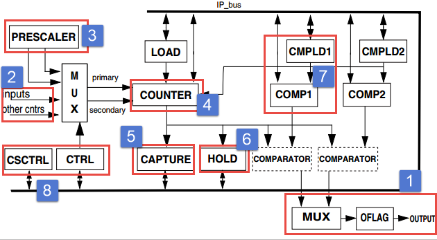
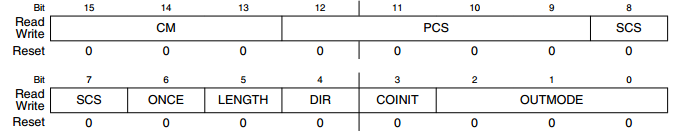
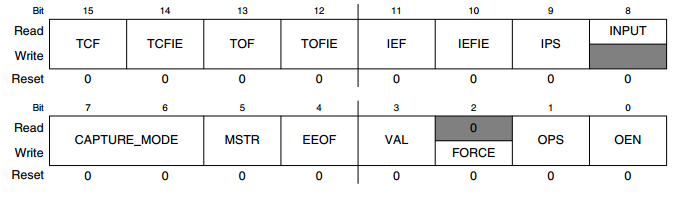
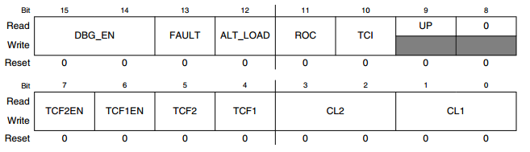

QTMR—四通道定时器
-----------------

本章参考资料：《IMXRT1050RM》（参考手册）。

学习本章时，配合《IMXRT1050RM》第46章Quad Timer
(TMR)一起阅读，效果会更佳，特别是涉及到寄存器说明的部分。

特别说明，本书内容是以RT1050系列控制器资源讲解。

QTMR简介
~~~~~~~~

与PIT(周期中断定时器)和GPT(通用定时器)相比QTMR定时器（Quad
Timer）功能更强大。第一，RT1052拥有4个片上QTMR定时器模块，每个QTMR定时器模块包含四个通道，每个通道都可以单独作为一个定时器使用，每个通道都可触发中断可产生DMA请求。QTMR最多提供16个定时器。第二，QTMR模块的每个通道可以配置为多种工作模式。下面是这些工作模式的简单介绍。

-  计数模式（Count Mode），在计数模式下计数器将计算所选时钟源的上升边缘的个数。如果选择内部时钟源，一般用于实现基本的定时功能。如果选择外部时钟源则一般用于统计脉冲个数，比如统计传送带上通过传感器器件的个数。

-  边缘计数模式（Edge-Count Mode），该模式下使用外部引脚输入作为时钟源，计数器将在外部输入引脚的上升沿和下降沿计数。使用光栅编码器采集电机转动角度一般使用这种方式。

-  门控计数模式（Gated-Count Mode），在该模式下定时器受辅助计数源（Secondary Count
   Source）控制，只有当辅助计数源的信号为设定的电平时定时器才计数，否则暂停计数（计数值不清零）。比如软件配置为低电平计数，则只有当辅助计数源为低电平时定时器才计数，为高电平时定时器暂停计数。

-  正交编码模式（Quadrature-Count Mode），正交编码模式用于获得编码器转动角度，编码器的PHASEA和PHASEB分别连接到定时器的主计数源（primary
   count source）和辅助计数源。

-  带索引输入的正交编码模式（Quadrature-Count Mode with Index Input），带索引输入的正交编码模式是正交编码模式的升级，该模式增加了一个外部输入，这个外部输入信号用于复位计数器的计数值。

-  矢量计数模式（Signed-Count Mode），主计数源用于驱动计数，辅助计数源用于控制计数方向（向下计数或者向上计数）。

-  触发计数模式1（Triggered-Count Mode 1），与门控计数模式相似，定时器受辅助计数源的控制，只有当检测到辅助计数源有效边缘时定时器才计数，当再次检测到设定的有效边缘停止，如此循环。当发生比较事件时定时器也会停止计数。

-  触发计数模式2（Triggered-Count Mode 2），与触发计数模式1不同之处在于当检测到辅助输入源有效边缘时计数器先清零再计数。

-  单次计数模式（One-Shot Mode），在该模式下，辅助计数源每产生一个触发脉冲，定时器启动一次计数，当计时结束（发生比较事件）定时停止，等待下一次触发。

-  定时器级联模式（Cascade-Count Mode），可以将多个定时器级联为位数更高的一个定时器，比如同一个QTMR模块的两个通道可以级联为一个32位定时器。

-  脉冲输出模式（Pulse-Output Mode），在脉冲输出模式下定时器外部输出引脚输出与定时器计数频率相同的脉冲，输出的脉冲的个数由比较寄存器指定。外部输出引脚连接步进电机驱动器可以用于控制步进电机转动角度。

-  固定频率PWM模式，QTMR定时器模块的每个通道都有一个外部输出引脚，在该模式下PWM的频率与计数器的计数时钟频率有关。

-  频率可变的PWM模式，与固定频率PWM模式相比，除了计数器计数时钟频率会改变PWM的频率，PWM占空比也会改变PWM的频率。

在这里我们只是简单的了解QTMR能够做什么，如果对上面的介绍不理解也没关系，我们首先掌握几种常用的功能，其他功能使用到时再查手册即可。本教程将会针对部分功能进行讲解。

QTMR定时器功能框图
~~~~~~~~~~~~~~~~~~

每个QTMR定时器模块拥有四个相同的通道，而每个通道拥有一个预分频寄存器、一个计数寄存器、一个计数器预装载寄存器、一个计数保持寄存器、一个捕获寄存、两个比较寄存器、两个比较寄存器预装载寄存器、两个状态与控制寄存器、以及一个控制寄存器。想要灵活的使用QTMR
定时器的各个功能就必须清楚各个寄存器之间的关系。这些寄存器之间的关系如图
32‑1。

图 32‑1 QTMR定时器功能框图

首先我们大致了解一下功能框图里面有什么，然后具体讲解各个功能模块。最外围的那条粗实线（标有IP_bus）为IP总线，用于读、写QTMR定时器寄存器，那些带有字母的矩形代表QTMR定时器的寄存器或者寄存器的某些位。箭头代表数据传输方向或者控制信号传输方向。图中的寄存器如果使用双向箭头与IP总线相连，表示IP总线可以读、写这些寄存。如果是单向箭头表示数据传输是单向的，例如图中LOAD寄存器与COUNTER寄存器之间使用单箭头连接，表示数据只能从LOAD寄存器加载到COUNTER寄存器。下面我们详细讲解各个模块的作用。

①外部输出引脚
^^^^^^^^^^^^^^^^^^^^^^^^^^^^

每个通道拥有一个输出，至少对应一个外部输出引脚。输出模式控制寄存器TMRx_CTRLn[OUTMODE]用于设置当比较事件发生时外部输出引脚的状态.。以QTMR1为例外部引脚定义如表格
32‑1所示，其他QTRM请参考《IMXRT1050RM》（参考手册）External Signals and
Pin Multiplexing章节。

注意：在 《IMXRT1050RM》（参考手册）External Signals and Pin
Multiplexing章节将四通道定时器(QTMR)写为QTIMER，在编程时不必纠结于这个差异，其实是相同的。

表格 32‑1QTMR1外部引脚

+----------------+------------+
| QTIMER1_TIMER0 | GPIO_B0_00 |
+================+============+
| QTIMER1_TIMER1 | GPIO_B0_01 |
+----------------+------------+
| QTIMER1_TIMER2 | GPIO_B0_02 |
+----------------+------------+
| QTIMER1_TIMER3 | GPIO_B1_08 |
+----------------+------------+

①计数时钟源
^^^^^^^^^^^^^^^^^^^^^^^^^^^^

QTMR定时器有两个时钟源可选，一个是主计数源（primary count
source），另外一个为辅助计数源（Secondary Count
Source）。在不同的工作模式下我们选择的时钟源不同。有些工作模式我们只使用主计数源，有些工作模式两个计数源要同时使用。

主计数源的时钟输入有三种选择，分别为QTMR定时器的外部输入引脚，定时器的输出，经过分频的IP总线时钟。辅助计数源的时钟输入只能选择QTMR定时器的外部输入引脚。

②时钟分频寄存器TMRx_CTRLn[PCS]
^^^^^^^^^^^^^^^^^^^^^^^^^^^^^^^^^^^^^^^^^^^^^^^^^^^^^^^^

定时器的时钟源经过分频之后作为定时器的计数时钟，分频值由MRx_CTRLn[PCS]寄存器设置，最高为128分频。

③QTMR计数寄存器TMRx_CTRLn
^^^^^^^^^^^^^^^^^^^^^^^^^^^^^^^^^^^^^^^^^^^^^^^^^^^^^^^^

QTMR计数寄存器TMRx_CTRLn是16位计数寄存器，该寄存器保存有相应通道当前的计数值。它的值可以直接修改，也可以通过计数器预装载寄存器（TMRx_LOADn）进行修改。比较事件发生后计数器预装载寄存器（TMRx_LOADn）的值会被自动的加载到计数寄存器（TMRx_CTRLn）。

④QTMR输入捕获寄存器 TMRx_CTRLn
^^^^^^^^^^^^^^^^^^^^^^^^^^^^^^^^^^^^^^^^^^^^^^^^^^^^^^^^

QTMR定时器模块的定时器通道可以配置为输入捕获模式，当发生捕获事件后，QTMR计数寄存器（TMRx_CTRLn）的值会被立即加载到对应的捕获寄存器（TMRx_CTRLn）中。如果下次捕获事件发生前该寄存器的值没有被读取，那么旧数据会被直接覆盖。

⑤QTMR通道保持寄存器TMRx_HOLDn
^^^^^^^^^^^^^^^^^^^^^^^^^^^^^^^^^^^^^^^^^^^^^^^^^^^^^^^^

QTMR有一个特殊功能，当我们读取任何一个通道的计数寄存器时其他通道的计数计数寄存器的值也会自动加载到各自的通道保持寄存器中。该功能的用途使用到时会详细介绍。

⑥比较寄存器(TMRx_COMP1n)
^^^^^^^^^^^^^^^^^^^^^^^^^^^^^^^^^^^^^^^^^^^^^^^^^^^^^^^^

每个定时器通道拥有两个比较寄存器(TMRx_COMP1n和TMRx_COMP2n)。在上计数模式下使用比较寄存器1(TMRx_COMP1n)，在下计数模式下使用比较寄存器2
(TMRx_COMP2n)
。如果定时器工作在频率可变的PWM模式，比较寄存器1和2分别用于设置高电平计数值和低电平计数值。

每个比较寄存器对应一个比较寄存器预装载寄存器（TMRx_CMPLD1n），该寄存器的作用是当发生比较事件时将该寄存器的值自动加载到比较寄存器比较寄存器(TMRx_COMP1n)。从图上箭头指示不难看出我们也可以直接修改比较寄存器的值，如果真的需要这么做我们一定要小心，因为发生比较事件的条件是比较寄存器（TMRx_COMP1n）的值等于计数寄存器（TMRx_CTRLn）的值，而不是大于或者小于。如果直接修改导致比较寄存器预装载寄存器（TMRx_CMPLD1n）的值小于计数寄存器的值则会丢失一个比较事件，而且直到定时器溢出计数寄存器的值才会被清零。

⑦QTMR输出信号
^^^^^^^^^^^^^^^^^^^^^^^^^^^^

输出模式控制寄存器TMRx_CTRLn[OUTMODE]用于设置当比较事件发生时外部输出引脚的状态。

⑧控制和状态寄存器
^^^^^^^^^^^^^^^^^^^^^^^^^^^^

QTMR定时器模块的每个通道拥有两个状态与控制寄存器、以及一个控制寄存器。这三个寄存器是QTMR定时器的核心，我们在配置QTMR定时器工作模式时会经常用到，下面详细介绍这三个寄存器。

控制寄存器TMRx_CTRLn
''''''''''''''''''''''''''''''''''

控制寄存器TMRx_CTRLn的说明见图 32‑2。

图 32‑2 QTMR控制寄存器TMRx_CTRLn

-  OUTMODE，定义外部输出引脚的输出模式

-  COINIT，当同一个QTMR定时器模块的其他通道发生比较事件时，是否允许该通道被强制复位。

-  DIR，设置计数方向，即选择递减计数还是递增计数。当定时器设置为向上计数（DIR=
   0），计数器寄存器计数寄存器（TMRx_CTRLn）的值与比较寄存器1
   (TMRx_COMP1n)的值相等时发生比较事件。如果定时器设置为向下计数（DIR=
   1），计数器寄存器计数寄存器（TMRx_CTRLn）的值与比较寄存器2
   (TMRx_COMP2n)的值相等时发生比比较事件。

-  LENGTH，计数长度，LENGTH = 0 计数器将会从0开始计数直到溢出（0xffff）溢出后计数器寄存器自动清零，并重新开始计数，比较事件不能使计数寄存器清零。LENGTH = 1 定时器发生比较事件后计数器自动清零，并重新开始计数。

..

   如果CTRL[CM]=001比较寄存器1和2交替作为比较值，例如定时器向上计数当计数寄存器与比较寄存器1的值相等时发生比较事件，计数寄存器的值被清零重新计数，当计数寄存器的值与比较寄存器2（此时比较寄存器1的值无效）的值相等时发生比较事件，计数器清零，之后再切换到比较寄存器1循环往复。

-  ONCE，是否选择连续计数，ONCE= 0循环计数。ONCE=1单次计数，当定时器设置为向上计数（DIR= 0），计数器寄存器计数寄存器（TMRx_CTRLn）的值与比较寄存器1(TMRx_COMP1n)的值相等时发生比比较事件，计数器停止计数。如果定时器设置为向下计数（DIR= 1），计数器寄存器计数寄存器（TMRx_CTRLn）的值与比较寄存器2(TMRx_COMP2n)的值相等时发生比较事件，计数器停止计数。如果CTRL[CM]=001比较寄存器1和2交替作为比较值，只有发生第二次比较事件时定时器才停止。

-  SCS，辅助计数源（Secondary Count Source）输入引脚选择

-  PCS，主计数源（Secondary Count Source）时钟源选择，如果选择分频后的IP总线时钟作为计数时钟源，该位还用于设置分频值，该值越大分频越高，最高可配置为128分频。

-  CM，QTMR定时器工作模式寄存器。

QTMR状态和控制寄存器
''''''''''''''''''''''''''''''''''

QTMR状态和控制寄存器(TMRx_SCTRLn)说明见图 32‑3。

图 32‑3 QTMR状态和控制寄存器TMRx_SCTRLn

-  OEN， 输出使能，OEN=1表示使能外部输出引脚。OEN=0表示外部引脚作为输入

-  OPS，设置输出极性，通过该位可以修改默认的引脚输出极性。一般保持默认即可

-  VAL与FORCE，强制设置外部输出引脚极性，即外部引脚的电平。VAL位用于指定外部输出引脚的电平，FORCE用于强制将VAL指定电平输出到外部输出引脚。写入之前必须确保计数器已经关闭。

-  EEOF，决定是否允许同一个QTMR定时器模块的其他通道强制设置该通道的外部输出引脚的状态。

-  MSTR，是否开启主模式，在主模式下可以通过发送广播信号通知相同QTMR定时器模块下的其他通道复位当前计数值或者强制设置其他通道的外部输出引脚状态。

-  CAPTURE\_ MODE，用于设置辅助输入源的捕获边缘，

-  INPUT，外部输入引脚状态

-  IPS，设置辅助输入源的输入极性。用于翻转辅助输入源的输入极性。

-  IEFIE，使能边缘捕获中断，不能同时开启DMA功能。

-  IEF，输入边缘标志位，当外部输入引脚检测到有效边缘时设置该位。如果开启了中断（IEFIE=1）则会产生捕获中断。

-  TOFIE，溢出中断使能位。

-  TOF，溢出中断标志位。

-  TCFIE，比较中断使能位。

-  TCF，比较中断标志位。

QTMR定时器模块通道状态和控制寄存器
''''''''''''''''''''''''''''''''''

QTMR定时器模块通道状态和控制寄存器(TMRx_CSCTRLn)说明见图 32‑4。

图 32‑4定时器通道状态和控制寄存器

-  CL1和CL2，用于设置是否使用比较寄存器预装载寄存器，以及使用哪个预装载寄存器

-  TCF1，定时器比较1中断标志，

-  TCF2，定时器比较2中断标志

-  TCF1EN，使能比较1的比较中断

-  TCF2EN，是能比较2的比较中断

-  UP，只读，保存最后一次计数的计数方向。

-  TCL，该位在触发计数模式中使用(CTRL[CM] = 110)

-  ROC，当发生捕获事件时是否将计数器预加载寄存器的值加载到计数寄存器中。

-  ALT_LOAD，在通常情况下计数寄存器只能从计数器预加载寄存器中加载计数值，该位用于设置是否允许计数寄存器从比较寄存器预装载寄存器2（TMRx_CMPLD2n）中加载计数值。

-  FAULT，故障信号，是否将辅助输入信号作为故障信号。

-  DBG_EN，是否使能DEBUG模式。

QTMR定时器功能框图实际描述了各个寄存器之间的关系，其中大多数为数据寄存器，控制寄存器只有三个。三个控制寄存器的控制功能非常复杂，我们很难也没必要记忆这些配置选项。我们只需要知道实现某个功能需要配置那些选项即可。借助SDK的库函数我们能够很容易的实现我们需要的功能。

QTMR定时器常用功能及配置过程讲解
~~~~~~~~~~~~~~~~~~~~~~~~~~~~~~~~

QTMR定时器功能非常丰富，在《IMXRT1050RM》第46章46.6.5 Functional
Modes小节介绍了多达13种功能，在这里我们只讲解几种常用的功能，有需要的同学可以查看例程学习。

定时功能
^^^^^^^^^^^^^^^^^^^^^^^^^^^^

QTMR定时器的配置选项非常多，但是我们只需要配置该功能用到的寄存器，其余的保持默认即可。

以QTMR3的通道0为例，下面是定时器功能的配置过程：

-  配置工作模式，设置TMRx_CTRLn[CM] = 001 表示在时钟的上升沿计数。

-  配置计数方向，配置TMRx_CTRLn[DIR] = 0配置为向上计数。

-  设置计数频率，配置时钟分频TMRx_CTRLn[PCS]，选择经过分频IP总线时钟作为计数时钟。可选范围为1到128.

-  设置比较寄存器TMRx_COMP1n的值，该值就是定时器的计数值，它和时钟分频共同决定了计数时间长度。

-  使能中断，

-  使能比较1中断，当定时器的计数值与比较寄存器TMRx_COMP1n的值相等时触发比较中断。

-  开启定时器。

PWM输出功能
^^^^^^^^^^^^^^^^^^^^^^^^^^^^

PWM输出就是对外输出脉宽（即占空比）可调的方波信号，在QTMR定时器中可以将定时器配置为两种PWM模式。在计数时钟频率确定的条件下，一种频率不可调，只能调节占空比。另外一种频率和调占空比都可调。本小节讲解第二种的配置方法，后面的PWM实验也是采用的第二种。

-  设置外部引脚的复用功能

-  设置引脚为输出模式，初始电平为高电平（电平状态根据实际需要决定，这里只是举例），并且设置不使用中断

-  配置工作模式，设置CTRL[CM]=001表示在时钟的上升沿计数。

-  设置计数长度，设置CTRL[LENGTH]=1表示当发生比较事件后计数寄存器的计数值自动清零，重新开始计数。

-  设置外部输出引脚的输出模式，CTRL[OUTMODE]=4，设置外部输出引脚为交替比较输出模式。

-  设置两个比较寄存器的比较值（TMRx_COMP1n和TMRx_COMP2n），pwm频率 =
   （TMRx_COMP1n + TMRx_COMP2n）/ 计数时钟频率。Pwm占空比 = TMRx_COMP1n
   / （TMRx_COMP1n +
   TMRx_COMP2n），本质上是TMRx_COMP1n比较寄存器的值决定高电平持续时间，TMRx_COMP2n决定低电平持续时间。

-  开启定时器。

定时器初始化结构体详解
~~~~~~~~~~~~~~~~~~~~~~

SDK库对QTMR定时器外设建立了一个初始化结构体qtmr_config_t，该结构体成员用于设置定时器基本工作参数，并由QTMR初始化配置函数QTMR_Init调用，初始化结构体中设定的参数将会设置定时器相应的寄存器，达到配置定时器工作环境的目的。

.. code-block:: c
   :name: 代码清单 32‑1QTMR定时器配置结构体(fsl_qtmr.h)
   :caption: 代码清单 32‑1QTMR定时器配置结构体(fsl_qtmr.h)
   :linenos:

   typedef struct _qtmr_config {
      qtmr_primary_count_source_t primarySource; /*指定主时钟源 */
      qtmr_input_source_t secondarySource;       /*指定输入源 */
      bool enableMasterMode;                     /*使能广播输出到其他定时器 */
      bool enableExternalForce;       /*使能其他定时器强制修改定时器外部引脚状态*/
      uint8_t faultFilterCount;                  /*输入滤波器样本计数 */
      uint8_t faultFilterPeriod;                 /*输入滤波器采样周期*/
      qtmr_debug_action_t debugMode;             /*工作在Debug模式 */
   } qtmr_config_t;

qtmr_config_t配置结构体的配置参数比较少，因为有些配置参数的设定是在具体功能初始化函数中完成的。各个参数讲解如下：

-  primarySource，时钟源的选择，枚举类型qtmr_primary_count_source_t定义了可选的时钟源如代码清单 32‑2。

.. code-block:: c
   :name: 代码清单 32‑2可选时钟源(fsl_qtmr.h)
   :caption: 代码清单 32‑2可选时钟源(fsl_qtmr.h)
   :linenos:

   typedef enum _qtmr_primary_count_source
   {
      kQTMR_ClockCounter0InputPin = 0, /* 使用计数器 0 的输入引脚 */
      kQTMR_ClockCounter1InputPin,     /*使用计数器 1 的输入引脚*/
      kQTMR_ClockCounter2InputPin,     /*使用计数器 2 的输入引脚 */
      kQTMR_ClockCounter3InputPin,     /*使用计数器 3 的输入引脚 */
      kQTMR_ClockCounter0Output,       /* 使用计数器0的输出 */
      kQTMR_ClockCounter1Output,       /*使用计数器1的输出*/
      kQTMR_ClockCounter2Output,       /*使用计数器2的输出*/
      kQTMR_ClockCounter3Output,       /*使用计数器3的输出*/
      kQTMR_ClockDivide_1,       /*IP bus 时钟的1分频 */
      kQTMR_ClockDivide_2,       /*IP bus 时钟的2分频 */
      kQTMR_ClockDivide_4,       /*IP bus 时钟的4分频 */
      kQTMR_ClockDivide_8,       /*IP bus 时钟的8分频*/
      kQTMR_ClockDivide_16,      /*IP bus 时钟的16分频*/
      kQTMR_ClockDivide_32,      /*IP bus 时钟的32分频*/
      kQTMR_ClockDivide_64,      /*IP bus 时钟的64分频 */
      kQTMR_ClockDivide_128      /*IP bus 时钟的128分频 */
   } qtmr_primary_count_source_t;

从代码清单32‑2可以看出，时钟源分为三类。第一类，QTMR模块的时钟输入引脚，每个QTMR模块拥有四个相对独立的通道，每个通道拥有一个时钟输入引脚（软件可设置），可为本通道或其他通道提供时钟。第二类，其他QTRM通道的时钟输出，每个QTMR定时器通道可以输出时钟，并且可作为其他通道的时钟源。第三类，分频后的IP总线时钟，在QTMR用于输出PWM或进行输入捕获时常用这类时钟。分频值的设定要根据需要设置，比如要使用输入捕获功能捕获较窄的脉冲时需要适当调小分频值，以满足精度要求。

-  secondarySource，指定输入源，当定时器工作在门控计数模式、触发计数模式1、矢量计数模式时，需要用到输入源，枚举类型qtmr_input_source_t定义了可用输入源如代码清单32‑3

.. code-block:: c
   :name: 代码清单 32‑3可用输入源(input sources）(fsl_qtmr.h)
   :caption: 代码清单 32‑3可用输入源(input sources）(fsl_qtmr.h)
   :linenos:

   typedef enum _qtmr_input_source
   {
      kQTMR_Counter0InputPin = 0, /*使用计数器 0 的输入引脚*/
      kQTMR_Counter1InputPin,     /*使用计数器 1 的输入引脚 */
      kQTMR_Counter2InputPin,     /*使用计数器 2 的输入引脚 */
      kQTMR_Counter3InputPin      /*使用计数器 3 的输入引脚 */
   } qtmr_input_source_

-  enableMasterMode，使能主模式，如果使能了主模式，该通道发生比较事件后可以发送广播信号给同一QTMR定时器模块的其他通道，这个广播信号可以复位其他通道的计数值。

-  enableExternalForce，与enableMasterMode配合使用，当enableMasterMode = 1时该位才有效。如果一个通道被设置为了主模式，则enableExternalForce=1表示主模式的广播信号可以强制修改其他通道引脚的电平状态。

-  debugMode，设置Debug工作模式，该参数用于设置在调试模式下QTMR定时器是如何工作的，SDK提供了四种选择，分别为正常运行（kQTMR_RunNormalInDebug）、停止计数（kQTMR_HaltCounter）、强制将外部输出引脚设置位低电平（kQTMR_ForceOutToZero）、停止计数并且将外部输出引脚设置位低电平（kQTMR_HaltCountForceOutZero）。我们一般选择在Debug模式下正常运行。

QTMR定时器定时实验
~~~~~~~~~~~~~~~~~~

我们使用QTMR3定时器模块的通道0实现1s的定时器，每到1s就在定时器中断服务函数翻转RGB彩灯，使得最终效果RGB彩灯暗1s，亮1s，如此循环。

硬件设计
^^^^^^^^

本实验没有使用到QTMR定时器的外部输出引脚，只用到了板载RGB灯。至于RGB彩灯硬件可参考GPIO章节。

软件设计
^^^^^^^^

这里只讲解核心的部分代码，有些变量的设置，头文件的包含等并没有涉及到，完整的代码请参考本章配套的工程。我们创建了两个文件：bsp_tmr.c和bsp_tmr.h文件用来存基本定时器驱动程序及相关宏定义，中断服务函数放在bsp_tmr.c文件中。

编程要点
''''''''

-  设置定时器时钟分频

-  获得定时器的计数时钟频率，并根据时钟频率设定计数值

-  使能定时器比较中断

-  编写中断服务函数。

软件分析
''''''''

宏定义
*****************

.. code-block:: c
   :name: 代码清单 32‑4 QTMR相关宏定义(bsp_tmr.h)
   :caption: 代码清单 32‑4 QTMR相关宏定义(bsp_tmr.h)
   :linenos:

   /*********************第一部分**********************************/
   /* 定义 TMR 定时器的通道和工作模式instance/channel used for board */
   #define BOARD_QTMR_BASEADDR TMR3
   #define BOARD_FIRST_QTMR_CHANNEL kQTMR_Channel_0
   #define BOARD_SECOND_QTMR_CHANNEL kQTMR_Channel_1
   #define QTMR_ClockCounterOutput kQTMR_ClockCounter0Output

   /**********************第二部分*****************************/
   /* 中断号和中断服务函数定义 */
   #define QTMR_IRQ_ID TMR3_IRQn
   #define QTMR_IRQ_HANDLER TMR3_IRQHandler

   /******************************第三部分*************************/
   /* 得到TMR定时器的时钟频率 */
   #define QTMR_SOURCE_CLOCK CLOCK_GetFreq(kCLOCK_IpgClk)
   /*定义定时时间（单位：ms）*
   *注意:
   TMR定时器的计数寄存器是16位，使用kCLOCK_IpgClk时钟，选择最大时钟分频（128分频）
   *最多实现63ms的定时。
   */
   #define TMR_TIMIER 50

-  第一部分，定义使用的TMR和通道号。

-  第二部分，定义本实验室使用的中断和终端服务函数。

-  第三部分，获取IP
   BUS时钟(IpgClk)，CLOCK_GetFreq函数在多个实验中都有涉及，用于读取时钟频率，宏QTMR_SOURCE_CLOCK保存的是IP
   BUS总线的时钟频率，定时器的计数频率还好除以分频值。宏TMR_TIMIER定义本次试验定时器的定时时间，单位为毫秒。QTMR定时器是16位计数器，而且IP总线时钟频率较高，经过计算在128分频（最大分频）的情况下最大计时长度约63ms，所以要考虑是否有溢出。

初始化QTMR定时器
*****************

.. code-block:: c
   :name: 代码清单 32‑5QTMR定时器初始化
   :caption: 代码清单 32‑5QTMR定时器初始化
   :linenos:

   void TMR_Init(void)
   {
      qtmr_config_t qtmrConfig; /*定义TMR 定时器初始化结构体*/
      
      /*******************************第一部分*******************************/
      /*初始化TMR 定时器*/
      QTMR_GetDefaultConfig(&qtmrConfig);
      qtmrConfig.primarySource = kQTMR_ClockDivide_128;
      QTMR_Init(BOARD_QTMR_BASEADDR, BOARD_SECOND_QTMR_CHANNEL, &qtmrConfig);
      
      /******************************第二部分*******************************/
      /*设置自动重装载值*/
      QTMR_SetTimerPeriod(BOARD_QTMR_BASEADDR, BOARD_SECOND_QTMR_CHANNEL,\
                  MSEC_TO_COUNT(TMR_TIMIER, (QTMR_SOURCE_CLOCK / 128)));
   
      /*****************************第三部分*******************************/
      /*使能比较中断*/
      QTMR_EnableInterrupts(BOARD_QTMR_BASEADDR, BOARD_SECOND_QTMR_CHANNEL,\
                                             kQTMR_CompareInterruptEnable);
      /*设置中断优先级,*/
      set_IRQn_Priority(QTMR_IRQ_ID,Group4_PreemptPriority_6,\
                                       Group4_SubPriority_0);
      /*使能中断*/
      EnableIRQ(QTMR_IRQ_ID);
   
      /*开启通道2的计时，在时钟的上升沿计数*/
      QTMR_StartTimer(BOARD_QTMR_BASEADDR, BOARD_SECOND_QTMR_CHANNEL, \
                                                   kQTMR_PriSrcRiseEdge);
   }

-  第一部分，同大多数外设的初始化步骤，调用函数QTMR_GetDefaultConfig获得默认配置，在默认配置基础上根据需要修改时钟分频，最后调用QTMR_Init（）函数完成初始化。本次实验设置位128分频。

-  第二部分，设置自动重装载值。函数QTMR_SetTimerPeriod用于设置自动重装载值，该函数共有三个参数，前两个分别用于指定使用的TMR定时器和通道。第三个参数是一个定义在fsl_common.h的宏，如代码清单 32‑6。

.. code-block:: c
   :name: 代码清单 32‑6宏定义MSEC_TO_COUNT
   :caption: 代码清单 32‑6宏定义MSEC_TO_COUNT
   :linenos:

   #define MSEC_TO_COUNT(ms, clockFreqInHz) \
                     (uint64_t)((uint64_t)ms * clockFreqInHz / 1000U

该宏的作用是根据计数频率将毫秒转化为计数值。宏TMR_TIMIER定义了本次实验延时毫秒数，宏QTMR_SOURCE_CLOCK指定IP总线的时钟频率。根据之前的设置，本实验选择128分频，所以定时器计数频率为QTMR_SOURCE_CLOCK/ 128。

-  第三部分，设置中断并开启定时器。本实验要使用到中断所以要开启中断。RT1052的外设开启中断的流程大致相同。首先调用QTMR_EnableInterrupts函数，允许QTMR输出中断请求，之后使用set_IRQn_Priority函数设置中断优先级，最后使用EnableIRQ函数开启中断。中断设置完成后调用QTMR_StartTimer函数即可开启定时器。

中断服务函数与主函数
**********************************

.. code-block:: c
   :name: 代码清单 32‑7中断服务函数
   :caption: 代码清单 32‑7中断服务函数
   :linenos:

   volatile uint32_t qtmrIsrFlag = 0;
   
   /*TMR定时器中断服务函数*/
   void QTMR_IRQ_HANDLER(void)
   {
      /* 清除中断标志位*/
      QTMR_ClearStatusFlags(BOARD_QTMR_BASEADDR,\
                              BOARD_SECOND_QTMR_CHANNEL, kQTMR_CompareFlag);
      /*设置标志位*/
      qtmrIsrFlag++;
   
   }

我们定义了一个volatile声明的全局变量用于记录进入中断服务函数的次数。在中断服务函数中只是清除中断标志位，全局变量qtmrIsrFlag加一。

.. code-block:: c
   :name: 代码清单 32‑8主函数
   :caption: 代码清单 32‑8主函数
   :linenos:

   int main(void)
   {
      
      /* 初始化内存保护单元 */
      BOARD_ConfigMPU();
      /* 初始化开发板引脚 */
      BOARD_InitPins();
      /* 初始化开发板时钟 */
      BOARD_BootClockRUN();
      /* 初始化调试串口 */
      BOARD_InitDebugConsole();
      /* 打印系统时钟 */
      PRINTF("\r\n");
      PRINTF("*****欢迎使用 野火i.MX RT1052 开发板*****\r\n");
      PRINTF("CPU:             %d Hz\r\n", CLOCK_GetFreq(kCLOCK_CpuClk));
      PRINTF("AHB:             %d Hz\r\n", CLOCK_GetFreq(kCLOCK_AhbClk));
      PRINTF("SEMC:            %d Hz\r\n", CLOCK_GetFreq(kCLOCK_SemcClk));
      PRINTF("SYSPLL:          %d Hz\r\n", CLOCK_GetFreq(kCLOCK_SysPllClk));
      PRINTF("SYSPLLPFD0:      %d Hz\r\n", CLOCK_GetFreq(kCLOCK_SysPllPfd0Clk));
      PRINTF("SYSPLLPFD1:      %d Hz\r\n", CLOCK_GetFreq(kCLOCK_SysPllPfd1Clk));
      PRINTF("SYSPLLPFD2:      %d Hz\r\n", CLOCK_GetFreq(kCLOCK_SysPllPfd2Clk));
      PRINTF("SYSPLLPFD3:      %d Hz\r\n", CLOCK_GetFreq(kCLOCK_SysPllPfd3Clk));  
      
      PRINTF("TMR定时器定时 50ms\r\n");
      
      /* 初始化LED引脚 */
      LED_GPIO_Config();  
      TMR_Init();
         
      while(1)
      {  
         if((qtmrIsrFlag/20)%2)
         {
            RGB_BLUE_LED_OFF;
         }
         else
         {
            RGB_BLUE_LED_ON;
         }
      }    
   }

在主函数中初始化了RGB灯和QTMR定时器之后便进入了while(1)死循环。不断检测中断次数，每中断20次（定时1s）翻转一次RGB灯的状态。

下载验证
^^^^^^^^

保证开发板相关硬件连接正确，把编译好的程序下载到开发板。开始RGB彩灯是暗的，等一会RGB彩灯变为蓝色，再等一会又暗了，如此反复。如果我们使用表钟与RGB彩灯闪烁对比，可以发现它是每1s改变一次RGB灯状态。

QTMR定时器PWM输出实验
~~~~~~~~~~~~~~~~~~~~~

我们使用QTMR3定时器模块的四个通道输出四路频率与占空比都可调的PWM。通过示波器观察输出波形。

硬件设计
^^^^^^^^

定时器的四个通道的外部输出PWM引脚通过排针引出。对应关系如下：

使用i.MX RT1052-Pro底板：

表格 32‑2QTMR3引脚对照表(i.MX RT1052-Pro底板)

+---------------+---------------+----------------+
| TMR定时器通道 | 引脚（PAD）   | 开发板对应位置 |
+===============+===============+================+
| TMR3_CH0      | GPIO_AD_B1_00 | (CN5, 21)      |
+---------------+---------------+----------------+
| TMR3_CH1      | GPIO_AD_B1_01 | (CN5, 23)      |
+---------------+---------------+----------------+
| TMR3_CH2      | GPIO_AD_B1_02 | (CN5, 10)      |
+---------------+---------------+----------------+
| TMR3_CH3      | GPIO_AD_B1_03 | (CN5, 8)       |
+---------------+---------------+----------------+

(CN5, 21) 含义是引脚连接到开发板CN5排针的第21脚

使用i.MX RT1052-Mini底板:

表格 32‑3QTMR3引脚对照表(i.MX RT1052-Mini底板)

+---------------+---------------+----------------+
| TMR定时器通道 | 引脚（PAD）   | 开发板对应位置 |
+===============+===============+================+
| TMR3_CH0      | GPIO_AD_B1_00 | (CN4, 21)      |
+---------------+---------------+----------------+
| TMR3_CH1      | GPIO_AD_B1_01 | (CN4, 23)      |
+---------------+---------------+----------------+
| TMR3_CH2      | GPIO_AD_B1_02 | (CN4, 10)      |
+---------------+---------------+----------------+
| TMR3_CH3      | GPIO_AD_B1_03 | (CN4, 8)       |
+---------------+---------------+----------------+

(CN4, 21) 含义是引脚连接到开发板CN4排针的第21脚

软件设计
^^^^^^^^

这里只讲解核心的部分代码，有些变量的设置，头文件的包含等并没有涉及到，完整的代码请参考本章配套的工程。我们创建了两个文件：bsp_tmr.c和bsp_tmr.h文件用来存基本定时器驱动程序及相关宏定义。

编程要点
''''''''

-  初始化系统时钟。

-  初始化外部输出引脚的复用功能

-  设置QTMR定时器的时钟分频。

-  设置PWM的频率和占空比。

-  开启定时器

软件分析
''''''''

宏定义
*****************

.. code-block:: c
   :name: 代码清单 32‑9 QTMR宏定义
   :caption: 代码清单 32‑9 QTMR宏定义
   :linenos:

   /***********************第一部分***************************************/
   #define QTMR_CH0_GPIO                GPIO1
   #define QTMR_CH0_GPIO_PIN            (16U)
   #define QTMR_CH0_IOMUXC              IOMUXC_GPIO_AD_B1_00_QTIMER3_TIMER0
   
   #define QTMR_CH1_GPIO                GPIO1
   #define QTMR_CH1_GPIO_PIN            (17U)
   #define QTMR_CH1_IOMUXC              IOMUXC_GPIO_AD_B1_01_QTIMER3_TIMER1
   
   #define QTMR_CH2_GPIO                GPIO1
   #define QTMR_CH2_GPIO_PIN            (18U)
   #define QTMR_CH2_IOMUXC              IOMUXC_GPIO_AD_B1_02_QTIMER3_TIMER2
   
   #define QTMR_CH3_GPIO                GPIO1
   #define QTMR_CH3_GPIO_PIN            (19U)
   #define QTMR_CH3_IOMUXC              IOMUXC_GPIO_AD_B1_03_QTIMER3_TIMER3
   
   /**************************第二部分****************************/
   /* PWM输出引脚的PAD配置 */
   #define TMR_PWM_OUTPUT_PAD_CONFIG_DATA       (SRE_0_SLOW_SLEW_RATE| \
                                          DSE_6_R0_6| \
                                          SPEED_2_MEDIUM_100MHz| \
                                          ODE_0_OPEN_DRAIN_DISABLED| \
                                          PKE_1_PULL_KEEPER_ENABLED| \
                                          PUE_1_PULL_SELECTED| \
                                          PUS_2_100K_OHM_PULL_UP| \
                                          HYS_0_HYSTERESIS_DISABLED)   
      /* 配置说明 : */
      /* 转换速率: 转换速率慢
         驱动强度: R0/6 
         带宽配置 : medium(100MHz)
         开漏配置: 关闭 
         拉/保持器配置: 开启
         拉/保持器选择: 保持器
         上拉/下拉选择: 100K上拉
         滞回器配置: 关闭 */     
   
   /**************************第三部分*****************************/
   /* 定义 TMR 定时器的通道 */
   #define QTMR_BASEADDR TMR3
   #define QTMR_PWM_CHANNEL_0 kQTMR_Channel_0
   #define QTMR_PWM_CHANNEL_1 kQTMR_Channel_1
   #define QTMR_PWM_CHANNEL_2 kQTMR_Channel_2
   #define QTMR_PWM_CHANNEL_3 kQTMR_Channel_3

   /*************************第四部分*****************************/
   /*定义输出pwm频率和占空比*/
   #define TMR3_CH0_PWM_FREQUENCY 50000  //5000 表示频率为5000Hz,
   #define TMR3_CH0_PWM_DUTYCYCLE 5      //5  代表占空比为5%

   #define TMR3_CH1_PWM_FREQUENCY 50000 
   #define TMR3_CH1_PWM_DUTYCYCLE 30    

   #define TMR3_CH2_PWM_FREQUENCY 50000 
   #define TMR3_CH2_PWM_DUTYCYCLE 60 

   #define TMR3_CH3_PWM_FREQUENCY 50000 
   #define TMR3_CH3_PWM_DUTYCYCLE 80 

   /*************************第五部分******************************/
   /* 得到TMR定时器的时钟频率 */
   #define QTMR_SOURCE_CLOCK CLOCK_GetFreq(kCLOCK_IpgClk)

-  第一部分，义了程序中使用到的外部输出引脚，在QTMR定时器的一个通道可以对应一个或多个外部输出引脚，这里只选择了其中的一个。详细信息请参考
   《IMXRT1050RM》 External Signals and Pin Multiplexing章节。

-  第二部分，代码第18到36行定义了PWM外部输出引脚的PAD属性，PAD属性可以根据实际需要进行调整。

-  第三部分，定义本程序使用的QTMR定时器和通道。

-  第四部分，使用宏定义指定本次实验各个输出通道的PWM输出频率与占空比。频率的单位为Hz，占空比为5表示占空比为5%。

-  第五部分，使用CLOCK_GetFreq函数获取IPG 时钟的频率。

初始化PWM输出引脚
*****************

.. code-block:: c
   :name: 代码清单 32‑10QTMR外部PWM输出引脚初始化
   :caption: 代码清单 32‑10QTMR外部PWM输出引脚初始化
   :linenos:

   void TMR_GPIO_Config(void)
   {
      /*定义GPIO引脚配置结构体*/
      gpio_pin_config_t gpt_config;
   
      /*配置初始化结构体*/
      gpt_config.direction = kGPIO_DigitalOutput; //输出模式
      gpt_config.outputLogic =  1;                //默认高电平
      gpt_config.interruptMode = kGPIO_NoIntmode; //不使用中断
   
   
      /*初始化QTMR定时器CH0 外部引脚*/
      IOMUXC_SetPinMux(QTMR_CH0_IOMUXC, 0U);
      IOMUXC_SetPinConfig(QTMR_CH0_IOMUXC, TMR_PWM_OUTPUT_PAD_CONFIG_DATA);
      GPIO_PinInit(QTMR_CH0_GPIO, QTMR_CH0_GPIO_PIN, &gpt_config);
   
      /*初始化QTMR定时器CH1 外部引脚*/
      IOMUXC_SetPinMux(QTMR_CH1_IOMUXC, 0U);
      IOMUXC_SetPinConfig(QTMR_CH1_IOMUXC, TMR_PWM_OUTPUT_PAD_CONFIG_DATA);
      GPIO_PinInit(QTMR_CH1_GPIO, QTMR_CH1_GPIO_PIN, &gpt_config);
   
      /*初始化QTMR定时器CH2 外部引脚*/
      IOMUXC_SetPinMux(QTMR_CH2_IOMUXC, 0U);
      IOMUXC_SetPinConfig(QTMR_CH2_IOMUXC, TMR_PWM_OUTPUT_PAD_CONFIG_DATA);
      GPIO_PinInit(QTMR_CH2_GPIO, QTMR_CH2_GPIO_PIN, &gpt_config);
   
      /*初始化QTMR定时器CH3 外部引脚*/
      IOMUXC_SetPinMux(QTMR_CH3_IOMUXC, 0U);
      IOMUXC_SetPinConfig(QTMR_CH3_IOMUXC, TMR_PWM_OUTPUT_PAD_CONFIG_DATA);
      GPIO_PinInit(QTMR_CH3_GPIO, QTMR_CH3_GPIO_PIN, &gpt_config);
   }

QTMR外部引脚的初始化代码较长但内容很少，首先定义了一个GPIO配置结构体gpt_config，并设置为输出模式、默认高电平、不使用中断。然后依次调用函数IOMUXC_SetPinMux、IOMUXC_SetPinConfig、GPIO_PinInit初始化GPIO的复用功能、PAD属性、初始参数。

配置QTMR定时器
*****************

.. code-block:: c
   :name: 代码清单 32‑11QTMR定时器配置
   :caption: 代码清单 32‑11QTMR定时器配置
   :linenos:

   void TMR_Init(void)
   {
      qtmr_config_t qtmrConfig; /*定义TMR 定时器初始化结构体*/
   
      /*初始化输入引脚*/
      TMR_GPIO_Config();
      /*初始化TMR 定时器*/
      QTMR_GetDefaultConfig(&qtmrConfig);
   
      qtmrConfig.primarySource = kQTMR_ClockDivide_8;
      QTMR_Init(QTMR_BASEADDR, QTMR_PWM_CHANNEL_0,  &qtmrConfig);
      /* 创建CH0的PWM输出，并且指定PWM的频率与占空比*/
      QTMR_SetupPwm(QTMR_BASEADDR, QTMR_PWM_CHANNEL_0, \
                     TMR3_CH0_PWM_FREQUENCY, TMR3_CH0_PWM_DUTYCYCLE, \
                     false, QTMR_SOURCE_CLOCK / 8);
   
      qtmrConfig.primarySource = kQTMR_ClockDivide_8;
      QTMR_Init(QTMR_BASEADDR, QTMR_PWM_CHANNEL_1,  &qtmrConfig);
      /* 创建CH1的PWM输出，并且指定PWM的频率与占空比*/
      QTMR_SetupPwm(QTMR_BASEADDR, QTMR_PWM_CHANNEL_1,\
                     TMR3_CH1_PWM_FREQUENCY, TMR3_CH1_PWM_DUTYCYCLE,\
                     false, QTMR_SOURCE_CLOCK / 8);
   
      qtmrConfig.primarySource = kQTMR_ClockDivide_8;
      QTMR_Init(QTMR_BASEADDR, QTMR_PWM_CHANNEL_2,  &qtmrConfig);
      /* 创建CH2的PWM输出，并且指定PWM的频率与占空比*/
      QTMR_SetupPwm(QTMR_BASEADDR, QTMR_PWM_CHANNEL_2,\
                     TMR3_CH2_PWM_FREQUENCY, TMR3_CH2_PWM_DUTYCYCLE,\
                     false, QTMR_SOURCE_CLOCK / 8);
   
      qtmrConfig.primarySource = kQTMR_ClockDivide_128;
      QTMR_Init(QTMR_BASEADDR, QTMR_PWM_CHANNEL_3,  &qtmrConfig);
      /* 创建CH3的PWM输出，并且指定PWM的频率与占空比*/
      QTMR_SetupPwm(QTMR_BASEADDR, QTMR_PWM_CHANNEL_3, \
                     TMR3_CH3_PWM_FREQUENCY, TMR3_CH3_PWM_DUTYCYCLE,\
                     false, QTMR_SOURCE_CLOCK / 128);
   
      /* 开启定时器，并且设置在时钟的上升沿计数 */
      QTMR_StartTimer(QTMR_BASEADDR,QTMR_PWM_CHANNEL_0, kQTMR_PriSrcRiseEdge);
      QTMR_StartTimer(QTMR_BASEADDR, QTMR_PWM_CHANNEL_1, kQTMR_PriSrcRiseEdge);
      QTMR_StartTimer(QTMR_BASEADDR, QTMR_PWM_CHANNEL_2, kQTMR_PriSrcRiseEdge);
      QTMR_StartTimer(QTMR_BASEADDR, QTMR_PWM_CHANNEL_3, kQTMR_PriSrcRiseEdge);
   }

和其他外设初始化类似，首先定义一个QTMR初始化结构体qtmrConfig，调用函数QTMR_GetDefaultConfig得默认的配置参数，这些配置参数保持默认即可，在它的基础上，我们只需要根据实际需要修改QTMR定时器的时钟分频。QTMR_SetupPwm用于设置QTMR定时器的PWM输出的参数，这些参数依次为要初始化的定时器模块、定时器通道、PWM的频率、PWM的占空比、是否翻转输出极性、计数器的计数频率（要与时钟分频对应）。QTMR_SetupPwm函数拥有一个返回值，用于表示PWM设置是否成功。初始化成功之后调用QTMR_StartTimer函数开启定时器。

main函数
*****************

.. code-block:: c
   :name: 代码清单 32‑12 main函数（main.c）
   :caption: 代码清单 32‑12 main函数（main.c）
   :linenos:

   int main(void)
   {
      /* 初始化内存保护单元 */
      BOARD_ConfigMPU();
      /* 初始化开发板引脚 */
      BOARD_InitPins();
      /* 初始化开发板时钟 */
      BOARD_BootClockRUN();
      /* 初始化调试串口 */
      BOARD_InitDebugConsole();
      /* 打印系统时钟 */
   
      PRINTF("\r\n");
      PRINTF("*****欢迎使用 野火i.MX RT1052 开发板*****\r\n");
      PRINTF("CPU:             %d Hz\r\n", CLOCK_GetFreq(kCLOCK_CpuClk));
      PRINTF("AHB:             %d Hz\r\n", CLOCK_GetFreq(kCLOCK_AhbClk));
      PRINTF("SEMC:            %d Hz\r\n", CLOCK_GetFreq(kCLOCK_SemcClk));
      PRINTF("SYSPLL:          %d Hz\r\n", CLOCK_GetFreq(kCLOCK_SysPllClk));
      PRINTF("SYSPLLPFD0:      %d Hz\r\n", CLOCK_GetFreq(kCLOCK_SysPllPfd0Clk));
         PRINTF("SYSPLLPFD1:      %d Hz\r\n", CLOCK_GetFreq(kCLOCK_SysPllPfd1Clk));
         PRINTF("SYSPLLPFD2:      %d Hz\r\n", CLOCK_GetFreq(kCLOCK_SysPllPfd2Clk));
         PRINTF("SYSPLLPFD3:      %d Hz\r\n", CLOCK_GetFreq(kCLOCK_SysPllPfd3Clk));  
   
         PRINTF("TMR定时器定时输入捕获r\n");
   
      /* 初始化LED引脚 */
      LED_GPIO_Config() ;
      TMR_Init();
         
      while(1)
      {
         
      }
   }

在main函数中只需要初始化调用QTMR定时器初始化函数完成初始化即可，初始化完成后主函数进入while(1)死循环。

下载验证
^^^^^^^^

保证开发板相关硬件连接正确，把编译好的程序下载到开发板。使用示波器测量QTMR外部PWM输出引脚，可以看到预期的PWM波形。调整pwm频率和占空比宏定义的值，将程序重新下载到开发板可以看到PWM波形的变化。
