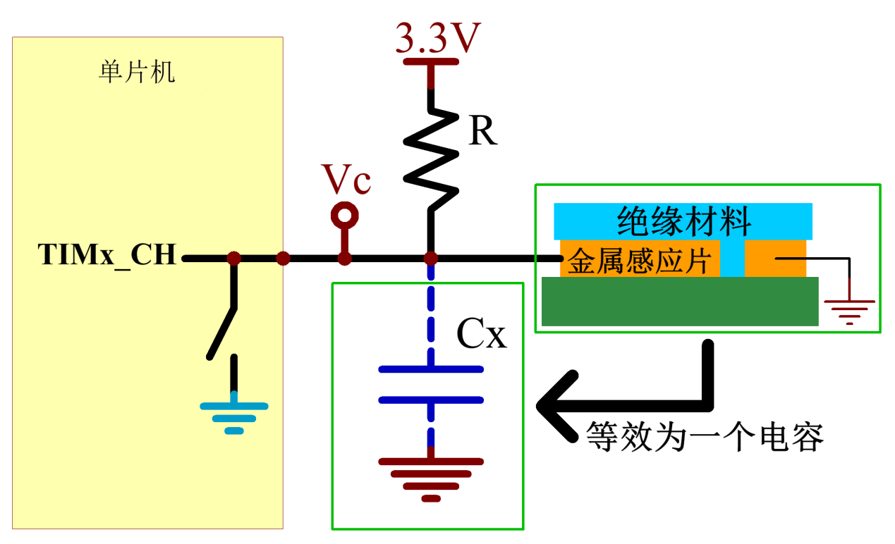
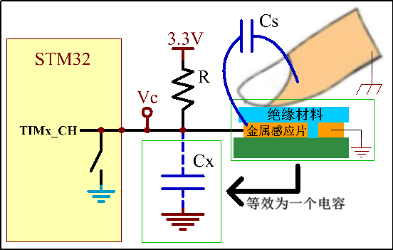
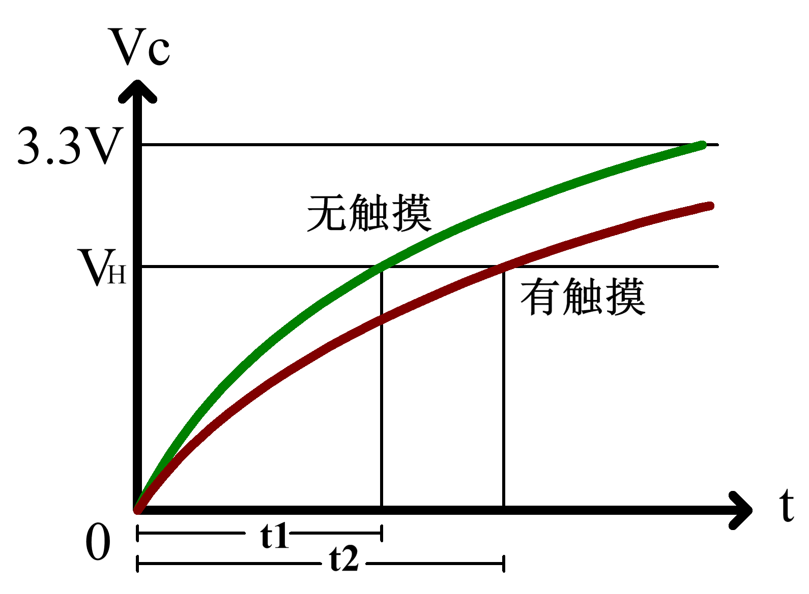
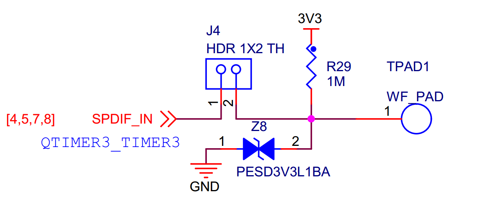

QTMR—电容按键检测
-----------------

本章参考资料：《IMXRT1050RM》（参考手册）。

前面章节我们讲解了QTMR定时器，这一章我们将介绍定时器输入捕获一个应用实例，帮助我们更加深入理解定时器。

电容按键原理
~~~~~~~~~~~~

电容器(简称为电容)就是可以容纳电荷的器件，两个金属块中间隔一层绝缘体就可以构成一个最简单的电容。如图
33‑1(俯视图)，有两个金属片，之间有一个绝缘介质，这样就构成了一个电容。这样一个电容在电路板上非常容易实现，一般设计四周的铜片与电路板地信号连通，这样一种结构就是电容按键的模型。当电路板形状固定之后，该电容的容量也是相对稳定的。

图 33‑1 片状电容器

电路板制作时都会在表面上覆盖一层绝缘层，用于防腐蚀和绝缘，所以实际电路板设计时情况如图
33‑2。电路板最上层是绝缘材料，下面一层是导电铜箔，我们根据电路走线情况设计决定铜箔的形状，再下面一层一般是FR-4板材。金属感应片与地信号之间有绝缘材料隔着，整个可以等效为一个电容Cx。一般在设计时候，把金属感应片设计成方便手指触摸大小。

图 33‑2 无手指触摸情况

在电路板未上电时，可以认为电容Cx是没有电荷的，在上电时，在电阻作用下，电容Cx就会有一个充电过程，直到电容充满，即Vc电压值为3.3V，这个充电过程的时间长短受到电阻R阻值和电容Cx容值的直接影响。但是在我们选择合适电阻R并焊接固定到电路板上后，这个充电时间就基本上不会变了，因为此时电阻R已经是固定的，电容Cx在无外界明显干扰情况下基本上也是保持不变的。

现在，我们来看看当我们用手指触摸时会是怎样一个情况？如图
33‑3，当我们用手指触摸时，金属感应片除了与地信号形成一个等效电容Cx外，还会与手指形成一个Cs等效电容。

图 33‑3 有手指触摸情况

此时整个电容按键可以容纳的电荷数量就比没有手指触摸时要多了，可以看成是Cx和Cs叠加的效果。在相同的电阻R情况下，因为电容容值增大了，导致需要更长的充电时间。也就是这个充电时间变长使得我们区分有无手指触摸，也就是电容按键是否被按下。

现在最主要的任务就是测量充电时间。充电过程可以看出是一个信号从低电平变成高电平的过程，现在就是要求出这个变化过程的时间，这样的一个命题与上一章讲解高级控制定时器的输入捕获功能非常吻合。我们可以利用定时器输入捕获功能计算充电时间，即设置TIMx_CH为定时器输入捕获模式通道。这样先测量得到无触摸时的充电时间作为比较基准，然后再定时循环测量充电时间与无触摸时的充电时间作比较，如果超过一定的阈值就认为是有手指触摸。

图
33‑4为Vc跟随时间变化情况，可以看出在无触摸情况下，电压变化较快；而在有触摸时，总的电容量增大了，电压变化缓慢一些。

图 33‑4 Vc电压与充电时间关系

为测量充电时间，我们需要设置定时器输入捕获功能为上升沿触发，图
33‑4中V\ :sub:`H`\ 就是被触发上升沿的电压值，也是RT1052认为是高电平的最低电压值，大约为1.8V。t1和t2可以通过定时器捕获/比较寄存器获取得到。

不过，在测量充电时间之前，我们必须想办法制作这个充电过程。之前的分析是在电路板上电时会有充电过程，现在我们要求在程序运行中循环检测按键，所以必须可以控制充电过程的生成。我们可以控制TIMx_CH引脚作为普通的GPIO使用，使其输出一小段时间的低电平，为电容Cx放电，即Vc为0V。当我们重新配置TIMx_CH为输入捕获时电容Cx在电阻R的作用下就可以产生充电过程。

电容按键检测实验
~~~~~~~~~~~~~~~~

电容按键不需要任何外部机械部件，使用方便，成本低，很容易制成与周围环境相密封的键盘，以起到防潮防湿的作用。电容按键优势突出使得越来越多电子产品使用它代替传统的机械按键。

本实验实现电容按键状态检测方法，提供一个编程实例。

硬件设计
^^^^^^^^

开发板板载一个电容按键，原理图设计参考图 33‑5。

图 33‑5 电容按键电路设计

标示TPAD1在电路板上就是电容按键实体，它通过一根导线连接至定时器通道引脚，这里选用的电阻阻值为1M。

实验还用到调试串口和蜂鸣器功能，用来打印输入捕获信息和指示按键状态，这两个模块电路可参考之前相关章节。

软件设计
^^^^^^^^

这里只讲解核心的部分代码，有些变量的设置，头文件的包含等并没有涉及到，完整的代码请参考本章配套的工程。我们创建了两个文件：bsp_touchpad.c和bsp_touchpad.h文件用来存放电容按键检测相关函数和宏定义。

编程要点
''''''''

(1) 初始化蜂鸣器、调试串口以及系统滴答定时器；

(2) 配置定时器基本初始化结构体并完成定时器基本初始化；

(3) 配置定时器输入捕获功能；

(4) 使能电容按键引脚输出低电平为电容按键放电；

(5) 待放电完整后，配置为输入捕获模式，并获取输入捕获值，该值即为无触摸时输入捕获值；

(6) 循环执行电容按键放电、读取输入捕获值检过程，将捕获值与无触摸时捕获值对比，以确定电容按键状态。

软件分析
''''''''

宏定义
*****************

.. code-block:: c
   :name: 代码清单 33‑1 宏定义
   :caption: 代码清单 33‑1 宏定义
   :linenos:

    /****************************第一部分*****************************/
    #define TPAD_QTMR_BASEADDR                TMR3
    #define TPAD_QTMR_INPUT_CAPTURE_CHANNEL   kQTMR_Channel_3
    #define TPAD_QTMR_CounterInputPin         kQTMR_Counter3InputPin
    
    /*****************************第二部分*****************************/
    #define TPAD_GPIO     GPIO1
    #define TPAD_GPIO_PIN     (19U)
    #define TPAD_IOMUXC         IOMUXC_GPIO_AD_B1_03_GPIO1_IO19
    #define TPAD_QTMR_IOMUXC   IOMUXC_GPIO_AD_B1_03_QTIMER3_TIMER3
    
    /****************************第三部分******************************/
    /* 中断号和中断处理程序 */
    #define TPAD_QTMR_IRQ_ID  TMR3_IRQn
    #define TPAD_QTMR_IRQ_HANDLER   TMR3_IRQHandler
    
    /* 获取QTMR时钟源 */
    #define TPAD_QTMR_SOURCE_CLOCK CLOCK_GetFreq(kCLOCK_IpgClk)
    
    /****************************第四部分******************************/
    /* 输入捕获引脚的PAD配置 */
    #define TMR_INPUT_PAD_CONFIG_DATA    (SRE_0_SLOW_SLEW_RATE| \
                                        DSE_0_OUTPUT_DRIVER_DISABLED| \
                                        SPEED_2_MEDIUM_100MHz| \
                                        ODE_1_OPEN_DRAIN_ENABLED| \
                                        PKE_0_PULL_KEEPER_DISABLED| \
                                        PUE_0_KEEPER_SELECTED| \
                                        PUS_3_22K_OHM_PULL_UP| \
                                        HYS_1_HYSTERESIS_ENABLED)   
    
    /* GPIO引脚的PAD配置 */
    #define GPIO_PAD_CONFIG_DATA       (SRE_0_SLOW_SLEW_RATE| \
                                        DSE_6_R0_6| \
                                        SPEED_2_MEDIUM_100MHz| \
                                        ODE_0_OPEN_DRAIN_DISABLED| \
                                        PKE_1_PULL_KEEPER_ENABLED| \
                                        PUE_1_PULL_SELECTED| \
                                        PUS_1_47K_OHM_PULL_UP| \
                                        HYS_0_HYSTERESIS_DISABLED)  

使用宏定义非常方便程序升级、移植。各部分宏定的作用简要讲解如下。

-  第一部分，定义本程序使用的定时器以及定时器通道。

-  第二部分，定义使用的GPIO，本实验用到GPIO的复用模式以及普通的输入输出模式，所以引脚复用相关的宏定义有两个。

-  第三部分，定义中断相关宏定义。

-  第四部分，引脚PAD属性配置

定时器初始化配置
*****************

.. code-block:: c
   :name: 代码清单 33‑2 定时器初始化配置
   :caption: 代码清单 33‑2 定时器初始化配置
   :linenos:

    static void TIMx_CHx_Cap_Init(void)
    {
    qtmr_config_t qtmrConfig;
    
    /*************************第一部分**************************/
    /* 设置引脚的复用模式 */
    IOMUXC_SetPinMux(
                        TPAD_QTMR_IOMUXC,    /* 配置为定时器输入捕抓IO */
                        0U);                 /* 不使用SION功能 */                                         
    /* 引脚PAD属性配置 */  
    IOMUXC_SetPinConfig(TPAD_QTMR_IOMUXC,TMR_INPUT_PAD_CONFIG_DATA); 
    
    /************************第二部分***************************/
    /* 获取系统默认配置 */
    QTMR_GetDefaultConfig(&qtmrConfig);
    /* 使用IP总线时钟，八分频 */
    qtmrConfig.primarySource = kQTMR_ClockDivide_16;
    /* 指定定时器通道初始化定时器 */
    QTMR_Init(TPAD_QTMR_BASEADDR,TPAD_QTMR_INPUT_CAPTURE_CHANNEL,\
                                            &qtmrConfig);
    
    /***********************第三部分****************************/
    /* 键入对应通道的输入捕抓功能 */
    QTMR_SetupInputCapture(TPAD_QTMR_BASEADDR,\
            TPAD_QTMR_INPUT_CAPTURE_CHANNEL,TPAD_QTMR_CounterInputPin, \
            false, true, kQTMR_RisingEdge);
    /* 使能中断 */
    EnableIRQ(TPAD_QTMR_IRQ_ID);
    /* 使能定时器比较中断 */
    QTMR_EnableInterrupts(TPAD_QTMR_BASEADDR,\
                TPAD_QTMR_INPUT_CAPTURE_CHANNEL,\
                    kQTMR_EdgeInterruptEnable);
    /* 定时器计数器归0  */
    TPAD_QTMR_BASEADDR->CHANNEL[TPAD_QTMR_INPUT_CAPTURE_CHANNEL].CNTR = 0;
    /* 启动输入通道以计算主源时钟的上升边缘 */
    QTMR_StartTimer(TPAD_QTMR_BASEADDR, TPAD_QTMR_INPUT_CAPTURE_CHANNEL,\
                                                    kQTMR_PriSrcRiseEdge);  
    }

定时器的初始化与讲解QTMR 定时器时略有不同，下面简要讲解各部分代码。

-  第一部分，初始化输入捕获引脚的复用功能。

-  第二部分，初始化定时器。这部分代码与讲解QTMR实验时类似。首先在初始化程序的开始处定义QTMR初始化结构体qtmrConfig，之后使用QTMR_GetDefaultConfig函数获得默认的配置参数，最后修改默认配置参数并调用QTMR_Init函数完成QTMR基本的初始化。

-  第三部分，开启定时器相应通道的数据捕获功能并启动定时器。在第二部分完成了定时器的基本初始化，接着，这部分代码完成定时器输入捕获功能以及完成一些启动前的初始化工作。函数QTMR_SetupInputCapture用于开启定时器的输入捕获功能，函数原型如所所示。

.. code-block:: c
   :name: 代码清单 33‑3输入捕获开启函数
   :caption: 代码清单 33‑3输入捕获开启函数
   :linenos:

    void QTMR_SetupInputCapture(TMR_Type *base,
                                qtmr_channel_selection_t channel,
                                qtmr_input_source_t capturePin,
                                bool inputPolarity,
                                bool reloadOnCapture,
                                qtmr_input_capture_edge_t captureMode);

函数各个参数讲解如下：

1) base，指定要设置的那个QTMR定时器

2) channel，指定设置的QTMR定时器的那个通道，每个定时器有4个可选的输入捕获通道。

3) capturePin，指定输入捕获使用的外部输入引脚。

4) inputPolarity，是否翻转输入引脚检测到的边沿信号。

5) reloadOnCapture，当发送捕获时是否重清零计数器。

6) captureMode，指定触发边沿。

..

    如果捕获事件过长定时器会发送溢出，所以使用输入捕获时一般要开启定时器的溢出中断（或者比较中断）。开启定时器之前要清零计数值。

电容按键复位
*****************

.. code-block:: c
   :name: 代码清单 33‑4 电容按键复位
   :caption: 代码清单 33‑4 电容按键复位
   :linenos:

    static void TPAD_Reset(void)
    {
    /***********************第一部分**********************/
    /* 定义gpio初始化配置结构体 */
    gpio_pin_config_t tap_config;
    
    /* 设置引脚的复用模式，配置为普通IO，不使用SION功能*/
    IOMUXC_SetPinMux(TPAD_IOMUXC, 0U);            
    
    /*设置引脚PAD属性*/
    IOMUXC_SetPinConfig(TPAD_IOMUXC, GPIO_PAD_CONFIG_DATA);
    
    /* TPAD，GPIO配置 */       
    tap_config.direction = kGPIO_DigitalOutput; //输出模式
    tap_config.outputLogic =  0;                //默认低电平
    tap_config.interruptMode = kGPIO_NoIntmode; //不使用中断
    
    /* 初始化 TPAD GPIO. */
    GPIO_PinInit(TPAD_GPIO, TPAD_GPIO_PIN, &tap_config);
    
    /*保持一小段时间低电平，保证放电完全*/
    Delay_ms(5);
    
    /**********************第二部分********************/
    /*重新初始化定时器为输入捕抓功能*/
    TIMx_CHx_Cap_Init();
    }

该函数实现两个主要功能：控制电容按键放电和复位计数器。

-  第一部分，配置输入捕获引脚的复用功能为普通IO、设置该引脚的PAD属性，最后设置引脚输出低电平并等待一段时间，等待电容按键放电完成。

-  第二部分，重新初始化定时器为输入捕获模式，等待捕获电容按键的上升沿。

获取输入捕获值
*****************

.. code-block:: c
   :name: 代码清单 33‑5 获取输入捕获值
   :caption: 代码清单 33‑5 获取输入捕获值
   :linenos:

    static uint16_t TPAD_Get_Val(void)
    {
    /**************************第一部分*****************************/
    /* 先放电完全，并复位计数器 */  
    TPAD_Reset();
    
    /**************************第二部分**************************/
    /* 等待捕获上升沿 */
    while (!(qtmrIsrFlag))
    {
        /*循环读取捕获计较寄存器的值，如果超时则返回计数值。*/
        if(TPAD_QTMR_BASEADDR->CHANNEL\
            [TPAD_QTMR_INPUT_CAPTURE_CHANNEL].CAPT>(TPAD_ARR_MAX_VAL-500))
        return TPAD_QTMR_BASEADDR->CHANNEL\
                    [TPAD_QTMR_INPUT_CAPTURE_CHANNEL].CAPT;    
    }
    qtmrIsrFlag = false;
    return TPAD_QTMR_BASEADDR->CHANNEL\
                        [TPAD_QTMR_INPUT_CAPTURE_CHANNEL].CAPT;  
    }

捕获值获取代码主要分为两部分，各部分简要讲解如下：

-  第一部分，TPAD_Reset函数完成电容按键放电过程，并复位计数器。

-  第二部分，在while(1)死循环中检测捕获事件，如果定时器捕获到上升沿则退出循环，返回当前定时器的计数值。如果定时器的值超过设定值同样读取定时器的值并退出函数，这样能够防止无限等待，避免程序卡死。

获取最大输入捕获值
**********************************

.. code-block:: c
   :name: 代码清单 33‑6 获取最大输入捕获值
   :caption: 代码清单 33‑6 获取最大输入捕获值
   :linenos:

    static uint16_t TPAD_Get_MaxVal(uint8_t n)
    {
        uint16_t temp=0;
        uint16_t res=0;
        while (n--) {
            temp=TPAD_Get_Val();//得到一次值
            if (temp>res)res=temp;
        };
        return res;
    }

该函数接收一个参数，用来指定获取电容按键捕获值的循环次数，函数的返回值则为n次发生捕获中最大的捕获值。

电容按键捕获初始化
**********************************

.. code-block:: c
   :name: 代码清单 33‑7 电容按键捕获初始化
   :caption: 代码清单 33‑7 电容按键捕获初始化
   :linenos:

    uint8_t TPAD_Init(void)
    {
    uint16_t buf[10];
    uint32_t temp=0;
    uint8_t j,i;
    
    /*设定定时器预分频器目标时钟为：8.25MHz*/
    TIMx_CHx_Cap_Init();
    
    for(i=0;i<10;i++)/*连续读取10次*/
    {        
        buf[i]=TPAD_Get_Val();
        Delay_ms(10);     
    }           
    for(i=0;i<9;i++)/*排序*/
    {
        for(j=i+1;j<10;j++)
        {
        if(buf[i]>buf[j])/*升序排列*/
        {
            temp=buf[i];
            buf[i]=buf[j];
            buf[j]=temp;
        }
        }
    }
    temp=0;
    /*取中间的6个数据进行平均*/
    for(i=2;i<8;i++)
    {
        temp+=buf[i];
    }
    
    tpad_default_val=temp/6;  
    /* printf打印函数调试使用，用来确定阈值TPAD_GATE_VAL在应用工程中应注释掉 */
    /*PRINTF("tpad_default_val:%d\r\n",tpad_default_val); */
    
    /*初始化遇到超过TPAD_ARR_MAX_VAL/2的数值,不正常!*/
    if(tpad_default_val>TPAD_ARR_MAX_VAL/2)
    {
        return 1;
    }
    
    return 0;                          
    }

该函数实现定时器初始化配置和无触摸时电容按键捕获值确定功能。它一般在main函数靠前位置调用完成电容按键初始化功能。

程序先调用TIMx_CHx_Cap_Init函数完成定时器基本初始化和输入捕获功能配置。

接下来，循环10次读取电容按键捕获值，并保存在数组内。TPAD_Init函数一般在开机时被调用，所以认为10次读取到的捕获值都是无触摸状态下的捕获值。

然后，对10个捕获值从小到大排序，取中间6个的平均数作为无触摸状态下的参考捕获值，并保存在tpad_default_val变量中。

程序最后会检测tpad_default_val变量的合法性。

电容按键状态扫描
*****************

.. code-block:: c
   :name: 代码清单 33‑8 电容按键状态扫描
   :caption: 代码清单 33‑8 电容按键状态扫描
   :linenos:

    //阈值：捕获时间必须大于(tpad_default_val + TPAD_GATE_VAL),才认为是有效触摸.
    #define TPAD_GATE_VAL   100

    uint8_t TPAD_Scan(uint8_t mode)
    {
        //0,可以开始检测;>0,还不能开始检测
        static uint8_t keyen=0;
        //扫描结果
        uint8_t res=0;
        //默认采样次数为3次
        uint8_t sample=3;
        //捕获值
        uint16_t rval;

        if (mode) {
            //支持连按的时候，设置采样次数为6次
            sample=6;
            //支持连按
            keyen=0;
        }
        /* 获取当前捕获值(返回 sample 次扫描的最大值) */
        rval=TPAD_Get_MaxVal(sample);
        /* printf打印函数调试使用，用来确定阈值TPAD_GATE_VAL，在应用工程中应注释掉 */
    //  printf("scan_rval=%d\n",rval);

        //大于tpad_default_val+TPAD_GATE_VAL,且小于10倍tpad_default_val,则有效
        if (rval>(tpad_default_val+TPAD_GATE_VAL)&&rval<(10*tpad_default_val)) 
    {
            //keyen==0,有效
            if (keyen==0) {
                res=1;
            }
            keyen=3;        //至少要再过3次之后才能按键有效
        }

        if (keyen) {
            keyen--;
        }
        return res;
    }

TPAD_GATE_VAL用于指定电容按键触摸阈值，当实时捕获值大于该阈值和无触摸捕获参考值tpad_default_val之和时就认为电容按键有触摸，否则认为没有触摸。阈值大小一般需要通过测试得到，一般做法是通过串口在TPAD_Init函数中把tpad_default_val值打印到串口调试助手并记录下来，在TPAD_Scan函数中也把实时捕获值打印出来，在运行时触摸电容按键，获取有触摸时的捕获值，这样两个值对比就可以大概确定TPAD_GATE_VAL。

TPAD_Scan函数用来扫描电容按键状态，需要被循环调用，类似独立按键的状态扫描函数。它有一个形参，用于指定电容按键的工作模式，当为赋值为1时，电容按键支持连续触发，即当一直触摸不松开时，每次运行TPAD_Scan函数都会返回电容按键被触摸状态，直到松开手指，才返回无触摸状态。当参数赋值为0时，每次触摸函数只返回一次被触摸状态，之后就总是返回无触摸状态，除非松开手指再触摸。TPAD_Scan函数有一个返回值，用于指示电容按键状态，返回值为0表示无触摸，为1表示有触摸。

TPAD_Scan函数主要是调用TPAD_Get_MaxVal函数获取当前电容按键捕获值，该值这里指定在连续触发模式下取6次扫描的最大值为当前捕获值，如果是不连续触发只取三次扫描的最大值。正常情况下，如果无触摸，当前捕获值与捕获参考值相差很小；如果有触摸，当前捕获值比捕获参考值相差较大，此时捕获值对应图
33‑4的时间t2。

接下来比较当前捕获值与无触摸捕获参考值和阈值之和的关系，以确定电容按键状态。这里为增强可靠性，还加了当前捕获值不能超过参考值的10倍的限制条件，因为超过10倍关系几乎可以认定为出错情况。

主函数
*****************

.. code-block:: c
   :name: 代码清单 33‑9 main函数
   :caption: 代码清单 33‑9 main函数
   :linenos:

    int main(void)
    {
    /************此处省略系统初始化以及系统时钟打印相关代码*******/
    
    PRINTF("TMR定时器定时输入捕获r\n");
    
    /**********************第一部分**************************/
    /*初始化systick定时器*/
    SysTick_Init();
    /* 初始化LED引脚 */
    LED_GPIO_Config() ;
    /*初始化蜂鸣器*/
    Beep_GPIO_Config();
    /* 初始化电容按键 */
    TPAD_Init();
    
    /**/
    while(1)
    {
        /*扫描电容按键*/
        if(TPAD_Scan(0))
        {
        BEEP_ON;
        Delay_ms(100);
        BEEP_OFF;
        } 
    }     
    }

主函数分别调用SystemClock_Config、Beep_GPIO_Config、TPAD_Init完成Systic时钟初始化、蜂鸣器的初始化以及触摸按键初始化。

TPAD_Init函数初始化配置定时器，并获取无触摸时的捕获参考值。

无限循环中调用TPAD_Scan函数完成电容按键状态扫描，指定为不连续触发方式。如果检测到有触摸就让蜂鸣器响100ms。

下载验证
^^^^^^^^

使用USB线连接开发板上的“USB TO
UART”接口到电脑，电脑端配置好串口调试助手参数。编译实验程序并下载到开发板上，程序运行后在串口调试助手可接收到开发板发过来有关定时器捕获值的参数信息。用手册触摸开发板上电容按键时可以听到蜂鸣器响一声，移开手指后再触摸，又可以听到响声。
