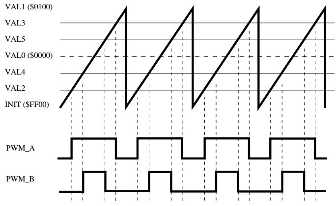

eFlexPWM—灵活的增强型PWM
----------------------------

本章参考资料：《IMXRT1050RM》（参考手册）。

学习本章时，配合《IMXRT1050RM》第28章Enhanced Flex Pulse Width
Modulator一起阅读，效果会更佳，特别是涉及到寄存器说明的部分。

特别说明，本书内容是以RT1050系列控制器资源讲解。

eFlexPWM简介
~~~~~~~~~~~~~~~~~~

eFlexPWM是Enhanced Flex Pulse Width
Modulator的缩写，直译为灵活的增强型脉冲脉宽调制模块。

RT1052具有4个eFlexPWM(eFlexWM1~eFlex_PWM4)。每个eFlexPWM
可以产生四路互补PWM即产生8个PWM，也可以产生相互独立的PWM波。每个eFlexPWM具有各自的故障检电路，当故障发生时根据程序锁定PWM输出引脚的电平状态，这在逆变、整流及电机控制应用中能够有效的提高设备的安全性。eFlexPWM可以产生多种多样的开关模式，包括非常复杂的波形。它可以用来控制所有已知的电机类型，用于控制开关电源也非常理想。

eFlexPWM功能框图
~~~~~~~~~~~~~~~~

eFlexPWM功能强大，功能框图比较复杂，我们将会分模块讲解。总体的功能框图如图
34‑1所示。

图 34‑1eFlexPWM功能框图

①PWM输出
^^^^^^^^^^^^^^^^^^^^^^^^^^^^

RT1052具有4个eFlex PWM(eFlexPWM1~eFlex_PWM4)。每个eFlexPWM拥有四个通道。图34‑1描述的是其中一个通道的功能框图，从图中标号①处可以看出，该通道可以输PWM_A、PWM_B和PWM_X。PWM_A与PWM_B可以独立输出也可以作为互补对输出。PWM_X比较特殊，只有eFlex PWM1拥有PWM_X对应的外部输出引脚可直接输出PWM。其他eFlex PWM(eFlexWMM2~eFlex_PWM4)只能通过XBAR映射到外部输出引脚才能输出PWM。以eFlex PWM1为例外部输入引脚定义如表格 34‑1所示，其他eFlexWMM外部输出引脚请参考《IMXRT1050RM》（参考手册）External Signals and Pin Multiplexing章节。

表格 34‑1eFlexPWM1外部输出引脚

+----------------+---------------+
| FLEXPWM信号    | 可选的引脚    |
+================+===============+
| FLEXPWM1_PWMA0 | GPIO_EMC_23   |
+----------------+---------------+
|                | GPIO_SD_B0_00 |
+----------------+---------------+
| FLEXPWM1_PWMB0 | GPIO_SD_B0_01 |
+----------------+---------------+
|                | GPIO_EMC_24   |
+----------------+---------------+
| FLEXPWM1_PWMA1 | GPIO_EMC_25   |
+----------------+---------------+
|                | GPIO_SD_B0_02 |
+----------------+---------------+
| FLEXPWM1_PWMB1 | GPIO_EMC_26   |
+----------------+---------------+
|                | GPIO_SD_B0_03 |
+----------------+---------------+
| FLEXPWM1_PWMA2 | GPIO_SD_B0_04 |
+----------------+---------------+
|                | GPIO_EMC_27   |
+----------------+---------------+
| FLEXPWM1_PWMB2 | GPIO_SD_B0_05 |
+----------------+---------------+
|                | GPIO_EMC_28   |
+----------------+---------------+
| FLEXPWM1_PWMA3 | GPIO_EMC_38   |
+----------------+---------------+
|                | GPIO_SD_B1_00 |
+----------------+---------------+
|                | GPIO_AD_B0_10 |
+----------------+---------------+
|                | GPIO_EMC_12   |
+----------------+---------------+
|                | GPIO_B1_00    |
+----------------+---------------+
| FLEXPWM1_PWMB3 | GPIO_EMC_39   |
+----------------+---------------+
|                | GPIO_B1_01    |
+----------------+---------------+
|                | GPIO_AD_B0_11 |
+----------------+---------------+
|                | GPIO_SD_B1_01 |
+----------------+---------------+
|                | GPIO_EMC_13   |
+----------------+---------------+
| FLEXPWM1_PWMX0 | GPIO_AD_B0_02 |
+----------------+---------------+
| FLEXPWM1_PWMX1 | GPIO_AD_B0_03 |
+----------------+---------------+
| FLEXPWM1_PWMX2 | GPIO_AD_B0_12 |
+----------------+---------------+
| FLEXPWM1_PWMX3 | GPIO_AD_B0_13 |
+----------------+---------------+

②时钟源
^^^^^^^^^^^^^^^^^^^^^^^^^^^^

FLEXPWM有多个可选的时钟源，如图 34‑2 。

图 34‑2时钟模块功能框图

从图中可以看出，每个FLEXPWM 子模块可选的时钟源有IPBus
clock、EXT_CLK。FLEXPWM子模块0还可以选择AUX_CLK_input作为时钟源。选择时钟源之后经过分频之后才能作为FLEXPWM
子模块的计数时钟，分频值由8位寄存器PSRC指定。

③计数寄存器
^^^^^^^^^^^^^^^^^^^^^^^^^^^^

保存当前计数值。

④比较寄存器
^^^^^^^^^^^^^^^^^^^^^^^^^^^^

比较寄存器用于产生PWM波，每个FLEXPWM
拥有6个比较寄存器，这6个比较寄存器被分成了3组如图 34‑3。

图 34‑3pwm生成功能框图

从图中可以看出，比较寄存器0和1用于产生PWMX，比较寄存0和1的功能较多，我们这里简单讲解，不深究。第一，只有eFlexPWM1拥有与PWMX
直接对应的外部引脚，而其他FLEXPWM需要使用XBAR
映射到相应的外部引脚才能输出PWM。第二，比较寄存0和1可以输出Half
Comp信号和Mod Comp 信号，这两个信号可 用作eFlexPWM1寄存器加载信号。

比较寄存器2和3用于产生PWM23，比较寄存器4和5用于产生PWM45，根据寄存器配置不同，PWM23和PWM45可以独立输出，也可以组成一对互补的PWM波，这在半桥驱动电路中应用广泛。因为每个PWM波由两个比较寄存控制，所以尽管这些比较寄存器使用相同的比较值（16
bit counter），但是可以产生相位不同和占空比不同的pwm波。

⑤同步信号
^^^^^^^^^^^^^^^^^^^^^^^^^^^^

继续分析标注⑤的内容，它是同步信号选择器，其内部详细结构见图
34‑4。

图 34‑4 FLEXPWM同步信号选择器结构图

从图中可以看出，每个eFlexPWM拥有4个同步信号分别为Local Sync、Master
Reload、Master
Sync、PWM_EXT_SYNC。所谓同步，实际就是初始化计数寄存器（16 bit
counter）。INIT_SEL 用于选择同步信号。

Local Sync（本地同步信号），当计数寄存器（16 bit
comparator）的计数值与比较寄存器VAL1的设定值相等时产生本地同步信号。如果选择本地同步信号作为计数器初始化信号，那么子模块中的比较寄存器（VAL1）将有效的控制定时器的周期（定时器的周期还与计数频率有关），从而控制该子模块生成PWM频率。

Master Reload（主重载信号）与Master
Sync（主同步信号）。每个eFlexPWM拥有四个子模块（submod0到submod3），其中子模块0（submod0）与其他子模块不同，它可以作为主模块产生控制信号控制其他模块。例如子模块0的同步信号不仅可复位自己的16位计数寄存器（16
bit counter），还可以作为Master
Sync信号，用于复位其他子模块（submod1到submod3）的16位计数寄存器（16 bit
counter）。同样，子模块0的重装载信号也可以作为其他子模块的同步信号。

PWM_EXT_SYNC（外部同步信号）根据系统体系结构不同，PWM_EXT_SYNC信号产生于芯片上或芯片外，选择此信号作为同步信号，可以实现外部源控制eFlexPWM子模块输出PWM周期。

⑥输出控制
^^^^^^^^^^^^^^^^^^^^^^^^^^^^

回到前面的标注⑥处，可以看出比较寄存器产生的PWM23与PWM45经过一些控制模块之后转变为PWM_A和PWM_B。下面简要讲解这些模块的作用。

-  Comp vs Indep （独立或互补控制模块）

..

    PWM_A和PWM_B可以独立输出也可以作为一个互补pwm对输出，功能框图如图
    34‑5。

图 34‑5独立或互补功能框图

当控制寄存器CTRL2[INDEP]=1，两个PWM相互独立。当CTRL2[INDEP]=0时，PWM_A与PWM_B做为互补对输出，在该模式下只有其中一个PWM(PWM_A或PWM_B)的配置参数起作用，我们暂且将其称为主PWM
另外一个称为从PWM。互补PWM的占空比由主PWM的配置参数决定，修改从PWM的配置参数无效。MCTRL[IPOL]决定哪一个PWM(PWM_A或PWM_B)作为主PWM。

-  Dead Time Generator（死区时间）

..

    PWM互补对常用于控制半桥驱动电路，首先我们介绍为什么互补对控制半桥驱动电路要加入死区，以及简单介绍FLESPWM加入死区的方法。常用的半桥驱动电路如图
    34‑6所示。

图 34‑6半桥驱动电路

图 34‑7死区插入波形图

当使用无死区的互补pwm控制板桥驱动电路时如 图 34‑6、图 34‑7
所示，PWM_A为高电平时PWM_B
为低电平，此时上方晶体管导通，下方晶体管截止，输出端输出高电平V+。之后PWM_A变为低电平，同时PWM_B变为高电平，此时上方晶体管截止，晶体管导通，输出端输出低电平
GND。通过控制PWM_A的占空比即可调整输出电压。

但是在实际应用中晶体管不是理想的，晶体管从截止状态变为导通状态或者从导通状态变为截止状态需要一定的时间。而且通常情况下开通时间与截止时间不相同。如果不插入死区时间，当PWM状态发生变化就很可能出现上下两个晶体管同时导通的情况，这样造成电路发生短路。

当使用加入死区的互补PWM时 首先 PWM_B
为高电平，PWM_A为低电平，上方晶体管截止，下方晶体管导通，之后PWM_B变为低电平，此时由于死区时间的存在（DTCNT0）PWM_A保持低电平不变，死区时间结束之后（在这个时间段内晶体管已经能够完成状态变换）PWM_A变为高电平，上方晶体管导通，下方晶体管已经变为截止状态，此时输出高电平V+。依次类推，选择恰当的死区时间就不会出现短路的情况。

死区插入逻辑比较复杂，如图 34‑8所示:

图 34‑8死区时间插入逻辑

在实际编程过程中我们无需深究死区是如何插入的，我们只需要知道向DTCT0和DTCNT1寄存器写入死区时间即可。在这里，设置的是延时多少个计数周期，在编程中要讲时间转化为计数器的计数周期个数。

-  Mux Select Logic（多路复用选择逻辑）

..

    PWM_A与PWM_B输出可以通过RT1052片上XBAR工具映射到需要的引脚，这样使用更加灵活。

-  Fault Protection（故障保护）

..

    FLEXPWM提供了强大的错误保护机制，当检测到错误时能够根据寄存器配置将PWM输出锁定为高电平或低电平。图
    34‑9是PWM_A的故障保护结构框图。

图 34‑9PWM_A故障保护结构图

图中使用标号标记了几个运算符，很明显2 、3、5 、6是
“或”逻辑运算符，1和4是与运算符。

-  标号为5的或逻辑运算符，它的输出为禁止PWM_A信号（DISABLE_PWM_A）,输入信号为逻辑运算符6和逻辑运算符2的输出，也就是说任意一个输入为真时，都会禁止PWM_A输出。

-  再来看或逻辑运算符6的输入连接，由下往上看，RT1052工作在停止模式（Stop
   Mode）时PWM_A禁止输出，工作在等待模式（Waid Mode）或调试模式（Debug
   Mode）由控制寄存器位WAITEN和DBGEN决定是否禁止PWM_A输出。

-  或逻辑运算符2有四条输入支路，任何一个支路为“真”时都会导致禁止PWM_A输出。DISA3是故障输通道3（FAULT3）的控制寄存器，当DISA0到DISA3全为0时表示禁止了PWM_A的故障检测功能。NOCOMB3是故障通道3（FAULT3）的模式选择寄存器，从图中可以看出，当NOCOMB3为0并且使能故障检测功能时，故障信号会直接导致PWM_A禁止输出。当NOCOMB3为1，故障信号就不能通过标号为4的与逻辑运算符触发PWM_A禁止输出。故障信号也可以通过FILT模块进而触发PWM_A禁止输出。FILT的作用是故障滤波，简单理解就是将一些持续时间较短的故障信号滤除掉，而那些持续时间较长的故障信号才能真正触发PWM_A禁止输出。

⑦和⑧重装载
^^^^^^^^^^^^^^^^^^^^^^^^^^^^

继续分析标注⑦和⑧的内容，它是重装载选择器，其内部详细结构见图34‑10。

图 34‑10重装载选择器内部结构图

FLEXPWM某些寄存具有双缓冲功能比如比较寄存器，同一个寄存分为外部寄存和内部寄存，我们在程序中只能修改外部寄存器的值，修改后的值只有加载到内部寄存器才真正的起作用。重装载的作用就是将外部寄存器的值加载到内部寄存器。

从图中可看出 RELOAD_SEL
用于选择重装载信号源，可以选择本地重载信号（Local
Reload），也可以选择来自submod0的Master Reload 信号作为重载信号。

使用本地重载信号时，要配置本地重装载允许寄存器位LDOK允许本地重装载后，Mod
Compare和Half Comp才能够触发重装载。Mod
Compare表示一个完整的pwm周期后进行重装载。Half
Compare表示在一个PWM周期的进行重装载，半周期点由比较寄存器0（VAL0）指定，它不必恰好位于PWM周期的中间。无论选择Mod
Compare 还是选择Half
Compare，都可以使用CTRL[LDFQ]寄存器将重装载事假调整为n个PWM循环或n个PWM半周期。

eFlexPWM初始化结构体详解
~~~~~~~~~~~~~~~~~~~~~~~~

SDK库对FLEXPWM定时器外设建立了多个初始化结构体，这些结构体成员用于设置PWM基本工作参数，并由FLEXPWM初始化配置函数调用，初始化结构体中设定的参数将会设置定时器相应的寄存器，达到配置定时器工作环境的目的。

.. code-block:: c
   :name: 代码清单 34‑1FLEXPWM配置结构体(fsl_pwm.h)
   :caption: 代码清单 34‑1FLEXPWM配置结构体(fsl_pwm.h)
   :linenos:

   typedef struct _pwm_config
   {
      bool enableDebugMode;              /*!< true: PWM调试模式下正常运行PWM;*/
                                         /* false: PWM在调试模式下停止运行*/
      bool enableWait;                 /*!< true: PWM在等待模式下正常运行 */
                                        /*  false: PWM在等待模式下停止运行  */
      uint8_t faultFilterCount;         /*!< 设置故障过滤计数值 */
      uint8_t faultFilterPeriod;        /*!< 故障滤波周期;值为0不进行滤波*/
      pwm_init_source_t initializationControl; /*!< 选择PWM初始化信号 */
      pwm_clock_source_t clockSource;          /*!< 选择PWM计数器的时钟源 */
      pwm_clock_prescale_t prescale;           /*!< 选择时钟分频  */
      pwm_chnl_pair_operation_t pairOperation; /*!< PWM_A 与 PWM_B 工作模式选择，互补或者独立*/
      pwm_register_reload_t reloadLogic;  /*!< 选择何时将新值加载到内部寄存器 */
      pwm_reload_source_select_t reloadSelect; /*!< 选择PWM加载信号 */
      pwm_load_frequency_t reloadFrequency;    /*!< 当reloadLogic不等于kPWM_ReloadImmediate时，用于设置加载频率  */
                                                
      pwm_force_output_trigger_t forceTrigger; /*!< 选择强制输出信号源*/
   } pwm_config_t;

下面详细讲解各个配置项的功能:

-  enableDebugMode 与enableWait用于设置在调试模式（DebugMode）或者等待模式（Wait Mode）是否使能PWM输出。在图34‑11中也可以看出，可以通过配置寄存器决定在调试模式下或等待模式下是否使能PWM输出。我们在配置结构体中根据需要选择即可，无需关心具体操作了那个寄存器的那些位。当然也可以通过查看代码或者阅读RT1052相关手册得到具体操作了那些寄存器。

-  faultFilterCount与faultFilterPeriod如果使用了FLEXPWM故障检测功能，并且选择使用故障滤波功能，则需要设置滤波周期与滤波计数值。图34‑12中红色方框标注的FILE表示的是故障滤波周期(faultFilterPeriod)，以IPBus时钟周期为单位，如果设置为0，表示不使用故障滤波功能。每个输入按此字段指定的值进行多次采样，采样次数由faultFilterCount指定，可选范围0到7，代表3到10个样本。例如faultFilterPeriod= 100，faultFilterCount =7，检测到故障信号之后，故障滤波器每100个IPBus时钟周期检测一次是否存在故障信号，这样连续检测10次，如果这10次全都检测到了故障信号的存在则表示故障确实存在，之后禁止相应的PWM输出。

-  initializationControl，用于选择FLEXPWM子模块的计数器初始化信号（也可称为同步信号），我们前面讲到RT1052拥有4个FLEXPWM，每个FLEXPWM拥有4个子模块（0到3），其中模块0可以作为主模块（master）控制其他子模块。如何实现控制？其中一个重要的方式就是将主模块的产生的一些信号作为被控模块的计数器初始化信号。在34.2FLEXPW功能框图章节的第三小节已经对可选的同步信号有过详细的介绍，这里不再赘述，SDK库里面讲这些选项定义为一个枚举类型pwm_init_source_t，我们根据需要选择即可。

-  clockSource与prescale，clockSource用于选择时钟源，在34.2FLEXPWM功能框图章节的第一小节已经对可选的时钟源进行了详细介绍，同样SDK库中将可选的时钟源定义为一个枚举类型，我们根据需要选择即可。Prescale用于设置时钟分频。选择的时钟源经过分频之后才能作为PWM计数频率。

-  pairOperation，选择PWM_A 与PWM_B的工作模式，大致分为独立模式与互补输出模式，在独立模式下PWM_A与PWM_B可以独立调节各自的占空比。在互补输出模式下PWM_A与PWM_B输出互补对，并且互补对的占空比由其中一个PWM配置寄存器决定，修改另外一个无效。通过软件可以选择。

-  reloadLogic,当收到重载信号后，选择何时进行重装载，再之前我们提到在FLEXPWM中某些寄存分为外部寄存和内部寄存，我们在程序中只能修改外部寄存器的值，修改后的值只有加载到内部寄存器才真正的起作用。该配置项的作用就是选择何时将修改后的值加载到内部寄存器。有四个选择，第一，立即加载（kPWM_ReloadImmediate），当加载控制位LDOK为1时立即将外部寄存器的值加载到内部寄存。第二，PWM半周期加载（kPWM_ReloadPwmHalfCycle）PWM计数寄存器的值与比较寄存器0设定值相等的时刻称为PWM的半周期。第三，PWM全周期（kPWM_ReloadPwmFullCycle），PWM计数寄存器的值与比较寄存器1的是相等的时刻称为PWM的全周期。第四，PWM半周期或者全周期。

-  reloadSelect，重装载信号选择，寄存器重载信号可以来自主模块（子模块0）也可以来本身产生的重载信号。我们在34.2FLEXPWM功能框图 第四部分重装载，详细讲解了重装载信号，其中ModCompare，与HalfCompare都是由本模块产生，在这里对应kPWM_LocalReload选项。

-  reloadFrequency重装载频率，当reloadLogic不选择kPWM_ReloadImmediate时该选项用于设置加载频率。如果reloadLogic我们选择了半周期或者全周期加载，则reloadFrequency选项用于设置多少个半周期或者全周期执行加载。例如reloadLogic选择全周期加载，reloadFrequency = 10，则受到加载信号后经过10个全周期之后才执行从装载操作。

-  forceTrigger强制输出信号选择，每个子模块拥有8个可供选择的强制输出信号，如代码清单34‑2所示。

.. code-block:: c
   :name: 代码清单 34‑2强制输出信号(fsl_pwm.h)
   :caption: 代码清单 34‑2强制输出信号(fsl_pwm.h)
   :linenos:

   typedef enum _pwm_force_output_trigger
   {
      kPWM_Force_Local = 0U,   /*!< 本地强制输出控制寄存器CTRL2[FORCE]  */
      kPWM_Force_Master,       /*!< 来自主模块的强制输出信号 */
      kPWM_Force_LocalReload,  /*!< 本地重装载（Reload） 信号 */
      kPWM_Force_MasterReload, /*!< 主模块重装载（Reload） 信号 */
      kPWM_Force_LocalSync,    /*!< 本地同步信号信号 */
      kPWM_Force_MasterSync,   /*!< 主模块同步信号  */
      kPWM_Force_External,     /*!< 外部信号       */
      kPWM_Force_ExternalSync  /*!< 外部同步信号   */
   } pwm_force_output_trigger_t;

从输出信号的命名或者从注释中我们不难看出这8个输出信号分别是什么。我们这里做简单的介绍。这8个强制输出信号大致可分为三类：

(1) 来自主模块，kPWM_Force_Master、kPWM_Force_MasterReload、kPWM_Force_MasterSync，分别表示当主模块发生强制输出时触发本地强制输出、主模块发生重装载时时触发本地强制输出、主模块发生同步时子模块执行强制输出。

(2) 第二类，来自本地，kPWM_Force_Local、kPWM_Force_LocalReload、kPWM_Force_LocalSync，分别表示设置本地强制输出控制寄存器CTRL2[FORCE]触发本地强制输出、本地重装载信号触发强制输出，本地同步信号触发强制输出。

(3) 第三类，来自外部，kPWM_Force_External、kPWM_Force_ExternalSync，分别表示来自外部的强制输出信号EXT_FORCE触发本地强制输出、来自外部同步信号EXT_SYNC触发本地强制输出。

eFlexPWM输出互补PWM实验
~~~~~~~~~~~~~~~~~~~~~~~

我们使用eFlexPWM1的子模块0输出互补PWM波，通过示波器观察输出。通过修改宏定义的值来修改PWM的频率、占空比、死区时间。

硬件设计
^^^^^^^^

本实验使用示波器观察波形输出，所以只要找到PWM输出对应的外部引脚，并在开发板上找到相应的测试点就可以了。

软件设计 
^^^^^^^^^

这里只讲解核心的部分代码，有些变量的设置，头文件的包含等并没有涉及到，完整的代码请参考本章配套的工程。我们创建了两个文件：bsp_pwm.c和bsp_pwm.h。bsp_pwm.h文件用来存基本定时器驱动程序及相关宏定义，中断服务函数放在bsp_gpt.c文件中。

编程要点
''''''''

-  初始化系统时钟。

-  初始化eFlexPWM时钟源。

-  初始化PWM输出相关GPIO

-  禁止错误检测或者使用XBAR设置PWM输出无错误。

-  初始化eFlexPWM子模块配置参数

-  初始化PWM输出属性，频率、占空比、等。

-  设置重载并开启PWM

软件分析
''''''''

宏定义
*****************

.. code-block:: c
   :name: 代码清单 34‑3FLEXPWM相关宏定义（bsp_gpt.h）
   :caption: 代码清单 34‑3FLEXPWM相关宏定义（bsp_gpt.h）
   :linenos:

   /******************************第一部分*****************************/
   /* eFlexPWM1_PWMA00 */
   #define PWM1_PWMA00_GPIO      GPIO3
   #define PWM1_PWMA00_GPIO_PIN  (12U)
   #define PWM1_PWMA00_IOMUXC    IOMUXC_GPIO_SD_B0_00_FLEXPWM1_PWMA00  
   
   /*eFlexPWM1_PWMB00 */
   #define PWM1_PWMB00_GPIO       GPIO3
   #define PWM1_PWMB00_GPIO_PIN   (13U)
   #define PWM1_PWMB00_IOMUXC     IOMUXC_GPIO_SD_B0_01_FLEXPWM1_PWMB00    
   
   /*******************************第二部分*****************************/
   /* 宏定义， 定义 PWM 基地址 */
   #define BOARD_PWM_BASEADDR PWM1
   /*宏定义， 得到IpgCLK时钟频率*/
   #define PWM_SRC_CLK_FREQ CLOCK_GetFreq(kCLOCK_IpgClk)
   
   /*****************************第三部分****************************/
   /*能够设置的PWM范围与时钟源的选择、时钟分频有关，以本实验为例：
   * IPG时钟频率：132MHz
   *时钟分频：128 ，计数频率：132MHz/128约为 1.03MHz 
   *计数寄存器是16位，最大计数约为65535
   *输出PWM 最低频率 =1030000/65535 约 16Hz
   */
   
   #define PWM_frequency_Hz 3000
   #define PWM_duty_Cycle_Percent 50  //50 表示占空比50%
   
   /*能够设置的死区时间范围与IpgClk时钟频率有关，以本实验为例
   * IPG时钟频率：132MHz
   *在本程序中死区寄存器第11位保存死区计数值，最大为：2047
   *能够设置的最大死区时间 = 2047 / 132000000 约为 15us
   *
   */
   #define PWM_deadtime 15000   // 单位 ns(为了便于在示波器上观察死区时间设置较大)
   
   /*******************************第四部分******************************/
   /************************************************************
   * PWM1_PWMA00/PWM1_PWMB00 引脚配置
   **********************************************************/
   #define PWM_PAD_CONFIG_DATA  (SRE_0_SLOW_SLEW_RATE| \
                                 DSE_6_R0_6| \
                                 SPEED_1_MEDIUM_100MHz| \
                                 ODE_0_OPEN_DRAIN_DISABLED| \
                                 PKE_1_PULL_KEEPER_ENABLED| \
                                 PUE_0_KEEPER_SELECTED| \
                                 PUS_0_100K_OHM_PULL_DOWN| \
                                 HYS_0_HYSTERESIS_DISABLED) 
      /* 配置说明 : */
      /* 转换速率: 转换速率慢
            驱动强度: R0/6 
            带宽配置 : medium(100MHz)
            开漏配置: 关闭 
            拉/保持器配置: 使能上下拉/保持器
            拉/保持器选择: 保持器
            上拉/下拉选择: 100K欧姆下拉(选择了保持器此配置无效)
            滞回器配置: 禁止 */

-  第一部分，定义PWM输出对应的引脚号和复用功能定义。

-  第二部分，定义本次实验使用的PWM。使用CLOCK_GetFreq函数获取时钟源频率。

-  第三部分，使用宏定义指定本次实验输出互补PWM波的频率、占空比、死区时间。设置这些值时要注意取值范围。使用不同的时钟分频取值范围不同。

-  第四部分，定义本次实验输出引脚的PAD属性。

配置PWM 
*****************

.. code-block:: c
   :name: 代码清单 34‑4配置PWM（bsp_gpt.c）
   :caption: 代码清单 34‑4配置PWM（bsp_gpt.c）
   :linenos:

   void PWM_config(void)
   {
      /*********************************第一部分************************/
      uint32_t pwmSourceClockInHz;     //用于保存计数频率 
      uint16_t deadTimeVal = 0;        //用于保存死区计数值
      pwm_signal_param_t pwmSignal[2]; //用于设置 pwm 的参数，频率、周期等
      pwm_config_t pwmConfig;          //定义pwm 配置结构体
      
      /*********************************第二部分************************/
      /* 设置IPG clock 时钟频率，最高只能实现四分频*/
      CLOCK_SetDiv(kCLOCK_IpgDiv, 0x3); /* Set IPG PODF to 3, divede by 4 */
      
   
      /**********************************第三部分************************/
      /*设置pwm 错误输入为高电平，表示没有错误，\
            只有当pwm 没有错误输入或者禁止错误检测才能正常输出pwm波*/
      XBARA_Init(XBARA1);
      XBARA_SetSignalsConnection(XBARA1, \
               kXBARA1_InputLogicHigh, kXBARA1_OutputFlexpwm1Fault0);
      XBARA_SetSignalsConnection(XBARA1,\
               kXBARA1_InputLogicHigh, kXBARA1_OutputFlexpwm1Fault1);
      XBARA_SetSignalsConnection(XBARA1, \
               kXBARA1_InputLogicHigh, kXBARA1_OutputFlexpwm1234Fault2);
      XBARA_SetSignalsConnection(XBARA1, \
               kXBARA1_InputLogicHigh, kXBARA1_OutputFlexpwm1234Fault3); 
            
      /*******************************第四部分****************************/
      PWM_GetDefaultConfig(&pwmConfig);
      
      /* 修改默认配置参数 */
      /*新值在上一个pwm周期输出结束之后加载到缓冲寄存器中*/
      pwmConfig.reloadLogic = kPWM_ReloadPwmFullCycle; 
      /*PwmA 和 PwmB 作为互补通道，PwmA 作为主通道*/ 
      pwmConfig.pairOperation = kPWM_ComplementaryPwmA;
      pwmConfig.prescale = kPWM_Prescale_Divide_128;
      pwmConfig.enableDebugMode = true;                // 使能DebugMode 
      
      /* 初始化 PWM 并且判断初始化是否成功*/
   if (PWM_Init(BOARD_PWM_BASEADDR, kPWM_Module_0,&pwmConfig)==kStatus_Fail)
      {
            PRINTF("PWM initialization failed\n");
      }
      
      /*************************第五部分******************************/
      /*获得当前计数频率*/
      pwmSourceClockInHz = PWM_SRC_CLK_FREQ;
      /* 将死区时间转换为pwm时钟源的时钟个数*/
   deadTimeVal = ((uint64_t)pwmSourceClockInHz * PWM_deadtime) / 1000000000;
      
      /*配置pwm 参数*/
      pwmSignal[0].pwmChannel = kPWM_PwmA; //指定pwm 通道
      pwmSignal[0].level = kPWM_HighTrue;  //设置输出极性 
      pwmSignal[0].dutyCyclePercent=PWM_duty_Cycle_Percent;//设置 pwm的占空比   
      pwmSignal[0].deadtimeValue = deadTimeVal; //设定死区值
   
      pwmSignal[1].pwmChannel = kPWM_PwmB;        
      pwmSignal[1].level = kPWM_HighTrue;
      pwmSignal[1].dutyCyclePercent = PWM_duty_Cycle_Percent;
      pwmSignal[1].deadtimeValue = deadTimeVal;
      /*设置pwm 参数，包括pwm 的频率 占空比，死区时间等*/
      PWM_SetupPwm(BOARD_PWM_BASEADDR, kPWM_Module_0, pwmSignal, 2,\
               kPWM_SignedEdgeAligned, PWM_frequency_Hz,pwmSourceClockInHz);
      
      /*************************第六部分****************************/
      /*设置Set LDOK 位，将初始化参数加载到相应的寄存器*/
      PWM_SetPwmLdok(BOARD_PWM_BASEADDR, kPWM_Control_Module_0 , true);
      /*开启pwm1 子模块0(Submodules 0) 的pwm输出*/
      PWM_StartTimer(BOARD_PWM_BASEADDR, kPWM_Control_Module_0 );
   }

-  第一部分，定义一些用于初始化的变量。

-  第二部分，使用CLOCK_SetDiv设置时钟分频，这里的分频设置决定了IPG时钟频率。IPG时钟进过eFlexPWM分频寄存器分频之后才能作为eFlexPWM的计数频率。

-  第三部分，设置错误输入电平。eFlexPWM具有故障检测模块如果有错误存在则会禁止输出PWM，在本实验中我们并不需要错误检测功能，我们可以通过配置相应寄存器将错误检测功能关闭，或者采用本实验的方法将正常电平通过XBAR映射到错误输入，这样就不会检测到错误，PWM也就可以输出了。在实际应用中我们可以将一个输入引脚通过XBAR映射到PWM的故障检测输入，当外部输入引脚的电平与设定的故障电平相同时会禁止相应的PWM输出，并将PWM输出引脚电平锁定为预先设定好的电平。在整流或者逆变电路中起到保护作用。

-  第四部分，用于初始化eFlexPWM工作模式。函数PWM_GetDefaultConfig用于获取默认的配置选项，默认配置如代码清单34‑5。

.. code-block:: c
   :name: 代码清单 34‑5eFlexPWM默认配置
   :caption: 代码清单 34‑5eFlexPWM默认配置
   :linenos:

   //获取默认的配置，默认配置如下
   pwmConfig->enableDebugMode = false;   //禁止在DEBUG模式
   config->enableWait = false;           //禁止工作在等待模式
   config->reloadSelect = kPWM_LocalReload;//PWM模块使用本地重载信号重载pwm
   config->faultFilterCount = 0;          //故障筛选器计数设置为0
   config->faultFilterPeriod = 0;         //故障滤波频率设置为0，不使用故障滤波
   config->clockSource = kPWM_BusClock;   //选择时钟源
   config->prescale = kPWM_Prescale_Divide_1;//设置时钟分频
   /*本地同步信号初始化PWM*/
   config->initializationControl = kPWM_Initialize_LocalSync;
   config->forceTrigger = kPWM_Force_Local;  //选择强制更新信号
   config->reloadFrequency = kPWM_LoadEveryOportunity;//选择PWM自动重装频率
   /*一旦设置了LDOK位，缓存寄存器立即加载新的值*/
   config->reloadLogic = kPWM_ReloadImmediate;
   config->pairOperation = kPWM_Independent;  //工作在独立模式

有关配置结构体的详细介绍请参考34.3小节。在默认配置基础上设置寄存器加载时机为全周期加载，互补输出通道PWM_A作为主通道，eFlexPWM时钟分频寄存器设置为128分频，使能Debug模式。

配置参数设置完成之后使用PWM_Init函数初始化eFlexPWM，我们可以根据eFlexPWM的返回值判断设置是否成功。

-  第五部分，配置PWM参数。在第四部分代码配置了eFlesPWM的工作模式，这里用于配置PWM的频率、占空比、插入死区时间等。第五部分内容较多，我们分开讲解。

1) 获取IPG时钟频率，本次实验eFlexPWM使用IPG作为时钟源。变量pwmSourceClockInHz用于保存IPG时钟频率，宏PWM_SRC_CLK_FREQ用于获取IPG时钟频率。

2) 将死区时间转化为eFlexPWM时钟源的时钟个数。死区时间是按照eFlexPWM时钟源的时钟个计算的。设置死区时间之前要将时间（例如微秒）转化为时钟个数。变量deadTimeVal用于保存死区时间对应的时钟个数。

3) SDK库提供了pwm_signal_param_t结构体用于配置PWM波参数如代码清单 34‑6。

.. code-block:: c
   :name: 代码清单 34‑6输出PWM参数
   :caption: 代码清单 34‑6输出PWM参数
   :linenos:

   typedef struct _pwm_signal_param
   {
      pwm_channels_t pwmChannel; /*选择PWM通道，PWM_A或者PWM_B */
      uint8_t dutyCyclePercent;  /*设置PWM占空比*/
      pwm_level_select_t level;  /*设置PWM输出极性*/
      uint16_t deadtimeValue;    /*设置死区时间*/
   } pwm_signal_param_t;

下面讲解结构体pwm_signal_param_t的参数：

-  pwmChannel，用于选择配置哪一个PWM，可选kPWM_PwmA、kPWM_PwmB。

-  dutyCyclePercent，设置pwm占空比。

-  level，设置输出极性，根据需要我们可以通过设置该变量修改PWM输出极性。

-  deadtimeValue
   ：设置死区时间，死区时间是按照计数个数计算的，即如果设定deadtimeValue=100，则表示死区时间是100个pwm计数周期，所以我们需要将时间转化为pwm
   计数周期个数。转换公式为 ：

    pwm周期个数 = (pwm计数频率 \* 死区时间)/1000 000 000

    其中死区时间的单位为纳秒ns。

1) dfgdfg

2) PWM参数初始化结构体配置完成之后调用PWM参数设置函数PWM_SetupPwm函数。函数参数说明如代码清单34‑7。

.. code-block:: c
   :name: 代码清单 34‑7PWM_SetupPwm函数
   :caption: 代码清单 34‑7PWM_SetupPwm函数
   :linenos:

   status_t PWM_SetupPwm(
         PWM_Type *base,  //选择使用的那个PWM 模块（PWM1到PWM4)
         pwm_submodule_t subModule, //选择使用的子模块
         const pwm_signal_param_t *chnlParams, //PWM参数               
         uint8_t numOfChnls,    //选择要设置的通道个数，最多为2
         pwm_mode_t mode,       //pwm 模式，有四种模式
         uint32_t pwmFreq_Hz,  //pwm 频率
         uint32_t srcClock_Hz)//pwm 时钟源频率

需要说明的是pwm_mode_t只适用于独立输出模式，当同时输出PWM_A与PWM_B时用于设置两个PWM的关系，两个PWM之间有2中关系分别为:

-  kPWM_CenterAligned和kPWM_SignedCenterAligned，两个PWM以中心对齐方式输出，如图
   34‑3。

图 34‑13中心对齐模式

-  kPWM_EdgeAligned和，kPWM_SignedEdgeAligned两个PWM以边缘对齐方式输出，如图
   34‑4。

.. image:: media/image12.png
   :align: center
   :alt: image12
   :name: 图34_12

图 34‑14边缘对齐模式

-  第六部分，设置完成之后还要调用PWM_SetPwmLdok函数将设置的值加载到内部寄存器。租后调用PWM_StartTimer启动PWM输出。

main函数
*****************

.. code-block:: c
   :name: 代码清单 34‑8 main函数（main.c）
   :caption: 代码清单 34‑8 main函数（main.c）
   :linenos:

   int main(void)
   {
   /* 初始化内存保护单元 */
   BOARD_ConfigMPU();
   /* 初始化开发板引脚 */
   BOARD_InitPins();
   /* 初始化开发板时钟 */
   BOARD_BootClockRUN();
   /* 初始化调试串口 */
   BOARD_InitDebugConsole();
   /*设置中断优先级分组*/
   Set_NVIC_PriorityGroup(Group_4); 
   
   /* 打印系统时钟 */
   PRINTF("\r\n");
   PRINTF("*****欢迎使用 野火i.MX RT1052 开发板*****\r\n");
   PRINTF("CPU:             %d Hz\r\n", CLOCK_GetFreq(kCLOCK_CpuClk));
   PRINTF("AHB:             %d Hz\r\n", CLOCK_GetFreq(kCLOCK_AhbClk));
   PRINTF("SEMC:            %d Hz\r\n", CLOCK_GetFreq(kCLOCK_SemcClk));
   PRINTF("SYSPLL:          %d Hz\r\n", CLOCK_GetFreq(kCLOCK_SysPllClk));
   PRINTF("SYSPLLPFD0:      %d Hz\r\n", CLOCK_GetFreq(kCLOCK_SysPllPfd0Clk));
   PRINTF("SYSPLLPFD1:      %d Hz\r\n", CLOCK_GetFreq(kCLOCK_SysPllPfd1Clk));
   PRINTF("SYSPLLPFD2:      %d Hz\r\n", CLOCK_GetFreq(kCLOCK_SysPllPfd2Clk));
   PRINTF("SYSPLLPFD3:      %d Hz\r\n", CLOCK_GetFreq(kCLOCK_SysPllPfd3Clk));  
   PRINTF("\r\n");
   
   /* 初始化LED引脚 */
   LED_GPIO_Config(); 

   /*初始化uart1*/
   UART_Config();
      
   /*初始化PWM外部引脚*/
   PWM_gpio_config();
   /*初始化PWM*/    
   PWM_config();

   while (1U)
   {
   }    
   }

在主函数中初始化了在主函数中调用FLEXPWM的初始化函数之后，不用执行其他操作。

下载验证
^^^^^^^^

保证开发板相关硬件连接正确，把编译好的程序下载到开发板。使用示波器的两个通道连接PWM对应的输出引脚，调整之后可以看到带有死区的互补PWM波。
