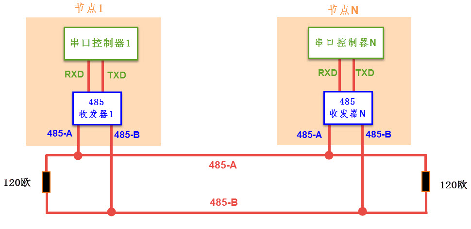
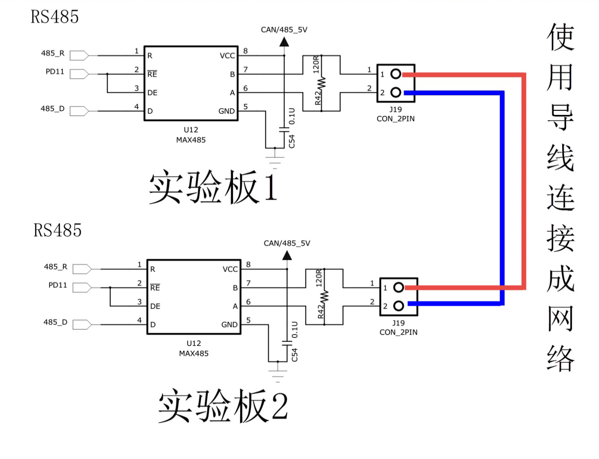
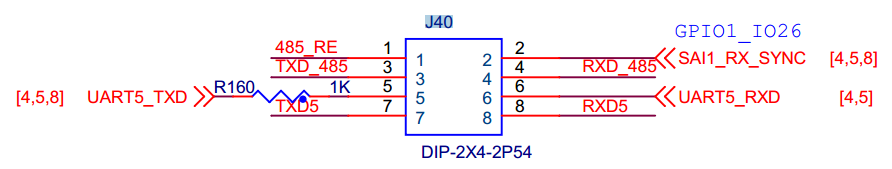
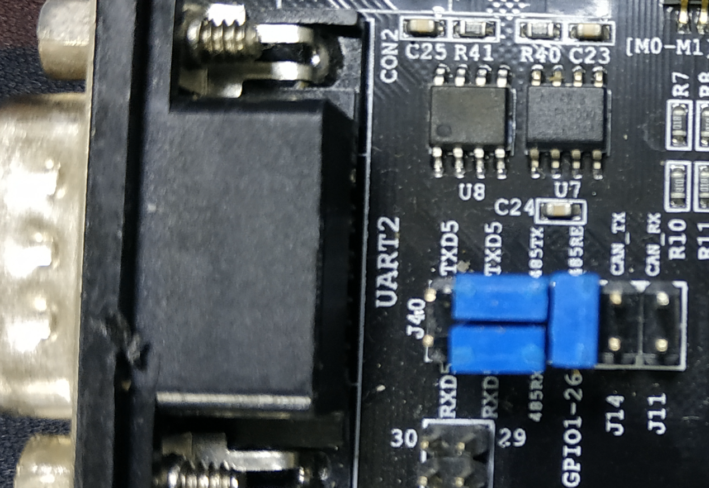

RS-485通讯实验
--------------

本章参考资料：《IMXRT1050RM》LPUART章节。

学习本章时，配合本书前面的《LPUART—串口通讯》及《CAN—通讯实验》章节进行对比学习，效果更佳。

关于实验板中使用的MAX485收发器资料可查阅《MAX485》规格书了解。

RS-485通讯协议简介
~~~~~~~~~~~~~~~~~~

与CAN类似，RS-485是一种工业控制环境中常用的通讯协议，它具有抗干扰能力强、传输距离远的特点。RS-485通讯协议由RS-232协议改进而来，协议层不变，只是改进了物理层，因而保留了串口通讯协议应用简单的特点。

RS-485的物理层
^^^^^^^^^^^^^^

从《CAN—通讯实验》章节中了解到，差分信号线具有很强的干扰能力，特别适合应用于电磁环境复杂的工业控制环境中，RS-485协议主要是把RS-232的信号改进成差分信号，从而大大提高了抗干扰特性，它的通讯网络示意图见图
35‑1。

图 35‑1 RS-485通讯网络示意图

对比CAN通讯网络，可发现它们的网络结构组成是类似的，每个节点都是由一个通讯控制器和一个收发器组成，在RS-485通讯网络中，节点中的串口控制器使用RX与TX信号线连接到收发器上，而收发器通过差分线连接到网络总线，串口控制器与收发器之间一般使用TTL信号传输，收发器与总线则使用差分信号来传输。发送数据时，串口控制器的TX信号经过收发器转换成差分信号传输到总线上，而接收数据时，收发器把总线上的差分信号转化成TTL信号通过RX引脚传输到串口控制器中。

RS-485通讯网络的最大传输距离可达1200米，总线上可挂载128个通讯节点，而由于RS-485网络只有一对差分信号线，它使用差分信号来表达逻辑，当AB两线间的电压差为-6V~-2V时表示逻辑1，当电压差为+2V~+6V表示逻辑0，在同一时刻只能表达一个信号，所以它的通讯是半双工形式的，它与RS-232通讯协议的特性对比见表
35‑1。

    表 35‑1 RS-232/422/485 标准对比

+----------+-------------+----------+-------------+-----------+------------------+
| 通讯标准 |   信号线    | 通讯方向 |  电平标准   | 通讯距离  |    通讯节点数    |
+==========+=============+==========+=============+===========+==================+
| RS232    | 单端TXD、RX | 全双工   | 逻辑1：-15V | 100米以内 | 只有两个节点     |
|          | D、GND      |          | ~-3V        |           |                  |
|          |             |          |             |           |                  |
|          |             |          | 逻辑0：+3V~ |           |                  |
|          |             |          | +15V        |           |                  |
+----------+-------------+----------+-------------+-----------+------------------+
| RS485    | 差分线AB    | 半双工   | 逻辑1：+2V~ | 1200米    | 支持多个节点。支 |
|          |             |          | +6V         |           | 持多个主设备，任 |
|          |             |          |             |           | 意节点间可互相通 |
|          |             |          | 逻辑0：-6V~ |           | 讯               |
|          |             |          | -2V         |           |                  |
+----------+-------------+----------+-------------+-----------+------------------+

RS-485与RS-232的差异只体现在物理层上，它们的协议层是相同的，也是使用串口数据包的形式传输数据。而由于RS-485具有强大的组网功能，人们在基础协议之上还制定了MODBUS协议，被广泛应用在工业控制网络中。此处说的基础协议是指前面串口章节中讲解的，仅封装了基本数据包格式的协议(基于数据位)，而MODBUS协议是使用基本数据包组合成通讯帧格式的高层应用协议(基于数据包或字节)。感兴趣的读者可查找MODBUS协议的相关资料了解。

由于RS-485与RS-232的协议层没有区别，进行通讯时，我们同样是使用RT1052的LPUART外设作为通讯节点中的串口控制器，再外接一个RS-485收发器芯片把LPUART外设的TTL电平信号转化成RS-485的差分信号即可。

RS-485—双机通讯实验
~~~~~~~~~~~~~~~~~~~

本小节演示如何使用RT1052的LPUART控制器与MAX485收发器，在两个设备之间使用RS-485协议进行通讯，本实验中使用了两个实验板，无法像CAN实验那样使用回环测试(把RT1052的
LPUART外设的TXD引脚使用杜邦线连接到RXD引脚可进行自收发测试，不过这样的通讯不经过RS-485收发器，跟普通TTL串口实验没有区别)，本教程主要以“USART—485通讯”工程进行讲解。

485通信与LPUART通信非常类似，本实验的程序是在“UART5接发”基础上修改得到的。该小节只讲解相对串口通信新增或修改的一些内容，有关串口详细配置过程请参考第18章
LPUART—串口通讯章节。

硬件设计
^^^^^^^^

图 35‑2 双CAN通讯实验硬件连接图

图36‑18中的是两个实验板的硬件连接。在单个实验板中，作为串口控制器的RT1052从LPUART外设引出TX和RX两个引脚与RS-485收发器MAX485相连，收发器使用它的A和B引脚连接到RS-485总线网络中。为了方便使用，我们每个实验板引出的A和B之间都连接了1个120欧的电阻作为RS-485总线的端电阻，所以要注意如果您要把实验板作为一个普通节点连接到现有的RS-485总线时，是不应添加该电阻的！

由于485只能以半双工的形式工作，所以需要切换状态，MAX485芯片中有“RE”和“DE”两个引脚，用于控制485芯片的收发工作状态的，当RE引脚为低电平时，485芯片处于接收状态，当DE引脚为高电平时芯片处于发送状态。实验板中使用了RT1052的GPIO_AD_B1_10直接连接到这两个引脚上，所以通过控制PD11的输出电平即可控制485的收发状态。

要注意的是，由于实验板的RS-232与RS-485通讯实验都使用RT1052的同一个LPUART外设及收发引脚，实验时注意必须要把RT1052的“LPUART5_RX引脚”与MAX485的“485_RX”及“LPUART5_TX”与“485_TX”使用跳线帽连接起来(这些信号都在485接线端子旁边的J40排针上)。跳帽连接原理图以及实物连接图如图35‑3和图 35‑4所示。

图 35‑3跳帽连接原理图

图 35‑4实物连接图

软件设计
^^^^^^^^

为了使工程更加有条理，我们把RS485控制相关的代码独立分开存储，方便以后移植。在“串口实验”之上新建“bsp_485.c”及“bsp_485.h”文件，这些文件也可根据您的喜好命名。这个实验的底层STM32驱动与串口控制区别不大，上层实验功能上与CAN实验类似。

编程要点
''''''''

(1) 初始化485通讯使用的LPUART外设及相关引脚；

(2) 编写控制MAX485芯片进行收发数据的函数；

(3) 编写测试程序，收发数据。

代码分析
''''''''

485硬件相关宏定义
*****************

我们把485硬件相关的配置都以宏的形式定义到 “bsp_485.h”文件中，如代码清单
35‑1所示。

.. code-block:: c
   :name: 代码清单 35‑1 485硬件配置相关的宏(bsp_485.h文件)
   :caption: 代码清单 35‑1 485硬件配置相关的宏(bsp_485.h文件)
   :linenos:

   /**************************第一部分******************************/
   #define _485_RE_GPIO             GPIO1
   #define _485_RE_GPIO_PIN         (26U)
   #define _485_RE_IOMUXC           IOMUXC_GPIO_AD_B1_10_GPIO1_IO26
   
   /***************************第二部分****************************/
   #define digital_H(p,i)      {p->DR |= (1U << i);}   //输出为高电平    
   #define digital_L(p,i)      {p->DR &= ~(1U << i);}  //输出低电平
   
   /*设置485为接收或发送*/
   #define _485_Resive           digital_L(_485_RE_GPIO,_485_RE_GPIO_PIN)
   #define _485_Send             digital_H(_485_RE_GPIO,_485_RE_GPIO_PIN) 
   
   /*********************此处省略LPUART相关宏定义***********/
   
   
   /**************************第三部分***************************/
   /* 485芯片接收、发送控制引脚*/
   #define RE_485_PAD_CONFIG_DATA          (SRE_0_SLOW_SLEW_RATE| \
                                          DSE_6_R0_6| \
                                          SPEED_2_MEDIUM_100MHz| \
                                          ODE_0_OPEN_DRAIN_DISABLED| \
                                          PKE_0_PULL_KEEPER_DISABLED| \
                                          PUE_0_KEEPER_SELECTED| \
                                          PUS_0_100K_OHM_PULL_DOWN| \
                                          HYS_0_HYSTERESIS_DISABLED)

以上代码是485芯片收、发控制引脚相关宏定义。串口相关宏定义与串口章节完全相同这里不再列出。各部分宏定义讲解如下。

-  第一部分，定义控制引脚的GPIO组、GPIO引脚号以及引脚的复用功能。本实验只需要该引脚输出高、低电平，所以选择通用GPIO模式即可。

-  第二部分，该部分使用宏定义封装了GPIO相关寄存器操作。通过这些宏定义可以高效、快速的更改相应引脚的数据电平。

-  第三部分，定义485芯片收、发控制引脚的PAD属性。

初始化485芯片的收、发控制引脚
**********************************

485芯片的收、发控制引脚实际是一个普通的GPIO，初始化代码如代码清单
35‑2所示。

.. code-block:: c
   :name: 代码清单 35‑2 RS485控制引脚初始化(bsp_485.c文件)
   :caption: 代码清单 35‑2 RS485控制引脚初始化(bsp_485.c文件)
   :linenos:

   void _485_Control_GPIO_init(void)
   {
      /* 定义gpio初始化配置结构体 */
      gpio_pin_config_t led_config;     
      
      IOMUXC_SetPinMux(_485_RE_IOMUXC, 0U);
      IOMUXC_SetPinConfig(_485_RE_IOMUXC, RE_485_PAD_CONFIG_DATA);
      
      /*GPIO配置*/       
      led_config.direction = kGPIO_DigitalOutput; //输出模式
      led_config.outputLogic =  0;                //默认高电平
      led_config.interruptMode = kGPIO_NoIntmode; //不使用中断
      
      /* 初始化  GPIO. */
      GPIO_PinInit(_485_RE_GPIO, _485_RE_GPIO_PIN, &led_config);
   }

使用宏定义和SDK官方提供的初始化函数我们很容易完成一个引脚的初始化。需要注意的是，这里需要将控制引脚的电平设置为低电平，这样可以保证系统启动后485处于接收状态。

使用中断接收数据
*****************

接下来我们编写在LPUART中断服务函数中接收数据的相关过程，如代码清单
35‑3所示。

.. code-block:: c
   :name: 代码清单 35‑3 中断接收数据的过程(bsp_485.c文件)
   :caption: 代码清单 35‑3 中断接收数据的过程(bsp_485.c文件)
   :linenos:

   /*********************第一部分******************************/
   volatile uint8_t ucTemp = ' '; //用于保存收到的字符
   volatile bool resived = false;//用于保存接收状态
   
   /*********************第二部分*****************************/
   void DEBUG_UART_IRQHandler(void)
   {
      /*串口接收到数据*/
      if ((kLPUART_RxDataRegFullFlag)&LPUART_GetStatusFlags(DEBUG_UARTx))
      {
      /*读取数据*/
      ucTemp = LPUART_ReadByte(DEBUG_UARTx);
      resived = true;
      }
   }

中断接收函数比较简单，第一部分，定义了两个变量，ucTemp用于存储接收到的字符，resived用于保存接收状态标志。第二部分，串口的接收中断服务函数，进入中断服务函数后首先检查是否为接收中断，如果是，则读取接收到的内容，并设置接收完成标志。读取操作会自动完成中断标志的清理，所以无需再进行清除中断标志位操作。

发送数据
*****************

RT1052使用485发送数据的过程也与普通的UART发送数据过程差不多，我们定义了一个_485_SendByte函数来发送一个字节的数据内容，如代码清单
35‑4所示。

.. code-block:: c
   :name: 代码清单 35‑4 发送数据(bsp_485.c文件)
   :caption: 代码清单 35‑4 发送数据(bsp_485.c文件)
   :linenos:

   /*****************第一部分*****************/
   /*简单延迟函数*/
   static void _485_delay(__IO uint32_t nCount)
   {
      for(; nCount != 0; nCount--);
   }
   
   void _485_SendByte(LPUART_Type *base, uint8_t data)
   {
   /*****************第二部分*****************/
      _485_Send                                     //使能发送
      _485_delay(90000);
      LPUART_WriteByte( base, data);                //执行发送
      while (!(base->STAT & LPUART_STAT_TDRE_MASK));//等待发送完成
   /*****************第三部分*****************/
      _485_delay(90000);
      _485_Resive
   }

各部分代码讲解如下。

-  第一部分，编写简单延时函数。

-  第二部分，设置485芯片控制端，将485切换到发送状态。宏_485_Send将485控制引脚设置为高电平，延时一段时间等待电平稳定后使用串口发送函数完成发送。

-  第三部分，当单片机发送完成后我们应该等待一段时间，保证485芯片也发送完成。在编写历程时发现如果不加延时很容易导致发送失败。

main函数
''''''''

最后我们来阅读main函数，了解整个通讯过程，见代码清单
35‑5。这个main函数的整体设计思路是，实验板检测自身的按键状态，若按键被按下，则通过485发送256个测试数据到网络总线上，若自身接收到总线上的256个数据，则把这些数据作为调试信息打印到电脑端。所以，如果把这样的程序分别应用到485总线上的两个通讯节点时，就可以通过按键控制互相发送数据了。

.. code-block:: c
   :name: 代码清单 35‑5 main函数(main.c)
   :caption: 代码清单 35‑5 main函数(main.c)
   :linenos:

   int main(void)
   {
   
   /*******此处省略系统初始化相关代码，和系统时钟输出先关代码********/
   
   /***************************第一部分************************/
      /* 初始化LED引脚 */
      LED_GPIO_Config(); 
      
      /*初始化uart5*/
      UART_Config();
      
      /*初始化485芯片接收与发送控制引脚*/
      _485_Control_GPIO_init();  
      
      PRINTF("这是一个485通信实验\r\n");
      PRINTF("程序大约每1秒发送一次字符‘a’接收到消息后则输出接收到的字符\r\n");
      while(1)
      {
      /***********************第二部分**********************/
      /* 亮红灯 */
      RGB_RED_LED_ON;
      RGB_GREEN_LED_OFF
      /*执行485发送*/
      _485_SendByte(DEBUG_UARTx,'a');  
      PRINTF("send finish \r\n");
         
      delay(LED_DELAY_COUNT);
      
      if(resived)
      {
         PRINTF("resive is:%c\r\n",ucTemp);
         resived = false;
      }
      /*亮绿灯*/
      RGB_RED_LED_OFF
      RGB_GREEN_LED_ON;
      delay(LED_DELAY_COUNT);    
      }
   }

在main函数中首先执行硬件初始化，之后再死循环中大约每一秒发送一次消息。结合代码讲解如下。

-  第一部分，本实验使用了RGB等指示程序运行状态，使用到了串口。所以首先要初始化LED等以及串口。最后还要使用_485_Control_GPIO_init函数初始化485芯片控制引脚。

-  第二部分，在while(1)里大约每一秒使用_485_SendByte函数发送一次消息。并不断检测接收状态，当检测到接收时通过串口打印接收到的内容。

下载验证
^^^^^^^^

正确连接两个开发板并正确连接J40排针跳线帽后将程序分别下载到两个开发板，系统启动后可以看到RGB等交替闪烁。打开串口调试助手并与开发板建立连接，正常情况下可以在串口调试助手中看到发送完成以及接收成功提示信息。

