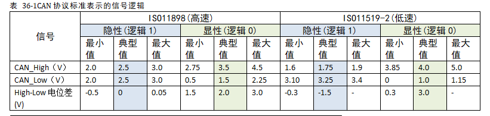
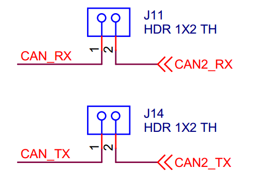

CAN—通讯实验
------------

本章参考资料：《IMXRT1050RM》。

若对CAN通讯协议不了解，可先阅读《CAN总线入门》、《CAN-bus规范》文档内容学习。

关于实验板上的CAN收发器可查阅《A1042》文档了解。

CAN协议简介
~~~~~~~~~~~

    CAN是控制器局域网络(Controller Area
    Network)的简称，它是由研发和生产汽车电子产品著称的德国BOSCH公司开发的，并最终成为国际标准（ISO11519），是国际上应用最广泛的现场总线之一。

    CAN总线协议已经成为汽车计算机控制系统和嵌入式工业控制局域网的标准总线，并且拥有以CAN为底层协议专为大型货车和重工机械车辆设计的J1939协议。近年来，它具有的高可靠性和良好的错误检测能力受到重视，被广泛应用于汽车计算机控制系统和环境温度恶劣、电磁辐射强及振动大的工业环境。

CAN物理层
^^^^^^^^^

    与I2C、SPI等具有时钟信号的同步通讯方式不同，CAN通讯并不是以时钟信号来进行同步的，它是一种异步通讯，只具有CAN_High和CAN_Low两条信号线，共同构成一组差分信号线，以差分信号的形式进行通讯。

闭环总线网络
''''''''''''

    CAN物理层的形式主要有两种，图
    36‑1中的CAN通讯网络是一种遵循ISO11898标准的高速、短距离“闭环网络”，它的总线最大长度为40m，通信速度最高为1Mbps，总线的两端各要求有一个“120欧”的电阻。

.. image:: media/image1.jpeg
   :align: center
   :alt: image1
   :name: 图36_1

图 36‑1CAN闭环总线通讯网络

开环总线网络
''''''''''''

图36‑2中的是遵循ISO11519-2标准的低速、远距离“开环网络”，它的最大传输距离为1km，最高通讯速率为125kbps，两根总线是独立的、不形成闭环，要求每根总线上各串联有一个“2.2千欧”的电阻。

图 36‑2 CAN开环总线通讯网络

通讯节点 
'''''''''

从CAN通讯网络图可了解到，CAN总线上可以挂载多个通讯节点，节点之间的信号经过总线传输，实现节点间通讯。由于CAN通讯协议不对节点进行地址编码，而是对数据内容进行编码的，所以网络中的节点个数理论上不受限制，只要总线的负载足够即可，可以通过中继器增强负载。

CAN通讯节点由一个CAN控制器及CAN收发器组成，控制器与收发器之间通过CAN_Tx及CAN_Rx信号线相连，收发器与CAN总线之间使用CAN_High及CAN_Low信号线相连。其中CAN_Tx及CAN_Rx使用普通的类似TTL逻辑信号，而CAN_High及CAN_Low是一对差分信号线，使用比较特别的差分信号，下一小节再详细说明。

当CAN节点需要发送数据时，控制器把要发送的二进制编码通过CAN_Tx线发送到收发器，然后由收发器把这个普通的逻辑电平信号转化成差分信号，通过差分线CAN_High和CAN_Low线输出到CAN总线网络。而通过收发器接收总线上的数据到控制器时，则是相反的过程，收发器把总线上收到的CAN_High及CAN_Low信号转化成普通的逻辑电平信号，通过CAN_Rx输出到控制器中。

例如，STM32的CAN片上外设就是通讯节点中的控制器，为了构成完整的节点，还要给它外接一个收发器，在我们实验板中使用型号为TJA1050的芯片作为CAN收发器。CAN控制器与CAN收发器的关系如同TTL串口与MAX3232电平转换芯片的关系，MAX3232芯片把TTL电平的串口信号转换成RS-232电平的串口信号，CAN收发器的作用则是把CAN控制器的TTL电平信号转换成差分信号(或者相反)。

差分信号
''''''''

差分信号又称差模信号，与传统使用单根信号线电压表示逻辑的方式有区别，使用差分信号传输时，需要两根信号线，这两个信号线的振幅相等，相位相反，通过两根信号线的电压差值来表示逻辑0和逻辑1。见图36‑3，它使用了V+与V-信号的差值表达出了图下方的信号。

.. image:: media/image3.jpeg
   :align: center
   :alt: image3
   :name: 图36_3

图 36‑3 差分信号

相对于单信号线传输的方式，使用差分信号传输具有如下优点：

-  抗干扰能力强，当外界存在噪声干扰时，几乎会同时耦合到两条信号线上，而接收端只关心两个信号的差值，所以外界的共模噪声可以被完全抵消。

-  能有效抑制它对外部的电磁干扰，同样的道理，由于两根信号的极性相反，他们对外辐射的电磁场可以相互抵消，耦合的越紧密，泄放到外界的电磁能量越少。

-  时序定位精确，由于差分信号的开关变化是位于两个信号的交点，而不像普通单端信号依靠高低两个阈值电压判断，因而受工艺，温度的影响小，能降低时序上的误差，同时也更适合于低幅度信号的电路。

由于差分信号线具有这些优点，所以在USB协议、485协议、以太网协议及CAN协议的物理层中，都使用了差分信号传输。

CAN协议中的差分信号
'''''''''''''''''''

CAN协议中对它使用的CAN_High及CAN_Low表示的差分信号做了规定，见表
36‑1及图36‑4。以高速CAN协议为例，当表示逻辑1时(隐性电平)，CAN_High和CAN_Low线上的电压均为2.5v，即它们的电压差V\ :sub:`H`-V:sub:`L`\ =0V；而表示逻辑0时(显性电平)，CAN_High的电平为3.5V，CAN_Low线的电平为1.5V，即它们的电压差为V\ :sub:`H`-V:sub:`L`\ =2V。例如，当CAN收发器从CAN_Tx线接收到来自CAN控制器的低电平信号时(逻辑0)，它会使CAN_High输出3.5V，同时CAN_Low输出1.5V，从而输出显性电平表示逻辑0。

表 36‑1CAN协议标准表示的信号逻辑

.. image:: media/image4.jpeg
   :align: center
   :alt: image4
   :name: 图36_4

图 36‑4 CAN的差分信号（高速）

在CAN总线中，必须使它处于隐性电平(逻辑1)或显性电平(逻辑0)中的其中一个状态。假如有两个CAN通讯节点，在同一时间，一个输出隐性电平，另一个输出显性电平，类似I2C总线的“线与”特性将使它处于显性电平状态，显性电平的名字就是这样来的，即可以认为显性具有优先的意味。

由于CAN总线协议的物理层只有1对差分线，在一个时刻只能表示一个信号，所以对通讯节点来说，CAN通讯是半双工的，收发数据需要分时进行。在CAN的通讯网络中，因为共用总线，在整个网络中同一时刻只能有一个通讯节点发送信号，其余的节点在该时刻都只能接收。

协议层
^^^^^^

以上是CAN的物理层标准，约定了电气特性，以下介绍的协议层则规定了通讯逻辑。

CAN的波特率及位同步
'''''''''''''''''''

    由于CAN属于异步通讯，没有时钟信号线，连接在同一个总线网络中的各个节点会像串口异步通讯那样，节点间使用约定好的波特率进行通讯，特别地，CAN还会使用“位同步”的方式来抗干扰、吸收误差，实现对总线电平信号进行正确的采样，确保通讯正常。

位时序分解
*****************

    为了实现位同步，CAN协议把每一个数据位的时序分解成如图
    36‑5所示的SS段、PTS段、PBS1段、PBS2段，这四段的长度加起来即为一个CAN数据位的长度。分解后最小的时间单位是Tq，而一个完整的位由8~25个Tq组成。为方便表示，图
    36‑5中的高低电平直接代表信号逻辑0或逻辑1(不是差分信号)。

.. image:: media/image5.png
   :align: center
   :alt: image5
   :name: 图36_5

图 36‑5 CAN位时序分解图

该图中表示的CAN通讯信号每一个数据位的长度为19Tq，其中SS段占1Tq，PTS段占6Tq，PBS1段占5Tq，PBS2段占7Tq。信号的采样点位于PBS1段与PBS2段之间，通过控制各段的长度，可以对采样点的位置进行偏移，以便准确地采样。

    各段的作用如介绍下：

-  SS段(SYNC SEG)

..

    SS译为同步段，若通讯节点检测到总线上信号的跳变沿被包含在SS段的范围之内，则表示节点与总线的时序是同步的，当节点与总线同步时，采样点采集到的总线电平即可被确定为该位的电平。SS段的大小固定为1Tq。

-  PTS段(PROP SEG)

..

    PTS译为传播时间段，这个时间段是用于补偿网络的物理延时时间。是总线上输入比较器延时和输出驱动器延时总和的两倍。PTS段的大小可以为1~8Tq。

-  PBS1段(PHASE SEG1)，

..

    PBS1译为相位缓冲段，主要用来补偿边沿阶段的误差，它的时间长度在重新同步的时候可以加长。PBS1段的初始大小可以为1~8Tq。

-  PBS2段(PHASE SEG2)

..

    PBS2这是另一个相位缓冲段，也是用来补偿边沿阶段误差的，它的时间长度在重新同步时可以缩短。PBS2段的初始大小可以为2~8Tq。

通讯的波特率
*****************

总线上的各个通讯节点只要约定好1个Tq的时间长度以及每一个数据位占据多少个Tq，就可以确定CAN通讯的波特率。

例如，假设上图中的1Tq=1us，而每个数据位由19个Tq组成，则传输一位数据需要时间T\ :sub:`1bit`
=19us，从而每秒可以传输的数据位个数为：

1x10\ :sup:`6`\ :sub:`­`/19 = 52631.6 (bps)

这个每秒可传输的数据位的个数即为通讯中的波特率。

同步过程分析
*****************

波特率只是约定了每个数据位的长度，数据同步还涉及到相位的细节，这个时候就需要用到数据位内的SS、PTS、PBS1及PBS2段了。

根据对段的应用方式差异，CAN的数据同步分为硬同步和重新同步。其中硬同步只是当存在“帧起始信号”时起作用，无法确保后续一连串的位时序都是同步的，而重新同步方式可解决该问题，这两种方式具体介绍如下：

(1) 硬同步

..

    若某个CAN节点通过总线发送数据时，它会发送一个表示通讯起始的信号(即下一小节介绍的帧起始信号)，该信号是一个由高变低的下降沿。而挂载到CAN总线上的通讯节点在不发送数据时，会时刻检测总线上的信号。

    见图
    36‑6，可以看到当总线出现帧起始信号时，某节点检测到总线的帧起始信号不在节点内部时序的SS段范围，所以判断它自己的内部时序与总线不同步，因而这个状态的采样点采集得的数据是不正确的。所以节点以硬同步的方式调整，把自己的位时序中的SS段平移至总线出现下降沿的部分，获得同步，同步后采样点就可以采集得正确数据了。

.. image:: media/image6.png
   :align: center
   :alt: image6
   :name: 图36_6

图 36‑6 硬同步过程图

(1) 重新同步

前面的硬同步只是当存在帧起始信号时才起作用，如果在一帧很长的数据内，节点信号与总线信号相位有偏移时，这种同步方式就无能为力了。因而需要引入重新同步方式，它利用普通数据位的高至低电平的跳变沿来同步(帧起始信号是特殊的跳变沿)。重新同步与硬同步方式相似的地方是它们都使用SS段来进行检测，同步的目的都是使节点内的SS段把跳变沿包含起来。

重新同步的方式分为超前和滞后两种情况，以总线跳变沿与SS段的相对位置进行区分。第一种相位超前的情况如图
36‑7，节点从总线的边沿跳变中，检测到它内部的时序比总线的时序相对超前2Tq，这时控制器在下一个位时序中的PBS1段增加2Tq的时间长度，使得节点与总线时序重新同步。

.. image:: media/image7.jpeg
   :align: center
   :alt: image7
   :name: 图36_7

图 36‑7 相位超前时的重新同步

第二种相位滞后的情况如图
36‑8，节点从总线的边沿跳变中，检测到它的时序比总线的时序相对滞后2Tq，这时控制器在前一个位时序中的PBS2段减少2Tq的时间长度，获得同步。

.. image:: media/image8.jpeg
   :align: center
   :alt: image8
   :name: 图36_8

图 36‑8 相位滞后时的重新同步

在重新同步的时候，PBS1和PBS2中增加或减少的这段时间长度被定义为“重新同步补偿宽度SJW
(reSynchronization Jump
Width)”。一般来说CAN控制器会限定SJW的最大值，如限定了最大SJW=3Tq时，单次同步调整的时候不能增加或减少超过3Tq的时间长度，若有需要，控制器会通过多次小幅度调整来实现同步。当控制器设置的SJW极限值较大时，可以吸收的误差加大，但通讯的速度会下降。

CAN的报文种类及结构
'''''''''''''''''''

    在SPI通讯中，片选、时钟信号、数据输入及数据输出这4个信号都有单独的信号线，I2C协议包含有时钟信号及数据信号2条信号线，异步串口包含接收与发送2条信号线，这些协议包含的信号都比CAN协议要丰富，它们能轻易进行数据同步或区分数据传输方向。而CAN使用的是两条差分信号线，只能表达一个信号，简洁的物理层决定了CAN必然要配上一套更复杂的协议，如何用一个信号通道实现同样、甚至更强大的功能呢？CAN协议给出的解决方案是对数据、操作命令(如读/写)以及同步信号进行打包，打包后的这些内容称为报文。

报文的种类
*****************

    在原始数据段的前面加上传输起始标签、片选(识别)标签和控制标签，在数据的尾段加上CRC校验标签、应答标签和传输结束标签，把这些内容按特定的格式打包好，就可以用一个通道表达各种信号了，各种各样的标签就如同SPI中各种通道上的信号，起到了协同传输的作用。当整个数据包被传输到其它设备时，只要这些设备按格式去解读，就能还原出原始数据，这样的报文就被称为CAN的“数据帧”。

    为了更有效地控制通讯，CAN一共规定了5种类型的帧，它们的类型及用途说明如表
    36‑2。

    表 36‑2 帧的种类及其用途

+--------+----------------------------------------------------+
| 帧     | 帧用途                                             |
+========+====================================================+
| 数据帧 | 用于节点向外传送数据                               |
+--------+----------------------------------------------------+
| 遥控帧 | 用于向远端节点请求数据                             |
+--------+----------------------------------------------------+
| 错误帧 | 用于向远端节点通知校验错误，请求重新发送上一个数据 |
+--------+----------------------------------------------------+
| 过载帧 | 用于通知远端节点：本节点尚未做好接收准备           |
+--------+----------------------------------------------------+
| 帧间隔 | 用于将数据帧及遥控帧与前面的帧分离开来             |
+--------+----------------------------------------------------+

数据帧的结构
*****************

    数据帧是在CAN通讯中最主要、最复杂的报文，我们来了解它的结构，见图
    36‑9。

.. image:: media/image9.png
   :align: center
   :alt: image9
   :name: 图36_9

图 36‑9 数据帧的结构

    数据帧以一个显性位(逻辑0)开始，以7个连续的隐性位(逻辑1)结束，在它们之间，分别有仲裁段、控制段、数据段、CRC段和ACK段。

-  帧起始

    SOF段(Start Of
    Frame)，译为帧起始，帧起始信号只有一个数据位，是一个显性电平，它用于通知各个节点将有数据传输，其它节点通过帧起始信号的电平跳变沿来进行硬同步。

-  仲裁段

    当同时有两个报文被发送时，总线会根据仲裁段的内容决定哪个数据包能被传输，这也是它名称的由来。

    仲裁段的内容主要为本数据帧的ID信息(标识符)，数据帧具有标准格式和扩展格式两种，区别就在于ID信息的长度，标准格式的ID为11位，扩展格式的ID为29位，它在标准ID的基础上多出18位。在CAN协议中，ID起着重要的作用，它决定着数据帧发送的优先级，也决定着其它节点是否会接收这个数据帧。CAN协议不对挂载在它之上的节点分配优先级和地址，对总线的占有权是由信息的重要性决定的，即对于重要的信息，我们会给它打包上一个优先级高的ID，使它能够及时地发送出去。也正因为它这样的优先级分配原则，使得CAN的扩展性大大加强，在总线上增加或减少节点并不影响其它设备。

    报文的优先级，是通过对ID的仲裁来确定的。根据前面对物理层的分析我们知道如果总线上同时出现显性电平和隐性电平，总线的状态会被置为显性电平，CAN正是利用这个特性进行仲裁。

    若两个节点同时竞争CAN总线的占有权，当它们发送报文时，若首先出现隐性电平，则会失去对总线的占有权，进入接收状态。见图
    36‑10，在开始阶段，两个设备发送的电平一样，所以它们一直继续发送数据。到了图中箭头所指的时序处，节点单元1发送的为隐性电平，而此时节点单元2发送的为显性电平，由于总线的“线与”特性使它表达出显示电平，因此单元2竞争总线成功，这个报文得以被继续发送出去。

.. image:: media/image10.png
   :align: center
   :alt: image10
   :name: 图36_10

图 36‑10 仲裁过程

    仲裁段ID的优先级也影响着接收设备对报文的反应。因为在CAN总线上数据是以广播的形式发送的，所有连接在CAN总线的节点都会收到所有其它节点发出的有效数据，因而我们的CAN控制器大多具有根据ID过滤报文的功能，它可以控制自己只接收某些ID的报文。

    回看图
    36‑9中的数据帧格式，可看到仲裁段除了报文ID外，还有RTR、IDE和SRR位。

(1) RTR位(Remote Transmission Request Bit)，译作远程传输请求位，它是用于区分数据帧和遥控帧的，当它为显性电平时表示数据帧，隐性电平时表示遥控帧。

(2) IDE位(Identifier Extension Bit)，译作标识符扩展位，它是用于区分标准格式与扩展格式，当它为显性电平时表示标准格式，隐性电平时表示扩展格式。

(3) SRR位(Substitute Remote Request Bit)，只存在于扩展格式，它用于替代标准格式中的RTR位。由于扩展帧中的SRR位为隐性位，RTR在数据帧为显性位，所以在两个ID相同的标准格式报文与扩展格式报文中，标准格式的优先级较高。

-  控制段

    在控制段中的r1和r0为保留位，默认设置为显性位。它最主要的是DLC段(Data
    Length
    Code)，译为数据长度码，它由4个数据位组成，用于表示本报文中的数据段含有多少个字节，DLC段表示的数字为0~8。

-  数据段

    数据段为数据帧的核心内容，它是节点要发送的原始信息，由0~8个字节组成，MSB先行。

-  CRC段

    为了保证报文的正确传输，CAN的报文包含了一段15位的CRC校验码，一旦接收节点算出的CRC码跟接收到的CRC码不同，则它会向发送节点反馈出错信息，利用错误帧请求它重新发送。CRC部分的计算一般由CAN控制器硬件完成，出错时的处理则由软件控制最大重发数。

在CRC校验码之后，有一个CRC界定符，它为隐性位，主要作用是把CRC校验码与后面的ACK段间隔起来。

-  ACK段

    ACK段包括一个ACK槽位，和ACK界定符位。类似I2C总线，在ACK槽位中，发送节点发送的是隐性位，而接收节点则在这一位中发送显性位以示应答。在ACK槽和帧结束之间由ACK界定符间隔开。

-  帧结束

..

    EOF段(End Of
    Frame)，译为帧结束，帧结束段由发送节点发送的7个隐性位表示结束。

其它报文的结构
*****************

    关于其它的CAN报文结构，不再展开讲解，其主要内容见图 36‑11。

.. image:: media/image11.png
   :align: center
   :alt: image11
   :name: 图36_11

图 36‑11 各种CAN报文的结构

RT1052的CAN外设简介
~~~~~~~~~~~~~~~~~~~

    RT1052的芯片中具有FlexCAN控制器 (Basic Extended CAN)，它支持CAN
    2.0B标准。

    该CAN控制器支持最高的通讯速率为1Mb/s；可以自动地接收和发送CAN报文，支持使用标准ID和扩展ID的报文；拥有多达64邮箱，所有邮箱都支持标准格式和扩展格式，每个邮箱可单独配置为接收邮箱或发送邮箱。发送报文的优先级可以使用软件控制，可使用过滤功能只接收某些ID号的报文；可配置成自动重发；不支持使用DMA进行数据收发。

STM32的CAN架构剖析
^^^^^^^^^^^^^^^^^^

.. image:: media/image12.png
   :align: center
   :alt: image12
   :name: 图36_12

图 36‑12 STM32的CAN外设架构图

RT1052的有两组CAN控制器，本章以CAN2为例讲解，配套程序中也将以CAN2为例。框图中主要包含CAN接收/发送邮箱、协议引擎、接收过滤、发送仲裁以及中断请求，下面对框图中的各个部分进行介绍。

CAN外部通信引脚
'''''''''''''''

CAN通过Tx_Pin和Rx_Pin与外部CAN电平转换芯片连接，i.MX RT1052
Pro开发板板载了一片高性能CAN电平转换芯片A1042，芯片详细信息请参考《A1042》。i.MX
RT1052
mini开发板需要外接CAN通信模块才能实现与外部通信。CAN通信引脚定义如表
36‑3所示。

表 36‑3CAN通信引脚

+----------+-------------+---------------+
| CAN外设  | 引脚功能    | 引脚编号      |
+==========+=============+===============+
| FLEXCAN1 | FLEXCAN1_TX | GPIO_AD_B1_08 |
+----------+-------------+---------------+
|          |             | GPIO_B0_02    |
+----------+-------------+---------------+
|          |             | GPIO_EMC_17   |
+----------+-------------+---------------+
|          |             | GPIO_SD_B1_02 |
+----------+-------------+---------------+
|          | FLEXCAN1_RX | GPIO_AD_B1_09 |
+----------+-------------+---------------+
|          |             | GPIO_B0_03    |
+----------+-------------+---------------+
|          |             | GPIO_EMC_18   |
+----------+-------------+---------------+
|          |             | GPIO_SD_B1_03 |
+----------+-------------+---------------+
| FLEXCAN2 | FLEXCAN2_TX | GPIO_AD_B0_02 |
+----------+-------------+---------------+
|          |             | GPIO_EMC_09   |
+----------+-------------+---------------+
|          |             | GPIO_B1_08    |
+----------+-------------+---------------+
|          |             | GPIO_AD_B0_14 |
+----------+-------------+---------------+
|          | FLEXCAN2_RX | GPIO_AD_B0_03 |
+----------+-------------+---------------+
|          |             | GPIO_EMC_10   |
+----------+-------------+---------------+
|          |             | GPIO_AD_B0_15 |
+----------+-------------+---------------+
|          |             | GPIO_B1_09    |
+----------+-------------+---------------+

协议引擎
''''''''

从图
36‑12不难看出，这部分的作用是将单片机内部的数据转化为对应通信引脚的高低电平。这部分工作由硬件自动完成，编写程序时我们无需关心，简单了解即可。

接收和发送邮箱
''''''''''''''

RT1052的每个CAN外设提供了64个邮箱，这些邮箱可通过软件单独配置为接收或发送。所有邮箱既支持标准帧也支持扩展帧。在芯片内部，一个邮对应16字节长度的存储区域，邮箱结构如图
36‑13所示。

图 36‑13邮箱结构

邮箱各部分作用介绍如下：

-  CODE字段，邮箱状态编码。用于记录邮箱当前状态以及消息匹配，仲裁过程也会使用到该字段。邮箱用作接收或发送时该字段的含义不同。当用作接收邮箱时CODE的值与邮箱状态对应关系如表
   36‑4所示。

表 36‑4接收邮箱CODE字段

+------------------+-------------------------------------+
| CODE值(二进制)   | 邮箱状态描述                        |
+==================+=====================================+
| 0b0000：INACTIVE | 邮箱没有被启用。不会接收任何内容。  |
+------------------+-------------------------------------+
| 0b0100：EMPTY    | 当前邮箱为空。                      |
+------------------+-------------------------------------+
| 0b0010：FULL     | 当前邮箱为满。                      |
+------------------+-------------------------------------+
| 0b0110：OVERRUN  | 当前邮箱溢出。                      |
+------------------+-------------------------------------+
| 0b1010：RANSWER  | 接收到远程请求帧。                  |
+------------------+-------------------------------------+
| CODE[0]=1b1      | FlexCAN正在更新邮箱，CPU 不能访问。 |
+------------------+-------------------------------------+

当邮箱收到消息或者收到的消息被处理，FlexCAN会自动更新CODE字段的值。我们可以通过读取该字段的值得知当前邮箱状态。

当邮箱用作发送邮箱时CODE的值与邮箱状态对应关系如表 36‑5所示。

表 36‑5发送邮箱CODE字段

+------------------+--------------------------------------------------------------------+
|  CODE值(二进制)  |                           邮箱状态描述。                           |
+==================+====================================================================+
| 0b1000：INACTIVE | 邮箱闲置，未启用。                                                 |
+------------------+--------------------------------------------------------------------+
| 0b1001：ABORT    | 停止状态，此时邮箱不参与发送仲裁。邮箱里的内容不会被发送。         |
+------------------+--------------------------------------------------------------------+
| 0b1100：DATA     | 无条件执行数据帧传输，传输完成之后                                 |
|                  |                                                                    |
|                  | 返回到非活动状态。                                                 |
+------------------+--------------------------------------------------------------------+
| 0b1100：REMOTE   | 当前邮箱为远程请求帧，FlesCAN将会无条件的执行发送，并且发送        |
|                  | 完成后该邮箱自动设置为具有相同ID的空接收邮箱。                     |
+------------------+--------------------------------------------------------------------+
| 0b1110：TANSWER  | 当远程请求匹配时，该邮箱将无条件发送一个响应帧，发送完成后将自动返 |
|                  | 回到RANSWER状态。                                                  |
+------------------+--------------------------------------------------------------------+

-  SRR字段、 IDE字段、RTR字段以及DLC字段在36.1.2
   2CAN的报文种类及结构章节已将详细介绍这里不再赘述。

-  TIME
   STAMP字段，在FlexCAN模块内部拥有一个16位自由运行计数器。当FlexCAN从CAN总线上检测到与该邮箱匹配的标识符后采样定时器的计数值保存到该字段。使用到该字段时将会详细介绍。

-  PRIO字段，PRIO是priority前四个字母，用于设置发送邮箱本地优先级，如果邮箱作为接收邮箱则该位不起作用。由于FlexCAN同一时间可以有多个等待发送的邮箱，根据MCR[LPRIO_EN]寄存器决定是否使用发送邮箱本地优先级。如果MCR[LPRIO_EN]
   = 0，不使用优先级，FlexCAN根据邮箱编号从低到高一次发送。MCR[LPRIO_EN]
   = 1，FlexCAN按照该字段设置的优先级依次发送，数值越小优先级越高。

-  ID Standard字段、ID Extended字段。 ID Standard字段时11位的标准ID。 ID
   Standard字段和ID Extended字段共29位，用作扩展ID。

-  DATA BYTE0 ~ DATA BYTE7，用于存储数据，一个数据帧最能够使用8个字节。

在这里只是简单的介绍了邮箱的各个字段的作用，有关邮箱（或者称为缓冲区）的内容还有很多，是学习本章的重点，稍后将会使用单独的一小节介绍邮箱。

发送仲裁
''''''''

当程序中存在多个需要发送的邮箱时，根据MCR[LPRIO_EN]寄存器以及CTRL1[LBUF]寄存器配置使用不同的发送顺序。MCR[LPRIO_EN]寄存器是为向后兼容提供的，用于控制是否开启本地优先级特性，设置为1
表示启用本地优先级。CTRL1[LBUF]

设置为0表示按照优先级高低传输数据，设置为1表示按照发送缓冲区编号从低到高依次发送。

接收FIFO 
'''''''''

当设置MCR[RFEN] =
1时，启用接收FIFO，接收FIFO共6级深度，占用邮箱0到5的内存区域。接收FIFO结构如图
36‑14所示。

图 36‑14接收FIFO结构

从图 36‑14与图 36‑13邮箱结构非常相似，结合图 36‑14介绍如下：

-  区域0x80-0x8C，该部分作为FIFO的输出，程序中使用读取邮箱的方式读取该部分可以获取FIFO中的内容。FlexCAN接收到数据后由硬件自动存储到FIFO结构中。

-  区域0x90-0xDC，从地址上计算，这部分区域是邮箱1到5对应的内存区域。作为六级深度FIFO的一部分，不过程序无法操作这部分内容，它由FlexCAN内部使用。程序中只需要通过读取区域0x80-0x8C区域即可依次获取FIFO里的内容。

-  区域0xE0-
   0x2DC，该部分用于设置接收过滤即ID筛选表。这个区域长度不是固定的，通过软件可以配置使用多少个ID筛选表以及使用怎样的格式。ID筛选表格式如图
   36‑15所示。

图 36‑15ID筛选表格式

从图 36‑15可以看出ID筛选表共有A、B、C三种格式，下面简单讲解这三种格式。

1. 格式A，格式A中每32位代表一个筛选器，筛选器区域最大为0xE0-
   0x2DC，所以在该模式下最多使用128个筛选器。每个ID筛选器又分为RTR、IDE、RXIDA三个字段。
   RTR=1表示可以接收远程帧，而拒绝数据帧。RTR=0表示远程帧被拒绝，而数据帧可以被接收。IDE
   = 1表示可以接收扩展帧，也可以拒绝标准帧，IDE =
   0表示扩展帧被拒绝，标准帧可以接收。

    RXIDA字段的设置与IDE有关，如果选择标准帧则29~19位共11位用设置要筛选的作标准ID，如果选择扩展帧则29~1位共29位用作设置要筛选的扩展格式ID。

1. 格式B，格式B与格式A有很多相似之处，每个ID筛选器占用16位，所以在该模式下最多使用256个筛选器。RTR与IDE字段的作用与格式A相同，RXIDB字段最多只有14位，所以用作筛选扩展ID时只能筛选前14位ID。

2. 格式C，格式C与A和B差别较大，每个筛选器占用8位，所以最多可以设置512个筛选器。没有了RTR与IDE字段所以这8位用作设置标准模式或扩展模式的筛选ID。

FlexCAN接收FIFO以及过滤器数量设置
~~~~~~~~~~~~~~~~~~~~~~~~~~~~~~~~~

在RT1052中虽然有多大64个邮箱，每个邮箱可用于接收或者发送，但是如果使用了接收FIFO功能或者接收过滤功能，能够使用的邮箱数量就不再是64个。根据之前讲解，如果使用了接收FIFO则邮箱0到5将会被占用。同样使用过滤器也会占用邮箱，导致可用的邮箱数量减少，更详细的的说明如图
36‑16和图 36‑17所示。

图 36‑16可用邮箱（1）

图 36‑17可用邮箱（2）

图 36‑16与图
36‑17中阴影部分是已经被占用的邮箱。RFEN是接收FIFO使能位，设置为1表示启用接收FIFO，邮箱0到5将会被接收FIFO占用。RFFN是FLEXCANx_CTRL2[RFFN]寄存器，用于设置使用多少个接收过滤。该寄存器的值每增加1则增加8个接收过滤器，同时两个邮箱将会被占用。

CAN工作模式
~~~~~~~~~~~

FlexCAN模块有四种功能模式:正常模式(用户和管理员)、冻结模式、只听模式和回送模式。还有两种低功耗模式:禁用模式和停止模式。下面简单讲解各个工作模式。

正常模式(用户或管理员)
^^^^^^^^^^^^^^^^^^^^^^^^^^^^

正常模式下就是一个正常的CAN节点，可以向总线发送数据和接收数据。所有CAN协议功能启用。但是用户模式和管理员模式在访问某些受限制的控制寄存器方面有所不同。

冻结模式
^^^^^^^^^^^^^^^^^^^^^^^^^^^^

使用它可设置CAN处于工作状态或禁止收发的状态，禁止收发时仍可访问接收FIFO中的数据。这两种状态是当RT1052芯片处于程序调试模式时才使用的，平时使用并不影响。

监听模式
^^^^^^^^^^^^^^^^^^^^^^^^^^^^

当FLEXCANx_CTRL1[LOM]被置1则FlexCAN将会进入监听模式。在这种模式下，传输被禁用，所有错误计数器被冻结，此时CAN工作在被动错误模式。只有其他CAN节点确认的消息才会被接收，如果FlexCAN检测到一条未被确认的消息，它将标记一个BIT0错误。

回环模式
^^^^^^^^^^^^^^^^^^^^^^^^^^^^

当FLEXCANx_CTRL1[LPB]
被置1则FlexCAN将会进入回环模式。在该模式下FLEXCAN执行一个内部循环，可以用于自我测试操作。发射机的位流输出在内部反馈给接收机输入并且忽略外部输入引脚。FlexCAN在回环模式下的行为与它在正常模式下的行为相同，它将自己传输的消息视为从远程节点接收的消息。在这种模式下，FlexCAN忽略接收过滤设置。

禁用模式
^^^^^^^^^^^^^^^^^^^^^^^^^^^^

当FLEXCANx_MCR[MDIS]寄存器以及FLEXCANx_MCR[LPM_ACK]寄存器被设置则FlexCAN将会进入禁用模式。通过软件清除FLEXCANx_MCR[MDIS]寄存器退出禁用模式。

停止模式
^^^^^^^^^^^^^^^^^^^^^^^^^^^^

当FLEXCANx_MCR[LPM_ACK]寄存器被设置并且收到来自系统停止请求时FlexCAN将会进入停止模式。在该模式下模块将自己置于非活动状态，然后通知ARM时钟可以全局关闭。当停止模式请求被删除或在CAN总线上检测到活动并启用自唤醒机制时，退出此模式。

CAN初始化结构体
~~~~~~~~~~~~~~~

从RT1052的Flex
CAN外设我们了解到它的功能非常多，控制涉及的寄存器也非常丰富，而使用NXP官方提供的各种结构体及库函数可以简化这些控制过程。跟其它外设一样，RT1052的SDK库提供了初始化结构体及初始化函数来控制FlexCAN的工作方式，提供了收发报文使用的结构体及收发函数，还有配置控制筛选器模式及ID的结构体。这些内容都定义在库文件“fsl_flexcan.h”及“fsl_flexcan.c”中，编程时我们可以结合这两个文件内的注释使用或参考库帮助文档。

首先我们来学习初始化结构体的内容，如代码清单 36‑1所示。

.. code-block:: c
   :name: 代码清单 36‑1FlexCAN 初始化结构体(fsl_flexcan.h)
   :caption: 代码清单 36‑1FlexCAN 初始化结构体(fsl_flexcan.h)
   :linenos:

    /*FlexCAN 初始化结构体 */
    typedef struct _flexcan_config
    {
        uint32_t baudRate; /*FlexCAN 波特率，单位：bps. */
    #if (defined(FSL_FEATURE_FLEXCAN_HAS_FLEXIBLE_DATA_RATE) \
            && FSL_FEATURE_FLEXCAN_HAS_FLEXIBLE_DATA_RATE)
        uint32_t baudRateFD; /*FlexCAN 可变波特率，单位：bps.  */
    #endif
        flexcan_clock_source_t clkSrc;      /*选择FlexCAN的时钟源*/
        flexcan_wake_up_source_t wakeupSrc; /*选择FlexCAN 唤醒源*/
        uint8_t maxMbNum;                   /*用户使用的消息缓冲区的最大数量*/
        bool enableLoopBack;                /*启用或禁用回环自测试模式*/
        bool enableTimerSync;               /*启用或禁用计时器同步*/
        bool enableSelfWakeup;              /*启用或禁用自唤醒模式*/
        bool enableIndividMask;             /*启用或禁用接收过滤*/
    #if (defined(FSL_FEATURE_FLEXCAN_HAS_DOZE_MODE_SUPPORT) &&\
                    FSL_FEATURE_FLEXCAN_HAS_DOZE_MODE_SUPPORT)
        bool enableDoze; /*启用或禁用打盹模式*/
    #endif
        flexcan_timing_config_t timingConfig; /* 协议时间 . */
    } flexcan_config_t;

这些结构体成员说明如下：

-  baudRate：用于设置CAN通信的波特率，最高支持10000bps。

-  baudRateFD：当使用柔性波特率时该变量用于设置柔性波特率，在本实验中不使用柔性波特率，所以设置变量无效。

-  clkSrc：用于选择CAN通信的时钟源。

-  wakeupSrc：用于选择FlexCAN唤醒源，它是一个flexcan_wake_up_source_t枚举类型如代码清单
   36‑2所示。

.. code-block:: c
   :name: 代码清单 36‑2FlexCAN 唤醒源(fsl_flexcan.h)
   :caption: 代码清单 36‑2FlexCAN 唤醒源(fsl_flexcan.h)
   :linenos:

    /* FlexCAN 唤醒源*/
    typedef enum _flexcan_wake_up_source
    {
        kFLEXCAN_WakeupSrcUnfiltered = 0x0U, /*检测到接收即唤醒FlexCAN*/
        kFLEXCAN_WakeupSrcFiltered = 0x1U, /*通过过滤器的接收才能唤醒FlexCAN*/
    } flexcan_wake_up_source_t;

从代码清单36‑2可以看出，FlexCAN唤醒方式有两种选择，一种是只要接收到即唤醒FlexCAN，另外一种是只有经过过滤器的有效接收才能唤醒FlexCAN。

-  enableLoopBack：启用或禁用回环自测试模式。

-  enableTimerSync：启用或禁用计时器同步。

-  enableSelfWakeup：启用或禁用自唤醒模式。

-  enableIndividMask：启用或禁用接收过滤。

-  enableDoze：启用或禁用打盹模式。

-  timingConfig：设置协议时间。

FlexCAN消息缓冲结构体
~~~~~~~~~~~~~~~~~~~~~

在发送消息之前，需要将发送内容以及接收方信息写入到消息缓冲结构体中，然后执行发送。同样，接收到消息时也会将接收到的内容以及接收相关信息保存到对应的消息缓冲结构体中。利用RT1052库提供的消息缓冲结构体可以方便地完成FlexCAN接收与发送工作，如代码清单
36‑3所示。

.. code-block:: c
   :name: 代码清单 36‑3FlexCAN消息缓冲结构体(fsl_flexcan.h)
   :caption: 代码清单 36‑3FlexCAN消息缓冲结构体(fsl_flexcan.h)
   :linenos:

    /*FlexCAN消息缓冲结构体*/
    typedef struct _flexcan_mb_transfer
    {
    #if (defined(FSL_FEATURE_FLEXCAN_HAS_FLEXIBLE_DATA_RATE)\
                    && FSL_FEATURE_FLEXCAN_HAS_FLEXIBLE_DATA_RATE)
        flexcan_fd_frame_t *framefd;
    #endif
        flexcan_frame_t *frame; /*要传输的CAN消息的缓冲区*/
        uint8_t mbIdx;          /*用于指定邮箱编号*/
    } flexcan_mb_transfer_t;

从代码清单 36‑3不难看出，该结构体共有三个成员，各个成员的意义如下：

-  framefd：当使用柔性波特率（可变波特率）用于指定消息缓冲区地址，本实验没有使用柔性波特率，所以忽略该设置项。

-  frame：指定要传输的数据信息，它是一个flexcan_frame_t类型的结构体，原型如代码清单
   36‑4所示。

.. code-block:: c
   :name: 代码清单 36‑4FlexCAN消息框架结构(fsl_flexcan.h)
   :caption: 代码清单 36‑4FlexCAN消息框架结构(fsl_flexcan.h)
   :linenos:

    /*FlexCAN消息框架结构*/
    typedef struct _flexcan_frame
    {
    
    /***************第一部分*****************/
        struct
        {
            uint32_t timestamp : 16; /*FlexCAN内部自由运行计数器时间戳*/
            uint32_t length : 4;  /*FlexCAN数据长度可取0到8 */
            uint32_t type : 1;    /*FlexCAN帧类型（数据帧或者遥控帧）*/
            uint32_t format : 1;  /*FlexCAN帧标识()*/
            uint32_t : 1;         /*保留位Reserved.*/
            uint32_t idhit : 9;   /*FlexCAN接收FIFO过滤器ID*/
        };
        /***************第二部分*****************/
        struct
        {
            uint32_t id : 29; /*CAN帧标志符*/
            uint32_t : 3;     /*保留位*/
        };
        /***************第三部分*****************/
        union
        {
            struct
            {
                uint32_t dataWord0; /*数据1（32位）*/
                uint32_t dataWord1; /*数据2（32位）*/
            };
            struct
            {
                uint8_t dataByte3; /*字节3*/
                uint8_t dataByte2; /*字节2*/
                uint8_t dataByte1; /*字节1 */
                uint8_t dataByte0; /*字节0*/
                uint8_t dataByte7; /*字节7*/
                uint8_t dataByte6; /*字节6*/
                uint8_t dataByte5; /*字节5*/
                uint8_t dataByte4; /*字节4*/
            };
        };
    } flexcan_frame_t;

该结构体主要分为三部分，各部分的讲解如下：

(1) 第一部分，当用作发送缓冲时用于设置发送时间戳、要发送的数据长度、数据帧类型。当用作接收缓冲时用于记录收到数据时的时间戳、收到的数据长度、数据帧类型以及过滤器ID号。

(2) 第二部分，该部分用于设置CAN帧标志符。帧标志符的设置需要借助宏FLEXCAN_ID_STD（）或宏FLEXCAN_ID_EXT（）设置。

(3) 第三部分，当用作发送缓冲时用于设置将要发送的数据，当用作接收缓冲时用于保存接收到的内容。该部分是一个枚举类型，我们可以使用32位读写也可以按字节读写。

-  mbIdx：指定使用的邮箱编号。

CAN—双机通讯实验
~~~~~~~~~~~~~~~~

本小节演示如何使用RT1052的FlexCAN外设实现两个设备之间的通讯，该实验中使用了两个实验板，如果您只有一个实验板，也可以使用FlexCAN的回环模式进行测试，不影响学习的。为此，我们提供了“CAN—双机通讯”及“CAN—回环测试”两个工程，可根据自己的实验环境选择相应的工程来学习。这两个工程的主体都是一样的，本教程主要以“CAN—双机通讯”工程进行讲解。

硬件设计
^^^^^^^^

图 36‑18 双CAN通讯实验硬件连接图

图36‑18中的是两个实验板的硬件连接。在单个实验板中，作为CAN控制器的RT1052引出CAN_Tx和CAN_Rx两个引脚与CAN收发器TJA1042相连，收发器使用CANH及CANL引脚连接到CAN总线网络中。为了方便使用，我们每个实验板引出的CANH及CANL都连接了1个120欧的电阻作为CAN总线的端电阻，所以要注意如果您要把实验板作为一个普通节点连接到现有的CAN总线时，是不应添加该电阻的！

要实现通讯，我们还要使用导线把实验板引出的CANH及CANL两条总线连接起来，才能构成完整的网络。实验板之间CANH1与CANH2连接，CANL1与CANL2连接即可。

如果您使用的是单机回环测试的工程实验，就不需要使用导线连接板子了，而且也不需要给收发器供电，因为回环模式的信号是不经过收发器的。

注意，如果使用野火i.MX RT1052
MINI底板需要用户外接CAN电平转换芯片才能完成CAN双机通信实验。如果使用野火i.MX
RT1052-Pro底板则无需外接CAN电平转换芯片，使用跳帽短接J11和J14即可。如图
36‑19所示。

图 36‑19FlexCAN跳帽连接

软件设计
^^^^^^^^

为了使工程更加有条理，我们把CAN控制器相关的代码独立分开存储，方便以后移植。在“串口实验”之上新建“bsp_can.c”及“bsp_can.h”文件，这些文件也可根据您的喜好命名，它们不属于RT1052
SDK库的内容，是由我们自己根据应用需要编写的。

编程要点
''''''''

(1) 初始化FlexCAN通讯使用的目标引脚及端口时钟；

(2) 使能FlexCAN外设的时钟；

(3) 配置FlexCAN外设的工作模式、位时序以及波特率；

(4) 编写测试程序，收发报文并校验。

代码分析
''''''''

CAN硬件相关宏定义
*****************

我们把CAN硬件相关的配置都以宏的形式定义到 “bsp_can.h”文件中，如代码清单
36‑5所示。

.. code-block:: c
   :name: 代码清单 36‑5FlexCAN通信相关宏定义(bsp_can.h)
   :caption: 代码清单 36‑5FlexCAN通信相关宏定义(bsp_can.h)
   :linenos:

    /*此处省略引脚相关宏定义*/
    
    /*******************第一部分********************/
    /*CAN相关宏定义*/
    #define EXAMPLE_CAN CAN2                 //定义使用的CAN
    #define EXAMPLE_FLEXCAN_IRQn CAN2_IRQn   //定义中断号
    #define EXAMPLE_FLEXCAN_IRQHandler CAN2_IRQHandler//定义中断服务函数
    
    /******************第二部分*********************/
    /*发送邮箱相关定义*/
    #define RX_MESSAGE_BUFFER_NUM (9)    //定义使用的接收邮箱
    #define TX_MESSAGE_BUFFER_NUM (8)    //定义使用的发送邮箱
    #define DLC (8)                      //定义数据长度
    
    /*****************第三部分***********************/
    /*时钟相关宏定义*/
    /*选择时钟源，PLL3(480 MHz)经过6分频后(80MHz)作为CAN根时钟。*/
    #define FLEXCAN_CLOCK_SOURCE_SELECT (2U) 
    /*设置时钟分频，80MHz的CAN根时钟经过分频后作为CAN时钟源。*/
    #define FLEXCAN_CLOCK_SOURCE_DIVIDER (3U)
    /* 读取CAN是工作频率 */
    #define EXAMPLE_CAN_CLK_FREQ  ((CLOCK_GetFreq(kCLOCK_Usb1PllClk) / 6)\
                    / (FLEXCAN_CLOCK_SOURCE_DIVIDER + 1U))

FlexCAN相关的宏定义大致分为三部分，如代码清单
36‑5所示，各部分宏定义简单说明如下。

-  第一部分，定义使用的CAN模块以及相应的中断号和中断服务函数。

-  第二部分，定义使用到的发送邮箱和接收邮箱。RT1052的FlexCAN发送和接收都会占用一个邮箱。这里通过宏定义指定发送和接收邮箱使用的邮箱号，方便修改。宏DLC定义一个CAN数据包传输的数据长度，可选范围为0到8。

-  第三部分，CAN时钟选择与时钟分频相关宏定义。

配置CAN的工作模式
*****************

接下来我们配置CAN的工作模式，由于我们是自己用的两个板子之间进行通讯，波特率之类的配置只要两个板子一致即可。如果您要使实验板与某个CAN总线网络的通讯的节点通讯，那么实验板的CAN配置必须要与该总线一致。我们实验中使用的配置如代码清单
36‑6所示。

.. code-block:: c
   :name: 代码清单 36‑6配置CAN的工作模式(bsp_can.c)
   :caption: 代码清单 36‑6配置CAN的工作模式(bsp_can.c)
   :linenos:

    /**
    * @brief  CAN工作模式初始化
    *参数：baudRate: CAN 通信波特率
            LoopBack: CAN 工作模式，bool变量，
            为0 工作在正常模式，为1 工作在回环模式
    */
    void CAN_Mode_Config(uint32_t baudRate, bool LoopBack)
    {
    /****************第一部分*************************/
    /*CAN 配置结构体*/
    flexcan_config_t flexcanConfig;  //FlexCAN模块配置结构
    
    /********************第二部分********************/
    /*Clock setting for FLEXCAN*/
    CLOCK_SetMux(kCLOCK_CanMux, FLEXCAN_CLOCK_SOURCE_SELECT);
    CLOCK_SetDiv(kCLOCK_CanDiv, FLEXCAN_CLOCK_SOURCE_DIVIDER);
    
    /*******************第三部分*********************/
    /* 初始化 FlexCAN . */
    /*
    * flexcanConfig.clkSrc = kFLEXCAN_ClkSrcOsc;
    * flexcanConfig.baudRate = 1000000U;    //设置波特率为1 Mbps
    * flexcanConfig.baudRateFD = 2000000U;  //柔性版FD波特率在bps
    * flexcanConfig.maxMbNum = 16;          //用户使用的消息缓冲区的最大数量
    * flexcanConfig.enableLoopBack = false; //禁用回环自检模式
    * flexcanConfig.enableSelfWakeup = false; //启用或禁用自唤醒模式
    * flexcanConfig.enableIndividMask = false;//启用或禁用Rx单个掩码
    * flexcanConfig.enableDoze = false;       //启用或禁用doze模式
    */
    FLEXCAN_GetDefaultConfig(&flexcanConfig);
    
    flexcanConfig.enableLoopBack = LoopBack;//设置为回环模式
    flexcanConfig.baudRate = baudRate;      
    FLEXCAN_Init(EXAMPLE_CAN, &flexcanConfig, EXAMPLE_CAN_CLK_FREQ);
    }

和大多数外设初始化类似，首先使用SDK提供的函数获取默认的配置，然后再根据实际需要在默认配置基础上更改，最后调用初始化函数完成初始化即可。结合代码各部分讲解如下。

-  第一部分，定义FlexCAN初始化配置结构体。初始化配置结构体在36.5
   CAN初始化结构体章节已有介绍，这里不再赘述。

-  第二部分，选择FlexCAN的时钟源以及时钟分频。

-  第三部分，调用函数FLEXCAN_GetDefaultConfig获取默认的配置参数。并根据CAN_Mode_Config函数的入口参数修改默认配置。最后调用FLEXCAN_Init函数完成初始化。

初始化FlexCAN接收消息缓冲区
**********************************

一个邮箱用作接收之前需要进行初始化，本实验的初始化过程如代码清单
36‑7所示。

.. code-block:: c
   :name: 代码清单 36‑7初始化CAN接收缓冲区(bsp_can.c)
   :caption: 代码清单 36‑7初始化CAN接收缓冲区(bsp_can.c)
   :linenos:

    /* @brief  初始化CAN接收缓冲区*/
    void CAN_RX_Buffer_Config(uint32_t ID_STD,uint8_t RX_MB)
    {
    /*********************第一部分*******************/
    flexcan_rx_mb_config_t mbConfig; //FlexCAN接收缓冲区配置结构
    
    /*CAN 帧格式，标准帧或扩展帧*/
    mbConfig.format = kFLEXCAN_FrameFormatStandard; 
    mbConfig.type = kFLEXCAN_FrameTypeData;  //CAN 帧类型，数据帧或远程帧
    mbConfig.id = FLEXCAN_ID_STD(ID_STD);    //消息缓冲区帧标识符，
    
    /*********************第二部分********************/
    FLEXCAN_SetRxMbConfig(EXAMPLE_CAN, \
                    RX_MB, &mbConfig, true);//配置接受消息缓冲区
    }

..

    FlexCAN接收缓冲区的初始化是通过“接收缓冲区配置结构体”实现的。结合代码讲解如下。

-  第一部分，定义接收缓冲区配置结构体变量mbConfig并初始化。接收缓冲区配置结构体（flexcan_rx_mb_config_t）函数原型如代码清单36‑8所示。

.. code-block:: c
   :name: 代码清单 36‑8接收缓冲区配置结构体(fsl_flexcan.h)
   :caption: 代码清单 36‑8接收缓冲区配置结构体(fsl_flexcan.h)
   :linenos:

    typedef struct _flexcan_rx_mb_config
    {
        uint32_t id;                   /*CAN消息缓冲区标识符*/
        flexcan_frame_format_t format; /*帧格式，标准帧或扩展帧*/
        flexcan_frame_type_t type;     /*帧类型，数据帧或遥控帧*/
    } flexcan_rx_mb_config_t;

接收缓冲区配置结构体共有三个成员介绍如下：

(1) id，用于设置CAN消息缓冲区标识符，具有相同标识符的消息才能被该接收缓冲区接收。

(2) format，设置帧格式，标准帧还是扩展帧。

(3) type，设置帧类型，数据帧或遥控帧。

-  第二部分，在第一部分配置了接收缓冲区配置结构体，这里只需要调用初始化函数FLEXCAN_SetRxMbConfig完成初始化即可。

初始化发送消息缓冲区
**********************************

相比接收消息缓冲区的初始化，发送消息缓冲区初始化更加简单，直接调用SDK库提供的初始化函数FLEXCAN_SetTxMbConfig即可，函数声明如代码清单36‑9所示。

.. code-block:: c
   :name: 代码清单 36‑9发送消息缓冲区初始化(fsl_flexcan.c)
   :caption: 代码清单 36‑9发送消息缓冲区初始化(fsl_flexcan.c)
   :linenos:

    void FLEXCAN_SetTxMbConfig(CAN_Type *base,//FlexCAN 模块
                        uint8_t mbIdx, //邮箱编号（消息缓冲区编号）
                        bool enable) //禁用或启用消息缓冲区

从代码清单 36‑9的注释不难看出各个参数的作用，这里不再赘述。

初始化FlexCAN句柄
*****************

在RT1052的SDK中经常使用到XX句柄，这个句柄大多数情况下是一个特定的结构体，经过初始化后该结构体会保存有某一外设的大多数信息。以本实验为例，为FlexCAN2创建句柄之后FlexCAN2的大多数控制信息保存在了flexcan_handle_t类型的句柄中，之后的程序就可以使用FlexCAN2的句柄操作FlexCAN2了。

FlexCAN使用FLEXCAN_TransferCreateHandle函数初始化句柄，函数详细信息请参考fsl_flexcan.c文件，这里只简单介绍函数声明，如代码清单36‑10所示。

.. code-block:: c
   :name: 代码清单 36‑10FlexCAN句柄初始化函数(fsl_flexcan.c)
   :caption: 代码清单 36‑10FlexCAN句柄初始化函数(fsl_flexcan.c)
   :linenos:

    void FLEXCAN_TransferCreateHandle(CAN_Type *base,//FlexCAN基址
                            flexcan_handle_t *handle,//FlexCAN句柄
                            flexcan_transfer_callback_t callback,//回调函数
                            void *userData)//回调函数参数

函数共有四个参数，介绍如下。

-  base，FlexCAN基址，即使用的那个FlexCAN模块。

-  handle，控制句柄（指针），初始化之后FlexCAN的信息将会保存到该指针指定的变量。

-  callback，回调函数。如果回调函不为NULL，则在函数中将会开启中断，在中断服务函数中将会调用回调函数。

-  userData，回调函数参数，如果不需要设置位NULL即可。

变量定义说明

main函数
''''''''

变量定义说明
*****************

由于本实验定义的全局变量较多，这里简单介绍这些变量的作用，方便mian函数的理解，如代码清单
36‑11所示。

.. code-block:: c
   :name: 代码清单 36‑11变量定义(main.c)
   :caption: 代码清单 36‑11变量定义(main.c)
   :linenos:

    /**************第一部分***********/
    flexcan_handle_t flexcanHandle;    //定义flexcan句柄
    /**************第二部分***********/
    volatile bool txComplete = false; //发送完成标志
    volatile bool rxComplete = false; //接收完成标志
    volatile bool wakenUp = false;    //唤醒标志    
    /**************第三部分***********/
    flexcan_mb_transfer_t txXfer;  //定义发送MB(Message Buffer)
    flexcan_mb_transfer_t rxXfer;  //定义接收MB(Message Buffer)
    /**************第四部分**********/
    flexcan_frame_t  rx_frame;//定义接收消息框架结构体
    flexcan_frame_t  tx_frame;//定义发送消息框架结构体
    /**************第五部分**********/
    uint32_t txIdentifier;//定义发送标识符
    uint32_t rxIdentifier;//定义接收标识符

各部分变量讲解如下：

-  第一部分，定义FlexCAN句柄，经句柄初始化函数初始化后该变量将会保存有FlexCAN几乎所有控制信息。

-  第二部分，定义标志位。主要包括FlexCAN发送完成标志位和FlexCAN接收完成标志位以及FlexCAN唤醒标志位。当FlexCAN发送、接收完成以及唤醒时会产生中断我们可以在中断服务函数中更改这些状态标志。因本实验使用了回调函数，当进入中断后会调用回调函数，所以本实验在回调函数中修改这些状态值。

-  第三部分，定义消息传输结构体，消息传输结构体只包含两项内容，第一，要发送的数据结构体。第二，邮箱编号。

-  第四部分，定义消息框架结构体。该结构体用于存储接收和发送的数据。当发送数据时，首先把要发送的数据存储到该结构体中，然后才能执行后续步骤最终完成发送。当接收成功后可以通过该结构体读取接收到的内容。

-  第五部分，定义接收和发送标识符。该标识符将会用于过滤，当收到的数据标识符与接收邮箱标识符相同时才能接收，不同则忽略。

回调函数
*****************

回调函数的实现依赖于中断，实际就是在中断服务函数中调用了回调函数。我们可以自行定义回调函数的函数名，但是函数参数要和SDK中指定的函数指针一致。本实验的回调函数如代码清单
36‑12所示。

.. code-block:: c
   :name: 代码清单 36‑12回调函数(main.c)
   :caption: 代码清单 36‑12回调函数(main.c)
   :linenos:

    static void flexcan_callback(CAN_Type *base, \
                            flexcan_handle_t *handle, \
                            status_t status, \
                            uint32_t result, void *userData)
    {
        switch (status)
        {
            case kStatus_FLEXCAN_RxIdle:
                if (RX_MESSAGE_BUFFER_NUM == result)
                {
                    rxComplete = true;//接收完成
                }
                break;
    
            case kStatus_FLEXCAN_TxIdle:
            case kStatus_FLEXCAN_TxSwitchToRx:
                if (TX_MESSAGE_BUFFER_NUM == result)
                {
                    txComplete = true;//发送完成
                }
                break;
    
            case kStatus_FLEXCAN_WakeUp:
                wakenUp = true;//已唤醒
                break;
    
            default:
                break;
        }

在回调函数中我们根据返回的状态信息不断更新FlexCAN的状态信息，包括接收状态、发送状态和唤醒状态。

主函数
*****************

.. code-block:: c
   :name: 代码清单 36‑13main函数(mian.c)
   :caption: 代码清单 36‑13main函数(mian.c)
   :linenos:

    int main(void)
    {
    /*************************第一部分******************/
        uint8_t node_type;       //用于保存使用GETCHAR()得到的字符
        /*********此处省略系统初始化相关代码以及提示信息相关代码********/
        /*这是一个CAN双机通信实验将接收标识符与发送标识符设置为相同值，
        则无需改动程序即可将程序下载到两个开发板上即可观察到实验现象。*/
        txIdentifier = 0x123;
        rxIdentifier = 0x123;
    
        /**********************第二部分******************/
        /* 初始化FlexCAN*/
        CAN_Config();
        /* 创建CAN控制句柄，并设置回调函数*/
        FLEXCAN_TransferCreateHandle(EXAMPLE_CAN, \
                            &flexcanHandle, flexcan_callback, NULL);
        /*设置接收过滤器*/
        FLEXCAN_SetRxMbGlobalMask(EXAMPLE_CAN, \
                        FLEXCAN_RX_MB_STD_MASK(rxIdentifier, 0, 0));
        /* 设置接收消息缓冲区（MB）*/
        CAN_RX_Buffer_Config(rxIdentifier,RX_MESSAGE_BUFFER_NUM);
        /* 设置发送消息缓冲区. */
        FLEXCAN_SetTxMbConfig(EXAMPLE_CAN, TX_MESSAGE_BUFFER_NUM, true);
    
        /******************第三部分******************/
        /*选择工作模式，用于发送或者用于接收*/
        do
        {
            PRINTF("Please select local node as A or B:\r\n");
            PRINTF("Note: Node B should start first.\r\n");
            PRINTF("Node:");
            node_type = GETCHAR();
            PRINTF("%c", node_type);
            PRINTF("\r\n");
        } while ((node_type != 'A') && (node_type != 'B') \
                    && (node_type != 'a') && (node_type != 'b'));
        
        if ((node_type == 'A') || (node_type == 'a'))
        {
            PRINTF("Press any key to trigger one-shot transmission\r\n\r\n");
        }
        
        while (1)
        {
        /********************第四部分********************/
            if ((node_type == 'A') || (node_type == 'a'))
            {
            GETCHAR();
            /*设置发送控制信息*/
            tx_frame.id = FLEXCAN_ID_STD(txIdentifier);
            tx_frame.format = kFLEXCAN_FrameFormatStandard;
            tx_frame.type = kFLEXCAN_FrameTypeData;
            tx_frame.length = DLC;
            
            /*设置实际要发送的数据*/
            tx_frame.dataByte0 = 'a';
            /*****此处省略其他数据的赋值****/
            
            /*设置发送MB(Message Buffer)*/
            txXfer.mbIdx = TX_MESSAGE_BUFFER_NUM;//指定发送所使用的邮箱号
            txXfer.frame = &tx_frame;            //指定发送的消息
            
            /*执行发送*/
            FLEXCAN_TransferSendNonBlocking(EXAMPLE_CAN, \
                                        &flexcanHandle, &txXfer);
            /*等待发送完成*/
            while (!txComplete);
            txComplete = false;
            PRINTF("send success");
            }
            /**********************第五部分****************/
            else
            {
            /*设置接收控制信息*/
            rx_frame.id = FLEXCAN_ID_STD(txIdentifier);
            rx_frame.format = kFLEXCAN_FrameFormatStandard;
            rx_frame.type = kFLEXCAN_FrameTypeData;
            rx_frame.length = DLC;
    
            /*设置接收MB(Message Buffer)*/
            rxXfer.mbIdx = RX_MESSAGE_BUFFER_NUM;//指定接收所使用的邮箱号
            rxXfer.frame = &rx_frame;            //指定接收到的消息存储位置
            
            while(1)
            {
                /*如果当前接收空闲或者接收未完成*/
                if(!rxComplete)
                {
                /*请求接收*/
                FLEXCAN_TransferReceiveNonBlocking(EXAMPLE_CAN, \
                    &flexcanHandle, &rxXfer);
                }    
                /*接收完成，输出接收到的数据*/
                if(rxComplete)
                {
                PRINTF("resive success\r\n");
                /***此处省略printf输出语句*/
                rxComplete = 0;//设置接收完成标志为0（表示没有收到数据）
                }
            }
            }
        }
    }

main函数较长，共分为五部分，我们将会结合图 36‑20简单讲解各部分代码。
如下所示。

图 36‑20main函数结构

-  第一部分，设置接收标识符和发送标识符。接收、发送标识符的作用是用于过滤。FlexCAN接收端只接收与自己标识符相匹配的数据报。为简化程序，本实验将接收、发送标识符设置为相同值，这样将同一个程序下载到两个开发板即可实现双机通信。

-  第二部分，这部分主要完成一些初始化工作，详细的初始化过程在36.7.2代码分析章节已经详细介绍这里不再赘述。

-  第三部分，使用GETCHAR（）获取用户输入的工作模式，输入B或b则工作在模式B。输入A或a则工作在模式A。这部分代码作用是提示用户选择工作模式。在双机通信过程中一个要工作在模式A，用于发送信息，另外一个要工作在模式B，用于接收信息并输出接收到的内容。

-  第四部分，如果选择了模式A则上位机每发送一个字符单片机就使用FlexCAN发送一次指定的数据。发送成功后输出发送成功提示信息。

-  第五部分，如果选择了模式B则循环检测接收状态，如果接收空闲或者接收为完成则请求接收。如果接收完成则输出接收到的内容，并输出接收完成提示信息。

下载验证
^^^^^^^^

下载验证这个FlexCAN实验时，我们建议您先使用“CAN—回环测试”的工程进行测试，它的环境配置比较简单，只需要一个实验板，用USB线使实验板“USB
TO
UART”接口跟电脑连接起来，在电脑端打开串口调试助手，并且把编译好的该工程下载到实验板，然后复位。这时在串口调试助手可看到FlexCAN测试的调试信息。

使用回环测试成功后，如果您有两个实验板，需要按照“硬件设计”小节中的图例连接两个板子的CAN总线，并且一定要正确连接跳线帽。用USB线使两个实验板“USB
TO
UART”接口跟电脑连接起来，在电脑端打开两个串口调试助手，分别正确连接两个开发板，然后使用“CAN—双机通讯”工程编译，并给两个板子都下载该程序，然后复位。这时在串口调试助手可看到输出的提示信息。首先选择接收端，即通过串口调试助手输入字符b或B，这时会提示等待接收。之后选择发送端，即使用另外一个打开的串口调试窗口发送字符A或a，此时会提示发送任意字节执行发送。

正常情况下，A端每发送一个字节则执行一次FlexCAN发送，发送成功后会输出提示信息，同时接收端输入接收到的数据以及接收的时间戳等信息。
