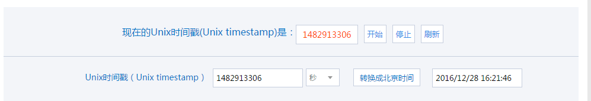
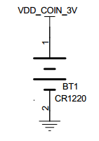

RTC—实时时钟
------------

本章参考资料：《IMXRT1050RM》（参考手册）。

学习本章时，配合《IMXRT1050RM》第49章Secure Non-Volatile Storage
(SNVS)一起阅读，效果会更佳，特别是涉及到寄存器说明的部分。

特别说明，本书内容是以RT1050系列控制器资源讲解。

RTC简介
~~~~~~~

Real time
clock（RTC），实时时钟，它是一个可由软件配置的实时时钟模块，可以像定时器一样产生周期性的中断并且中断时间软件可调。主要包含日历和闹钟这两部分的功能实验。日历和闹钟都仅包含了一个32bit的时间寄存器，这个时间寄存器可以直接输出年、月、日、时、分、秒，使得程序上更加方便简洁。

SNVS简介
~~~~~~~~

Secure Non-Volatile Storage
(SNVS)，安全非易失性存储，它是DCP模块的一个附属模块，SNVS集成了安全性和非安全性功能。在官方《IMXRT1050RM》中描述了SNVS的非安全性功能，在安全性参考手册中描述了SNVS的安全性功能。下面简要介绍SNVS非安全功能：

-  实时计数器(RTC) ，
   SNVS中的RTC是一个软件可以访问的实时计数器且可以将RTC设置为SRTC中的值。

-  周期性中断，SNVS拥有像周期定时器一样的功能，由硬件产生中断，以软件指定的频率周期性发生周期性中断。

-  通用寄存器，一组寄存器，用于存储软件指定的128位数据，如果SNVS_LP电源输入连接到不间断电源，例如：纽扣电池，当主SoC断电时，GPR值保持不变。

-  芯片开机/关机 ，如果SNVS_LP电源输入连接到不间断电源，并且开机按钮输入信号连接到芯片外部的电源按钮，SNVS\_LP中的逻辑可以用来将芯片从电源中唤醒。

    其中RTC只是SNVS外设中的一个功能，本章节主要讲解RTC的功能。

RTC功能解析
~~~~~~~~~~~

时钟源
^^^^^^^^^^^^^^^^^^^^^^^^^^^^

RTC 时钟源可以从系统外部的时钟和HP
RTC时钟得到，从系统外围时钟输入时，用于SNVS在HP域中的内部逻辑使用，再一个就是HP
RTC时钟，该时钟由SNVS_HP实时计数器使用，以及SNVS在LP域中的内部逻辑，并且该时钟不需要其他时钟进行同步。

实时时钟
^^^^^^^^^^^^^^^^^^^^^^^^^^^^

    RTC只有一个32bit的时间寄存器，获取时间信息尤其的简单，当你想获取此刻的时间信息时，只需要使用SNVS_HP_RTC_GetDatetime()函数，rtcDate结构体的各个成员就是年、月、日、时、分、秒的对应时间了。并且利用这个实时时钟我们可以做一些时间信息显示的功能。

闹钟
^^^^^^^^^^^^^^^^^^^^^^^^^^^^

    RTC只有一个闹钟，当RTC运行的时间跟设置闹钟时间相同的时候，相应的标志kSNVS_RTC_AlarmInterruptFlag就会置2，进入到闹钟的中断服务函数，处理相应的标志，在这里主要是清楚标志。并且利用这个闹钟我们可以做一些备忘提醒功能。

时间戳概念
^^^^^^^^^^^^^^^^^^^^^^^^^^^^

在使用RTC外设前，还需要引入UNIX时间戳的概念。

    如果从现在起，把计数器的计数值置0，然后每秒加1，
    那么计数器什么时候会溢出呢？由于计数器是32位寄存器，可存储的最大值为(232-1)，即这样计时的话，在232秒后溢出，即它将在今后的136年时溢出：

    N = 232/365/24/60/60 ≈136年

    假如某个时刻读取到计数器的数值为X =
    60*60*24*2，即两天时间的秒数，而假设又知道计数器是在2011年1月1日的0时0分0秒置0的，那么就可以根据计数器的这个相对时间数值，计算得这个X时刻是2011年1月3日的0时0分0秒了。而计数器则会在(2011+136)年左右溢出，也就是说到了（2011+136）年时，如果我们还在使用这个计数器提供时间的话就会出现问题。在这个例子中，定时器被置0的这个时间被称为计时元年，相对计时元年经过的秒数称为时间戳，也就是计数器中的值。

    大多数操作系统都是利用时间戳和计时元年来计算当前时间的，而这个时间戳和计时元年大家都取了同一个标准——UNIX时间戳和UNIX计时元年。UNIX计时元年被设置为格林威治时间1970年1月1日0时0分0秒，大概是为了纪念UNIX的诞生的时代吧，而UNIX时间戳即为当前时间相对于UNIX计时元年经过的秒数。因为unix时间戳主要用来表示当前时间或者和电脑有关的日志时间（如文件创立时间，log发生时间等），考虑到所有电脑文件不可能在1970年前创立，所以用unix时间戳很少用来表示1970前的时间。

    在这个计时系统中，使用的是有符号的32位整型变量来保存UNIX时间戳的，即实际可用计数位数比我们上面例子中的少了一位，少了这一位，UNIX计时元年也相对提前了，这个计时方法在2038年1月19日03时14分07秒将会发生溢出，这个时间离我们并不远。由于UNIX时间戳被广泛应用到各种系统中，溢出可能会导致系统发生严重错误，届时，很可能会重演一次“千年虫”的问题，所以在设计预期寿命较长的设备需要注意。

    在网络上搜索“UNIX时间戳”可找到一些网站提供当前实时的UNIX时间戳，见\ **错误!未找到引用源。**\ 1。

图 37‑1 某些网站显示的实时UNIX时间戳

SNVS初始化配置结构体讲解
~~~~~~~~~~~~~~~~~~~~~~~~

SDK库对SNVS外设建立了一个初始化结构体snvs_hp_rtc_config_t，该结构体成员用于设置SNVS_HP_RTC的基本工作参数，并由SNVS_HP_RTC初始化配置函数NVS_HP_RTC_Init()调用，初始化结构体中设定的参数将会设置SNVS_HP_RTC相应的寄存器，达到配置SNVS_HP_RTC工作环境的目的。

初始化结构体和初始化库函数配合使用是SDK库精髓所在，理解了初始化结构体每个成员意义基本上就可以对该外设运用自如了。

SNVS的结构体配置主要用来配置RTC是否需要校准以及周期性中断频率。

.. code-block:: c
   :name: 代码清单 37‑1 RTC配置结构体(fsl_snvs_hp.h )
   :caption: 代码清单 37‑1 RTC配置结构体(fsl_snvs_hp.h )
   :linenos:

    typedef struct _snvs_hp_rtc_config {
        bool rtcCalEnable;/* true：启用RTC校准机制;
                            false:不使用校准 */
        uint32_t rtcCalValue;/*为非安全RTC定义已签名的校准值;
                                这是一个5位2的补码值，范围从-
                                16到+15 */
        uint32_t periodicInterruptFreq;/* 定义周期性中断的频率;
                                            范围从0到15 */
    } snvs_hp_rtc_config_t;

-  rtcCalEnable：校准时间标志，true：启用RTC校准机制，flase：不使用校准机制。

-  rtcCalValue：校准数值，范围为-16到+15。

-  periodicInterruptFreq：定义周期性中断频率，范围从为0到15。

RTC日期和时间初始化结构体讲解
~~~~~~~~~~~~~~~~~~~~~~~~~~~~~

官方SDK为RTC建立了一个初始化结构体snvs_hp_rtc_datetime_t,
结构体成员用于设置外设工作参数。在这里主要配置的就是年、月、日、时、分、秒这几个参数。SDK提供了设置RTC默认参数的函数SNVS_HP_RTC_GetDefaultConfig
(),我们按照需要在默认参数基础上修改即可。

RTC日期时间初始化结构体用来设置和保存日期和时间。

.. code-block:: c
   :name: 代码清单 37‑2 RTC 日期时间结构体(fsl_snvs_hp.h)
   :caption: 代码清单 37‑2 RTC 日期时间结构体(fsl_snvs_hp.h)
   :linenos:

    typedef struct _snvs_hp_rtc_datetime {
        uint16_t year;  /*!< 范围从 1970 到 2099.*/
        uint8_t month;  /*!< 范围从 1 到 12.*/
        uint8_t day;    /*!< 范围从 1 到 31 (取决于月份).*/
        uint8_t hour;   /*!< 范围从 0 到 23.*/
        uint8_t minute; /*!< 范围从 0 到 59.*/
        uint8_t second; /*!< 范围从 0 到 59.*/
        } snvs_hp_rtc_datetime_t;

-  year：年份设置，取值范围为1970 到 2099。

-  month：月份设置，取值范围为1 到 12。

-  day：日期设置，取值范围为1 到 31 (取决于月份)。

-  hour：小时设置，范围从 0 到 23。

-  minute：分钟设置，范围从0 到 59。

-  second：秒钟设置，范围从0 到 59。

RTC—日历实验
~~~~~~~~~~~~

利用RTC的日历功能制作一个日历，显示格式为：年-月-日，时-分-秒。

硬件设计
^^^^^^^^

    该实验用到了片内外设RTC，为了确保在电源断电的情况下时间可以保存且继续运行，VDD_COIN_3V引脚外接了一个CR1220电池座，用来放CR1220电池给RTC供电。

图 37‑2 RTC 外接CR1220电池座子

软件设计
^^^^^^^^

编程要点
''''''''

1) 配置SNVS_HP_RTC相关参数并初始化；

2) 设置初始日期和时间；

3) 将时间设置为默认时间和日期并启动RTC

4) 获取时间和日期，并显示；

代码分析
''''''''

    这里只讲解核心的部分代码，有些变量的设置，头文件的包含等并没有涉及到，完整的代码请参考本章配套工程。我们创建了两个文件：bsp_snvs_hp_rtc.c和bsp_snvs_hp_rtc.h文件用来存RTC驱动程序及相关宏定义，中断服务函数则放在bsp_snvs_hp_rtc.c文件中。

宏定义
*****************

.. code-block:: c
   :name: 代码清单 37‑3 宏定义(bsp_snvs_hp_rtc.h)
   :caption: 代码清单 37‑3 宏定义(bsp_snvs_hp_rtc.h)
   :linenos:

    // 时间宏定义
    #define HOURS                8U            // 时  范围（0~23）
    #define MINUTES              0             // 分  范围（0~59）
    #define SECONDS              0             // 秒  范围（0~59）

    // 日期宏定义
    #define YEAR                 2018U         // 年  范围（1970~2099）
    #define MONTH                04U           // 月  范围（1~12）
    #define DATE                 21U           // 日  范围（1~31）

根据注释和宏定义命名不难看出每个宏定义的作用。其中HOURS、MINUTES、SECONDS是时间的宏定义；YEAR、MONTH、DATE是日期的宏定义。为了方便程序移植，我们把移植时需要修改的代码部分都通过宏定义来实现。具体的宏定义的范围看注释即可。

RTC时钟配置函数
*****************

.. code-block:: c
   :name: 代码清单 37‑4 RTC 时钟配置函数(bsp_snvs_hp_rtc.c)
   :caption: 代码清单 37‑4 RTC 时钟配置函数(bsp_snvs_hp_rtc.c)
   :linenos:

    /**
    * @brief  初始化RTC相关配置
    * @param  无
    * @retval 无
    */
    void RTC_Config(void)
    {
        /*------------------------------第一部分-----------------------------*/
        snvs_hp_rtc_datetime_t rtcDate;/* 定义 rtc 日期配置结构体 */
        snvs_hp_rtc_config_t snvsRtcConfig;/* 定义 snvsRtc 配置结构体 */

        /* 初始化SNVS */
        /*
        * snvsConfig->rtccalenable = false;
        * snvsConfig->rtccalvalue = 0U;
        * snvsConfig->srtccalenable = false;
        * snvsConfig->srtccalvalue = 0U;
        * snvsConfig->PIFreq = 0U;
        */
        /* 获取默认配置 */
        SNVS_HP_RTC_GetDefaultConfig(&snvsRtcConfig);
        /* 初始化RTC */
        SNVS_HP_RTC_Init(SNVS, &snvsRtcConfig);

        /*------------------------------第二部分-----------------------------*/
        /* 设置日期 */
        rtcDate.year = YEAR;
        rtcDate.month = MONTH;
        rtcDate.day = DATE;
        rtcDate.hour = HOURS;
        rtcDate.minute = MINUTES;
        rtcDate.second = SECONDS;

        /* 将RTC时间设置为默认时间和日期并启动RTC */
        SNVS_HP_RTC_SetDatetime(SNVS, &rtcDate);
        SNVS_HP_RTC_StartTimer(SNVS);
    }

-  第一部分，分别定义日期配置结构体和snvsRtc
   配置结构体，设置并初始化snvs_hp_rtc的相关内容，函数SNVS_HP_RTC_GetDefaultConfig()用于获取默认的配置，参数snvsRtcConfig是snvs_hp_rtc_config_t
   类型的结构体，用于保存默认的配置参数，获取默认的配置后用SNVS_HP_RTC_Init()函数初始化，函数有两个参数，第一个参数是SNVS的基指针，第二个参数与获取默认配置函数的参数一致。

-  第二部分，将第一部分定义的snvs_hp_rtc_datetime_t类型结构体中的成员赋值，其中成员分别为year、month、day、hour、minute、second。这个成员就是RTC时间的年、月、日、时、分、秒。并且成员的赋值是使用的宏定义，在bsp_snvs_hp_rtc.h文件中可以修改宏定义，来修改结构体内初始日期的时间。将修改后的日期作为参数传入到SNVS_HP_RTC_SetDatetime()设置默认时间函数并启动即可。

RTC时间显示函数
*****************

.. code-block:: c
   :name: 代码清单 37‑5 RTC时间显示函数(bsp_snvs_hp_rtc.c)
   :caption: 代码清单 37‑5 RTC时间显示函数(bsp_snvs_hp_rtc.c)
   :linenos:

    /**
    * @brief  显示时间和日期
    * @param  无
    * @retval 无
    */
    void RTC_TimeAndDate_Show(void)
    {
        /*------------------------------第一部分----------------------------*/
        uint8_t Rtctmp=0;//定义临时变量用于刷新屏幕显示
        char LCDTemp[100];//定义字符串缓存数组
        snvs_hp_rtc_datetime_t rtcDate;//定义全局RTC时间结构体
        while (1) {
        /*------------------------------第二部分----------------------------*/
            /* 获取日期 */
            SNVS_HP_RTC_GetDatetime(SNVS, &rtcDate);
            /* 每秒打印一次 */
            if (Rtctmp != rtcDate.second) {
        /*------------------------------第三部分----------------------------*/

                /* 打印日期 */
                PRINTF("The Date :  Y:%0.2d - M:%0.2d - D:%0.2d\r\n",
                    rtcDate.year,
                    rtcDate.month,
                    rtcDate.day
                    );

                /* 液晶显示日期 */
                /* 先把要显示的数据用sprintf函数转换为字符串，
                        然后才能用液晶显示函数显示 */
                sprintf(LCDTemp,"The Date :  Y:%0.2d - M:%0.2d - D:%0.2d",
                        rtcDate.year,
                        rtcDate.month,
                        rtcDate.day
                    );

                LCD_SetColors(CL_RED,CL_BLACK);/*设置字体的颜色及字体的背景颜色 */
                LCD_DisplayStringLine(10,(uint8_t *)LCDTemp);/*将字符串显示到屏幕上 */
        /*------------------------------第四部分----------------------------*/

                /* 打印时间 */
                PRINTF("The Time :  %0.2d:%0.2d:%0.2d \r\n\r\n",
                    rtcDate.hour,
                    rtcDate.minute,
                    rtcDate.second);

                /* 液晶显示时间 */
                /* 先把要显示的数据用sprintf函数转换为字符串，
                        然后才能用液晶显示函数显示 */
                sprintf(LCDTemp,"The Time :  %0.2d:%0.2d:%0.2d",
                        rtcDate.hour,
                        rtcDate.minute,
                        rtcDate.second);
                /* 将字符串显示到屏幕上 */
                LCD_DisplayStringLine(50,(uint8_t *)LCDTemp);

            }
            Rtctmp = rtcDate.second;
        }
    }

-  第一部分，定义了一个uint8_t类型的临时变量Rtctmp并赋初值为0，主要用于刷新显示的时候进行整秒钟的判断；定义了一个char类型名为LCDTemp的字符型数组，其空间大小为100个字节，主要用于存放LCD显示的字符串缓存；还定义了一个snvs_hp_rtc_datetime_t类型的rtcDate结构体，用于获取RTC时间结构体内容的存放。

-  第二部分，这部分主要使用SNVS_HP_RTC_GetDatetime()函数获取RTC的日期，并且将时间日期信息存放于rtcDate结构体中。

-  第三部分，使用PRINTF()函数打印格式为The Date : Y:%0.2d - M:%0.2d -
   D:%0.2d的日期信息，使用sprintf()函数将rtcDate.year、rtcDate.month、rtcDate.day日期信息格式化的数据写入LCDTemp数组，并且将这个字符串数组里面的内容通过屏幕显示函数LCD_DisplayStringLine()显示到屏幕上。

-  第四部分，这部分除了打印内容显示的内容与第三部分不同，其他的基本一致。

主函数
*****************

.. code-block:: c
   :name: 代码清单 37‑6 main函数 (main.c)
   :caption: 代码清单 37‑6 main函数 (main.c)
   :linenos:

    /**
    * @brief  主函数
    * @param  无
    * @retval 无
    */
    int main(void)
    {
        /*
        此处省略开发板初始化，以及系统时钟打印
        */
    
        /* 初始化LCD */
        LCD_Init(LCD_INTERRUPT_ENABLE);
    
        /* 初始化RTC */
        RTC_Config();
    
        while (1) {
            /* 显示时间和日期 */
            RTC_TimeAndDate_Show();
        }
    22 }

主函数中，我们调用RTC_Config()库函数来初始化RTC相关的时间配置，然后在主函数里面按照每秒钟刷新一次的频率来显示日期和时间。

下载验证
''''''''

把程序编译好下载到开发板，通过电脑端口的串口调试助手或者液晶可以看到时间正常运行。屏幕可以正常显示日期和时间，并且串口调试助手也可以正常输出。

RTC—闹钟实验
~~~~~~~~~~~~

利用RTC的闹钟功能制作一个闹钟，在串口调试助手中输入秒数后（秒数必须为正值），会弹出报警的时间信息，并且当到达这个秒数后，会在调试助手的界面提醒。

硬件设计
^^^^^^^^

    硬件设计跟日历实验部分的硬件设计一样。

软件设计
^^^^^^^^

闹钟实验是在日历实验的基础上添加，相同部分的代码不再讲解，这里只讲解闹钟实验相关的代码，更加具体的请参考闹钟实验的工程源码。

闹钟相关宏定义
''''''''''''''''''''''''''''''''''

.. code-block:: c
   :name: 代码清单 37‑7 闹钟相关宏定义(bsp_snvs_hp_rtc.h)
   :caption: 代码清单 37‑7 闹钟相关宏定义(bsp_snvs_hp_rtc.h)
   :linenos:

    //中断相关，IRQ中断号及IRQHandler中断服务函数
    #define kCLOCK_SnvsHp0 kCLOCK_SnvsHp
    #define EXAMPLE_SNVS_IRQn SNVS_HP_WRAPPER_IRQn
    #define EXAMPLE_SNVS_IRQHandler SNVS_HP_WRAPPER_IRQHandler

为了方便程序移植，我们把需要频繁修改的代码用宏封装起来。其中这里将中断编号SNVS_HP_WRAPPER_IRQn和中断服务函数SNVS_HP_WRAPPER_IRQHandler封装起来，便于修改和移植代码。具体操作用户可自行修改。

编程要点
''''''''

1) 初始化RTC，设置RTC初始时间；

2) 启用SNVS闹钟中断，使能SNVS中断；

3) 编写闹钟及其中断服务函数；

代码分析
''''''''

闹钟设置及实现函数
**********************************

.. code-block:: c
   :name: 代码清单 37‑8 闹钟编程代码(bsp_snvs_hp_rtc.h)
   :caption: 代码清单 37‑8 闹钟编程代码(bsp_snvs_hp_rtc.h)
   :linenos:

    /**
    * @brief  RTC闹钟设置
    * @param  无
    * @retval 无
    */
    void RTC_AlarmSet(void)
    {
        /*------------------------------第一部分----------------------------*/
        uint32_t sec;//用户所输入的等待报警时间
        uint8_t index;//用于接收串口数据
        snvs_hp_rtc_datetime_t rtcDate;//定义全局RTC时间结构体
        /*------------------------------第二部分----------------------------*/
        /* 启用 SNVS 闹钟中断 */
        SNVS_HP_RTC_EnableInterrupts(SNVS, kSNVS_RTC_AlarmInterruptEnable);

        /* 使能 SNVS 中断 */
        EnableIRQ(EXAMPLE_SNVS_IRQn);
        PRINTF("设置闹钟时间.\r\n");
        /* 大循环内设置闹钟时间 */
        while (1) {
        /*------------------------------第三部分----------------------------*/
            /* 设置临时变量的初始值 */
            busyWait = true;
            index = 0;
            sec = 0;

            /* 获取日期 */
            SNVS_HP_RTC_GetDatetime(SNVS, &rtcDate);

            /* 打印默认时间 */
            PRINTF("当前时间: %04hd-%02hd-%02hd %02hd:%02hd:%02hd\r\n",
                rtcDate.year, rtcDate.month, rtcDate.day,
                rtcDate.hour, rtcDate.minute, rtcDate.second);

            /* 用户输入闹钟时间 */
            PRINTF("请输入秒数等待闹钟报警并按回车键 \r\n");
            PRINTF("秒数必须是正值\r\n");
        /*------------------------------第四部分----------------------------*/
            while (index != 0x0D) {
                /* 等待获取输入的时间 */
                index = GETCHAR();
                if ((index >= '0') && (index <= '9')) {
                    PUTCHAR(index);
                    /* 提取实际输入的时间秒数 */
                    sec = sec * 10 + (index - 0x30U);
                }
            }
            PRINTF("\r\n");

            SNVS_HP_RTC_GetDatetime(SNVS, &rtcDate);
        /*------------------------------第五部分----------------------------*/
            /* 不满足60秒时，直接将输入时间累加到 秒数位 */
            if ((rtcDate.second + sec) < 60) {
                rtcDate.second += sec;
            } else {
                /* 将用户输入时间累加到实际时钟，并计算出应该报警的实际时间 
                */
                rtcDate.minute += (rtcDate.second + sec) / 60U;
                rtcDate.second = (rtcDate.second + sec) % 60U;
            }
        /*------------------------------第六部分----------------------------*/
            /* 设置闹钟时间 */
            SNVS_HP_RTC_SetAlarm(SNVS, &rtcDate);

            /* 获取闹钟时间 */
            SNVS_HP_RTC_GetAlarm(SNVS, &rtcDate);

            /* 打印闹钟报警时间 */
            PRINTF("闹钟报警时间: %04hd-%02hd-%02hd %02hd:%02hd:%02hd\r\n", 
                rtcDate.year, rtcDate.month, rtcDate.day,
                rtcDate.hour, rtcDate.minute, rtcDate.second);

            /* 等待闹钟警报发生 */
            while (busyWait) {
            }
            PRINTF("\r\n 闹钟警报发生 !!!! ");
        }
    }

-  第一部分，
   定义uint32_t类型的变量sec，用于存放用户输入的等待报警时间；定义uint8_t类型的
   index，用于接收串口的数据；定义一个snvs_hp_rtc_datetime_t类型的结构体rtcDate，用于存放RTC时钟的日期和时间。

-  第二部分，这部分主要用来启动SNVS
   闹钟中断并且使用EnableIR()函数使能SNVS
   中断，函数的参数就是中断号，已经在bsp_snvs_hp_rtc.h文件中宏定义，便于修改和移植。

-  第三部分，由于代码是在大循环内设置闹钟时间，所以需要在大循环的一开始就设置busyWait、busyWait、busyWait变量的初值（具体初值详见代码清单），然后使用SNVS_HP_RTC_GetDatetime()函数获取当前的时间和日期并将日期时间存在rtcDate结构体中，打印当前时间以及提示用户需要输入的信息。

-  第四部分，等待用户输入时间，此时的等待为卡死等待，虽然为卡死等待但是RTC还是一直在运行的，输入的时间以回车为结束标志，并且会再将时间获取到结构体中。

-  第五部分，将用户输入的时间累加到实际的时钟时间。

-  第六部分，将累加后的时间使用SNVS_HP_RTC_SetAlarm()函数设置为闹钟时间，打印闹钟报警时间信息，并等待闹钟发生。

闹钟中断服务函数
*****************

.. code-block:: c
   :name: 代码清单 37‑9 闹钟中断服务函数(bsp_snvs_hp_rtc.c)
   :caption: 代码清单 37‑9 闹钟中断服务函数(bsp_snvs_hp_rtc.c)
   :linenos:

    /********************中断服务函数**************************/
    /**
    * @brief  RTC 中断服务函数
    *         EXAMPLE_SNVS_IRQHandler是一个宏，
    *         在本例中它指代函数名SNVS_HP_WRAPPER_IRQHandler，
    *         中断服务函数名是固定的，可以在启动文件中找到。
    * @param  中断服务函数不能有输入参数
    * @note   中断函数一般只使用标志位进行指示，完成后尽快退出，
    *         具体操作或延时尽量不放在中断服务函数中，
    * @retval 中断服务函数不能有返回值
    */
    void EXAMPLE_SNVS_IRQHandler(void)
    {
        /* 判断中断条件是否满足 */
        if (SNVS_HP_RTC_GetStatusFlags(SNVS) & kSNVS_RTC_AlarmInterruptFlag) {
            /* 设置报警中断标志 */
            busyWait = false;

            /* 清除报警标志 */
            SNVS_HP_RTC_ClearStatusFlags(SNVS, kSNVS_RTC_AlarmInterruptEnable);
        }
        /* 添加为ARM勘误表838869，影响Cortex-M4，Cortex-M4F存储立即重叠
        异常返回操作可能会导致错误的中断 */
    #if defined __CORTEX_M && (__CORTEX_M == 4U)
        __DSB();
    #endif
    }

其中闹钟使用SNVS_HP_RTC_SetAlarm()函数来设置闹钟的时间，如果时钟时间到了闹钟设置好的时间，则就会产生闹钟中断，在中断函数中把相应的标志位清楚。然后中断服务函数会清楚报警标志，使得程序等待下一次用户输入闹钟时间。

main函数
*****************

.. code-block:: c
   :name: 代码清单 37‑10 main 函数(main.c)
   :caption: 代码清单 37‑10 main 函数(main.c)
   :linenos:

    int main(void)
    {
        /*
        此处省略开发板初始化，以及系统时钟打印
        */

        /* 初始化RTC */
        RTC_Config();
        /* RTC闹钟设置 */
        RTC_AlarmSet();

        while (1) {

        }

    }

主函数中，我们通过RTC_Config()初始化RTC的配置以及初始的时间设置，使用RTC_AlarmSet()函数启用并使能SNVS闹钟中断。并且在RTC_AlarmSet()函数的大循环内设置闹钟时间并显示闹钟相关的信息。

下载验证
''''''''

把编译好的程序下载到开发板中，并且在串口调试助手中输入闹钟时间（输入的秒数必须是正值），输入后会显示闹钟的报警时间,当时间到达后，会显示闹钟报警发生！！！以及当前的时间。虽然此时没有时刻显示日历，但是此时日历一直在运行中。

