电源管理—电源模式选择
---------------------

本章参考资料：《IMXRT1050RM》（参考手册）。

学习本章时，配合《IMXRT1050RM》第10章Clock and Power
Management、第20章DCDC Converter (DCDC)、第31章General Power Controller
(GPC)、第45章Power Management Unit (PMU)、第50章Secure Non-Volatile
Storage (SNVS)、第52章System Reset Controller
(SRC)一起阅读，效果会更佳，特别是涉及到寄存器说明的部分。

RT1052的电源管理简介
~~~~~~~~~~~~~~~~~~~~

电源对电子设备的重要性不言而喻，它是保证系统稳定运行的基础，而保证系统能稳定运行后，又有低功耗的要求。在很多应用场合中都对电子设备的功耗要求非常苛刻，如某些传感器信息采集设备，仅靠小型的电池提供电源，要求工作长达数年之久，且期间不需要任何维护；由于智慧穿戴设备的小型化要求，电池体积不能太大导致容量也比较小，所以也很有必要从控制功耗入手，提高设备的续行时间。因此，RT1052为了适应不同的场景配备了专门的电源管理方案，分别是运行模式和低功耗模式。在电源管理设备的运行模式下，不仅确保系统正常运行，还要尽量降低器件的功耗。

集成电源管理单元
^^^^^^^^^^^^^^^^

RT1052芯片电源管理系统的第一个组成部分，称为集成PMU（集成电源管理单元）。是为了简化外部电源接口而设计的。它由一组辅助电源组成，可通过两个或三个主电源实现SoC操作。使用集成PMU的电源树的高级框图如图所示。

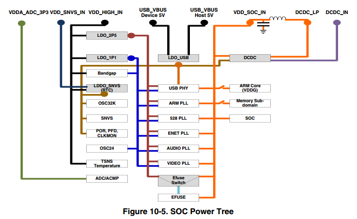

图 38‑1 SOC Power Tree

电源管理单元（PMU）旨在简化外部电源接口。电源系统可分为输入电源及其特性，集成电源变换和控制元件，以及最终负载互连和要求。典型的电源系统使用PMU如下图所示。

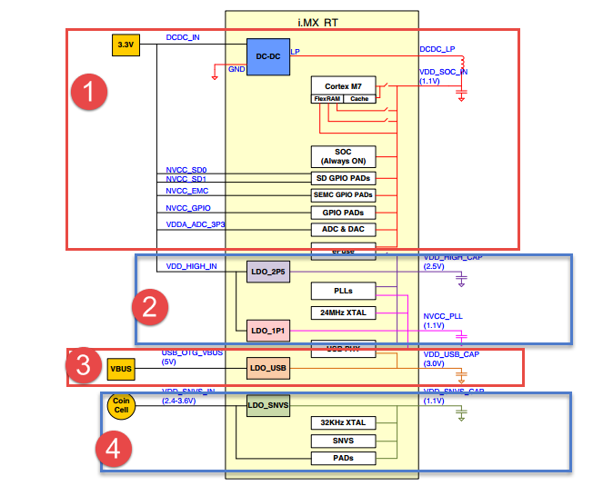

图 38‑2 电源系统概述

RT1052使用四个LDO稳压器，这样大大减少了外部电源的数量。在纽扣电池和USB输入不算在内的情况下，外部电源的数量可以减少到两个。缺少这种外部电源总数是因为所需要的存储器接口供电所需的外部电源数量；该数量取决于所选的外部存储器的类型。如果其I/O的电压必须与上面提供的不同，则可能还需要其他电源来为这种I/O电源端提供电压。

DCDC稳压器（DCDC Regulator ）
''''''''''''''''''''''''''''''''''''

该模块中的DCDC稳压器包括以下功能：

-  可调节（每步25 mV）高效调节器。

-  支持3.3 V（±10％）输入电压。

-  输出范围为0.9 V~1.3 V。

-  支持标称运行，低功耗待机和关闭模式。

-  在运行模式下支持0.9 V~1.3 V输出。

-  在待机模式下支持0.9 V~1.0 V输出。

-  过电流和过电压检测。

-  电源门：用来调节FET是否完全关断，限制电源中的电流消耗。使用调节器的模拟部分断电，来限制功耗。输出电压下降到功率FET的剩余泄漏与负载泄漏平衡的水平位置（TARG
   = 0x00）。

-  模拟调节模式：用来控制调节FET，使调节器的输出电压等于软件的目标电压，并且目标电压可完全由软件控制，精度为25mV。

这些模式允许稳压器实现电压调节和电源门控并允许旁路。通过旁路功能，如果能够满足要求，所有精度和控制要求都可以转移到外部电源。

这些数字稳压器还具有掉电检测功能，当电源开始崩溃时非常有用。发出掉电信号的电压值可软件设置为与目标电压的偏移电压值。这个功能主要操作PMU_MISC2寄存器中，并且核心是在停电时中断。

在迅速提高稳压器的输出电压时必须要注意，这很可能导致大电流流入稳压器的输出，容量直至输入电源的极限值。当超过输入电源容量时，这可能会导致输入电源下降，从而影响同一电源上的其他稳压器。因此，应限制调节器输出端的电压变化速率。当稳压器正在供电时，集成限流器必须控制变化速率。此限制器仅在从稳压器关闭状态（旁路或电源门控）转换时有效。

然而，在DVFS情况下，如果通过软件快速提高目标电压值，则可能发生相同的高变化率。为了限制变化率，控制调节器的硬件通过以25mV步增长输出电压直到达到所需的输出电压来实现分段线性斜坡。斜坡的斜率由每个25mV步长所花费的时间控制，并由PMU_MISC2寄存器中的步进时间字段控制。当负载拉低输出电容时且输出电压下降时，同样的情况也不成问题。因此，软件调节器目标电压的任何降低都会立即生效，实际电源电压会以调节器负载控制的速率下降。

模拟LDO调节器（Analog LDO regulators）
''''''''''''''''''''''''''''''''''''''

该模块有两种模拟LDO稳压器，分别是LDO_1P1和LDO_2P5主要用于一般系统：

-  LDO_1P1稳压器

其中芯片上的LDO_1P1模块通过较高的模拟电源电压（2.8V-3.3V）实现可编程线性稳压器功能，以产生1.1V标称输出电压。

稳压器的输出可以在0.5V~1.4V的25mV步进范围内进行编程。稳压器设计相对稳定，具有最小的外部低ESR去耦电容，但所需的实际电容应由具体法人应用决定。调节器中包含可编程欠压检测器，系统可以使用该检测器来确定何时超过调节器的负载能力，因此可以采取必要的步骤。

主要是通过将PMU_REG_1P1
[ENABLE_ILIMIT]寄存器位置1，可以在启动期间根据需要允许浪涌电流要求，从而实现电流限制。通过为需要此功能的系统设置PMU_REG_1P1
[ENABLE_PULLDOWN]位，也可以启用有源下拉。

-  LDO_2P5稳压器

芯片上的LDO_2P5模块通过较高的模拟电源电压（2.8V-3.3V）实现可编程线性稳压器功能，以产生标称的2.5V输出电压。

稳压器的输出可以以2.5mV步进从2.0V~2.75V进行编程。虽然所需的实际电容应由应用决定，但稳压器的设计稳定，具有最小的外部低ESR去耦电容。调节器中包含一个可编程欠压检测器，系统可以使用该检测器来确定何时超过调节器的负载能力以采取必要的步骤。可以通过将REG_PMU_2P5
[ENABLE_ILIMIT]位置1来允许限流，以便在启动时满足启动时的浪涌电流要求。

对于需要此功能的系统，可以通过设置REG_PMU_2P5
[ENABLE_PULLDOWN]位来启用有源下拉。

USB LDO稳压器（USB LDO Regulator）
''''''''''''''''''''''''''''''''''

芯片上的USB_LDO模块通过USB的VBUS电压（通常为5
V）实现可编程线性稳压器功能，以产生3.0 V标称输出电压。稳压器输出可以25
mV步进编程，从2.625V到3.4 V。

稳压器设计稳定，最小的外部低ESR去耦电容为4.7uF，但所需的实际电容应由应用决定。调节器中包含可编程欠压检测器，系统可以使用该检测器来确定何时超过调节器的负载能力，因此可以采取必要的步骤。该调节器具有内置电源多路复用器，允许用户选择在两者都存在时从VBUS电源运行调节器。如果仅存在一个VBUS电压，则稳压器自动选择该电源。还包括电流限制，以帮助系统满足浪涌电流目标。

在连接VBUS时，该稳压器以低功耗，自保持模式启动，以防止芯片上出现过压情况。通过启用稳压器并通过其控制寄存器禁用浪涌电流限制，用户可以转换到完全调节。在去除VBUS时，进一步期望调节器控制返回到其复位状态。

SNVS调节器（SNVS Regulator ）
'''''''''''''''''''''''''''''

SNVS稳压器采用SNVS_IN电源并产生SNVS_CAP电源，为实时时钟和SNVS模块供电。

SNVS_LDO是一种不可编程的线性稳压器功能，只可产生1.1V的标称输出电压。

GPC-通用功率控制器
^^^^^^^^^^^^^^^^^^

GPC的子块具有以下功能：
'''''''''''''''''''''''

-  为用户提供关闭目标子系统电源的功能。

-  生成上电和断电控制序列。这包括与CCM/LPCG和SRC的交互，以及对受电源门控影响的电源域的时钟和复位生成的控制。

-  提供可编程寄存器，用于调整功率控制信号的时序。

-  控制CPU电源域和内存子域（PDRAMx）。

-  唤醒中断控制器 -当只有低频实时时钟保持活动状态时，该控制器启动系统从低功耗模式唤醒，因此通用中断控制器（GIC）无法处理同步中断信号。

-  最多支持160个中断

-  提供掩码/取消屏蔽每个中断的选项

-  检测中断并生成唤醒信号

电源门控控制(PGC)
'''''''''''''''''

(1) PGC的主要功能包括：

-  提供关闭目标子系统电源的功能。

-  生成上电和断电控制序列。

-  提供可编程寄存器，用于调整功率控制信号的时序。

(1) PGC断电、上电时序

..

    在ARM休眠程序保存所有必要的CPU寄存器数据后，电源门控（PGC）仅在STOP低功耗模式下应用于ARM
    CPU。如果出现任何未屏蔽的中断，CPU将上电，并且时钟恢复请求（从STOP模式退出）将发送到CCM。

-  | PGC断电序列：
       | 当芯片即将进入停止模式时，CCM发送断电请求。
         用户应该定义哪些模块将被断电（相应的PGC模块的PGCR寄存器，位0）。

-  | PGC上电顺序：
       | 断言其中一个上电irq，上电请求在GPC和CCM中声明，根据相应模块的PGC设置，Power
         Gated模块已上电。上电后，Power Gated模块需要复位。

SRC-系统复位控制器
^^^^^^^^^^^^^^^^^^

SRC的概述
'''''''''

系统复位控制器（SRC）控制SoC的复位和引导操作。它负责生成所有复位信号和启动解码。复位控制器确定复位的源和复位类型，例如POR，COLD，并执行必要的复位限定和拉伸序列。根据复位类型，复位逻辑产生整个IC的复位序列。无论何时芯片上电，复位都通过SRC_ONOFF信号发出，整个芯片复位。

SRC能够在以下条件下生成重置序列：

-  与外部PMIC交互，基于外部POR_B信号和集成PMU生成的“电源就绪”信号

-  或仅与集成PMU交互，基于其“电源就绪”信号。

SRC包括以下功能
'''''''''''''''

-  接收并处理所有重置源的重置

-  根据重置源和重置的性质重置相应的域

-  锁存来自内部保险丝的SRC_BOOT_MODE引脚和公共配置信号

RT1052电源模式
~~~~~~~~~~~~~~

RT1052的电源模式主要分为两大块，分别是运行和低功耗两种，其中运行模式包括超载运行、满载运行、低速运行和低功耗运行；低功耗模式包括系统空闲模式、低功耗空闲模式、暂停模式和SNVS模式。上电复位后RT1052处于运行状态，具体要切换到什么运行模式可以通过串口来修改当前的运行模式。在低功耗的四种模式中，具有电源消耗不同、唤醒时间可设置、唤醒源可选的的特性，用户可以根据自己的应用需求选择最佳的低功耗模式或者运行模式。

运行模式
^^^^^^^^

在运行模式中，各个频率的不同表现的特性也有所差异，具体特性详见表表
38‑1和37-2。

表 38‑1几种运行模式的特性

+------------------+-----------------------------------------------+
| 运行模式         | 说明                                          |
+==================+===============================================+
| 超载运行         | •CPU运行速度为600 MHz，过驱动电压为1.275 V.   |
|                  |                                               |
| (Overdrive Run)  | •全速总线频率                                 |
|                  |                                               |
|                  | •启用所有外设并以目标频率运行                 |
|                  |                                               |
|                  | •所有PLL均已启用                              |
+------------------+-----------------------------------------------+
| 满载运行         | •CPU运行速度为528 MHz，满载，低电压为1.15 V.  |
|                  | •全速总线频率                                 |
| (Full-Speed Run) | •启用所有外设并以目标频率运行                 |
|                  | •所有PLL均已启用                              |
+------------------+-----------------------------------------------+
| 低速运行         | •CPU运行频率为132 MHz，电压降至1.15 V.        |
|                  | •半速内部总线频率                             |
| (Low-Speed Run)  | •某些PLL断电                                  |
|                  | •20％外设处于活动状态，其他外设处于低功耗模式 |
+------------------+-----------------------------------------------+
| 低功耗运行       | •CPU以24 MHz运行，较低电压为0.95 V.           |
|                  | •内部总线频率为12 MHz                         |
| (Low-Power Run)  | •所有PLL均断电，OSC24M断电，RCOSC24使能       |
|                  | •高速外围设备断电                             |
+------------------+-----------------------------------------------+

表 38‑2几种运行模式的配置

+-------------+------------+-------------+------------+--------------+
|             |  超载运行  |  满载运行   |  低速运行  |  低功耗运行  |
|             |            |             |            |              |
|             | (Overdrive | (Full-Speed | (Low-Speed |  (Low-Power  |
|             |    Run)    |    Run)     |    Run)    |     Run)     |
+=============+============+=============+============+==============+
| CCM LPM     | RUN        | RUN         | RUN        | RUN          |
| Mode        |            |             |            |              |
+-------------+------------+-------------+------------+--------------+
| CPU Core    | 600 MHz    | 528 MH0z    | 132 MHz    | 24 MHz       |
+-------------+------------+-------------+------------+--------------+
| L1 Cache    | 开         | 开          | 开         | 开           |
+-------------+------------+-------------+------------+--------------+
| FlexRAM     | 开         | 开          | 开         | 开           |
+-------------+------------+-------------+------------+--------------+
| SOC Voltage | 1.275 V    | 1.15 V      | 1.15 V     | 0.95 V       |
+-------------+------------+-------------+------------+--------------+
| Analog LDO  | 开         | 开          | 开         | 在弱模式     |
+-------------+------------+-------------+------------+--------------+
| 24MHzXTAL   | 开         | 开          | 开         | 关           |
| OSC         |            |             |            |              |
+-------------+------------+-------------+------------+--------------+
| 24 MHz RC   | 关         | 关          | 关         | 开           |
| OSC         |            |             |            |              |
+-------------+------------+-------------+------------+--------------+
| System PLL  | 开         | 开          | 开         | 关           |
+-------------+------------+-------------+------------+--------------+
| All Other   | 开         | 开          | 根据需要   | 根据需要     |
| PLLs        |            |             |            |              |
+-------------+------------+-------------+------------+--------------+
| Module      | 开         | 开          | 根据需要   | 外围时钟关闭 |
| Clock       |            |             |            |              |
+-------------+------------+-------------+------------+--------------+
| RTC32k      | 开         | 开          | 开         | 开           |
+-------------+------------+-------------+------------+--------------+

低功耗模式
^^^^^^^^^^

在低功耗模式中，空闲（IDLE），暂停（SUSPEND）和SNVS通常称为低功耗模式。

-  空闲（IDLE）模式：处于WFI状态的CPU，芯片的某些部分可以是时钟门控或电源门控。芯片可以从IRQ以这种模式唤醒，延迟非常短。当CPU执行WFI指令时，从RUN模式自动进入IDLE模式，因此IDLE模式的状态将依赖于RUN模式的状态。为避免显示大量IDLE模式，定义了以下两种IDLE状态：

-  系统IDLE：从低速运行模式进入的IDLE模式。从其他RUN模式进入时，差异主要是CPU/总线频率。

-  低功耗IDLE：从低功耗RUN模式进入的IDLE模式。

-  SUSPEND模式：CPU电源门控，除32KHz外所有时钟门控，模拟模块也进入低功耗状态。它提供了最低功率，同时保持系统活跃的状态，但是他的退出时间相对较长。

-  SNVS模式：除RTC激活外，所有模块均已关闭。

具体特性详见表表 38‑3和37-4。

表 38‑2几种低功耗模式的特性

+------------------+-----------------------------------------------------------+
|     运行模式     |                           说明                            |
+==================+===========================================================+
| 系统空闲         | •没有线程运行时，CPU可以自动进入该模式                    |
|                  |                                                           |
| (System ldle)    | •所有外围设备都可以保持活动状态                           |
|                  | •CPU仅进入WFI模式，其状态保持不变，因此中断响应可能非常短 |
+------------------+-----------------------------------------------------------+
| 低功耗空闲       | •功率比系统空闲模式低很多，退出时间更长                   |
|                  |                                                           |
| (Low-Power ldle) | •所有PLL均关闭，模拟模块以低功耗模式运行                  |
|                  |                                                           |
|                  | •所有高速外设都是电源门控，低速外设可以保持低频运行       |
+------------------+-----------------------------------------------------------+
| 暂停             | •最省电模式，退出时间最长                                 |
|                  | •所有PLL均关闭，XTAL关闭，除32                            |
| (Suspend)        | K时钟外，所有时钟均关闭                                   |
|                  | •所有高速外设均采用电源门控，低速外设采用时钟门控         |
+------------------+-----------------------------------------------------------+
| (SNVS)           | •除SNVS域外，所有SOC数字逻辑模拟模块均被关闭              |
|                  |                                                           |
|                  | •32 KHz RTC处于活动状态                                   |
+------------------+-----------------------------------------------------------+

表 38‑3 几种低功耗模式的配置

+-------------+-----------------+----------------+---------------+------+
|             | 系统空闲(System | 低功耗空闲(Low | 暂停(Suspend) | SNVS |
|             |                 |                |               |      |
|             |      Idle)      |  Power Idle)   |               |      |
+=============+=================+================+===============+======+
| CCM LPM     | WAIT            | WAIT           | 停止          | -    |
| Mode        |                 |                |               |      |
+-------------+-----------------+----------------+---------------+------+
| Arm Core    | WFI             | WFI            | 断电          | 关   |
| (PDM7)      |                 |                |               |      |
+-------------+-----------------+----------------+---------------+------+
| L1 Cache    | 开              | 开             | 断电          | 关   |
+-------------+-----------------+----------------+---------------+------+
| FlexRAM     | 开              | 开             | 开            | 关   |
| (PDRET)     |                 |                |               |      |
+-------------+-----------------+----------------+---------------+------+
| FlexRAM     | 开              | 开             | 断电          | 关   |
| (PDRAM0)    |                 |                |               |      |
+-------------+-----------------+----------------+---------------+------+
| FlexRAM     | 开/关           | 开/关          | 断电          | 关   |
| (PDRAM1)    |                 |                |               |      |
+-------------+-----------------+----------------+---------------+------+
| VDD_SOC_IN  | 1.15 V          | 0.95 V         | 0.925 V       | 关   |
| Voltage     |                 |                |               |      |
+-------------+-----------------+----------------+---------------+------+
| 528 PLL     | 开              | 断电           | 断电          | 关   |
+-------------+-----------------+----------------+---------------+------+
| Other PLL   | 断电            | 断电           | 断电          | 关   |
+-------------+-----------------+----------------+---------------+------+
| 24 MHz XTAL | 开              | 关             | 关            | 关   |
+-------------+-----------------+----------------+---------------+------+
| 24 MHz RC   | 关              | 开             | 关            | 关   |
| OSC         |                 |                |               |      |
+-------------+-----------------+----------------+---------------+------+
| LDO2P5      | 开              | 关             | 关            | 关   |
+-------------+-----------------+----------------+---------------+------+
| LDO1P1      | 开              | 关             | 关            | 关   |
+-------------+-----------------+----------------+---------------+------+
| WEAK2P5     | 关              | 开             | 关            | 关   |
+-------------+-----------------+----------------+---------------+------+
| WEAK1P1     | 关              | 开             | 关            | 关   |
+-------------+-----------------+----------------+---------------+------+
| Bandgap     | 开              | 关             | 关            | 关   |
+-------------+-----------------+----------------+---------------+------+
| Low Power   | 开              | 开             | 开            | 关   |
| Bandgap     |                 |                |               |      |
+-------------+-----------------+----------------+---------------+------+
| AHB clock   | 33 MHz          | 12 MHz         | 关            | 关   |
+-------------+-----------------+----------------+---------------+------+
| IPG clock   | 33 MHz          | 12 MHz         | 关            | 关   |
+-------------+-----------------+----------------+---------------+------+
| PER clock   | 33 MHz          | 12 MHz         | 关            | 关   |
+-------------+-----------------+----------------+---------------+------+
| Module      | 根据需要        | 根据需要       | 关            | 关   |
| Clocks      |                 |                |               |      |
+-------------+-----------------+----------------+---------------+------+
| RTC32K      | 开              | 开             | 开            | 开   |
+-------------+-----------------+----------------+---------------+------+

唤醒源
^^^^^^

不同的低功耗模式有不同的唤醒源，有些模式仅支持一种唤醒方式，但有的却支持所有的唤醒方式。具体看表37-4。

表 38‑4 唤醒源分配

+------------+-----------------+----------------+---------------+----------------+
|            | 系统空闲(System | 低功耗空闲(Low | 暂停(Suspend) |      SNVS      |
|            |                 |                |               |                |
|            |      Idle)      |  Power Idle)   |               |                |
+============+=================+================+===============+================+
| GPIO 唤醒  | 支持            | 支持           | 支持          | 仅支持一个引脚 |
+------------+-----------------+----------------+---------------+----------------+
| RTC 唤醒   | 支持            | 支持           | 支持          | 支持           |
+------------+-----------------+----------------+---------------+----------------+
| USB        | 支持            | 支持           | 支持          | 不支持         |
| 远成唤醒   |                 |                |               |                |
+------------+-----------------+----------------+---------------+----------------+
| 其他唤醒源 | 支持            | 支持           | 不支持        | 不支持         |
+------------+-----------------+----------------+---------------+----------------+

不同的低功耗模式有不同的唤醒源，有些模式仅支持一种唤醒方式，其中SNVS模式中的GPIO唤醒，仅支持GPIO5_IO00引脚唤醒，其他引脚均无效。

电源管理相关的库函数及命令
~~~~~~~~~~~~~~~~~~~~~~~~~~

RT1052对电源管理提供了完善的函数及命令，使用它们可以方便地进行控制，本小节对这些内容进行讲解。

WFI命令
^^^^^^^

我们了解到进入各种低功耗模式时都需要调用WFI命令，它们实质上都是内核指令，在库cmsis_armcc.h中把这些指令封装成了函数，见代码清单37-1。

.. code-block:: c
   :name: 代码清单 38‑1 WFI的指令定义(cmsis_armcc.h文件)
   :caption: 代码清单 38‑1 WFI的指令定义(cmsis_armcc.h文件)
   :linenos:

   /**
      \brief   Wait For Interrupt
      \details Wait For Interrupt is a hint instruction that suspends execution until one of a number of 
      events occurs.
   */
   #define __WFI                             __wfi

对于这个指令，我们应用时一般只需要知道，调用它都能进入低功耗模式，需要使用函数的格式“__WFI();”来调用(因为__wfi是编译器内置的函数，函数内部使用调用了相应的汇编指令)。其中WFI指令决定了它需要用中断唤醒，更详细的区别可查阅《cortex-CM3/CM4权威指南》了解。

运行模式
^^^^^^^^

.. code-block:: c
   :name: 代码清单 38‑2 超载运行模式配置(bsp_lpm.c)
   :caption: 代码清单 38‑2 超载运行模式配置(bsp_lpm.c)
   :linenos:

   /**
   * @brief  LPM超载运行模式
   * @return 无
   *   @retval 无
   */
   void LPM_OverDriveRun(void)
   {
      /* CCM 模式 */
      DCDC_BootIntoCCM(DCDC);
      /* 连接内部负载电阻 */
      DCDC->REG1 |= DCDC_REG1_REG_RLOAD_SW_MASK;
      /* 将SOC电压调整为1.275V */
      DCDC_AdjustTargetVoltage(DCDC, 0x13, 0x1);
   
      /* 启用FET ODRIVE */
      PMU->REG_CORE_SET = PMU_REG_CORE_FET_ODRIVE_MASK;
      /* 连接vdd_high_in并连接vdd_snvs_in */
      PMU->MISC0_CLR = PMU_MISC0_DISCON_HIGH_SNVS_MASK;
   
      BandgapOn();
      /* 使能常规LDO */
      EnableRegularLDO();
      /* 失能 弱LDO */
      DisableWeakLDO();
      /* 设置超载运行的时钟 */
      ClockSetToOverDriveRun();
   }

这个函数的功能是将系统设置为超载运行模式（也就是超频模式），首先需要先修改DCDC的寄存器，将SOC的电压输出调整为1.275V,然后将配置PMU的REG_CORE_SET和MISC0_CLR寄存器来达到启用FET
ODRIVE的作用，最后使能相关的LDO并设置超载运行的时钟。满载运行模式、低速运行模式和低功耗运行模式的设置方法相似，基本一致，不同的只有时钟频率。不在这里一一介绍了，具体可以参考第十五章时钟控制模块（CCM）。

LPM进入暂停模式
^^^^^^^^^^^^^^^

该函数讲解了LPM进入暂停模式的配置。

.. code-block:: c
   :name: 代码清单 38‑3 LPM进入暂停模式(bsp_lpm.c)
   :caption: 代码清单 38‑3 LPM进入暂停模式(bsp_lpm.c)
   :linenos:

   /**
   * @brief  LPM进入暂停模式
   * @return 无
   *   @retval 无
   */
   void LPM_EnterSuspend()
   {
      /*************************第一部分*********************/
      uint32_t i;
      uint32_t gpcIMR[LPM_GPC_IMR_NUM];
      /*设置LPM停止模式*/
      LPM_SetStopModeConfig();
      /* 设置低功耗时钟门 */
      SetLowPowerClockGate();
      /*************************第二部分*********************/
      /* 断开负载电阻的内部 */
      DCDC->REG1 &= ~DCDC_REG1_REG_RLOAD_SW_MASK;
      /* 关掉 FlexRAM0 */
      GPC->CNTR |= GPC_CNTR_PDRAM0_PGE_MASK;
      /* 关掉 FlexRAM1 */
      PGC->MEGA_CTRL |= PGC_MEGA_CTRL_PCR_MASK;
      /*清理并禁用数据高速缓存以确保将上下文保存到RAM中 */
      SCB_CleanDCache();
      SCB_DisableDCache();
      /*************************第三部分*********************/
      /* 将LP电压调整为0.925V */
      DCDC_AdjustTargetVoltage(DCDC, 0x13, 0x1);
      /* 切换DCDC以使用DCDC内部OSC */
      DCDC_SetClockSource(DCDC, kDCDC_ClockInternalOsc);
      /* 断电 USBPHY */
      PowerDownUSBPHY();
      /* 请求时关闭CPU */
      PGC->CPU_CTRL = PGC_CPU_CTRL_PCR_MASK;
      /* 使能 FET ODRIVE */
      PMU->REG_CORE_SET = PMU_REG_CORE_FET_ODRIVE_MASK;
      /* 连接vdd_high_in并连接vdd_snvs_in*/
      PMU->MISC0_CLR = PMU_MISC0_DISCON_HIGH_SNVS_MASK;
      /* STOP_MODE配置，在停止模式下关闭RTC以外的所有模拟 */
      PMU->MISC0_CLR = PMU_MISC0_STOP_MODE_CONFIG_MASK;
      /*************************第四部分*********************/
      /*在启用RBC计数器之前屏蔽所有GPC中断
      *如果已经中断，请避免计数器启动太早
      *等待。*/
      /* 循环清楚  gpcIMR寄存器*/
      for (i = 0; i < LPM_GPC_IMR_NUM; i++) {
            gpcIMR[i]   = GPC->IMR[i];
            GPC->IMR[i] = 0xFFFFFFFFU;
      }
      /*CCM：无法通过电源门控从等待/停止模式恢复
      *将REG_BYPASS_COUNTER配置为2
      *在此启用RBC旁路计数器以阻止中断。 RBC柜台
      *需要不少于2*/
         CCM->CCR = (CCM->CCR & ~CCM_CCR_REG_BYPASS_COUNT_MASK) | CCM_CCR_REG_BYPASS_COUNT(2);
         CCM->CCR |= (CCM_CCR_OSCNT(0xAF) | CCM_CCR_COSC_EN_MASK | CCM_CCR_RBC_EN_MASK);
      /*现在延迟一会儿（3usec）
      *所以短循环就足够了。 需要这种延迟来确保这一点
      *如果中断已经挂起，RBC计数器可以开始计数
      *或者在ARM即将断言DSM_request时中断到达。*/
      SDK_DelayAtLeastUs(3);
      /*************************第五部分*********************/
      /* 恢复所有GPC中断。 */
      for (i = 0; i < LPM_GPC_IMR_NUM; i++) {
            GPC->IMR[i] = gpcIMR[i];
      }
      /*外设退出停止模式*/
      PeripheralEnterStopMode();
      __DSB();
      __WFI();
      __ISB();
   }

-  第一部分：定义uint32_t类型的变量i，用于循环写入或清除寄存器的值；定义uint32_t类型的
   gpcIMR数组，数组大小为LPM_GPC_IMR_NUM，用于清除和恢复寄存器的数值。

-  第二部分：操作REG1寄存器断开负载内阻。关掉FlexRAM0，主要操作的是GPC_CNTR，GPC接口控制寄存器，具体寄存器图见图37-3。

图 38‑3 GPC_CNTR寄存器

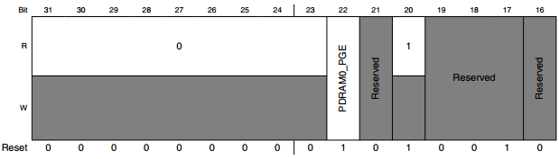

图 38‑4 GPC_CNTR寄存器

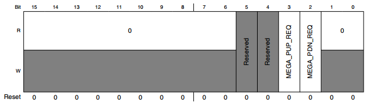

其中需要操作的位区域是22
PDRAM0_PGE，这个位的功能主要是对电源门的控制，当PDRAM0_PGE为1时，CPU内核断电，FlexRAM
PDRAM0域（bank1-7）将关闭一次。当PDRAM0_PGE为0时，0即使CPU内核断电，FlexRAM
PDRAM0域（bank1-7）也将继续通电。

关掉FlexRAM1，主要操作的寄存器是PGC_MEGA_CTRL，具体寄存器图见图37-5。

图 38‑5 PGC_MEGA_CTRL寄存器。

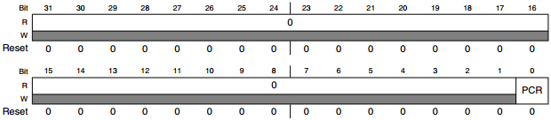

其中起作用的位主要是0位的PCR，其中这位的作用主要是对功率的控制，当PCR为0时即使pdn_req被置位，也不要将电源关闭；当PCR为1时在声明pdn_req时关闭电源。

-  第三部分：使用DCDC_AdjustTargetVoltage()函数将LP电压调整为0.925V，设置DCDC的时钟源为内部的OSC，使用PowerDownUSBPHY()函数将USB的外设断电并且配置PGC的（CPU控制寄存器）。还需要配置PMU的REG_CORE_SET寄存器和MISC0_CLR寄存器，具体见图37-6。

图 38‑6 REG_CORE_SET寄存器

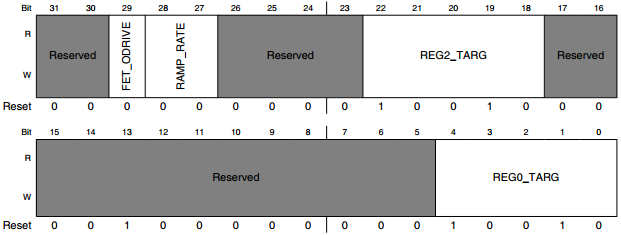

其中主要操作的寄存器是第29位的FET_ODRIVE，如果将置位则增加功率门控FET上的栅极驱动，以减少关断状态下的泄漏。只有当功率FET的输入电源电压低于1.1V时，才能注意应用该位。（该位仅应用于外部输入电源电压标称值为0.9V的低功耗模式）

图 38‑7 MISC0_CLR寄存器

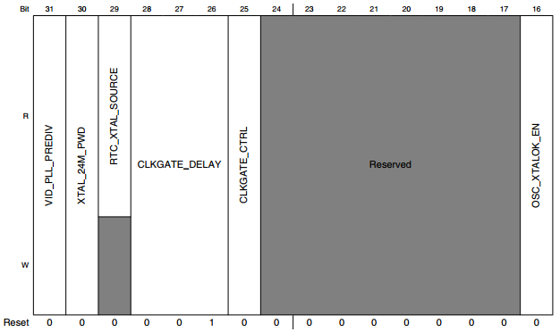

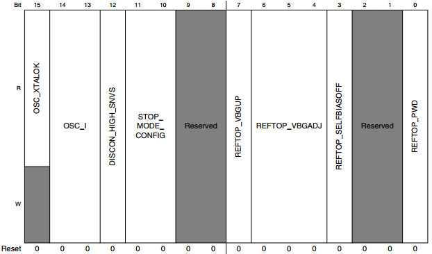

操作的是第11-10位寄存器，主要目的是在停止模式下配置RTC以外的外设模拟。两位寄存器配置具体见表37-5。

表 38‑5

+------------+------------------------+-----------------------------------------+
| 寄存器配置 | 模式                   | 描述                                    |
+============+========================+=========================================+
| 00         | SUSPEND                | 除rtc外的所有模拟都在停止模式断言时断电 |
+------------+------------------------+-----------------------------------------+
| 01         | STANDBY                | 模拟稳压器开启                          |
+------------+------------------------+-----------------------------------------+
| 10         | STOP(lower power)      | 模拟稳压器开启                          |
+------------+------------------------+-----------------------------------------+
| 11         | STOP(very lower power) | 模拟稳压器关闭                          |
+------------+------------------------+-----------------------------------------+

第11位置0，第10
位置0则对应的就是SUSPEND模式，若想要配置成其他模式，只需按照表格里面的寄存器配置一栏配置即可。

这里用到的第12位寄存器是控制从VDD_HIGH_IN到VDD_SNVS_IN的开关。置0时表示打开，置1的时候表示关闭。

-  第四部分：在启用RBC计数器之前要屏蔽所有的GPC的中断，在这里使用循环的方式将所有中断全部屏蔽；设置CCM_CCR寄存器启动计数器，延时一下，如果中断已经挂起，RBC计数器开始计数或者在即将断言DSM_request时中断到达。

-  第五部分：使用循环关闭GPC中断的相同方式，将所有GPC中断恢复，并将外设退出停止模式。

LPM进入低功耗空闲模式
^^^^^^^^^^^^^^^^^^^^^

该函数讲解了LPM进入低功耗空闲模式的配置。

.. code-block:: c
   :name: 代码清单 38‑4 LPM 进入低功耗空闲模式(bsp_lpm.c)
   :caption: 代码清单 38‑4 LPM 进入低功耗空闲模式(bsp_lpm.c)
   :linenos:

   void LPM_EnterLowPowerIdle(void)
   {
      /*************************第一部分*********************/
      /* 设置等待模式配置 */
      LPM_SetWaitModeConfig();
      /* 设置低功耗时钟门 */
      SetLowPowerClockGate();
      /* 将时钟设置成低功耗空闲 */
      ClockSetToLowPowerIdle();
      /* 断电 USBPHY */
      PowerDownUSBPHY();
      /*************************第二部分*********************/
      /* 将SOC电压调整为0.95V */
      DCDC_AdjustTargetVoltage(DCDC, 0x6, 0x1);
      /* DCM 模式 */
      DCDC_BootIntoDCM(DCDC);
      /* 断开负载电阻的内部 */
      DCDC->REG1 &= ~DCDC_REG1_REG_RLOAD_SW_MASK;
      /* 掉电输出范围比较器*/
      DCDC->REG0 |= DCDC_REG0_PWD_CMP_OFFSET_MASK;
      /* 使能 FET ODRIVE */
      PMU->REG_CORE_SET = PMU_REG_CORE_FET_ODRIVE_MASK;
      /* 连接vdd_high_in并连接vdd_snvs_in */
      PMU->MISC0_CLR = PMU_MISC0_DISCON_HIGH_SNVS_MASK;
      /*************************第三部分*********************/
      /* 使能弱LDO */
      EnableWeakLDO();
      /* 失能常规LDO */
      DisableRegularLDO();
      /* 带隙失能 */
      BandgapOff();
      /* 外围设备进入打盹模式 */
      PeripheralEnterDozeMode();
      __DSB();
      __WFI();
      __ISB();
   }

-  第一部分：先设置成等待模式，然后设置低功耗时钟门并将时钟设置成低功耗空闲模式，将USBPHY断电。

-  第二部分：参考LPM进入等待模式的第三部分详解即可。

-  第三部分：使能弱LDO、失能常规LDO，主要是操作PMU_REG_2P5_SET、PMU_REG_1P1_SET、PMU_REG_2P5_CLR、PMU_REG_1P1_CLR寄存器。其中PMU_REG_2P5_SET和PMU_REG_2P5_CLR为一组配置相同，PMU_REG_1P1_SET和PMU_REG_1P1_CLR为一组配置相同的寄存器。见图37-8。

图 38‑8 PMU_REG_2P5_SET和PMU_REG_2P5_CLR寄存器

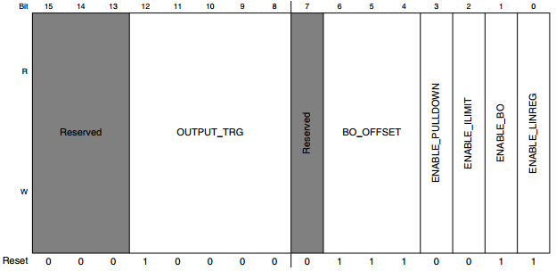

在这里只用到了第0位寄存器，ENABLE_LINREG，控制这个位去使能稳压器的输出。

PMU_REG_1P1_SET和PMU_REG_1P1_CLR与2P5的相同。

带隙使能操作PMU_MISC0_SET寄存器，见图37-9。

图 38‑9 PMU_MISC0_SET寄存器

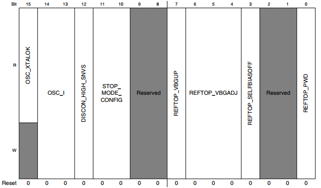

在这里只用到了第0位寄存器，PEFTOP_PWD，控制位的关断模拟带隙参考电路。

LPM进入系统空闲模式
^^^^^^^^^^^^^^^^^^^

该函数讲解了LPM进入系统空闲模式的配置。软件上的配置与LPM进入低功耗模式章节除了DCDC_AdjustTargetVoltage()函数配置的电压不同，其它的一致，参考LPM进入低功耗模式章节即可。

.. code-block:: c
   :name: 代码清单 38‑5 LPM进入系统空闲模式(bsp_lpm.c)
   :caption: 代码清单 38‑5 LPM进入系统空闲模式(bsp_lpm.c)
   :linenos:

   /**
   * @brief  LPM进入系统空闲
   * @return 无
   *   @retval 无
   */
   void LPM_EnterSystemIdle(void) 
   {
      /* 设置等待模式配置 */
      LPM_SetWaitModeConfig();
      /* 设置低功耗时钟门 */
      SetLowPowerClockGate();
      /* 将时钟设置成低功耗空闲 */
      ClockSetToSystemIdle();
      /* 断电 USBPHY */
      PowerDownUSBPHY();
      /* DCDC 到 1.15V */
      DCDC_AdjustTargetVoltage(DCDC, 0xe, 0x1);
      /* DCM 模式 */
      DCDC_BootIntoDCM(DCDC);
      /* 断开负载电阻的内部 */
      DCDC->REG1 &= ~DCDC_REG1_REG_RLOAD_SW_MASK;
      /* 掉电输出范围比较器 */
      DCDC->REG0 |= DCDC_REG0_PWD_CMP_OFFSET_MASK;
      /* 使能 FET ODRIVE */
      PMU->REG_CORE_SET = PMU_REG_CORE_FET_ODRIVE_MASK;
      /* 连接vdd_high_in并连接vdd_snvs_in */
      PMU->MISC0_CLR = PMU_MISC0_DISCON_HIGH_SNVS_MASK;
      /* 使能弱LDO */
      EnableRegularLDO();
      /* 失能常规LDO*/
      DisableWeakLDO();
      /* 带隙失能 */
      BandgapOn();
      /* 外围设备进入打盹模式 */
      PeripheralEnterDozeMode();
      __DSB();
      __WFI();
      __ISB();
   }

LPM进入SNVS模式
^^^^^^^^^^^^^^^

该函数讲解了LPM进入系统空闲模式的配置。

.. code-block:: c
   :name: 代码清单 38‑6 LPM进入SNVS模式(bsp_lpm.c)
   :caption: 代码清单 38‑6 LPM进入SNVS模式(bsp_lpm.c)
   :linenos:

   /**
   * @brief  LPM进入SNVS
   * @return 无
   *   @retval 无
   */
   void LPM_EnterSNVS(void)
   {
      SNVS->LPCR |= SNVS_LPCR_TOP_MASK;
      while (1) { /* 关掉 */
      }
   }

这个函数的代码相对较少，仅配置了SNVS_LPCR寄存器，具体见图37-10。

图 38‑10 SNVS_LPCR 寄存器

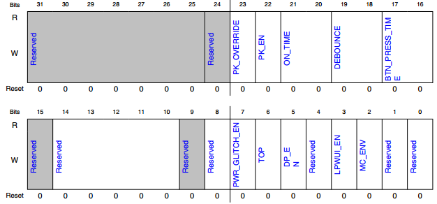

在这里使用了第6位TOP，起到的作用为关闭系统电源，即断言此位会导致信号被发送到电源管理IC以关闭系统电源。一旦电源关闭，该位将清除并且该位仅在启用PMIC时有效。当top为0b时，保持系统电源，为1b时关闭系统电源。

退出模式
^^^^^^^^

.. code-block:: c
   :name: 代码清单 38‑7 LPM退出低功耗空闲模式(bsp_lpm.c)
   :caption: 代码清单 38‑7 LPM退出低功耗空闲模式(bsp_lpm.c)
   :linenos:

   /**
   * @brief  LPM退出低功耗空闲
   * @return 无
   *   @retval 无
   */
   void LPM_ExitLowPowerIdle(void)
   {
      /* 外设退出打盹模式 */
      PeripheralExitDozeMode();
      /* 设置运行模式 */
      LPM_SetRunModeConfig();
   }

LPM退出低功耗空闲模式的方式主要分为为两个部分，分别是退出打盹模式和将系统设置为运行模式。其中退出打盹模式主要通过设置IOMUXC_GPR_GPR8寄存器和IOMUXC_GPR_GPR12寄存器的所有位全部设置为0即可。

退出系统空闲模式与退出低功耗空闲模式的退出方式相同，不再重复讲解。

相关枚举讲解
~~~~~~~~~~~~

RT1052的SDK库为电源管理的相关的封装了两个枚举，lpm_power_mode_t用于对功耗模式的定义和使用，app_wakeup_source_t用于唤醒源的选择。在编程时我们不需要记住每个低功耗的编号和唤醒源的编号，仅需要枚举的名称即可。

lpm_power_mode_t枚举
^^^^^^^^^^^^^^^^^^^^

.. code-block:: c
   :name: 代码清单 38‑8 lpm_power_mode_t 枚举(bsp_lpm.h)
   :caption: 代码清单 38‑8 lpm_power_mode_t 枚举(bsp_lpm.h)
   :linenos:

   typedef enum _lpm_power_mode {
      LPM_PowerModeOverRun = 0, /* 超载运行模式 */
      LPM_PowerModeFullRun, /* 满载运行模式*/
      LPM_PowerModeLowSpeedRun,/* 低速运行模式 */
      LPM_PowerModeLowPowerRun,/* 低功耗运行模式 */
      LPM_PowerModeRunEnd = LPM_PowerModeLowPowerRun,
      LPM_PowerModeSysIdle, /* 系统空闲模式 */
      LPM_PowerModeLPIdle, /* 低功耗空闲模式 */
      LPM_PowerModeSuspend, /* 暂停模式 */
      LPM_PowerModeSNVS, /*电源关闭模式或关机模式 */
      LPM_PowerModeEnd = LPM_PowerModeSNVS/*枚举结尾 */
   } lpm_power_mode_t;

枚举的名字为_lpm_power_mode，是将超载运行模式定位第一个元素，以此类推，运行的模式供四个分别为超载运行、满载运行、低速运行和低功耗运行模式，然后在运行模式的下一个元素加一个结束标志LPM_PowerModeRunEnd，方便在调用时使用。其它模式分别是系统空闲、低功耗空闲、暂停、关机模式（SNVS）和一个结束标志LPM_PowerModeEnd方便使用时调用。

app_wakeup_source_t枚举
^^^^^^^^^^^^^^^^^^^^^^^

.. code-block:: c
   :name: 代码清单 38‑9 app_wakeup_source_t枚举(bsp_power_mode_switch_bm.h)
   :caption: 代码清单 38‑9 app_wakeup_source_t枚举(bsp_power_mode_switch_bm.h)
   :linenos:

   typedef enum _app_wakeup_source {
      kAPP_WakeupSourceGPT, /*!< GPT唤醒。        */
      kAPP_WakeupSourcePin, /*!<通过外部引脚唤醒。 */
   } app_wakeup_source_t;

枚举的名字为_app_wakeup_source，在这里主要是列出唤醒的源，分别是GPT定时器和外部中断引脚。将其列为枚举类型方便在使用时调用。

37.5 PWR电源模式选择实验
~~~~~~~~~~~~~~~~~~~~~~~~

PWR电源模式选择实验通过串口打印提示的方式输出当前各种总线的时钟频率并且使用串口发送数据的方式，根据不同信息切换电源模式。

硬件设计
^^^^^^^^

实验中的硬件主要使用到了按键以及使用串口输出调试信息，这些硬件都与前面相应实验中的一致，涉及到硬件设计的可参考原理图或前面章节中的内容。

软件设计
^^^^^^^^

这里只讲解核心的部分代码，有些变量的设置，头文件的包含等并没有完全涉及到，完整的代码请参考本章配套的工程

本小节讲解的是“PWR电源模式选择”实验，请打开配套的代码工程阅读理解。

编程要点
''''''''

1) 配置UART通信功能；

2) 配置GPT，初始化GPT模块

3) 初始化唤醒引脚；

4) 初始化LPM功能；

5) 编写主函数，实现电源相关的模式切换与唤醒功能。

代码分析
''''''''

GPT和GPIO相关宏定义
**********************************

在程序中一般使用宏重定义使用的外设，这样的好处是移植代码时只需要在头文件中修改宏定义的值即可。如代码清单19‑14所示。

.. code-block:: c
   :name: 代码清单 38‑10 宏定义(power_mode_switch_bm.h)
   :caption: 代码清单 38‑10 宏定义(power_mode_switch_bm.h)
   :linenos:

   /* GPIO相关宏定义 */
   #define CPU_NAME "iMXRT1052"
   #define APP_WAKEUP_BUTTON_GPIO BOARD_USER_BUTTON_GPIO
   #define APP_WAKEUP_BUTTON_GPIO_PIN BOARD_USER_BUTTON_GPIO_PIN
   #define APP_WAKEUP_BUTTON_IRQ BOARD_USER_BUTTON_IRQ
   #define APP_WAKEUP_BUTTON_IRQ_HANDLER BOARD_USER_BUTTON_IRQ_HANDLER
   #define APP_WAKEUP_BUTTON_NAME BOARD_USER_BUTTON_NAME
   /* GPT相关宏定义 */
   #define APP_WAKEUP_GPT_BASE GPT2
   #define APP_WAKEUP_GPT_IRQn GPT2_IRQn
   #define APP_WAKEUP_GPT_IRQn_HANDLER GPT2_IRQHandler

为了方便程序移植，我们把需要频繁修改的代码用宏封装起来。其中这里将中断编号APP_WAKEUP_GPT_IRQn和中断服务函数APP_WAKEUP_GPT_IRQn_HANDLER封装起来，便于修改和移植代码。具体操作用户可自行修改。

主函数
*****************

.. code-block:: c
   :name: 代码清单 38‑11 主函数(main.c)
   :caption: 代码清单 38‑11 主函数(main.c)
   :linenos:

   /**
      * @brief  主函数
      * @param  无
      * @retval 无
      */
   int main(void)
   {
      /****************************第一部分**********************/
      __IO uint8_t ch;
      uint32_t freq;
      bool needSetWakeup; /* 需要设置唤醒. */
      gpt_config_t gptConfig;
      /* 定义输入开关管脚的初始化结构*/
      gpio_pin_config_t swConfig = {
            kGPIO_DigitalInput,
            0,
            kGPIO_IntRisingEdge,
      };
      /* 初始化内存保护单元 */
      BOARD_ConfigMPU();
      /* 初始化开发板引脚 */
      BOARD_InitPins();
      /* 初始化开发板时钟 */
      BOARD_BootClockRUN();
      /* 将UART分频器配置为默认值 */
      CLOCK_SetMux(kCLOCK_UartMux, 1); /*将UART源设置为OSC 24M */
      CLOCK_SetDiv(kCLOCK_UartDiv, 0); /* 将UART分频器设置为1 */
      /* 初始化调试串口 */
      BOARD_InitDebugConsole();
      /* 初始化SNVS_PMIC_STBY_REQ_GPIO5_IO02相关配置 */
      BOARD_Init_PMIC_STBY_REQ();
      /* 初始GPT模块用于唤醒 */
      GPT_GetDefaultConfig(&gptConfig);
      gptConfig.clockSource = kGPT_ClockSource_LowFreq; /* 32K RTC OSC */
      gptConfig.enableMode = true;                      /*停止时不要保持计数器 */
      gptConfig.enableRunInDoze = true;
      /* 初始化GPT模块 */
      GPT_Init(APP_WAKEUP_GPT_BASE, &gptConfig);
      GPT_SetClockDivider(APP_WAKEUP_GPT_BASE, 1);
      /* Init输入开关GPIO。 */
      GPIO_PinInit(APP_WAKEUP_BUTTON_GPIO, APP_WAKEUP_BUTTON_GPIO_PIN, &swConfig);
      /****************************第二部分**********************/
      /* 打印信息 */
      PRINTF("\r\nCPU wakeup source 0x%x...\r\n", SRC->SRSR);
      PRINTF("\r\n***********************************************************\r\n");
      PRINTF("\tPower Mode Switch Demo for %s\r\n", CPU_NAME);
      PRINTF("***********************************************************\r\n");
      APP_PrintRunFrequency(0); //输出运行时的频率
      /* LPM初始化 */
      LPM_Init();
      /*上电后将电源模式设置为过载 */
      //    APP_SetRunMode(LPM_PowerModeOverRun);
      //    LPM_OverDriveRun();
      while (1) {
            /****************************第三部分**********************/
            /* 获取时钟频率 */
            freq = CLOCK_GetFreq(kCLOCK_CpuClk);
            /* 打印时钟相关信息 */
            PRINTF("\r\n########## Power Mode Switch (build %s) ###########\n\r\n", __DATE__);
            PRINTF("    Core Clock = %dHz \r\n", freq);
         APP_ShowPowerMode(s_curRunMode);
         /* 打印界面信息 */
         /* 因篇幅问题，打印信息部分不再这里写出。 */
         /****************************第四部分**********************/
         /* 等待用户响应 */
         ch = GETCHAR();
         /* 判断是否为字母 */
         if ((ch >= 'a') && (ch <= 'z')) {
               ch -= 'a' - 'A';
         }
         /* 将字母与枚举类型对应，算出当前电源模式 */
         s_targetPowerMode = (lpm_power_mode_t)(ch - 'A');
         /****************************第五部分**********************/
         /* 判断当前模式在枚举类型内 */
         if (s_targetPowerMode <= LPM_PowerModeEnd) {
               /*如果无法设置目标电源模式，则循环继续。 */
               if (!APP_CheckPowerMode(s_curRunMode, s_targetPowerMode)) {
                  continue;
               }
               /*如果目标模式是运行模式，则不需要设置唤醒源。 */
               if (s_targetPowerMode <= LPM_PowerModeLowPowerRun) {
                  needSetWakeup = false;
               } else {
                  needSetWakeup = true;
               }
               /* 判断是否需要唤醒 */
               /****************************第六部分**********************/
               if (needSetWakeup) {
                  /* 获取唤醒超时和唤醒源的配置*/
                  APP_GetWakeupConfig(s_targetPowerMode);
                  /* 根据唤醒源配置 */
                  APP_SetWakeupConfig(s_targetPowerMode);
               }
               /****************************第七部分**********************/
               APP_PowerPreSwitchHook(s_targetPowerMode);
               /* 电源模式选择 */
               APP_PowerModeSwitch(s_targetPowerMode);
               APP_PowerPostSwitchHook(s_targetPowerMode);
         }
            /* 一个循环结束 */
            PRINTF("\r\nNext loop\r\n");
      }
   }

-  第一部分：主要是RT1052的系统初始化、GPT和GPIO初始化。

-  第二部分：打印相关信息，使用APP_PrintRunFiequency()函数打印运行时的相关时钟信息。并使用LPM_Init()函数初始化。

-  第三部分：使用CLOCK_GetFreq()函数获取时钟频率，并打印时钟及提示选择模式的界面信息。

-  第四部分：这部分主要是用来从串口端接收用户的信息，根据用户信息来切换模式，使用GETCHAR()函数获取字符，判断字符是否在字符a~z的范围内，将字符与电源模式的枚举标号对应。

-  第五部分：这部分主要工作是根据模式设置标志和检查；判断当前模式是否符合范围并检查当前是否可以设置电源模式，在设置模式时需要注意不可以从低功耗运行模式进入到系统空闲模式。根据当前模式判断是否需要配置唤醒源，并将needSetWakeup标志赋值。

-  第六部分：上一部分已经判断是否需要设置唤醒配置，在这部分讲解具体配置，主要分为两个函数，分别是APP_GetWakeupConfig()获取唤醒源超时、唤醒源的配置函数和APP_SetWakeupConfig()配置唤醒源函数，它们的参数都是lpm_power_mode_t类型的形参，目的将当前的模式传入函数中。具体函数详解见代码清单37-13、37-14。

.. code-block:: c
   :name: 代码清单 38‑12 获取唤醒超时和唤醒源(power_mode_switch_bm.c)
   :caption: 代码清单 38‑12 获取唤醒超时和唤醒源(power_mode_switch_bm.c)
   :linenos:

   /**
   * @brief 获取唤醒超时和唤醒源
   * @param targetMode 当前模式
   * @return 无
   *   @retval 无
   */
   void APP_GetWakeupConfig(lpm_power_mode_t targetMode)
   {
      if (targetMode == LPM_PowerModeSNVS) {
            /* 在SNVS模式下，只有SNVS域供电，GPT无法工作。 */
            s_wakeupSource = kAPP_WakeupSourcePin;
      } else {
            /*通过用户输入获取唤醒源。 */
            s_wakeupSource = APP_GetWakeupSource(targetMode);
      }
   
      if (kAPP_WakeupSourceGPT == s_wakeupSource) {
            /* 唤醒源是GPT，用户应输入唤醒超时值。 */
            s_wakeupTimeout = APP_GetWakeupTimeout();
            PRINTF("Will wakeup in %d seconds.\r\n", s_wakeupTimeout);
      } else {
            PRINTF("Switch %s from off to on to wake up.\r\n", APP_WAKEUP_BUTTON_NAME);
      }
   }

首先通过用户输入来获取唤醒源，使用GetWakeupSource()函数获取，并将返回值赋值给全局变量wakeupSource（SNVS模式除外，这个模式只有SNVS域供电，GPT模块无法工作），如果唤醒源为GPT则还需要使用GetWakeupTimeout()函数选择唤醒超时时间。

唤醒源配置见代码清单37-13。

.. code-block:: c
   :name: 代码清单 38‑13 根据唤醒源配置代码(power_mode_switch_bm.c)
   :caption: 代码清单 38‑13 根据唤醒源配置代码(power_mode_switch_bm.c)
   :linenos:

   /**
   * @brief 设置唤醒配置
   * @param targetMode 当前模式
   * @return 无
   *   @retval 无
   */
   void APP_SetWakeupConfig(lpm_power_mode_t targetMode)
   {
      /*设置GPT超时值。 */
      if (kAPP_WakeupSourceGPT == s_wakeupSource) {
            GPT_StopTimer(APP_WAKEUP_GPT_BASE);
            /* 更新比较channel1值将重置计数器 */
            GPT_SetOutputCompareValue(APP_WAKEUP_GPT_BASE, kGPT_OutputCompare_Channel1,
                                    (CLOCK_GetRtcFreq() * s_wakeupTimeout) - 1U);
   
            /*启用GPT输出Compare1中断 */
            GPT_EnableInterrupts(APP_WAKEUP_GPT_BASE, kGPT_OutputCompare1InterruptEnable);
            NVIC_EnableIRQ(APP_WAKEUP_GPT_IRQn);
            EnableIRQ(APP_WAKEUP_GPT_IRQn);
   
            /* 重启计时器 */
            GPT_StartTimer(APP_WAKEUP_GPT_BASE);
   
            LPM_EnableWakeupSource(APP_WAKEUP_GPT_IRQn);
      } else {
            GPIO_ClearPinsInterruptFlags(APP_WAKEUP_BUTTON_GPIO, 1U << APP_WAKEUP_BUTTON_GPIO_PIN);
            /* 使能GPIO引脚中断 */
            GPIO_EnableInterrupts(APP_WAKEUP_BUTTON_GPIO, 1U << APP_WAKEUP_BUTTON_GPIO_PIN);
            NVIC_EnableIRQ(APP_WAKEUP_BUTTON_IRQ);
            /* 启用中断*/
            EnableIRQ(APP_WAKEUP_BUTTON_IRQ);
            /* 启用GPC中断*/
            LPM_EnableWakeupSource(APP_WAKEUP_BUTTON_IRQ);
      }
   }

这部分主要是根据用户输入的唤醒源来进一步配置具体的资源，代码清单中一共列出两种唤醒源的配置，分别是GPT唤醒源和外部中断唤醒源。在GPT唤醒源配置中将用户输入的超时时间直接配置到SetOutputCompareValue()函数中以达到根据用户输入配置超时时间的目的。在外部中断唤醒源配置中配置的是板子上的WAKEUP按键。

-  第七部分：根据目标模式选择切换并设置的电源模式。

下载验证
^^^^^^^^

    下载这个实验测试时，需连接上串口，在电脑端的串口调试助手获知调试信息。当打开串口调试助手时，按一下复位，会出现一些调试信息，见图37-11。

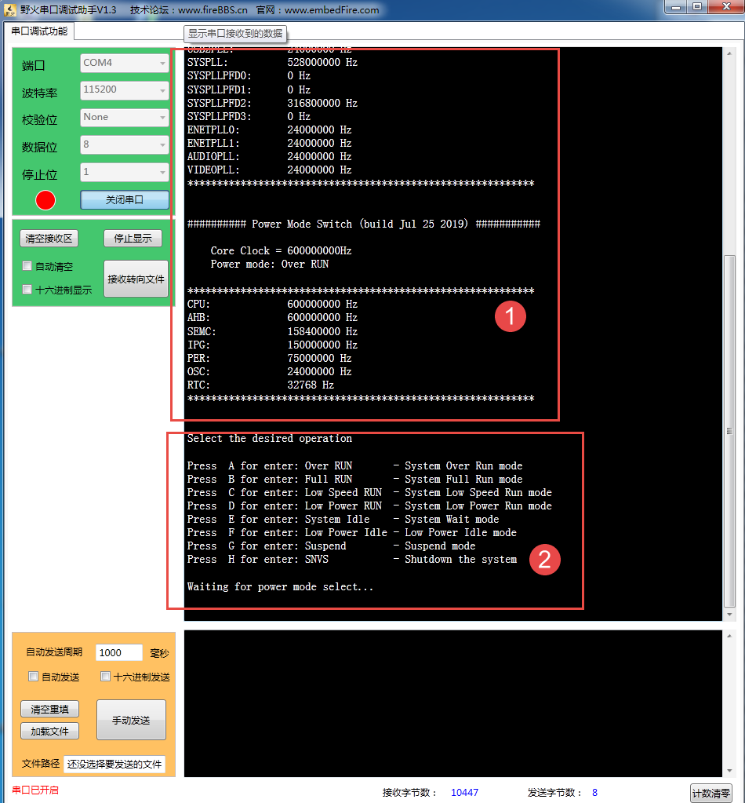

图 38‑11 串口信息打印

    图中第一部分是打印的时钟相关信息，第二部分是选择进入各个电源模式的菜单界面，界面一共8个选项，8个选项分别是从串口输入A~H（a~h）字符就会进入不同的选项，在A~D模式，修改了主频，发送对应字符后会显示改变后的时钟频率。在E~G模式中，发送后会显示选择唤醒源界面，见图37-12。

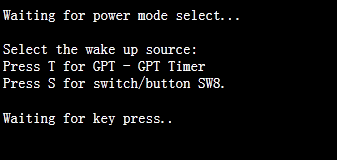

图 38‑12 唤醒源选择界面

    在这个界面中一共两个选项，分别是选择GPT定时器为唤醒源和选择按键为唤醒源，选择GPT定时器
    为唤醒源会再选择时间，时间到后自动唤醒。选择按键为唤醒源，只有当按下WAKEUP按键才会唤醒。在H模式中，发送后会直接进入SNVS(关机)模式，只有按下WAKEUP才会唤醒。
