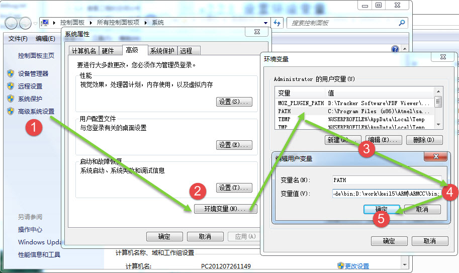
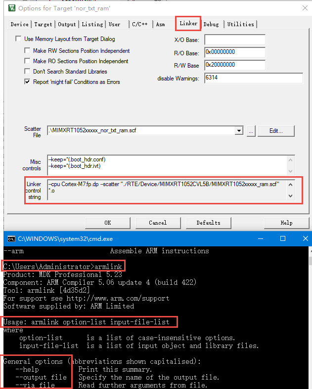
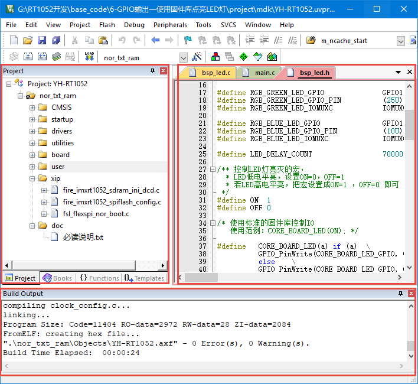
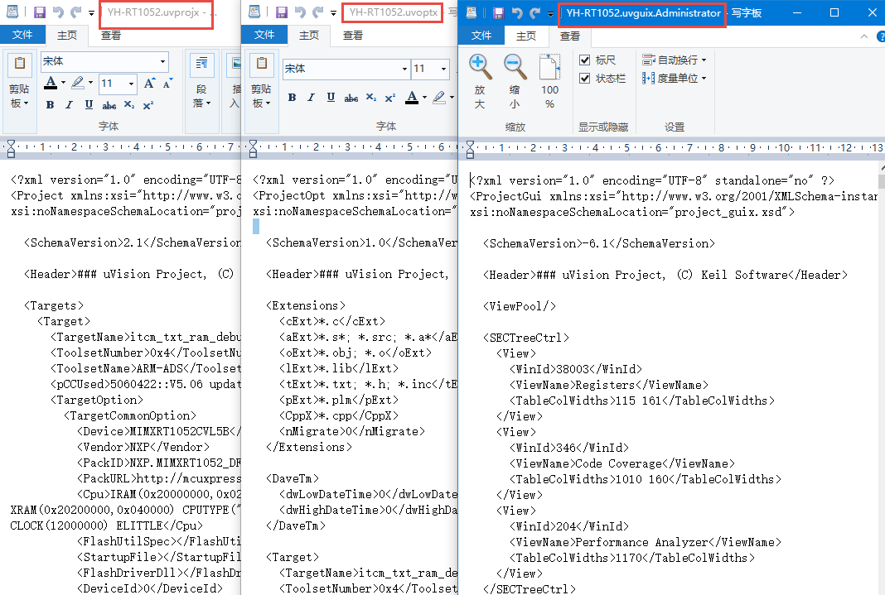

MDK的编译过程及文件类型全解
---------------------------

本章参考资料：MDK的帮助手册《ARM Development
Tools》，点击MDK界面的“help->uVision
Help”菜单可打开该文件。关于ELF文件格式，参考配套资料里的《ELF文件格式》文件。

在本章中讲解了非常多的文件类型，学习时请跟着教程的节奏，打开实际工程中的文件来了解。

相信您已经非常熟练地使用MDK创建应用程序了，平时使用MDK编写源代码，然后编译生成机器码，再把机器码下载到RT1052芯片上运行，但是这个编译、下载的过程MDK究竟做了什么工作？它编译后生成的各种文件又有什么作用？本章节将对这些过程进行讲解，了解编译及下载过程有助于理解芯片的工作原理。

编译过程
~~~~~~~~

编译过程简介
^^^^^^^^^^^^

首先我们简单了解下MDK的编译过程，它与其它编译器的工作过程是类似的，该过程见图
39‑1。

.. image:: media/image1.jpeg
   :align: center
   :alt: image1
   :name: 图39_1

图 39‑1 MDK编译过程

编译过程生成的不同文件将在后面的小节详细说明，此处先抓住主要流程来理解。

(1) 编译，MDK软件使用的编译器是armcc和armasm，它们根据每个c/c++和汇编源文件编译成对应的以“.o”为后缀名的对象文件(Object
    Code，也称目标文件)，其内容主要是从源文件编译得到的机器码，包含了代码、数据以及调试使用的信息；

(2) 链接，链接器armlink把各个.o文件及库文件链接成一个映像文件“.axf”或“.elf”；

(3) 格式转换，一般来说Windows或Linux系统使用链接器直接生成可执行映像文件elf后，内核根据该文件的信息加载后，就可以运行程序了，但在单片机平台上，需要把该文件的内容加载到芯片上，所以还需要对链接器生成的elf映像文件利用格式转换器fromelf转换成“.bin”或“.hex”文件，交给下载器下载到芯片的FLASH或ROM中。

具体工程中的编译过程
^^^^^^^^^^^^^^^^^^^^

下面我们打开
“6-GPIO输出—使用固件库点亮LED灯”的工程，以它为例进行讲解，其它工程的编译过程也是一样的，只是文件有差异。打开工程后，点击MDK的“rebuild”按钮，它会重新构建整个工程，构建的过程会在MDK下方的“Build
Output”窗口输出提示信息，见图 39‑2。

图 39‑2 编译工程时的编译提示

构建工程的提示输出主要分6个部分，说明如下：

(1) 提示信息的第一部分说明构建过程调用的编译器。图中的编译器名字是“V5.06(build
    20)”，后面附带了该编译器所在的文件夹。在电脑上打开该路径，可看到该编译器包含图
    39‑3中的各个编译工具，如armar、armasm、armcc、armlink及fromelf，后面四个工具已在图
    39‑1中已讲解，而armar是用于把.o文件打包成lib文件的。

.. image:: media/image3.jpeg
   :align: center
   :alt: image3
   :name: 图39_3  

图 39‑3 编译工具

(1) 使用armasm编译汇编文件。图中列出了编译startup启动文件时的提示，编译后每个汇编源文件都对应有一个独立的.o文件。

(2) 使用armcc编译c/c++文件。图中列出了工程中所有的c/c++文件的提示，同样地，编译后每个c/c++源文件都对应有一个独立的.o文件。

(3) 使用armlink链接对象文件，根据程序的调用把各个.o文件的内容链接起来，最后生成程序的axf映像文件，并附带程序各个域大小的说明，包括Code、RO-data、RW-data及ZI-data的大小。

(4) 使用fromelf生成下载格式文件，它根据axf映像文件转化成hex文件，并列出编译过程出现的错误(Error)和警告(Warning)数量。

(5) 最后一段提示给出了整个构建过程消耗的时间。

构建完成后，可在工程的“Output”及“Listing”目录下找到由以上过程生成的各种文件，见图
39‑4。

图 39‑4 编译后Objects及Listing文件夹中的内容

可以看到，每个C源文件都对应生成了.o、.d及.crf后缀的文件，还有一些额外的.dep、.hex、.axf、.htm、.lnp、.sct、.lst及.map文件。

程序的组成、存储与运行
~~~~~~~~~~~~~~~~~~~~~~

CODE、RO、RW、ZI Data域及堆栈空间
^^^^^^^^^^^^^^^^^^^^^^^^^^^^^^^^^

在工程的编译提示输出信息中有一个语句“Program Size：Code=xx RO-data=xx
RW-data=xx
ZI-data=xx”，它说明了程序各个域的大小，编译后，应用程序中所有具有同一性质的数据(包括代码)被归到一个域，程序在存储或运行的时候，不同的域会呈现不同的状态，这些域的意义如下：

-  Code：即代码域，它指的是编译器生成的机器指令，这些内容被存储到ROM区。

-  RO-data：Read Only
   data，即只读数据域，它指程序中用到的只读数据，这些数据被存储在ROM区，因而程序不能修改其内容。例如C语言中const关键字定义的变量就是典型的RO-data。

-  RW-data：Read Write
   data，即可读写数据域，它指初始化为“非0值”的可读写数据，程序刚运行时，这些数据具有非0的初始值，且运行的时候它们会常驻在RAM区，因而应用程序可以修改其内容。例如C语言中使用定义的全局变量，且定义时赋予“非0值”给该变量进行初始化。

-  ZI-data：Zero Initialie
   data，即0初始化数据，它指初始化为“0值”的可读写数据域，它与RW-data的区别是程序刚运行时这些数据初始值全都为0，而后续运行过程与RW-data的性质一样，它们也常驻在RAM区，因而应用程序可以更改其内容。例如C语言中使用定义的全局变量，且定义时赋予“0值”给该变量进行初始化(若定义该变量时没有赋予初始值，编译器会把它当ZI-data来对待，初始化为0)；

-  ZI-data的栈空间(Stack)及堆空间(Heap)：在C语言中，函数内部定义的局部变量属于栈空间，进入函数的时候从向栈空间申请内存给局部变量，退出时释放局部变量，归还内存空间。而使用malloc动态分配的变量属于堆空间。在程序中的栈空间和堆空间都是属于ZI-data区域的，这些空间都会被初始值化为0值。编译器给出的ZI-data占用的空间值中包含了堆栈的大小(经实际测试，若程序中完全没有使用malloc动态申请堆空间，编译器会优化，不把堆空间计算在内)。

综上所述，以程序的组成构件为例，它们所属的区域类别见表 39‑1。

    表 39‑1 程序组件所属的区域

+------------------------------+-------------------+
| 程序组件                     | 所属类别          |
+==============================+===================+
|     机器代码指令             |     Code          |
+------------------------------+-------------------+
|     常量                     |     RO-data       |
+------------------------------+-------------------+
|     初值非0的全局变量        |     RW-data       |
+------------------------------+-------------------+
|     初值为0的全局变量        |     ZI-data       |
+------------------------------+-------------------+
|     局部变量                 |     ZI-data栈空间 |
+------------------------------+-------------------+
|     使用malloc动态分配的空间 |     ZI-data堆空间 |
+------------------------------+-------------------+

程序的存储与运行
^^^^^^^^^^^^^^^^

RW-data和ZI-data它们仅仅是初始值不一样而已，为什么编译器非要把它们区分开？这就涉及到程序的存储状态了，应用程序具有静止状态和运行状态。静止态的程序被存储在非易失存储器中，如RT1052的外部FLASH，因而系统掉电后也能正常保存。但是当程序在运行状态的时候，程序常常需要修改一些暂存数据，由于运行速度的要求，这些数据往往存放在内存中(RAM)，掉电后这些数据会丢失。因此，程序在静止与运行的时候它在存储器中的表现是不一样的，见图
39‑5。

图 39‑5 应用程序的加载视图与执行视图

图中的左侧是应用程序的存储状态，右侧是运行状态，而上方是RAM存储器区域，下方是ROM存储器区域。

程序在存储状态时，RO节(RO
section)及RW节都被保存在ROM区。当程序开始运行时，内核直接从ROM中读取代码，并且在执行主体代码前，会先执行一段加载代码，它把RW节数据从ROM复制到RAM，
并且在RAM加入ZI节，ZI节的数据都被初始化为0。加载完后RAM区准备完毕，正式开始执行主体程序。

编译生成的RW-data的数据属于图中的RW节，ZI-data的数据属于图中的ZI节。是否需要掉电保存，这就是把RW-data与ZI-data区别开来的原因，因为在RAM创建数据的时候，默认值为0，但如果有的数据要求初值非0，那就需要使用ROM记录该初始值，运行时再复制到RAM。

STM32的RO区域不需要加载到SRAM，内核直接从FLASH读取指令运行。计算机系统的应用程序运行过程很类似，不过计算机系统的程序在存储状态时位于硬盘，执行的时候甚至会把上述的RO区域(代码、只读数据)加载到内存，加快运行速度，还有虚拟内存管理单元(MMU)辅助加载数据，使得可以运行比物理内存还大的应用程序。而STM32没有MMU，所以无法支持Linux和Windows系统。

当程序存储到RT1052芯片的外部部FLASH时(即ROM区)，它占用的空间是Code、RO-data及RW-data的总和，所以如果这些内容比RT1052芯片的FLASH空间大，程序就无法被正常保存了。当程序在执行的时候，需要占用内部SRAM空间(即RAM区)，占用的空间包括RW-data和ZI-data。应用程序在各个状态时各区域的组成见表
39‑2。

    表 39‑2 程序状态区域的组成

+--------------------------------+------------------------------+
| 程序状态与区域                 | 组成                         |
+================================+==============================+
|     程序执行时的只读区域(RO)   |     Code + RO data           |
+--------------------------------+------------------------------+
|     程序执行时的可读写区域(RW) |     RW data + ZI data        |
+--------------------------------+------------------------------+
|     程序存储时占用的ROM区      |     Code + RO data + RW data |
+--------------------------------+------------------------------+

在MDK中，我们建立的工程一般会选择芯片型号，选择后就有确定的FLASH及SRAM大小，若代码超出了芯片的存储器的极限，编译器会提示错误，这时就需要裁剪程序了，裁剪时可针对超出的区域来优化。

编译工具链
~~~~~~~~~~~

在前面编译过程中，MDK调用了各种编译工具，平时我们直接配置MDK，不需要学习如何使用它们，但了解它们是非常有好处的。例如，若希望使用MDK编译生成bin文件的，需要在MDK中输入指令控制fromelf工具；在本章后面讲解AXF及O文件的时候，需要利用fromelf工具查看其文件信息，这都是无法直接通过MDK做到的。关于这些工具链的说明，在MDK的帮助手册《ARM
Development Tools》都有详细讲解，点击MDK界面的“help->uVision
Help”菜单可打开该文件。

设置环境变量
^^^^^^^^^^^^

调用这些编译工具，需要用到Windows的“命令行提示符工具”，为了让命令行方便地找到这些工具，我们先把工具链的目录添加到系统的环境变量中。查看本机工具链所在的具体目录可根据上一小节讲解的工程编译提示输出信息中找到，如本机的路径为“D:\work\keil5\ARM\ARMCC\bin”。

添加路径到PATH环境变量
''''''''''''''''''''''

本文以Win7系统为例添加工具链的路径到PATH环境变量，其它系统是类似的。

(1) 右键电脑系统的“计算机图标”，在弹出的菜单中选择“属性”，见图 39‑6；

.. image:: media/image6.jpeg
   :align: center
   :alt: image6
   :name: 图39_6

图 39‑6 计算机属性页面

(1) 在弹出的属性页面依次点击“高级系统设置”->“环境变量”，在用户变量一栏中找到名为“PATH”的变量，若没有该变量，则新建一个。编辑“PATH”变量，在它的变量值中输入工具链的路径，如本机的是“;D:\work\keil5\ARM\ARMCC\bin”，注意要使用“分号;”让它与其它路径分隔开，输入完毕后依次点确定，见图39‑7；

图 39‑7 添加工具链路径到PATH变量

(1) 打开Windows的命令行，点击系统的“开始菜单”，在搜索框输入“cmd”，在搜索结果中点击“cmd.exe”即可打开命令行，见图39‑8；

图 39‑8 打开命令行

(1) 在弹出的命令行窗口中输入“fromelf”回车，若窗口打印出formelf的帮助说明，那么路径正常，就可以开始后面的工作了；若提示“不是内部名外部命令，也不是可运行的程序…”信息，说明路径不对，请重新配置环境变量，并确认该工作目录下有编译工具链。

这个过程本质就是让命令行通过“PATH”路径找到“fromelf.exe”程序运行，默认运行“fromelf.exe”时它会输出自己的帮助信息，这就是工具链的调用过程，MDK本质上也是如此调用工具链的，只是它集成为GUI，相对于命令行对用户更友好，毕竟上述配置环境变量的过程已经让新手烦躁了。

armcc、armasm及armlink 
^^^^^^^^^^^^^^^^^^^^^^^

接下来我们看看各个工具链的具体用法，主要以armcc为例。

armcc
'''''

armcc用于把c/c++文件编译成ARM指令代码，编译后会输出ELF格式的O文件(对象、目标文件)，在命令行中输入“armcc”回车可调用该工具，它会打印帮助说明，见图
39‑9

.. image:: media/image9.jpeg
   :align: center
   :alt: image9
   :name: 图39_9

图 39‑9 armcc的帮助提示

帮助提示中分三部分，第一部分是armcc版本信息，第二部分是命令的用法，第三部分是主要命令选项。

根据命令用法： armcc [options] file1 file2 ... filen
，在[option]位置可输入下面的“--arm”、“--cpu
list”选项，若选项带文件输入，则把文件名填充在file1
file2…的位置，这些文件一般是c/c++文件。

例如根据它的帮助说明，“--cpu
list”可列出编译器支持的所有cpu，我们在命令行中输入“armcc --cpu
list”，可查看图 39‑10中的cpu列表。

.. image:: media/image10.jpeg
   :align: center
   :alt: image10
   :name: 图39_10

图 39‑10 cpulist

打开MDK的Options for Targe->c/c++菜单，可看到MDK对编译器的控制命令，见图
39‑11。

图 39‑11 MDK的ARMCC编译选项

从该图中的命令可看到，它调用了-c、-cpu –D –g
–O1等编译选项，当我们修改MDK的编译配置时，可看到该控制命令也会有相应的变化。然而我们无法在该编译选项框中输入命令，只能通过MDK提供的选项修改。

了解这些，我们就可以查询具体的MDK编译选项的具体信息了，如c/c++选项中的“Optimization：Leve
1（-O1）”是什么功能呢？首先可了解到它是“-O”命令，命令后还带个数字，查看MDK的帮助手册，在armcc编译器说明章节，可详细了解，如图
39‑9。

.. image:: media/image12.jpeg
   :align: center
   :alt: image12
   :name: 图39_12

图 39‑12 编译器选项说明

利用MDK，我们一般不需要自己调用armcc工具，但经过这样的过程我们就会对MDK有更深入的认识，面对它的各种编译选项，就不会那么头疼了。

armasm
''''''

armasm是汇编器，它把汇编文件编译成O文件。与armcc类似，MDK对armasm的调用选项可在“Option
for Target->Asm”页面进行配置，见图 39‑13。

图 39‑13 armasm与MDK的编译选项

armlink
'''''''

armlink是链接器，它把各个O文件链接组合在一起生成ELF格式的AXF文件，AXF文件是可执行的，下载器把该文件中的指令代码下载到芯片后，该芯片就能运行程序了；利用armlink还可以控制程序存储到指定的ROM或RAM地址。在MDK中可在“Option
for Target->Linker”页面配置armlink选项，见图 39‑14。

图 39‑14 armlink与MDK的配置选项

链接器默认是根据芯片类型的存储器分布来生成程序的，该存储器分布被记录在工程里的sct后缀的文件中，有特殊需要的话可自行编辑该文件，改变链接器的链接方式，具体后面我们会详细讲解。

armar、fromelf及用户指令 
^^^^^^^^^^^^^^^^^^^^^^^^^

armar工具用于把工程打包成库文件，fromelf可根据axf文件生成hex、bin文件，hex和bin文件是大多数下载器支持的下载文件格式。

在MDK中，针对armar和fromelf工具的选项几乎没有，仅集成了生成HEX或Lib的选项，见图
39‑15。

图 39‑15 MDK中，控制fromelf生成hex及控制armar生成lib的配置

例如如果我们想利用fromelf生成bin文件，可以在MDK的“Option for
Target->User”页中添加调用fromelf的指令，见图 39‑16。

图 39‑16 在MDK中添加指令

在User配置页面中，提供了三种类型的用户指令输入框，在不同组的框输入指令，可控制指令的执行时间，分别是编译前(Before
Compile c/c++ file)、构建前(Before Build/Rebuild)及构建后(After
Build/Rebuild)执行。这些指令并没有限制必须是arm的编译工具链，例如如果您自己编写了python脚本，也可以在这里输入用户指令执行该脚本。

图中的生成bin文件指令调用了fromelf工具，紧跟后面的是工具的选项及输出文件名、输入文件名。由于fromelf是根据axf文件生成bin的，而axf文件又是构建(build)工程后才生成，所以我们把该指令放到“After
Build/Rebuild”一栏。

MDK工程的文件类型
~~~~~~~~~~~~~~~~~

除了上述编译过程生成的文件，MDK工程中还包含了各种各样的文件，下面我们统一介绍，MDK工程的常见文件类型见表
39‑3。

    表 39‑3 MDK常见的文件类型(不分大小写)

+-------------------------+--------------------------------------------------------+
|          后缀           |                          说明                          |
+=========================+========================================================+
| Project目录下的工程文件 |                                                        |
+-------------------------+--------------------------------------------------------+
| \*.uvguix               | MDK5工程的窗口布局文件，在MDK4中*.UVGUI后缀            |
|                         | 的文件功能相同                                         |
+-------------------------+--------------------------------------------------------+
| \*.uvprojx              | MDK5的工程文件，它使用了XML格式记录了工程结构，双击    |
|                         | 它可以打开整个工程，在MDK4中*.UVPROJ后缀的文件功能相同 |
+-------------------------+--------------------------------------------------------+
| \*.uvoptx               | MDK5的工程配置选项，包含debugger、trace                |
|                         |                                                        |
|                         | configuration、breakpooints以及当                      |
|                         | 前打开的文件，在MDK4中*.UVOPT后缀的文件功能相同        |
+-------------------------+--------------------------------------------------------+
| \*.ini                  | 某些下载器的配置记录文件                               |
+-------------------------+--------------------------------------------------------+
| 源文件                  |                                                        |
+-------------------------+--------------------------------------------------------+
| \*.c                    | C语言源文件                                            |
+-------------------------+--------------------------------------------------------+
| \*.cpp                  | C++语言源文件                                          |
+-------------------------+--------------------------------------------------------+
| \*.h                    | C/C++的头文件                                          |
+-------------------------+--------------------------------------------------------+
| \*.s                    | 汇编语言的源文件                                       |
+-------------------------+--------------------------------------------------------+
| \*.inc                  | 汇编语言的头文件(使用“$include”来包含)                 |
+-------------------------+--------------------------------------------------------+
| Output目录下的文件      |                                                        |
+-------------------------+--------------------------------------------------------+
| \*.lib                  | 库文件                                                 |
+-------------------------+--------------------------------------------------------+
| \*.dep                  | 整个工程的依赖文件                                     |
+-------------------------+--------------------------------------------------------+
| \*.d                    | 描述了对应.o的依赖的文件                               |
+-------------------------+--------------------------------------------------------+
| \*.crf                  | 交叉引用文件，包含了浏览信息(定义、引用及标识符)       |
+-------------------------+--------------------------------------------------------+
| \*.o                    | 可重定位的对象文件(目标文件)                           |
+-------------------------+--------------------------------------------------------+
| \*.bin                  | 二进制格式的映像文件，是纯粹的FLASH映像，不含任何额外  |
|                         | 信息                                                   |
+-------------------------+--------------------------------------------------------+
| \*.hex                  | Intel                                                  |
|                         | Hex格式的映像文件，可理解为带存储地址描述格式的bin文   |
|                         | 件                                                     |
+-------------------------+--------------------------------------------------------+
| \*.elf                  | 由GCC编译生成的文件，功能跟axf文件一样，该文件不可重   |
|                         | 定位                                                   |
+-------------------------+--------------------------------------------------------+
| \*.axf                  | 由ARMCC编译生成的可执行对象文件，可用于调试，该文件不  |
|                         | 可重定位                                               |
+-------------------------+--------------------------------------------------------+
| \*.sct                  | 链接器控制文件(分散加载)                               |
+-------------------------+--------------------------------------------------------+
| \*.scr                  | 链接器产生的分散加载文件                               |
+-------------------------+--------------------------------------------------------+
| \*.lnp                  | MDK生成的链接输入文件，用于调用链接器时的命令输入      |
+-------------------------+--------------------------------------------------------+
| \*.htm                  | 链接器生成的静态调用图文件                             |
+-------------------------+--------------------------------------------------------+
| \*.build_log.htm        | 构建工程的日志记录文件                                 |
+-------------------------+--------------------------------------------------------+
| Listing目录下的文件     |                                                        |
+-------------------------+--------------------------------------------------------+
| \*.lst                  | C及汇编编译器产生的列表文件                            |
+-------------------------+--------------------------------------------------------+
| \*.map                  | 链接器生成的列表文件，包含存储器映像分布               |
+-------------------------+--------------------------------------------------------+
| 其它                    |                                                        |
+-------------------------+--------------------------------------------------------+
| \*.ini                  | 仿真、下载器的脚本文件                                 |
+-------------------------+--------------------------------------------------------+

这些文件主要分为MDK相关文件、源文件以及编译、链接器生成的文件。我们以“6-GPIO输出—使用固件库点亮LED灯”工程为例讲解各种文件的功能。

uvprojx、uvoptx及uvguix工程文件
^^^^^^^^^^^^^^^^^^^^^^^^^^^^^^^

在工程的“Project”目录下主要是MDK工程相关的文件，见图 39‑17。

图 39‑17 Project目录下的uvprojx、uvoptx及uvgui文件

uvprojx文件
'''''''''''

uvprojx文件就是我们平时双击打开的工程文件，它记录了整个工程的结构，如芯片类型、工程包含了哪些源文件等内容，见图
39‑18。

图 39‑18 工程包含的文件、芯片类型等内容

uvoptx文件
''''''''''

uvoptx文件记录了工程的配置选项，如下载器的类型、变量跟踪配置、断点位置以及当前已打开的文件等等，见图39‑19。

图 39‑19 工程中选择使用的下载器类型

uvguix文件
''''''''''

uvguix文件记录了MDK软件的GUI布局，如代码编辑区窗口的大小、编译输出提示窗口的位置等等。

图 39‑20 记录MDK工作环境中各个窗口的大小

uvprojx、uvoptx及uvguix都是使用XML格式记录的文件，若使用记事本打开可以看到XML代码，见图
39‑17。而当使用MDK软件打开时，它根据这些文件的XML记录加载工程的各种参数，使得我们每次重新打开工程时，都能恢复上一次的工作环境。

图 39‑21 使用写字板打开uvprojx、uvoptx及uvguix文件可看到XML格式的记录

这些工程参数都是当MDK正常退出时才会被写入保存，所以若MDK错误退出时(如使用Windows的任务管理器强制关闭)，工程配置参数的最新更改是不会被记录的，重新打开工程时要再次配置。根据这几个文件的记录类型，可以知道uvprojx文件是最重要的，删掉它我们就无法再正常打开工程了，而uvoptx及uvguix文件并不是必须的，可以删除，重新使用MDK打开uvprojx工程文件后，会以默认参数重新创建uvoptx及uvguix文件。(所以当使用Git/SVN等代码管理的时候，往往只保留uvprojx文件)

源文件
^^^^^^

源文件是工程中我们最熟悉的内容了，它们就是我们编写的各种源代码，MDK支持c、cpp、h、s、inc类型的源代码文件，其中c、cpp分别是c/c++语言的源代码，h是它们的头文件，s是汇编文件，inc是汇编文件的头文件，可使用“$include”语法包含。编译器根据工程中的源文件最终生成机器码。

Output目录下生成的文件
^^^^^^^^^^^^^^^^^^^^^^

点击MDK中的编译按钮，它会根据工程的配置及工程中的源文件输出各种对象和列表文件，在工程的“Options
for Targe->Output->Select Folder for Objects”和“Options for
Targe->Listing->Select Folder for Listings”选项配置它们的输出路径，见图
39‑22和图 39‑23。

图 39‑22 设置Output输出路径

图 39‑23设置Listing输出路径

编译后Output和Listing目录下生成的文件见图 39‑24。

图 39‑24 编译后Output及Listing文件夹中的内容

接下来我们讲解Output路径下的文件。

lib库文件
'''''''''

在某些场合下我们希望提供给第三方一个可用的代码库，但不希望对方看到源码，这个时候我们就可以把工程生成lib文件(Library
file)提供给对方，在MDK中可配置“Options for Target->Create
Library”选项把工程编译成库文件，见图 39‑25。

.. image:: media/image25.jpeg
   :align: center
   :alt: image25
   :name: 图39_25

图 39‑25 生成库文件或可执行文件

工程中生成可执行文件或库文件只能二选一，默认编译是生成可执行文件的，可执行文件即我们下载到芯片上直接运行的机器码。

得到生成的*.lib文件后，可把它像C文件一样添加到其它工程中，并在该工程调用lib提供的函数接口，除了不能看到*.lib文件的源码，在应用方面它跟C源文件没有区别。

dep、d依赖文件
''''''''''''''

\*.dep和*.d文件(Dependency
file)记录的是工程或其它文件的依赖，主要记录了引用的头文件路径，其中*.dep是整个工程的依赖，它以工程名命名，而*.d是单个源文件的依赖，它们以对应的源文件名命名。这些记录使用文本格式存储，我们可直接使用记事本打开，见图
39‑26和图 39‑27。

.. image:: media/image26.png
   :align: center
   :alt: image26
   :name: 图39_26

图 39‑26 工程的dep文件内容

.. image:: media/image27.png
   :align: center
   :alt: image27
   :name: 图39_27

图 39‑27 bsp_led.d文件的内容

crf交叉引用文件
'''''''''''''''

\*.crf是交叉引用文件(Cross-Reference file)，它主要包含了浏览信息(browse
information)，即源代码中的宏定义、变量及函数的定义和声明的位置。

我们在代码编辑器中点击“Go To Definition Of ‘xxxx’”可实现浏览跳转，见图
39‑28，跳转的时候，MDK就是通过*.crf文件查找出跳转位置的。

.. image:: media/image28.jpeg
   :align: center
   :alt: image28
   :name: 图39_28

图 39‑28 浏览信息

通过配置MDK中的“Option for Target->Output->Browse
Information”选项可以设置编译时是否生成浏览信息，见图
39‑29。只有勾选该选项并编译后，才能实现上面的浏览跳转功能。

.. image:: media/image29.jpeg
   :align: center
   :alt: image29
   :name: 图39_29

图 39‑29 在Options forTarget中设置是否生成浏览信息

\*.crf文件使用了特定的格式表示，直接用文本编辑器打开会看到大部分乱码，见图
39‑30，我们不作深入研究。

.. image:: media/image30.png
   :align: center
   :alt: image30
   :name: 图39_30

图 39‑30 crf文件内容

o、axf及elf文件
'''''''''''''''

\*.o、*.elf、*.axf、*.bin及*.hex文件都存储了编译器根据源代码生成的机器码，根据应用场合的不同，它们又有所区别。

ELF文件说明
*****************

\*.o、*.elf、*.axf以及前面提到的lib文件都是属于目标文件，它们都是使用ELF格式来存储的，关于ELF格式的详细内容请参考配套资料里的《ELF文件格式》文档了解，它讲解的是Linux下的ELF格式，与MDK使用的格式有小区别，但大致相同。在本教程中，仅讲解ELF文件的核心概念。

ELF是Executable and Linking
Format的缩写，译为可执行链接格式，该格式用于记录目标文件的内容。在Linux及Windows系统下都有使用该格式的文件(或类似格式)用于记录应用程序的内容，告诉操作系统如何链接、加载及执行该应用程序。

目标文件主要有如下三种类型：

(1) 可重定位的文件(Relocatable
    File)，包含基础代码和数据，但它的代码及数据都没有指定绝对地址，因此它适合于与其他目标文件链接来创建可执行文件或者共享目标文件。 这种文件一般由编译器根据源代码生成。

    例如MDK的armcc和armasm生成的*.o文件就是这一类，另外还有Linux的*.o
    文件，Windows的 \*.obj文件。

(1) 可执行文件(Executable File)
    ，它包含适合于执行的程序，它内部组织的代码数据都有固定的地址(或相对于基地址的偏移)，系统可根据这些地址信息把程序加载到内存执行。这种文件一般由链接器根据可重定位文件链接而成，它主要是组织各个可重定位文件，给它们的代码及数据一一打上地址标号，固定其在程序内部的位置，链接后，程序内部各种代码及数据段不可再重定位(即不能再参与链接器的链接)。

    例如MDK的armlink生成的*.elf及*.axf文件，(使用gcc编译工具可生成*.elf文件，用armlink生成的是*.axf文件，*.axf文件在*.elf之外，增加了调试使用的信息，其余区别不大，后面我们仅讲解*.axf文件)，另外还有Linux的/bin/bash文件，Windows的*.exe文件。

(1) 共享目标文件(Shared Object
    File)， 它的定义比较难理解，我们直接举例，MDK生成的*.lib文件就属于共享目标文件，它可以继续参与链接，加入到可执行文件之中。另外，Linux的.so，如/lib/
    glibc-2.5.so，Windows的DLL都属于这一类。

o文件与axf文件的关系
**********************************

根据上面的分类，我们了解到，*.axf文件是由多个*.o文件链接而成的，而*.o文件由相应的源文件编译而成，一个源文件对应一个*.o文件。它们的关系见图
39‑31。

.. image:: media/image31.jpeg
   :align: center
   :alt: image31
   :name: 图39_31

图 39‑31*.axf文件与*.o文件的关系

图中的中间代表的是armlink链接器，在它的右侧是输入链接器的*.o文件，左侧是它输出的*axf文件。

可以看到，由于都使用ELF文件格式，*.o与*.axf文件的结构是类似的，它们包含ELF文件头、程序头、节区(section)以及节区头部表。各个部分的功能说明如下：

-  ELF文件头用来描述整个文件的组织，例如数据的大小端格式，程序头、节区头在文件中的位置等。

-  程序头告诉系统如何加载程序，例如程序主体存储在本文件的哪个位置，程序的大小，程序要加载到内存什么地址等等。MDK的可重定位文件*.o不包含这部分内容，因为它还不是可执行文件，而armlink输出的*.axf文件就包含该内容了。

-  节区是*.o文件的独立数据区域，它包含提供给链接视图使用的大量信息，如指令(Code)、数据(RO、RW、ZI-data)、符号表(函数、变量名等)、重定位信息等，例如每个由C语言定义的函数在*.o文件中都会有一个独立的节区；

-  存储在最后的节区头则包含了本文件节区的信息，如节区名称、大小等等。

总的来说，链接器把各个*.o文件的节区归类、排列，根据目标器件的情况编排地址生成输出，汇总到*.axf文件。例如，见图
39‑32，“多彩流水灯”工程中在“bsp_led.c”文件中有一个LED_GPIO_Mode_Config函数，而它内部调用了“fsl_gpio.c”的GPIO_PinInit函数，经过armcc编译后，ED_GPIO_Mode_Config及GPIO_PinInit函数都成了指令代码，分别存储在bsp_led.o及fsl_gpio..o文件中，这些指令在*.o文件都没有指定地址，仅包含了内容、大小以及调用的链接信息，而经过链接器后，链接器给它们都分配了特定的地址，并且把地址根据调用指向链接起来。

图 39‑32 具体的链接过程

ELF文件头
*****************

接下来我们看看具体文件的内容，使用fromelf文件可以查看*.o、*.axf及*.lib文件的ELF信息。

使用命令行，切换到文件所在的目录，输入“fromelf –text –v
bsp_led.o”命令，可控制输出bsp_led.o的详细信息，见图 39‑33。
利用“-c、-z”等选项还可输出反汇编指令文件、代码及数据文件等信息，请亲手尝试一下。

图 39‑33 使用fromelf查看.o文件信息

为了便于阅读，我已使用fromelf指令生成了“多彩流水灯.axf”、“bsp_led.o”及“多彩流水灯.lib”的ELF信息，并已把这些信息保存在独立的文件中，在配套资料的“elf信息输出”文件夹下可查看，见表
39‑4。

    表 39‑4 配套资料里使用fromelf生成的文件(基于bsp_led.o)

+-------------+----------------------+----------------------------+
| fromelf选项 |     可查看的信息     | 生成到配套资料里相应的文件 |
+=============+======================+============================+
| -v          | 详细信息             | bsp_led_o_elfInf           |
|             |                      | o                          |
|             |                      | /                          |
|             |                      | \_o_elfInfo_v.tx           |
|             |                      | t                          |
+-------------+----------------------+----------------------------+
| -a          | 数据的地址           | bsp_led_o_elfInf           |
|             |                      | ot/                        |
|             |                      | \_o_elfInfo_a.tx           |
|             |                      | t                          |
+-------------+----------------------+----------------------------+
| -c          | 反汇编代码           | bsp_led_o_elfInf           |
|             |                      | o                          |
|             |                      | /                          |
|             |                      | \_o_elfInfo_c.tx           |
|             |                      | t                          |
+-------------+----------------------+----------------------------+
| -d          | data                 | bsp_led_o_elfInf           |
|             | section的内容        | o/                         |
|             |                      | \_o_elfInfo_d.tx           |
|             |                      | t                          |
+-------------+----------------------+----------------------------+
| -e          | 异常表               | bsp_led_o_elfInf           |
|             |                      | o                          |
|             |                      | /                          |
|             |                      | \_o_elfInfo_e.tx           |
|             |                      | t                          |
+-------------+----------------------+----------------------------+
| -g          | 调试表               | bsp_led_o_elfInf           |
|             |                      | o                          |
|             |                      | /                          |
|             |                      | \_o_elfInfo_g.tx           |
|             |                      | t                          |
+-------------+----------------------+----------------------------+
| -r          | 重定位信息           | bsp_led_o_elfInf           |
|             |                      | o                          |
|             |                      | /                          |
|             |                      | \_o_elfInfo_r.tx           |
|             |                      | t                          |
+-------------+----------------------+----------------------------+
| -s          | 符号表               | bsp_led_o_elfInf           |
|             |                      | o                          |
|             |                      | /                          |
|             |                      | \_o_elfInfo_s.tx           |
|             |                      | t                          |
+-------------+----------------------+----------------------------+
| -t          | 字符串表             | bsp_led_o_elfInf           |
|             |                      | o                          |
|             |                      | /                          |
|             |                      | \_o_elfInfo_t.tx           |
|             |                      | t                          |
+-------------+----------------------+----------------------------+
| -y          | 动态段内容           | bsp_led_o_elfInf           |
|             |                      | o/                         |
|             |                      | \_o_elfInfo_y.tx           |
|             |                      | t                          |
+-------------+----------------------+----------------------------+
| -z          | 代码及数据的大小信息 | bsp_led_o_elfInf           |
|             |                      | o                          |
|             |                      | /                          |
|             |                      | \_o_elfInfo_z.tx           |
|             |                      | t                          |
+-------------+----------------------+----------------------------+

直接打开“bsp_led_o_elfInfo /bsp_led_o_elfInfo_v.txt文件，可看到代码清单
39‑1中的内容。

.. code-block:: c
   :name: 代码清单 39‑1 bsp_led.o文件的ELF文件头(可到“_elfInfo_v.txt”文件查看)
   :caption: 代码清单 39‑1 bsp_led.o文件的ELF文件头(可到“_elfInfo_v.txt”文件查看)
   :linenos:

   ========================================================================
   
   ** ELF Header Information
   
      File Name: bsp_led.o  //bsp_led.o文件
   
      Machine class: ELFCLASS32 (32-bit)//32位机
      Data encoding: ELFDATA2LSB (Little endian)//小端格式
      Header version: EV_CURRENT (Current version)
      Operating System ABI: none
      ABI Version: 0
      File Type: ET_REL (Relocatable object) (1)  //可重定位类型
      Machine: EM_ARM (ARM)
   
      Entry offset (in SHF_ENTRYSECT section): 0x00000000
      Flags: None (0x05000000)
   
      ARM ELF revision: 5 (ABI version 2)
   
      Built with
      Component: ARM Compiler 5.06 update 4 (build 422) Tool: armasm [4d35cf]
      Component: ARM Compiler 5.06 update 4 (build 422) Tool: armlink [4d35d2]
   
      Header size: 52 bytes (0x34)
      Program header entry size: 0 bytes (0x0)//程序头大小
      Section header entry size: 40 bytes (0x28)
   
      Program header entries: 0
      Section header entries: 166
   
      Program header offset: 0 (0x00000000)//程序头在文件中的位置（没有程序头）
      Section header offset: 1525104 (0x00174570)//节区头在文件中的位置
   
      Section header string table index: 163
   
   ========================================================================

在上述代码中已加入了部分注释，解释了相应项的意义，值得一提的是在这个*.o文件中，它的ELF文件头中告诉我们它的程序头(Program header)大小为“0 bytes”，且程序头所在的文件位置偏移也为“0”，这说明它是没有程序头的。

程序头
*****************

接下来打开“axf_elfInfo
/_axf_elfInfo_v.txt”文件，查看工程的*.axf文件的详细信息，见代码清单
39‑2。

.. code-block::
   :name: 代码清单 39‑2*.axf文件中的elf文件头及程序头(可到“_axf_elfInfo_v.txt”文件查看)
   :caption: 代码清单 39‑2*.axf文件中的elf文件头及程序头(可到“_axf_elfInfo_v.txt”文件查看)
   :linenos:

   ========================================================================
   
   ** ELF Header Information
   
      File Name: YH-RT1052.axf  //YH-RT1052.axf文件
   
      Machine class: ELFCLASS32 (32-bit)             //32位机
      Data encoding: ELFDATA2LSB (Little endian)     //小端格式
      Header version: EV_CURRENT (Current version)
      Operating System ABI: none
      ABI Version: 0
      File Type: ET_EXEC (Executable) (2)            //可执行文件类型
      Machine: EM_ARM (ARM)
   
      Image Entry point: 0x60002401
      Flags: EF_ARM_HASENTRY (0x05000002)
   
      ARM ELF revision: 5 (ABI version 2)
   
      Conforms to Base float procedure-call standard
   
      Built with
      Component: ARM Compiler 5.06 update 4 (build 422) Tool: armasm [4d35cf]
      Component: ARM Compiler 5.06 update 4 (build 422) Tool: armlink [4d35d2]
   
      Header size: 52 bytes (0x34)
      Program header entry size: 32 bytes (0x20)   //程序头大小
      Section header entry size: 40 bytes (0x28)
   
      Program header entries: 3
      Section header entries: 21
   
      Program header offset: 3048048 (0x002e8270)    //程序头在文件中的位置
      Section header offset: 3048144 (0x002e82d0)    //节区头在文件中的位置
   
      Section header string table index: 20
   
   ========================================================================
   
   ** Program header #0
   
      Type          : PT_LOAD (1)    //表示这是可加载的内容
      File Offset   : 52 (0x34)      //在文件中的偏移
      Virtual Addr  : 0x60000000     //虚拟地址(此处等于物理地址)
      Physical Addr : 0x60000000     //物理地址
      Size in file  : 512 bytes (0x200)//程序在文件中占据的大小
      Size in memory: 512 bytes (0x200)//若程序加载到内存，占据的内存空间
      Flags         : PF_R (0x4)
      Alignment     : 4                //地址对齐
   
   
   ====================================

对比之下，可发现*.axf文件的ELF文件头对程序头的大小说明为非0值，且给出了它在文件的偏移地址，在输出信息之中，包含了程序头的详细信息。可看到，程序头的“Physical Addr”描述了本程序要加载到的内存地址“0x08000000”，正好是STM32内部FLASH的首地址；“size in file”描述了本程序占据的空间大小为“3176bytes”，它正是程序烧录到FLASH中需要占据的空间。

节区头
*****************

在ELF的原文件中，紧接着程序头的一般是节区的主体信息，在节区主体信息之后是描述节区主体信息的节区头，我们先来看看节区头中的信息了解概况。通过对比*.o文件及*.axf文件的节区头部信息，可以清楚地看出这两种文件的区别，见代码清单
39‑3。

.. code-block::
   :name: 代码清单 39‑3 *.o文件的节区信息(“_axf_elfInfo_v.txt”文件)
   :caption: 代码清单 39‑3 \*.o文件的节区信息(“_axf_elfInfo_v.txt”文件)
   :linenos:

   ======================================================
   ** Section #1
   
      Name        : .rev16_text                 //节区名
      //此节区包含程序定义的信息，其格式和含义都由程序来解释。
      Type        : SHT_PROGBITS (0x00000001)
      //此节区在进程执行过程中占用内存。 节区包含可执行的机器指令。
      Flags       : SHF_ALLOC + SHF_EXECINSTR (0x00000006)
      Addr        : 0x00000000
      File Offset : 52 (0x34)     //在文件中的偏移
      Size        : 4 bytes (0x4) //大小
      Link        : SHN_UNDEF
      Info        : 0
      Alignment   : 4             //字节对齐
      Entry Size  : 0
   ====================================

这个节区的名称为.rev16_text，在对应的工程文件中全局搜索可以找到对应的代码。注意：编译时要勾选“Options
for Target ->C/C++ -> One ELF Section per
Function”中的选项，生成的*.o文件内部的代码区域才会与C文件中定义的函数名一致，否则它会把多个函数合成一个代码段，名字一般跟C文件中的函数名不同。见图
39‑34。

图 39‑34 勾选 One ELF Section per Function

这个节区头描述的是该函数被编译后的节区信息，其中包含了节区的类型(指令类型SHT_PROGBITS)、节区应存储到的地址(0x00000000)、它主体信息在文件位置中的偏移(52)以及节区的大小(4
bytes)。

由于\*.o文件是可重定位文件，所以它的地址并没有被分配，是0x00000000（假如文件中还有其它函数，该函数生成的节区中，对应的地址描述也都是0）。当链接器链接时，根据这个节区头信息，在文件中找到它的主体内容，并根据它的类型，把它加入到主程序中，并分配实际地址，链接后生成的\*.axf文件，我们再来看看它的内容，见代码清单
39‑4。

.. code-block::
   :name: 代码清单 39‑4 \*.axf文件的节区信息(“流水灯_axf_elfInfo_v.txt”文件)
   :caption: 代码清单 39‑4 \*.axf文件的节区信息(“流水灯_axf_elfInfo_v.txt”文件)
   :linenos:

   ========================================
   ** Section #1
   
      Name        : RW_m_config_text       //节区名
      //此节区包含程序定义的信息，其格式和含义都由程序来解释。
      Type        : SHT_PROGBITS (0x00000001)
      //此节区在进程执行过程中占用内存。 节区包含可执行的机器指令
      Flags       : SHF_ALLOC (0x00000002)
      Addr        : 0x60000000            //地址
      File Offset : 52 (0x34)
      Size        : 512 bytes (0x200)     //大小
      Link        : SHN_UNDEF
      Info        : 0
      Alignment   : 4
      Entry Size  : 0
   ====================================
   ** Section #2
   
      Name        : RW_m_ivt_text    //节区名
      /*
      *包含将出现在程序的内存映像中的为初始
      *化数据。 根据定义， 当程序开始执行， 系统
      *将把这些数据初始化为 0。
      */
      Type        : SHT_PROGBITS (0x00000001)
      //此节区在进程执行过程中占用内存。 节区包含进程执行过程中将可写的数据。
      Flags       : SHF_ALLOC (0x00000002)
      Addr        : 0x60001000    //地址
      File Offset : 564 (0x234) 
      Size        : 1120 bytes (0x460)  //大小
      Link        : SHN_UNDEF
      Info        : 0
      Alignment   : 4
      Entry Size  : 0
   ====================================

在*.axf文件中，主要包含了两个节区，一个名为RW_m_config_text，一个名为RW_m_ivt_text，这些节区头信息中除了具有*.o文件中节区头描述的节区类型、文件位置偏移、大小之外，更重要的是它们都有具体的地址描述，其中
ER_IROM1的地址为0x60000000，而RW_IRAM1的地址为0x60001000。

也就是说，经过链接器后，它生成的*.axf文件已经汇总了其它*.o文件的所有内容，生成的RW_m_config_text节区内容可直接写入到RT1052外部FLASH的具体位置。例如，前面*.o文件中的i.LED_GPIO_Config节区已经被加入到*.axf文件的ER_IROM1节区的某地址。

节区主体及反汇编代码
**********************************

使用fromelf的-c选项可以查看部分节区的主体信息，对于指令节区，可根据其内容查看相应的反汇编代码，打开“bsp_led_o_elfInfo/_o_elfInfo_c”文件可查看这些信息，见代码清单
39‑5。

.. code-block::
   :name: 代码清单 39‑5 \*.o文件的LED_GPIO_Config节区及反汇编代码(bsp_led_o_elfInfo_c.txt文件)
   :caption: 代码清单 39‑5 \*.o文件的LED_GPIO_Config节区及反汇编代码(bsp_led_o_elfInfo_c.txt文件)
   :linenos:

   ** Section #5 'i.LED_GPIO_Config' (SHT_PROGBITS) [SHF_ALLOC+SHF_EXECINSTR]
      Size   : 172 bytes (alignment 4)
      Address: 0x00000000

      $t
      i.LED_GPIO_Config
      LED_GPIO_Config
         0x00000000:    e92d41fc    -..A    PUSH     {r2-r8,lr}
         0x00000004:    2400        .$      MOVS     r4,#0
         0x00000006:  4d26  &M  LDR     r5,[pc,#152] ; [0xa0] = 0x401f82d0
         0x00000008:  4826 &H  LDR   r0,[pc,#152] ; [0xa4] = 0x401f80e0
         0x0000000a:    2105        .!      MOVS     r1,#5
         0x0000000c:    4623        #F      MOV      r3,r4
         0x0000000e:    4622        "F      MOV      r2,r4
         0x00000010:    e9cd5400    ...T    STRD     r5,r4,[sp,#0]
         0x00000014:  f7fffffe  .... BL  IOMUXC_SetPinMux ; 0x0 Section #4
         0x00000018:  4e21   !N  LDR  r6,[pc,#132] ; [0xa0] = 0x401f82d0
         0x0000001a:    2300        .#      MOVS     r3,#0
         0x0000001c:    4821 !H  LDR r0,[pc,#132] ; [0xa4] = 0x401f80e0
         0x0000001e:    2105        .!      MOVS     r1,#5
         0x00000020:    363c        <6      ADDS     r6,r6,#0x3c
         0x00000022:    461a        .F      MOV      r2,r3
         0x00000024:    303c        <0      ADDS     r0,r0,#0x3c
         0x00000026:    e9cd6400    ...d    STRD     r6,r4,[sp,#0]
         0x0000002a: f7fffffe   ....  BLIOMUXC_SetPinMux ; 0x0 Section #4
         0x0000002e: 481d .H  LDR  r0,[pc,#116] ; [0xa4] = 0x401f80e0
         0x00000030:    2300        .#      MOVS     r3,#0
         0x00000032:    f1050804    ....    ADD      r8,r5,#4
   /*一下内容省略*/

可看到，由于这是*.o文件，它的节区地址还是没有分配的，基地址为0x00000000，接着在LED_GPIO_Config标号之后，列出了一个表，表中包含了地址偏移、相应地址中的内容以及根据内容反汇编得到的指令。细看汇编指令，还可看到它包含了跳转到IOMUXC_SetPinMux标号的语句，而且这跳转语句原来的内容都是“f7fffffe”，这是因为还*.o文件中并没有IOMUXC_SetPinMux标号的具体地址索引，在*.axf文件中，这是不一样的。

接下来我们打开“axf_elfInfo/_axf_elfInfo_c.txt”文件，查看*.axf文件中对应LED_GPIO_Config的内容，见代码清单
39‑6。

.. code-block::
   :name: 代码清单39‑6*.axf文件的LED_GPIO_Config反汇编代码(_axf_elfInfo_c.txt文件)
   :caption: 代码清单39‑6*.axf文件的LED_GPIO_Config反汇编代码(_axf_elfInfo_c.txt文件)
   :linenos:

   LED_GPIO_Config
        0x60003730:    e92d41fc    -..A    PUSH     {r2-r8,lr}
        0x60003734:    2400        .$      MOVS     r4,#0
        0x60003736: 4d26 &M LDR r5,[pc,#152];[0x600037d0]=0x401f82d0
        0x60003738: 4826 &H  LDR r0,[pc,#152] ; [0x600037d4] = 0x401f80e0
        0x6000373a:    2105        .!      MOVS     r1,#5
        0x6000373c:    4623        #F      MOV      r3,r4
        0x6000373e:    4622        F      MOV      r2,r4
        0x60003740:    e9cd5400    ...T    STRD     r5,r4,[sp,#0]
        0x60003744: f7ffffa8.... BL       IOMUXC_SetPinMux ; 0x60003698
        0x60003748: 4e21 !N LDR r6,[pc,#132] ; [0x600037d0] = 0x401f82d0
        0x6000374a:    2300        .#      MOVS     r3,#0
        0x6000374c: 4821!H LDR r0,[pc,#132] ; [0x600037d4] = 0x401f80e0
               /*此处省略部分内容*/
        0x600037a8:    4620         F      MOV      r0,r4
        0x600037aa:    f7fffedd....    BL       GPIO_PinInit ; 0x60003568
        0x600037ae:    2118        .!      MOVS     r1,#0x18
        0x600037b0:    466a        jF      MOV      r2,sp
        0x600037b2:    4620         F      MOV      r0,r4
        0x600037b4:    f7fffed8.... BL  GPIO_PinInit ; 0x60003568
        0x600037b8:    2119        .!      MOVS     r1,#0x19
        0x600037ba:    466a        jF      MOV      r2,sp
        0x600037bc:    4620         F      MOV      r0,r4
        0x600037be:    f7fffed3....    BL       GPIO_PinInit ; 0x60003568
        0x600037c2:    210a        .!      MOVS     r1,#0xa
        0x600037c4:    466a        jF      MOV      r2,sp
        0x600037c6:    4620         F      MOV      r0,r4
        0x600037c8:    f7fffece....    BL       GPIO_PinInit ; 0x60003568
        0x600037cc:    e8bd81fc    ....    POP      {r2-r8,pc}
           /*一下内容省略*/

可看到，除了基地址以及跳转地址不同之外，LED_GPIO_Config中的内容跟*.o文件中的一样。另外，由于*.o是独立的文件，而*.axf是整个工程汇总的文件，所以在*.axf中包含了所有调用到*.o文件节区的内容。例如，在“bsp_led_o_elfInfo_c.txt”(bsp_led.o文件的反汇编信息)中不包含IOMUXC_SetPinMux，而在“_axf_elfInfo_c.txt”中则可找到它们的具体信息，且它们也有具体的地址空间。

在*.axf文件中，跳转到IOMUXC_SetPinMux及GPIO_PinInit标号的这两个指令后都有注释，分别是“
0x60003744”及“;
0x600037aa”，它们是这两个标号所在的具体地址，而且这两个跳转语句的跟*.o中的也有区别，内容分别为“f7ffffa8”及“f7fffedd”(*.o中的均为f7fffffe)。这就是链接器链接的含义，它把不同*.o中的内容链接起来了。

分散加载代码
*****************

学习至此，还有一个疑问，前面提到程序有存储态及运行态，它们之间应有一个转化过程，把存储在FLASH中的RW-data数据拷贝至SRAM。然而我们的工程中并没有编写这样的代码，在汇编文件中也查不到该过程，芯片是如何知道FLASH的哪些数据应拷贝到SRAM的哪些区域呢？

通过查看“axf_elfInfo/_axf_elfInfo_c.txt”的反汇编信息，了解到程序中具有一段名为“__scatterload”的分散加载代码，见代码清单
39‑7，它是由armlink链接器自动生成的。

.. code-block::
   :name: 代码清单 39‑7 分散加载代码(_axf_elfInfo_c.txt文件)
   :caption: 代码清单 39‑7 分散加载代码(_axf_elfInfo_c.txt文件)
   :linenos:

   .text
   __scatterload
   __scatterload_rt2
      0x60002860:    4c06 .L  LDR  r4,[pc,#24] ; [0x6000287c] = 0x600051a8
      0x60002862:    4d07  .M  LDR   r5,[pc,#28] ; [0x60002880] = 0x600051c8
      0x60002864:    e006    ..   B    0x60002874 ; __scatterload + 20
      0x60002866:    68e0        .h      LDR      r0,[r4,#0xc]
      0x60002868:    f0400301    @...    ORR      r3,r0,#1
      0x6000286c:    e8940007    ....    LDM      r4,{r0-r2}
      0x60002870:    4798        .G      BLX      r3
      0x60002872:    3410        .4      ADDS     r4,r4,#0x10
      0x60002874:    42ac        .B      CMP      r4,r5
      0x60002876:    d3f6        ..   BCC 0x60002866 ; __scatterload + 6
      0x60002878:  f7fffdc6  .... BL   __main_after_scatterload ; 0x60002408
   $d
      0x6000287c:    600051a8    .Q.    DCD    1610633640
      0x60002880:    600051c8    .Q.    DCD    1610633672        
   /*一下内容省略*/

这段分散加载代码包含了拷贝过程(主要使用LDM复制指令)，而LDM指令的操作数中包含了加载的源地址，这些地址中包含了内部FLASH存储的RW-data数据，执行这些指令后数据就会从FLASH地址加载到内部SRAM的地址。而
“__scatterload ”的代码会被“__main”函数调用，见代码清单
39‑8，__main在启动文件中的“Reset_Handler”会被调用，因而，在主体程序执行前，已经完成了分散加载过程。

.. code-block::
   :name: 代码清单 39‑8 __main的反汇编代码（部分，流水灯_axf_elfInfo_c.txt文件）
   :caption: 代码清单 39‑8 __main的反汇编代码（部分，流水灯_axf_elfInfo_c.txt文件）
   :linenos:

   $t
      .ARM.Collect$$$$00000000
      .ARM.Collect$$$$00000003
      __main
      _main_stk
   0x60002400: f8dfd00c .... LDRsp,__lit_00000000;[0x60002410] = 0x20020000
      .ARM.Collect$$$$00000004
      _main_scatterload
         0x60002404:  f000fa2c  .., BL __scatterload ; 0x60002860
      .ARM.Collect$$$$00000008
      .ARM.Collect$$$$0000000A
      .ARM.Collect$$$$0000000B
      __main_after_scatterload
      _main_clock
      _main_cpp_init
      _main_init
         0x60002408:    4800  .H  LDR r0,[pc,#0] ; [0x6000240c] = 0x60004cf9
         0x6000240a:    4700    .G      BX       r0
   /*一下内容省略*/

hex文件及bin文件
''''''''''''''''

若编译过程无误，即可把工程生成前面对应的*.axf文件，而在MDK中使用下载器(DAP/JLINK/ULINK等)下载程序或仿真的时候，MDK调用的就是*.axf文件，它解释该文件，然后控制下载器把*.axf中的代码内容下载到RT1052芯片对应的存储空间，然后复位后芯片就开始执行代码了。

然而，脱离了MDK或IAR等工具，下载器就无法直接使用*.axf文件下载代码了，它们一般仅支持hex和bin格式的代码数据文件。默认情况下MDK都不会生成hex及bin文件，需要配置工程选项或使用fromelf命令。

生成hex文件
*****************

生成hex文件的配置比较简单，在“Options for Target->Output->Create Hex
File”中勾选该选项，然后编译工程即可，见图 39‑35。

图 39‑35 生成hex文件的配置

生成bin文件
*****************

使用MDK生成bin文件需要使用fromelf命令，在MDK的“Options For
Target->Users”中加入图 39‑36中的命令。fromelf --bin --output . \\
nor_txt_ram\\ Objects\\ led灯bin文件 .\\ nor_txt_ram\\
Objects\YH-RT1052.axf。

图 39‑36 使用fromelf指令生成bin文件

该指令是根据本机及工程的配置而写的，在不同的系统环境或不同的工程中，指令内容都不一样，我们需要理解它，才能为自己的工程定制指令，首先看看fromelf的帮助，见图
39‑37。

图 39‑37 fromelf的帮助

我们在MDK输入的指令格式是遵守fromelf帮助里的指令格式说明的，其格式为：

“fromelf [options] input_file”

其中optinos是指令选项，一个指令支持输入多个选项，每个选项之间使用空格隔开，我们的实例中使用“--bin”选项设置输出bin文件，使用“--output
file”选项设置输出文件的名字为“. \\ nor_txt_ram\\ Objects\\
led灯bin文件”，这个名字是一个相对路径格式相对于YH-RT1052.uvprojx文件。“.\”表示当前目录，这里的“当前目录”指的是
“YH-RT1052.uvprojx”文件所在目录。具体的格式分解见图 39‑38。

图 39‑38 fromelf命令格式分解

fromelf需要根据工程的*.axf文件输入来转换得到bin文件，所以在命令的输入文件参数中要选择本工程对应的*.axf文件，在MDK命令输入栏中，我们把fromelf指令放置在“After
Build/Rebuild”(工程构建完成后执行)一栏也是基于这个考虑，这样设置后，工程构建完成生成了最新的*.axf文件，MDK再执行fromelf指令，从而得到最新的bin文件。

设置完成生成hex的选项或添加了生成bin的用户指令后，点击工程的编译(build)按钮，重新编译工程，成功后可看到图
39‑39中的输出。打开相应的目录即可找到文件，若找不到bin文件，请查看提示输出栏执行指令的信息，根据信息改正fromelf指令。

图 39‑39 fromelf生成hxe及bin文件的提示

编译成功后并不会生成如51单片机那样的单个*.bin文件。打开生成的“led灯bin文件”文件夹可以看到生成了三个二进制文件（文件后缀是系统用于识别文件类型的，这里没有.bin后缀同样也是二进制文件，有没有.bin后缀没有影响）。

为什么会生成三个二进制文件？
这里涉及到分散加载文件，该版本（“nor_txt_ram”版本）
的分散加载文件设置了三个加载域，所以会生成三个二进制文件。关于分散加载文件后面章节将会详细介绍。接下来我们了解一下hex文件格式。

hex文件格式
*****************

hex是Intel公司制定的一种使用ASCII文本记录机器码或常量数据的文件格式，这种文件常常用来记录将要存储到ROM中的数据，绝大多数下载器支持该格式。

一个hex文件由多条记录组成，而每条记录由五个部分组成，格式形如“\ **:llaaaatt[dd…]**\ cc”，例如本“多彩流水灯”工程生成的hex文件前几条记录见代码清单
39‑9。

.. code-block:: c
   :name: 代码清单 39‑9 Hex文件实例(YH-RT1052.hex)
   :caption: 代码清单 39‑9 Hex文件实例(YH-RT1052.hex)
   :linenos:

   :020000040800F2
   :10000000000400204501000829030008BF02000881
   :10001000250300088D0100089D0400080000000071
   :100020000000000000000000000000004D03000878
   :1000300091010008000000002B03000839040008AB
   :100040005F0100085F0100085F0100085F01000810

记录的各个部分介绍如下：

-  “\ **:**\ ” ：每条记录的开头都使用冒号来表示一条记录的开始；

-  **ll**
   ：以16进制数表示这条记录的主体数据区的长度(即后面[\ **dd…]**\ 的长度)；

-  **aaaa**:表示这条记录中的内容应存放到FLASH中的起始地址；

-  **tt**\ ：表示这条记录的类型，它包含中的各种类型；

    表 39‑5 tt值所代表的类型说明

+--------+------------------------------------------------+
| tt的值 | 代表的类型                                     |
+========+================================================+
| 00     | 数据记录                                       |
+--------+------------------------------------------------+
| 01     | 本文件结束记录                                 |
+--------+------------------------------------------------+
| 02     | 扩展地址记录                                   |
+--------+------------------------------------------------+
| 04     | 扩展线性地址记录(表示后面的记录按个这地址递增) |
+--------+------------------------------------------------+
| 05     | 表示一个线性地址记录的起始(只适用于ARM)        |
+--------+------------------------------------------------+

-  **dd**\ ：表示一个字节的数据，一条记录中可以有多个字节数据，ll区表示了它有多少个字节的数据；

-  **cc**\ ：表示本条记录的校验和，它是前面所有16进制数据
   (除冒号外，两个为一组)的和对256取模运算的结果的补码。

例如，代码清单 39‑9中的第一条记录解释如下：

(1) 02：表示这条记录数据区的长度为2字节；

(2) 0000：表示这条记录要存储到的地址；

(3) 04：表示这是一条扩展线性地址记录；

(4) 0800：由于这是一条扩展线性地址记录，所以这部分表示地址的高16位，与前面的“0000”结合在一起，表示要扩展的线性地址为“0x0800
    0000”，这正好是STM32内部FLASH的首地址；

(5) F2：表示校验和，它的值为(0x02+0x00+0x00+0x04+0x08+0x00)%256的值再取补码。

    再来看第二条记录：

(1) 10：表示这条记录数据区的长度为2字节；

(2) 0000：表示这条记录所在的地址，与前面的扩展记录结合，表示这条记录要存储的FLASH首地址为(0x0800
    0000+0x0000)；

(3) 00：表示这是一条数据记录，数据区的是地址；

(4) 000400204501000829030008BF020008：这是要按地址存储的数据；

(5) 81:校验和

为了更清楚地对比bin、hex及axf文件的差异，我们来查看这些文件内部记录的信息来进行对比。

hex、bin及axf文件的区别与联系
**********************************

bin、hex及axf文件都包含了指令代码，但它们的信息丰富程度是不一样的。

-  bin文件是最直接的代码映像，它记录的内容就是要存储到FLASH的二进制数据(机器码本质上就是二进制数据)，在FLASH中是什么形式它就是什么形式，没有任何辅助信息，包括大小端格式也没有，因此下载器需要有针对芯片FLASH平台的辅助文件才能正常下载(一般下载器程序会有匹配的这些信息)；

-  hex文件是一种使用十六进制符号表示的代码记录，记录了代码应该存储到FLASH的哪个地址，下载器可以根据这些信息辅助下载；

-  axf文件在前文已经解释，它不仅包含代码数据，还包含了工程的各种信息，因此它也是三个文件中最大的。

    同一个工程生成的bin、hex及axf文件的大小见图 39‑40。

图 39‑40 同一个工程的bin、bex及axf文件大小

接下来我们打开本工程的“流水灯.bin”、“流水灯.hex”及由“流水灯.axf”使用fromelf工具输出的反汇编文件“流水灯_axf_elfInfo_c.txt”
文件，清晰地对比它们的差异，见图
39‑41。如果您想要亲自阅读自己电脑上的bin文件，推荐使用sublime软件打开，它可以把二进制数以ASCII码呈现出来，便于阅读。

.. image:: media/image41.jpeg
   :align: center
   :alt: image41
   :name: 图39_41

图 39‑41 同一个工程的bin、hex及axf文件对代码的记录

在“流水灯_axf_elfInfo_c.txt”文件中不仅可以看到代码数据，还有具体的标号、地址以及反汇编得到的代码，虽然它不是*.axf文件的原始内容，但因为它是通过*.axf文件fromelf工具生成的，我们可认为*.axf文件本身记录了大量这些信息，它的内容非常丰富，熟悉汇编语言的人可轻松阅读。

在hex文件中包含了地址信息以及地址中的内容，而在bin文件中仅包含了内容，连存储的地址信息都没有。观察可知，bin、hex及axf文件中的数据内容都是相同的，它们存储的都是机器码。这就是它们三都之间的区别与联系。

由于文件中存储的都是机器码，见图
39‑42，该图是我根据axf文件的GPIO_Init函数的机器码，在bin及hex中找到的对应位置。所以经验丰富的人是有可能从bin或hex文件中恢复出汇编代码的，只是成本较高，但不是不可能。

.. image:: media/image42.jpeg
   :align: center
   :alt: image42
   :name: 图39_42

图 39‑42 GPIO_Init函数的代码数据在三个文件中的表示

如果芯片没有做任何加密措施，使用下载器可以直接从芯片读回它存储在FLASH中的数据，从而得到bin映像文件，根据芯片型号还原出部分代码即可进行修改，甚至不用修改代码，直接根据目标产品的硬件PCB，抄出一样的板子，再把bin映像下载芯片，直接山寨出目标产品，所以在实际的生产中，一定要注意做好加密措施。由于axf文件中含有大量的信息，且直接使用fromelf即可反汇编代码，所以更不要随便泄露axf文件。lib文件也能反使用fromelf文件反汇编代码，不过它不能还原出C代码，由于lib文件的主要目的是为了保护C源代码，也算是达到了它的要求。

htm静态调用图文件
'''''''''''''''''

在Output目录下，有一个以工程文件命名的后缀为*.bulid_log.htm及*.htm文件，如“流水灯.bulid_log.htm”及“流水灯.htm”，它们都可以使用浏览器打开。其中*.build_log.htm是工程的构建过程日志，而*.htm是链接器生成的静态调用图文件。

在静态调用图文件中包含了整个工程各种函数之间互相调用的关系图，而且它还给出了静态占用最深的栈空间数量以及它对应的调用关系链。

例如图 39‑43是“流水灯.htm”文件顶部的说明。

图 39‑43“流水灯.htm”中的静态占用最深的栈空间说明

该文件说明了本工程的静态栈空间最大占用584字节(Maximum Stack
Usage:584bytes)，这个占用最深的静态调用为“main ⇒ DbgConsole_Printf ⇒
StrFormatPrintf ⇒ ConvertFloatRadixNumToString ⇒ \__hardfp_pow ⇒ sqrt
t”。注意这里给出的空间只是静态的栈使用统计，链接器无法统计动态使用情况，例如链接器无法知道递归函数的递归深度。在本文件的后面还可查询到其它函数的调用情况及其它细节。

利用这些信息，我们可以大致了解工程中应该分配多少空间给栈，有空间余量的情况下，一般会设置比这个静态最深栈使用量大一倍，在RT1052中可修改分散加载文件改变堆栈的大小；如果空间不足，可从该文件中了解到调用深度的信息，然后优化该代码。

注意：

查看了各个工程的静态调用图文件统计后，我们发现本书提供的一些比较大规模的工程例子，静态栈调用最大深度都已超出RT1052启动文件默认的栈空间大小0x00000400，即1024字节，但在当时的调试过程中却没有发现错误，所以当时没有修改栈的默认大小(有一些工程调试时已发现问题，它们的栈空间就已经被我们改大了)，虽然这些工程实际运行并没有错误，但这可能只是因为它使用的栈溢出RAM空间恰好没被程序其它部分修改而已。所以，建议您在实际的大型工程应用中(特别是使用了各种外部库时，如Lwip/emWin/Fatfs等)，要查看本静态调用图文件，了解程序的栈使用情况，给程序分配合适的栈空间。

Listing目录下的文件
^^^^^^^^^^^^^^^^^^^

在Listing目录下包含了*.map及*.lst文件，它们都是文本格式的，可使用Windows的记事本软件打开。其中lst文件仅包含了一些汇编符号的链接信息，我们重点分析map文件。

map文件说明
'''''''''''

map文件是由链接器生成的，它主要包含交叉链接信息，查看该文件可以了解工程中各种符号之间的引用以及整个工程的Code、RO-data、RW-data以及ZI-data的详细及汇总信息。它的内容中主要包含了“节区的跨文件引用”、“删除无用节区”、“符号映像表”、“存储器映像索引”以及“映像组件大小”，各部分介绍如下：

节区的跨文件引用
*****************

打开“流水灯.map”文件，可看到它的第一部分——节区的跨文件引用(Section Cross
References)，见代码清单 39‑10。

.. code-block:: c
   :name: 代码清单 39‑10 节区的跨文件引用(部分，流水灯.map文件)
   :caption: 代码清单 39‑10 节区的跨文件引用(部分，流水灯.map文件)
   :linenos:

   Section Cross References
   /**...以下部分省略****/
   pin_mux.o(i.BOARD_InitBootPins)refers to pin_mux.o(i.BOARD_InitPins)for \
                                 BOARD_InitPins
   pin_mux.o(i.BOARD_InitPins) refers to pin_mux.o(i.IOMUXC_SetPinMux) for 
                                 IOMUXC_SetPinMux
   main.o(i.main) refers to board.o(i.BOARD_ConfigMPU) for \
                                 BOARD_ConfigMPU
   main.o(i.main) refers to pin_mux.o(i.BOARD_InitPins) for \
                                 BOARD_InitPins
   main.o(i.main) refers to clock_config.o(i.BOARD_BootClockRUN) for \
                                 BOARD_BootClockRUN
   main.o(i.main) refers to board.o(i.BOARD_InitDebugConsole) for \
                                 BOARD_InitDebugConsole
   main.o(i.main) refers to fsl_debug_console.o(i.DbgConsole_Printf) for \
                                 DbgConsole_Printf
   main.o(i.main) refers to fsl_clock.o(i.CLOCK_GetFreq) for \
                                 CLOCK_GetFreq
   main.o(i.main) refers to bsp_led.o(i.LED_GPIO_Config) for \
                                 LED_GPIO_Config
   main.o(i.main) refers to main.o(i.delay) for \
                                 delay
   bsp_led.o(i.LED_GPIO_Config) refers to bsp_led.o(i.IOMUXC_SetPinMux) for 
                                 IOMUXC_SetPinMux
   bsp_led.o(i.LED_GPIO_Config) refers to fsl_gpio.o(i.GPIO_PinInit) for 
                                 GPIO_PinInit
   /**...以下部分省略****/

在这部分中，详细列出了各个*.o文件之间的符号引用。由于*.o文件是由asm或c/c++源文件编译后生成的，各个文件及文件内的节区间互相独立，链接器根据它们之间的互相引用链接起来，链接的详细信息在这个“Section
Cross References”一一列出。

也许我们对启动文件不熟悉，不清楚这究竟是什么，那我们继续浏览，可看到main.o文件的引用说明，如说明main.o文件的i.main节区为它使用的BOARD_ConfigMPU符号引用了board.o文件的i.BOARD_ConfigMPU节区。

同样地，下面还有bsp_led.o文件的引用说明，如说明了bsp_led.o文件的i.LED_GPIO_Config节区为它使用的GPIO_PinInit符号引用了fsl_gpio.o文件的i.GPIO_PinInit节区。

可以了解到，这些跨文件引用的符号其实就是源文件中的函数名、变量名。有时在构建工程的时候，编译器会输出
“Undefined symbol xxx (referred from xxx.o)”
这样的提示，该提示的原因就是在链接过程中，某个文件无法在外部找到它引用的标号，因而产生链接错误。例如，见图
39‑44，我们把bsp_led.c文件中定义的函数LED_GPIO_Config改名为LED_GPIO_ConfigABCD，而不修改main.c文件中的调用，就会出现main文件无法找到LED_GPIO_Config符号的提示（Undefined
symbol xxxx from xxx.o）。

图 39‑44 找不到符号的错误提示

删除无用节区
*****************

map文件的第二部分是删除无用节区的说明(Removing Unused input sections
from the

.. code-block:: c
   :name: 代码清单 39‑11 删除无用节区(部分，YH-RT1052.map)
   :caption: 代码清单 39‑11 删除无用节区(部分，YH-RT1052.map)
   :linenos:

   =============================================================
   
   Removing Unused input sections from the image.
   
      Removing system_mimxrt1052.o(.rev16_text), (4 bytes).
      Removing system_mimxrt1052.o(.revsh_text), (4 bytes).
      Removing system_mimxrt1052.o(.rrx_text), (6 bytes).
      Removing system_mimxrt1052.o(i.SystemCoreClockUpdate), (284 bytes).
      Removing fsl_clock.o(.rev16_text), (4 bytes).
      Removing fsl_clock.o(.revsh_text), (4 bytes).
      Removing fsl_clock.o(.rrx_text), (6 bytes).
      /*此处省略部分代码*/
      Removing fsl_gpio.o(.rev16_text), (4 bytes).
      Removing fsl_gpio.o(.revsh_text), (4 bytes).
      /*此处省略部分代码*/
      Removing fsl_lpuart.o(.rev16_text), (4 bytes).
      Removing fsl_lpuart.o(.revsh_text), (4 bytes).
      Removing fsl_lpuart.o(.rrx_text), (6 bytes).
      /*此处省略部分代码*/

这部分列出了在链接过程它发现工程中未被引用的节区，这些未被引用的节区将会被删除(指不加入到*.axf文件，不是指在*.o文件删除)，这样可以防止这些无用数据占用程序空间。

例如，上面的信息中说明system_mimxrt1052.o以及fsl_clock.o的.rev16_text节区都被删除了，因为在我们这个工程中没有使用动态内存分配，也没有任何引用。由此也可以知道，虽然我们把RT1052标准库的各个外设对应的c库文件都添加到了工程，但不必担心这会使工程变得臃肿，因为未被引用的节区内容不会被加入到最终的机器码文件中。

符号映像表
*****************

.. code-block:: c
   :name: 代码清单 39‑12 符号映像表(部分，流水灯.map文件)
   :caption: 代码清单 39‑12 符号映像表(部分，流水灯.map文件)
   :linenos:

   Image Symbol Table
   
      Local Symbols
   
      Symbol Name            Value     Ov Type        Size  Object(Section)
   
   ../clib/microlib/ctype/ctype.c 0x00000000 Number  0  ctype_c.o ABSOLUTE
   ../clib/microlib/ctype/ctype.c 0x00000000 Number 0 isspace_c.o ABSOLUTE
   ../clib/microlib/division.c  0x00000000  Number  0  ldiv.o ABSOLUTE      
         /**...省略部分****/
         
   i.IOMUXC_SetPinMux  0x60003698   Section   0 bsp_led.o(i.IOMUXC_SetPinMux)
   IOMUXC_SetPinMux  0x60003699 Thumb Code  28  bsp_led.o(i.IOMUXC_SetPinMux)
      i.IO_Init           0x600036b4   Section   0  fsl_io.o(i.IO_Init)
      i.IO_Transfer       0x600036fc   Section   0  fsl_io.o(i.IO_Transfer)
      i.LED_GPIO_Config   0x60003730  Section 0 bsp_led.o(i.LED_GPIO_Config)
      i.LOG_Init          0x600037dc   Section   0  fsl_log.o(i.LOG_Init)
      i.LOG_Pop           0x600037f8   Section   0  fsl_log.o(i.LOG_Pop)
      i.LOG_Push          0x6000380e   Section   0  fsl_log.o(i.LOG_Push)
   
   /**...省略部分****/
      Global Symbols
   
      Symbol Name    Value     Ov Type        Size  Object(Section)
         
      GPIO_PinInit 0x60003569   Thumb Code   126  fsl_gpio.o(i.GPIO_PinInit)
      GPIO_PinSetInterruptConfig 0x600035f1  Thumb Code   110  \
                        fsl_gpio.o(i.GPIO_PinSetInterruptConfig)
      GPIO_PinWrite 0x6000365f   Thumb Code  30  fsl_gpio.o(i.GPIO_PinWrite)
      IO_Init       0x600036b5   Thumb Code    68  fsl_io.o(i.IO_Init)
      IO_Transfer   0x600036fd   Thumb Code    46  fsl_io.o(i.IO_Transfer)
      LED_GPIO_Config  0x60003731   Thumb Code   160  bsp_led.o\
                                                      (i.LED_GPIO_Config)
      LOG_Init      0x600037dd   Thumb Code    28  fsl_log.o(i.LOG_Init)
      LOG_Pop       0x600037f9   Thumb Code    22  fsl_log.o(i.LOG_Pop)
      LOG_Push      0x6000380f   Thumb Code    16  fsl_log.o(i.LOG_Push)
   
   /**...省略部分****/
   
      delay    0x60004ccd   Thumb Code    18  main.o(i.delay)
      fabs     0x60004cdf   Thumb Code    24  fabs.o(i.fabs)
      main     0x60004cf9   Thumb Code   494  main.o(i.main)
      sqrt     0x60005021   Thumb Code   106  sqrt.o(i.sqrt)

这个表列出了被引用的各个符号在存储器中的具体地址、占据的空间大小等信息。如我们可以查到LED_GPIO_Config符号存储在0x60003731地址，它属于Thumb
Code类型，大小为160字节，它所在的节区为bsp_led.o文件的i.LED_GPIO_Config节区。

存储器映像索引
*****************

map文件的第四部分是存储器映像索引(Memory Map of the image)，见代码清单 39 13

.. code-block::
   :name: 代码清单 39‑13 存储器映像索引(部分，流水灯.map文件)
   :caption: 代码清单 39‑13 存储器映像索引(部分，流水灯.map文件)
   :linenos:
    
   Memory Map of the image
   
      Image Entry point : 0x60002401
   
      Load Region LR_m_rom_config (Base: 0x60000000, Size: 0x00000200, \
                                 Max: 0x00001000, ABSOLUTE)
   
      Execution Region RW_m_config_text (Base: 0x60000000, \
                        Size: 0x00000200, Max: 0x00001000, ABSOLUTE)
      Base Addr    Size  Type  Attr  Idx E Section Name  Object
   
      0x60000000   0x00000200   Data   RO         1337    .boot_hdr.conf  \
         fire_imxrt1052_spiflash_config.o
            
      Load Region LR_m_rom_ivt (Base: 0x60001000, Size: 0x00000460, Max: \
                           0x00001000, ABSOLUTE)
      Execution Region RW_m_ivt_text (Base: 0x60001000, Size: 0x00000460,\
                     Max: 0x00001000, ABSOLUTE)
      Base Addr    Size    Type   Attr  Idx    E Section Name   Object
      0x60001000   0x00000020   Data   RO  1362    .boot_hdr.ivt       \
                     fsl_flexspi_nor_boot.o
      0x60001020   0x00000010   Data   RO  1361    .boot_hdr.boot_data  \
         fsl_flexspi_nor_boot.o
      0x60001030   0x00000430   Data   RO  1322    .boot_hdr.dcd_data  \
         fire_imxrt1052_sdram_ini_dcd.o
   
   
   
      Load Region LR_m_text (Base: 0x60002000, Size: 0x000031e4, Max: \
                                             0x61fffc00, ABSOLUTE)
   
      Execution Region RW_m_data (Base: 0x20000000, Size: 0x00000040, \
                                             Max: 0x0001f800, ABSOLUTE)
      Base Addr    Size Type   Attr      Idx    E Section Name Object
   
      0x20000000   0x00000004   Data   RW  9    .data  system_mimxrt1052.o
      0x20000004   0x00000004   Data   RW  120    .data  fsl_clock.o
      0x20000008   0x00000004   Data   RW  121    .data  fsl_clock.o
      0x2000000c   0x00000004   Data   RW  429    .data  fsl_lpuart.o
      0x20000010   0x00000008   Data   RW  1055    .data  fsl_io.o
      0x20000018 0x00000004   Data   RW   1523    .data      mc_w.l(errno.o)
      0x2000001c   0x00000024 Zero  RW  42   .bss     fsl_lpuart.o
   
   
      Execution Region ARM_LIB_HEAP (Base: 0x20000040, Size: 0x00000400, Max: 
   0x00000400, ABSOLUTE)
      Base Addr    Size Type   Attr Idx    E Section Name  Object
      0x20000040   0x00000400  Zero RW  1 ARM_LIB_HEAP.bss    anon$$obj.o
      Execution Region ARM_LIB_STACK (Base: 0x2001fc00, Size: 0x00000400, Max: 
   0x00000400, ABSOLUTE)
      Base Addr    Size  Type   Attr  Idx    E Section Name        Object
      0x2001fc00 0x00000400 Zero   RW  2   ARM_LIB_STACK.bss   anon$$obj.o
      Execution Region VECTOR_ROM (Base: 0x60002000, Size: 0x00000400, Max: 
   0x00000400, ABSOLUTE)
      Base Addr  Size  Type   Attr  Idx    E Section Name    Object
      0x60002000 0x00000400 Data RO  76   RESET   startup_mimxrt1052.o
   
      Execution Region ER_m_text (Base: 0x60002400, Size: 0x00002dc8, Max: 0x01ffdc00, 
   ABSOLUTE)
      Base Addr  Size  Type   Attr   Idx  E Section Name    Object 
                  /**...省略部分****/
      0x60003568  0x00000088 Code   RO  347 i.GPIO_PinInit  fsl_gpio.o
         0x600035f0 0x0000006e Code RO 348 i.GPIO_PinSetInterruptConfig fsl_gpio.o
      0x6000365e   0x0000001e   Code   RO  349  i.GPIO_PinWrite fsl_gpio.o
      0x6000367c  0x0000001c  Code  RO   1217 i.IOMUXC_SetPinMux  pin_mux.o
      0x60003698  0x0000001c  Code   RO 1293 i.IOMUXC_SetPinMux  bsp_led.o
      0x600036b4   0x00000048 Code   RO  1052    i.IO_Init  fsl_io.o
      0x600036fc  0x00000034  Code   RO  1053 i.IO_Transfer       fsl_io.o
      0x60003730   0x000000ac  Code RO  1294 i.LED_GPIO_Config   bsp_led.o
      0x600037dc   0x0000001c Code   RO 984   i.LOG_Init   fsl_log.o

本工程的存储器映像索引分为RW_m_config_text、RW_m_data等部分，在程序中RW_m_config_text和RW_m_data分别对应RT1052内部FLASH及SRAM的空间。相对于符号映像表，这个索引表描述的单位是节区，而且它描述的主要信息中包含了节区的类型及属性，由此可以区分Code、RO-data、RW-data及ZI-data。

例如，从上面的表中我们可以看到i.LED_GPIO_Config节区存储在内部FLASH的0x60003568地址，大小为0x00000088，类型为Code，属性为RO。而程序的STACK节区(栈空间)存储在SRAM的0x20000000地址，大小为0x00000400，类型为Zero，属性为RW（即RW-data）。

映像组件大小 
*****************

map文件的最后一部分是包含映像组件大小的信息(Image component sizes)，这也是最常查询的内容，见代码清单 39‑14。

.. code-block:: c
   :name: 代码清单 39‑14 映像组件大小(部分，多彩流水灯.map文件)
   :caption: 代码清单 39‑14 映像组件大小(部分，多彩流水灯.map文件)
   :linenos:

   Image component sizes
   
         Code (inc. data) RO Data  RW Data  ZI Data    Debug   Object Name
   
         580     78    0      0    0      53053   board.o
         200      12   0      0    0       2322   bsp_led.o
         880    160    16     0    0      13319   clock_config.o
            0      0    1072   0    0    651 fire_imxrt1052_sdram_ini_dcd.o
            0      0    512    0  0   5922   fire_imxrt1052_spiflash_config.o
         1044    126    16     8    0    1371559   fsl_clock.o
         122       4   0      0    0       3626   fsl_debug_console.o
            0      0    48     0    0       2286   fsl_flexspi_nor_boot.o
         276      16   36     0    0      15863   fsl_gpio.o
         124      10   0      8    0      7240   fsl_io.o
            66       0   0      0    0       3532   fsl_log.o
         1030     126   72     4    36      31491   fsl_lpuart.o
         1796       0   0      0    0       6546   fsl_str.o
         826     314   0      0    0       1759   main.o
         /**...第一部分****/
         
   ===================================================================
      Code (inc. data)    RO Data RW Data ZI Data Debug   
   
         11404       1488   2972    28    2084    2979705   Grand Totals
         11404       1489   2972    28    2084    2979705   ELF Image Totals
         11404       1488   2972    28       0          0   ROM Totals
   =======================================================================
      /**************第二部分*****************/
      Total RO  Size (Code + RO Data)            14376 (  14.04kB)
      Total RW  Size (RW Data + ZI Data)         2112 (   2.06kB)
      Total ROM Size (Code + RO Data + RW Data)  14404 (  14.07kB)
   
   ======================================================================

这部分包含了各个使用到的*.o文件的空间汇总信息、整个工程的空间汇总信息以及占用不同类型存储器的空间汇总信息，它们分类描述了具体占据的Code、RO-data、RW-data及ZI-data的大小，并根据这些大小统计出占据的ROM总空间。

第一部分， “Grand
Totals”它表示整个代码占据的所有空间信息，其中Code类型的数据大小为11404字节，这部分包含了1488字节的指令数据(inc
.data)已算在内，RO-data占2972字节，RW-data占28字节，ZI-data占2084字节。在它的下面两行有一项ROM
Totals信息，它列出了各个段所占据的ROM空间，除了ZI-data不占ROM空间外，其余项都与Grand
Totals中相等。

第二部分列出了只读数据(RO)、可读写数据(RW)及占据的ROM大小。其中只读数据大小为14376字节，它包含Code段及RO-data段;
可读写数据大小为2112字节，它包含RW-data及ZI-data段；占据的ROM大小为14404字节，它除了Code段和RO-data段，还包含了运行时需要从ROM加载到RAM的RW-data数据。

综合整个map文件的信息，可以分析出，当程序下载到RT1052的外部FLASH时，需要使用的内部FLASH是从0x6000
0000地址开始的大小为14376字节的空间；当程序运行时，需要使用的内部SRAM是从0x20000000地址开始的大小为1024字节的空间。

粗略一看，发现这个小程序竟然需要2112字节的SRAM，实在说不过去，但仔细分析map文件后，可了解到这2112字节中包含堆空间和栈空间。栈空间大小是在分散加载文件中定义的，这1024字节是默认值(0x00000400)。它是提供给C语言程序局部变量申请使用的空间，若我们确认自己的应用程序不需要这么大的栈，完全可以修改分散加载文件，把它改小一点，查看前面讲解的htm静态调用图文件可了解静态的栈调用情况，可以用它作为参考。

sct分散加载文件的格式与添加方式
~~~~~~~~~~~~~~~~~~~~~~~~~~~~~~~

sct分散加载文件简介
^^^^^^^^^^^^^^^^^^^^^^^^^^^^

当工程按默认配置构建时，MDK会根据我们选择的芯片型号，获知芯片的内部FLASH及内部SRAM存储器概况，生成一个以工程名命名的后缀为*.sct的分散加载文件(Linker
Control File，scatter
loading)，链接器根据该文件的配置分配各个节区地址，生成分散加载代码，因此我们通过修改该文件可以定制具体节区的存储位置。

例如可以设置源文件中定义的所有变量自动按地址分配到外部SRAM，这样就不需要再使用关键字“__attribute__”按具体地址来指定了；利用它还可以控制代码的加载区与执行区的位置，例如可以把程序代码存储到单位容量价格便宜的NAND
flash中，但在NAND
flash中的代码是不能像内部FLASH的代码那样直接提供给内核运行的，这时可通过修改分散加载文件，把代码加载区设定为NAND
flash的程序位置，而程序的执行区设定为SRAM中的位置，这样链接器就会生成一个配套的分散加载代码，该代码会把NAND
flash中的代码加载到SRAM中，内核再从SRAM中运行主体代码，大部分运行Linux系统的代码都是这样加载的。

分散加载文件的格式
^^^^^^^^^^^^^^^^^^^^^^^^^^^^

在RT1052的工程中拥有多个版本，这些版本拥有各自的分散加载文件。任意一个工程的分散加载文件打开方式如图
39‑45所示。

图 39‑45分散加载文件打开步骤

下面先来看看MDK使用的.scf文件，该文件记录的内容见代码清单 39‑15。

.. code-block::
   :name: 代码清单 39‑15 默认的分散加载文件内容(“MIMXRT1052xxx_nor_txt_ram.sct”)
   :caption: 代码清单 39‑15 默认的分散加载文件内容(“MIMXRT1052xxx_nor_txt_ram.sct”)
   :linenos:

   /***********************第一部分，宏定义************************/
   #define m_flash_config_start           0x60000000
   #define m_flash_config_size            0x00001000
   
   #define m_ivt_start                    0x60001000
   #define m_ivt_size                     0x00001000
   
   #define m_interrupts_start             0x60002000
   #define m_interrupts_size              0x00000400
   
   #define m_text_start                   0x60002400
   #define m_text_size                    0x01FFDC00
   
   #define m_data_start                   0x20000000
   #define m_data_size                    0x00020000
   
   #define m_data2_start                  0x20200000
   #define m_data2_size                   0x00040000
   
   /**********************第二部分，设置堆、栈空间大小***********/
   /* Sizes */
   #if (defined(__stack_size__))
      #define Stack_Size                   __stack_size__
   #else
      #define Stack_Size                   0x0400
   #endif
   
   #if (defined(__heap_size__))
      #define Heap_Size                    __heap_size__
   #else
   #define Heap_Size                    0x0400
   #endif

   /*********************第三部分****************************/
   LR_m_rom_config m_flash_config_start m_flash_config_size //加载域
   {   
   RW_m_config_text m_flash_config_start m_flash_config_size //执行域
         { ; load address = execution address
   * (.boot_hdr.conf, +FIRST)
   }
   }

   /*********************第四部分**************************/
   LR_m_rom_ivt m_ivt_start m_ivt_size //加载域
   {   ; load region size_region
   RW_m_ivt_text m_ivt_start m_ivt_size //执行域
         { ; load address = execution address
   * (.boot_hdr.ivt, +FIRST)
   * (.boot_hdr.boot_data)
   * (.boot_hdr.dcd_data)
   }
   }

   /**********************第五部分*************************/
   LR_m_text m_interrupts_start m_text_start+m_text_size-m_interrupts_size //加载域
   {   ; load region size_region
   VECTOR_ROM m_interrupts_start m_interrupts_size//执行域 
   { ; load address = execution address
      * (RESET,+FIRST)
   }
   ER_m_text m_text_start m_text_size //执行域
   { ; load address = execution address
      * (InRoot$$Sections)
      .ANY (+RO)
   }
   RW_m_data m_data_start m_data_size-Stack_Size-Heap_Size //执行域
   { ; RW data
      .ANY (+RW +ZI)
      * (NonCacheable.init)
      * (NonCacheable)
   }
   ARM_LIB_HEAP +0 EMPTY Heap_Size //执行域
   {    ; Heap region growing up
   }
   ARM_LIB_STACK m_data_start+m_data_size EMPTY -Stack_Size //执行域
   { ; Stack region growing down
   }
   }

我们首先简单介绍分散加载文件（\*.scf文件）里有什么。第一部分使用宏，定义了一些16进制数。第二部分，从宏定义的名字不难看出这里定义了程序的栈空间（Stack_Size）和堆空间（Heep_Size）大小，默认情况下都是1K字节。

第三部分到第五部分是分散加载的核心，这些内容指定了代码和数据下载到哪里以及程序运行时代码和数据的存储位置。可以看到这部分代码是按照一定格式书写的，下面重点讲解分散加载书写结构和格式。

分散加载文件（\*.scf文件）中主要包含加载域及执行域，一个文件中可包含有多个加载域，而一个加载域可由多个部分的执行域组成。同等级的域之间使用花括号“{}”分隔开，最外层的是加载域，第二层“{}”内的是执行域，其整体结构见图
39‑46。

图 39‑46 分散加载文件的整体结构

在默认的分散加载配置中仅分配了系统启动相关代码、中断向量表、Code、RO-data、RW-data及ZI-data这些大区域的地址，链接时各个节区(函数、变量等)直接根据属性排列到具体的地址空间。

加载域
''''''''''''''''''''''''''''''''''

分散加载文件的加载域格式见代码清单 39‑16。

.. code-block::
   :name: 代码清单 39‑16 加载域格式
   :caption: 代码清单 39‑16 加载域格式
   :linenos:

   //方括号中的为选填内容
   加载域名 (基地址 | ("+" 地址偏移)) [属性列表] [最大容量]
   "{"
      执行区域描述+
   "}"

配合前面代码清单 39‑15中的分散加载文件内容，各部分介绍如下：

-  加载域名：名称，在map文件中的描述会使用该名称来标识空间，名字可自行定义。如本例中有一个加载域，该域名为LR_m_rom_config。

-  基地址+地址偏移：这部分说明了本加载域的基地址，可以使用+号连接一个地址偏移，算进基地址中，整个加载域以它们的结果为基地址。本例中LR_m_rom_config加载域基地址为0x60000000，刚好是RT1052外部FLASH在内存中映射的基地址。

-  属性列表：属性列表说明了加载域的是否为绝对地址、N字节对齐等属性，该配置是可选的。本例中没有描述加载域的属性。

-  最大容量：最大容量说明了这个加载域可使用的最大空间，该配置也是可选的，如果加上这个配置后，当链接器发现工程要分配到该区域的空间比容量还大，它会在工程构建过程给出提示。本例中LR_m_rom_config加载域最大容量为0x00001000，即4KB。

执行域
''''''''''''''''''''''''''''''''''

sct文件的执行域格式见代码清单 39‑17。

.. code-block::
   :name: 代码清单 39‑17 执行域格式
   :caption: 代码清单 39‑17 执行域格式
   :linenos:

   //方括号中的为选填内容
   执行域名 (基地址 | "+" 地址偏移) [属性列表] [最大容量 ]
   "{"
      输入节区描述
   "}"

执行域的格式与加载域是类似的，区别只是输入节区的描述有所不同，在代码清单
39‑15的例子中包含了多个执行域，它们分别对应描述了RT1052的外部FLASH及内部SRAM的基地址及空间大小。而它们内部的“输入节区描述”说明了哪些节区要存储到这些空间，链接器会根据它来处理编排这些节区。

输入节区描述
''''''''''''''''''''''''''''''''''

配合加载域及执行域的配置，在相应的域配置“输入节区描述”即可控制该节区存储到域中，其格式见代码清单
39‑18。

.. code-block::
   :name: 代码清单 39‑18 输入节区描述的几种格式
   :caption: 代码清单 39‑18 输入节区描述的几种格式
   :linenos:

   //除模块选择样式部分外，其余部分都可选填
   模块选择样式"("输入节区样式",""+"输入节区属性")"
   模块选择样式"("输入节区样式",""+"节区特性")"

   模块选择样式"("输入符号样式",""+"节区特性")"
   模块选择样式"("输入符号样式",""+"输入节区属性")"

配合前面代码清单 39‑15中的分散加载文件内容，各部分介绍如下：

-  模块选择样式：模块选择样式可用于选择o及lib目标文件作为输入节区，它可以直接使用目标文件名或“\*”通配符，也可以使用“.ANY”。例如，使用语句“bsp_led.o”可以选择bsp_led.o文件，使用语句“\*.o”可以选择所有o文件，使用“\*.lib”可以选择所有lib文件，使用“\*”或“.ANY”可以选择所有的o文件及lib文件。其中“.ANY”选择语句的优先级是最低的，所有其它选择语句选择完剩下的数据才会被“.ANY”语句选中。

-  输入节区样式：我们知道在目标文件中会包含多个节区或符号，通过输入节区样式可以选择要控制的节区。

..

    示例文件中“(RESET，+First)”语句的RESET就是输入节区样式，它选择了名为RESET的节区，并使用后面介绍的节区特性控制字“+First”表示它要存储到本区域的第一个地址。示例文件中的“\*(InRoot$$Sections)”是一个链接器支持的特殊选择符号，它可以选择所有标准库里要求存储到root区域的节区，如__main.o、__scatter\*.o等内容。

-  输入符号样式：同样地，使用输入符号样式可以选择要控制的符号，符号样式需要使用“:gdef:”来修饰。例如可以使用“\*(:gdef:Value_Test)”来控制选择符号“Value_Test”。

-  输入节区属性：通过在模块选择样式后面加入输入节区属性，可以选择样式中不同的内容，每个节区属性描述符前要写一个“+”号，使用空格或“，”号分隔开，可以使用的节区属性描述符见表
   39‑6。

    表 39‑6 属性描述符及其意义

+--------------------+-----------------------------+
| 节区属性描述符     | 说明                        |
+====================+=============================+
|     RO-CODE及CODE  |     只读代码段              |
+--------------------+-----------------------------+
|     RO-DATA及CONST |     只读数据段              |
+--------------------+-----------------------------+
|     RO及TEXT       |     包括RO-CODE及RO-DATA    |
+--------------------+-----------------------------+
|     RW-DATA        |     可读写数据段            |
+--------------------+-----------------------------+
|     RW-CODE        |     可读写代码段            |
+--------------------+-----------------------------+
|     RW及DATA       |     包括RW-DATA及RW-CODE    |
+--------------------+-----------------------------+
|     ZI及BSS        |     初始化为0的可读写数据段 |
+--------------------+-----------------------------+
|     XO             |     只可执行的区域          |
+--------------------+-----------------------------+
|     ENTRY          |     节区的入口点            |
+--------------------+-----------------------------+

..

    例如，示例文件中使用“.ANY(+RO)”选择剩余所有节区RO属性的内容都分配到执行域ER_IROM1中，使用“.ANY(+RW
    +ZI)”选择剩余所有节区RW及ZI属性的内容都分配到执行域RW_IRAM1中。

-  节区特性：节区特性可以使用“+FIRST”或“+LAST”选项配置它要存储到的位置，FIRST存储到区域的头部，LAST存储到尾部。通常重要的节区会放在头部，而CheckSum(校验和)之类的数据会放在尾部。

..

    例如示例文件中使用“(RESET,+First)”选择了RESET节区，并要求把它放置到本区域第一个位置，而RESET是工程启动代码中定义的向量表，见代码清单
    39‑19，该向量表中定义的堆栈顶和复位向量指针必须要存储在内部FLASH的前两个地址，这样STM32才能正常启动，所以必须使用FIRST控制它们存储到首地址。

.. code-block::
   :name: 代码清单 39‑19 startup_MIMXRT1052.s文件中定义的RESET区(部分)
   :caption: 代码清单 39‑19 startup_MIMXRT1052.s文件中定义的RESET区(部分)
   :linenos:

   ; Vector Table Mapped to Address 0 at Reset
   
         AREA    RESET, DATA, READONLY
         EXPORT  __Vectors
         EXPORT  __Vectors_End
         EXPORT  __Vectors_Size
         IMPORT  |Image$$ARM_LIB_STACK$$ZI$$Limit|
                                             ; Top of Stack
   __Vectors  DCD     |Image$$ARM_LIB_STACK$$ZI$$Limit| 
               DCD     Reset_Handler      ; Reset Handler
               DCD     NMI_Handler        ;NMI Handler
               DCD     HardFault_Handler  ;Hard Fault Handle

总的来说，我们的.scf示例文件配置如下：程序的加载域为外部FLASH的0x60000000，最大空间为0x02000000；程序的执行基地址与加载基地址相同，其中RESET节区定义的向量表要存储在外部FLASH的0x60002000地址，且所有o文件及lib文件的RO属性内容都存储在外部FLASH中；程序执行时RW及ZI区域都存储在以0x20000000为基地址，大小为0x00020000的空间(128KB)。

链接器根据.scf文件链接，链接后各个节区、符号的具体地址信息可以在map文件中查看。

通过MDK选择分散加载文件
^^^^^^^^^^^^^^^^^^^^^^^^^^^^

设置分散加载文件的方式有两种，第一种使用MDK自动生成*.sct文件，另外一种手动添加用户自己参考官方编写的*.scf文件。

使用MDK自动生成*.sct文件
''''''''''''''''''''''''''''''''''

MDK的“Options for Target->Linker->Use Memory Layout from Target
Dialog”选项用于选择使用MDK自动生成的分散加载文件还是自定义的分散加载文件，见图
39‑47。

图 39‑47 选择使用MDK生成的sct文件

该选项的译文为“是否使用Target对话框中的存储器分布配置”，勾选后，它会根据“Options
for
Target”对话框中的选项生成sct文件，这种情况下，即使我们手动打开它生成的sct文件编辑也是无效的，因为每次构建工程的时候，MDK都会生成新的sct文件覆盖旧文件。该选项在MDK中是默认勾选的，若希望MDK使用我们手动编辑的分散加载文件文件构建工程，需要取消勾选，并通过Scatter
File框中指定分散加载文件的路径，见图 39‑48。

图 39‑48 使用指定的sct文件构建工程

说明：对于一些存储器比较简单的单片机比较适合使用这种方式设置和修改分散加载，但是RT1052存储比较复杂（不仅有外部nor
Flash
而且片内又分为ITCM、DTCM），使用这种方式很不方便。在本教程配套的例程中全部采用自动以的分散加载文件。关于如何使用\ **MDK自动生成*.sct分散加载文件可以参考KEIL帮助文档，这里不再赘述。**

添加自定义分散加载文件
''''''''''''''''''''''''''''''''''

以“6-GPIO输出—使用固件库点亮LED灯-KEIL版本”为例，工程中每个版本拥有各自的分散加载文件。以nor_txt_ram版本为例，添加过程如图
39‑49所示。

图 39‑49添加自定义分散加载文件流程

在每个历程中默认已经选择了对应的分散加载文件，我们只需要电机Edit即可打开并且可以修改分散加载文件。如图
39‑50所示。

图 39‑50打开分散加载文件编辑界面

接下来我们将讲解几个实验，通过编写分散加载文件定制存储空间。

通过修改分散加载文件实现定制存储空间
~~~~~~~~~~~~~~~~~~~~~~~~~~~~~~~~~~~~

通过修改分散加载文件能够灵活的设置代码和数据的存储位置和程序运行时所处位置（即加载域和实行域），结合*.map文件可以最大限度的提高单片机存储器的利用率、提高程序的执行效率。

本小节将通过两个实验简单介绍分散加载文件的使用方法，第一个实验介绍如何设置数据和代码的存储位置，第二个实验将通过例程证实某些情况下通过修改分散夹杂可以提高程序执行效率。

实验一，设置数据的加载域和执行域
^^^^^^^^^^^^^^^^^^^^^^^^^^^^^^^^

本实验使用“6-GPIO输出—使用固件库点亮LED灯”工程，结合编译产生的*.map文件详细介绍如何设置一个变量或函数的加载域和执行域。

查看全局变量的默认地址
''''''''''''''''''''''''''''''''''

(1) 在main.c文件中定义任意一个全局变量，编译并运行，如图 39‑51所示。

图 39‑51添加全局变量

在“main.c”文件中添加了全局变量for_test，在标号2处打印该变量的作用是防止该变量被当做无用数据被编译器优化掉。编译成功后我们可以通过分散加载文件以及*.map文件查看变量的执行域。

(1) 在分散加载文件中大致确定变量的加载域和执行域。如代码清单 39‑20所示

.. code-block:: c
   :name: 代码清单 39‑20RW数据执行域（MIMXRT1052xxxxx_nor_txt_ram）
   :caption: 代码清单 39‑20RW数据执行域（MIMXRT1052xxxxx_nor_txt_ram）
   :linenos:

   #define m_data_start                   0x20000000
   #define m_data_size                    0x00020000
   
   RW_m_data m_data_start m_data_size-Stack_Size-Heap_Size { ; RW data
      .ANY (+RW +ZI)
      * (NonCacheable.init)
      * (NonCacheable)
   }

在图 39‑51中变量for_test属于RW类型，根据代码清单
39‑20的设定，程序运行时它会被加载到0x20000000之后的地址处。在对应的*.map文件可以找到变量for_test的具体执行地址，如代码清单
39‑21所示。

.. code-block:: c
   :name: 代码清单 39‑21查看*.map文件中变量执行域（YH-RT1052.map）
   :caption: 代码清单 39‑21查看*.map文件中变量执行域（YH-RT1052.map）
   :linenos:

   Global Symbols
   
   Symbol Name        Value     Ov Type   Size  Object(Section)
   
   /*一下代码省略*/
   __Vectors_Size      0x00000400   Number  0  startup_mimxrt1052.o ABSOLUTE
   SystemCoreClock     0x20000000   Data     4  system_mimxrt1052.o(.data)
   g_xtalFreq          0x20000004   Data     4  fsl_clock.o(.data)
   g_rtcXtalFreq       0x20000008   Data     4  fsl_clock.o(.data)
   for_text            0x20000018   Data     17  main.o(.data)

变量for_text变量运行时被加载到0x20000018地址处，大小为17字节。下面我们将通过修改分散加载文件修改变量的执行域和加载域。

通过修改分散加载设置变量的加载域和执行域
''''''''''''''''''''''''''''''''''''''''''''''''''''''''''''''''''''

(1) 为变量设置输入节区样式，如代码清单 39‑22所示。

.. code-block:: c
   :name: 代码清单 39‑22使用attribute编译属性关键为变量设置输入节区样式(main.c)
   :caption: 代码清单 39‑22使用attribute编译属性关键为变量设置输入节区样式(main.c)
   :linenos:

   __attribute__((section("section_for_test")))
   
   /*定义一个全局变量*/
   char for_test[] = "hello the world!";
   
   int a = 10;
   int b = 20;
   
   /**
      * @brief  主函数
      * @param  无
      * @retval 无
      */
   int main(void)
   {
      /* 初始化内存保护单元 */
   /*****此处省略系统初始化和系统时钟打印相关代码****/
      
      PRINTF("GPIO输出-使用固件库点亮LED\r\n");
      
      PRINTF("for_text is :%s\r\n",for_test);
   
   /*******一下代码省略**************

关键字“__attribute__((section("section_for_test")))”将变量for_test输入节区样式设置为“section_for_test”，设置执行域时会将会使用到。需要注意的是，变量a和b不会被设置。

(1) 修改分散加载文件，设置变量的加载域和执行域。如代码清单 39‑23所示。

.. code-block::
   :name: 代码清单 39‑23修改分散加载文件（MIMXRT1052xxxxx_nor_txt_ram）
   :caption: 代码清单 39‑23修改分散加载文件（MIMXRT1052xxxxx_nor_txt_ram）
   :linenos:

   #! armcc -E
   
   #define m_flash_config_start           0x60000000
   #define m_flash_config_size            0x00001000
   #define m_ivt_start                    0x60001000
   #define m_ivt_size                     0x00001000

   #define m_interrupts_start             0x60002000
   #define m_interrupts_size              0x00000400

   ;#define m_text_start                   0x60002400
   ;#define m_text_size                    0x01FFDC00

   /*********************第一部分********************/
   #define m_text_start                   0x60002400
   #define m_text_size                    0x00FFDC00

   #define for_test_start                 0x61000000  
   #define for_test_size                  0x00001000  
   /********************end******************/
   #define m_data_start                   0x20000000
   #define m_data_size                    0x00020000
   /******************第二部分******************/
   #define m_data2_start                  0x20200000
   #define m_data2_size                   0x00040000
   /*******************end************************/
   /* Sizes */
   #if (defined(__stack_size__))
   #define Stack_Size                   __stack_size__
   #else
   #define Stack_Size                   0x0400
   #endif

   #if (defined(__heap_size__))
   #define Heap_Size                    __heap_size__
   #else
   #define Heap_Size                    0x0400
   #endif

   LR_m_rom_config m_flash_config_start m_flash_config_size {   
   RW_m_config_text m_flash_config_start m_flash_config_size { 
   * (.boot_hdr.conf, +FIRST)
   }
   }

   LR_m_rom_ivt m_ivt_start m_ivt_size {   
   RW_m_ivt_text m_ivt_start m_ivt_size { 
   * (.boot_hdr.ivt, +FIRST)
   * (.boot_hdr.boot_data)
   * (.boot_hdr.dcd_data)
   }
   }

   LR_m_text m_interrupts_start m_text_start+m_text_size-m_interrupts_size {  
   VECTOR_ROM m_interrupts_start m_interrupts_size { 
      * (RESET,+FIRST)
   }

   ER_m_text m_text_start m_text_size { ; load address = execution address
      * (InRoot$$Sections)
      .ANY (+RO)
   }
   RW_m_data m_data_start m_data_size-Stack_Size-Heap_Size { ; RW data
      .ANY (+RW +ZI)
      * (NonCacheable.init)
      * (NonCacheable)
   }

   ARM_LIB_HEAP +0 EMPTY Heap_Size {    ; Heap region growing up
   }
      ARM_LIB_STACK m_data_start+m_data_size EMPTY -Stack_Size { 
      }
   }
   
   /******************第三部分*****************/
   Load_section  for_test_start  for_test_size{

      /*****************第四部分***************/
      run_section_for_test m_data2_start m_data2_size{ ;执行域位于DTCM
      *(section_for_test)
      }
   }

相比默认的分散加载文件修改修改了四部分内容如代码清单 39‑23所示。

-  第一部分，使用宏定义指定新增加载域的起始地址for_test_start为0x61000000(Flash的16M地址处)，大小for_test_size为0x00001000即4K字节。

-  第二部分，使用宏定义指定新增执行域的起始地址m_data2_start为0x20200000，大小m_data2_size为0x00040000即256K字节。这段地址空间刚好是RT1052内部OCRAM的地址空间。

-  第三部分，设置加载域，加载域名字“Load_section”是用户自行定义，加载域的起始地址和大小使用宏定义指定。

-  第四部分，设置执行域，执行域名字“run_section_for_test”
   是用户自行定义，执行域的起始地址和大小使用宏定义指定。“\*
   (section_for_test)”语句表示所有文件中的使用“section_for_test”指定的变量

修改完成之后编译、运行。最后查看*.map文件验证我们的设置生效。

(1) 通过查看*.map文件验证设置生效，如代码清单 39‑24所示。

.. code-block:: c
   :name: 代码清单 39‑24map文件（YH-RT1052.map）
   :caption: 代码清单 39‑24map文件（YH-RT1052.map）
   :linenos:

   /******************************第一部分*********************/
   Load Region Load_section (Base: 0x61000000, Size: 0x00000014, Max: \
                                       0x00001000, ABSOLUTE)
   
      Execution Region run_section_for_test (Base: 0x20200000, Size: \
                                       0x00000014, Max: 0x00040000, ABSOLUTE)
   
      Base Addr    Size       Type   Attr  Idx   E Section Name     Object
   
      0x20200000   0x00000011   Data   RW    1260   section_for_test main.o
   
   /**********************第二部分******************/
   Image Symbol Table
   
      Local Symbols
   
      Symbol Name        Value     Ov Type        Size  Object(Section)
      section_for_test  0x20200000 Section     17 main.o(section_for_test)
   
   /*********************第三部分******************/
   Global Symbols
   
      Symbol Name   Value     Ov Type        Size  Object(Section)
   
      for_test      0x20200000   Data          17  main.o(section_for_test)

在代码清单
39‑24中只截取了与for_test变量相关的内容，结合代码各部分讲解如下：

-  第一部分，执行域和加载域的说明，以加载域“Load_section”为例，加载域的基地址为0x61000000，最大空间0x00001000，使用的大小为0x00000014。

-  第二部分，输入节区样式说明。在程序中定义了“section_for_test”输入节区样式。这行语句表示“section_for_test”输入节区样式的值为0x20200000即起始地址，大小为17个字节。

-  第三部分，变量“for_test”的说明，从代码中可知该变量执行域位于0x20200000地址处，大小为17个字节，该变量来自main.c文件，属于“section_for_test”输入节区样式。

实验二，设置代码的加载域和执行域
^^^^^^^^^^^^^^^^^^^^^^^^^^^^^^^^^^^^^^^^^^^^^^^^^^^^^^^^

查看修改前函数地址
''''''''''''''''''''''''''''''''''

与设置数据类似，首先我们通过*.map文件查看修改前代码所处的位置，以函数“LED_GPIO_Config”为例如代码清单
39‑25所示。

.. code-block:: c
   :name: 代码清单 39‑25函数所在位置（YH-RT1052.map）
   :caption: 代码清单 39‑25函数所在位置（YH-RT1052.map）
   :linenos:

   /****************************END OF FILE**********************/
   Global Symbols
   
   Symbol Name              Value     Ov Type        Size  Object(Section)
   
   IO_Init                  0x600036b5   Thumb Code    68  \
                                             fsl_io.o(i.IO_Init)
   IO_Transfer              0x600036fd   Thumb Code    46  \
                                             fsl_io.o(i.IO_Transfer)
   LED_GPIO_Config          0x60003731   Thumb Code   160  
                                             bsp_led.o(i.LED_GPIO_Config)
   /*************以下代码省略************/

从代码清单
39‑25不难看出，程序运行时函数LED_GPIO_Config位于0x60003731地址处，占用160个字节。

通过修改分散加载文件设置函数的加载域和执行域
''''''''''''''''''''''''''''''''''''''''''''''''''''''''''''''''''''

(1) 在实验一我们使用“__attribute__((section("section_for_test")))”编译关键字为全局变量设置输入节区样式。对于函数，既可以采用这种方式设置函数的输入节区样式也可以选中“Option
    for TargetC/C++Language/Code GenerationOne ELF Section per
    Function”选项，如图 39‑52所示。

    当选项被选中时每一个函数有各自的数据节区描述符。修改分散加载之前可以先在*.map文件中找到函数的输入节区描述符（一般是函数名或i.函数名）。通过*.map文件可以得知LED_GPIO_Config函数的输入节区描述符i.LED_GPIO_Config。

图 39‑52编译配置项

(1) 在上一个实验基础上修改分散加载文件，修改后的代码如代码清单
    39‑26所示。

.. code-block::
   :name: 代码清单 39‑26修改分散加载（MIMXRT1052xxxxx_nor_txt_ram）
   :caption: 代码清单 39‑26修改分散加载（MIMXRT1052xxxxx_nor_txt_ram）
   :linenos:

   Load_section  for_test_start  for_test_size{
   
      ;设置测试程序的执行域，位于DTCM
      run_section_for_test m_data2_start m_data2_size{ 
      * (i.LED_GPIO_Config, +FIRST)
      * (section_for_test)
      }
   }

从代码清单
39‑26可知，函数LED_GPIO_Config”的加载域为起始地址为for_test_start，大小for_test_size的地址空间，执行去起始地址为m_data2_start，大小为m_data2_size。

(1) 通过查看*.map文件验证设置生效，如代码清单 39‑27所示。

.. code-block::
   :name: 代码清单 39‑27map文件查看地址信息（YH-RT1052.map）
   :caption: 代码清单 39‑27map文件查看地址信息（YH-RT1052.map）
   :linenos:

   Global Symbols
   
   Symbol Name   Value     Ov Type      Size  Object(Section)
   
   for_test      0x202000c0   Data       17   main.o(section_for_test)
   /*此处省略部分代码*/
   Image$$ARM_LIB_STACK$$ZI$$Limit  0x20020000  Number 0 anon$$obj.o ABSOLUTE
   LED_GPIO_Config  0x20200001  Thumb Code  160  bsp_led.o(i.LED_GPIO_Config)

从代码清单
39‑27可以看出函数LED_GPIO_Config的执行地址已经成功的分配到0x20200000
起始地址处，数据类型是Thumb指令代码，占用160字节空间。同样，变量for_test的执行域也被设置到0x2020xxxx地址处，大小为17字节。

Keil版本工程模板分散加载文件简述
~~~~~~~~~~~~~~~~~~~~~~~~~~~~~~~~

不同工程版本的主要区别是代码和数据存储位置、执行位置不同，这种差异是通过分散加载文件实现的。结合程序，各个版本的分散加载文件介绍如下：

Keil工程，itcm_txt_ram_debug版本分散加载文件解析
^^^^^^^^^^^^^^^^^^^^^^^^^^^^^^^^^^^^^^^^^^^^^^^^

打开分撒加载文件的方法已经介绍，这里不再赘述。分散加载文件如代码清单
39‑28所示。

.. code-block::
   :name: 代码清单 39‑28itcm_txt_ram_debug版本分散加载文件（MIMXRT1052xxxxx_nor_txt_ram）
   :caption: 代码清单 39‑28itcm_txt_ram_debug版本分散加载文件（MIMXRT1052xxxxx_nor_txt_ram）
   :linenos:

   #! armcc -E
   
   /*****************************第一部分****************************/
   #define m_interrupts_start             0x00000000
   #define m_interrupts_size              0x00000400
   
   #define m_text_start                   0x00000400
   #define m_text_size                    0x0001FC00
   
   /****************************第二部分*****************************/
   #define m_data_start                   0x20000000
   #define m_data_size                    0x00020000
   
   #define m_data2_start                  0x20200000
   #define m_data2_size                   0x00040000
   
   
   /****************************第三部分，**************************/
   /* Sizes */
   #if (defined(__stack_size__))
      #define Stack_Size                   __stack_size__
   #else
      #define Stack_Size                   0x0400
   #endif
   
   #if (defined(__heap_size__))
      #define Heap_Size                    __heap_size__
   #else
      #define Heap_Size                    0x0400
   #endif
   
   
   /*****************************第四部分***************************/
   LR_m_text m_interrupts_start m_text_start+m_text_size-m_interrupts_size {
      /***************************第五部分**************************/
      VECTOR_ROM m_interrupts_start m_interrupts_size { 
      * (RESET,+FIRST)
      }
      /***************************第六部分**************************/
      ER_m_text m_text_start m_text_size { ;load address = execution address
      * (InRoot$$Sections)
      .ANY (+RO)
      }
      /***************************第七部分**************************/
      RW_m_data m_data_start m_data_size-Stack_Size-Heap_Size { ; RW data
      .ANY (+RW +ZI)
      * (NonCacheable.init)
      * (NonCacheable)
      }
      /***************************第八部分**************************/
      ARM_LIB_HEAP +0 EMPTY Heap_Size {    ; Heap region growing up
      }
      /***************************第九部分**************************/
      ARM_LIB_STACK m_data_start+m_data_size EMPTY -Stack_Size { 
      }
   }

结合代码，各部分讲解如下：

-  第一部分，使用宏，定义ITCM存储空间的起始地址和大小。本工程将会用ITCM作为代码的加载域。

-  第二部分，使用宏，定义DTCM
   存储空间的起始地址和打下。工程使用DTCM作为代码的加载域。

-  第三部分，设置程序的堆、栈空间大小，

-  第四部分，设置加载域。在第一部分已经使用宏设置了加载域的起始地址和大小，这里使用宏定义设置了加载域。需要注意的是该工程只有一个加载域，包含多个执行域。加载域地址为0x00000000大小为0x0001FC00。

-  第五部分，设置中断向量表相关的执行域，语句\*
   (RESET,+FIRST)作用是将具有RESET输入节区属性的内容放在宏m_interrupts_start指定的起始地址处。执行域地址为0x00000000，大小为0x00000400字节。

-  第六部分，设置主代码的执行域。宏m_text_start（0x00000400）和宏m_text_size（0x0001FC00）分别指定了主代码执行域的起始地址和大小。语句\*
   (InRoot$$Sections)是一个链接器支持的特殊选择符号，它可以选择所有标准库里要求存储到root区域的节区，如__main.o、__scatter*.o等内容。

-  语句“.ANY (+RO)”表示选择所有未被选择源文件的只读数据（const
   修饰的变量和代码）。“.ANY”表示所有的未被选择的文件。“+RO”表示只读数据。所以程序中大多数代码的执行域地址为0x00000400，大小
   0x0001FC00。

-  第七部分，设置程序中可读可写数据的执行域。与其他执行域类似，使用宏设置了执行域的地址和大小。地址为m_data_start（0x20000000）大小为（m_data_size-Stack_Size-Heap_Size）（0x00018000）。语句“.ANY
   (+RW
   +ZI)”表示所有剩余文件中的已初始化的全局变量和未初始化的全局变量（初始值为0）。语句“\*
   (NonCacheable.init)”表示所有使用“NonCacheable.init”输入节区描述符声明的变量或函数。语句“\*
   (NonCacheable)”表示所有使用“NonCacheable”
   输入节区描述符声明的变量或函数。从名字“NonCacheable”可知，使用该描述符声明的变量将不使用Cache。

-  第八部分，设置堆空间执行域。与其他执行与不同，这里使用了符号“+0”。它表示相对于上一个执行域结束地址的偏移。上一个执行域即第七部分，起始地址为0x20000000，大小为0x00018000，所以堆空间执行域起始地址为0x20000000
   + 0x00018000 + 0 （上一个执行域起始地址 + 上一个执行域大小 +
   偏移值）。宏Heap_Size（0x0400）指定堆空间执行域大小。标号“EMPTY”赋予该执行域“空”属性（初始状态该区域为空）。

-  第九部分，设置栈空间执行域。从代码中可知，栈空间起始地址为m_data_start+
   m_data_size即0x20020000，栈执行域空间大小为
   -Stack_Size。栈的执行域为负值表示栈空间是向下生长（执行入栈，栈指针地址会减小）。栈空间从0x20020000开始，到0x20020000
   – 0x0400(即0x2001FC00)。

概括的说该程序的加载域地址为0x00000000，大小为m_text_start+m_text_size-m_interrupts_size
=
0x0001FC00，程序加载域地址范围为0x00000000到0x0001FC00，这段空间属于RT1052的ITCM存储空间，所以程序加载域在ITCM。

执行域共分为五部分，分别为中断向量表、代码段和const修饰的常量、可读可写数据（包括初始化的全局变量和未初始化的全局以及静态全局变量、静态局部变量）、堆空间和栈空间。各部分的执行域如表
39‑7所示。

表 39‑7代码各部分执行域

+--------------+------------+------------+------------+------------+
|              | 起始地址   | 结束地址   | 大小       | 备注       |
+==============+============+============+============+============+
| 中断向量相关 | 0x00000000 | 0x00000400 | 0x00000400 | 位于ITCM   |
+--------------+------------+------------+------------+------------+
| 主体代码     | 0x00000400 | 0x00020000 | 0x0001FC00 | 位于ITCM   |
+--------------+------------+------------+------------+------------+
| 可读和写数据 | 0x20000000 | 0x2001F800 | 0x0001F800 | 位于DTCM   |
+--------------+------------+------------+------------+------------+
| 堆空间       | 0x2001F800 | 0x2001FC00 | 0x0400     | 堆向上生长 |
+--------------+------------+------------+------------+------------+
| 栈空间       | 0x20020000 | 0x2001FC00 | 0x0400     | 栈向下生长 |
+--------------+------------+------------+------------+------------+

Keil工程，itcm_txt_sdram_debug版本分散加载文件解析
^^^^^^^^^^^^^^^^^^^^^^^^^^^^^^^^^^^^^^^^^^^^^^^^^^

不同版本的分散加载文件有很多相似之处，为节省篇幅一下代码清单将会省略重复的内容，完整代码请参考教程配套例程。

相比itcm_txt_ram_debug版本，itcm_txt_sdram_debug版本将代码和常量放在了外部SDRAM，分散加载文件如代码清单
39‑29所示。

.. code-block::
   :name: 代码清单 39‑29itcm_txt_sdram_debug版本分散加载文件（MIMXRT1052xxxxx_nor_txt_ram）
   :caption: 代码清单 39‑29itcm_txt_sdram_debug版本分散加载文件（MIMXRT1052xxxxx_nor_txt_ram）
   :linenos:

   #define m_interrupts_start             0x00000000
   #define m_interrupts_size              0x00000400
   
   #define m_text_start                   0x00000400
   #define m_text_size                    0x0001FC00
   
   /*********************第一部分***********************/
   #define m_data_start                   0x80000000
   #define m_data_size                    0x01E00000
   
   #define m_ncache_start                 0x81E00000
   #define m_ncache_size                  0x00200000
   
   /*********************第一部分结束******************/
   
   #define m_data2_start                  0x20000000
   #define m_data2_size                   0x00020000
   
   #define m_data3_start                  0x20200000
   #define m_data3_size                   0x00040000
   
   /*以下省略条件编译*/
   #define Stack_Size                   0x0400
   #define Heap_Size                    0x0400
   
   
   LR_m_text m_interrupts_start m_text_start+m_text_size-m_interrupts_size {  
      VECTOR_ROM m_interrupts_start m_interrupts_size { 
      * (RESET,+FIRST)
      }
      ER_m_text m_text_start m_text_size { ; load address = execution address         
      * (InRoot$$Sections)
      .ANY (+RO)
      }
      
      /***********************第二部分********************/
      RW_m_data m_data_start m_data_size-Stack_Size-Heap_Size { ; RW data
      .ANY (+RW +ZI)
      *(m_usb_dma_init_data)
      *(m_usb_dma_noninit_data)
      }
      /*********************第三部分**********************/
      ARM_LIB_HEAP +0 EMPTY Heap_Size {    ; Heap region growing up
      }
      /*********************第四部分**********************/
      ARM_LIB_STACK m_data_start+m_data_size EMPTY -Stack_Size { 
      }
      /*********************第五部分**********************/
      RW_m_ncache m_ncache_start m_ncache_size { ; ncache RW data
      * (NonCacheable.init)
      * (NonCacheable)
      }
   }

结合各部分讲解如下。

-  第一部分，使用宏，定义了外部SDRAM地址，外部SDRAM起始地址0x80000000，大小为0x020000000（32M字节）

-  第二部分，定义可读可写数据的执行域，从代码中可以看出，这个执行域起始地址为m_data_start（0x80000000），大小为m_data_size-Stack_Size-Heap_Size（0x01E00000
   – 0x0800）。语句“.ANY (+RO)”表示所有未被选择源文件的只读数据（const
   修饰的变量）。“.ANY”表示所有的未被选择的文件。“+RO”表示只读数据。所以程序中大多数代码位于该行域即（0x80000000到0x81DFF800）

-  第三部分和第四部分，设置堆和栈空间的加载域。与itcm_txt_ram_debug版本分散加载文件类似，这里将堆、栈空间设置到了外部SDRAM
   。

-  第五部分，设置具有“NonCacheable.init”或“NonCacheable”属性的变量或函数的加载域。即程序执行时使用“NonCacheable.init”或“NonCacheable”声明的变量或函数将会保存到该加载域。

对比itcm_txt_ram_debug版本两者的相同点与不同点如下。

相同部分，两者的加载域均为ITCM，并且中断向量表、代码（包括常量）的执行域也相同。

不同部分，itcm_txt_ram_debug版本的“+RW”和“+ZI”类型的数据（包括全局变量，静态全局变量以及静态局部变量）执行域在DTCM存储区即片内内存（ram），堆空间和栈空间的执行域也在DTCM。所以说程序运行在DTCM。itcm_txt_sdram_debug版本的“+RW”和“+ZI”类型的数据（包括全局变量，静态全局变量以及静态局部变量）执行域在SDRAM存储区即使用SEMC接口外扩的存储器（SDRAM），堆空间和栈空间的执行域在SDRAM。所以说程序运行在SDRAM。

sdram \_txt_sdram_debug版本与itcm_txt_sdram_debug版本非常相近，学习sdram
\_txt_sdram_debug版本分散加载文件也可参考该小节。

Keil工程，nor_txt_ram版本分散加载文件解析
^^^^^^^^^^^^^^^^^^^^^^^^^^^^^^^^^^^^^^^^^

nor_txt_ram版本工程的 含义是代码存储在外部norFlash
，代码在ram（DTCM）运行。分散加载文件如代码清单 39‑30所示。

.. code-block::
   :name: 代码清单 39‑30nor_txt_ram版本分散加载文件（MIMXRT1052xxxxx_nor_txt_ram）
   :caption: 代码清单 39‑30nor_txt_ram版本分散加载文件（MIMXRT1052xxxxx_nor_txt_ram）
   :linenos:

   /********************第一部分*******************/
   #define m_flash_config_start           0x60000000
   #define m_flash_config_size            0x00001000
   
   #define m_ivt_start                    0x60001000
   #define m_ivt_size                     0x00001000
   
   #define m_interrupts_start             0x60002000
   #define m_interrupts_size              0x00000400
   
   #define m_text_start                   0x60002400
   #define m_text_size                    0x01FFDC00
   /***********************第二部分*****************/
   #define m_data_start                   0x20000000
   #define m_data_size                    0x00020000
   /***********************第三部分*******************/
   #define m_data2_start                  0x20200000
   #define m_data2_size                   0x00040000
   /*********************第四部分*******************/
   /* Sizes */
   #if (defined(__stack_size__))
      #define Stack_Size                   __stack_size__
   #else
      #define Stack_Size                   0x0400
   #endif
   
   #if (defined(__heap_size__))
      #define Heap_Size                    __heap_size__
   #else
      #define Heap_Size                    0x0400
   #endif
   /*********************第五部分*******************/
   LR_m_rom_config m_flash_config_start m_flash_config_size {   
      RW_m_config_text m_flash_config_start m_flash_config_size { 
      * (.boot_hdr.conf, +FIRST)
      }
   }
   /********************第六部分******************************/
   LR_m_rom_ivt m_ivt_start m_ivt_size {   
      RW_m_ivt_text m_ivt_start m_ivt_size { 
      * (.boot_hdr.ivt, +FIRST)
      * (.boot_hdr.boot_data)
      * (.boot_hdr.dcd_data)
      }
   }
   /*********************第七部分****************************/
   LR_m_text m_interrupts_start m_text_start+m_text_size-m_interrupts_size{  
   /************************第八部分***********************/
      VECTOR_ROM m_interrupts_start m_interrupts_size { 
      * (RESET,+FIRST)
      }
      /***********************第九部分*********************/
      ER_m_text m_text_start m_text_size {
      * (InRoot$$Sections)
      .ANY (+RO)
      }
      /***********************第十部分*********************/
      RW_m_data m_data_start m_data_size-Stack_Size-Heap_Size { 
      .ANY (+RW +ZI)
      * (NonCacheable.init)
      * (NonCacheable)
      }
      /***********************第十一部分*********************/
      ARM_LIB_HEAP +0 EMPTY Heap_Size {    ; Heap region growing up
      }
      ARM_LIB_STACK m_data_start+m_data_size EMPTY -Stack_Size { 
   }

结合代码各部分讲解如下：

-  第一部分到第四部分，这些宏和RT1052存储器相关。第一到第三部分依次定义了外部nor
   Flash 、DTCM、OCRAM。第四部分结合条件编译定义了堆和栈的大小。

-  第五部分和第六部分，这两部分是两个加载域，他们位于外部norFlash的最前面，这些内容主要用于系统的初始化的配置参数。从代码中可知这两部分内容加载域和执行域完全相同（均位于外部norFlash）。

-  第七部分，该部分是本分散加载文件的第三个加载域，并且该加载域包含多个执行域即第八到十一部分。该部分和debug版本的分散加载文件比较相似。

-  第八部分，设置中断向量表的执行域。

-  第九部分，设置代码和常量的执行域。

-  第十部分，设置可读可写数据以及静态全局变量、静态局部变量的执行域。

-  第十一部分，这两部分分别设置了堆、和栈的执行域。

nor_txt_ram版本加载域描述如图 39‑53所示。

图 39‑53nor_txt_sdram版本加载域描述

从图
39‑53可知系统启动之前程序中的所有代码和数据按照分散加载文件中加载域指定的地址依次存储。当系统上电后芯片会根据分散加载文件将部分内容加载到内存中运行，执行域描述如图
39‑54所示。

图 39‑54nor_txt_ram版本加载域描述

nor_txt_sdram版本与nor_txt_ram版本非常相似，学习nor_txt_sdram版本分散加载文件也可参考该小节。

Keil工程，nor_itcm_txt_ram版本分散加载文件解析
^^^^^^^^^^^^^^^^^^^^^^^^^^^^^^^^^^^^^^^^^^^^^^

与nor_txt_sdram和nor_txt_ram不同，nor_itcm_txt_ram版本不但将可读写变量和堆、栈放在内存中，而且主体代码也被放到了内存（ITCM中）理论上这种方式占用更多的内存，执行效率更高。分散加载文件如代码清单
39‑31所示。

.. code-block::
   :name: 代码清单 39‑31nor_itcm_txt_ram版本分散加载文件（MIMXRT1052xxxxx_nor_txt_ram）
   :caption: 代码清单 39‑31nor_itcm_txt_ram版本分散加载文件（MIMXRT1052xxxxx_nor_txt_ram）
   :linenos:

   /********************第一部分*******************/
   #define m_flash_config_start           0x60000000
   #define m_flash_config_size            0x00001000
   
   #define m_ivt_start                    0x60001000
   #define m_ivt_size                     0x00001000
   
   #define m_interrupts_start             0x60002000
   #define m_interrupts_size              0x00000400
   
   #define m_text_start                   0x60002400
   #define m_text_size                    0x03FFDC00
   /***********************第二部分*****************/
   ;在ITCM中存放代码的空间
   ;中断向量表
   #define m_ram_interrupts_start         0x00000000
   #define m_ram_interrupts_size          0x00000400
   
   ;ITCM中的主体代码
   #define m_ram_text_start               0x00000400
   #define m_ram_text_size                0x0001FC00
   /***********************第三部分*******************/
   #define m_data_start                   0x20000000
   #define m_data_size                    0x00020000
   /*********************第四部分*******************/
   /* Sizes */
   #if (defined(__stack_size__))
      #define Stack_Size                   __stack_size__
   #else
      #define Stack_Size                   0x0400
   #endif
   
   #if (defined(__heap_size__))
      #define Heap_Size                    __heap_size__
   #else
      #define Heap_Size                    0x0400
   #endif
   /*********************第五部分*******************/
   LR_m_rom_config m_flash_config_start m_flash_config_size {   
      RW_m_config_text m_flash_config_start m_flash_config_size {
      * (.boot_hdr.conf, +FIRST)
      }
   }
   /*********************第六部分*******************/
   LR_m_rom_ivt m_ivt_start m_ivt_size {   
      RW_m_ivt_text m_ivt_start m_ivt_size { 
      * (.boot_hdr.ivt, +FIRST)
      * (.boot_hdr.boot_data)
      * (.boot_hdr.dcd_data)
      }
   }
   /*********************第七部分*******************/
   LR_m_text m_interrupts_start m_text_start+m_text_size-m_interrupts_size {   
      /*********************第八部分*******************/
      VECTOR_ROM m_interrupts_start m_interrupts_size { 
      * (RESET,+FIRST)
      }
      /*********************第九部分*******************/
      ER_m_text m_text_start m_text_size { ; load address = execution address
      * (InRoot$$Sections)
      startup_mimxrt1052.o(+RO)
      system_mimxrt1052.o(+RO)
      } 
      /*********************第十部分*******************/
      VECTOR_RAM m_ram_interrupts_start EMPTY m_ram_interrupts_size { 
      
      ;这部分内容由board.c文件中的CopyAndUseRAMVectorTable函数从
      ;VECTOR_ROM中复制得到得到RAM版本的中断向量表
      }
      /*********************第十一部分*******************/
      ER_m_ram_text m_ram_text_start m_ram_text_size { ;execution address
      .ANY (+RO)
      }  
      /*********************第十二部分*******************/
      RW_m_data m_data_start m_data_size-Stack_Size-Heap_Size { ; RW data
      .ANY (+RW +ZI)
      }
      /*********************第十三部分*******************/
      ARM_LIB_HEAP +0 EMPTY Heap_Size {    ; Heap region growing up
      }
      ARM_LIB_STACK m_data_start+m_data_size EMPTY -Stack_Size { 
      }
   }

各个版本的分散加载文件有很多相似之处，这里重点讲解有差异的部分，重复或相似的内容不再过多解释，各部分代码讲解如下：

-  第一部分到第四部分，定义本次使用的存储器相关。该版本程序使用到的存储器分别为外部norFlash、ITCM和DTCM
   。第四部分定义堆、栈的大小。

-  第五部分和第六部分，设置系统配置参数的加载域和执行域。如果在程序中查找这些输入节区所对应的内容，会发现它们是一些启动初始相关的额配置参数。这些内容需要放在norFlash的最前面。

-  第七部分，该部分是一个包含多个执行域的加载域。程序中主体代码和数据保存在这个执行域指定的地址空间。

-  第八部分和第九部分，设置中断向量表的执行域以及标准库里要求存储到root区域的内容的执行域。

-  第十部分，在ITCM中定义一个空的加载域。该版本中主体代码将会在ITCM中执行，所以要在ITCM起始地址处空出一段空间用于存储中断向量表。

-  第十一部分到第十三部分，这三部分代码分别用于设置主体代码执行域、可读可写变量执行域、堆空间执行域以及栈空间执行域。

结合分散加载文件，加载域结构和执行域结构如图 39‑55、图 39‑56所示。

图 39‑55nor_itcm_txt_ram版本加载域

图 39‑56nor_itcm_txt_ram版本执行域

nor_sdram_txt_sdram版本与nor_itcm_txt_ram版本非常相似，学习nor_sdram_txt_sdram版本的分散加载文件也可参考该小节。
