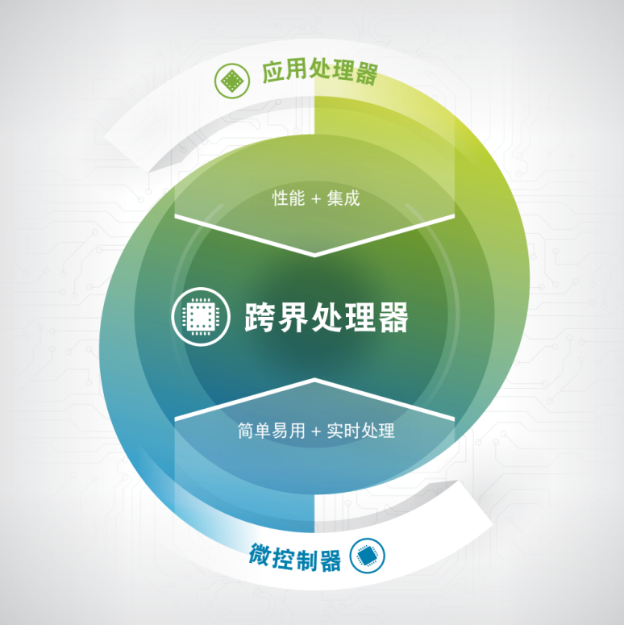

初识i.MX RT系列芯片
-------------------

本章参考资料：1、《IMXRTSERIESFS》(i.MX
RT系列产品简介)2、《I.MXRT1050WP》(跨界处理器白皮书)，本章内容主要摘抄自跨界处理器白皮书，后期会修改。

什么是i.MX RT系列芯片
~~~~~~~~~~~~~~~~~~~~~

i.MX
RT系列芯片，是由NXP半导体公司推出的跨界处理器芯片，该系列下又包括i.MX
RT1020、i.MX RT1050及i.MX
RT1060等子系列芯片。所谓“跨界”，是指它自身的定位既非传统的应用处理器也非传统的微控制器。

传统的应用处理器如手机主控芯片，它们通常采用ARM的Cortex-A系列内核，配合其芯片架构使得芯片能实现更高频率的运行。传统的微控制器也称为MCU，它们通常采用ARM的Cortex-M系列内核，相对来说该内核对中断响应更快，所以具有良好的实时性，但其芯片架构特别是集成片内闪存带来了生产技术限制和成本负担，从而限制了其性能。

i.MX
RT系列芯片集成了两者的优点，它基于应用处理器的芯片架构，采用了微控制器的内核Cortex-M7，从而具有应用处理器的高性能及丰富的功能，又具备传统微控制器的易用、实时及低功耗的特性。

图 4‑1 i.MX RT系列芯片是定位介于微控制器和应用处理器之间的跨界处理器

本教程主要以i.MX
RT1050子系列中的MIMXRT1052（后面简称RT1052）型号芯片为例进行讲解，i.MX
RT各系列芯片大同小异，差异主要体现为针对不同的应用场景时，受成本限制导致芯片对某些功能有所取舍或侧重，在学习时，只要掌握了本教程讲解的RT1052芯片，就能触类旁通。

i.MX RT系列芯片诞生的背景
~~~~~~~~~~~~~~~~~~~~~~~~~

i.MX
RT系列芯片诞生的背景也即它期待解决的痛点，据NXP官方的介绍，他们设计该芯片的初衷如下：

多年以来，嵌入式处理领域一直根据设计的需求分为两个不同的阵营。要求经济实惠和灵活实用的应用场合会依赖于MCU。超出MCU功能范围的设计会改为使用应用处理器。但是，对于嵌入式设计师而言，在MCU和应用处理器之间实现无缝扩展并非易事。在MCU和应用处理器之间做决定时，嵌入式设计师如今通常会遇到几个痛点，包括：

-  需要比MCU更多的功能（更高的性能、更多显示、更多连接选项），但不能增加成本或复杂性

-  缺少经验丰富的员工和/或预算资源，难以为基于Linux的应用处理器设计提供支持

-  既需要实时系统，也需要应用处理器级别的性能和集成度

-  必须为应用处理器的设计降低整体物料成本，同时保持性能水平不变

消费者对于提升智能，安全领域产品的用户体验以及功能的需求从未止步，这也推动了MCU和应用处理器的双双发展。

但是，对于很多新兴的使用案例，不管是应用处理器还是MCU，都无法完全满足该情形的需求。

在MCU和应用处理器之间灵活扩展是可行的，但需要采用一类新的跨界嵌入式处理器来打破高端MCU和低端应用处理器之间的技术鸿沟。这些跨界嵌入式处理器主要面向消费者、工业和不断发展的物联网应用，能够为设计提供应用处理器的高性能和功能性，同时兼具MCU的易用性、低功耗、实时运行以及低中断延迟特性。此外，跨界处理器的架构中无需使用嵌入式闪存、外部DDR存储器和电源管理IC，因此降低了系统的总体成本。

跨界处理器使用应用处理器架构，提供高集成度、高速外设、更高的安全性以及可提升用户体验的引擎（例如，
2D/3D显卡），但仅通过运行实时操作系统（例如RTOS）的低功耗MCU内核为系统提供动力。因此，跨界处理在市场中界定了一块全新的急需领域，能够帮助MCU客户升级到应用处理器级别的性能，同时沿用当前的工具链，而且可能不需要花时间和成本将复杂的Linux（或其他更高级别的操作系统）软件开发纳入其产品设计周期。

i.MX RT系列芯片的特点
~~~~~~~~~~~~~~~~~~~~~

降低成本—无需片内闪存
^^^^^^^^^^^^^^^^^^^^^

在理想环境中，当可执行代码和数据被存储在片内SRAM中，并从此存储中执行CPU内核操作时，嵌入式处理器的性能达到最高。即便在片内SRAM中，也只有“紧耦合内存”
(TCM)
能够为内核提供单周期访问。对TCM以外任何存储器的访问都会增加所需的CPU时钟周期，从2级缓存到片内闪存再到外部闪存的访问损耗越来越大。因此，只有由高密度片内SRAM配置而成的TCM才能提供理论上最高的性能。但在现实中，集成SRAM的每平方毫米成本非常高昂，对于在更加成熟的工艺技术节点上制造的MCU来说，更是如此。因此，嵌入式闪存成为了MCU的所需组件，作为片内SRAM的补充。
MCU中的嵌入式闪存被用于存储可执行程序和重要的用户/系统数据，以便内核快速访问这些内容，而无需从外部存储器获取。

但是，我们认为，在满足MCU和应用处理器之间的客户需求时，片上嵌入式闪存的技术限制和相关的成本成为了一个很大的负担。嵌入式闪存价格昂贵且富有挑战性，对于高级工艺技术节点而言尤其如此。嵌入闪存所需的额外处理会大幅提升芯片的成本。摆脱片上闪存的负担不但能够降低成本，还有助于实现更高频率的运行，从而提升处理器性能，进而让产品设计师能够提升性能，提高效率并增加更多功能。

由于跨界处理器采用了应用处理器架构，它们能够在高级技术节点（40nm和更高水平）上制造，具有大幅缩小的SRAM位单元，使得集成高密度SRAM比嵌入闪存更加经济高效。在跨界设计架构中，
SRAM可以配置为具有“零等待”单周期访问的TCM，从而大幅提升系统性能。凭借这种关键设计特性，跨界处理器的有效性能将远远超出MCU同等产品。

集高性能、低延迟、高能效和安全性于一体
^^^^^^^^^^^^^^^^^^^^^^^^^^^^^^^^^^^^^^

高性能
''''''

想象一下TCM和缓存（片内SRAM）极小，但嵌入式闪存密度极高的典型MCU。执行应用代码期间，最近的指令和数据通常都被存储在TCM/缓存中，以便后续从CPU内核快速访问。但是，由于缓存密度低，大部分指令和数据都必须存储在嵌入式闪存或者外部NOR或NAND闪存中。因此，
CPU内核不得不访问非TCM或非缓存存储器（也称为“缓存未命中率”），每次访问都会大幅降低有效性能，因为CPU必须等待数十个周期以待数据抵达。因此，缓存未命中率越高，
MCU的有效性能越低。

对于合理架构、具备高密度TCM和缓存的跨界嵌入式处理器而言，即使缓存未命中率高达5%，其有效性能也始终高于MCU。（缓存未命中率5%可以理解为，
CPU内核在缓存存储器中寻找所需指令或数据的尝试中，平均每20次中失败1次，需要访问嵌入式闪存或外部闪存。）但是，对于最为常见的物联网应用，具备高密度片内TCM或缓存的跨界处理器的缓存未命中率可低至1-2%，因此能够提供明显高于MCU的有效性能。

低中断延迟
''''''''''

在协调对内部和外部硬件事件做出及时响应方面，中断在嵌入式系统中发挥了重要作用。在与用户交互的实时系统中，它们发挥的作用尤其重要，这是因为由用户输入触发的外部事件需要CPU做出可靠的低延迟即时响应。试想一下，具备用户输入的视频流物联网应用或恒温器设备，如果系统不能实时对用户输入做出响应，用户体验将大打折扣，甚至用户可能会认为产品无响应。因此，中断响应时间是跨界处理器应用的一个关键特性。

中断延迟这个词指的是CPU响应内部或外部事件的中断请求时所需的时钟周期数。对于大部分具有实时响应要求的物联网应用，中断延迟成为了衡量有效性能的一个非常重要的指标。

对于运行高级别操作系统（非实时操作系统）的通用应用处理器，服务外部中断并非首要任务。在完成当前的任务之前，CPU通常不会响应中断服务例程
(ISR)
请求。这就导致在提出中断请求之后，需要经过多达数百个延迟周期，内核才会开始服务此请求。对于运行实时操作系统、内核优先响应中断的MCU而言，就不会出现这种情况。即使在不同中断之间，也可以通过合理安排优先级结构，确保最高优先级的中断达到最低的中断延迟。

跨界处理器采用MCU内核构建，因此即使它们采用应用处理器架构，也延续了低中断延迟这一重要特性。跨界处理器的中断延迟最低可达到10-20ns，而应用处理器的延迟通常长达1毫秒。因此，跨界处理器最适合物联网应用。

高能效
''''''

跨界嵌入式处理器集成了高性能DC-DC转换器，并采用行之有效的门控电源技术来优化能效。事实上，凭借目前嵌入式处理器广泛使用的40nm处理平台，跨界处理器的运行功率最低能够达到100uA/MHz，不到目前处于市场领先地位的MCU的一半。对于如今市场上未集成DC-DC转换器的很多MCU，或者当系统设计出于成本考虑未使用外部DC-DC转换器或PMIC时，其电流消耗最高会达到300uA/MHz，导致它们不太适合采用电池供电的应用。

对于MCU，嵌入式闪存相比访问外部存储器的优势之一是可以实现更低的动态功耗。这在意料之中，因为访问外部存储器时，数据必须通过电容I/O驱动，处理器因此需要耗费更多能量。但正如之前所述，在跨界处理器中，因为高密度片内SRAM的原因，对外部闪存的访问很有限。此外，跨界处理器采用先进技术节点和低功率处理平台构建，并与低功耗SRAM集成，因此与传统MCU相比，能够降低整体的动态功耗。

再者，存储器制造商目前以极低的成本提供超低功耗的串行NOR闪存，从而降低了系统级别的功耗。如果将采用低功耗串行闪存的跨界嵌入式处理器封装到SiP，能效可进一步得到提升，因为I/O引脚的电容负载较低。如果SiP成本对某些应用能够合理化（考虑SiP提供的外形尺寸优势），那么兼具跨界处理功能和额外存储器的解决方案将非常具有吸引力。

安全性
''''''

存储在嵌入式闪存中的数据可靠而安全，这通常被援引为在处理器设计中采用嵌入式闪存的原因。片内存储的关键数据和敏感应用程序可即时获取，无需通过外部引脚与芯片之间来回传输。只要与芯片之间来回传输数据，就会给黑客提供攻击的机会（旁路攻击）
，让他们可以通过监控数据引脚中的电信号来拦截或破坏数据。如果数据未加密（以“明文”传输的数据），这一弱点尤其令人担忧。

然而，使用跨界嵌入式处理器则没有这种隐忧，因为它们采用了与应用处理器类似的数据保护架构。跨界处理器解决方案采用硬件加速加密模块，使数据能够以加密的格式存储在外部存储器中。需要时，加密数据被传输至芯片，在读取时“即时”解密，无需经过等待解密的周期。跨界处理器中的这些高级加密加速器能够大幅提高加密/解密吞吐量，从而无需使用片内非易失存储器来满足安全性的需求。

即使在硬件加密不适用的情况下，跨界处理器的高性能内核也可用来实施软件加密。相比传统MCU，这是一个明显的优势；
MCU内核的性能较低，必须通过采用硬件加密模块来提供物联网应用所需的加密吞吐量。

基于半导体行业在开发先进存储器方面取得的进展，我们预测在未来两到三年内，非易失性存储器（例如MRAM、
RRAM等）似乎可用于与嵌入式处理器集成。它们易于单片集成，可功能多样（包括替换片内2/3级缓存），具有即开即用的用户体验，可用于片内安全数据库，或替代传统嵌入式闪存。跨界处理器有望从同过集成这些新兴存储器，从而发挥更大优势。

.. |image0| image:: F:\文档\RT1052/media/image1.png
   :width: 3.52014in
   :height: 3.52014in
