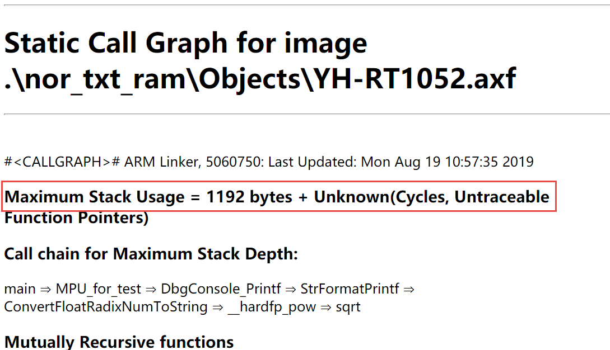
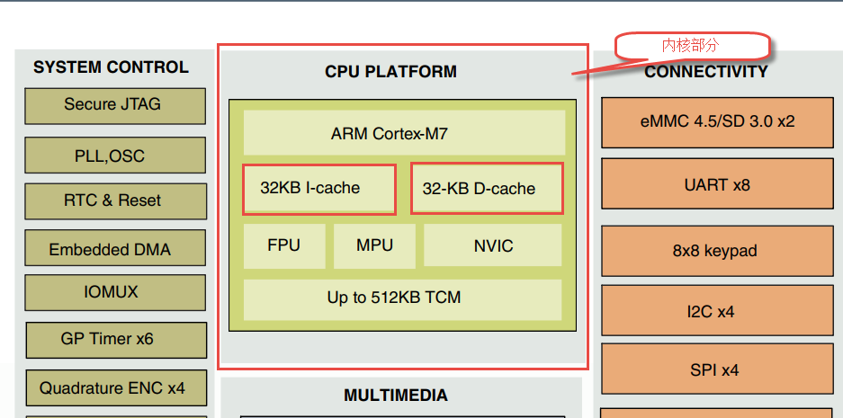
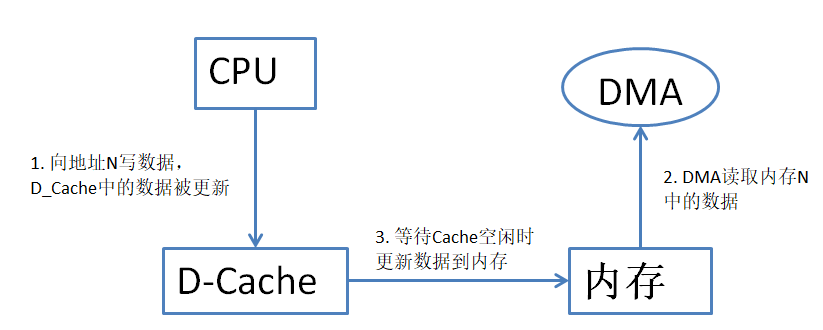
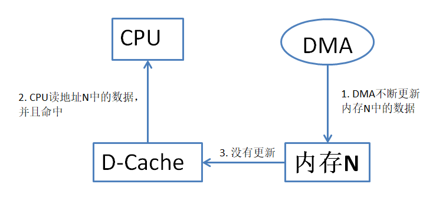
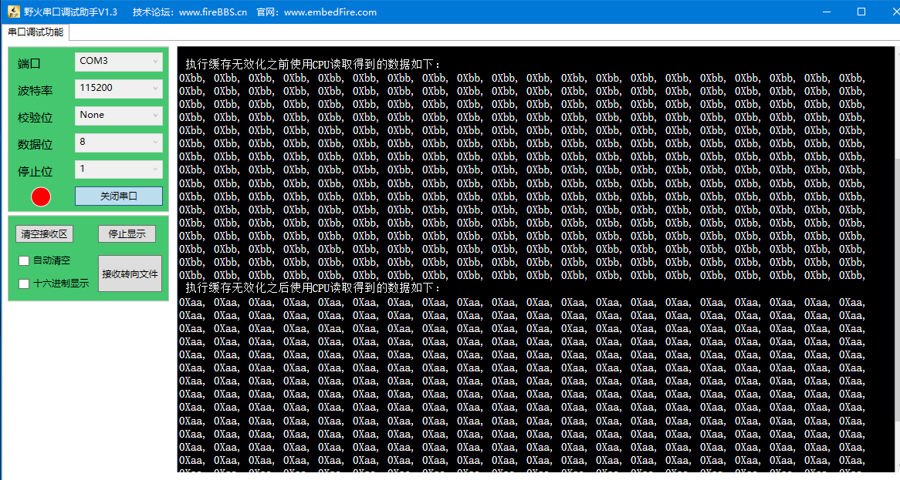

MPU和Cache
----------

本章参考资料：《DDI0403E_d_armv7m_arm》，《IMXRT1050RM》，《ARM
architecture Reference manual》

MPU是的缩写，翻译为存储器保护单元。Cortex-M3、Cortex-M4以及Cortex-M7内核的微控制器可以选配MPU功能。Cache为高速缓存，这是Cortex-M7内核新增的一个可选配的功能。MPU和Cache都是内核外设，详细介绍请参考《ARM
architecture Reference manual》

RT1052单片机采用
Cortex-M7内核，并且同时支持MPU和Cache,这一章我们将会简要介绍MPU和Cache的使用方法。

内存保护单元（MPU）
~~~~~~~~~~~~~~~~~~~

本小节将会围绕MPU的作用，MPU相关寄存器配置，在实际编程中如何使用MPU这三个方面讲解MPU。

MPU 的作用
^^^^^^^^^^

MPU可以将内存划分为不同的区域，并且可以设置每个区域的访问属性。提高系统的稳定性。典型应用如下：

-  划分特权用户访问区域和普通用户访问区域，在OS系统中提高系统稳定性。

-  设置只读区域，防止关键数据被意外修改。

-  检测堆、栈是否溢出。

MPU相关寄存器
^^^^^^^^^^^^^^^^^^^^

MPU拥有一组寄存器，这组寄存器是我们学习的重点。结合寄存器我们将会详细介绍MPU的功能。寄存器组如表40‑1所示（摘自《DDI0403E_d_armv7m_arm》）。

表 40‑1MPU寄存器列表

+-----------------+--------+----------------+---------------------------------+
| 寄存器名        | 类型   | 复位值         | 寄存器功能描述                  |
+=================+========+================+=================================+
|     MPU_TYPE    |     RO |     -          |     MPU 类型寄存器              |
+-----------------+--------+----------------+---------------------------------+
|     MPU_CTRL    |     RW |     0x00000000 |     MPU控制寄存器               |
+-----------------+--------+----------------+---------------------------------+
|     MPU_RNR     |     RW |     UNKNOWN    |     MPU区域号寄存器（region号） |
+-----------------+--------+----------------+---------------------------------+
|     MPU_RBAR    |     RW |     UNKNOWN    |     MPU区域基地址寄存器         |
+-----------------+--------+----------------+---------------------------------+
|     MPU_RASR    |     RW |     UNKNOWN    |     MPU区域属性和大小寄存器     |
+-----------------+--------+----------------+---------------------------------+
|     MPU_RBAR_A1 |     RW |     -          |     MPU_RBAR的别名1             |
+-----------------+--------+----------------+---------------------------------+
|     MPU_RASR_A1 |     RW |     -          |     MPU_RASR的别名1             |
+-----------------+--------+----------------+---------------------------------+
|     MPU_RBAR_A2 |     RW |     -          |     MPU_RBAR的别名2             |
+-----------------+--------+----------------+---------------------------------+
|     MPU_RASR_A2 |     RW |     -          |     MPU_RASR的别名2             |
+-----------------+--------+----------------+---------------------------------+
|     MPU_RBAR_A3 |     RW |     -          |     MPU_RBAR的别名3             |
+-----------------+--------+----------------+---------------------------------+
|     MPU_RASR_A3 |     RW |     -          |     MPU_RASR的别名3             |
+-----------------+--------+----------------+---------------------------------+

下面详细介绍各个寄存器。

MPU 类型寄存器（MPU_TYPE）
''''''''''''''''''''''''''''''''''

表 40‑2MPU_TYPE寄存器说明

+----------+-------------+----------------------------------+
|   名称   |    位段     |             功能描述             |
+==========+=============+==================================+
| -        | Bits[31:24] |                                  |
+----------+-------------+----------------------------------+
| IREGION  | bits[23:16] | ARMv7-M只支持统一的MPU           |
|          |             | ，该位固定为0                    |
+----------+-------------+----------------------------------+
| DREGION  | bits[15:8]  | MPU支持的区域数量。如果该字段    |
|          |             | 的读数为零，则处理器不实现MPU    |
+----------+-------------+----------------------------------+
|          | Bits[7:1]   | 保留位                           |
+----------+-------------+----------------------------------+
| SEPARATE | bit[0]      | 是否支持单独的指令和数据地址映射 |
|          |             | 。ARMv7-M只支持统一的MPU，该位   |
|          |             | 固定为0。                        |
+----------+-------------+----------------------------------+

MPU寄存器是只读寄存器，我们主要关心DREGION位，通过读取该位可以知道是否开启的MPU，如果该字段的读数为零，表示不使用MPU。如果开启通常情况下会返回MPU支持的region个数，cortex_M7最多支持16个区域。

MPU控制寄存器（MPU_CTRL）
''''''''''''''''''''''''''''''''''

表 40‑3MPU_CTRL 寄存器说明

+------------+------------+--------------------------------------+
|    名称    |    位段    |               功能描述               |
+============+============+======================================+
| -          | Bits[31:3] | 保留                                 |
+------------+------------+--------------------------------------+
| PRIVDEFENA | bit[2]     | 设置特权访问模式下MPU的策略          |
|            |            |                                      |
|            |            |                                      |
|            |            | 1=启用默认内存映射作为特权访问       |
|            |            | 的背景区域。                         |
|            |            |                                      |
|            |            | 0=禁用默认内存映射，超出制定区       |
|            |            | 域的任何数据或指令访问都将引起错误。 |
+------------+------------+--------------------------------------+
| HFNMIENA   | bit[1]     | 设置在不可屏蔽中断（NMI）和硬        |
|            |            | 件中断中MPU策略。                    |
|            |            |                                      |
|            |            | 1=                                   |
|            |            | 在不可屏蔽中断和硬件中断服务函数     |
|            |            | 中MPU依然有效                        |
|            |            |                                      |
|            |            | 0=在不可屏蔽中断和硬件中断服务       |
|            |            | 函数中MPU依然失效                    |
+------------+------------+--------------------------------------+
| ENABLE     | bit[0]     | MPU                                  |
|            |            | 使能位，1，使能，                    |
|            |            |                                      |
|            |            | 0 ，不使能                           |
+------------+------------+--------------------------------------+

在MPU_CTRL寄存器中位ENABLE与HFNMIENA很容易理解，这里不再赘述，重点讲解PRIVDEFEN位。

Cortex内核的执行模式分为特权模式与用户模式，特权模式访问权限更高，PRIVDEFENA位用于设置在特权模式下MPU的不同策略，

如果开启了MPU ，内存空间将会被划分出1到16个区域（region0~
region15），根据设置不同可能存在一些内存区域不在这些区域内，我们把这些剩余的存储空间定义为背景区域（region-1）。PRIVDEFENA位设置为1，则在特权模式下可以访问背景区域（region-1）。PRIVDEFENA位设置为0，背景区域（region-1）禁止访问。

MPU区域号寄存器（MPU_RNR）
''''''''''''''''''''''''''''''''''

表 40‑4MPU_RNR寄存器说明

+------------+----------------+------------------------+
| 名称       | 位段           | 功能描述               |
+============+================+========================+
|     -      |     Bits[31:8] |     保留               |
+------------+----------------+------------------------+
|     REGION |     bits[7:0]  |     指定设置的内存区域 |
+------------+----------------+------------------------+

MPU可以设置1到16个区域（region）。每个区域可单独设置， MPU_RBAR
、MPU_RASR寄存器只有一个。所以设置MPU_RBAR
、MPU_RASR寄存器之前首先要设置MPU_RNR寄存器选择设置的区域编号。

MPU区域基地址寄存器（MPU_RBAR）
''''''''''''''''''''''''''''''''''

表 40‑5MPU_RBAR寄存器说明

+--------+------------+-----------------------------------+
|  名称  |    位段    |             功能描述              |
+========+============+===================================+
| ADDR   | bits[31:5] | 区域的基地址                      |
+--------+------------+-----------------------------------+
| VALID  | bit[4]     | 决定REGION字段设置的区域编        |
|        |            | 号是否覆盖MPU_RNR寄存器设置的区域 |
|        |            |                                   |
|        |            | 编号                              |
+--------+------------+-----------------------------------+
| REGION | bits[3:0]  | MPU                               |
|        |            | 区域编号复写字段                  |
+--------+------------+-----------------------------------+

该寄存器提供了另外一种改变区域编号方法，即REGION = 区域编号，VALID =
1。使用这种方法设置区域编号更快捷。ADDR，保存区域基地址。

MPU区域属性和大小寄存器（MPU_RASR）
''''''''''''''''''''''''''''''''''''''''''''''''''''''''''''''''''''

表 40‑6MPU_RASR寄存器说明

+--------+-------------+------------------------------------------+
|  名称  |    位段     |                 功能描述                 |
+========+=============+==========================================+
|        | bits[31:29] | 保留                                     |
+--------+-------------+------------------------------------------+
| XN     | bits[28]    | 禁止取指                                 |
+--------+-------------+------------------------------------------+
|        | bits[27]    | 保留                                     |
+--------+-------------+------------------------------------------+
| AP     | bits[26:24] | 访问权限                                 |
+--------+-------------+------------------------------------------+
|        | bits[23:22] | 保留                                     |
+--------+-------------+------------------------------------------+
| TEX    | bits[21:19] | 扩展类型                                 |
+--------+-------------+------------------------------------------+
| S      | bits[18]    | 是否可共享，1=可共享，0=不可             |
|        |             | 共享                                     |
+--------+-------------+------------------------------------------+
| C      | bits[17]    | (Cachable)可缓存，1=                     |
|        |             | 可缓存，0=不可缓存。                     |
+--------+-------------+------------------------------------------+
| B      | bits[16]    | (Bufferable)可传冲                       |
|        |             |                                          |
|        |             | 1=可缓冲，0=不可缓冲                     |
+--------+-------------+------------------------------------------+
| SRD    | bits[15:8]  | 子区域使能位，对于256字节或更            |
|        |             | 大的区域，该字段的每个位控制是否启用八个 |
|        |             | 相等的子区域                             |
+--------+-------------+------------------------------------------+
|        | Bits[7:6]   | **保留位**                               |
+--------+-------------+------------------------------------------+
| SIZE   | bits[5:1]   | 区域的大小                               |
+--------+-------------+------------------------------------------+
| ENABLE | bit[0]      | 区域使能位，1，使能区域。0，禁           |
|        |             | 用区域                                   |
+--------+-------------+------------------------------------------+

MPU_RASR寄存器主要用于设置MPU区域属性，非常重要，涉及到很多概念需要重点掌握。下面挑选几个不易理解的位段讲解如下：

-  SRD位用于设置子区域，大于128字节的区域都被分成了8个相等的子区域，SRD寄存器的8位（8到15）依次控制8个子区域，为1则启用对应的子区域（region），为0则禁用对应的子区域（region）。

-  区域属性B、C、S、TEX设置，详细说明如所示。（摘自《DDI0403E_d_armv7m_arm》）

表 40‑7区域属性说明TEX, C, B, S

+-----+-----+-----+------------+------------------+----------+
| TEX |  C  |  B  | 存储器类型 |       描述       |  可共享  |
+=====+=====+=====+============+==================+==========+
| 000 | 0   | 0   | 严格按照   | 严格按照         | 可共享   |
|     |     |     | 顺序       | 顺序             |          |
+-----+-----+-----+------------+------------------+----------+
| 000 | 0   | 1   | 设备       | 共享的设         | 可共享   |
|     |     |     |            | 备               |          |
+-----+-----+-----+------------+------------------+----------+
| 000 | 1   | 0   | 普通       | 外部内存         | 由S位决  |
|     |     |     |            | 或内部内存，写通 | 定       |
|     |     |     |            | 型内存，没有写分 |          |
|     |     |     |            | 配               |          |
+-----+-----+-----+------------+------------------+----------+
| 000 | 1   | 1   | 普通       | 外部内存         | 由S位决  |
|     |     |     |            | 或内部内存，写回 | 定       |
|     |     |     |            | 型内存，没有写分 |          |
|     |     |     |            | 配               |          |
+-----+-----+-----+------------+------------------+----------+
| 001 | 0   | 0   | 普通       | 外部内存         | 由S位决  |
|     |     |     |            | 或内部内存，No   | 定       |
|     |     |     |            | n-cachab         |          |
|     |     |     |            | le型内存         |          |
+-----+-----+-----+------------+------------------+----------+
| 001 | 0   | 1   | 保留       | 保留，           | 保留     |
+-----+-----+-----+------------+------------------+----------+
| 001 | 1   | 0   | IMPL       | IMPL             | IMPL     |
|     |     |     | EMENTATI   | EMENTATI         | EMENTATI |
|     |     |     | ON         | ON               | ON       |
|     |     |     |            |                  |          |
|     |     |     | DEFI       | DEFI             | DEFI     |
|     |     |     | NED        | NED              | NED      |
+-----+-----+-----+------------+------------------+----------+
| 001 | 1   | 1   | 普通       | 外部内存         | 由S位决  |
|     |     |     |            | 或内部内存，写回 | 定       |
|     |     |     |            | 型内存，有读、写 |          |
|     |     |     |            | 分配             |          |
+-----+-----+-----+------------+------------------+----------+
| 010 | 0   | 0   | 设备       | 不可共享         | 不可共享 |
|     |     |     |            | 设备             |          |
+-----+-----+-----+------------+------------------+----------+
| 010 | 0   | 1   | 保留       | 保留             | 保留     |
+-----+-----+-----+------------+------------------+----------+
| 010 | 1   | X   | 保留       | 保留             | 保留     |
+-----+-----+-----+------------+------------------+----------+
| 011 | X   | X   | 保留       | 保留             | 保留     |
+-----+-----+-----+------------+------------------+----------+
| 1BB | A   | A   | 普通       | 带缓存的         | 由S位决  |
|     |     |     |            | 内存，AA，针对   | 定       |
|     |     |     |            | 内部内存，BB针   |          |
|     |     |     |            | 对外部内存，     |          |
+-----+-----+-----+------------+------------------+----------+

表
40‑7中的内容较难理解，区域属性与Cache密切相关，表格中涉及到几个Cache相关的概念，结合表
40‑7讲解如下。

(1) 写通型内存，“写通”arm手册原文是Write-Through，它是内存的一种属性。如果开启Cache并且内存A是写通型内存。CPU向该内存A写数据，此时内存A中的数据在Cache中已经开辟了对应的区域，那么会同时写到Cache里面和内存里面；

(2) 写回型内存，“写回”arm手册原文是write-back，它是内存的一种属性。如果开启Cache并且内存A是写回型内存。CPU向该内存A写数据，此时内存A中的数据在Cache中已经开辟了对应的区域，那么会写到Cache里面而不会立即写到内存里面。

(3) Non-cachable，这也是内存的一种属性，CPU对这种内存的读、写不会经过Cache.

(4) 写分配，读分配。这是Cache的一种策略，M7内核只要开启了Cache，读分配就是开启的。读分配的意思是CPU要读取内存B中的数据，在Cache中没找到则直接从内存中读取，并在Cache中添加备份。写分配类似。

了解这些概念之后再查看表 40‑7就比较容易理解了。但是表
40‑7的最后一行比较特殊，介绍如下：

当TEX最高位为1时 （如表
40‑7最后一行所示）外部内存（片外内存）与内部内存（片内内存）的属性可以分别设置，TEX的后两位即BB
用于设置外部内存属性，C和B位（AA）用于设置内部内存。无论是AA还是BB，每个数值的含义是相同的，如表
40‑8所示。

表 40‑8缓存策略编码

+--------------+----------------------------+
| AA 或 BB编码 | 可缓存策略                 |
+==============+============================+
|     00       |     不可缓存               |
+--------------+----------------------------+
|     01       |     写回，读分配和写分配   |
+--------------+----------------------------+
|     10       |     写通，读分配，无写分配 |
+--------------+----------------------------+
|     11       |     写回，读分配，无写分配 |
+--------------+----------------------------+

-  访问权限AP，字段AP用于设置访问权限，同样我们用一张表来说明该位，如表
   40‑9所示。

表 40‑9访问权限字段编码

+---------+-------------------+-------------------+------------------------------+
| AP[2:0] | 特权用户访问权限  | 普通用户访问权限  | 注意事项                     |
+=========+===================+===================+==============================+
|     000 |     不可访问      |     不可访问      |     任何访问都会生成权限错误 |
+---------+-------------------+-------------------+------------------------------+
|     001 |     Read/write    |     不可访问      |     只允许特权用户访问       |
+---------+-------------------+-------------------+------------------------------+
|     010 |     Read/write    |     Read-only     |     非特权用户只读           |
+---------+-------------------+-------------------+------------------------------+
|     011 |     Read/write    |     Read/write    |     完全访问                 |
+---------+-------------------+-------------------+------------------------------+
|     100 |     UNPREDICTABLE |     UNPREDICTABLE |     保留                     |
+---------+-------------------+-------------------+------------------------------+
|     101 |     Read-only     |     不可访问      |     特权用户只读             |
+---------+-------------------+-------------------+------------------------------+
|     110 |     Read-only     |     Read-only     |     只读                     |
+---------+-------------------+-------------------+------------------------------+
|     111 |     Read-only     |     Read-only     |     只读                     |
+---------+-------------------+-------------------+------------------------------+

MPU的设置的主要任务就是配置MPU_RASR寄存器，MPU_RASR寄存器寄存器主要分为区域属性设置和访问权限设置，这两种属性详细设置方法分别在表
40‑7和表
40‑9列出。更详细的说明请参考《DDI0403E_d_armv7m_arm》B3.5章节。寄存器介绍到此结束。

MPU的使用
^^^^^^^^^

在NXP官方SDK中MPU相关的的函数、宏定义主要定义在mpu_armv7.h和core_cm7.h文件夹。

本书配套例程默认开启了MPU和Cache，在main函数的开始处调用函数BOARD_ConfigMPU初始化MPU。如代码清单
40‑1所示。

.. code-block:: c
   :name: 代码清单 40‑1BOARD_ConfigMPU函数（board.c）
   :caption: 代码清单 40‑1BOARD_ConfigMPU函数（board.c）
   :linenos:

   /* MPU configuration. */
   void BOARD_ConfigMPU(void)
   {
      /***************************第一部分*******************************/
      /* Disable I cache and D cache */
      if (SCB_CCR_IC_Msk == (SCB_CCR_IC_Msk & SCB->CCR)) {
         SCB_DisableICache();
      }
      if (SCB_CCR_DC_Msk == (SCB_CCR_DC_Msk & SCB->CCR)) {
         SCB_DisableDCache();
      }
      /* Disable MPU */
      ARM_MPU_Disable();

   /****************************第二部分***************************/
      /* Region 0 setting: Memory with Device type, not shareable
         ,non-cacheable. */
      MPU->RBAR = ARM_MPU_RBAR(0, 0xC0000000U);
      MPU->RASR = ARM_MPU_RASR(0, ARM_MPU_AP_FULL, 2, 0, 0, 0, 0,\
                                             ARM_MPU_REGION_SIZE_512MB);

   /* Region1setting: Memory with Device type, not shareable,non-cacheable. */
      MPU->RBAR = ARM_MPU_RBAR(1, 0x80000000U);
      MPU->RASR = ARM_MPU_RASR(0, ARM_MPU_AP_FULL, 2, 0, 0, 0, 0,\
                                             ARM_MPU_REGION_SIZE_1GB);

      /***************************以下代码省略****************************/

      /* Region 7 setting: Memory with Normal type, not shareable, 
         outer/inner write back */
      MPU->RBAR = ARM_MPU_RBAR(7, 0x80000000U);
      MPU->RASR = ARM_MPU_RASR(0, ARM_MPU_AP_FULL, 0, 0, 1, 1, 0, \
                                          ARM_MPU_REGION_SIZE_32MB);

      /* Region 8 setting, set last 2MB of SDRAM can't be accessed
         by cache, glocal variables which are not expected to be
      * accessed by cache can be put here */
      /* Memory with Normal type, not shareable, non-cacheable */
      MPU->RBAR = ARM_MPU_RBAR(8, 0x81C00000U);
      MPU->RASR = ARM_MPU_RASR(0, ARM_MPU_AP_FULL, 1, 0, 0, 0, 0, 
   ARM_MPU_REGION_SIZE_4MB);
         
   /*******************************第三部分******************************/
      /* Enable MPU */
      ARM_MPU_Enable(MPU_CTRL_PRIVDEFENA_Msk);

      /* Enable I cache and D cache */
      SCB_EnableDCache();
      SCB_EnableICache();
      
   #if defined(USE_RAM_VECTOR_TABLE)
      /* 启用SDRAM版本的中断向量表 */
      CopyAndUseRAMVectorTable();    
   #endif
   }

结合代码清单 40‑1各部分代码讲解如下。

-  第一部分，关闭I cache和D cache 并且禁用MPU
   ，在设置MPU之前需要关闭MPU和Cache.

-  第二部分，设置MPU区域属性，Cortex_M7内核的MPU最多支持8个区域。每个区域的属性可单独设置，如果两个区域出现重叠则编号较高的区域属性回覆盖编号较低的区域属性。从第二部分的代码可以看到区域属性设置操作的是MPU_RBAR和MPU_RASR寄存器。我们可以借助官方提供的宏定义ARM_MPU_RBAR、ARM_MPU_RASR设置MPU区域属性。下面简单介绍如何使用这些宏定义，至于如何实现的有兴趣和参考宏定义实现代码。

.. code-block:: c
   :name: 代码清单 40‑2宏ARM_MPU_RBAR（mpu_armv7.h）
   :caption: 代码清单 40‑2宏ARM_MPU_RBAR（mpu_armv7.h）
   :linenos:

   #define ARM_MPU_RBAR(Region, BaseAddress)

宏定义参数介绍如下：

(1) Region，MPU区域编号，RT1052单片机最多可以设置16个Region
    ,取值范围为（0到15）

(2) BaseAddress，区域的起始地址。

.. code-block:: c
   :name: 代码清单 40‑3宏ARM\_MPU_RASR（mpu_armv7.h）
   :caption: 代码清单 40‑3宏ARM\_MPU_RASR（mpu_armv7.h）
   :linenos:

   #define ARM_MPU_RASR(DisableExec, \
                  AccessPermission, \
                     TypeExtField, \
                        IsShareable, \
                        IsCacheable, \
                     IsBufferable, \
                  SubRegionDisable, \
                              Size)

宏ARM_MPU_RASR与宏ARM_MPU_RBAR分别用于设置MPU_RBAR寄存器和MPU_RASR寄存器。我们只选哟知道宏定义中每个参数的含义即可，其他工作有宏定义自动完成。宏ARM_MPU_RASR的参数介绍如下：

(1) DisableExec，禁用区域（region），1=禁用指定的区域，0=启用指定的区域。

(2) AccessPermission，设置数据访问权限，有关权限如何设置请参考表 40‑9。官方程序中使用宏定义了常用选项如代码清单 40‑4所示。

.. code-block:: c
   :name: 代码清单 40‑4区域访问权限宏定义（mpu_armv7.h）
   :caption: 代码清单 40‑4区域访问权限宏定义（mpu_armv7.h）
   :linenos:

   #define ARM_MPU_AP_NONE 0u 
   #define ARM_MPU_AP_PRIV 1u
   #define ARM_MPU_AP_URO  2u
   #define ARM_MPU_AP_FULL 3u
   #define ARM_MPU_AP_PRO  5u
   #define ARM_MPU_AP_RO   6u

通过宏定义的名字我们可以知道设置的访问权限，如果不清楚可以根据宏定义值查找表40‑9。

(1) TypeExtField、IsShareable、IsCacheable、IsBufferable，依次设置MPU_RASR寄存器的TEX、S、C、B字段。对照表
    40‑7即可。

(2) SubRegionDisable，禁用次区域。1=禁用，0=启用次区域。

(3) Size，区域大小。

设置区域需要注意两点：第一，如果发送区域重叠区域号大的将会覆盖区域号小的。设置区域是区域号不能超过最大值（15），否则回发生不可预测错误。

-  第三部分，设置完成后再次开启MPU 并开启I Cache 和 D Cache。

至此MPU的设置方法已经讲解结束，是不是很简单。下面结合几个实例加深对MPU的认识。

MPU设置只读区域试验
^^^^^^^^^^^^^^^^^^^

在某些情况下我们需要保护某些重要数据不被意外修改（比如程序错误或野指针），一种有效的方法就是使用MPU设置只读的内存区域，将重要数据放在这个只读区域。当有非法访问或者非法修改（由设置的访问权限决定）时会产生内存访问错误，在调试阶段它可以帮助我们及时发现问题，系统运行阶段我们可以在内存访问错误中断服务函数中执行软件复位，提高系统的稳定性。

本实验主要目的是讲解如何使用MPU设置只读区域并将指定的数据放在这个区域。

硬件设计
''''''''''''''''''''''''''''''''''

MPU是内核外设，不需要特定的硬件电路。本实验将在
“液晶显示英文”试验基础上修改，当然也可以选择其他实验，这个没有影响，因为试验中只修改了MPU配置寄存器以及使用到了系统串口(UART1)。

编程要点
''''''''''''''''''''''''''''''''''

(1) 设置MPU 区域属性。

(2) 修改分散加载，添加只读属性执行域。

(3) 指定变量到MPU 设置的只读区域。

代码说明
''''''''''''''''''''''''''''''''''

注：代码只讲解相对于模板增加或修改的部分。只读区域设置在函数BOARD_ConfigMPU中。

1. 设置MPU 添加只读区域。

    进入main函数之后，首先要调用BOARD_ConfigMPU函数初始化MPU，我们将在初始化函数内添加只读区域，如所示。

.. code-block:: c
   :name: 代码清单 40‑5添加只读区域（board.c）
   :caption: 代码清单 40‑5添加只读区域（board.c）
   :linenos:

   /* MPU configuration. */
   void BOARD_ConfigMPU(void)
   {
      /********************以上代码省略*************************/
      /* Region 8 setting, set last */
      /* Memory with Normal type, not shareable, non-cacheable */
      MPU->RBAR = ARM_MPU_RBAR(8, 0x81E00000U);
      MPU->RASR = ARM_MPU_RASR(0, ARM_MPU_AP_FULL, 1, 0, 0, 0, 0, \
                                          ARM_MPU_REGION_SIZE_2MB);
         
         /*region 9 设置特权用户只读区域*/
      
      /***********************第一部分**********************/
      MPU->RBAR = ARM_MPU_RBAR(9, 0x2023FC00);
      /***********************第二部分**********************/
      MPU->RASR = ARM_MPU_RASR(0, ARM_MPU_AP_PRO, 0, 0, 1, 1, 0, \
                                          ARM_MPU_REGION_SIZE_1KB);
         /********************以下代码省略*******************/
   }

使用MPU添加只读区域比较简单，只需要两行代码，结合表 40‑7、表40‑9讲解如下。

-  第一部分，设置区域号和区域起始地址。Cortex_M7支持16个区域（0到15），默认情况下已经使用了0到8，这里使用区域编号9即可。

    本实验将只读区域放在OCRAM(RAM)存储区的最后1K的地方，OCRAM起始地址0X2020
    0000， 大小为256K，很容易计算得到启始地址为0X2023FC00。

-  第二部分，设置区域属性。详细属性设置如代码清单 40‑6所示。

.. code-block:: c
   :name: 代码清单 40‑6区域属性设置（board.c）
   :caption: 代码清单 40‑6区域属性设置（board.c）
   :linenos:

   MPU->RASR = ARM_MPU_RASR(0, //区域禁用位（0= 启用）
               ARM_MPU_AP_PRO, //访问权限，特权用户只读
                           0, //TEX
                           0, //S
                           1, //C
                           1, //B  
                           0, //启用次区域
      ARM_MPU_REGION_SIZE_1KB);//区域大小1K

注：参数ARM_MPU_AP_PRO将设置区域为特权模式只读，默认情况下裸机程序运行在特权模式。

1. 修改分散加载文件，添加只读执行域。

在39.5sct分散加载文件的格式与添加方式小节已经详细介绍分散加载文件的设置方法，这里不再赘述。由于不同工程版本的分散加载文件不同，本实验以“nor_txt_ram”版本为例讲解，并且只讲解相对于工程模板新增或修改的内容。如所示。

.. code-block:: c
   :name: 代码清单 40‑7修改分散加载文件（MIMXRT1052xxxxx_nor_txt_ram.scf）
   :caption: 代码清单 40‑7修改分散加载文件（MIMXRT1052xxxxx_nor_txt_ram.scf）
   :linenos:

   /*********************第一部分****************/
   #define m_data2_start_test             0x2023FC00
   #define m_data2_size_test              0x00000400
   
   
   /********************第二部分*****************/
   mpu_test_stack m_data2_start_test m_data2_size_test
   {
      * (MPU_TEST_SECTION, +FIRST)
   }

结合MPU的设置，各部分代码讲解如下：

-  第一部分，定义执行域的起始地址和大小，根据mpu
   的区域9（region9）的设置，区域起始地址为0x2023FC00，大小为1K即0x00000400。

-  第二部分，设置加载域，家在域名称为mpu_test_stack（可任意），加载域的起始地址和大小由第一部分的宏定义指定。使用MPU_TEST_SECTION声明的变量、产量或者函数都将保存在这个区域。

1. 指定变量到设定的只读区域

    使用“__attribute__”关键字指定变量编译属性，如代码清单 40‑8所示。

.. code-block::
   :name: 代码清单 40‑8Attribute指定变量的编译属性（main.c）
   :caption: 代码清单 40‑8Attribute指定变量的编译属性（main.c）
   :linenos:

   \__attribute__((section("MPU_TEST_SECTION"))) \\

   char mpu_test[6] = {'a','b','c','d','e','f'};

关键字__attribute__指定了变量mpu_test具有“MPU_TEST_SECTION”属性，根据分散加载中的设置，具有“MPU_TEST_SECTION”属性的变量将会放到设定的只读区域。

1. 开启MemManage中断。

    和普通的中断开启一样，使用EnableIRQ即可开启MemManage中断。如代码清单
    40‑9所示

.. code-block:: c
   :name: 代码清单 40‑9开启内存访问中断（main.c）
   :caption: 代码清单 40‑9开启内存访问中断（main.c）
   :linenos:

   /*****************第一部分***************/
   EnableIRQ(MemoryManagement_IRQn);
   
   /*****************第二部分**************/
   void MemManage_Handler(void)
   {
      PRINTF("I am is MemManage_Handler \r\n");
   }

第一部分开启了MemManage中断，第二部分是存储器访问错误中断的中断服务函数，实际应用中可以添加其他代码。这里只添加一个打印语句，方便观察实验现象。

1. 编写测试代码

    测试代码非常简单，我们只需要对变量mpu_test依次执行读、写即可，如果发生错误则会进入存储器访问错误中断。如所示。

.. code-block:: c
   :name: 代码清单 40‑10测试代码（main.c）
   :caption: 代码清单 40‑10测试代码（main.c）
   :linenos:

   /**************第一部分************/
   PRINTF("mpu_test is %s \r\n", mpu_test);
   PRINTF("read success\r\n");
   
   /************第二部分*************/
   for(i=0; i<6; i++)
   {
      mpu_test[i] = mpu_test[i] - 32;
   }
   PRINTF("mpu_test is %s \r\n", mpu_test);
   PRINTF("write and read success\r\n");

根据设置，读变量“mpu_test”不会有问题，修改变量“mpu_test”变量的值会产生存储器访问错误，程序会卡死在存储器访问错误中断服务函数中。

下载验证
''''''''''''''''''''''''''''''''''

程序选择“nor_txtZ_ram”版本，选择debug按钮进行调试，正常情况下会显示读取成功，当执行写入操作时程序会进入MemoryManagement中断服务函数。

MPU检测栈溢出实验
^^^^^^^^^^^^^^^^^

MPU检测栈溢出实验的原理是在栈空间的结尾添加一小段不可访问的内存，当栈溢出，读、写不可访问区域时就会触发内存访错误。

设置方法与40.1.4
MPU设置只读区域试验非常相似，可参照学习，这里仅仅简单介绍实现代码。

编程要点
''''''''''''''''''''''''''''''''''

(1) 计算栈底地址，并设置栈底一小块区域为不可访问。

(2) 开启MemManage中断，并添加中断服务函数。

(3) 编写测试函数。

代码说明
''''''''''''''''''''''''''''''''''

1. 计算栈底地址。

不同程序或者同一个程序不同版本栈大小和栈的位置可能不同，本实验以“液晶显示中英”实验的“nor_txt_ram”版本为例讲解。其他程序类似。

栈空间相关设置位于对应版本工程的分散加载文件中。截取出栈空间设置相关代码如代码清单
40‑11所示。

.. code-block:: c
   :name: 代码清单 40‑11栈空间设置（MIMXRT1052xxxxx_nor_txt_ram.scf）
   :caption: 代码清单 40‑11栈空间设置（MIMXRT1052xxxxx_nor_txt_ram.scf）
   :linenos:

   #define m_data_start                   0x20000000
   #define m_data_size                    0x00020000
   #define Stack_Size                     0x0400
   ARM_LIB_STACK m_data_start+m_data_size EMPTY -Stack_Size { ; Stack region 
   growing down
   }

从代码清单 40‑11可知栈起始地址为“m_data_start+m_data_size”即0x2002 0000
栈大小为0x400，栈向下生长，所以栈底地址为0x2002 0000 – 0x400,即0x2001
FC00。

1. 使用MPU在栈底处设置不可访问区域

设置方法与40.1.4
MPU设置只读区域试验相同，只需要添加一个区域即可，如代码清单 40‑12所示。

.. code-block:: c
   :name: 代码清单 40‑12使用MPU 添加不可访问区域（board.c）
   :caption: 代码清单 40‑12使用MPU 添加不可访问区域（board.c）
   :linenos:

   /*region 9 设置特权用户只读区域*/
   MPU->RBAR = ARM_MPU_RBAR(9, 0x2001FC00U);
   MPU->RASR = ARM_MPU_RASR (0, ARM_MPU_AP_NONE, 0, 0, 1, 1, 0,\
                                    ARM_MPU_REGION_SIZE_32B);

我们设置了region9 起始地址为0x2001
FC00，使用ARM_MPU_RASR宏定义设置了区域9（region9）访问权限为不可访问，大小为32字节。

1. 编写测试代码

为简化实验，本实验仅编写一个测试函数并且在测试函数中添加大量的局部变量，当栈溢出时回触发MemManage中断，通过单步调试效果会更明显。为防止软件优化，我们还需要打印这些变量，如代码清单
40‑13所示。

.. code-block:: c
   :name: 代码清单 40‑13测试函数（main.c）
   :caption: 代码清单 40‑13测试函数（main.c）
   :linenos:

   void MPU_for_test(void)
   {
      char data1[100] = "hello the world!";
      char data2[100] = "hello the world!";
      char data3[100] = "hello the world!";
      char data4[100] = "hello the world!";
      char data5[100] = "hello the world!";
      char data6[100] = "hello the world!";
      
      PRINTF("data1 = %s\r\n",data1);
      PRINTF("data2 = %s\r\n",data2);
      PRINTF("data3 = %s\r\n",data3);
      PRINTF("data4 = %s\r\n",data4);
      PRINTF("data5 = %s\r\n",data5);
      PRINTF("data6 = %s\r\n",data6);
   }

测试函数非常简单，我们可以通过单步调试观察实验现象。我们还可以通过打开对应工程版本的.axf文件，查看程序中最大使用的栈空间如图
40‑1所示。

图 40‑1axf文件查看最大栈空间

下载验证
''''''''''''''''''''''''''''''''''

为更好观察实验现象，建议使用调试模式，程序运行到测试函数后执行单步调式，正常情况下随着栈空间使用的增加栈会溢出，最终触发MemManage中断。

高速缓存（Cache）
~~~~~~~~~~~~~~~~~

程序运行过程中CPU需要不断的从内存（或其他存储器）读取指令和数据，受限于存储器访问速度，CPU需要等待指令或数据读取完成，这就造成了CPU的浪费。Cache即高速缓存，就是用来减少CPU等待浪费的问题。Cache的读、写速度要比片内或片外内存快很多，使用好Cache能大大提高程序的执行效率。

与MPU一样Cache属于内核外设，Cortex_M3与Cortex_M4没有Cache，Cortex_M7新增了Cache功能。开启Cache能够提高程序运行速度，但使用不当会产生数据一致性问题。本小节将会简单介绍Cache,重点是如何配合MPU使用Cache。学习本小节之前需要了解RT1052的MPU。

RT1052 Cache简述
^^^^^^^^^^^^^^^^

与MPU一样Cache属于内核外设，Cortex_M3与Cortex_M4没有Cache，Cortex_M7新增了Cache功能。如图
40‑2所示。

图 40‑2Cortex_M7简化图

Cortex-M7内核Cache分为I-cache
和D-cache，大小均为32K。I-cache用于存储指令而D-cache用户存储数据。I-cache与D-cache
可以独立的打开和关闭，由于I-Cache用于缓存代码所以我们不必关心。D-cache用于存储数据，因为涉及到DMA等问题，D-cache使用不当会导致一些错误，本章重点讲解D-cache的使用，并且下文如果没有特别说明为I-Cache,则默认是指D-Cache。

Cache相关概念
^^^^^^^^^^^^^

根据MPU设置的不同，Cache读、写不同属性内存的内存会采用不同的策略。这里介绍Cache的一些策略。

-  写通（write
   through），CPU向内存中写数据，首先检查Cache中是否有数据备份，如果有则写入到Cache，之后立即再次写入到内存。

-  写回（write
   back），CPU向内存中写数据，首先检查Cache中是否有数据备份，如果有则将数据写入到Cache,之后并不会立即将数据写入到内存，等待空闲时自动将数据更新到内存。如果没有则写入到内存。

-  写分配（write
   alloc），CPU向内存中写数据时，首先检查Cache中是否有备份，如果没有则将会在Cache中分配空间，备份写入到内存的数据。

-  读分配（read
   alloc），与写分配类似，CPU读内存时首先检查Cache中是否有备份，如果没有则在Cache中分配空间，备份将要读取的数据。默认情况下读分配是开启的。

-  Cache清理，Cache清理并不是删除Cache中的内容，而是将Cache中的内容更新到各自对应的内存中。

-  缓存无效化，Cache中的内容失效，效果如同删除了Cache中的数据备份，CPU再次读数据时将直接从内存中读取。

Cache数据一致性问题
^^^^^^^^^^^^^^^^^^^^^^^^^^^^

Cache一致性问题说的是D-cache。原因是CPU和DMA短时间内访问同一块内存区域。主要分为以下两种情况。

Cache中的数据未及时更新到内存
''''''''''''''''''''''''''''''''''

当CPU向内存中写数据，如果Cache策略是“写回”CPU会将数据写入到Cache并且不会立即更新到内存中，如果此时DMA读取内存中的数据则读取得到的是旧数据即出现数据一致性问题。如图
40‑3所示。

图 40‑3未及更新内存

根据图 40‑3所示，如果按照标号执行顺序则会产生数据一致性问题。

DMA修改了内存数据未及时更新到Cache
''''''''''''''''''''''''''''''''''

DMA更新了地址N中的数据，并且没有将更改更新到Cache。CPU从地址N读数据，并且在Cache中找到了地址N的数据备份，此时CPU得到的是旧的数据。如图
40‑4所示。

图 40‑4未及时更新Cache

Cache数据一致性问题解决方法
^^^^^^^^^^^^^^^^^^^^^^^^^^^

从40.2.3
Cache数据一致性问题章节可知如果使用了DMA很容易导致数据一致性问题。解决数据一致性问题的方法也很简单，只需要手动（程序员编写程序）更新数据即可，并且NXP官方SDK提供了更新数据的函数。针对两种数据一致性问题解决方法如下：

更新Cache数据到内存
''''''''''''''''''''''''''''''''''

在NXP官方SDK中Cache清理函数L1CACHE_CleanDCacheByRange用于将Cache中的数据更新到内存。函数声明如代码清单
40‑14所示。

.. code-block:: c
   :name: 代码清单 40‑14Cache清理函数
   :caption: 代码清单 40‑14Cache清理函数
   :linenos:

   void L1CACHE_CleanDCacheByRange(uint32_t address, //起始地址
                           uint32_t size_byte)  //数据长度（单位：字节）

函数L1CACHE_CleanDCacheByRange两个参数介绍如下：

-  Address，要清除内存的起始地址。地址要求32字节对齐，否则自动强制按照D-cache的行大小对齐。

-  size_byte，清除内存大小，通常要求是32的整数倍，不过不是整数倍需要注意正确的操作顺序。

无效化Cache中的数据
''''''''''''''''''''''''''''''''''

如果内存中的数据被DMA更改，CPU读取数据之前要无效化Cache，这样CPU在Cache中找不到数据备份则会直接从内存中读取。函数L1CACHE_InvalidateDCacheByRange用于设置无效化Cache中的数据，函数参数与函数L1CACHE_CleanDCacheByRange相同，这里不再赘述。

Cache常用函数
^^^^^^^^^^^^^

Cache与MPU密切相关，MPU通过设置内存属性决定了Cache的策略（写通、写回、写分配等等）。Cache相关控制函数相对较少，尤其是I-Cache，实际应用中我们只需要打开、关闭即可。Cache相关操作函数保存在SDK的fsl_cache.h文件，这里列出几个常用的控制函数并简单说明其作用，如表
40‑10所示。

表 40‑10Cache常用函数

+-------------------------------------+---------------------------+
| 函数名                              | 函数功能                  |
+=====================================+===========================+
|     L1CACHE_DisableDCache           |     禁用D-Cache           |
+-------------------------------------+---------------------------+
|     L1CACHE_EnableDCache            |     启用D-Cache           |
+-------------------------------------+---------------------------+
|     L1CACHE_EnableICache            |     禁用I-Cache           |
+-------------------------------------+---------------------------+
|     L1CACHE_DisableICache           |     启用I-Cache           |
+-------------------------------------+---------------------------+
|     L1CACHE_InvalidateDCacheByRange |     无效化D-Cache某些区域 |
+-------------------------------------+---------------------------+
|     L1CACHE_CleanDCacheByRange      |     清理D-Cache某些区域   |
+-------------------------------------+---------------------------+

Cache数据一致性实验
~~~~~~~~~~~~~~~~~~~~~~~~~~~~

编程要点
^^^^^^^^^^^^^^^^^^^^^^^^^^^^

(1) 使用MPU设置内存属性并添加“nonCaheable”区域。

(2) 初始化EDMA，执行内存到内存的数据传输。

(3) 编写缓存无效化测试函数和内存清理测试函数。

代码分析
^^^^^^^^^^^^^^^^^^^^^^^^^^^^

本程序基于“DMA—存储器到存储器”实验，有关DMA这里不再介绍，重点介绍MPU的设置以及两个测试函数实现原理。

本实验以nor_txt_ram版本实验讲解，其他版本类似。

配置MPU
''''''''''''''''''''''''''''''''''

在main函数的开始处，函数BOARD_ConfigMPU用于配制MPU，我们设置MPU时直接修改这个函数即可，如果默认的设置满足我们的需求则不必修改。如代码清单
40‑15所示。

.. code-block:: c
   :name: 代码清单 40‑15设置MPU（board.c）
   :caption: 代码清单 40‑15设置MPU（board.c）
   :linenos:

   void BOARD_ConfigMPU(void)
   {
   
      /*******************以上代码省略*****************/
      
      /********************第一部分***********************/
      /* Region 6 setting: Memory with Normal type, not shareable,
      *	outer/inner write back 
      */
      MPU->RBAR = ARM_MPU_RBAR(6, 0x20200000U);
      MPU->RASR = ARM_MPU_RASR(0, ARM_MPU_AP_FULL, 0, 0, 1, 1, 0,\
                                          ARM_MPU_REGION_SIZE_256KB);
   
      /* Region 7 setting: Memory with Normal type, not shareable,
         *outer/inner write back 
         */
      MPU->RBAR = ARM_MPU_RBAR(7, 0x80000000U);
      MPU->RASR = ARM_MPU_RASR(0, ARM_MPU_AP_FULL, 0, 0, 1, 1, 0, \
                                             ARM_MPU_REGION_SIZE_32MB);
   
      /********************第二部分***********************/
      /* Region 8 setting, set last 2MB of SDRAM can't be accessed 
         *by cache, glocal variables which are not expected to be
         * accessed by cache can be put here */
      /* Memory with Normal type, not shareable, non-cacheable */
      MPU->RBAR = ARM_MPU_RBAR(8, 0x81E00000U);
      MPU->RASR = ARM_MPU_RASR(0, ARM_MPU_AP_FULL, 1, 0, 0, 0, 0, \
                              ARM_MPU_REGION_SIZE_2MB);
   
   /*******************以下代码省略*****************/
   }

MPU的设置保持默认即可，我们需要关注两部分代码，如代码清单 40‑15所示。

-  第一部分，设置区域6的内存属性，这也是默认的内存属性。根据宏ARM_MPU_RASR的设置并参照表
   40‑7、表
   40‑9可知默认访问属性为可读可写，Cache相关属性为写回型内存，没有写分配，具有读分配（默认开启读分配）。

-  第二部分，定义non-cacheable存储区域，一些不希望被Cache干扰的数据需要放到non-cacheable存储区域，本实验要用到这样的区域。我们可以通过分散加载将数据的存储位置指定到non-cacheable存储区域。下面介绍分散加载的设置。

在分散加载文件中添加non-cacheable执行域
''''''''''''''''''''''''''''''''''''''''''''''''''''''''''''''''''''

在MPU配置函数中我们设置了区域8为non-cacheable存储区域，起始地址为0x81E00000大小为2M字节。这里需要借助分散加载文件使用这一区域。如代码清单
40‑16所示。

.. code-block:: c
   :name: 代码清单 40‑16分散加载添加non-cacheable执行域（MIMXRT1052xxxxx_nor_txt_ram.scf）
   :caption: 代码清单 40‑16分散加载添加non-cacheable执行域（MIMXRT1052xxxxx_nor_txt_ram.scf）
   :linenos:

   #define m_NonCacheable_start           0x81E00000
   #define m_NonCacheable_size            0x00200000
   
   RW_m_nonCaheable m_NonCacheable_start m_NonCacheable_size {
   * (NonCacheable.init)
      * (NonCacheable)
   }

non-cacheable执行域起始地址为m_NonCacheable_start，大小为m_NonCacheable_size，与MPU区域8一致。官方SDK中提供了一些宏定义帮助我们将数据或代码加载域设置到non-cacheable区域。在实际应用中将会详细介绍。

缓存无效化测试函数
''''''''''''''''''''''''''''''''''

缓存无效化测试函数的主要目的是验证开启D-Cache后，使用DMA修改内存中的数据会导致Cahe中的数据与内存中的不一致，需要使用缓存无效化才能通过CPU获取内存中实际内容。如代码清单
40‑17所示。

.. code-block:: c
   :name: 代码清单 40‑17缓存无效化测试函数（main.c）
   :caption: 代码清单 40‑17缓存无效化测试函数（main.c）
   :linenos:

   /****************************第一部分*******************/
   volatile bool g_Transfer_Done;              //定义传输完成标志
   //定义数据缓冲区，
   AT_NONCACHEABLE_SECTION(uint8_t g_data[MEM_DMATRANSFER_LEN]);  
   
   /*缓存无效化测试函数,，*/
   void InvalidateDCache_test(void)
   {
      uint32_t count;              //用于循环技术
      volatile uint32_t readDummy; //仅用于读，无实际意义
      uint32_t startAddr;         //保存本实验使用的内存起始地址
      
      
   /***********************第二部分*****************/
      startAddr = APP_MemoryInit();
      /*关闭Cache*/
      APP_CacheConfig(false);
   
      /*使用初始化缓冲区g_data和startAddr内存空间*/
      for (count = 0; count < MEM_DMATRANSFER_LEN; count++)
      {
      g_data[count] = 0xaa;
      *(uint8_t *)(startAddr + count) = 0xbb;
      }
      
      /*开启Cache 并初始化DMA */
      APP_CacheConfig(true);
   
      
      /***********************第三部分*************/
      /*第一次从 从内存中(startAddr)读数据，执行之后Cache中会保留数据备份*/
      for (count = 0; count < MEM_DMATRANSFER_LEN; count++)
      {
      /* Access the memory first. */
      readDummy = *(uint8_t *)(startAddr + count);
      (void)readDummy;
      }
   
      
      /*********************第四部分******************/
      /*使用DMA修改内存的数据*/
      /* 使用DMA 更新(startAddr) 中的数据,此时Cache不知道更新了*/
      APP_DMAMem2memTransfer(&g_data[0], sizeof(g_data[0]), \
         (void *)startAddr, sizeof(g_data[0]), sizeof(g_data));

   /*等待 EDMA 传输完成*/
   while ((g_Transfer_Done != true) && (g_count < DMA_TRANSFER_TIMEOUT))
   {
      g_count++;
   }

   /*等待传输完成*/
   if (g_count != DMA_TRANSFER_TIMEOUT)
   {
         
      /********************第五部分********************/
      PRINTF("\r\n eDAM 存储器到存储器传输完成\r\n");
      /*比较第一次使用dma 写入的数据与原数据是否一致*/
      if(memcmp((void*)&g_data[0],(void*)startAddr,MEM_DMATRANSFER_LEN)!= 0)
      {
         PRINTF("\r\n 执行缓存无效化之前使用CPU读取得到的数据如下：\r\n");
         for (count = 0; count < MEM_DMATRANSFER_LEN; count++)
         {
         PRINTF("0X%02x, ", *(uint8_t *)(startAddr + count));
         }
         
      /*******************第六部分*****************/
         /*不一致，执行缓存无效化，*/
         L1CACHE_InvalidateDCacheByRange(startAddr, MEM_DMATRANSFER_LEN);
      
            
         /********************第七部分*************/
         /* 执行缓存无效化后再次使用CPU读取内存中的数据 */
   if (memcmp((void*)&g_data[0],(void *)startAddr,MEM_DMATRANSFER_LEN)== 0)
         {
         /*数据一致*/
         PRINTF("\r\n 执行缓存无效化之后使用CPU读取得到的数据如下：\r\n");
         for (count = 0; count < MEM_DMATRANSFER_LEN; count++)
         {
            PRINTF("0X%02x, ", *(uint8_t *)(startAddr + count));
         }
         // invalidateResult = true;
         PRINTF("\r\n 实验完成\r\n");
         }
      }
      else
      {
         /*测试失败，没有出现数据一致性问题*/
         PRINTF("\r\n 测试失败，没有出现数据一致性问题！\r\n");
      }
   }
   else
   {
      /* DMA传输错误，测试失败 */
      PRINTF("\r\n DMA传输错误，测试失败！\r\n");
   }
   }

各部分代码讲解如下：

-  第一部分，定义本次测试使用的变量，g_Transfer_Done是EDMA传输完成标志，在EDMA传输完成回调函数中改变其值。g_data是消息缓冲区，它使用AT_NONCACHEABLE_SECTION声明为NonCacheable，我们在分散加载文件中添加NonCacheable执行域就是为AT_NONCACHEABLE_SECTION宏做准备。声明为NonCacheable后我们不用担心Cache对g_data的影响。

-  第二部分，初始化g_data缓冲区和起始地址为0x2020 0000大小和g_data相同的一块内存区域。初始化完成之后g_data 全为0xaa,起始地址为0x2020 0000的缓冲区全为0xbb。初始化起始地址为0x20200000的缓冲区之前要关闭Cache，这样才能保证数据确实写入到了内存，而不是Cache。程序中将缓冲区起始地址0x20200000赋值给变量startAddr，后面内容以“缓冲区startAddr”指代起始地址为0x20200000 大小和g_data相同的内存区域。

-  第三部分，通过CPU读取缓冲区startAddr。因为开启了Cache,读取之后Cache中将会保存有缓冲区startAddr的备份，当我们再次读取时回直接从Cache中读取。

-  第四部分，使用DMA将缓冲区g_data的数据覆盖掉缓冲区startAddr。这时Cache中的数据没有更新。

-  第五部分，使用memcmp函数比较缓冲区g_data与CPU从缓冲区startAddr读取得到的数据，如果不一致则输出CPU从缓冲区startAdd读取得到的数据。

-  第六部分，使用缓存无效化函数设置D-Cache。D-Cache中的数据无效后CPU将会直接从内存中读取数据。

-  第七部分，再次使用memcmp函数比较缓冲区g_data与CPU从缓冲区startAddr读取得到的数据，如果一致则输出CPU从缓冲区startAdd读取得到的数据，并输出测试完成。

缓存清理测试函数
''''''''''''''''''''''''''''''''''

缓存清理函数的作用是将Cache中的内容写回到对应的实际内存中。用于解决Cache中数据改变但内存中未更新，DMA只能读取得到旧数据的情况。测试函数如代码清单
40‑18所示。

.. code-block:: c
   :name: 代码清单 40‑18缓存清理测试函数（main.c）
   :caption: 代码清单 40‑18缓存清理测试函数（main.c）
   :linenos:

   /****************************第一部分*******************/
   volatile bool g_Transfer_Done;              //定义传输完成标志
   //定义数据缓冲区，
   AT_NONCACHEABLE_SECTION(uint8_t g_data[MEM_DMATRANSFER_LEN]);  
   
   /*缓存清除*/
   void CleanDCache_test(void)
   {
      uint32_t count;              //用于循环技术
      volatile uint32_t readDummy; //仅用于读，无实际意义
      uint32_t startAddr;          //保存本实验使用的内存起始地址
   
      
      /****************************第二部分*******************/
      startAddr = APP_MemoryInit();
      /*关闭Cache*/
      APP_CacheConfig(false);
   
      /*使用初始化缓冲区g_data和startAddr内存空间*/
      for (count = 0; count < MEM_DMATRANSFER_LEN; count++)
      {
      g_data[count] = 0xcc;
      *(uint8_t *)(startAddr + count) = 0xdd;
      }
   
      /*开启Cache  */
      APP_CacheConfig(true);
   
      /****************************第三部分*******************/
      /*第一次从 从内存中(startAddr)读数据，执行之后Cache中会保留数据备份*/
      for (count = 0; count < MEM_DMATRANSFER_LEN; count++)
      {
      /* Access the memory first. */
      readDummy = *(uint8_t *)(startAddr + count);
      (void)readDummy;
      }
   
         /****************************第四部分*******************/
      /* 通过CPU传输数据,  */
      for (count = 0; count < MEM_DMATRANSFER_LEN; count++)
      {
      *(uint8_t *)(startAddr + count) = 0xff;
      }
   
         /****************************第五部分*******************/
      /* Get the real data in the memory . */
      APP_DMAMem2memTransfer((void *)startAddr, sizeof(g_data[0]), \
                     &g_data[0], sizeof(g_data[0]), sizeof(g_data));
   
      /* Wait for EDMA transfer finished. */
      while ((g_Transfer_Done != true) && (g_count < DMA_TRANSFER_TIMEOUT))
      {
      g_count++;
      }
   
      if (g_count != DMA_TRANSFER_TIMEOUT)
      {
   
   /****************************第六部分*******************/
      if(memcmp((void*)&g_data[0],(void *)startAddr, MEM_DMATRANSFER_LEN) != 0)
      {
   
         /*输出实际内存中的数据，DMA读取到的才是内存中的实际内容*/
         PRINTF("\r\n 执行缓存清理之前内存中的数据如下：\r\n");
         for (count = 0; count < MEM_DMATRANSFER_LEN; count++)
         {
            PRINTF("0X%02x, ", g_data[count]);
         }
      /****************************第七部分*******************/
         /*执行内存清理*/
         L1CACHE_CleanDCacheByRange(startAddr, MEM_DMATRANSFER_LEN);
   /****************************第八部分*******************/
         /* Transfer from the sdram to data[]. */
      APP_DMAMem2memTransfer((void*)startAddr,sizeof(g_data[0]), &g_data[0],\
                                             
      sizeof(g_data[0]),sizeof(g_data));
   
         /* Wait for EDMA transfer finished. */
         while ((g_Transfer_Done != true) && (g_count< DMA_TRANSFER_TIMEOUT))
         {
            g_count++;
         }
         /*传输完成*/
         if (g_count!=DMA_TRANSFER_TIMEOUT)
         {
   if(memcmp((void*)&g_data[0],(void*)startAddr,MEM_DMATRANSFER_LEN)==0)
            {
            /*输出实际内存中的数据，DMA读取到的才是内存中的实际内容*/
            PRINTF("\r\n 执行缓存清理之后内存中的数据如下：\r\n");
            for (count = 0; count < MEM_DMATRANSFER_LEN; count++)
            {
               PRINTF("0X%02x, ", g_data[count]);
            }
            PRINTF("\r\n 实验完成\r\n");
            }
         }
      }
      }
   }

代码中第一到第三部分与缓存无效化测试函数很相似，也很容易理解，这里不再赘述，前三部分的结果是缓冲区g_data被初始化为0xcc，缓冲区startAddr（以0x2020
0000为起始地址，大小与g_data相同的缓冲区）被初始化为0xdd，并且Cache中已经有了缓冲区startAddr的备份。其他部分代码讲解如下：

-  第四部分，通过CPU向缓冲区startAddr写数据，将缓冲区startAddr数据替换为0XFF。由于Cache中有了缓冲区startAddr的备份，并且缓冲区startAddr为写回型内存，所以通常情况下数据会被写入到Cache并且不会立即更新到实际内存中。

-  第五部分，通过DMA读取缓冲区startAddr的数据到缓冲区g_data。

-  第六部分，将DMA读取的到的数据（g_data）与CPU读取得到的数据做比较，如果不一致（正常情况）则输出DMA读取得到的数据，即缓冲区startAddr真实数据。

-  第七部分，执行内存清理。清理完成后Cache中的数据会更新到对应的内存空间。

-  第八部分，重复第五、六部分操作，因为执行了内存清理，正常情况下CPU读取的到的数据与DMA读取的数据相同。

实验现象
^^^^^^^^^^^^^^^^^^^^^^^^^^^^

以缓存无效化测试函数为例，程序运行后首先输出执行缓存无效化之前通过CPU读取得到的数据，然后输出执行缓存效化之后通过CPU读取得到的数据。如图
40‑5所示。我们再次梳理一下程序执行过程，首先我们将缓冲区g_data初始化为
0xaa，将缓冲区startAddr初始化为0xbb，然后使用CPU将缓冲区g_data数据覆盖掉缓冲区startAddr数据。如果没有Cache那么缓冲区startAddr将会被设置为0xaa，但程序输出的是0Xbb,说明Cache确实导致了数据一致性问题。最后调用缓存无效化函数之后再次读取缓冲区startAddr，发现数据正常，说明缓存无效化可以解决因内存数据更新而导致的数据一致性问题。

图 40‑5缓存无效化执行结果

