储器映射和寄存器
----------------

本章参考资料：《IMXRT1050RM》（参考手册）、《IMXRT1050CEC》（数据手册），学习本章时，配合《IMXRT1050RM》“存储器和总线架构”及“通用I/O(GPIO)”章节一起阅读，效果会更佳，特别是涉及到寄存器说明的部分。

什么是寄存器
~~~~~~~~~~~~

在学习i.MX
RT1052芯片编程时，通常有两种编程方式，一种是寄存器编程，另外一种是固件库编程，其中寄存器编程是基础，而固件库编程是在寄存器编程的基础上升级而来的一种易于学习和开发的编程方式，是我们学习i.MX
RT1052编程的时候需要重点掌握的一种编程方法。固件库编程对于项目开发固然简单和快速，但是从学习的角度开发，学习寄存器编程的方法我们也不能丢。其实，我们在学习8位或者16位单片机的时候，居多都是采用寄存器编程，那么这个寄存器编程里面的寄存器是什么东西？它在芯片的什么地方？在探索i.MX
RT1052寄存器深层次的问题时，我们从i.MX
RT1052表面的外观开始，一层层的往里面深入学习。最后，在学习完本章内容之后，看看大家能否用一句话给寄存器下一个定义。

i.MX RT系列芯片外观 
~~~~~~~~~~~~~~~~~~~~

我们 i.MX RT1052
系列开发板中使用的芯片是196pin的工业级的MIMXRT1052CVL5B，具体见图
5‑1。这个就是我们接下来要学习的主控芯片，它将带领我们进入嵌入式的殿堂。

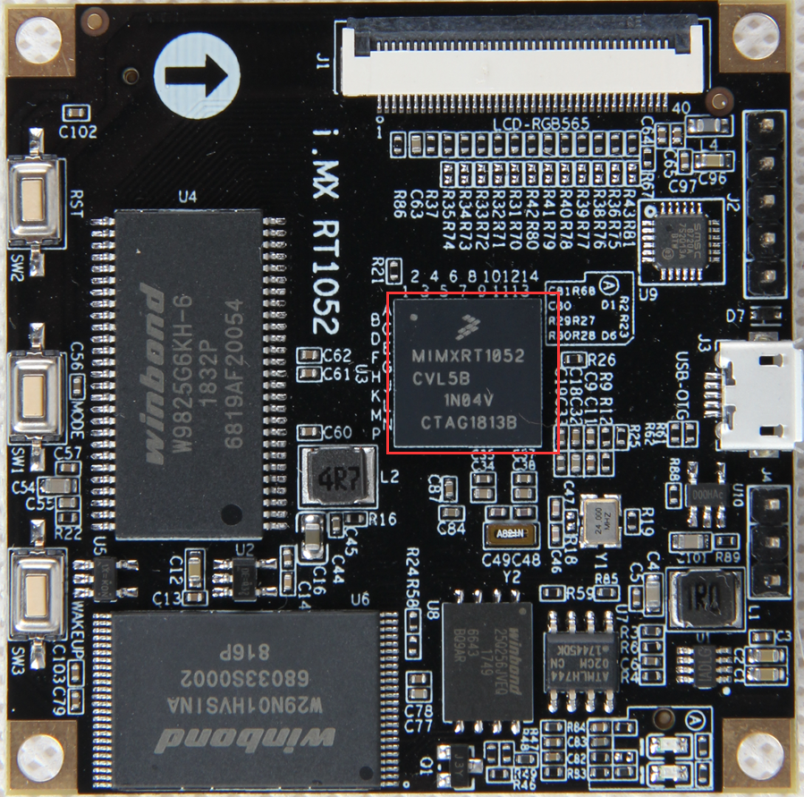

图 5‑1 工业级的MIMXRT1052CVL5B实物图(图中央处的芯片)

该芯片采用BGA封装，引脚从芯片底部引出，横向以数字1、2、3…14为列索引，纵向以字母A、B、C…P为行索引，在芯片的正面以小圆点表示第一个引脚A1，在底面则以一个小三角表示。开发板把芯片中的引脚引出来，连接到各种传感器及设备上，然后在RT1052上编程（实际就是通过程序控制这些引脚输出高电平或者低电平）来控制各种传感器及设备工作，通过做实验的方式来学习RT1052芯片的各个资源。开发板是一种评估板，板载资源非常丰富，引脚复用比较多，力求在一个板子上验证芯片的全部功能。

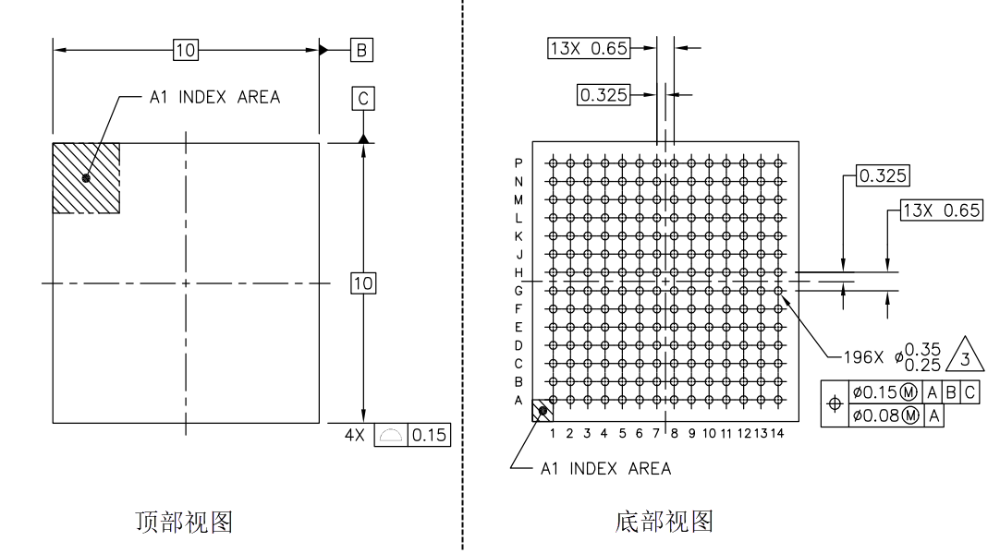

图 5‑2 工业级的MIMXRT1052CVL5B引脚示意图

芯片里面有什么
~~~~~~~~~~~~~~

我们看到的RT1052芯片已经是已经封装好的成品，主要由内核和片上外设组成。若与电脑类比，内核与外设就如同电脑上的CPU与主板、内存、显卡、硬盘的关系。

RT1052采用的是Cortex-M7内核，内核即CPU，由ARM公司设计。ARM公司并不生产芯片，而是出售其芯片技术授权。芯片生产厂商(SOC)如NXP、ST、TI、Freescale，负责在内核之外设计部件并生产整个芯片，这些内核之外的部件被称为核外外设或片上外设。如GPIO、UART（串口）、I2C、SPI等都叫做片上外设。具体见图
5‑3。

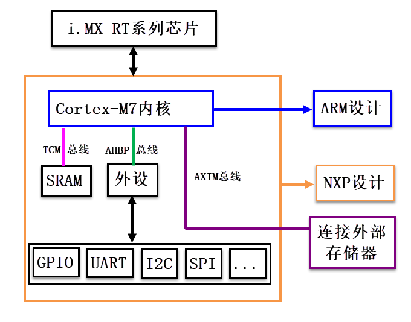

图 5‑3 i.MX RT系列芯片架构简图

芯片内核和外设之间通过各种总线连接，内核通过TCM总线访问芯片内部的SRAM存储器，从中加载代码指令执行。内核通过AHBP总线跟芯片上的GPIO、UART等外设进行交互，达到控制目的
。另外内核还可以通过AXIM总线接口连接芯片外部的存储器，扩展存储空间。

从图
5‑3这个芯片架构图可以看出它并没有像传统的MCU一样集成内部FLASH存储器（此处通指非易失性存储器，下同），因此该芯片必须依靠一个外部FLASH长期保存程序代码，在芯片上电后，它可以直接执行在外部FLASH中的代码，即在外部FLASH上XIP，这正是i.MX
RT系列跨界处理器最大的特色。另外，它还可以从外部的FALSH加载程序到内部的SRAM缓存，然后内核再从内部SRAM读取代码来运行，加载代码的方式多种多样。

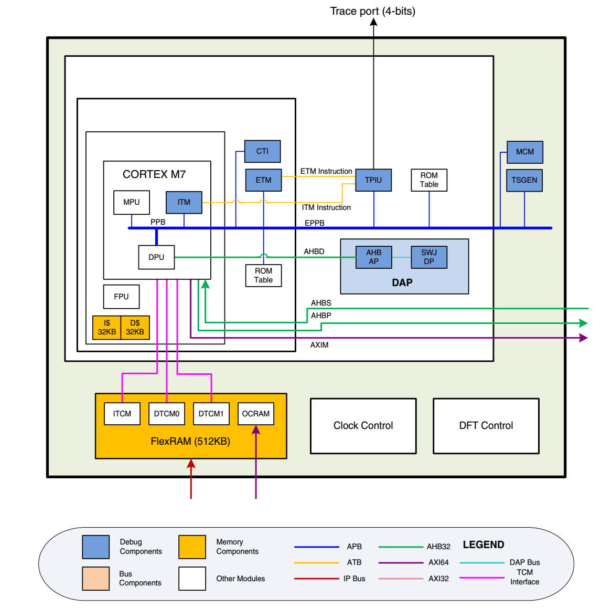

图 5‑4 RT1052 芯片详细说明图

图
5‑4是更具体的芯片说明图，此处我们重点关注其内部的“ICache”、“DCache”以及“FlexRAM”存储器。

ICache
^^^^^^

ICache，即指令缓存（Instruction Cache），即图 5‑4中“I$”，在i.MX
RT系列芯片中其大小为32KB，内核访问该存储器有着极高的速度。它的作用是缓存要执行的指令，即内核根据代码的运行情况，预先从其它存储器（如外部Flash，外部SDRAM等）加载可能会被执行的代码存储至ICache，据官方统计，ICache指令缓存的命中率能达到98%以上，这就是为什么i.MX
RT系列芯片代码存储在外部的FLASH，运行速度依然这么快。而且由于ICache的存在，程序存储在SD卡、NAND
FLASH等不支持XIP的存储器也成为了可能。

DCache
^^^^^^

DCache，即数据缓存（Data Cache），即图 5‑4中“D$”，在i.MX
RT系列芯片中其大小为32KB，它与ICache的功能类似，起到缓存的作用，区别只是ICache专用于存储指令，DCache专用于存储数据。

FlexRAM
^^^^^^^

FlexRAM，译为灵活的RAM，在i.MX
RT系列芯片中其大小为512KB，可以把它理解成传统MCU的内部SRAM存储器，只是它附加了可划分功能区域的配置，分别可以把这内部SRAM分为专用于存储指令的ITCM，专用于存储数据的DTCM以及通用功能的OCRAM。关于ITCM、DTCM及OCRAM将在后面进行说明。

内核使用不同的总线访问这些不同的存储器，因而访问速度有差异，具体见表格
5‑1。

表格 5‑1 各存储器访问的速度排名

+--------+--------------+----------+
| 存储器 | 访问总线宽度 | 速度排名 |
+========+==============+==========+
| ICache | 64位         | 1        |
+--------+--------------+----------+
| DCache | 64位         | 1        |
+--------+--------------+----------+
| ITCM   | 64位         | 2        |
+--------+--------------+----------+
| DTCM   | 双32位       | 3        |
+--------+--------------+----------+
| OCRAM  | 32位         | 4        |
+--------+--------------+----------+

其中ICache和DCache是内核自动使用，用户无法访问的。而ITCM、DTCM及OCRAM是用户可根据具体地址进行访问，开发程序时应根据它们的特性加以利用。

存储器映射
~~~~~~~~~~

在图
5‑4中，连接被控总线的是SRAM、片上外设及外部存储器，这些功能部件共同排列在一个4GB的地址空间内。我们在编程的时候，操作的也正是这些功能部件。

.. 存储器映射-1:

存储器映射
^^^^^^^^^^

存储器本身不具有地址信息，它的地址是由芯片厂商或用户分配，给存储器分配地址的过程就称为存储器映射，具体见图
5‑5。如果给存储器再分配一个地址就叫存储器重映射。

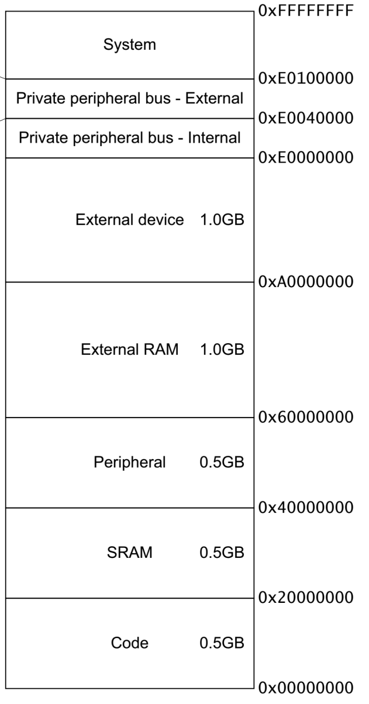

图 5‑5 Cortex-M7存储器映射

存储器区域功能划分
''''''''''''''''''

在这4GB的地址空间中，ARM已经粗线条的平均分成了8个块，，每个块也都规定了用途，具体分类见表格
5‑2。大部分块的大小都有512MB以上，显然这是非常大的，芯片厂商在每个块的范围内设计各具特色的外设时并不一定都用得完，都是只用了其中的一部分而已。

表格 5‑2 内核划分的存储器功能分类

+---------+-----------------------------+------------------------------------+
| 序号    | 用途                        | 地址范围                           |
+=========+=============================+====================================+
| Block 0 | Code                        | 0x0000 0000 ~ 0x1FFF FFFF(512MB)   |
+---------+-----------------------------+------------------------------------+
| Block 1 | SRAM                        | 0x2000 0000 ~ 0x3FFF FFFF(512MB)   |
+---------+-----------------------------+------------------------------------+
| Block 2 | Peripheral片上外设          | 0x4000 0000 ~ 0x5FFF FFFF(512MB)   |
+---------+-----------------------------+------------------------------------+
| Block 3 | External RAM（外部RAM）     | 0x6000 0000 ~ 0x9FFF FFFF (1024MB) |
+---------+-----------------------------+------------------------------------+
| Block 4 | External device（外部设备） | 0xA000 0000 ~ 0xDFFF FFFF(1024MB)  |
+---------+-----------------------------+------------------------------------+
| Block 5 | 内核私有外设内部总线        | 0xE000 0000 ~ 0xE003 FFFF(256KB)   |
+---------+-----------------------------+------------------------------------+
| Block 6 | 内核私有外设外部总线        | 0xE004 0000 ~ 0xE00F FFFF(768KB)   |
+---------+-----------------------------+------------------------------------+
| Block 7 | 系统外设                    | 0xE010 0000 ~ 0xFFFF FFFF(511MB)   |
+---------+-----------------------------+------------------------------------+

在这8个Block里面，有这3个块非常重要，也是我们最关心的三个块。Block0主要用于存储程序代码，一般采用FLASH存储器，Block1主要用于运行时的内存，一般采用SRAM存储器，Block2用来设计成片上的外设，内核通过相应的地址访问片上外设。下面我们简单的介绍下这三个Block里面的具体区域的功能划分。

存储器Block0内部区域功能划分
                            

根据ARM内核的设计，Block0主要用于存储程序代码，在i.MX
RT1052芯片内部又把这部分划分了几个类型。也就是说NXP之类的芯片厂商在ARM内核的存储器功能划分草图之上，细致地根据自己的芯片需求设计出具体的功能分配方案。RT1052芯片对Block0内部区域的功能划分具体见表格
5‑3。

表格 5‑3 RT1052芯片对存储器Block0 内部区域功能划分

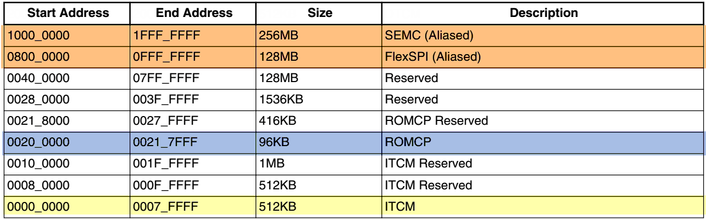

首先是ITCM，ITCM是Instruction Tightly-Coupled
Memory的缩写，译为指令紧耦合内存。所谓紧耦合是指该内存与内核连接紧密，有非常高的访问速度，而“指令”则表示该内存专用于缓存指令。对于那些我们希望有着极高执行速度的代码，我们可以要求内核上电后把相应的代码从外部FLASH加载至ITCM，那么在运行时，代码的执行速度就不会因外部FLASH的访问速度而存在瓶颈。

第二部分是ROMCP，这是一小段ROM空间，用于存储芯片启动时的加载代码，即bootloader，bootloader负责把指令从外部存储器加载至ITCM。

第三部分中的SEMC及FlexSPI是RT1052可用于控制外部并行及串行NorFlash的两个外设，此处把它们映射到此代码空间，是为了支持XIP功能（即指令直接在NorFlash上运行，不需要加载到内部的ITCM）。

储存器Block1内部区域功能划分
                            

Block1用于设计片内的SRAM，也就是芯片运行时的内存，在i.MX
RT1052芯片内部把这部分划分了两种RAM类型，Block1内部区域的功能划分具体见表格
5‑4。

表格 5‑4 RT1052芯片对存储器Block1 内部区域功能划分

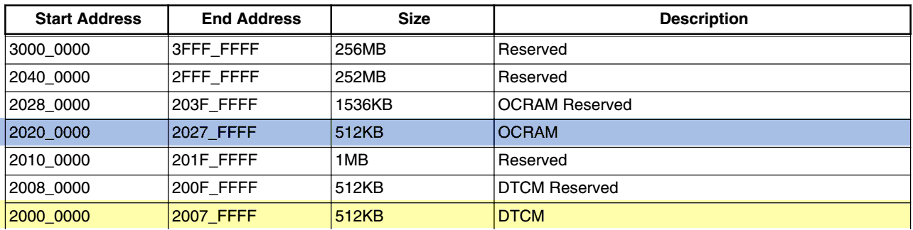

第一种类型为DTCM，是Data Tightly-Coupled
Memory的缩写，译为数据紧耦合内存，它跟ITCM类似，有着极高的访问速度，不过它是专门用来存储程序数据的，即代码中变量的存储位置。

第二种类型为OCRAM，它是On-chip
RAM的缩写，即片上内存，可以完全把它理解为传统MCU的内部SRAM，它没有像ITCM和DTCM的专用限制，可用于存储指令和数据（通用目的）。

**注意：**\ 在RT1052芯片中，前面提到的ITCM、DTCM及OCRAM地址范围均分配了512KB，但这并不是说这三种存储器都有512KB大小。实际上这三种存储器共享内部FlexRAM的空间，而这个内部FlexRAM空间在RT1052芯片中为512KB，在RT1060芯片中为1MB。另外，这三种存储器的空间是可以动态调整的，如在RT1052中，默认ITCM和DTCM各占128KB，OCRAM占256KB，也可以调整成ITCM占64KB，DTCM占128KB，OCRAM占320KB，一共有16种配置方式，具体可参考《Using
the i.MX RT FlexRAM》文档。

储存器Block2内部区域功能划分
                            

Block2用于设计片内的外设，在RT1052芯片中，它的外设使用4条总线与内核进行连接，它们的地址分配情况见表格
5‑5。

表格 5‑5 存储器Block2 内部区域功能划分（此处仅列出AIPS总线相关部分）

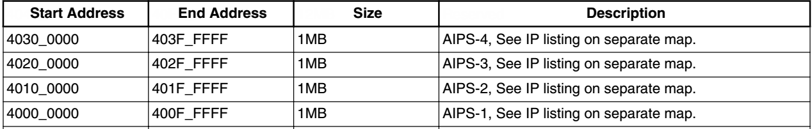

AIPS是ARM IP
Bus的缩写，它一边与内核AHB总线连接，另一边与片上的各种外设连接，AIPS1~4即连接了各种各样的外设，此处每条总线划分的地址范围各为1MB，内核根据地址可以访问相应总线下的外设，达到控制目的，下面以AIPS-2总线上外设的地址分配进行讲解，见表格
5‑6。

表格 5‑6 AIPS-2总线上的地址分配

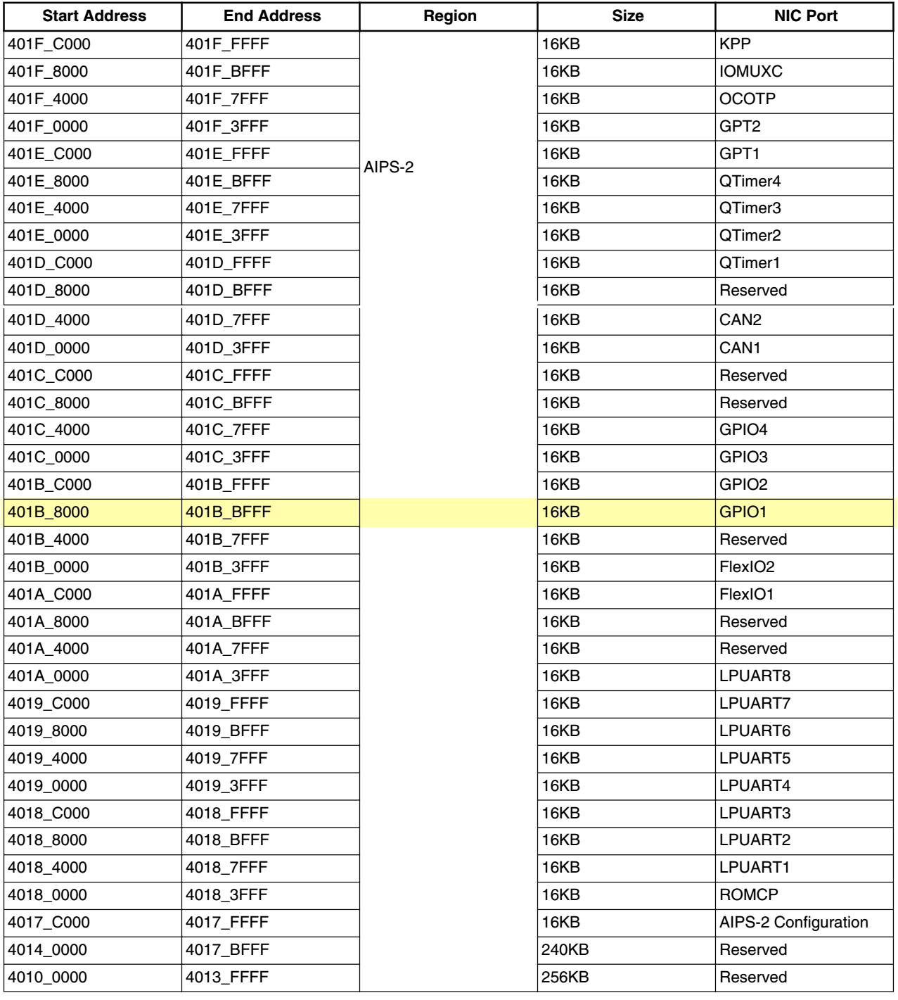

该表格的最右一栏是挂载在AIPS-2总线上的外设名称，在后面的章节中我们会对相应的外设进行讲解。以表中阴影处为例，它表示一个名为GPIO1的外设的内存地址分配情况，而GPIO1外设下又包含了RT1052芯片中32个相关的引脚，它被分配的内存地址为0x401B
8000~0x401B
BFFF，也就是说通过访问这些地址就可以控制这32个引脚了，例如控制引脚输出高低电平，从而达到控制连接到引脚的LED灯亮灭的效果。

寄存器映射
~~~~~~~~~~

我们知道，存储器本身没有地址，给存储器分配地址的过程叫存储器映射，那什么叫寄存器映射？寄存器到底是什么？

在上述存储器Block2这块区域，设计的是片上外设，在相应的地址空间内它们以四个字节为一个单元，共32bit，每一个单元对应不同的功能，当我们控制这些单元时就可以驱动外设工作。我们可以找到每个单元的起始地址，然后通过C语言指针的操作方式来访问这些单元，如果每次都是通过这种地址的方式来访问，不仅不好记忆还容易出错，这时我们可以根据每个单元功能的不同，以功能为名给这个内存单元取一个别名，这个别名对应的内存区就是我们经常说的寄存器，这个给已经分配好地址的有特定功能的内存单元取别名的过程就叫寄存器映射。

比如，我们找到GPIO1端口的输出数据寄存器DR的地址是0x401B
8000（至于这个地址如何找到可以先跳过，后面我们会有详细的讲解），DR寄存器是32bit，对应着32个外部IO，写0/1对应的的IO则输出低/高电平。现在我们通过C语言指针的操作方式，让GPIO1的32个IO都输出高电平，具体见代码清单
5‑1。

.. code-block:: c
   :name: 代码清单 5‑1通过绝对地址访问内存单元
   :caption: 代码清单 5‑1通过绝对地址访问内存单元

   // GPIO1端口全部输出 高电平
   *(unsigned int*)(0x401B8000) = 0xFFFFFFFF;

0x401B
8000在我们看来是GPIO1端口数据输出寄存器DR的地址，但是在编译器看来，这只是一个普通的变量，是一个立即数，要想让编译器也认为是指针，我们得进行强制类型转换，把它转换成指针，即(unsigned
int \*)0x401B 8000，然后再对这个指针进行 \* 操作。

刚刚我们说了，通过绝对地址访问内存单元不好记忆且容易出错，我们可以通过寄存器的方式来操作，具体见代码清单
5‑2。

.. code-block:: c
   :name: 代码清单 5‑2 通过寄存器别名方式访问内存单元
   :caption: 代码清单 5‑2 通过寄存器别名方式访问内存单元

   // GPIO1 端口全部输出 高电平
   #define GPIO1_DR              (unsigned int*)(0x401B8000)
   *GPIOF_DR = 0xFFFFFFFF;

为了方便操作，我们干脆把指针操作“*”也定义到寄存器别名里面，具体见代码清单
5‑3。

.. code-block:: c
   :name: 代码清单 5‑3通过寄存器别名访问内存单元
   :caption: 代码清单 5‑3通过寄存器别名访问内存单元

   // GPIO1 端口全部输出 高电平
   #define GPIO1_DR              *(unsigned int*)(0x401B8000)
   GPIOF_DR = 0xFFFFFFFF;

RT1052的外设地址映射 
^^^^^^^^^^^^^^^^^^^^^

片上外设区的四条AIPS总线挂载着不同的外设，相应总线的最低地址我们称为该总线的基地址，总线基地址也是挂载在该总线上的首个外设的地址。

总线基地址
''''''''''

表格 5‑7 总线基地址

+----------+-------------+
| 总线名称 | 总线基地址  |
+==========+=============+
| AIPS-1   | 0x4000 0000 |
+----------+-------------+
| AIPS-2   | 0x4010 0000 |
+----------+-------------+
| AIPS-3   | 0x4020 0000 |
+----------+-------------+
| AIPS-4   | 0x4030 0000 |
+----------+-------------+

外设基地址
''''''''''

总线上挂载着各种外设，这些外设也有自己的地址范围，特定外设的首个地址称为“XX外设基地址”，也叫XX外设的边界地址。具体有关RT1052外设的边界地址请参考《IMXRT1050RM》（参考手册）的第2章中的存储器映射的表。

这里面我们以GPIO这个外设来讲解外设的基地址，具体见表格 5‑8。

表格 5‑8 外设GPIO基地址

+----------+-------------+
| 外设名称 | 外设基地址  |
+==========+=============+
| GPIO1    | 0x401B 8000 |
+----------+-------------+
| GPIO2    | 0x401B C000 |
+----------+-------------+
| GPIO3    | 0x401C 0000 |
+----------+-------------+
| GPIO4    | 0x401C 4000 |
+----------+-------------+
| GPIO5    | 0x400C 0000 |
+----------+-------------+

可以看到，GPIO1~GPIO4的外设基地址都位于AIPS-2总线地址的范围，而GPIO5比较特殊，它是属于AIPS-1总线的。不过除了所属总线及地址的差异外，它们的功能都一样。

外设寄存器
''''''''''

在XX外设的地址范围内，分布着的就是该外设的寄存器。以GPIO外设为例，GPIO是通用输入输出端口的简称，简单来说就是RT1052可控制的引脚，基本功能是控制引脚输出高电平或者低电平。最简单的应用就是把GPIO的引脚连接到LED灯的阴极，LED灯的阳极接电源，然后通过RT1052控制该引脚的电平，从而实现控制LED灯的亮灭。

GPIO有很多个寄存器，每一个都有特定的功能。每个寄存器为32bit，占4个字节，在该外设的基地址上按照顺序排列，因此寄存器的位置可以用相对该外设基地址的偏移地址来描述。这里我们以GPIO1端口为例，来说明GPIO都有哪些寄存器，具体见表格
5‑8。

表格 5‑9 GPIO1端口的寄存器地址列表

+----------------+----------------+-------------+-----------------------+
| 寄存器名称     | 类型           | 寄存器地址  | 相对于GPOI1的地址偏移 |
+================+================+=============+=======================+
| GPIO1_DR       | 数据寄存器     | 0x401B 8000 | 0x00                  |
+----------------+----------------+-------------+-----------------------+
| GPIO1_GDIR     | 方向寄存器     | 0x401B 8004 | 0x04                  |
+----------------+----------------+-------------+-----------------------+
| GPIO1_PSR      | 状态寄存器     | 0x401B 8008 | 0x08                  |
+----------------+----------------+-------------+-----------------------+
| GPIO1_ICR1     | 中断配置寄存器 | 0x401B 800C | 0x0C                  |
+----------------+----------------+-------------+-----------------------+
| GPIO1_ICR2     | 中断配置寄存器 | 0x401B 8010 | 0x10                  |
+----------------+----------------+-------------+-----------------------+
| GPIO1_IMR      | 中断掩码寄存器 | 0x401B 8014 | 0x14                  |
+----------------+----------------+-------------+-----------------------+
| GPIO1_ISR      | 中断状态寄存器 | 0x401B 8018 | 0x18                  |
+----------------+----------------+-------------+-----------------------+
| GPIO1_EDGE_SEL | 边沿选择寄存器 | 0x401B 801C | 0x1C                  |
+----------------+----------------+-------------+-----------------------+

表中数据寄存器GPIO1_DR是GPIO1中的首个寄存器，所以它的寄存器地址与GPIO1的外设基地址相同，为0x401B
8000，它相对GPIO1基地址的偏移为0；紧挨着的是方向寄存器GPIO1_GDIR，由于前面的GPIO1_DR占据了4个字节，所以安排给它的地址也相对GPIO1_DR增加了4，最终地址为0x401B
8004，它相对GPIO1基地址增加了4，其余的寄存器地址安排依次类推。

由于各个GPIO端口的控制方式完全一致，GPIO1~GPIO5都具有同样功能的寄存器用于控制对应端口引脚的特性，所以在《IMXRT1050RM》（参考手册）中对寄存器地址是统一用表格
5‑10来说明的。

表格 5‑10 GPIO端口的 寄存器地址列表

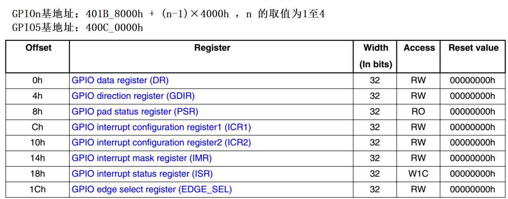

表格上面的两行文字说明了GPIO1~GPIO5端口的基地址，然后表格列出各寄存器相对端口基地址的偏移。例如，想要知道GPIO2的中断掩码寄存器（IMR）实际地址时，可以根据公式算出：

GPIO2 基地址：0x401B 8000+(2-1)×0x4000 = 0x401B C000

IMR寄存器相对基地址的偏移为0x14，所以：

GPIO2_IMR寄存器地址：0x401B C000 + 0x14 = 0x401B C014

芯片对外设寄存器的这种统一安排不仅方便理解，也简化了程序中对寄存器地址的定义。

有关外设的寄存器说明可参考《IMXRT1050RM》（参考手册）中具体章节的寄存器描述部分，在编程的时候我们需要反复的查阅外设的寄存器说明。

这里我们以“GPIO中断配置寄存器GPIO_ICR1”为例，教大家如何理解寄存器的说明，具体见图
5‑6。

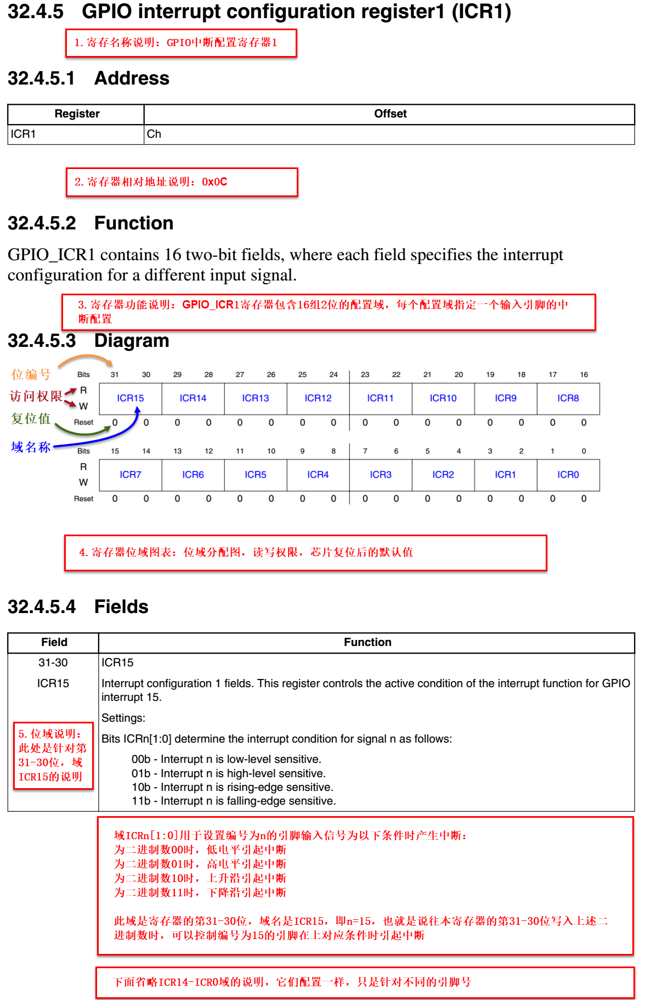

图 5‑6 GPIO端口中断控制寄存器

-  寄存器名称

寄存器说明中首先列出了该寄存器中的名称，同类型外设的寄存器说明是通用的，也就是说，本例子中的GPIO1~GPIO5端口都有这样的一个寄存器，都适用于本说明。

-  偏移地址

偏移地址是指本寄存器相对于这个外设的基地址的偏移。跟前面的说明一样，本寄存器的偏移地址是0x0C，从参考手册中我们可以查到GPIO1外设的基地址为0x401B
8000 ，我们就可以算出GPIO1的这个GPIO1_ICR1寄存器的地址为：0x401B
8000+0x0C ；同理，由于GPIO2的外设基地址为0x401B
C000，可算出GPIO2_ICR1寄存器的地址为：0x401B C000+0x0C
。其他GPIO端口以此类推即可。

-  寄存器功能说明

它简要地了本寄存器的主要功能，此处表明GPIO_ICR1寄存器包含16组2位的配置域，每个配置域控制一个输入引脚的中断配置。

-  寄存器位表

紧接着的是本寄存器的位表，表中列出它的0-31位的名称及权限。表上方的数字为位编号，中间为位名称，侧面为读写权限，其中W表示只写，R表示只读，RW表示可读写。本寄存器中的位权限都是RW。有的寄存器位只读，一般是用于表示外设的某种工作状态的，由芯片硬件自动更改，程序通过读取那些寄存器位来判断外设的工作状态。表中最下一栏是对应寄存器位复位后的默认值，每位的值用0或1表示，本寄存器的复位值为全0。

-  配置域功能说明

配置域功能是寄存器说明中最重要的部分，它详细介绍了寄存器每一个位的功能。例如本寄存器中只有一种寄存器配置域，即ICRn，其中的n数值可以是0-15，这里的0-15表示端口的引脚号，如ICR0用于控制GPIOx的第0个引脚，若x表示GPIO1，那就是控制GPIO1的第0引脚，而ICR1就是控制GPIO1第1个引脚。对于GPIO中的16~31号引脚，不在本寄存器的控制范围之内，它们使用另一个寄存器GPIO_ICR2进行配置（此处请注意区分寄存器GPIO_ICR1、GPIO_ICR2和配置域ICR0~ICR15的概念）。

图中仅截取了ICR15配置域的说明，其余ICR14~ICR0的部分是完全一样的。该说明以通用的ICRn[1:0]表述，其中n就是代表引脚号的0~15，当ICRn被设置成二进制数00b、01b、10b或11b时分别可把对应引脚设置成低电平、高电平、上升沿或下降沿时引起中断(b表示2进制数，跟h表示16进制数的方式类似)。也就是说，当我们想配置GPIO1编号为15的引脚设置成上升沿引起中断时，需要把GPIO1_ICR1寄存器（地址为0x401B
800C）中的第31~30位写入二进制数10b，其它引脚类似。

C语言对寄存器的封装
^^^^^^^^^^^^^^^^^^^

以上所有的关于存储器映射的内容，最终都是为大家更好地理解如何用C语言控制读写外设寄存器做准备，此处是本章的重点内容。

封装外设基地址
''''''''''''''

在编程上为了方便理解和记忆，我们把外设基地址和寄存器地址都以相应的宏定义起来，外设或寄存器都以他们的名字作为宏名，具体见代码清单
5‑4。

.. code-block:: c
   :name: 代码清单 5‑4外设基地址及寄存器地址的宏定义
   :caption: 代码清单 5‑4外设基地址及寄存器地址的宏定义

   /* GPIO - 外设基地址 */
   /** GPIO1 外设基地址 */
   #define GPIO1_BASE                               (0x401B8000u)
   /** GPIO2 外设基地址 */
   #define GPIO2_BASE                               (0x401BC000u)
   /** GPIO3 外设基地址 */
   #define GPIO3_BASE                               (0x401C0000u)
   /** GPIO4 外设基地址 */
   #define GPIO4_BASE                               (0x401C4000u)
   /** GPIO5 外设基地址 */
   #define GPIO5_BASE                               (0x400C0000u)

   /* 寄存器地址，以 GPIO1 为例*/
   #define GPIO1_DR                                (GPIO1_BASE+0x00)
   #define GPIO1_GDIR                              (GPIO1_BASE+0x04)
   #define GPIO1_PSR                               (GPIO1_BASE+0x08)
   #define GPIO1_ICR1                              (GPIO1_BASE+0x0C)
   #define GPIO1_ICR2                              (GPIO1_BASE+0x10)
   #define GPIO1_IMR                               (GPIO1_BASE+0x14)
   #define GPIO1_ISR                               (GPIO1_BASE+0x18)
   #define GPIO1_EDGE_SEL                          (GPIO1_BASE+0x1C) 

这代码首先定义了GPIO1~GPIO5的外设基地址，最后在外设基地址上加入各寄存器的地址偏移，得到特定寄存器的地址。一旦有了具体地址，就可以用指针进行读写操作，具体见代码清单
5‑5。

.. code-block:: c
   :name: 代码清单 5‑5使用指针控制ICR1寄存器
   :caption: 代码清单 5‑5使用指针控制ICR1寄存器
   :linenos:

   /* 控制GPIO1 引脚6配置为高电平引起中断
   (GPIO1_ICR1寄存器的ICR6设置为01b，即0x01) */
   /* 先对配置域ICR6的2个数据位清0 */
   *(unsigned int *)GPIO1_ICR1 &= ~(0x3<<(2*6));
   /* 给配置域ICR6的2个数据位赋值01b */
   *(unsigned int *)GPIO1_ICR1 |= (0x01<<(2*6));
   
   /* 控制GPIO1 引脚6配置为上升沿引起中断
   (GPIO1_ICR1寄存器的ICR6设置为10b，即0x02) */
   /* 先对配置域ICR6的2个数据位清0 */
   *(unsigned int *)GPIO1_ICR1 &= ~(0x3<<(2*6));
   /* 给配置域ICR6的2个数据位赋值10b */
   *(unsigned int *)GPIO1_ICR1 |= (0x02<<(2*6));
   
   unsigned int temp;
   /* 控制GPIO1 端口所有引脚的电平(读DR寄存器) */
   temp = *(unsigned int *)GPIO1_DR;

该代码使用 (unsigned int \*)
把GPIO1_ICR1宏的数值强制转换成了地址，然后再用“*”号做取指针操作，对该地址的赋值，从而实现了写寄存器的功能(整个过程包括位清零及赋值两个过程，具体说明见本教程5.5.3
小节)。同样，读寄存器也是用取指针操作，把寄存器中的数据取到变量里，从而获取外设的状态。

封装寄存器列表
''''''''''''''

用上面的方法去定义地址，还是稍显繁琐，例如GPIO1~GPIO5都各有一组功能相同的寄存器，如GPIO1_DR/GPIO2_DR/GPIO3_DR等等，它们只是地址不一样，但却要为每个寄存器都定义它的地址。为了更方便地访问寄存器，我们引入C语言中的结构体语法对寄存器进行封装，具体见代码清单
5‑6。

.. code-block:: c
   :name: 代码清单 5‑6 使用结构体对GPIO寄存器组的封装
   :caption: 代码清单 5‑6 使用结构体对GPIO寄存器组的封装
   :linenos:

   typedef unsigned           int uint32_t; /*无符号32位变量*/
   typedef unsigned short     int uint16_t; /*无符号16位变量*/

   /** GPIO - 寄存器列表  */
   typedef struct {
      uint32_t DR;       /**< GPIO 数据寄存器, 地址偏移: 0x0 */
      uint32_t GDIR;     /**< GPIO 方向寄存器, 地址偏移: 0x4 */
      uint32_t PSR;      /**< GPIO 状态寄存器, 地址偏移: 0x8 */
      uint32_t ICR1;     /**< GPIO 中断配置寄存器1, 地址偏移: 0xC */
      uint32_t ICR2;     /**< GPIO 中断配置寄存器2, 地址偏移: 0x10 */
      uint32_t IMR;      /**< GPIO 中断掩码寄存器, 地址偏移: 0x14 */
      uint32_t ISR;      /**< GPIO 中断状态寄存器, 地址偏移: 0x18 */
      uint32_t EDGE_SEL; /**< GPIO 边沿选择寄存器, 地址偏移: 0x1C */
   } GPIO_Type;

这段代码用typedef 关键字声明了名为GPIO_Type的结构体类型，结构体内有8个
成员变量，变量名正好对应寄存器的名字。C语言的语法规定，结构体内变量的存储空间是连续的，其中32位的变量占用4个字节，16位的变量占用2个字节，具体见图
5‑7。

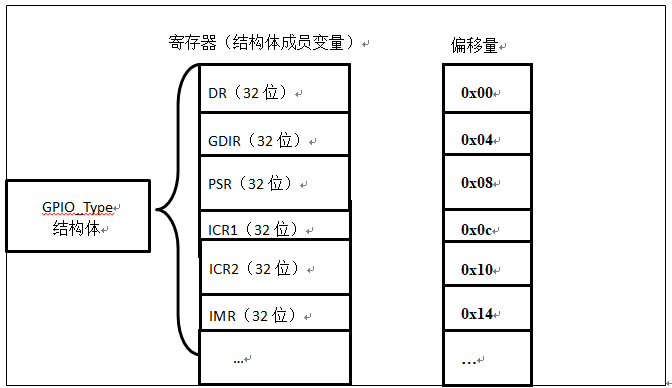

图 5‑7 GPIO_Type结构体成员的地址偏移

也就是说，假如我们定义一个GPIO_Type
类型的结构体，且结构体的首地址为0x401B
8000（这也是第一个成员变量DR的地址），
那么结构体中第二个成员变量GDIR的地址即为0x401B 8000 +0x04
，加上的这个0x04
，正是代表DR所占用的4个字节地址的偏移量，其它成员变量相对于结构体首地址的偏移，在上述代码右侧注释已给出。

这样的地址偏移与RT1052的
GPIO外设定义的寄存器地址偏移一一对应，只要给结构体设置好首地址，就能把结构体内成员的地址确定下来，然后就能以结构体的形式访问寄存器了，具体见代码清单
5‑7。

.. code-block:: c
   :name: 代码清单 5‑7 通过结构体指针访问寄存器
   :caption: 代码清单 5‑7 通过结构体指针访问寄存器
   :linenos:

   GPIO_Type * GPIOx;        //定义一个GPIO_Type型结构体指针变量GPIOx
   GPIOx = GPIO1_BASE;          //把指针地址设置为宏GPIO1_BASE地址
   GPIOx->DR = 0xFFFF;         //通过指针访问并修改GPIO1_DR寄存器
   GPIOx->GDIR = 0xFFFFFFFF;    //修改GPIO1_GDIR寄存器
   GPIOx->ICR1 =0xFFFFFFFF;    //修改GPIO1_ICR1寄存器

   uint32_t temp;
   temp = GPIOx->DR;          //读取GPIOF_DR寄存器的值到变量temp中

这段代码先用GPIO_Type类型定义一个结构体指针GPIOx，并让指针指向地址GPIO1_BASE(0x401B
8000)，使地址确定下来，然后根据C语言访问结构体的语法，用GPIOx->DR、GPIOx->GDIR及GPIOx->ICR1等方式读写寄存器。

最后，我们更进一步，直接使用宏来定义好GPIO_Type类型的指针，而且指针指向各个GPIO端口的基地址，使用时我们直接用该宏访问寄存器即可，具体代码清单
5‑8。

.. code-block:: c
   :name: 代码清单 5‑8定义好GPIO端口基地址址针
   :caption: 代码清单 5‑8定义好GPIO端口基地址址针
   :linenos:

   /*使用GPIO_Type把地址强制转换成指针*/
   #define GPIO1               ((GPIO_Type *) GPIO1_BASE)
   #define GPIO2               ((GPIO_Type *) GPIO2_BASE)
   #define GPIO3               ((GPIO_Type *) GPIO3_BASE)
   #define GPIO4               ((GPIO_Type *) GPIO4_BASE)
   #define GPIO5               ((GPIO_Type *) GPIO5_BASE)
   
   /*使用定义好的宏直接访问*/
   /*访问GPIO1端口的寄存器*/
   GPIO1->DR = 0xFFFF;       //通过指针访问并修改GPIO1_DR寄存器
   GPIO1->GDIR = 0xFFFFFFF;    //修改GPIO1_GDIR寄存器
   GPIO1->ICR1 =0xFFFFFFF;    //修改GPIO1_ICR1寄存器
   
   uint32_t temp;
   temp = GPIO1->DR;          //读取GPIO1_DR寄存器的值到变量temp中
   
   /*访问GPIO5端口的寄存器*/
   GPIO5->DR = 0xFFFF;       //通过指针访问并修改GPIO5_DR寄存器
   GPIO5->GDIR = 0xFFFFFFF;    //修改GPIO5_GDIR寄存器
   GPIO5->ICR1 =0xFFFFFFF;    //修改GPIO5_ICR1寄存器
   
   uint32_t temp;
   temp = GPIO5->IDR;          //读取GPIO5_DR寄存器的值到变量temp中

这里我们仅是以GPIO这个外设为例，给大家讲解了C语言对寄存器的封装。以此类推，其他外设也同样可以用这种方法来封装。好消息是，这部分工作都由固件库帮我们完成了，这里我们只是分析了下这个封装的过程，让大家知其然，也只其所以然。

修改寄存器的位操作方法
^^^^^^^^^^^^^^^^^^^^^^

使用C语言对寄存器赋值时，我们常常要求只修改该寄存器的某几位的值，且其它的寄存器位不变，这个时候我们就需要用到C语言的位操作方法了。

把变量的某位清零
''''''''''''''''

此处我们以变量a代表寄存器，并假设寄存器中本来已有数值，此时我们需要把变量a的某一位清零，且其它位不变，方法见代码清单
5‑9。

.. code-block:: c
   :name: 代码清单 5‑9 对某位清零
   :caption: 代码清单 5‑9 对某位清零
   :linenos:

   //定义一个变量a = 1001 1111 b (二进制数)
   unsigned char a = 0x9f;

   //对bit2 清零

   a &= ~(1<<2);

   //括号中的1左移两位，(1<<2)得二进制数：0000 0100 b
   //按位取反，~(1<<2)得1111 1011 b
   //假如a中原来的值为二进制数： a = 1001 1111 b
   //所得的数与a作”位与&”运算，a = (1001 1111 b)&(1111 1011 b),
   //经过运算后，a的值 a=1001 1011 b
   // a的bit2 位被被零，而其它位不变。

把变量的某几个连续位清零
''''''''''''''''''''''''

由于寄存器中有时会有连续几个寄存器位用于控制某个功能，现假设我们需要把寄存器的某几个连续位清零，且其它位不变，方法见代码清单
5‑10。

.. code-block:: c
   :name: 代码清单 5‑10 对某几个连续位清零
   :caption: 代码清单 5‑10 对某几个连续位清零
   :linenos:

   //若把a中的二进制位分成2个一组
   //即bit0、bit1为第0组，bit2、bit3为第1组，
   //  bit4、bit5为第2组，bit6、bit7为第3组
   //要对第1组的bit2、bit3清零

   a &= ~(3<<2*1);

   //括号中的3左移两位，(3<<2*1)得二进制数：0000 1100 b
   //按位取反，~(3<<2*1)得1111 0011 b
   //假如a中原来的值为二进制数： a = 1001 1111 b
   //所得的数与a作”位与&”运算，a = (1001 1111 b)&(1111 0011 b),
   //经过运算后，a的值 a=1001 0011 b
   // a的第1组的bit2、bit3被清零，而其它位不变。

   //上述(~(3<<2*1))中的(1)即为组编号;如清零第3组bit6、bit7此处应为3
   //括号中的(2)为每组的位数，每组有2个二进制位;若分成4个一组，此处即为4
   //括号中的(3)是组内所有位都为1时的值;若分成4个一组，此处即为二进制数“1111 b”

   //例如对第2组bit4、bit5清零
   a &= ~(3<<2*2);

对变量的某几位进行赋值。
''''''''''''''''''''''''

寄存器位经过上面的清零操作后，接下来就可以方便地对某几位写入所需要的数值了，且其它位不变，方法见代码清单
5‑11，这时候写入的数值一般就是需要设置寄存器的位参数。

.. code-block:: c
   :name: 代码清单 5‑11 对某几位进行赋值
   :caption: 代码清单 5‑11 对某几位进行赋值
   :linenos:

   //a = 1000 0011 b
   //此时对清零后的第2组bit4、bit5设置成二进制数“01 b ”

   a |= (1<<2*2);
   //a = 1001 0011 b，成功设置了第2组的值，其它组不变

对变量的某位取反
''''''''''''''''

某些情况下，我们需要对寄存器的某个位进行取反操作，即 1变0
，0变1，这可以直接用如下操作，其它位不变，见代码清单 5‑12。

.. code-block:: c
   :name: 代码清单 5‑12 对某位进行取反操作
   :caption: 代码清单 5‑12 对某位进行取反操作
   :linenos:

   //a = 1001 0011 b
   //把bit6取反，其它位不变

   a ^=(1<<6);
   //a = 1101 0011 b

关于修改寄存器位的这些操作，在下一章中有应用实例代码，可配合阅读。
