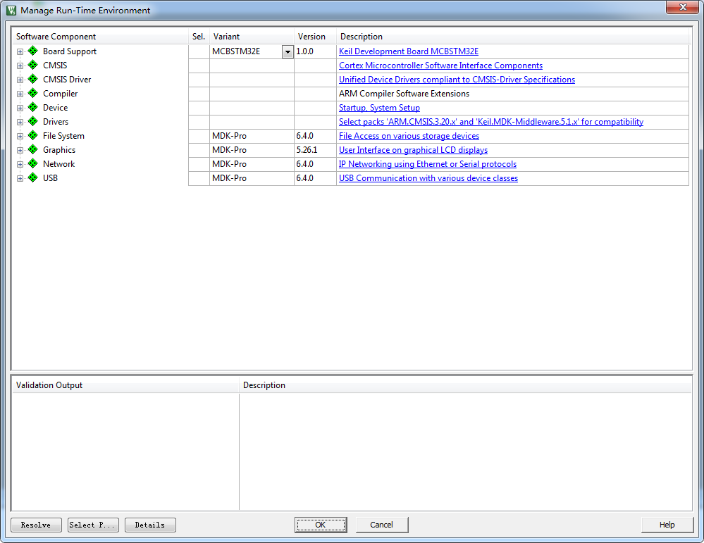

新建工程—寄存器版
-----------------

本章内容所涉及的软件只供教学使用，不得用于商业用途。个人或公司因商业用途导致的法律责任，后果自负。版本说明：MDK5.24，如果有更高的版本可使用高版本。版本号可从MDK软件的“Help-->About
uVision”选项中查询到。

新建本地工程文件夹
~~~~~~~~~~~~~~~~~~

为了工程目录更加清晰，我们在本地电脑上新建1个文件夹用于存放整个工程，如命名为“LED”，工程名可随意命名。然后在该目录下新建2个文件夹Listings和Objects，在使用KEIL5新建工程的时候，Listings和Objects会自动生成，具体见表格
6‑1。使用KEIL5以下版本则要手动新建。

表格 6‑1 工程目录文件夹清单

+----------+-----------------------------------------------------+
| 名称     | 作用                                                |
+==========+=====================================================+
| Listings | 存放编译器编译时候产生的c/汇编/链接的列表清单       |
+----------+-----------------------------------------------------+
| Objects  | 存放编译产生的调试信息、hex文件、预览信息、封装库等 |
+----------+-----------------------------------------------------+

图 6‑1 工程文件夹目录

在本地新建好工程文件夹后，然后在文件夹里面新建一些文件，在开始编程之前，这些文件都为空，具体见表格
6‑2。

表格 6‑2 工程目录文件夹内容清单

+----------+----------------------------------------------------+
| 名称     | 作用                                               |
+==========+====================================================+
| LED      | 存放startup_MIMXRT1052.s、MIMXRT1052.h、main.c文件 |
+----------+----------------------------------------------------+
| Listings | 暂时为空                                           |
+----------+----------------------------------------------------+
| Objects  | 暂时为空                                           |
+----------+----------------------------------------------------+

开始新建工程
~~~~~~~~~~~~

打开KEIL5软件，新建一个工程，具体见图
6‑2。工程名根据喜好命名，我这里取LED-REG（REG是寄存器的英文register的缩写），直接保存在LED文件夹下。

.. image:: media/image2.jpeg
   :align: center
   :alt: image2
   :name: 图6_2

图 6‑2 在KEIL5中新建工程

选择CPU型号
^^^^^^^^^^^

这个根据你开发板使用的CPU具体的型号来选择，野火 i.MX RT1052
系列开发板选MIMXRT1052DVL5B，具体见图
6‑3。如果这里没有出现你想要的CPU型号，或者一个型号都没有，那么肯定是你的KEIL5没有添加RT1052芯片包，KEIL5不像KEIL4那样自带了很多MCU的型号，KEIL5需要自己添加，关于如何添加请参考《如何安装KEIL5》这一章的安装RT1052芯片包小节。

图 6‑3 选择具体的CPU型号

在线添加库文件
^^^^^^^^^^^^^^

用寄存器控制RT1052时我们不需要在线添加库文件，这里我们点击关掉，具体见图
6‑4。

图 6‑4 在线添加库文件（暂时关掉）

添加文件
^^^^^^^^

在新建的工程中添加文件，文件从本地建好的工程文件夹下获取，双击组文件夹就会出现添加文件的路径，具体见图
6‑5，然后选择文件Add即可。

图 6‑5往组文件夹中添加文件

现在我们对添加的三个文件简单说明如下：

startup_MIMXRT1052.s
''''''''''''''''''''

启动文件，系统上电后第一个运行的程序，由汇编编写，C编程用的比较少，可暂时不管，这个文件是从固件库里面拷贝而来的，由NXP官方提供。文件在这个目录：RT1052固件库\MIMXRT1052\startup_MIMXRT1052.s

MIMXRT1052.h
''''''''''''

用户手动新建，用于存放寄存器映射的代码，暂时为空。

main.c
''''''

用户手动新建，用于存放main函数，写入如下空代码，见代码清单 6‑1。

.. code-block:: c
   :name: 代码清单 6‑1 工程模版的main文件内容（寄存器版本）
   :caption: 代码清单 6‑1 工程模版的main文件内容（寄存器版本）
   :linenos:

   /*
      *工程模板(寄存器版本)
      */
   #include "MIMXRT1052.h"
   
   
   /**
      *   主函数
      */
   int main(void)
   {
   
      while (1);
   
   }
   
   // 函数为空，目的是为了骗过编译器不报错
   void SystemInit(void)
   {
   }

在代码清单
6‑1中，我们添加了一个空的函数SystemInit()，该函数在启动文件startup_MIMXRT1052.s的复位程序中被调用，主要作用是初始化系统时钟，是在固件库里面实现的。目前我们还没有使用固件库编程，为了防止编译的时候报错说找不到这个函数的定义，所以我们在main.c里面手动定义一个空的SystemInit()函数。在后续的固件库编程中我们会对这个函数做详细的讲解。

复制存储器分配文件
^^^^^^^^^^^^^^^^^^

除了上述代码源文件外，在RT1052的工程中还需要添加一个存储器分配文件，文件名为MIMXRT1052xxxxx_flexspi_nor，我们从固件库的如下目录复制至本工程目录下即可。

文件的原目录：

.. code-block::

   RT1052 sdk根目录\devices\MIMXRT1052\arm\MIMXRT1052xxxxx_flexspi_nor

复制后工程目录下的主要文件见图 6‑6。

图 6‑6 在工程目录下放置存储器分配文件

该文件可直接用记事本或文本编辑器打开，不过其功能及语法比较复杂，在后面的教程再详细介绍。

配置魔术棒选项卡
^^^^^^^^^^^^^^^^

这一步的配置工作很重要，编译有问题，下载有问题，基本都是这个步骤的配置出了错。

Linker选项卡
''''''''''''

Linker选项卡包含对链接器的配置，链接器对C/C++及ASM汇编器生成的*.o目标文件链接得到最终的可执行程序文件。

(1) 在这个Linker选项卡中我们主要设置链接使用的存储器分配文件。KEIL会根据我们的芯片型号设置一个默认的存储器分配文件，但我们要使用的是前面复制到工程目录下的MIMXRT1052xxxxx_flexspi_nor文件，所以需要重新配置，配置方法是在Linker选项框中取消勾选“Use Memory Layout from TargetDialog”选项，然后打开Scaltter File 栏右侧的按钮把MIMXRT1052xxxxx_flexspi_nor添加进去，见图 6‑7。

图 6‑7使用指定的存储器分配文件

(2) 修改存储器分配文件。这个MIMXRT1052xxxxx_flexspi_nor存储器分配文件是适配官方评估版的，针对野火开发板的存储器，需要进行修改，点击选项框中的“Edit”按钮会弹出该文件的内容，然后直接编辑即可，具体见图
    6‑8，修改如下：

-  把m_text_size的值修改为0x01FFDC00；

-  把LR_m_rom_config及LR_m_rom_ivt相关的代码使用分号“;”注释掉。

    针对这些修改的具体说明请参考后面关于“分散加载文件”的章节，在该章节再专门学习。

图 6‑8 修改存储器分配文件（寄存器版）

(3) 添加忽略警告提示。在同样的选项框下“disable Warnings”添加对忽略6314类型警告的配置，否则在后面编译时经常会提示分配的部分存储器没有使用的警告，比较烦人，可以忽略，忽略设置具体见图6‑9。

.. image:: media/image9.png
   :align: center
   :alt: image9
   :name: 图6_9

图 6‑9添加要忽略的6314类型Warning

Target选项卡
''''''''''''

在Target选项卡需要设置不使用浮点运算单元。本芯片包含有浮点运算单元，使用它可以加速浮点类型数据的运算。不过使用浮点运算单元时还需要在代码中添加一些配置，在本教程中，寄存器版的工程只作简单的演示，不做浮点单元的配置，所以此处我们需要关闭它，不然程序执行会出错，具体见图
6‑10。

.. image:: media/image10.png
   :align: center
   :alt: image10
   :name: 图6_10

图 6‑10不使用浮点运算单元

Output选项卡
''''''''''''

Output选项卡中把输出文件夹定位到我们工程目录下的Objects文件夹，如果想在编译的过程中生成hex文件，那么那Create
HEX File选项勾上，具体见图 6‑11。

图 6‑11 配置 Output 选项卡

Listing选项卡
'''''''''''''

在Listing选项卡中把输出文件夹定位到我们工程目录下的Listings文件夹，具体见图
6‑12。

.. image:: media/image12.png
   :align: center
   :alt: image12
   :name: 图6_12

图 6‑12 配置 Listing 选项卡

下载器配置
^^^^^^^^^^

在仿真器连接好电脑和开发板且开发板供电正常的情况下，打开编译软件KEIL，在魔术棒选项卡里面选择仿真器的型号，此配置适用于野火配套的DAP下载器，具体过程见图
6‑13到图 6‑19所示。

Debug选项配置
             

图 6‑13 Debug选择CMSIS-DAP Debugger

Utilities选项配置
                 

.. image:: media/image14.png
   :align: center
   :alt: image14
   :name: 图6_14

图 6‑14 Utilities选择 Use Debug Driver

Debug Settings 选项配置
                       

.. image:: media/image15.png
   :align: center
   :alt: image15
   :name: 图6_15

图 6‑15 Debug Settings 选项配置

选择目标存储器下载算法
                      

选择目标存储器下载算法，具体要根据板子上使用的FLASH型号来决定。首先要删除默认的存储器，这些是官方评估板的存储器，与野火
i.MX RT1052
系列开发板使用的存储器类型不同，所以要先把这两个默认的都删除掉，具体见图
6‑16。

.. image:: media/image16.png
   :align: center
   :alt: image16
   :name: 图6_16

图 6‑16 删除原目标存储器

删除默认存储器后，添加野火 i.MX RT1052
系列开发板配套的32MB存储器下载算法“iMXRT1052_W25Q256JV_CFG_By_Fire.FLM”
（如果以后存储器大小和下载算法名称有改动则以实际情况为准），具体见图
6‑17，若在列表框找不到该项目，请参考前面《3.4
放置下载算法》章节补充操作。

图 6‑17 添加野火开发板配套的下载算法(寄存器版本)

设置算法空间
            

由于本下载算法相比默认的需要更大的空间，所以还需要在配置页面中增大算法空间，具体见图
6‑18。

.. image:: media/image18.png
   :align: center
   :alt: image18
   :name: 图6_18

图 6‑18 设置下载算法空间（寄存器版）

添加完成后具体效果见图 6‑19，这里面有个小技巧就是把Reset and
Run也勾选上，这样程序下载完之后就会自动运行，否则需要手动复位。擦除的FLASH大小选择Sectors即可，不要选择Full
Chip，不然下载会比较慢。

.. image:: media/image19.png
   :align: center
   :alt: image19
   :name: 图6_19

图 6‑19 选择目标存储器

编译程序
~~~~~~~~

设置完成后，点击编译按钮编译程序即可，具体见图
6‑20。若编译后有警告提示，请检查前面的Linker对话框是否设置好了警告忽略。

图 6‑20 编译程序

下载程序
~~~~~~~~

如果前面步骤都成功了，接下来就可以把编译好的程序下载到开发板上运行。下载程序不需要其他额外的软件，直接点击KEIL中的LOAD按钮即可。下载程序的时候需要用仿真器连接电脑和开发板且开发板要供电。

图 6‑21 下载程序

程序下载后，Build Output选项卡如果打印出 Application
running…则表示程序下载成功。如果没有出现实验现象，按复位键试试。当然，这只是一个工程模版，我们还没写程序，开发板不会有任何现象。

至此，一个基于寄存器编程的新的工程模版建立完毕。
