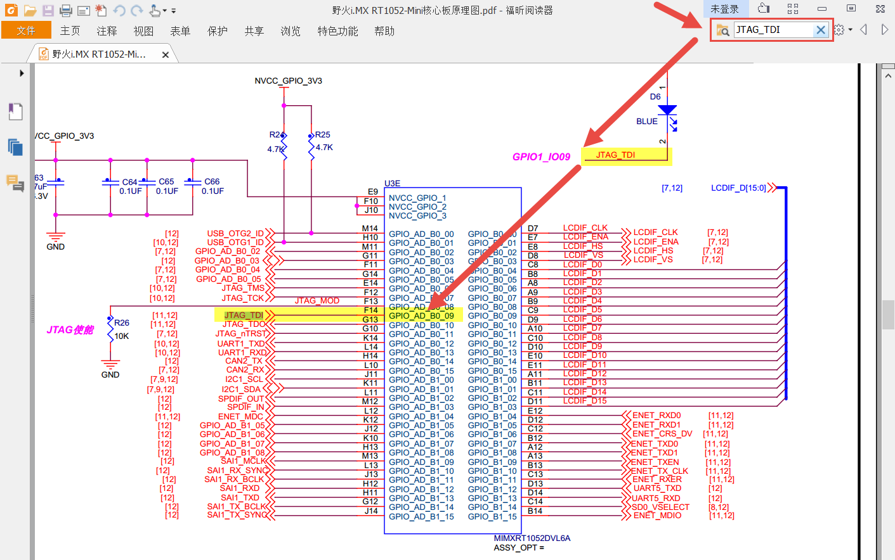
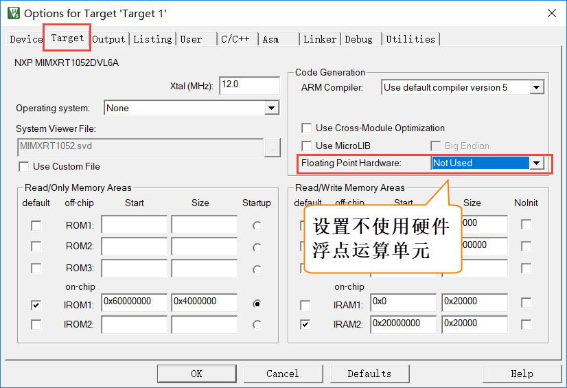

使用寄存器点亮LED灯
-------------------

本章参考资料：《IMXRT1050RM》（参考手册），学习本章时，配合《IMXRT1050RM》
“Chapter 32 General Purpose Input/Output (GPIO)”及“Chapter 34 IOMUX
Controller
(IOMUXC)”章节一起阅读，效果会更佳，特别是涉及到寄存器说明的部分。关于建立工程时使用KEIL5的基本操作，请参考前面的章节。

GPIO简介
~~~~~~~~

GPIO是通用输入输出端口的简称，简单来说就是RT1052可控制的引脚，RT1052芯片的GPIO引脚与外部设备连接起来，从而实现与外部通讯、控制以及数据采集的功能。RT1052芯片的GPIO被分成很多组，每组有32个引脚，如型号为MIMXRT1052型号的芯片有GPIO1、GPIO2至GPIO5共5组GPIO，芯片一共196个引脚，其中GPIO就占了一大部分，所有的GPIO引脚都有基本的输入输出功能。

最基本的输出功能是由RT1052控制引脚输出高、低电平，实现开关控制，如把GPIO引脚接入到LED灯，那就可以控制LED灯的亮灭，引脚接入到继电器或三极管，那就可以通过继电器或三极管控制外部大功率电路的通断。

最基本的输入功能是检测外部输入电平，如把GPIO引脚连接到按键，通过电平高低区分按键是否被按下。

GPIO框图剖析
~~~~~~~~~~~~

图 7‑1 GPIO结构框图

通过GPIO硬件结构框图，就可以从整体上深入了解GPIO外设及它的各种应用模式。该图从最右端看起，①中的就表示RT1052芯片引出的GPIO引脚，其余部件都位于芯片内部。

基本结构分析
^^^^^^^^^^^^

下面我们按图 7‑1中的编号对GPIO端口的结构部件进行说明。

PAD
''''''

PAD代表了一个RT1052的GPIO引脚。在它的左侧是一系列信号通道及控制线，如input_on控制输入开关，Dir控制引脚的输入输出方向，Data_out控制引脚输出高低电平，Data_in作为信号输入，这些信号都经过一个IOMUX的器件连接到左侧的寄存器。

另外，对于每个引脚都有很多关于属性的配置，这些配置是由图
7‑2中的框架结构实现的。

图 7‑2 PAD接口框架

①PAD引脚
*****************

框图中的最右侧的PAD同样是代表一个RT1052的引脚。

②输出缓冲区
*****************

当输出缓冲区使能时，引脚被配置为输出模式。在输出缓冲区中，又包含了如下的属性配置：

-  DSE驱动能力

    DSE可以调整芯片内部与引脚串联电阻R0的大小，从而改变引脚的驱动能力。例如，R0的初始值为260欧姆，在3.3V电压下其电流驱动能力为12.69mA，通过DSE可以把R0的值配置为原值的1/2、1/3…1/7等。

-  SRE压摆率配置

    压摆率是指电压转换速率，可理解为电压由波谷升到波峰的时间。增大压摆率可减少输出电压的上升时间。RT1052的引脚通过SRE支持低速和高速压摆率这两种配置。压摆率是大信号特性，下面的带宽是小信号特性。

-  SPEED带宽配置

    通过SPEED可以设置IO的带宽，分别可设置为50MHz、100MHz以及200MHz。带宽的意思是能通过这个IO口最高的信号频率，通俗点讲就是方波不失真，如果超过这个频率方波就变正弦波。但是这个带宽要区别于IO的翻转速率，IO的翻转速率的信号来自于GPIO这个外设，而IO的带宽只是限制了IO口引脚的物理特性，IO口的信号可以来自于内部定时器输出的PWM信号，也可以来自于GPIO翻转输出的信号，两者相比之下，PWM信号的频率是远远高于GPIO翻转输出的信号频率。况且1052没有高速GPIO，GPIO的翻转率约为10M，1060系列则有高速GPIO，GPIO翻转速率达到了逆天的150M。但要使用1060的快速GPIO，需要改用GPIO编号。

-  ODE开漏输出配置

    通过ODE可以设置引脚是否工作在开漏输出模式。在该模式时引脚可以输出高阻态和低电平，输出高阻态时可由外部上拉电阻拉至高电平。开漏输出模式常用在一些通讯总线中，如I2C。

③输入缓冲区
*****************

当输入缓冲区使能时，引脚被配置为输入模式。在输入缓冲区中，又包含了如下的属性配置

-  HYS滞后使能

    RT1052的输入检测可以使用普通的CMOS检测或施密特触发器模式（滞后模式）。施密特触发器具有滞后效应，对正向和负向变化的输入信号有不同的阈值电压，常被用于电子开关、波形变换等场合，其转换特性和对比见图
    7‑3及图 7‑4，如检测按键时，使用施密特模式即可起到消抖的功能。

.. image:: media/image3.png
   :align: center
   :alt: image3
   :name: 图6_3

图 7‑3施密特触发器的转换特性

.. image:: media/image4.png
   :align: center
   :alt: image4
   :name: 图6_4

图 7‑4 在CMOS模式和滞后模式下的接收器输出

④Pull/Keeper上下拉、保持器
**********************************

引脚的控制逻辑中还包含了上下拉、保持器的功能。芯片内部的上拉和下拉电阻可以将不确定的信号钳位在高、低电平，或小幅提高的电流输出能力，上拉提供输出电流，下拉提供输入电流。注意这些上下拉配置只是弱拉，对于类似I2C之类的总线，还是必须使用外部上拉电阻。RT1052芯片的电源模块中包含转换器，当转换器停止工作时，保持器会保持输入输出电压。

上下拉、保持器可以通过如下属性配置：

-  PUS上下拉配置

    PUS可配置项可选为100K欧下拉以及22K欧、47K欧及100K欧上拉。

-  PUE上下拉、保持器选择

    上下拉功能和保持器功能是二选一的，可以通过PUE来选择。

-  PKE上下拉、保持器配置

    上下拉功能和保持器还通过PKE来控制是否使能。

注意，当引脚被配置为输出模式时，不管上下拉、保持器是什么配置，它们都会被关闭。

IOMUX复用选择器
'''''''''''''''

继续分析图
7‑1，图中标注的第2部分IOMUX译为IO复用选择器。RT1052的芯片每个GPIO都通过IOMUX支持多种功能，例如一个IO可用于网络外设ENET的数据接收引脚，也可以被配置成PWM外设的输出引脚，这样的设计大大增加了芯片的适用性，这样可选的功能就是由IOMUX实现的。IOMUX相当于增加了多根内部信号线与IO引脚相连，最多有8根，也就是说一个IO最多可支持8种可选的功能。

IOMUX由其左侧的IOMUXC控制（C表示Controler），IOMUXC提供寄存器给用户进行配置，它又分成MUX
Mode（IO模式控制）以及Pad Settings（Pad配置）两个部分：

-  MUX Mode配置

    MUX
    Mode就是用来配置引脚的复用功能，按上面的例子，即是具体是用于网络外设ENET的数据接收，还是用于PWM外设的输出引脚，当然，也可以配置成普通的IO口，仅用于控制输出高低电平。

-  Pad Settings配置

    Pad
    Settings用于配置引脚的属性，例如驱动能力，是否使用上下拉电阻，是否使用保持器，是否使用开漏模式以及使用施密特模式还是CMOS模式等。关于属性的介绍会在后面给出，在学习各种外设时，也将会接触到这些属性在不同场合下的应用。

在IOMUXC外设中关于MUX Mode和Pad Settings寄存器命名格式见表格 7‑1。

表格 7‑1 IOMUXC寄存器命名的方式

+----------------+----------------------------+
| IOMUXC控制类型 | 寄存器名称                 |
+================+============================+
| MUX Mode       | IOMUXC_SW_MUX_CTL_PAD_XXXX |
+----------------+----------------------------+
| Pad Settings   | IOMUXC_SW_PAD_CTL_PAD_XXXX |
+----------------+----------------------------+

每个引脚都包含这两个寄存器，表中的XXXX表示引脚的名字，例如本芯片中有一个名为GPIO_AD_B0_09的引脚，编号为GPIO1.9，你可以在参考手册的IOMUXC章节中找到它的这两个寄存器：IOMUXC_SW_MUX_CTL_PAD\_
GPIO_AD_B0_09以及IOMUXC_SW_PAD_CTL_PAD\_
GPIO_AD_B0_09，以下简称MUX寄存器及PAD寄存器。根据寄存器说明即可对该引脚进行相应的配置。

IOMUXC_SW_MUX_CTL_PAD_XXXX引脚模式寄存器
***************************************************

下面以GPIO_AD_B0_09引脚为例对
MUX寄存器进行说明，该引脚相应的MUX寄存器在参考手册中的描述见图 7‑5。

图 7‑5 参考手册中对GPIO1.9引脚MUX配置寄存器的说明

可以看到，该寄存器主要有两个配置域，分别是SION和MUX_MODE，其中SION用于设置引脚在输出模式下同时开启输入通道。重点是MUX_MODE的配置，它使用3个寄存器位表示可选的ALT0~ALT7这8个模式，如ALT2模式就是用于ENET以太网外设的数据接收信号；若配置为ALT4则引脚会连接至CSI摄像头外设，作为数据信号；配置为ALT5时，该引脚则用于最基础的GPIO模式，简单地通过后面介绍的GPIO外设控制输入输出。

IOMUXC_SW_PAD_CTL_PAD_XXXX引脚属性寄存器
***************************************************

类似地，以GPIO_AD_B0_09引脚中PAD寄存器在参考手册中的描述见图 7‑6。

图 7‑6 参考手册中对GPIO1.9引脚PAD配置寄存器的说明（部分）

相对来说PAD寄存器的配置项就更丰富了，而且图中仅是该寄存器的部分说明，仔细看这些配置项，它们就是前面图
7‑2介绍的各项属性，如HYS设置使用施密特模式的滞后功能，PUS配置上下拉电阻的阻值，其它的还包含PUE、PKE、ODE、SPEED、DSE及SRE的配置。

Block外设功能控制块
'''''''''''''''''''

Block是外设功能控制块，例如具有ENET的数据接收功能的引脚，它就需要网络外设ENET的支持，具有PWM输出功能的引脚，它需要PWM外设的支持，这些外设在芯片内部会有独立的功能逻辑控制块，这些控制块通过IOMUX的复用信号与IO引脚相连。使用时通过IOMUX选择具体哪个外设连接到IO。

GPIO外设
''''''''

GPIO模块是每个IO都具有的外设，它具有IO控制最基本的功能，如输出高低电平、检测电平输入等。它也占用IOMUX分配的复用信号，也就是说使用GPIO模块功能时同样需要使用IOMUX选中GPIO外设。图中的GPIO.DR、GPIO.GDIR、GPIO.PSR等是指GPIO外设相关的控制寄存器，它们分别是数据寄存器、方向寄存器以及引脚状态寄存器，功能介绍如下：

GPIO.GDIR方向寄存器
**********************************

控制一个GPIO引脚时，要先用GDIR方向寄存器配置该引脚用于输出电平信号还是用作输入检测。典型的例子是使用输出模式可以控制LED灯的亮灭，输入模式时可以用来检测按键是否按下。

GDIR寄存器的每一个数据位代表一个引脚的方向，对应的位被设置为0时该引脚为输入模式，被设置为1时该引脚为输出模式，具体见图
7‑7。

图 7‑7 参考手册中对GDIR的寄存器说明

例如，对GPIO1的GDIR寄存器的bit3位被写入为1，那么GPIO1.3引脚的模式即为输出。

GPIO.DR数据寄存器
**********************************

DR数据寄存器直接代表了引脚的电平状态，它也使用1个数据位表示1个引脚的电平，每位用1表示高电平，用0表示低电平。DR寄存器在参考手册中的说明见图
7‑8。

图 7‑8 参考手册中对DR数据寄存器的说明

当GDIR方向寄存器设置引脚为输出模式时，写入DR数据寄存器对应的位即可控制该引脚输出的电平状态，如这时GPIO1的DR寄存器的bit3被写入为1，则引脚为输出高电平。

当GDIR方向寄存器设置引脚为输入模式时，读取DR数据寄存器对应的位即可获取该引脚当前的输入电平状态，例如这里读取GPIO1的DR寄存器的bit3，得到该位的值为0，表示当前引脚的输入状态为低电平。

GPIO.PSR引脚状态寄存器
**********************************

PSR引脚状态寄存器相当于DR寄存器的简化版，它仅在GDIR方向寄存器设置为输入模式时有效，它的每个位表示一个引脚当前的输入电平状态。PSR寄存器的权限是只读的，对它进行写操作是无效的。

特别地，当引脚被配置成输出模式时，若IOMUXC中的MUX寄存器使能了SION功能（输出通道回环至输入），可以通过PSR寄存器读取回引脚的状态值。

与其它引脚的连接
''''''''''''''''

GPIO功能框中的第5项表示另一个引脚PAD2，它与PAD1有一根信号线连接，表示部分引脚的输出可以作为另一个引脚的输入。

实验：使用寄存器点亮LED灯
~~~~~~~~~~~~~~~~~~~~~~~~~

本小节中，我们以实例讲解如何通过控制寄存器来点亮LED灯。此处侧重于讲解原理，请您直接用KEIL5软件打开我们提供的实验例程配合阅读，先了解原理，学习完本小节后，再尝试自己建立一个同样的工程。本节配套例程名称为“使用寄存器点亮LED灯”，在工程目录下找到后缀为“.uvprojx”的文件，用KEIL5打开即可。

自己尝试新建工程时，请对照查阅《新建工程—寄存器版》章节。若没有安装KEIL5软件，请参考《如何安装KEIL5》章节。

打开该工程，具体见图
7‑9，可看到一共有三个文件，分别startup_MIMXRT1052.s、MIMXRT1052.h
以及main.c，接下来我们讲会对这三个工程文件进行讲解。

图 7‑9 工程文件结构

硬件连接
^^^^^^^^

在本教程中核心板上RT1052芯片的GPIO1_IO09引脚与一个LED灯连接，这可以在核心板原理图查到，具体见图
7‑10。注意：如果以后硬件有升级，则以最新的硬件接线为主，不要纠结与具体使用的是哪个IO，重点是要掌握原理。

图 7‑10 LED灯电路连接图，摘自《野火i.MX RT1052核心板原理图》

图
7‑10表示LED灯的阳极串联一个电阻与电源3.3V相连，阴极与标号为JTAG_TDI的引脚相连，所以当JTAG_TDI引脚为低电平的时候，LED灯就会被点亮。在RT1052芯片中这个JTAG_TDI引脚同时是GPIO1_IO09引脚，即GPIO1端口编号为9的引脚。

单看LED灯部分的原理图，有时并不清楚这个JTAG_TDI引脚与电路中的其它模块是如何连接的，这时就可以在pdf软件的搜索栏输入要查询的引脚标号查看其它模块的连接了，见图
7‑11。

图 7‑11在原理图中查找引脚标号，摘自《野火i.MX RT1052核心板原理图》

这个电路模块包含了RT1052芯片的部分引脚，从中可以查询到标号为JTAG_TDI的信号直接与芯片的GPIO_AD_B0_09引脚相连，在芯片的参考手册中，就是直接用这个引脚名命名寄存器的，如它对应的MUX寄存器名为：SW_MUX_CTL_PAD_GPIO_AD_B0_09，了解这些在后续写程序的时候会方便我们查阅相关资料。

现在，我们的目标是把这个与LED灯相连的GPIO_IO09（GPIO_AD_B0_09）引脚设置成输出模式并且输出低电平，这样就能让LED灯亮起来了。

启动文件
^^^^^^^^

名为“startup_MIMXRT1052.s”的文件，它里边使用汇编语言写好了基本程序，当RT1052芯片上电启动的时候，首先会执行这里的汇编程序，从而建立起C语言的运行环境，所以我们把这个文件称为启动文件。该文件使用的汇编指令是Cortex-M7内核支持的指令，指令的说明可从《cortex_m7_trm》(Cortex-M7技术参考手册)查到。

startup_MIMXRT1052.s文件是由官方提供的，一般有需要也是在官方的基础上修改，不会自己完全重写。该文件可以从
KEIL5 安装目录找到，也可以从
固件库里面找到，找到该文件后把启动文件添加到工程里面即可。不同型号的芯片以及不同编译环境下使用的汇编文件是不一样的，但功能相同。

对于启动文件这部分我们主要总结它的功能，不详解讲解里面的代码，其功能如下：

-  初始化堆栈指针SP;

-  初始化程序计数器指针PC;

-  设置堆、栈的大小;

-  设置中断向量表的入口地址;

-  调用SystemInit() 函数配置RT1052的系统时钟。

-  设置C库的分支入口“__main”（最终用来调用main函数）;

先去除繁枝缛节，挑重点的讲，看完这部分只要大致了解芯片的启动过程即可，后面还会有专门的章节进行讲解。首先介绍在启动文件中定义的中断向量表，见代码清单
7‑1。在实际工程中阅读时，可使用编辑器的搜索(Ctrl+F)功能查找这段代码在文件中的位置。

.. code-block::
   :name: 代码清单 7‑1 启动文件中的中断向量表定义
   :caption: 代码清单 7‑1 启动文件中的中断向量表定义
   :linenos:

   __Vectors  DCD     |Image$$ARM_LIB_STACK$$ZI$$Limit| ; 栈顶
            DCD     Reset_Handler  ; Reset Handler复位中断
            DCD     NMI_Handler              ;NMI Handler
            DCD     HardFault_Handler        ;Hard Fault Handler
            ;...以下内容省略...
   __Vectors_End

这里只是截取了源代码中的一小部分，在工程中还有很长的一列清单，我们把这个清单称之为中断向量表。在内核中存在中断机制，可以让它中断当前正在执行的代码而跳转去执行紧急的事情。这就如同一个人正在阅读书籍，此时电话响起，此人中断阅读而去接听电话，内核的中断机制也是这样的。

在代码中使用DCD指令定义的这些Reset_Handler、NMI_Handler就是代表了不同的中断事件，它们实质上是一些函数名，与C语言类似，函数名就是内存地址，当中断事件产生时，内核会跳转到对应函数所在的地址执行中断处理代码。

特别地，代码中的第1行“\|Image\\$\\$ARM_LIB_STACK\\$\\$ZI\$\$Limit\|”是为C语言准备的栈顶地址（Top of Stack）。系统需要为C语言的运行提供环境，其中最重要的就是栈（Stack），它是一段内存空间，C语言代码中的局部变量就是存储在栈内的。这段定义栈顶的代码就是明确了提供给C语言的这个栈空间有多大。

在这段代码中包含了两个标号“__Vectors”和“__Vectors_End”，它们分别表示中断向量表的开头和结尾地址，也就是说，标号__Vectors表示的地址中存储了栈顶地址。

在中断向量表之后，是Reset_Handler程序，它是芯片复位后立即执行的程序，代码见代码清单
7‑2。

.. code-block::
   :name: 代码清单 7‑2复位后执行的程序
   :caption: 代码清单 7‑2复位后执行的程序
   :linenos:

   ; Reset Handler
   Reset_Handler   PROC
         EXPORT  Reset_Handler             [WEAK]
         IMPORT  SystemInit      ; 函数声明，表明这是外部函数
         IMPORT  __main          ; 函数声明，表明这是外部函数

         CPSID   I               ; 屏蔽中断
         LDR     R0, =0xE000ED08 ; 0xE000ED08是中断向量表偏移寄存器VTOR的地址
                                 ; 把该地址加载到R0
         LDR     R1, =__Vectors  ; __Vectors是前文定义的中断向量表首地址
                                 ; 把该地址加载到R1
         STR     R1, [R0]        ; 把R1中的内容加载到R0地址指定的内存中
                                 ; 即把中断向量表首地址存储到中断向量表偏移寄存器中
         LDR     R2, [R1]        ; 把R1中的数指定的地址的内容加载到R2
                                 ; 即把中断向量表首地址的内容（栈顶）加载到R2寄存器
         MSR     MSP, R2         ; 把栈顶加载到MSP，设置好SP指针                             
         LDR     R0, =SystemInit ; 加载SystemInit函数地址到R0
         BLX     R0              ; 跳转到R0地址，即调用函数SystemInit
         CPSIE   i               ; 取消屏蔽中断
         LDR     R0, =__main     ; 加载__main函数地址到R0
         BX      R0              ; 跳转到R0地址，即调用函数__main
         ENDP

开头的是程序注释，在汇编里面注释用的是“;”，相当于 C 语言的“//”注释符

第2行是定义了一个子程序：Reset_Handler。PROC
是子程序定义伪指令。这里就相当于C语言里定义了一个函数，函数名为Reset_Handler。

第3行 EXPORT 表示 Reset_Handler
这个子程序可供其他模块调用。相当于C语言的函数声明。关键字[WEAK]
表示弱定义，如果编译器发现在别处定义了同名的函数，则在链接时用别处的地址进行链接，如果其它地方没有定义，编译器也不报错，以此处地址进行链接，这就正好体现了弱定义的弱。

第4行和第5行 IMPORT 说明 SystemInit 和__main
这两个标号在其他文件，在链接的时候需要到其他文件去寻找。相当于C语言中，从其它文件引入函数声明。以便下面对外部函数进行调用。

SystemInit
需要由我们自己实现，即我们要编写一个具有该名称的函数，用来初始化 RT1052
芯片系统，如芯片内的浮点运算单元、系统定时器、看门狗以及指令缓存，一般来说可在此处初始化芯片的基础功能。使用固件库编程的时候，SystemInit这个函数在固件库文件system_MIMXRT1052.c文件中由NXP实现。

\__main
其实不是我们定义的(不要与C语言中的main函数混淆)，当编译器编译时，只要遇到这个标号就会定义这个函数，该函数的主要功能是：负责初始化栈、堆，配置系统环境，准备好C语言并在最后跳转到用户自定义的
main 函数，从此来到 C 的世界。

第7行是内核真正执行的第一条指令，它首先屏蔽了所有中断，防止内核还没准备好就产生中断而导致错误。

第8至16行主要就是放置向量表及设置栈顶，其中0xE000ED08是内核的中断向量表偏移寄存器（VTOR），代码把标号__Vectors表示的地址存储到了中断向量偏移寄存器中，当中断事件产生时，内核就会先从VTOR找到向量表，然后再跳转到中断处理函数。另外还把栈顶地址加载到了MSP寄存器作为栈顶。

第17行把 SystemInit 的地址加载到寄存器 R0。

第18行程序跳转到 R0 中的地址执行程序，即执行SystemInit函数的内容。

第19行取消屏蔽中断，也就是说程序执行到此处时，内核已经做好了处理中断的准备。

第20行把__main 的地址加载到寄存器 R0。

第21行程序跳转到 R0
中的地址执行程序，即执行__main函数，执行完毕之后就去到我们熟知的 C
世界，进入main函数。

第22行表示子程序的结束。

总之，看完这段代码后，了解到如下内容即可：我们需要在外部定义一个SystemInit函数设置RT1052的时钟；RT1052上电后，会执行SystemInit函数，最后执行我们C语言中的main函数。

MIMXRT1052.h文件
^^^^^^^^^^^^^^^^

看完启动文件，那我们立即写SystemInit和main函数吧？别着急，定义好了SystemInit函数和main我们又能写什么内容？连接LED灯的GPIO引脚，是要通过读写寄存器来控制的，就这样空着手，如何控制寄存器。在上一章，我们知道寄存器就是特殊的内存空间，可以通过指针操作访问寄存器。所以此处我们根据RT1052的存储器映射先定义好各个寄存器的地址，把这些地址定义都统一写在MIMXRT1052.h文件中，见代码清单
7‑3。

.. code-block:: c
   :name: 代码清单 7‑3 外设地址定义
   :caption: 代码清单 7‑3 外设地址定义
   :linenos:

   /* 地址可查阅 参考手册-GPIO章节-GPIO Memory Map */
   /* GPIO1外设基地址 */
   #define GPIO1_BASE        (unsigned int)(0x401B8000u)

   /* GPIO1寄存器地址,强制转换成指针 */
   #define GPIO1_DR            *(unsigned int*)(GPIO1_BASE+0x00)
   #define GPIO1_GDIR          *(unsigned int*)(GPIO1_BASE+0x04)
   #define GPIO1_PSR           *(unsigned int*)(GPIO1_BASE+0x08)
   #define GPIO1_ICR1          *(unsigned int*)(GPIO1_BASE+0x0C)
   #define GPIO1_ICR2          *(unsigned int*)(GPIO1_BASE+0x10)
   #define GPIO1_IMR           *(unsigned int*)(GPIO1_BASE+0x14)
   #define GPIO1_ISR           *(unsigned int*)(GPIO1_BASE+0x18)
   #define GPIO1_EDGE_SEL      *(unsigned int*)(GPIO1_BASE+0x1C)

   /* 地址可查阅 参考手册-IOMUXC章节-IOMUXC Memory Map/Register Definition */
   /* IOMUXC基地址 */
   #define IOMUXC_BASE         (unsigned int)(0x401F8000u)

   /* MUX模式选择寄存器 IOMUXC_SW_MUX_CTL_PAD_GPIO_AD_B0_09 ,强制转换成指针*/
   #define IOMUXC_MUX_GPIO_AD_B0_09   *(unsigned int*)(IOMUXC_BASE + 0xE0 )

   /* PAD属性设置寄存器 IOMUXC_SW_PAD_CTL_PAD_GPIO_AD_B0_09 ,强制转换成指针*/
   #define IOMUXC_PAD_GPIO_AD_B0_09   *(unsigned int*)(IOMUXC_BASE + 0x2D0 )

   /* 地址可查阅 参考手册-CCM章节-CCM Memory Map/Register Definition */
   /* 时钟控制外设基地址 */
   #define CCM_BASE            (unsigned int)(0x400FC000u)

   /* 时钟配置寄存器CCM_CCGR1地址 */
   #define CCM_CCGR1           *(unsigned int*)(CCM_BASE + 0x6C)

GPIO外设的地址跟上一章讲解的相同，不过此处把寄存器的地址值都直接强制转换成了指针，方便使用。代码的最后两段是CCM外设寄存器的地址定义，CCM外设是用来设置时钟的，以后我们会详细分析，本实验中只要了解到使用GPIO外设必须开启它的时钟即可。

main文件
^^^^^^^^

    现在就可以开始编写程序了，在main文件中先编写一个 main
    函数，里面什么都没有，暂时为空。

.. code-block:: c
   :name: main文件
   :caption: main文件
   :linenos:

   int main (void)
   {
   }

只写main函数，如果此时直接编译的话，会出现如下错误：
“Error: L6218E: Undefined symbol SystemInit (referred from
startup_mimxrt1052.o).”
错误提示SystemInit 没有定义。从分析启动文件时我们知道，Reset_Handler
调用了该函数用来初始化RT1052芯片的基础功能，如浮点运算单元、系统定时器、看门狗以及指令缓存，为了简单起见，我们在
main 文件里面定义一个 SystemInit
空函数，什么也不做，为的是骗过编译器，把这个错误去掉。也就是说，不使用这些基础功能，我们也能控制芯片完成点亮LED灯的任务，我们在main中添加SystemInit空函数：

.. code-block:: c
   :name: main文件2
   :caption: main文件2
   :linenos:

   // 函数为空，目的是为了骗过编译器不报错
   void SystemInit(void)
   {
   }

这时再编译就没有错了，完美解决。

注意，由于我们在这里没有初始化浮点运算单元，所以请确认工程选项中的浮点运算单元的功能已关闭，见图
7‑12，不关闭该功能编译不会出错，但后程序是无法正常运行的。

图 7‑12关闭浮点运算单元

接下来在main函数中添加代码，对寄存器进行控制，有关GPIO寄存器的详细描述请阅读《IMXRT1050RM》（参考手册）中IOMUXC以及GPIO章节的寄存器描述部分。

IOMUX复用模式
'''''''''''''

由于RT1052芯片每个引脚都连接到多个片上外设，有多种功能，使用时要设置好它与哪个外设相连，也就是说选择引脚的复用模式。

控制LED灯时，只需要控制引脚简单地输出高低电平，所以使用GPIO外设功能即可。在参考手册中找到与该LED灯连接的引脚GPIO_AD_B0_09对应的MUX寄存器
SW_MUX_CTL_PAD_GPIO_AD_B0_09的说明，见图 7‑13。

图 7‑13 SW_MUX_CTL_PAD_GPIO_AD_B0_09寄存器说明《IOMUX
Controller(IOMUXC)》章节

可以看到，寄存器的MUX_MODE域列出了这个引脚的8个可选功能，把该域设置成0b101即十进制数5即可选中ATL5选项，表示GPIO1_IO09，这个就是引脚的GPIO功能。寄存器还有一个SION配置域，使能了SION的话可以通过GPIO的PSR寄存器读取回引脚的状态，本应用中不需要，所以SION域配置为0不使用即可。对于寄存器的其它部分都是保留域，即芯片厂商并未给它们设置功能，所以都设置成0即可。

也就是说对这个引脚的MUX寄存器，我们给它赋值为5即可控制为GPIO_IO09功能。使用代码设置的方式见代码清单
7‑4。

.. code-block:: c
   :name: 代码清单 7‑4 配置IOMUX复用模式
   :caption: 代码清单 7‑4 配置IOMUX复用模式
   :linenos:

   /* 设置MUX寄存器为0x05，表示把引脚用于普通GPIO */
   IOMUXC_MUX_GPIO_AD_B0_09 = (unsigned int)0x05; 

IOMUXC\_ MUX
\_GPIO_AD_B0_09是前面在MIMXRT1052.h头文件定义好的指针，该指针指向GPIO_AD_B0_09引脚（即GPIO1_IO09）的MUX寄存器，并且对该指针进行了“
\* ”取值操作，所以这里只要简单地对IOMUXC\_ MUX
\_GPIO_AD_B0_09直接赋值为(unsigned
int)0x05即可(程序里习惯使用16进制表示)，其中的unsigned
int强制转换是确保它是一个32位的无符号数，与寄存器的数据类型对应。

PAD属性配置
'''''''''''

由于每个引脚还有多种属性，所以控制时还要根据需求配置好各种属性。在参考手册中找到与该LED灯连接的引脚GPIO_AD_B0_09对应的PAD寄存器
SW_PAD_CTL_PAD_GPIO_AD_B0_09的说明，见图 7‑14。

图 7‑14 SW_PAD_CTL_PAD_GPIO_AD_B0_09寄存器说明《IOMUX
Controller(IOMUXC)》章节

PAD属性配置寄存器包含输入输出属性、上拉保持器的配置，由于控制LED灯时使用的是输出功能，所以只需要配置输出属性和上拉保持器即可。

SRE压摆率配置
*****************

控制LED灯时，对压摆率没什么要求，所以慢速和快速都可以。在本实验中PAD寄存器的位设置为SRE=0b0，即慢压摆率。

DSE驱动能力
*****************

DSE可以控制串联一个电阻，可选阻值为R0(260欧姆)、R0/2…R0/7，电阻值的大小会影响通过管脚电流的大小从而影响LED灯的亮度。在本实验中，使用不同阻值时对LED亮度的影响人眼分辨不出来，所以也是随便选择一个即可，这里设置为DSE=0b110，即阻值为R0/6。

SPEED带宽配置
*****************

带宽是指引脚支持高低电平切换的最高频率，本实验控制LED灯对于带宽也没有要求，此处直接配置为SPEED=0b10即100MHz。

ODE开漏输出配置
*****************

开漏类型不能直接输出高电平，要输出高电平还要在芯片外部接上拉电阻，不符合我们的硬件设计，所以此处我们配置ODE=0b0，不使用开漏模式。

PKE、PUE及PUS上下拉、保持器配置
**********************************

引脚还包含上下拉和保持器的配置，使用上下拉可以在没控制输出的时候引脚固定在高电平或低电平。在本实验中，控制LED灯最终会把引脚配置成输出模式，在输出模式下不管上下拉及保持器被配置成什么模式，它们都会被自动关闭。也就是说，在控制DR寄存器输出时，引脚会无视上下拉而根据DR寄存器的值输出电平。

为简单起见，控制LED灯时我们直接关闭上下拉及保持器，即PKE=0b0。而PUE用于在PKE使能的时候选择使用上下拉还是保持器，PUS用于工作于上下拉模式时（PKE使能，PUE为上下拉时）选择使用上拉还是下拉以及对应的电阻。因为关闭了上下拉及保持器，所以PUE和PUS为任意值都无影响，此处直接赋值为PUE=0b0，
PUS=0b00。

HYS滞后配置
*****************

这个是设置是否使用施密特触发器的，只对输入有效，所以这里配置HYS=0b0，不使用该功能。

综上所述，在本实验控制LED灯时，对这个PAD寄存器的配置如下：

+-------+--------+---------------------+---------------------------------------+
| 位号  | 配置域 | 配置值(二进制)      | 功能                                  |
+=======+========+=====================+=======================================+
| 0     | SRE    | 0                   | 慢压摆率                              |
+-------+--------+---------------------+---------------------------------------+
| 1-2   | -      | 00                  | -                                     |
+-------+--------+---------------------+---------------------------------------+
| 3-5   | DSE    | 110                 | 串联电阻R0/6                          |
+-------+--------+---------------------+---------------------------------------+
| 6-7   | SPEED  | 10                  | 带宽100MHz                            |
+-------+--------+---------------------+---------------------------------------+
| 8-10  | -      | 000                 | -                                     |
+-------+--------+---------------------+---------------------------------------+
| 11    | ODE    | 0                   | 不使用开漏模式                        |
+-------+--------+---------------------+---------------------------------------+
| 12    | PKE    | 0                   | 关闭上下拉、保持器                    |
+-------+--------+---------------------+---------------------------------------+
| 13    | PUE    | 0                   | -  关闭上下拉、保持器后，任意值无影响 |
+-------+--------+---------------------+---------------------------------------+
| 14-15 | PUS    | 00                  | -  关闭上下拉、保持器后，任意值无影响 |
+-------+--------+---------------------+---------------------------------------+
| 16    | HYS    | 0                   | 不使用滞后功能                        |
+-------+--------+---------------------+---------------------------------------+
| 17-31 | -      | 0000 0000 0000 0000 | -                                     |
+-------+--------+---------------------+---------------------------------------+

把上述配置组合，得到二进制数0b0000 0000 0000 1011
0000，化成十六进制数即为0x000B0，也就是说，我们只要给PAD寄存器赋值为0x000B0即可得到以上配置，写成代码的形式如下，见代码清单
7‑5。

.. code-block:: c
   :name: 代码清单 7‑5 配置引脚的PAD寄存器
   :caption: 代码清单 7‑5 配置引脚的PAD寄存器
   :linenos:

   /* 设置PAD寄存器控制引脚的属性 */
   IOMUXC_PAD_GPIO_AD_B0_09 = (unsigned int)0x000B0;

   /*  属性配置说明:
   十六进制数0x000B0 = 二进制数0b0000 0000 0000 1011 0000
   */

   /*  bit0:         SRE:  0b0       压摆率: 慢压摆率
      bit1~bit2:    -:    0b00      寄存器保留项
      bit3~bit5:    DSE:  0b110     驱动强度: R0/6 （仅作为输出时有效 ）
      bit6~bit7:    SPEED:0b10      带宽 : medium(100MHz)
      bit8~bit10:   -:    0b000     寄存器保留项
      bit11:        ODE:  0b0       开漏配置: 关闭
                                    （开漏高阻态常用于总线配置，如I2C ）
      bit12:        PKE:  0b0       拉/保持器配置: 关闭
      bit13:        PUE:  0b0       拉/保持器选择: 关闭了上下拉及保持器，任意值无效
      bit14~bit15:  PUS:  0b00      上拉/下拉选择: 关闭了上下拉及保持器，任意值无效
      bit16:        HYS:  0b0       滞回器配置: 关闭
                                 （仅输入时有效，施密特触发器，使能后可以过滤输入噪声）
      bit17~bit31:  -:    0b0       寄存器保留项
   */

类似地，IOMUXC_PAD_GPIO_AD_B0_09也是前面在MIMXRT1052.h头文件定义好的指针，它指向GPIO_AD_B0_09（即GPIO1_09）引脚PAD寄存器，此处直接对IOMUXC_PAD_GPIO_AD_B0_09赋值为计算好的0x070B0即可得到需要的配置。

控制引脚方向
''''''''''''

控制LED灯需要把GPIO引脚设置为输出模式，这需要配置GPIO外设的GDIR方向寄存器，它在参考手册中的说明见图
7‑15。

图 7‑15 GPIO的GDIR方向寄存器的说明《General Purpose
Input/Output(GPIO)》章节

GDIR寄存器中的每个数据位控制GPIO端口其中一个引脚的方向，为1时表示输出，为0时表示输入。

本实验中要控制的引脚GPIO_AD_B0_09（GPIO1_IO09）是GPIO1端口中编号为9的引脚，所以控制时把GPIO1对应的GDIR寄存器的bit9赋值为1，即可把它设置为输出模式，使用代码实现具体见代码清单
7‑6。

.. code-block:: c
   :name: 代码清单 7‑6 设置引脚为输出模式
   :caption: 代码清单 7‑6 设置引脚为输出模式
   :linenos:

   /* 设置GPIO1_09引脚的方向，使用输出模式 */
   GPIO1_GDIR |= (unsigned int)(1<<9);

代码中的说明如下：

-  GPIO1_GDIR在MIMXRT1052.h头文件已经定义好，它表示的就是GPIO1端口的GDIR寄存器指针，并且包含“\* ”取指针操作。

-  (1<<9)是一个bit9为1的数字，即0x200，通常来说在代码中不会写0x200这样的结果数字，而是用(1<<9)这种运算来表示。如bit10为1的数字，则用(1<<10)表示。

-  使用“\|=”这种位操作方法是为了避免影响到寄存器中的其它位。这种操作的等效代码是

.. code-block::

   GPIO1_GDIR = GPIO1_GDIR | (unsigned int)(1<<9)，

也就是说它会先把GDIR寄存器原来的值读取回来，然后与(1<<9)进行位或运算，再把结果赋值给GDIR。要这样操作的原因是寄存器不能按位读写，假如我们直接给GDIR寄存器赋值：

.. code-block:: c

   GPIO1_GDIR = (unsigned int)(1<<9);

那么这代码执行后GPIO1_GDIR的值就变为0x00000200，寄存器的bit9为1，貌似符合我们的预期，但要注意的是GDIR寄存器是同时控制GPIO端口的32个引脚的，经过这样赋值后就只有bit9为1，其余的寄存器位均为0了，假如GDIR的bit0、bit2等寄存器位原值为1，即原本为输出方向，经过这样粗暴的赋值方式就会把它们改为输入方向了。而使用“\|=”只会修改bit9，其它寄存器位不变。

控制引脚输出电平
''''''''''''''''

设置好引脚方向后，可以通过DR数据寄存器控制引脚的电平，它在参考手册中的说明见图
7‑16。

图 7‑16 GPIO的DR数据寄存器的说明《General Purpose
Input/Output(GPIO)》章节

类似地，DR数据寄存器中的每个数据位控制GPIO端口其中一个引脚的电平，为1时表示高电平，为0时表示低电平。

在本实验中使用GPIO_IO09连接LED灯，控制时把GPIO1对应的DR寄存器的bit9赋值为1可输出高电平，LED灯灭，给bit9赋值为0可输出低电平，LED灯亮，使用代码实现具体见代码清单
7‑7。

.. code-block:: c
   :name: 代码清单 7‑7控制引脚输出电平
   :caption: 代码清单 7‑7控制引脚输出电平
   :linenos:

   /* 控制引脚为高电平，关闭LED灯 */
   GPIO1_DR |= (unsigned int)(1<<9);

   /* 控制引脚为低电平，点亮LED灯 */
   GPIO1_DR &=~ (unsigned int)(1<<9);

跟GDIR寄存器的操作方式类似，代码中使用了“&=~”（清0）、“\|=”（置位）这些位操作方法来实现对寄存器的写操作，避免影响到寄存器中的其它位。

开启外设时钟
''''''''''''

设置完GPIO的引脚，控制电平输出，以为现在总算可以点亮 LED
了吧，其实还差最后一步。因为RT1052外设很多，为了降低功耗，每个外设都对应着一个时钟，在芯片刚上电的时候这些时钟都是被关闭的，如果想要外设工作，必须把相应的时钟打开。

RT1052的所有外设的时钟由一个专门的外设来管理，叫 CCM（Clock Controler
Module），CCM在《IMXRT1050RM》（参考手册）的第18章有详细的讲解。

有关RT1052的时钟系统我们在往后的CCM章节会详细的讲解，此处我们只需知道在访问GPIO外设的寄存器之前，要先开启它的时钟。

本实验要控制GPIO1相关的引脚，就需要开启GPIO1时钟，即要对CCM_CCGR1寄存器进行配置，该寄存器的在参考手册的说明具体见图
7‑17。

图 7‑17 CCM_CCGR1寄存器说明《Clock Controller Module（CCM）》章节

从图中可以了解到CCM_CCGR1寄存器可以配置很多外设的时钟，如bit28~bit29配置CSU外设时钟，bit26~27配置GPIO1外设时钟，每个配置域包含2位。

这2个位包含3个有效选择，0b00表示该时钟关闭，0b01和0b11表示在RT1052芯片的RUN模式下都开启该时钟。其中RUN、WAIT、STOP是RT1052芯片的运行模式，目前我们只关注RUN模式即可，它指芯片的正常运行状态。

也就是说，我们把CCM_CCGR1寄存器的bit26~bit27设置为0b01或0b11都可以开启GPIO1端口的时钟，本实验把它设置为0b01，具体代码见代码清单
7‑8。

.. code-block:: c
   :name: 代码清单 7‑8 开启端口时钟
   :caption: 代码清单 7‑8 开启端口时钟
   :linenos:

   /* 开启GPIO1端口的时钟 */

   /* 清空控制GPIO1端口时钟的bit26、bit27 */
   CCM_CCGR1 &= ~(unsigned int)(3<<26);

   /* 把bit26、bit27设置为0b01，即开启GPIO1时钟 */
   CCM_CCGR1 |= (unsigned int)(1<<26);

代码说明如下：

-  CCM_CCGR1在MIMXRT1052.h头文件已经定义好，它表示的就是CCM的CCGR1寄存器指针，并且包含“\* ”取指针操作。

-  (3<<26)表示十六进制数0x0c000000，它的bit26~bit27这2位为1，使用这样的数值与CCM_CCGR1寄存器进行“&=~”操作可以把它的bit26、bit27进行清零，其它位的值不变。代码中(3<<26)的3就是二进制值0b11，2个数字1表示要清空2个寄存器位，26表示bit26，类似地，假如要清除寄存器的bit10、bit11、bit12以及bit13这4位，操作时就使用二进制数0b1111<<10即（0x0F<<10）参与“&=~”运算。

-  bit26、bit27被清零后，使用(1<<26)与CCM_CCGR1寄存器进行“\|=”，把它的bit26、bit27位设置为0b01，即开启GPIO1端口的时钟，然后就可以对GPIO1端口进行操作了。

水到渠成
''''''''

开启时钟，配置引脚复用模式，配置引脚属性，控制电平，经过这几步，我们总算可以控制一个
LED了。现在我们完整组织下用 RT1052控制一个 LED 的代码，见代码清单 7‑9。

.. code-block:: c
   :name: 代码清单 7‑9 main文件中控制LED灯的代码
   :caption: 代码清单 7‑9 main文件中控制LED灯的代码
   :linenos:

   /**
   使用寄存器的方法点亮LED灯
   */
   #include "MIMXRT1052.h"

   /**
   *   主函数
   */
   int main(void)
   {
      /* 开启GPIO1端口的时钟 */

      /* 清空控制GPIO1端口时钟的bit26、bit27 */

      CCM_CCGR1 &= ~(unsigned int)(3<<26);

      /* 把bit26、bit27设置为0b01，即开启GPIO1时钟 */
      CCM_CCGR1 |= (unsigned int)(1<<26);

      /* 设置MUX寄存器为0x05，表示把引脚用于普通GPIO */
      IOMUXC_MUX_GPIO_AD_B0_09 = (unsigned int)0x05;

      /* 设置PAD寄存器控制引脚的属性 */
      IOMUXC_PAD_GPIO_AD_B0_09 = (unsigned int)0x070B0;

      /*  属性配置说明:
         十六进制数0x070B0 = 二进制数0b0000 0111 0000 1011 0000
      */

      /*  bit0:         SRE:  0b0       压摆率: 慢压摆率
         bit1~bit2:    -:    0b00      寄存器保留项
         bit3~bit5:    DSE:  0b110     驱动强度: R0/6 （仅作为输出时有效 ）
         bit6~bit7:    SPEED:0b10      带宽 : medium(100MHz)
         bit8~bit10:   -:    0b000     寄存器保留项
         bit11:        ODE:  0b0       开漏配置: 关闭
                                       （开漏高阻态常用于总线配置，如I2C ）
         bit12:        PKE:  0b1       拉/保持器配置: 使能
         bit13:        PUE:  0b1       拉/保持器选择: 上下拉
         bit14~bit15:  PUS:  0b01      上拉/下拉选择: 47K欧上拉
         bit16:        HYS:  0b0       滞回器配置: 关闭
                                 （仅输入时有效，施密特触发器，使能后可以过滤输入噪声）
         bit17~bit31:  -:    0b0       寄存器保留项
      */

      /* 设置GPIO1_09引脚的方向，使用输出模式 */
      GPIO1_GDIR |= (unsigned int)(1<<9);

      /* 控制引脚为低电平，点亮LED灯 */
      GPIO1_DR &= ~(unsigned int)(1<<9);

      while (1);

   }

   // 函数为空，目的是为了骗过编译器不报错
   void SystemInit(void)
   {
   }

注意控制时要先通过CCM_CCGR1寄存器使能GPIO1的时钟，再对GPIO1的寄存器进行操作，否则操作是无效的。

在本章节中，要求完全理解MIMXRT1052.h文件及main文件的内容(CCM相关的除外)。

下载验证
^^^^^^^^

把编译好的程序下载到开发板并复位，可看到核心板上的LED灯被点亮。
