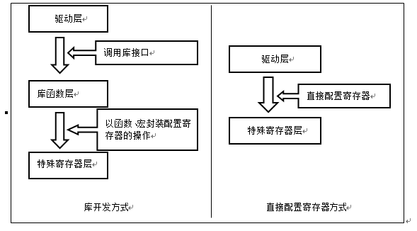
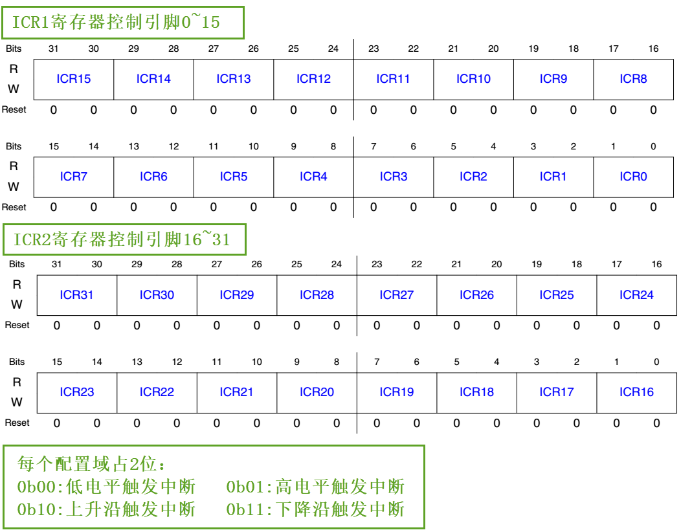

自己写库—构建库函数雏形
-----------------------

本章参考资料：《IMXRT1050RM》（参考手册）。

虽然我们上面用寄存器编程的方法点亮了
LED，乍看一下好像代码也很简单，但是我们别侥幸以后就可以一直用寄存器开发。在用寄存器点亮
LED 的时候，我们会发现 RT1052 的寄存器都是 32
位的，每次配置的时候都要对照着《IMXRT1050RM》（参考手册）中寄存器的说明，然后根据说明对每个控制的寄存器位写入特定参数，因此在配置的时候非常容易出错，而且代码还很不好理解，不便于维护。所以学习
RT1052
最好的方法是用官方提供的固件库来开发，然后在固件库的基础上了解底层，学遍所有寄存器。

什么是固件库
~~~~~~~~~~~~

以上所说的固件库是指“RT1052函数库”，它是由NXP公司针对RT1052提供的函数接口，即API
(Application Program
Interface)，开发者可调用这些函数接口来配置RT1052的寄存器，使开发人员得以脱离最底层的寄存器操作，有开发快速，易于阅读，维护成本低等优点。

当我们调用库API的时候不需要挖空心思去了解库底层的寄存器操作，就像当年我们刚开始学习C语言的时候，用prinft()函数时只是学习它的使用格式，并没有去研究它的源码实现，但需要深入研究的时候，经过千锤百炼的库源码就是最佳学习范例。

实际上，库是架设在寄存器与用户驱动层之间的代码，向下处理与寄存器直接相关的配置，向上为用户提供配置寄存器的接口。库开发方式与直接配置寄存器方式的区别见图
8‑1。

图 8‑1 开发方式对比图

为什么采用库来开发及学习？
~~~~~~~~~~~~~~~~~~~~~~~~~~

在以前8位机时代的程序开发中，一般直接配置芯片的寄存器，控制芯片的工作方式，如中断，定时器等。配置的时候，常常要查阅寄存器表，看用到哪些配置位，为了配置某功能，该置1还是置0。这些都是很琐碎的、机械的工作，因为8位机的软件相对来说较简单，而且资源很有限，所以可以直接配置寄存器的方式来开发。

对于RT1052，因为外设资源丰富，带来的必然是寄存器的数量和复杂度的增加，这时直接配置寄存器方式的缺陷就突显出来了：

(1) 开发速度慢

(2) 程序可读性差

(3) 维护成本高

这些缺陷直接影响了开发效率，程序维护成本，交流成本。库开发方式则正好弥补了这些缺陷。

而坚持采用直接配置寄存器的方式开发的程序员，会列举以下原因：

(1) 具体参数更直观

(2) 程序运行占用资源少

相对于库开发的方式，直接配置寄存器方式生成的代码量的确会少一点，但因为RT1052有充足的资源，权衡库的优势与不足，绝大部分时候，我们愿意牺牲一点CPU资源，选择库开发。一般只有在对代码运行时间要求极苛刻的地方，才用直接配置寄存器的方式代替，如频繁调用的中断服务函数。

对于库开发与直接配置寄存器的方式，就好比编程是用汇编好还是用 C
好一样。在MCU领域刚推出函数库开发的方式时引起程序员的激烈争论，但是，各种厂商对函数库的完善与大家对库的了解，更多的程序员选择了库开发。而且芯片厂商推出的函数库一般会注重对产品的兼容性，在同系列甚至跨系列的产品中函数接口大部分保持不变，使得应用层的程序在不同的芯片间移植非常便捷，对于开发人员来说，掌握了一套函数库的开发模式就可以说是掌握了整个系列芯片的开发。

用库来进行开发，市场已有定论，用户群说明了一切，但对于RT1052的学习仍然有人认为用寄存器好，而且汇编不是还没退出大学教材么？认为这种方法直观，能够了解到是配置了哪些寄存器，怎样配置寄存器。事实上，库函数的底层实现恰恰是直接配置寄存器方式的最佳例子，它代替我们完成了寄存器配置的工作，而想深入了解芯片是如何工作的话，只要直接查看库函数的最底层实现就能理解，相信你会为它严谨、优美的实现方式而陶醉，要想修炼C语言，就从固件库开始吧。所以在以后的章节中，使用固件库编程是我们的重点，而且我们通过讲解库函数的实现去高效地学习RT1052的寄存器，并不至于因为用库学习，就不会用寄存器控制RT1052芯片。

实验：构建库函数雏形
~~~~~~~~~~~~~~~~~~~~

虽然库的优点多多，但很多人对库还是很忌惮，因为一开始用库的时候有很多代码，很多文件，不知道如何入手。不知道您是否认同这么一句话：一切的恐惧都来源于认知的空缺。我们对库忌惮那是因为我们不知道什么是库，不知道库是怎么实现的。

接下来，我们在寄存器点亮 LED
的代码上继续完善，把代码一层层封装，实现库的最初的雏形，相信经过这一步的学习后，您对库的运用会游刃有余。这里我们只讲如何实现GPIO函数库，其他外设的我们直接参考固件库学习即可，不必自己写。

下面请打开本章配套例程“自己写库—构建库函数雏形”来阅读理解，该例程是在上一章的基础上修改得来的。

修改寄存器地址封装
^^^^^^^^^^^^^^^^^^

上一章中我们在操作寄存器的时候，操作的都是寄存器的绝对地址，如果每个外设寄存器都这样操作，那将非常麻烦。我们考虑到外设寄存器的地址都是基于外设基地址的偏移地址，都是在外设基地址上逐个连续递增的，每个寄存器占
32
个字节，这种方式跟结构体里面的成员类似。所以我们可以定义一种外设结构体，结构体的地址等于外设的基地址，结构体的成员等于寄存器，成员的排列顺序跟寄存器的顺序一样。这样我们操作寄存器的时候就不用每次都找到绝对地址，只要知道外设的基地址就可以操作外设的全部寄存器，即操作结构体的成员即可。

在工程中的“MIMXRT1052.h”文件中，我们使用结构体封装GPIO外设的寄存器，具体见代码清单
8‑1。结构体成员的顺序按照寄存器的偏移地址从低到高排列，成员类型跟寄存器类型一样。

.. code-block:: c
   :name: 代码清单 8‑1 封装GPIO寄存器列表
   :caption: 代码清单 8‑1 封装GPIO寄存器列表
   :linenos:

   /* 寄存器的值常常是芯片外设自动更改的，
   * 即使CPU没有执行程序，也有可能发生变化
   * 编译器有可能会对没有执行程序的变量进行优化
   */

   /* volatile表示易变的变量，防止编译器优化，*/
   #define  __IO  volatile        /* 可读写，一般用于定义有可读写权限的寄存器*/
   #define  __I   volatile const  /* 只读，一般用于定义只读权限的寄存器 */

   /* 使用更简短直观的方式来定义无符号32、16、8位变量 */
   typedef unsigned int uint32_t;
   typedef unsigned short uint16_t;
   typedef unsigned char uint8_t;

   /* GPIO 寄存器结构体 */
   typedef struct {
      __IO uint32_t DR;         /* DR数据寄存器，           地址偏移: 0x0 */
      __IO uint32_t GDIR;       /* GDIR方向寄存器，         地址偏移: 0x4 */
      __I  uint32_t PSR;        /* PSR状态寄存器，            地址偏移: 0x8 */
      __IO uint32_t ICR1;       /* ICR1中断配置寄存器1,      地址偏移: 0xC */
      __IO uint32_t ICR2;       /* ICR2中断配置寄存器2,      地址偏移: 0x10 */
      __IO uint32_t IMR;        /* IMR中断掩码寄存器,        地址偏移: 0x14 */
      __IO uint32_t ISR;        /* ISR中断状态寄存器,        地址偏移: 0x18 */
      __IO uint32_t EDGE_SEL;   /* EDGE_SEL边沿选择寄存器， 地址偏移: 0x1C */
   } GPIO_Type;

这段代码在结构体成员前增加了一个“__IO”或“__I”前缀，它们的原型在这段代码的开头，其中“__IO”代表了C语言中的关键字“volatile”，在C语言中该关键字用于修饰易变的变量，要求编译器不要优化，“__I”则代表“volatile
const”在“__IO”的基础上增加不可修改的属性。这些结构体内的成员，都代表着寄存器，而寄存器很多时候是由外设或RT1052芯片状态修改的，也就是说即使CPU不执行代码修改这些变量，变量的值也有可能被外设修改、更新，所以每次使用这些变量的时候，我们都要求CPU去该变量的地址重新访问。若没有这个关键字修饰，在某些情况下，编译器认为没有代码修改该变量，就直接从CPU的某个缓存获取该变量值，这时可以加快执行速度，但该缓存中的是陈旧数据，与我们要求的寄存器最新状态可能会有出入。

定义访问外设的结构体指针
^^^^^^^^^^^^^^^^^^^^^^^^

以结构体的形式定义好了外设寄存器后，使用结构体前还需要给结构体的首地址赋值，才能访问到需要的寄存器。为方便操作，我们给每个外设都定义好指向它地址的结构体指针，具体见代码清单
8‑2。

.. code-block:: c
   :name: 代码清单 8‑2 指向外设首地址的结构体指针
   :caption: 代码清单 8‑2 指向外设首地址的结构体指针
   :linenos:

   /* 地址可查阅 参考手册-GPIO章节-GPIO Memory Map */
   /* GPIO外设基地址 */
   #define GPIO1_BASE        (unsigned int)(0x401B8000u)
   #define GPIO2_BASE        (unsigned int)(0x401BC000u)
   #define GPIO3_BASE        (unsigned int)(0x401C0000u)
   #define GPIO4_BASE        (unsigned int)(0x401C4000u)
   #define GPIO5_BASE        (unsigned int)(0x400C0000u)
   
   /* 定义GPIO1-5 寄存器结构体指针 */
   #define GPIO1          ((GPIO_Type *)GPIO1_BASE)
   #define GPIO2          ((GPIO_Type *)GPIO2_BASE)
   #define GPIO3          ((GPIO_Type *)GPIO3_BASE)
   #define GPIO4          ((GPIO_Type *)GPIO4_BASE)
   #define GPIO5          ((GPIO_Type *)GPIO5_BASE)

GPIO1_BASE、GPIO2_BASE这些基地址的宏跟上一章代码中定义的一致，它们都是直接从参考手册中找到的地址定义。利用这些地址的宏，然后通过强制类型转换把外设的基地址转换成GPIO_Type类型的指针，从而得到GPIO1、GPIO2等直接指向对应外设的结构体指针，通过对结构体指针的操作，即可访问对应外设的寄存器。

利用这些指针访问寄存器，我们把main文件里对应的代码修改掉，具体见代码清单
8‑3，此处我们称之为改进版1 。

.. code-block:: c
   :name: 代码清单 8‑3 改进版1，使用结构体指针方式控制LED灯
   :caption: 代码清单 8‑3 改进版1，使用结构体指针方式控制LED灯
   :linenos:

   /*
   * 本章节代码是从 使用寄存器点亮LED灯章节代码修改过来
   * 属于循序渐进的一章，每一个步骤都对应一部分代码，所以
   * 该章节代码有好多个部分，不同部分都是使用条件编译来控制
   * 最后只保留了最后的代码部分。
   *
   * 条件编译跟C语言的 if else 类似，只有当条件为真的情况下的
   * 代码才会被编译，所以不要看到有多个main函数就以为不正确，
   * 其实最终编译的只有一个
   */

   /* 原寄存器版本，条件为假表示不加入编译*/
   #if 0

   /* 旧方式需要一个个定义寄存器地址 */
   #define GPIO1_DR            *(unsigned int*)(GPIO1_BASE+0x00)
   #define GPIO1_GDIR          *(unsigned int*)(GPIO1_BASE+0x04)
   #define GPIO1_PSR           *(unsigned int*)(GPIO1_BASE+0x08)
   #define GPIO1_ICR1          *(unsigned int*)(GPIO1_BASE+0x0C)
   #define GPIO1_ICR2          *(unsigned int*)(GPIO1_BASE+0x10)
   #define GPIO1_IMR           *(unsigned int*)(GPIO1_BASE+0x14)
   #define GPIO1_ISR           *(unsigned int*)(GPIO1_BASE+0x18)
   #define GPIO1_EDGE_SEL      *(unsigned int*)(GPIO1_BASE+0x1C)

   /**
   *   主函数
   */
   int main(void)
   {
      /* 开启GPIO1端口的时钟 */

      /* 清空控制GPIO1端口时钟的bit26、bit27 */

      CCM_CCGR1 &= ~(unsigned int)(3<<26);

      /* 把bit26、bit27设置为0b01，即开启GPIO1时钟 */
      CCM_CCGR1 |= (unsigned int)(1<<26);

      /* 设置MUX寄存器为0x05，表示把引脚用于普通GPIO */
      IOMUXC_MUX_GPIO_AD_B0_09 = (unsigned int)0x05;
      /* 设置PAD寄存器控制引脚的属性 */
      IOMUXC_PAD_GPIO_AD_B0_09 = (unsigned int)0x000B0;

      /*  属性配置说明:
         十六进制数0x000B0 = 二进制数0b0000 0000 0000 1011 0000
      */

      /*  bit0:         SRE:  0b0       压摆率: 慢压摆率
         bit1~bit2:    -:    0b00      寄存器保留项
         bit3~bit5:    DSE:  0b110     驱动强度: R0/6 （仅作为输出时有效 ）
         bit6~bit7:    SPEED:0b10      带宽 : medium(100MHz)
         bit8~bit10:   -:    0b000     寄存器保留项
         bit11:        ODE:  0b0       开漏配置: 关闭
                                       （开漏高阻态常用于总线配置，如I2C ）
         bit12:        PKE:  0b0       拉/保持器配置: 关闭
         bit13:        PUE:  0b0   拉/保持器选择: 关闭了上下拉及保持器，任意值无效
         bit14~bit15:  PUS:  0b00  上拉/下拉选择: 关闭了上下拉及保持器，任意值无效
         bit16:        HYS:  0b0       滞回器配置: 关闭
                              （仅输入时有效，施密特触发器，使能后可以过滤输入噪声）
         bit17~bit31:  -:    0b0       寄存器保留项
      */

      /* 设置GPIO1_09引脚的方向，使用输出模式 */
      GPIO1_GDIR |= (unsigned int)(1<<9);

      /* 控制引脚为低电平，点亮LED灯 */
      GPIO1_DR &= ~(unsigned int)(1<<9);

      while (1);
   }

   /* 改进版1，使用结构体访问寄存器，条件为假表示不加入编译*/
   #elif 1
   /**
   *   主函数
   */
   int main(void)
   {
      /* 开启GPIO1端口的时钟 */

      /* 清空控制GPIO1端口时钟的bit26、bit27 */

      CCM_CCGR1 &= ~(unsigned int)(3<<26);

      /* 把bit26、bit27设置为0b01，即开启GPIO1时钟 */
      CCM_CCGR1 |= (unsigned int)(1<<26);

      /* 设置MUX寄存器为0x05，表示把引脚用于普通GPIO */
      IOMUXC_MUX_GPIO_AD_B0_09 = (unsigned int)0x05;

      /* 设置PAD寄存器控制引脚的属性 */
      IOMUXC_PAD_GPIO_AD_B0_09 = (unsigned int)0x000B0;

      /*  属性配置说明:
         十六进制数0x000B0 = 二进制数0b0000 0000 0000 1011 0000
      */
      /*  bit0:         SRE:  0b0       压摆率: 慢压摆率
         bit1~bit2:    -:    0b00      寄存器保留项
         bit3~bit5:    DSE:  0b110     驱动强度: R0/6 （仅作为输出时有效 ）
         bit6~bit7:    SPEED:0b10      带宽 : medium(100MHz)
         bit8~bit10:   -:    0b000     寄存器保留项
         bit11:        ODE:  0b0       开漏配置: 关闭
                                       （开漏高阻态常用于总线配置，如I2C ）
         bit12:        PKE:  0b0       拉/保持器配置: 关闭
         bit13:        PUE:  0b0  拉/保持器选择: 关闭了上下拉及保持器，任意值无效
         bit14~bit15:  PUS:  0b00上拉/下拉选择: 关闭了上下拉及保持器，任意值无效
         bit16:        HYS:  0b0       滞回器配置: 关闭
                              （仅输入时有效，施密特触发器，使能后可以过滤输入噪声）
         bit17~bit31:  -:    0b0       寄存器保留项
      */

      /* 设置GPIO1_09引脚的方向，使用输出模式 */
      GPIO1->GDIR |= (unsigned int)(1<<9);

      /* 控制引脚为低电平，点亮LED灯 */
      GPIO1->DR &= ~(unsigned int)(1<<9);

      while (1);
   }
   #endif

本代码包含两种实现方式，它们使用条件编译“#if…#elif…#endif”分成“原寄存器版本”和“改进版1”两部分，只有当区块判断条件为真的时候，代码块才会加入编译，在实际开发中常使用这样的方式进行注释调试或提供不同实现方式的代码。后面我们还使用了条件编译的形式提供几个改进版的main函数代码，在配套的源码例程中可根据自己需要调整条件编译来测试不同的版本。

对比两种实现方式的代码，乍一看，除了在GPIO部分把寄存器名字的“_”下划线改成了“->”结构体成员访问方式之外，其他都没有变，但就是这个小变化里面蕴藏这大变化，带“_”的操作是直接操作内存，需要对寄存器的地址一个个进行定义，带“->”的操作是使用外设结构体指针的方式来操作，这为我们继续编写库函数打下了基础。

打好了地基，下面我们就来建高楼。接下来使用函数来封装GPIO的基本操作，方便以后应用的时候不需要再查询寄存器，而是直接通过调用这里定义的函数来实现。我们把针对GPIO外设操作的函数及其宏定义分别存放在“fsl_gpio.c”和“fsl_gpio.h”文件中。该文件名中的fsl大概是飞思卡尔半导体（freescale）的缩写，nxp公司收购了freescale，在固件库中它们使用fsl这个名字，此处我们的范例也与之保持一致；文件名中的gpio表示这是GPIO外设的相关库文件，以后还会了解到IOMUXC、LPUART等各种以外设命名的库文件名。

GPIO引脚电平控制函数
^^^^^^^^^^^^^^^^^^^^

在“fsl_gpio.c”文件定义一个GPIO引脚电平控制函数，用于控制引脚输出高电平和低电平，具体见代码清单8‑4。

.. code-block:: c
   :name: 代码清单 8‑4 GPIO引脚电平控制函数（fsl_gpio.c文件）
   :caption: 代码清单 8‑4 GPIO引脚电平控制函数（fsl_gpio.c文件）
   :linenos:

   /*
   *  设置一个GPIO引脚输出高（1）低（0）电平
   *
   *  base: GPIO_Type类型的指针，如GPIO1、GPIO2等宏
   *  pin:要控制引脚的编号
   *  output:要输出的逻辑电平
   *        - 0:低电平
   *        - 1:高电平
   *  使用范例，控制GPIO1_IO09引脚输出低电平：GPIO_PinWrite(GPIO1,9,0)
   */
   void GPIO_PinWrite(GPIO_Type* base, uint32_t pin, uint8_t output)
   {
      if (output == 0U) {
         base->DR &= ~(1U << pin);  /* 设置引脚输出低电平 */
      } else {
         base->DR |= (1U << pin);  /* 设置引脚输出高电平 */
      }
   }

这个函数的说明如下：

-  输入参数base，它是一个GPIO_Type类型的指针，也就是代码清单
   8‑2中定义的GPIO1、GPIO2~GPIO5这些宏，在调用函数时，可以通过这些宏指定要控制的GPIO端口。

-  输入参数pin，它表示要控制的引脚号，RT1052芯片中每个GPIO端口有32个引脚，所以本参数的输入范围是0~31。

-  输入参数output，它表示要控制引脚输出高电平还是低电平，用数字1表示高电平，0表示低电平。

-  函数内部的代码实现非常直观，它首先判断输入参数output的值来区分要对数据寄存器DR清零还是置1。

-  在清零的分支中，使用“base->DR”的形式访问结构体，其中base参数可能为GPIO1~GPIO5，也就是说该语句可根据输入参数访问到对应GPIO端口的数据寄存器DR。

-  使用“&=~”操作符进行清零操作，操作数(1<<pin)中的pin就是输入参数的引脚编号，因为在数据寄存器DR中，每个位用于控制一个引脚，所以pin参与左移运算可以计算出该引脚在数据寄存器DR的偏移。

-  类似地，在置1分支中，使用了类似的寄存器访问方式及配置位偏移计算方式，唯一的区别是置1操作时使用“\|=”运算。

理解一个函数最简单的方法就是把函数使用范例代入进去运算，该函数的使用示例具体见代码清单
8‑5。

.. code-block:: c
   :name: 代码清单 8‑5 使用位操作函数及宏控制GPIO
   :caption: 代码清单 8‑5 使用位操作函数及宏控制GPIO
   :linenos:

   /* 控制GPIO1_IO09输出低电平 */
   GPIO_PinWrite(GPIO1,9,0);
   /* 控制GPIO1_IO09输出高电平 */
   GPIO_PinWrite(GPIO1,9,1);

在GPIO1时钟、IOMUX复用、PAD属性以及GPIO方向已经配置好的情况下，这样调用该函数就可以把GPIO1数据寄存器DR的bit9清零或置1了，也就是说控制GPIO1_IO09输出低电平或高电平，控制其它GPIO的其它引脚类似。

以后直接通过这样的函数代码控制GPIO，就不需要再看寄存器了，我们直接从函数名和输入参数就可以直观看出这个语句要实现什么操作。

定义初始化结构体gpio_pin_config_t
^^^^^^^^^^^^^^^^^^^^^^^^^^^^^^^^^

定义位操作函数后，控制GPIO输出电平的代码得到了简化，但在控制GPIO输出电平前还需要初始化GPIO引脚的输入输出方向以及配置中断模式，这部分代码涉及的寄存器比较多，我们希望初始化GPIO也能以如此简单的方法去实现。其中的中断模式配置在“寄存器控制LED灯”的例程我们并没有配置，因为不配置时中断保持不开启，而在库函数中会把中断和其它GPIO配置统一管理。

为此，我们先根据GPIO初始化时涉及到的初始化参数以结构体的形式封装起来，声明一个名为gpio_pin_config_t的结构体类型，具体见代码清单
8‑6，

.. code-block:: c
   :name: 代码清单 8‑6 定义GPIO初始化结构体-简易版
   :caption: 代码清单 8‑6 定义GPIO初始化结构体-简易版
   :linenos:

   /* GPIO 引脚配置结构体定义 */
   typedef struct _gpio_pin_config {

      /* 指定引脚的方向 */
      uint8_t  direction;

      /* 设置一个默认的输出电平，在输入方向时本设置无效 */
      uint8_t outputLogic;

      /* 设置引脚的中断模式 */
      uint8_t interruptMode;

   } gpio_pin_config_t;

这个结构体中包含了初始化GPIO所需要的信息，包括引脚输入输出方向、默认输出电平以及中断模式。设计这个结构体的思路是：初始化GPIO前，先定义一个这样的结构体变量，根据需要配置GPIO的模式，对这个结构体的各个成员进行赋值，然后把这个变量作为“GPIO初始化函数”的输入参数，该函数能根据这个变量值中的内容去配置寄存器，从而实现GPIO的初始化。

定义引脚模式的枚举类型
^^^^^^^^^^^^^^^^^^^^^^

代码清单
8‑6定义的结构体很直接，美中不足的是在对结构体中各个成员赋值时还需要看具体哪个模式对应哪个数值，如direction成员的“输入/输出”模式对应二进制值“0
、1”，我们不希望每次用到都要去查找这些索引值，所以使用C语言中的枚举语法定义这些参数，具体见代码清单
8‑7。

.. code-block:: c
   :name: 代码清单 8‑7 GPIO配置参数的枚举定义
   :caption: 代码清单 8‑7 GPIO配置参数的枚举定义
   :linenos:

   /* GPIO 方向枚举定义 */
   typedef enum _gpio_pin_direction {
      kGPIO_DigitalInput  = 0U, /* 设置引脚为输入方向 */
      kGPIO_DigitalOutput = 1U, /* 设置引脚为输出方向 */
   } gpio_pin_direction_t;
   
   /* GPIO 中断模式枚举定义 */
   typedef enum _gpio_interrupt_mode {
      kGPIO_NoIntmode = 0U,              /* 设置引脚为通用IO功能（不使用中断）*/
      kGPIO_IntLowLevel = 1U,            /* 设置引脚低电平引起中断 */
      kGPIO_IntHighLevel = 2U,           /* 设置引脚高电平引起中断 */
      kGPIO_IntRisingEdge = 3U,          /* 设置引脚上升沿引起中断 */
      kGPIO_IntFallingEdge = 4U,         /* 设置引脚下降沿引起中断 */
      kGPIO_IntRisingOrFallingEdge = 5U, /* 设置引脚上升沿和下降沿都引脚中断 */
   } gpio_interrupt_mode_t;

代码里数字“0U”、“1U”中的“U”表示该数字是无符号类型，在这里其实不写也可以，是一种编程习惯。

有了这些枚举定义，我们的gpio_pin_config_t结构体也可以使用枚举类型来限定输入了，具体见代码清单
8‑8。

.. code-block:: c
   :name: 代码清单 8‑8 使用枚举类型定义的gpio_pin_config_t结构体成员（fsl_gpio.h文件）
   :caption: 代码清单 8‑8 使用枚举类型定义的gpio_pin_config_t结构体成员（fsl_gpio.h文件）
   :linenos:

   /* GPIO 引脚配置结构体定义 */
   typedef struct _gpio_pin_config {
   
      /* 指定引脚的方向 */
      gpio_pin_direction_t  direction;
   
      /* 设置一个默认的输出电平，在输入方向时本设置无效 */
      uint8_t outputLogic;
   
      /* 设置引脚的中断模式，可选值为 gpio_interrupt_mode_t枚举变量 */
      gpio_interrupt_mode_t interruptMode;
   
   } gpio_pin_config_t;

如果不使用枚举类型，仍使用“uint8_t”类型来定义结构体成员，那么成员值的范围就是0-255了，而实际上这些成员都只能输入几个数值。所以使用枚举类型可以对结构体成员起到限定输入的作用，只能输入相应已定义的枚举值。

利用这些枚举定义，给gpio_pin_config_t结构体类型赋值配置就非常直观了，具体见代码清单
8‑9。

.. code-block:: c
   :name: 代码清单 8‑9 给gpio_pin_config_t初始化结构体赋值范例
   :caption: 代码清单 8‑9 给gpio_pin_config_t初始化结构体赋值范例
   :linenos:

   /* 定义gpio_pin_config_t类型的结构体变量 */
   gpio_pin_config_t led_config;
   /* 配置方向为输出模式 */
   led_config.direction = kGPIO_DigitalOutput;
   /* 配置默认输出高电平 */
   led_config.outputLogic = 1;
   /* 配置不使用中断 */
   led_config.interruptMode = kGPIO_NoIntmode;

定义中断配置函数
^^^^^^^^^^^^^^^^

GPIO初始化中涉及到众多的中断配置寄存器，为此我们定义一个GPIO_PinSetInterruptConfig中断模式配置函数专门处理这些事情，具体见代码清单
8‑10。

.. code-block:: c
   :name: 代码清单 8‑10 GPIO_PinSetInterruptConfig中断模式配置函数(fsl_gpio.c文件)
   :caption: 代码清单 8‑10 GPIO_PinSetInterruptConfig中断模式配置函数(fsl_gpio.c文件)
   :linenos:

   /*
   *  设置指定引脚的中断模式
   *  base: GPIO_Type类型的指针，如GPIO1、GPIO2等宏
   *  pin:要控制引脚的编号
   *  pininterruptMode: gpio_interrupt_mode_t类型的指针
   *      该结构体包含中断配置的信息
   */
   void GPIO_PinSetInterruptConfig(GPIO_Type* base, uint32_t pin,
                                    gpio_interrupt_mode_t pinInterruptMode)
   {
      volatile uint32_t *icr;
      uint32_t icrShift;
   
      /* icrShift初值为引脚号，后面用来定位引脚对应的寄存器配置位
      * 如pin0的配置位为bit0、bit1，pin1的配置位为bit2、bit3
      */
      icrShift = pin;
   
      /* 编号小于16的使用ICR1寄存器控制，其它在ICR2控制 */
      if (pin < 16) {
            /* icr指针指向ICR1 */
            icr = &(base->ICR1);
      } else {
            /* icr指针指向ICR2 */
            icr = &(base->ICR2);
            /* 对应引脚配置位跟引脚号的关系要减16
            * 如pin16的配置位为bit0、bit1，pin17的配置位为bit2、bit3
            */
            icrShift -= 16;
      }
   
      /* 先对EDGE_SEL寄存器相应引脚的控制位清零，
      因为 EDGE_SEL非零的话ICR寄存器的配置无效，
      引脚会被直接配置为双边沿模式 */
      base->EDGE_SEL &= ~(1U << pin);
   
      /* 根据中断模式配置寄存器 */
      switch (pinInterruptMode) {
      /* 高低电平或单边沿触发配置ICR寄存器 */
      case (kGPIO_IntLowLevel):
            /* 对应ICR寄存器位清零：0b00，低电平触发 */
            *icr &= ~(3U << (2 * icrShift));
            break;
      case (kGPIO_IntHighLevel):
            /* 对应ICR寄存器位清零后赋值为1：0b01 ，高电平触发 */
      *icr = (*icr & (~(3U << (2 * icrShift)))) | (1U << (2 * icrShift));
            break;
      case (kGPIO_IntRisingEdge):
            /* 对应ICR寄存器位清零后赋值为2：0b10 ，上升沿触发 */
      *icr = (*icr & (~(3U << (2 * icrShift)))) | (2U << (2 * icrShift));
            break;
      case (kGPIO_IntFallingEdge):
            /* 对应ICR寄存器位赋值为3：0b11 ，下降沿触发 */
            *icr |= (3U << (2 * icrShift));
            break;
   
      /* 双边沿触发配置EDGE_SEL寄存器 */
      case (kGPIO_IntRisingOrFallingEdge):
            /* 对应EDGE_SEL寄存器位置1，配置为双边沿触发 */
            base->EDGE_SEL |= (1U << pin);
            break;
      default:
            break;
      }
   }

要了解这个函数的每个细节，需要阅读《IMXRT1050RM》（参考手册）GPIO章节中对这些寄存器的说明，它们的简要功能描述已整理至表格
8‑1。

表格 8‑1 GPIO与中断相关的寄存器说明

+------------------------------+----------------------------------------------------------------+
|            寄存器            |                              功能                              |
+==============================+================================================================+
| 中断控制寄存器ICR1           | 每2个位控制1个引脚的中断触发模式，可控制编号0~15的引脚。       |
|                              |                                                                |
|                              |                                                                |
|                              | 00：低电平触发中断                                             |
|                              |                                                                |
|                              | 01：高电平触发中断                                             |
|                              |                                                                |
|                              | 10：上升沿触发中断                                             |
|                              |                                                                |
|                              | 11：下降沿触发中断                                             |
+------------------------------+----------------------------------------------------------------+
| 中断控制寄存器ICR2           | 功能同上，不过控制的是编号16~31的引脚。                        |
+------------------------------+----------------------------------------------------------------+
| 中断屏蔽寄存器IMR            | 中断屏蔽寄存器，每1个位控制1个引脚的中断使能。                 |
|                              |                                                                |
|                              |                                                                |
|                              | 0：禁止引脚的中断                                              |
|                              |                                                                |
|                              | 1：使能引脚的中断                                              |
+------------------------------+----------------------------------------------------------------+
| 中断状态寄存器ISR            | 每1个位表示1 个引脚的中断状态。                                |
|                              |                                                                |
|                              | 0：当前没有触发中断                                            |
|                              |                                                                |
|                              | 1：已触发中断事件                                              |
+------------------------------+----------------------------------------------------------------+
| 中断双边沿选择寄存器EDGE_SEL | 每1个位控制1个引脚是否使用双边沿触发。                         |
|                              |                                                                |
|                              |                                                                |
|                              | 0：不使用双边沿触发，触发条件以ICR寄存器为准                   |
|                              |                                                                |
|                              |                                                                |
|                              | 1：使用双边沿触发，即上升沿或下降沿都会引起中断，ICR寄存器的触 |
|                              | 发配置失效。                                                   |
+------------------------------+----------------------------------------------------------------+

简单来说，使用GPIO中断时，要使用中断控制寄存器ICR1、ICR2或中断双边沿选择寄存器EDGE_SEL中选择触发中断的模式，分别有高电平、低电平、上升沿、下降沿以及双边沿触发模式，选择好模式后控制中断屏蔽寄存器IMR使能中断。当GPIO引脚出现触发模式对应的电气状态时，在中断状态寄存器ISR可检测到中断事件标志。

上述GPIO_PinSetInterruptConfig中断配置函数就是根据输入参数分类对这些寄存器进行配置，简要说明如下：

-  函数包含三个输入参数，其中base和pin用于指定要配置的GPIO端口及引脚，

pinInterruptMode就是前面定义的中断模式枚举类型，用来指定要选择高电平、低电平、上升沿、下降沿还是双边沿触发模式。

-  函数体中使用icr及icrShift两个变量用于运算缓冲，这是因为ICR1寄存器用于配置编号0~15引脚，ICR2寄存器用于配置编号16~31的引脚，见图8‑2，所以在代码的第14~30行根据输入的引脚号进行处理。对于0~15号引脚，icr指向ICR1，icrShift的值等于引脚号，后面运算时就可以使用(2*icrShift)找到引脚在ICR1寄存器中的配置位(2表示1个引脚占用2个寄存器配置位)；对于16~31号引脚，icr指向ICR2寄存器，而icrShift变量需要在引脚号的基础上减去16，这样再使用(2*icrShift)才能正确找到引脚在ICR2中配置位的位置。

..

图 8‑2 ICR1与ICR2寄存器的说明

-  注意代码中的第35行，它对引脚在EDGE_SEL寄存器的配置位进行清零，以确保后续对ICR寄存器的配置能生效。因为假如引脚在EDGE_SEL寄存器中的配置位为1时，无论引脚在ICR1或ICR2寄存器中配置成什么模式都会被覆盖成EDGE_SEL寄存器配置的双边沿模式触发。

-  第38~55行，根据输入的枚举变量pinInterruptMode参数使用switch分出不同的分支给ICR寄存器赋予对应模式的控制值。

-  第57~61行，这是pinInterruptMode变量等于kGPIO_IntRisingOrFallingEdge的处理分支，即输入要求配置为双边沿触发，所以在处理的时候是对EDGE_SEL寄存器进行赋值的。

可以注意到，这个函数并没有到中断屏蔽寄存器IMR进行配置，要使中断开始工作，需要对这个IMR寄存器引脚对应的位置1进行使能，此处不再展开讲解。

定义GPIO初始化函数
^^^^^^^^^^^^^^^^^^

接着前面的思路，对GPIO初始化结构体gpio_pin_config_t赋值后，把它输入到GPIO初始化函数，由它来实现寄存器配置。我们的GPIO初始化函数实现具体见代码清单
8‑11，

.. code-block:: c
   :name: 代码清单 8‑11 GPIO初始化函数(fsl_gpio.c文件)
   :caption: 代码清单 8‑11 GPIO初始化函数(fsl_gpio.c文件)
   :linenos:

   /*
   *  根据输入参数初始化GPIO外设
   *
   *  base:GPIO_Type类型的指针，如GPIO1、GPIO2等宏
   *  pin: 要控制引脚的编号
   *  initConfig: gpio_pin_config_t类型的指针，
            该结构体指针包含各种初始化信息
   */
   void GPIO_PinInit(GPIO_Type* base, uint32_t pin,
                     const gpio_pin_config_t* Config)
   {
      /* 对相应引脚IMR寄存器的控制位清零，先关闭中断 */
      base->IMR &= ~(1U << pin);

      /* 配置GPIO引脚的方向 */
      if (Config->direction == kGPIO_DigitalInput) {
         /* 输入模式 */
         base->GDIR &= ~(1U << pin);
      } else {
         /* 输出模式 */
         /* 先对DR寄存器赋值默认电平 */
         GPIO_PinWrite(base, pin, Config->outputLogic);
         /* 配置为输出模式 */
         base->GDIR |= (1U << pin);
      }

      /* 配置GPIO引脚的中断模式 */
      GPIO_PinSetInterruptConfig(base, pin, Config->interruptMode);
   }

这个函数有base、pin以及Config三个输入参数，分别是GPIO外设指针、引脚编号和GPIO初始化结构体指针。分别用来指定要初始化的GPIO端口、引脚号和引脚的工作模式。

该函数的实现说明如下：

-  对引脚在中断屏蔽寄存器IMR中的配置位清零，即关闭中断。

-  根据输入参数初始化结构体Config中的direction成员的值，分成输入方向配置分支和输出方向配置分支。

-  要设置为输入方向时对方向寄存器GDIR对应的位清零。

-  要设置为输出方向时先调用了前面定义的GPIO_PinWrite函数根据初始化结构体Config中的outputLogic成员设置引脚默认要输出高电平还是低电平，设置好后再对方向寄存器GDIR对应的位置1，这样的配置顺序能保证引脚初始化成功后立即输出outputLogic表示的电平值。

-  调用前面讲解的GPIO_PinSetInterruptConfig中断模式配置函数，该函数接收初始化结构体Config中interruptMode成员的值，根据它配置中断模式。

使用函数控制GPIO
^^^^^^^^^^^^^^^^

完成以上的准备后，我们就可以用自己定义的函数来控制GPIO了，具体见代码清单
8‑12，此处我们称之为改进版2。

.. code-block:: c
   :name: 代码清单 8‑12 改进版2，使用GPIO函数
   :caption: 代码清单 8‑12 改进版2，使用GPIO函数
   :linenos:

   /**
      *   主函数
      */
   int main(void)
   {
      /* 使用GPIO初始化结构体定义一个变量用于配置GPIO */
      gpio_pin_config_t  led_config;
      /* 开启GPIO1端口的时钟 */
   
      /* 清空控制GPIO1端口时钟的bit26、bit27 */
   
      CCM_CCGR1 &= ~(unsigned int)(3<<26);
   
      /* 把bit26、bit27设置为0b01，即开启GPIO1时钟 */
      CCM_CCGR1 |= (unsigned int)(1<<26);
   
      /* 设置MUX寄存器为0x05，表示把引脚用于普通GPIO */
      IOMUXC_MUX_GPIO_AD_B0_09 = (unsigned int)0x05;
   
      /* 设置PAD寄存器控制引脚的属性 */
      IOMUXC_PAD_GPIO_AD_B0_09 = (unsigned int)0x000B0;
   
      /*  属性配置说明:
         十六进制数0x000B0 = 二进制数0b0000 0000 0000 1011 0000
      */
   
      /*  bit0:         SRE:  0b0       压摆率: 慢压摆率
            bit1~bit2:    -:    0b00      寄存器保留项
            bit3~bit5:    DSE:  0b110     驱动强度: R0/6 （仅作为输出时有效 ）
            bit6~bit7:    SPEED:0b10      带宽 : medium(100MHz)
            bit8~bit10:   -:    0b000     寄存器保留项
            bit11:        ODE:  0b0       开漏配置: 关闭
                                          （开漏高阻态常用于总线配置，如I2C ）
            bit12:        PKE:  0b0       拉/保持器配置: 关闭
            bit13:        PUE:  0b0   拉/保持器选择: 关闭了上下拉及保持器，任意值无效
            bit14~bit15:  PUS:  0b00  上拉/下拉选择: 关闭了上下拉及保持器，任意值无效
            bit16:        HYS:  0b0       滞回器配置: 关闭
                                 （仅输入时有效，施密特触发器，使能后可以过滤输入噪声）
            bit17~bit31:  -:    0b0       寄存器保留项
      */
   
   //  /* 设置GPIO1_09引脚的方向，使用输出模式 */
   //  GPIO1_GDIR |= (unsigned int)(1<<9);
   
   //  /* 控制引脚为低电平，点亮LED灯 */
   //  GPIO1_DR &= ~(unsigned int)(1<<9);
   
      led_config.direction = kGPIO_DigitalOutput; //输出模式
      led_config.outputLogic = 1;                 //默认高电平
      led_config.interruptMode = kGPIO_NoIntmode; //不使用中断
   
      /* 使用led_config 初始化GPIO1_IO09*/
      GPIO_PinInit(GPIO1,9,&led_config);
   
      /* 控制GPIO1_IO09为低电平，点亮LED灯 */
      GPIO_PinWrite(GPIO1,9,0);
   
      while (1);
   }

现在看起来，使用函数来控制LED灯与在原直接控制寄存器的版本已经有了很大的区别：main函数中先定义了一个初始化结构体变量led_config（第7行），然后在第48~50行对该变量的各个成员按点亮LED灯所需要的GPIO配置模式进行赋值，赋值后，调用GPIO_PinInit函数，让它根据结构体成员值对GPIO寄存器写入控制参数，完成GPIO引脚初始化。控制电平时，直接使用GPIO_PinWrite函数控制输出。如若对其它引脚进行不同模式的初始化，只要修改初始化结构体led_config的成员值，把新的参数值输入到GPIO_PinInit函数再调用即可。

可以看到，通过这样的方式控制LED灯时，我们再也不需要跟GPIO相关的寄存器打交道了，不需要纠结要配置哪个寄存器，不需要在手册翻查GDIR寄存器配置为0是输出模式还是1是输出模式这些浪费时间的无意义操作。

使用函数封装后的操作会变得非常直观，即使忘记了函数的功能或参数意义，只要在源代码里找找注释就能方便使用了。

定义IOMUXC外设控制的寄存器位
^^^^^^^^^^^^^^^^^^^^^^^^^^^^

类似地，对于CCM时钟寄存器以及IOMUXC外设控制相关的MUX复用功能寄存器和PAD属性寄存器也可以使用函数的方式封装起来，本章不对CCM时钟配置展开讲解。下面先来针对MUX和PAD的寄存器位进行定义，具体见代码清单
8‑13。

.. code-block:: c
   :name: 代码清单 8‑13对MUX和PAD寄存器配置域的宏定义(MIMXRT1052.h文件)
   :caption: 代码清单 8‑13对MUX和PAD寄存器配置域的宏定义(MIMXRT1052.h文件)
   :linenos:

   /* MUX寄存器各个配置域的掩码、偏移及设置宏 */
   /* MUX_MODE配置 */
   #define IOMUXC_SW_MUX_CTL_PAD_MUX_MODE_MASK      (0x7U)
   #define IOMUXC_SW_MUX_CTL_PAD_MUX_MODE_SHIFT     (0U)
   #define IOMUXC_SW_MUX_CTL_PAD_MUX_MODE(x)        \
   (((uint32_t)(((uint32_t)(x)) << IOMUXC_SW_MUX_CTL_PAD_MUX_MODE_SHIFT))\
   & IOMUXC_SW_MUX_CTL_PAD_MUX_MODE_MASK)
   
   /* SION配置 */
   #define IOMUXC_SW_MUX_CTL_PAD_SION_MASK          (0x10U)
   #define IOMUXC_SW_MUX_CTL_PAD_SION_SHIFT         (4U)
   #define IOMUXC_SW_MUX_CTL_PAD_SION(x)            \
   (((uint32_t)(((uint32_t)(x)) << IOMUXC_SW_MUX_CTL_PAD_SION_SHIFT))\
   & IOMUXC_SW_MUX_CTL_PAD_SION_MASK)
   
   /* PAD属性寄存器各个配置域的掩码、偏移及设置宏 */
   /* SRE 压摆率配置*/
   #define IOMUXC_SW_PAD_CTL_PAD_SRE_MASK           (0x1U)
   #define IOMUXC_SW_PAD_CTL_PAD_SRE_SHIFT          (0U)
   #define IOMUXC_SW_PAD_CTL_PAD_SRE(x)             \
   (((uint32_t)(((uint32_t)(x)) << IOMUXC_SW_PAD_CTL_PAD_SRE_SHIFT))\
   & IOMUXC_SW_PAD_CTL_PAD_SRE_MASK)
   
   /* DSE 驱动能力配置 */
   #define IOMUXC_SW_PAD_CTL_PAD_DSE_MASK           (0x38U)
   #define IOMUXC_SW_PAD_CTL_PAD_DSE_SHIFT          (3U)
   #define IOMUXC_SW_PAD_CTL_PAD_DSE(x)             \
   (((uint32_t)(((uint32_t)(x)) << IOMUXC_SW_PAD_CTL_PAD_DSE_SHIFT))\
   & IOMUXC_SW_PAD_CTL_PAD_DSE_MASK)
   
   /* SPEED 带宽配置 */
   #define IOMUXC_SW_PAD_CTL_PAD_SPEED_MASK         (0xC0U)
   #define IOMUXC_SW_PAD_CTL_PAD_SPEED_SHIFT        (6U)
   #define IOMUXC_SW_PAD_CTL_PAD_SPEED(x)           \
   (((uint32_t)(((uint32_t)(x)) << IOMUXC_SW_PAD_CTL_PAD_SPEED_SHIFT))\
   & IOMUXC_SW_PAD_CTL_PAD_SPEED_MASK)
   
   /* ODE 开漏输出配置 */
   #define IOMUXC_SW_PAD_CTL_PAD_ODE_MASK           (0x800U)
   #define IOMUXC_SW_PAD_CTL_PAD_ODE_SHIFT          (11U)
   #define IOMUXC_SW_PAD_CTL_PAD_ODE(x)             \
   (((uint32_t)(((uint32_t)(x)) << IOMUXC_SW_PAD_CTL_PAD_ODE_SHIFT))\
   & IOMUXC_SW_PAD_CTL_PAD_ODE_MASK)

   /* PKE 上下拉、保持器使能配置 */
   #define IOMUXC_SW_PAD_CTL_PAD_PKE_MASK           (0x1000U)
   #define IOMUXC_SW_PAD_CTL_PAD_PKE_SHIFT          (12U)
   #define IOMUXC_SW_PAD_CTL_PAD_PKE(x)             \
   (((uint32_t)(((uint32_t)(x)) << IOMUXC_SW_PAD_CTL_PAD_PKE_SHIFT))\
   & IOMUXC_SW_PAD_CTL_PAD_PKE_MASK)

   /* PUE 选择使用上下拉还是保持器 */
   #define IOMUXC_SW_PAD_CTL_PAD_PUE_MASK           (0x2000U)
   #define IOMUXC_SW_PAD_CTL_PAD_PUE_SHIFT          (13U)
   #define IOMUXC_SW_PAD_CTL_PAD_PUE(x)             \
   (((uint32_t)(((uint32_t)(x)) << IOMUXC_SW_PAD_CTL_PAD_PUE_SHIFT))\
   & IOMUXC_SW_PAD_CTL_PAD_PUE_MASK)

   /* PUS 选择上拉还是下拉以及电阻 */
   #define IOMUXC_SW_PAD_CTL_PAD_PUS_MASK           (0xC000U)
   #define IOMUXC_SW_PAD_CTL_PAD_PUS_SHIFT          (14U)
   #define IOMUXC_SW_PAD_CTL_PAD_PUS(x)             \
   (((uint32_t)(((uint32_t)(x)) << IOMUXC_SW_PAD_CTL_PAD_PUS_SHIFT))\
   & IOMUXC_SW_PAD_CTL_PAD_PUS_MASK)

   /* HYS 滞后使能 */
   #define IOMUXC_SW_PAD_CTL_PAD_HYS_MASK           (0x10000U)
   #define IOMUXC_SW_PAD_CTL_PAD_HYS_SHIFT          (16U)
   #define IOMUXC_SW_PAD_CTL_PAD_HYS(x)             \
   (((uint32_t)(((uint32_t)(x)) << IOMUXC_SW_PAD_CTL_PAD_HYS_SHIFT))\
   & IOMUXC_SW_PAD_CTL_PAD_HYS_MASK)

代码中定义的配置位比较多，但它们的模式都是一样的，主要包含三部分，以第1~14行关于MUX寄存器的代码为例进行讲解：

-  第3行中的宏IOMUXC_SW_MUX_CTL_PAD_MUX_MODE_MASK表示是MUX寄存器中的MUX_MODE配置域的MASK（掩码），所谓掩码是用位值1来表示配置域在寄存器中占据的位置，使用掩码可以方便后续的寄存器位运算。例如我们知道MUX_MODE是用于控制引脚选择复用模式，它占据了寄存器的bit0、bit1及bit2这3个位来表示ATL0~ATL7这8种选择，所以它的掩码是bit0~bit2均为1其余位均为0的数字，即0b111，也就是代码中的宏值0x7U了；类似地，代码第10行中的宏IOMUXC_SW_MUX_CTL_PAD_SION_MASK
   表示SION配置域在MUX寄存器中的掩码，SION配置域是bit4，所以它的掩码是bit4为1，其余位为0，即0b10000，也就是代码中的宏值0x10U。

-  第4行中的宏IOMUXC_SW_MUX_CTL_PAD_MUX_MODE_SHIFT表示MUX_MODE配置位在MUX寄存器位置的偏移，即配置域最低位在寄存器中的位置。例如MUX_MODE配置域为bit0~bit3，它的最低位为bit0，即偏移为0，所以代码中的宏值为0U；同理，代码中第11行的IOMUXC_SW_MUX_CTL_PAD_SION_SHIFT表示配置域SION在MUX寄存器中的偏移，因为SION配置域为bit4，同样最低位也就是bit4，即偏移为4，所以代码中的宏值为4U。

-  代码中的第5~7行比较复杂，这几行代码实际是一个整体，它其实就是一个带参数的宏，由于太长没法在书中单行显示，所以使用了续行符“\”连接起来，理解时可以把第5、6行末尾的“\”号删掉，然后把它们写到同一行中，对此感到疑惑的也可以直接查阅配套例程里的代码，实际上它就是这样的一行语句：

.. code-block:: c
   :linenos:

   #define IOMUXC_SW_MUX_CTL_PAD_MUX_MODE(x)
   (((uint32_t)(((uint32_t)(x)) <<
   IOMUXC_SW_MUX_CTL_PAD_MUX_MODE_SHIFT))&
   IOMUXC_SW_MUX_CTL_PAD_MUX_MODE_MASK)

带参数的宏其实功能跟函数差不多，只是它保留了宏定义在编译时原样代替而不是函数调用的特性。为了便于讲解，我们把第5~7行和第12~14行的宏使用同功能的函数实现，具体见代码清单
8‑14。

.. code-block:: c
   :name: 代码清单 8‑14与带参宏同功能的函数实现
   :caption: 代码清单 8‑14与带参宏同功能的函数实现
   :linenos:

   //MUX_MODE 与IOMUXC_SW_MUX_CTL_PAD_MUX_MODE(x)功能等效的函数实现
   uint32_t IOMUXC_SW_MUX_CTL_PAD_MUX_MODE(uint32_t x)
   {
      uint32_t x_shift;
      uint32_t config;
      /* 把配置值偏移到对应的寄存器位置 */
      x_shift = (uint32_t)x << IOMUXC_SW_MUX_CTL_PAD_MUX_MODE_SHIFT;
      /* 与掩码做&运算确保其它无关位均为0不受影响 */
      config = (uint32_t)(x_shift & IOMUXC_SW_MUX_CTL_PAD_MUX_MODE_MASK);
      /* 返回config，config中包含 MUX_MODE位配置为x,其余位均为0的数值 */
      return config;
   }

   //SION 与IOMUXC_SW_MUX_CTL_PAD_SION(x)功能等效的函数实现
   uint32_t IOMUXC_SW_MUX_CTL_PAD_SION(uint32_t x)
   {
      uint32_t x_shift;
      uint32_t config;
      /* 把配置值偏移到对应的寄存器位置 */
      x_shift = (uint32_t)x << IOMUXC_SW_MUX_CTL_PAD_SION_SHIFT;
      /* 与掩码做&运算确保其它无关位均为0不受影响 */
      config = (uint32_t)(x_shift & IOMUXC_SW_MUX_CTL_PAD_SION_MASK);
      /*返回config，config中包含SION位配置为x,其余位均为0的数值 */
      return config;
   }

这两个函数的不管是形式还是功能都是类似的，说明如下：

函数的功能都是根据输入参数x生成一个32位的数值，这个32位数中仅相关的配置域为x，其余位为0，各个配置域利用这样的函数（带参宏），使用“|”运算组合出一个最终要赋予给寄存器的值，常见的用法是代码清单
8‑15。

.. code-block:: c
   :name: 代码清单 8‑15 使用带参宏配置MUX寄存器的使用范例
   :caption: 代码清单 8‑15 使用带参宏配置MUX寄存器的使用范例
   :linenos:

   /* 给GPIO_AD_B0_09的MUX寄存器赋值 */
   /* 赋值结果为MUX_MODE配置域为5，SION配置域为1 */
   IOMUXC_MUX_GPIO_AD_B0_09 = IOMUXC_SW_MUX_CTL_PAD_MUX_MODE(5)| IOMUXC_SW_MUX_CTL_PAD_SION(1);

按照使用示例，把5作为参数调用IOMUXC_SW_MUX_CTL_PAD_MUX_MODE函数，即把x=5代入到函数体运算来理解函数的实现。

-  x_shift = x<<
   IOMUXC_SW_MUX_CTL_PAD_MUX_MODE_SHIFT，即把参数x的值根据前面定义的MUX_MODE偏移宏左移到MUX_MODE对应的位置，代入得到x_shift
   = 5<<0
   ，得到结果为5，代码中还包含uint32_t类型转换，所以最终结果是0x0000
   0005；

-  config = x_shift &
   IOMUXC_SW_MUX_CTL_PAD_MUX_MODE_MASK，即对左移后的结果与前面定义的MUX_MODE掩码运进行与运算，代入得到config=0x000
   00005 & 0x7，得到结果为0x0000
   0005并返回，这就是MUX_MODE域为5，且其余位值均为0的数字。

同样地，把1作为参数调用IOMUXC_SW_MUX_CTL_PAD_SION函数代入，可得到SION域为1，其余位值均为0的数字0x0000
0010。

对MUX_MODE的配置数0x0000 0005与SION的配置数0x0000
0010作“|”运算，得到“0x0000
0015”，把它赋值给GPIO_AD_B0_09的MUX寄存器即可完成这两个域的配置。

回到代码清单
8‑13，可以看到除了MUX寄存器的MUX_MODE和SION配置域外，还有PAD属性寄存器各个配置域的掩码、偏移以及带参的设置宏，它们的原理都是一样的。而且在NXP的库函数代码中这些宏命名大体遵照这样的格式：寄存器类型名_配置域名_宏功能，如前面介绍的IOMUXC_SW_MUX_CTL_PAD_MUX_MODE_MASK中的IOMUXC_SW_MUX_CTL_PAD表示它是MUX类型寄存器，MUX_MODE表示这个宏用于控制MUX_MODE配置域，宏的功能则是MASK（掩码）。

IOMUXC控制函数
^^^^^^^^^^^^^^

利用上面定义的配置域相关的宏，可以很方便地把IOMUXC控制相关的操作封装成函数，为了保持与NXP的库函数一致，我们新建了一个头文件fsl_iomux.h，并把这些函数定义成内联函数的形式，具体见代码清单
8‑16。

.. code-block:: c
   :name: 代码清单 8‑16 IOMUXC外设的MUX及PAD属性寄存器的函数
   :caption: 代码清单 8‑16 IOMUXC外设的MUX及PAD属性寄存器的函数
   :linenos:

   /*
   * 设置IOMUXC外设，配置引脚的MUX复用模式
   *  参数说明
   *  muxRegister:本引脚MUX寄存器的地址
   *  muxMode:要配置的复用模式
   *  inputOnfield:SION输入回路配置域的值，1或0
   */
   static inline void IOMUXC_SetPinMux(uint32_t muxRegister,
                                       uint32_t muxMode,
                                       uint32_t inputOnfield)
   {
      /* 设置MUX_MODE及SION */
      *((volatile uint32_t *)muxRegister) =
         IOMUXC_SW_MUX_CTL_PAD_MUX_MODE(muxMode) |
         IOMUXC_SW_MUX_CTL_PAD_SION(inputOnfield);
   }

   /*
   *  设置IOMUXC外设，配置引脚的PAD属性
   *  前五个函数参数可直接用引脚功能的宏
   *  参数说明
   *  configRegister:本引脚PAD属性配置寄存器的地址
   *  configValue:要给PAD属性配置寄存器赋的值
   */
   static inline void IOMUXC_SetPinConfig( uint32_t configRegister,
                                          uint32_t configValue)
   {
      /* 向属性配置寄存器赋值 */
      *((volatile uint32_t *)configRegister) = configValue;
   }

首先是IOMUXC_SetPinMux函数，它的功能是配置MUX寄存器，说明如下：

-  muxRegister参数，用于指定要配置的MUX寄存器的地址。

-  muxMode参数，用于指定要配置成哪个复用模式，即MUX_MODE配置域的值。

-  inputOnfield参数，用于指定是否使能输入回路功能，即SION配置域的值。

-  函数的实现非常直接，它使用前面定义的宏IOMUXC_SW_MUX_CTL_PAD_MUX_MODE和宏IOMUXC_SW_MUX_CTL_PAD_SION对输入参数muxMode和inputOnfield进行运算并使用“|”操作把这两个配置组合起来，最终赋值到muxRegister地址指定的寄存器中。

-  当我们需要把GPIO_AD_B0_09配置成GPIO模式且不使用输入回路功能时，调用函数的方式如下：IOMUXC_SetPinMux(0x401F802D,0x05,0)；可以看到这样的使用方式根本不人性化，为此库中还要增加一些定义，具体见代码清单8‑17。

.. code-block:: c
   :name: 代码清单 8‑17 GPIO_AD_B0_09复用功能的定义
   :caption: 代码清单 8‑17 GPIO_AD_B0_09复用功能的定义
   :linenos:

   /* GPIO_AD_B0_09引脚的复用功能 */
   /*
   * 宏对应的2个数值是用在IOMUXC_SetPinMux函数的前2个参数
   *  muxRegister:本引脚MUX寄存器的地址
   *  muxMode:要配置的复用模式
   */
   #define IOMUXC_GPIO_AD_B0_09_JTAG_TDI         0x401F80E0U, 0x0U
   #define IOMUXC_GPIO_AD_B0_09_FLEXPWM2_PWMA03  0x401F80E0U, 0x1U
   #define IOMUXC_GPIO_AD_B0_09_ENET_RX_DATA02   0x401F80E0U, 0x2U
   #define IOMUXC_GPIO_AD_B0_09_SAI2_TX_DATA     0x401F80E0U, 0x3U
   #define IOMUXC_GPIO_AD_B0_09_CSI_DATA04       0x401F80E0U, 0x4U
   #define IOMUXC_GPIO_AD_B0_09_GPIO1_IO09       0x401F80E0U, 0x5U
   #define IOMUXC_GPIO_AD_B0_09_XBAR1_IN21       0x401F80E0U, 0x6U
   #define IOMUXC_GPIO_AD_B0_09_GPT2_CLK         0x401F80E0U, 0x7U

这部分宏定义包含了GPIO_AD_B0_09的8种复用模式，具体的复用功能可以从宏名中了解到，每个宏包含两个数字，第一个是GPIO_AD_B0_09的MUX寄存器地址，第二个则是宏名中复用模式的MUX_MODE配置编号。

使用了这样的宏，再配置引脚为GPIO模式时，就可以使用这样的方式了：IOMUXC_SetPinMux(IOMUXC_GPIO_AD_B0_09_GPIO1_IO09,0)；相当于使用这样的宏定义好了两个要输入到函数的参数，虽然宏名比较长，但在写代码时这些宏名一般是直接复制的，而这带来的好处则是起到了见名知义的效果，这对于代码来说更加重要。

再回到代码清单 8‑16查看第二个函数IOMUXC_SetPinConfig，它的说明如下：

-  configRegister参数，用于指定PAD属性配置寄存器的地址。

-  configValue参数，用于指定要给PAD属性配置寄存器赋予的值。

-  代码的实现简单粗暴，直接把configValue的值赋予到configRegister指定的寄存器中。

    一般来说，该函数配合前面定义的配置域相关的宏来使用，具体见代码清单8‑13。

.. code-block:: c
   :name: 代码清单 8‑18 IOMUXC_SetPinConfig函数使用范例
   :caption: 代码清单 8‑18 IOMUXC_SetPinConfig函数使用范例
   :linenos:

   /* 设置引脚属性 */
   IOMUXC_SetPinConfig(0x401F82D0,
                        IOMUXC_SW_PAD_CTL_PAD_SRE(0)|
                        IOMUXC_SW_PAD_CTL_PAD_DSE(0x6)|
                        IOMUXC_SW_PAD_CTL_PAD_SPEED(0x2)|
                        IOMUXC_SW_PAD_CTL_PAD_ODE(0)|
                        IOMUXC_SW_PAD_CTL_PAD_PKE(0)|
                        IOMUXC_SW_PAD_CTL_PAD_PUE(0)|
                        IOMUXC_SW_PAD_CTL_PAD_PUS(0)|
                        IOMUXC_SW_PAD_CTL_PAD_HYS(0)
                     );
   /*  bit0:         SRE:  0b0       压摆率: 慢压摆率
      bit3~bit5:    DSE:  0b110     驱动强度: R0/6 （仅作为输出时有效 ）
      bit6~bit7:    SPEED:0b10      带宽 : medium(100MHz)
      bit11:        ODE:  0b0       开漏配置: 关闭
                                    （开漏高阻态常用于总线配置，如I2C ）
      bit12:        PKE:  0b0       拉/保持器配置: 关闭
      bit13:        PUE:  0b0       拉/保持器选择: 关闭了上下拉及保持器，任意值无效
      bit14~bit15:  PUS:  0b00      上拉/下拉选择: 关闭了上下拉及保持器，任意值无效
      bit16:        HYS:  0b0       滞回器配置: 关闭
                                 （仅输入时有效，施密特触发器，使能后可以过滤输入噪声）
   */

范例中调用函数时，使用宏设置各个配置域，并使用“|”运算组合起来作为要赋值到PAD属性配置寄存器的参数，稍微比原来寄存器直接赋值的方式要直观一点，但第一个参数仍然直接使用数字，非常不人性化，所以还要继续改进。

NXP库函数给出的解决方案是把IOMUXC_SetPinMux和IOMUXC_SetPinConfig的部分参数统一起来，改进具体见。

.. code-block:: c
   :name: 代码清单 8‑19 统一定义的宏参数及函数
   :caption: 代码清单 8‑19 统一定义的宏参数及函数
   :linenos:

   /* GPIO_AD_B0_09引脚的复用功能 */
   /*
   * 宏对应的五个数值是用在IOMUXC_SetPinMux函数的前五个参数
   *  muxRegister:本引脚MUX寄存器的地址
   *  muxMode:要配置的复用模式
   *  inputRegister:可选的要设置的寄存器地址
   *  inputDaisy:要给上述可选的寄存器赋予的值
   *  configRegister:本引脚PAD属性配置寄存器的地址
   */
   #define IOMUXC_GPIO_AD_B0_09_JTAG_TDI         0x401F80E0U, 0x0U, 0,           0,    0x401F82D0U
   #define IOMUXC_GPIO_AD_B0_09_FLEXPWM2_PWMA03  0x401F80E0U, 0x1U, 0x401F8474U, 0x3U, 0x401F82D0U
   #define IOMUXC_GPIO_AD_B0_09_ENET_RX_DATA02   0x401F80E0U, 0x2U, 0,           0,    0x401F82D0U
   #define IOMUXC_GPIO_AD_B0_09_SAI2_TX_DATA     0x401F80E0U, 0x3U, 0,           0,    0x401F82D0U
   #define IOMUXC_GPIO_AD_B0_09_CSI_DATA04       0x401F80E0U, 0x4U, 0x401F8408U, 0x1U, 0x401F82D0U
   #define IOMUXC_GPIO_AD_B0_09_GPIO1_IO09       0x401F80E0U, 0x5U, 0,           0,    0x401F82D0U
   #define IOMUXC_GPIO_AD_B0_09_XBAR1_IN21       0x401F80E0U, 0x6U, 0x401F8658U, 0x1U, 0x401F82D0U
   #define IOMUXC_GPIO_AD_B0_09_GPT2_CLK         0x401F80E0U, 0x7U, 0,           0,    0x401F82D0U

   /*
   * 设置IOMUXC外设，配置引脚的MUX复用模式
   *  前五个函数参数可直接用引脚功能的宏
   *
   * 以下例子把 PTA6 配置为串口引脚功能 lpuart0_tx:
   *  IOMUXC_SetPinMux(IOMUXC_PTA6_LPUART0_TX, 0);
   *
   * 以下例子设置GPIO_AD_B0_09 作为普通IO功能 GPIO1_IO09:
   *
   * IOMUXC_SetPinMux(IOMUXC_GPIO_AD_B0_09_GPIO1_IO09, 0);
   *
   *  参数说明
   *  muxRegister:本引脚MUX寄存器的地址
   *  muxMode:要配置的复用模式
   *  inputRegister:可选的要设置的寄存器地址
   *  inputDaisy:要给上述可选的寄存器赋予的值
   *  configRegister:本引脚PAD属性配置寄存器的地址
   *  inputOnfield:SION输入回路配置域的值，1或0
   */
   static inline void IOMUXC_SetPinMux(uint32_t muxRegister,
                                       uint32_t muxMode,
                                       uint32_t inputRegister,
                                       uint32_t inputDaisy,
                                       uint32_t configRegister,
                                       uint32_t inputOnfield)
   {
      /* 设置MUX_MODE及SION */
      *((volatile uint32_t *)muxRegister) =
      IOMUXC_SW_MUX_CTL_PAD_MUX_MODE(muxMode) | 
   IOMUXC_SW_MUX_CTL_PAD_SION(inputOnfield);

      /* 若可选寄存器非0，则向它赋值 */
      if (inputRegister) {
         *((volatile uint32_t *)inputRegister) = inputDaisy;
      }
   }
   /*
   *  设置IOMUXC外设，配置引脚的PAD属性
   *  前五个函数参数可直接用引脚功能的宏
   *
   * 以下例子配置I2C引脚的SCL属性 IOMUXC_PTA3_LPI2C0_SCLS:
   *
   * IOMUXC_SetPinConfig(IOMUXC_PTA3_LPI2C0_SCLS,
   *                     IOMUXC_SW_PAD_CTL_PAD_PUS_MASK|
   *                     IOMUXC_SW_PAD_CTL_PAD_PUS(2U))
   *
   *  参数说明
   *  muxRegister:本引脚MUX寄存器的地址，本函数实际没使用这参数
   *  muxMode:要配置的复用模式，本函数实际没使用这参数
   *  inputRegister:可选的要设置的寄存器地址，本函数实际没使用这参数
   *  inputDaisy:要给上述可选的寄存器赋予的值，本函数实际没使用这参数
   *  configRegister:本引脚PAD属性配置寄存器的地址
   *  configValue:要给PAD属性配置寄存器赋的值
   */
   static inline void IOMUXC_SetPinConfig(uint32_t muxRegister,
                                          uint32_t muxMode,
                                          uint32_t inputRegister,
                                          uint32_t inputDaisy,
                                          uint32_t configRegister,
                                          uint32_t configValue)
   {
      /* 向属性配置寄存器赋值 */
      if (configRegister) {
         *((volatile uint32_t *)configRegister) = configValue;
      }
   }

这部分代码说明如下：

-  第1~17行是引脚复用功能相关的宏定义，在前面我们定义的每个宏只有2个数值，而此处一共是5个。第一、二个参数与前面的相同，分别是本引脚的MUX寄存器的地址，宏名对应复用功能的MUX_MODE配置域值。然后在这两个参数的基础上分别增加了“可选的要设置的寄存器地址”、“要给可选寄存器赋予的值”以及“PAD属性寄存器的地址”。配合下面改进了的函数，可以更好地理解NXP库的思路。

-  第20~54行，这是IOMUXC_SetPinMux的升级版，它一共接收6个输入参数，相比前面的函数增加了inputRegister、inputDaisy以及configRegister参数，分别对应宏中的“可选的要设置的寄存器地址”、“要给可选寄存器赋予的值”以及“PAD属性寄存器的地址”。

函数的实现并没有多大区别，第47~49行仍然是使用muxMode和inputOnfield生成寄存器的配置值然后赋予给muxRegister参数指定的地址中。

第50~53行是增加的代码，它判断增加的参数inputRegister非0后，就向inputRegister指向的寄存器赋予参数inputDaisy的值。

特别地，在这个函数中并没有使用configRegister参数，也就是说该函数并未对PAD属性寄存器进行配置，函数增加这个参数只是为了与前面定义的宏对齐，配合使用。例如，当我们配置GPIO_AD_B0_09引脚为GPIO功能时，调用本函数的方式仍然是IOMUXC_SetPinMux(IOMUXC_GPIO_AD_B0_09_GPIO1_IO09,0)，功能上并没有区别，这是因为IOMUXC_GPIO_AD_B0_09_GPIO1_IO09这个宏的第3、4个参数均为0，所以不会执行inputRegister的赋值操作，而第5个参数又没有用到。在使用引脚的某些复用功能时，可能需要增加对其它寄存器的赋值，例如宏IOMUXC_GPIO_AD_B0_09_FLEXPWM2_PWMA03的第3个参数非0，当调用
IOMUXC_SetPinMux(IOMUXC_GPIO_AD_B0_09_FLEXPWM2_PWMA03,0)函数时，除了设置MUX寄存器，还会对0x401F8474地址的寄存器赋值为0x3，对于宏IOMUXC_GPIO_AD_B0_09_CSI_DATA04的使用类似，会对0x401F8408赋值为0x1，不同的引脚功能可能需要增加配置不同的寄存器，此处不展开讲解，目前只要知道这个宏定义和函数编写的思路即可。

-  再来看代码中的第57~86行，它是IOMUXC_SetPinConfig函数的升级版，它增加了4个参数，分别是muxRegister、muxMode、inputRegister以及inputDaisy，而在函数的主体，只是针对configRegister参数指定的寄存器赋予了configValue参数的值，完全没有使用前面4个参数，所以这4个参数也是为了与前面定义的宏对齐，配合使用。宏中的第5个参数正好是该引脚PAD属性寄存器的地址，与函数的第5个参数configRegister位置一样，从而可以把代码清单 8‑18中IOMUXC_SetPinConfig函数的调用代码改成与IOMUXC_SetPinMux函数使用统一的宏定义代替直接写寄存器地址，具体见代码清单 8‑20。

.. code-block:: c
   :name: 代码清单 8‑20使用统一的宏指定PAD属性寄存器的地址
   :caption: 代码清单 8‑20使用统一的宏指定PAD属性寄存器的地址
   :linenos:

   /* 设置引脚属性 */
   IOMUXC_SetPinConfig(IOMUXC_GPIO_AD_B0_09_GPIO1_IO09,
                     IOMUXC_SW_PAD_CTL_PAD_SRE(0)|
                     IOMUXC_SW_PAD_CTL_PAD_DSE(0x6)|
                     IOMUXC_SW_PAD_CTL_PAD_SPEED(0x2)|
                     IOMUXC_SW_PAD_CTL_PAD_ODE(0)|
                     IOMUXC_SW_PAD_CTL_PAD_PKE(0)|
                     IOMUXC_SW_PAD_CTL_PAD_PUE(0)|
                     IOMUXC_SW_PAD_CTL_PAD_PUS(0)|
                     IOMUXC_SW_PAD_CTL_PAD_HYS(0)
                     );

   /*  bit0:         SRE:  0b0       压摆率: 慢压摆率
      bit3~bit5:    DSE:  0b110     驱动强度: R0/6 （仅作为输出时有效 ）
      bit6~bit7:    SPEED:0b10      带宽 : medium(100MHz)
      bit11:        ODE:  0b0       开漏配置: 关闭
                                    （开漏高阻态常用于总线配置，如I2C ）
      bit12:        PKE:  0b0       拉/保持器配置: 关闭
      bit13:        PUE:  0b0       拉/保持器选择: 关闭了上下拉及保持器，任意值无效
      bit14~bit15:  PUS:  0b00      上拉/下拉选择: 关闭了上下拉及保持器，任意值无效
      bit16:        HYS:  0b0       滞回器配置: 关闭
                              （仅输入时有效，施密特触发器，使能后可以过滤输入噪声）
   */

这代码使用了宏IOMUXC_GPIO_AD_B0_09_GPIO1_IO09代替了前面直接输入的PAD属性寄存器地址，对第2个参数仍使用了寄存器配置域的宏组合，这些宏仍包含各种不直观的数字，假如把这些数字再封装起来就更完美了，我们使用代码清单
8‑21的形式把它们封装起来。这是我们在NXP官方的固件库的基础上做的升级（即NXP官方的固件库并没有这部分的定义），升级之后就摆脱了枯燥的数字，一眼就可以看出该宏的功能。

.. code-block:: c
   :name: 代码清单 8‑21 使用更直观的方式定义配置域(MIMXRT1052.h文件)
   :caption: 代码清单 8‑21 使用更直观的方式定义配置域(MIMXRT1052.h文件)
   :linenos:

   /* SRE 压摆率选择 */
   #define SRE_0_SLOW_SLEW_RATE                IOMUXC_SW_PAD_CTL_PAD_SRE(0)
   #define SRE_1_FAST_SLEW_RATE                IOMUXC_SW_PAD_CTL_PAD_SRE(1)

   /* 驱动能力配置，配置阻值的大小 */
   #define DSE_0_OUTPUT_DRIVER_DISABLED        IOMUXC_SW_PAD_CTL_PAD_DSE(0)
   /* R0 260 Ohm @ 3.3V, 150Ohm@1.8V, 240 Ohm for DDR */
   #define DSE_1_R0_1                          IOMUXC_SW_PAD_CTL_PAD_DSE(1)
   /* R0/2 */
   #define DSE_2_R0_2                          IOMUXC_SW_PAD_CTL_PAD_DSE(2)
   /* R0/3 */
   #define DSE_3_R0_3                          IOMUXC_SW_PAD_CTL_PAD_DSE(3)
   /* R0/4 */
   #define DSE_4_R0_4                          IOMUXC_SW_PAD_CTL_PAD_DSE(4)
   /* R0/5 */
   #define DSE_5_R0_5                          IOMUXC_SW_PAD_CTL_PAD_DSE(5)
   /* R0/6 */
   #define DSE_6_R0_6                          IOMUXC_SW_PAD_CTL_PAD_DSE(6)
   /* R0/7 */
   #define DSE_7_R0_7                          IOMUXC_SW_PAD_CTL_PAD_DSE(7)

   /* SPEED 带宽配置 */
   #define SPEED_0_LOW_50MHz                   IOMUXC_SW_PAD_CTL_PAD_SPEED(0)
   #define SPEED_1_MEDIUM_100MHz               IOMUXC_SW_PAD_CTL_PAD_SPEED(1)
   #define SPEED_2_MEDIUM_100MHz               IOMUXC_SW_PAD_CTL_PAD_SPEED(2)
   #define SPEED_3_MAX_200MHz                  IOMUXC_SW_PAD_CTL_PAD_SPEED(3)

   /* ODE 是否使用开漏模式 */
   #define ODE_0_OPEN_DRAIN_DISABLED           IOMUXC_SW_PAD_CTL_PAD_ODE(0)
   #define ODE_1_OPEN_DRAIN_ENABLED            IOMUXC_SW_PAD_CTL_PAD_ODE(1)

   /* PKE 是否使能保持器或上下拉功能 */
   #define PKE_0_PULL_KEEPER_DISABLED          IOMUXC_SW_PAD_CTL_PAD_PKE(0)
   #define PKE_1_PULL_KEEPER_ENABLED           IOMUXC_SW_PAD_CTL_PAD_PKE(1)

   /* PUE 选择使用保持器还是上下拉 */
   #define PUE_0_KEEPER                        IOMUXC_SW_PAD_CTL_PAD_PUE(0)
   #define PUE_1_PULL                          IOMUXC_SW_PAD_CTL_PAD_PUE(1)

   /* PUS 上下拉配置 */
   #define PUS_0_100K_OHM_PULL_DOWN            IOMUXC_SW_PAD_CTL_PAD_PUS(0)
   #define PUS_1_47K_OHM_PULL_UP               IOMUXC_SW_PAD_CTL_PAD_PUS(1)
   #define PUS_2_100K_OHM_PULL_UP              IOMUXC_SW_PAD_CTL_PAD_PUS(2)
   #define PUS_3_22K_OHM_PULL_UP               IOMUXC_SW_PAD_CTL_PAD_PUS(3)

   /* HYS 滞后功能 */
   #define HYS_0_HYSTERESIS_DISABLED           IOMUXC_SW_PAD_CTL_PAD_HYS(0)
   #define HYS_1_HYSTERESIS_ENABLED            IOMUXC_SW_PAD_CTL_PAD_HYS(1)

全新面貌，使用函数点亮LED灯
^^^^^^^^^^^^^^^^^^^^^^^^^^^

最终，我们控制LED灯的程序得以进一步简化，具体见代码清单8‑22，此为改进版3。

.. code-block:: c
   :name: 代码清单 8‑22改进版3，使用IOMUXC函数
   :caption: 代码清单 8‑22改进版3，使用IOMUXC函数
   :linenos:

   /**
   *   主函数
   */
   int main(void)
   {
      /* 使用GPIO初始化结构体定义一个变量用于配置GPIO */
      gpio_pin_config_t led_config;

      /* 开启GPIO1端口的时钟 */

      /* 清空控制GPIO1端口时钟的bit26、bit27 */

      CCM_CCGR1 &= ~(unsigned int)(3<<26);

      /* 把bit26、bit27设置为0b01，即开启GPIO1时钟 */
      CCM_CCGR1 |= (unsigned int)(1<<26);
      /* 设置引脚为MUX_MODE及SION
         IOMUXC_GPIO_AD_B0_09_GPIO1_IO09宏表示的五个参数：
         0x401F80E0U,  GPIO_AD_B0_09的MUX寄存器的地址
         0x5U,         选择ATL5,即GPIO功能
         0,            可选的要同时配置的寄存器，为0表示不配置
         0,            可选寄存器要赋予的值
         0x401F82D0U   GPIO_AD_B0_09的PAD属性配置寄存器的地址
      */
      /*  设置复用为GPIO1_IO09功能
         不使用SION功能
      */
      IOMUXC_SetPinMux(IOMUXC_GPIO_AD_B0_09_GPIO1_IO09,
                        0 );

      /* 设置引脚属性 */
      IOMUXC_SetPinConfig(IOMUXC_GPIO_AD_B0_09_GPIO1_IO09,
                           SRE_0_SLOW_SLEW_RATE|
                           DSE_6_R0_6|
                           SPEED_2_MEDIUM_100MHz|
                           ODE_0_OPEN_DRAIN_DISABLED|
                           PKE_0_PULL_KEEPER_DISABLED|
                           PUE_0_KEEPER_SELECTED|
                           PUS_0_100K_OHM_PULL_DOWN|
                           HYS_0_HYSTERESIS_DISABLED
                        );

      led_config.direction = kGPIO_DigitalOutput; //输出模式
      led_config.outputLogic = 1;                 //默认高电平
      led_config.interruptMode = kGPIO_NoIntmode; //不使用中断

      /* 使用led_config 初始化GPIO1_IO09*/
      GPIO_PinInit(GPIO1,9,&led_config);

      /* 控制GPIO1_IO09为低电平，点亮LED灯 */
      GPIO_PinWrite(GPIO1,9,0);

      while (1);

   }

相对于改进版2，此版本在IOMUXC相关的控制中使用了函数代替寄存器的直接赋值。

-  调用IOMUXC_SetPinMux函数时，可从输入参数中的宏IOMUXC_GPIO_AD_B0_09_GPIO1_IO09知道它把引脚配置成了GPIO模式。

-  调用IOMUXC_SetPinConfig函数时，同样直接使用宏IOMUXC_GPIO_AD_B0_09_GPIO1_IO09就可以直接给函数赋予PAD属性配置寄存器的地址，然后第二个参数使用配置域相关的宏名组合出参数，从宏名就能直接了解到相关的配置，注释都可以省掉了。

总而言之，经过以上定义的各种结构体、宏和函数的封装之后，我们控制LED灯的程序变得非常直观了。

下载验证
^^^^^^^^

把编译好的程序下载到开发板并复位，可看到核心板上的LED灯会变点亮。

总结
^^^^

什么是NXP固件库？我们上面写的就是，相对于官方的完整版的固件库，我们写的只是一个雏形，写这个固件库的雏形目的是为了帮助我们从寄存器编程顺利地过度到到固件库编程的，让我们知道什么是固件库，为以后能够熟练的使用固件库编程打下基础。

我们从寄存器映射开始，把内存跟寄存器建立起一一对应的关系，然后操作寄存器点亮
LED，再把寄存器操作封装成一个个函数。一步一步走来，我们实现了库最简单的雏形，如果我们不断地增加操作外设的函数，并且把所有的外设都写完，一个完整的库就实现了。

本章中的GPIO相关库函数及结构体定义，实际上都是从NXP标准库搬过来的。这样分析它纯粹是为了满足自己的求知欲，学习其编程的方式、思想，这对提高我们的编程水平是很有好处的，顺便感受一下NXP库设计的严谨性，我认为这样的代码不仅严谨且华丽优美，不知你是否也有这样的感受。

与直接配置寄存器相比，从执行效率上看会有额外的消耗：初始化变量赋值的过程、库函数在被调用的时候要耗费调用时间；在函数内部，对输入参数转换所需要的额外运算也消耗一些时间(如GPIO中运算求出引脚号时)。而其它的宏、枚举等解释操作是在编译过程完成的，这部分并不消耗内核的时间。那么函数库的优点呢？是我们可以快速上手RT1052控制器；配置外设状态时，不需要再纠结要向寄存器写入什么数值；交流方便，查错简单，这就是我们选择库的原因。

现在的处理器的主频是越来越高，我们不需要担心CPU耗费那么多时间来干活会不会被累倒，库主要应用是在初始化过程，而初始化过程一般是芯片刚上电或在核心运算之前的执行的，这段时间的等待是0.02us还是0.01us在很多时候并没有什么区别。相对来说，我们还是担心一下如果都用寄存器操作，每行代码都要查《IMXRT1050RM》（参考手册）中的寄存器说明，自己会不会被累倒吧。

在以后开发的工程中，一般不会去分析NXP的库函数的实现了。因为外设的库函数是很类似的，库外设都包含初始化结构体，以及特定的宏或枚举标识符，这些封装被库函数这些转化成相应的值，写入到寄存器之中，函数内部的具体实现是十分枯燥和机械的工作。如果你有兴趣，在你掌握了如何使用外设的库函数之后，可以查看一下它的源码实现。

通常我们只需要通过了解每种外设的“初始化结构体”就能够通过它去了解到RT1052的外设功能及控制了。
