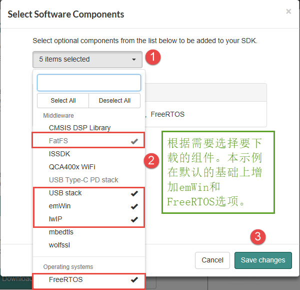
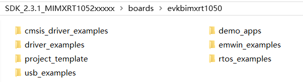
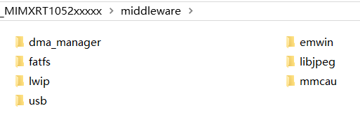

初识固件库
----------

在上一章中，我们构建了几个控制GPIO和IOMUXC外设的函数，算是实现了函数库的雏形，但GPIO还有很多功能函数我们没有实现，而且RT1052芯片不仅仅只有GPIO这一个外设。如果我们想要亲自完成这个函数库，工作量是非常巨大的。NXP公司提供的标准软件库，包含了RT1052芯片所有寄存器的控制操作，我们直接学习如何使用NXP标准库，会极大地方便控制RT1052芯片。

接下来我们简单的分析下NXP官方的固件库的组成部分，在头脑中建立起基本的概念。

获取SDK及固件库
~~~~~~~~~~~~~~~

SDK（Software Development
Kit）是NXP针对其官方评估版的软件开发包，可以在NXP的官网下载到。SDK中包含了各种程序范例，我们心心念念的固件库也包含在它里边。

SDK的下载提供很多选择，下载步骤比较复杂，在本章的配套例程文件夹中包含了SDK的原件，可直接使用。若想亲自到官网下载，请按如下步骤操作，不感兴趣可直接跳过该步骤：

(1) 访问NXP的MCUXpresso平台的链接：https://mcuxpresso.nxp.com/en/dashboard
    。

(2) 未登录的用户需要先登录NXP官网，没有帐号的需要先注册，具体见图 9‑1。

图 9‑1 NXP官网登录页面

(3) 在“SDK Dashboard”页面，点击“Select Development Board”链接，见图
    9‑2。

图 9‑2点击“Select Development Board”

(4) 选择“Processors->i.MX->RT->MIMXRT1052xxxxx”处理器，即我们教程使用的处理器型号，然后点击右侧的“Build MCUXpresso SDK”按钮，具体见图 9‑3。

.. image:: media/image3.png
   :align: center
   :alt: image3
   :name: 图9_3

图 9‑3 选择MIMXRT1052xxxxx处理器，并点击“Build MCUXpresso SDK”

(5) 在弹出页面的Toolchain/IDE一栏可以选择sdk中包含的开发工具范例，有gcc、IAR、Keil等，这里我们直接选择“All toolchains”，都下载下来，具体见图 9‑4。

图 9‑4 选择“All toolchains”

(6) 点击“Add software component”按钮，确认需要增加的组件，具体见图 9‑5。

图 9‑5 点击“Add software component”

(7) 在弹出的选项框中，可以根据自己的需要添加SDK中包含的组件，例如CMSIS DSP库、FatFs文件系统、USB、lwIP协议栈、emwin图形界面库、FreeRTOS实时系统等。有些库占用的空间比较大，且初学的时候不需要那么多的组件，我们在默认的FatFs、USB Stack、lwIP之上增加选项即可，具体见图 9‑6。

图 9‑6 选择需要的组件

(8) 选择完成后点击“Download SDK”按键，准备下载，见图 9‑7。

.. image:: media/image7.png
   :align: center
   :alt: image7
   :name: 图9_7

图 9‑7 点击“Download SDK”

(9) 在弹出的页面点击“Download SDK Archive”和“Download SDK Documentation”即可。其中“SDK Archive”包含SDK的主要文件，“SDK Documentation”主要包含关于SDK的说明文档，具体见图 9‑8。

图 9‑8 在弹出的页面中下载SDK Archive和SDK Documentation

(10) 下载完成并解压可得到SDK主要文件和说明文档两个文件包，具体见图 9‑9。

图 9‑9 SDK Archive和SDK Documentation

SDK目录、文件简介
~~~~~~~~~~~~~~~~~

本书讲解的例程全部采用2.3.1版本SDK的库文件，以下内容请大家打开“SDK_2.3.1_MIMXRT1052xxxxx”的SDK包配合阅读，具体见图 9‑10。

图 9‑10 SDK目录说明

boards：示例程序
^^^^^^^^^^^^^^^^

SDK的boards目录包含了NXP官方评估版i.MX RT1050
EVK的各种示例程序，非常有参考价值。

例如，图 9‑11是“boards\evkmimxrt1050”目录。

图 9‑11 boards\evkmimxrt1050目录下的例程

这些文件夹的说明如下：

-  cmsis_driver_examples提供了一些按照CMSIS标准编写的驱动范例。目前它仅包含I2C、SPI和UART的例子，具体见图
   9‑12。CMSIS是ARM提出的一个编程标准，在下一小节详细讲解。

图 9‑12 cmsis_driver_examples下的内容

-  demo_apps包含了一些应用范例，如串口打印“hello
   world”、使用lwip协议栈进行网络通讯等内容，具体见图 9‑13。

图 9‑13 demo_apps下的程序

-  driver_example包含了RT1052每种片上外设的使用范例，非常详细。例如在“boards\evkmimxrt1050\driver_examples”目录下包含各个外设的程序见图
   9‑14。

图 9‑14 各种外设的示例程序

在其中的“gpio”目录下又包含了使用gpio外设点亮LED灯和中断检测的例子，具体见和图
9‑15。

图 9‑15 boards目录下的gpio示例程序

-  emwin_examples包含了使用emWin图形软件库编写的图形界面示例，使用emWin可以编写出漂亮的界面程序。

-  project_template包含了官方示例使用的一些必备文件，这些文件主要是针对官方评估板做了一些引脚定义、时钟配置等功能，具体见图 9‑16。

图 9‑16 project_template目录下的文件

-  rtos_examples包含了使用FreeRTOS实时操作系统的应用范例，具体见图 9‑17，使用了操作系统可以进行多任务编程。

图 9‑17 rtos_examples目录下的内容

-  usb_examples包含了各种USB程序示例，具体见图 9‑18。USB设备种类繁多且驱动复杂，参考官方的这些示例能快速建立自己需要的USB应用。

图 9‑18 usb_examples下的工程范例（部分）

CMSIS：包含CMSIS标准相关的文件
^^^^^^^^^^^^^^^^^^^^^^^^^^^^^^

SDK的CMSIS目录包含了CMSIS标准相关的文件。

CMSIS标准及库层次关系
'''''''''''''''''''''

因为基于Cortex系列芯片采用的内核都是相同的，区别主要为核外的片上外设的差异，这些差异却导致软件在同内核，不同外设的芯片上移植困难。为了解决不同的芯片厂商生产的Cortex微控制器软件
的兼容性问题，ARM与芯片厂商建立了CMSIS标准(Cortex MicroController
Software Interface Standard)。

所谓CMSIS标准，实际是新建了一个软件抽象层，具体见见图 9‑19。

图 9‑19 CMSIS架构

CMSIS标准中最主要的为CMSIS层，它包括了：

-  CMSIS核心层：其中包含用于访问内核寄存器的名称、地址定义，主要由ARM公司提供。

-  设备外设函数层：提供了片上的核外外设的地址和中断定义，我们所说的固件库基本上是指这部分，主要由芯片生产商提供。

-  CMSIS-DSP层：包含各种DSP处理的运算库函数，主要由ARM公司提供。

-  CMSIS实时系统API层：包含了一些系统接口，主要由系统软件厂商定制。

可见CMSIS层位于硬件层与操作系统或用户层之间，提供了与芯片生产商无关的硬件抽象层，可以为接口外设、实时操作系统提供简单的处理器软件接口，屏蔽了硬件差异，这对软件的移植是有极大的好处的。RT1052的库，就是按照CMSIS标准建立的。
例如关于后面学习的内核定时器Systick，我们甚至直接把STM32芯片控制Systcik部分的代码复制过来，就能直接在RT1052芯片上正常运行，而Systcik通常又是移植实时操作系统的基本组件，所以不同的芯片遵守同样的标准大大降低了迁移芯片平台的开发成本。

CMSIS\Driver目录：片上外设相关的驱动原型
''''''''''''''''''''''''''''''''''''''''

SDK中的CMSIS下又分为CMSIS\Driver和CMSIS\Include目录，它们分别对应CMSI核心层和设备外设函数层的内容。

我们先讲解CMSIS\Driver目录，打开后发现它又包含两个文件夹，具体见图
9‑20。

图 9‑20 CMSIS\Driver目录

这两个目录中包含的文件见图
9‑21，它们分别包含了一些关于片上外设的C源文件和C头文件，如CAN、I2C、USART等外设。

图 9‑21 Driver\DriverTemplates和Driver\Include目录下的文件

以各种芯片通常都会包含的USART外设为例，该外设用于串口通讯，是一种最基础的通讯协议，后面我们也会有专门的章节详细讲解。在这两个目录下的Driver_USART.c和Driver_USART.h文件就是ARM官方基于CMSIS标准针对USART外设编写的原型文件，文件中的内容见代码清单 9‑1和代码清单 9‑2。

.. code-block:: c
   :name: 代码清单 9‑1 Driver_USART.c文件中的函数原型定义（部分）
   :caption: 代码清单 9‑1 Driver_USART.c文件中的函数原型定义（部分）
   :linenos:

   int32_t ARM_USART_Send(const void *data, uint32_t num)
   {
   }

   int32_t ARM_USART_Receive(void *data, uint32_t num)
   {
   }

   int32_t ARM_USART_Transfer(const void *data_out,
                              void *data_in,
                              uint32_t num)
   {
   }

   uint32_t ARM_USART_GetTxCount(void)
   {
   }

   uint32_t ARM_USART_GetRxCount(void)
   {
   }

.. code-block:: c
   :name: 代码清单 9‑2 Driver_USART.h文件中的串口事件定义（部分）
   :caption: 代码清单 9‑2 Driver_USART.h文件中的串口事件定义（部分）
   :linenos:

   /****** USART Event *****/
   #define ARM_USART_EVENT_SEND_COMPLETE       (1UL << 0)  ///< Send completed; 
   #define ARM_USART_EVENT_RECEIVE_COMPLETE    (1UL << 1)  ///< Receive completed
   #define ARM_USART_EVENT_TRANSFER_COMPLETE   (1UL << 2)  ///< Transfer completed
   #define ARM_USART_EVENT_TX_COMPLETE         (1UL << 3)  ///< Transmit completed 
   #define ARM_USART_EVENT_TX_UNDERFLOW        (1UL << 4)  ///< Transmit data not 
   #define ARM_USART_EVENT_RX_OVERFLOW         (1UL << 5)  ///< Receive data overflow
   #define ARM_USART_EVENT_RX_TIMEOUT          (1UL << 6)  ///< Receive character 
   #define ARM_USART_EVENT_RX_BREAK            (1UL << 7)  ///< Break detected on 
   #define ARM_USART_EVENT_RX_FRAMING_ERROR    (1UL << 8)  ///< Framing error detected 
   #define ARM_USART_EVENT_RX_PARITY_ERROR     (1UL << 9)  ///< Parity error detected 
   #define ARM_USART_EVENT_CTS                 (1UL << 10) ///< CTS state changed 
   #define ARM_USART_EVENT_DSR                 (1UL << 11) ///< DSR state changed 
   #define ARM_USART_EVENT_DCD                 (1UL << 12) ///< DCD state changed 
   #define ARM_USART_EVENT_RI                  (1UL << 13) ///< RI  state changed 

在源文件中，可以看到它定义了一些串口可能会使用的函数原型，如ARM_USART_Send用来发送数据、ARM_USART_Receive用来接收串口数据，这些函数都是空函数，函数体内并没有具体的代码，所以ARM也就是提供一个原型，包含返回值、函数名和输入参数，具体代码还是由芯片厂商根据自己的外设来实现。

在头文件中，定义了一些使用串口外设时可能会产生的事件，例如串口外设发送完成后会在寄存器的标志位置1，以告诉用户产生了该事件。截取的这部分代码中定义了ARM_USART_EVENT_SEND_COMPLETE、ARM_USART_EVENT_RECEIVE_COMPLETE这些事件在寄存器中的位置即(1UL
<< 0)表示bit0，(1UL <<
1)表示bit1。要注意的时，在实际的芯片中，一般都跟ARM定义的这些差异很大。

从这两个文件可以了解到，ARM针对核外外设定义了CMSIS标准，相当于完成了软件架构师的工作，把外设驱动的模样大致勾勒出来，只有当芯片厂商针对自己的芯片定制之后，才会有真正可用的外设驱动库函数。

CMSIS\Include目录：内核相关头文件
'''''''''''''''''''''''''''''''''

回到上一层目录，打开SDK中的CMSIS\Include文件夹，会见到图 9‑22中的文件。

图 9‑22 CMSIS\Include目录下的文件

这就是CMSIS核心层，与前面只有架构的外设驱动不同，它们是由ARM公司提供的直接可用的内核驱动文件。具体包含了针对编译环境差异屏蔽的core_compiler.h、cmsis_armcc.h等文件，包含了定义CMSIS版本号的文件cmsis_version.h文件以及针对不同内核寄存器定义的core_cm3.h、core_cm4、core_cm7.h等文件。

例如，我们打开core_cm7.h文件，可以找到它关于内核定时器SysTick的寄存器定义，具体见代码清单
9‑3。

.. code-block:: c
   :name: 代码清单 9‑3 core_cm7.h文件中关于Systick寄存器的定义（部分）
   :caption: 代码清单 9‑3 core_cm7.h文件中关于Systick寄存器的定义（部分）
   :linenos:

   /**
   \brief  Structure type to access the System Timer (SysTick).
   */
   typedef struct {
      __IOM uint32_t CTRL;    /* SysTick Control and Status Register */
      __IOM uint32_t LOAD;    /* SysTick Reload Value Register */
      __IOM uint32_t VAL;     /* SysTick Current Value Register */
      __IM  uint32_t CALIB;   /* SysTick Calibration Register */
   } SysTick_Type;

   /* SysTick Control / Status Register Definitions */
   #define SysTick_CTRL_COUNTFLAG_Pos 16U
   #define SysTick_CTRL_COUNTFLAG_Msk (1UL << SysTick_CTRL_COUNTFLAG_Pos)

   #define SysTick_CTRL_CLKSOURCE_Pos 2U
   #define SysTick_CTRL_CLKSOURCE_Msk (1UL << SysTick_CTRL_CLKSOURCE_Pos)

   #define SysTick_CTRL_TICKINT_Pos   1U
   #define SysTick_CTRL_TICKINT_Msk   (1UL << SysTick_CTRL_TICKINT_Pos)

   #define SysTick_CTRL_ENABLE_Pos    0U
   #define SysTick_CTRL_ENABLE_Msk    (1UL /*<< SysTick_CTRL_ENABLE_Pos*/)

代码中使用了SysTick_Type定义了SysTick的四个寄存器：CRTL、LOAD、VAL以及CALIB，下面还截取了部分关于CTRL寄存器不同配置域位置的定义，如COUNTFLAG域（计数标志）、CLKSOURCE域（时钟源）、TICKINT域（中断配置）以及ENABLE域（使能）。

介绍芯片组成时，我们曾说是芯片厂商向ARM公司购得芯片内核的设计授权，然后直接在ARM内核的基础上增加自己定制的外设并生产的。所以对于采用同样内核架构的芯片，芯片厂一般不会进行改动，由ARM根据自己内核定义出来的CMSIS核心层文件就是直接针对内核可用的文件。例如，分别由NXP和ST公司生产的RT1052和STM32F7芯片，它们都使用ARM的Cortex-M7内核，所以它们使用的内核驱动文件都是ARM针对Cortex-M7提供的core_cm7.h内核文件，是完全一样的，也就是说在这两款芯片中驱动内核定时器SysTick的程序基于同样的core_cm7.h文件定制，所以移植程序时基本不需要做任何改动。

DSP库
'''''

ARM还针对自己的芯片提供了DSP处理的运算库函数，例如定点运算、傅利叶变换、PID算法等。本教程讲解的内容不包含DSP库，有需要的话请按照前面《9.1
获取SDK及固件库》小节下载SDK，且在组件中勾选“CMSIS DSP
Library”项。这样下载得的SDK在“CMSIS\DSP Lib”目录下可找到DSP相关的文件。

devices：RT1052固件库
^^^^^^^^^^^^^^^^^^^^^

SDK中的devices目录包含的内容就是外设驱动固件库，该目录下的MIMXRT1052文件夹即是针对RT1052芯片的固件库，具体见图
9‑23。

图 9‑23 device\MIMXRT1052目录：RT1052固件库

对此目录下的内容说明如下：

MIMXRT1052目录下的全局文件
''''''''''''''''''''''''''

在MIMXRT1052根目录下，可发现它直接包含一些文件，这些文件非常重要，是使用固件库编程最基础的部分，具体见图
9‑24。

图 9‑24 MIMXRT1052目录下的全局文件

-  fsl_device_registers.h文件

..

    fsl_device_registers.h文件的具体内容见代码清单 9‑4。

.. code-block:: c
   :name: 代码清单 9‑4 fsl_device_registers.h文件的主要内容
   :caption: 代码清单 9‑4 fsl_device_registers.h文件的主要内容
   :linenos:

   /*
   * 根据CPU型号包含相应的头文件
   * 在开发环境的全局宏定义中应根据CPU指定芯片型号
   */
   #if (defined(CPU_MIMXRT1052CVL5A) || defined(CPU_MIMXRT1052CVL5B))
   #define MIMXRT1052_SERIES
   /* CMSIS-style 寄存器定义的文件 */
   #include "MIMXRT1052.h"
   /* CPU 特性定义的文件 */
   #include "MIMXRT1052_features.h"

   #else
   #error "No valid CPU defined!"
   #endif

固件库通常可以兼容很多型号的芯片，不同的芯片部分寄存器定义、芯片特性等内容可能会有差异。通过这样的条件编译代码，就可以根据宏来包含不同的头文件，达到兼容不同芯片的目的了。例如代码中宏CPU_MIMXRT1052CVL5A和宏CPU_MIMXRT1052CVL5B的分支下会包含RT1052芯片对应的MIMXRT1052.h以及MIMXRT1052_features.h头文件。可以想像NXP即将推出的RT1060芯片以后可能会在此文件处增加一个宏CPU_MIMXRT1060XXXXX的分支，该分支包含RT1060相关的MIMXRT1060.h头文件，做好兼容的基础。所以在我们使用固件库编程的时候，会在开发环境定义一个全局的用于指定当前CPU型号的宏如“CPU_MIMXRT1052CVL5B”。

-  MIMXRT1052.h文件

..

    在《第8章
    自己写库—构建库函数雏形》章节中我们仿照固件库编写了这个MIMXRT1052.h同名文件，它主要是包含RT1052芯片的各种寄存器定义，是非常重要，非常基础的一个头文件。所以在前面fsl_device_registers.h文件中就根据CPU型号把这个MIMXRT1052.h文件了。该文件中与我们仿写的GPIO相关的内容见代码清单
    9‑5，请亲自打开本文件，找找文件中关于IOMUXC外设的定义。

.. code-block:: c
   :name: 代码清单 9‑5 MIMXRT1052.h文件关于GPIO中的内容（部分）
   :caption: 代码清单 9‑5 MIMXRT1052.h文件关于GPIO中的内容（部分）
   :linenos:

   /** GPIO 寄存器定义 Typedef */
   typedef struct {
      __IO uint32_t DR;         /**< GPIO data register, offset: 0x0 */
      __IO uint32_t GDIR;       /**< GPIO direction register, offset: 0x4 */
      __I  uint32_t PSR;        /**< GPIO pad status register, offset: 0x8 */
      __IO uint32_t ICR1;/**< GPIO interrupt configuration register1, offset: 0xC */
      __IO uint32_t ICR2;/**< GPIO interrupt configuration register2, offset: 0x10 */
      __IO uint32_t IMR;        /**< GPIO interrupt mask register, offset: 0x14 */
      __IO uint32_t ISR;        /**< GPIO interrupt status register, offset: 0x18 */
      __IO uint32_t EDGE_SEL;   /**< GPIO edge select register, offset: 0x1C */
   } GPIO_Type;
   
   /*
   * 寄存器掩码定义
   */
   
   /*! @name DR - GPIO data register */
   #define GPIO_DR_DR_MASK     (0xFFFFFFFFU)
   #define GPIO_DR_DR_SHIFT    (0U)
   #define GPIO_DR_DR(x)       (((uint32_t)(((uint32_t)(x)) << GPIO_DR_DR_SHIFT))\
                              & GPIO_DR_DR_MASK)
   
   /*! @name GDIR - GPIO direction register */
   #define GPIO_GDIR_GDIR_MASK   (0xFFFFFFFFU)
   #define GPIO_GDIR_GDIR_SHIFT  (0U)
   #define GPIO_GDIR_GDIR(x)   (((uint32_t)(((uint32_t)(x)) << GPIO_GDIR_GDIR_SHIFT))\
                                 & GPIO_GDIR_GDIR_MASK)
   /* 部分省略...*/
   
   /* GPIO外设基地址及指针 */
   #define GPIO1_BASE           (0x401B8000u)
   #define GPIO1                ((GPIO_Type *)GPIO1_BASE)
   #define GPIO2_BASE           (0x401BC000u)
   #define GPIO2                ((GPIO_Type *)GPIO2_BASE)
   #define GPIO3_BASE           (0x401C0000u)
   #define GPIO3                ((GPIO_Type *)GPIO3_BASE)
   #define GPIO4_BASE           (0x401C4000u)
   #define GPIO4                ((GPIO_Type *)GPIO4_BASE)
   #define GPIO5_BASE           (0x400C0000u)
   #define GPIO5                ((GPIO_Type *)GPIO5_BASE)

-  MIMXRT1052_features.h文件

..

    此文件主要定义了一些关于RT1052芯片特性的内容，例如你想知道本芯片有多少个LPSPI外设或LPUART外设，可以在本文件中找到，具体见代码清单
    9‑6。在前面的fsl_device_registers.h的内容中也包含了本文件。

.. code-block:: c
   :name: 代码清单 9‑6 MIMXRT1052_features.h文件中关于LPSPI、LPUART外设数量的定义
   :caption: 代码清单 9‑6 MIMXRT1052_features.h文件中关于LPSPI、LPUART外设数量的定义
   :linenos:

   #define FSL_FEATURE_SOC_LPSCI_COUNT (0)
   /* @brief LPSPI availability on the SoC. */
   #define FSL_FEATURE_SOC_LPSPI_COUNT (4)
   /* @brief LPTMR availability on the SoC. */
   #define FSL_FEATURE_SOC_LPTMR_COUNT (0)
   /* @brief LPTPM availability on the SoC. */
   #define FSL_FEATURE_SOC_LPTPM_COUNT (0)
   /* @brief LPUART availability on the SoC. */
   #define FSL_FEATURE_SOC_LPUART_COUNT (8)

-  system_MIMXRT1052.c\h文件

system_MIMXRT1052包含一个源文件和头文件。其中头文件system_MIMXRT1052.h中主要包含时钟、晶振定义以及源文件相应函数的声明，具体见代码清单
9‑7。

.. code-block:: c
   :name: 代码清单 9‑7 system_MIMXRT1052.h文件中关于时钟频率的定义
   :caption: 代码清单 9‑7 system_MIMXRT1052.h文件中关于时钟频率的定义
   :linenos:

   /* 定义时钟源的值 */
   /* 外部晶振频率 */
   #define CPU_XTAL_CLK_HZ                24000000UL
   /* 默认系统时钟频率 */
   #define DEFAULT_SYSTEM_CLOCK           528000000UL

而源文件system_MIMXRT1052.c中则主要包含系统初始化和配置系统时钟的函数，例如前面我们以空函数代替的SystemInit函数，在这个文件中有了完整的定义，具体见代码清单9‑8。

.. code-block:: c
   :name: 代码清单 9‑8 system_MIMXRT1052.c中的SystemInit函数定义
   :caption: 代码清单 9‑8 system_MIMXRT1052.c中的SystemInit函数定义
   :linenos:

   void SystemInit (void)
   {
   #if ((__FPU_PRESENT == 1) && (__FPU_USED == 1))
      /* set CP10, CP11 Full Access */
      SCB->CPACR |= ((3UL << 10*2) | (3UL << 11*2));
   #endif /* ((__FPU_PRESENT == 1) && (__FPU_USED == 1)) */

   #if defined(__MCUXPRESSO)
   // Vector table defined in startup code
      extern uint32_t g_pfnVectors[];
      SCB->VTOR = (uint32_t)g_pfnVectors;
   #endif

      /* Watchdog disable */

   #if (DISABLE_WDOG)
      if (WDOG1->WCR & WDOG_WCR_WDE_MASK) {
         WDOG1->WCR &= ~WDOG_WCR_WDE_MASK;
      }
      if (WDOG2->WCR & WDOG_WCR_WDE_MASK) {
         WDOG2->WCR &= ~WDOG_WCR_WDE_MASK;
      }
      RTWDOG->CNT = 0xD928C520U; /* 0xD928C520U is the update key */
      RTWDOG->TOVAL = 0xFFFF;
      RTWDOG->CS = (uint32_t) ((RTWDOG->CS) &
                              ~RTWDOG_CS_EN_MASK) |
                  RTWDOG_CS_UPDATE_MASK;
   #endif /* (DISABLE_WDOG) */

      /* Disable Systick which might be enabled by bootrom */
      if (SysTick->CTRL & SysTick_CTRL_ENABLE_Msk) {
         SysTick->CTRL &= ~SysTick_CTRL_ENABLE_Msk;
      }

      /* Enable instruction and data caches */
   #if defined(__ICACHE_PRESENT) && __ICACHE_PRESENT
      SCB_EnableICache();
   #endif
   #if defined(__DCACHE_PRESENT) && __DCACHE_PRESENT
      SCB_EnableDCache();
   #endif

   }

该函数默认关闭了看门狗、内核定时器等部件，并使能了代码缓冲功能加快指令获取与执行的速度，所以使用库的好处是大大的，我们都没搞清楚这些外设的功能，库就帮我们实现好了，看注释或函数名就可以知道大概作用。

-  MIMXRT1052.xml文件

MIMXRT1052.xml文件是NXP的开发环境MCUXpresso需要的一些记录信息，此处不作介绍。

arm、gcc、iar及mcuxpresso目录
'''''''''''''''''''''''''''''

在不同的编译平台下，使用汇编语言编写的启动文件、各种版本的分散加载文件的语法稍有区别，所以固件库把这些内容放在独立的文件夹。arm、gcc、iar和mcuxpresso文件夹分别对应KEIL、ARM-GCC、IAR和NXP的MCUxpresso开发环境，这些文件夹内的文件功能是一样的。以arm（KEIL开发环境）为例，该目录下的文件具体见图
9‑23。

图 9‑25 arm平台的启动文件和分散加载文件

在前面构建寄存器版本的工程时，我们已经使用到了其中的MIMXRT1052xxxxx_flexspi_nor及startup_MIMXRT1052.s文件，主要用于配置存储器分配和提供芯片启动时运行的代码指令，其它三个文件跟MIMXRT1052xxxxx_flexspi_nor是同类型的，只是它们针对不同的存储器和不同的应用场景。文件的内容在以后的章节再进行讲解。

MIMXRT1052\cmsis_drivers目录
''''''''''''''''''''''''''''

cmsis_drivers目录下包含了一些NXP严格根据CMSIS标准编写的外设驱动文件，主要包含UART、I2C及SPI这三种最常用的通讯的外设，具体见图
9‑26。

图 9‑26 cmsis_drivers目录下的内容

因为要做到兼容CMSIS标准，为了通用，那么总会有些外设特有的功能没法加进去，所以平时如果不是特别在乎其它平台的可移植性，通常会使用另外专有的外设驱动。

MIMXRT1052\drivers目录
''''''''''''''''''''''

drivers目录是固件库的主体，有时我们把这些文件称为外设驱动库，具体见图
9‑27。

图 9‑27 drivers文件夹下的内容

-  这些文件都使用fsl_xxx.c/h的命名格式，其中xxx是对应的片上外设名字，如ADC、GPIO、UART、I2C、SPI等外设，大部分外设包含一个C源文件和头文件。

-  在前面《第8章 自己写库—构建库函数雏形》章节中介绍的仿照NXP固件库编写的fsl_gpio.c\h以及fsl_iomuxc.h文件，原型就来自此处。官方这些文件的内容比我们讲解的更加丰富，请亲自打开这些文件浏览一下。

-  当使用到某个外设时，我们会把此处对应的外设驱动源文件添加到工程中，加入编译，对于没有源文件的IOMUXC外设，则直接使用“#include”包含其头文件fsl_iomuxc.h。

-  特别地，其中的fsl_common.c和fsl_common.h中的common不是RT1052芯片的某个外设名字，它表示绝大多数工程都会需要这些“共同”的内容，所以一般工程都会添加这个fsl_common.c文件，并且可以通过fsl_common.h文件包含前面介绍的fsl_device_registers.h头文件，达到最终包含具有大量寄存器定义的MIMXRT1052.h核心头文件的目的，具体见代码清单 9‑9。所以通常我们在编写源文件的时候，第一件事就是：#include “fsl_common.h”。

.. code-block:: c
   :name: 代码清单 9‑9 fsl_common.h文件中对其它头文件的包含（部分）
   :caption: 代码清单 9‑9 fsl_common.h文件中对其它头文件的包含（部分）
   :linenos:

   #include <assert.h>
   #include <stdbool.h>
   #include <stdint.h>
   #include <string.h>
   #include <stdlib.h>

   #if defined(__ICCARM__)
   #include <stddef.h>
   #endif
   
   #include "fsl_device_registers.h"

-  在这个drivers目录下有专门的fsl_lpuart、fsl_lpi2c以及fsl_lpspi文件，这些文件与前面cmsis_drivers目录下的fsl_lpuart_cmsis、fsl_lpi2c_cmsis和fsl_lpspi_cmsis文件都是针对UART、I2C和SPI这三个外设编写的驱动文件，不过drivers目录下的文件侧重于把芯片外设的功能特性都尽可能展现出来，而cmsis_drivers目录下的文件因为注重CMSIS标准的兼容性所以功能有所裁剪。

MIMXRT1052\project_template目录
'''''''''''''''''''''''''''''''

这个MIMXRT1052\project_template目录与前面boards\project_template目录下都具有同名的文件，都是设计用于进行引脚定义、时钟配置功能的文件，具体见图
9‑28，虽然文件名相同，但里边的内容是不同的，MIMXRT1052\project_template目录下的文件是boards\project_template中的文件的原型，即此目录下的文件大多只提供一个空壳，而boards\project_template中的文件则是根据官方评估板做的定制。

图 9‑28 MIMXRT1052\project_template目录下的内容

按照官方的设计，主要是希望把引脚、时钟相关的内容都统一放在这些文件中，但我们认为这样并不方便大家理解与移植，所以在后面我们建立工程时，会把引脚、时钟相关的内容放在使用到的外设文件中。

MIMXRT1052\template目录
'''''''''''''''''''''''

这个template目录下的内容具体见图
9‑29，它是针对KEIL软件的RTE功能提供的外设驱动原型，目前还不完善，此处不作介绍。

.. image:: media/image28.png
   :align: center
   :alt: image28
   :name: 图9_28

图 9‑29 MIMXRT1052\template目录下的文件

MIMXRT1052\utilities目录
''''''''''''''''''''''''

utilities是实用工具集的意思，此目录下包含了开发常用的一些调试工具，如串口输出、运行日志、通知功能以及shell，通常我们都会把这些文件加到工程以方便开发。

图 9‑30 MIMXRT1052\utilities目录下的内容

MIMXRT1052\xip目录
''''''''''''''''''

MIMXRT1052\xip目录下的文件具体见图 9‑31，这些文件主要是在NOR
Flash存储器使用XIP（executed in place）功能时需要的启动或加载程序。

.. image:: media/image30.png
   :align: center
   :alt: image30
   :name: 图9_30

图 9‑31 MIMXRT1052\xip目录下的文件

docs：部分说明文档
^^^^^^^^^^^^^^^^^^

回到SDK的根目录，打开它的docs文件夹，可见到文件夹中包含图 9‑32中的内容。

图 9‑32 SDK的docs目录下的内容

这目录下主要是《Getting Started with MCUXpresso SDK for i.MX RT1050
Derivatives》文件比较有用，它介绍了使用官方评估板时的基础使用步骤。

其它关于固件库的各种文档说明NXP都整理到专门的文档包里了，即我们下载SDK包中的“SDK_2.3.1_MIMXRT1052xxxxx_doc”文件中，稍后再说明。

middleware：中间件
^^^^^^^^^^^^^^^^^^

SDK中的middleware文件夹主要包含一些中间层软件，即这些软件常为应用层提供一些协议、架构上的支撑，它的主要部分又与芯片底层的硬件外设驱动(前面drivers目录中的文件)联系不甚紧密，是不同芯片之间通用的一些构件，具体见图
9‑33。

图 9‑33 middleware目录下的内容

各个文件中间件的简要说明如下：

-  dma_manager：这部分用于管理芯片的DMA外设。

-  emwin：这是应用广泛的嵌入式图形软件库，使用它提供的函数可以轻松开发出漂亮的图形界面。

-  fatfs：这是一个嵌入式常用的文件系统，有了文件系统后能更好地管理存储器以及使用通用的文件形式来访问存储器。

-  libjpeg：这是JPEG的编码解码库，使用它可以解析或生成JPEG格式的图片。

-  lwip：这是嵌入式常用网络TCP/IP协议栈，使用协议栈可以方便地接入网络。

-  sdmmc：它是遵照SDIO协议编写的集成识别、读写SD存储卡功能的驱动。

-  usb：包含了遵照USB协议编写的基本驱动，在它之上可方便地编写USB应用程序。

rtos：实时操作系统
^^^^^^^^^^^^^^^^^^

SDK目录下的rtos文件夹包含了FreeRTOS实时操作系统的源代码及移植范例，使用操作系统可进行多任务编程，具体见图
9‑34。

图 9‑34 rtos文件夹下的内容

tools：开发工具
^^^^^^^^^^^^^^^

tools包含了一些开发工具，如cmake，该工具可用于生成GCC开发环境编译需要的makefile文件，具体见图
9‑35。

图 9‑35 tools\cmake_toolchain_files目录的内容

其它
^^^^

在SDK的根目录下还包含了几个xml和txt文件，具体见图
9‑36。它们主要是包含MCUXpresso生成的信息和SDK第三方构件的一些版权、出处说明。

图 9‑36SDK根目录下的xml和txt文件

库各文件间的关系
~~~~~~~~~~~~~~~~

接下来从整体上把握一下各个文件在库工程中的层次或关系，具体见图 9‑37。

图 9‑37使用固件库开发的程序架构

前面提到的CMSIS文件夹、Drivers文件夹、Middleware文件夹以及RTOS文件夹在该图都可以找到对应的层次位置，它们共同构成我们的应用程序。

具体到单个库文件对应到CMSIS标准架构上的位置可参考图
9‑38，现在看这个图可能还会有很多疑惑，可以带着疑惑继续学习，经过后面的学习再回头看这个图会有更深刻的认识。

图 9‑38 库各文件关系

该图描述了RT1052库各文件之间的调用关系，它省略了DSP核和实时系统层部分的文件关系。在实际的使用库开发工程的过程中，我们把位于CMSIS层的文件包含进工程，这些文件丝毫不用修改，也不建议修改。

对于位于用户层的几个文件，就是我们在使用库的时候，针对不同的应用对库文件进行增删（用条件编译的方法增删）和改动的文件。其中用户层的board.c\h、pin_mux.c\h以及clock_config.c\h文件是官方提供的配置定义板级设备引脚、复用以及外设时钟的模板文件，为了更易理解和移植，我们配套的例程将会对这些进行调整，即把这些配置放在其它文件中。

SDK_doc帮助文档目录、文件说明
~~~~~~~~~~~~~~~~~~~~~~~~~~~~~

我坚信，授之以鱼不如授之以渔。官方资料是所有关于RT1052知识的源头，所以在本小节介绍如何使用官方资料。官方的帮助手册，是最好的教程，几乎包含了所有在开发过程中遇到的问题。

按照《9.1
获取SDK及固件库》介绍的方式下载得到的另一个是SDK_2.3.0_MIMXRT1052xxxxx_doc包，见图
9‑39它包含SDK中各模块的帮助文档。

图 9‑39 SDK_doc帮助文档包

打开它下面的docs目录后具体内容见图 9‑40。

图 9‑40各种帮助文档

这当中最重要的当属“MCUXpresso SDK API Reference Manual_MIMXRT105x”文件夹以及《MCUXpresso SDK API Reference Manual_MIMXRT105x.pdf》文件，它们就是关于固件外设驱动库的参考手册，它们分别以网页以及pdf文档的形式展现，内容是一样的，可根据自己的喜好选择阅读，后面把它们简称API参考手册或库函数帮助文档。其它几个文件夹则分别对应lwIP、RTOS以及USB组件的说明文档。

初识库函数
^^^^^^^^^^

所谓库函数，就是RT1052的库文件中为我们编写好的函数接口，我们只要调用这些库函数，就可以对RT1052进行配置，达到控制目的。我们可以不知道库函数是如何实现的，但我们调用函数必须要知道函数的功能、可传入的参数及其意义、和函数的返回值。

于是，有读者就问那么多函数我怎么记呀？我的回答是：会查就行了，哪个人记得了那么多。所以学会查阅库帮助文档
是很有必要的。

初步了解了一下库函数，读者就可以发现RT1052的库是写得很优美的。每个函数和数据类型都符合见名知义的原则，当然，这样的名称写起来特别长，而且对于我们来说要输入这么长的英文，很容易出错，所以在开发软件的时候，在用到库函数的地方，直接把库帮助文档中的函数名称复制粘贴到工程文件就可以了。而且，配合MDK软件的代码自动补全功能，可以减少输入量。

使用pdf版API参考手册
^^^^^^^^^^^^^^^^^^^^

打开pdf版的API参考手册，并展开书签栏，可以看到文档按照外设名字分成了不同的章节，具体见图
9‑41。

图 9‑41 pdf版API参考手册中关于GPIO的描述

API文档中各个章节围绕fsl_xxx.c驱动文件进行说明。以GPIO章节为例，它的GPIO Driver栏目下又包含了典型应用（Typical use case）、数据结构说明（Data Structure Documentation）、宏定义说明（Macro Definition Documentation）、枚举类型说明（Enumeration Type Documentation）以及函数说明（Function Documentation）。

点击对应的栏目，可以快速找到自己需要的内容，如图中的右侧是关于GPIO_PinWrite函数的说明，其下使用表格阐述了该函数的“base”、“pin”及“output”参数的可选输入内容。

使用网页版API参考手册
^^^^^^^^^^^^^^^^^^^^^

网页版的API参考手册在docs\MCUXpresso SDK API Reference
Manual_MIMXRT105x文件夹下，使用浏览器打开该目录下的《arch.html》文件可打开API参考手册，具体见图
9‑42。

图 9‑42使用浏览器打开arch.html文件

打开该文件后，部分浏览器可能会禁止一些功能，导致无法显示导航标签，点击提示栏，然后选择“允许阻止的内容”即可，具体见图
9‑43。

图 9‑43 浏览器中“允许阻止的内容”

图 9‑44是网页版参考手册中GPIO部分的说明，可通过左侧的导航栏“API
Reference->GPIO->GPIO
Driver”部分找到。相对来说，网页版的API参考手册更加友好，方便查阅，也方便复制。

图 9‑44 GPIO部分的说明

程序Doxygen风格注释与API参考手册
^^^^^^^^^^^^^^^^^^^^^^^^^^^^^^^^

实际上，无论是pdf还是网页版的API参考手册，它们的说明来源都是程序注释，所以在更多的时候，我们都是直接查看工程中的固件库源代码注释来了解如何使用。例如，在fsl_gpio.h文件中可以找到GPIO_PinWrite函数的声明，在该声明前面包含了很详细的注释，具体见代码清单
9‑10。

.. code-block:: c
   :name: 代码清单 9‑10 fsl_gpio.h文件中的Doxygen注释风格示例
   :caption: 代码清单 9‑10 fsl_gpio.h文件中的Doxygen注释风格示例
   :linenos:

   /*!
   * @brief Sets the output level of the individual GPIO pin to logic 1 or 0.
   *
   * @param base GPIO base pointer.
   * @param pin GPIO port pin number.
   * @param output GPIOpin output logic level.
   *        - 0: corresponding pin output low-logic level.
   *        - 1: corresponding pin output high-logic level.
   */
   void GPIO_PinWrite(GPIO_Type* base, uint32_t pin, uint8_t output);

这些注释包含了一些奇怪的内容，如“\/\*！”、“@brief”、“@param”等，这些并不是C语言的注释要求，而是一种被称为“Doxygen”的注释风格，使用其同名的软件，可以根据这种注释风格的代码自动生成API文档。也就是说，前面的pdf及网页版文件都是根据这些注释生成的，所以查询的时候看哪个就按自己的喜好即可。关于Doxygen注释风格此处不展开讲解，感兴趣可自行查阅相关资料。

其它常用官方资料
~~~~~~~~~~~~~~~~

除了SDK中的API参考手册外，我们还常常查询以下介绍芯片功能特性的文档，这些资料已整理到了本书附录资料的“芯片文档”文件夹中。

-  《IMXRT1050RM》（参考手册）

这个文件全方位介绍了RT1052芯片的各种片上外设，它把RT1052的时钟、存储器架构、及各种外设、寄存器都描述得清清楚楚。当我们对RT1052的外设感到困惑时，可查阅这个文档。以直接配置寄存器方式开发的话，查阅这个文档寄存器部分的频率会相当高，但这样开发效率太低了。

-  《IMXRT1050CEC》（数据手册）

本文档相当于RT1052的datasheet，包含了RT1052芯片的芯片架构、外设列表和芯片电器特性等说明。是制作硬件电路时常常参考的文档。

-  《DDI0489D_cortex_m7_trm》(Cortex-M7技术参考手册)。

这个手册是由ARM公司提供的，它详细讲解了Cortex内核的架构和特性，要深入了解Cortex-M内核，这是首选，经典中的经典。
